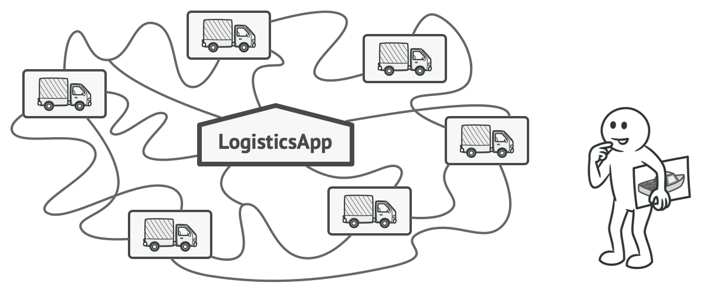
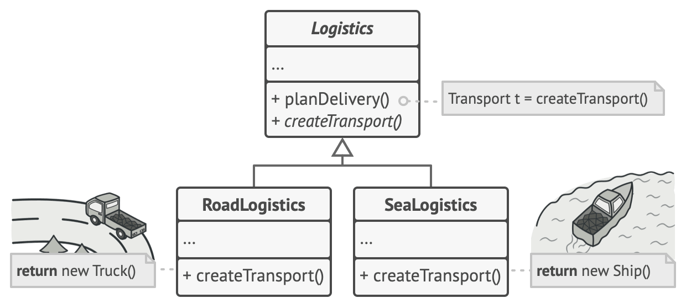
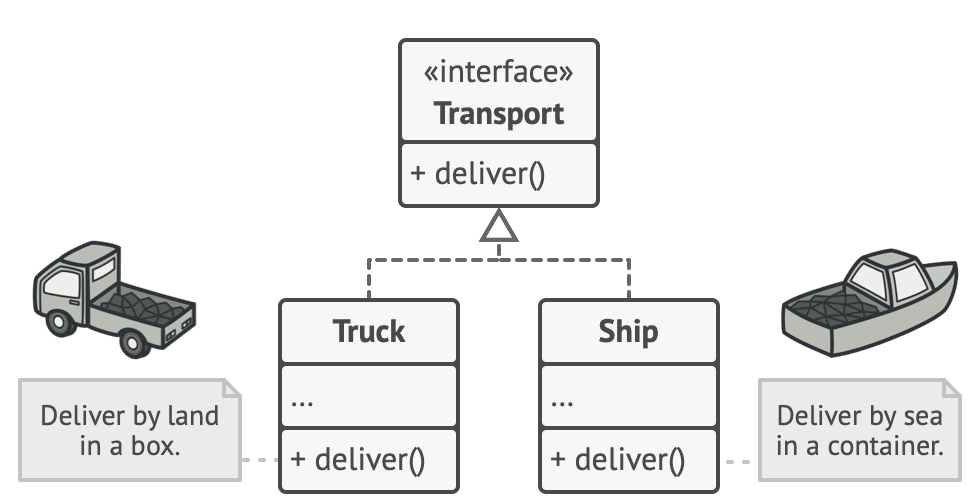
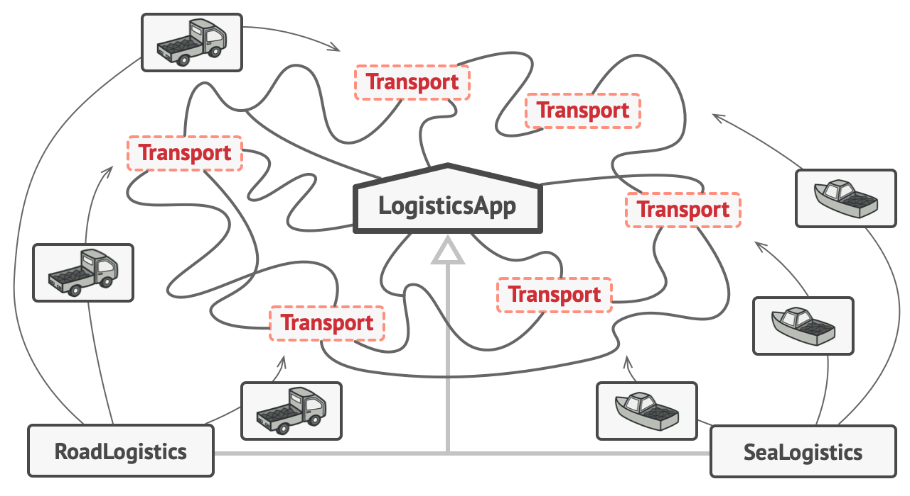
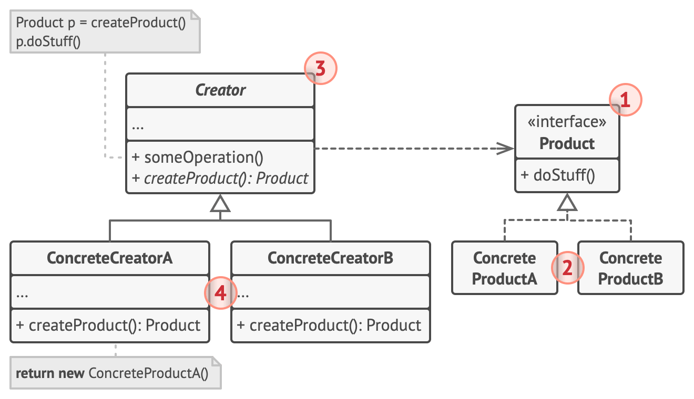
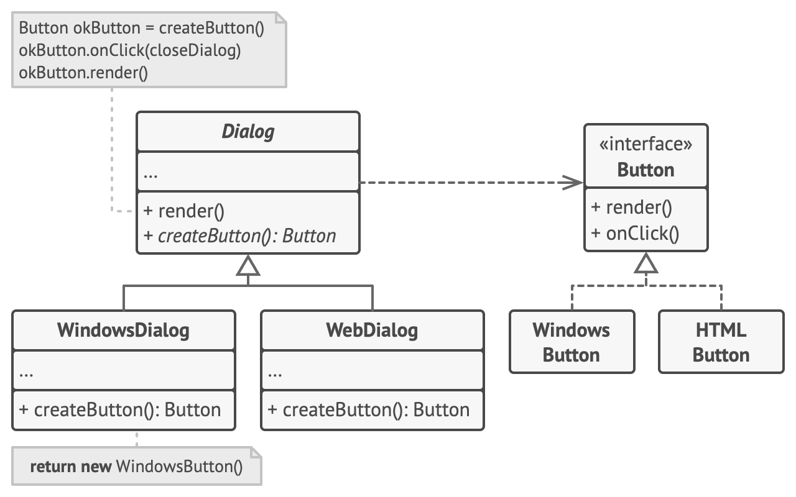

# Factory Method


**Type:** Creational · **Also known as:** Virtual Constructor

> **The 10-second version:** stop writing `new Truck()` in the middle of your business logic. Put the `new` behind a method that subclasses can override. Now the business logic never needs to know which concrete class it's working with.

<br clear="all">

## Quick card

| | |
|---|---|
| **Problem it solves** | Your code is welded to one concrete class, and adding a second one means editing everything. |
| **Core move** | Replace `new ConcreteThing()` with a call to an overridable `createThing()` method. |
| **You'll recognise it by** | A method whose *return type* is an interface but whose *body* does `new SomethingConcrete()`. |
| **Rating** | Complexity ★☆☆ · Popularity ★★★ |
| **Closest relatives** | Abstract Factory (many products), Template Method (Factory Method is a specialised step of it), Simple Factory (not a real GoF pattern) |
| **In your stack** | `IPaymentGateway` creation in C#, transport/driver selection in Node, `IDbConnection` factories, consumer construction per RabbitMQ queue |

### How to read this file

Every section goes **technical first, plain English second**. Wherever you see 🗣️ **In plain words**, that's the "explain it like I'm tired on a Friday" version. Part 1 is the pattern as Refactoring.Guru teaches it (with their diagrams). Parts 2–7 are code, your stack, and the stuff that makes it stick.

---

# PART 1 — The pattern

## 1. Intent

**Factory Method** is a creational design pattern that provides an interface for creating objects in a superclass, but allows subclasses to alter the type of objects that will be created.


### 🗣️ In plain words

A parent class says *"somebody will give me a Button, and I'll use it."* It doesn't say which button. Each child class answers *"here, use **my** kind of button."* The parent's code never changes; the children just swap out what gets handed over.

The important bit that trips people up: **the pattern is not about creating objects.** It's about the code that *uses* those objects never learning their concrete type.

---

## 2. Problem

Imagine that you’re creating a logistics management application. The first version of your app can only handle transportation by trucks, so the bulk of your code lives inside the `Truck` class.

After a while, your app becomes pretty popular. Each day you receive dozens of requests from sea transportation companies to incorporate sea logistics into the app.



*Adding a new class to the program isn’t that simple if the rest of the code is already coupled to existing classes.*

Great news, right? But how about the code? At present, most of your code is coupled to the `Truck` class. Adding `Ships` into the app would require making changes to the entire codebase. Moreover, if later you decide to add another type of transportation to the app, you will probably need to make all of these changes again.

As a result, you will end up with pretty nasty code, riddled with conditionals that switch the app’s behavior depending on the class of transportation objects.

### 🗣️ In plain words

You wrote a delivery app. Version 1 only had trucks, so `new Truck()` is sprinkled across 40 files. Now the business wants ships.

You have two bad options:

1. **`if (type == "truck") ... else if (type == "ship") ...`** in all 40 files. Next quarter they add planes and you do it again.
2. Rewrite everything. Nobody's paying for that.

The root cause is that **your business logic knows the name of a concrete class**. That's the coupling you want to cut.

---

## 3. Solution

The Factory Method pattern suggests that you replace direct object construction calls (using the `new` operator) with calls to a special *factory* method. Don’t worry: the objects are still created via the `new` operator, but it’s being called from within the factory method. Objects returned by a factory method are often referred to as *products.*



*Subclasses can alter the class of objects being returned by the factory method.*

At first glance, this change may look pointless: we just moved the constructor call from one part of the program to another. However, consider this: now you can override the factory method in a subclass and change the class of products being created by the method.

There’s a slight limitation though: subclasses may return different types of products only if these products have a common base class or interface. Also, the factory method in the base class should have its return type declared as this interface.



*All products must follow the same interface.*

For example, both `Truck` and `Ship` classes should implement the `Transport` interface, which declares a method called `deliver`. Each class implements this method differently: trucks deliver cargo by land, ships deliver cargo by sea. The factory method in the `RoadLogistics` class returns truck objects, whereas the factory method in the `SeaLogistics` class returns ships.



*As long as all product classes implement a common interface, you can pass their objects to the client code without breaking it.*

The code that uses the factory method (often called the *client* code) doesn’t see a difference between the actual products returned by various subclasses. The client treats all the products as abstract `Transport`. The client knows that all transport objects are supposed to have the `deliver` method, but exactly how it works isn’t important to the client.

### 🗣️ In plain words

Three moves, in order:

1. **Make the products interchangeable.** `Truck` and `Ship` both implement `Transport`, which has `deliver()`. Now code that only needs "something that delivers" doesn't care which it gets.
2. **Move the `new` into one method.** Instead of `new Truck()` inline, call `this.createTransport()`. The `new` still happens — just in one overridable place.
3. **Let subclasses answer the question.** `RoadLogistics.createTransport()` returns a `Truck`. `SeaLogistics.createTransport()` returns a `Ship`. The shared planning logic in the base class is written once and works for both.

> **The mental shift:** you're not "hiding object creation". You're *moving the decision of which class to use* from 40 call sites down to 1 overridable method — and then letting inheritance pick the answer.

---

## 4. Real-world analogy

Refactoring.Guru doesn't give one for this pattern, so here are two of mine.

**The hiring manager.** A manager's job description says: "run the standup, assign tickets, review output." It never says *who* is on the team. A frontend manager staffs the team with frontend engineers; a data manager staffs it with data engineers. The *process* (the base class) is identical; the *staffing method* (the factory method) is overridden. The manager's daily routine code never mentions "React developer".

**The franchise kitchen.** McDonald's corporate writes the process: take order → cook patty → assemble → serve. The India franchise's `makePatty()` returns a chicken patty; the US franchise's returns beef. Head office never rewrites the process manual per country — it just says "`makePatty()` is your job."

---

## 5. Structure



1. The **Product** declares the interface, which is common to all objects that can be produced by the creator and its subclasses.
2. **Concrete Products** are different implementations of the product interface.
3. The **Creator** class declares the factory method that returns new product objects. It’s important that the return type of this method matches the product interface.

   You can declare the factory method as `abstract` to force all subclasses to implement their own versions of the method. As an alternative, the base factory method can return some default product type.

   Note, despite its name, product creation is **not** the primary responsibility of the creator. Usually, the creator class already has some core business logic related to products. The factory method helps to decouple this logic from the concrete product classes. Here is an analogy: a large software development company can have a training department for programmers. However, the primary function of the company as a whole is still writing code, not producing programmers.
4. **Concrete Creators** override the base factory method so it returns a different type of product.

   Note that the factory method doesn’t have to **create** new instances all the time. It can also return existing objects from a cache, an object pool, or another source.

### 🗣️ Participants & roles — cheat table

| Role | What it actually is in your code | Factory Method example | Your codebase equivalent |
|---|---|---|---|
| **Product** | An interface / abstract class | `Button`, `Transport` | `IPaymentGateway` |
| **Concrete Product** | The real class doing real work | `WindowsButton`, `Truck` | `RazorpayGateway`, `PayuGateway` |
| **Creator** | The class with the *business logic*, plus an overridable `createX()` | `Dialog`, `Logistics` | `CheckoutService` |
| **Concrete Creator** | Subclass that answers "which product" | `WindowsDialog`, `RoadLogistics` | `IndiaCheckoutService` |

**The single most important row is "Creator".** Beginners think the Creator is a factory class whose job is making things. It isn't. The Creator is a class that *already had a job* — rendering a dialog, planning a delivery, running a checkout — and the factory method is a small hole punched in it so subclasses can swap the parts it works with.

### 🤝 Collaboration — who calls whom

```
Client
  │
  │  1. calls a normal business method
  ▼
Creator.render()                     ← the base class's real logic lives here
  │
  │  2. needs a product, so calls its OWN factory method
  ▼
this.createButton()                  ← virtual dispatch kicks in here
  │
  │  3. the SUBCLASS's override actually runs
  ▼
WindowsDialog.createButton()
  │
  │  4. returns a concrete product, typed as the interface
  ▼
Button  (actually a WindowsButton)
  │
  │  5. Creator uses it through the interface only
  ▼
button.render() / button.onClick()
```

Step 2→3 is the whole pattern. The base class calls a method on itself, and polymorphism means the subclass's version runs. That's it.

---

## 6. Pseudocode (the website's example)

This example illustrates how the **Factory Method** can be used for creating cross-platform UI elements without coupling the client code to concrete UI classes.



*The cross-platform dialog example.*

The base `Dialog` class uses different UI elements to render its window. Under various operating systems, these elements may look a little bit different, but they should still behave consistently. A button in Windows is still a button in Linux.

When the factory method comes into play, you don’t need to rewrite the logic of the `Dialog` class for each operating system. If we declare a factory method that produces buttons inside the base `Dialog` class, we can later create a subclass that returns Windows-styled buttons from the factory method. The subclass then inherits most of the code from the base class, but, thanks to the factory method, can render Windows-looking buttons on the screen.

For this pattern to work, the base `Dialog` class must work with abstract buttons: a base class or an interface that all concrete buttons follow. This way the code within `Dialog` remains functional, whichever type of buttons it works with.

Of course, you can apply this approach to other UI elements as well. However, with each new factory method you add to the `Dialog`, you get closer to the [Abstract Factory](https://refactoring.guru/design-patterns/abstract-factory) pattern. Fear not, we’ll talk about this pattern later.

```
// The creator class declares the factory method that must
// return an object of a product class. The creator's subclasses
// usually provide the implementation of this method.
class Dialog is
    // The creator may also provide some default implementation
    // of the factory method.
    abstract method createButton():Button

    // Note that, despite its name, the creator's primary
    // responsibility isn't creating products. It usually
    // contains some core business logic that relies on product
    // objects returned by the factory method. Subclasses can
    // indirectly change that business logic by overriding the
    // factory method and returning a different type of product
    // from it.
    method render() is
        // Call the factory method to create a product object.
        Button okButton = createButton()
        // Now use the product.
        okButton.onClick(closeDialog)
        okButton.render()

// Concrete creators override the factory method to change the
// resulting product's type.
class WindowsDialog extends Dialog is
    method createButton():Button is
        return new WindowsButton()

class WebDialog extends Dialog is
    method createButton():Button is
        return new HTMLButton()

// The product interface declares the operations that all
// concrete products must implement.
interface Button is
    method render()
    method onClick(f)

// Concrete products provide various implementations of the
// product interface.
class WindowsButton implements Button is
    method render(a, b) is
        // Render a button in Windows style.
    method onClick(f) is
        // Bind a native OS click event.

class HTMLButton implements Button is
    method render(a, b) is
        // Return an HTML representation of a button.
    method onClick(f) is
        // Bind a web browser click event.

class Application is
    field dialog: Dialog

    // The application picks a creator's type depending on the
    // current configuration or environment settings.
    method initialize() is
        config = readApplicationConfigFile()

        if (config.OS == "Windows") then
            dialog = new WindowsDialog()
        else if (config.OS == "Web") then
            dialog = new WebDialog()
        else
            throw new Exception("Error! Unknown operating system.")

    // The client code works with an instance of a concrete
    // creator, albeit through its base interface. As long as
    // the client keeps working with the creator via the base
    // interface, you can pass it any creator's subclass.
    method main() is
        this.initialize()
        dialog.render()
```

### 🗣️ Reading that pseudocode

- `Dialog.render()` is **business logic** and it's written **once**.
- `Dialog.createButton()` is **abstract** — it's a question, not an answer.
- `WindowsDialog` and `WebDialog` each answer the question differently.
- `Dialog` only ever touches `Button` (the interface). It has never heard of `WindowsButton`.
- The `Application.initialize()` bit — reading config and picking a subclass — is the **one place** in the entire program that mentions a concrete class. That's the goal: push the ugly `if` to the edge (composition root), keep the core clean.

---

## 7. Applicability — when to reach for it

**Use the Factory Method when you don’t know beforehand the exact types and dependencies of the objects your code should work with.**

The Factory Method separates product construction code from the code that actually uses the product. Therefore it’s easier to extend the product construction code independently from the rest of the code.

For example, to add a new product type to the app, you’ll only need to create a new creator subclass and override the factory method in it.

**Use the Factory Method when you want to provide users of your library or framework with a way to extend its internal components.**

Inheritance is probably the easiest way to extend the default behavior of a library or framework. But how would the framework recognize that your subclass should be used instead of a standard component?

The solution is to reduce the code that constructs components across the framework into a single factory method and let anyone override this method in addition to extending the component itself.

Let’s see how that would work. Imagine that you write an app using an open source UI framework. Your app should have round buttons, but the framework only provides square ones. You extend the standard `Button` class with a glorious `RoundButton` subclass. But now you need to tell the main `UIFramework` class to use the new button subclass instead of a default one.

To achieve this, you create a subclass `UIWithRoundButtons` from a base framework class and override its `createButton` method. While this method returns `Button` objects in the base class, you make your subclass return `RoundButton` objects. Now use the `UIWithRoundButtons` class instead of `UIFramework`. And that’s about it!

**Use the Factory Method when you want to save system resources by reusing existing objects instead of rebuilding them each time.**

You often experience this need when dealing with large, resource-intensive objects such as database connections, file systems, and network resources.

Let’s think about what has to be done to reuse an existing object:

1. First, you need to create some storage to keep track of all of the created objects.
2. When someone requests an object, the program should look for a free object inside that pool.
3. … and then return it to the client code.
4. If there are no free objects, the program should create a new one (and add it to the pool).

That’s a lot of code! And it must all be put into a single place so that you don’t pollute the program with duplicate code.

Probably the most obvious and convenient place where this code could be placed is the constructor of the class whose objects we’re trying to reuse. However, a constructor must always return **new objects** by definition. It can’t return existing instances.

Therefore, you need to have a regular method capable of creating new objects as well as reusing existing ones. That sounds very much like a factory method.

### ✅ Quick checklist

Use Factory Method if you can say **yes** to most of these:

- [ ] I have a class with real business logic that also does `new Something()`.
- [ ] I expect more than one "kind" of that Something.
- [ ] The kinds share a common interface (or easily could).
- [ ] The *selection* of kind is either fixed per subclass or comes from config.
- [ ] I want new kinds to be addable **without editing** existing files.

If you only ticked the last one but the selection is a runtime value like a string from a request, you probably want a **Simple Factory** or a DI container registration instead — see [Part 5](#part-5--anti-patterns--when-not-to-use-it).

---

## 8. How to implement — step by step

1. Make all products follow the same interface. This interface should declare methods that make sense in every product.
2. Add an empty factory method inside the creator class. The return type of the method should match the common product interface.
3. In the creator’s code find all references to product constructors. One by one, replace them with calls to the factory method, while extracting the product creation code into the factory method.

   You might need to add a temporary parameter to the factory method to control the type of returned product.

   At this point, the code of the factory method may look pretty ugly. It may have a large `switch` statement that picks which product class to instantiate. But don’t worry, we’ll fix it soon enough.
4. Now, create a set of creator subclasses for each type of product listed in the factory method. Override the factory method in the subclasses and extract the appropriate bits of construction code from the base method.
5. If there are too many product types and it doesn’t make sense to create subclasses for all of them, you can reuse the control parameter from the base class in subclasses.

   For instance, imagine that you have the following hierarchy of classes: the base `Mail` class with a couple of subclasses: `AirMail` and `GroundMail`; the `Transport` classes are `Plane`, `Truck` and `Train`. While the `AirMail` class only uses `Plane` objects, `GroundMail` may work with both `Truck` and `Train` objects. You can create a new subclass (say `TrainMail`) to handle both cases, but there’s another option. The client code can pass an argument to the factory method of the `GroundMail` class to control which product it wants to receive.
6. If, after all of the extractions, the base factory method has become empty, you can make it abstract. If there’s something left, you can make it a default behavior of the method.

### 🗣️ The same steps, blunt version

1. Find your `new`s. Make everything they create share an interface.
2. Add `protected abstract IThing CreateThing();` to the class that does the `new`ing.
3. Replace every `new ConcreteThing()` in that class with `CreateThing()`. Your code will still compile because you're now using the interface everywhere.
4. Make one subclass per concrete thing, each overriding `CreateThing()`.
5. Point your composition root (Program.cs, DI registration, app bootstrap) at the right subclass.

Do steps 1–3 first and run your tests. That refactor alone is worth it even if you stop there.

---

## 9. Pros and cons

- ✅ You avoid tight coupling between the creator and the concrete products.
- ✅ *Single Responsibility Principle*. You can move the product creation code into one place in the program, making the code easier to support.
- ✅ *Open/Closed Principle*. You can introduce new types of products into the program without breaking existing client code.

- ⛔ The code may become more complicated since you need to introduce a lot of new subclasses to implement the pattern. The best case scenario is when you’re introducing the pattern into an existing hierarchy of creator classes.

### ⚖️ Honest trade-offs from the trenches

**The real cost is the class explosion.** Two products means two Creator subclasses. Ten products means ten. If your creators have no logic of their own — if they're just a one-line `return new X()` — you've built ten classes to avoid one `switch`. That's a net loss.

**The tell that it's worth it:** the base Creator has *substantial shared logic* that the subclasses inherit. If `Dialog.render()` is 200 lines of layout code shared by every platform, the pattern is paying for itself. If `Dialog` is empty, it isn't.

**In modern C# and TypeScript**, a DI container often does this job better. `services.AddScoped<IPaymentGateway, RazorpayGateway>()` is a factory method where the container is the Creator. Know the pattern so you understand what your container is doing — don't hand-roll it when the container already handles it.

---

## 10. Relations with other patterns

- Many designs start by using [Factory Method](https://refactoring.guru/design-patterns/factory-method) (less complicated and more customizable via subclasses) and evolve toward [Abstract Factory](https://refactoring.guru/design-patterns/abstract-factory), [Prototype](https://refactoring.guru/design-patterns/prototype), or [Builder](https://refactoring.guru/design-patterns/builder) (more flexible, but more complicated).
- [Abstract Factory](https://refactoring.guru/design-patterns/abstract-factory) classes are often based on a set of [Factory Methods](https://refactoring.guru/design-patterns/factory-method), but you can also use [Prototype](https://refactoring.guru/design-patterns/prototype) to compose the methods on these classes.
- You can use [Factory Method](https://refactoring.guru/design-patterns/factory-method) along with [Iterator](https://refactoring.guru/design-patterns/iterator) to let collection subclasses return different types of iterators that are compatible with the collections.
- [Prototype](https://refactoring.guru/design-patterns/prototype) isn’t based on inheritance, so it doesn’t have its drawbacks. On the other hand, *Prototype* requires a complicated initialization of the cloned object. [Factory Method](https://refactoring.guru/design-patterns/factory-method) is based on inheritance but doesn’t require an initialization step.
- [Factory Method](https://refactoring.guru/design-patterns/factory-method) is a specialization of [Template Method](https://refactoring.guru/design-patterns/template-method). At the same time, a *Factory Method* may serve as a step in a large *Template Method*.

### 🗣️ Disambiguation table (this is where everyone gets confused)

| | Makes | Selection driven by | Typical shape |
|---|---|---|---|
| **Simple Factory** *(not GoF)* | One product | A `switch` on a parameter | One static method |
| **Factory Method** | One product | **Subclassing** | Abstract method overridden per subclass |
| **Abstract Factory** | A **family** of related products | Which factory object you hold | Interface with several create methods |
| **Builder** | One complex product, **step by step** | The order you call steps | Fluent `.WithX().WithY().Build()` |
| **Prototype** | A copy of an existing object | The object you clone | `.Clone()` |

**One-sentence separator:** *Factory Method uses inheritance to decide; Abstract Factory uses composition to decide.*

---

# PART 2 — Official code examples from Refactoring.Guru

These are the site's own examples, complete and unedited, so you have them offline.

## 2.1 C#

**Complexity:** ★☆☆ (1/3)

**Popularity:** ★★★ (3/3)

**Usage examples:** The Factory Method pattern is widely used in C# code. It’s very useful when you need to provide a high level of flexibility for your code.

**Identification:** Factory methods can be recognized by creation methods that construct objects from concrete classes. While concrete classes are used during the object creation, the return type of the factory methods is usually declared as either an abstract class or an interface.

### Conceptual Example

This example illustrates the structure of the **Factory Method** design pattern. It focuses on answering these questions:

- What classes does it consist of?
- What roles do these classes play?
- In what way the elements of the pattern are related?

##### **Program.cs:** Conceptual example

```csharp
using System;

namespace RefactoringGuru.DesignPatterns.FactoryMethod.Conceptual
{
    // The Creator class declares the factory method that is supposed to return
    // an object of a Product class. The Creator's subclasses usually provide
    // the implementation of this method.
    abstract class Creator
    {
        // Note that the Creator may also provide some default implementation of
        // the factory method.
        public abstract IProduct FactoryMethod();

        // Also note that, despite its name, the Creator's primary
        // responsibility is not creating products. Usually, it contains some
        // core business logic that relies on Product objects, returned by the
        // factory method. Subclasses can indirectly change that business logic
        // by overriding the factory method and returning a different type of
        // product from it.
        public string SomeOperation()
        {
            // Call the factory method to create a Product object.
            var product = FactoryMethod();
            // Now, use the product.
            var result = "Creator: The same creator's code has just worked with "
                + product.Operation();

            return result;
        }
    }

    // Concrete Creators override the factory method in order to change the
    // resulting product's type.
    class ConcreteCreator1 : Creator
    {
        // Note that the signature of the method still uses the abstract product
        // type, even though the concrete product is actually returned from the
        // method. This way the Creator can stay independent of concrete product
        // classes.
        public override IProduct FactoryMethod()
        {
            return new ConcreteProduct1();
        }
    }

    class ConcreteCreator2 : Creator
    {
        public override IProduct FactoryMethod()
        {
            return new ConcreteProduct2();
        }
    }

    // The Product interface declares the operations that all concrete products
    // must implement.
    public interface IProduct
    {
        string Operation();
    }

    // Concrete Products provide various implementations of the Product
    // interface.
    class ConcreteProduct1 : IProduct
    {
        public string Operation()
        {
            return "{Result of ConcreteProduct1}";
        }
    }

    class ConcreteProduct2 : IProduct
    {
        public string Operation()
        {
            return "{Result of ConcreteProduct2}";
        }
    }

    class Client
    {
        public void Main()
        {
            Console.WriteLine("App: Launched with the ConcreteCreator1.");
            ClientCode(new ConcreteCreator1());

            Console.WriteLine("");

            Console.WriteLine("App: Launched with the ConcreteCreator2.");
            ClientCode(new ConcreteCreator2());
        }

        // The client code works with an instance of a concrete creator, albeit
        // through its base interface. As long as the client keeps working with
        // the creator via the base interface, you can pass it any creator's
        // subclass.
        public void ClientCode(Creator creator)
        {
            // ...
            Console.WriteLine("Client: I'm not aware of the creator's class," +
                "but it still works.\n" + creator.SomeOperation());
            // ...
        }
    }

    class Program
    {
        static void Main(string[] args)
        {
            new Client().Main();
        }
    }
}
```

##### **Output.txt:** Execution result

```output
App: Launched with the ConcreteCreator1.
Client: I'm not aware of the creator's class, but it still works.
Creator: The same creator's code has just worked with {Result of ConcreteProduct1}

App: Launched with the ConcreteCreator2.
Client: I'm not aware of the creator's class, but it still works.
Creator: The same creator's code has just worked with {Result of ConcreteProduct2}
```

## 2.2 TypeScript

**Complexity:** ★☆☆ (1/3)

**Popularity:** ★★★ (3/3)

**Usage examples:** The Factory Method pattern is widely used in TypeScript code. It’s very useful when you need to provide a high level of flexibility for your code.

**Identification:** Factory methods can be recognized by creation methods that construct objects from concrete classes. While concrete classes are used during the object creation, the return type of the factory methods is usually declared as either an abstract class or an interface.

### Conceptual Example

This example illustrates the structure of the **Factory Method** design pattern and focuses on the following questions:

- What classes does it consist of?
- What roles do these classes play?
- In what way the elements of the pattern are related?

##### **index.ts:** Conceptual example

```typescript
/**
 * The Creator class declares the factory method that is supposed to return an
 * object of a Product class. The Creator's subclasses usually provide the
 * implementation of this method.
 */
abstract class Creator {
    /**
     * Note that the Creator may also provide some default implementation of the
     * factory method.
     */
    public abstract factoryMethod(): Product;

    /**
     * Also note that, despite its name, the Creator's primary responsibility is
     * not creating products. Usually, it contains some core business logic that
     * relies on Product objects, returned by the factory method. Subclasses can
     * indirectly change that business logic by overriding the factory method
     * and returning a different type of product from it.
     */
    public someOperation(): string {
        // Call the factory method to create a Product object.
        const product = this.factoryMethod();
        // Now, use the product.
        return `Creator: The same creator's code has just worked with ${product.operation()}`;
    }
}

/**
 * Concrete Creators override the factory method in order to change the
 * resulting product's type.
 */
class ConcreteCreator1 extends Creator {
    /**
     * Note that the signature of the method still uses the abstract product
     * type, even though the concrete product is actually returned from the
     * method. This way the Creator can stay independent of concrete product
     * classes.
     */
    public factoryMethod(): Product {
        return new ConcreteProduct1();
    }
}

class ConcreteCreator2 extends Creator {
    public factoryMethod(): Product {
        return new ConcreteProduct2();
    }
}

/**
 * The Product interface declares the operations that all concrete products must
 * implement.
 */
interface Product {
    operation(): string;
}

/**
 * Concrete Products provide various implementations of the Product interface.
 */
class ConcreteProduct1 implements Product {
    public operation(): string {
        return '{Result of the ConcreteProduct1}';
    }
}

class ConcreteProduct2 implements Product {
    public operation(): string {
        return '{Result of the ConcreteProduct2}';
    }
}

/**
 * The client code works with an instance of a concrete creator, albeit through
 * its base interface. As long as the client keeps working with the creator via
 * the base interface, you can pass it any creator's subclass.
 */
function clientCode(creator: Creator) {
    // ...
    console.log('Client: I\'m not aware of the creator\'s class, but it still works.');
    console.log(creator.someOperation());
    // ...
}

/**
 * The Application picks a creator's type depending on the configuration or
 * environment.
 */
console.log('App: Launched with the ConcreteCreator1.');
clientCode(new ConcreteCreator1());
console.log('');

console.log('App: Launched with the ConcreteCreator2.');
clientCode(new ConcreteCreator2());
```

##### **Output.txt:** Execution result

```output
App: Launched with the ConcreteCreator1.
Client: I'm not aware of the creator's class, but it still works.
Creator: The same creator's code has just worked with {Result of the ConcreteProduct1}

App: Launched with the ConcreteCreator2.
Client: I'm not aware of the creator's class, but it still works.
Creator: The same creator's code has just worked with {Result of the ConcreteProduct2}
```

## 2.3 C++

**Complexity:** ★☆☆ (1/3)

**Popularity:** ★★★ (3/3)

**Usage examples:** The Factory Method pattern is widely used in C++ code. It’s very useful when you need to provide a high level of flexibility for your code.

**Identification:** Factory methods can be recognized by creation methods that construct objects from concrete classes. While concrete classes are used during the object creation, the return type of the factory methods is usually declared as either an abstract class or an interface.

### Conceptual Example

This example illustrates the structure of the **Factory Method** design pattern. It focuses on answering these questions:

- What classes does it consist of?
- What roles do these classes play?
- In what way the elements of the pattern are related?

##### **main.cc:** Conceptual example

```cpp
/**
 * The Product interface declares the operations that all concrete products must
 * implement.
 */

class Product {
 public:
  virtual ~Product() {}
  virtual std::string Operation() const = 0;
};

/**
 * Concrete Products provide various implementations of the Product interface.
 */
class ConcreteProduct1 : public Product {
 public:
  std::string Operation() const override {
    return "{Result of the ConcreteProduct1}";
  }
};
class ConcreteProduct2 : public Product {
 public:
  std::string Operation() const override {
    return "{Result of the ConcreteProduct2}";
  }
};

/**
 * The Creator class declares the factory method that is supposed to return an
 * object of a Product class. The Creator's subclasses usually provide the
 * implementation of this method.
 */

class Creator {
  /**
   * Note that the Creator may also provide some default implementation of the
   * factory method.
   */
 public:
  virtual ~Creator(){};
  virtual Product* FactoryMethod() const = 0;
  /**
   * Also note that, despite its name, the Creator's primary responsibility is
   * not creating products. Usually, it contains some core business logic that
   * relies on Product objects, returned by the factory method. Subclasses can
   * indirectly change that business logic by overriding the factory method and
   * returning a different type of product from it.
   */

  std::string SomeOperation() const {
    // Call the factory method to create a Product object.
    Product* product = this->FactoryMethod();
    // Now, use the product.
    std::string result = "Creator: The same creator's code has just worked with " + product->Operation();
    delete product;
    return result;
  }
};

/**
 * Concrete Creators override the factory method in order to change the
 * resulting product's type.
 */
class ConcreteCreator1 : public Creator {
  /**
   * Note that the signature of the method still uses the abstract product type,
   * even though the concrete product is actually returned from the method. This
   * way the Creator can stay independent of concrete product classes.
   */
 public:
  Product* FactoryMethod() const override {
    return new ConcreteProduct1();
  }
};

class ConcreteCreator2 : public Creator {
 public:
  Product* FactoryMethod() const override {
    return new ConcreteProduct2();
  }
};

/**
 * The client code works with an instance of a concrete creator, albeit through
 * its base interface. As long as the client keeps working with the creator via
 * the base interface, you can pass it any creator's subclass.
 */
void ClientCode(const Creator& creator) {
  // ...
  std::cout << "Client: I'm not aware of the creator's class, but it still works.\n"
            << creator.SomeOperation() << std::endl;
  // ...
}

/**
 * The Application picks a creator's type depending on the configuration or
 * environment.
 */

int main() {
  std::cout << "App: Launched with the ConcreteCreator1.\n";
  Creator* creator = new ConcreteCreator1();
  ClientCode(*creator);
  std::cout << std::endl;
  std::cout << "App: Launched with the ConcreteCreator2.\n";
  Creator* creator2 = new ConcreteCreator2();
  ClientCode(*creator2);

  delete creator;
  delete creator2;
  return 0;
}
```

##### **Output.txt:** Execution result

```output
App: Launched with the ConcreteCreator1.
Client: I'm not aware of the creator's class, but it still works.
Creator: The same creator's code has just worked with {Result of the ConcreteProduct1}

App: Launched with the ConcreteCreator2.
Client: I'm not aware of the creator's class, but it still works.
Creator: The same creator's code has just worked with {Result of the ConcreteProduct2}
```

## 2.4 Java

**Complexity:** ★☆☆ (1/3)

**Popularity:** ★★★ (3/3)

**Usage examples:** The Factory Method pattern is widely used in Java code. It’s very useful when you need to provide a high level of flexibility for your code.

**Identification:** Factory methods can be recognized by creation methods that construct objects from concrete classes. While concrete classes are used during the object creation, the return type of the factory methods is usually declared as either an abstract class or an interface.

### Production of cross-platform GUI elements

In this example, Buttons play a product role and dialogs act as creators.

Different types of dialogs require their own types of elements. That’s why we create a subclass for each dialog type and override their factory methods.

Now, each dialog type will instantiate proper button classes. Base dialog works with products using their common interface, that’s why its code remains functional after all changes.

#### **buttons**

##### **buttons/Button.java:** Common product interface

```java
package refactoring_guru.factory_method.example.buttons;

/**
 * Common interface for all buttons.
 */
public interface Button {
    void render();
    void onClick();
}
```

##### **buttons/HtmlButton.java:** Concrete product

```java
package refactoring_guru.factory_method.example.buttons;

/**
 * HTML button implementation.
 */
public class HtmlButton implements Button {

    public void render() {
        System.out.println("<button>Test Button</button>");
        onClick();
    }

    public void onClick() {
        System.out.println("Click! Button says - 'Hello World!'");
    }
}
```

##### **buttons/WindowsButton.java:** One more concrete product

```java
package refactoring_guru.factory_method.example.buttons;

import javax.swing.*;
import java.awt.*;
import java.awt.event.ActionEvent;
import java.awt.event.ActionListener;

/**
 * Windows button implementation.
 */
public class WindowsButton implements Button {
    JPanel panel = new JPanel();
    JFrame frame = new JFrame();
    JButton button;

    public void render() {
        frame.setDefaultCloseOperation(JFrame.EXIT_ON_CLOSE);
        JLabel label = new JLabel("Hello World!");
        label.setOpaque(true);
        label.setBackground(new Color(235, 233, 126));
        label.setFont(new Font("Dialog", Font.BOLD, 44));
        label.setHorizontalAlignment(SwingConstants.CENTER);
        panel.setLayout(new FlowLayout(FlowLayout.CENTER));
        frame.getContentPane().add(panel);
        panel.add(label);
        onClick();
        panel.add(button);

        frame.setSize(320, 200);
        frame.setVisible(true);
        onClick();
    }

    public void onClick() {
        button = new JButton("Exit");
        button.addActionListener(new ActionListener() {
            public void actionPerformed(ActionEvent e) {
                frame.setVisible(false);
                System.exit(0);
            }
        });
    }
}
```

#### **factory**

##### **factory/Dialog.java:** Base creator

```java
package refactoring_guru.factory_method.example.factory;

import refactoring_guru.factory_method.example.buttons.Button;

/**
 * Base factory class. Note that "factory" is merely a role for the class. It
 * should have some core business logic which needs different products to be
 * created.
 */
public abstract class Dialog {

    public void renderWindow() {
        // ... other code ...

        Button okButton = createButton();
        okButton.render();
    }

    /**
     * Subclasses will override this method in order to create specific button
     * objects.
     */
    public abstract Button createButton();
}
```

##### **factory/HtmlDialog.java:** Concrete creator

```java
package refactoring_guru.factory_method.example.factory;

import refactoring_guru.factory_method.example.buttons.Button;
import refactoring_guru.factory_method.example.buttons.HtmlButton;

/**
 * HTML Dialog will produce HTML buttons.
 */
public class HtmlDialog extends Dialog {

    @Override
    public Button createButton() {
        return new HtmlButton();
    }
}
```

##### **factory/WindowsDialog.java:** One more concrete creator

```java
package refactoring_guru.factory_method.example.factory;

import refactoring_guru.factory_method.example.buttons.Button;
import refactoring_guru.factory_method.example.buttons.WindowsButton;

/**
 * Windows Dialog will produce Windows buttons.
 */
public class WindowsDialog extends Dialog {

    @Override
    public Button createButton() {
        return new WindowsButton();
    }
}
```

##### **Demo.java:** Client code

```java
package refactoring_guru.factory_method.example;

import refactoring_guru.factory_method.example.factory.Dialog;
import refactoring_guru.factory_method.example.factory.HtmlDialog;
import refactoring_guru.factory_method.example.factory.WindowsDialog;

/**
 * Demo class. Everything comes together here.
 */
public class Demo {
    private static Dialog dialog;

    public static void main(String[] args) {
        configure();
        runBusinessLogic();
    }

    /**
     * The concrete factory is usually chosen depending on configuration or
     * environment options.
     */
    static void configure() {
        if (System.getProperty("os.name").equals("Windows 10")) {
            dialog = new WindowsDialog();
        } else {
            dialog = new HtmlDialog();
        }
    }

    /**
     * All of the client code should work with factories and products through
     * abstract interfaces. This way it does not care which factory it works
     * with and what kind of product it returns.
     */
    static void runBusinessLogic() {
        dialog.renderWindow();
    }
}
```

##### **OutputDemo.txt:** Execution result (HtmlDialog)

```output
<button>Test Button</button>
Click! Button says - 'Hello World!'
```

##### **OutputDemo.png:** Execution result (WindowsDialog)

---

# PART 3 — Learn it by building it

The official examples above are deliberately abstract (`ConcreteProduct1`, `Operation()`). Here's the same pattern with names that mean something.

## 3.1 The dumbest possible version — TypeScript

Start with the pain. Here's code **without** the pattern:

```typescript
// ❌ BEFORE — the business logic knows every concrete class
class NotificationService {
  send(userId: string, message: string, channel: string) {
    // this block will grow forever
    if (channel === "email") {
      const t = new EmailTransport(process.env.SMTP_HOST!);
      t.deliver(userId, message);
    } else if (channel === "sms") {
      const t = new SmsTransport(process.env.TWILIO_KEY!);
      t.deliver(userId, message);
    } else if (channel === "whatsapp") {
      const t = new WhatsAppTransport(process.env.WA_TOKEN!);
      t.deliver(userId, message);
    }
    // ...and the retry logic below is duplicated in all three branches
  }
}
```

Every new channel edits this file. The retry/logging/metrics logic gets copy-pasted. Classic.

Now **with** Factory Method:

```typescript
// ── 1. The Product interface: what every transport can do ──────────────
interface Transport {
  deliver(userId: string, message: string): Promise<void>;
}

// ── 2. Concrete Products ────────────────────────────────────────────────
class EmailTransport implements Transport {
  constructor(private host: string) {}
  async deliver(userId: string, message: string) {
    console.log(`[email via ${this.host}] → ${userId}: ${message}`);
  }
}

class SmsTransport implements Transport {
  constructor(private apiKey: string) {}
  async deliver(userId: string, message: string) {
    console.log(`[sms] → ${userId}: ${message}`);
  }
}

// ── 3. The Creator: has REAL business logic + one abstract hole ──────────
abstract class NotificationService {
  // 👇 THE FACTORY METHOD. A question, not an answer.
  protected abstract createTransport(): Transport;

  // 👇 THE BUSINESS LOGIC. Written once. Never mentions a concrete class.
  async notify(userId: string, message: string): Promise<void> {
    const transport = this.createTransport();   // ← polymorphism happens here

    for (let attempt = 1; attempt <= 3; attempt++) {
      try {
        await transport.deliver(userId, message);
        console.log(`✓ delivered on attempt ${attempt}`);
        return;
      } catch (err) {
        console.warn(`✗ attempt ${attempt} failed, retrying...`);
        await new Promise(r => setTimeout(r, attempt * 100));
      }
    }
    throw new Error(`Could not notify ${userId} after 3 attempts`);
  }
}

// ── 4. Concrete Creators: each answers the question ─────────────────────
class EmailNotificationService extends NotificationService {
  protected createTransport(): Transport {
    return new EmailTransport(process.env.SMTP_HOST ?? "localhost");
  }
}

class SmsNotificationService extends NotificationService {
  protected createTransport(): Transport {
    return new SmsTransport(process.env.TWILIO_KEY ?? "test-key");
  }
}

// ── 5. Client code: works with the abstraction ──────────────────────────
async function main() {
  const services: NotificationService[] = [
    new EmailNotificationService(),
    new SmsNotificationService(),
  ];

  for (const svc of services) {
    await svc.notify("user-42", "Your car listing is live!");
  }
}
main();
```

**What to notice:**

- The retry loop is written **once** and every channel gets it for free. That's the shared-logic payoff.
- Adding WhatsApp = one new `Transport` + one new `NotificationService` subclass. **Zero edits to existing files.** (That's the Open/Closed Principle, made concrete.)
- `notify()` has no idea what a `SmsTransport` is.

## 3.2 Same thing in C#

```csharp
using System;
using System.Threading;
using System.Threading.Tasks;

// ── 1. Product ──────────────────────────────────────────────────────────
public interface ITransport
{
    Task DeliverAsync(string userId, string message, CancellationToken ct = default);
}

// ── 2. Concrete Products ────────────────────────────────────────────────
public sealed class EmailTransport : ITransport
{
    private readonly string _host;
    public EmailTransport(string host) => _host = host;

    public Task DeliverAsync(string userId, string message, CancellationToken ct = default)
    {
        Console.WriteLine($"[email via {_host}] -> {userId}: {message}");
        return Task.CompletedTask;
    }
}

public sealed class SmsTransport : ITransport
{
    private readonly string _apiKey;
    public SmsTransport(string apiKey) => _apiKey = apiKey;

    public Task DeliverAsync(string userId, string message, CancellationToken ct = default)
    {
        Console.WriteLine($"[sms] -> {userId}: {message}");
        return Task.CompletedTask;
    }
}

// ── 3. Creator ──────────────────────────────────────────────────────────
public abstract class NotificationService
{
    // 👇 the factory method
    protected abstract ITransport CreateTransport();

    // 👇 the shared business logic
    public async Task NotifyAsync(string userId, string message, CancellationToken ct = default)
    {
        var transport = CreateTransport();

        for (var attempt = 1; attempt <= 3; attempt++)
        {
            try
            {
                await transport.DeliverAsync(userId, message, ct);
                Console.WriteLine($"OK delivered on attempt {attempt}");
                return;
            }
            catch (Exception ex) when (attempt < 3)
            {
                Console.WriteLine($"attempt {attempt} failed ({ex.Message}), retrying...");
                await Task.Delay(attempt * 100, ct);
            }
        }
        throw new InvalidOperationException($"Could not notify {userId}");
    }
}

// ── 4. Concrete Creators ────────────────────────────────────────────────
public sealed class EmailNotificationService : NotificationService
{
    protected override ITransport CreateTransport()
        => new EmailTransport(Environment.GetEnvironmentVariable("SMTP_HOST") ?? "localhost");
}

public sealed class SmsNotificationService : NotificationService
{
    protected override ITransport CreateTransport()
        => new SmsTransport(Environment.GetEnvironmentVariable("TWILIO_KEY") ?? "test-key");
}

// ── 5. Client ───────────────────────────────────────────────────────────
public static class Program
{
    public static async Task Main()
    {
        NotificationService[] services =
        {
            new EmailNotificationService(),
            new SmsNotificationService()
        };

        foreach (var svc in services)
            await svc.NotifyAsync("user-42", "Your car listing is live!");
    }
}
```

**C#-specific notes:**

- `protected abstract` is the idiomatic signature — the factory method is an implementation detail, not public API.
- Mark concrete creators `sealed` unless you mean them to be extended. It documents intent and lets the JIT devirtualise.
- Return the **interface** (`ITransport`), never the concrete type. If you return `EmailTransport`, you've leaked the coupling right back.

## 3.3 C++ — the same idea, with memory ownership

C++ makes one thing explicit that C# and TS hide: **who owns the object the factory returns.** The modern answer is `std::unique_ptr`.

```cpp
#include <iostream>
#include <memory>
#include <string>
#include <vector>

// ── 1. Product ──────────────────────────────────────────────────────────
class Transport {
public:
    virtual ~Transport() = default;             // ⚠️ virtual dtor is mandatory
    virtual void deliver(const std::string& userId,
                         const std::string& message) const = 0;
};

// ── 2. Concrete Products ────────────────────────────────────────────────
class EmailTransport : public Transport {
    std::string host_;
public:
    explicit EmailTransport(std::string host) : host_(std::move(host)) {}
    void deliver(const std::string& u, const std::string& m) const override {
        std::cout << "[email via " << host_ << "] -> " << u << ": " << m << "\n";
    }
};

class SmsTransport : public Transport {
public:
    void deliver(const std::string& u, const std::string& m) const override {
        std::cout << "[sms] -> " << u << ": " << m << "\n";
    }
};

// ── 3. Creator ──────────────────────────────────────────────────────────
class NotificationService {
public:
    virtual ~NotificationService() = default;

    // 👇 factory method — returns unique_ptr, so ownership is unambiguous
    virtual std::unique_ptr<Transport> createTransport() const = 0;

    // 👇 shared business logic (this is the "template" part)
    void notify(const std::string& userId, const std::string& message) const {
        auto transport = createTransport();
        for (int attempt = 1; attempt <= 3; ++attempt) {
            transport->deliver(userId, message);
            std::cout << "OK delivered on attempt " << attempt << "\n";
            return;
        }
    }
};

// ── 4. Concrete Creators ────────────────────────────────────────────────
class EmailNotificationService : public NotificationService {
public:
    std::unique_ptr<Transport> createTransport() const override {
        return std::make_unique<EmailTransport>("smtp.internal");
    }
};

class SmsNotificationService : public NotificationService {
public:
    std::unique_ptr<Transport> createTransport() const override {
        return std::make_unique<SmsTransport>();
    }
};

// ── 5. Client ───────────────────────────────────────────────────────────
int main() {
    std::vector<std::unique_ptr<NotificationService>> services;
    services.push_back(std::make_unique<EmailNotificationService>());
    services.push_back(std::make_unique<SmsNotificationService>());

    for (const auto& svc : services)
        svc->notify("user-42", "Your car listing is live!");
}
```

**C++ gotchas worth memorising:**

| Gotcha | Why it bites | Fix |
|---|---|---|
| Missing `virtual ~Transport()` | `delete` through a base pointer is **undefined behaviour** — derived destructor never runs | Always give polymorphic bases a virtual destructor |
| Returning `Transport*` | Caller has no idea whether to `delete` it | Return `std::unique_ptr<Transport>` |
| Returning `Transport` by value | **Object slicing** — the derived part is silently chopped off | Never return polymorphic types by value |
| Calling the factory method in the constructor | During base-class construction the vtable still points at the *base* — your override does **not** run | Use two-phase init, or pass the product in |

That last one is a genuine C++ (and C#/Java) trap: **never call a virtual factory method from a constructor.**

## 3.4 Java — and the one line that makes it click

```java
import java.util.List;

// ── 1. Product ──────────────────────────────────────────────────────────
interface Transport {
    void deliver(String userId, String message);
}

// ── 2. Concrete Products ────────────────────────────────────────────────
class EmailTransport implements Transport {
    private final String host;
    EmailTransport(String host) { this.host = host; }
    public void deliver(String userId, String message) {
        System.out.println("[email via " + host + "] -> " + userId + ": " + message);
    }
}

class SmsTransport implements Transport {
    public void deliver(String userId, String message) {
        System.out.println("[sms] -> " + userId + ": " + message);
    }
}

// ── 3. Creator ──────────────────────────────────────────────────────────
abstract class NotificationService {
    protected abstract Transport createTransport();      // 👈 the factory method

    public void notify(String userId, String message) {  // 👈 shared logic
        Transport transport = createTransport();
        for (int attempt = 1; attempt <= 3; attempt++) {
            try {
                transport.deliver(userId, message);
                System.out.println("OK delivered on attempt " + attempt);
                return;
            } catch (RuntimeException e) {
                System.out.println("attempt " + attempt + " failed, retrying...");
            }
        }
        throw new IllegalStateException("Could not notify " + userId);
    }
}

// ── 4. Concrete Creators ────────────────────────────────────────────────
class EmailNotificationService extends NotificationService {
    protected Transport createTransport() { return new EmailTransport("smtp.internal"); }
}

class SmsNotificationService extends NotificationService {
    protected Transport createTransport() { return new SmsTransport(); }
}

// ── 5. Client ───────────────────────────────────────────────────────────
public class Demo {
    public static void main(String[] args) {
        List<NotificationService> services =
            List.of(new EmailNotificationService(), new SmsNotificationService());
        services.forEach(s -> s.notify("user-42", "Your car listing is live!"));
    }
}
```

**The Java line that makes it click:** you have used this pattern a thousand times without knowing it —

```java
Iterator<String> it = list.iterator();
```

`iterator()` is a factory method. `ArrayList` returns an `ArrayList.Itr`, `LinkedList` returns a `LinkedList.ListItr`. Your `for` loop has never heard of either. That's Factory Method in the standard library.

## 3.5 Refactoring walkthrough — before → after

Here's the mechanical sequence on a real-ish C# class. Do these in order and your tests stay green the whole way.

**Step 0 — the starting point**

```csharp
public class InvoiceService
{
    public byte[] Generate(Order order, string format)
    {
        if (format == "pdf")
        {
            var r = new PdfRenderer();
            var header = BuildHeader(order);          // shared
            var body   = BuildBody(order);            // shared
            return r.Render(header, body);
        }
        else
        {
            var r = new HtmlRenderer();
            var header = BuildHeader(order);          // duplicated!
            var body   = BuildBody(order);            // duplicated!
            return r.Render(header, body);
        }
    }
}
```

**Step 1 — extract the common interface.** Both renderers already have `Render(header, body)`. Give them `IRenderer`.

```csharp
public interface IRenderer { byte[] Render(string header, string body); }
public class PdfRenderer  : IRenderer { /* ... */ }
public class HtmlRenderer : IRenderer { /* ... */ }
```

**Step 2 — hoist the duplicated logic out of the branches.** Now the only difference between the branches is the `new`.

```csharp
public byte[] Generate(Order order, string format)
{
    IRenderer r = format == "pdf" ? new PdfRenderer() : new HtmlRenderer();
    var header = BuildHeader(order);
    var body   = BuildBody(order);
    return r.Render(header, body);
}
```

> 🔎 **Pause here.** Steps 1–2 alone removed the duplication. If you have exactly two formats and no plans for more, **stop**. This is already good code. Going further is only worth it if the list will grow.

**Step 3 — turn the `new` into a factory method.**

```csharp
public abstract class InvoiceService
{
    protected abstract IRenderer CreateRenderer();      // 👈 the hole

    public byte[] Generate(Order order)                 // 👈 'format' param is gone
    {
        var r      = CreateRenderer();
        var header = BuildHeader(order);
        var body   = BuildBody(order);
        return r.Render(header, body);
    }

    protected virtual string BuildHeader(Order o) => $"Invoice #{o.Id}";
    protected virtual string BuildBody(Order o)   => string.Join("\n", o.Lines);
}

public sealed class PdfInvoiceService  : InvoiceService
{ protected override IRenderer CreateRenderer() => new PdfRenderer(); }

public sealed class HtmlInvoiceService : InvoiceService
{ protected override IRenderer CreateRenderer() => new HtmlRenderer(); }
```

**Step 4 — move the decision to the edge.** The `if` doesn't disappear; it *moves* to one place near the app boundary.

```csharp
// Program.cs / DI registration — the ONLY place that names concrete types
InvoiceService svc = format switch
{
    "pdf"  => new PdfInvoiceService(),
    "html" => new HtmlInvoiceService(),
    _      => throw new ArgumentException($"Unknown format: {format}")
};
```

**The payoff:** `PdfInvoiceService` can now also override `BuildHeader` to add a watermark, without touching `HtmlInvoiceService`. That's what you bought.

---

# PART 4 — Using this in your codebase

Your stack: **TypeScript/JavaScript, C# backend, SQL, RabbitMQ.** Here's where Factory Method genuinely earns its keep in each.

## 4.1 C# backend — the highest-value spot

**Where it fits:** anywhere you have one workflow with several interchangeable providers.

```csharp
// A pricing job that runs nightly for different marketplaces.
// Shared: fetch, validate, persist, emit event.
// Varies:  which pricing algorithm to use.
public abstract class PricingJob
{
    protected abstract IPricingStrategy CreateStrategy();   // 👈 factory method

    public async Task RunAsync(int dealerId, CancellationToken ct)
    {
        var listings = await _repo.GetActiveListingsAsync(dealerId, ct);  // shared
        var strategy = CreateStrategy();

        foreach (var listing in listings)
        {
            var price = strategy.Compute(listing);
            if (!IsSane(price, listing)) { _log.Warn("rejected"); continue; }  // shared
            await _repo.UpdatePriceAsync(listing.Id, price, ct);               // shared
            await _bus.PublishAsync(new PriceChanged(listing.Id, price), ct);  // shared
        }
    }
}

public sealed class UsedCarPricingJob : PricingJob
{
    protected override IPricingStrategy CreateStrategy() => new DepreciationCurveStrategy();
}

public sealed class NewCarPricingJob : PricingJob
{
    protected override IPricingStrategy CreateStrategy() => new MsrpMinusDiscountStrategy();
}
```

**⚠️ But first, check whether DI already solves it.** In ASP.NET Core, this is often the better answer:

```csharp
// Startup / Program.cs
services.AddKeyedScoped<IPricingStrategy, DepreciationCurveStrategy>("used");
services.AddKeyedScoped<IPricingStrategy, MsrpMinusDiscountStrategy>("new");

// Consumer
public class PricingJob(IServiceProvider sp, IListingRepo repo, IBus bus)
{
    public async Task RunAsync(string kind, int dealerId, CancellationToken ct)
    {
        var strategy = sp.GetRequiredKeyedService<IPricingStrategy>(kind);   // 👈 container IS the factory
        // ...same shared logic...
    }
}
```

**Rule of thumb:** if the only difference between subclasses is *which object to construct*, let the DI container do it. Use real Factory Method subclasses when the subclasses **also override other behaviour** (a different `IsSane` check, an extra validation step).

## 4.2 TypeScript / Node

**Repository factory per tenant or per data source:**

```typescript
abstract class ListingSyncJob {
  protected abstract createClient(): DealerFeedClient;   // 👈 factory method

  async sync(dealerId: string): Promise<SyncReport> {
    const client = this.createClient();
    const raw    = await client.fetchFeed(dealerId);

    // ↓ all shared, written once
    const parsed   = this.parse(raw);
    const valid    = parsed.filter(l => this.validate(l));
    const rejected = parsed.length - valid.length;
    await this.repo.upsertMany(valid);
    return { dealerId, imported: valid.length, rejected };
  }

  protected validate(l: Listing): boolean { return !!l.vin && l.price > 0; }
  protected abstract parse(raw: string): Listing[];
}

class XmlFeedSyncJob extends ListingSyncJob {
  protected createClient() { return new HttpFeedClient("application/xml"); }
  protected parse(raw: string) { return parseXmlListings(raw); }
}

class CsvFeedSyncJob extends ListingSyncJob {
  protected createClient() { return new SftpFeedClient(); }
  protected parse(raw: string) { return parseCsvListings(raw); }
  // 👇 this dealer's CSV has no VIN column, so relax the rule — subclass overrides shared behaviour
  protected override validate(l: Listing) { return l.price > 0; }
}
```

That `validate` override is exactly the signal that a real subclass beats a DI registration.

**⚠️ The JS-specific caveat:** in plain JavaScript you don't have interfaces, so the "Product" contract is a documentation convention, not a compiler-enforced one. In TypeScript, `interface` + `implements` gives you the real thing. This is a genuine reason to push your JS to TS.

## 4.3 SQL / data access

**Where it fits:** `IDbConnection` creation when you talk to more than one engine or more than one shard.

```csharp
public abstract class ReportRunner
{
    protected abstract IDbConnection CreateConnection();   // 👈 factory method
    protected abstract string PagingClause(int page, int size);  // dialects differ

    public async Task<IReadOnlyList<Row>> RunAsync(string baseSql, int page, int size)
    {
        using var conn = CreateConnection();               // shared
        var sql = baseSql + " " + PagingClause(page, size);
        return (await conn.QueryAsync<Row>(sql)).ToList(); // shared
    }
}

public sealed class SqlServerReportRunner : ReportRunner
{
    protected override IDbConnection CreateConnection() => new SqlConnection(_cs);
    protected override string PagingClause(int p, int s) => $"OFFSET {(p-1)*s} ROWS FETCH NEXT {s} ROWS ONLY";
}

public sealed class MySqlReportRunner : ReportRunner
{
    protected override IDbConnection CreateConnection() => new MySqlConnection(_cs);
    protected override string PagingClause(int p, int s) => $"LIMIT {s} OFFSET {(p-1)*s}";
}
```

This is exactly what ADO.NET's own `DbProviderFactory` does — see Part 6.

> ⚠️ Note the string interpolation above is safe only because `p` and `s` are integers. Never interpolate user strings into SQL.

## 4.4 RabbitMQ / messaging

Two natural fits:

**(a) Consumer construction per queue.** The connect/ack/nack/retry/DLQ plumbing is identical for every consumer; only the handler and the queue name differ.

```csharp
public abstract class RabbitConsumer<TMessage>
{
    protected abstract string QueueName { get; }
    protected abstract IMessageHandler<TMessage> CreateHandler();   // 👈 factory method

    public void Start(IModel channel)
    {
        channel.QueueDeclare(QueueName, durable: true, exclusive: false, autoDelete: false);
        var consumer = new AsyncEventingBasicConsumer(channel);

        consumer.Received += async (_, ea) =>
        {
            var handler = CreateHandler();                      // fresh per message = no shared state
            try
            {
                var msg = JsonSerializer.Deserialize<TMessage>(ea.Body.Span)!;
                await handler.HandleAsync(msg);
                channel.BasicAck(ea.DeliveryTag, multiple: false);       // shared
            }
            catch (Exception ex)
            {
                _log.Error(ex, "handler failed for {Queue}", QueueName);  // shared
                channel.BasicNack(ea.DeliveryTag, false, requeue: false); // → DLQ, shared
            }
        };

        channel.BasicConsume(QueueName, autoAck: false, consumer);
    }
}

public sealed class PriceChangedConsumer : RabbitConsumer<PriceChanged>
{
    protected override string QueueName => "pricing.price-changed";
    protected override IMessageHandler<PriceChanged> CreateHandler() => new PriceChangedHandler(_repo, _cache);
}
```

Every consumer now gets correct ack/nack/DLQ behaviour for free. That's a real bug class eliminated, not just tidiness.

**(b) Connection/channel factories.** RabbitMQ's own .NET client literally ships one: `ConnectionFactory.CreateConnection()`. You're already using this pattern every time you boot a consumer.

## 4.5 A concrete thing you could do this week

Go find a class in your codebase that matches this shape:

```
public class SomethingService {
    public X DoTheThing(..., string kindOrType) {
        if (kindOrType == "a") { ...20 lines... }
        else if (kindOrType == "b") { ...20 similar lines... }
    }
}
```

Then:
1. Diff the two branches. Whatever is **identical** is your base-class logic.
2. Whatever **differs and is an object** becomes the Product interface.
3. Whatever **differs and is a step** becomes another `protected virtual` method (that's Template Method, and it pairs perfectly here).

If the branches turn out to be 90% identical, this refactor will delete more code than it adds — the best possible outcome.

---

# PART 5 — Anti-patterns & when NOT to use it

## 🚩 Don't use it when...

| Situation | Why Factory Method is wrong | Use instead |
|---|---|---|
| You have exactly one product and no plans for a second | You've added an abstract class and a subclass to wrap one `new` | Just call `new`. Seriously. |
| The Creator has no logic besides `return new X()` | You built an inheritance hierarchy to express a `switch` | Simple Factory, or a `Dictionary<string, Func<IThing>>` |
| The product varies per *request*, not per *deployment* | Subclassing can't respond to runtime strings without a switch anyway | Simple Factory / DI keyed services |
| You need several **related** products that must match | One factory method per product lets callers mix incompatible ones | **Abstract Factory** |
| Your DI container already registers the implementation | You're re-implementing what the container does | `services.AddScoped<IThing, Thing>()` |

## 🚩 Specific smells of misuse

**1. The "Factory" that isn't.** If you named a class `UserFactory` and it has one static `Create()` with a `switch`, that's a **Simple Factory** — a fine, useful idiom, but it is *not* the Factory Method pattern, and calling it that in a code review will confuse everyone.

**2. Parallel hierarchy explosion.** Ten products forcing ten creator subclasses, each one line long. You have doubled your class count for zero benefit. This is the #1 way Factory Method becomes over-engineering.

**3. Leaking the concrete type.** 

```csharp
// ❌ this defeats the entire purpose
protected override PdfRenderer CreateRenderer() => new PdfRenderer();
//               ^^^^^^^^^^^^ should be IRenderer
```

**4. Calling the factory method from a constructor.** In C#, Java, and C++ this is a real bug:

```csharp
public abstract class Bad
{
    protected readonly IRenderer _r;
    public Bad() { _r = CreateRenderer(); }   // ❌ runs before subclass fields are initialised
    protected abstract IRenderer CreateRenderer();
}

public sealed class Worse : Bad
{
    private readonly string _cs = "conn-string";
    protected override IRenderer CreateRenderer() => new PdfRenderer(_cs);  // 💥 _cs is null here!
}
```

In C++ it's worse than a null — the base-class vtable is active during base construction, so the **base** version runs (or you get pure-virtual-call crash). **Rule: never call virtual methods from constructors.** Use lazy initialisation instead.

**5. Using it to avoid learning your DI container.** Most "I need a factory" moments in ASP.NET Core are solved by `IServiceProvider`, keyed services, or `Func<IThing>` injection.

## 🎯 The over-engineering test

Ask: **"If I delete the pattern and write a `switch`, how much worse is the code?"**

- *"Much worse — I'd duplicate 80 lines of shared logic"* → keep the pattern.
- *"About the same, just shorter"* → delete the pattern.

---

# PART 6 — Famous real-world uses

## .NET / C#

| Where | The factory method | What it returns |
|---|---|---|
| `System.Data.Common.DbProviderFactory` | `CreateConnection()`, `CreateCommand()` | `SqlConnection` / `NpgsqlConnection` / … — the archetypal example |
| `System.Collections.Generic.IEnumerable<T>` | `GetEnumerator()` | A type-specific enumerator struct/class |
| `HttpClientFactory` | `CreateClient(name)` | Pre-configured `HttpClient` with the right handler chain |
| `ILoggerFactory` | `CreateLogger(category)` | An `ILogger` wired to the configured sinks |
| `RabbitMQ.Client.ConnectionFactory` | `CreateConnection()` | `IConnection` |
| WPF / WinForms | `FrameworkElement` control creation hooks | Platform-specific visuals |

## Java / JVM

| Where | The factory method |
|---|---|
| `Collection.iterator()` | The canonical JDK example — every collection returns its own iterator type |
| `Calendar.getInstance()`, `NumberFormat.getInstance()` | Locale-appropriate implementations |
| `java.net.URLStreamHandlerFactory` | Protocol handlers for `http:`, `file:`, `jar:` |
| Spring's `BeanFactory` / `FactoryBean<T>` | The entire Spring container is built on this idea |
| `javax.xml.parsers.DocumentBuilderFactory` | Pluggable XML parsers |

## C++

| Where | The factory method |
|---|---|
| The STL's `begin()` / `end()` on every container | Container-specific iterator types (compile-time polymorphism variant) |
| Qt's `QAbstractItemModel::createIndex()` | Model-specific indices |
| LLVM's `Type::get*()` family | Context-owned type instances (also Flyweight) |
| COM's `IClassFactory::CreateInstance` | The Windows object model is built on this |

## JavaScript / TypeScript

| Where | The factory method |
|---|---|
| `document.createElement(tag)` | Simple Factory, technically — but the mental model people learn from |
| `Symbol.iterator` on any iterable | Exactly Java's `iterator()`; `for...of` calls it |
| React's `React.createElement` | Element descriptors independent of DOM/Native renderer |
| Node's `stream` module | `Readable`/`Writable` creation hooks |

## The famous "aha"

The cross-platform UI example on the Refactoring.Guru page isn't hypothetical — it's the actual architecture of **Java AWT/Swing** (peer classes per platform), **Qt**, and **React Native** (one `<View>` component, a factory per renderer target). When you write one React component that renders on web and native, you're on the consumer side of a very large Factory Method.

---

# PART 7 — Extras

## 🧠 Mnemonic

> **"The parent writes the recipe; the children bring the ingredients."**

Or in code terms: **virtual `new`**. That's literally all it is — a `new` you can override.

## 🎤 Interview questions you should be able to answer

**Q: Difference between Factory Method and Abstract Factory?**
Factory Method uses **inheritance** — you subclass the creator to change the product, and it makes **one** product. Abstract Factory uses **composition** — you pass in a factory object, and it makes a **family** of products designed to work together. Abstract Factory implementations are usually built *out of* factory methods.

**Q: Is `static Create()` a Factory Method?**
No. Static methods can't be overridden, so there's no polymorphism — the defining feature is missing. That's a **Simple Factory** (or a *static factory method* in Effective Java's terminology, which is a different, also-useful idiom for named constructors like `LocalDate.of()`).

**Q: How does it relate to Template Method?**
Factory Method is a **specialisation** of Template Method where the overridable step happens to return an object. A Template Method's abstract steps can do anything; a Factory Method's step creates something.

**Q: How do you test a class that uses Factory Method?**
Subclass it in your test and override the factory method to return a fake. That's one of its underrated benefits — it's a built-in seam for testing.

```csharp
private sealed class TestableInvoiceService : InvoiceService
{
    public IRenderer Fake = new FakeRenderer();
    protected override IRenderer CreateRenderer() => Fake;
}
```

**Q: What breaks if you call the factory method in the constructor?**
Subclass fields aren't initialised yet, so the override sees `null`/garbage. In C++ the override may not even be dispatched.

## 🔬 Self-test — can you do these without looking?

1. Write the four participant roles from memory and name a real class for each.
2. Explain why `Dialog` in the pseudocode is called the *Creator* even though creating isn't its main job.
3. Given a `switch` statement over a `PaymentType` enum, decide whether to use Factory Method or a DI keyed service — and justify it in one sentence.
4. Name three factory methods in the .NET BCL.
5. Why does returning `std::unique_ptr<T>` rather than `T*` matter in the C++ version?

## 📚 Further reading

- [Refactoring.Guru — Factory Method](https://refactoring.guru/design-patterns/factory-method) (source of Part 1)
- [Refactoring.Guru — Factory Comparison](https://refactoring.guru/design-patterns/factory-comparison) — the definitive "which factory is which" page. **Read this one**, it clears up 90% of the confusion.
- *Design Patterns* (GoF), p. 107 — the original
- *Effective Java*, Item 1: "Consider static factory methods instead of constructors" — a related but distinct idiom
- .NET docs: [`DbProviderFactory`](https://learn.microsoft.com/dotnet/api/system.data.common.dbproviderfactory)

## ➡️ What to read next

- **[Abstract Factory](02-abstract-factory.md)** — the natural next step; Factory Method makes one product, Abstract Factory makes a matched set.
- **[Template Method](../03-behavioral/09-template-method.md)** — the generalisation. If you liked the "base class writes the algorithm, subclass fills the holes" idea, that's the whole pattern.
- **[Strategy](../03-behavioral/08-strategy.md)** — the composition-based alternative. Often the better answer in modern C#/TS.

---

*Part 1 content and diagrams: [Refactoring.Guru](https://refactoring.guru/design-patterns/factory-method). Parts 2–7 written for this guide.*
