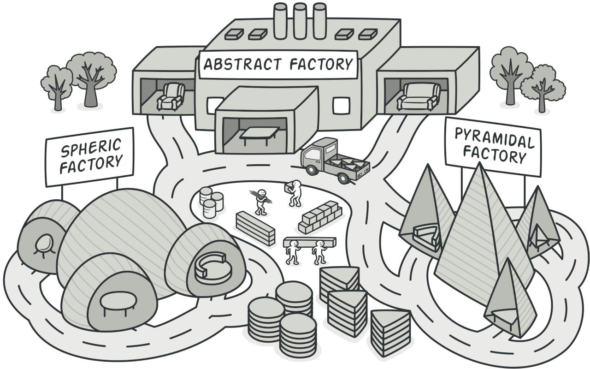
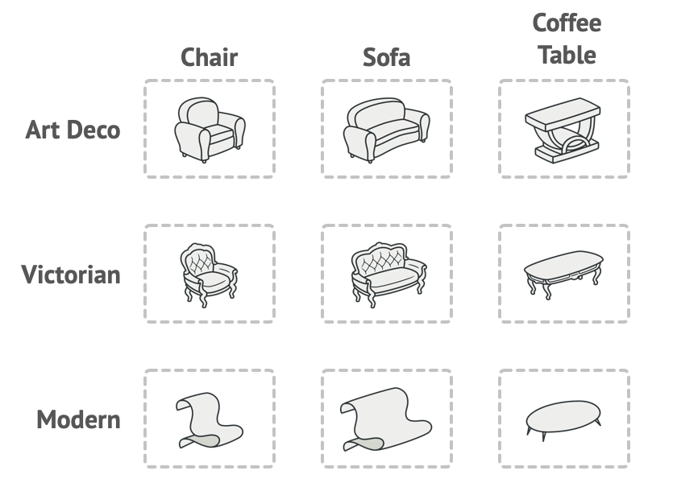
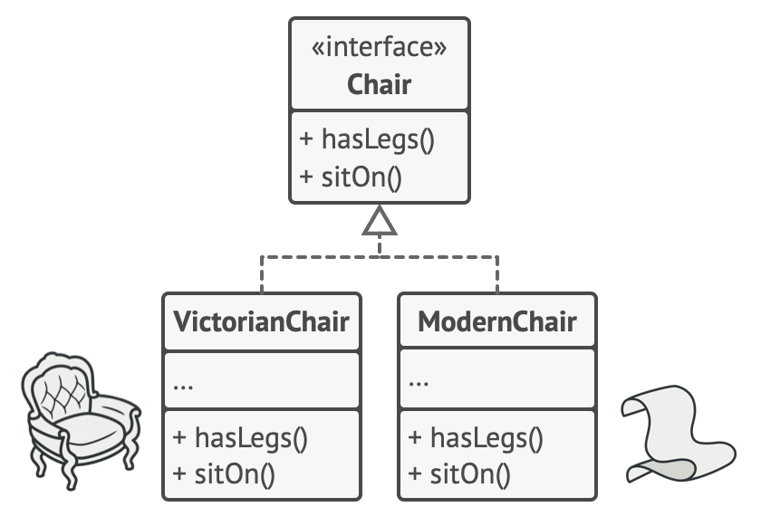
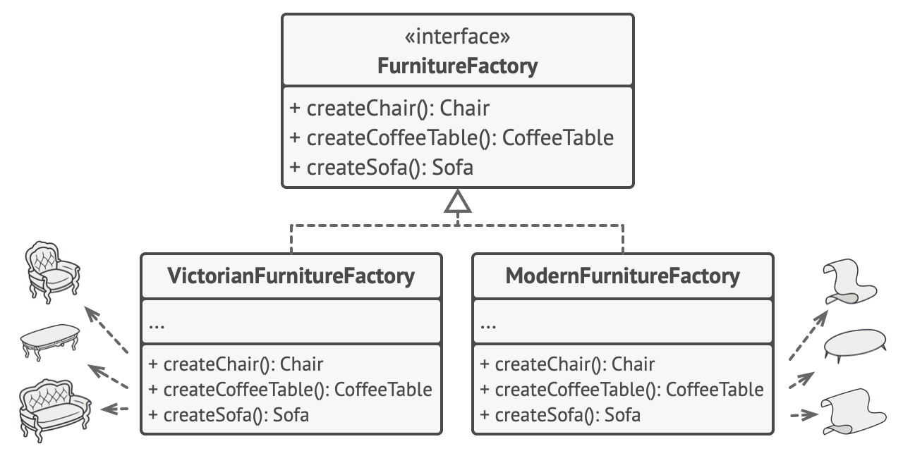
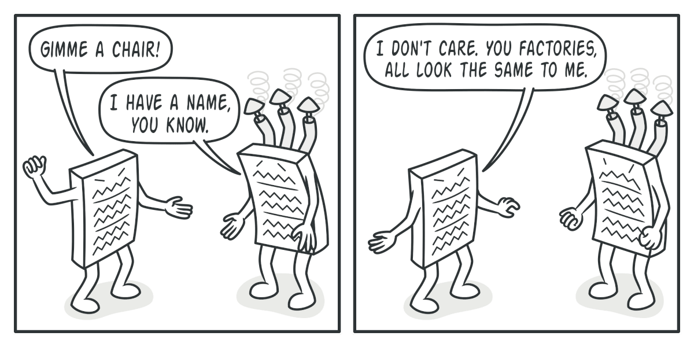
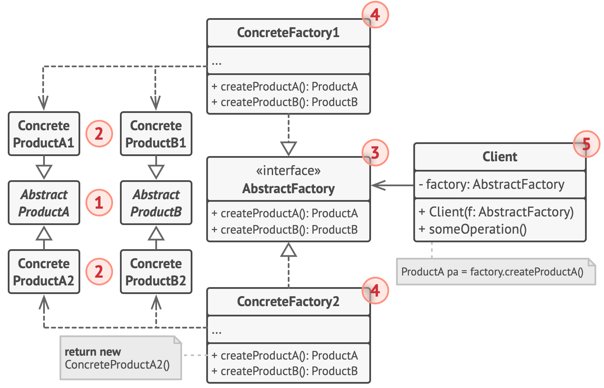
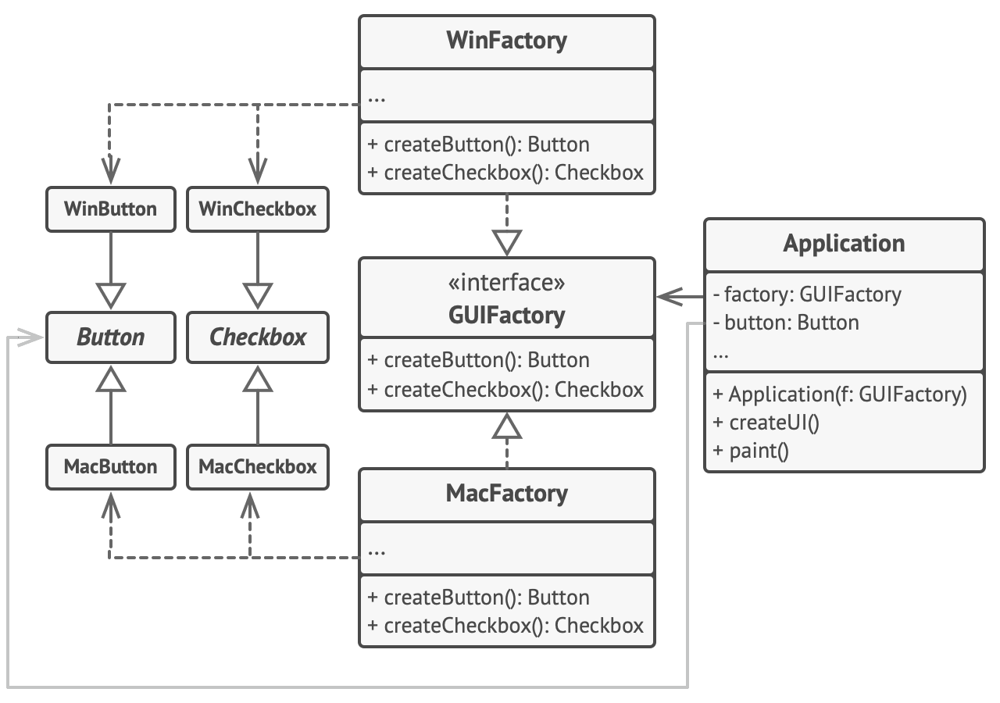

# Abstract Factory


**Type:** Creational

> **The 10-second version:** you have several *families* of things (Modern chair + Modern sofa, Victorian chair + Victorian sofa). You must never accidentally mix a Modern sofa with a Victorian chair. So instead of creating each piece separately, you hold **one factory object** that makes the whole matched set.

<br clear="all">

## Quick card

| | |
|---|---|
| **Problem it solves** | Objects that must **match each other** get created independently, so they can be mismatched. |
| **Core move** | One interface with several `createX()` methods; each implementation produces one consistent variant. |
| **You'll recognise it by** | An interface with 2+ creation methods, and N classes implementing it — one per "theme"/"variant". |
| **Rating** | Complexity ★★☆ · Popularity ★★★ |
| **Closest relatives** | Factory Method (one product, chosen by inheritance), Builder (one product, built in steps), Bridge (pairs well) |
| **In your stack** | Per-database SQL dialect kits, per-marketplace pricing+tax+shipping kits, per-environment adapter sets |

### How to read this file

Technical first, plain English second. 🗣️ marks the plain-English version. Part 1 is Refactoring.Guru's material with their diagrams; Parts 2–7 are code, your stack, and the stuff that makes it stick.

---

# PART 1 — The pattern

## 1. Intent

**Abstract Factory** is a creational design pattern that lets you produce families of related objects without specifying their concrete classes.



### 🗣️ In plain words

Factory Method makes **one** thing. Abstract Factory makes **a matched set of things**.

The magic word is **family**. If you ask a `VictorianFurnitureFactory` for a chair, a sofa and a table, you are *guaranteed* all three are Victorian — because they all came from the same factory object. You don't have to remember to keep them in sync; the type system does it for you.

---

## 2. Problem

Imagine that you’re creating a furniture shop simulator. Your code consists of classes that represent:

1. A family of related products, say: `Chair` + `Sofa` + `CoffeeTable`.
2. Several variants of this family. For example, products `Chair` + `Sofa` + `CoffeeTable` are available in these variants: `Modern`, `Victorian`, `ArtDeco`.



*Product families and their variants.*

You need a way to create individual furniture objects so that they match other objects of the same family. Customers get quite mad when they receive non-matching furniture.


*A Modern-style sofa doesn’t match Victorian-style chairs.*

Also, you don’t want to change existing code when adding new products or families of products to the program. Furniture vendors update their catalogs very often, and you wouldn’t want to change the core code each time it happens.

### 🗣️ In plain words

Think of a matrix:

|  | **Chair** | **Sofa** | **CoffeeTable** |
|---|---|---|---|
| **Modern** | ModernChair | ModernSofa | ModernCoffeeTable |
| **Victorian** | VictorianChair | VictorianSofa | VictorianCoffeeTable |
| **ArtDeco** | ArtDecoChair | ArtDecoSofa | ArtDecoCoffeeTable |

- The **columns** are *product types*. A chair is not a sofa. They have different interfaces.
- The **rows** are *variants*. A Modern chair and a Victorian chair do the same job, differently.

The bug you're preventing: some code does `new ModernSofa()` here and `new VictorianChair()` over there, and the customer gets a living room that looks insane.

**This matrix is the entire pattern.** If you can draw the matrix, Abstract Factory is probably the right answer. If your matrix has only one column, you want Factory Method instead.

---

## 3. Solution

The first thing the Abstract Factory pattern suggests is to explicitly declare interfaces for each distinct product of the product family (e.g., chair, sofa or coffee table). Then you can make all variants of products follow those interfaces. For example, all chair variants can implement the `Chair` interface; all coffee table variants can implement the `CoffeeTable` interface, and so on.



*All variants of the same object must be moved to a single class hierarchy.*

The next move is to declare the *Abstract Factory*—an interface with a list of creation methods for all products that are part of the product family (for example, `createChair`, `createSofa` and `createCoffeeTable`). These methods must return **abstract** product types represented by the interfaces we extracted previously: `Chair`, `Sofa`, `CoffeeTable` and so on.



*Each concrete factory corresponds to a specific product variant.*

Now, how about the product variants? For each variant of a product family, we create a separate factory class based on the `AbstractFactory` interface. A factory is a class that returns products of a particular kind. For example, the `ModernFurnitureFactory` can only create `ModernChair`, `ModernSofa` and `ModernCoffeeTable` objects.

The client code has to work with both factories and products via their respective abstract interfaces. This lets you change the type of a factory that you pass to the client code, as well as the product variant that the client code receives, without breaking the actual client code.



*The client shouldn’t care about the concrete class of the factory it works with.*

Say the client wants a factory to produce a chair. The client doesn’t have to be aware of the factory’s class, nor does it matter what kind of chair it gets. Whether it’s a Modern model or a Victorian-style chair, the client must treat all chairs in the same manner, using the abstract `Chair` interface. With this approach, the only thing that the client knows about the chair is that it implements the `sitOn` method in some way. Also, whichever variant of the chair is returned, it’ll always match the type of sofa or coffee table produced by the same factory object.

There’s one more thing left to clarify: if the client is only exposed to the abstract interfaces, what creates the actual factory objects? Usually, the application creates a concrete factory object at the initialization stage. Just before that, the app must select the factory type depending on the configuration or the environment settings.

### 🗣️ In plain words

Two steps:

1. **One interface per column.** `Chair`, `Sofa`, `CoffeeTable` — each is an interface, and every variant implements it.
2. **One factory class per row.** `ModernFurnitureFactory` implements `FurnitureFactory` and returns only Modern things.

Now the client holds *one* factory object. Everything it asks for comes from the same row, so it physically cannot mismatch.

> **The key insight:** consistency is enforced by **which object you're holding**, not by discipline or code review. That's why this pattern is worth the extra classes — it converts a "remember to..." rule into a compile-time guarantee.

---

## 4. Real-world analogy

Refactoring.Guru doesn't give one, so here are mine.

**The restaurant kit.** You order a thali. You don't pick the rice, the dal, the roti and the pickle from four different counters and hope they go together — you say "Gujarati thali" and the kitchen hands you a tray where everything is Gujarati. The tray is the factory; the items are the products.

**Power adapters.** A UK travel kit gives you a UK plug, a UK voltage converter, and a UK-shaped adapter. A US kit gives you the US versions. You pick the *kit* once at the airport, not each piece at each socket.

---

## 5. Structure



1. **Abstract Products** declare interfaces for a set of distinct but related products which make up a product family.
2. **Concrete Products** are various implementations of abstract products, grouped by variants. Each abstract product (chair/sofa) must be implemented in all given variants (Victorian/Modern).
3. The **Abstract Factory** interface declares a set of methods for creating each of the abstract products.
4. **Concrete Factories** implement creation methods of the abstract factory. Each concrete factory corresponds to a specific variant of products and creates only those product variants.
5. Although concrete factories instantiate concrete products, signatures of their creation methods must return corresponding *abstract* products. This way the client code that uses a factory doesn’t get coupled to the specific variant of the product it gets from a factory. The **Client** can work with any concrete factory/product variant, as long as it communicates with their objects via abstract interfaces.

### 🗣️ Participants & roles — cheat table

| Role | What it is | Furniture example | Real example (SQL dialects) |
|---|---|---|---|
| **Abstract Product** | An interface, one per *column* | `Chair`, `Sofa` | `IPagingClause`, `IUpsertBuilder` |
| **Concrete Product** | A real implementation | `ModernChair` | `SqlServerPagingClause` |
| **Abstract Factory** | Interface with one `createX()` per column | `FurnitureFactory` | `ISqlDialect` |
| **Concrete Factory** | One per *row*/variant | `ModernFurnitureFactory` | `SqlServerDialect`, `MySqlDialect` |
| **Client** | Holds a factory, uses products via interfaces | `Application` | `ReportRunner` |

### 🤝 Collaboration — who calls whom

```
Composition root (Program.cs / bootstrap)
  │
  │  1. reads config, picks ONE concrete factory — the only place
  │     concrete class names appear
  ▼
factory = new WinFactory()              ← the "variant" decision, made once
  │
  │  2. injected into the client
  ▼
Application(factory)
  │
  │  3. client asks for products through the abstract interface
  ├──► factory.createButton()   ──► WinButton   (typed as Button)
  └──► factory.createCheckbox() ──► WinCheckbox (typed as Checkbox)
       │
       │  4. products are guaranteed to be from the same family,
       │     so they can safely interact with each other
       ▼
    button.paint(); checkbox.paint()    ← consistent look, no mixing possible
```

Compare with Factory Method: there, the client **is** the creator (a subclass). Here, the client **holds** a creator. Inheritance vs composition — that's the whole difference.

---

## 6. Pseudocode (the website's example)

This example illustrates how the **Abstract Factory** pattern can be used for creating cross-platform UI elements without coupling the client code to concrete UI classes, while keeping all created elements consistent with a selected operating system.



*The cross-platform UI classes example.*

The same UI elements in a cross-platform application are expected to behave similarly, but look a little bit different under different operating systems. Moreover, it’s your job to make sure that the UI elements match the style of the current operating system. You wouldn’t want your program to render macOS controls when it’s executed in Windows.

The Abstract Factory interface declares a set of creation methods that the client code can use to produce different types of UI elements. Concrete factories correspond to specific operating systems and create the UI elements that match that particular OS.

It works like this: when an application launches, it checks the type of the current operating system. The app uses this information to create a factory object from a class that matches the operating system. The rest of the code uses this factory to create UI elements. This prevents the wrong elements from being created.

With this approach, the client code doesn’t depend on concrete classes of factories and UI elements as long as it works with these objects via their abstract interfaces. This also lets the client code support other factories or UI elements that you might add in the future.

As a result, you don’t need to modify the client code each time you add a new variation of UI elements to your app. You just have to create a new factory class that produces these elements and slightly modify the app’s initialization code so it selects that class when appropriate.

```
// The abstract factory interface declares a set of methods that
// return different abstract products. These products are called
// a family and are related by a high-level theme or concept.
// Products of one family are usually able to collaborate among
// themselves. A family of products may have several variants,
// but the products of one variant are incompatible with the
// products of another variant.
interface GUIFactory is
    method createButton():Button
    method createCheckbox():Checkbox

// Concrete factories produce a family of products that belong
// to a single variant. The factory guarantees that the
// resulting products are compatible. Signatures of the concrete
// factory's methods return an abstract product, while inside
// the method a concrete product is instantiated.
class WinFactory implements GUIFactory is
    method createButton():Button is
        return new WinButton()
    method createCheckbox():Checkbox is
        return new WinCheckbox()

// Each concrete factory has a corresponding product variant.
class MacFactory implements GUIFactory is
    method createButton():Button is
        return new MacButton()
    method createCheckbox():Checkbox is
        return new MacCheckbox()

// Each distinct product of a product family should have a base
// interface. All variants of the product must implement this
// interface.
interface Button is
    method paint()

// Concrete products are created by corresponding concrete
// factories.
class WinButton implements Button is
    method paint() is
        // Render a button in Windows style.

class MacButton implements Button is
    method paint() is
        // Render a button in macOS style.

// Here's the base interface of another product. All products
// can interact with each other, but proper interaction is
// possible only between products of the same concrete variant.
interface Checkbox is
    method paint()

class WinCheckbox implements Checkbox is
    method paint() is
        // Render a checkbox in Windows style.

class MacCheckbox implements Checkbox is
    method paint() is
        // Render a checkbox in macOS style.

// The client code works with factories and products only
// through abstract types: GUIFactory, Button and Checkbox. This
// lets you pass any factory or product subclass to the client
// code without breaking it.
class Application is
    private field factory: GUIFactory
    private field button: Button
    constructor Application(factory: GUIFactory) is
        this.factory = factory
    method createUI() is
        this.button = factory.createButton()
    method paint() is
        button.paint()

// The application picks the factory type depending on the
// current configuration or environment settings and creates it
// at runtime (usually at the initialization stage).
class ApplicationConfigurator is
    method main() is
        config = readApplicationConfigFile()

        if (config.OS == "Windows") then
            factory = new WinFactory()
        else if (config.OS == "Mac") then
            factory = new MacFactory()
        else
            throw new Exception("Error! Unknown operating system.")

        Application app = new Application(factory)
```

### 🗣️ Reading that pseudocode

- `GUIFactory` has **two** creation methods. That's the tell — Factory Method would have one.
- `WinFactory` returns `WinButton` **and** `WinCheckbox`. The pairing is baked into the class, so no caller can break it.
- `Application` stores a `GUIFactory` field. It's *composed* with a factory, not *subclassed* from one.
- `ApplicationConfigurator.main()` is the **only** place with an `if` over OS names. Same lesson as Factory Method: push the concrete decision to the edge.

---

## 7. Applicability — when to reach for it

**Use the Abstract Factory when your code needs to work with various families of related products, but you don’t want it to depend on the concrete classes of those products—they might be unknown beforehand or you simply want to allow for future extensibility.**

The Abstract Factory provides you with an interface for creating objects from each class of the product family. As long as your code creates objects via this interface, you don’t have to worry about creating the wrong variant of a product which doesn’t match the products already created by your app.

**Consider implementing the Abstract Factory when you have a class with a set of [Factory Methods](https://refactoring.guru/design-patterns/factory-method) that blur its primary responsibility.**

In a well-designed program *each class is responsible only for one thing*. When a class deals with multiple product types, it may be worth extracting its factory methods into a stand-alone factory class or a full-blown Abstract Factory implementation.

### ✅ Quick checklist

- [ ] I can draw a **matrix**: product types across the top, variants down the side.
- [ ] There are **at least two** product types (otherwise → Factory Method).
- [ ] Mixing variants would be a **bug**, not just untidy.
- [ ] The variant is chosen **once**, at startup or per-request, not per-object.
- [ ] I expect to add new variants (rows) more often than new product types (columns).

That last point matters a lot — see the cost analysis in Part 5.

---

## 8. How to implement — step by step

1. Map out a matrix of distinct product types versus variants of these products.
2. Declare abstract product interfaces for all product types. Then make all concrete product classes implement these interfaces.
3. Declare the abstract factory interface with a set of creation methods for all abstract products.
4. Implement a set of concrete factory classes, one for each product variant.
5. Create factory initialization code somewhere in the app. It should instantiate one of the concrete factory classes, depending on the application configuration or the current environment. Pass this factory object to all classes that construct products.
6. Scan through the code and find all direct calls to product constructors. Replace them with calls to the appropriate creation method on the factory object.

### 🗣️ The same steps, blunt version

1. **Draw the matrix on paper first.** Seriously. Columns = product types, rows = variants. If the matrix is mostly empty, this pattern is wrong for you.
2. One interface per column.
3. One factory interface with one `Create` method per column.
4. One factory class per row.
5. Pick the factory once, at the composition root.
6. Replace every `new ConcreteProduct()` with `_factory.CreateProduct()`.

---

## 9. Pros and cons

- ✅ You can be sure that the products you’re getting from a factory are compatible with each other.
- ✅ You avoid tight coupling between concrete products and client code.
- ✅ *Single Responsibility Principle*. You can extract the product creation code into one place, making the code easier to support.
- ✅ *Open/Closed Principle*. You can introduce new variants of products without breaking existing client code.

- ⛔ The code may become more complicated than it should be, since a lot of new interfaces and classes are introduced along with the pattern.

### ⚖️ Honest trade-offs from the trenches

**The cost is quadratic, and that's the whole story.** An M×N matrix means M product interfaces + M×N product classes + 1 factory interface + N factory classes.

- **Adding a variant (a new row) is cheap and lovely.** One new factory class + M new product classes, and **zero edits to existing files**. This is what the pattern is optimised for.
- **Adding a product type (a new column) is painful.** You must edit the factory interface *and every single concrete factory*. N files change. The Open/Closed Principle protects you along one axis only.

So the question to ask before adopting it: **"which way will this grow?"** If you'll add variants → perfect fit. If you'll add product types → you'll be editing every factory every time, and you should reconsider.

**The class count is real.** A 3×4 matrix is 3 interfaces + 12 products + 1 factory interface + 4 factories = **20 types**. Make sure that's buying you something.

---

## 10. Relations with other patterns

- Many designs start by using [Factory Method](https://refactoring.guru/design-patterns/factory-method) (less complicated and more customizable via subclasses) and evolve toward [Abstract Factory](https://refactoring.guru/design-patterns/abstract-factory), [Prototype](https://refactoring.guru/design-patterns/prototype), or [Builder](https://refactoring.guru/design-patterns/builder) (more flexible, but more complicated).
- [Builder](https://refactoring.guru/design-patterns/builder) focuses on constructing complex objects step by step. [Abstract Factory](https://refactoring.guru/design-patterns/abstract-factory) specializes in creating families of related objects. *Abstract Factory* returns the product immediately, whereas *Builder* lets you run some additional construction steps before fetching the product.
- [Abstract Factory](https://refactoring.guru/design-patterns/abstract-factory) classes are often based on a set of [Factory Methods](https://refactoring.guru/design-patterns/factory-method), but you can also use [Prototype](https://refactoring.guru/design-patterns/prototype) to compose the methods on these classes.
- [Abstract Factory](https://refactoring.guru/design-patterns/abstract-factory) can serve as an alternative to [Facade](https://refactoring.guru/design-patterns/facade) when you only want to hide the way the subsystem objects are created from the client code.
- You can use [Abstract Factory](https://refactoring.guru/design-patterns/abstract-factory) along with [Bridge](https://refactoring.guru/design-patterns/bridge). This pairing is useful when some abstractions defined by *Bridge* can only work with specific implementations. In this case, *Abstract Factory* can encapsulate these relations and hide the complexity from the client code.
- [Abstract Factories](https://refactoring.guru/design-patterns/abstract-factory), [Builders](https://refactoring.guru/design-patterns/builder) and [Prototypes](https://refactoring.guru/design-patterns/prototype) can all be implemented as [Singletons](https://refactoring.guru/design-patterns/singleton).

### 🗣️ Disambiguation — the factory family, settled

| | How many products | How you choose | Shape |
|---|---|---|---|
| **Simple Factory** | 1 | `switch` on an argument | `static Create(type)` |
| **Factory Method** | 1 | **Subclassing** the creator | `protected abstract Create()` |
| **Abstract Factory** | **A family** | **Which factory object you hold** | Interface with several `Create*()` |
| **Builder** | 1 complex one | Step calls, in order | `.WithX().WithY().Build()` |
| **Prototype** | 1, copied | The instance you clone | `.Clone()` |

**Memorise this one line:** *Factory Method decides by inheritance and makes one thing; Abstract Factory decides by composition and makes a matched set.*

---

# PART 2 — Official code examples from Refactoring.Guru

## 2.1 C#

**Complexity:** ★★☆ (2/3)

**Popularity:** ★★★ (3/3)

**Usage examples:** The Abstract Factory pattern is pretty common in C# code. Many frameworks and libraries use it to provide a way to extend and customize their standard components.

**Identification:** The pattern is easy to recognize by methods, which return a factory object. Then, the factory is used for creating specific sub-components.

### Conceptual Example

This example illustrates the structure of the **Abstract Factory** design pattern. It focuses on answering these questions:

- What classes does it consist of?
- What roles do these classes play?
- In what way the elements of the pattern are related?

##### **Program.cs:** Conceptual example

```csharp
using System;

namespace RefactoringGuru.DesignPatterns.AbstractFactory.Conceptual
{
    // The Abstract Factory interface declares a set of methods that return
    // different abstract products. These products are called a family and are
    // related by a high-level theme or concept. Products of one family are
    // usually able to collaborate among themselves. A family of products may
    // have several variants, but the products of one variant are incompatible
    // with products of another.
    public interface IAbstractFactory
    {
        IAbstractProductA CreateProductA();

        IAbstractProductB CreateProductB();
    }

    // Concrete Factories produce a family of products that belong to a single
    // variant. The factory guarantees that resulting products are compatible.
    // Note that signatures of the Concrete Factory's methods return an abstract
    // product, while inside the method a concrete product is instantiated.
    class ConcreteFactory1 : IAbstractFactory
    {
        public IAbstractProductA CreateProductA()
        {
            return new ConcreteProductA1();
        }

        public IAbstractProductB CreateProductB()
        {
            return new ConcreteProductB1();
        }
    }

    // Each Concrete Factory has a corresponding product variant.
    class ConcreteFactory2 : IAbstractFactory
    {
        public IAbstractProductA CreateProductA()
        {
            return new ConcreteProductA2();
        }

        public IAbstractProductB CreateProductB()
        {
            return new ConcreteProductB2();
        }
    }

    // Each distinct product of a product family should have a base interface.
    // All variants of the product must implement this interface.
    public interface IAbstractProductA
    {
        string UsefulFunctionA();
    }

    // Concrete Products are created by corresponding Concrete Factories.
    class ConcreteProductA1 : IAbstractProductA
    {
        public string UsefulFunctionA()
        {
            return "The result of the product A1.";
        }
    }

    class ConcreteProductA2 : IAbstractProductA
    {
        public string UsefulFunctionA()
        {
            return "The result of the product A2.";
        }
    }

    // Here's the the base interface of another product. All products can
    // interact with each other, but proper interaction is possible only between
    // products of the same concrete variant.
    public interface IAbstractProductB
    {
        // Product B is able to do its own thing...
        string UsefulFunctionB();

        // ...but it also can collaborate with the ProductA.
        //
        // The Abstract Factory makes sure that all products it creates are of
        // the same variant and thus, compatible.
        string AnotherUsefulFunctionB(IAbstractProductA collaborator);
    }

    // Concrete Products are created by corresponding Concrete Factories.
    class ConcreteProductB1 : IAbstractProductB
    {
        public string UsefulFunctionB()
        {
            return "The result of the product B1.";
        }

        // The variant, Product B1, is only able to work correctly with the
        // variant, Product A1. Nevertheless, it accepts any instance of
        // AbstractProductA as an argument.
        public string AnotherUsefulFunctionB(IAbstractProductA collaborator)
        {
            var result = collaborator.UsefulFunctionA();

            return $"The result of the B1 collaborating with the ({result})";
        }
    }

    class ConcreteProductB2 : IAbstractProductB
    {
        public string UsefulFunctionB()
        {
            return "The result of the product B2.";
        }

       // The variant, Product B2, is only able to work correctly with the
       // variant, Product A2. Nevertheless, it accepts any instance of
       // AbstractProductA as an argument.
        public string AnotherUsefulFunctionB(IAbstractProductA collaborator)
        {
            var result = collaborator.UsefulFunctionA();

            return $"The result of the B2 collaborating with the ({result})";
        }
    }

    // The client code works with factories and products only through abstract
    // types: AbstractFactory and AbstractProduct. This lets you pass any
    // factory or product subclass to the client code without breaking it.
    class Client
    {
        public void Main()
        {
            // The client code can work with any concrete factory class.
            Console.WriteLine("Client: Testing client code with the first factory type...");
            ClientMethod(new ConcreteFactory1());
            Console.WriteLine();

            Console.WriteLine("Client: Testing the same client code with the second factory type...");
            ClientMethod(new ConcreteFactory2());
        }

        public void ClientMethod(IAbstractFactory factory)
        {
            var productA = factory.CreateProductA();
            var productB = factory.CreateProductB();

            Console.WriteLine(productB.UsefulFunctionB());
            Console.WriteLine(productB.AnotherUsefulFunctionB(productA));
        }
    }

    class Program
    {
        static void Main(string[] args)
        {
            new Client().Main();
        }
    }
}
```

##### **Output.txt:** Execution result

```output
Client: Testing client code with the first factory type...
The result of the product B1.
The result of the B1 collaborating with the (The result of the product A1.)

Client: Testing the same client code with the second factory type...
The result of the product B2.
The result of the B2 collaborating with the (The result of the product A2.)
```

## 2.2 TypeScript

**Complexity:** ★★☆ (2/3)

**Popularity:** ★★★ (3/3)

**Usage examples:** The Abstract Factory pattern is pretty common in TypeScript code. Many frameworks and libraries use it to provide a way to extend and customize their standard components.

**Identification:** The pattern is easy to recognize by methods, which return a factory object. Then, the factory is used for creating specific sub-components.

### Conceptual Example

This example illustrates the structure of the **Abstract Factory** design pattern. It focuses on answering these questions:

- What classes does it consist of?
- What roles do these classes play?
- In what way the elements of the pattern are related?

##### **index.ts:** Conceptual example

```typescript
/**
 * The Abstract Factory interface declares a set of methods that return
 * different abstract products. These products are called a family and are
 * related by a high-level theme or concept. Products of one family are usually
 * able to collaborate among themselves. A family of products may have several
 * variants, but the products of one variant are incompatible with products of
 * another.
 */
interface AbstractFactory {
    createProductA(): AbstractProductA;

    createProductB(): AbstractProductB;
}

/**
 * Concrete Factories produce a family of products that belong to a single
 * variant. The factory guarantees that resulting products are compatible. Note
 * that signatures of the Concrete Factory's methods return an abstract product,
 * while inside the method a concrete product is instantiated.
 */
class ConcreteFactory1 implements AbstractFactory {
    public createProductA(): AbstractProductA {
        return new ConcreteProductA1();
    }

    public createProductB(): AbstractProductB {
        return new ConcreteProductB1();
    }
}

/**
 * Each Concrete Factory has a corresponding product variant.
 */
class ConcreteFactory2 implements AbstractFactory {
    public createProductA(): AbstractProductA {
        return new ConcreteProductA2();
    }

    public createProductB(): AbstractProductB {
        return new ConcreteProductB2();
    }
}

/**
 * Each distinct product of a product family should have a base interface. All
 * variants of the product must implement this interface.
 */
interface AbstractProductA {
    usefulFunctionA(): string;
}

/**
 * These Concrete Products are created by corresponding Concrete Factories.
 */
class ConcreteProductA1 implements AbstractProductA {
    public usefulFunctionA(): string {
        return 'The result of the product A1.';
    }
}

class ConcreteProductA2 implements AbstractProductA {
    public usefulFunctionA(): string {
        return 'The result of the product A2.';
    }
}

/**
 * Here's the base interface of another product. All products can interact with
 * each other, but proper interaction is possible only between products of the
 * same concrete variant.
 */
interface AbstractProductB {
    /**
     * Product B is able to do its own thing...
     */
    usefulFunctionB(): string;

    /**
     * ...but it also can collaborate with the ProductA.
     *
     * The Abstract Factory makes sure that all products it creates are of the
     * same variant and thus, compatible.
     */
    anotherUsefulFunctionB(collaborator: AbstractProductA): string;
}

/**
 * These Concrete Products are created by corresponding Concrete Factories.
 */
class ConcreteProductB1 implements AbstractProductB {

    public usefulFunctionB(): string {
        return 'The result of the product B1.';
    }

    /**
     * The variant, Product B1, is only able to work correctly with the variant,
     * Product A1. Nevertheless, it accepts any instance of AbstractProductA as
     * an argument.
     */
    public anotherUsefulFunctionB(collaborator: AbstractProductA): string {
        const result = collaborator.usefulFunctionA();
        return `The result of the B1 collaborating with the (${result})`;
    }
}

class ConcreteProductB2 implements AbstractProductB {

    public usefulFunctionB(): string {
        return 'The result of the product B2.';
    }

    /**
     * The variant, Product B2, is only able to work correctly with the variant,
     * Product A2. Nevertheless, it accepts any instance of AbstractProductA as
     * an argument.
     */
    public anotherUsefulFunctionB(collaborator: AbstractProductA): string {
        const result = collaborator.usefulFunctionA();
        return `The result of the B2 collaborating with the (${result})`;
    }
}

/**
 * The client code works with factories and products only through abstract
 * types: AbstractFactory and AbstractProduct. This lets you pass any factory or
 * product subclass to the client code without breaking it.
 */
function clientCode(factory: AbstractFactory) {
    const productA = factory.createProductA();
    const productB = factory.createProductB();

    console.log(productB.usefulFunctionB());
    console.log(productB.anotherUsefulFunctionB(productA));
}

/**
 * The client code can work with any concrete factory class.
 */
console.log('Client: Testing client code with the first factory type...');
clientCode(new ConcreteFactory1());

console.log('');

console.log('Client: Testing the same client code with the second factory type...');
clientCode(new ConcreteFactory2());
```

##### **Output.txt:** Execution result

```output
Client: Testing client code with the first factory type...
The result of the product B1.
The result of the B1 collaborating with the (The result of the product A1.)

Client: Testing the same client code with the second factory type...
The result of the product B2.
The result of the B2 collaborating with the (The result of the product A2.)
```

## 2.3 C++

**Complexity:** ★★☆ (2/3)

**Popularity:** ★★★ (3/3)

**Usage examples:** The Abstract Factory pattern is pretty common in C++ code. Many frameworks and libraries use it to provide a way to extend and customize their standard components.

**Identification:** The pattern is easy to recognize by methods, which return a factory object. Then, the factory is used for creating specific sub-components.

### Conceptual Example

This example illustrates the structure of the **Abstract Factory** design pattern. It focuses on answering these questions:

- What classes does it consist of?
- What roles do these classes play?
- In what way the elements of the pattern are related?

##### **main.cc:** Conceptual example

```cpp
/**
 * Each distinct product of a product family should have a base interface. All
 * variants of the product must implement this interface.
 */
class AbstractProductA {
 public:
  virtual ~AbstractProductA(){};
  virtual std::string UsefulFunctionA() const = 0;
};

/**
 * Concrete Products are created by corresponding Concrete Factories.
 */
class ConcreteProductA1 : public AbstractProductA {
 public:
  std::string UsefulFunctionA() const override {
    return "The result of the product A1.";
  }
};

class ConcreteProductA2 : public AbstractProductA {
  std::string UsefulFunctionA() const override {
    return "The result of the product A2.";
  }
};

/**
 * Here's the the base interface of another product. All products can interact
 * with each other, but proper interaction is possible only between products of
 * the same concrete variant.
 */
class AbstractProductB {
  /**
   * Product B is able to do its own thing...
   */
 public:
  virtual ~AbstractProductB(){};
  virtual std::string UsefulFunctionB() const = 0;
  /**
   * ...but it also can collaborate with the ProductA.
   *
   * The Abstract Factory makes sure that all products it creates are of the
   * same variant and thus, compatible.
   */
  virtual std::string AnotherUsefulFunctionB(const AbstractProductA &collaborator) const = 0;
};

/**
 * Concrete Products are created by corresponding Concrete Factories.
 */
class ConcreteProductB1 : public AbstractProductB {
 public:
  std::string UsefulFunctionB() const override {
    return "The result of the product B1.";
  }
  /**
   * The variant, Product B1, is only able to work correctly with the variant,
   * Product A1. Nevertheless, it accepts any instance of AbstractProductA as an
   * argument.
   */
  std::string AnotherUsefulFunctionB(const AbstractProductA &collaborator) const override {
    const std::string result = collaborator.UsefulFunctionA();
    return "The result of the B1 collaborating with ( " + result + " )";
  }
};

class ConcreteProductB2 : public AbstractProductB {
 public:
  std::string UsefulFunctionB() const override {
    return "The result of the product B2.";
  }
  /**
   * The variant, Product B2, is only able to work correctly with the variant,
   * Product A2. Nevertheless, it accepts any instance of AbstractProductA as an
   * argument.
   */
  std::string AnotherUsefulFunctionB(const AbstractProductA &collaborator) const override {
    const std::string result = collaborator.UsefulFunctionA();
    return "The result of the B2 collaborating with ( " + result + " )";
  }
};

/**
 * The Abstract Factory interface declares a set of methods that return
 * different abstract products. These products are called a family and are
 * related by a high-level theme or concept. Products of one family are usually
 * able to collaborate among themselves. A family of products may have several
 * variants, but the products of one variant are incompatible with products of
 * another.
 */
class AbstractFactory {
 public:
  virtual ~AbstractFactory(){};
  virtual AbstractProductA *CreateProductA() const = 0;
  virtual AbstractProductB *CreateProductB() const = 0;
};

/**
 * Concrete Factories produce a family of products that belong to a single
 * variant. The factory guarantees that resulting products are compatible. Note
 * that signatures of the Concrete Factory's methods return an abstract product,
 * while inside the method a concrete product is instantiated.
 */
class ConcreteFactory1 : public AbstractFactory {
 public:
  AbstractProductA *CreateProductA() const override {
    return new ConcreteProductA1();
  }
  AbstractProductB *CreateProductB() const override {
    return new ConcreteProductB1();
  }
};

/**
 * Each Concrete Factory has a corresponding product variant.
 */
class ConcreteFactory2 : public AbstractFactory {
 public:
  AbstractProductA *CreateProductA() const override {
    return new ConcreteProductA2();
  }
  AbstractProductB *CreateProductB() const override {
    return new ConcreteProductB2();
  }
};

/**
 * The client code works with factories and products only through abstract
 * types: AbstractFactory and AbstractProduct. This lets you pass any factory or
 * product subclass to the client code without breaking it.
 */

void ClientCode(const AbstractFactory &factory) {
  const AbstractProductA *product_a = factory.CreateProductA();
  const AbstractProductB *product_b = factory.CreateProductB();
  std::cout << product_b->UsefulFunctionB() << "\n";
  std::cout << product_b->AnotherUsefulFunctionB(*product_a) << "\n";
  delete product_a;
  delete product_b;
}

int main() {
  std::cout << "Client: Testing client code with the first factory type:\n";
  ConcreteFactory1 *f1 = new ConcreteFactory1();
  ClientCode(*f1);
  delete f1;
  std::cout << std::endl;
  std::cout << "Client: Testing the same client code with the second factory type:\n";
  ConcreteFactory2 *f2 = new ConcreteFactory2();
  ClientCode(*f2);
  delete f2;
  return 0;
}
```

##### **Output.txt:** Execution result

```output
Client: Testing client code with the first factory type:
The result of the product B1.
The result of the B1 collaborating with the (The result of the product A1.)

Client: Testing the same client code with the second factory type:
The result of the product B2.
The result of the B2 collaborating with the (The result of the product A2.)
```

## 2.4 Java

**Complexity:** ★★☆ (2/3)

**Popularity:** ★★★ (3/3)

**Usage examples:** The Abstract Factory pattern is pretty common in Java code. Many frameworks and libraries use it to provide a way to extend and customize their standard components.

**Identification:** The pattern is easy to recognize by methods, which return a factory object. Then, the factory is used for creating specific sub-components.

### Families of cross-platform GUI components and their production

In this example, buttons and checkboxes will act as products. They have two variants: macOS and Windows.

The abstract factory defines an interface for creating buttons and checkboxes. There are two concrete factories, which return both products in a single variant.

Client code works with factories and products using abstract interfaces. It makes the same client code working with many product variants, depending on the type of factory object.

#### **buttons:** First product hierarchy

##### **buttons/Button.java**

```java
package refactoring_guru.abstract_factory.example.buttons;

/**
 * Abstract Factory assumes that you have several families of products,
 * structured into separate class hierarchies (Button/Checkbox). All products of
 * the same family have the common interface.
 *
 * This is the common interface for buttons family.
 */
public interface Button {
    void paint();
}
```

##### **buttons/MacOSButton.java**

```java
package refactoring_guru.abstract_factory.example.buttons;

/**
 * All products families have the same varieties (MacOS/Windows).
 *
 * This is a MacOS variant of a button.
 */
public class MacOSButton implements Button {

    @Override
    public void paint() {
        System.out.println("You have created MacOSButton.");
    }
}
```

##### **buttons/WindowsButton.java**

```java
package refactoring_guru.abstract_factory.example.buttons;

/**
 * All products families have the same varieties (MacOS/Windows).
 *
 * This is another variant of a button.
 */
public class WindowsButton implements Button {

    @Override
    public void paint() {
        System.out.println("You have created WindowsButton.");
    }
}
```

#### **checkboxes:** Second product hierarchy

##### **checkboxes/Checkbox.java**

```java
package refactoring_guru.abstract_factory.example.checkboxes;

/**
 * Checkboxes is the second product family. It has the same variants as buttons.
 */
public interface Checkbox {
    void paint();
}
```

##### **checkboxes/MacOSCheckbox.java**

```java
package refactoring_guru.abstract_factory.example.checkboxes;

/**
 * All products families have the same varieties (MacOS/Windows).
 *
 * This is a variant of a checkbox.
 */
public class MacOSCheckbox implements Checkbox {

    @Override
    public void paint() {
        System.out.println("You have created MacOSCheckbox.");
    }
}
```

##### **checkboxes/WindowsCheckbox.java**

```java
package refactoring_guru.abstract_factory.example.checkboxes;

/**
 * All products families have the same varieties (MacOS/Windows).
 *
 * This is another variant of a checkbox.
 */
public class WindowsCheckbox implements Checkbox {

    @Override
    public void paint() {
        System.out.println("You have created WindowsCheckbox.");
    }
}
```

#### **factories**

##### **factories/GUIFactory.java:** Abstract factory

```java
package refactoring_guru.abstract_factory.example.factories;

import refactoring_guru.abstract_factory.example.buttons.Button;
import refactoring_guru.abstract_factory.example.checkboxes.Checkbox;

/**
 * Abstract factory knows about all (abstract) product types.
 */
public interface GUIFactory {
    Button createButton();
    Checkbox createCheckbox();
}
```

##### **factories/MacOSFactory.java:** Concrete factory (macOS)

```java
package refactoring_guru.abstract_factory.example.factories;

import refactoring_guru.abstract_factory.example.buttons.Button;
import refactoring_guru.abstract_factory.example.buttons.MacOSButton;
import refactoring_guru.abstract_factory.example.checkboxes.Checkbox;
import refactoring_guru.abstract_factory.example.checkboxes.MacOSCheckbox;

/**
 * Each concrete factory extends basic factory and responsible for creating
 * products of a single variety.
 */
public class MacOSFactory implements GUIFactory {

    @Override
    public Button createButton() {
        return new MacOSButton();
    }

    @Override
    public Checkbox createCheckbox() {
        return new MacOSCheckbox();
    }
}
```

##### **factories/WindowsFactory.java:** Concrete factory (Windows)

```java
package refactoring_guru.abstract_factory.example.factories;

import refactoring_guru.abstract_factory.example.buttons.Button;
import refactoring_guru.abstract_factory.example.buttons.WindowsButton;
import refactoring_guru.abstract_factory.example.checkboxes.Checkbox;
import refactoring_guru.abstract_factory.example.checkboxes.WindowsCheckbox;

/**
 * Each concrete factory extends basic factory and responsible for creating
 * products of a single variety.
 */
public class WindowsFactory implements GUIFactory {

    @Override
    public Button createButton() {
        return new WindowsButton();
    }

    @Override
    public Checkbox createCheckbox() {
        return new WindowsCheckbox();
    }
}
```

#### **app**

##### **app/Application.java:** Client code

```java
package refactoring_guru.abstract_factory.example.app;

import refactoring_guru.abstract_factory.example.buttons.Button;
import refactoring_guru.abstract_factory.example.checkboxes.Checkbox;
import refactoring_guru.abstract_factory.example.factories.GUIFactory;

/**
 * Factory users don't care which concrete factory they use since they work with
 * factories and products through abstract interfaces.
 */
public class Application {
    private Button button;
    private Checkbox checkbox;

    public Application(GUIFactory factory) {
        button = factory.createButton();
        checkbox = factory.createCheckbox();
    }

    public void paint() {
        button.paint();
        checkbox.paint();
    }
}
```

##### **Demo.java:** App configuration

```java
package refactoring_guru.abstract_factory.example;

import refactoring_guru.abstract_factory.example.app.Application;
import refactoring_guru.abstract_factory.example.factories.GUIFactory;
import refactoring_guru.abstract_factory.example.factories.MacOSFactory;
import refactoring_guru.abstract_factory.example.factories.WindowsFactory;

/**
 * Demo class. Everything comes together here.
 */
public class Demo {

    /**
     * Application picks the factory type and creates it in run time (usually at
     * initialization stage), depending on the configuration or environment
     * variables.
     */
    private static Application configureApplication() {
        Application app;
        GUIFactory factory;
        String osName = System.getProperty("os.name").toLowerCase();
        if (osName.contains("mac")) {
            factory = new MacOSFactory();
        } else {
            factory = new WindowsFactory();
        }
        app = new Application(factory);
        return app;
    }

    public static void main(String[] args) {
        Application app = configureApplication();
        app.paint();
    }
}
```

##### **OutputDemo.txt:** Execution result

```output
You create WindowsButton.
You created WindowsCheckbox.
```

---

# PART 3 — Learn it by building it

## 3.1 The dumbest possible version — TypeScript

Here's the pain **without** the pattern. A report exporter that must produce a header, a body and a footer, all in the same format:

```typescript
// ❌ BEFORE — nothing stops you mixing formats
function exportReport(rows: Row[], format: string): string {
  const header = format === "csv" ? csvHeader() : htmlHeader();
  const body   = format === "csv" ? csvBody(rows) : htmlBody(rows);
  const footer = htmlFooter();   // 🐛 somebody forgot the ternary here
  return header + body + footer; // CSV file with an HTML footer. Ship it!
}
```

That bug is *invisible* in code review and only shows up in production. Abstract Factory makes it **impossible to write**:

```typescript
// ── 1. Abstract Products — one interface per "column" ───────────────────
interface HeaderWriter { write(title: string): string; }
interface BodyWriter   { write(rows: Row[]): string; }
interface FooterWriter { write(total: number): string; }

// ── 2. Concrete Products, grouped by variant ────────────────────────────
class CsvHeader implements HeaderWriter {
  write(title: string) { return `# ${title}\nvin,model,price\n`; }
}
class CsvBody implements BodyWriter {
  write(rows: Row[]) { return rows.map(r => `${r.vin},${r.model},${r.price}`).join("\n"); }
}
class CsvFooter implements FooterWriter {
  write(total: number) { return `\n# total: ${total}\n`; }
}

class HtmlHeader implements HeaderWriter {
  write(title: string) { return `<h1>${title}</h1><table>`; }
}
class HtmlBody implements BodyWriter {
  write(rows: Row[]) {
    return rows.map(r => `<tr><td>${r.vin}</td><td>${r.model}</td><td>${r.price}</td></tr>`).join("");
  }
}
class HtmlFooter implements FooterWriter {
  write(total: number) { return `</table><p>Total: ${total}</p>`; }
}

// ── 3. The Abstract Factory — one create method per column ──────────────
interface ReportFactory {
  createHeader(): HeaderWriter;
  createBody():   BodyWriter;
  createFooter(): FooterWriter;
}

// ── 4. Concrete Factories — one per variant/row ─────────────────────────
class CsvReportFactory implements ReportFactory {
  createHeader() { return new CsvHeader(); }
  createBody()   { return new CsvBody(); }
  createFooter() { return new CsvFooter(); }
}

class HtmlReportFactory implements ReportFactory {
  createHeader() { return new HtmlHeader(); }
  createBody()   { return new HtmlBody(); }
  createFooter() { return new HtmlFooter(); }
}

// ── 5. Client — holds ONE factory, cannot mismatch ──────────────────────
class ReportExporter {
  constructor(private factory: ReportFactory) {}   // 👈 composition, not inheritance

  export(title: string, rows: Row[]): string {
    const header = this.factory.createHeader();
    const body   = this.factory.createBody();
    const footer = this.factory.createFooter();

    const total = rows.reduce((s, r) => s + r.price, 0);
    return header.write(title) + body.write(rows) + footer.write(total);
  }
}

// ── 6. Composition root — the ONLY place format names appear ────────────
function makeFactory(format: string): ReportFactory {
  switch (format) {
    case "csv":  return new CsvReportFactory();
    case "html": return new HtmlReportFactory();
    default: throw new Error(`Unknown format: ${format}`);
  }
}

const rows: Row[] = [{ vin: "ABC123", model: "Swift", price: 550000 }];
console.log(new ReportExporter(makeFactory("csv")).export("Listings", rows));
```

**What to notice:**

- `ReportExporter.export()` **cannot** produce a mixed-format file. There is no variable to get wrong.
- Adding a "PDF" variant = 3 product classes + 1 factory class, **zero edits** to `ReportExporter`.
- Adding a "Summary" section (a new column) = edit the interface + both factories. That's the quadratic cost, made visible.

## 3.2 Same thing in C#

```csharp
using System;
using System.Collections.Generic;
using System.Linq;

public record Row(string Vin, string Model, decimal Price);

// ── 1. Abstract Products ────────────────────────────────────────────────
public interface IHeaderWriter { string Write(string title); }
public interface IBodyWriter   { string Write(IReadOnlyList<Row> rows); }
public interface IFooterWriter { string Write(decimal total); }

// ── 2. Concrete Products — CSV family ───────────────────────────────────
public sealed class CsvHeader : IHeaderWriter
{
    public string Write(string title) => $"# {title}{Environment.NewLine}vin,model,price{Environment.NewLine}";
}
public sealed class CsvBody : IBodyWriter
{
    public string Write(IReadOnlyList<Row> rows)
        => string.Join(Environment.NewLine, rows.Select(r => $"{r.Vin},{r.Model},{r.Price}"));
}
public sealed class CsvFooter : IFooterWriter
{
    public string Write(decimal total) => $"{Environment.NewLine}# total: {total}{Environment.NewLine}";
}

// ── 2b. Concrete Products — HTML family ─────────────────────────────────
public sealed class HtmlHeader : IHeaderWriter
{
    public string Write(string title) => $"<h1>{title}</h1><table>";
}
public sealed class HtmlBody : IBodyWriter
{
    public string Write(IReadOnlyList<Row> rows)
        => string.Concat(rows.Select(r => $"<tr><td>{r.Vin}</td><td>{r.Model}</td><td>{r.Price}</td></tr>"));
}
public sealed class HtmlFooter : IFooterWriter
{
    public string Write(decimal total) => $"</table><p>Total: {total}</p>";
}

// ── 3. Abstract Factory ─────────────────────────────────────────────────
public interface IReportFactory
{
    IHeaderWriter CreateHeader();
    IBodyWriter   CreateBody();
    IFooterWriter CreateFooter();
}

// ── 4. Concrete Factories ───────────────────────────────────────────────
public sealed class CsvReportFactory : IReportFactory
{
    public IHeaderWriter CreateHeader() => new CsvHeader();
    public IBodyWriter   CreateBody()   => new CsvBody();
    public IFooterWriter CreateFooter() => new CsvFooter();
}

public sealed class HtmlReportFactory : IReportFactory
{
    public IHeaderWriter CreateHeader() => new HtmlHeader();
    public IBodyWriter   CreateBody()   => new HtmlBody();
    public IFooterWriter CreateFooter() => new HtmlFooter();
}

// ── 5. Client ───────────────────────────────────────────────────────────
public sealed class ReportExporter
{
    private readonly IReportFactory _factory;
    public ReportExporter(IReportFactory factory) => _factory = factory;   // 👈 injected

    public string Export(string title, IReadOnlyList<Row> rows)
    {
        var header = _factory.CreateHeader();
        var body   = _factory.CreateBody();
        var footer = _factory.CreateFooter();

        var total = rows.Sum(r => r.Price);
        return header.Write(title) + body.Write(rows) + footer.Write(total);
    }
}

// ── 6. Composition root ─────────────────────────────────────────────────
public static class Program
{
    public static void Main()
    {
        IReportFactory factory = "csv" switch
        {
            "csv"  => new CsvReportFactory(),
            "html" => new HtmlReportFactory(),
            _      => throw new ArgumentException("Unknown format")
        };

        var rows = new List<Row> { new("ABC123", "Swift", 550000m) };
        Console.WriteLine(new ReportExporter(factory).Export("Listings", rows));
    }
}
```

**C#-specific notes:**

- This maps perfectly onto DI: `services.AddScoped<IReportFactory, CsvReportFactory>()` and the client just takes `IReportFactory` in its constructor.
- For per-request variant selection, use **keyed services** (.NET 8+): `services.AddKeyedScoped<IReportFactory, CsvReportFactory>("csv")`, then `sp.GetRequiredKeyedService<IReportFactory>(format)`.
- Concrete factories are usually stateless → register them as **singletons** and skip the allocations.

## 3.3 C++ — with ownership made explicit

```cpp
#include <iostream>
#include <memory>
#include <string>
#include <vector>

struct Row { std::string vin, model; long price; };

// ── 1. Abstract Products ────────────────────────────────────────────────
class HeaderWriter {
public:
    virtual ~HeaderWriter() = default;
    virtual std::string write(const std::string& title) const = 0;
};
class BodyWriter {
public:
    virtual ~BodyWriter() = default;
    virtual std::string write(const std::vector<Row>& rows) const = 0;
};

// ── 2. Concrete Products ────────────────────────────────────────────────
class CsvHeader : public HeaderWriter {
public:
    std::string write(const std::string& t) const override {
        return "# " + t + "\nvin,model,price\n";
    }
};
class CsvBody : public BodyWriter {
public:
    std::string write(const std::vector<Row>& rows) const override {
        std::string out;
        for (const auto& r : rows)
            out += r.vin + "," + r.model + "," + std::to_string(r.price) + "\n";
        return out;
    }
};
class HtmlHeader : public HeaderWriter {
public:
    std::string write(const std::string& t) const override {
        return "<h1>" + t + "</h1><table>";
    }
};
class HtmlBody : public BodyWriter {
public:
    std::string write(const std::vector<Row>& rows) const override {
        std::string out;
        for (const auto& r : rows)
            out += "<tr><td>" + r.vin + "</td><td>" + r.model + "</td></tr>";
        return out;
    }
};

// ── 3. Abstract Factory ─────────────────────────────────────────────────
class ReportFactory {
public:
    virtual ~ReportFactory() = default;
    virtual std::unique_ptr<HeaderWriter> createHeader() const = 0;
    virtual std::unique_ptr<BodyWriter>   createBody()   const = 0;
};

// ── 4. Concrete Factories ───────────────────────────────────────────────
class CsvReportFactory : public ReportFactory {
public:
    std::unique_ptr<HeaderWriter> createHeader() const override { return std::make_unique<CsvHeader>(); }
    std::unique_ptr<BodyWriter>   createBody()   const override { return std::make_unique<CsvBody>(); }
};
class HtmlReportFactory : public ReportFactory {
public:
    std::unique_ptr<HeaderWriter> createHeader() const override { return std::make_unique<HtmlHeader>(); }
    std::unique_ptr<BodyWriter>   createBody()   const override { return std::make_unique<HtmlBody>(); }
};

// ── 5. Client — takes a reference, doesn't own the factory ──────────────
class ReportExporter {
    const ReportFactory& factory_;
public:
    explicit ReportExporter(const ReportFactory& f) : factory_(f) {}
    std::string exportReport(const std::string& title, const std::vector<Row>& rows) const {
        auto header = factory_.createHeader();
        auto body   = factory_.createBody();
        return header->write(title) + body->write(rows);
    }
};

int main() {
    CsvReportFactory csv;
    ReportExporter exporter(csv);
    std::vector<Row> rows{{"ABC123", "Swift", 550000}};
    std::cout << exporter.exportReport("Listings", rows);
}
```

**C++ notes:**

- `const ReportFactory&` for the client is the right default: the client *uses* the factory, it doesn't *own* it. Use `std::shared_ptr` only if lifetime genuinely needs sharing.
- There's a **compile-time variant** of this pattern using templates and policy classes — zero virtual dispatch, all decided at compile time:
  ```cpp
  template <typename Policy>
  class ReportExporter {
      std::string exportReport(const std::string& t, const std::vector<Row>& r) {
          return Policy::Header{}.write(t) + Policy::Body{}.write(r);
      }
  };
  struct CsvPolicy { using Header = CsvHeader; using Body = CsvBody; };
  ReportExporter<CsvPolicy> exporter;
  ```
  This is idiomatic modern C++ when the variant is known at compile time — it's the same *idea* with none of the runtime cost. (Alexandrescu's *Modern C++ Design* is the canonical treatment.)

## 3.4 Java note

Identical to the C# version structurally. The Java-flavoured touch is using an **enum with abstract methods** as a compact concrete-factory registry:

```java
enum ReportFormat {
    CSV {
        public HeaderWriter createHeader() { return new CsvHeader(); }
        public BodyWriter   createBody()   { return new CsvBody(); }
    },
    HTML {
        public HeaderWriter createHeader() { return new HtmlHeader(); }
        public BodyWriter   createBody()   { return new HtmlBody(); }
    };

    public abstract HeaderWriter createHeader();
    public abstract BodyWriter   createBody();
}

// usage — variant selection and the factory are the same object
ReportFormat fmt = ReportFormat.valueOf(input.toUpperCase());
String out = fmt.createHeader().write("Listings") + fmt.createBody().write(rows);
```

This is a genuinely nice Java idiom: exhaustive, serialisable, and you get `values()` for free.

## 3.5 The matrix test — do this before you write any code

Draw it. If your matrix looks like this, **use the pattern**:

|  | Header | Body | Footer |
|---|---|---|---|
| CSV | ✅ | ✅ | ✅ |
| HTML | ✅ | ✅ | ✅ |
| PDF | ✅ | ✅ | ✅ |

Full matrix, every cell meaningful → Abstract Factory is exactly right.

If it looks like **this**, don't:

|  | Header | Body | Footer |
|---|---|---|---|
| CSV | ✅ | ✅ | — |
| HTML | ✅ | ✅ | ✅ |
| PDF | — | ✅ | — |

Sparse matrix → you're forcing unrelated things into a fake family. Use separate Factory Methods or plain DI.

---

# PART 4 — Using this in your codebase

## 4.1 SQL — the best fit in your whole stack

If you ever support more than one database engine (or migrate between them), this is *the* pattern. A SQL dialect is a perfect family: paging, upsert, date formatting and identifier quoting must **all** be from the same engine.

```csharp
// ── Abstract Products ───────────────────────────────────────────────────
public interface IPagingClause    { string Build(int page, int size); }
public interface IUpsertBuilder   { string Build(string table, string[] cols, string[] keyCols); }
public interface IIdentifierQuoter{ string Quote(string identifier); }

// ── Abstract Factory ────────────────────────────────────────────────────
public interface ISqlDialect
{
    IPagingClause     CreatePaging();
    IUpsertBuilder    CreateUpsert();
    IIdentifierQuoter CreateQuoter();
}

// ── Concrete Factory: SQL Server ────────────────────────────────────────
public sealed class SqlServerDialect : ISqlDialect
{
    public IPagingClause     CreatePaging() => new OffsetFetchPaging();      // OFFSET..FETCH NEXT
    public IUpsertBuilder    CreateUpsert() => new MergeUpsert();            // MERGE
    public IIdentifierQuoter CreateQuoter() => new BracketQuoter();          // [col]
}

// ── Concrete Factory: MySQL ─────────────────────────────────────────────
public sealed class MySqlDialect : ISqlDialect
{
    public IPagingClause     CreatePaging() => new LimitOffsetPaging();      // LIMIT..OFFSET
    public IUpsertBuilder    CreateUpsert() => new OnDuplicateKeyUpsert();   // ON DUPLICATE KEY UPDATE
    public IIdentifierQuoter CreateQuoter() => new BacktickQuoter();         // `col`
}

// ── Client ──────────────────────────────────────────────────────────────
public sealed class ListingRepository
{
    private readonly ISqlDialect _dialect;
    public ListingRepository(ISqlDialect dialect) => _dialect = dialect;

    public string BuildSearchQuery(int page, int size)
    {
        var q = _dialect.CreateQuoter();
        var p = _dialect.CreatePaging();
        // 👇 guaranteed: bracket-quoting never pairs with LIMIT/OFFSET
        return $"SELECT {q.Quote("vin")}, {q.Quote("price")} FROM {q.Quote("listings")} "
             + $"ORDER BY {q.Quote("created_at")} DESC {p.Build(page, size)}";
    }
}
```

**Why this beats a `switch`:** with `if (isMySql)` scattered around, one forgotten branch produces `[col]` syntax against MySQL — a runtime error found by a customer. Here it's structurally impossible.

## 4.2 C# backend — per-marketplace / per-tenant rule kits

A very common real shape: business rules that must be consistent per country/marketplace.

```csharp
public interface IMarketplaceKit
{
    ITaxCalculator    CreateTaxCalculator();
    IShippingEstimator CreateShippingEstimator();
    ICurrencyFormatter CreateCurrencyFormatter();
    IInvoiceNumberer   CreateInvoiceNumberer();
}

public sealed class IndiaKit : IMarketplaceKit
{
    public ITaxCalculator     CreateTaxCalculator()    => new GstCalculator();
    public IShippingEstimator CreateShippingEstimator()=> new IndiaPostEstimator();
    public ICurrencyFormatter CreateCurrencyFormatter()=> new InrFormatter();      // ₹ 5,50,000 (lakh grouping!)
    public IInvoiceNumberer   CreateInvoiceNumberer()  => new GstInvoiceNumberer();
}

public sealed class UaeKit : IMarketplaceKit
{
    public ITaxCalculator     CreateTaxCalculator()    => new VatCalculator();
    public IShippingEstimator CreateShippingEstimator()=> new AramexEstimator();
    public ICurrencyFormatter CreateCurrencyFormatter()=> new AedFormatter();
    public IInvoiceNumberer   CreateInvoiceNumberer()  => new SequentialNumberer();
}
```

The bug this prevents is a good one: **GST tax with AED currency formatting on the same invoice.** That's a compliance incident, not a cosmetic bug.

Wire it up per request:

```csharp
// Resolve the kit once, from the tenant on the request
public sealed class MarketplaceKitResolver(IServiceProvider sp)
{
    public IMarketplaceKit For(string marketCode) =>
        sp.GetRequiredKeyedService<IMarketplaceKit>(marketCode);
}
```

## 4.3 TypeScript / Node — environment-consistent adapter sets

```typescript
interface InfraKit {
  createStorage():  BlobStorage;
  createQueue():    QueueClient;
  createCache():    CacheClient;
  createSecrets():  SecretsClient;
}

class ProductionKit implements InfraKit {
  createStorage() { return new S3Storage(process.env.S3_BUCKET!); }
  createQueue()   { return new RabbitQueue(process.env.AMQP_URL!); }
  createCache()   { return new RedisCache(process.env.REDIS_URL!); }
  createSecrets() { return new VaultSecrets(process.env.VAULT_ADDR!); }
}

class LocalDevKit implements InfraKit {
  createStorage() { return new LocalDiskStorage("./.tmp/blobs"); }
  createQueue()   { return new InMemoryQueue(); }
  createCache()   { return new InMemoryCache(); }
  createSecrets() { return new DotEnvSecrets(); }
}

class TestKit implements InfraKit {
  createStorage() { return new FakeStorage(); }
  createQueue()   { return new FakeQueue(); }      // assertable: queue.published
  createCache()   { return new FakeCache(); }
  createSecrets() { return new FakeSecrets(); }
}

// Composition root — the only place NODE_ENV is read
const kit: InfraKit =
  process.env.NODE_ENV === "production" ? new ProductionKit()
  : process.env.NODE_ENV === "test"     ? new TestKit()
  :                                       new LocalDevKit();
```

**This is genuinely one of the best uses of the pattern.** The bug it kills: a test that accidentally uses the real S3 client because someone wired one dependency wrong. With a kit, you either get all-fake or all-real. `TestKit` is also the cleanest integration-test setup you'll ever write.

## 4.4 RabbitMQ / messaging

The family here is **serializer + routing convention + retry policy**, which must agree across producer and consumer.

```csharp
public interface IMessagingProfile
{
    IMessageSerializer CreateSerializer();
    IRoutingKeyStrategy CreateRoutingKeys();
    IRetryPolicy        CreateRetryPolicy();
    IDeadLetterPolicy   CreateDeadLetterPolicy();
}

// v1: JSON, topic exchange, 3 retries, DLQ suffix ".dlq"
public sealed class V1Profile : IMessagingProfile
{
    public IMessageSerializer  CreateSerializer()        => new JsonSerializer();
    public IRoutingKeyStrategy CreateRoutingKeys()       => new DottedTopicKeys();
    public IRetryPolicy        CreateRetryPolicy()       => new FixedRetry(3, TimeSpan.FromSeconds(5));
    public IDeadLetterPolicy   CreateDeadLetterPolicy()  => new SuffixDlq(".dlq");
}

// v2: MessagePack, header exchange, exponential backoff, quorum DLQ
public sealed class V2Profile : IMessagingProfile
{
    public IMessageSerializer  CreateSerializer()        => new MessagePackSerializer();
    public IRoutingKeyStrategy CreateRoutingKeys()       => new HeaderMatchKeys();
    public IRetryPolicy        CreateRetryPolicy()       => new ExponentialRetry(5);
    public IDeadLetterPolicy   CreateDeadLetterPolicy()  => new QuorumDlq();
}
```

**Why this matters in messaging specifically:** a serializer mismatch between producer and consumer is one of the nastiest production bugs there is — messages land in the DLQ with an unhelpful deserialization error. Bundling serializer + routing + retry into one profile object means a migration is "switch the profile", not "hope you found all 14 places".

## 4.5 A concrete thing you could do this week

Search your C# codebase for two enums/consts used together, like:

```csharp
if (market == Market.India) { tax = GST; currency = "INR"; }
if (market == Market.UAE)   { tax = VAT; currency = "AED"; }
```

If you find the **same condition repeated in 3+ files**, that's a family begging to be a kit. The refactor: one `IMarketplaceKit`, resolved once per request, injected everywhere. You'll delete more `if`s than you add classes.

---

# PART 5 — Anti-patterns & when NOT to use it

## 🚩 Don't use it when...

| Situation | Why it's wrong | Use instead |
|---|---|---|
| You have exactly **one** product type | There's no family to keep consistent | **Factory Method** |
| Products don't actually need to match | You've invented a constraint that doesn't exist | Separate factories, or plain DI |
| The matrix is sparse | You're forcing unrelated things together | Independent creation |
| You'll add **product types** far more often than variants | Every new type edits every factory | Registry / DI container |
| The variant changes per *object*, not per *context* | You'd need a new factory per object — absurd | Simple Factory / Strategy |

## 🚩 Specific smells of misuse

**1. The one-method "abstract factory".** If your factory interface has a single `Create()`, you've written Factory Method with extra ceremony. A family needs ≥2 members.

**2. Variants that don't vary together.** If `ModernChair` and `ModernSofa` never interact and nobody cares whether they match, you don't have a family — you have two unrelated hierarchies. Delete the factory.

**3. Leaking concrete types out of the factory.**
```csharp
// ❌ now the client is coupled to the variant again — pattern defeated
public ModernChair CreateChair() => new ModernChair();
//     ^^^^^^^^^^^ must be IChair
```

**4. The god factory.** A factory interface with 15 create methods is a sign the "family" has grown into "everything in the app". Split it.

**5. Using it where DI already works.** In ASP.NET Core, registering four interfaces per tenant and resolving them is often simpler than a hand-written kit. Reach for the pattern when the *grouping guarantee* is the point — not just to get objects.

## 🎯 The over-engineering test

**"If someone mixed variants, would it be a bug or would nobody notice?"**

- *"It'd be a compliance incident / corrupted file / production outage"* → use the pattern.
- *"Honestly nobody would notice"* → you don't have a family. Don't.

---

# PART 6 — Famous real-world uses

## .NET / C#

| Where | The family it creates |
|---|---|
| `System.Data.Common.DbProviderFactory` | `DbConnection` + `DbCommand` + `DbParameter` + `DbDataAdapter` — **the** textbook example, and it's in the BCL |
| `System.Xml.XmlWriterSettings` / writer creation | Matched writer + settings + encoding |
| ASP.NET Core `IHttpClientFactory` + handler chains | Client + handlers + policies as a named set |
| Entity Framework Core providers | `SqlServerOptionsExtension`, `NpgsqlOptionsExtension` — each supplies a full matched set of SQL generation services |
| `System.Drawing` / `SkiaSharp` backends | Pen + Brush + Font per rendering backend |

`DbProviderFactory` is worth actually reading — it's the cleanest real Abstract Factory in any major standard library.

## Java / JVM

| Where | The family |
|---|---|
| `javax.xml.parsers.DocumentBuilderFactory` | Parser + document + error handler |
| `javax.swing.LookAndFeel` | Every UI control, per theme (Metal, Nimbus, GTK) — the furniture example, literally |
| JDBC `Driver` → `Connection` + `Statement` + `ResultSet` | Per-database family |
| `java.nio.file.FileSystemProvider` | `Path` + `FileStore` + `FileSystem` per filesystem type |
| Spring's `BeanFactory` hierarchy | Profile-scoped bean families |

## C++

| Where | The family |
|---|---|
| Qt's style system (`QStyle`) | Every widget's look, per platform |
| `std::locale` facets | `num_put`, `money_put`, `time_put` — all must be from the same locale, or your output is nonsense. A pure Abstract Factory constraint. |
| OpenGL/Vulkan/DirectX abstraction layers in game engines | Device + buffer + shader + pipeline per graphics API |
| LLVM `TargetMachine` | Instruction selector + register info + frame lowering per CPU target |

`std::locale` is a lovely example to think about: you can't sensibly mix a German number formatter with a Japanese date formatter, so the locale hands you a consistent set.

## JavaScript / TypeScript

| Where | The family |
|---|---|
| React renderers (`react-dom` vs `react-native`) | The full host-component set per platform |
| Knex / Sequelize / TypeORM dialects | Query builder + schema builder + type mapper per DB |
| AWS SDK v3 client configs | Credentials + signer + retry strategy as a matched set |
| `Intl` (`NumberFormat`, `DateTimeFormat`, `Collator`) | Locale-consistent formatting family — same idea as `std::locale` |

## The famous "aha"

**Cross-platform UI is the canonical Abstract Factory**, and it's not theoretical: Java's Swing Look-and-Feel, Qt's QStyle, and the Windows/macOS split in Electron apps all work exactly like the pseudocode above. When a Swing app changes its L&F at runtime and every control re-skins consistently, you're watching one concrete factory get swapped for another.

---

# PART 7 — Extras

## 🧠 Mnemonic

> **"One tray, matching cutlery."**

You pick the tray once; everything on it goes together. Or in code terms: **a factory of factories that guarantees a matched set.**

## 🎤 Interview questions you should be able to answer

**Q: Factory Method vs Abstract Factory — in one sentence each?**
Factory Method: *a subclass decides which single object to create.* Abstract Factory: *an object you're composed with creates a whole matched family.*

**Q: Why is the Open/Closed Principle only half-satisfied?**
Adding a **variant** (row) needs no edits to existing code — open for extension. Adding a **product type** (column) forces you to change the factory interface and every implementation — closed only along one axis.

**Q: Can an Abstract Factory be a Singleton?**
Yes, and it usually should be — concrete factories are typically stateless. Refactoring.Guru notes this explicitly in the relations section.

**Q: How does it relate to Bridge?**
Bridge separates an abstraction from its implementation. When only certain abstraction/implementation pairs are valid, Abstract Factory can encapsulate which pairs go together — so you literally cannot construct an invalid combination.

**Q: How do you test code that uses it?**
Write one `TestKit` concrete factory returning fakes, inject it, done. It's the cleanest test seam of any creational pattern.

## 🔬 Self-test — can you do these without looking?

1. Draw the product/variant matrix for a cross-platform UI toolkit. Which axis is cheap to extend?
2. Explain why `std::locale` is an Abstract Factory and what bug it prevents.
3. Given an interface with exactly one `Create()` method, what pattern is it really?
4. Your team wants to add a 4th product type to a 3×5 matrix. How many files change?
5. Name the .NET class that is the textbook Abstract Factory.

## 📚 Further reading

- [Refactoring.Guru — Abstract Factory](https://refactoring.guru/design-patterns/abstract-factory) (source of Part 1)
- [Refactoring.Guru — Factory Comparison](https://refactoring.guru/design-patterns/factory-comparison) — settles Simple Factory vs Factory Method vs Abstract Factory once and for all
- *Design Patterns* (GoF), p. 87 — the original
- .NET docs: [`DbProviderFactory`](https://learn.microsoft.com/dotnet/api/system.data.common.dbproviderfactory)
- Alexandrescu, *Modern C++ Design*, ch. 9 — the compile-time/policy-based version

## ➡️ What to read next

- **[Factory Method](01-factory-method.md)** — the simpler sibling; read it first if you haven't.
- **[Builder](03-builder.md)** — when the problem is "one object, complicated to assemble" rather than "several objects that must match".
- **[Bridge](../02-structural/02-bridge.md)** — pairs with Abstract Factory when only certain abstraction/implementation combinations are legal.

---

*Part 1 content and diagrams: [Refactoring.Guru](https://refactoring.guru/design-patterns/abstract-factory). Parts 2–7 written for this guide.*
