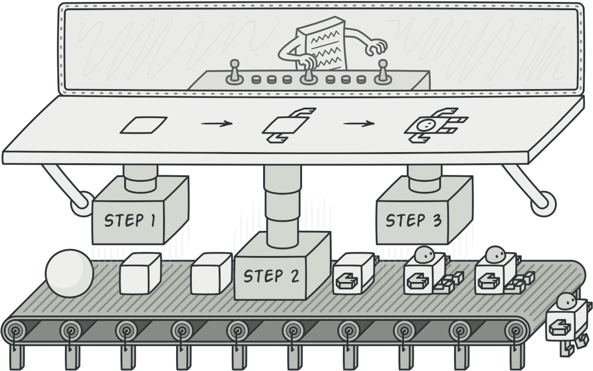
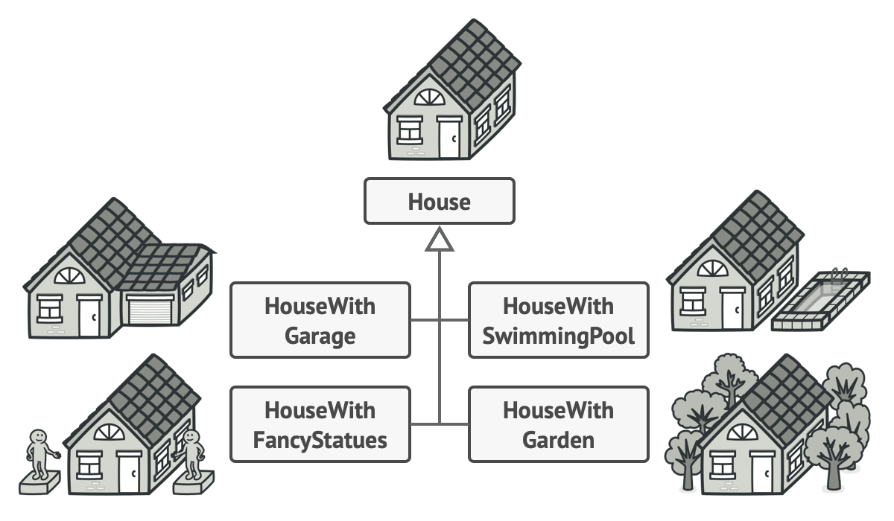
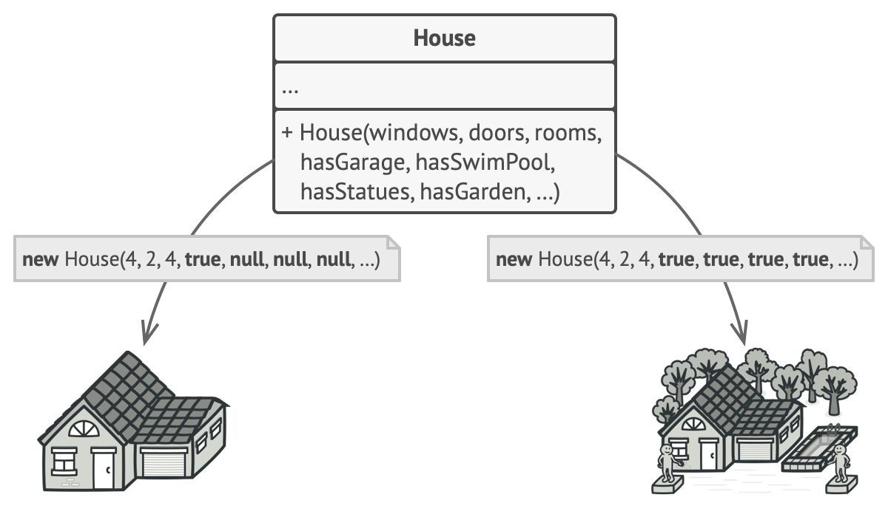
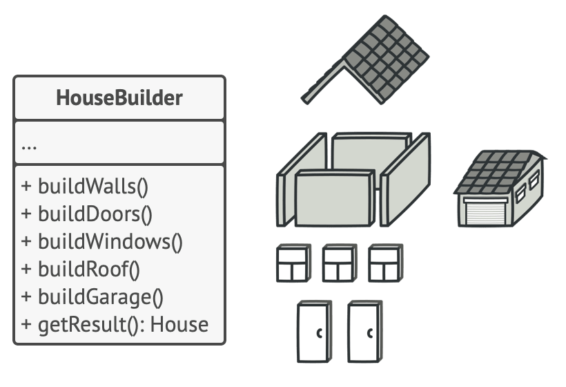
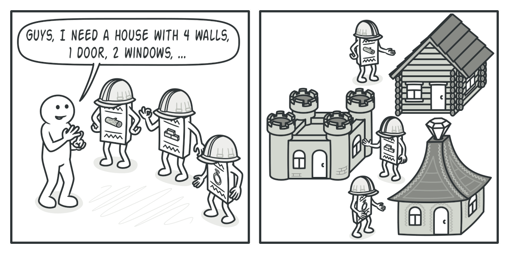
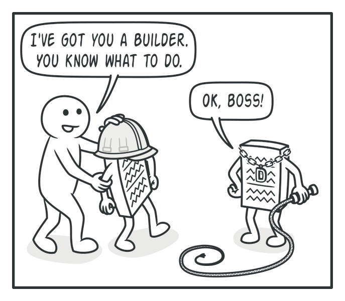
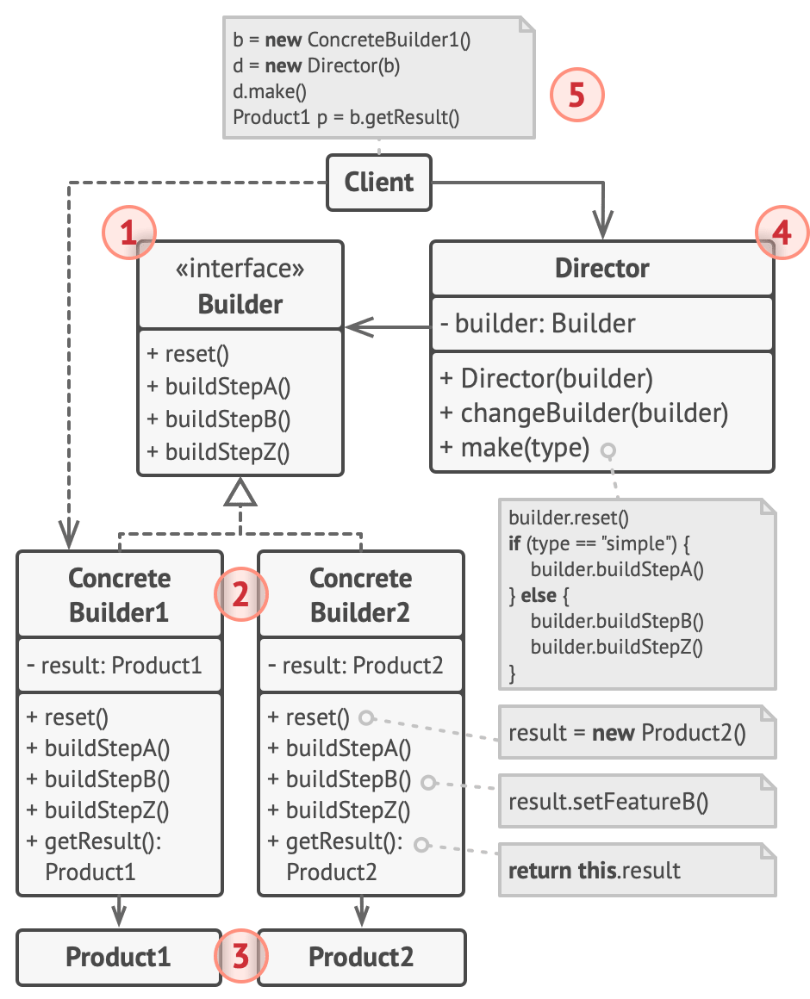
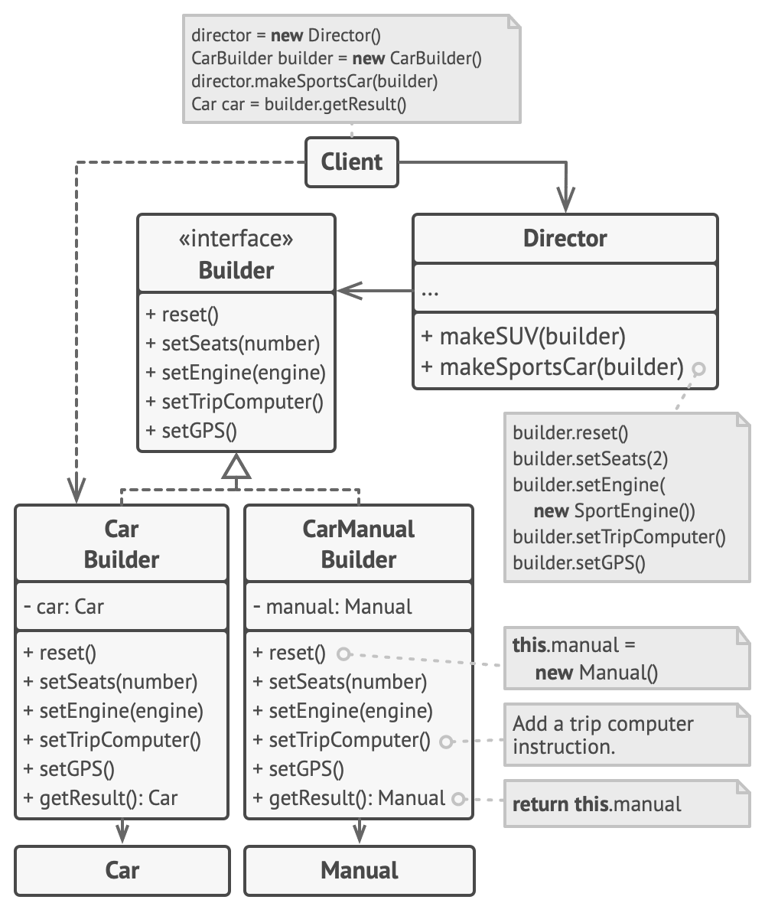

# Builder


**Type:** Creational · **Also known as:** 

> **The 10-second version:** Instead of one constructor that takes fifteen arguments, you get a little assembly line — you call only the steps you need, then ask for the finished object.

<br clear="all">

## Quick card

| | |
|---|---|
| **Problem it solves** | Objects that need many optional parts, where a constructor would grow to a dozen parameters or a subclass per combination |
| **Core move** | Move construction out of the product into a separate *builder* object that accumulates state across several calls, and hand back the finished product only at the end |
| **You'll recognise it by** | A class with lots of `SetX`/`WithX`/`AddX` methods and exactly one terminal method (`Build()`, `GetProduct()`, `ToString()`) — usually chainable |
| **Rating** | Complexity ★★☆ · Popularity ★★★ |
| **Closest relatives** | Abstract Factory (returns immediately, no steps), Factory Method (one call, subclass decides), Prototype (copy instead of assemble), Composite (Builder is how you assemble one) |
| **In your stack** | You already use it every day: `WebApplication.CreateBuilder(args)`, EF Core's `ModelBuilder` / `DbContextOptionsBuilder`, `StringBuilder`, Knex/TypeORM query builders, `URLSearchParams`. Where you'd hand-roll it: a `ListingSearchQuery` builder over your SQL/search filters, a message-envelope builder for RabbitMQ publishes, and test-data builders for listing fixtures |

### How to read this file

Technical first, plain English second. 🗣️ marks the plain-English version. Part 1 is Refactoring.Guru's material with their diagrams; Parts 2-7 are code, your stack, and the stuff that makes it stick.

---

# PART 1 — The pattern

## 1. Intent
**Builder** is a creational design pattern that lets you construct complex objects step by step. The pattern allows you to produce different types and representations of an object using the same construction code.


### 🗣️ In plain words

You have an object that is a pain to create — lots of fields, lots of optional bits, nested pieces inside it. Builder says: stop trying to do it in one line. Create a separate helper whose only job is assembly, call a few methods on it in whatever order suits you, then ask it for the result.

The bonus is the second half of the intent: because *construction code* and *construction steps* are now separate things, you can swap in a different builder and the same sequence of steps produces a completely different object. Same recipe, different kitchen.

## 2. Problem
Imagine a complex object that requires laborious, step-by-step initialization of many fields and nested objects. Such initialization code is usually buried inside a monstrous constructor with lots of parameters. Or even worse: scattered all over the client code.



*You might make the program too complex by creating a subclass for every possible configuration of an object.*

For example, let’s think about how to create a `House` object. To build a simple house, you need to construct four walls and a floor, install a door, fit a pair of windows, and build a roof. But what if you want a bigger, brighter house, with a backyard and other goodies (like a heating system, plumbing, and electrical wiring)?

The simplest solution is to extend the base `House` class and create a set of subclasses to cover all combinations of the parameters. But eventually you’ll end up with a considerable number of subclasses. Any new parameter, such as the porch style, will require growing this hierarchy even more.

There’s another approach that doesn’t involve breeding subclasses. You can create a giant constructor right in the base `House` class with all possible parameters that control the house object. While this approach indeed eliminates the need for subclasses, it creates another problem.



*The constructor with lots of parameters has its downside: not all the parameters are needed at all times.*

In most cases most of the parameters will be unused, making [the constructor calls pretty ugly](https://refactoring.guru/smells/long-parameter-list). For instance, only a fraction of houses have swimming pools, so the parameters related to swimming pools will be useless nine times out of ten.
### 🗣️ In plain words

Two bad endings, and you have probably written both.

**Ending one: the subclass explosion.** You start with `Listing`, then you need `ListingWithPhotos`, then `CertifiedListingWithPhotos`, then `CertifiedDealerListingWithPhotosAndFinanceOffer`. Every new optional feature doubles the hierarchy. Nobody can find the class they need.

**Ending two: the telescoping constructor.** You avoid subclasses by cramming everything into one constructor, then overload it five times so the common cases stay short:

```csharp
// ❌ The thing Builder exists to kill
var listing = new Listing(
    "Maruti", "Swift", 2019, 45000, "Petrol", "Manual",
    true, false, null, 2, "Pune", 549000m, null, false, "MH12AB1234");
```

Quick: what is that `true`? What is the `false` after it? Which `null` is the finance offer and which is the inspection report? You cannot tell without opening the constructor, and neither can the reviewer. Worse, half of those parameters are `null` or `false` in ninety percent of calls, so you are paying a readability tax on every single listing you create for the sake of the one listing that needs all fifteen.

Both endings share the same root cause: **the object knows how to be, and is also forced to know how to be assembled.** Those are two jobs.

## 3. Solution
The Builder pattern suggests that you extract the object construction code out of its own class and move it to separate objects called *builders*.



*The Builder pattern lets you construct complex objects step by step. The Builder doesn’t allow other objects to access the product while it’s being built.*

The pattern organizes object construction into a set of steps (`buildWalls`, `buildDoor`, etc.). To create an object, you execute a series of these steps on a builder object. The important part is that you don’t need to call all of the steps. You can call only those steps that are necessary for producing a particular configuration of an object.

Some of the construction steps might require different implementation when you need to build various representations of the product. For example, walls of a cabin may be built of wood, but the castle walls must be built with stone.

In this case, you can create several different builder classes that implement the same set of building steps, but in a different manner. Then you can use these builders in the construction process (i.e., an ordered set of calls to the building steps) to produce different kinds of objects.



*Different builders execute the same task in various ways.*

For example, imagine a builder that builds everything from wood and glass, a second one that builds everything with stone and iron and a third one that uses gold and diamonds. By calling the same set of steps, you get a regular house from the first builder, a small castle from the second and a palace from the third. However, this would only work if the client code that calls the building steps is able to interact with builders using a common interface.

#### Director

You can go further and extract a series of calls to the builder steps you use to construct a product into a separate class called *director*. The director class defines the order in which to execute the building steps, while the builder provides the implementation for those steps.



*The director knows which building steps to execute to get a working product.*

Having a director class in your program isn’t strictly necessary. You can always call the building steps in a specific order directly from the client code. However, the director class might be a good place to put various construction routines so you can reuse them across your program.

In addition, the director class completely hides the details of product construction from the client code. The client only needs to associate a builder with a director, launch the construction with the director, and get the result from the builder.
### 🗣️ In plain words

The mechanical moves, in order:

1. **Create an empty product and park it inside a builder.** The builder owns a half-finished object that nobody else can see.
2. **Expose one method per construction step** (`SetEngine`, `AddPhoto`, `WithFinanceOffer`). Each one mutates the parked product and — in the fluent variant — returns the builder so calls chain.
3. **Expose one terminal method** (`Build()` / `GetProduct()`) that validates, hands the finished product over, and usually resets the builder so it is ready for the next one.
4. **(Optional) Extract the common call sequences into a Director.** The director knows the recipe — "a sports car is two seats, sport engine, trip computer, GPS" — while the builder knows how each step is performed. Pass a different builder to the same director method and you get a different product out.

The part people miss: steps 1-3 alone are the useful 80%. Step 4 is what earns the pattern its GoF diagram, and it only pays for itself when you genuinely have more than one builder or more than one reusable recipe.

> **The key insight:** The builder is a *mutable scratchpad for an immutable result*. You accept a period of half-built, invalid state — but you lock it inside one object that nobody else can reach, and you only let the product escape when it is whole. That is why `Build()` is the right place for validation, and why exposing a getter for the half-built product ruins the pattern.

## 4. Real-world analogy

Refactoring.Guru does not give one for this pattern, so here are mine.

**The restaurant order pad.** The waiter does not walk to your table and demand a single sentence containing your starter, main, sides, dressing, allergies, and drink in a fixed order. They take out a pad and add lines as you say them, in any order, and you can skip whole sections. Nothing goes to the kitchen until they tear the sheet off — that tear is `Build()`. And the same pad, handed to the bar instead of the kitchen, produces a completely different thing from the same list of lines: that is a second concrete builder.

**The car configurator on a dealer's website.** You pick a model, then trim, then colour, then a sunroof, then finance. Each click updates a half-built configuration that only exists on the server; you never receive a "car object" mid-flow, and you cannot submit until required choices are made. Press *Confirm* and the same configuration produces **two** artefacts from the same choices: an order for the factory and a PDF spec sheet for you. Two builders, one sequence of steps — exactly the car-and-manual example the pseudocode below uses.

## 5. Structure


1. The **Builder** interface declares product construction steps that are common to all types of builders.
2. **Concrete Builders** provide different implementations of the construction steps. Concrete builders may produce products that don’t follow the common interface.
3. **Products** are resulting objects. Products constructed by different builders don’t have to belong to the same class hierarchy or interface.
4. The **Director** class defines the order in which to call construction steps, so you can create and reuse specific configurations of products.
5. The **Client** must associate one of the builder objects with the director. Usually, it’s done just once, via parameters of the director’s constructor. Then the director uses that builder object for all further construction. However, there’s an alternative approach for when the client passes the builder object to the production method of the director. In this case, you can use a different builder each time you produce something with the director.
### 🗣️ Participants & roles — cheat table

| Role | What it is in code | Example from the site | Equivalent in reader's stack |
|---|---|---|---|
| **Builder** | An interface (or abstract class) declaring one method per construction step — and deliberately *no* `getResult()` | `interface Builder { reset(); setSeats(); setEngine(); setTripComputer(); setGPS(); }` | `IListingBuilder` in C#; a TS `interface ListingBuilder` — or nothing at all when you only ever have one builder |
| **Concrete Builder** | A class holding a private half-built product, implementing every step, plus its own `getProduct()` with a concrete return type | `CarBuilder` (returns `Car`), `CarManualBuilder` (returns `Manual`) | `SqlListingQueryBuilder` vs `SearchDslListingQueryBuilder` — same filter steps, one emits SQL, one emits an OpenSearch JSON body |
| **Product** | The complex object being assembled. Products from different builders need **no** common base type | `Car` and `Manual` — unrelated classes | `Listing` record, `SearchQuery` DTO, `PublishEnvelope` |
| **Director** | Holds/receives a builder and calls the steps in a fixed, named order — a reusable recipe | `Director.constructSportsCar(builder)` | `ListingPresets.DealerCertified(builder)`, `SearchPresets.DefaultUsedCarSearch(builder)` |
| **Client** | Creates the builder, optionally hands it to the director, then fetches the result **from the builder** | `Application.makeCar()` | Your controller / handler / test fixture |

The two rows that trip people up: **Product has no interface requirement** (this is Builder's one superpower over Abstract Factory), and **the Director cannot return the product** — it has no idea what type came out. Always fetch from the builder.

### 🤝 Collaboration — who calls whom

```
 Client                Director                 ConcreteBuilder            Product
   |                      |                           |                       |
   |--new CarBuilder()--------------------------->[creates blank Car]-------->|
   |                      |                           |  (private, unreachable)
   |--constructSportsCar(builder)------>|             |                       |
   |                      |--reset()---------------->|--new Car()------------>|
   |                      |--setSeats(2)------------>|--mutate--------------->|
   |                      |--setEngine(Sport)------->|--mutate--------------->|
   |                      |--setTripComputer(true)-->|--mutate--------------->|
   |                      |--setGPS(true)----------->|--mutate--------------->|
   |                      |                           |                       |
   |<-------------------- (director returns void) ----|                       |
   |                      |                           |                       |
   |--getProduct()------------------------------->[validate + hand over + reset]
   |<========================= finished Car =====================================|
   |
   |  Now swap the builder, keep the recipe:
   |--new CarManualBuilder()--------------------->[creates blank Manual]
   |--constructSportsCar(manualBuilder)->|  same 4 step calls
   |--getProduct() ------------------------------>  finished Manual  👈 different type!
```

**The one hop that matters:** the final `getProduct()` goes **Client → Builder**, never Client → Director. The director is typed against the `Builder` interface and has no idea whether a `Car` or a `Manual` came out the other end — that is precisely why Builder can produce unrelated product types where Abstract Factory cannot.

## 6. Pseudocode (the website's example)
This example of the **Builder** pattern illustrates how you can reuse the same object construction code when building different types of products, such as cars, and create the corresponding manuals for them.



*The example of step-by-step construction of cars and the user guides that fit those car models.*

A car is a complex object that can be constructed in a hundred different ways. Instead of bloating the `Car` class with a huge constructor, we extracted the car assembly code into a separate car builder class. This class has a set of methods for configuring various parts of a car.

If the client code needs to assemble a special, fine-tuned model of a car, it can work with the builder directly. On the other hand, the client can delegate the assembly to the director class, which knows how to use a builder to construct several of the most popular models of cars.

You might be shocked, but every car needs a manual (seriously, who reads them?). The manual describes every feature of the car, so the details in the manuals vary across the different models. That’s why it makes sense to reuse an existing construction process for both real cars and their respective manuals. Of course, building a manual isn’t the same as building a car, and that’s why we must provide another builder class that specializes in composing manuals. This class implements the same building methods as its car-building sibling, but instead of crafting car parts, it describes them. By passing these builders to the same director object, we can construct either a car or a manual.

The final part is fetching the resulting object. A metal car and a paper manual, although related, are still very different things. We can’t place a method for fetching results in the director without coupling the director to concrete product classes. Hence, we obtain the result of the construction from the builder which performed the job.

```
// Using the Builder pattern makes sense only when your products
// are quite complex and require extensive configuration. The
// following two products are related, although they don't have
// a common interface.
class Car is
    // A car can have a GPS, trip computer and some number of
    // seats. Different models of cars (sports car, SUV,
    // cabriolet) might have different features installed or
    // enabled.

class Manual is
    // Each car should have a user manual that corresponds to
    // the car's configuration and describes all its features.

// The builder interface specifies methods for creating the
// different parts of the product objects.
interface Builder is
    method reset()
    method setSeats(...)
    method setEngine(...)
    method setTripComputer(...)
    method setGPS(...)

// The concrete builder classes follow the builder interface and
// provide specific implementations of the building steps. Your
// program may have several variations of builders, each
// implemented differently.
class CarBuilder implements Builder is
    private field car:Car

    // A fresh builder instance should contain a blank product
    // object which it uses in further assembly.
    constructor CarBuilder() is
        this.reset()

    // The reset method clears the object being built.
    method reset() is
        this.car = new Car()

    // All production steps work with the same product instance.
    method setSeats(...) is
        // Set the number of seats in the car.

    method setEngine(...) is
        // Install a given engine.

    method setTripComputer(...) is
        // Install a trip computer.

    method setGPS(...) is
        // Install a global positioning system.

    // Concrete builders are supposed to provide their own
    // methods for retrieving results. That's because various
    // types of builders may create entirely different products
    // that don't all follow the same interface. Therefore such
    // methods can't be declared in the builder interface (at
    // least not in a statically-typed programming language).
    //
    // Usually, after returning the end result to the client, a
    // builder instance is expected to be ready to start
    // producing another product. That's why it's a usual
    // practice to call the reset method at the end of the
    // `getProduct` method body. However, this behavior isn't
    // mandatory, and you can make your builder wait for an
    // explicit reset call from the client code before disposing
    // of the previous result.
    method getProduct():Car is
        product = this.car
        this.reset()
        return product

// Unlike other creational patterns, builder lets you construct
// products that don't follow the common interface.
class CarManualBuilder implements Builder is
    private field manual:Manual

    constructor CarManualBuilder() is
        this.reset()

    method reset() is
        this.manual = new Manual()

    method setSeats(...) is
        // Document car seat features.

    method setEngine(...) is
        // Add engine instructions.

    method setTripComputer(...) is
        // Add trip computer instructions.

    method setGPS(...) is
        // Add GPS instructions.

    method getProduct():Manual is
        // Return the manual and reset the builder.

// The director is only responsible for executing the building
// steps in a particular sequence. It's helpful when producing
// products according to a specific order or configuration.
// Strictly speaking, the director class is optional, since the
// client can control builders directly.
class Director is
    // The director works with any builder instance that the
    // client code passes to it. This way, the client code may
    // alter the final type of the newly assembled product.
    // The director can construct several product variations
    // using the same building steps.
    method constructSportsCar(builder: Builder) is
        builder.reset()
        builder.setSeats(2)
        builder.setEngine(new SportEngine())
        builder.setTripComputer(true)
        builder.setGPS(true)

    method constructSUV(builder: Builder) is
        // ...

// The client code creates a builder object, passes it to the
// director and then initiates the construction process. The end
// result is retrieved from the builder object.
class Application is

    method makeCar() is
        director = new Director()

        CarBuilder builder = new CarBuilder()
        director.constructSportsCar(builder)
        Car car = builder.getProduct()

        CarManualBuilder builder = new CarManualBuilder()
        director.constructSportsCar(builder)

        // The final product is often retrieved from a builder
        // object since the director isn't aware of and not
        // dependent on concrete builders and products.
        Manual manual = builder.getProduct()
```
### 🗣️ Reading that pseudocode

- **`class Car` and `class Manual` share nothing.** No base class, no interface. Read that twice — it is the single line that separates Builder from every other creational pattern. A metal car and a paper booklet come off the same assembly instructions.
- **`interface Builder` declares `reset()` and the four `set*` steps — and no `getProduct()`.** The comment inside `CarBuilder.getProduct()` spells out why: the return types differ (`Car` vs `Manual`), so in a statically typed language the method cannot live on the shared interface.
- **`constructor CarBuilder() is this.reset()`** — the builder is born holding a blank product. There is never a moment where the builder exists without something to mutate, so no step method needs a null check.
- **`getProduct()` does `product = this.car; this.reset(); return product`.** Fetch-and-reset. It is what makes the builder instance reusable for the next product and — more importantly — makes it impossible for the client to keep mutating an object it has already been handed.
- **`Director.constructSportsCar(builder)` takes the builder as a parameter, and returns nothing.** That is the "alternative approach" from participant #5 in the Structure section: passing per-call instead of via the director's constructor lets you use a different builder each time, which is exactly what `Application.makeCar()` does.
- **`makeCar()` calls `constructSportsCar` twice with two different builders, then pulls two different types out.** One recipe, two artefacts. If you remember one snippet from this whole page, make it these six lines.

## 7. Applicability — when to reach for it
**Use the Builder pattern to get rid of a “telescoping constructor”.**

Say you have a constructor with ten optional parameters. Calling such a beast is very inconvenient; therefore, you overload the constructor and create several shorter versions with fewer parameters. These constructors still refer to the main one, passing some default values into any omitted parameters.

```java
class Pizza {
    Pizza(int size) { ... }
    Pizza(int size, boolean cheese) { ... }
    Pizza(int size, boolean cheese, boolean pepperoni) { ... }
    // ...
```

The Builder pattern lets you build objects step by step, using only those steps that you really need. After implementing the pattern, you don’t have to cram dozens of parameters into your constructors anymore.

**Use the Builder pattern when you want your code to be able to create different representations of some product (for example, stone and wooden houses).**

The Builder pattern can be applied when construction of various representations of the product involves similar steps that differ only in the details.

The base builder interface defines all possible construction steps, and concrete builders implement these steps to construct particular representations of the product. Meanwhile, the director class guides the order of construction.

**Use the Builder to construct [Composite](https://refactoring.guru/design-patterns/composite) trees or other complex objects.**

The Builder pattern lets you construct products step-by-step. You could defer execution of some steps without breaking the final product. You can even call steps recursively, which comes in handy when you need to build an object tree.

A builder doesn’t expose the unfinished product while running construction steps. This prevents the client code from fetching an incomplete result.
### ✅ Quick checklist

- [ ] Does the constructor have **more than ~4 parameters**, or more than one parameter of the same type sitting next to each other (`bool, bool`, `string, string`) where callers can silently transpose them?
- [ ] Are **most parameters optional** in most call sites — lots of `null`, `false`, `0`, `""` being passed just to satisfy the signature?
- [ ] Do you need **two or more representations** built from the same logical sequence of decisions (SQL *and* a search-engine query; an entity *and* its audit log; a car *and* its manual)?
- [ ] Is the object **assembled across time or across layers** — a few fields here, a few more after an async lookup, the rest in a loop?
- [ ] Are you building a **tree or a recursive structure** (a Composite, a nested filter expression) where "add a child, descend, come back up" is the natural motion?
- [ ] Is there **validation that can only run once everything is present** ("either `finance` or `cashPrice`, not both")? A `Build()` method is the natural home for it.

Two yes answers and the pattern is probably worth it. One yes and you are likely better off with named/optional parameters or an object initialiser.

## 8. How to implement — step by step
1. Make sure that you can clearly define the common construction steps for building all available product representations. Otherwise, you won’t be able to proceed with implementing the pattern.
2. Declare these steps in the base builder interface.
3. Create a concrete builder class for each of the product representations and implement their construction steps.

   Don’t forget about implementing a method for fetching the result of the construction. The reason why this method can’t be declared inside the builder interface is that various builders may construct products that don’t have a common interface. Therefore, you don’t know what would be the return type for such a method. However, if you’re dealing with products from a single hierarchy, the fetching method can be safely added to the base interface.
4. Think about creating a director class. It may encapsulate various ways to construct a product using the same builder object.
5. The client code creates both the builder and the director objects. Before construction starts, the client must pass a builder object to the director. Usually, the client does this only once, via parameters of the director’s class constructor. The director uses the builder object in all further construction. There’s an alternative approach, where the builder is passed to a specific product construction method of the director.
6. The construction result can be obtained directly from the director only if all products follow the same interface. Otherwise, the client should fetch the result from the builder.
### 🗣️ The same steps, blunt version

1. **List the steps.** Write down the construction steps that every representation shares. If two representations don't share steps, stop — you don't have a Builder, you have two classes.
2. **Put those steps on an interface.** One method per step. Resist adding `Build()` here.
3. **Write one concrete builder per representation.** Private half-built product, steps mutate it, plus its own concretely-typed `Build()`. Only lift `Build()` onto the interface if all products genuinely share a type.
4. **Only now ask whether you need a Director.** Do you have a call sequence you repeat in three places? That's a director method. Do you have exactly one call site? Skip it.
5. **Wire the client.** Create the builder, hand it to the director (constructor for "always this builder", method parameter for "different builder each time").
6. **Fetch the product from the builder, not the director** — unless every product implements the same interface, in which case the director may return it.

## 9. Pros and cons
- ✅ You can construct objects step-by-step, defer construction steps or run steps recursively.
- ✅ You can reuse the same construction code when building various representations of products.
- ✅ *Single Responsibility Principle*. You can isolate complex construction code from the business logic of the product.

- ⛔ The overall complexity of the code increases since the pattern requires creating multiple new classes.
### ⚖️ Honest trade-offs from the trenches

**The real cost is not the extra class — it is the duplicated field list.** Every field on the product appears a second time on the builder, and a third time inside `Build()`. Add `isCertified` to `Listing` and you touch three places, and the compiler only catches two of them. That is the tax nobody mentions in the pros/cons list, and it is why hand-rolled builders rot: six months later the builder is missing two fields and everyone quietly bypasses it. If you write builders by hand, write a test that constructs a fully-populated product through the builder and asserts every property is non-default — it is the only thing that catches drift.

**The tell that it is genuinely worth it:** you need the *same sequence of decisions* to produce *more than one artefact*. The moment a second output appears — an entity plus its OpenSearch document, a SQL `WHERE` clause plus a human-readable "you filtered by" summary for the UI, a car plus its manual — Builder stops being ceremony and starts being the cheapest thing available. If there is exactly one product type and exactly one builder, you are paying GoF prices for what is really just a fluent constructor, and that is fine, just call it that and skip the interface and the director.

**Modern C# and TypeScript have eaten the easy half of this pattern, and you should let them.** In C#, object initialisers plus `required` members plus `init`-only setters plus records with `with`-expressions cover "many optional fields, must be valid, must be immutable" without a single builder class: `new Listing { Make = "Maruti", Model = "Swift", Year = 2019 }` is already named, already optional-friendly, already compiler-checked for the required bits. Primary constructors and optional/named parameters cover most of the rest. In TypeScript, an options object with `Partial<T>` and a `{ ...defaults, ...overrides }` spread does the same job in one line. Reach for a real Builder when you need something those features *cannot* do: multiple representations, step-by-step assembly interleaved with I/O, recursive/tree construction, or non-trivial cross-field validation at the end.

**And check whether your framework already built one.** `WebApplication.CreateBuilder(args)`, `ConfigurationBuilder`, `DbContextOptionsBuilder`, EF Core's `ModelBuilder`, `ImmutableArray<T>.CreateBuilder()`, Knex, TypeORM's `createQueryBuilder()` — these are not "inspired by" Builder, they are Builder. If your problem is "compose a query", "compose configuration", or "compose a string/collection incrementally", the builder you need probably ships in the box, and hand-rolling one is how you end up maintaining a worse `StringBuilder`.

## 10. Relations with other patterns
- Many designs start by using [Factory Method](https://refactoring.guru/design-patterns/factory-method) (less complicated and more customizable via subclasses) and evolve toward [Abstract Factory](https://refactoring.guru/design-patterns/abstract-factory), [Prototype](https://refactoring.guru/design-patterns/prototype), or [Builder](https://refactoring.guru/design-patterns/builder) (more flexible, but more complicated).
- [Builder](https://refactoring.guru/design-patterns/builder) focuses on constructing complex objects step by step. [Abstract Factory](https://refactoring.guru/design-patterns/abstract-factory) specializes in creating families of related objects. *Abstract Factory* returns the product immediately, whereas *Builder* lets you run some additional construction steps before fetching the product.
- You can use [Builder](https://refactoring.guru/design-patterns/builder) when creating complex [Composite](https://refactoring.guru/design-patterns/composite) trees because you can program its construction steps to work recursively.
- You can combine [Builder](https://refactoring.guru/design-patterns/builder) with [Bridge](https://refactoring.guru/design-patterns/bridge): the director class plays the role of the abstraction, while different builders act as implementations.
- [Abstract Factories](https://refactoring.guru/design-patterns/abstract-factory), [Builders](https://refactoring.guru/design-patterns/builder) and [Prototypes](https://refactoring.guru/design-patterns/prototype) can all be implemented as [Singletons](https://refactoring.guru/design-patterns/singleton).
### 🗣️ Disambiguation table

| Pattern | What it gives you | How it differs from Builder | The one-line tell |
|---|---|---|---|
| **Abstract Factory** | A family of related products, each from one call | Returns the product **immediately**; products must share interfaces | You called one method and already have the object |
| **Factory Method** | One product, subclass picks which concrete type | A single overridable creation call, no accumulated state | There is no object holding half a product |
| **Prototype** | A new object by copying an existing one | Starts from a finished instance instead of from nothing | You see `Clone()`, not `Build()` |
| **Fluent interface** (not GoF) | Readable chained configuration | Often the *syntax* of Builder without a Director or a second representation | Chaining exists, but there is only ever one product type |
| **Composite** | A tree of uniform parts | Composite is the *shape you build*; Builder is *how you build it* — recursive steps pair beautifully | You are adding children to children |

> **The separator sentence:** *Abstract Factory hands you the object; Builder hands you a clipboard and lets you fill it in before the object exists.*

And the relation the site flags that people forget: **Builder + Bridge** — the Director plays the abstraction, the concrete builders play the implementations. That is literally the "one recipe, many output formats" design, given a name.

---

# PART 2 — Official code examples from Refactoring.Guru

## 2.1 C#
**Complexity:** ★★☆ (2/3)

**Popularity:** ★★★ (3/3)

**Usage examples:** The Builder pattern is a well-known pattern in C# world. It’s especially useful when you need to create an object with lots of possible configuration options.

**Identification:** The Builder pattern can be recognized in a class, which has a single creation method and several methods to configure the resulting object. Builder methods often support chaining (for example, `someBuilder.setValueA(1).setValueB(2).create()`).
### Conceptual Example

This example illustrates the structure of the **Builder** design pattern. It focuses on answering these questions:

- What classes does it consist of?
- What roles do these classes play?
- In what way the elements of the pattern are related?

##### **Program.cs:** Conceptual example

```csharp
using System;
using System.Collections.Generic;

namespace RefactoringGuru.DesignPatterns.Builder.Conceptual
{
    // The Builder interface specifies methods for creating the different parts
    // of the Product objects.
    public interface IBuilder
    {
        void BuildPartA();

        void BuildPartB();

        void BuildPartC();
    }

    // The Concrete Builder classes follow the Builder interface and provide
    // specific implementations of the building steps. Your program may have
    // several variations of Builders, implemented differently.
    public class ConcreteBuilder : IBuilder
    {
        private Product _product = new Product();

        // A fresh builder instance should contain a blank product object, which
        // is used in further assembly.
        public ConcreteBuilder()
        {
            this.Reset();
        }

        public void Reset()
        {
            this._product = new Product();
        }

        // All production steps work with the same product instance.
        public void BuildPartA()
        {
            this._product.Add("PartA1");
        }

        public void BuildPartB()
        {
            this._product.Add("PartB1");
        }

        public void BuildPartC()
        {
            this._product.Add("PartC1");
        }

        // Concrete Builders are supposed to provide their own methods for
        // retrieving results. That's because various types of builders may
        // create entirely different products that don't follow the same
        // interface. Therefore, such methods cannot be declared in the base
        // Builder interface (at least in a statically typed programming
        // language).
        //
        // Usually, after returning the end result to the client, a builder
        // instance is expected to be ready to start producing another product.
        // That's why it's a usual practice to call the reset method at the end
        // of the `GetProduct` method body. However, this behavior is not
        // mandatory, and you can make your builders wait for an explicit reset
        // call from the client code before disposing of the previous result.
        public Product GetProduct()
        {
            Product result = this._product;

            this.Reset();

            return result;
        }
    }

    // It makes sense to use the Builder pattern only when your products are
    // quite complex and require extensive configuration.
    //
    // Unlike in other creational patterns, different concrete builders can
    // produce unrelated products. In other words, results of various builders
    // may not always follow the same interface.
    public class Product
    {
        private List<object> _parts = new List<object>();

        public void Add(string part)
        {
            this._parts.Add(part);
        }

        public string ListParts()
        {
            string str = string.Empty;

            for (int i = 0; i < this._parts.Count; i++)
            {
                str += this._parts[i] + ", ";
            }

            str = str.Remove(str.Length - 2); // removing last ",c"

            return "Product parts: " + str + "\n";
        }
    }

    // The Director is only responsible for executing the building steps in a
    // particular sequence. It is helpful when producing products according to a
    // specific order or configuration. Strictly speaking, the Director class is
    // optional, since the client can control builders directly.
    public class Director
    {
        private IBuilder _builder;

        public IBuilder Builder
        {
            set { _builder = value; }
        }

        // The Director can construct several product variations using the same
        // building steps.
        public void BuildMinimalViableProduct()
        {
            this._builder.BuildPartA();
        }

        public void BuildFullFeaturedProduct()
        {
            this._builder.BuildPartA();
            this._builder.BuildPartB();
            this._builder.BuildPartC();
        }
    }

    class Program
    {
        static void Main(string[] args)
        {
            // The client code creates a builder object, passes it to the
            // director and then initiates the construction process. The end
            // result is retrieved from the builder object.
            var director = new Director();
            var builder = new ConcreteBuilder();
            director.Builder = builder;

            Console.WriteLine("Standard basic product:");
            director.BuildMinimalViableProduct();
            Console.WriteLine(builder.GetProduct().ListParts());

            Console.WriteLine("Standard full featured product:");
            director.BuildFullFeaturedProduct();
            Console.WriteLine(builder.GetProduct().ListParts());

            // Remember, the Builder pattern can be used without a Director
            // class.
            Console.WriteLine("Custom product:");
            builder.BuildPartA();
            builder.BuildPartC();
            Console.Write(builder.GetProduct().ListParts());
        }
    }
}
```

##### **Output.txt:** Execution result

```output
Standard basic product:
Product parts: PartA1

Standard full featured product:
Product parts: PartA1, PartB1, PartC1

Custom product:
Product parts: PartA1, PartC1
```

## 2.2 TypeScript
**Complexity:** ★★☆ (2/3)

**Popularity:** ★★★ (3/3)

**Usage examples:** The Builder pattern is a well-known pattern in TypeScript world. It’s especially useful when you need to create an object with lots of possible configuration options.

**Identification:** The Builder pattern can be recognized in a class, which has a single creation method and several methods to configure the resulting object. Builder methods often support chaining (for example, `someBuilder.setValueA(1).setValueB(2).create()`).
### Conceptual Example

This example illustrates the structure of the **Builder** design pattern and focuses on the following questions:

- What classes does it consist of?
- What roles do these classes play?
- In what way the elements of the pattern are related?

##### **index.ts:** Conceptual example

```typescript
/**
 * The Builder interface specifies methods for creating the different parts of
 * the Product objects.
 */
interface Builder {
    producePartA(): void;
    producePartB(): void;
    producePartC(): void;
}

/**
 * The Concrete Builder classes follow the Builder interface and provide
 * specific implementations of the building steps. Your program may have several
 * variations of Builders, implemented differently.
 */
class ConcreteBuilder1 implements Builder {
    private product: Product1;

    /**
     * A fresh builder instance should contain a blank product object, which is
     * used in further assembly.
     */
    constructor() {
        this.reset();
    }

    public reset(): void {
        this.product = new Product1();
    }

    /**
     * All production steps work with the same product instance.
     */
    public producePartA(): void {
        this.product.parts.push('PartA1');
    }

    public producePartB(): void {
        this.product.parts.push('PartB1');
    }

    public producePartC(): void {
        this.product.parts.push('PartC1');
    }

    /**
     * Concrete Builders are supposed to provide their own methods for
     * retrieving results. That's because various types of builders may create
     * entirely different products that don't follow the same interface.
     * Therefore, such methods cannot be declared in the base Builder interface
     * (at least in a statically typed programming language).
     *
     * Usually, after returning the end result to the client, a builder instance
     * is expected to be ready to start producing another product. That's why
     * it's a usual practice to call the reset method at the end of the
     * `getProduct` method body. However, this behavior is not mandatory, and
     * you can make your builders wait for an explicit reset call from the
     * client code before disposing of the previous result.
     */
    public getProduct(): Product1 {
        const result = this.product;
        this.reset();
        return result;
    }
}

/**
 * It makes sense to use the Builder pattern only when your products are quite
 * complex and require extensive configuration.
 *
 * Unlike in other creational patterns, different concrete builders can produce
 * unrelated products. In other words, results of various builders may not
 * always follow the same interface.
 */
class Product1 {
    public parts: string[] = [];

    public listParts(): void {
        console.log(`Product parts: ${this.parts.join(', ')}\n`);
    }
}

/**
 * The Director is only responsible for executing the building steps in a
 * particular sequence. It is helpful when producing products according to a
 * specific order or configuration. Strictly speaking, the Director class is
 * optional, since the client can control builders directly.
 */
class Director {
    private builder: Builder;

    /**
     * The Director works with any builder instance that the client code passes
     * to it. This way, the client code may alter the final type of the newly
     * assembled product.
     */
    public setBuilder(builder: Builder): void {
        this.builder = builder;
    }

    /**
     * The Director can construct several product variations using the same
     * building steps.
     */
    public buildMinimalViableProduct(): void {
        this.builder.producePartA();
    }

    public buildFullFeaturedProduct(): void {
        this.builder.producePartA();
        this.builder.producePartB();
        this.builder.producePartC();
    }
}

/**
 * The client code creates a builder object, passes it to the director and then
 * initiates the construction process. The end result is retrieved from the
 * builder object.
 */
function clientCode(director: Director) {
    const builder = new ConcreteBuilder1();
    director.setBuilder(builder);

    console.log('Standard basic product:');
    director.buildMinimalViableProduct();
    builder.getProduct().listParts();

    console.log('Standard full featured product:');
    director.buildFullFeaturedProduct();
    builder.getProduct().listParts();

    // Remember, the Builder pattern can be used without a Director class.
    console.log('Custom product:');
    builder.producePartA();
    builder.producePartC();
    builder.getProduct().listParts();
}

const director = new Director();
clientCode(director);
```

##### **Output.txt:** Execution result

```output
Standard basic product:
Product parts: PartA1

Standard full featured product:
Product parts: PartA1, PartB1, PartC1

Custom product:
Product parts: PartA1, PartC1
```

## 2.3 C++
**Complexity:** ★★☆ (2/3)

**Popularity:** ★★★ (3/3)

**Usage examples:** The Builder pattern is a well-known pattern in C++ world. It’s especially useful when you need to create an object with lots of possible configuration options.

**Identification:** The Builder pattern can be recognized in a class, which has a single creation method and several methods to configure the resulting object. Builder methods often support chaining (for example, `someBuilder->setValueA(1)->setValueB(2)->create()`).
### Conceptual Example

This example illustrates the structure of the **Builder** design pattern. It focuses on answering these questions:

- What classes does it consist of?
- What roles do these classes play?
- In what way the elements of the pattern are related?

##### **main.cc:** Conceptual example

```cpp
/**
 * It makes sense to use the Builder pattern only when your products are quite
 * complex and require extensive configuration.
 *
 * Unlike in other creational patterns, different concrete builders can produce
 * unrelated products. In other words, results of various builders may not
 * always follow the same interface.
 */

class Product1{
    public:
    std::vector<std::string> parts_;
    void ListParts()const{
        std::cout << "Product parts: ";
        for (size_t i=0;i<parts_.size();i++){
            if(parts_[i]== parts_.back()){
                std::cout << parts_[i];
            }else{
                std::cout << parts_[i] << ", ";
            }
        }
        std::cout << "\n\n";
    }
};

/**
 * The Builder interface specifies methods for creating the different parts of
 * the Product objects.
 */
class Builder{
    public:
    virtual ~Builder(){}
    virtual void ProducePartA() const =0;
    virtual void ProducePartB() const =0;
    virtual void ProducePartC() const =0;
};
/**
 * The Concrete Builder classes follow the Builder interface and provide
 * specific implementations of the building steps. Your program may have several
 * variations of Builders, implemented differently.
 */
class ConcreteBuilder1 : public Builder{
    private:

    Product1* product;

    /**
     * A fresh builder instance should contain a blank product object, which is
     * used in further assembly.
     */
    public:

    ConcreteBuilder1(){
        this->Reset();
    }

    ~ConcreteBuilder1(){
        delete product;
    }

    void Reset(){
        this->product= new Product1();
    }
    /**
     * All production steps work with the same product instance.
     */

    void ProducePartA()const override{
        this->product->parts_.push_back("PartA1");
    }

    void ProducePartB()const override{
        this->product->parts_.push_back("PartB1");
    }

    void ProducePartC()const override{
        this->product->parts_.push_back("PartC1");
    }

    /**
     * Concrete Builders are supposed to provide their own methods for
     * retrieving results. That's because various types of builders may create
     * entirely different products that don't follow the same interface.
     * Therefore, such methods cannot be declared in the base Builder interface
     * (at least in a statically typed programming language). Note that PHP is a
     * dynamically typed language and this method CAN be in the base interface.
     * However, we won't declare it there for the sake of clarity.
     *
     * Usually, after returning the end result to the client, a builder instance
     * is expected to be ready to start producing another product. That's why
     * it's a usual practice to call the reset method at the end of the
     * `getProduct` method body. However, this behavior is not mandatory, and
     * you can make your builders wait for an explicit reset call from the
     * client code before disposing of the previous result.
     */

    /**
     * Please be careful here with the memory ownership. Once you call
     * GetProduct the user of this function is responsable to release this
     * memory. Here could be a better option to use smart pointers to avoid
     * memory leaks
     */

    Product1* GetProduct() {
        Product1* result= this->product;
        this->Reset();
        return result;
    }
};

/**
 * The Director is only responsible for executing the building steps in a
 * particular sequence. It is helpful when producing products according to a
 * specific order or configuration. Strictly speaking, the Director class is
 * optional, since the client can control builders directly.
 */
class Director{
    /**
     * @var Builder
     */
    private:
    Builder* builder;
    /**
     * The Director works with any builder instance that the client code passes
     * to it. This way, the client code may alter the final type of the newly
     * assembled product.
     */

    public:

    void set_builder(Builder* builder){
        this->builder=builder;
    }

    /**
     * The Director can construct several product variations using the same
     * building steps.
     */

    void BuildMinimalViableProduct(){
        this->builder->ProducePartA();
    }

    void BuildFullFeaturedProduct(){
        this->builder->ProducePartA();
        this->builder->ProducePartB();
        this->builder->ProducePartC();
    }
};
/**
 * The client code creates a builder object, passes it to the director and then
 * initiates the construction process. The end result is retrieved from the
 * builder object.
 */
/**
 * I used raw pointers for simplicity however you may prefer to use smart
 * pointers here
 */
void ClientCode(Director& director)
{
    ConcreteBuilder1* builder = new ConcreteBuilder1();
    director.set_builder(builder);
    std::cout << "Standard basic product:\n";
    director.BuildMinimalViableProduct();

    Product1* p= builder->GetProduct();
    p->ListParts();
    delete p;

    std::cout << "Standard full featured product:\n";
    director.BuildFullFeaturedProduct();

    p= builder->GetProduct();
    p->ListParts();
    delete p;

    // Remember, the Builder pattern can be used without a Director class.
    std::cout << "Custom product:\n";
    builder->ProducePartA();
    builder->ProducePartC();
    p=builder->GetProduct();
    p->ListParts();
    delete p;

    delete builder;
}

int main(){
    Director* director= new Director();
    ClientCode(*director);
    delete director;
    return 0;
}
```

##### **Output.txt:** Execution result

```output
Standard basic product:
Product parts: PartA1

Standard full featured product:
Product parts: PartA1, PartB1, PartC1

Custom product:
Product parts: PartA1, PartC1
```

## 2.4 Java
**Complexity:** ★★☆ (2/3)

**Popularity:** ★★★ (3/3)

**Usage examples:** The Builder pattern is a well-known pattern in Java world. It’s especially useful when you need to create an object with lots of possible configuration options.

**Identification:** The Builder pattern can be recognized in a class, which has a single creation method and several methods to configure the resulting object. Builder methods often support chaining (for example, `someBuilder.setValueA(1).setValueB(2).create()`).
### Step-by-step car production

In this example, the Builder pattern allows step by step construction of different car models.

The example also shows how Builder produces products of different kinds (car manual) using the same building steps.

The Director controls the order of the construction. It knows which building steps to call to produce this or that car model. It works with builders only via their common interface. This allows passing different types of builders to the director.

The end result is retrieved from the builder object because the director can’t know the type of resulting product. Only the Builder object knows what does it build exactly.

#### **builders**

##### **builders/Builder.java:** Common builder interface

```java
package refactoring_guru.builder.example.builders;

import refactoring_guru.builder.example.cars.CarType;
import refactoring_guru.builder.example.components.Engine;
import refactoring_guru.builder.example.components.GPSNavigator;
import refactoring_guru.builder.example.components.Transmission;
import refactoring_guru.builder.example.components.TripComputer;

/**
 * Builder interface defines all possible ways to configure a product.
 */
public interface Builder {
    void setCarType(CarType type);
    void setSeats(int seats);
    void setEngine(Engine engine);
    void setTransmission(Transmission transmission);
    void setTripComputer(TripComputer tripComputer);
    void setGPSNavigator(GPSNavigator gpsNavigator);
}
```

##### **builders/CarBuilder.java:** Builder of car

```java
package refactoring_guru.builder.example.builders;

import refactoring_guru.builder.example.cars.Car;
import refactoring_guru.builder.example.cars.CarType;
import refactoring_guru.builder.example.components.Engine;
import refactoring_guru.builder.example.components.GPSNavigator;
import refactoring_guru.builder.example.components.Transmission;
import refactoring_guru.builder.example.components.TripComputer;

/**
 * Concrete builders implement steps defined in the common interface.
 */
public class CarBuilder implements Builder {
    private CarType type;
    private int seats;
    private Engine engine;
    private Transmission transmission;
    private TripComputer tripComputer;
    private GPSNavigator gpsNavigator;

    @Override
    public void setCarType(CarType type) {
        this.type = type;
    }

    @Override
    public void setSeats(int seats) {
        this.seats = seats;
    }

    @Override
    public void setEngine(Engine engine) {
        this.engine = engine;
    }

    @Override
    public void setTransmission(Transmission transmission) {
        this.transmission = transmission;
    }

    @Override
    public void setTripComputer(TripComputer tripComputer) {
        this.tripComputer = tripComputer;
    }

    @Override
    public void setGPSNavigator(GPSNavigator gpsNavigator) {
        this.gpsNavigator = gpsNavigator;
    }

    public Car getResult() {
        return new Car(type, seats, engine, transmission, tripComputer, gpsNavigator);
    }
}
```

##### **builders/CarManualBuilder.java:** Builder of a car manual

```java
package refactoring_guru.builder.example.builders;

import refactoring_guru.builder.example.cars.Manual;
import refactoring_guru.builder.example.cars.CarType;
import refactoring_guru.builder.example.components.Engine;
import refactoring_guru.builder.example.components.GPSNavigator;
import refactoring_guru.builder.example.components.Transmission;
import refactoring_guru.builder.example.components.TripComputer;

/**
 * Unlike other creational patterns, Builder can construct unrelated products,
 * which don't have the common interface.
 *
 * In this case we build a user manual for a car, using the same steps as we
 * built a car. This allows to produce manuals for specific car models,
 * configured with different features.
 */
public class CarManualBuilder implements Builder{
    private CarType type;
    private int seats;
    private Engine engine;
    private Transmission transmission;
    private TripComputer tripComputer;
    private GPSNavigator gpsNavigator;

    @Override
    public void setCarType(CarType type) {
        this.type = type;
    }

    @Override
    public void setSeats(int seats) {
        this.seats = seats;
    }

    @Override
    public void setEngine(Engine engine) {
        this.engine = engine;
    }

    @Override
    public void setTransmission(Transmission transmission) {
        this.transmission = transmission;
    }

    @Override
    public void setTripComputer(TripComputer tripComputer) {
        this.tripComputer = tripComputer;
    }

    @Override
    public void setGPSNavigator(GPSNavigator gpsNavigator) {
        this.gpsNavigator = gpsNavigator;
    }

    public Manual getResult() {
        return new Manual(type, seats, engine, transmission, tripComputer, gpsNavigator);
    }
}
```

#### **cars**

##### **cars/Car.java:** Car product

```java
package refactoring_guru.builder.example.cars;

import refactoring_guru.builder.example.components.Engine;
import refactoring_guru.builder.example.components.GPSNavigator;
import refactoring_guru.builder.example.components.Transmission;
import refactoring_guru.builder.example.components.TripComputer;

/**
 * Car is a product class.
 */
public class Car {
    private final CarType carType;
    private final int seats;
    private final Engine engine;
    private final Transmission transmission;
    private final TripComputer tripComputer;
    private final GPSNavigator gpsNavigator;
    private double fuel = 0;

    public Car(CarType carType, int seats, Engine engine, Transmission transmission,
               TripComputer tripComputer, GPSNavigator gpsNavigator) {
        this.carType = carType;
        this.seats = seats;
        this.engine = engine;
        this.transmission = transmission;
        this.tripComputer = tripComputer;
        if (this.tripComputer != null) {
            this.tripComputer.setCar(this);
        }
        this.gpsNavigator = gpsNavigator;
    }

    public CarType getCarType() {
        return carType;
    }

    public double getFuel() {
        return fuel;
    }

    public void setFuel(double fuel) {
        this.fuel = fuel;
    }

    public int getSeats() {
        return seats;
    }

    public Engine getEngine() {
        return engine;
    }

    public Transmission getTransmission() {
        return transmission;
    }

    public TripComputer getTripComputer() {
        return tripComputer;
    }

    public GPSNavigator getGpsNavigator() {
        return gpsNavigator;
    }
}
```

##### **cars/Manual.java:** Manual product

```java
package refactoring_guru.builder.example.cars;

import refactoring_guru.builder.example.components.Engine;
import refactoring_guru.builder.example.components.GPSNavigator;
import refactoring_guru.builder.example.components.Transmission;
import refactoring_guru.builder.example.components.TripComputer;

/**
 * Car manual is another product. Note that it does not have the same ancestor
 * as a Car. They are not related.
 */
public class Manual {
    private final CarType carType;
    private final int seats;
    private final Engine engine;
    private final Transmission transmission;
    private final TripComputer tripComputer;
    private final GPSNavigator gpsNavigator;

    public Manual(CarType carType, int seats, Engine engine, Transmission transmission,
                  TripComputer tripComputer, GPSNavigator gpsNavigator) {
        this.carType = carType;
        this.seats = seats;
        this.engine = engine;
        this.transmission = transmission;
        this.tripComputer = tripComputer;
        this.gpsNavigator = gpsNavigator;
    }

    public String print() {
        String info = "";
        info += "Type of car: " + carType + "\n";
        info += "Count of seats: " + seats + "\n";
        info += "Engine: volume - " + engine.getVolume() + "; mileage - " + engine.getMileage() + "\n";
        info += "Transmission: " + transmission + "\n";
        if (this.tripComputer != null) {
            info += "Trip Computer: Functional" + "\n";
        } else {
            info += "Trip Computer: N/A" + "\n";
        }
        if (this.gpsNavigator != null) {
            info += "GPS Navigator: Functional" + "\n";
        } else {
            info += "GPS Navigator: N/A" + "\n";
        }
        return info;
    }
}
```

##### **cars/CarType.java**

```java
package refactoring_guru.builder.example.cars;

public enum CarType {
    CITY_CAR, SPORTS_CAR, SUV
}
```

#### **components**

##### **components/Engine.java:** Product feature 1

```java
package refactoring_guru.builder.example.components;

/**
 * Just another feature of a car.
 */
public class Engine {
    private final double volume;
    private double mileage;
    private boolean started;

    public Engine(double volume, double mileage) {
        this.volume = volume;
        this.mileage = mileage;
    }

    public void on() {
        started = true;
    }

    public void off() {
        started = false;
    }

    public boolean isStarted() {
        return started;
    }

    public void go(double mileage) {
        if (started) {
            this.mileage += mileage;
        } else {
            System.err.println("Cannot go(), you must start engine first!");
        }
    }

    public double getVolume() {
        return volume;
    }

    public double getMileage() {
        return mileage;
    }
}
```

##### **components/GPSNavigator.java:** Product feature 2

```java
package refactoring_guru.builder.example.components;

/**
 * Just another feature of a car.
 */
public class GPSNavigator {
    private String route;

    public GPSNavigator() {
        this.route = "221b, Baker Street, London  to Scotland Yard, 8-10 Broadway, London";
    }

    public GPSNavigator(String manualRoute) {
        this.route = manualRoute;
    }

    public String getRoute() {
        return route;
    }
}
```

##### **components/Transmission.java:** Product feature 3

```java
package refactoring_guru.builder.example.components;

/**
 * Just another feature of a car.
 */
public enum Transmission {
    SINGLE_SPEED, MANUAL, AUTOMATIC, SEMI_AUTOMATIC
}
```

##### **components/TripComputer.java:** Product feature 4

```java
package refactoring_guru.builder.example.components;

import refactoring_guru.builder.example.cars.Car;

/**
 * Just another feature of a car.
 */
public class TripComputer {

    private Car car;

    public void setCar(Car car) {
        this.car = car;
    }

    public void showFuelLevel() {
        System.out.println("Fuel level: " + car.getFuel());
    }

    public void showStatus() {
        if (this.car.getEngine().isStarted()) {
            System.out.println("Car is started");
        } else {
            System.out.println("Car isn't started");
        }
    }
}
```

#### **director**

##### **director/Director.java:** Director controls builders

```java
package refactoring_guru.builder.example.director;

import refactoring_guru.builder.example.builders.Builder;
import refactoring_guru.builder.example.cars.CarType;
import refactoring_guru.builder.example.components.Engine;
import refactoring_guru.builder.example.components.GPSNavigator;
import refactoring_guru.builder.example.components.Transmission;
import refactoring_guru.builder.example.components.TripComputer;

/**
 * Director defines the order of building steps. It works with a builder object
 * through common Builder interface. Therefore it may not know what product is
 * being built.
 */
public class Director {

    public void constructSportsCar(Builder builder) {
        builder.setCarType(CarType.SPORTS_CAR);
        builder.setSeats(2);
        builder.setEngine(new Engine(3.0, 0));
        builder.setTransmission(Transmission.SEMI_AUTOMATIC);
        builder.setTripComputer(new TripComputer());
        builder.setGPSNavigator(new GPSNavigator());
    }

    public void constructCityCar(Builder builder) {
        builder.setCarType(CarType.CITY_CAR);
        builder.setSeats(2);
        builder.setEngine(new Engine(1.2, 0));
        builder.setTransmission(Transmission.AUTOMATIC);
        builder.setTripComputer(new TripComputer());
        builder.setGPSNavigator(new GPSNavigator());
    }

    public void constructSUV(Builder builder) {
        builder.setCarType(CarType.SUV);
        builder.setSeats(4);
        builder.setEngine(new Engine(2.5, 0));
        builder.setTransmission(Transmission.MANUAL);
        builder.setGPSNavigator(new GPSNavigator());
    }
}
```

##### **Demo.java:** Client code

```java
package refactoring_guru.builder.example;

import refactoring_guru.builder.example.builders.CarBuilder;
import refactoring_guru.builder.example.builders.CarManualBuilder;
import refactoring_guru.builder.example.cars.Car;
import refactoring_guru.builder.example.cars.Manual;
import refactoring_guru.builder.example.director.Director;

/**
 * Demo class. Everything comes together here.
 */
public class Demo {

    public static void main(String[] args) {
        Director director = new Director();

        // Director gets the concrete builder object from the client
        // (application code). That's because application knows better which
        // builder to use to get a specific product.
        CarBuilder builder = new CarBuilder();
        director.constructSportsCar(builder);

        // The final product is often retrieved from a builder object, since
        // Director is not aware and not dependent on concrete builders and
        // products.
        Car car = builder.getResult();
        System.out.println("Car built:\n" + car.getCarType());

        CarManualBuilder manualBuilder = new CarManualBuilder();

        // Director may know several building recipes.
        director.constructSportsCar(manualBuilder);
        Manual carManual = manualBuilder.getResult();
        System.out.println("\nCar manual built:\n" + carManual.print());
    }

}
```

##### **OutputDemo.txt:** Execution result

```output
Car built:
SPORTS_CAR

Car manual built:
Type of car: SPORTS_CAR
Count of seats: 2
Engine: volume - 3.0; mileage - 0.0
Transmission: SEMI_AUTOMATIC
Trip Computer: Functional
GPS Navigator: Functional
```

---

# PART 3 — Learn it by building it

## 3.1 The dumbest possible version — TypeScript

### ❌ BEFORE — the constructor that ate the codebase

```ts
// listing.ts — the thing that starts innocent and ends at 15 parameters
export class VehicleListing {
  constructor(
    public make: string,
    public model: string,
    public year: number,
    public kilometres: number,
    public fuel: string,
    public transmission: string,
    public askingPrice: number,
    public city: string,
    public ownerCount: number,
    public isCertified: boolean,
    public hasInsuranceValid: boolean,
    public photos: string[],
    public inspectionReportUrl: string | null,
    public financeOfferId: string | null,
    public registrationNumber: string | null,
  ) {}
}

// ...and here is what a call site looks like six months in.
const a = new VehicleListing(
  'Maruti', 'Swift', 2019, 45000, 'Petrol', 'Manual', 549000, 'Pune',
  2, true, false, [], null, null, 'MH12AB1234');

// Two fields transposed. Compiles fine. Ships fine. Wrong for a month.
const b = new VehicleListing(
  'Hyundai', 'i20', 2021, 22000, 'Petrol', 'Manual', 725000, 'Mumbai',
  1, false, true, [], null, null, 'MH01XY5678');
//        ^^^^^  ^^^^ isCertified / hasInsuranceValid — who remembers the order?
```

Three separate injuries: the call site is unreadable, adjacent same-typed parameters can be swapped silently, and every caller must supply `null`/`[]` for options they do not care about.

### ✅ AFTER — a builder, the whole thing

```ts
// ─────────────────────────────────────────────────────────────────────────
// 1. THE PRODUCT — immutable, and it has no public constructor of its own.
// ─────────────────────────────────────────────────────────────────────────
export interface VehicleListing {
  readonly make: string;
  readonly model: string;
  readonly year: number;
  readonly kilometres: number;
  readonly fuel: 'Petrol' | 'Diesel' | 'CNG' | 'Electric';
  readonly transmission: 'Manual' | 'Automatic';
  readonly askingPrice: number;
  readonly city: string;
  readonly ownerCount: number;
  readonly isCertified: boolean;
  readonly photos: readonly string[];
  readonly inspectionReportUrl?: string;
  readonly financeOfferId?: string;
  readonly registrationNumber?: string;
}

// ─────────────────────────────────────────────────────────────────────────
// 2. THE BUILDER — one private, mutable, half-finished listing inside.
//    Every step returns `this`, so calls chain.  👈 the fluent variant
// ─────────────────────────────────────────────────────────────────────────
export class VehicleListingBuilder {
  // Partial<> is the whole trick: the half-built product is allowed to be
  // invalid, because nobody outside this class can reach it. 👈
  private draft: Partial<VehicleListing> = {};
  private photoBuffer: string[] = [];

  static for(make: string, model: string, year: number): VehicleListingBuilder {
    // A static entry point named after the mandatory fields means you
    // cannot even begin building without them.  👈 cheap poor-man's staging
    const b = new VehicleListingBuilder();
    b.draft.make = make;
    b.draft.model = model;
    b.draft.year = year;
    return b;
  }

  // ── odometer & drivetrain ────────────────────────────────────────────
  drivenFor(kilometres: number): this {
    if (kilometres < 0) throw new RangeError('kilometres cannot be negative');
    this.draft.kilometres = kilometres;
    return this;
  }

  poweredBy(fuel: VehicleListing['fuel'], transmission: VehicleListing['transmission']): this {
    this.draft.fuel = fuel;
    this.draft.transmission = transmission;
    return this;
  }

  // ── commercials ──────────────────────────────────────────────────────
  pricedAt(askingPrice: number): this {
    if (askingPrice <= 0) throw new RangeError('askingPrice must be positive');
    this.draft.askingPrice = askingPrice;
    return this;
  }

  withFinanceOffer(financeOfferId: string): this {
    this.draft.financeOfferId = financeOfferId;
    return this;
  }

  // ── provenance ───────────────────────────────────────────────────────
  locatedIn(city: string): this {
    this.draft.city = city;
    return this;
  }

  ownedBy(ownerCount: number): this {
    this.draft.ownerCount = ownerCount;
    return this;
  }

  registeredAs(registrationNumber: string): this {
    this.draft.registrationNumber = registrationNumber;
    return this;
  }

  // ── certification (note: two fields move together, as one step) ──────
  certifiedWith(inspectionReportUrl: string): this {
    this.draft.isCertified = true;              // 👈 a step can set several
    this.draft.inspectionReportUrl = inspectionReportUrl;
    return this;
  }

  // ── repeatable step: this is why builders beat constructors ──────────
  addPhoto(url: string): this {
    this.photoBuffer.push(url);
    return this;
  }

  // ─────────────────────────────────────────────────────────────────────
  // 3. THE TERMINAL METHOD — validate everything, freeze, hand over, reset.
  // ─────────────────────────────────────────────────────────────────────
  build(): VehicleListing {
    const missing = (['make', 'model', 'year', 'kilometres', 'fuel',
      'transmission', 'askingPrice', 'city'] as const)
      .filter((k) => this.draft[k] === undefined);
    if (missing.length > 0) {
      throw new Error(`Cannot build listing, missing: ${missing.join(', ')}`);
    }
    if (this.photoBuffer.length === 0) {
      throw new Error('A listing needs at least one photo');
    }
    // Cross-field rule that NO constructor parameter could have enforced. 👈
    if (this.draft.isCertified && this.draft.ownerCount === undefined) {
      throw new Error('Certified listings must declare an owner count');
    }

    const product: VehicleListing = {
      ...(this.draft as Omit<VehicleListing, 'photos'>),
      ownerCount: this.draft.ownerCount ?? 1,
      isCertified: this.draft.isCertified ?? false,
      photos: Object.freeze([...this.photoBuffer]) as readonly string[],
    };

    this.reset();          // 👈 fetch-and-reset, exactly as the pseudocode does
    return Object.freeze(product);
  }

  reset(): this {
    this.draft = {};
    this.photoBuffer = [];
    return this;
  }
}

// ─────────────────────────────────────────────────────────────────────────
// 4. THE DIRECTOR — a named recipe you repeat in three places. Optional!
// ─────────────────────────────────────────────────────────────────────────
export const ListingPresets = {
  /** Everything a dealer's certified-used upload flow always sets. */
  dealerCertified(b: VehicleListingBuilder, reportUrl: string): void {
    b.ownedBy(1).certifiedWith(reportUrl).locatedIn('Pune');
  },
};

// ─────────────────────────────────────────────────────────────────────────
// 5. THE CLIENT
// ─────────────────────────────────────────────────────────────────────────
const builder = VehicleListingBuilder.for('Maruti', 'Swift', 2019);
ListingPresets.dealerCertified(builder, 'https://cdn.example/reports/9f2.pdf');

const listing = builder
  .drivenFor(45_000)
  .poweredBy('Petrol', 'Manual')
  .pricedAt(549_000)
  .registeredAs('MH12AB1234')
  .addPhoto('front.jpg')
  .addPhoto('rear.jpg')
  .addPhoto('interior.jpg')
  .build();          // 👈 the ONLY moment a VehicleListing exists
```

**What to notice:**

- **Every call site now reads as prose.** `pricedAt(549_000)` cannot be confused with `drivenFor(45_000)` — the name carries the meaning that position used to carry.
- **`Partial<VehicleListing>` is doing the pattern's core work.** The invalid intermediate state is *allowed*, because it is *private*. Delete the `private` keyword and you have deleted the pattern.
- **`addPhoto` can be called N times.** A constructor parameter can't do that without you assembling the array outside first — which is exactly the construction logic Builder is pulling inward.
- **`build()` is where validation lives**, including the cross-field rule. Constructors can validate too, but only after every argument has already been forced onto the caller.
- **`certifiedWith()` sets two fields at once.** Steps are *domain moves*, not setters. This is the single biggest quality difference between a good builder and a bad one — see the smells in Part 5.
- **The director is a plain object with a function.** No class, no interface, no ceremony. In TypeScript that is usually the right shape.
- **`build()` resets.** Reuse the same builder for the next listing in a loop and you won't leak yesterday's photos into today's car.

## 3.2 Same thing in C#

```csharp
using System;
using System.Collections.Generic;
using System.Collections.Immutable;
using System.Linq;

namespace Marketplace.Listings;

public enum Fuel { Petrol, Diesel, Cng, Electric }
public enum Transmission { Manual, Automatic }

// ── PRODUCT ───────────────────────────────────────────────────────────────
// A record with init-only members: immutable once built, and `with` gives us
// cheap copies for free. No public parameterless ctor, so the builder is the
// only sane way in.
public sealed record VehicleListing
{
    public required string Make { get; init; }
    public required string Model { get; init; }
    public required int Year { get; init; }
    public required int Kilometres { get; init; }
    public required Fuel Fuel { get; init; }
    public required Transmission Transmission { get; init; }
    public required decimal AskingPrice { get; init; }
    public required string City { get; init; }
    public int OwnerCount { get; init; } = 1;
    public bool IsCertified { get; init; }
    public ImmutableArray<string> Photos { get; init; } = ImmutableArray<string>.Empty;
    public string? InspectionReportUrl { get; init; }
    public string? FinanceOfferId { get; init; }
    public string? RegistrationNumber { get; init; }

    public string Title => $"{Year} {Make} {Model}";
}

// ── BUILDER INTERFACE ─────────────────────────────────────────────────────
// Note what is NOT here: any Build() method. Different builders return
// different types (see SearchDocumentBuilder below) so it cannot live here.
public interface IListingBuilder
{
    IListingBuilder Reset();
    IListingBuilder Identity(string make, string model, int year);
    IListingBuilder Odometer(int kilometres);
    IListingBuilder Drivetrain(Fuel fuel, Transmission transmission);
    IListingBuilder Price(decimal askingPrice);
    IListingBuilder Location(string city);
    IListingBuilder Owners(int count);
    IListingBuilder Certified(string inspectionReportUrl);
    IListingBuilder Finance(string offerId);
    IListingBuilder Registration(string number);
    IListingBuilder Photo(string url);
}

// ── CONCRETE BUILDER #1: produces the domain entity ───────────────────────
public sealed class VehicleListingBuilder : IListingBuilder
{
    private string? _make, _model, _city, _report, _finance, _registration;
    private int? _year, _kilometres, _owners;
    private Fuel? _fuel;
    private Transmission? _transmission;
    private decimal? _price;
    private bool _certified;
    private readonly List<string> _photos = new();

    public IListingBuilder Reset()
    {
        _make = _model = _city = _report = _finance = _registration = null;
        _year = _kilometres = _owners = null;
        _fuel = null; _transmission = null; _price = null; _certified = false;
        _photos.Clear();
        return this;
    }

    public IListingBuilder Identity(string make, string model, int year)
        => Do(() => { _make = make; _model = model; _year = year; });

    public IListingBuilder Odometer(int kilometres)
        => kilometres < 0
            ? throw new ArgumentOutOfRangeException(nameof(kilometres))
            : Do(() => _kilometres = kilometres);

    public IListingBuilder Drivetrain(Fuel fuel, Transmission transmission)
        => Do(() => { _fuel = fuel; _transmission = transmission; });

    public IListingBuilder Price(decimal askingPrice)
        => askingPrice <= 0
            ? throw new ArgumentOutOfRangeException(nameof(askingPrice))
            : Do(() => _price = askingPrice);

    public IListingBuilder Location(string city) => Do(() => _city = city);
    public IListingBuilder Owners(int count) => Do(() => _owners = count);
    public IListingBuilder Finance(string offerId) => Do(() => _finance = offerId);
    public IListingBuilder Registration(string number) => Do(() => _registration = number);

    public IListingBuilder Certified(string inspectionReportUrl)
        => Do(() => { _certified = true; _report = inspectionReportUrl; });

    public IListingBuilder Photo(string url) => Do(() => _photos.Add(url));

    private IListingBuilder Do(Action mutate) { mutate(); return this; }

    // Concretely typed, and deliberately NOT on the interface.
    public VehicleListing Build()
    {
        var missing = new List<string>();
        if (_make is null) missing.Add(nameof(_make));
        if (_model is null) missing.Add(nameof(_model));
        if (_year is null) missing.Add(nameof(_year));
        if (_kilometres is null) missing.Add(nameof(_kilometres));
        if (_fuel is null) missing.Add(nameof(_fuel));
        if (_transmission is null) missing.Add(nameof(_transmission));
        if (_price is null) missing.Add(nameof(_price));
        if (_city is null) missing.Add(nameof(_city));
        if (missing.Count > 0)
            throw new InvalidOperationException(
                $"Cannot build listing; missing {string.Join(", ", missing)}.");
        if (_photos.Count == 0)
            throw new InvalidOperationException("A listing needs at least one photo.");
        if (_certified && _owners is null)
            throw new InvalidOperationException("Certified listings must declare owners.");

        var product = new VehicleListing
        {
            Make = _make!, Model = _model!, Year = _year!.Value,
            Kilometres = _kilometres!.Value, Fuel = _fuel!.Value,
            Transmission = _transmission!.Value, AskingPrice = _price!.Value,
            City = _city!, OwnerCount = _owners ?? 1, IsCertified = _certified,
            Photos = _photos.ToImmutableArray(),
            InspectionReportUrl = _report,
            FinanceOfferId = _finance,
            RegistrationNumber = _registration,
        };

        Reset();
        return product;
    }
}

// ── CONCRETE BUILDER #2: same steps, totally unrelated product ────────────
// This is the "car and manual" move: a flat document for the search index.
public sealed class SearchDocumentBuilder : IListingBuilder
{
    private readonly Dictionary<string, object> _doc = new();
    private readonly List<string> _facets = new();

    public IListingBuilder Reset() { _doc.Clear(); _facets.Clear(); return this; }

    public IListingBuilder Identity(string make, string model, int year)
    {
        _doc["title"] = $"{year} {make} {model}";
        _doc["make"] = make; _doc["model"] = model; _doc["year"] = year;
        _facets.Add($"make:{make}");
        return this;
    }

    public IListingBuilder Odometer(int kilometres)
    {
        _doc["km"] = kilometres;
        _facets.Add(kilometres switch
        {
            < 20_000 => "km:0-20k",
            < 60_000 => "km:20k-60k",
            < 100_000 => "km:60k-100k",
            _ => "km:100k+",
        });
        return this;
    }

    public IListingBuilder Drivetrain(Fuel fuel, Transmission transmission)
    {
        _doc["fuel"] = fuel.ToString();
        _doc["transmission"] = transmission.ToString();
        _facets.Add($"fuel:{fuel}");
        _facets.Add($"transmission:{transmission}");
        return this;
    }

    public IListingBuilder Price(decimal askingPrice)
    {
        _doc["price"] = askingPrice;
        _facets.Add(askingPrice switch
        {
            < 300_000m => "price:under-3L",
            < 600_000m => "price:3L-6L",
            < 1_000_000m => "price:6L-10L",
            _ => "price:10L+",
        });
        return this;
    }

    public IListingBuilder Location(string city)
    { _doc["city"] = city; _facets.Add($"city:{city}"); return this; }

    public IListingBuilder Owners(int count) { _doc["owners"] = count; return this; }
    public IListingBuilder Finance(string offerId) { _doc["financeAvailable"] = true; return this; }
    public IListingBuilder Registration(string number) => this;      // not indexed, on purpose
    public IListingBuilder Photo(string url)
    {
        if (!_doc.ContainsKey("thumbnail")) _doc["thumbnail"] = url;  // first photo wins
        _doc["photoCount"] = (int)_doc.GetValueOrDefault("photoCount", 0) + 1;
        return this;
    }

    public IListingBuilder Certified(string inspectionReportUrl)
    { _doc["certified"] = true; _facets.Add("certified:true"); return this; }

    // Different return type from the other builder — hence no interface method.
    public IReadOnlyDictionary<string, object> Build()
    {
        _doc["facets"] = _facets.Distinct().ToArray();
        var result = new Dictionary<string, object>(_doc);
        Reset();
        return result;
    }
}

// ── DIRECTOR — the reusable recipe, typed only against the interface ──────
public sealed class ListingDirector
{
    public void BuildDealerCertifiedHatchback(IListingBuilder b, string reportUrl) =>
        b.Reset()
         .Identity("Maruti", "Swift", 2019)
         .Odometer(45_000)
         .Drivetrain(Fuel.Petrol, Transmission.Manual)
         .Price(549_000m)
         .Location("Pune")
         .Owners(1)
         .Certified(reportUrl)
         .Registration("MH12AB1234")
         .Photo("front.jpg")
         .Photo("rear.jpg");
}

// ── CLIENT ────────────────────────────────────────────────────────────────
public static class Demo
{
    public static void Run()
    {
        var director = new ListingDirector();
        const string report = "https://cdn.example/reports/9f2.pdf";

        var entityBuilder = new VehicleListingBuilder();
        director.BuildDealerCertifiedHatchback(entityBuilder, report);
        VehicleListing listing = entityBuilder.Build();

        var docBuilder = new SearchDocumentBuilder();
        director.BuildDealerCertifiedHatchback(docBuilder, report);
        IReadOnlyDictionary<string, object> document = docBuilder.Build();

        Console.WriteLine(listing.Title);                 // 2019 Maruti Swift
        Console.WriteLine(document["facets"] is string[] f ? string.Join(" | ", f) : "");
        // make:Maruti | km:20k-60k | fuel:Petrol | transmission:Manual | price:3L-6L | city:Pune | certified:true
    }
}
```

**C#-specific notes:**

- **`required` + `init` already solve half the problem.** If `VehicleListing` only ever had one representation, `new VehicleListing { Make = ..., Model = ... }` with `required` members gives you compile-time enforcement of mandatory fields with zero builder code. The builder earns its keep here because of `SearchDocumentBuilder` — *two* products from *one* recipe.
- **Return `this` typed as the interface, not the concrete class.** Returning `IListingBuilder` keeps the director polymorphic; the price is that the client must hold a concrete reference to call `Build()`. That is not a wart — it is the pattern telling you the truth about the return type.
- **`switch` expressions make bucketing steps tidy.** The `km:` and `price:` facet buckets above would be a 12-line `if/else` ladder in older C#.
- **Records + `with` are a Prototype-flavoured alternative.** `existing with { AskingPrice = 499_000m }` gives you "same thing, one field different" without any builder. Use it for *variations of a finished object*; use the builder for *assembling one from nothing*.
- **Pitfall — builders are not thread-safe and must not be singletons.** If you register a builder in DI, register it `Transient` (or better, inject a factory). A `Scoped` builder shared across two concurrent handlers in the same scope will interleave state, and a `Singleton` one is a guaranteed cross-request data leak.
- **Pitfall — `ToImmutableArray()` copies; `_photos.Clear()` after handing out `_photos` directly would not.** Never hand the product a reference to a collection the builder keeps mutating. Copy or freeze on the way out.
- **`ImmutableArray<T>.CreateBuilder()` exists in the BCL** and is a textbook Builder — use it instead of `List<T>` + `ToImmutableArray()` when you are building large immutable collections in a hot path, because it can transfer ownership with `MoveToImmutable()` and skip the copy.

## 3.3 C++

```cpp
#include <iostream>
#include <memory>
#include <optional>
#include <stdexcept>
#include <string>
#include <utility>
#include <vector>

namespace marketplace {

enum class Fuel { Petrol, Diesel, Cng, Electric };
enum class Transmission { Manual, Automatic };

// ── PRODUCT ──────────────────────────────────────────────────────────────
// Private ctor + friend builder: the ONLY way to make one is through the
// builder, so "a VehicleListing exists" implies "it is valid".
class VehicleListing {
public:
    const std::string& make() const noexcept { return make_; }
    const std::string& model() const noexcept { return model_; }
    int year() const noexcept { return year_; }
    long price() const noexcept { return price_; }
    const std::vector<std::string>& photos() const noexcept { return photos_; }

    std::string title() const {
        return std::to_string(year_) + " " + make_ + " " + model_;
    }

private:
    VehicleListing() = default;              // only the builder may construct
    friend class VehicleListingBuilder;

    std::string make_, model_, city_;
    int year_{}, kilometres_{}, owners_{1};
    Fuel fuel_{Fuel::Petrol};
    Transmission transmission_{Transmission::Manual};
    long price_{};
    bool certified_{false};
    std::vector<std::string> photos_;
    std::optional<std::string> registration_;
};

// ── ABSTRACT BUILDER ─────────────────────────────────────────────────────
// Polymorphic base => VIRTUAL DESTRUCTOR, or deleting through a
// std::unique_ptr<IListingBuilder> is undefined behaviour. 👈 non-negotiable
class IListingBuilder {
public:
    virtual ~IListingBuilder() = default;    // 👈 the line juniors forget

    IListingBuilder(const IListingBuilder&) = delete;             // builders hold
    IListingBuilder& operator=(const IListingBuilder&) = delete;  // in-flight state;
    IListingBuilder(IListingBuilder&&) = delete;                  // copying it is
    IListingBuilder& operator=(IListingBuilder&&) = delete;       // always a bug

    virtual void reset() = 0;
    virtual void identity(std::string make, std::string model, int year) = 0;
    virtual void odometer(int kilometres) = 0;
    virtual void drivetrain(Fuel fuel, Transmission transmission) = 0;
    virtual void price(long rupees) = 0;
    virtual void location(std::string city) = 0;
    virtual void certified(std::string reportUrl) = 0;
    virtual void photo(std::string url) = 0;
    // NOTE: no build() here — return types differ across builders.

protected:
    IListingBuilder() = default;             // not instantiable on its own
};

// ── CONCRETE BUILDER #1: the entity ──────────────────────────────────────
class VehicleListingBuilder final : public IListingBuilder {
public:
    VehicleListingBuilder() { reset(); }

    void reset() override {
        // unique_ptr: exclusive ownership of the half-built product, and it
        // is destroyed automatically if the builder dies mid-assembly. 👈
        draft_ = std::unique_ptr<VehicleListing>(new VehicleListing());
        hasPrice_ = hasOdo_ = false;
    }

    void identity(std::string make, std::string model, int year) override {
        draft_->make_ = std::move(make);      // 👈 sink parameters, then move
        draft_->model_ = std::move(model);
        draft_->year_ = year;
    }

    void odometer(int kilometres) override {
        if (kilometres < 0) throw std::invalid_argument("kilometres < 0");
        draft_->kilometres_ = kilometres;
        hasOdo_ = true;
    }

    void drivetrain(Fuel fuel, Transmission transmission) override {
        draft_->fuel_ = fuel;
        draft_->transmission_ = transmission;
    }

    void price(long rupees) override {
        if (rupees <= 0) throw std::invalid_argument("price <= 0");
        draft_->price_ = rupees;
        hasPrice_ = true;
    }

    void location(std::string city) override { draft_->city_ = std::move(city); }

    void certified(std::string reportUrl) override {
        draft_->certified_ = true;
        (void)reportUrl;                      // stored elsewhere in real code
    }

    void photo(std::string url) override {
        draft_->photos_.push_back(std::move(url));
    }

    // Concretely typed. && -qualified is the strongest form: it makes
    // "build twice off one builder" a compile error rather than a surprise.
    std::unique_ptr<VehicleListing> build() {
        if (draft_->make_.empty() || draft_->model_.empty())
            throw std::logic_error("identity() was never called");
        if (!hasPrice_ || !hasOdo_)
            throw std::logic_error("price() and odometer() are mandatory");
        if (draft_->photos_.empty())
            throw std::logic_error("a listing needs at least one photo");

        auto product = std::move(draft_);     // 👈 ownership transfers out
        reset();                              //    builder is usable again
        return product;
    }

private:
    std::unique_ptr<VehicleListing> draft_;
    bool hasPrice_{false}, hasOdo_{false};
};

// ── CONCRETE BUILDER #2: a totally different product ─────────────────────
class ListingSummaryBuilder final : public IListingBuilder {
public:
    ListingSummaryBuilder() { reset(); }

    void reset() override { text_.clear(); }
    void identity(std::string make, std::string model, int year) override {
        text_ = std::to_string(year) + " " + make + " " + model;
    }
    void odometer(int km) override { text_ += ", " + std::to_string(km / 1000) + "k km"; }
    void drivetrain(Fuel f, Transmission t) override {
        text_ += (f == Fuel::Diesel ? ", diesel" : ", petrol");
        text_ += (t == Transmission::Automatic ? ", automatic" : ", manual");
    }
    void price(long rupees) override { text_ += ", Rs " + std::to_string(rupees); }
    void location(std::string city) override { text_ += " in " + city; }
    void certified(std::string) override { text_ += " [certified]"; }
    void photo(std::string) override { ++photos_; }

    std::string build() {                      // 👈 std::string, not a listing
        std::string out = text_ + " (" + std::to_string(photos_) + " photos)";
        reset(); photos_ = 0;
        return out;                            // NRVO / move, no copy
    }

private:
    std::string text_;
    int photos_{0};
};

// ── DIRECTOR — takes the abstract builder BY REFERENCE, never by value ───
class ListingDirector {
public:
    // By reference: passing an IListingBuilder by value would not even
    // compile (abstract), and by base value would SLICE. 👈
    void buildCertifiedHatchback(IListingBuilder& b) const {
        b.reset();
        b.identity("Maruti", "Swift", 2019);
        b.odometer(45000);
        b.drivetrain(Fuel::Petrol, Transmission::Manual);
        b.price(549000);
        b.location("Pune");
        b.certified("https://cdn.example/reports/9f2.pdf");
        b.photo("front.jpg");
        b.photo("rear.jpg");
    }
};

}  // namespace marketplace

int main() {
    using namespace marketplace;
    ListingDirector director;

    VehicleListingBuilder entityBuilder;
    director.buildCertifiedHatchback(entityBuilder);
    std::unique_ptr<VehicleListing> listing = entityBuilder.build();

    ListingSummaryBuilder summaryBuilder;
    director.buildCertifiedHatchback(summaryBuilder);
    std::string summary = summaryBuilder.build();

    std::cout << listing->title() << "\n" << summary << "\n";
    // 2019 Maruti Swift
    // 2019 Maruti Swift, 45k km, petrol, manual, Rs 549000 in Pune [certified] (2 photos)
    return 0;
}
```

### C++ gotcha table

| Gotcha | What goes wrong | The fix |
|---|---|---|
| **No virtual destructor on `IListingBuilder`** | `delete` through a base pointer runs only the base destructor — the concrete builder's `std::vector`/`std::string` members leak | `virtual ~IListingBuilder() = default;` always, on any class with a virtual method |
| **Object slicing in the director** | `void build(IListingBuilder b)` copies only the base subobject; with an abstract base it won't compile, with a concrete base it silently loses the derived behaviour | Pass `IListingBuilder&` (or `IListingBuilder*` / `std::unique_ptr<IListingBuilder>&`) |
| **Returning the product by value from a polymorphic hierarchy** | Same slicing problem, one level down | Return `std::unique_ptr<Product>`; use `shared_ptr` only if the product is genuinely shared |
| **Copying the builder** | Two builders now mutate two copies of a half-built product; the bug surfaces as "my last three photos vanished" | `= delete` the copy and move operations on the builder, as above |
| **Handing out the draft before `build()`** | Client mutates a product the builder still owns; the pattern's core invariant is gone | Keep `draft_` private; make the product's constructor private with `friend class ...Builder` |
| **Forgetting `std::move` on sink parameters** | `void photo(std::string url)` then `push_back(url)` copies the string on every photo | `push_back(std::move(url))` — take by value, move in |
| **Building twice off one builder** | Second `build()` returns a `unique_ptr` holding `nullptr` if you moved without resetting | Either `reset()` inside `build()` (as above), or mark `build() &&` so the builder must be an rvalue and can be used once |
| **Const-correctness on the product** | Accessors that return `std::string` by value copy on every call in a loop | `const std::string& make() const noexcept` — return const refs, mark accessors `const` and `noexcept` |

**The move-semantics angle specific to Builder:** the builder is the textbook case for *transferring ownership out* rather than copying. `auto product = std::move(draft_);` costs one pointer swap regardless of how big the product is. If you instead returned `VehicleListing` by value from a `VehicleListing draft_` member, you would want `return std::move(draft_);` — and then you'd be relying on the moved-from object being in a valid-but-unspecified state, which is exactly why the `reset()` call afterwards is not optional.

## 3.4 Java

Java is the language where Builder is closest to a native idiom, mostly thanks to the **static nested builder** shape that Joshua Bloch popularised:

```java
package marketplace;

import java.util.ArrayList;
import java.util.List;

public final class VehicleListing {
    public enum Fuel { PETROL, DIESEL, CNG, ELECTRIC }
    public enum Transmission { MANUAL, AUTOMATIC }

    private final String make, model, city;
    private final int year, kilometres, ownerCount;
    private final Fuel fuel;
    private final Transmission transmission;
    private final long askingPrice;
    private final boolean certified;
    private final List<String> photos;

    // Private: the builder is the only door in.
    private VehicleListing(Builder b) {
        this.make = b.make;
        this.model = b.model;
        this.year = b.year;
        this.kilometres = b.kilometres;
        this.fuel = b.fuel;
        this.transmission = b.transmission;
        this.askingPrice = b.askingPrice;
        this.city = b.city;
        this.ownerCount = b.ownerCount;
        this.certified = b.certified;
        this.photos = List.copyOf(b.photos);   // defensive copy, immutable
    }

    public String title() { return year + " " + make + " " + model; }
    public List<String> photos() { return photos; }
    public long askingPrice() { return askingPrice; }

    public static Builder newBuilder(String make, String model, int year) {
        return new Builder(make, model, year);
    }

    // ── the static nested builder ────────────────────────────────────────
    public static final class Builder {
        private final String make, model;      // mandatory: on the ctor
        private final int year;
        private String city = "Unknown";       // optional: sane defaults
        private int kilometres = 0, ownerCount = 1;
        private Fuel fuel = Fuel.PETROL;
        private Transmission transmission = Transmission.MANUAL;
        private long askingPrice = 0L;
        private boolean certified = false;
        private final List<String> photos = new ArrayList<>();

        private Builder(String make, String model, int year) {
            this.make = make; this.model = model; this.year = year;
        }

        public Builder drivenFor(int kilometres) {
            if (kilometres < 0) throw new IllegalArgumentException("kilometres < 0");
            this.kilometres = kilometres; return this;
        }
        public Builder poweredBy(Fuel fuel, Transmission transmission) {
            this.fuel = fuel; this.transmission = transmission; return this;
        }
        public Builder pricedAt(long rupees) {
            if (rupees <= 0) throw new IllegalArgumentException("price <= 0");
            this.askingPrice = rupees; return this;
        }
        public Builder locatedIn(String city) { this.city = city; return this; }
        public Builder ownedBy(int count) { this.ownerCount = count; return this; }
        public Builder certified() { this.certified = true; return this; }
        public Builder addPhoto(String url) { this.photos.add(url); return this; }

        public VehicleListing build() {
            if (askingPrice <= 0) throw new IllegalStateException("pricedAt() is mandatory");
            if (photos.isEmpty()) throw new IllegalStateException("at least one photo");
            return new VehicleListing(this);   // ctor reads the builder's fields
        }
    }

    public static void main(String[] args) {
        VehicleListing listing = VehicleListing.newBuilder("Maruti", "Swift", 2019)
                .drivenFor(45_000)
                .poweredBy(Fuel.PETROL, Transmission.MANUAL)
                .pricedAt(549_000L)
                .locatedIn("Pune")
                .ownedBy(1)
                .certified()
                .addPhoto("front.jpg")
                .addPhoto("rear.jpg")
                .build();
        System.out.println(listing.title() + " — " + listing.photos().size() + " photos");
    }
}
```

### The line that makes it click

```java
HttpRequest request = HttpRequest.newBuilder()
        .uri(URI.create("https://api.example.com/listings"))
        .header("Content-Type", "application/json")
        .timeout(Duration.ofSeconds(10))
        .POST(HttpRequest.BodyPublishers.ofString(json))
        .build();
```

That is `java.net.http.HttpRequest`, in the JDK since Java 11, and it is a pure textbook Builder: `HttpRequest` is immutable, its constructor is inaccessible, `newBuilder()` is the entry point, every configuration method returns the builder, and `build()` is the single terminal method. If you have ever written that snippet, you have used Builder without knowing its name.

The other one you have definitely used: **`StringBuilder`**. `new StringBuilder().append("a").append(1).append(true).toString()` — mutable scratchpad, chainable steps, one terminal method that hands you the immutable product. The names even match the pattern's vocabulary exactly.

Two more Java specifics worth knowing:

- **Lombok's `@Builder`** generates exactly the nested-builder code above from an annotation. `@Builder(toBuilder = true)` additionally gives you `existing.toBuilder().pricedAt(499_000L).build()` — Builder and Prototype shaking hands.
- **`DateTimeFormatterBuilder`** in `java.time.format` is Builder used for a genuinely hard problem — you `appendPattern`, `appendLiteral`, `optionalStart`/`optionalEnd`, `parseCaseInsensitive`, then `toFormatter()`. Read its Javadoc once; it is the best argument in any standard library for why step-by-step assembly beats a giant constructor.

## 3.5 Deep dive — the six shapes of Builder, and a test for which one you want

People say "use the Builder pattern" as if there were one. There are six in common use, they solve different problems, and picking the wrong one is most of what makes builders feel like bureaucracy.

### Variant 1 — GoF Builder (interface + concrete builders + director)

What Part 1 describes. Steps are `void`, a shared interface exists, a director owns the recipes, products need not be related.

```csharp
IListingBuilder b = new SearchDocumentBuilder();
director.BuildDealerCertifiedHatchback(b, reportUrl);
var doc = ((SearchDocumentBuilder)b).Build();
```

**Use when:** two or more representations from one recipe. **Cost:** an interface, a director, and a cast at the end. **Frequency in real code:** rare — maybe once or twice per large codebase, and always worth it when it appears.

### Variant 2 — Fluent builder (one product, chained steps)

No interface, no director. Steps return `this`. This is what 95% of people mean by "builder".

```ts
const q = new ListingQuery().make('Maruti').maxPrice(600_000).certified().build();
```

**Use when:** one product, many optional fields, readability matters. **Cost:** almost nothing. **Honest naming:** call it a fluent builder, not "the Builder pattern", and nobody will argue with you about missing directors.

### Variant 3 — Staged / type-safe builder (the compiler enforces order and required fields)

The `build()` method only exists on a type you can reach after supplying the mandatory steps. This kills the runtime `InvalidOperationException` in `Build()` entirely.

```ts
// Each stage is a different interface; build() is only on the last one.
interface NeedsIdentity { identity(make: string, model: string, year: number): NeedsPrice; }
interface NeedsPrice { pricedAt(rupees: number): Complete; }
interface Complete {
  locatedIn(city: string): Complete;
  addPhoto(url: string): Complete;
  build(): VehicleListing;                    // 👈 unreachable until price is set
}

class StagedListingBuilder implements NeedsIdentity, NeedsPrice, Complete {
  private draft: Partial<VehicleListing> = {};
  private photos: string[] = [];

  identity(make: string, model: string, year: number): NeedsPrice {
    Object.assign(this.draft, { make, model, year });
    return this;
  }
  pricedAt(rupees: number): Complete { this.draft.askingPrice = rupees; return this; }
  locatedIn(city: string): Complete { this.draft.city = city; return this; }
  addPhoto(url: string): Complete { this.photos.push(url); return this; }
  build(): VehicleListing {
    return { ...(this.draft as VehicleListing), photos: [...this.photos] };
  }
}

const staged: NeedsIdentity = new StagedListingBuilder();
// staged.build();                    // ❌ compile error — build() not on NeedsIdentity
const listing = staged.identity('Maruti', 'Swift', 2019)
                      .pricedAt(549_000)     // only now does build() appear
                      .addPhoto('front.jpg')
                      .build();
```

**Use when:** the object is created by many teams, or by external consumers of a library, and a missing field is expensive. **Cost:** one interface per stage; the interface count grows with the number of mandatory fields, so keep mandatory fields few. In C# the same trick works with interfaces, or is largely obviated by `required` members.

### Variant 4 — Test data builder (the highest-value-per-line builder you will ever write)

Every field has a realistic default; tests override only what the test is actually about.

```csharp
public sealed class ListingFaker
{
    private string _make = "Maruti";
    private int _year = 2019;
    private decimal _price = 549_000m;
    private bool _certified = false;
    private int _photos = 3;

    public ListingFaker Certified() { _certified = true; return this; }
    public ListingFaker PricedAt(decimal p) { _price = p; return this; }
    public ListingFaker FromYear(int y) { _year = y; return this; }
    public ListingFaker WithoutPhotos() { _photos = 0; return this; }

    public VehicleListing Build()
    {
        var b = new VehicleListingBuilder();
        b.Identity(_make, "Swift", _year)
         .Odometer(45_000)
         .Drivetrain(Fuel.Petrol, Transmission.Manual)
         .Price(_price)
         .Location("Pune")
         .Owners(1);
        if (_certified) b.Certified("https://cdn.example/reports/test.pdf");
        for (var i = 0; i < _photos; i++) b.Photo($"photo-{i}.jpg");
        return b.Build();
    }

    public static implicit operator VehicleListing(ListingFaker f) => f.Build();
}

// In a test: the reader instantly sees that ONLY the price matters here.
[Fact]
public void Listings_above_ten_lakh_get_the_premium_badge()
{
    VehicleListing listing = new ListingFaker().PricedAt(1_250_000m);
    Assert.True(BadgePolicy.IsPremium(listing));
}
```

**Use when:** always, as soon as a test file constructs the same aggregate three times. **Cost:** one class per aggregate. **Payoff:** tests stop breaking when you add a field, because there is one place to add its default.

### Variant 5 — Mutable-shadow builder (`toBuilder()` / `with`)

Start from an existing product rather than from nothing. Lombok's `toBuilder = true`, C# records' `with`, Immer's `produce` in JS.

```csharp
var reduced = listing with { AskingPrice = 499_000m };   // no builder needed at all
```

**Use when:** you want variations of a finished object. **Watch out:** this is really Prototype wearing a builder's coat, and that is fine — just be clear about which problem you are solving.

### Variant 6 — Collection / stream builder

`StringBuilder`, `ImmutableArray<T>.Builder`, `Stream.builder()`. The product is a collection, the steps are appends, and the point is *performance*: avoid N intermediate immutable copies.

```csharp
var b = ImmutableArray.CreateBuilder<string>(capacity: listings.Count);
foreach (var l in listings) b.Add(l.Title);
ImmutableArray<string> titles = b.MoveToImmutable();   // zero-copy handover
```

**Use when:** building large immutable collections in a loop. **Cost:** none; this is strictly better than `List<T>` → `ToImmutableArray()` when the capacity is known.

### The decision test

Ask, in this order, and stop at the first yes:

```
Does one recipe need to produce MORE THAN ONE type of artefact?
   └─ yes → Variant 1 (full GoF: interface + director)
Is a missing mandatory field expensive, and are consumers outside your team?
   └─ yes → Variant 3 (staged builder)
Is the product a big immutable COLLECTION built in a loop?
   └─ yes → Variant 6 (use the library one, don't write it)
Is this for TESTS?
   └─ yes → Variant 4 (test data builder)
Do you have a finished object and want a near-copy?
   └─ yes → Variant 5 (records `with` / `toBuilder()`)
Do you have >4 constructor params, mostly optional, one product type?
   └─ yes → Variant 2 (fluent builder) — or, in C#, just object initialisers
   └─ no  → You do not need a builder. Use named/optional parameters.
```

---

# PART 4 — Using this in your codebase

Builder is one of the few GoF patterns that fits *every* one of these headings honestly — because "assemble something complicated in stages" happens at every layer. Leading with the strongest fit.

## 4.1 C# backend

**First, the thing you already do.** Your `Program.cs` is a Builder call site:

```csharp
var builder = WebApplication.CreateBuilder(args);   // 👈 the builder
builder.Services.AddScoped<IListingRepository, SqlListingRepository>();
builder.Services.AddSingleton<IPricingEngine, PricingEngine>();
builder.Configuration.AddEnvironmentVariables(prefix: "MKT_");
builder.Logging.AddJsonConsole();
var app = builder.Build();                          // 👈 the terminal method
```

`WebApplicationBuilder` is Builder with sub-builders hanging off it (`Services`, `Configuration`, `Logging` — each its own builder). EF Core's `OnModelCreating(ModelBuilder modelBuilder)` is the same pattern applied to a schema. Do not hand-roll anything in this space.

**Where you would hand-roll one: a search specification that has to become two different things.** This is the genuine two-representation case, and it is the best Builder in a marketplace codebase.

```csharp
using System.Text;

namespace Marketplace.Search;

public sealed record PriceRange(decimal? Min, decimal? Max);

public interface IListingQueryBuilder
{
    IListingQueryBuilder Reset();
    IListingQueryBuilder Make(string make);
    IListingQueryBuilder Model(string model);
    IListingQueryBuilder YearBetween(int from, int to);
    IListingQueryBuilder PriceBetween(PriceRange range);
    IListingQueryBuilder MaxKilometres(int km);
    IListingQueryBuilder InCity(string city);
    IListingQueryBuilder CertifiedOnly();
    IListingQueryBuilder SortByPriceAscending();
}

/// Representation 1: parameterised SQL for Dapper.
public sealed class SqlListingQueryBuilder : IListingQueryBuilder
{
    private readonly StringBuilder _where = new();
    private readonly Dictionary<string, object> _params = new();
    private string _orderBy = "l.CreatedUtc DESC";

    public IListingQueryBuilder Reset()
    {
        _where.Clear(); _params.Clear(); _orderBy = "l.CreatedUtc DESC"; return this;
    }

    private SqlListingQueryBuilder And(string clause, string name, object value)
    {
        if (_where.Length > 0) _where.Append(" AND ");
        _where.Append(clause);
        _params[name] = value;                 // 👈 never string-concat a value
        return this;
    }

    public IListingQueryBuilder Make(string make) => And("l.Make = @make", "make", make);
    public IListingQueryBuilder Model(string model) => And("l.Model = @model", "model", model);
    public IListingQueryBuilder MaxKilometres(int km) => And("l.Kilometres <= @maxKm", "maxKm", km);
    public IListingQueryBuilder InCity(string city) => And("l.City = @city", "city", city);

    public IListingQueryBuilder YearBetween(int from, int to)
    {
        And("l.Year >= @yearFrom", "yearFrom", from);
        return And("l.Year <= @yearTo", "yearTo", to);
    }

    public IListingQueryBuilder PriceBetween(PriceRange range)
    {
        if (range.Min is { } min) And("l.AskingPrice >= @minPrice", "minPrice", min);
        if (range.Max is { } max) And("l.AskingPrice <= @maxPrice", "maxPrice", max);
        return this;
    }

    public IListingQueryBuilder CertifiedOnly() => And("l.IsCertified = 1", "certified", true);
    public IListingQueryBuilder SortByPriceAscending() { _orderBy = "l.AskingPrice ASC"; return this; }

    public (string Sql, IReadOnlyDictionary<string, object> Parameters) Build()
    {
        var sql = $"""
            SELECT l.Id, l.Make, l.Model, l.Year, l.Kilometres, l.AskingPrice, l.City
            FROM   dbo.Listings l
            WHERE  l.Status = 'Live'{(_where.Length > 0 ? " AND " + _where : "")}
            ORDER  BY {_orderBy}
            OFFSET @offset ROWS FETCH NEXT @take ROWS ONLY
            """;
        var parameters = new Dictionary<string, object>(_params);
        Reset();
        return (sql, parameters);
    }
}

/// Representation 2: the OpenSearch/Elasticsearch request body — SAME STEPS.
public sealed class SearchDslQueryBuilder : IListingQueryBuilder
{
    private readonly List<object> _filters = new();
    private object _sort = new { createdUtc = new { order = "desc" } };

    public IListingQueryBuilder Reset()
    {
        _filters.Clear();
        _sort = new { createdUtc = new { order = "desc" } };
        return this;
    }

    private IListingQueryBuilder Term(string field, object value)
    { _filters.Add(new { term = new Dictionary<string, object> { [field] = value } }); return this; }

    private IListingQueryBuilder Range(string field, object range)
    { _filters.Add(new { range = new Dictionary<string, object> { [field] = range } }); return this; }

    public IListingQueryBuilder Make(string make) => Term("make.keyword", make);
    public IListingQueryBuilder Model(string model) => Term("model.keyword", model);
    public IListingQueryBuilder InCity(string city) => Term("city.keyword", city);
    public IListingQueryBuilder CertifiedOnly() => Term("certified", true);
    public IListingQueryBuilder MaxKilometres(int km) => Range("km", new { lte = km });
    public IListingQueryBuilder YearBetween(int from, int to) => Range("year", new { gte = from, lte = to });

    public IListingQueryBuilder PriceBetween(PriceRange range) =>
        Range("price", new Dictionary<string, object?> { ["gte"] = range.Min, ["lte"] = range.Max }
                        .Where(kv => kv.Value is not null)
                        .ToDictionary(kv => kv.Key, kv => kv.Value!));

    public IListingQueryBuilder SortByPriceAscending()
    { _sort = new { price = new { order = "asc" } }; return this; }

    public object Build()
    {
        var body = new
        {
            query = new { @bool = new { filter = _filters.ToArray() } },
            sort = new[] { _sort },
        };
        Reset();
        return body;
    }
}

/// DIRECTOR — the recipes your product team keeps asking for.
public sealed class ListingSearchDirector
{
    public void BudgetHatchbacksInPune(IListingQueryBuilder b) =>
        b.Reset()
         .InCity("Pune")
         .PriceBetween(new PriceRange(null, 600_000m))
         .MaxKilometres(60_000)
         .YearBetween(2017, 2024)
         .SortByPriceAscending();

    public void CertifiedPremium(IListingQueryBuilder b) =>
        b.Reset()
         .CertifiedOnly()
         .PriceBetween(new PriceRange(1_000_000m, null))
         .YearBetween(2020, 2025);
}
```

Now the same "Budget hatchbacks in Pune" definition drives the SQL grid *and* the search-engine-backed listing page, and when product changes the definition of "budget" you change it in exactly one method. **That** is Builder paying rent.

**Where it is a weak fit in C#:** anything a DI container already does. Do not build a "ServiceBuilder"; `IServiceCollection` is one. Do not build an "OptionsBuilder"; `OptionsBuilder<T>` exists.

## 4.2 TypeScript / Node

Honest opening: in TypeScript, **an options object usually wins**. This is not a builder and does not need to be:

```ts
type ListingOptions = Partial<VehicleListing> & Pick<VehicleListing, 'make' | 'model' | 'year'>;
const listing = { ...defaults, ...options };
```

Builder earns its place in Node in three specific situations.

**(a) Accumulating steps interleaved with async I/O** — you cannot do this with one object literal, because the values arrive at different times:

```ts
// notification-builder.ts
type Channel = 'push' | 'email' | 'sms';

interface NotificationPayload {
  readonly userId: string;
  readonly channels: readonly Channel[];
  readonly title: string;
  readonly body: string;
  readonly deepLink: string;
  readonly data: Readonly<Record<string, string>>;
}

export class PriceDropNotificationBuilder {
  private userId?: string;
  private channels = new Set<Channel>();
  private title = '';
  private body = '';
  private deepLink = '';
  private data: Record<string, string> = {};

  forUser(userId: string): this { this.userId = userId; return this; }

  /** Async step: preferences live in another service. */
  async withUserPreferredChannels(prefs: PreferenceClient): Promise<this> {
    const p = await prefs.get(this.userId!);
    if (p.push) this.channels.add('push');
    if (p.email) this.channels.add('email');
    if (p.sms && p.phoneVerified) this.channels.add('sms');
    return this;
  }

  /** Async step: the listing snapshot comes from the catalogue service. */
  async aboutListing(listingId: string, catalogue: CatalogueClient): Promise<this> {
    const l = await catalogue.get(listingId);
    this.title = `Price drop on ${l.year} ${l.make} ${l.model}`;
    this.deepLink = `carmarket://listing/${listingId}`;
    this.data.listingId = listingId;
    this.data.make = l.make;
    return this;
  }

  withPriceDrop(oldPrice: number, newPrice: number): this {
    const pct = Math.round(((oldPrice - newPrice) / oldPrice) * 100);
    this.body = `Now Rs ${newPrice.toLocaleString('en-IN')} — down ${pct}% from Rs ${oldPrice.toLocaleString('en-IN')}`;
    this.data.oldPrice = String(oldPrice);
    this.data.newPrice = String(newPrice);
    return this;
  }

  build(): NotificationPayload {
    if (!this.userId) throw new Error('forUser() is mandatory');
    if (this.channels.size === 0) throw new Error('no channels resolved for user');
    if (!this.title || !this.body) throw new Error('title and body are mandatory');
    const payload: NotificationPayload = {
      userId: this.userId,
      channels: Object.freeze([...this.channels]),
      title: this.title,
      body: this.body,
      deepLink: this.deepLink,
      data: Object.freeze({ ...this.data }),
    };
    this.reset();
    return payload;
  }

  reset(): this {
    this.userId = undefined;
    this.channels = new Set();
    this.title = this.body = this.deepLink = '';
    this.data = {};
    return this;
  }
}

// usage
const payload = await (await (new PriceDropNotificationBuilder()
  .forUser(userId)
  .withUserPreferredChannels(prefs))
  .aboutListing(listingId, catalogue))
  .then((b) => b.withPriceDrop(599_000, 549_000).build());
```

Note the ugliness of chaining across `await` — that is real, and it is why many Node builders make *every* method async and return `Promise<this>`, or expose a `then`-able builder. Pick one style and stay with it.

**(b) Query builders — use the library one.** Knex and TypeORM already implement this pattern well:

```ts
const rows = await knex('listings')
  .where('status', 'Live')
  .andWhere('city', 'Pune')
  .andWhere('asking_price', '<=', 600_000)
  .orderBy('asking_price', 'asc')
  .limit(24);
```

```ts
const qb = repo.createQueryBuilder('l')
  .where('l.status = :status', { status: 'Live' })
  .andWhere('l.city = :city', { city: 'Pune' })
  .orderBy('l.askingPrice', 'ASC')
  .take(24);
const listings = await qb.getMany();
```

Both are Builder, both are better than anything you will write in an afternoon. Wrap them in a domain-named facade if the chaining leaks everywhere, but do not replace them.

**(c) `URLSearchParams` for outbound URLs** — Node's own tiny builder:

```ts
const url = new URL('https://api.partner.example/v2/valuations');
url.searchParams.set('make', 'Maruti');
url.searchParams.set('model', 'Swift');
url.searchParams.set('year', '2019');
if (km !== undefined) url.searchParams.set('km', String(km));
const href = url.toString();   // 👈 the terminal method; encoding handled for you
```

## 4.3 SQL / data access

This is Builder's strongest *non-obvious* home, for one reason: **dynamic filters**. The classic disaster is string concatenation:

```csharp
// ❌ Two bugs in five lines: SQL injection, and "AND" bookkeeping by hand.
var sql = "SELECT * FROM Listings WHERE 1=1";
if (make != null)  sql += " AND Make = '" + make + "'";
if (maxPrice > 0)  sql += " AND AskingPrice <= " + maxPrice;
```

The builder in 4.1 fixes both: clauses and parameters accumulate together, so a value can never reach the SQL text. Two more data-access notes:

**LINQ to Entities is already a builder, and a lazy one.** `IQueryable<T>` accumulates expression tree nodes and only executes at the terminal operator (`ToListAsync`, `FirstAsync`, `CountAsync`). That is Builder with deferred execution baked in:

```csharp
IQueryable<Listing> q = db.Listings.Where(l => l.Status == ListingStatus.Live);
if (city is not null)      q = q.Where(l => l.City == city);
if (maxPrice is { } cap)   q = q.Where(l => l.AskingPrice <= cap);
if (certifiedOnly)         q = q.Where(l => l.IsCertified);
q = sortByPrice ? q.OrderBy(l => l.AskingPrice) : q.OrderByDescending(l => l.CreatedUtc);

var page = await q.Skip(offset).Take(take).ToListAsync(ct);   // 👈 build()
```

If EF Core is in the project, **start here** and only fall back to a hand-rolled SQL builder when you need raw SQL for performance or for a query EF cannot express.

**Bulk insert is Variant 6.** When you write a few thousand rows, `SqlBulkCopy` fed from a builder-populated `DataTable`, or `ImmutableArray<T>.CreateBuilder()` for the in-memory batch, beats per-row inserts by orders of magnitude — and the shape is exactly "accumulate, then one terminal call".

## 4.4 RabbitMQ / messaging

Moderate fit, and it shows up in one very specific place: **the publish envelope**. A RabbitMQ publish has a payload plus a pile of properties (exchange, routing key, correlation id, message id, content type, delivery mode, headers, expiration) that are individually optional and collectively easy to get wrong. That is a builder-shaped problem.

```csharp
using System.Text;
using System.Text.Json;
using RabbitMQ.Client;

namespace Marketplace.Messaging;

public sealed record PublishEnvelope(
    string Exchange,
    string RoutingKey,
    ReadOnlyMemory<byte> Body,
    string ContentType,
    string MessageId,
    string? CorrelationId,
    bool Persistent,
    IReadOnlyDictionary<string, object> Headers,
    string? ExpirationMs);

public sealed class PublishEnvelopeBuilder
{
    private string? _exchange, _routingKey, _correlationId, _expiration;
    private ReadOnlyMemory<byte> _body;
    private string _contentType = "application/json";
    private string _messageId = Guid.NewGuid().ToString("n");
    private bool _persistent = true;
    private readonly Dictionary<string, object> _headers = new();

    public PublishEnvelopeBuilder ToExchange(string exchange, string routingKey)
    { _exchange = exchange; _routingKey = routingKey; return this; }

    public PublishEnvelopeBuilder WithJsonBody<T>(T payload)
    {
        _body = JsonSerializer.SerializeToUtf8Bytes(payload);
        _contentType = "application/json";
        return this;
    }

    public PublishEnvelopeBuilder CorrelatedWith(string correlationId)
    { _correlationId = correlationId; return this; }

    /// Propagate the incoming trace so a consumer's logs join up with ours.
    public PublishEnvelopeBuilder TracedAs(string traceParent)
    { _headers["traceparent"] = traceParent; return this; }

    public PublishEnvelopeBuilder Header(string key, object value)
    { _headers[key] = value; return this; }

    /// Dead-letter after a TTL — the header pair people always half-remember.
    public PublishEnvelopeBuilder ExpiresAfter(TimeSpan ttl)
    { _expiration = ((long)ttl.TotalMilliseconds).ToString(); return this; }

    public PublishEnvelopeBuilder Transient() { _persistent = false; return this; }

    public PublishEnvelope Build()
    {
        if (_exchange is null || _routingKey is null)
            throw new InvalidOperationException("ToExchange() is mandatory.");
        if (_body.IsEmpty)
            throw new InvalidOperationException("A message needs a body.");
        if (_persistent && _expiration is not null && _headers.Count == 0)
            throw new InvalidOperationException(
                "Persistent messages with a TTL should carry routing headers for the DLX.");

        var envelope = new PublishEnvelope(
            _exchange, _routingKey, _body, _contentType, _messageId,
            _correlationId, _persistent,
            new Dictionary<string, object>(_headers), _expiration);

        Reset();
        return envelope;
    }

    public PublishEnvelopeBuilder Reset()
    {
        _exchange = _routingKey = _correlationId = _expiration = null;
        _body = default;
        _contentType = "application/json";
        _messageId = Guid.NewGuid().ToString("n");
        _persistent = true;
        _headers.Clear();
        return this;
    }
}

/// DIRECTOR: every domain event your service publishes, as a named recipe.
public sealed class MarketplaceEventDirector
{
    public PublishEnvelope PriceChanged(long listingId, decimal oldPrice, decimal newPrice,
                                        string correlationId, string traceParent) =>
        new PublishEnvelopeBuilder()
            .ToExchange("marketplace.listings", $"listing.price.changed.{listingId}")
            .WithJsonBody(new { listingId, oldPrice, newPrice, atUtc = DateTime.UtcNow })
            .CorrelatedWith(correlationId)
            .TracedAs(traceParent)
            .Header("x-event-type", "listing.price.changed")
            .Header("x-schema-version", 2)
            .Build();

    public PublishEnvelope SearchReindexRequested(long listingId, string correlationId) =>
        new PublishEnvelopeBuilder()
            .ToExchange("marketplace.search", "search.reindex")
            .WithJsonBody(new { listingId })
            .CorrelatedWith(correlationId)
            .Header("x-event-type", "search.reindex.requested")
            .ExpiresAfter(TimeSpan.FromMinutes(30))   // stale reindex requests are useless
            .Build();
}
```

The publish side then translates the envelope once, in one place:

```csharp
public sealed class RabbitPublisher
{
    private readonly IModel _channel;   // note: RabbitMQ.Client API names differ across
                                        // major versions — check yours before copying.
    public RabbitPublisher(IModel channel) => _channel = channel;

    public void Publish(PublishEnvelope e)
    {
        var props = _channel.CreateBasicProperties();
        props.ContentType = e.ContentType;
        props.MessageId = e.MessageId;
        props.CorrelationId = e.CorrelationId;
        props.DeliveryMode = e.Persistent ? (byte)2 : (byte)1;
        props.Headers = new Dictionary<string, object>(e.Headers);
        if (e.ExpirationMs is not null) props.Expiration = e.ExpirationMs;

        _channel.BasicPublish(e.Exchange, e.RoutingKey, mandatory: true,
                              basicProperties: props, body: e.Body.ToArray());
    }
}
```

**Why this is worth it and not ceremony:** the envelope is a value you can put on an outbox row, log, replay, and unit-test *without a broker connection*. `MarketplaceEventDirector` becomes the single readable inventory of every event your service emits — which is the document people always ask for and nobody ever writes.

**Where Builder does *not* belong in messaging:** consumer-side. Deserialising an incoming message is a parsing problem, not an assembly problem — use a deserialiser and a validator, not a builder.

## 4.5 A concrete thing you could do this week

**Write one test-data builder for your most-constructed aggregate and delete the duplication it exposes.**

Pick the entity your test files construct most — probably the listing or the dealer. Then:

1. `grep` your test project for `new Listing(` (or the equivalent factory call) and count the sites. Anything over five is a strong signal.
2. Write `ListingFaker` from Variant 4 in Part 3.5: every field defaulted to something realistic, one `With…()` method per field a test actually varies.
3. Convert **three** test files to it. Don't convert everything — three is enough to prove the shape and to find the fields nobody ever varies (delete those `With` methods).
4. Add the drift test mentioned in Part 1 §9: build a fully-populated aggregate through the builder and assert that every property differs from its type default. This is the guard that keeps the builder honest when someone adds a field.

Expected payoff, measured honestly: the next time a required field is added to the aggregate, you fix one file instead of forty, and every test that was not about that field keeps reading as if the field does not exist. It is the cheapest builder in this entire document and the one you will feel within a week.

---

# PART 5 — Anti-patterns & when NOT to use it

## 🚩 Don't use it when...

| Situation | Why this pattern is wrong | Use instead |
|---|---|---|
| The object has 2-4 fields, all required | You have added a class and a `Build()` call to save nothing. The constructor was already readable | A plain constructor, or a C# `record` / TS `interface` |
| The fields are optional but the language has named/optional parameters | Named arguments give you the same readability with zero extra types | `new Listing(make: "Maruti", year: 2019)`, or a TS options object |
| The object is immutable and you want a near-copy of an existing one | Builder assembles from nothing; you already have a finished product | C# `record` `with`, Lombok `@Builder(toBuilder = true)`, `structuredClone` + spread |
| You need to choose *which class* to instantiate | Builder does not do polymorphic selection; it does incremental assembly | Factory Method or Abstract Factory |
| You're composing a query with an ORM in the project | EF Core `IQueryable`, Knex, and TypeORM already implement it, better and with less risk | The library's query builder |
| You're building a service graph at startup | The DI container is the builder | `IServiceCollection` / `WebApplicationBuilder` |
| The half-built object is genuinely useful to callers mid-assembly | Builder's whole promise is hiding partial state; if you want to expose it, you want something else | A plain mutable class, or a state machine |
| The construction steps differ per representation in *kind*, not just in detail | Step 1 of How-to-Implement fails: there is no shared step vocabulary to declare | Two separate factories, or a Visitor over a shared model |

## 🚩 Specific smells of misuse

**1. The setter-mirror builder.** One builder method per field, each named after the field, each doing nothing but assignment. You have reinvented object initialiser syntax with extra steps.

```csharp
// ❌ Every method is a setter. This adds ceremony and zero meaning.
public ListingBuilder SetMake(string m) { _make = m; return this; }
public ListingBuilder SetModel(string m) { _model = m; return this; }
public ListingBuilder SetYear(int y) { _year = y; return this; }
// ...16 more...
// ✅ In C#, this is the same thing with no builder at all:
var listing = new Listing { Make = "Maruti", Model = "Swift", Year = 2019 };
```
Good builder steps are *domain moves* (`Certified(reportUrl)` setting two fields, `poweredBy(fuel, transmission)` setting a pair that must agree), not field mirrors.

**2. `Build()` that validates nothing.** If `Build()` is a one-line `return new Product(...)`, the builder has let a half-configured object escape and the exception will now surface three layers away.

```ts
// ❌ Happily returns a listing with no price and no photos.
build(): VehicleListing { return this.draft as VehicleListing; }
```

**3. The leaky builder — exposing the product before it is finished.**

```csharp
// ❌ One property, and the pattern is dead: callers can grab and mutate
//    a half-built listing, and the validation in Build() becomes advisory.
public VehicleListing Current => _product;
```

**4. The shared/long-lived builder.** A builder is a mutable scratchpad; treating it as a service is a data-leak bug waiting for your second concurrent request.

```csharp
// ❌ Singleton builder: request A's photos land on request B's listing.
services.AddSingleton<VehicleListingBuilder>();
// ✅
services.AddTransient<VehicleListingBuilder>();
```
Same smell in TS: a module-level `export const builder = new ListingBuilder()`.

**5. Director-for-one.** A director class with a single method called from a single place. The director exists to *reuse* recipes; with one call site it is a function with a ceremony tax.

```csharp
// ❌ 40 lines of class to wrap one sequence used once.
public class ListingDirector { public void BuildTheOnlyListingWeEverBuild(IListingBuilder b) { /* ... */ } }
```
Inline it. Promote it to a director when the third call site appears.

**6. The infinitely chainable nothing.** Making everything return `this` so that `.build()` can be called at any point, with the half-built object silently defaulted. Chaining is a convenience, not a correctness strategy — if the order or presence of steps matters, encode it (Variant 3) or check it in `Build()`.

## 🎯 The over-engineering test

**Ask yourself: "If I delete the builder and write this with an object initialiser / options object plus named parameters, what exactly breaks?"**

- **Answer A — "nothing breaks, it's just a bit longer."** Then delete the builder. You are paying a class, a duplicated field list, and an indirection for line length. C#'s `required`/`init` members and TypeScript's `Partial<T>` spread already give you named, optional, immutable, compile-checked construction. That was the *entire* value proposition of a fluent builder, and the language ate it.

- **Answer B — "I lose a second representation / repeatable steps / end-of-assembly validation / step-by-step construction across async calls / recursive tree assembly."** Then keep it, and keep exactly the parts that produced that answer. If the answer was "a second representation", keep the interface and the director. If it was "validation", you may not need the interface at all. The builder you keep should be the shape of the reason you kept it.

---

# PART 6 — Famous real-world uses

## .NET / C#

| API | Role in the pattern |
|---|---|
| `System.Text.StringBuilder` | Concrete Builder over a mutable buffer; `Append*` are the steps, `ToString()` is the terminal method |
| `Microsoft.AspNetCore.Builder.WebApplicationBuilder` (`WebApplication.CreateBuilder(args)`) | Builder with nested sub-builders (`Services`, `Configuration`, `Logging`); `Build()` produces the `WebApplication` |
| `Microsoft.Extensions.Hosting.HostBuilder` / `IHostBuilder` | Classic builder for the generic host; `ConfigureServices`, `ConfigureAppConfiguration` are steps, `Build()` is terminal |
| `Microsoft.Extensions.Configuration.ConfigurationBuilder` | Steps are configuration sources (`AddJsonFile`, `AddEnvironmentVariables`); `Build()` returns `IConfigurationRoot` |
| `Microsoft.EntityFrameworkCore.ModelBuilder` (in `OnModelCreating`) | Builder for the EF Core model; `Entity<T>()` returns sub-builders that configure keys, indexes, relationships |
| `Microsoft.EntityFrameworkCore.DbContextOptionsBuilder` | `UseSqlServer(...)`, `EnableSensitiveDataLogging()` as steps; `Options` is the product |
| `System.Collections.Immutable.ImmutableArray<T>.Builder` (`ImmutableArray.CreateBuilder<T>()`) | Purpose-built mutable builder for an immutable product; `MoveToImmutable()` hands over without copying |
| `System.UriBuilder` | Property-based builder for `Uri`; `Uri` is the product |
| `System.Data.Common.DbConnectionStringBuilder` (and `SqlConnectionStringBuilder`) | Builds a connection string key by key instead of by concatenation |
| `System.Text.RegularExpressions`-adjacent: `System.Text.Json.JsonWriterOptions` + `Utf8JsonWriter` | The writer accumulates tokens (`WriteStartObject`, `WriteString`) and flushes a finished document |

## Java / JVM

| API | Role in the pattern |
|---|---|
| `java.lang.StringBuilder` / `StringBuffer` | The canonical example; `append()` steps, `toString()` terminal |
| `java.net.http.HttpRequest.Builder` (`HttpRequest.newBuilder()`) | Textbook GoF-shaped builder for an immutable request |
| `java.net.http.HttpClient.Builder` (`HttpClient.newBuilder()`) | Same shape for the client — timeouts, redirects, executors as steps |
| `java.time.format.DateTimeFormatterBuilder` | Complex, ordered, optional-section assembly; `toFormatter()` is the terminal method |
| `java.util.Calendar.Builder` | Builds an immutable-ish `Calendar` from field-by-field steps |
| `java.util.Locale.Builder` | Well-formedness checking at each step, `build()` produces the `Locale` |
| `java.lang.ProcessBuilder` | Command, environment, redirects as steps; `start()` is the terminal method producing a `Process` |
| `java.util.stream.Stream.Builder` (`Stream.builder()`) | `accept`/`add` steps, `build()` returns the `Stream` |
| `javax.persistence.criteria.CriteriaBuilder` (JPA) | Builds query expression trees step by step |
| Lombok `@Builder` / `@Builder(toBuilder = true)` | Code-generates the static nested builder shape |
| OkHttp `Request.Builder` and `OkHttpClient.Builder` | The most-copied builder in Android/JVM HTTP code |
| Protocol Buffers (Java) `Message.Builder` | `newBuilder()` → `setX()` → `build()` returning an immutable message — the pattern is literally in the generated API |

## C++

The C++ standard library names very few builders, so this list is short on purpose.

| API | Role in the pattern |
|---|---|
| `std::ostringstream` (`<sstream>`) | Accumulates with `operator<<`, hands over the finished product with `.str()` — Builder in everything but name |
| Protocol Buffers (C++) generated message classes | `set_field()` / `add_repeated()` steps, then `SerializeToString()` produces the wire product; C++ mutates the message directly rather than via a separate Builder type |
| `fmt::memory_buffer` with `fmt::format_to` (the fmt library, and `std::format_to` in C++20) | Appends into a buffer across many calls, then converts once |
| `std::vector<T>` with `reserve()` + `push_back()` + `shrink_to_fit()` | The collection-builder idiom, hand-rolled; the "product" is the vector once filling stops |

## JavaScript / TypeScript

| API | Role in the pattern |
|---|---|
| `URL` + `URLSearchParams` | `searchParams.set()`/`append()` are steps; `url.toString()` is the terminal method, with encoding handled |
| Knex.js query builder | `where().andWhere().orderBy().limit()` steps; `.then()`/`.toSQL()` is terminal |
| TypeORM `SelectQueryBuilder` (`repo.createQueryBuilder()`) | Same shape; `getMany()` / `getSql()` terminal |
| Mongoose `Query` (`Model.find().where().sort().limit()`) | Chained accumulation, `.exec()` executes |
| `Intl.DateTimeFormat` / `Intl.NumberFormat` options | Not chained, but the same "options accumulate into a formatter" idea via a single options object |
| Zod (`z.string().min(3).email().optional()`) | Chained schema construction — each step returns a new schema, so it is an immutable-builder variant |
| `Headers` in the Fetch API (`new Headers()` + `append()`) | Incremental assembly of a header set before it is attached to a request |

## The famous "aha"

**Modern ASP.NET Core startup is one giant Builder, and almost every .NET developer uses it daily without naming it.** When Microsoft replaced the old `Startup.cs` (`ConfigureServices` + `Configure`) with minimal hosting, what they shipped was a builder whose steps are themselves builders: `WebApplication.CreateBuilder(args)` gives you a `WebApplicationBuilder`; `builder.Services`, `builder.Configuration` and `builder.Logging` are three sub-builders each accumulating their own half-built state; and `builder.Build()` is the single terminal method that validates the whole graph and produces the immutable `WebApplication`. The reason you cannot call `builder.Services.AddScoped(...)` *after* `Build()` is not an arbitrary restriction — it is the pattern's core invariant showing through: once the product is handed over, the builder's scratchpad is closed. If you have ever hit "Cannot modify ServiceCollection after the application has been built" and wondered why, you have already met Builder's most important rule from the inside.

---

# PART 7 — Extras

## 🧠 Mnemonic

**"Fill the order pad, then tear off the sheet."**

*In code terms:* many `WithX()` calls mutating a private draft, exactly one `Build()` that validates, freezes, hands over, and resets.

## 🎤 Interview questions you should be able to answer

**Q: What is the Builder pattern, in one sentence?**
A creational pattern that moves an object's construction into a separate builder object, so a complex product can be assembled step by step — and so the same sequence of steps can produce different representations.

**Q: Builder vs Abstract Factory — the classic.**
Abstract Factory returns a finished product from a single call and requires its products to share interfaces; Builder assembles a product across several calls and imposes no common interface on products, which is why a `CarBuilder` and a `CarManualBuilder` can serve the same director. Put another way: Abstract Factory is about *which family of things you get*; Builder is about *how one complicated thing gets put together*.

**Q: Why can't `getProduct()`/`Build()` live on the Builder interface?**
Because different concrete builders can return unrelated types (`Car` vs `Manual`), and a statically typed language cannot express a single return type for them. If all your products *do* share a hierarchy, you may safely lift the method onto the interface — the GoF implementation notes say exactly this.

**Q: Is the Director mandatory?**
No. The client can call the steps directly. The Director exists to name and reuse a construction sequence, and to keep the client ignorant of the step order. Introduce it when the same sequence appears in a third place; skip it otherwise.

**Q: How would you make a builder that cannot produce an invalid object?**
Two levels. Runtime: validate in `Build()` and throw, keeping the draft private so the half-built state is unreachable. Compile time: a staged (type-safe) builder, where each mandatory step returns a *different interface* and `Build()` only exists on the final one — so "forgot to set the price" becomes a compile error. In C# you can often get the same guarantee for free with `required` init-only members.

**Q: Why do modern languages make Builder less necessary, and when is it still required?**
Named/optional parameters, object initialisers, `required`/`init` members, records with `with`, and TypeScript options objects all solve "many optional fields, readable call site, immutable result". Builder is still required when you need multiple representations from one recipe, construction interleaved with I/O or spread across layers, recursive/tree assembly, cross-field validation at the end, or a performance-motivated mutable accumulator for an immutable collection.

## 🔬 Self-test — can you do these without looking?

1. Write, from memory, a fluent builder in TypeScript for an object with three mandatory and four optional fields, where `build()` throws if a mandatory field is missing and cannot be called twice on the same state.
2. Explain why the `Director` in the Refactoring.Guru pseudocode returns `void`, and what would have to be true about `Car` and `Manual` for it to safely return the product instead.
3. Take the C# `IListingBuilder` from Part 3.2 and add a second concrete builder that produces a plain-text WhatsApp message instead of an entity — without touching the interface or the director.
4. In C++, name three things that go wrong if you remove `virtual ~IListingBuilder() = default;` and pass builders around as `std::unique_ptr<IListingBuilder>`.
5. Give two situations in a listings/search codebase where you should *not* write a builder, and name the language feature or library that replaces it in each.

## 📚 Further reading

- [Refactoring.Guru — Builder](https://refactoring.guru/design-patterns/builder) — the source of Part 1 above.
- *Design Patterns: Elements of Reusable Object-Oriented Software* (Gamma, Helm, Johnson, Vlissides, 1994) — Builder, pp. 97-106 in the Addison-Wesley first edition.
- *Effective Java* (Joshua Bloch), Item "Consider a builder when faced with many constructor parameters" — the origin of the static nested builder idiom used in Part 3.4.
- [`java.net.http.HttpRequest.Builder` — Javadoc](https://docs.oracle.com/en/java/javase/21/docs/api/java.net.http/java/net/http/HttpRequest.Builder.html)
- [`java.time.format.DateTimeFormatterBuilder` — Javadoc](https://docs.oracle.com/en/java/javase/21/docs/api/java.base/java/time/format/DateTimeFormatterBuilder.html)
- [`StringBuilder` — .NET API docs](https://learn.microsoft.com/en-us/dotnet/api/system.text.stringbuilder)
- [`ImmutableArray<T>.Builder` — .NET API docs](https://learn.microsoft.com/en-us/dotnet/api/system.collections.immutable.immutablearray-1.builder)
- [`WebApplicationBuilder` — ASP.NET Core docs](https://learn.microsoft.com/en-us/dotnet/api/microsoft.aspnetcore.builder.webapplicationbuilder)
- [Required members in C#](https://learn.microsoft.com/en-us/dotnet/csharp/language-reference/keywords/required) and [records](https://learn.microsoft.com/en-us/dotnet/csharp/language-reference/builtin-types/record) — the features that make many hand-rolled builders unnecessary.
- [Knex.js query builder](https://knexjs.org/guide/query-builder.html) and [TypeORM `SelectQueryBuilder`](https://typeorm.io/select-query-builder) — Builder you should use rather than write.

## ➡️ What to read next

- [`./02-abstract-factory.md`](./02-abstract-factory.md) — the pattern Builder is most often confused with. Read them back to back and the "returns immediately vs. runs steps first" distinction stops being something you memorise and starts being something you see.
- [`./04-prototype.md`](./04-prototype.md) — the other answer to "I need a configured object". Builder assembles from nothing; Prototype copies something finished. `record ... with` and `toBuilder()` sit exactly on the seam between them.
- [`../02-structural/03-composite.md`](../02-structural/03-composite.md) — the Applicability section above calls out Builder as the way to assemble Composite trees, because construction steps can recurse. Composite gives you the shape, Builder gives you the crane.

---

*Part 1 content and diagrams: [Refactoring.Guru](https://refactoring.guru/design-patterns/builder). Parts 2-7 written for this guide.*
