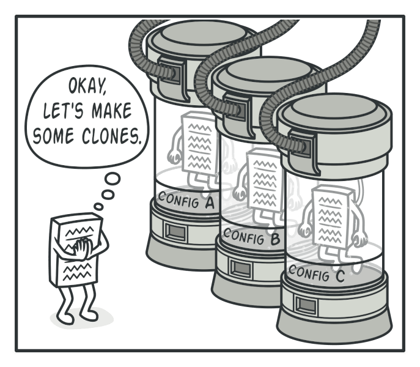
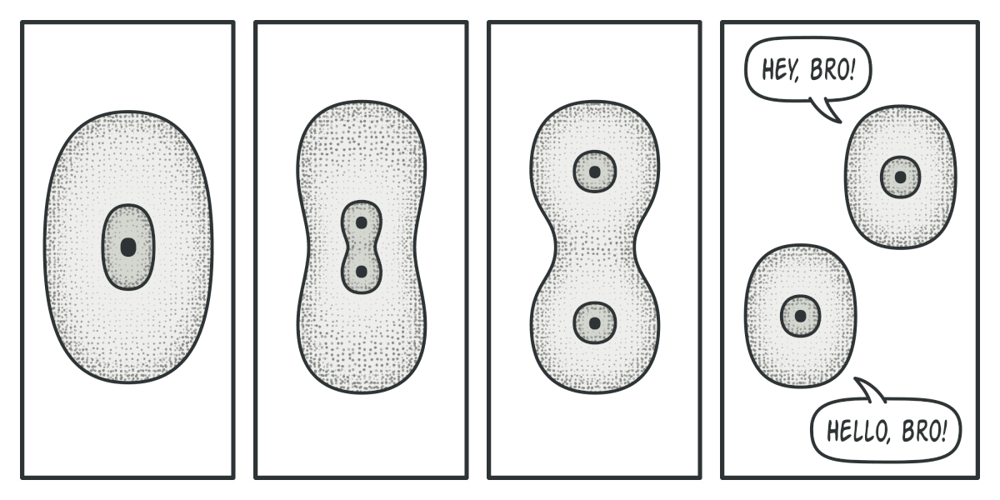
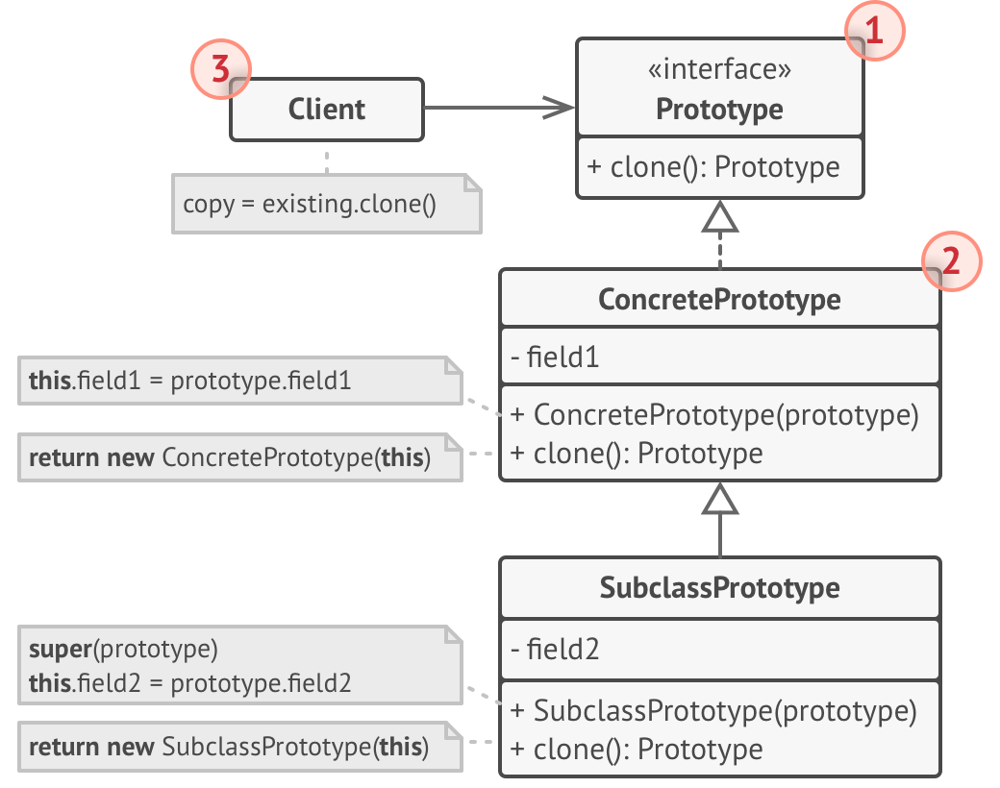
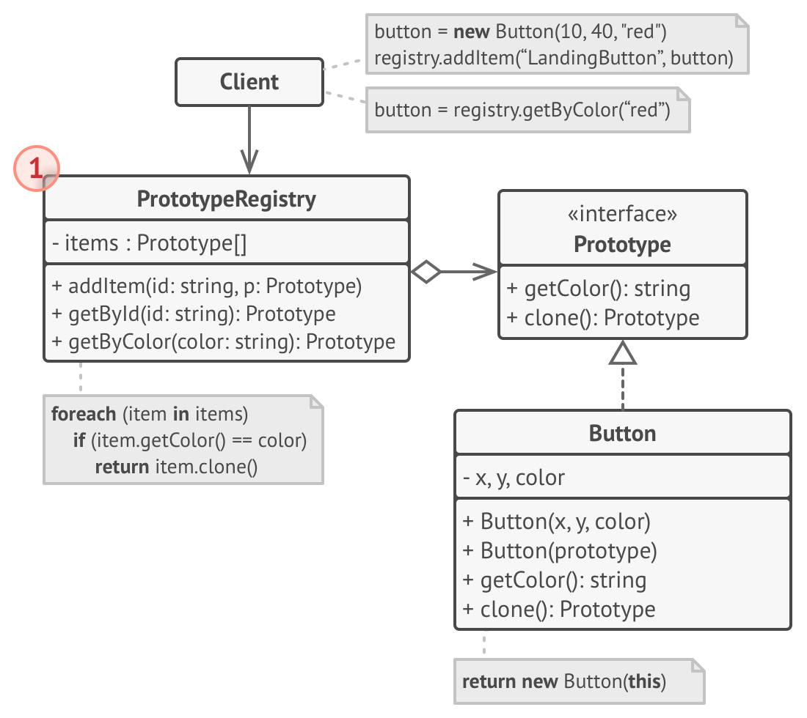
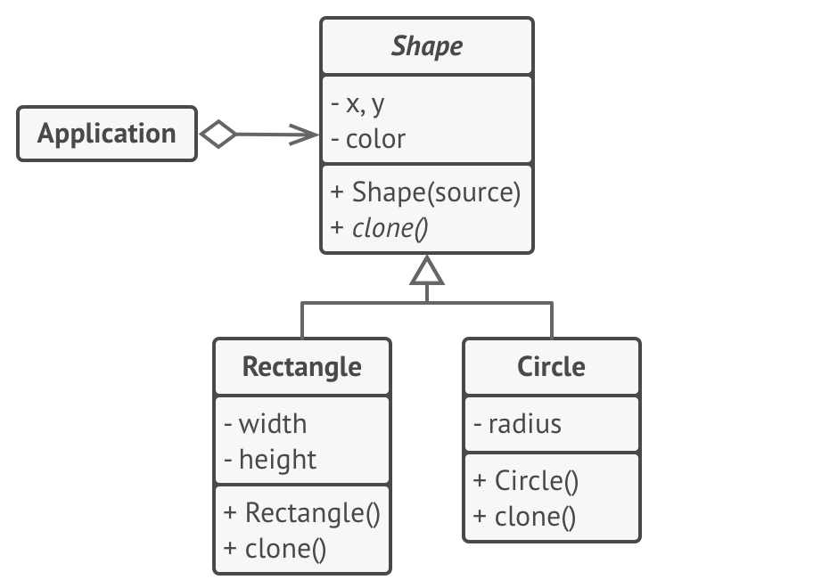

# Prototype


**Type:** Creational · **Also known as:** Clone

> **The 10-second version:** Instead of building a new object from scratch, ask an existing object to hand you a copy of itself — so the code doing the copying never has to know what class it is holding.

<br clear="all">

## Quick card

| | |
|---|---|
| **Problem it solves** | You need a duplicate of an object, but you only hold it through an interface (you don't know its concrete class), and/or its interesting state lives in private fields you can't reach from outside. |
| **Core move** | Put a `clone()` method **on the object itself**. The object builds the new instance of its own class and copies its own fields — including private ones — then returns it typed as the interface. |
| **You'll recognise it by** | A method named `Clone` / `clone` / `Copy` / `with` that returns the *same interface or base type* it was called on, and a `new SameClassAsMe(this)` (or `MemberwiseClone`) inside it. Often paired with a `Dictionary<string, IPrototype>` registry of pre-configured "presets". |
| **Rating** | Complexity ★☆☆ · Popularity ★★☆ |
| **Closest relatives** | Factory Method (creates from a class, not from an instance), Builder (assembles step by step), Memento (snapshots state for undo), Abstract Factory (a factory can be *implemented* by cloning prototypes). |
| **In your stack** | C#: `record` + `with` expressions, `MemberwiseClone`, `DataTable.Copy()`; TS/Node: `structuredClone()`, spread + explicit deep copy of nested arrays; SQL: "duplicate this listing and all its child rows" (`INSERT … SELECT`, or EF Core detach-reset-key-re-add); RabbitMQ: cloning a message envelope + `BasicProperties` to republish it onto a retry/DLQ path with new headers. |

### How to read this file

Technical first, plain English second. 🗣️ marks the plain-English version. Part 1 is Refactoring.Guru's material with their diagrams; Parts 2-7 are code, your stack, and the stuff that makes it stick.

---

# PART 1 — The pattern

## 1. Intent
**Prototype** is a creational design pattern that lets you copy existing objects without making your code dependent on their classes.


### 🗣️ In plain words

You have an object. You want another one exactly like it. The naive way is: look at what class it is, call `new ThatClass()`, then copy field by field. That fails twice — you can't see private fields from outside, and now your code is nailed to `ThatClass`.

Prototype flips the direction. The object copies **itself**. You just call `thing.Clone()` and get back something of the same interface, without ever saying the concrete class name out loud.

## 2. Problem
Say you have an object, and you want to create an exact copy of it. How would you do it? First, you have to create a new object of the same class. Then you have to go through all the fields of the original object and copy their values over to the new object.

Nice! But there’s a catch. Not all objects can be copied that way because some of the object’s fields may be private and not visible from outside of the object itself.


*Copying an object “from the outside” [isn’t](https://refactoring.guru/cargo-cult) always possible.*

There’s one more problem with the direct approach. Since you have to know the object’s class to create a duplicate, your code becomes dependent on that class. If the extra dependency doesn’t scare you, there’s another catch. Sometimes you only know the interface that the object follows, but not its concrete class, when, for example, a parameter in a method accepts any objects that follow some interface.
### 🗣️ In plain words

Copying "from the outside" breaks the moment the object has anything it doesn't expose. And it couples you to the class hierarchy in the ugliest way — a `switch` on type.

Here's the pain, in the shape it actually shows up in a car marketplace. You have a saved-search object handed to you through an interface, and you want to duplicate it so a user can tweak one copy without touching the original:

```csharp
// ❌ The "copy it from outside" approach.
ISavedSearch Duplicate(ISavedSearch original)
{
    // 1) I have to know every concrete type. New type = edit this method.
    switch (original)
    {
        case DealerInventorySearch d:
            return new DealerInventorySearch
            {
                DealerId  = d.DealerId,
                MakeIds   = d.MakeIds,      // 2) shares the SAME list object — mutating the
                PriceMin  = d.PriceMin,     //    copy silently mutates the original
                PriceMax  = d.PriceMax
                // 3) d.ScoringWeights is private. I literally cannot copy it.
                //    The "duplicate" scores results differently from the original.
            };

        case BuyerAlertSearch b:
            return new BuyerAlertSearch { /* the same 20 lines again */ };

        default:
            throw new NotSupportedException(original.GetType().Name); // 4) and this
    }
}
```

Four separate wounds: a type switch, a shallow copy that aliases nested state, private fields that can't be reached, and a runtime throw for any class you didn't anticipate — including classes from a library you don't own.

## 3. Solution
The Prototype pattern delegates the cloning process to the actual objects that are being cloned. The pattern declares a common interface for all objects that support cloning. This interface lets you clone an object without coupling your code to the class of that object. Usually, such an interface contains just a single `clone` method.

The implementation of the `clone` method is very similar in all classes. The method creates an object of the current class and carries over all of the field values of the old object into the new one. You can even copy private fields because most programming languages let objects access private fields of other objects that belong to the same class.

An object that supports cloning is called a *prototype*. When your objects have dozens of fields and hundreds of possible configurations, cloning them might serve as an alternative to subclassing.



*Pre-built prototypes can be an alternative to subclassing.*

Here’s how it works: you create a set of objects, configured in various ways. When you need an object like the one you’ve configured, you just clone a prototype instead of constructing a new object from scratch.
### 🗣️ In plain words

The moves, mechanically:

1. **Declare a cloning contract.** One method — `clone()` — on an interface or base class. It returns the *interface/base type*, not a concrete type.
2. **Let each concrete class implement it, one line.** `return new Me(this);` — a "copy constructor" that takes an instance of its own class. Because that code lives *inside* the class, it can read private fields of the source object. Most languages allow private access between instances of the same class; that's the loophole the whole pattern stands on.
3. **Subclasses call up.** A subclass's copy constructor calls `super(source)` / `: base(source)` first so the parent copies the fields only it can see, then copies its own.
4. **(Optional) Add a registry.** A `name → prototype` map of pre-configured instances. The client asks for `"suv-under-10-lakh"` and gets a fresh clone, never the shared original.

> **The key insight:** The object is the factory. A configured instance *is* a live template — you don't need a subclass per configuration, and you don't need to know the class to reproduce it. Configuration stops being code and becomes data you can hold in a variable, put in a dictionary, or load from a database row.

## 4. Real-world analogy
In real life, prototypes are used for performing various tests before starting mass production of a product. However, in this case, prototypes don’t participate in any actual production, playing a passive role instead.



*The division of a cell.*

Since industrial prototypes don’t really copy themselves, a much closer analogy to the pattern is the process of mitotic cell division (biology, remember?). After mitotic division, a pair of identical cells is formed. The original cell acts as a prototype and takes an active role in creating the copy.

### 🗣️ Two more of my own

**A spare key at the hardware shop.** You hand over your house key and walk out with a second one. The person cutting it has never seen your lock, has no idea who made it, and doesn't own the blueprint. They trace the existing key. That is exactly the pattern's claim: the *thing you already have* carries everything needed to reproduce it, so nobody upstream needs to understand its design.

**A sourdough starter.** You don't reconstruct a starter from a recipe — nobody can, the culture is an accumulated history you can't write down. You take a spoonful of a living one and feed it, and in a day you have a second starter with the same character. Give a spoonful to a friend and now there are two. The private, un-writeable state is the point; cloning is the only transfer mechanism that preserves it.

## 5. Structure
#### Basic implementation



1. The **Prototype** interface declares the cloning methods. In most cases, it’s a single `clone` method.
2. The **Concrete Prototype** class implements the cloning method. In addition to copying the original object’s data to the clone, this method may also handle some edge cases of the cloning process related to cloning linked objects, untangling recursive dependencies, etc.
3. The **Client** can produce a copy of any object that follows the prototype interface.

#### Prototype registry implementation



1. The **Prototype Registry** provides an easy way to access frequently-used prototypes. It stores a set of pre-built objects that are ready to be copied. The simplest prototype registry is a `name → prototype` hash map. However, if you need better search criteria than a simple name, you can build a much more robust version of the registry.
### 🗣️ Participants & roles — cheat table

| Role | What it is in code | Example from the site | Equivalent in reader's stack |
|---|---|---|---|
| **Prototype** | Interface or abstract base declaring `clone()`, returning the base type | `abstract class Shape` with `abstract method clone(): Shape` | C#: `interface IListingTemplate { IListingTemplate Clone(); }`. TS: `interface Cloneable<T> { clone(): T }`. C++: `virtual std::unique_ptr<Shape> clone() const = 0;` |
| **Concrete Prototype** | A class implementing `clone()` as `new Me(this)`, plus a copy constructor doing the field-by-field work | `Rectangle`, `Circle` — each with `constructor Rectangle(source: Rectangle)` and a one-line `clone()` | C# `record DealerListingTemplate` (the compiler writes the copy constructor for `with`), or a hand-written `protected MyType(MyType other)` |
| **Client** | Code that holds prototypes only as the base type and calls `clone()` in a loop | `Application.businessLogic()` — `foreach (s in shapes) shapesCopy.add(s.clone())` | Your controller/service duplicating a saved search, a pricing rule set, or a message envelope without a type switch |
| **Prototype Registry** *(optional)* | A `name → prototype` map that finds a prototype and returns a **clone**, never the stored instance | The second structure diagram — a registry keyed by search criteria | C#: `Dictionary<string, IListingTemplate>` behind a singleton service, seeded from config or a `listing_templates` table |

### 🤝 Collaboration — who calls whom

```
   CLIENT                      PROTOTYPE (interface)        CONCRETE PROTOTYPE
     │                                 │                      (e.g. Circle)
     │  holds: IShape original         │                            │
     │                                 │                            │
     │──── original.clone() ──────────>│                            │
     │      (static type: IShape)      │ virtual dispatch           │
     │                                 │───────────────────────────>│
     │                                 │                            │
     │                                 │                  new Circle(this)  👈 the whole pattern
     │                                 │                            │  ├─ base(source): copies X, Y, color
     │                                 │                            │  │   (including PRIVATE fields —
     │                                 │                            │  │    legal: same class, other instance)
     │                                 │                            │  └─ this.radius = source.radius
     │                                 │                            │
     │<──────── IShape (really a fully-built Circle) ───────────────│
     │                                 │                            │
     │  Client never wrote the word "Circle".                       │

   WITH A REGISTRY
   ───────────────
   CLIENT ──get("suv-budget")──> REGISTRY ──lookup──> stored prototype
                                     │                       │
                                     │<──── clone() ─────────│
     <──── fresh copy ───────────────│
          (registry NEVER hands out the stored instance itself)
```

The one hop that matters: **`new Circle(this)` inside `Circle`**. That single line is why the pattern works — it is simultaneously (a) virtual-dispatched, so the right class is chosen without a type switch, and (b) inside the class, so private fields are readable. Move that line outside the class and both properties die at once.

## 6. Pseudocode (the website's example)
In this example, the **Prototype** pattern lets you produce exact copies of geometric objects, without coupling the code to their classes.



*Cloning a set of objects that belong to a class hierarchy.*

All shape classes follow the same interface, which provides a cloning method. A subclass may call the parent’s cloning method before copying its own field values to the resulting object.

```
// Base prototype.
abstract class Shape is
    field X: int
    field Y: int
    field color: string

    // A regular constructor.
    constructor Shape() is
        // ...

    // The prototype constructor. A fresh object is initialized
    // with values from the existing object.
    constructor Shape(source: Shape) is
        this()
        this.X = source.X
        this.Y = source.Y
        this.color = source.color

    // The clone operation returns one of the Shape subclasses.
    abstract method clone():Shape

// Concrete prototype. The cloning method creates a new object
// in one go by calling the constructor of the current class and
// passing the current object as the constructor's argument.
// Performing all the actual copying in the constructor helps to
// keep the result consistent: the constructor will not return a
// result until the new object is fully built; thus, no object
// can have a reference to a partially-built clone.
class Rectangle extends Shape is
    field width: int
    field height: int

    constructor Rectangle(source: Rectangle) is
        // A parent constructor call is needed to copy private
        // fields defined in the parent class.
        super(source)
        this.width = source.width
        this.height = source.height

    method clone():Shape is
        return new Rectangle(this)

class Circle extends Shape is
    field radius: int

    constructor Circle(source: Circle) is
        super(source)
        this.radius = source.radius

    method clone():Shape is
        return new Circle(this)

// Somewhere in the client code.
class Application is
    field shapes: array of Shape

    constructor Application() is
        Circle circle = new Circle()
        circle.X = 10
        circle.Y = 10
        circle.radius = 20
        shapes.add(circle)

        Circle anotherCircle = circle.clone()
        shapes.add(anotherCircle)
        // The `anotherCircle` variable contains an exact copy
        // of the `circle` object.

        Rectangle rectangle = new Rectangle()
        rectangle.width = 10
        rectangle.height = 20
        shapes.add(rectangle)

    method businessLogic() is
        // Prototype rocks because it lets you produce a copy of
        // an object without knowing anything about its type.
        Array shapesCopy = new Array of Shapes.

        // For instance, we don't know the exact elements in the
        // shapes array. All we know is that they are all
        // shapes. But thanks to polymorphism, when we call the
        // `clone` method on a shape the program checks its real
        // class and runs the appropriate clone method defined
        // in that class. That's why we get proper clones
        // instead of a set of simple Shape objects.
        foreach (s in shapes) do
            shapesCopy.add(s.clone())

        // The `shapesCopy` array contains exact copies of the
        // `shape` array's children.
```
### 🗣️ Reading that pseudocode

- **`constructor Shape(source: Shape)`** — this is the real workhorse, not `clone()`. It's an overload of the constructor that takes "one of me" and copies `X`, `Y`, `color`. The comment on `Rectangle` spells out why a constructor and not a method: the object can't be observed half-copied, because `new` doesn't return until it's fully built.
- **`abstract method clone(): Shape`** — note the *return type is `Shape`*, the base. That's what lets the client stay ignorant. If it returned `Rectangle`, every caller would need to know it had a rectangle.
- **`super(source)` in `Rectangle`'s copy constructor** — the comment says it explicitly: *"needed to copy private fields defined in the parent class."* `Rectangle` cannot touch `Shape`'s privates; only `Shape`'s own code can. So each level of the hierarchy copies its own layer, on the way down.
- **`method clone() is return new Rectangle(this)`** — one line, and it names its **own** class. Every concrete class must override `clone()` with its own name. Inherit this method without overriding it and `Circle.clone()` hands you a `Rectangle` (or a base `Shape`) — a silent, vicious bug.
- **`foreach (s in shapes) shapesCopy.add(s.clone())`** — the payoff line. The array is `array of Shape`; the loop has no idea what's inside; polymorphism picks the right `clone()` per element. Compare that to the `switch` in my Problem snippet above.
- **`Circle anotherCircle = circle.clone()`** — this is also the pattern's only real ergonomic wart: `clone()` is declared to return `Shape`, so in a real language this assignment needs a cast (or covariant return types, which C++, Java and — via `new` on a property — C# handle differently). Keep an eye on that; it's section 3.3's main event.

## 7. Applicability — when to reach for it
**Use the Prototype pattern when your code shouldn’t depend on the concrete classes of objects that you need to copy.**

This happens a lot when your code works with objects passed to you from 3rd-party code via some interface. The concrete classes of these objects are unknown, and you couldn’t depend on them even if you wanted to.

The Prototype pattern provides the client code with a general interface for working with all objects that support cloning. This interface makes the client code independent from the concrete classes of objects that it clones.

**Use the pattern when you want to reduce the number of subclasses that only differ in the way they initialize their respective objects.**

Suppose you have a complex class that requires a laborious configuration before it can be used. There are several common ways to configure this class, and this code is scattered through your app. To reduce the duplication, you create several subclasses and put every common configuration code into their constructors. You solved the duplication problem, but now you have lots of dummy subclasses.

The Prototype pattern lets you use a set of pre-built objects configured in various ways as prototypes. Instead of instantiating a subclass that matches some configuration, the client can simply look for an appropriate prototype and clone it.
### ✅ Quick checklist

- [ ] Do I hold the object **only as an interface/base type**, with the concrete type unknown at compile time (plugins, DI-resolved implementations, 3rd-party objects)?
- [ ] Does the object carry **state I cannot reconstruct from outside** — private fields, computed caches, an accumulated history?
- [ ] Am I about to write (or am I already staring at) a **subclass whose only job is to set different default values**? `SuvSearchDefaults`, `LuxurySearchDefaults`, `BudgetSearchDefaults`…
- [ ] Is building one of these objects **expensive** (parsed config, compiled regex, a warmed lookup table) while copying it is cheap?
- [ ] Do I need **"same thing, one field different"** repeatedly — variants of a config, per-dealer overrides of a pricing rule, a message resent with new headers?
- [ ] Do users need to **"Duplicate" something in the UI** — duplicate listing, duplicate saved search, duplicate campaign?

Three or more ticks: Prototype (or your language's built-in version of it) is the right tool. Zero or one tick: a plain constructor is better, and you should stop reading and go write it.

## 8. How to implement — step by step
1. Create the prototype interface and declare the `clone` method in it. Or just add the method to all classes of an existing class hierarchy, if you have one.
2. A prototype class must define the alternative constructor that accepts an object of that class as an argument. The constructor must copy the values of all fields defined in the class from the passed object into the newly created instance. If you’re changing a subclass, you must call the parent constructor to let the superclass handle the cloning of its private fields.

   If your programming language doesn’t support method overloading, you won’t be able to create a separate “prototype” constructor. Thus, copying the object’s data into the newly created clone will have to be performed within the `clone` method. Still, having this code in a regular constructor is safer because the resulting object is returned fully configured right after you call the `new` operator.
3. The cloning method usually consists of just one line: running a `new` operator with the prototypical version of the constructor. Note, that every class must explicitly override the cloning method and use its own class name along with the `new` operator. Otherwise, the cloning method may produce an object of a parent class.
4. Optionally, create a centralized prototype registry to store a catalog of frequently used prototypes.

   You can implement the registry as a new factory class or put it in the base prototype class with a static method for fetching the prototype. This method should search for a prototype based on search criteria that the client code passes to the method. The criteria might either be a simple string tag or a complex set of search parameters. After the appropriate prototype is found, the registry should clone it and return the copy to the client.

   Finally, replace the direct calls to the subclasses’ constructors with calls to the factory method of the prototype registry.
### 🗣️ The same steps, blunt version

1. **Add `clone()` to the base type.** Return the base type, not the concrete one.
2. **Give every class a copy constructor** that takes its own type. Copy your fields. If you have a parent, call the parent's copy constructor *first* and let it copy the fields you can't see.
3. **Implement `clone()` in every concrete class as `return new MyExactClassName(this);`** — every class, no exceptions, or you'll get the wrong type back from a subclass.
4. **Decide shallow vs deep, per field, right now.** Value types and immutable strings: shallow is fine. Lists, dictionaries, child objects you mutate: allocate new ones in the copy constructor. This decision is the entire bug surface of the pattern — don't defer it.
5. **Optionally add a registry**: a dictionary of pre-built, named prototypes. Its getter **clones before returning**. If it ever returns the stored instance, you have built a shared-mutable-global disguised as a pattern.

## 9. Pros and cons
- ✅ You can clone objects without coupling to their concrete classes.
- ✅ You can get rid of repeated initialization code in favor of cloning pre-built prototypes.
- ✅ You can produce complex objects more conveniently.
- ✅ You get an alternative to inheritance when dealing with configuration presets for complex objects.

- ⛔ Cloning complex objects that have circular references might be very tricky.
### ⚖️ Honest trade-offs from the trenches

**The true cost isn't the `clone()` method — it's the shallow/deep decision, forever.** Writing `clone()` is five minutes. The cost lands six months later when someone adds a `List<PhotoRef> Photos` field to the class and doesn't touch the copy constructor. Now clone and original share one list, a user edits photos on the duplicate, and the original changes too. Nothing crashes; the data just quietly rots. Every class that implements `clone()` acquires a permanent maintenance obligation: *every new reference-typed field must be considered*. My rule is to make it structurally impossible instead — make the fields immutable (`IReadOnlyList`, `record`, `readonly struct`) so shallow copying is *correct by construction* and there's nothing to forget.

**The tell that it's genuinely worth it** is when you can point at either (a) a type switch you deleted, or (b) a family of subclasses that existed only to hold different default values. If you can't point at one of those, you've added an interface for nothing. Prototype is not "a nicer way to copy an object" — copying is just `new`. It's specifically "copy without naming the class."

**Modern C# gives most of this away for free, and you should take it.** A `record` (or `record struct`) gets a compiler-generated protected copy constructor and the `with` expression: `var cheaper = search with { PriceMax = 800_000 };` — that *is* the prototype pattern, shallow, with covariant return types handled by the compiler, and it composes with `init`-only properties. Positional records also get value equality, which makes clone-correctness testable in one line (`Assert.Equal(original, clone)`). For the polymorphic case, records preserve the runtime type across `with` (the generated `<Clone>$` method is virtual), so `IReadOnlyList<SearchBase>` + `with` behaves exactly like the GoF diagram without you writing a single `Clone` method. In TypeScript, `structuredClone()` (Node 17+, all modern browsers) does a real deep copy, handles cycles correctly, and is native code — it replaces `_.cloneDeep` for plain data. Reach for hand-rolled `clone()` only when you need *polymorphism* (`structuredClone` returns a plain object, losing the class) or *selective* copying (share the cache, copy the config).

**Where DI containers touch this:** they mostly don't, and that trips people up. A DI container resolves by *type*; Prototype reproduces by *instance*. The place they meet is registering pre-configured instances — `services.AddKeyedSingleton<IPricingRules>("dealer-default", rules)` — and then having the consumer clone what it resolves before mutating. If you find yourself registering a `Transient` service purely so each caller gets a fresh copy of some settings object, you probably wanted a singleton prototype plus a clone, because the transient re-runs the expensive setup every time.

## 10. Relations with other patterns
- Many designs start by using [Factory Method](https://refactoring.guru/design-patterns/factory-method) (less complicated and more customizable via subclasses) and evolve toward [Abstract Factory](https://refactoring.guru/design-patterns/abstract-factory), [Prototype](https://refactoring.guru/design-patterns/prototype), or [Builder](https://refactoring.guru/design-patterns/builder) (more flexible, but more complicated).
- [Abstract Factory](https://refactoring.guru/design-patterns/abstract-factory) classes are often based on a set of [Factory Methods](https://refactoring.guru/design-patterns/factory-method), but you can also use [Prototype](https://refactoring.guru/design-patterns/prototype) to compose the methods on these classes.
- [Prototype](https://refactoring.guru/design-patterns/prototype) can help when you need to save copies of [Commands](https://refactoring.guru/design-patterns/command) into history.
- Designs that make heavy use of [Composite](https://refactoring.guru/design-patterns/composite) and [Decorator](https://refactoring.guru/design-patterns/decorator) can often benefit from using [Prototype](https://refactoring.guru/design-patterns/prototype). Applying the pattern lets you clone complex structures instead of re-constructing them from scratch.
- [Prototype](https://refactoring.guru/design-patterns/prototype) isn’t based on inheritance, so it doesn’t have its drawbacks. On the other hand, *Prototype* requires a complicated initialization of the cloned object. [Factory Method](https://refactoring.guru/design-patterns/factory-method) is based on inheritance but doesn’t require an initialization step.
- Sometimes [Prototype](https://refactoring.guru/design-patterns/prototype) can be a simpler alternative to [Memento](https://refactoring.guru/design-patterns/memento). This works if the object, the state of which you want to store in the history, is fairly straightforward and doesn’t have links to external resources, or the links are easy to re-establish.
- [Abstract Factories](https://refactoring.guru/design-patterns/abstract-factory), [Builders](https://refactoring.guru/design-patterns/builder) and [Prototypes](https://refactoring.guru/design-patterns/prototype) can all be implemented as [Singletons](https://refactoring.guru/design-patterns/singleton).
### 🗣️ Disambiguation table

| Pattern | What it makes | Where the "recipe" lives | The separator |
|---|---|---|---|
| **Prototype** | A copy of an existing object | **In the object itself** — the live instance is the template | You need one to make one. No existing instance, no clone. |
| **Factory Method** | A brand-new object | In a **subclass** that overrides the creating method | The recipe is compiled in; you vary it by subclassing. |
| **Abstract Factory** | A matched *family* of new objects | In a **factory object**, one per family | It guarantees the pieces go together; Prototype guarantees the copy matches the source. |
| **Builder** | One complex object, assembled | In a **step sequence** the caller drives | Builder is for when construction has stages; Prototype skips construction entirely. |
| **Memento** | A snapshot of state, for later restore | In an opaque **state capsule** the originator understands | A memento is *not usable as the object* — you can't run it. A clone is a fully working second object. |

***Factory Method asks "what class should I build?" Prototype refuses to ask, and points at a thing that already exists.***

And the one people quietly confuse in JavaScript: **`Object.create(proto)` / `__proto__` is not this pattern.** JS prototypes are a *delegation* mechanism — the child keeps a live link to the parent and looks up missing properties there. The Prototype pattern makes an *independent* copy with no link back. Same word, opposite lifetime semantics. (JS does have the pattern too — `structuredClone`, `Node.cloneNode`, `Response.clone`.)

---

# PART 2 — Official code examples from Refactoring.Guru

## 2.1 C#
**Complexity:** ★☆☆ (1/3)

**Popularity:** ★★☆ (2/3)

**Usage examples:** The Prototype pattern is available in C# out of the box with a `ICloneable` interface.

**Identification:** The prototype can be easily recognized by a `clone` or `copy` methods, etc.
### Conceptual Example

This example illustrates the structure of the **Prototype** design pattern. It focuses on answering these questions:

- What classes does it consist of?
- What roles do these classes play?
- In what way the elements of the pattern are related?

##### **Program.cs:** Conceptual example

```csharp
using System;

namespace RefactoringGuru.DesignPatterns.Prototype.Conceptual
{
    public class Person
    {
        public int Age;
        public DateTime BirthDate;
        public string Name;
        public IdInfo IdInfo;

        public Person ShallowCopy()
        {
            return (Person) this.MemberwiseClone();
        }

        public Person DeepCopy()
        {
            Person clone = (Person) this.MemberwiseClone();
            clone.IdInfo = new IdInfo(IdInfo.IdNumber);
            clone.Name = String.Copy(Name);
            return clone;
        }
    }

    public class IdInfo
    {
        public int IdNumber;

        public IdInfo(int idNumber)
        {
            this.IdNumber = idNumber;
        }
    }

    class Program
    {
        static void Main(string[] args)
        {
            Person p1 = new Person();
            p1.Age = 42;
            p1.BirthDate = Convert.ToDateTime("1977-01-01");
            p1.Name = "Jack Daniels";
            p1.IdInfo = new IdInfo(666);

            // Perform a shallow copy of p1 and assign it to p2.
            Person p2 = p1.ShallowCopy();
            // Make a deep copy of p1 and assign it to p3.
            Person p3 = p1.DeepCopy();

            // Display values of p1, p2 and p3.
            Console.WriteLine("Original values of p1, p2, p3:");
            Console.WriteLine("   p1 instance values: ");
            DisplayValues(p1);
            Console.WriteLine("   p2 instance values:");
            DisplayValues(p2);
            Console.WriteLine("   p3 instance values:");
            DisplayValues(p3);

            // Change the value of p1 properties and display the values of p1,
            // p2 and p3.
            p1.Age = 32;
            p1.BirthDate = Convert.ToDateTime("1900-01-01");
            p1.Name = "Frank";
            p1.IdInfo.IdNumber = 7878;
            Console.WriteLine("\nValues of p1, p2 and p3 after changes to p1:");
            Console.WriteLine("   p1 instance values: ");
            DisplayValues(p1);
            Console.WriteLine("   p2 instance values (reference values have changed):");
            DisplayValues(p2);
            Console.WriteLine("   p3 instance values (everything was kept the same):");
            DisplayValues(p3);
        }

        public static void DisplayValues(Person p)
        {
            Console.WriteLine("      Name: {0:s}, Age: {1:d}, BirthDate: {2:MM/dd/yy}",
                p.Name, p.Age, p.BirthDate);
            Console.WriteLine("      ID#: {0:d}", p.IdInfo.IdNumber);
        }
    }
}
```

##### **Output.txt:** Execution result

```output
Original values of p1, p2, p3:
   p1 instance values:
      Name: Jack Daniels, Age: 42, BirthDate: 01/01/77
      ID#: 666
   p2 instance values:
      Name: Jack Daniels, Age: 42, BirthDate: 01/01/77
      ID#: 666
   p3 instance values:
      Name: Jack Daniels, Age: 42, BirthDate: 01/01/77
      ID#: 666

Values of p1, p2 and p3 after changes to p1:
   p1 instance values:
      Name: Frank, Age: 32, BirthDate: 01/01/00
      ID#: 7878
   p2 instance values (reference values have changed):
      Name: Jack Daniels, Age: 42, BirthDate: 01/01/77
      ID#: 7878
   p3 instance values (everything was kept the same):
      Name: Jack Daniels, Age: 42, BirthDate: 01/01/77
      ID#: 666
```

## 2.2 TypeScript
**Complexity:** ★☆☆ (1/3)

**Popularity:** ★★☆ (2/3)

**Usage examples:** The Prototype pattern is available in TypeScript out of the box with a JavaScript’s native `Object.assign()` method.

**Identification:** The prototype can be easily recognized by a `clone` or `copy` methods, etc.
### Conceptual Example

This example illustrates the structure of the **Prototype** design pattern and focuses on the following questions:

- What classes does it consist of?
- What roles do these classes play?
- In what way the elements of the pattern are related?

##### **index.ts:** Conceptual example

```typescript
/**
 * The example class that has cloning ability. We'll see how the values of field
 * with different types will be cloned.
 */
class Prototype {
    public primitive: any;
    public component: object;
    public circularReference: ComponentWithBackReference;

    public clone(): this {
        const clone = Object.create(this);

        clone.component = Object.create(this.component);

        // Cloning an object that has a nested object with backreference
        // requires special treatment. After the cloning is completed, the
        // nested object should point to the cloned object, instead of the
        // original object. Spread operator can be handy for this case.
        clone.circularReference = new ComponentWithBackReference(clone);

        return clone;
    }
}

class ComponentWithBackReference {
    public prototype;

    constructor(prototype: Prototype) {
        this.prototype = prototype;
    }
}

/**
 * The client code.
 */
function clientCode() {
    const p1 = new Prototype();
    p1.primitive = 245;
    p1.component = new Date();
    p1.circularReference = new ComponentWithBackReference(p1);

    const p2 = p1.clone();
    if (p1.primitive === p2.primitive) {
        console.log('Primitive field values have been carried over to a clone. Yay!');
    } else {
        console.log('Primitive field values have not been copied. Booo!');
    }
    if (p1.component === p2.component) {
        console.log('Simple component has not been cloned. Booo!');
    } else {
        console.log('Simple component has been cloned. Yay!');
    }

    if (p1.circularReference === p2.circularReference) {
        console.log('Component with back reference has not been cloned. Booo!');
    } else {
        console.log('Component with back reference has been cloned. Yay!');
    }

    if (p1.circularReference.prototype === p2.circularReference.prototype) {
        console.log('Component with back reference is linked to original object. Booo!');
    } else {
        console.log('Component with back reference is linked to the clone. Yay!');
    }
}

clientCode();
```

##### **Output.txt:** Execution result

```output
Primitive field values have been carried over to a clone. Yay!
Simple component has been cloned. Yay!
Component with back reference has been cloned. Yay!
Component with back reference is linked to the clone. Yay!
```

## 2.3 C++
**Complexity:** ★☆☆ (1/3)

**Popularity:** ★★☆ (2/3)

**Identification:** The prototype can be easily recognized by a `clone` or `copy` methods, etc.
### Conceptual Example

This example illustrates the structure of the **Prototype** design pattern. It focuses on answering these questions:

- What classes does it consist of?
- What roles do these classes play?
- In what way the elements of the pattern are related?

##### **main.cc:** Conceptual example

```cpp
using std::string;

// Prototype Design Pattern
//
// Intent: Lets you copy existing objects without making your code dependent on
// their classes.

enum Type {
  PROTOTYPE_1 = 0,
  PROTOTYPE_2
};

/**
 * The example class that has cloning ability. We'll see how the values of field
 * with different types will be cloned.
 */

class Prototype {
 protected:
  string prototype_name_;
  float prototype_field_;

 public:
  Prototype() {}
  Prototype(string prototype_name)
      : prototype_name_(prototype_name) {
  }
  virtual ~Prototype() {}
  virtual Prototype *Clone() const = 0;
  virtual void Method(float prototype_field) {
    this->prototype_field_ = prototype_field;
    std::cout << "Call Method from " << prototype_name_ << " with field : " << prototype_field << std::endl;
  }
};

/**
 * ConcretePrototype1 is a Sub-Class of Prototype and implement the Clone Method
 * In this example all data members of Prototype Class are in the Stack. If you
 * have pointers in your properties for ex: String* name_ ,you will need to
 * implement the Copy-Constructor to make sure you have a deep copy from the
 * clone method
 */

class ConcretePrototype1 : public Prototype {
 private:
  float concrete_prototype_field1_;

 public:
  ConcretePrototype1(string prototype_name, float concrete_prototype_field)
      : Prototype(prototype_name), concrete_prototype_field1_(concrete_prototype_field) {
  }

  /**
   * Notice that Clone method return a Pointer to a new ConcretePrototype1
   * replica. so, the client (who call the clone method) has the responsability
   * to free that memory. If you have smart pointer knowledge you may prefer to
   * use unique_pointer here.
   */
  Prototype *Clone() const override {
    return new ConcretePrototype1(*this);
  }
};

class ConcretePrototype2 : public Prototype {
 private:
  float concrete_prototype_field2_;

 public:
  ConcretePrototype2(string prototype_name, float concrete_prototype_field)
      : Prototype(prototype_name), concrete_prototype_field2_(concrete_prototype_field) {
  }
  Prototype *Clone() const override {
    return new ConcretePrototype2(*this);
  }
};

/**
 * In PrototypeFactory you have two concrete prototypes, one for each concrete
 * prototype class, so each time you want to create a bullet , you can use the
 * existing ones and clone those.
 */

class PrototypeFactory {
 private:
  std::unordered_map<Type, Prototype *, std::hash<int>> prototypes_;

 public:
  PrototypeFactory() {
    prototypes_[Type::PROTOTYPE_1] = new ConcretePrototype1("PROTOTYPE_1 ", 50.f);
    prototypes_[Type::PROTOTYPE_2] = new ConcretePrototype2("PROTOTYPE_2 ", 60.f);
  }

  /**
   * Be carefull of free all memory allocated. Again, if you have smart pointers
   * knowelege will be better to use it here.
   */

  ~PrototypeFactory() {
    delete prototypes_[Type::PROTOTYPE_1];
    delete prototypes_[Type::PROTOTYPE_2];
  }

  /**
   * Notice here that you just need to specify the type of the prototype you
   * want and the method will create from the object with this type.
   */
  Prototype *CreatePrototype(Type type) {
    return prototypes_[type]->Clone();
  }
};

void Client(PrototypeFactory &prototype_factory) {
  std::cout << "Let's create a Prototype 1\n";

  Prototype *prototype = prototype_factory.CreatePrototype(Type::PROTOTYPE_1);
  prototype->Method(90);
  delete prototype;

  std::cout << "\n";

  std::cout << "Let's create a Prototype 2 \n";

  prototype = prototype_factory.CreatePrototype(Type::PROTOTYPE_2);
  prototype->Method(10);

  delete prototype;
}

int main() {
  PrototypeFactory *prototype_factory = new PrototypeFactory();
  Client(*prototype_factory);
  delete prototype_factory;

  return 0;
}
```

##### **Output.txt:** Execution result

```output
Let's create a Prototype 1
Call Method from PROTOTYPE_1  with field : 90

Let's create a Prototype 2
Call Method from PROTOTYPE_2  with field : 10
```

## 2.4 Java
**Complexity:** ★☆☆ (1/3)

**Popularity:** ★★☆ (2/3)

**Usage examples:** The Prototype pattern is available in Java out of the box with a `Cloneable` interface.

**Identification:** The prototype can be easily recognized by a `clone` or `copy` methods, etc.
### Copying graphical shapes

Let’s take a look at how the Prototype can be implemented without the standard `Cloneable` interface.

#### **shapes:** Shape list

##### **shapes/Shape.java:** Common shape interface

```java
package refactoring_guru.prototype.example.shapes;

import java.util.Objects;

public abstract class Shape {
    public int x;
    public int y;
    public String color;

    public Shape() {
    }

    public Shape(Shape target) {
        if (target != null) {
            this.x = target.x;
            this.y = target.y;
            this.color = target.color;
        }
    }

    public abstract Shape clone();

    @Override
    public boolean equals(Object object2) {
        if (!(object2 instanceof Shape)) return false;
        Shape shape2 = (Shape) object2;
        return shape2.x == x && shape2.y == y && Objects.equals(shape2.color, color);
    }
}
```

##### **shapes/Circle.java:** Simple shape

```java
package refactoring_guru.prototype.example.shapes;

public class Circle extends Shape {
    public int radius;

    public Circle() {
    }

    public Circle(Circle target) {
        super(target);
        if (target != null) {
            this.radius = target.radius;
        }
    }

    @Override
    public Shape clone() {
        return new Circle(this);
    }

    @Override
    public boolean equals(Object object2) {
        if (!(object2 instanceof Circle) || !super.equals(object2)) return false;
        Circle shape2 = (Circle) object2;
        return shape2.radius == radius;
    }
}
```

##### **shapes/Rectangle.java:** Another shape

```java
package refactoring_guru.prototype.example.shapes;

public class Rectangle extends Shape {
    public int width;
    public int height;

    public Rectangle() {
    }

    public Rectangle(Rectangle target) {
        super(target);
        if (target != null) {
            this.width = target.width;
            this.height = target.height;
        }
    }

    @Override
    public Shape clone() {
        return new Rectangle(this);
    }

    @Override
    public boolean equals(Object object2) {
        if (!(object2 instanceof Rectangle) || !super.equals(object2)) return false;
        Rectangle shape2 = (Rectangle) object2;
        return shape2.width == width && shape2.height == height;
    }
}
```

##### **Demo.java:** Cloning example

```java
package refactoring_guru.prototype.example;

import refactoring_guru.prototype.example.shapes.Circle;
import refactoring_guru.prototype.example.shapes.Rectangle;
import refactoring_guru.prototype.example.shapes.Shape;

import java.util.ArrayList;
import java.util.List;

public class Demo {
    public static void main(String[] args) {
        List<Shape> shapes = new ArrayList<>();
        List<Shape> shapesCopy = new ArrayList<>();

        Circle circle = new Circle();
        circle.x = 10;
        circle.y = 20;
        circle.radius = 15;
        circle.color = "red";
        shapes.add(circle);

        Circle anotherCircle = (Circle) circle.clone();
        shapes.add(anotherCircle);

        Rectangle rectangle = new Rectangle();
        rectangle.width = 10;
        rectangle.height = 20;
        rectangle.color = "blue";
        shapes.add(rectangle);

        cloneAndCompare(shapes, shapesCopy);
    }

    private static void cloneAndCompare(List<Shape> shapes, List<Shape> shapesCopy) {
        for (Shape shape : shapes) {
            shapesCopy.add(shape.clone());
        }

        for (int i = 0; i < shapes.size(); i++) {
            if (shapes.get(i) != shapesCopy.get(i)) {
                System.out.println(i + ": Shapes are different objects (yay!)");
                if (shapes.get(i).equals(shapesCopy.get(i))) {
                    System.out.println(i + ": And they are identical (yay!)");
                } else {
                    System.out.println(i + ": But they are not identical (booo!)");
                }
            } else {
                System.out.println(i + ": Shape objects are the same (booo!)");
            }
        }
    }
}
```

##### **OutputDemo.txt:** Execution result

```output
0: Shapes are different objects (yay!)
0: And they are identical (yay!)
1: Shapes are different objects (yay!)
1: And they are identical (yay!)
2: Shapes are different objects (yay!)
2: And they are identical (yay!)
```

#### Prototype registry

You could implement a centralized prototype registry (or factory), which would contain a set of pre-defined prototype objects. This way you could retrieve new objects from the factory by passing its name or other parameters. The factory would search for an appropriate prototype, clone it and return you a copy.

#### **cache**

##### **cache/BundledShapeCache.java:** Prototype factory

```java
package refactoring_guru.prototype.caching.cache;

import refactoring_guru.prototype.example.shapes.Circle;
import refactoring_guru.prototype.example.shapes.Rectangle;
import refactoring_guru.prototype.example.shapes.Shape;

import java.util.HashMap;
import java.util.Map;

public class BundledShapeCache {
    private Map<String, Shape> cache = new HashMap<>();

    public BundledShapeCache() {
        Circle circle = new Circle();
        circle.x = 5;
        circle.y = 7;
        circle.radius = 45;
        circle.color = "Green";

        Rectangle rectangle = new Rectangle();
        rectangle.x = 6;
        rectangle.y = 9;
        rectangle.width = 8;
        rectangle.height = 10;
        rectangle.color = "Blue";

        cache.put("Big green circle", circle);
        cache.put("Medium blue rectangle", rectangle);
    }

    public Shape put(String key, Shape shape) {
        cache.put(key, shape);
        return shape;
    }

    public Shape get(String key) {
        return cache.get(key).clone();
    }
}
```

##### **Demo.java:** Cloning example

```java
package refactoring_guru.prototype.caching;

import refactoring_guru.prototype.caching.cache.BundledShapeCache;
import refactoring_guru.prototype.example.shapes.Shape;

public class Demo {
    public static void main(String[] args) {
        BundledShapeCache cache = new BundledShapeCache();

        Shape shape1 = cache.get("Big green circle");
        Shape shape2 = cache.get("Medium blue rectangle");
        Shape shape3 = cache.get("Medium blue rectangle");

        if (shape1 != shape2 && !shape1.equals(shape2)) {
            System.out.println("Big green circle != Medium blue rectangle (yay!)");
        } else {
            System.out.println("Big green circle == Medium blue rectangle (booo!)");
        }

        if (shape2 != shape3) {
            System.out.println("Medium blue rectangles are two different objects (yay!)");
            if (shape2.equals(shape3)) {
                System.out.println("And they are identical (yay!)");
            } else {
                System.out.println("But they are not identical (booo!)");
            }
        } else {
            System.out.println("Rectangle objects are the same (booo!)");
        }
    }
}
```

##### **OutputDemo.txt:** Execution result

```output
Big green circle != Medium blue rectangle (yay!)
Medium blue rectangles are two different objects (yay!)
And they are identical (yay!)
```

---

# PART 3 — Learn it by building it

## 3.1 The dumbest possible version — TypeScript

The domain: a car marketplace where dealers publish listings. Most of a dealer's listings are near-identical — same dealer, same city, same warranty terms, same photo watermark settings — differing only in variant, price and kilometres. So the product team asks for a "Duplicate listing" button.

### ❌ BEFORE — copy it from the outside

```typescript
interface Listing {
  id: string;
  dealerId: number;
  make: string;
  model: string;
  variant: string;
  priceInr: number;
  kmDriven: number;
  features: string[];
  seo: { title: string; slug: string };
}

function duplicate(l: Listing): Listing {
  return {
    ...l,              // 👈 shallow. `features` and `seo` are SHARED with the original.
    id: crypto.randomUUID(),
  };
}

const original = await repo.get('L-1001');
const copy = duplicate(original);
copy.features.push('Sunroof');     // 💥 the ORIGINAL listing now claims a sunroof
copy.seo.slug = 'new-slug';        // 💥 and the original's slug just changed too
```

It gets worse once listings become classes. A `FeaturedListing` (extra fields: `boostBudget`, `campaignId`) passed into `duplicate()` comes back as a plain object — the class, its methods, and its extra fields are gone. And if the price is computed by a private, dealer-specific discount engine held on the instance, there is no way to carry it over from outside at all.

### ✅ AFTER — the object clones itself

```typescript
// ─────────────────────────────────────────────────────────────
//  1. THE PROTOTYPE CONTRACT
// ─────────────────────────────────────────────────────────────
// The return type is the interface, not a concrete class. That is the
// whole point: callers stay ignorant of what they are holding.
interface ListingPrototype {
  clone(): ListingPrototype;          // 👈 returns the BASE type
  describe(): string;
}

// ─────────────────────────────────────────────────────────────
//  2. BASE CONCRETE PROTOTYPE
// ─────────────────────────────────────────────────────────────
class Listing implements ListingPrototype {
  id: string;
  dealerId: number;
  make: string;
  model: string;
  variant: string;
  priceInr: number;
  kmDriven: number;
  features: string[];
  seo: { title: string; slug: string };

  // #private in TS/JS is real, hard privacy — unreachable from outside,
  // even with bracket access. Only Listing's own code can read it.
  #priceFloorInr: number;            // 👈 the field an external copier CANNOT reach

  constructor(init: {
    dealerId: number; make: string; model: string; variant: string;
    priceInr: number; kmDriven: number; features?: string[];
    seo?: { title: string; slug: string }; priceFloorInr?: number;
  }) {
    this.id = crypto.randomUUID();
    this.dealerId = init.dealerId;
    this.make = init.make;
    this.model = init.model;
    this.variant = init.variant;
    this.priceInr = init.priceInr;
    this.kmDriven = init.kmDriven;
    this.features = init.features ? [...init.features] : [];
    this.seo = init.seo ? { ...init.seo } : { title: '', slug: '' };
    this.#priceFloorInr = init.priceFloorInr ?? Math.round(init.priceInr * 0.9);
  }

  // ── THE COPY CONSTRUCTOR, TS-style ─────────────────────────
  // TypeScript has no constructor overloading, so the idiom is a
  // protected method that copies field-by-field from a same-class source.
  protected copyFrom(source: Listing): void {
    this.dealerId = source.dealerId;
    this.make = source.make;
    this.model = source.model;
    this.variant = source.variant;
    this.priceInr = source.priceInr;
    this.kmDriven = source.kmDriven;
    this.features = [...source.features];              // 👈 DEEP: new array
    this.seo = { ...source.seo };                      // 👈 DEEP: new object
    this.#priceFloorInr = source.#priceFloorInr;       // 👈 legal! same class,
                                                       //    different instance
    // NOT copied: this.id stays the fresh one from the constructor.
    // A clone is a new entity, not a second reference to the same entity.
  }

  // ── THE CLONE METHOD ───────────────────────────────────────
  clone(): ListingPrototype {
    const copy = new Listing({                          // 👈 names its OWN class
      dealerId: this.dealerId, make: this.make, model: this.model,
      variant: this.variant, priceInr: this.priceInr, kmDriven: this.kmDriven,
    });
    copy.copyFrom(this);
    return copy;
  }

  describe(): string {
    return `${this.make} ${this.model} ${this.variant} — ₹${this.priceInr.toLocaleString('en-IN')}`;
  }

  get floor(): number { return this.#priceFloorInr; }
}

// ─────────────────────────────────────────────────────────────
//  3. A SUBCLASS — must override clone() with its OWN name
// ─────────────────────────────────────────────────────────────
class FeaturedListing extends Listing {
  boostBudgetInr = 0;
  campaignId = '';

  protected override copyFrom(source: Listing): void {
    super.copyFrom(source);                             // 👈 parent copies its layer,
                                                        //    including #priceFloorInr
    if (source instanceof FeaturedListing) {
      this.boostBudgetInr = source.boostBudgetInr;
      this.campaignId = source.campaignId;
    }
  }

  override clone(): ListingPrototype {
    const copy = new FeaturedListing({                  // 👈 FeaturedListing, not Listing.
      dealerId: this.dealerId, make: this.make, model: this.model,
      variant: this.variant, priceInr: this.priceInr, kmDriven: this.kmDriven,
    });
    copy.copyFrom(this);
    return copy;
  }

  override describe(): string {
    return `⭐ ${super.describe()} (campaign ${this.campaignId})`;
  }
}

// ─────────────────────────────────────────────────────────────
//  4. THE REGISTRY — named, pre-configured prototypes
// ─────────────────────────────────────────────────────────────
class ListingTemplates {
  readonly #store = new Map<string, ListingPrototype>();

  register(key: string, prototype: ListingPrototype): void {
    this.#store.set(key, prototype);
  }

  create(key: string): ListingPrototype {
    const proto = this.#store.get(key);
    if (!proto) throw new Error(`No listing template named "${key}"`);
    return proto.clone();          // 👈 NEVER hand back the stored instance
  }
}

// ─────────────────────────────────────────────────────────────
//  5. CLIENT CODE — notice what it never says
// ─────────────────────────────────────────────────────────────
const templates = new ListingTemplates();

const swiftBase = new Listing({
  dealerId: 4412, make: 'Maruti Suzuki', model: 'Swift', variant: 'VXi',
  priceInr: 615_000, kmDriven: 32_000,
  features: ['ABS', 'Airbags', 'Touchscreen'],
  seo: { title: 'Used Maruti Swift VXi', slug: 'used-maruti-swift-vxi' },
});
templates.register('swift-vxi', swiftBase);

const featuredCreta = new FeaturedListing({
  dealerId: 4412, make: 'Hyundai', model: 'Creta', variant: 'SX(O)',
  priceInr: 1_450_000, kmDriven: 18_500,
});
featuredCreta.campaignId = 'Q3-DIWALI';
featuredCreta.boostBudgetInr = 25_000;
templates.register('creta-featured', featuredCreta);

// The client holds ListingPrototype. It never writes the words
// "Listing" or "FeaturedListing" here.
const inventory: ListingPrototype[] = [
  templates.create('swift-vxi'),
  templates.create('swift-vxi'),
  templates.create('creta-featured'),
];

const backup = inventory.map(item => item.clone());   // 👈 no type switch, ever

console.log(backup.map(b => b.describe()));
// [ 'Maruti Suzuki Swift VXi — ₹6,15,000',
//   'Maruti Suzuki Swift VXi — ₹6,15,000',
//   '⭐ Hyundai Creta SX(O) — ₹14,50,000 (campaign Q3-DIWALI)' ]

// Independence proof:
const a = inventory[0] as Listing;
const b = inventory[1] as Listing;
a.features.push('Sunroof');
console.log(b.features.includes('Sunroof'));  // false ✅ separate arrays
console.log(a.floor === swiftBase.floor);     // true  ✅ private field survived
```

**What to notice:**

- `clone()` returns `ListingPrototype`, so `inventory.map(i => i.clone())` compiles without knowing a single concrete type. That line is the pattern's entire justification.
- `FeaturedListing.clone()` writes `new FeaturedListing(...)`. Delete that override and cloning a featured listing silently produces a plain `Listing` — the campaign vanishes, the star disappears, nothing throws.
- `source.#priceFloorInr` inside `copyFrom` is the loophole in action. TypeScript/JS `#private` is class-private, not instance-private, so one `Listing` can read another `Listing`'s hard-private field. That is *precisely* the access that external copying can never have.
- `copyFrom` deliberately does **not** copy `id`. Deciding what *shouldn't* travel is as important as what should — identity, timestamps, audit trail, version numbers, and anything the database owns should be reset, not cloned.
- The registry returns `proto.clone()`, not `proto`. If it returned the stored object, two callers would share one mutable listing and you'd have built a global variable with extra steps.
- `features: [...source.features]` and `seo: {...source.seo}` are the deep-copy decisions, made explicitly, in one place. When someone adds `photos: Photo[]` to this class, the copy constructor is the one file they must touch — which is why putting all copying in *one* method matters.

## 3.2 Same thing in C#

Modern C# already ships the pattern. I'll show the hand-rolled version first (so you can read GoF-era code), then the version I'd actually write.

```csharp
using System;
using System.Collections.Generic;
using System.Linq;

namespace Marketplace.Listings;

// ───────────────────────────────────────────────────────────────
//  THE HAND-ROLLED CLASSIC
// ───────────────────────────────────────────────────────────────

public interface IListingPrototype
{
    IListingPrototype Clone();
    string Describe();
}

public class Listing : IListingPrototype
{
    public Guid Id { get; private set; } = Guid.NewGuid();
    public int DealerId { get; set; }
    public string Make { get; set; } = "";
    public string Model { get; set; } = "";
    public string Variant { get; set; } = "";
    public decimal PriceInr { get; set; }
    public int KmDriven { get; set; }
    public List<string> Features { get; set; } = [];
    public SeoMeta Seo { get; set; } = new("", "");

    // Only Listing's own code can read this, on ANY Listing instance.
    private decimal _priceFloorInr;

    public Listing() { }

    // ── THE COPY CONSTRUCTOR ────────────────────────────────────
    // protected, so subclasses can chain into it via : base(source)
    protected Listing(Listing source)
    {
        // Id deliberately NOT copied — a clone is a new entity.
        DealerId = source.DealerId;
        Make     = source.Make;
        Model    = source.Model;
        Variant  = source.Variant;
        PriceInr = source.PriceInr;
        KmDriven = source.KmDriven;
        Features = [.. source.Features];     // 👈 new list (collection expression)
        Seo      = source.Seo with { };      // 👈 record → cheap value copy

        _priceFloorInr = source._priceFloorInr;  // 👈 private access across instances
    }

    public void SetFloor(decimal floor) => _priceFloorInr = floor;
    public decimal Floor => _priceFloorInr;

    public virtual IListingPrototype Clone() => new Listing(this);

    public virtual string Describe() => $"{Make} {Model} {Variant} — ₹{PriceInr:N0}";
}

public record SeoMeta(string Title, string Slug);

public sealed class FeaturedListing : Listing
{
    public decimal BoostBudgetInr { get; set; }
    public string CampaignId { get; set; } = "";

    public FeaturedListing() { }

    private FeaturedListing(FeaturedListing source) : base(source)   // 👈 parent first
    {
        BoostBudgetInr = source.BoostBudgetInr;
        CampaignId     = source.CampaignId;
    }

    // MUST override. Inherit Clone() and a FeaturedListing clones into a Listing.
    public override IListingPrototype Clone() => new FeaturedListing(this);

    public override string Describe() => $"⭐ {base.Describe()} (campaign {CampaignId})";
}

// ── THE REGISTRY ────────────────────────────────────────────────
public sealed class ListingTemplateRegistry
{
    private readonly Dictionary<string, IListingPrototype> _store = new(StringComparer.OrdinalIgnoreCase);

    public void Register(string key, IListingPrototype prototype) => _store[key] = prototype;

    public IListingPrototype Create(string key) =>
        _store.TryGetValue(key, out var proto)
            ? proto.Clone()                                   // 👈 clone on the way out
            : throw new KeyNotFoundException($"No listing template '{key}'");

    public IReadOnlyCollection<string> Keys => _store.Keys;
}

// ── CLIENT ──────────────────────────────────────────────────────
public static class Demo
{
    public static void Run()
    {
        var registry = new ListingTemplateRegistry();

        var swift = new Listing
        {
            DealerId = 4412, Make = "Maruti Suzuki", Model = "Swift", Variant = "VXi",
            PriceInr = 615_000m, KmDriven = 32_000,
            Features = ["ABS", "Airbags", "Touchscreen"],
            Seo = new SeoMeta("Used Maruti Swift VXi", "used-maruti-swift-vxi"),
        };
        swift.SetFloor(560_000m);
        registry.Register("swift-vxi", swift);

        registry.Register("creta-featured", new FeaturedListing
        {
            DealerId = 4412, Make = "Hyundai", Model = "Creta", Variant = "SX(O)",
            PriceInr = 1_450_000m, KmDriven = 18_500,
            CampaignId = "Q3-DIWALI", BoostBudgetInr = 25_000m,
        });

        List<IListingPrototype> inventory =
        [
            registry.Create("swift-vxi"),
            registry.Create("swift-vxi"),
            registry.Create("creta-featured"),
        ];

        // No type switch. No concrete class names.
        var backup = inventory.Select(x => x.Clone()).ToList();

        foreach (var item in backup)
            Console.WriteLine(item.Describe());

        var a = (Listing)inventory[0];
        var b = (Listing)inventory[1];
        a.Features.Add("Sunroof");
        Console.WriteLine(b.Features.Contains("Sunroof"));  // False ✅
        Console.WriteLine(a.Floor == swift.Floor);          // True  ✅ private copied
    }
}
```

### The version I'd actually write today

```csharp
// Records give you a compiler-generated protected copy constructor and a
// virtual clone, for free, with polymorphism preserved across `with`.
public abstract record SearchCriteria
{
    public required int DealerId { get; init; }
    public decimal? PriceMin { get; init; }
    public decimal? PriceMax { get; init; }
    public IReadOnlyList<int> MakeIds { get; init; } = [];   // 👈 immutable ⇒ shallow is CORRECT

    public abstract string CacheKey();
}

public sealed record InventorySearch : SearchCriteria
{
    public bool IncludeSold { get; init; }
    public override string CacheKey() => $"inv:{DealerId}:{PriceMin}:{PriceMax}:{IncludeSold}";
}

public sealed record BuyerAlert : SearchCriteria
{
    public required string Email { get; init; }
    public TimeSpan Frequency { get; init; } = TimeSpan.FromDays(1);
    public override string CacheKey() => $"alert:{Email}:{PriceMax}";
}

public static class WithDemo
{
    public static void Run()
    {
        SearchCriteria original = new BuyerAlert
        {
            DealerId = 0, Email = "buyer@example.com",
            PriceMax = 1_000_000m, MakeIds = [12, 19],
        };

        // Polymorphic clone-with-a-tweak. `original` is typed as the BASE type,
        // yet the result is a real BuyerAlert — the compiler emits a virtual
        // <Clone>$ that dispatches to the runtime type.
        SearchCriteria cheaper = original with { PriceMax = 800_000m };

        Console.WriteLine(cheaper.GetType().Name);  // BuyerAlert  ✅
        Console.WriteLine(cheaper.CacheKey());      // alert:buyer@example.com:800000
        Console.WriteLine(original == cheaper);     // False (value equality, one field differs)

        SearchCriteria exact = original with { };   // the pure clone
        Console.WriteLine(original == exact);       // True — clone-correctness, tested in one line
    }
}
```

**C#-specific notes:**

- **Don't implement `System.ICloneable`.** Microsoft's own guidance is that it's underspecified — the interface never says whether `Clone()` is deep or shallow, so no caller can rely on it. Define your own `IListingPrototype`/`IDeepCloneable<T>` with a documented contract, or use records.
- **`MemberwiseClone()`** is `protected` on `object` and gives a fast, field-by-field *shallow* copy that preserves the runtime type. It's the quickest correct base for `Clone()` — `var copy = (Listing)MemberwiseClone(); copy.Features = [.. Features]; return copy;` — and it's the only built-in that automatically picks up new value-type fields you add later. Its trap is the inverse: it *also* automatically picks up new reference-type fields, and shares them.
- **`record` + `with` is the pattern, sanctioned.** The compiler emits a `protected MyRecord(MyRecord original)` copy constructor and a virtual `<Clone>$`, so `with` on a base-typed variable returns the derived type. Override the generated copy constructor yourself (`protected MyRecord(MyRecord other) { … }`) when one field needs a deep copy — `with` will route through it.
- **`record struct` and `readonly record struct`** copy by value automatically; there is no aliasing problem, and `with` is a stack copy. For small config bags this beats everything else.
- **Collection expressions (`[.. source.Features]`)** are the C# 12 shorthand for "new list with the same items" — shorter than `new List<string>(source.Features)` and works for arrays, spans and `IReadOnlyList` targets.
- **Pitfall: `Clone()` returning `object`.** Every call site then needs a cast. Prefer returning the shared interface, or use covariant return types (C# 9+): `public override Listing Clone() => new Listing(this);` in a derived class overriding a base that returns a less-derived type.
- **Pitfall: cloning an EF Core–tracked entity.** The clone carries the same primary key and the change tracker will either update the original or throw on duplicate key. Always reset the key (and `RowVersion`/`ConcurrencyToken`) in the copy constructor — see 4.3.
- **Pitfall: `JsonSerializer` round-trip as a "deep clone."** It loses the runtime type (you get the declared type back), drops non-serialisable members, mangles `DateTime` kinds, and costs a full serialise+parse. Fine in a seeding script, wrong in a hot path.

## 3.3 C++

C++ is where Prototype stops being optional. `std::unique_ptr<Shape>` is not copyable, and copying through a base pointer with `*a = *b` slices the object. A virtual `clone()` is the only correct answer.

```cpp
#include <iostream>
#include <memory>
#include <string>
#include <unordered_map>
#include <utility>
#include <vector>

// ───────────────────────────────────────────────────────────────
//  1. PROTOTYPE INTERFACE
// ───────────────────────────────────────────────────────────────
class Listing {
public:
    virtual ~Listing() = default;                      // 👈 VIRTUAL DESTRUCTOR.
                                                       //    Without it, deleting through
                                                       //    Listing* is undefined behaviour.

    // Clone returns unique_ptr: ownership of the copy transfers to the caller.
    // const, because cloning must not modify the source.
    [[nodiscard]] virtual std::unique_ptr<Listing> clone() const = 0;

    [[nodiscard]] virtual std::string describe() const = 0;

protected:
    // ── Rule of Five, the polymorphic-base variant ──────────────
    // Copy/move ops are PROTECTED: derived copy constructors may call them,
    // but outside code cannot slice via `Listing a = b;`.
    Listing() = default;
    Listing(const Listing&) = default;
    Listing& operator=(const Listing&) = default;
    Listing(Listing&&) noexcept = default;
    Listing& operator=(Listing&&) noexcept = default;
};

// ───────────────────────────────────────────────────────────────
//  2. CONCRETE PROTOTYPE
// ───────────────────────────────────────────────────────────────
class UsedCarListing : public Listing {
public:
    UsedCarListing(std::string make, std::string model, long priceInr,
                   std::vector<std::string> features)
        : make_(std::move(make)), model_(std::move(model)),
          priceInr_(priceInr), features_(std::move(features)),
          priceFloorInr_(static_cast<long>(priceInr * 0.9)) {}

    // The copy constructor does the real work. Compiler-generated is correct
    // here because every member is a value type that deep-copies itself
    // (std::string and std::vector own their buffers).
    UsedCarListing(const UsedCarListing&) = default;   // 👈 deep by construction

    [[nodiscard]] std::unique_ptr<Listing> clone() const override {
        return std::make_unique<UsedCarListing>(*this);  // 👈 the whole pattern, one line
    }                                                    //    (calls the copy ctor above)

    [[nodiscard]] std::string describe() const override {
        return make_ + " " + model_ + " — INR " + std::to_string(priceInr_);
    }

    void addFeature(std::string f) { features_.push_back(std::move(f)); }
    [[nodiscard]] std::size_t featureCount() const { return features_.size(); }
    [[nodiscard]] long floor() const { return priceFloorInr_; }

private:
    std::string make_;
    std::string model_;
    long priceInr_;
    std::vector<std::string> features_;
    long priceFloorInr_;                                 // private: only UsedCarListing
};                                                       // code can read it, on any instance

// ───────────────────────────────────────────────────────────────
//  3. A DERIVED PROTOTYPE — note the covariant return type
// ───────────────────────────────────────────────────────────────
class FeaturedCarListing : public UsedCarListing {
public:
    FeaturedCarListing(std::string make, std::string model, long priceInr,
                       std::vector<std::string> features, std::string campaignId)
        : UsedCarListing(std::move(make), std::move(model), priceInr, std::move(features)),
          campaignId_(std::move(campaignId)) {}

    [[nodiscard]] std::unique_ptr<Listing> clone() const override {
        return std::make_unique<FeaturedCarListing>(*this);  // 👈 its OWN type
    }

    [[nodiscard]] std::string describe() const override {
        return "* " + UsedCarListing::describe() + " (campaign " + campaignId_ + ")";
    }

private:
    std::string campaignId_;
};

// ───────────────────────────────────────────────────────────────
//  4. PROTOTYPE REGISTRY
// ───────────────────────────────────────────────────────────────
class ListingRegistry {
public:
    void registerPrototype(std::string key, std::unique_ptr<Listing> proto) {
        store_[std::move(key)] = std::move(proto);       // registry OWNS the prototype
    }

    [[nodiscard]] std::unique_ptr<Listing> create(const std::string& key) const {
        auto it = store_.find(key);
        if (it == store_.end()) return nullptr;
        return it->second->clone();                      // 👈 hand out a copy, never the original
    }

private:
    std::unordered_map<std::string, std::unique_ptr<Listing>> store_;
};

// ───────────────────────────────────────────────────────────────
//  5. CLIENT
// ───────────────────────────────────────────────────────────────
int main() {
    ListingRegistry registry;
    registry.registerPrototype("swift",
        std::make_unique<UsedCarListing>("Maruti Suzuki", "Swift", 615000L,
                                         std::vector<std::string>{"ABS", "Airbags"}));
    registry.registerPrototype("creta-featured",
        std::make_unique<FeaturedCarListing>("Hyundai", "Creta", 1450000L,
                                             std::vector<std::string>{"Sunroof"}, "Q3"));

    std::vector<std::unique_ptr<Listing>> inventory;
    inventory.push_back(registry.create("swift"));
    inventory.push_back(registry.create("swift"));
    inventory.push_back(registry.create("creta-featured"));

    // Deep-copying a vector of polymorphic owning pointers — impossible without clone().
    std::vector<std::unique_ptr<Listing>> backup;
    backup.reserve(inventory.size());
    for (const auto& item : inventory)
        backup.push_back(item->clone());                 // 👈 no dynamic_cast, no type switch

    for (const auto& item : backup)
        std::cout << item->describe() << '\n';

    // Independence proof
    auto* a = dynamic_cast<UsedCarListing*>(inventory[0].get());
    auto* b = dynamic_cast<UsedCarListing*>(inventory[1].get());
    a->addFeature("Sunroof");
    std::cout << a->featureCount() << " vs " << b->featureCount() << '\n';  // 3 vs 2 ✅
    return 0;
}
```

### C++ gotcha table

| Gotcha | What happens | Fix |
|---|---|---|
| **No virtual destructor** | `delete basePtr;` on a derived object is UB — derived members leak, derived destructor never runs | `virtual ~Listing() = default;` on the base. Non-negotiable for any polymorphic prototype. |
| **Object slicing** | `Listing base = *derivedPtr;` copies only the base sub-object; derived fields are sliced off, `describe()` dispatches to the base | Make base copy ops `protected` (as above) or `= delete` them, so slicing won't compile. Always clone through the pointer. |
| **Forgetting `const`** | `clone()` can't be called on a `const Listing&` or a const registry entry | `virtual std::unique_ptr<Listing> clone() const = 0;` — const on the method, always. |
| **Returning a raw `Listing*`** | Caller has to guess who deletes it; leaks on an early return | Return `std::unique_ptr<Listing>`. It states ownership in the type and is exception-safe. |
| **Copy-assigning through a base reference** | `*a = *b;` slices and corrupts the derived state | Either delete `operator=` on the base, or route through `a = b->clone();` |
| **Shallow raw-pointer member** | A `Photo* photos_` member copied by the default copy ctor gives two owners → double free | Hold members by value, `std::vector<T>`, `std::unique_ptr<T>` (then clone it explicitly), or `std::shared_ptr<const T>` if immutable sharing is intended. |
| **Boilerplate: `clone()` in 20 classes** | Copy-paste, and one class eventually names the wrong type | CRTP helper (below) — one base, no per-class clone body. |

### Killing the boilerplate: a CRTP `clone()` mixin

```cpp
// Every derived class gets a correct clone() with the right type, for free.
template <typename Derived, typename Base>
class CloneableMixin : public Base {
public:
    using Base::Base;                                  // inherit constructors

    [[nodiscard]] std::unique_ptr<Base> clone() const override {
        // static_cast<const Derived&> is safe: Derived is, by the CRTP contract,
        // the class deriving from this instantiation.
        return std::make_unique<Derived>(static_cast<const Derived&>(*this));
    }
};

class HatchbackListing : public CloneableMixin<HatchbackListing, Listing> {
public:
    explicit HatchbackListing(std::string model) : model_(std::move(model)) {}
    [[nodiscard]] std::string describe() const override { return "Hatchback: " + model_; }
private:
    std::string model_;
};
// No hand-written clone(). Impossible to name the wrong class.
```

### The move-semantics angle specific to this pattern

`clone()` is the *opposite* of a move and the two must not be confused. A move steals the source's guts and leaves it valid-but-empty; a clone leaves the source completely untouched. So:

- `clone()` is `const` — it cannot move out of `*this`.
- Inside `clone()`, `std::make_unique<Derived>(*this)` binds `*this` to a `const Derived&` and selects the **copy** constructor. If you ever see `std::move(*this)` in a `clone()`, that's a bug: the prototype gets emptied and the registry is poisoned for the next caller.
- Where moves *do* help: the return value. `std::unique_ptr` is move-only, so `return std::make_unique<...>` moves the pointer out at zero cost, and `backup.push_back(item->clone())` moves the temporary into the vector. That's why the signature returns by value rather than by out-parameter.

## 3.4 Java

Java's built-in mechanism — `Cloneable` + `Object.clone()` — is famously the worst-designed part of the standard library, and knowing *why* is the point of this section.

```java
import java.util.ArrayList;
import java.util.List;
import java.util.Map;
import java.util.HashMap;
import java.util.Objects;

// ── THE IDIOM JAVA PEOPLE ACTUALLY RECOMMEND: copy constructors ──
// Josh Bloch's advice (Effective Java): prefer a copy constructor or a
// static copy factory over Cloneable/clone().

public abstract class Listing {
    private final String make;
    private final String model;
    private final long priceInr;
    private final List<String> features;

    protected Listing(String make, String model, long priceInr, List<String> features) {
        this.make = Objects.requireNonNull(make);
        this.model = Objects.requireNonNull(model);
        this.priceInr = priceInr;
        this.features = new ArrayList<>(features);     // defensive copy on the way in
    }

    // ── THE COPY CONSTRUCTOR ────────────────────────────────────
    protected Listing(Listing source) {
        this.make = source.make;
        this.model = source.model;
        this.priceInr = source.priceInr;
        this.features = new ArrayList<>(source.features);  // 👈 deep: new list
    }

    // Covariant-friendly: each subclass narrows the return type if it wants.
    public abstract Listing copy();

    public String describe() { return make + " " + model + " — INR " + priceInr; }
    public List<String> features() { return features; }
}

final class UsedCarListing extends Listing {
    private final int kmDriven;

    UsedCarListing(String make, String model, long priceInr, List<String> features, int kmDriven) {
        super(make, model, priceInr, features);
        this.kmDriven = kmDriven;
    }

    private UsedCarListing(UsedCarListing source) {
        super(source);                                  // 👈 parent copies its private fields
        this.kmDriven = source.kmDriven;
    }

    @Override
    public UsedCarListing copy() {                      // 👈 covariant return type
        return new UsedCarListing(this);
    }

    @Override
    public String describe() { return super.describe() + " (" + kmDriven + " km)"; }
}

final class ListingRegistry {
    private final Map<String, Listing> store = new HashMap<>();

    void register(String key, Listing prototype) { store.put(key, prototype); }

    Listing create(String key) {
        Listing proto = store.get(key);
        if (proto == null) throw new IllegalArgumentException("No template: " + key);
        return proto.copy();                            // 👈 clone on the way out
    }
}
```

### 💡 The line that makes it click

You have already used this pattern in Java without noticing, every time you wrote:

```java
List<String> makes = new ArrayList<>(List.of("Maruti", "Hyundai", "Tata"));

@SuppressWarnings("unchecked")
List<String> copy = (List<String>) ((ArrayList<String>) makes).clone();
//                                                      ^^^^^
// java.util.ArrayList implements Cloneable and overrides Object.clone().
// It returns a NEW ArrayList with a NEW backing array — but the ELEMENTS
// are the same references. Shallow. Documented as "shallow copy" in the Javadoc.
```

`java.util.ArrayList`, `HashMap`, `java.util.Date`, `java.util.Calendar` and `java.util.BitSet` all implement `Cloneable`. So does `java.text.SimpleDateFormat` (via `DateFormat`), and `java.security.MessageDigest` supports `clone()` when its provider implementation is cloneable — that one exists specifically so you can snapshot a partially-fed digest and fork it. `org.w3c.dom.Node.cloneNode(boolean deep)` is the textbook version with an explicit deep/shallow flag.

**Why `Cloneable` is a cautionary tale, in four lines:**

1. `Cloneable` is a **marker interface with no `clone()` method on it** — it doesn't give you the method, it just flips a switch that stops `Object.clone()` from throwing `CloneNotSupportedException`. An interface that changes the behaviour of a protected superclass method is, to put it kindly, unusual.
2. `Object.clone()` is `protected`, so implementing `Cloneable` doesn't make `clone()` callable by anyone. You must override it as `public`.
3. It creates the object **without calling any constructor**, so `final` fields can't be assigned and invariants set up in constructors are bypassed.
4. It is **shallow by default**, so every mutable field needs a manual fix-up, and any class with a `final` mutable field literally cannot be deep-cloned this way.

Verdict: read `Cloneable` so you can maintain old code; write copy constructors, static `copyOf` factories, or `record`s (whose canonical constructor makes "copy with one change" a one-liner: `new Alert(old.email(), old.make(), newPrice)`).

## 3.5 Deep-dive: shallow vs deep, and the five ways to copy

This is the decision that determines whether your `clone()` is a feature or a landmine. Here it is as a mechanical test plus a cost table.

### The three-question test — run it on every field

For each field in the class, ask in order:

1. **Is it a value type or immutable?** (`int`, `decimal`, `DateTime`, `string`, `Guid`, a `readonly record struct`, `ImmutableArray<T>`, `IReadOnlyList<T>` that is genuinely never cast back and mutated.)
   → **Shallow-copy it.** Sharing an immutable thing is free and correct. Done.
2. **Does the clone need to mutate it independently?** (A `List<Photo>`, a `Dictionary<string,string>`, a child object with setters.)
   → **Deep-copy it.** New container, and if the elements are mutable too, clone each element.
3. **Is it an expensive, shared, *stateless* resource?** (`HttpClient`, a compiled `Regex`, a connection pool, a loaded ML model, an `ILogger`.)
   → **Share the reference deliberately, and write a comment saying so.** Copying it is wrong — it'd be expensive or outright broken.

Anything that doesn't answer cleanly to one of those three is a design smell: you have a field that is mutable, owned, *and* expensive. Make it immutable, or pull it out of the class.

### A worked pass over a realistic class

```csharp
public sealed class PricingRuleSet
{
    public string Name { get; init; } = "";               // (1) immutable  → shallow ✅
    public decimal BaseMarginPct { get; init; }           // (1) value      → shallow ✅
    public DateOnly EffectiveFrom { get; init; }          // (1) value      → shallow ✅

    public List<DepreciationBand> Bands { get; set; } = []; // (2) mutable, owned → DEEP ⚠️
    public Dictionary<int, decimal> MakeAdjustments { get; set; } = []; // (2) → DEEP ⚠️

    private readonly Regex _variantMatcher;                // (3) expensive, stateless → SHARE
    private readonly ILogger<PricingRuleSet> _logger;      // (3) infrastructure       → SHARE

    public PricingRuleSet(Regex variantMatcher, ILogger<PricingRuleSet> logger)
        => (_variantMatcher, _logger) = (variantMatcher, logger);

    private PricingRuleSet(PricingRuleSet src)
    {
        Name            = src.Name;                        // shallow
        BaseMarginPct   = src.BaseMarginPct;               // shallow
        EffectiveFrom   = src.EffectiveFrom;               // shallow

        // DEEP: new list AND new elements, because DepreciationBand is mutable.
        Bands = src.Bands.Select(b => b.Copy()).ToList();
        // DEEP container, shallow elements — decimal is a value type.
        MakeAdjustments = new Dictionary<int, decimal>(src.MakeAdjustments);

        // SHARED ON PURPOSE: compiling a Regex costs ~ms; it is thread-safe and
        // immutable once compiled. Same for the logger.
        _variantMatcher = src._variantMatcher;
        _logger         = src._logger;
    }

    public PricingRuleSet Clone() => new(this);
}

public sealed class DepreciationBand
{
    public int FromMonths { get; set; }
    public int ToMonths { get; set; }
    public decimal Pct { get; set; }
    public DepreciationBand Copy() => new() { FromMonths = FromMonths, ToMonths = ToMonths, Pct = Pct };
}
```

That last block is the entire pattern's risk surface, made visible in one place. Notice the mixed copy — *deep container, shallow elements* for `MakeAdjustments`, *deep both* for `Bands`. "Deep clone" is not a single decision; it's one decision per field.

### The five ways to copy, and what each actually costs

| Technique | Depth | Preserves runtime type? | Handles cycles? | Typical cost | Use when |
|---|---|---|---|---|---|
| **Hand-written copy constructor** | Exactly what you write | ✅ yes | ✅ (you control it) | Fastest possible; a few ns | Default choice. Selective copying, hot paths, anything polymorphic. |
| **`MemberwiseClone()` (C#) / spread (JS)** | Shallow | ✅ yes (C#) / ❌ no (JS spread loses the class) | n/a | Near-memcpy | Flat objects, or as the first line of a hand-written clone. |
| **`record` + `with` (C#)** | Shallow | ✅ yes (virtual `<Clone>$`) | n/a | Same as `MemberwiseClone` | Immutable-by-design models. The modern default. |
| **`structuredClone()` (JS/Node 17+)** | Deep | ❌ **no** — returns plain objects, methods and class identity are lost | ✅ yes, correctly | Fast native code, but allocates the whole graph | Plain data: DTOs, parsed JSON, state snapshots for undo. |
| **Serialize → deserialize (JSON/binary)** | Deep | ❌ no (you get the declared type) | ❌ throws or loops on cycles | Slowest by 1–2 orders of magnitude | Seeding scripts, tests, cross-process copies. Never a request path. |

Two traps worth stating outright:

- **`structuredClone` throws on functions.** `structuredClone({ fn: () => 1 })` → `DataCloneError`. It also throws on DOM nodes that aren't transferable, and on class instances it silently returns a plain object — so `clone instanceof Listing` is `false` and every method is gone. It is a *data* cloner, not an *object* cloner. That distinction is exactly why the Prototype pattern still exists in a world that has `structuredClone`.
- **JSON round-trip drops information you'll miss:** `undefined` values disappear, `Date` becomes a string, `Map`/`Set`/`BigInt` break, `NaN`/`Infinity` become `null`, and property order-dependent code shifts. If you've ever seen a "cloned" object where a date suddenly failed `.getTime()`, this was why.

### The refactoring walkthrough: subclass explosion → prototype registry

**Step 1 — the symptom.** You have five classes that differ only in constructor defaults:

```csharp
// ❌ five classes, zero behaviour, only defaults
class BudgetHatchSearch   : SearchCriteria { public BudgetHatchSearch()   { PriceMax = 600_000;   BodyTypes = ["Hatchback"]; } }
class FamilySuvSearch     : SearchCriteria { public FamilySuvSearch()     { PriceMax = 2_000_000; BodyTypes = ["SUV"]; Seats = 7; } }
class LuxurySedanSearch   : SearchCriteria { public LuxurySedanSearch()   { PriceMin = 3_000_000; BodyTypes = ["Sedan"]; } }
class FirstCarSearch      : SearchCriteria { public FirstCarSearch()      { PriceMax = 500_000;   MaxKm = 50_000; } }
class ElectricSearch      : SearchCriteria { public ElectricSearch()      { FuelTypes = ["Electric"]; } }
```

**Step 2 — spot the giveaway.** None of them override a method. Each subclass body is pure data. Inheritance is being used as a data container.

**Step 3 — collapse to one class** with all the fields and no subclasses. Delete the five types. Every `new FamilySuvSearch()` becomes a compile error — that's your worklist.

**Step 4 — build the prototypes as instances**, not types:

```csharp
var registry = new PrototypeRegistry<SearchCriteria>();
registry.Register("budget-hatch", new SearchCriteria { PriceMax = 600_000m, BodyTypes = ["Hatchback"] });
registry.Register("family-suv",   new SearchCriteria { PriceMax = 2_000_000m, BodyTypes = ["SUV"], Seats = 7 });
registry.Register("luxury-sedan", new SearchCriteria { PriceMin = 3_000_000m, BodyTypes = ["Sedan"] });
registry.Register("first-car",    new SearchCriteria { PriceMax = 500_000m, MaxKm = 50_000 });
registry.Register("electric",     new SearchCriteria { FuelTypes = ["Electric"] });
```

**Step 5 — replace each broken call site** with `registry.Create("family-suv")`.

**Step 6 — collect the payoff.** The five presets are now *data*. Move that `Register` block into a `search_presets` table or a JSON config and marketing can add "Monsoon-ready SUVs under 15 lakh" on a Tuesday afternoon without a deploy. That step — configuration escaping the compiler — is the real reason this pattern earns its place, and no amount of Factory Method gets you there.

---

# PART 4 — Using this in your codebase

## 4.1 C# backend — the preset registry, wired into DI

Strongest fit for this pattern in your stack: anything with named, user-visible "templates" or "presets."

```csharp
using System.Collections.Concurrent;

namespace Marketplace.Pricing;

public interface IPrototype<out T> { T Clone(); }

// Thread-safe, injectable registry. Register as a SINGLETON: the prototypes are
// built once, and every caller gets a private copy.
public sealed class PrototypeRegistry<T> where T : class, IPrototype<T>
{
    private readonly ConcurrentDictionary<string, T> _store = new(StringComparer.OrdinalIgnoreCase);

    public void Register(string key, T prototype) => _store[key] = prototype;

    public bool TryCreate(string key, out T? instance)
    {
        if (_store.TryGetValue(key, out var proto)) { instance = proto.Clone(); return true; }
        instance = null;
        return false;
    }

    public T Create(string key) =>
        TryCreate(key, out var made) && made is not null
            ? made
            : throw new KeyNotFoundException($"No prototype '{key}' registered for {typeof(T).Name}");

    public IReadOnlyCollection<string> Keys => (IReadOnlyCollection<string>)_store.Keys;
}

public sealed record DealerPricingProfile : IPrototype<DealerPricingProfile>
{
    public required string Name { get; init; }
    public decimal MarginPct { get; init; }
    public decimal MaxDiscountPct { get; init; }
    public IReadOnlyList<int> PriorityMakeIds { get; init; } = [];
    public IReadOnlyDictionary<string, decimal> CityAdjustments { get; init; } =
        new Dictionary<string, decimal>();

    // A record's `with { }` already does exactly this; Clone() just gives us the
    // interface the registry needs. Every field is immutable, so shallow is correct.
    public DealerPricingProfile Clone() => this with { };
}

// ── Startup ─────────────────────────────────────────────────────
public static class PricingRegistration
{
    public static IServiceCollection AddPricingPrototypes(
        this IServiceCollection services, IConfiguration config)
    {
        var registry = new PrototypeRegistry<DealerPricingProfile>();

        // Seeded from configuration — presets are DATA, not classes.
        foreach (var section in config.GetSection("PricingProfiles").GetChildren())
        {
            var profile = section.Get<DealerPricingProfile>()
                          ?? throw new InvalidOperationException($"Bad profile: {section.Key}");
            registry.Register(section.Key, profile);
        }

        services.AddSingleton(registry);                 // 👈 singleton registry…
        return services;
    }
}

// ── Use site ────────────────────────────────────────────────────
public sealed class QuoteService(
    PrototypeRegistry<DealerPricingProfile> profiles,
    IDealerRepository dealers)
{
    public async Task<decimal> QuoteAsync(int dealerId, int listingId, string city, CancellationToken ct)
    {
        var dealer = await dealers.GetAsync(dealerId, ct)
                     ?? throw new KeyNotFoundException($"Dealer {dealerId}");

        // …but every caller mutates a PRIVATE COPY.
        var profile = profiles.Create(dealer.PricingProfileKey);

        // Per-dealer override, applied to the clone only. The registry's
        // stored prototype is untouched for the next request.
        if (dealer.NegotiatedMarginPct is { } negotiated)
            profile = profile with { MarginPct = negotiated };

        var basePrice = await dealers.GetListingBasePriceAsync(listingId, ct);
        var cityAdj = profile.CityAdjustments.TryGetValue(city, out var adj) ? adj : 0m;

        return Math.Round(basePrice * (1 + profile.MarginPct / 100m + cityAdj / 100m), 0);
    }
}
```

**The point:** `profiles.Create(...)` returns a clone, so `profile with { MarginPct = negotiated }` can never leak a dealer's negotiated margin into the next request. Get that wrong — return the stored instance and mutate it — and you get one of the nastiest bug classes there is: a cross-tenant data leak that only appears under concurrency.

## 4.2 TypeScript / Node — draft state, undo, and when to just use `structuredClone`

```typescript
// ── Case A: plain data → use the platform, not a pattern ────────
// Listing draft autosave with undo. The draft is a DTO: no methods,
// no class identity needed. structuredClone is the right answer.

interface ListingDraft {
  dealerId: number;
  make: string; model: string; variant: string;
  priceInr: number;
  photos: { url: string; order: number }[];
  updatedAt: Date;                       // structuredClone preserves Date ✅
                                         // JSON round-trip would NOT
}

class DraftHistory {
  #stack: ListingDraft[] = [];
  #current: ListingDraft;

  constructor(initial: ListingDraft) {
    this.#current = structuredClone(initial);
  }

  /** Snapshot before mutating — deep, cycle-safe, native. */
  edit(mutate: (d: ListingDraft) => void): ListingDraft {
    this.#stack.push(structuredClone(this.#current));   // 👈 the snapshot
    const next = structuredClone(this.#current);
    mutate(next);
    this.#current = next;
    return this.#current;
  }

  undo(): ListingDraft {
    const prev = this.#stack.pop();
    if (prev) this.#current = prev;
    return this.#current;
  }

  get value(): ListingDraft { return structuredClone(this.#current); }  // never leak the internal ref
}

const history = new DraftHistory({
  dealerId: 4412, make: 'Tata', model: 'Nexon', variant: 'XZ+',
  priceInr: 1_150_000, photos: [{ url: '/a.jpg', order: 1 }], updatedAt: new Date(),
});

history.edit(d => { d.priceInr = 1_099_000; d.photos.push({ url: '/b.jpg', order: 2 }); });
console.log(history.value.photos.length);   // 2
history.undo();
console.log(history.value.photos.length);   // 1 ✅ deep snapshot really was independent
console.log(history.value.updatedAt instanceof Date);  // true ✅
```

```typescript
// ── Case B: you need the CLASS back → hand-rolled clone() ───────
// A search-query builder with methods. structuredClone would return a
// plain object and `.toElasticQuery()` would be gone.

interface Cloneable<T> { clone(): T; }

class SearchQuery implements Cloneable<SearchQuery> {
  #filters: Map<string, unknown> = new Map();
  #sort: { field: string; dir: 'asc' | 'desc' }[] = [];
  #page = 1;
  #size = 20;

  static preset(name: 'budget-hatch' | 'family-suv' | 'electric'): SearchQuery {
    return SearchQuery.#presets[name].clone();    // 👈 registry returns a COPY
  }

  static readonly #presets: Record<string, SearchQuery> = {
    'budget-hatch': new SearchQuery().where('priceMax', 600_000).where('bodyType', 'Hatchback'),
    'family-suv':   new SearchQuery().where('bodyType', 'SUV').where('seats', 7),
    'electric':     new SearchQuery().where('fuelType', 'Electric').sortBy('priceInr', 'asc'),
  };

  where(field: string, value: unknown): this { this.#filters.set(field, value); return this; }
  sortBy(field: string, dir: 'asc' | 'desc'): this { this.#sort.push({ field, dir }); return this; }
  page(n: number, size = 20): this { this.#page = n; this.#size = size; return this; }

  clone(): SearchQuery {
    const copy = new SearchQuery();
    copy.#filters = new Map(this.#filters);                  // 👈 deep: new Map
    copy.#sort = this.#sort.map(s => ({ ...s }));            // 👈 deep: new objects
    copy.#page = this.#page;                                 //    (#private across instances: legal)
    copy.#size = this.#size;
    return copy;
  }

  toElasticQuery(): object {
    return {
      query: { bool: { filter: [...this.#filters].map(([k, v]) => ({ term: { [k]: v } })) } },
      sort: this.#sort.map(s => ({ [s.field]: s.dir })),
      from: (this.#page - 1) * this.#size,
      size: this.#size,
    };
  }
}

const q1 = SearchQuery.preset('family-suv').where('city', 'Pune').page(2);
const q2 = SearchQuery.preset('family-suv').where('city', 'Mumbai');
// Independent. The stored preset still has neither city. ✅
```

**Rule of thumb for Node:** if the thing is *data*, `structuredClone` and stop. If the thing has *methods or a class identity you care about*, write `clone()`. If the thing is *immutable state you update in slices*, reach for Immer's `produce` — it is the Prototype pattern with structural sharing, copying only the path you touched instead of the whole graph.

## 4.3 SQL / data access — "Duplicate this listing"

The database version of Prototype is the "duplicate row and its children" operation. It's a genuinely good fit, with one iron rule: **never copy identity or audit columns.**

```sql
-- ── Duplicate a listing and all of its child rows, in one transaction ──
-- Pattern mapping:  the source row = the prototype
--                   the INSERT…SELECT = the copy constructor
--                   the columns you DON'T select = the fields a clone must reset

BEGIN TRANSACTION;

DECLARE @SourceListingId INT = 1001;
DECLARE @NewListingId    INT;

-- 1. Clone the parent row. Note the explicit column list: the id, timestamps,
--    status and view counters are deliberately NOT carried over.
INSERT INTO Listings (DealerId, MakeId, ModelId, VariantId, PriceInr, KmDriven,
                      RegistrationYear, FuelType, Transmission, City,
                      Status, CreatedAtUtc, UpdatedAtUtc, ViewCount)
SELECT  DealerId, MakeId, ModelId, VariantId, PriceInr, KmDriven,
        RegistrationYear, FuelType, Transmission, City,
        'Draft',              -- 👈 reset: a clone is never born Published
        SYSUTCDATETIME(),     -- 👈 reset: new creation time
        SYSUTCDATETIME(),
        0                     -- 👈 reset: the copy has no views
FROM    Listings
WHERE   ListingId = @SourceListingId;

SET @NewListingId = SCOPE_IDENTITY();

-- 2. Clone the child collections (the "deep copy" half).
INSERT INTO ListingPhotos (ListingId, Url, SortOrder, IsPrimary)
SELECT @NewListingId, Url, SortOrder, IsPrimary
FROM   ListingPhotos
WHERE  ListingId = @SourceListingId;

INSERT INTO ListingFeatures (ListingId, FeatureId)
SELECT @NewListingId, FeatureId
FROM   ListingFeatures
WHERE  ListingId = @SourceListingId;

-- 3. Do NOT clone these, and be explicit about why:
--    ListingEnquiries  -> belong to the original conversation
--    ListingPriceLog   -> the copy has no price history
--    ListingSeoSlug    -> must be unique; regenerate, don't copy

SELECT @NewListingId AS NewListingId;

COMMIT TRANSACTION;
```

```csharp
// ── The EF Core equivalent: detach → reset key → re-add ──────────
public async Task<int> DuplicateListingAsync(int sourceId, CancellationToken ct)
{
    var source = await _db.Listings
        .Include(l => l.Photos)
        .Include(l => l.Features)
        .AsNoTracking()                    // 👈 ESSENTIAL: an untracked graph is a free clone
        .FirstOrDefaultAsync(l => l.ListingId == sourceId, ct)
        ?? throw new KeyNotFoundException($"Listing {sourceId}");

    // Reset the identity of the parent…
    source.ListingId    = 0;               // 👈 0 ⇒ EF treats it as a new identity row
    source.Status       = ListingStatus.Draft;
    source.CreatedAtUtc = DateTime.UtcNow;
    source.UpdatedAtUtc = DateTime.UtcNow;
    source.ViewCount    = 0;
    source.RowVersion   = null!;           // 👈 concurrency token must not be copied
    source.SeoSlug      = SlugGenerator.Unique(source.Make, source.Model, source.Variant);

    // …and of every child.
    foreach (var photo in source.Photos)   { photo.PhotoId = 0;   photo.ListingId = 0; }
    foreach (var feat  in source.Features) { feat.Id = 0;         feat.ListingId = 0; }

    _db.Listings.Add(source);              // whole graph inserted as new rows
    await _db.SaveChangesAsync(ct);
    return source.ListingId;
}
```

**Honest note:** `AsNoTracking()` is doing the cloning here — it hands you a detached object graph that EF has no memory of. Forget it and EF tracks the original entity, sees you set `ListingId = 0`, and either throws or issues an `UPDATE` against the source row. This is the single most common way "duplicate listing" ships as "silently destroy the original listing."

## 4.4 RabbitMQ / messaging — a weak fit, with two real cases

Prototype is not a messaging pattern. Messages are typically immutable DTOs and you construct them fresh. There are exactly two places it earns its keep:

**Case 1 — republishing with modified headers (retry / DLQ / parking lot).** You must forward the *original* body and properties while changing only the retry metadata. That is a clone-with-one-change.

```csharp
using RabbitMQ.Client;
using RabbitMQ.Client.Events;

public sealed class RetryPublisher(IChannel channel)
{
    private const string RetryExchange = "listings.retry";
    private const int MaxAttempts = 5;

    /// <summary>
    /// Clone the failed delivery's envelope, bump the attempt counter,
    /// and republish. The body is forwarded byte-for-byte.
    /// </summary>
    public async Task RepublishForRetryAsync(BasicDeliverEventArgs delivery, CancellationToken ct)
    {
        var source = delivery.BasicProperties;

        // ── THE ENVELOPE CLONE ──────────────────────────────────
        // BasicProperties is a mutable bag; copying it field-by-field is the
        // copy-constructor step. Headers get a NEW dictionary (deep copy) —
        // sharing it would mutate the properties of the message being nacked.
        var headers = source.Headers is null
            ? new Dictionary<string, object?>()
            : new Dictionary<string, object?>(source.Headers);   // 👈 deep: new dictionary

        var attempt = headers.TryGetValue("x-attempt", out var raw) && raw is int n ? n : 0;
        attempt++;

        if (attempt > MaxAttempts)
        {
            await PublishToParkingLotAsync(delivery, headers, ct);
            return;
        }

        headers["x-attempt"]        = attempt;                    // 👈 the one changed field
        headers["x-first-failed-at"] = headers.TryGetValue("x-first-failed-at", out var t)
            ? t : DateTimeOffset.UtcNow.ToString("O");
        headers["x-original-exchange"] = delivery.Exchange;
        headers["x-original-routing-key"] = delivery.RoutingKey;

        var clone = new BasicProperties
        {
            ContentType   = source.ContentType,        // carried over verbatim
            ContentEncoding = source.ContentEncoding,
            CorrelationId = source.CorrelationId,      // 👈 MUST survive — it ties the trace together
            MessageId     = source.MessageId,          // 👈 same logical message, so same id
            Type          = source.Type,
            AppId         = source.AppId,
            ReplyTo       = source.ReplyTo,
            Persistent    = true,
            Headers       = headers,                   // the modified copy
            Expiration    = BackoffMs(attempt).ToString(),  // per-message TTL for delayed retry
        };

        await channel.BasicPublishAsync(
            exchange: RetryExchange,
            routingKey: delivery.RoutingKey,
            mandatory: true,
            basicProperties: clone,
            body: delivery.Body.ToArray(),             // 👈 copy the body out of the pooled buffer
            cancellationToken: ct);
    }

    private static int BackoffMs(int attempt) => (int)Math.Pow(2, attempt) * 1_000;

    private async Task PublishToParkingLotAsync(
        BasicDeliverEventArgs delivery, Dictionary<string, object?> headers, CancellationToken ct)
    {
        headers["x-death-reason"] = "max-attempts-exceeded";
        var props = new BasicProperties
        {
            ContentType = delivery.BasicProperties.ContentType,
            CorrelationId = delivery.BasicProperties.CorrelationId,
            MessageId = delivery.BasicProperties.MessageId,
            Persistent = true,
            Headers = headers,
        };
        await channel.BasicPublishAsync("listings.parking-lot", delivery.RoutingKey,
            mandatory: false, basicProperties: props, body: delivery.Body.ToArray(),
            cancellationToken: ct);
    }
}
```

⚠️ The genuinely important line is `delivery.Body.ToArray()`. The delivered `ReadOnlyMemory<byte>` points into a buffer the client library may reuse after your handler returns. Publishing that memory without copying it is a use-after-free in managed clothing — you get corrupted or swapped message bodies under load. Cloning the body is not optional.

**Case 2 — an outbound envelope template.** When every message from a service carries the same `AppId`, `ContentType`, `Persistent` flag and a `source` header, keep one prototype `BasicProperties` and clone it per publish:

```csharp
public sealed class EnvelopeTemplate(string appId, string serviceName)
{
    private readonly IReadOnlyDictionary<string, object?> _baseHeaders =
        new Dictionary<string, object?> { ["x-source"] = serviceName, ["x-schema"] = "v2" };

    public BasicProperties Create(string correlationId, string messageType) => new()
    {
        AppId = appId,
        ContentType = "application/json",
        ContentEncoding = "utf-8",
        Persistent = true,
        Type = messageType,
        CorrelationId = correlationId,
        MessageId = Guid.NewGuid().ToString("N"),      // 👈 unique per message, never cloned
        Timestamp = new AmqpTimestamp(DateTimeOffset.UtcNow.ToUnixTimeSeconds()),
        Headers = new Dictionary<string, object?>(_baseHeaders),  // 👈 fresh dict every time
    };
}
```

Note `MessageId` is *generated*, not copied — same rule as the database primary key and the in-memory `Id`. Identity never clones.

## 4.5 A concrete thing you could do this week

**Replace your test fixtures with a prototype registry.** This is the highest-value, lowest-risk application of the pattern, and most codebases are missing it.

The symptom: tests that each build a 30-line `Listing` object, 90% identical, and a new field on `Listing` breaks forty test files at once.

```csharp
// tests/Builders/Prototypes.cs
public static class Prototypes
{
    // ONE canonical, valid object per aggregate. Defined once.
    public static Listing ValidListing => new()
    {
        DealerId = 4412, Make = "Maruti Suzuki", Model = "Swift", Variant = "VXi",
        PriceInr = 615_000m, KmDriven = 32_000, RegistrationYear = 2019,
        FuelType = FuelType.Petrol, Transmission = Transmission.Manual,
        City = "Pune", Status = ListingStatus.Published,
        Features = ["ABS", "Airbags", "Touchscreen"],
    };

    public static Dealer VerifiedDealer => new()
    {
        DealerId = 4412, Name = "Sunshine Motors", City = "Pune",
        IsVerified = true, PricingProfileKey = "standard",
    };
}

// A test then reads as a DIFF against the canonical object — one line per
// thing that actually matters to this test.
[Fact]
public void Expired_listings_are_excluded_from_search()
{
    var expired = Prototypes.ValidListing.Clone();
    expired.Status = ListingStatus.Expired;                   // 👈 the ONLY relevant fact

    var live = Prototypes.ValidListing.Clone();

    var results = _search.Run(new SearchQuery(), [expired, live]);

    Assert.Single(results);
    Assert.DoesNotContain(results, l => l.Status == ListingStatus.Expired);
}
```

Three concrete wins, all measurable: (1) adding a required field to `Listing` is a one-line change in `Prototypes`, not forty files; (2) each test states only its own delta, so a reader can see the test's *point* in one line; (3) `.Clone()` guarantees test isolation — mutating a fixture in test A can't leak into test B, which is the classic source of "passes alone, fails in the suite."

If `Listing` is a record, you don't even need `Clone()`: `Prototypes.ValidListing with { Status = ListingStatus.Expired }`. Do it that way if you can.

---

# PART 5 — Anti-patterns & when NOT to use it

## 🚩 Don't use it when...

| Situation | Why this pattern is wrong | Use instead |
|---|---|---|
| The object is a **database entity with identity** and you clone it wholesale | The clone carries the same PK, concurrency token and audit trail. Best case the ORM throws; worst case it overwrites the original. | An explicit `Duplicate()` that resets identity, or a DTO → new entity mapping (section 4.3). |
| The object owns a **connection, socket, file handle, `HttpClient`, `DbContext` or an open transaction** | You now have two objects that think they own one OS/network resource. Double-dispose, cross-thread use, pool corruption. | Construct a new one from a factory. Share the resource by reference deliberately, and document it. |
| You only need **"the same but one field different"** on a simple immutable type | You've added an interface and a method to reproduce what the language does natively. | C# `record` + `with`. TS object spread. C++ aggregate init. |
| Construction is **cheap and has no hidden state** | `new Thing(a, b)` is clearer than `registry.Create("thing")` and needs no registry to be kept in sync. | A constructor. Seriously. |
| You need a **snapshot for undo/restore** of an object with external links | A clone is a *working second object*; you'll accidentally run business logic on your history entry, and it'll hold live references. | [Memento](../03-behavioral/05-memento.md) — an opaque, inert state capsule. |
| The object graph is **large and you clone it per request** | Deep-cloning an object graph on every request is a quiet allocation bomb; GC pressure shows up as p99 latency, not as an error. | Immutable objects shared by reference, or copy-on-write / structural sharing (Immer, `ImmutableList<T>`). |
| **Cross-process** copying | In-memory cloning doesn't cross a boundary; you need a wire format anyway. | Serialisation with a versioned schema. |

## 🚩 Specific smells of misuse

**1. The registry hands out the prototype itself.**

```csharp
// ❌ Every caller gets THE SAME object. One mutation poisons all future requests.
public SearchCriteria Get(string key) => _store[key];

// ✅
public SearchCriteria Create(string key) => _store[key].Clone();
```

This is the single most common Prototype bug and it never fails in dev — it needs concurrency or a long-running process to show up, and then it looks like data corruption, not a bug in creation code.

**2. A subclass forgets to override `clone()`.**

```csharp
public class Listing            { public virtual IListing Clone() => new Listing(this); }
public class FeaturedListing : Listing { /* ❌ no Clone() override */ }

var featured = new FeaturedListing { CampaignId = "Q3" };
var copy = featured.Clone();
Console.WriteLine(copy is FeaturedListing);   // ❌ False — it's a plain Listing
// The campaign, the boost budget, the star badge: gone. No exception, no log line.
```

Guard it with a one-line test per concrete type: `Assert.Equal(original.GetType(), original.Clone().GetType());` — or use `record`s, where the compiler cannot get this wrong.

**3. "Deep clone" via JSON round-trip in a request path.**

```csharp
// ❌ Loses the runtime type, mangles DateTime kinds, drops non-serialisable members,
//    and costs a full serialise + parse per call.
static T DeepClone<T>(T source) =>
    JsonSerializer.Deserialize<T>(JsonSerializer.Serialize(source))!;
```

Acceptable in a seeding script or a one-off test helper. In a loop over 500 search results it's a measurable chunk of your p99.

**4. Cloning to dodge a threading problem.**

```csharp
// ❌ "I'll clone it so the background job doesn't see my edits."
_queue.Enqueue(sharedConfig.Clone());
```

If the reason you're cloning is that two threads share a mutable object, the bug is the shared mutable object. Cloning narrows the race window instead of closing it and produces bugs that reproduce once a month. Make it immutable.

**5. `ICloneable` with no documented depth.**

```csharp
// ❌ Nobody, including you in three months, knows whether Features is shared.
public class Listing : ICloneable { public object Clone() => MemberwiseClone(); }
```

Either write `IDeepCloneable<T>`/`IShallowCloneable<T>` with the contract in the name, or write an XML doc comment stating exactly which fields are shared. The depth is part of the API.

## 🎯 The over-engineering test

**Ask: "At the call site, do I already know the concrete class?"**

- **Yes, I know it's a `Listing`.** → Then you don't need Prototype. You need `new Listing(existing)` — a copy constructor, no interface, no registry, no virtual dispatch. It's clearer, faster, and one file. Prototype's *only* purchase is hiding the class from the caller; if the caller already knows the class, you're paying the indirection for nothing.
- **No — I hold it as `IListing` / `Shape` / `T`, and it could be any of six types, including one from a plugin.** → Then Prototype is not optional, it is the *only* thing that works. Anything else is a type switch that breaks the moment a seventh type appears.

Second tiebreaker, if the first came out "yes" but you still feel the pull: *am I about to write a subclass whose entire body is default values?* If so, build a prototype instance instead of a subclass, and you've turned a deploy into a config change.

---

# PART 6 — Famous real-world uses

## .NET / C#

| API | Role in the pattern |
|---|---|
| `System.Object.MemberwiseClone()` | The built-in shallow copy primitive. Protected, preserves the runtime type — the standard first line of a hand-written `Clone()`. |
| `System.ICloneable` | The framework's Prototype interface. Famously under-specified (depth undefined), which is why Microsoft's guidance is not to implement it — the cautionary tale of the whole pattern. |
| `record` / `record struct` + `with` expressions (C# 9+) | Compiler-generated protected copy constructor plus a virtual clone — Prototype as a language feature, with the runtime type preserved through `with`. |
| `System.Array.Clone()` | Shallow copy of an array, returning `object`; the classic `ICloneable` implementation. |
| `System.String.Clone()` | Implements `ICloneable` but returns `this` — strings are immutable, so the "copy" is correctly a no-op. A great illustration of point (1) in the three-question test. |
| `System.Data.DataTable.Copy()` / `DataSet.Copy()` | Deep copies — structure *and* data. Contrast with `DataTable.Clone()`, which copies only the schema. The same library shipping both names is a useful reminder that "clone" means nothing without a documented depth. |
| `System.Xml.XmlNode.CloneNode(bool deep)` | The explicit deep/shallow flag, right in the signature. |
| `System.Globalization.CultureInfo.Clone()` | Gives you a mutable copy of a read-only culture so you can tweak number/date formats without affecting the shared instance — a textbook registry-prototype use. |

## Java / JVM

| API | Role in the pattern |
|---|---|
| `java.lang.Cloneable` + `Object.clone()` | The language-level Prototype hook. A marker interface that enables a protected native method — and the most-criticised API in the JDK. |
| `java.util.ArrayList.clone()` / `HashMap.clone()` | Concrete prototypes: new backing array/table, same element references. Documented as shallow. |
| `java.util.Date.clone()`, `java.util.Calendar.clone()`, `java.util.BitSet.clone()` | Mutable value-ish types that ship `clone()` precisely so callers can defensively copy them. |
| `java.text.SimpleDateFormat.clone()` (via `java.text.DateFormat`) | `SimpleDateFormat` is not thread-safe, so the standard workaround is to keep one prototype and clone per thread. Prototype as a concurrency tool. |
| `java.security.MessageDigest.clone()` | Snapshot a partially-updated digest and fork it — supported when the provider's implementation is `Cloneable`. State you genuinely cannot reconstruct from outside. |
| `org.w3c.dom.Node.cloneNode(boolean deep)` | The DOM's prototype method, with the depth as an explicit argument. |
| `record` (Java 16+) | Not `clone()`, but the same intent: a canonical constructor makes "copy with one change" a one-liner and removes the whole shallow/deep hazard. |

## C++

| API | Role in the pattern |
|---|---|
| The `virtual clone()` idiom | Not a library API but *the* canonical C++ solution to copying through a base pointer; required because `std::unique_ptr<Base>` isn't copyable and `Base b = *derived` slices. |
| Copy constructors + `std::vector` / `std::string` | Value semantics mean the standard containers deep-copy their contents automatically — the copy constructor *is* the prototype constructor, written for you. |
| `std::any` | Type-erased storage whose copy constructor copies the *contained* object through a generated type-specific copier — Prototype applied to an unknown type, at the library level. |
| `llvm::Instruction::clone()` | LLVM's IR instructions expose `clone()` so passes can duplicate an instruction without knowing which of the dozens of opcode subclasses they hold. Textbook Prototype in a very large, very real codebase. |
| `QEvent::clone()` (Qt 6) | Copies an event of unknown concrete subclass so it can be queued and delivered later. |

## JavaScript / TypeScript

| API | Role in the pattern |
|---|---|
| `structuredClone(value)` | The platform's deep-clone algorithm (HTML spec; Node 17+). Handles cycles, `Map`, `Set`, `Date`, `ArrayBuffer`. Returns plain data — loses class identity, which is exactly why hand-written `clone()` still exists. |
| `Node.cloneNode(deep)` / `document.importNode(node, deep)` | The DOM prototype method. `<template>` + `cloneNode(true)` is the mechanism behind essentially every client-side templating system. |
| `Request.prototype.clone()` / `Response.prototype.clone()` (Fetch API) | A body stream can only be read once, so `clone()` exists to let a service worker read it *and* forward it. Prototype solving a genuinely unsolvable-otherwise problem. |
| `Object.assign(target, src)` / object spread | The shallow copy primitive. Copies own enumerable properties, does **not** copy the prototype chain or non-enumerable members. |
| `Object.create(proto)` / `__proto__` | *Not* this pattern — delegation, not copying — but the name collision is the single most common source of confusion about Prototype in JS. Worth knowing precisely. |
| `lodash.cloneDeep` / Immer's `produce` | The ecosystem answers: full deep copy, and copy-on-write with structural sharing respectively. Immer is what you want when the graph is large and the change is small. |

## The famous "aha"

**The DOM `<template>` element.** Every modern front-end you have ever used is built on Prototype, quietly. A `<template>` is a parsed-but-inert DOM subtree that never renders and never runs — it is a prototype in the purest sense, an object that exists only to be copied. Rendering a list of 50 car listings means calling `template.content.cloneNode(true)` fifty times and filling in the copies. The browser parses the HTML once, then clones a native in-memory tree structure 50 times, which is enormously cheaper than parsing 50 HTML strings. And crucially, the calling code never knows what elements are *inside* the template — divs, custom elements, SVG, whatever — because it never constructs them; it asks the existing tree to copy itself. Web Components formalise this: `this.shadowRoot.appendChild(template.content.cloneNode(true))` is the first line of thousands of custom-element constructors in production. Same pattern, same reasoning as the GoF diagram, running a few billion times a second across the web.

---

# PART 7 — Extras

## 🧠 Mnemonic

**"Don't ask what it is — ask it for a copy of itself."**

*In code terms:* `new Me(this)` — inside the class, returning the interface.

## 🎤 Interview questions you should be able to answer

**Q: What problem does the Prototype pattern actually solve? Isn't copying just `new`?**
Two things `new` can't do. First, `new` requires you to name a concrete class; if you hold the object through an interface (a plugin, a DI-resolved implementation, a 3rd-party object) you don't have a name to write. Second, copying "from the outside" can't reach private fields, so any state the object doesn't expose is lost. Putting `clone()` on the object itself fixes both: it's virtual-dispatched, so the right class is chosen without a type switch, and it runs inside the class, so it can read private fields of another instance.

**Q: Prototype vs Factory Method — the classic comparison.**
Factory Method creates an object from a *class*; you vary the result by subclassing the creator. Prototype creates an object from an *existing instance*; you vary the result by configuring a prototype at runtime. Factory Method needs no pre-existing object but requires an inheritance hierarchy; Prototype needs no inheritance but requires an instance to copy and a possibly-tricky initialization of the clone. The practical tell: if your configurations are known at compile time, Factory Method; if they should be data — editable in a config file or a database — Prototype.

**Q: Shallow vs deep copy — where's the line, and how do you decide?**
Shallow copies field values; for reference types that means both objects point at the same nested object. Deep copies allocate new nested objects too. The decision is per field, not per class: immutable and value-typed fields should be shallow (sharing is free and correct); mutable containers the clone will modify must be deep; expensive stateless resources like a compiled `Regex` or an `HttpClient` should be shared deliberately and documented. If you can make the fields immutable, shallow becomes correct by construction and the whole hazard disappears.

**Q: Why does .NET guidance say not to implement `ICloneable`?**
Because the interface never specifies whether `Clone()` is deep or shallow, and it returns `object`. A caller holding an `ICloneable` cannot know what they'll get, so they can't write correct code against it — which makes the abstraction worse than useless. The fix is to define your own interface whose name and documentation state the depth, or to use `record` + `with`, where the semantics are defined by the language.

**Q: How do you clone an object graph with circular references?**
Carry an identity map — `Dictionary<object, object>` with reference equality — through the clone. Before cloning any node, check whether the source is already in the map; if so, return the existing clone instead of recursing. Add each new clone to the map *before* cloning its children, so a cycle back to the parent finds it. `structuredClone` in JS does exactly this for you; most hand-rolled clone methods don't, which is why the site lists circular references as the pattern's main drawback.

**Q: When would you use Memento instead of Prototype?**
When the copy exists only to be restored later, not to be used. A memento is opaque and inert — nobody can call business methods on it, which is precisely what you want for an undo stack. A clone is a fully working second object, so it's easy to accidentally run logic against a history entry, and it holds live references to whatever the original held. The site's own note applies: Prototype is a simpler alternative to Memento when the object is straightforward and has no links to external resources.

## 🔬 Self-test — can you do these without looking?

1. Write, from memory, a `Listing` base class and a `FeaturedListing` subclass with working `Clone()` methods. Then explain precisely what breaks if `FeaturedListing` doesn't override `Clone()`, and why nothing throws.
2. Your copy constructor is in the base class. Why can it read the source object's `private` fields, when your `Duplicate(Listing)` helper method in a different class cannot?
3. A registry stores pre-built prototypes. Name the bug that appears if `Create(key)` returns the stored instance instead of a clone, describe the symptom a user would report, and explain why it never reproduces in local dev.
4. Given a class with a `string Name`, a `List<Photo> Photos`, and an injected `HttpClient`, state for each field whether the copy constructor should copy it shallowly, deeply, or share it — and justify each in one sentence.
5. In C++, write the signature of `clone()` on a polymorphic base. Explain why it's `const`, why it returns `std::unique_ptr<Base>` rather than `Base*`, and what two things go wrong if the base has no virtual destructor.

## 📚 Further reading

- [Refactoring.Guru — Prototype](https://refactoring.guru/design-patterns/prototype) — the source of Part 1, including both structure diagrams (basic and registry).
- *Design Patterns: Elements of Reusable Object-Oriented Software* (Gamma, Helm, Johnson, Vlissides, 1994) — **Prototype, p. 117**.
- [Microsoft Learn — `Object.MemberwiseClone`](https://learn.microsoft.com/en-us/dotnet/api/system.object.memberwiseclone) — the shallow-copy primitive, with the framework's own deep-copy example.
- [Microsoft Learn — `ICloneable`](https://learn.microsoft.com/en-us/dotnet/api/system.icloneable) — read the Remarks; the "does not specify deep or shallow" caveat is stated by Microsoft itself.
- [Microsoft Learn — Records (`with` expressions)](https://learn.microsoft.com/en-us/dotnet/csharp/language-reference/builtin-types/record) — the compiler-generated copy constructor and non-destructive mutation.
- [MDN — `structuredClone()`](https://developer.mozilla.org/en-US/docs/Web/API/Window/structuredClone) — and the [structured clone algorithm](https://developer.mozilla.org/en-US/docs/Web/API/Web_Workers_API/Structured_clone_algorithm) page for exactly what it can and cannot copy.
- [MDN — `Node.cloneNode()`](https://developer.mozilla.org/en-US/docs/Web/API/Node/cloneNode) and [`<template>`](https://developer.mozilla.org/en-US/docs/Web/HTML/Element/template) — the "aha" from Part 6.
- [Java SE API — `Object.clone()`](https://docs.oracle.com/en/java/javase/21/docs/api/java.base/java/lang/Object.html#clone()) — read the contract carefully; the "no constructors are called" line explains most of the criticism.
- [cppreference — Rule of three/five/zero](https://en.cppreference.com/w/cpp/language/rule_of_three) — the copy-semantics rules that make the C++ `clone()` idiom necessary.

## ➡️ What to read next

- [`./03-builder.md`](./03-builder.md) — the other answer to "this object is painful to construct." Builder assembles step by step; Prototype skips assembly by copying. Reading them back to back makes the choice between them obvious, and they combine well: a builder that starts from a cloned prototype.
- [`./01-factory-method.md`](./01-factory-method.md) — the pattern Prototype is most often compared against in interviews. Factory Method varies creation by subclass, Prototype by instance; the site's own Relations section says many designs start at Factory Method and evolve toward Prototype.
- [`../03-behavioral/05-memento.md`](../03-behavioral/05-memento.md) — the pattern people reach for when they actually wanted a snapshot, not a working copy. The site explicitly notes Prototype can be a simpler alternative to Memento for straightforward objects; read Memento to know where that shortcut stops being safe.

---

*Part 1 content and diagrams: [Refactoring.Guru](https://refactoring.guru/design-patterns/prototype). Parts 2-7 written for this guide.*
