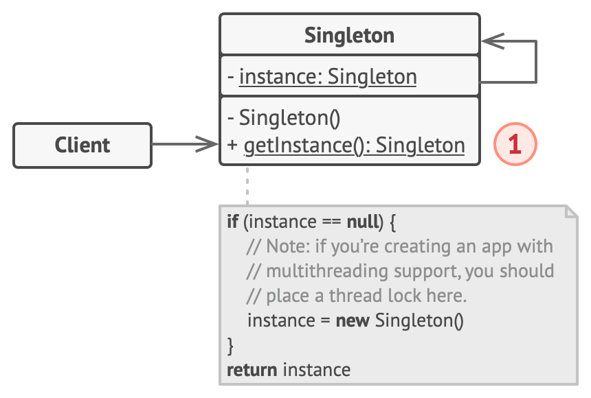

# Singleton


**Type:** Creational · **Also known as:** 

> **The 10-second version:** Take the `new` keyword away from everybody, hand out one pre-built object instead, and make that the only door into it.

<br clear="all">

## Quick card

| | |
|---|---|
| **Problem it solves** | Something expensive or genuinely unique — a connection pool, a config snapshot, a metrics sink — must exist exactly once, and every part of the app has to be able to find it without being handed it. |
| **Core move** | Private constructor + private static field + public static accessor that lazily fills the field and returns the same object forever. |
| **You'll recognise it by** | A class you cannot `new`. A static member called `GetInstance()`, `Instance`, `getInstance()`, `current`, `shared`, or `default`. No public constructor anywhere in the file. |
| **Rating** | Complexity ★☆☆ · Popularity ★★☆ |
| **Closest relatives** | Facade (often *becomes* a singleton), Flyweight (many shared objects vs. exactly one), Abstract Factory / Builder / Prototype (frequently *implemented as* singletons), Monostate (different mechanism, same effect) |
| **In your stack** | C#: `services.AddSingleton<T>()` in DI is the modern, testable form — the container owns the single instance, not the class. TS/Node: a CommonJS/ESM module's exported object already *is* a per-process singleton. SQL: `SqlConnection` is **not** a singleton — ADO.NET's connection pool underneath it is. RabbitMQ: one `IConnection` per process, many `IModel`/channels — that single connection is the textbook real case. |

### How to read this file

Technical first, plain English second. 🗣️ marks the plain-English version. Part 1 is Refactoring.Guru's material with their diagrams; Parts 2-7 are code, your stack, and the stuff that makes it stick.

---

# PART 1 — The pattern

## 1. Intent
**Singleton** is a creational design pattern that lets you ensure that a class has only one instance, while providing a global access point to this instance.


### 🗣️ In plain words

There is a class in your program that should never, ever have two live copies. Singleton is the trick for enforcing that *inside the class itself*: you lock the front door (make the constructor private) and cut one key (a static method). Anyone who wants the object has to ask for the key, and the key always opens onto the exact same room. Bonus, and also the curse: because the accessor is static, any line of code anywhere can reach it — which is exactly what makes it convenient and exactly what makes it dangerous.

## 2. Problem
The Singleton pattern solves two problems at the same time, violating the *Single Responsibility Principle*:

1. **Ensure that a class has just a single instance**. Why would anyone want to control how many instances a class has? The most common reason for this is to control access to some shared resource—for example, a database or a file.

   Here’s how it works: imagine that you created an object, but after a while decided to create a new one. Instead of receiving a fresh object, you’ll get the one you already created.

   Note that this behavior is impossible to implement with a regular constructor since a constructor call **must** always return a new object by design.


*Clients may not even realize that they’re working with the same object all the time.*

1. **Provide a global access point to that instance**. Remember those global variables that you (all right, me) used to store some essential objects? While they’re very handy, they’re also very unsafe since any code can potentially overwrite the contents of those variables and crash the app.

   Just like a global variable, the Singleton pattern lets you access some object from anywhere in the program. However, it also protects that instance from being overwritten by other code.

   There’s another side to this problem: you don’t want the code that solves problem #1 to be scattered all over your program. It’s much better to have it within one class, especially if the rest of your code already depends on it.

Nowadays, the Singleton pattern has become so popular that people may call something a *singleton* even if it solves just one of the listed problems.
### 🗣️ In plain words

You wrote a `PricingEngine` that loads a 40 MB table of depreciation curves on startup. Building one takes 900 ms. Somebody in the search module needs it, so they write this:

```ts
// ❌ every caller pays the 900 ms and the 40 MB, again
function scoreListing(listing: Listing) {
  const engine = new PricingEngine();   // loads the whole curve table. Again.
  return engine.fairPrice(listing);
}
```

Nothing in the language stops them. `new` is a promise: *you asked for an object, here is a brand-new object*. A constructor is physically incapable of saying "actually, use the one from earlier."

So somebody reaches for the other obvious fix — a global:

```ts
// ❌ better, but now anyone can nuke it
export let pricingEngine = new PricingEngine();

// somewhere, in a test helper nobody remembers writing:
pricingEngine = undefined as any;   // 3am pager duty
```

That's the second half of the pain. A global gives you *reachability* but not *protection*: it's a writable slot, and a writable slot that the whole codebase can see will eventually be written to by someone who shouldn't. And if you scatter "did I already build this?" checks across five modules to avoid the global, you now have the logic duplicated in five places.

Singleton's pitch is: one class owns both concerns, and nobody else has to think about it.

## 3. Solution
All implementations of the Singleton have these two steps in common:

- Make the default constructor private, to prevent other objects from using the `new` operator with the Singleton class.
- Create a static creation method that acts as a constructor. Under the hood, this method calls the private constructor to create an object and saves it in a static field. All following calls to this method return the cached object.

If your code has access to the Singleton class, then it’s able to call the Singleton’s static method. So whenever that method is called, the same object is always returned.
### 🗣️ In plain words

The mechanics are only three moves:

1. **Close the constructor.** `private PricingEngine() { }` in C#, `private constructor()` in TS, a `private:`/`protected:` constructor in C++. Now `new PricingEngine()` is a compile error for everybody outside the class.
2. **Add a private static slot.** One field on the class itself, not on instances — `private static PricingEngine? _instance;` — which holds the one object once it exists.
3. **Add a public static accessor that fills the slot on first use and returns it forever after.** `if (_instance is null) _instance = new PricingEngine(); return _instance;` — with whatever locking your runtime needs so two threads racing through that `if` don't both win.

An optional fourth move, and the one people forget: **go update every caller.** The pattern isn't finished until no `new` calls remain.

> **The key insight:** the constructor's contract — *"call me, get a fresh object"* — is unbreakable, so Singleton doesn't try to break it. It **hides** the constructor behind a static method whose contract you *are* free to write, and that method's contract is *"call me, get **the** object."* Every Singleton variant you'll ever meet is just a different way of making that second contract safe.

## 4. Real-world analogy
The government is an excellent example of the Singleton pattern. A country can have only one official government. Regardless of the personal identities of the individuals who form governments, the title, “The Government of X”, is a global point of access that identifies the group of people in charge.

### 🗣️ Two more of my own

**The air-traffic control tower.** Every pilot approaching an airport talks to "Tower" on one frequency. There's exactly one tower per airport, and there has to be — two towers issuing landing clearances for the same runway is how you get a crash, not redundancy. The individual controller changes shift every few hours, but nobody re-negotiates who to call; "Tower" is a fixed, globally known access point to whichever single authority is currently on duty.

**The building's main water meter.** Every tap in the block draws through one meter. You can't install a second one "just for your flat" — the utility has made that physically impossible, and that's the point: the meter exists to be the single authoritative reading. Note the trade-off that always comes with Singleton, right there in the analogy: when the meter jams, *the entire building* has a problem, and there is no way to test your flat's plumbing without involving it.

## 5. Structure


1. The **Singleton** class declares the static method `getInstance` that returns the same instance of its own class.

   The Singleton’s constructor should be hidden from the client code. Calling the `getInstance` method should be the only way of getting the Singleton object.
### 🗣️ Participants & roles — cheat table

| Role | What it is in code | Example from the site | Equivalent in reader's stack |
|---|---|---|---|
| **Singleton** | The class that guards its own instance count: private constructor, private static field, public static accessor. | `Database` in the pseudocode — `getInstance()` + `query(sql)` | A `RabbitMqConnection` wrapper in C#; a `configStore` module in Node/TS |
| **Static field (`instance`)** | Class-level storage. Lives as long as the class is loaded — i.e. the process (or, in .NET, the `AssemblyLoadContext`; in Node, the module registry entry). | `private static field instance: Database` | `private static readonly Lazy<T> _lazy` in C#; a module-level `let cached` in TS |
| **Creation method (`getInstance`)** | The only public way in. Lazily constructs, caches, returns. Where any thread-safety lives. | `public static method getInstance()` | `public static T Instance => _lazy.Value;` / `export function getConnection()` |
| **Business logic** | The reason the object exists at all. A Singleton with no behaviour is just a global variable wearing a hat. | `query(sql)` | `PublishAsync(evt)`, `FairPrice(listing)`, `Get<T>(key)` |
| **Client** | Any code that calls the accessor instead of the constructor. It never knows whether it triggered creation or got the cached one. | `Application.main()` calling `Database.getInstance()` twice | Your controller, your consumer handler, your search scorer |

### 🤝 Collaboration — who calls whom

```
  FIRST CALL                                SECOND CALL (and every one after)
  ==========                                =================================

 Client A                Singleton          Client B                Singleton
    |                    (class)               |                    (class)
    |  getInstance()        |                  |  getInstance()        |
    |---------------------->|                  |---------------------->|
    |                       |                  |                       |
    |            instance == null?             |            instance == null?
    |                    YES |                 |                     NO|
    |                       |                  |                       |
    |            [acquire lock]                |     (never takes the lock:
    |            [re-check null]               |      that's why the outer
    |                       |                  |      null-check exists)
    |                       +--> new Singleton()                       |
    |                       |     (expensive:  |                       |
    |                       |      open socket,|                       |
    |                       |      read config)|                       |
    |                       |<--+              |                       |
    |            instance = obj                |                       |
    |            [release lock]                |                       |
    |                       |                  |                       |
    |<----------------------|                  |<----------------------|
    |   ref to THE object   |                  |   SAME ref. ===. ReferenceEquals.
    |                       |                  |                       |
    |  query("SELECT ...")  |                  |  query("SELECT ...")  |
    |---------------------->|                  |---------------------->|
    |                       |                  |                       |
```

**The hop that matters:** the arrow returning to Client B. It hands back the *same reference*, not a copy — so any state Client A mutated on that object is already visible to Client B. That is the whole value proposition and the whole hazard in one arrow. Everything else (the lock, the double null-check) exists only to make sure that arrow can never point at a second object.

## 6. Pseudocode (the website's example)
In this example, the database connection class acts as a **Singleton**. This class doesn’t have a public constructor, so the only way to get its object is to call the `getInstance` method. This method caches the first created object and returns it in all subsequent calls.

```
// The Database class defines the `getInstance` method that lets
// clients access the same instance of a database connection
// throughout the program.
class Database is
    // The field for storing the singleton instance should be
    // declared static.
    private static field instance: Database

    // The singleton's constructor should always be private to
    // prevent direct construction calls with the `new`
    // operator.
    private constructor Database() is
        // Some initialization code, such as the actual
        // connection to a database server.
        // ...

    // The static method that controls access to the singleton
    // instance.
    public static method getInstance() is
        if (Database.instance == null) then
            acquireThreadLock() and then
                // Ensure that the instance hasn't yet been
                // initialized by another thread while this one
                // has been waiting for the lock's release.
                if (Database.instance == null) then
                    Database.instance = new Database()
        return Database.instance

    // Finally, any singleton should define some business logic
    // which can be executed on its instance.
    public method query(sql) is
        // For instance, all database queries of an app go
        // through this method. Therefore, you can place
        // throttling or caching logic here.
        // ...

class Application is
    method main() is
        Database foo = Database.getInstance()
        foo.query("SELECT ...")
        // ...
        Database bar = Database.getInstance()
        bar.query("SELECT ...")
        // The variable `bar` will contain the same object as
        // the variable `foo`.
```
### 🗣️ Reading that pseudocode

- **`private static field instance: Database`** — `static` is doing the heavy lifting. If this field were per-instance, each `Database` would cache *itself*, which is useless. Class-level storage is what gives you one slot for the whole program.
- **`private constructor Database()`** — this single keyword is the enforcement. Delete `private` and the entire pattern evaporates into "a suggestion." Note the comment about connecting to the server: the constructor is *expensive*, which is the usual reason you wanted one instance in the first place.
- **The two `if (Database.instance == null)` checks** — this is the **double-checked locking** idiom, and the duplication is deliberate, not sloppy. The **outer** check is the fast path: once the instance exists, every future caller skips the lock entirely, which matters because locks are contended and this method may be called millions of times. The **inner** check is the correct path: two threads can both pass the outer check before either creates anything, so whoever loses the race to the lock must look again.
- **`acquireThreadLock() and then`** — note this is *inside* the outer `if`. Putting the lock outside would be simpler and still correct, but every read for the rest of the process's life would pay for synchronisation. (In real C# and C++, double-checked locking also needs memory-barrier guarantees — `volatile` in C#, `std::atomic` or a plain function-local static in C++ — which pseudocode gets to hand-wave. Your language does not.)
- **`public method query(sql)`** — and there's the payoff sentence in the comment: *"you can place throttling or caching logic here."* Because all traffic funnels through one object, that object becomes a natural place for cross-cutting policy. That's a genuinely good reason to choose Singleton over a global.
- **`foo` and `bar` in `main()`** — two variable names, one object. If you later wrote `foo.setTimeout(30)` then `bar` would see 30 too. Make sure you actually want that, because it's not optional.

## 7. Applicability — when to reach for it
**Use the Singleton pattern when a class in your program should have just a single instance available to all clients; for example, a single database object shared by different parts of the program.**

The Singleton pattern disables all other means of creating objects of a class except for the special creation method. This method either creates a new object or returns an existing one if it has already been created.

**Use the Singleton pattern when you need stricter control over global variables.**

Unlike global variables, the Singleton pattern guarantees that there’s just one instance of a class. Nothing, except for the Singleton class itself, can replace the cached instance.

Note that you can always adjust this limitation and allow creating any number of Singleton instances. The only piece of code that needs changing is the body of the `getInstance` method.
### ✅ Quick checklist

- [ ] Does a **second instance actively cause a bug** — double-charging, a duplicate AMQP connection, two schedulers firing the same job — rather than merely wasting memory?
- [ ] Is construction genuinely expensive (opens a socket, reads a file, warms a big table) *and* is the result safely shareable across all callers?
- [ ] Is the object's state either **immutable** or **explicitly designed for concurrent access**? (If it has a mutable `CurrentUser` field, stop — you want a scoped/per-request object, not a singleton.)
- [ ] Are you already reaching for a `static` mutable variable? If yes, Singleton is a strict improvement over that and worth doing properly.
- [ ] Can you **not** pass the object in through a constructor, for a real structural reason — a static extension point, a logger called from a `struct`, a framework hook with no injection point?
- [ ] If the answer to the previous one was "I could inject it, it's just tedious": **register it as a singleton lifetime in your DI container instead.** Same one-instance guarantee, none of the testability damage. That's the right answer roughly 80% of the time in modern C# and Node.

## 8. How to implement — step by step
1. Add a private static field to the class for storing the singleton instance.
2. Declare a public static creation method for getting the singleton instance.
3. Implement “lazy initialization” inside the static method. It should create a new object on its first call and put it into the static field. The method should always return that instance on all subsequent calls.
4. Make the constructor of the class private. The static method of the class will still be able to call the constructor, but not the other objects.
5. Go over the client code and replace all direct calls to the singleton’s constructor with calls to its static creation method.
### 🗣️ The same steps, blunt version

1. Add `private static` field. One slot, class-level, nullable.
2. Add `public static` getter. This is now the only entrance.
3. Make it lazy: null? build it, store it. Not null? return it. Add the lock/`Lazy<T>`/function-local-static your language needs so a race can't produce two.
4. Slam the constructor shut (`private`). In C#, also `sealed` the class; in C++, also `= delete` the copy constructor and copy-assignment.
5. Grep for `new TheClass(` and kill every hit. The pattern is not implemented until that grep comes back empty.

Then one step the list doesn't mention, and you should do it anyway: **extract an interface.** `ITheClass` with the real class implementing it, and the static property typed as the interface. Costs you ten minutes and buys back every unit test you were about to lose.

## 9. Pros and cons
- ✅ You can be sure that a class has only a single instance.
- ✅ You gain a global access point to that instance.
- ✅ The singleton object is initialized only when it’s requested for the first time.

- ⛔ Violates the *Single Responsibility Principle*. The pattern solves two problems at the time.
- ⛔ The Singleton pattern can mask bad design, for instance, when the components of the program know too much about each other.
- ⛔ The pattern requires special treatment in a multithreaded environment so that multiple threads won’t create a singleton object several times.
- ⛔ It may be difficult to unit test the client code of the Singleton because many test frameworks rely on inheritance when producing mock objects. Since the constructor of the singleton class is private and overriding static methods is impossible in most languages, you will need to think of a creative way to mock the singleton. Or just don’t write the tests. Or don’t use the Singleton pattern.
### ⚖️ Honest trade-offs from the trenches

**The real cost is not the instance count — it's the invisible dependency.** When `ListingScorer` calls `PricingEngine.Instance` inside a method body, that dependency does not appear in the constructor, the interface, or the type signature. Six months later someone tries to run `ListingScorer` in a batch job with a different pricing source and discovers the coupling only at runtime. Compare that to `ListingScorer(IPricingEngine engine)`, where the dependency is a declared, swappable parameter. Same single instance at runtime if you register it that way; the difference is purely whether the coupling is *stated or smuggled*. Almost every Singleton horror story you've read is really a story about smuggled coupling.

**The tell that it's actually worth it** is when a second instance is *incorrect*, not merely wasteful. One `IConnection` to RabbitMQ per process: a second one is a second TCP connection, a second heartbeat, and doubled broker-side resource accounting — that's a real constraint from outside your program. Contrast with "`PricingEngine` is big so let's make it a singleton": that's a *caching* requirement, and cache lifetime belongs to your container, not to the class's constructor visibility. Ask which one you have. If the uniqueness constraint lives outside your process, hard Singleton is defensible. If it's just "expensive," use a singleton *lifetime*.

**Modern runtimes have already solved most of this for you, and you should let them.** In C#, `services.AddSingleton<IPricingEngine, PricingEngine>()` gives you exactly one instance per container, constructed lazily on first resolve, thread-safely, with disposal handled on shutdown — and your class stays a boring class with a public constructor that tests can `new` freely. `Lazy<T>` with `LazyThreadSafetyMode.ExecutionAndPublication` gives you thread-safe lazy init without hand-writing double-checked locking. A static `readonly` field on a type with no static constructor gets you .NET's `beforefieldinit` eager-ish initialisation for free. In TypeScript/Node, an ESM or CommonJS module body runs **once per module registry entry**, so `export const bus = new EventBus()` is already a singleton with zero ceremony. In C++, a function-local `static` has been guaranteed thread-safe-on-first-use since C++11 (the "Meyers singleton") — the mutex in the site's example is no longer necessary for that job. In Java, an `enum` with one constant is the most robust form and is the one *Effective Java* recommends.

**Where I'd still hand-roll it:** cross-cutting infrastructure that is called from places DI cannot reach — a logger invoked from a static helper, a feature-flag reader used in a `[JsonConverter]`, a metrics counter incremented in a hot struct method. And even then I'd make the static accessor a thin façade over an injectable interface, with a `SetForTesting` escape hatch that only the test assembly can see, so the smuggled dependency is at least *mockable*.

## 10. Relations with other patterns
- A [Facade](https://refactoring.guru/design-patterns/facade) class can often be transformed into a [Singleton](https://refactoring.guru/design-patterns/singleton) since a single facade object is sufficient in most cases.
- [Flyweight](https://refactoring.guru/design-patterns/flyweight) would resemble [Singleton](https://refactoring.guru/design-patterns/singleton) if you somehow managed to reduce all shared states of the objects to just one flyweight object. But there are two fundamental differences between these patterns:

  1. There should be only one Singleton instance, whereas a *Flyweight* class can have multiple instances with different intrinsic states.
  2. The *Singleton* object can be mutable. Flyweight objects are immutable.
- [Abstract Factories](https://refactoring.guru/design-patterns/abstract-factory), [Builders](https://refactoring.guru/design-patterns/builder) and [Prototypes](https://refactoring.guru/design-patterns/prototype) can all be implemented as [Singletons](https://refactoring.guru/design-patterns/singleton).
### 🗣️ Disambiguation table

| Pattern | What it guarantees | How many objects | Mutability | The line that separates it |
|---|---|---|---|---|
| **Singleton** | Exactly one instance of *this class*, plus a global access point | 1 | Usually mutable — that's often the point | *"There is one of me, and here is where you find me."* |
| **Flyweight** | Shared, deduplicated objects for repeated intrinsic state | Many — one per distinct state | **Immutable**, always | *"There is one of me **per distinct value**, so we don't store 50,000 copies of the string 'Maruti Suzuki'."* |
| **Static class / utility class** | No instances at all; just namespaced functions | 0 | Stateless by convention | *"You can't hold me — I have no state to hold."* Singleton returns an **object** that can implement an interface and be polymorphic; a static class cannot. |
| **Monostate** | Many instances, all sharing one set of `static` fields | N (but they behave as one) | Shared mutable state | *"Make as many of me as you like — we're all the same person underneath."* Singleton controls **identity**; Monostate controls **state**. |
| **Facade** | A simplified front door onto a messy subsystem | Usually 1, but that's incidental | Usually stateless | *"I simplify."* A facade **often becomes** a singleton because one is enough — but simplification is its job, uniqueness is Singleton's. |

> **Memorable separator:** **Singleton limits *how many objects exist*. Flyweight limits *how many copies of a value exist*. Facade limits *how much you have to know*. Static class removes objects entirely.** Only Singleton is fundamentally about *identity*.

And the one from the Relations section worth restating: **Abstract Factory, Builder and Prototype are routinely implemented as Singletons.** That's not a fifth pattern — it's a lifetime decision layered on top of another pattern. A `CarListingFactory` that holds no per-call state has no reason to exist twice.

---

# PART 2 — Official code examples from Refactoring.Guru

## 2.1 C#
**Complexity:** ★☆☆ (1/3)

**Popularity:** ★★☆ (2/3)

**Usage examples:** A lot of developers consider the Singleton pattern an antipattern. That’s why its usage is on the decline in C# code.

**Identification:** Singleton can be recognized by a static creation method, which returns the same cached object.
### Naïve Singleton

It’s pretty easy to implement a sloppy Singleton. You just need to hide the constructor and implement a static creation method.

The same class behaves incorrectly in a multithreaded environment. Multiple threads can call the creation method simultaneously and get several instances of Singleton class.

##### **Program.cs:** Conceptual example

```csharp
using System;

namespace RefactoringGuru.DesignPatterns.Singleton.Conceptual.NonThreadSafe
{
    // The Singleton class defines the `GetInstance` method that serves as an
    // alternative to constructor and lets clients access the same instance of
    // this class over and over.

    // EN : The Singleton should always be a 'sealed' class to prevent class
    // inheritance through external classes and also through nested classes.
    public sealed class Singleton
    {
        // The Singleton's constructor should always be private to prevent
        // direct construction calls with the `new` operator.
        private Singleton() { }

        // The Singleton's instance is stored in a static field. There there are
        // multiple ways to initialize this field, all of them have various pros
        // and cons. In this example we'll show the simplest of these ways,
        // which, however, doesn't work really well in multithreaded program.
        private static Singleton _instance;

        // This is the static method that controls the access to the singleton
        // instance. On the first run, it creates a singleton object and places
        // it into the static field. On subsequent runs, it returns the client
        // existing object stored in the static field.
        public static Singleton GetInstance()
        {
            if (_instance == null)
            {
                _instance = new Singleton();
            }
            return _instance;
        }

        // Finally, any singleton should define some business logic, which can
        // be executed on its instance.
        public void someBusinessLogic()
        {
            // ...
        }
    }

    class Program
    {
        static void Main(string[] args)
        {
            // The client code.
            Singleton s1 = Singleton.GetInstance();
            Singleton s2 = Singleton.GetInstance();

            if (s1 == s2)
            {
                Console.WriteLine("Singleton works, both variables contain the same instance.");
            }
            else
            {
                Console.WriteLine("Singleton failed, variables contain different instances.");
            }
        }
    }
}
```

##### **Output.txt:** Execution result

```output
Singleton works, both variables contain the same instance.
```

### Thread-safe Singleton

To fix the problem, you have to synchronize threads during the first creation of the Singleton object.

##### **Program.cs:** Conceptual example

```csharp
using System;
using System.Threading;

namespace Singleton
{
    // This Singleton implementation is called "double check lock". It is safe
    // in multithreaded environment and provides lazy initialization for the
    // Singleton object.
    class Singleton
    {
        private Singleton() { }

        private static Singleton _instance;

        // We now have a lock object that will be used to synchronize threads
        // during first access to the Singleton.
        private static readonly object _lock = new object();

        public static Singleton GetInstance(string value)
        {
            // This conditional is needed to prevent threads stumbling over the
            // lock once the instance is ready.
            if (_instance == null)
            {
                // Now, imagine that the program has just been launched. Since
                // there's no Singleton instance yet, multiple threads can
                // simultaneously pass the previous conditional and reach this
                // point almost at the same time. The first of them will acquire
                // lock and will proceed further, while the rest will wait here.
                lock (_lock)
                {
                    // The first thread to acquire the lock, reaches this
                    // conditional, goes inside and creates the Singleton
                    // instance. Once it leaves the lock block, a thread that
                    // might have been waiting for the lock release may then
                    // enter this section. But since the Singleton field is
                    // already initialized, the thread won't create a new
                    // object.
                    if (_instance == null)
                    {
                        _instance = new Singleton();
                        _instance.Value = value;
                    }
                }
            }
            return _instance;
        }

        // We'll use this property to prove that our Singleton really works.
        public string Value { get; set; }
    }

    class Program
    {
        static void Main(string[] args)
        {
            // The client code.

            Console.WriteLine(
                "{0}\n{1}\n\n{2}\n",
                "If you see the same value, then singleton was reused (yay!)",
                "If you see different values, then 2 singletons were created (booo!!)",
                "RESULT:"
            );

            Thread process1 = new Thread(() =>
            {
                TestSingleton("FOO");
            });
            Thread process2 = new Thread(() =>
            {
                TestSingleton("BAR");
            });

            process1.Start();
            process2.Start();

            process1.Join();
            process2.Join();
        }

        public static void TestSingleton(string value)
        {
            Singleton singleton = Singleton.GetInstance(value);
            Console.WriteLine(singleton.Value);
        }
    }
}
```

##### **Output.txt:** Execution result

```output
FOO
FOO
```

### Want more?

There are even more special flavors of the Singleton pattern in C#. Take a look at this article to find out more:

[C# in Depth: Implementing Singleton](https://refactoring.guru/csharp-singleton)

## 2.2 TypeScript
**Complexity:** ★☆☆ (1/3)

**Popularity:** ★★☆ (2/3)

**Usage examples:** A lot of developers consider the Singleton pattern an antipattern. That’s why its usage is on the decline in TypeScript code.

**Identification:** Singleton can be recognized by a static creation method, which returns the same cached object.
### Conceptual Example

This example illustrates the structure of the **Singleton** design pattern and focuses on the following questions:

- What classes does it consist of?
- What roles do these classes play?
- In what way the elements of the pattern are related?

##### **index.ts:** Conceptual example

```typescript
/**
 * The Singleton class defines an `instance` getter, that lets clients access
 * the unique singleton instance.
 */
class Singleton {
    static #instance: Singleton;

    /**
     * The Singleton's constructor should always be private to prevent direct
     * construction calls with the `new` operator.
     */
    private constructor() { }

    /**
     * The static getter that controls access to the singleton instance.
     *
     * This implementation allows you to extend the Singleton class while
     * keeping just one instance of each subclass around.
     */
    public static get instance(): Singleton {
        if (!Singleton.#instance) {
            Singleton.#instance = new Singleton();
        }

        return Singleton.#instance;
    }

    /**
     * Finally, any singleton can define some business logic, which can be
     * executed on its instance.
     */
    public someBusinessLogic() {
        // ...
    }
}

/**
 * The client code.
 */
function clientCode() {
    const s1 = Singleton.instance;
    const s2 = Singleton.instance;

    if (s1 === s2) {
        console.log(
            'Singleton works, both variables contain the same instance.'
        );
    } else {
        console.log('Singleton failed, variables contain different instances.');
    }
}

clientCode();
```

##### **Output.txt:** Execution result

```output
Singleton works, both variables contain the same instance.
```

## 2.3 C++
**Complexity:** ★☆☆ (1/3)

**Popularity:** ★★☆ (2/3)

**Usage examples:** A lot of developers consider the Singleton pattern an antipattern. That’s why its usage is on the decline in C++ code.

**Identification:** Singleton can be recognized by a static creation method, which returns the same cached object.
### Naïve Singleton

It’s pretty easy to implement a sloppy Singleton. You just need to hide the constructor and implement a static creation method.

The same class behaves incorrectly in a multithreaded environment. Multiple threads can call the creation method simultaneously and get several instances of Singleton class.

##### **main.cc:** Conceptual example

```cpp
/**
 * The Singleton class defines the `GetInstance` method that serves as an
 * alternative to constructor and lets clients access the same instance of this
 * class over and over.
 */
class Singleton
{

    /**
     * The Singleton's constructor should always be private to prevent direct
     * construction calls with the `new` operator.
     */

protected:
    Singleton(const std::string value): value_(value)
    {
    }

    static Singleton* singleton_;

    std::string value_;

public:

    /**
     * Singletons should not be cloneable.
     */
    Singleton(Singleton &other) = delete;
    /**
     * Singletons should not be assignable.
     */
    void operator=(const Singleton &) = delete;
    /**
     * This is the static method that controls the access to the singleton
     * instance. On the first run, it creates a singleton object and places it
     * into the static field. On subsequent runs, it returns the client existing
     * object stored in the static field.
     */

    static Singleton *GetInstance(const std::string& value);
    /**
     * Finally, any singleton should define some business logic, which can be
     * executed on its instance.
     */
    void SomeBusinessLogic()
    {
        // ...
    }

    std::string value() const{
        return value_;
    }
};

Singleton* Singleton::singleton_= nullptr;;

/**
 * Static methods should be defined outside the class.
 */
Singleton *Singleton::GetInstance(const std::string& value)
{
    /**
     * This is a safer way to create an instance. instance = new Singleton is
     * dangeruous in case two instance threads wants to access at the same time
     */
    if(singleton_==nullptr){
        singleton_ = new Singleton(value);
    }
    return singleton_;
}

void ThreadFoo(){
    // Following code emulates slow initialization.
    std::this_thread::sleep_for(std::chrono::milliseconds(1000));
    Singleton* singleton = Singleton::GetInstance("FOO");
    std::cout << singleton->value() << "\n";
}

void ThreadBar(){
    // Following code emulates slow initialization.
    std::this_thread::sleep_for(std::chrono::milliseconds(1000));
    Singleton* singleton = Singleton::GetInstance("BAR");
    std::cout << singleton->value() << "\n";
}

int main()
{
    std::cout <<"If you see the same value, then singleton was reused (yay!\n" <<
                "If you see different values, then 2 singletons were created (booo!!)\n\n" <<
                "RESULT:\n";
    std::thread t1(ThreadFoo);
    std::thread t2(ThreadBar);
    t1.join();
    t2.join();

    return 0;
}
```

##### **Output.txt:** Execution result

```output
If you see the same value, then singleton was reused (yay!
If you see different values, then 2 singletons were created (booo!!)

RESULT:
BAR
FOO
```

### Thread-safe Singleton

To fix the problem, you have to synchronize threads during the first creation of the Singleton object.

##### **main.cc:** Conceptual example

```cpp
/**
 * The Singleton class defines the `GetInstance` method that serves as an
 * alternative to constructor and lets clients access the same instance of this
 * class over and over.
 */
class Singleton
{

    /**
     * The Singleton's constructor/destructor should always be private to
     * prevent direct construction/desctruction calls with the `new`/`delete`
     * operator.
     */
private:
    static Singleton * pinstance_;
    static std::mutex mutex_;

protected:
    Singleton(const std::string value): value_(value)
    {
    }
    ~Singleton() {}
    std::string value_;

public:
    /**
     * Singletons should not be cloneable.
     */
    Singleton(Singleton &other) = delete;
    /**
     * Singletons should not be assignable.
     */
    void operator=(const Singleton &) = delete;
    /**
     * This is the static method that controls the access to the singleton
     * instance. On the first run, it creates a singleton object and places it
     * into the static field. On subsequent runs, it returns the client existing
     * object stored in the static field.
     */

    static Singleton *GetInstance(const std::string& value);
    /**
     * Finally, any singleton should define some business logic, which can be
     * executed on its instance.
     */
    void SomeBusinessLogic()
    {
        // ...
    }

    std::string value() const{
        return value_;
    }
};

/**
 * Static methods should be defined outside the class.
 */

Singleton* Singleton::pinstance_{nullptr};
std::mutex Singleton::mutex_;

/**
 * The first time we call GetInstance we will lock the storage location
 *      and then we make sure again that the variable is null and then we
 *      set the value. RU:
 */
Singleton *Singleton::GetInstance(const std::string& value)
{
    std::lock_guard<std::mutex> lock(mutex_);
    if (pinstance_ == nullptr)
    {
        pinstance_ = new Singleton(value);
    }
    return pinstance_;
}

void ThreadFoo(){
    // Following code emulates slow initialization.
    std::this_thread::sleep_for(std::chrono::milliseconds(1000));
    Singleton* singleton = Singleton::GetInstance("FOO");
    std::cout << singleton->value() << "\n";
}

void ThreadBar(){
    // Following code emulates slow initialization.
    std::this_thread::sleep_for(std::chrono::milliseconds(1000));
    Singleton* singleton = Singleton::GetInstance("BAR");
    std::cout << singleton->value() << "\n";
}

int main()
{
    std::cout <<"If you see the same value, then singleton was reused (yay!\n" <<
                "If you see different values, then 2 singletons were created (booo!!)\n\n" <<
                "RESULT:\n";
    std::thread t1(ThreadFoo);
    std::thread t2(ThreadBar);
    t1.join();
    t2.join();

    return 0;
}
```

##### **Output.txt:** Execution result

```output
If you see the same value, then singleton was reused (yay!
If you see different values, then 2 singletons were created (booo!!)

RESULT:
FOO
FOO
```

## 2.4 Java
**Complexity:** ★☆☆ (1/3)

**Popularity:** ★★☆ (2/3)

**Usage examples:** A lot of developers consider the Singleton pattern an antipattern. That’s why its usage is on the decline in Java code.

**Identification:** Singleton can be recognized by a static creation method, which returns the same cached object.
### Naïve Singleton (single-threaded)

It’s pretty easy to implement a sloppy Singleton. You just need to hide the constructor and implement a static creation method.

##### **Singleton.java:** Singleton

```java
package refactoring_guru.singleton.example.non_thread_safe;

public final class Singleton {
    private static Singleton instance;
    public String value;

    private Singleton(String value) {
        // The following code emulates slow initialization.
        try {
            Thread.sleep(1000);
        } catch (InterruptedException ex) {
            ex.printStackTrace();
        }
        this.value = value;
    }

    public static Singleton getInstance(String value) {
        if (instance == null) {
            instance = new Singleton(value);
        }
        return instance;
    }
}
```

##### **DemoSingleThread.java:** Client code

```java
package refactoring_guru.singleton.example.non_thread_safe;

public class DemoSingleThread {
    public static void main(String[] args) {
        System.out.println("If you see the same value, then singleton was reused (yay!)" + "\n" +
                "If you see different values, then 2 singletons were created (booo!!)" + "\n\n" +
                "RESULT:" + "\n");
        Singleton singleton = Singleton.getInstance("FOO");
        Singleton anotherSingleton = Singleton.getInstance("BAR");
        System.out.println(singleton.value);
        System.out.println(anotherSingleton.value);
    }
}
```

##### **OutputDemoSingleThread.txt:** Execution result

```output
If you see the same value, then singleton was reused (yay!)
If you see different values, then 2 singletons were created (booo!!)

RESULT:

FOO
FOO
```

### Naïve Singleton (multithreaded)

The same class behaves incorrectly in a multithreaded environment. Multiple threads can call the creation method simultaneously and get several instances of Singleton class.

##### **Singleton.java:** Singleton

```java
package refactoring_guru.singleton.example.non_thread_safe;

public final class Singleton {
    private static Singleton instance;
    public String value;

    private Singleton(String value) {
        // The following code emulates slow initialization.
        try {
            Thread.sleep(1000);
        } catch (InterruptedException ex) {
            ex.printStackTrace();
        }
        this.value = value;
    }

    public static Singleton getInstance(String value) {
        if (instance == null) {
            instance = new Singleton(value);
        }
        return instance;
    }
}
```

##### **DemoMultiThread.java:** Client code

```java
package refactoring_guru.singleton.example.non_thread_safe;

public class DemoMultiThread {
    public static void main(String[] args) {
        System.out.println("If you see the same value, then singleton was reused (yay!)" + "\n" +
                "If you see different values, then 2 singletons were created (booo!!)" + "\n\n" +
                "RESULT:" + "\n");
        Thread threadFoo = new Thread(new ThreadFoo());
        Thread threadBar = new Thread(new ThreadBar());
        threadFoo.start();
        threadBar.start();
    }

    static class ThreadFoo implements Runnable {
        @Override
        public void run() {
            Singleton singleton = Singleton.getInstance("FOO");
            System.out.println(singleton.value);
        }
    }

    static class ThreadBar implements Runnable {
        @Override
        public void run() {
            Singleton singleton = Singleton.getInstance("BAR");
            System.out.println(singleton.value);
        }
    }
}
```

##### **OutputDemoMultiThread.txt:** Execution result

```output
If you see the same value, then singleton was reused (yay!)
If you see different values, then 2 singletons were created (booo!!)

RESULT:

FOO
BAR
```

### Thread-safe Singleton with lazy loading

To fix the problem, you have to synchronize threads during first creation of the Singleton object.

##### **Singleton.java:** Singleton

```java
package refactoring_guru.singleton.example.thread_safe;

public final class Singleton {
    // The field must be declared volatile so that double check lock would work
    // correctly.
    private static volatile Singleton instance;

    public String value;

    private Singleton(String value) {
        this.value = value;
    }

    public static Singleton getInstance(String value) {
        // The approach taken here is called double-checked locking (DCL). It
        // exists to prevent race condition between multiple threads that may
        // attempt to get singleton instance at the same time, creating separate
        // instances as a result.
        //
        // It may seem that having the `result` variable here is completely
        // pointless. There is, however, a very important caveat when
        // implementing double-checked locking in Java, which is solved by
        // introducing this local variable.
        //
        // You can read more info DCL issues in Java here:
        // https://refactoring.guru/java-dcl-issue
        Singleton result = instance;
        if (result != null) {
            return result;
        }
        synchronized(Singleton.class) {
            if (instance == null) {
                instance = new Singleton(value);
            }
            return instance;
        }
    }
}
```

##### **DemoMultiThread.java:** Client code

```java
package refactoring_guru.singleton.example.thread_safe;

public class DemoMultiThread {
    public static void main(String[] args) {
        System.out.println("If you see the same value, then singleton was reused (yay!)" + "\n" +
                "If you see different values, then 2 singletons were created (booo!!)" + "\n\n" +
                "RESULT:" + "\n");
        Thread threadFoo = new Thread(new ThreadFoo());
        Thread threadBar = new Thread(new ThreadBar());
        threadFoo.start();
        threadBar.start();
    }

    static class ThreadFoo implements Runnable {
        @Override
        public void run() {
            Singleton singleton = Singleton.getInstance("FOO");
            System.out.println(singleton.value);
        }
    }

    static class ThreadBar implements Runnable {
        @Override
        public void run() {
            Singleton singleton = Singleton.getInstance("BAR");
            System.out.println(singleton.value);
        }
    }
}
```

##### **OutputDemoMultiThread.txt:** Execution result

```output
If you see the same value, then singleton was reused (yay!)
If you see different values, then 2 singletons were created (booo!!)

RESULT:

BAR
BAR
```

### Want more?

There are even more special flavors of the Singleton pattern in Java. Take a look at this article to find out more:

[Java Singleton Design Pattern Best Practices with Examples](https://refactoring.guru/java-singleton)

---

# PART 3 — Learn it by building it

## 3.1 The dumbest possible version — TypeScript

### ❌ BEFORE — the pain

An automotive marketplace with a feature-flag store. Flags come from a remote config service; fetching them costs a round trip.

```ts
// flags.ts
export class FeatureFlags {
  private flags: Record<string, boolean> = {};

  constructor() {
    // Pretend this is a blocking read of a config file at boot.
    // It is slow, and it hits the network.
    this.flags = JSON.parse(
      readFileSync('/etc/carwale/flags.json', 'utf8')
    );
    console.log('FeatureFlags: loaded config from disk');
  }

  isOn(name: string): boolean {
    return this.flags[name] === true;
  }
}
```

```ts
// search-controller.ts
import { FeatureFlags } from './flags';
export function handleSearch(q: string) {
  const flags = new FeatureFlags();          // ❌ disk read #1
  if (flags.isOn('new-ranking')) { /* ... */ }
}

// listing-controller.ts
import { FeatureFlags } from './flags';
export function handleListing(id: number) {
  const flags = new FeatureFlags();          // ❌ disk read #2
  if (flags.isOn('show-emi-widget')) { /* ... */ }
}
```

Three problems, in increasing order of nastiness: you read the file once per request; if an ops engineer edits `flags.json` mid-flight, different requests in the same process now see *different* flag sets; and there is nowhere to put "refresh flags every 60s" because there is no single object to refresh.

### ✅ AFTER — the classic Singleton

```ts
// feature-flags.ts
import { readFileSync } from 'node:fs';

export class FeatureFlags {
  // ── 1. THE SLOT ─────────────────────────────────────────────────
  // `static` = one per CLASS, not one per object. `#` makes it a true
  // private field — unreachable from outside, even at runtime.
  static #instance: FeatureFlags | null = null;   // 👈 the single slot

  // ── 2. INSTANCE STATE ───────────────────────────────────────────
  #flags: Record<string, boolean>;
  #loadedAt: Date;

  // ── 3. THE CLOSED DOOR ──────────────────────────────────────────
  // `private` here is a COMPILE-TIME guard in TypeScript. JS at runtime
  // will still let a determined caller in; see "What to notice".
  private constructor() {                          // 👈 nobody can `new` this
    this.#flags = JSON.parse(readFileSync('/etc/carwale/flags.json', 'utf8'));
    this.#loadedAt = new Date();
    console.log('FeatureFlags: loaded config from disk');
  }

  // ── 4. THE ONLY ENTRANCE ────────────────────────────────────────
  static get instance(): FeatureFlags {
    // No thread race to worry about: Node runs JS on one thread, and
    // nothing here awaits, so this block is atomic by construction.
    if (FeatureFlags.#instance === null) {          // 👈 lazy: built on first ask
      FeatureFlags.#instance = new FeatureFlags();
    }
    return FeatureFlags.#instance;                  // 👈 same object, forever
  }

  // ── 5. THE REASON IT EXISTS ─────────────────────────────────────
  isOn(name: string): boolean {
    return this.#flags[name] === true;
  }

  get loadedAt(): Date {
    return new Date(this.#loadedAt.getTime());      // defensive copy: Date is mutable
  }

  // Because ALL traffic funnels through one object, a refresh policy
  // has somewhere to live. This is the honest upside of the pattern.
  reload(): void {
    this.#flags = JSON.parse(readFileSync('/etc/carwale/flags.json', 'utf8'));
    this.#loadedAt = new Date();
  }

  // ── 6. THE TEST ESCAPE HATCH ────────────────────────────────────
  // Without this, every test that touches flags shares mutated state
  // with every other test. Name it so it's obviously not production API.
  static __resetForTests(replacement: FeatureFlags | null = null): void {
    FeatureFlags.#instance = replacement;
  }
}
```

```ts
// search-controller.ts
import { FeatureFlags } from './feature-flags';

export function handleSearch(q: string) {
  if (FeatureFlags.instance.isOn('new-ranking')) { /* ... */ }
}

// listing-controller.ts
import { FeatureFlags } from './feature-flags';

export function handleListing(id: number) {
  if (FeatureFlags.instance.isOn('show-emi-widget')) { /* ... */ }
}

// proof
console.log(FeatureFlags.instance === FeatureFlags.instance);  // true
// "FeatureFlags: loaded config from disk" prints exactly once.
```

**What to notice:**

- **`static get instance()` is a getter, not a method.** Callers write `FeatureFlags.instance`, which reads like a property but runs code. The site's TypeScript example does exactly this. It's a nice touch — the laziness is invisible at the call site.
- **`#instance` (the ECMAScript private field) beats `private instance` for the *slot*.** TypeScript's `private` is erased at compile time; `#` survives into JavaScript and genuinely cannot be reached. For the *constructor*, you have no choice: there is no `#constructor`, so `private constructor()` is compile-time-only protection. Someone determined can still do `Reflect.construct`. Singleton in JS is a convention the type-checker enforces, not a runtime fortress — and that's fine.
- **Laziness costs you determinism.** The file is read on the first `isOn` call, which might be inside a request. If that read can fail, you'd rather it fail at boot: call `FeatureFlags.instance` once in your startup file to force construction where you can still crash loudly.
- **In Node, you often don't need the class at all.** `export const featureFlags = new FeatureFlags()` in a module is already one-per-process, because the module registry caches the evaluated module. Section 4.2 shows that version.
- **`__resetForTests` is not optional in practice.** Test runners share a process between test files (Jest with `--runInBand`, Vitest threads). Without a reset, test ordering starts mattering, which is the worst kind of flake.
- **The defensive copy in `loadedAt`** is the mutable-state lesson in miniature: handing out a reference to internal mutable state from a shared object means any caller can corrupt it *for everyone*. Singletons make every leak global.

## 3.2 Same thing in C#

```csharp
using System;
using System.Collections.Frozen;
using System.Collections.Generic;
using System.Text.Json;

namespace CarMarketplace.Configuration;

/// <summary>
/// Read-only snapshot of feature flags. Immutable by construction, so it is
/// safe to share across every request thread in the process.
/// </summary>
public sealed record FlagSnapshot(FrozenDictionary<string, bool> Values, DateTimeOffset LoadedAt)
{
    public bool IsOn(string name) => Values.TryGetValue(name, out var on) && on;
}

/// <summary>
/// The Singleton. `sealed` so nobody can subclass it and smuggle in a second
/// identity through a derived type.
/// </summary>
public sealed class FeatureFlags
{
    // ── THE SLOT ────────────────────────────────────────────────────────
    // Lazy<T> IS the thread-safe double-checked-lock, written once by the BCL
    // and correct. LazyThreadSafetyMode.ExecutionAndPublication is the default
    // for this constructor overload: the factory runs exactly once, other
    // threads block until it finishes, and the result is safely published.
    private static readonly Lazy<FeatureFlags> _lazy =
        new(static () => new FeatureFlags("/etc/carwale/flags.json"));   // 👈 one slot

    // ── THE ONLY ENTRANCE ───────────────────────────────────────────────
    public static FeatureFlags Instance => _lazy.Value;                  // 👈 same object forever

    private readonly string _path;
    private FlagSnapshot _snapshot;   // swapped atomically on reload

    // ── THE CLOSED DOOR ─────────────────────────────────────────────────
    private FeatureFlags(string path)                                    // 👈 nobody can `new` this
    {
        _path = path;
        _snapshot = Load(path);
    }

    private static FlagSnapshot Load(string path)
    {
        var raw = JsonSerializer.Deserialize<Dictionary<string, bool>>(File.ReadAllText(path))
                  ?? new Dictionary<string, bool>();
        return new FlagSnapshot(raw.ToFrozenDictionary(), DateTimeOffset.UtcNow);
    }

    // ── BUSINESS LOGIC ──────────────────────────────────────────────────
    public bool IsOn(string name) => Volatile.Read(ref _snapshot).IsOn(name);

    public DateTimeOffset LoadedAt => Volatile.Read(ref _snapshot).LoadedAt;

    /// <summary>
    /// Reload without ever exposing a half-built snapshot: build the new one
    /// completely, then swap the reference in a single atomic write.
    /// </summary>
    public void Reload()
    {
        var fresh = Load(_path);
        Volatile.Write(ref _snapshot, fresh);   // 👈 readers see old-or-new, never torn
    }

    public string Describe() => _snapshot switch
    {
        { Values.Count: 0 }            => "no flags configured",
        { Values.Count: var n }        => $"{n} flags, loaded {LoadedAt:u}"
    };
}
```

```csharp
// Client code
public static class Demo
{
    public static void Main()
    {
        var a = FeatureFlags.Instance;
        var b = FeatureFlags.Instance;

        Console.WriteLine(ReferenceEquals(a, b));            // True
        Console.WriteLine(a.IsOn("new-ranking"));
        Console.WriteLine(a.Describe());
    }
}
```

**C#-specific notes:**

- **Use `Lazy<T>`, not hand-written double-checked locking.** The site's `lock (_lock)` example is pedagogically correct and it is what you should be able to *write on a whiteboard*, but in production `Lazy<T>` is shorter, provably correct, and handles the exception case properly (with `ExecutionAndPublication`, if the factory throws, the exception is cached and rethrown, so you don't get a half-initialised instance).
- **If you do hand-roll double-checked locking, the field must be `volatile`.** Without it, the CLR's memory model permits a thread to observe a non-null `_instance` reference whose constructor hasn't finished publishing its fields. It's rare, it's platform-dependent, and it is exactly the kind of bug you never reproduce. `private static volatile Singleton? _instance;`
- **`sealed` is not cosmetic.** The site's own comment calls this out. An unsealed singleton can be subclassed; a subclass's static members are separate storage in some patterns and its constructor can be reached from a nested type, which quietly defeats the guarantee.
- **The simplest correct form is `private static readonly T _instance = new();`** — no lock, no `Lazy`, because the CLR guarantees static field initialisers run exactly once under a type-initialisation lock. The catch: with no explicit static constructor the type is marked `beforefieldinit` and the runtime may initialise it *earlier* than the first access to `Instance`. If you need strict laziness, either add an (empty) static constructor or use `Lazy<T>`.
- **Don't implement `IDisposable` on a singleton casually.** There's no well-defined moment to dispose it, and a disposed-then-used singleton is unrecoverable for the process lifetime. If it owns unmanaged resources, let the DI container own the lifetime instead — see 4.1.
- **`FrozenDictionary<TKey,TValue>`** (`System.Collections.Frozen`, .NET 8+) is the right shape here: build-once, read-many, optimised for lookup, and immutable so concurrent reads need no locking at all.

## 3.3 C++

```cpp
// pricing_engine.h
#pragma once
#include <string>
#include <string_view>
#include <unordered_map>
#include <mutex>
#include <memory>
#include <stdexcept>

namespace carmarket {

class PricingEngine {
public:
    // ── NON-COPYABLE, NON-MOVABLE ───────────────────────────────────
    // Deleting all four of these is mandatory. A copy would create a
    // second object with the same state — the exact thing the pattern
    // forbids — and a move would leave the "single instance" hollowed out.
    PricingEngine(const PricingEngine&)            = delete;   // 👈
    PricingEngine& operator=(const PricingEngine&) = delete;   // 👈
    PricingEngine(PricingEngine&&)                 = delete;
    PricingEngine& operator=(PricingEngine&&)      = delete;

    // ── THE ONLY ENTRANCE: the Meyers singleton ─────────────────────
    // A function-local static. Since C++11 the standard GUARANTEES that
    // initialisation happens exactly once, and that concurrent callers
    // block until it completes. No mutex needed. No `new`. No leak.
    // Destroyed automatically at exit, in reverse order of construction.
    static PricingEngine& instance() {
        static PricingEngine engine;                            // 👈 thread-safe since C++11
        return engine;                                          // 👈 reference, never a pointer
    }

    // ── BUSINESS LOGIC — const-correct ──────────────────────────────
    // `const` means "safe to call concurrently from many threads", which
    // for a shared singleton is the contract callers actually care about.
    [[nodiscard]] double depreciationFactor(std::string_view make, int ageYears) const {
        const auto it = curves_.find(std::string(make));
        if (it == curves_.end()) return defaultCurve(ageYears);
        const auto& curve = it->second;
        if (ageYears < 0 || static_cast<std::size_t>(ageYears) >= curve.size())
            return curve.empty() ? 0.0 : curve.back();
        return curve[static_cast<std::size_t>(ageYears)];
    }

    [[nodiscard]] std::size_t curveCount() const noexcept { return curves_.size(); }

private:
    // ── THE CLOSED DOOR ─────────────────────────────────────────────
    PricingEngine() {                                           // 👈 private ctor
        // Pretend this reads a large table off disk. Expensive, once.
        curves_["Maruti Suzuki"] = {1.00, 0.86, 0.76, 0.68, 0.61, 0.55};
        curves_["Hyundai"]       = {1.00, 0.85, 0.75, 0.67, 0.60, 0.54};
        curves_["Toyota"]        = {1.00, 0.89, 0.80, 0.73, 0.67, 0.62};
    }

    // Private destructor is NOT used here on purpose: the function-local
    // static must be destructible at exit, and it is, because the
    // destructor is accessible from inside the class's own member function.
    ~PricingEngine() = default;

    static double defaultCurve(int ageYears) noexcept {
        double f = 1.0;
        for (int i = 0; i < ageYears && f > 0.2; ++i) f *= 0.87;
        return f;
    }

    std::unordered_map<std::string, std::vector<double>> curves_;
};

} // namespace carmarket
```

```cpp
// main.cc
#include "pricing_engine.h"
#include <iostream>
#include <thread>
#include <vector>

int main() {
    auto work = [](std::string_view make) {
        // Note: a REFERENCE. Binding to a value would try to copy — and
        // the deleted copy constructor turns that mistake into a compile
        // error instead of a silent second "singleton".
        const carmarket::PricingEngine& engine = carmarket::PricingEngine::instance();
        std::cout << make << " @3y -> " << engine.depreciationFactor(make, 3) << '\n';
    };

    std::vector<std::thread> threads;
    threads.emplace_back(work, "Maruti Suzuki");
    threads.emplace_back(work, "Toyota");
    threads.emplace_back(work, "Hyundai");
    for (auto& t : threads) t.join();

    std::cout << "same address: "
              << (&carmarket::PricingEngine::instance() == &carmarket::PricingEngine::instance())
              << '\n';   // 1
    return 0;
}
```

### C++ gotcha table

| Gotcha | What goes wrong | Fix |
|---|---|---|
| **Copy constructor left implicit** | `auto engine = PricingEngine::instance();` silently copies. You now have two objects and no compiler complaint. This is the #1 C++ singleton bug. | `PricingEngine(const PricingEngine&) = delete;` — then that line fails to compile. Always take `auto&`. |
| **Move constructor left implicit** | `auto engine = std::move(PricingEngine::instance());` hollows out the real instance; every later caller gets an empty object. | `= delete` the move ctor and move-assign too. Deleting the copy ops suppresses implicit moves, but delete them explicitly so intent is obvious. |
| **`new` + raw pointer (the site's example)** | The object is never `delete`d. Harmless at exit for a true singleton, but it shows up in Valgrind/ASan and, worse, its destructor never runs — so buffered output, flushed files, or a graceful broker disconnect never happen. | Meyers singleton (function-local `static`). Destructor runs at exit, automatically. |
| **Static initialisation order fiasco** | Two namespace-scope singletons in different translation units; A's constructor uses B, and B hasn't been constructed yet. Undefined behaviour, and the ordering changes when you reorder link flags. | Function-local statics are initialised on *first use*, not at load time, which sidesteps the fiasco entirely. This is the real reason Meyers won. |
| **Static *de*initialisation order fiasco** | Destructor of singleton A uses singleton B, which was already destroyed at exit. Crash on shutdown only. | Touch B inside A's constructor — that forces B to be constructed first, so it is destroyed *last*. Or use the "release nothing" leaky idiom: `static auto* p = new PricingEngine(); return *p;` when the object must outlive everything. |
| **Object slicing** | `void f(PricingEngine base)` taking by value slices a derived type. Mostly moot here — singletons are usually `final` — but if yours has a polymorphic interface, it bites. | Return `Interface&` or `Interface*`; pass by reference; mark the concrete class `final` and give any polymorphic base a **virtual destructor**. |
| **Missing virtual destructor on an interface** | If `instance()` returns `IPricingEngine&` and anything ever deletes through that base pointer, you get UB. | `virtual ~IPricingEngine() = default;` on the interface. (With a Meyers singleton nothing is deleted through the base, but declare it anyway — it costs one vtable slot and removes a class of bug.) |
| **`const` omitted on read methods** | Callers can only hold a non-`const` reference, so the compiler can't help them avoid mutating shared state, and you can't hand out a `const PricingEngine&`. | Mark every read-only method `const` (and `noexcept` where it truly can't throw). |

**On `unique_ptr`/`shared_ptr`:** for a genuine singleton, neither is the right tool — ownership is not being transferred or shared between owners, it's being *permanently retained*. A function-local static expresses that exactly. `unique_ptr` becomes useful only in the **replaceable-singleton** variant, where tests swap the instance:

```cpp
// Testable variant: a settable global reference, not a hard singleton.
class PricingRegistry {
public:
    static IPricingEngine& current() {
        if (!override_) {
            static PricingEngine real;   // default, built once
            return real;
        }
        return *override_;
    }
    // Returns the previous override so a test fixture can restore it.
    static std::unique_ptr<IPricingEngine> setOverride(std::unique_ptr<IPricingEngine> p) {
        auto old = std::move(override_);
        override_ = std::move(p);
        return old;
    }
private:
    static inline std::unique_ptr<IPricingEngine> override_{};   // C++17 inline static
};
```

## 3.4 Java

```java
// The enum singleton — the most robust form in Java.
public enum PricingEngine {
    INSTANCE;                                   // 👈 exactly one, guaranteed by the JVM

    private final Map<String, double[]> curves;

    PricingEngine() {                           // enum constructors are implicitly private
        Map<String, double[]> m = new HashMap<>();
        m.put("Maruti Suzuki", new double[]{1.00, 0.86, 0.76, 0.68, 0.61, 0.55});
        m.put("Toyota",        new double[]{1.00, 0.89, 0.80, 0.73, 0.67, 0.62});
        this.curves = Map.copyOf(m);            // immutable => safe to share across threads
    }

    public double depreciationFactor(String make, int ageYears) {
        double[] curve = curves.get(make);
        if (curve == null) return defaultCurve(ageYears);
        if (ageYears < 0) return curve[0];
        return ageYears < curve.length ? curve[ageYears] : curve[curve.length - 1];
    }

    private static double defaultCurve(int ageYears) {
        double f = 1.0;
        for (int i = 0; i < ageYears && f > 0.2; i++) f *= 0.87;
        return f;
    }
}

// Usage
double f = PricingEngine.INSTANCE.depreciationFactor("Toyota", 3);
```

The alternative when you need lazy initialisation and can't use an enum is the **initialization-on-demand holder**:

```java
public final class FlagStore {
    private FlagStore() { /* expensive load */ }

    // The holder class is not loaded until someone touches Holder.INSTANCE.
    // Class initialisation is already thread-safe per the JVM spec, so this
    // gives you lazy + thread-safe with no synchronized, no volatile, no lock.
    private static final class Holder {
        static final FlagStore INSTANCE = new FlagStore();   // 👈
    }

    public static FlagStore getInstance() { return Holder.INSTANCE; }
}
```

**Why the enum form wins:** it is serialization-safe for free (deserializing an enum returns the existing constant instead of constructing a new one), and it is immune to reflection attacks — `Constructor.newInstance()` on an enum type throws `IllegalArgumentException`. Every hand-rolled Java singleton has to defend against both of those manually.

**The line that makes it click:**

```java
Runtime.getRuntime().addShutdownHook(new Thread(() -> System.out.println("bye")));
```

You have written that line. `java.lang.Runtime` has a private constructor and a single `private static final Runtime currentRuntime = new Runtime();`, exposed through `getRuntime()`. There is exactly one `Runtime` per JVM because there *is* exactly one JVM — the uniqueness constraint comes from outside the program, which is precisely the case where Singleton is the right call rather than a smell. Same story with `System.console()`, `LogManager.getLogManager()`, and `Desktop.getDesktop()`.

## 3.5 Deep dive — the seven Singletons, ranked

Every Singleton you meet is one of these. Knowing which one you're looking at tells you its failure mode immediately.

### Variant 1 — Eager static field

```csharp
public sealed class Config {
    private static readonly Config _instance = new Config();
    public static Config Instance => _instance;
    private Config() { /* load */ }
}
```
**Thread-safe?** Yes — the CLR/JVM guarantee static initialisers run once under a type-init lock.
**Lazy?** Not reliably in C#: `beforefieldinit` lets the runtime initialise any time before first *field* access.
**Use when:** construction is cheap and cannot fail. **Avoid when:** the constructor does I/O you want to fail loudly at a controlled moment.

### Variant 2 — Naïve lazy (the site's first example)

```csharp
if (_instance == null) _instance = new Singleton();
return _instance;
```
**Thread-safe?** **No.** Two threads both see null, both construct, one wins the assignment and the other's object is orphaned — still *used* by whoever got it back.
**Use when:** single-threaded only (browser JS, a CLI tool). Never in an ASP.NET request pipeline.

### Variant 3 — Lock every time

```csharp
public static Singleton Instance { get { lock (_lock) { _instance ??= new Singleton(); return _instance; } } }
```
**Thread-safe?** Yes. **Cost:** every single read takes an uncontended-but-real lock forever. Fine at 100 calls/sec, measurable at 100k.

### Variant 4 — Double-checked locking (the site's second example, and the interview answer)

```csharp
private static volatile Singleton? _instance;   // 👈 volatile is REQUIRED
public static Singleton Instance {
    get {
        if (_instance is null) {                // fast path, no lock
            lock (_lock) {
                if (_instance is null)          // slow path, correct
                    _instance = new Singleton();
            }
        }
        return _instance;
    }
}
```
**Thread-safe?** Yes *if and only if* the field is `volatile` (C#) / `volatile` (Java 5+). Without it, a thread can see a non-null reference before the constructor's writes are visible. This is the variant every interviewer asks about — and the follow-up question is always "why volatile?"

### Variant 5 — `Lazy<T>` / holder idiom / Meyers static

C#: `Lazy<T>`. Java: the `Holder` class. C++: function-local `static`. All three delegate correctness to the runtime and are **the ones you should actually ship**. Lazy, thread-safe, zero hand-written synchronisation.

### Variant 6 — Module singleton (JS/TS)

```ts
export const flags = new FeatureFlags();   // module body runs once per registry entry
```
**Caveat the docs bury:** "once" means once *per module registry entry*, not once per machine. Two copies of a package in `node_modules` (different versions hoisted differently), ESM and CJS builds of the same package, or two Jest workers → two instances. If identity truly matters across those boundaries, pin it to `globalThis` with a `Symbol.for` key (shown in 4.2).

### Variant 7 — DI-container singleton lifetime

```csharp
services.AddSingleton<IPricingEngine, PricingEngine>();
```
**One instance?** Yes, per container. **Testable?** Completely — `PricingEngine` has a public constructor and tests `new` it freely. **Lazy?** Yes, on first resolve. **Disposed?** Yes, on container shutdown, if it implements `IDisposable`.
This is Variant 5's guarantee with none of Variant 5's coupling, and it is the right default in modern C# and in Node apps using Awilix/tsyringe/InversifyJS.

### The refactoring walkthrough: Variant 4 → Variant 7

Say you inherited `PricingEngine.Instance` sprinkled across 40 files and you want it testable without a big-bang rewrite.

**Step 1 — Extract an interface.** `public interface IPricingEngine { decimal FairPrice(Listing l); }`, implemented by `PricingEngine`. No callers change yet.

**Step 2 — Make the constructor public (or `internal` + `InternalsVisibleTo`).** The static `Instance` still exists and still returns the same object. Now tests can construct their own.

**Step 3 — Register it.** `services.AddSingleton<IPricingEngine>(_ => PricingEngine.Instance);` — the container now hands out the *same* object the statics hand out, so both worlds agree during the migration. This is the key step: there is a period where both access paths coexist and cannot diverge.

**Step 4 — Convert callers class by class.** Each class that used `PricingEngine.Instance` gains an `IPricingEngine` constructor parameter. Convert one, run the tests, commit. Repeat. The static property stays valid the whole time.

**Step 5 — Flip the registration.** Once no caller uses the static: `services.AddSingleton<IPricingEngine, PricingEngine>();` and delete the static property and the `Lazy<T>` field. The class becomes an ordinary class. The one-instance guarantee now lives in one line of composition-root config, where it is a *decision* rather than a *law of physics*.

**Step 6 — Add the test that proves it.** `Assert.Same(sp.GetRequiredService<IPricingEngine>(), sp.GetRequiredService<IPricingEngine>())`. Now the guarantee is enforced by a test rather than by a private constructor.

---

# PART 4 — Using this in your codebase

## 4.1 C# backend

**Lead with this one, because it's where the modern answer differs most from the textbook.** In an ASP.NET Core service, you almost never write the classic Singleton. You write a normal class and declare its lifetime.

```csharp
// ── Domain: a cache of dealer metadata that every request needs ──────
public interface IDealerDirectory
{
    Dealer? Find(int dealerId);
    IReadOnlyList<Dealer> InCity(string city);
    Task RefreshAsync(CancellationToken ct = default);
}

public sealed class DealerDirectory : IDealerDirectory
{
    private readonly IDealerRepository _repo;
    private readonly ILogger<DealerDirectory> _log;

    // Snapshot swapped atomically; readers never lock.
    private volatile Snapshot _snapshot = Snapshot.Empty;

    private sealed record Snapshot(
        FrozenDictionary<int, Dealer> ById,
        FrozenDictionary<string, IReadOnlyList<Dealer>> ByCity,
        DateTimeOffset LoadedAt)
    {
        public static readonly Snapshot Empty = new(
            FrozenDictionary<int, Dealer>.Empty,
            FrozenDictionary<string, IReadOnlyList<Dealer>>.Empty,
            DateTimeOffset.MinValue);
    }

    // PUBLIC constructor. Tests can new this all day. The container is what
    // makes it a singleton — the class itself makes no such claim.
    public DealerDirectory(IDealerRepository repo, ILogger<DealerDirectory> log)
        => (_repo, _log) = (repo, log);

    public Dealer? Find(int dealerId)
        => _snapshot.ById.TryGetValue(dealerId, out var d) ? d : null;

    public IReadOnlyList<Dealer> InCity(string city)
        => _snapshot.ByCity.TryGetValue(city, out var list) ? list : Array.Empty<Dealer>();

    public async Task RefreshAsync(CancellationToken ct = default)
    {
        var dealers = await _repo.GetAllActiveAsync(ct);
        var byId   = dealers.ToFrozenDictionary(d => d.Id);
        var byCity = dealers.GroupBy(d => d.City, StringComparer.OrdinalIgnoreCase)
                            .ToFrozenDictionary(
                                g => g.Key,
                                g => (IReadOnlyList<Dealer>)g.ToArray(),
                                StringComparer.OrdinalIgnoreCase);
        _snapshot = new Snapshot(byId, byCity, DateTimeOffset.UtcNow);
        _log.LogInformation("Dealer directory refreshed: {Count} dealers", dealers.Count);
    }
}

// ── Composition root ────────────────────────────────────────────────
builder.Services.AddSingleton<IDealerDirectory, DealerDirectory>();   // 👈 ONE instance
builder.Services.AddHostedService<DealerDirectoryRefresher>();

// ── Keeping it warm ─────────────────────────────────────────────────
public sealed class DealerDirectoryRefresher(IDealerDirectory dir) : BackgroundService
{
    protected override async Task ExecuteAsync(CancellationToken stoppingToken)
    {
        using var timer = new PeriodicTimer(TimeSpan.FromMinutes(5));
        await dir.RefreshAsync(stoppingToken);          // warm at boot
        while (await timer.WaitForNextTickAsync(stoppingToken))
        {
            try { await dir.RefreshAsync(stoppingToken); }
            catch (Exception ex) when (ex is not OperationCanceledException)
            {
                // Keep serving the previous snapshot rather than dying.
            }
        }
    }
}
```

**The trap that will bite you:** a singleton must never take a **scoped** dependency in its constructor (`DbContext`, anything per-request). It captures the first request's instance and uses it forever — a "captive dependency," and with EF Core it produces spectacular concurrency exceptions. .NET's default container catches this at startup only if you enable `ValidateScopes`/`ValidateOnBuild`:

```csharp
builder.Host.UseDefaultServiceProvider((ctx, opt) => {
    opt.ValidateScopes  = true;
    opt.ValidateOnBuild = true;   // fails fast at startup, not at 2am
});
```
If a singleton genuinely needs a scoped service, inject `IServiceScopeFactory` and create a scope per use.

## 4.2 TypeScript / Node

The module-as-singleton is idiomatic and you should use it — but pin the identity when it actually matters.

```ts
// notification-bus.ts
import amqplib, { type Connection, type Channel } from 'amqplib';

export interface NotificationBus {
  publishPriceDrop(listingId: number, oldPrice: number, newPrice: number): Promise<void>;
  close(): Promise<void>;
}

class AmqpNotificationBus implements NotificationBus {
  #conn: Connection | null = null;
  #channel: Channel | null = null;
  #connecting: Promise<Channel> | null = null;   // 👈 async-safe laziness

  constructor(private readonly url: string, private readonly exchange: string) {}

  // The async singleton problem: two callers can both await here at once.
  // Caching the PROMISE (not the result) makes the second caller join the
  // first one's in-flight connect instead of opening a second socket.
  async #channelOnce(): Promise<Channel> {
    if (this.#channel) return this.#channel;
    this.#connecting ??= (async () => {
      const conn = await amqplib.connect(this.url);
      const ch = await conn.createChannel();
      await ch.assertExchange(this.exchange, 'topic', { durable: true });
      conn.on('close', () => { this.#conn = null; this.#channel = null; this.#connecting = null; });
      this.#conn = conn;
      this.#channel = ch;
      return ch;
    })();
    try {
      return await this.#connecting;
    } catch (err) {
      this.#connecting = null;   // 👈 don't cache a failed connect forever
      throw err;
    }
  }

  async publishPriceDrop(listingId: number, oldPrice: number, newPrice: number) {
    const ch = await this.#channelOnce();
    const body = Buffer.from(JSON.stringify({ listingId, oldPrice, newPrice, at: new Date().toISOString() }));
    ch.publish(this.exchange, 'listing.price.dropped', body, {
      persistent: true,
      contentType: 'application/json',
      messageId: `price-drop:${listingId}:${newPrice}`,
    });
  }

  async close() {
    await this.#channel?.close();
    await this.#conn?.close();
    this.#conn = null; this.#channel = null; this.#connecting = null;
  }
}

// ── Pinning identity across duplicate module copies ──────────────────
// Symbol.for() looks up the cross-realm global symbol registry, so two
// copies of this module in node_modules still resolve to ONE bus.
const KEY = Symbol.for('carmarket.notification-bus');
type GlobalWithBus = typeof globalThis & { [KEY]?: NotificationBus };
const g = globalThis as GlobalWithBus;

export const notificationBus: NotificationBus =
  g[KEY] ??= new AmqpNotificationBus(process.env.AMQP_URL!, 'listing-events');
```

**Notes:**
- **`#connecting ??= ...` is the async singleton idiom.** A plain `if (!x) x = await build()` is broken: `await` yields, a second caller enters, and you open two connections. Cache the promise, not the value.
- **Never cache a rejected promise.** The `catch` that resets `#connecting` is the difference between "reconnects after a blip" and "dead until restart."
- **`Symbol.for` + `globalThis`** is what React, Prisma and others actually do for this problem. It's ugly and it's correct. Use it only for things where a duplicate is a real bug (an AMQP connection, a DB pool) — not for a stateless helper.
- **In a DI'd Node app** (NestJS, Awilix, tsyringe), skip all of this: `@Injectable()` providers in Nest are singleton-scoped by default, which is Variant 7.

## 4.3 SQL / data access

**This is where Singleton is most often used wrongly, so the honest lead is: don't.**

```csharp
// ❌ NO. Never.
public sealed class Db {
    private static readonly SqlConnection _conn = new(ConnStr);   // shared connection
    public static SqlConnection Connection => _conn;
}
```
`SqlConnection` is **not** thread-safe and is not meant to be shared or long-lived. ADO.NET already gives you the thing you were reaching for — a process-wide **connection pool**, keyed by connection string — so the correct code opens and disposes a connection per unit of work and lets the pool do the caching:

```csharp
public sealed class ListingRepository(string connectionString) : IListingRepository
{
    public async Task<Listing?> GetAsync(int id, CancellationToken ct = default)
    {
        // `new` + `using` every time. The pool makes this cheap — it hands
        // back an already-open physical connection.
        await using var conn = new SqlConnection(connectionString);
        await conn.OpenAsync(ct);

        await using var cmd = new SqlCommand(
            """
            SELECT ListingId, Make, Model, VariantId, Year, PriceInr, DealerId
            FROM   dbo.Listing
            WHERE  ListingId = @id AND IsActive = 1;
            """, conn);
        cmd.Parameters.Add("@id", SqlDbType.Int).Value = id;

        await using var r = await cmd.ExecuteReaderAsync(ct);
        return await r.ReadAsync(ct)
            ? new Listing(r.GetInt32(0), r.GetString(1), r.GetString(2),
                          r.GetInt32(3), r.GetInt32(4), r.GetDecimal(5), r.GetInt32(6))
            : null;
    }
}
```

**Same rule for EF Core:** `DbContext` is a *unit of work*. `AddDbContext` registers it as **scoped**, and a singleton `DbContext` will accumulate every entity it ever tracked until the process runs out of memory. If you want a singleton-ish EF story, register `IDbContextFactory<T>` (`AddDbContextFactory`, which is singleton) and create a short-lived context per operation.

**Where Singleton *is* right in the data layer:**

```csharp
// A process-wide, immutable lookup table. This is the legitimate case:
// ~200 rows, changes monthly, read on every search request.
public sealed class VariantCatalogue
{
    private static readonly Lazy<VariantCatalogue> _lazy = new(() => Load());
    public static VariantCatalogue Instance => _lazy.Value;

    private readonly FrozenDictionary<int, VariantSpec> _byId;
    private VariantCatalogue(FrozenDictionary<int, VariantSpec> byId) => _byId = byId;

    private static VariantCatalogue Load()
    {
        using var conn = new SqlConnection(Config.ConnectionString);
        conn.Open();
        using var cmd = new SqlCommand(
            "SELECT VariantId, Name, FuelType, BodyStyle FROM dbo.Variant WHERE IsActive = 1;", conn);
        using var r = cmd.ExecuteReader();
        var dict = new Dictionary<int, VariantSpec>();
        while (r.Read())
            dict[r.GetInt32(0)] = new VariantSpec(r.GetInt32(0), r.GetString(1), r.GetString(2), r.GetString(3));
        return new VariantCatalogue(dict.ToFrozenDictionary());
    }

    public VariantSpec? Get(int variantId) => _byId.TryGetValue(variantId, out var v) ? v : null;
}
```
Immutable, small, read-mostly, loaded once — that's the shape. Note it's also the exact shape of a **Flyweight store**, which is the neighbouring pattern: one `VariantSpec` object shared by the 50,000 listings that reference it, rather than 50,000 copies of the same four strings.

## 4.4 RabbitMQ / messaging

**Strongest real fit in the whole file.** The RabbitMQ .NET client's own guidance is: one `IConnection` per application, many `IModel` (channels) — channels are cheap, connections are not, and `IModel` is explicitly **not** thread-safe.

```csharp
public interface IRabbitConnection
{
    IModel CreateChannel();
    bool IsHealthy { get; }
}

/// Registered as a DI singleton: one TCP connection, one heartbeat, for the
/// whole process. A second instance would be a real defect, not just waste.
public sealed class RabbitConnection : IRabbitConnection, IDisposable
{
    private readonly IConnectionFactory _factory;
    private readonly ILogger<RabbitConnection> _log;
    private readonly object _gate = new();
    private IConnection? _connection;
    private bool _disposed;

    public RabbitConnection(IOptions<RabbitOptions> options, ILogger<RabbitConnection> log)
    {
        _log = log;
        _factory = new ConnectionFactory
        {
            Uri = new Uri(options.Value.Uri),
            ClientProvidedName = $"carmarket-{Environment.MachineName}",
            AutomaticRecoveryEnabled = true,
            TopologyRecoveryEnabled = true,
            RequestedHeartbeat = TimeSpan.FromSeconds(30),
        };
    }

    public bool IsHealthy => _connection is { IsOpen: true };

    public IModel CreateChannel()
    {
        ObjectDisposedException.ThrowIf(_disposed, this);
        // Double-checked locking, for real, on the thing that justifies it.
        if (_connection is not { IsOpen: true })
        {
            lock (_gate)
            {
                if (_connection is not { IsOpen: true })
                {
                    _connection?.Dispose();
                    _connection = _factory.CreateConnection();
                    _connection.ConnectionShutdown += (_, e) =>
                        _log.LogWarning("AMQP connection down: {Reason}", e.ReplyText);
                    _log.LogInformation("AMQP connection established");
                }
            }
        }
        // A NEW channel every call. Channels are per-thread / per-consumer.
        return _connection!.CreateModel();          // 👈 shared connection, private channel
    }

    public void Dispose()
    {
        if (_disposed) return;
        _disposed = true;
        _connection?.Dispose();                     // container disposes us at shutdown
    }
}

// ── Publisher: singleton connection, channel per publish scope ───────
public sealed class PriceDropPublisher(IRabbitConnection conn) : IPriceDropPublisher
{
    private const string Exchange = "listing-events";

    public void Publish(int listingId, decimal oldPrice, decimal newPrice)
    {
        using var channel = conn.CreateChannel();   // 👈 NOT shared, NOT a singleton
        channel.ExchangeDeclare(Exchange, ExchangeType.Topic, durable: true);

        var props = channel.CreateBasicProperties();
        props.Persistent = true;
        props.ContentType = "application/json";
        props.MessageId = $"price-drop:{listingId}:{newPrice}";

        var body = JsonSerializer.SerializeToUtf8Bytes(
            new { listingId, oldPrice, newPrice, at = DateTimeOffset.UtcNow });

        channel.BasicPublish(Exchange, "listing.price.dropped", props, body);
    }
}

// ── Composition root ────────────────────────────────────────────────
builder.Services.AddSingleton<IRabbitConnection, RabbitConnection>();   // 👈 exactly one
builder.Services.AddSingleton<IPriceDropPublisher, PriceDropPublisher>();
```

**The lesson in the shape of this code:** the *connection* is a singleton because the uniqueness constraint is external (the broker counts connections). The *channel* is deliberately not, because `IModel` isn't thread-safe and sharing it across threads produces corrupted frames and `AlreadyClosedException`. Singleton is a decision you make **per resource**, never per layer.

## 4.5 A concrete thing you could do this week

Take one afternoon and run this audit on the C# service you touch most:

1. **`grep -rn "static readonly\|\.Instance\b\|GetInstance()" --include=*.cs`** and list every hit.
2. For each hit, answer one question in a comment: *"Is a second instance wrong, or just wasteful?"*
3. **Wrong** (an AMQP connection, an ID generator, a file lock) → keep it, but extract an interface and register it with `AddSingleton` so it can be mocked.
4. **Wasteful** (a cache, a big lookup table, an `HttpClient`) → delete the static, make the constructor public, register `AddSingleton<IFoo, Foo>()`, and convert callers in small commits using the Step 3 bridge from section 3.5.
5. **Neither** (a stateless helper — a validator, a mapper, a formatter) → it doesn't need to be a singleton *or* injected. A `static class` of pure functions is simpler than both.
6. Turn on `ValidateScopes` + `ValidateOnBuild` in your host builder. It takes one line and will tell you on the next `dotnet run` whether you already have a captive `DbContext` hiding in a singleton.
7. Add the one-line proof test: `Assert.Same(sp.GetRequiredService<IRabbitConnection>(), sp.GetRequiredService<IRabbitConnection>());`

Estimated finding on a typical mature service: two or three legitimate singletons, and five or six statics that were only ever caching.

---

# PART 5 — Anti-patterns & when NOT to use it

## 🚩 Don't use it when...

| Situation | Why this pattern is wrong | Use instead |
|---|---|---|
| The object holds **per-request** state (current user, tenant, correlation ID, `DbContext`) | One instance means request #2 reads request #1's data. In ASP.NET Core this is a cross-request data leak, which is a security incident, not a bug. | Scoped DI lifetime; `AsyncLocal<T>`/`IHttpContextAccessor` for ambient context |
| You just want **one copy for performance** | That's a caching requirement, not a uniqueness requirement. Baking it into the constructor's visibility makes it unchangeable later. | `AddSingleton` lifetime, `IMemoryCache`, `Lazy<T>` field on an injected service |
| The class is **stateless** — a mapper, validator, formatter | A singleton of nothing is ceremony around a function. | `static class` with pure methods, or plain functions |
| You need **per-tenant / per-region** instances (and you will, eventually) | "Exactly one" is the wrong cardinality the moment the business says "and for the UAE site…". Undoing a Singleton means touching every caller. | Keyed DI (`AddKeyedSingleton`), a factory, or a registry keyed by tenant |
| You want to **unit-test** the collaborators | Static access can't be mocked without reflection hacks or a test-only reset, and shared state leaks between tests, creating order-dependent flakes. | Constructor injection of an interface, singleton *lifetime* in the container |
| **Multi-process / multi-instance** deployment (Kubernetes, multiple app pools, serverless) | "Exactly one" means exactly one *per process*. Ten pods = ten singletons. Any invariant that must hold across the cluster silently breaks. | Redis/SQL-backed distributed lock, `SELECT ... FOR UPDATE`, a leader-election library |
| The object is a **mutable shared cache with no concurrency design** | A `Dictionary<K,V>` in a singleton, written from request threads, throws `InvalidOperationException` or silently corrupts. | `ConcurrentDictionary`, immutable snapshot swapping, `IMemoryCache` |

## 🚩 Specific smells of misuse

**1. The singleton with a setter.**
```csharp
// ❌ Any code anywhere can change what every other caller sees.
public sealed class AppContext {
    public static AppContext Instance { get; } = new();
    public int CurrentDealerId { get; set; }   // 👈 who set this? when? good luck.
}
```
If your singleton has public setters, you have rebuilt the global variable the pattern was supposed to replace, with extra steps. Make state immutable, or swap whole snapshots atomically.

**2. Request state in a singleton.**
```csharp
// ❌ Request B reads Request A's user. This is a data-leak bug, not a race.
services.AddSingleton<ICurrentUser, CurrentUser>();
```
The fix is `AddScoped`. If you're unsure which lifetime a service wants, ask "would it be wrong for two simultaneous requests to see each other's copy of this?"

**3. Singleton chains — the hidden dependency graph.**
```csharp
// ❌ PricingEngine's real dependencies are invisible in its signature.
public decimal FairPrice(Listing l)
    => Config.Instance.Multiplier
     * VariantCatalogue.Instance.Get(l.VariantId)!.BaseFactor
     * Clock.Instance.SeasonalAdjustment();
```
Three singletons reached from one method. To unit-test `FairPrice` you must initialise all three globally, in the right order, and clean them up afterwards. Inject them and the method becomes trivially testable.

**4. A singleton that is disposable.**
```csharp
// ❌ Who calls this? When? What happens to callers afterwards?
public sealed class Db : IDisposable {
    public static Db Instance { get; } = new();
    public void Dispose() => _conn.Dispose();
}
```
Static lifetime has no defined end. Either let the DI container own disposal, or don't implement `IDisposable` and let process exit reclaim it.

**5. Singleton used as a cluster-wide lock.**
```csharp
// ❌ Works on your laptop. Fails the moment you scale to 2 pods.
public sealed class JobRunner {
    public static JobRunner Instance { get; } = new();
    private bool _running;
    public void RunNightlyPriceRefresh() {
        if (_running) return;             // 👈 per-PROCESS guard
        _running = true; /* ... */
    }
}
```
Two pods, two processes, two "singletons," two nightly jobs, double-counted analytics. Uniqueness inside a process is not uniqueness in your deployment.

## 🎯 The over-engineering test

**Ask: "If a second instance of this class existed right now, what would break?"**

- **"Nothing would break — it'd just be slower or use more memory."** → You do not want Singleton. You want a **singleton lifetime** in your DI container, or a cache. Keep the public constructor, keep the testability, let the composition root decide how many exist. Ten minutes of work you'll be glad of the first time someone asks for a per-tenant variant.

- **"A concrete, nameable thing would break — a second AMQP connection would double the broker's heartbeat load and duplicate our consumer tags; two ID generators would emit colliding IDs; two file writers would interleave into the same log."** → Singleton (or at minimum, an enforced single instance) is correct. Now do it properly: extract an interface, use `Lazy<T>`/Meyers/enum rather than hand-rolled locking, and make the *lifetime*, not the *constructor*, the thing that enforces the rule wherever you can.

If you can't name what breaks in one sentence, you don't have a uniqueness requirement.

---

# PART 6 — Famous real-world uses

## .NET / C#

| Real API | Role in the pattern |
|---|---|
| `System.Lazy<T>` | Not a singleton itself — the *mechanism* the BCL provides for building one correctly (thread-safe lazy initialisation with cached exceptions). |
| `ServiceLifetime.Singleton` / `IServiceCollection.AddSingleton` | The container-owned form: one instance per `IServiceProvider`, created on first resolve, disposed at shutdown. Variant 7. |
| `System.Text.Encoding.UTF8` / `.ASCII` / `.Unicode` | Static properties returning cached, immutable, shared instances — the "shared default" flavour of the pattern. |
| `EqualityComparer<T>.Default`, `Comparer<T>.Default` | One cached comparer instance per closed generic type, reached through a static property. |
| `System.Globalization.CultureInfo.InvariantCulture` | A single, immutable, globally reachable culture object — the canonical read-only singleton in the BCL. |
| `System.DBNull.Value` | A sealed type whose only instance is exposed as a static field; used as the sentinel for SQL `NULL` throughout ADO.NET. |
| `System.Threading.Tasks.TaskScheduler.Default` | Static property returning the one thread-pool-backed scheduler for the process. |
| `System.Reflection.Missing.Value` | Single instance representing an omitted optional parameter in reflection/interop calls. |

## Java / JVM

| Real API | Role in the pattern |
|---|---|
| `java.lang.Runtime.getRuntime()` | The textbook JDK singleton: private constructor, single `private static final Runtime`, static accessor. One JVM, one `Runtime`. |
| `java.util.logging.LogManager.getLogManager()` | One log manager per JVM, reached through a static accessor; owns the global logger namespace. |
| `java.awt.Desktop.getDesktop()` | Returns the single `Desktop` instance for the current platform session. |
| `java.lang.System.console()` | Returns the one `Console` object associated with the JVM (or `null` when there is no console). |
| `java.util.Collections.emptyList()` / `emptySet()` / `emptyMap()` | Return shared immutable singleton instances rather than allocating new empty collections. |
| `enum Xxx { INSTANCE; }` | The language-level singleton: the JVM guarantees one instance per constant, serialization-safe and reflection-proof. *Effective Java* recommends this form. |
| Spring's default bean scope (`singleton`) | Container-owned: one bean instance per `ApplicationContext`. The DI form of the pattern, and the most-deployed singleton on the planet. |

## C++

| Real API / idiom | Role in the pattern |
|---|---|
| `std::cout`, `std::cerr`, `std::cin`, `std::clog` | Global stream objects with static storage duration — exactly one per process, globally reachable. The `std::ios_base::Init` machinery exists to guarantee they're constructed before first use, which is the static-init-order problem Singleton also has to solve. |
| `std::locale::classic()` | Returns a reference to the single, immutable "C" locale object. |
| `std::pmr::new_delete_resource()` / `null_memory_resource()` | Each returns a pointer to one program-wide `memory_resource` object with static storage duration. |
| `std::pmr::get_default_resource()` / `set_default_resource()` | A settable process-wide default — the *replaceable* singleton variant, complete with the concurrency caveats that implies. |
| The **Meyers singleton** (function-local `static`) | The idiom itself: guaranteed thread-safe, exactly-once initialisation since C++11. Named for Scott Meyers, who popularised it in *Effective C++*. |

## JavaScript / TypeScript

| Real API | Role in the pattern |
|---|---|
| The CommonJS / ESM **module cache** | A module body is evaluated once per registry entry; every `require`/`import` after the first returns the same exports object. This is why `export const bus = new Bus()` is a singleton with no code. |
| `globalThis` | The single global object of the realm — the anchor people use when module-level caching isn't enough. |
| `Symbol.for(key)` / the global symbol registry | One symbol per key, shared across realms in the same process — the standard trick for pinning a singleton across duplicate package copies. |
| `Math`, `JSON`, `Reflect` | Single built-in namespace objects; one per realm, globally reachable, never constructed by user code. |
| `process` (Node) | One process object per Node process, exposing PID, env, stdio and the exit hooks — Node's `Runtime.getRuntime()`. |
| `window.localStorage` / `sessionStorage` | One `Storage` instance per origin per browsing context, reached through a global property. |
| Redux's store (by convention) | Redux itself lets you create many stores, but the near-universal convention of exactly one per app is the pattern applied at the architecture level. |

## The famous "aha"

**Every Spring application you have ever seen is built on this pattern, and almost nobody calls it Singleton.** Spring's default bean scope is `singleton`: the `ApplicationContext` constructs one instance of each bean and injects that same object into every collaborator that declares it. Millions of Java services run on that guarantee. The crucial twist — and the whole argument of this file compressed into one observation — is that Spring achieves it **without a single private constructor.** The beans are ordinary classes with public constructors that any test can instantiate directly; uniqueness lives in the container's configuration, not in the class's own code. ASP.NET Core's `AddSingleton`, Angular's root-provided services, and NestJS's default provider scope are all the same move. The industry did not abandon Singleton — it moved the enforcement out of the class and into the composition root, which is where a *lifetime decision* always belonged.

---

# PART 7 — Extras

## 🧠 Mnemonic

> **One tower, one frequency: you don't build a control tower, you call it.**

**In code terms:** `private constructor + private static field + public static accessor = exactly one, forever.`

## 🎤 Interview questions you should be able to answer

**Q: Write a thread-safe Singleton in C#, then tell me why `volatile` matters.**
A: The idiomatic answer is `private static readonly Lazy<T> _lazy = new(() => new T()); public static T Instance => _lazy.Value;`. If they want double-checked locking by hand: outer null-check (fast path, no lock), `lock` on a private static object, inner null-check, assign. The field must be `volatile` because without it the memory model permits the compiler/CPU to publish the reference before the constructor's field writes are visible to other threads — a second thread can then see a non-null but half-initialised object. `Lazy<T>` and the static-field-initialiser form both avoid the problem because the runtime handles publication.

**Q: What's the difference between Singleton and a static class?**
A: A static class has no instances, can't implement an interface, can't be passed as a parameter, and can't be subclassed or mocked. A Singleton returns a real object, so it can implement an interface, be injected, be polymorphic, and hold instance state with a defined initialisation point. Use a static class for stateless pure functions; use Singleton (or a singleton lifetime) when you need an *object*.

**Q: Singleton vs. Flyweight — they both share objects, so what separates them?**
A: Cardinality and mutability. Singleton guarantees **exactly one** instance of the class and that instance is typically **mutable**. Flyweight shares **one instance per distinct intrinsic state** — many instances — and those instances must be **immutable**, with the varying (extrinsic) state passed in by the caller. In an automotive marketplace: one `VariantCatalogue` (Singleton), holding thousands of shared `VariantSpec` objects (Flyweights).

**Q: Why do many people call Singleton an anti-pattern?**
A: Three reasons. It violates the Single Responsibility Principle by owning both its business logic and its own lifetime. It creates hidden dependencies — a class that calls `Foo.Instance` internally doesn't declare that dependency anywhere in its signature, so coupling becomes invisible. And it wrecks testability: static state leaks between tests, the private constructor blocks mock frameworks that work by subclassing, and there's no seam to substitute a fake. The modern answer keeps the one-instance guarantee but moves it to a DI container's singleton lifetime, which fixes all three.

**Q: How does Singleton behave in a horizontally-scaled deployment?**
A: It doesn't scale — "one instance" means one per process. Ten pods means ten instances. Any invariant that must hold cluster-wide (a unique ID sequence, a "run this job once" guard, a distributed lock) cannot be implemented with a Singleton; you need a shared coordination point: a database row with `SELECT ... FOR UPDATE`, a Redis lock, or a leader-election mechanism. Singleton gives you process-local uniqueness only.

**Q: How would you make an existing Singleton testable without rewriting every caller?**
A: Extract an interface, make the constructor public so tests can construct freely, then register the existing static instance in the container (`AddSingleton<IFoo>(_ => Foo.Instance)`) so both access paths return the same object during migration. Convert callers to constructor injection one class at a time, then flip the registration to `AddSingleton<IFoo, Foo>()` and delete the static. If you can't do even that, add a test-only reset/override hook guarded by `InternalsVisibleTo`.

## 🔬 Self-test — can you do these without looking?

1. Write a thread-safe, lazily-initialised Singleton in C# **twice** — once with `Lazy<T>` and once with hand-written double-checked locking — and state precisely which keyword the second version cannot omit and what goes wrong without it.
2. In C++, explain why `auto engine = PricingEngine::instance();` is a bug when `instance()` returns a reference, what compiler error you *want* to see there, and which two member declarations produce it.
3. Your Node service opens two RabbitMQ connections instead of one, even though the bus is a module-level `export const`. Name three distinct mechanisms that could cause this, and give the fix for each.
4. Draw the dependency arrows for `class Scorer { decimal Score(Listing l) => Config.Instance.M * Catalogue.Instance.Get(l.VariantId).F; }`, then redraw them for the constructor-injected version. Which arrows disappeared from the *signature*, and why does that matter to a test?
5. A colleague registers `services.AddSingleton<IOrderService, OrderService>()` where `OrderService`'s constructor takes a `DbContext`. Explain what will happen, name the failure mode, and give the two-line host configuration change that would have caught it at startup.

## 📚 Further reading

- [Refactoring.Guru — Singleton](https://refactoring.guru/design-patterns/singleton) — the source of Part 1 above.
- [Refactoring.Guru — C# in Depth: Implementing Singleton](https://refactoring.guru/csharp-singleton) — Jon Skeet's classic six-version walkthrough, linked from the site's own C# page. Read it once; it's the definitive treatment of the C# variants.
- *Design Patterns: Elements of Reusable Object-Oriented Software* (Gamma, Helm, Johnson, Vlissides) — Singleton, in the Creational Patterns chapter.
- *Effective Java*, Joshua Bloch — the item on enforcing the singleton property with a private constructor or an enum type. The definitive argument for the enum form.
- [Dependency injection service lifetimes — .NET docs](https://learn.microsoft.com/en-us/dotnet/core/extensions/dependency-injection#service-lifetimes) — singleton vs. scoped vs. transient, and the captive-dependency rule.
- [`Lazy<T>` — .NET API reference](https://learn.microsoft.com/en-us/dotnet/api/system.lazy-1) — especially `LazyThreadSafetyMode` and the exception-caching semantics.
- [RabbitMQ .NET client — connections and channels](https://www.rabbitmq.com/client-libraries/dotnet-api-guide) — the official "share the connection, not the channel" guidance behind section 4.4.
- [cppreference — storage duration and static local variables](https://en.cppreference.com/w/cpp/language/storage_duration) — the paragraph that guarantees thread-safe initialisation of function-local statics.

## ➡️ What to read next

- [`../02-structural/06-flyweight.md`](../02-structural/06-flyweight.md) — read it next because it's the pattern Singleton is most often confused with, and the distinction (one instance vs. one instance *per distinct value*, mutable vs. immutable) is the one that sticks worst until you've seen both implementations side by side.
- [`../02-structural/05-facade.md`](../02-structural/05-facade.md) — the Relations section says a Facade can often become a Singleton. Reading Facade next shows you a case where "there only needs to be one" is a harmless convenience rather than an architectural law, which sharpens your sense of when the guarantee actually matters.
- [`./02-abstract-factory.md`](./02-abstract-factory.md) — the site notes that Abstract Factories, Builders and Prototypes are commonly implemented as Singletons. Abstract Factory is the best of the three to see that layering on, because a stateless factory is the clearest example of "one is enough" being a lifetime decision rather than part of the pattern.

---

*Part 1 content and diagrams: [Refactoring.Guru](https://refactoring.guru/design-patterns/singleton). Parts 2-7 written for this guide.*
