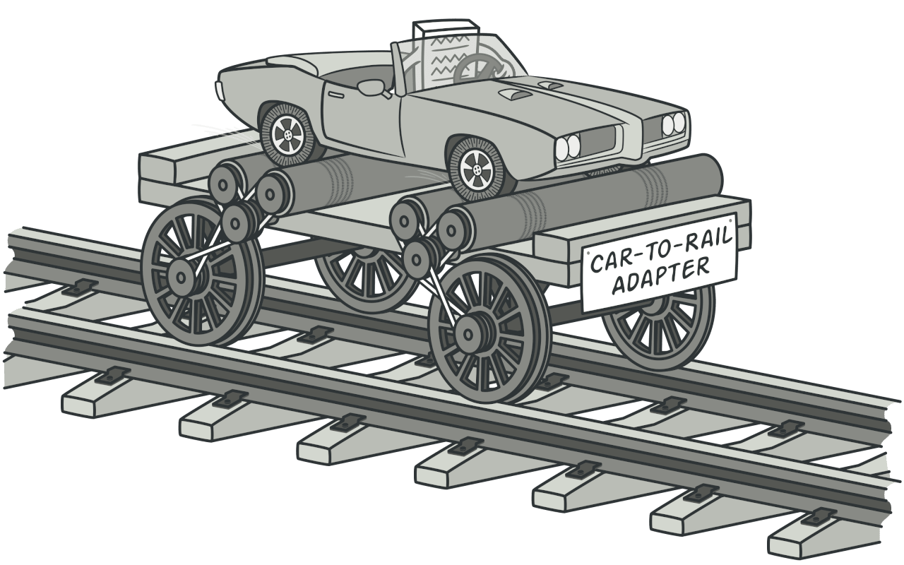
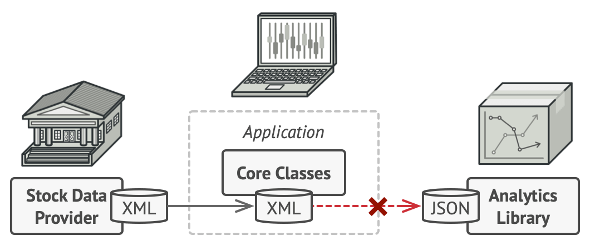
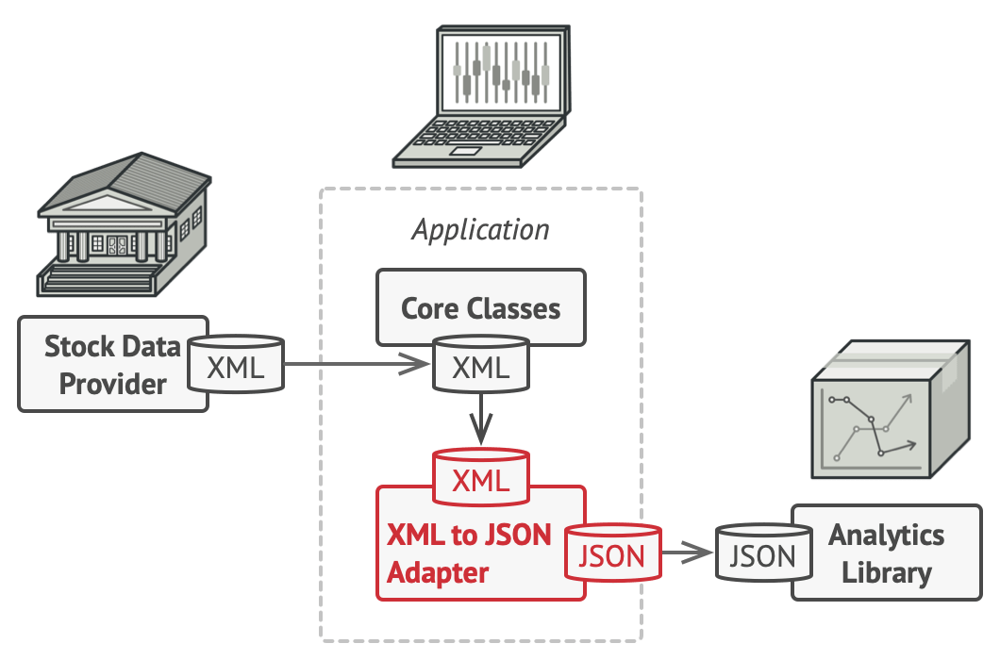
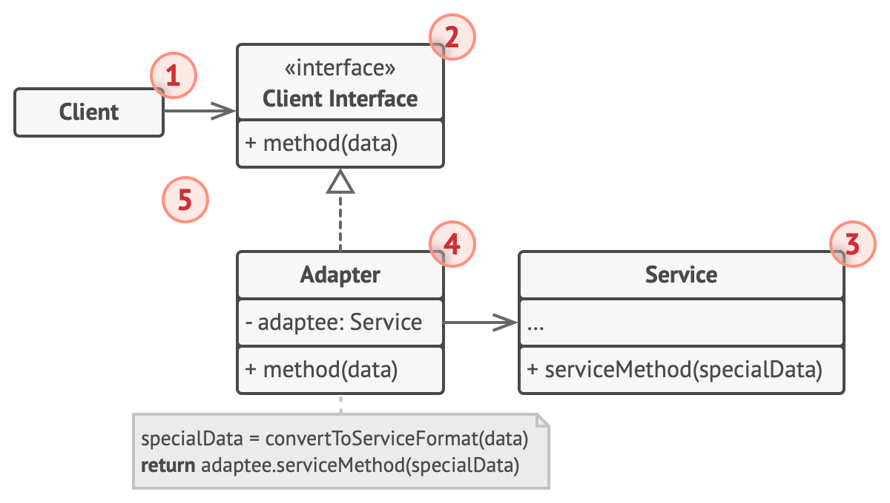
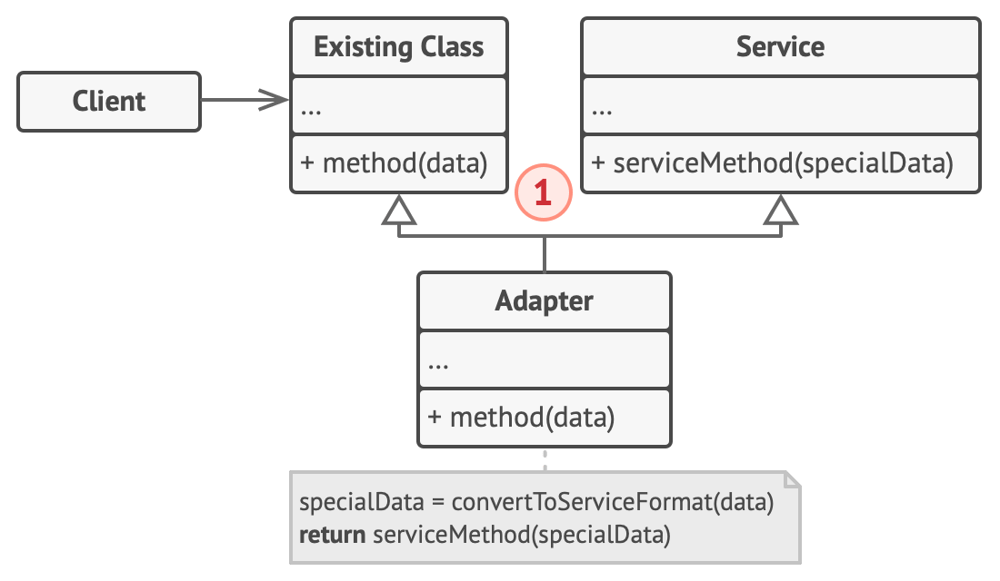
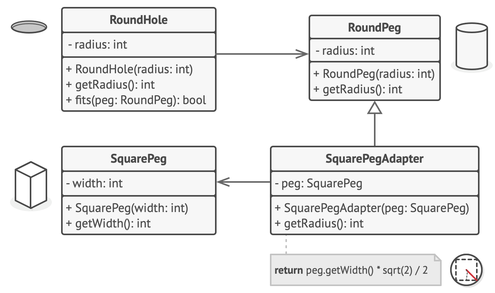

# Adapter


**Type:** Structural · **Also known as:** Wrapper

> **The 10-second version:** you have a thing that works and a thing that needs it, but their plugs don't fit — so you write one small class that speaks *your* interface on the outside and *their* interface on the inside, and nobody else has to know.

<br clear="all">

## Quick card

| | |
|---|---|
| **Problem it solves** | Code you own needs a class you can't change (3rd-party, legacy, generated) whose interface is wrong for you. |
| **Core move** | A new class *implements the interface your code wants* and *holds an instance of the class you actually have*, translating between the two. |
| **You'll recognise it by** | A constructor that takes an object of a **different** interface than the one the class implements, and methods that are 3 lines of translation + one delegated call. |
| **Rating** | Complexity ★☆☆ · Popularity ★★★ |
| **Closest relatives** | Facade (wraps a *subsystem*, invents a new interface), Decorator (*same* interface, adds behaviour), Proxy (*same* interface, controls access), Bridge (same shape, designed up-front) |
| **In your stack** | Per-dealer inventory feed importers behind one `IVehicleFeedSource`; a vendor valuation SDK behind your own `IPricingProvider`; a v1→v2 RabbitMQ message translator; a repository that turns 1990s stored-proc columns into a clean domain record. |

### How to read this file

Technical first, plain English second. 🗣️ marks the plain-English version. Part 1 is Refactoring.Guru's material with their diagrams; Parts 2–7 are code, your stack, and the stuff that makes it stick.

---

# PART 1 — The pattern

## 1. Intent

**Adapter** is a structural design pattern that allows objects with incompatible interfaces to collaborate.



### 🗣️ In plain words

Two pieces of code both work fine. They just can't talk to each other, because one says `getRequest()` and the other says `specificRequest()`, or one hands you XML and the other demands JSON.

You can't change either side — the library isn't yours, the legacy service has forty other callers, the generated client gets regenerated every build. So you write a third, tiny class that sits in the middle and translates. That class is the Adapter.

The point is not the translation code. Translation code exists either way. The point is **where it lives**: in one named class with one job, instead of smeared across every call site.

---

## 2. Problem

Imagine that you’re creating a stock market monitoring app. The app downloads the stock data from multiple sources in XML format and then displays nice-looking charts and diagrams for the user.

At some point, you decide to improve the app by integrating a smart 3rd-party analytics library. But there’s a catch: the analytics library only works with data in JSON format.



*You can’t use the analytics library “as is” because it expects the data in a format that’s incompatible with your app.*

You could change the library to work with XML. However, this might break some existing code that relies on the library. And worse, you might not have access to the library’s source code in the first place, making this approach impossible.

### 🗣️ In plain words

Here's the same pain in a shape you'd actually meet. Your marketplace ingests used-car inventory from dealers. Three dealer groups, three completely different formats, and the old importer grew like this:

```ts
// ❌ The thing that happens if nobody names the problem
async function importInventory(dealerId: string, payload: unknown) {
  if (dealerId.startsWith('AUTOMAX')) {
    // legacy SOAP client: returns XML strings, prices in paise, km as string
    const xml = await legacySoap.FetchStock(dealerId);
    const items = parseXml(xml).Stock.Item;
    for (const it of items) {
      await db.upsertListing({
        vin: it.ChassisNo,
        priceInr: Number(it.PriceP) / 100,
        odometerKm: parseInt(it.Kms, 10),
      });
    }
  } else if (dealerId.startsWith('WHEELS')) {
    // partner REST API: JSON, prices already in rupees, odometer in miles (!)
    const json = await fetch(`https://wheels.example/api/stock/${dealerId}`).then(r => r.json());
    for (const it of json.vehicles) {
      await db.upsertListing({
        vin: it.vin,
        priceInr: it.price,
        odometerKm: Math.round(it.odometer_miles * 1.60934),
      });
    }
  } else if (/* ...and a third, and a fourth... */ false) {
  }
}
```

Every symptom of the problem is visible here:

- **The `if` chain grows with every new partner**, and the file is now the single most-conflicted file in the repo.
- **Translation rules are invisible.** "Paise to rupees" and "miles to km" are buried in the middle of a loop. Nobody can test them without a SOAP endpoint and a database.
- **You can't reuse a source.** If pricing wants the same AUTOMAX stock, it copy-pastes the parsing.
- **You can't fix it at the source.** The SOAP service belongs to another company. `parseInt` on their `Kms` field is your problem forever.

The library-side version of the same thing: you buy a valuation SDK that does exactly the maths you need, and it exposes `Evaluate(VehicleDto)` where `VehicleDto` is *their* class, with *their* enum for fuel type, and it throws *their* exception type. You cannot make your domain depend on that. And you cannot edit their DLL.

---

## 3. Solution

You can create an *adapter*. This is a special object that converts the interface of one object so that another object can understand it.

An adapter wraps one of the objects to hide the complexity of conversion happening behind the scenes. The wrapped object isn’t even aware of the adapter. For example, you can wrap an object that operates in meters and kilometers with an adapter that converts all of the data to imperial units such as feet and miles.

Adapters can not only convert data into various formats but can also help objects with different interfaces collaborate. Here’s how it works:

1. The adapter gets an interface, compatible with one of the existing objects.
2. Using this interface, the existing object can safely call the adapter’s methods.
3. Upon receiving a call, the adapter passes the request to the second object, but in a format and order that the second object expects.

Sometimes it’s even possible to create a two-way adapter that can convert the calls in both directions.



Let’s get back to our stock market app. To solve the dilemma of incompatible formats, you can create XML-to-JSON adapters for every class of the analytics library that your code works with directly. Then you adjust your code to communicate with the library only via these adapters. When an adapter receives a call, it translates the incoming XML data into a JSON structure and passes the call to the appropriate methods of a wrapped analytics object.

### 🗣️ In plain words

Three mechanical moves. That's all there is:

1. **Name the interface your code wants.** Not the one the vendor has — the one your business logic would write if it were free to choose. `IVehicleFeedSource { fetch(): Promise<Listing[]> }`.
2. **Write a class that implements that interface and stores the awkward object in a field.** Usually injected through the constructor.
3. **In each method, translate → delegate → translate back.** Convert your arguments into their shape, call their method, convert their answer into your shape. Map their exceptions to yours while you're there.

Optionally, move 4: **make the client depend only on the interface**, never on the concrete adapter. Then swapping the vendor is one line in the DI container.

> **The key insight:** an adapter doesn't add capability, it moves *coupling*. Before, N call sites were coupled to a weird API. After, one class is coupled to it and everyone else is coupled to an interface you control. You didn't remove the mess — you gave it one address.

---

## 4. Real-world analogy


*A suitcase before and after a trip abroad.*

When you travel from the US to Europe for the first time, you may get a surprise when trying to charge your laptop. The power plug and sockets standards are different in different countries. That’s why your US plug won’t fit a German socket. The problem can be solved by using a power plug adapter that has the American-style socket and the European-style plug.

### 🗣️ Two more of my own

**The interpreter in the meeting.** Two executives want to do a deal; one speaks only Japanese, the other only English. Neither learns a language. A third person sits between them and says each sentence again in the other language. Notice what the interpreter is *not* doing: not negotiating, not adding terms, not deciding anything. If they start giving their own opinion, they've stopped being an adapter and become a business rule — which is exactly the moment an adapter class goes bad.

**The SD card in the camera slot.** Your phone shoots on a microSD; your old camera reader takes full-size SD. You drop the microSD into a plastic sleeve that is microSD-shaped inside and SD-shaped outside. The sleeve holds zero bytes and does zero work — it just re-shapes the pins. That's the ideal adapter: no state of its own, all the real behaviour still in the wrapped object.

---

## 5. Structure

#### Object adapter

This implementation uses the object composition principle: the adapter implements the interface of one object and wraps the other one. It can be implemented in all popular programming languages.



1. The **Client** is a class that contains the existing business logic of the program.
2. The **Client Interface** describes a protocol that other classes must follow to be able to collaborate with the client code.
3. The **Service** is some useful class (usually 3rd-party or legacy). The client can’t use this class directly because it has an incompatible interface.
4. The **Adapter** is a class that’s able to work with both the client and the service: it implements the client interface, while wrapping the service object. The adapter receives calls from the client via the client interface and translates them into calls to the wrapped service object in a format it can understand.
5. The client code doesn’t get coupled to the concrete adapter class as long as it works with the adapter via the client interface. Thanks to this, you can introduce new types of adapters into the program without breaking the existing client code. This can be useful when the interface of the service class gets changed or replaced: you can just create a new adapter class without changing the client code.

#### Class adapter

This implementation uses inheritance: the adapter inherits interfaces from both objects at the same time. Note that this approach can only be implemented in programming languages that support multiple inheritance, such as C++.



1. The **Class Adapter** doesn’t need to wrap any objects because it inherits behaviors from both the client and the service. The adaptation happens within the overridden methods. The resulting adapter can be used in place of an existing client class.

### 🗣️ Participants & roles — cheat table

| Role | What it is in code | Example from the site | Equivalent in your stack |
|---|---|---|---|
| **Client** | The business logic you're protecting. Depends on the Client Interface only. | `RoundHole` calling `fits(peg)`; the analytics app | Your `ListingIngestionService`, your pricing handler |
| **Client Interface (Target)** | The interface *you* define and own. Small, in your language. | `RoundPeg` (has `getRadius()`) | `IVehicleFeedSource`, `IPricingProvider`, `IMessagePublisher` |
| **Service (Adaptee)** | The useful-but-wrong-shaped class you can't change. | `SquarePeg` (has `getWidth()`); the JSON-only analytics library | The SOAP client, the vendor valuation SDK, the generated OpenAPI client, `SqlDataReader` |
| **Adapter** | Implements Target, holds a Service in a field, translates. | `SquarePegAdapter extends RoundPeg`, wrapping a `SquarePeg` | `AutomaxSoapFeedAdapter : IVehicleFeedSource` |
| **Object adapter** | Composition. Adapter *has-a* Service. Works in every language, can wrap subclasses at runtime. | The pseudocode version | Default choice in C# and TypeScript — single inheritance makes it the only choice anyway |
| **Class adapter** | Inheritance from both sides. Needs multiple inheritance. | The second structure diagram | Only C++ in your stack (often `private` inheritance) — see §3.3 |

### 🤝 Collaboration — who calls whom

```
                 depends only on the interface
                 ┌──────────────────────────────┐
                 │                              ▼
      ┌──────────────────┐            ┌────────────────────┐
      │      Client      │            │  ClientInterface   │
      │  (your service)  │            │  (Target) <<int>>  │
      └────────┬─────────┘            │   + request()      │
               │                      └─────────▲──────────┘
               │ 1. request()                   │ implements
               │                      ┌─────────┴──────────┐
               └─────────────────────►│      Adapter       │
                                      │  - service: Service│
                                      │  + request()       │
                                      └─────────┬──────────┘
                                                │ 2. translate args
                                                │ 3. specificRequest()
                                                ▼
                                      ┌────────────────────┐
                                      │      Service       │
                                      │    (Adaptee,       │
                                      │  3rd-party/legacy) │
                                      │ + specificRequest()│
                                      └────────────────────┘
                                                │
                                                │ 4. returns vendor-shaped result
                                                ▼
                                       Adapter converts it back
                                       and returns YOUR type
```

Sequence, one call, left to right:

```
Client            Adapter                        Service
  │                  │                              │
  ├─ request() ─────►│                              │
  │                  ├─ map(yourArgs → theirArgs)   │
  │                  ├─ specificRequest(theirArgs) ─►│
  │                  │                              ├─ does the real work
  │                  │◄──────── theirResult ────────┤
  │                  ├─ map(theirResult → yourType) │
  │                  ├─ map(theirException → yours) │
  │◄── yourResult ───┤                              │
```

**The hop that matters is arrow 1 → the Adapter, not the Service.** The Service never learns the Adapter exists; it is called normally and has no hook, no callback, no registration. That one-directional ignorance is what lets you adapt a sealed class, a static SDK entry point, or a vendor DLL you only have in binary form.

---

## 6. Pseudocode (the website's example)

This example of the **Adapter** pattern is based on the classic conflict between square pegs and round holes.



*Adapting square pegs to round holes.*

The Adapter pretends to be a round peg, with a radius equal to a half of the square’s diameter (in other words, the radius of the smallest circle that can accommodate the square peg).

```
// Say you have two classes with compatible interfaces:
// RoundHole and RoundPeg.
class RoundHole is
    constructor RoundHole(radius) { ... }

    method getRadius() is
        // Return the radius of the hole.

    method fits(peg: RoundPeg) is
        return this.getRadius() >= peg.getRadius()

class RoundPeg is
    constructor RoundPeg(radius) { ... }

    method getRadius() is
        // Return the radius of the peg.

// But there's an incompatible class: SquarePeg.
class SquarePeg is
    constructor SquarePeg(width) { ... }

    method getWidth() is
        // Return the square peg width.

// An adapter class lets you fit square pegs into round holes.
// It extends the RoundPeg class to let the adapter objects act
// as round pegs.
class SquarePegAdapter extends RoundPeg is
    // In reality, the adapter contains an instance of the
    // SquarePeg class.
    private field peg: SquarePeg

    constructor SquarePegAdapter(peg: SquarePeg) is
        this.peg = peg

    method getRadius() is
        // The adapter pretends that it's a round peg with a
        // radius that could fit the square peg that the adapter
        // actually wraps.
        return peg.getWidth() * Math.sqrt(2) / 2

// Somewhere in client code.
hole = new RoundHole(5)
rpeg = new RoundPeg(5)
hole.fits(rpeg) // true

small_sqpeg = new SquarePeg(5)
large_sqpeg = new SquarePeg(10)
hole.fits(small_sqpeg) // this won't compile (incompatible types)

small_sqpeg_adapter = new SquarePegAdapter(small_sqpeg)
large_sqpeg_adapter = new SquarePegAdapter(large_sqpeg)
hole.fits(small_sqpeg_adapter) // true
hole.fits(large_sqpeg_adapter) // false
```

### 🗣️ Reading that pseudocode

- **`class SquarePegAdapter extends RoundPeg`** — the adapter's *declared type* is the type the client already accepts. `RoundHole.fits()` was never touched and never will be. That's the whole trick in one line.
- **`private field peg: SquarePeg`** — composition. The adapter *inherits from the Target* and *holds the Adaptee*. Don't let "extends" confuse you: this is still the object adapter, because the awkward class is in a field, not in the inheritance chain.
- **`return peg.getWidth() * Math.sqrt(2) / 2`** — this is the entire translation, and it's *lossy on purpose*. A square isn't a circle; the adapter picks the smallest circle that contains it. Real adapters are full of decisions like this ("their `odometer_miles` is a float, my `OdometerKm` is an int — I round"). Those decisions deserve a comment and a unit test, and here they have exactly one place to live.
- **`hole.fits(small_sqpeg) // this won't compile`** — the compiler is the reason the pattern exists. If it *did* compile, you'd have no problem to solve. Adapter converts "incompatible types" into "one small class".
- **`hole.fits(large_sqpeg_adapter) // false`** — note the adapter did not cheat. It returned the honest adapted radius and the client's own rule rejected it. An adapter that made this `true` by fudging the number would be lying, which is the #1 adapter smell (see §5 of Part 5).
- **The client code is unchanged from line 1 to the end.** `RoundHole` has no idea square pegs exist. That's your acceptance test for a real adapter: could you delete the adapter and the client would still compile against the interface? If yes, you built it right.

---

## 7. Applicability — when to reach for it

**Use the Adapter class when you want to use some existing class, but its interface isn’t compatible with the rest of your code.**

The Adapter pattern lets you create a middle-layer class that serves as a translator between your code and a legacy class, a 3rd-party class or any other class with a weird interface.

**Use the pattern when you want to reuse several existing subclasses that lack some common functionality that can’t be added to the superclass.**

You could extend each subclass and put the missing functionality into new child classes. However, you’ll need to duplicate the code across all of these new classes, which [smells really bad](https://refactoring.guru/smells/duplicate-code).

The much more elegant solution would be to put the missing functionality into an adapter class. Then you would wrap objects with missing features inside the adapter, gaining needed features dynamically. For this to work, the target classes must have a common interface, and the adapter’s field should follow that interface. This approach looks very similar to the [Decorator](https://refactoring.guru/design-patterns/decorator) pattern.

### ✅ Quick checklist

- [ ] There is a class/API that **does the job correctly** but has the wrong shape (names, types, units, error style, sync vs async).
- [ ] You **cannot or must not change it** — third-party, generated, legacy with many callers, or changing it would be a breaking release.
- [ ] The same translation is happening (or about to happen) in **more than one place**, or is tangled inside a method that has another job.
- [ ] You want to **swap the vendor later**, or run a fake in tests, without touching business logic.
- [ ] You have **two or more sources** that mean the same thing but say it differently (three dealer feeds, two payment gateways, v1 and v2 of a message).
- [ ] The wrapped thing keeps its own behaviour — you're **translating, not adding features** (if you're adding features, that's Decorator; if you're hiding a whole subsystem, that's Facade).

If you ticked fewer than two of those, and you *can* just change the class, change the class. Refactoring.Guru says that out loud in the cons list, and it's right.

---

## 8. How to implement — step by step

1. Make sure that you have at least two classes with incompatible interfaces:

   - A useful *service* class, which you can’t change (often 3rd-party, legacy or with lots of existing dependencies).
   - One or several *client* classes that would benefit from using the service class.
2. Declare the client interface and describe how clients communicate with the service.
3. Create the adapter class and make it follow the client interface. Leave all the methods empty for now.
4. Add a field to the adapter class to store a reference to the service object. The common practice is to initialize this field via the constructor, but sometimes it’s more convenient to pass it to the adapter when calling its methods.
5. One by one, implement all methods of the client interface in the adapter class. The adapter should delegate most of the real work to the service object, handling only the interface or data format conversion.
6. Clients should use the adapter via the client interface. This will let you change or extend the adapters without affecting the client code.

### 🗣️ The same steps, blunt version

1. Find the awkward class. Confirm you genuinely can't edit it.
2. Write down the interface you *wish* it had — in your vocabulary, with your types. Keep it small: only the methods the client actually calls, not a mirror of the vendor's API surface.
3. Create `XyzAdapter` implementing that interface. Stub every method.
4. Put the awkward object in a constructor-injected `readonly` field. (Pass it per-call instead only if the client legitimately holds one adapter for many services.)
5. Fill the methods in. Each should read: convert in → call them → convert out → convert their errors. If a method grows business logic, that logic is in the wrong class.
6. Change every call site to depend on the interface. Register the adapter in your DI container. Now nothing but the container knows the vendor's name.
7. (Not in the list, but do it.) Write unit tests against a fake Service. The unit conversions and null handling in step 5 are exactly the code that breaks silently in production.

---

## 9. Pros and cons

- ✅ *Single Responsibility Principle*. You can separate the interface or data conversion code from the primary business logic of the program.
- ✅ *Open/Closed Principle*. You can introduce new types of adapters into the program without breaking the existing client code, as long as they work with the adapters through the client interface.

- ⛔ The overall complexity of the code increases because you need to introduce a set of new interfaces and classes. Sometimes it’s simpler just to change the service class so that it matches the rest of your code.

### ⚖️ Honest trade-offs from the trenches

**The real cost isn't the class, it's the interface.** Writing `AutomaxFeedAdapter` is twenty minutes. Designing `IVehicleFeedSource` so that four future dealer feeds fit it without contortion is the hard part, and you will get it wrong the first time. The usual failure is designing the interface by looking at the first vendor — you end up with `IVehicleFeedSource.FetchStockXml()` and the next vendor, who returns JSON pages, doesn't fit. Design the interface from what the *client* needs, then check it against two vendors before you write either adapter.

**The tell that it's worth it** is a second implementation, real or fake. One vendor, one adapter, one caller, and no test double is just indirection with a pattern name on it — and honestly, sometimes a `static toListing(x)` mapper function is the right size. The moment a second source appears, or the moment you want to run integration tests without the vendor's sandbox being up, the adapter pays for itself immediately and permanently.

**A lot of this is already free in your stack, and you should take the free version.** In C#, a typed `HttpClient` plus `IServiceCollection` registration means the adapter is a 30-line class and one `services.AddScoped<IPricingProvider, VendorPricingAdapter>()` line; you get lifetime management, `IHttpClientFactory` handlers and swap-in-tests without writing any plumbing. In TypeScript, structural typing means you often don't need an `implements` clause at all — an object literal with the right method shape *is* the adapter, and `satisfies IVehicleFeedSource` will check it. Node's `util.promisify` is a callback→Promise adapter you'd otherwise hand-write; `Array.from` and `Readable.from` adapt iterables; RxJS `from()` adapts promises and arrays to Observables. In C++, `std::function` is a type-erasing adapter for anything callable, and `std::stack`/`std::queue` are literally named "container adapters" in the standard.

**The cost that bites later is stacking.** One adapter is clarity. An adapter around an adapter around a facade around a generated client is a stack trace nobody can read at 2 a.m. If you find yourself adapting your own code, stop — you had the source, you should have changed the interface. Adapter is for boundaries you don't own. Inside your own codebase it's usually a sign you postponed a rename.

---

## 10. Relations with other patterns

- [Bridge](https://refactoring.guru/design-patterns/bridge) is usually designed up-front, letting you develop parts of an application independently of each other. On the other hand, [Adapter](https://refactoring.guru/design-patterns/adapter) is commonly used with an existing app to make some otherwise-incompatible classes work together nicely.
- [Adapter](https://refactoring.guru/design-patterns/adapter) provides a completely different interface for accessing an existing object. On the other hand, with the [Decorator](https://refactoring.guru/design-patterns/decorator) pattern the interface either stays the same or gets extended. In addition, *Decorator* supports recursive composition, which isn’t possible when you use *Adapter*.
- With [Adapter](https://refactoring.guru/design-patterns/adapter) you access an existing object via different interface. With [Proxy](https://refactoring.guru/design-patterns/proxy), the interface stays the same. With [Decorator](https://refactoring.guru/design-patterns/decorator) you access the object via an enhanced interface.
- [Facade](https://refactoring.guru/design-patterns/facade) defines a new interface for existing objects, whereas [Adapter](https://refactoring.guru/design-patterns/adapter) tries to make the existing interface usable. *Adapter* usually wraps just one object, while *Facade* works with an entire subsystem of objects.
- [Bridge](https://refactoring.guru/design-patterns/bridge), [State](https://refactoring.guru/design-patterns/state), [Strategy](https://refactoring.guru/design-patterns/strategy) (and to some degree [Adapter](https://refactoring.guru/design-patterns/adapter)) have very similar structures. Indeed, all of these patterns are based on composition, which is delegating work to other objects. However, they all solve different problems. A pattern isn’t just a recipe for structuring your code in a specific way. It can also communicate to other developers the problem the pattern solves.

### 🗣️ Disambiguation table

| Pattern | Interface after wrapping | Purpose | Wraps | The one-line test |
|---|---|---|---|---|
| **Adapter** | **Different** (the one the client wants) | Make an incompatible thing usable | Usually **one** object | *"Their plug doesn't fit my socket."* |
| **Decorator** | **Same** (or extended) | Add behaviour, stackable/recursive | One object of the **same** interface | *"Same socket, but now it also logs, caches and retries."* |
| **Proxy** | **Same** | Control access: lazy load, remote call, permissions | One object of the same interface | *"Same socket, but I decide if and when you get power."* |
| **Facade** | **New**, simpler | Hide a whole subsystem behind one easy entry point | **Many** objects | *"I don't want their plug at all, give me one big button."* |
| **Bridge** | Two hierarchies, by design | Let abstraction and implementation vary independently | Designed **up-front** | *"Nothing is broken — I planned two axes from day one."* |

**The memorable separator:** *Adapter changes the interface and keeps the behaviour; Decorator keeps the interface and changes the behaviour; Proxy keeps both and changes **when**; Facade throws the interface away and invents a friendlier one.*

And the timing separator, straight from the Relations section: **Bridge is planned, Adapter is retrofitted.** If you drew it on a whiteboard before the code existed, it's a Bridge. If you wrote it because something already shipped and doesn't fit, it's an Adapter.

---

# PART 2 — Official code examples from Refactoring.Guru

## 2.1 C#

**Complexity:** ★☆☆ (1/3)

**Popularity:** ★★★ (3/3)

**Usage examples:** The Adapter pattern is pretty common in C# code. It’s very often used in systems based on some legacy code. In such cases, Adapters make legacy code work with modern classes.

**Identification:** Adapter is recognizable by a constructor which takes an instance of a different abstract/interface type. When the adapter receives a call to any of its methods, it translates parameters to the appropriate format and then directs the call to one or several methods of the wrapped object.

### Conceptual Example

This example illustrates the structure of the **Adapter** design pattern. It focuses on answering these questions:

- What classes does it consist of?
- What roles do these classes play?
- In what way the elements of the pattern are related?

##### **Program.cs:** Conceptual example

```csharp
using System;

namespace RefactoringGuru.DesignPatterns.Adapter.Conceptual
{
    // The Target defines the domain-specific interface used by the client code.
    public interface ITarget
    {
        string GetRequest();
    }

    // The Adaptee contains some useful behavior, but its interface is
    // incompatible with the existing client code. The Adaptee needs some
    // adaptation before the client code can use it.
    class Adaptee
    {
        public string GetSpecificRequest()
        {
            return "Specific request.";
        }
    }

    // The Adapter makes the Adaptee's interface compatible with the Target's
    // interface.
    class Adapter : ITarget
    {
        private readonly Adaptee _adaptee;

        public Adapter(Adaptee adaptee)
        {
            this._adaptee = adaptee;
        }

        public string GetRequest()
        {
            return $"This is '{this._adaptee.GetSpecificRequest()}'";
        }
    }

    class Program
    {
        static void Main(string[] args)
        {
            Adaptee adaptee = new Adaptee();
            ITarget target = new Adapter(adaptee);

            Console.WriteLine("Adaptee interface is incompatible with the client.");
            Console.WriteLine("But with adapter client can call it's method.");

            Console.WriteLine(target.GetRequest());
        }
    }
}
```

##### **Output.txt:** Execution result

```output
Adaptee interface is incompatible with the client.
But with adapter client can call it's method.
This is 'Specific request.'
```

## 2.2 TypeScript

**Complexity:** ★☆☆ (1/3)

**Popularity:** ★★★ (3/3)

**Usage examples:** The Adapter pattern is pretty common in TypeScript code. It’s very often used in systems based on some legacy code. In such cases, Adapters make legacy code work with modern classes.

**Identification:** Adapter is recognizable by a constructor which takes an instance of a different abstract/interface type. When the adapter receives a call to any of its methods, it translates parameters to the appropriate format and then directs the call to one or several methods of the wrapped object.

### Conceptual Example

This example illustrates the structure of the **Adapter** design pattern and focuses on the following questions:

- What classes does it consist of?
- What roles do these classes play?
- In what way the elements of the pattern are related?

##### **index.ts:** Conceptual example

```typescript
/**
 * The Target defines the domain-specific interface used by the client code.
 */
class Target {
    public request(): string {
        return 'Target: The default target\'s behavior.';
    }
}

/**
 * The Adaptee contains some useful behavior, but its interface is incompatible
 * with the existing client code. The Adaptee needs some adaptation before the
 * client code can use it.
 */
class Adaptee {
    public specificRequest(): string {
        return '.eetpadA eht fo roivaheb laicepS';
    }
}

/**
 * The Adapter makes the Adaptee's interface compatible with the Target's
 * interface.
 */
class Adapter extends Target {
    private adaptee: Adaptee;

    constructor(adaptee: Adaptee) {
        super();
        this.adaptee = adaptee;
    }

    public request(): string {
        const result = this.adaptee.specificRequest().split('').reverse().join('');
        return `Adapter: (TRANSLATED) ${result}`;
    }
}

/**
 * The client code supports all classes that follow the Target interface.
 */
function clientCode(target: Target) {
    console.log(target.request());
}

console.log('Client: I can work just fine with the Target objects:');
const target = new Target();
clientCode(target);

console.log('');

const adaptee = new Adaptee();
console.log('Client: The Adaptee class has a weird interface. See, I don\'t understand it:');
console.log(`Adaptee: ${adaptee.specificRequest()}`);

console.log('');

console.log('Client: But I can work with it via the Adapter:');
const adapter = new Adapter(adaptee);
clientCode(adapter);
```

##### **Output.txt:** Execution result

```output
Client: I can work just fine with the Target objects:
Target: The default target's behavior.

Client: The Adaptee class has a weird interface. See, I don't understand it:
Adaptee: .eetpadA eht fo roivaheb laicepS

Client: But I can work with it via the Adapter:
Adapter: (TRANSLATED) Special behavior of the Adaptee.
```

## 2.3 C++

**Complexity:** ★☆☆ (1/3)

**Popularity:** ★★★ (3/3)

**Usage examples:** The Adapter pattern is pretty common in C++ code. It’s very often used in systems based on some legacy code. In such cases, Adapters make legacy code work with modern classes.

**Identification:** Adapter is recognizable by a constructor which takes an instance of a different abstract/interface type. When the adapter receives a call to any of its methods, it translates parameters to the appropriate format and then directs the call to one or several methods of the wrapped object.

### Conceptual Example

This example illustrates the structure of the **Adapter** design pattern. It focuses on answering these questions:

- What classes does it consist of?
- What roles do these classes play?
- In what way the elements of the pattern are related?

##### **main.cc:** Conceptual example

```cpp
/**
 * The Target defines the domain-specific interface used by the client code.
 */
class Target {
 public:
  virtual ~Target() = default;

  virtual std::string Request() const {
    return "Target: The default target's behavior.";
  }
};

/**
 * The Adaptee contains some useful behavior, but its interface is incompatible
 * with the existing client code. The Adaptee needs some adaptation before the
 * client code can use it.
 */
class Adaptee {
 public:
  std::string SpecificRequest() const {
    return ".eetpadA eht fo roivaheb laicepS";
  }
};

/**
 * The Adapter makes the Adaptee's interface compatible with the Target's
 * interface.
 */
class Adapter : public Target {
 private:
  Adaptee *adaptee_;

 public:
  Adapter(Adaptee *adaptee) : adaptee_(adaptee) {}
  std::string Request() const override {
    std::string to_reverse = this->adaptee_->SpecificRequest();
    std::reverse(to_reverse.begin(), to_reverse.end());
    return "Adapter: (TRANSLATED) " + to_reverse;
  }
};

/**
 * The client code supports all classes that follow the Target interface.
 */
void ClientCode(const Target *target) {
  std::cout << target->Request();
}

int main() {
  std::cout << "Client: I can work just fine with the Target objects:\n";
  Target *target = new Target;
  ClientCode(target);
  std::cout << "\n\n";
  Adaptee *adaptee = new Adaptee;
  std::cout << "Client: The Adaptee class has a weird interface. See, I don't understand it:\n";
  std::cout << "Adaptee: " << adaptee->SpecificRequest();
  std::cout << "\n\n";
  std::cout << "Client: But I can work with it via the Adapter:\n";
  Adapter *adapter = new Adapter(adaptee);
  ClientCode(adapter);
  std::cout << "\n";

  delete target;
  delete adaptee;
  delete adapter;

  return 0;
}
```

##### **Output.txt:** Execution result

```output
Client: I can work just fine with the Target objects:
Target: The default target's behavior.

Client: The Adaptee class has a weird interface. See, I don't understand it:
Adaptee: .eetpadA eht fo roivaheb laicepS

Client: But I can work with it via the Adapter:
Adapter: (TRANSLATED) Special behavior of the Adaptee.
```

### Multiple Inheritance

In C++ the **Adapter** pattern can be implemented using multiple inheritance.

##### **main.cc:** Multiple Inheritance

```cpp
/**
 * The Target defines the domain-specific interface used by the client code.
 */
class Target {
 public:
  virtual ~Target() = default;
  virtual std::string Request() const {
    return "Target: The default target's behavior.";
  }
};

/**
 * The Adaptee contains some useful behavior, but its interface is incompatible
 * with the existing client code. The Adaptee needs some adaptation before the
 * client code can use it.
 */
class Adaptee {
 public:
  std::string SpecificRequest() const {
    return ".eetpadA eht fo roivaheb laicepS";
  }
};

/**
 * The Adapter makes the Adaptee's interface compatible with the Target's
 * interface using multiple inheritance.
 */
class Adapter : public Target, public Adaptee {
 public:
  Adapter() {}
  std::string Request() const override {
    std::string to_reverse = SpecificRequest();
    std::reverse(to_reverse.begin(), to_reverse.end());
    return "Adapter: (TRANSLATED) " + to_reverse;
  }
};

/**
 * The client code supports all classes that follow the Target interface.
 */
void ClientCode(const Target *target) {
  std::cout << target->Request();
}

int main() {
  std::cout << "Client: I can work just fine with the Target objects:\n";
  Target *target = new Target;
  ClientCode(target);
  std::cout << "\n\n";
  Adaptee *adaptee = new Adaptee;
  std::cout << "Client: The Adaptee class has a weird interface. See, I don't understand it:\n";
  std::cout << "Adaptee: " << adaptee->SpecificRequest();
  std::cout << "\n\n";
  std::cout << "Client: But I can work with it via the Adapter:\n";
  Adapter *adapter = new Adapter;
  ClientCode(adapter);
  std::cout << "\n";

  delete target;
  delete adaptee;
  delete adapter;

  return 0;
}
```

##### **Output.txt:** Execution result

```output
Client: I can work just fine with the Target objects:
Target: The default target's behavior.

Client: The Adaptee class has a weird interface. See, I don't understand it:
Adaptee: .eetpadA eht fo roivaheb laicepS

Client: But I can work with it via the Adapter:
Adapter: (TRANSLATED) Special behavior of the Adaptee.
```

## 2.4 Java

**Complexity:** ★☆☆ (1/3)

**Popularity:** ★★★ (3/3)

**Usage examples:** The Adapter pattern is pretty common in Java code. It’s very often used in systems based on some legacy code. In such cases, Adapters make legacy code work with modern classes.

**Identification:** Adapter is recognizable by a constructor which takes an instance of a different abstract/interface type. When the adapter receives a call to any of its methods, it translates parameters to the appropriate format and then directs the call to one or several methods of the wrapped object.

### Fitting square pegs into round holes

This simple example shows how an Adapter can make incompatible objects work together.

#### **round**

##### **round/RoundHole.java:** Round holes

```java
package refactoring_guru.adapter.example.round;

/**
 * RoundHoles are compatible with RoundPegs.
 */
public class RoundHole {
    private double radius;

    public RoundHole(double radius) {
        this.radius = radius;
    }

    public double getRadius() {
        return radius;
    }

    public boolean fits(RoundPeg peg) {
        boolean result;
        result = (this.getRadius() >= peg.getRadius());
        return result;
    }
}
```

##### **round/RoundPeg.java:** Round pegs

```java
package refactoring_guru.adapter.example.round;

/**
 * RoundPegs are compatible with RoundHoles.
 */
public class RoundPeg {
    private double radius;

    public RoundPeg() {}

    public RoundPeg(double radius) {
        this.radius = radius;
    }

    public double getRadius() {
        return radius;
    }
}
```

#### **square**

##### **square/SquarePeg.java:** Square pegs

```java
package refactoring_guru.adapter.example.square;

/**
 * SquarePegs are not compatible with RoundHoles (they were implemented by
 * previous development team). But we have to integrate them into our program.
 */
public class SquarePeg {
    private double width;

    public SquarePeg(double width) {
        this.width = width;
    }

    public double getWidth() {
        return width;
    }

    public double getSquare() {
        double result;
        result = Math.pow(this.width, 2);
        return result;
    }
}
```

#### **adapters**

##### **adapters/SquarePegAdapter.java:** Adapter of square pegs to round holes

```java
package refactoring_guru.adapter.example.adapters;

import refactoring_guru.adapter.example.round.RoundPeg;
import refactoring_guru.adapter.example.square.SquarePeg;

/**
 * Adapter allows fitting square pegs into round holes.
 */
public class SquarePegAdapter extends RoundPeg {
    private SquarePeg peg;

    public SquarePegAdapter(SquarePeg peg) {
        this.peg = peg;
    }

    @Override
    public double getRadius() {
        double result;
        // Calculate a minimum circle radius, which can fit this peg.
        result = (Math.sqrt(Math.pow((peg.getWidth() / 2), 2) * 2));
        return result;
    }
}
```

##### **Demo.java:** Client code

```java
package refactoring_guru.adapter.example;

import refactoring_guru.adapter.example.adapters.SquarePegAdapter;
import refactoring_guru.adapter.example.round.RoundHole;
import refactoring_guru.adapter.example.round.RoundPeg;
import refactoring_guru.adapter.example.square.SquarePeg;

/**
 * Somewhere in client code...
 */
public class Demo {
    public static void main(String[] args) {
        // Round fits round, no surprise.
        RoundHole hole = new RoundHole(5);
        RoundPeg rpeg = new RoundPeg(5);
        if (hole.fits(rpeg)) {
            System.out.println("Round peg r5 fits round hole r5.");
        }

        SquarePeg smallSqPeg = new SquarePeg(2);
        SquarePeg largeSqPeg = new SquarePeg(20);
        // hole.fits(smallSqPeg); // Won't compile.

        // Adapter solves the problem.
        SquarePegAdapter smallSqPegAdapter = new SquarePegAdapter(smallSqPeg);
        SquarePegAdapter largeSqPegAdapter = new SquarePegAdapter(largeSqPeg);
        if (hole.fits(smallSqPegAdapter)) {
            System.out.println("Square peg w2 fits round hole r5.");
        }
        if (!hole.fits(largeSqPegAdapter)) {
            System.out.println("Square peg w20 does not fit into round hole r5.");
        }
    }
}
```

##### **OutputDemo.txt:** Execution result

```output
Round peg r5 fits round hole r5.
Square peg w2 fits round hole r5.
Square peg w20 does not fit into round hole r5.
```

---

# PART 3 — Learn it by building it

## 3.1 The dumbest possible version — TypeScript

### ❌ BEFORE — the pain, concretely

One importer, two dealer sources, and a third arriving next sprint:

```ts
// ingestion/importer.ts  — the file everybody is scared of
import { legacySoap } from '../vendor/automax-soap';
import { parseXml } from '../vendor/xml';
import { db } from '../db';

export async function importInventory(dealerId: string, source: 'automax' | 'wheels') {
  if (source === 'automax') {
    const xml = await legacySoap.FetchStock(dealerId);          // returns an XML string
    for (const it of parseXml(xml).Stock.Item) {
      await db.upsertListing({
        vin: it.ChassisNo,
        make: it.Brand,
        model: it.Modl,
        year: Number(it.MfgYr),
        priceInr: Number(it.PriceP) / 100,                      // paise → rupees
        odometerKm: parseInt(it.Kms, 10),
        fuel: it.FuelCd === 'D' ? 'diesel' : 'petrol',          // and CNG? shrug
      });
    }
  } else {
    const res = await fetch(`https://wheels.example/v2/stock?dealer=${dealerId}`);
    const json = await res.json();
    for (const v of json.vehicles) {
      await db.upsertListing({
        vin: v.vin,
        make: v.manufacturer,
        model: v.model_name,
        year: v.model_year,
        priceInr: v.price,                                      // already rupees
        odometerKm: Math.round(v.odometer_miles * 1.60934),     // miles → km
        fuel: v.fuel_type.toLowerCase(),
      });
    }
  }
}
```

What's wrong: the function has **three** jobs (fetch, translate, persist), the unit conversions are untestable without a network, and `source` is a union type that must be edited for every new partner — in a file that also touches the database.

### ✅ AFTER — the adapter version

```ts
// ─────────────────────────────────────────────────────────────
//  1. THE TARGET — the interface YOUR code wishes existed.
//     Written in your vocabulary. No vendor words anywhere.
// ─────────────────────────────────────────────────────────────

export type FuelType = 'petrol' | 'diesel' | 'cng' | 'electric' | 'hybrid';

export interface Listing {
  readonly vin: string;
  readonly make: string;
  readonly model: string;
  readonly year: number;
  readonly priceInr: number;      // rupees, always
  readonly odometerKm: number;    // kilometres, always, integer
  readonly fuel: FuelType;
}

export interface VehicleFeedSource {            // 👈 the Target / Client Interface
  readonly dealerId: string;
  fetchListings(): Promise<Listing[]>;
}

// ─────────────────────────────────────────────────────────────
//  2. THE ADAPTEES — code you do NOT own and cannot change.
//     (Shown here as the shapes they actually expose.)
// ─────────────────────────────────────────────────────────────

interface LegacySoapClient {                    // vendor DLL-ish SOAP wrapper
  FetchStock(dealerCode: string): Promise<string>;   // XML string, prices in paise
}

interface WheelsApiVehicle {                    // partner REST payload
  vin: string;
  manufacturer: string;
  model_name: string;
  model_year: number;
  price: number;                                // rupees
  odometer_miles: number;
  fuel_type: string;                            // "PETROL" | "DIESEL" | "CNG" | ...
}

// ─────────────────────────────────────────────────────────────
//  3. ADAPTER #1 — legacy SOAP  ➜  VehicleFeedSource
// ─────────────────────────────────────────────────────────────

const MILES_TO_KM = 1.60934;

export class AutomaxSoapFeedAdapter implements VehicleFeedSource {   // 👈 implements YOURS
  constructor(
    readonly dealerId: string,
    private readonly soap: LegacySoapClient,     // 👈 holds THEIRS
    private readonly parseXml: (xml: string) => any,
  ) {}

  async fetchListings(): Promise<Listing[]> {
    const xml = await this.soap.FetchStock(this.dealerId);           // delegate
    const items = this.parseXml(xml)?.Stock?.Item ?? [];
    const rows = Array.isArray(items) ? items : [items];             // SOAP single-item quirk
    return rows.map((it: any) => this.toListing(it));                // translate out
  }

  /** The entire vendor-specific knowledge of this integration lives here. */
  private toListing(it: any): Listing {
    return {
      vin: String(it.ChassisNo).trim().toUpperCase(),
      make: String(it.Brand).trim(),
      model: String(it.Modl).trim(),
      year: Number(it.MfgYr),
      priceInr: Number(it.PriceP) / 100,                   // 👈 paise → rupees
      odometerKm: Math.round(Number(it.Kms)),
      fuel: AutomaxSoapFeedAdapter.FUEL[it.FuelCd] ?? 'petrol',
    };
  }

  private static readonly FUEL: Record<string, FuelType> = {
    P: 'petrol', D: 'diesel', C: 'cng', E: 'electric', H: 'hybrid',
  };
}

// ─────────────────────────────────────────────────────────────
//  4. ADAPTER #2 — partner REST API  ➜  VehicleFeedSource
//     Same Target, totally different insides.
// ─────────────────────────────────────────────────────────────

export class WheelsRestFeedAdapter implements VehicleFeedSource {
  constructor(
    readonly dealerId: string,
    private readonly http: typeof fetch,
    private readonly baseUrl = 'https://wheels.example/v2',
  ) {}

  async fetchListings(): Promise<Listing[]> {
    const res = await this.http(`${this.baseUrl}/stock?dealer=${encodeURIComponent(this.dealerId)}`);
    if (!res.ok) {
      throw new FeedUnavailableError(this.dealerId, res.status);     // 👈 their error → yours
    }
    const body = (await res.json()) as { vehicles: WheelsApiVehicle[] };
    return body.vehicles.map((v) => ({
      vin: v.vin.toUpperCase(),
      make: v.manufacturer,
      model: v.model_name,
      year: v.model_year,
      priceInr: v.price,
      odometerKm: Math.round(v.odometer_miles * MILES_TO_KM),         // 👈 miles → km
      fuel: (v.fuel_type.toLowerCase() as FuelType) ?? 'petrol',
    }));
  }
}

export class FeedUnavailableError extends Error {
  constructor(readonly dealerId: string, readonly statusCode: number) {
    super(`Feed for dealer ${dealerId} returned ${statusCode}`);
    this.name = 'FeedUnavailableError';
  }
}

// ─────────────────────────────────────────────────────────────
//  5. THE CLIENT — knows nothing about SOAP, REST, paise or miles
// ─────────────────────────────────────────────────────────────

export class ListingIngestionService {
  constructor(private readonly repo: { upsertListing(l: Listing): Promise<void> }) {}

  async ingestFrom(source: VehicleFeedSource): Promise<number> {     // 👈 Target only
    const listings = await source.fetchListings();
    for (const listing of listings) {
      await this.repo.upsertListing(listing);
    }
    return listings.length;
  }

  async ingestAll(sources: readonly VehicleFeedSource[]): Promise<number> {
    const counts = await Promise.all(sources.map((s) => this.ingestFrom(s)));
    return counts.reduce((a, b) => a + b, 0);
  }
}
```

**What to notice:**

- `ListingIngestionService` has **zero** imports from `vendor/`. Adding a fifth dealer format cannot touch it. That, not the class count, is the win.
- Both adapters implement the same Target but share **no** code. Don't extract a `BaseFeedAdapter` — the whole point is that the awkward parts are different.
- The unit conversions moved out of a loop into a named `toListing` method you can test with a plain object and no network: `expect(adapter['toListing']({ PriceP: '125000', ... }).priceInr).toBe(1250)`.
- `FeedUnavailableError` is *your* exception. Adapters translate errors as well as data — otherwise `fetch`'s `TypeError` and SOAP's fault strings both leak upward and your handler ends up knowing about both.
- The adapter is a **stateless translator with one dependency**. If it grows a cache, it has become a Proxy; if it grows retry logic, that belongs in a Decorator around the adapter.
- TypeScript's structural typing means for a quick test double you don't need a class at all:
  ```ts
  const fake: VehicleFeedSource = {
    dealerId: 'TEST',
    fetchListings: async () => [{ vin: 'X', make: 'Maruti', model: 'Swift', year: 2021,
                                 priceInr: 550000, odometerKm: 32000, fuel: 'petrol' }],
  };
  ```

---

## 3.2 Same thing in C#

```csharp
using System;
using System.Collections.Generic;
using System.Collections.Immutable;
using System.Globalization;
using System.Linq;
using System.Net.Http;
using System.Net.Http.Json;
using System.Threading;
using System.Threading.Tasks;
using System.Xml.Linq;

namespace Marketplace.Ingestion;

// ── 1. The Target: the interface your domain wants ────────────────────────────

public enum FuelType { Petrol, Diesel, Cng, Electric, Hybrid }

public sealed record Listing(
    string Vin,
    string Make,
    string Model,
    int Year,
    decimal PriceInr,        // rupees, always — decimal because it's money
    int OdometerKm,          // kilometres, always
    FuelType Fuel);

public interface IVehicleFeedSource
{
    string DealerId { get; }
    Task<IReadOnlyList<Listing>> FetchListingsAsync(CancellationToken ct = default);
}

public sealed class FeedUnavailableException(string dealerId, int statusCode)
    : Exception($"Feed for dealer {dealerId} returned {statusCode}")
{
    public string DealerId { get; } = dealerId;
    public int StatusCode { get; } = statusCode;
}

// ── 2. The Adaptees: things you cannot change ─────────────────────────────────

/// <summary>Generated SOAP client. Returns raw XML, prices in paise, km as string.</summary>
public interface ILegacyStockService
{
    Task<string> FetchStockAsync(string dealerCode, CancellationToken ct);
}

/// <summary>Partner REST DTO, exactly as their OpenAPI generator emits it.</summary>
public sealed class WheelsApiVehicle
{
    public string Vin { get; set; } = "";
    public string Manufacturer { get; set; } = "";
    public string ModelName { get; set; } = "";
    public int ModelYear { get; set; }
    public decimal Price { get; set; }
    public double OdometerMiles { get; set; }
    public string FuelType { get; set; } = "";
}

public sealed class WheelsApiResponse
{
    public List<WheelsApiVehicle> Vehicles { get; set; } = [];
}

// ── 3. Adapter #1: legacy SOAP ➜ IVehicleFeedSource ───────────────────────────

public sealed class AutomaxSoapFeedAdapter : IVehicleFeedSource   // 👈 implements YOURS
{
    private readonly ILegacyStockService _soap;                   // 👈 holds THEIRS

    public AutomaxSoapFeedAdapter(string dealerId, ILegacyStockService soap)
        => (DealerId, _soap) = (dealerId, soap);

    public string DealerId { get; }

    public async Task<IReadOnlyList<Listing>> FetchListingsAsync(CancellationToken ct = default)
    {
        string xml = await _soap.FetchStockAsync(DealerId, ct);            // delegate
        XElement root = XElement.Parse(xml);

        return root.Elements("Item")
                   .Select(ToListing)                                       // translate
                   .ToImmutableArray();
    }

    /// <summary>Every AUTOMAX-specific fact lives in this one method.</summary>
    private static Listing ToListing(XElement it) => new(
        Vin:        (it.Element("ChassisNo")?.Value ?? "").Trim().ToUpperInvariant(),
        Make:       (it.Element("Brand")?.Value ?? "").Trim(),
        Model:      (it.Element("Modl")?.Value ?? "").Trim(),
        Year:       int.Parse(it.Element("MfgYr")!.Value, CultureInfo.InvariantCulture),
        PriceInr:   decimal.Parse(it.Element("PriceP")!.Value, CultureInfo.InvariantCulture) / 100m,
        OdometerKm: (int)Math.Round(double.Parse(it.Element("Kms")!.Value, CultureInfo.InvariantCulture)),
        Fuel:       MapFuel(it.Element("FuelCd")?.Value));

    private static FuelType MapFuel(string? code) => code switch   // 👈 switch expression
    {
        "P" => FuelType.Petrol,
        "D" => FuelType.Diesel,
        "C" => FuelType.Cng,
        "E" => FuelType.Electric,
        "H" => FuelType.Hybrid,
        _   => FuelType.Petrol,        // documented fallback, not an accident
    };
}

// ── 4. Adapter #2: partner REST ➜ IVehicleFeedSource ──────────────────────────

public sealed class WheelsRestFeedAdapter : IVehicleFeedSource
{
    private const double MilesToKm = 1.60934;
    private readonly HttpClient _http;                 // typed client from IHttpClientFactory

    public WheelsRestFeedAdapter(string dealerId, HttpClient http)
        => (DealerId, _http) = (dealerId, http);

    public string DealerId { get; }

    public async Task<IReadOnlyList<Listing>> FetchListingsAsync(CancellationToken ct = default)
    {
        using HttpResponseMessage res =
            await _http.GetAsync($"stock?dealer={Uri.EscapeDataString(DealerId)}", ct);

        if (!res.IsSuccessStatusCode)
            throw new FeedUnavailableException(DealerId, (int)res.StatusCode);   // 👈 their error → yours

        WheelsApiResponse body =
            await res.Content.ReadFromJsonAsync<WheelsApiResponse>(ct)
            ?? new WheelsApiResponse();

        return body.Vehicles.Select(v => new Listing(
            Vin:        v.Vin.ToUpperInvariant(),
            Make:       v.Manufacturer,
            Model:      v.ModelName,
            Year:       v.ModelYear,
            PriceInr:   v.Price,
            OdometerKm: (int)Math.Round(v.OdometerMiles * MilesToKm),
            Fuel:       Enum.TryParse<FuelType>(v.FuelType, ignoreCase: true, out var f)
                            ? f : FuelType.Petrol))
            .ToImmutableArray();
    }
}

// ── 5. The Client: depends on the interface only ──────────────────────────────

public interface IListingRepository
{
    Task UpsertAsync(Listing listing, CancellationToken ct = default);
}

public sealed class ListingIngestionService(IListingRepository repo)
{
    public async Task<int> IngestFromAsync(IVehicleFeedSource source, CancellationToken ct = default)
    {
        IReadOnlyList<Listing> listings = await source.FetchListingsAsync(ct);
        foreach (Listing listing in listings)
            await repo.UpsertAsync(listing, ct);
        return listings.Count;
    }
}
```

**C#-specific notes:**

- **`record` is the right shape for the Target's data.** Value equality makes adapter tests one-liners: `Assert.Equal(expected, adapter.ToListing(xml))` compares all seven fields with no `Equals` override.
- **`sealed` the adapter.** An adapter is a leaf. If someone subclasses it to "tweak the mapping", you now have two adapters pretending to be one.
- **Always pass `CultureInfo.InvariantCulture` to `Parse`.** Vendor payloads are invariant-formatted; a server in a `de-DE` locale will read `"125000.50"` as 12500050. This class of bug is *specifically* an adapter bug, because parsing foreign formats is literally the adapter's job.
- **Register by interface, never by concrete type:**
  ```csharp
  builder.Services.AddHttpClient<WheelsRestFeedAdapter>(c =>
      c.BaseAddress = new Uri("https://wheels.example/v2/"));
  builder.Services.AddScoped<IVehicleFeedSource>(sp =>
      new AutomaxSoapFeedAdapter("AUTOMAX-DEL",
          sp.GetRequiredService<ILegacyStockService>()));
  ```
  With keyed services (.NET 8+) you can register several adapters under the same interface and resolve by dealer:
  ```csharp
  builder.Services.AddKeyedScoped<IVehicleFeedSource, AutomaxSoapFeedAdapter>("automax");
  builder.Services.AddKeyedScoped<IVehicleFeedSource, WheelsRestFeedAdapter>("wheels");
  // ...later: [FromKeyedServices("wheels")] IVehicleFeedSource source
  ```
- **Nullable reference types earn their keep at the boundary.** Vendor DTOs should be `string?` everywhere and the adapter is where `?? ""` / `ArgumentNullException` happens. The domain `record` should have no `?` at all. The adapter is the wall that nullability stops at.
- **Pitfall — leaking the adaptee's types.** The moment `IVehicleFeedSource` returns a `WheelsApiVehicle`, the adapter is decorative. Your interface must speak only in your types.
- **Pitfall — `IDisposable`.** If the adaptee owns a connection, decide whether the adapter owns it. If the DI container created the adaptee, the container disposes it — don't dispose it in the adapter too.

---

## 3.3 C++

C++ is the one language in your set where **both** structures from the site's Structure section are available: object adapter (composition) and class adapter (multiple inheritance). Here's the same idea against a C-style legacy pricing library.

```cpp
#include <algorithm>
#include <cmath>
#include <cstring>
#include <memory>
#include <stdexcept>
#include <string>
#include <utility>
#include <vector>

// ─────────────────────────────────────────────────────────────
//  THE ADAPTEE — a legacy C API you link against. No classes,
//  no exceptions, out-params, char buffers, integer paise.
// ─────────────────────────────────────────────────────────────
extern "C" {
    struct legacy_quote_t {
        char   make[32];
        char   model[32];
        int    mfg_year;
        long   odometer_km;
        long   price_paise;     // integer paise
        int    error_code;      // 0 == OK
    };
    int  legacy_pricing_init(void** handle);
    int  legacy_pricing_quote(void* handle, const char* vin, legacy_quote_t* out);
    void legacy_pricing_close(void* handle);
}

// ─────────────────────────────────────────────────────────────
//  THE TARGET — the interface modern C++ code wants
// ─────────────────────────────────────────────────────────────
struct Valuation {
    std::string make;
    std::string model;
    int         year{};
    long        odometer_km{};
    double      price_inr{};
};

class IPricingProvider {
public:
    virtual ~IPricingProvider() = default;            // 👈 virtual dtor: non-negotiable
    virtual Valuation quote(const std::string& vin) const = 0;   // 👈 const-correct

    IPricingProvider(const IPricingProvider&)            = delete;   // 👈 no slicing
    IPricingProvider& operator=(const IPricingProvider&) = delete;
protected:
    IPricingProvider() = default;
};

class PricingError : public std::runtime_error {
public:
    explicit PricingError(int code)
        : std::runtime_error("legacy pricing error " + std::to_string(code)), code_(code) {}
    int code() const noexcept { return code_; }
private:
    int code_;
};

// ─────────────────────────────────────────────────────────────
//  OBJECT ADAPTER — composition. The default choice.
//  RAII wraps the C handle; unique_ptr with a custom deleter
//  means the close() call cannot be forgotten or double-run.
// ─────────────────────────────────────────────────────────────
class LegacyPricingAdapter final : public IPricingProvider {
public:
    LegacyPricingAdapter() : handle_(nullptr, &legacy_pricing_close) {
        void* raw = nullptr;
        if (int rc = legacy_pricing_init(&raw); rc != 0) throw PricingError(rc);
        handle_.reset(raw);                                          // 👈 ownership acquired
    }

    // Move-only: the handle is a unique resource, copying it would double-close.
    LegacyPricingAdapter(LegacyPricingAdapter&&) noexcept            = default;   // 👈
    LegacyPricingAdapter& operator=(LegacyPricingAdapter&&) noexcept = default;

    Valuation quote(const std::string& vin) const override {
        legacy_quote_t out{};
        int rc = legacy_pricing_quote(handle_.get(), vin.c_str(), &out);  // delegate
        if (rc != 0 || out.error_code != 0)
            throw PricingError(rc != 0 ? rc : out.error_code);            // 👈 C code → exception

        return Valuation{                                                 // translate out
            std::string(out.make,  ::strnlen(out.make,  sizeof out.make)),
            std::string(out.model, ::strnlen(out.model, sizeof out.model)),
            out.mfg_year,
            out.odometer_km,
            static_cast<double>(out.price_paise) / 100.0                  // 👈 paise → rupees
        };
    }

private:
    std::unique_ptr<void, void(*)(void*)> handle_;   // 👈 RAII over the C handle
};

// ─────────────────────────────────────────────────────────────
//  CLASS ADAPTER — the second structure on the site.
//  Private inheritance = "implemented in terms of", not "is-a".
//  Use it when the adaptee is a C++ class whose protected
//  members you need, or to avoid one indirection in a hot loop.
// ─────────────────────────────────────────────────────────────
class LegacyCppQuoteEngine {                 // a C++ adaptee you can't edit
public:
    virtual ~LegacyCppQuoteEngine() = default;
    long quote_paise(const char* vin) const { /* real work */ return 55'000'00L; }
protected:
    double dealer_margin() const { return 0.07; }    // only reachable via inheritance
};

class CppEngineClassAdapter final : public IPricingProvider,
                                    private LegacyCppQuoteEngine {   // 👈 private: not an is-a
public:
    Valuation quote(const std::string& vin) const override {
        const long paise = quote_paise(vin.c_str());                 // inherited, no member object
        const double inr = (static_cast<double>(paise) / 100.0) * (1.0 + dealer_margin());
        return Valuation{"", "", 0, 0, inr};
    }
};

// ─────────────────────────────────────────────────────────────
//  CLIENT — holds the Target by reference or smart pointer,
//  never by value (that would slice).
// ─────────────────────────────────────────────────────────────
double total_book_value(const IPricingProvider& pricing,                 // 👈 by const&
                        const std::vector<std::string>& vins) {
    double total = 0.0;
    for (const std::string& vin : vins) total += pricing.quote(vin).price_inr;
    return total;
}

int main() {
    std::unique_ptr<IPricingProvider> provider = std::make_unique<LegacyPricingAdapter>();
    const std::vector<std::string> vins{"MA3EWDE1S00123456", "MALBB51BLEM123456"};
    const double total = total_book_value(*provider, vins);
    return total > 0 ? 0 : 1;
}
```

### Gotchas table

| Gotcha | What goes wrong | Fix |
|---|---|---|
| **Non-virtual destructor on the Target** | `delete provider;` through `IPricingProvider*` runs only the base destructor — the adapter's `unique_ptr` never releases the C handle. Silent leak, UB. | `virtual ~IPricingProvider() = default;` on every interface. Always. |
| **Object slicing** | `void f(IPricingProvider p)` or `std::vector<IPricingProvider>` copies only the base part; the wrapped adaptee is gone and the vtable resets. | Pass `const IPricingProvider&`; store `std::vector<std::unique_ptr<IPricingProvider>>`. Deleting the copy ctor (as above) turns it into a compile error. |
| **Who owns the adaptee?** | Adapter holds `Adaptee*`, caller frees it, adapter dangles. Or both free it and you double-delete. | Pick one and encode it in the type: `unique_ptr` = adapter owns; `shared_ptr` = shared lifetime (only when genuinely shared); plain `const&` = caller guarantees it outlives the adapter — document that. |
| **Copying a move-only adapter** | Compiler error at best; double `legacy_pricing_close` at worst if you wrote a copy ctor "to be helpful". | Make the adapter move-only when it owns a unique resource. Default the move ops, leave copy deleted. |
| **Missing `const` on `quote()`** | Client holds `const IPricingProvider&` and can't call anything. | Mark translation methods `const`; if the adaptee's method is non-const but logically read-only, `mutable` on the member is the honest escape hatch. |
| **Public inheritance for a class adapter** | `CppEngineClassAdapter` silently becomes a `LegacyCppQuoteEngine`; callers start using the legacy API through it and you've leaked exactly what you were hiding. | Use `private` inheritance. Public inheritance means "is-a", and an adapter is not a legacy engine. |
| **Exceptions crossing the C boundary** | Throwing from a callback that C code invokes is UB. | Catch everything at the boundary, convert to an error code going in; convert error codes to exceptions coming out (as in `quote()` above). |

**Move semantics angle specific to Adapter:** an adapter that converts *data* (say, `std::vector<LegacyRow>` → `std::vector<Valuation>`) should take its input by value and `std::move` out of it, or take an rvalue-ref overload. Because the adapter's entire job is transformation, it is the natural place to avoid one copy of a large payload — `return Valuation{std::move(make_str), std::move(model_str), ...}`.

---

## 3.4 Java

### The line that makes it click

You have already used Adapter in Java, probably in your first week:

```java
InputStream bytes  = new FileInputStream("dealer-feed.xml");   // Adaptee: 8-bit bytes
Reader      chars  = new InputStreamReader(bytes, StandardCharsets.UTF_8);  // 👈 the Adapter
BufferedReader in  = new BufferedReader(chars);                // (this one is a Decorator)
```

`InputStreamReader` implements `Reader` (the interface you want: characters) and holds an `InputStream` (the thing you have: bytes). Its constructor takes an object of a *different* type than the class it extends — the exact identification rule the site gives. Note the third line is **not** an adapter: `BufferedReader` wraps a `Reader` and returns a `Reader`, same interface, added behaviour. That's Decorator. One line of code, both patterns, side by side.

The other one you've used without noticing:

```java
List<String> makes = Arrays.asList("Maruti", "Hyundai", "Tata");   // array ➜ List
```

`Arrays.asList` hands back a `List` view *backed by the array*. Adapter, not copy — which is why `makes.add("Kia")` throws `UnsupportedOperationException`. A leaky adapter is a real design outcome, and the JDK documents it rather than hiding it.

### A full short example

```java
package marketplace.ingestion;

import java.util.List;
import java.util.Objects;
import java.util.stream.Collectors;

// ── Target ───────────────────────────────────────────────────────────────────
record Listing(String vin, String make, String model, int year,
               long priceInr, int odometerKm) {}

interface VehicleFeedSource {
    String dealerId();
    List<Listing> fetchListings();
}

// ── Adaptee: a legacy service you cannot change ──────────────────────────────
final class LegacyStockRecord {
    String chassisNo;  String brand;  String modl;
    int mfgYr;  long pricePaise;  String kms;
}

interface LegacyStockService {
    List<LegacyStockRecord> fetchStock(String dealerCode);
}

// ── Adapter ──────────────────────────────────────────────────────────────────
final class LegacyFeedAdapter implements VehicleFeedSource {     // 👈 implements Target
    private final String dealerId;
    private final LegacyStockService legacy;                     // 👈 holds Adaptee

    LegacyFeedAdapter(String dealerId, LegacyStockService legacy) {
        this.dealerId = Objects.requireNonNull(dealerId);
        this.legacy   = Objects.requireNonNull(legacy);
    }

    @Override public String dealerId() { return dealerId; }

    @Override public List<Listing> fetchListings() {
        return legacy.fetchStock(dealerId).stream()
                     .map(LegacyFeedAdapter::toListing)
                     .collect(Collectors.toUnmodifiableList());
    }

    private static Listing toListing(LegacyStockRecord r) {
        return new Listing(
            r.chassisNo.trim().toUpperCase(),
            r.brand.trim(),
            r.modl.trim(),
            r.mfgYr,
            r.pricePaise / 100,                                   // 👈 paise → rupees
            Integer.parseInt(r.kms.trim()));
    }
}
```

**Java-specific notes:**

- **`java.awt.event.MouseAdapter` / `WindowAdapter` are NOT this pattern**, despite the name. They're empty default implementations of a listener interface so you can override one method. Knowing this is a genuine interview differentiator — the JDK's naming is older than the GoF vocabulary.
- **Functional adapters:** a single-method Target can be adapted with a lambda or method reference, no class needed — `VehicleFeedSource src = () -> legacy.fetchStock(id).stream().map(...).toList();` (when the interface has one abstract method).
- **`Collectors.toUnmodifiableList()`** keeps the adapter's output immutable, which stops callers from "fixing" a mapping by mutating the result instead of fixing the adapter.

---

## 3.5 Deep dive — the refactoring walkthrough, and the variant tour

### Part A: turning a tangled importer into adapters, in seven commits

This is the sequence I'd actually use on the `importInventory` function from §3.1, one safe step at a time. Each step compiles and ships.

**Step 1 — Freeze the behaviour with a characterisation test.** Before touching anything, record what the current function produces for one real payload per source. You're about to move unit-conversion code; this test is the only thing that will tell you if you changed a rounding rule by accident.

**Step 2 — Extract the translation into a pure function, in place.** No new files yet.
```ts
function automaxItemToListing(it: any): Listing { /* the body of the loop */ }
```
The `if` chain still exists, the database call still exists, but now the risky maths is isolated and directly testable. Run the characterisation test.

**Step 3 — Extract the fetch into a pure function too.** `async function fetchAutomaxRaw(dealerId): Promise<any[]>`. Now each branch of the `if` is two calls, and the two halves of the future adapter are visible as separate functions.

**Step 4 — Write the Target interface by reading the client, not the vendors.** Look at what `importInventory` does *after* it has the data: it upserts `Listing`s. So the interface is `fetchListings(): Promise<Listing[]>`. Nothing more. Resist adding `getDealerProfile()` because one vendor happens to expose it.

**Step 5 — Promote each branch to a class.** Move `fetchAutomaxRaw` + `automaxItemToListing` into `AutomaxSoapFeedAdapter`. The `if` branch becomes `return new AutomaxSoapFeedAdapter(dealerId, legacySoap, parseXml).fetchListings()`. Repeat for the second source. The `if` chain is now three lines tall.

**Step 6 — Push the choice out to composition root.** Replace the `if` with a lookup the caller supplies:
```ts
const sources: Record<string, () => VehicleFeedSource> = {
  automax: () => new AutomaxSoapFeedAdapter(dealerId, legacySoap, parseXml),
  wheels:  () => new WheelsRestFeedAdapter(dealerId, fetch),
};
```
This map lives in wiring code (DI registration, a module's `index.ts`), not in the ingestion service. That's the last coupling to break.

**Step 7 — Delete `importInventory`.** The client is now `ingestionService.ingestFrom(source)`. The characterisation test from step 1 still passes, and adding a third dealer is: one new file, one new map entry, zero edits to existing code.

> Note what never happened: you never modified the SOAP client, never asked the partner to change their JSON, and never wrote a "generic feed config engine". Adapter is the cheap version of flexible.

### Part B: the variant tour

| Variant | What it looks like | When to use it |
|---|---|---|
| **Object adapter** | Adapter implements Target, holds Adaptee in a field. | Default. Only option in C#/Java/TS. Can wrap any subclass, and can be swapped at runtime. |
| **Class adapter** | Adapter inherits Target *and* Adaptee. | C++ only (or Java when the "Adaptee" is an interface you can also implement). Use when you need protected members or want one fewer indirection. Prefer `private` inheritance. |
| **Two-way adapter** | One class implements *both* interfaces, so it can be passed to either side. | Two systems must interoperate in both directions — e.g. a `Listing` object that must serve both your domain code and a legacy reporting engine that expects `IStockItem`. Rare, and a smell if overused. |
| **Function / lambda adapter** | A closure with the right signature instead of a class. | Single-method Targets. `const src: VehicleFeedSource = { dealerId, fetchListings: () => ... }`, `Func<string, Task<Valuation>>`, `std::function`, a Java lambda on a functional interface. Cheapest correct adapter. |
| **Data-only adapter (mapper)** | A static `ToListing(vendorDto)` with no wrapped object. | When the "incompatibility" is purely shape, not behaviour. Honest answer: if you only ever map DTOs and never call back into a vendor object, this is a mapper, and naming it `XAdapter` oversells it. |
| **Pluggable adapter** | Adapter takes the translation as a constructor parameter (delegate/lambda). | Many near-identical vendors differing only in field names — pass the field map instead of writing ten classes. |
| **Adapter as anti-corruption layer** | A whole namespace of adapters + your own types at a bounded-context boundary. | DDD framing of the same idea. Useful vocabulary when you're arguing for the cost in a design review. |

### Part C: the decision test

Ask, in this order:

1. **Can I change the source?** Yes → change it; stop. You're not adapting, you're procrastinating on a rename.
2. **Do I need a different interface, or the same one?** Same interface + extra behaviour → Decorator. Same interface + access control/laziness/remoteness → Proxy. Different interface → keep going.
3. **Am I wrapping one object or a subsystem?** Many objects, and I'm inventing a simpler API → Facade.
4. **Did I know about this mismatch before the code existed?** Yes → you had the chance to design a Bridge; the fact you're here means you didn't, and Adapter is the retrofit.
5. **Is there exactly one implementation and no test double, forever?** Then a private mapping function is enough. Ship that.

Anything that survives all five is an Adapter.

---

# PART 4 — Using this in your codebase

Adapter is the pattern with the highest hit rate on a real backend, because every integration boundary is a candidate. Leading with the two strongest fits for your stack.

## 4.1 C# backend — a vendor SDK behind your own interface

The strongest fit. Third-party valuation/finance/insurance SDKs are where this pattern earns its keep in an automotive marketplace, because those vendors change and your domain must not.

```csharp
using System;
using System.Threading;
using System.Threading.Tasks;
using Microsoft.Extensions.DependencyInjection;
using Microsoft.Extensions.Logging;

namespace Marketplace.Pricing;

// ── Your Target: what the domain wants ───────────────────────────────────────
public sealed record ValuationRequest(string Vin, int OdometerKm, string City, int Year);
public sealed record ValuationResult(decimal FairPriceInr, decimal LowInr, decimal HighInr, DateTimeOffset AsOf);

public interface IValuationProvider
{
    Task<ValuationResult> GetValuationAsync(ValuationRequest request, CancellationToken ct = default);
}

public sealed class ValuationUnavailableException(string vin, Exception inner)
    : Exception($"No valuation available for {vin}", inner);

// ── The Adaptee: the vendor's SDK, shown as its real surface ──────────────────
//    (from a NuGet package; sync-only, its own enums, its own exception)
public sealed class VendorSdkClient
{
    public VendorPriceBand Evaluate(VendorVehicle vehicle) => throw new NotImplementedException();
}
public sealed class VendorVehicle
{
    public string? ChassisNumber { get; set; }
    public int MileageInMiles { get; set; }
    public string? RegionCode { get; set; }
    public int ManufactureYear { get; set; }
}
public sealed class VendorPriceBand
{
    public double Mid { get; set; }      // USD cents
    public double Min { get; set; }
    public double Max { get; set; }
    public DateTime GeneratedUtc { get; set; }
}
public sealed class VendorApiException : Exception { }

// ── The Adapter ──────────────────────────────────────────────────────────────
public sealed class VendorValuationAdapter : IValuationProvider
{
    private const double KmToMiles = 0.621371;

    private readonly VendorSdkClient _sdk;                     // 👈 the Adaptee
    private readonly ICurrencyConverter _fx;                   // your own service
    private readonly ILogger<VendorValuationAdapter> _log;

    public VendorValuationAdapter(VendorSdkClient sdk, ICurrencyConverter fx,
                                  ILogger<VendorValuationAdapter> log)
        => (_sdk, _fx, _log) = (sdk, fx, log);

    public async Task<ValuationResult> GetValuationAsync(
        ValuationRequest request, CancellationToken ct = default)
    {
        var vendorVehicle = new VendorVehicle                  // 👈 your type → theirs
        {
            ChassisNumber   = request.Vin,
            MileageInMiles  = (int)Math.Round(request.OdometerKm * KmToMiles),
            RegionCode      = MapCity(request.City),
            ManufactureYear = request.Year,
        };

        VendorPriceBand band;
        try
        {
            // The SDK is synchronous and blocking; keep that fact inside the adapter.
            band = await Task.Run(() => _sdk.Evaluate(vendorVehicle), ct);
        }
        catch (VendorApiException ex)
        {
            _log.LogWarning(ex, "Vendor valuation failed for {Vin}", request.Vin);
            throw new ValuationUnavailableException(request.Vin, ex);   // 👈 their error → yours
        }

        decimal rate = await _fx.UsdToInrAsync(ct);
        return new ValuationResult(                                     // 👈 theirs → yours
            FairPriceInr: ToInr(band.Mid, rate),
            LowInr:       ToInr(band.Min, rate),
            HighInr:      ToInr(band.Max, rate),
            AsOf:         new DateTimeOffset(band.GeneratedUtc, TimeSpan.Zero));
    }

    private static decimal ToInr(double usdCents, decimal rate)
        => Math.Round((decimal)(usdCents / 100.0) * rate, 0);

    private static string MapCity(string city) => city.ToLowerInvariant() switch
    {
        "mumbai"    => "IN-MH-BOM",
        "delhi"     => "IN-DL-DEL",
        "bengaluru" => "IN-KA-BLR",
        "pune"      => "IN-MH-PNQ",
        _           => "IN-XX-XXX",
    };
}

public interface ICurrencyConverter { Task<decimal> UsdToInrAsync(CancellationToken ct = default); }
```

Wiring — and this is where the pattern stops being theory:

```csharp
builder.Services.AddSingleton<VendorSdkClient>();
builder.Services.AddScoped<IValuationProvider, VendorValuationAdapter>();

// Swap the vendor with one line; nothing in the domain recompiles:
// builder.Services.AddScoped<IValuationProvider, OtherVendorValuationAdapter>();

// In tests, no SDK at all:
// services.AddScoped<IValuationProvider, StubValuationProvider>();
```

**Say it out loud: the DI container is doing half the pattern for you.** Adapter + `IServiceCollection` is the standard modern shape — you write the translation class and let the container own construction, lifetime and substitution. Don't hand-roll a factory or a `ValuationProviderRegistry` singleton; you'd be re-implementing what's already in the box.

## 4.2 TypeScript / Node — one search interface, two backends

Also a strong fit: search is exactly the place where "we might move off Elasticsearch" is a real conversation.

```ts
// ── Target ───────────────────────────────────────────────────────────────────
export interface SearchQuery {
  readonly text?: string;
  readonly make?: string;
  readonly maxPriceInr?: number;
  readonly city?: string;
  readonly page: number;
  readonly pageSize: number;
}

export interface SearchHit { readonly listingId: string; readonly score: number; }
export interface SearchPage { readonly hits: readonly SearchHit[]; readonly total: number; }

export interface SearchBackend {
  search(q: SearchQuery): Promise<SearchPage>;
}

// ── Adapter A: Elasticsearch client (Adaptee) ────────────────────────────────
type EsClient = {
  search(params: { index: string; body: unknown; from: number; size: number }): Promise<any>;
};

export class ElasticSearchBackendAdapter implements SearchBackend {
  constructor(private readonly es: EsClient, private readonly index = 'listings-v3') {}

  async search(q: SearchQuery): Promise<SearchPage> {
    const filters: unknown[] = [];
    if (q.make) filters.push({ term: { make_keyword: q.make } });
    if (q.city) filters.push({ term: { city_keyword: q.city } });
    if (q.maxPriceInr !== undefined) filters.push({ range: { price_inr: { lte: q.maxPriceInr } } });

    const body = {
      query: {
        bool: {
          must: q.text ? [{ multi_match: { query: q.text, fields: ['make^3', 'model^2', 'variant'] } }] : [],
          filter: filters,
        },
      },
    };

    const res = await this.es.search({
      index: this.index,
      body,
      from: (q.page - 1) * q.pageSize,     // 👈 your 1-based page → their 0-based offset
      size: q.pageSize,
    });

    return {
      hits: res.hits.hits.map((h: any) => ({ listingId: h._id, score: h._score ?? 0 })),
      total: typeof res.hits.total === 'number' ? res.hits.total : res.hits.total.value, // 👈 ES version quirk
    };
  }
}

// ── Adapter B: plain SQL fallback, same Target ───────────────────────────────
type SqlExecutor = { query<T>(sql: string, params: unknown[]): Promise<T[]> };

export class SqlSearchBackendAdapter implements SearchBackend {
  constructor(private readonly sql: SqlExecutor) {}

  async search(q: SearchQuery): Promise<SearchPage> {
    const where: string[] = ['l.status = $1'];
    const params: unknown[] = ['ACTIVE'];

    if (q.make)                    { params.push(q.make);        where.push(`l.make = $${params.length}`); }
    if (q.city)                    { params.push(q.city);        where.push(`l.city = $${params.length}`); }
    if (q.maxPriceInr !== undefined) { params.push(q.maxPriceInr); where.push(`l.price_inr <= $${params.length}`); }
    if (q.text)                    { params.push(q.text);        where.push(`l.search_tsv @@ plainto_tsquery($${params.length})`); }

    params.push(q.pageSize, (q.page - 1) * q.pageSize);

    const rows = await this.sql.query<{ id: string; rank: number; total: string }>(
      `SELECT l.id,
              COALESCE(ts_rank(l.search_tsv, plainto_tsquery($4)), 0) AS rank,
              COUNT(*) OVER () AS total
         FROM listings l
        WHERE ${where.join(' AND ')}
        ORDER BY rank DESC, l.created_at DESC
        LIMIT $${params.length - 1} OFFSET $${params.length}`,
      params,
    );

    return {
      hits: rows.map((r) => ({ listingId: r.id, score: Number(r.rank) })),
      total: rows.length > 0 ? Number(rows[0].total) : 0,
    };
  }
}
```

Two notes specific to Node:

- **You often don't need `implements`.** Structural typing means any object with a matching `search` is a `SearchBackend`. Use `satisfies SearchBackend` on an object literal to get the check without the class ceremony.
- **`util.promisify` is a built-in adapter** for the callback→Promise mismatch. Don't hand-write the wrapper:
  ```ts
  import { promisify } from 'node:util';
  import { readFile } from 'node:fs';
  const readFileAsync = promisify(readFile);   // 👈 callback API ➜ Promise API
  ```
  Same family: `Readable.from(asyncIterable)`, `Array.from(arrayLike)`, RxJS `from(promise)`.

## 4.3 SQL / data access — the row-to-domain adapter

Medium fit, and worth being precise about. A repository is *not automatically* an Adapter — a repository over your own tables with your own schema is just a repository. It **becomes** an Adapter when the thing on the other side has an interface you didn't choose: a legacy stored procedure, a denormalised reporting table, a `SqlDataReader`.

```csharp
using System.Collections.Generic;
using System.Data;
using System.Threading;
using System.Threading.Tasks;
using Microsoft.Data.SqlClient;

namespace Marketplace.Data;

// The Target: your domain speaks in these words.
public sealed record DealerSummary(int DealerId, string Name, string City, int ActiveListings, decimal AvgPriceInr);

public interface IDealerSummaryQuery
{
    Task<IReadOnlyList<DealerSummary>> GetTopDealersAsync(string city, int limit, CancellationToken ct = default);
}

// The Adaptee: a 2009 stored procedure with columns named by someone long gone,
// prices in paise, and a sentinel -1 for "no listings".
public sealed class LegacyDealerReportAdapter : IDealerSummaryQuery
{
    private readonly SqlConnection _conn;
    public LegacyDealerReportAdapter(SqlConnection conn) => _conn = conn;

    public async Task<IReadOnlyList<DealerSummary>> GetTopDealersAsync(
        string city, int limit, CancellationToken ct = default)
    {
        await using SqlCommand cmd = _conn.CreateCommand();
        cmd.CommandType = CommandType.StoredProcedure;
        cmd.CommandText = "usp_DlrRpt_TopByCity";                    // not renameable, 40 callers
        cmd.Parameters.Add("@CTY", SqlDbType.VarChar, 40).Value = MapCity(city);
        cmd.Parameters.Add("@TOPN", SqlDbType.Int).Value = limit;

        await using SqlDataReader reader = await cmd.ExecuteReaderAsync(ct);

        var results = new List<DealerSummary>();
        int iId   = reader.GetOrdinal("DLR_ID");
        int iName = reader.GetOrdinal("DLR_NM");
        int iCnt  = reader.GetOrdinal("ACT_LST_CNT");
        int iAvg  = reader.GetOrdinal("AVG_PRC_PAISE");

        while (await reader.ReadAsync(ct))
        {
            long avgPaise = reader.IsDBNull(iAvg) ? 0 : reader.GetInt64(iAvg);
            int count     = reader.GetInt32(iCnt);

            results.Add(new DealerSummary(
                DealerId:       reader.GetInt32(iId),
                Name:           reader.GetString(iName).Trim(),     // CHAR(80), space-padded
                City:           city,
                ActiveListings: count < 0 ? 0 : count,              // 👈 -1 sentinel → 0
                AvgPriceInr:    avgPaise / 100m));                  // 👈 paise → rupees
        }
        return results;
    }

    private static string MapCity(string city) => city.ToUpperInvariant() switch
    {
        "MUMBAI"    => "BOM",
        "DELHI"     => "DEL",
        "BENGALURU" => "BLR",
        _           => city.ToUpperInvariant()[..Math.Min(3, city.Length)],
    };
}
```

The tells that this is genuinely an Adapter and not just data access: a sentinel value translated (`-1 → 0`), a unit converted, a legacy city code mapped, `CHAR` padding trimmed. Those four decisions now live in one file with four unit tests instead of being rediscovered by every team that queries the proc. **Where Dapper or EF already map columns to a type cleanly, use them** — `conn.QueryAsync<DealerSummary>(...)` is the idiomatic version and you only hand-roll the reader when the shape mismatch is real, as it is here.

## 4.4 RabbitMQ / messaging — version and transport adapters

Two genuinely good uses, and one honest caveat.

**(a) Message contract versioning.** When `listing.published.v1` becomes `v2`, you do not fork every consumer. You adapt old messages forward.

```csharp
using System.Text.Json;

namespace Marketplace.Messaging;

// The Target: the only shape your handlers know about.
public sealed record ListingPublished(
    string ListingId, string DealerId, decimal PriceInr, int OdometerKm, string City, string SchemaVersion);

public interface IMessageAdapter
{
    bool CanHandle(string routingKey);
    ListingPublished Adapt(ReadOnlySpan<byte> body);
}

// v1: price was in paise, no city field, odometer was a string.
public sealed class ListingPublishedV1Adapter : IMessageAdapter
{
    public bool CanHandle(string routingKey) => routingKey == "listing.published.v1";

    public ListingPublished Adapt(ReadOnlySpan<byte> body)
    {
        var v1 = JsonSerializer.Deserialize<V1Payload>(body)
                 ?? throw new InvalidMessageException("empty v1 body");

        return new ListingPublished(
            ListingId:   v1.listing_id,
            DealerId:    v1.dealer_id,
            PriceInr:    v1.price_paise / 100m,                        // 👈 unit change
            OdometerKm:  int.TryParse(v1.kms, out int km) ? km : 0,    // 👈 type change
            City:        "UNKNOWN",                                    // 👈 field didn't exist in v1
            SchemaVersion: "1");
    }

    private sealed record V1Payload(string listing_id, string dealer_id, long price_paise, string kms);
}

public sealed class ListingPublishedV2Adapter : IMessageAdapter
{
    public bool CanHandle(string routingKey) => routingKey == "listing.published.v2";

    public ListingPublished Adapt(ReadOnlySpan<byte> body)
        => JsonSerializer.Deserialize<ListingPublished>(body)
           ?? throw new InvalidMessageException("empty v2 body");
}

public sealed class InvalidMessageException(string message) : Exception(message);
```

Now the consumer is one method with no version logic:

```csharp
public sealed class ListingPublishedConsumer(IEnumerable<IMessageAdapter> adapters, IListingProjection projection)
{
    public async Task OnMessageAsync(string routingKey, ReadOnlyMemory<byte> body, CancellationToken ct)
    {
        IMessageAdapter adapter = adapters.FirstOrDefault(a => a.CanHandle(routingKey))
            ?? throw new InvalidMessageException($"No adapter for routing key {routingKey}");

        ListingPublished message = adapter.Adapt(body.Span);
        await projection.ApplyAsync(message, ct);        // 👈 business logic, version-free
    }
}
```

The payoff at deploy time: publishers can move to v2 whenever they like, consumers keep working, and when v1 traffic hits zero you delete one class.

**(b) Transport adapter — swap RabbitMQ for in-memory in tests.**

```csharp
public interface IMessagePublisher
{
    Task PublishAsync<T>(string routingKey, T message, CancellationToken ct = default);
}

public sealed class RabbitMqPublisherAdapter : IMessagePublisher
{
    private readonly IModel _channel;                   // RabbitMQ.Client's own interface
    private readonly string _exchange;

    public RabbitMqPublisherAdapter(IModel channel, string exchange)
        => (_channel, _exchange) = (channel, exchange);

    public Task PublishAsync<T>(string routingKey, T message, CancellationToken ct = default)
    {
        byte[] body = JsonSerializer.SerializeToUtf8Bytes(message);
        IBasicProperties props = _channel.CreateBasicProperties();
        props.ContentType  = "application/json";
        props.DeliveryMode = 2;                          // persistent
        props.MessageId    = Guid.NewGuid().ToString("N");

        _channel.BasicPublish(_exchange, routingKey, mandatory: false, props, body);
        return Task.CompletedTask;                       // 👈 sync client behind an async Target
    }
}

public sealed class InMemoryPublisher : IMessagePublisher
{
    public List<(string RoutingKey, object Message)> Published { get; } = [];
    public Task PublishAsync<T>(string routingKey, T message, CancellationToken ct = default)
    {
        Published.Add((routingKey, message!));
        return Task.CompletedTask;
    }
}
```

**The honest caveat:** if you're on **MassTransit or NServiceBus, most of this already exists.** MassTransit gives you `IPublishEndpoint` (the transport adapter) and message-type-based routing, and its consumers are already decoupled from `IModel`. Writing your own `IMessagePublisher` on top of MassTransit is a layer for nothing. The version-adapter idea (a) is still yours to write either way — no library knows that your v1 prices were in paise.

## 4.5 A concrete thing you could do this week

Pick the single worst integration in your service — the one where `if (vendor === ...)` or a raw SDK type appears in a file that otherwise contains business rules. Then, in about half a day:

1. **Grep for the vendor's namespace/import across the repo.** Every file that imports it is a file that will get simpler. If it's one file, stop here and just extract a mapping function; that's the honest answer.
2. **Write the Target interface in a new file next to your domain, with no vendor words in it.** Show it to someone who doesn't know the vendor. If they can explain it back to you, it's right.
3. **Create `<Vendor><Thing>Adapter`, constructor-inject the vendor object, move the translation in verbatim.** Don't improve the translation yet — a pure move is reviewable; a move-plus-fix is not.
4. **Add three unit tests on the translation only:** happy path, the missing/null field case, and the unit conversion with a number that would be obviously wrong if reversed (use 125000 paise → 1250 rupees, not 100 → 1).
5. **Register it in DI by interface and change the call sites.** The diff should be mostly deletions.
6. **Write the fake implementation** (10 lines) and delete whatever mocking-framework setup was previously needed to test the surrounding code. This step is where the team notices the pattern was worth it.

A good week-one target in your domain: the notifications path. If SMS/WhatsApp/email each have their own vendor SDK called directly from a handler, one `INotificationChannel { Task SendAsync(Notification n, CancellationToken ct) }` plus three adapters removes a whole class of "we can't test the dealer-alert flow" complaints.

---

# PART 5 — Anti-patterns & when NOT to use it

## 🚩 Don't use it when...

| Situation | Why this pattern is wrong | Use instead |
|---|---|---|
| **You own the source and can just change it** | You're adding a class and a level of indirection to avoid a rename. Future readers must now learn two APIs instead of one. | Change the class. Rename the method. Ship the breaking change with a deprecation. |
| **You want to add behaviour (logging, caching, retry) to an existing interface** | Adapter changes the interface; here the interface should stay identical so callers are untouched. | **Decorator** (or `IHttpClientFactory` + `DelegatingHandler` / Polly in C#, middleware in Node). |
| **You want to hide an entire subsystem behind one simple call** | Adapter maps one object; you'd be writing a god-adapter over ten classes. | **Facade** (it may internally use adapters). |
| **You want lazy initialisation, remote access or an access check** | The interface doesn't need changing, only the *when* and *whether*. | **Proxy** (or `Lazy<T>`, a typed HttpClient, an auth policy). |
| **You know about the two axes before writing any code** | Adapter is a retrofit; designing one up-front means you chose not to design the real seam. | **Bridge** or plain dependency inversion from the start. |
| **The mismatch is purely data shape, one direction, one place** | A class with a constructor, a field and one method is heavier than a static function. | A mapping function, AutoMapper/Mapster, or a `record` with a `From(...)` factory. |
| **The vendor's semantics don't actually match yours** | An adapter that has to invent, guess or fake data isn't translating — it's a business rule wearing a disguise. | Change the Target interface, or write an explicit domain service and be honest about the rule. |

## 🚩 Specific smells of misuse

**1. The adapter grows business logic.**
```csharp
// ❌ This is not translation. It's pricing policy hidden in an integration class.
public ValuationResult GetValuation(ValuationRequest r) {
    var band = _sdk.Evaluate(Map(r));
    if (r.City == "Mumbai") band.Mid *= 1.08;            // ❌ who decided this? where's the test?
    if (DateTime.Now.DayOfWeek == DayOfWeek.Sunday) band.Mid *= 0.97;   // ❌
    return ToResult(band);
}
```
The rule: an adapter may convert units, names, types and errors. Anything a product manager would have an opinion about belongs in the domain.

**2. The Target interface is a mirror of the Adaptee.**
```ts
// ❌ "IVehicleFeedSource" that is just the SOAP client with camelCase
interface VehicleFeedSource {
  fetchStockXml(dealerCode: string): Promise<string>;   // ❌ leaks XML, leaks their param name
  parseStockXml(xml: string): any;                      // ❌ leaks their pipeline
}
```
If swapping vendors would require changing the interface, you adapted nothing. Write the interface from what the *client* calls.

**3. Vendor types leak through the Target.**
```csharp
public interface IValuationProvider {
    Task<VendorPriceBand> GetValuationAsync(VendorVehicle v);   // ❌ both types are theirs
}
```
Now every caller references the vendor package, and "swap the vendor" is a rewrite. The Target must be expressible with zero vendor imports — that's a mechanical check you can put in an architecture test (`NetArchTest` / `ArchUnit` / an ESLint `no-restricted-imports` rule on your domain folder).

**4. Adapter stacks.**
```ts
// ❌ found in a real codebase near you
const source = new CachingFeedAdapter(
  new RetryingFeedAdapter(
    new LoggingFeedAdapter(
      new NormalisingFeedAdapter(
        new AutomaxSoapFeedAdapter(id, soap, parseXml)))));
```
Only the innermost one is an Adapter. Caching, retrying and logging all keep the interface identical — they're **Decorators**, and calling them adapters means nobody can reason about which layer changed the data. Name them for what they do.

**5. One adapter per method call ("adapter as namespace").**
```ts
class VinAdapter        { adapt(v: string) { return v.toUpperCase(); } }   // ❌
class PriceAdapter      { adapt(p: number) { return p / 100; } }          // ❌
class OdometerAdapter   { adapt(m: number) { return m * 1.60934; } }      // ❌
```
These are functions. A class with one method, no state and no interface is a function with extra syntax. Adapter is about implementing a *Target interface*, not about the word "adapt".

## 🎯 The over-engineering test

**Ask: "If I delete this adapter and call the vendor directly, how many files change, and would any test become impossible to write?"**

- **"One file, and no test gets harder."** → Delete it. You have an indirection, not an adapter. A private mapping function in that one file says the same thing with less ceremony, and you can always promote it later — step 2 of the §3.5 walkthrough exists precisely so that promotion is cheap.
- **"Three or more files, and yes — the ingestion tests would need the vendor sandbox up."** → Keep it, and go further: make sure the Target interface has zero vendor imports so the substitution is real and not cosmetic. You're buying testability and a one-line vendor swap, and that's exactly what the extra class is for.

---

# PART 6 — Famous real-world uses

## .NET / C#

| API | Role in the pattern |
|---|---|
| `System.IO.StreamReader(Stream)` / `StreamWriter(Stream)` | Adapter: Target is `TextReader`/`TextWriter` (characters), Adaptee is `Stream` (bytes). |
| `System.Data.Common.DbDataAdapter` (`SqlDataAdapter`) | Adapter in the name: fills a `DataSet` from a command/reader and pushes changes back. |
| `System.Linq.Enumerable.Cast<T>()` / `OfType<T>()` | Adapts a non-generic `IEnumerable` to `IEnumerable<T>` so LINQ can run over legacy collections. |
| `System.ArraySegment<T>` | Implements `IList<T>`/`IReadOnlyList<T>` over a slice of an array — array ➜ list interface, no copy. |
| `System.Xml.XmlNodeReader` | Adapts an in-memory `XmlNode`/`XmlDocument` to the pull-based `XmlReader` interface. |
| `System.ComponentModel.TypeConverter` | Adapts arbitrary types to/from `string` and other representations for designers and model binding. |
| `Serilog.Extensions.Logging.SerilogLoggerProvider` | Adapts Serilog's logger to `Microsoft.Extensions.Logging.ILogger`. Same family: `NLog.Extensions.Logging`. |
| `System.Runtime.CompilerServices.TaskAwaiter` / custom awaiters | Adapts an arbitrary type to the shape `await` requires (`GetAwaiter`, `IsCompleted`, `GetResult`). |

## Java / JVM

| API | Role in the pattern |
|---|---|
| `java.io.InputStreamReader(InputStream)` | The canonical one: `Reader` (chars) Target over an `InputStream` (bytes) Adaptee. |
| `java.io.OutputStreamWriter(OutputStream)` | Same, writing direction. |
| `java.util.Arrays.asList(T...)` | Adapts an array to the `List` interface — a view, not a copy. |
| `java.util.Collections.list(Enumeration)` / `Collections.enumeration(Collection)` | Adapts between the pre-1.2 `Enumeration` API and `Collection`/`List`. |
| `java.nio.channels.Channels.newInputStream(ReadableByteChannel)` | Adapts NIO channels to classic `java.io` streams (and `newChannel` the other way). |
| `jakarta.xml.bind.annotation.adapters.XmlAdapter` (formerly `javax.xml.bind`) | Explicit adapter hook in JAXB for types the binding layer can't map directly. |
| SLF4J bindings (`log4j-over-slf4j`, `jul-to-slf4j`) | Adapt other logging APIs to the SLF4J interface — an entire ecosystem built on this pattern. |

> Naming trap worth remembering: `java.awt.event.MouseAdapter` and `WindowAdapter` are **not** this pattern. They're empty default implementations of listener interfaces. Good interview answer material.

## C++

| API | Role in the pattern |
|---|---|
| `std::stack`, `std::queue`, `std::priority_queue` | The standard literally calls these **container adaptors**: they present a stack/queue interface over an underlying `deque`/`vector`. |
| `std::back_insert_iterator` / `std::back_inserter` | Adapts a container to the output-iterator interface algorithms expect. |
| `std::reverse_iterator` | Adapts a bidirectional iterator to one that walks backwards. |
| `std::function<R(Args...)>` | Type-erasing adapter: makes function pointers, lambdas, functors and bound member functions all fit one call interface. |
| `std::istream_iterator` / `std::ostream_iterator` | Adapt streams to the iterator interface so `<algorithm>` works over I/O. |
| `std::bind` / lambdas | Signature adapters — reshape a callable's parameter list to what an API demands. |

## JavaScript / TypeScript

| API | Role in the pattern |
|---|---|
| `Array.from(iterableOrArrayLike)` | Adapts anything array-like or iterable (NodeList, Set, arguments, generator) to a real `Array`. |
| `Symbol.iterator` implementations | Adapt any custom object to the `for...of` / spread protocol. |
| `node:util.promisify` / `util.callbackify` | Adapt callback-style APIs to Promises and back. |
| `stream.Readable.from(asyncIterable)` and `Readable.toWeb()` / `Readable.fromWeb()` | Adapt between async iterables, Node streams and Web Streams. |
| Axios `adapter` config (`xhr`, `http`, `fetch`) | Axios uses the name and the pattern: one request interface, pluggable transport implementations per environment. |
| RxJS `from()` / `fromEvent()` | Adapt promises, arrays, iterables and DOM/Node event emitters into the `Observable` interface. |
| Knex / TypeORM / Sequelize dialect drivers | One query-builder interface over Postgres, MySQL, SQLite, MSSQL — a family of adapters. |

## The famous "aha"

**Database drivers are the Adapter pattern at industrial scale.** When you write `SELECT * FROM listings` through JDBC in Java or ADO.NET in C#, your code depends on `java.sql.Connection` / `System.Data.Common.DbConnection` — interfaces that describe what *your* program wants from a database. Postgres, MySQL, SQL Server and Oracle each speak a completely different wire protocol, have different type systems and different error semantics. Each vendor ships a driver whose entire job is to implement that common interface on the outside and speak their proprietary protocol on the inside. That's a Target, an Adaptee and an Adapter, exactly as described above — and it is why you can point your connection string at a different engine and have a large amount of your data-access code keep compiling. ODBC did the same thing a decade earlier at the C level, and every ORM you've used sits on top of the seam those drivers created. The pattern is so successful that most developers never notice it's a pattern; they just call it "the driver".

---

# PART 7 — Extras

## 🧠 Mnemonic

> **"Same power, different plug."**

*In code terms:* **the class you implement is not the class you hold.** Constructor takes an `X`, `class` line says `Y` — that's an Adapter.

## 🎤 Interview questions you should be able to answer

**Q: What problem does Adapter solve, in one sentence?**
It lets code that expects interface A use an object that only provides interface B, without changing either one — by introducing a third class that implements A and delegates to B.

**Q: Adapter vs Decorator vs Proxy vs Facade — the classic. Separate them.**
All four wrap. Adapter **changes** the interface (behaviour stays); Decorator **keeps** the interface and adds behaviour, and is recursively stackable; Proxy **keeps** the interface and controls access or timing (lazy, remote, permission); Facade **invents a new, simpler** interface over a whole subsystem rather than one object. The quick probe: compare the wrapper's interface to the wrapped object's. Different → Adapter. Same → Decorator or Proxy (adds behaviour vs controls access). Neither, and it covers many objects → Facade.

**Q: Object adapter vs class adapter — which do you use and why?**
Object adapter (composition) almost always: it works in single-inheritance languages, can wrap any subclass, can be swapped at runtime, and doesn't inherit the adaptee's public surface. Class adapter needs multiple inheritance (C++), but lets you override adaptee behaviour and reach protected members with one less indirection. In C++ prefer **private** inheritance so the adapter doesn't accidentally become an "is-a" of the legacy type.

**Q: How do you identify an Adapter while reading unfamiliar code?**
A constructor that takes an instance of a different abstract type than the one the class implements or extends, followed by methods that translate parameters and forward to the wrapped object. Refactoring.Guru gives exactly this identification rule, and it holds up in practice.

**Q: Is the Repository pattern an Adapter?**
Sometimes. A repository over your own schema with types you chose is just a repository. It *is* an Adapter when the other side has an interface you didn't pick — a legacy stored procedure, a vendor API, a raw `IDataReader` — and the repository's job includes translating units, sentinel values and error styles into your domain's vocabulary.

**Q: What's the main downside, and when would you not use it?**
More classes and one more indirection, per the pattern's own cons list — and if you can simply change the service class to match your code, that's often the better move. Also don't reach for it when you control both sides and the mismatch is really a naming problem, or when you only need a one-off DTO mapping in a single file.

## 🔬 Self-test — can you do these without looking?

1. Draw the object-adapter structure from memory: four boxes, and label which arrows are "implements" and which are "holds a reference to".
2. Write, in TypeScript, a `SquarePegAdapter` equivalent for your own domain: a Target interface, an incompatible service, and an adapter — under 40 lines, no comments needed.
3. Given a class that wraps another and exposes the *same* interface plus a cache, name the pattern and say why it isn't Adapter.
4. Name three real adapters in the standard library of a language you use daily, and say what the Target and Adaptee are in each.
5. You're told to support a third dealer feed next sprint. List the files you'd create, the files you'd modify, and the files that must *not* change — and explain what it means if that last list is empty.

## 📚 Further reading

- [Refactoring.Guru — Adapter](https://refactoring.guru/design-patterns/adapter) — the source of Part 1, including the language-specific examples in Part 2.
- *Design Patterns: Elements of Reusable Object-Oriented Software* (Gamma, Helm, Johnson, Vlissides, 1994) — Adapter is the first pattern in the Structural chapter; it's where the object-adapter / class-adapter split and the "two-way adapter" variant come from.
- [.NET — `System.IO.StreamReader`](https://learn.microsoft.com/en-us/dotnet/api/system.io.streamreader) and [`DbDataAdapter`](https://learn.microsoft.com/en-us/dotnet/api/system.data.common.dbdataadapter) — the canonical framework adapters, with the constructor signature that gives the pattern away.
- [.NET — Dependency injection in ASP.NET Core](https://learn.microsoft.com/en-us/aspnet/core/fundamentals/dependency-injection) — how registering `IValuationProvider` → `VendorValuationAdapter` makes the swap real.
- [Node.js — `util.promisify`](https://nodejs.org/api/util.html#utilpromisifyoriginal) and [`stream.Readable.from`](https://nodejs.org/api/stream.html#streamreadablefromiterable-options) — adapters you get for free.
- [cppreference — container adaptors](https://en.cppreference.com/w/cpp/container) and [`std::function`](https://en.cppreference.com/w/cpp/utility/functional/function) — the C++ standard library calling the pattern by name.
- [Java — `InputStreamReader`](https://docs.oracle.com/javase/8/docs/api/java/io/InputStreamReader.html) — the textbook example, in the docs.

## ➡️ What to read next

- **[Facade](./05-facade.md)** — the pattern Adapter is most often confused with in code review. Read it next while the "one object vs a whole subsystem" distinction is fresh, because the two frequently appear in the same integration layer.
- **[Decorator](./04-decorator.md)** — the other wrapper. Once you've seen that Decorator keeps the interface and stacks recursively, the §5 "adapter stack" smell becomes impossible to unsee, and you'll name your logging/retry wrappers correctly.
- **[Bridge](./02-bridge.md)** — same structure, opposite timing. Reading it right after Adapter is the cheapest way to internalise "Bridge is planned, Adapter is retrofitted", which is the separator interviewers actually probe.

---

*Part 1 content and diagrams: [Refactoring.Guru](https://refactoring.guru/design-patterns/adapter). Parts 2–7 written for this guide.*
