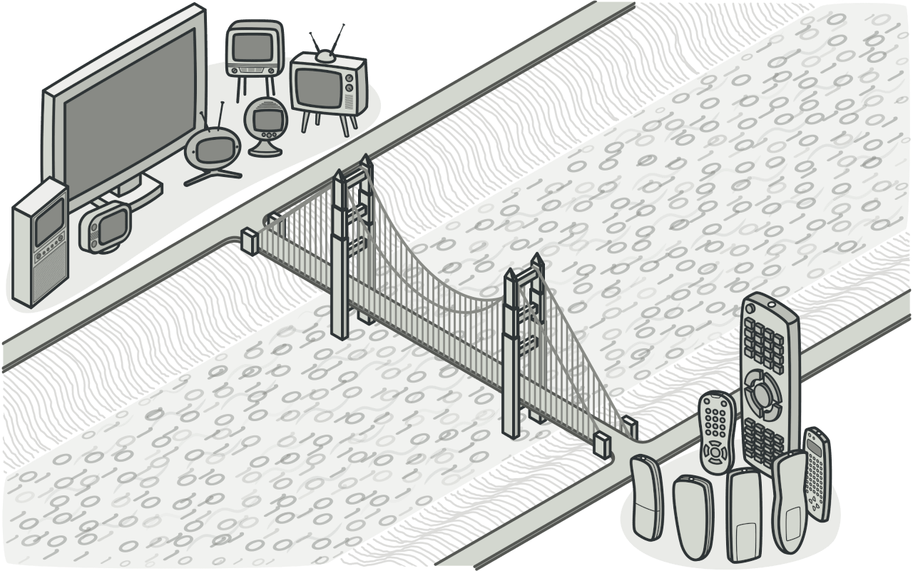
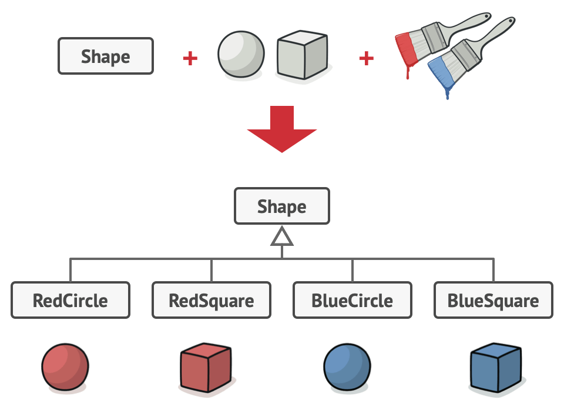
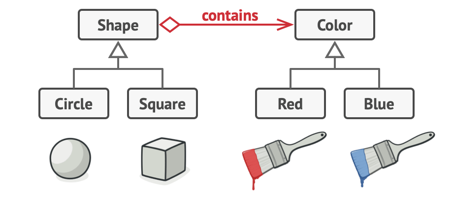
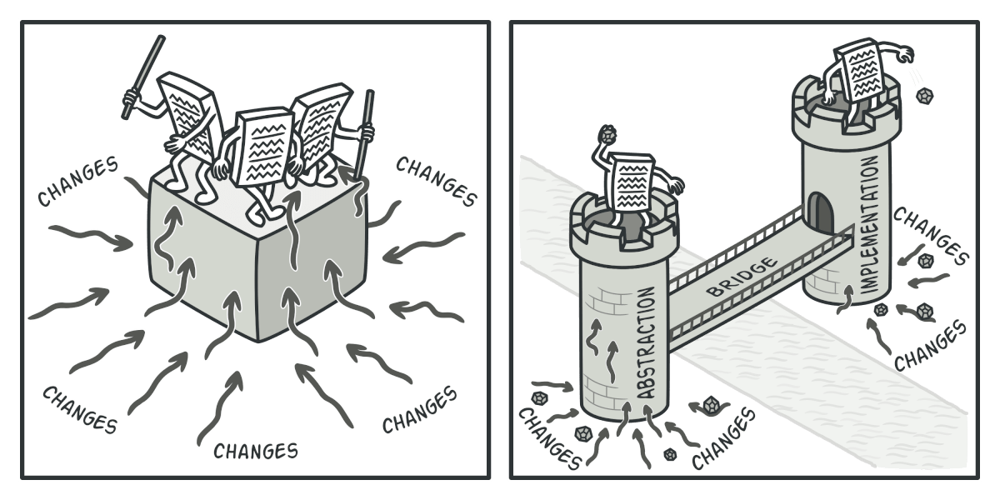
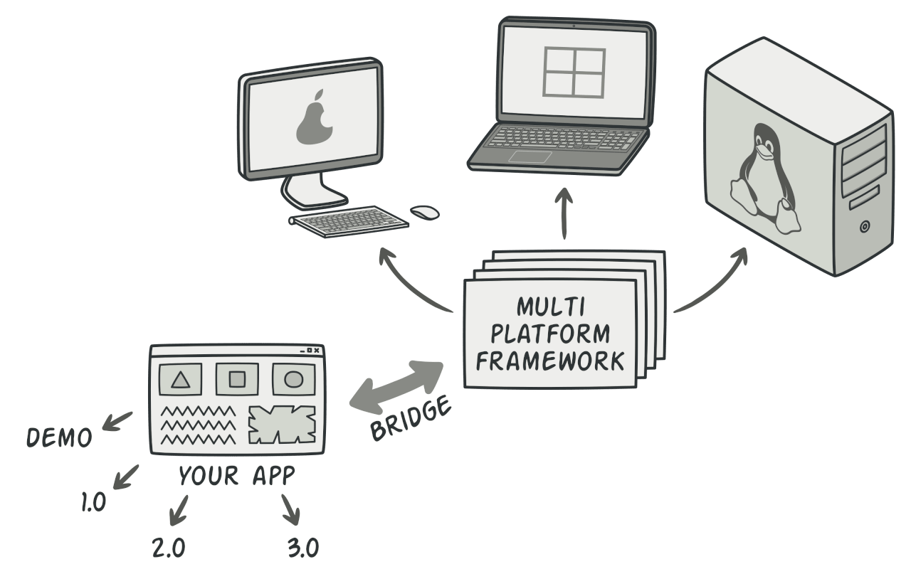
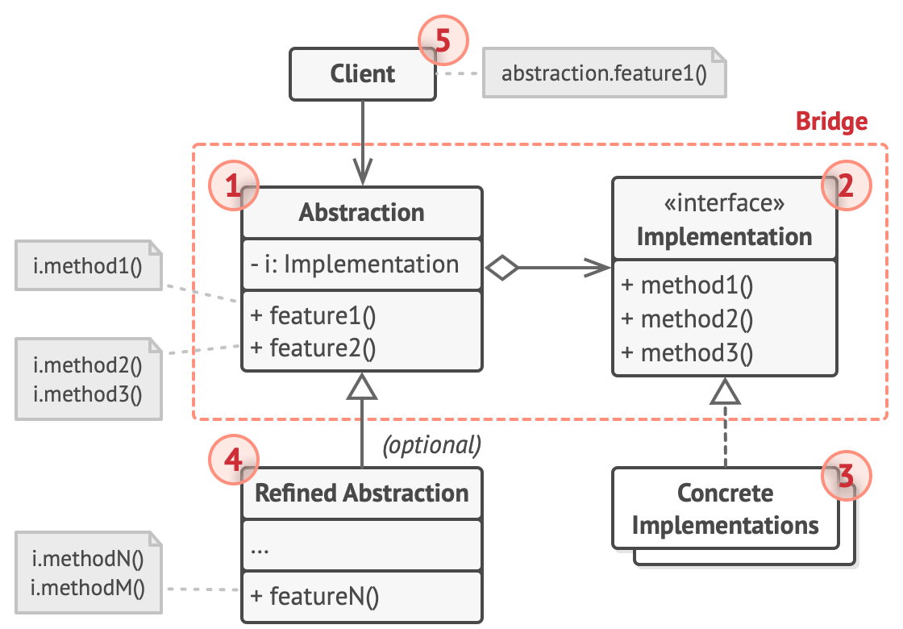
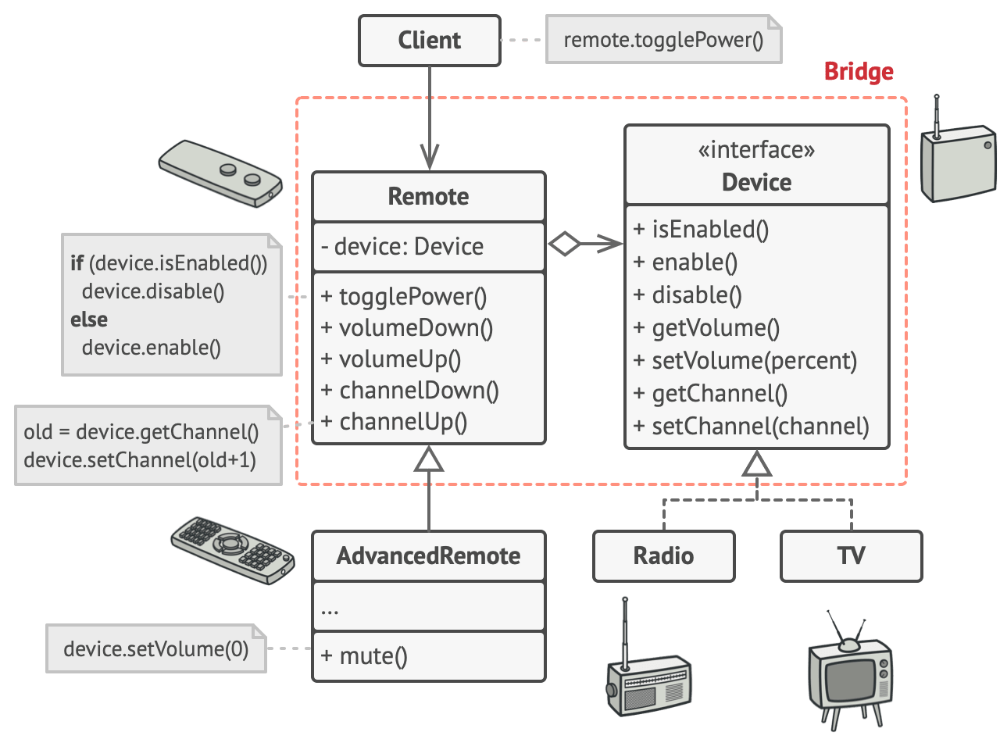

# Bridge


**Type:** Structural · **Also known as:** 

> **The 10-second version:** When a class is growing in two independent directions at once, stop multiplying subclasses and give one direction its own hierarchy, reachable through a reference — so `M × N` classes collapse into `M + N`.

<br clear="all">

## Quick card

| | |
|---|---|
| **Problem it solves** | A class hierarchy is exploding because it varies along two (or more) unrelated axes at the same time — `EmailPriceDropNotifier`, `SmsPriceDropNotifier`, `EmailLeadNotifier`, `SmsLeadNotifier`… |
| **Core move** | Pull one axis out into its own interface + hierarchy (the *Implementation*). The other axis (the *Abstraction*) keeps a **reference field** to it and delegates the low-level work. Both sides then grow independently. |
| **You'll recognise it by** | A high-level class that owns an interface-typed field it got through its constructor, calls only *primitive* methods on it, and has its own subclasses that never mention any concrete implementation. Two parallel hierarchies, one arrow between them. |
| **Rating** | Complexity ★★★ · Popularity ★☆☆ |
| **Closest relatives** | **Strategy** (same shape, different intent), **Adapter** (retrofit vs. designed up-front), **Abstract Factory** (pairs compatible implementations), **State** |
| **In your stack** | `ILogger` + `ILoggerProvider`, `HttpClient` + `HttpMessageHandler`, `DbConnection` + ADO.NET providers in C#; a `NotificationService` whose transport is `IChannel` (email / SMS / WhatsApp / push) resolved from DI; a `ListingSearch` abstraction that runs on either SQL Server or Elasticsearch; a `IBusPublisher` abstraction with a RabbitMQ implementation and an in-memory one for tests. |

### How to read this file

Technical first, plain English second. 🗣️ marks the plain-English version. Part 1 is Refactoring.Guru's material with their diagrams; Parts 2-7 are code, your stack, and the stuff that makes it stick.

---

# PART 1 — The pattern

## 1. Intent
**Bridge** is a structural design pattern that lets you split a large class or a set of closely related classes into two separate hierarchies—abstraction and implementation—which can be developed independently of each other.


### 🗣️ In plain words

You have one blob of code that changes for two unrelated reasons. Instead of making a subclass for every *combination* of those reasons, you cut the blob in half along the seam. One half holds a pointer to the other half and calls it when it needs real work done.

The half that gives orders is called the **Abstraction**. The half that does the work is called the **Implementation**. The pointer between them is the "bridge". Nothing more mysterious than that — the GoF names are just unfortunate.

## 2. Problem
*Abstraction?* *Implementation?* Sound scary? Stay calm and let’s consider a simple example.

Say you have a geometric `Shape` class with a pair of subclasses: `Circle` and `Square`. You want to extend this class hierarchy to incorporate colors, so you plan to create `Red` and `Blue` shape subclasses. However, since you already have two subclasses, you’ll need to create four class combinations such as `BlueCircle` and `RedSquare`.



*Number of class combinations grows in geometric progression.*

Adding new shape types and colors to the hierarchy will grow it exponentially. For example, to add a triangle shape you’d need to introduce two subclasses, one for each color. And after that, adding a new color would require creating three subclasses, one for each shape type. The further we go, the worse it becomes.
### 🗣️ In plain words

Every time you add one thing to axis A, you have to add *N* classes — one for every existing thing on axis B. The class count is a multiplication table, and you are the one typing it out.

In an automotive marketplace this shows up almost immediately with notifications. You have kinds of message (price drop, listing approved, new lead, inspection due) and ways to send them (email, SMS, WhatsApp, push). Inheritance gives you the multiplication table:

```ts
// ❌ The multiplication table. 4 message kinds × 4 channels = 16 classes,
//    and every new channel costs you four more files.
class PriceDropEmailNotifier   extends Notifier { /* subject line + SMTP */ }
class PriceDropSmsNotifier     extends Notifier { /* 160 chars  + gateway */ }
class PriceDropWhatsAppNotifier extends Notifier { /* template + Meta API */ }
class PriceDropPushNotifier    extends Notifier { /* payload   + FCM      */ }
class NewLeadEmailNotifier     extends Notifier { /* subject line + SMTP */ }
class NewLeadSmsNotifier       extends Notifier { /* ...and so on forever */ }
```

The killer detail: the SMTP retry logic now lives in four different classes (`PriceDropEmail…`, `NewLeadEmail…`, `ListingApprovedEmail…`, `InspectionDueEmail…`). Fix a bug in one, and you have three places left to remember. That duplication is not an accident — it is the *shape* of the mistake.

The same thing happens without notifications. A `ListingSearch` class that also knows how to talk to SQL Server *and* Elasticsearch ends up as one giant file full of `if (useElastic)`. Two reasons to change, one class.

## 3. Solution
This problem occurs because we’re trying to extend the shape classes in two independent dimensions: by form and by color. That’s a very common issue with class inheritance.

The Bridge pattern attempts to solve this problem by switching from inheritance to the object composition. What this means is that you extract one of the dimensions into a separate class hierarchy, so that the original classes will reference an object of the new hierarchy, instead of having all of its state and behaviors within one class.



*You can prevent the explosion of a class hierarchy by transforming it into several related hierarchies.*

Following this approach, we can extract the color-related code into its own class with two subclasses: `Red` and `Blue`. The `Shape` class then gets a reference field pointing to one of the color objects. Now the shape can delegate any color-related work to the linked color object. That reference will act as a bridge between the `Shape` and `Color` classes. From now on, adding new colors won’t require changing the shape hierarchy, and vice versa.

#### Abstraction and Implementation

The GoF book “Gang of Four” is a nickname given to the four authors of the original book about design patterns: *Design Patterns: Elements of Reusable Object-Oriented Software* [https://refactoring.guru/gof-book](https://refactoring.guru/gof-book). introduces the terms *Abstraction* and *Implementation* as part of the Bridge definition. In my opinion, the terms sound too academic and make the pattern seem more complicated than it really is. Having read the simple example with shapes and colors, let’s decipher the meaning behind the GoF book’s scary words.

*Abstraction* (also called *interface*) is a high-level control layer for some entity. This layer isn’t supposed to do any real work on its own. It should delegate the work to the *implementation* layer (also called *platform*).

Note that we’re not talking about *interfaces* or *abstract classes* from your programming language. These aren’t the same things.

When talking about real applications, the abstraction can be represented by a graphical user interface (GUI), and the implementation could be the underlying operating system code (API) which the GUI layer calls in response to user interactions.

Generally speaking, you can extend such an app in two independent directions:

- Have several different GUIs (for instance, tailored for regular customers or admins).
- Support several different APIs (for example, to be able to launch the app under Windows, Linux, and macOS).

In a worst-case scenario, this app might look like a giant spaghetti bowl, where hundreds of conditionals connect different types of GUI with various APIs all over the code.



*Making even a simple change to a monolithic codebase is pretty hard because you must understand the *entire thing* very well. Making changes to smaller, well-defined modules is much easier.*

You can bring order to this chaos by extracting the code related to specific interface-platform combinations into separate classes. However, soon you’ll discover that there are *lots* of these classes. The class hierarchy will grow exponentially because adding a new GUI or supporting a different API would require creating more and more classes.

Let’s try to solve this issue with the Bridge pattern. It suggests that we divide the classes into two hierarchies:

- Abstraction: the GUI layer of the app.
- Implementation: the operating systems’ APIs.



*One of the ways to structure a cross-platform application.*

The abstraction object controls the appearance of the app, delegating the actual work to the linked implementation object. Different implementations are interchangeable as long as they follow a common interface, enabling the same GUI to work under Windows and Linux.

As a result, you can change the GUI classes without touching the API-related classes. Moreover, adding support for another operating system only requires creating a subclass in the implementation hierarchy.
### 🗣️ In plain words

Three mechanical moves:

1. **Name the two axes.** Write them down literally: "this varies by *message kind*, and it varies by *transport*". If you cannot name two, you do not have a Bridge problem.
2. **Give the second axis its own interface and its own hierarchy.** Keep the interface *primitive* — `send(to, subject, body)`, not `notifyUserAboutPriceDrop(...)`. The implementation interface is allowed to look nothing like the abstraction's interface.
3. **Put a reference field of that interface type inside the abstraction**, injected through the constructor, and delegate. The abstraction now expresses *policy* ("a price drop email needs the old price, the new price and a deep link"); the implementation expresses *mechanism* ("here is how bytes leave this process").

Optionally: 4. **Subclass the abstraction** when the high-level logic itself has variants (`Notifier` → `DigestNotifier`, `UrgentNotifier`). Those subclasses never learn a single concrete implementation name.

> **The key insight:** Bridge trades a *multiplication* for an *addition*. `M × N` subclasses become `M + N` classes plus one reference. Everything else about the pattern — the funny GoF vocabulary, the two boxes in the diagram — is bookkeeping around that one trade.

## 4. Real-world analogy

Refactoring.Guru does not give one for this pattern, so here are mine.

**The power socket.** Every appliance in your house has two independent stories: what it does (kettle, laptop charger, vacuum) and where its electricity comes from (grid, generator, inverter, solar). Nobody builds a "solar kettle" and a "grid kettle" as separate products. The socket is the agreed primitive interface — 230V, two pins — and the appliance holds a plug that reaches it. Swap the whole power source behind the wall and the kettle never notices; buy a new appliance and the wiring never changes. The socket is the bridge, and it survives precisely because it exposes primitives (volts, amps) rather than intentions ("boil water").

**A car dealership's showroom and its workshop.** The showroom decides *what customers experience*: the walk-around, the test-drive script, the trade-in valuation conversation. The workshop decides *how work actually gets done*: which lift, which diagnostic tool, which parts supplier. The showroom sends the workshop small, primitive requests ("service this VIN", "fit these tyres"). Open a second showroom in another city and you don't rebuild the workshop; buy a new diagnostic rig and the sales script doesn't change. When a dealership collapses the two — salespeople who also decide torque settings — everything takes twice as long to change, which is exactly the monolithic class the Bridge is there to split.

## 5. Structure


1. The **Abstraction** provides high-level control logic. It relies on the implementation object to do the actual low-level work.
2. The **Implementation** declares the interface that’s common for all concrete implementations. An abstraction can only communicate with an implementation object via methods that are declared here.

   The abstraction may list the same methods as the implementation, but usually the abstraction declares some complex behaviors that rely on a wide variety of primitive operations declared by the implementation.
3. **Concrete Implementations** contain platform-specific code.
4. **Refined Abstractions** provide variants of control logic. Like their parent, they work with different implementations via the general implementation interface.
5. Usually, the **Client** is only interested in working with the abstraction. However, it’s the client’s job to link the abstraction object with one of the implementation objects.
### 🗣️ Participants & roles — cheat table

| Role | What it is in code | Example from the site | Equivalent in reader's stack |
|---|---|---|---|
| **Abstraction** | A class (often concrete, not abstract!) holding an interface-typed field it delegates to. Owns the *high-level* operations. | `RemoteControl` — `togglePower()`, `volumeUp()` | `NotificationService`, `HttpClient`, `ILogger<T>` wrapper, a `ListingSearch` facade over a search backend |
| **Implementation** | The interface listing *primitive* operations. Deliberately narrower and dumber than the abstraction. | `interface Device` — `enable()`, `getVolume()`, `setChannel()` | `IChannel { Task SendAsync(Message m) }`, `HttpMessageHandler`, `ILoggerProvider`, `DbProviderFactory` |
| **Concrete Implementation** | Platform/vendor-specific class implementing that interface. | `Tv`, `Radio` | `SmtpChannel`, `TwilioSmsChannel`, `FcmPushChannel`, `SqlListingIndex`, `ElasticListingIndex`, `SocketsHttpHandler` |
| **Refined Abstraction** | Subclass of the abstraction that adds or varies high-level logic. Still only knows the interface. | `AdvancedRemoteControl` — adds `mute()` | `DigestNotificationService` (batches an hour of events), `RetryingSearch`, `HttpClient` subclasses in SDKs |
| **Client** | Picks one implementation, hands it to the abstraction's constructor, then forgets it exists. | `remote = new RemoteControl(tv)` | Your DI container registration: `services.AddScoped<IChannel, SmtpChannel>()` |

### 🤝 Collaboration — who calls whom

```
 CLIENT (composition root / DI container)
   │
   │ 1. new RemoteControl( new Tv() )        <-- the ONLY place both sides are named
   ▼
 ┌──────────────────────────────┐        ┌─────────────────────────────┐
 │  Abstraction                 │        │  «interface» Implementation │
 │  RemoteControl               │───────>│  Device                     │
 │  - device: Device            │  bridge│  + isEnabled()              │
 │  + togglePower()             │  (ref) │  + enable() / disable()     │
 │  + volumeUp()                │        │  + get/setVolume()          │
 └──────────────┬───────────────┘        └───────────△─────────────────┘
                │ extends                            │ implements
   ┌────────────┴─────────────┐          ┌───────────┴──────────┐
   │ AdvancedRemoteControl    │          │   Tv        Radio    │
   │ + mute()                 │          │                      │
   └──────────────────────────┘          └──────────────────────┘

 A call, step by step:
   client -> remote.togglePower()
              remote -> device.isEnabled()      "is it on?"        (primitive)
              remote <- false
              remote -> device.enable()         "turn it on"       (primitive)
   client <- done
```

The hop that matters is the **second arrow inside `togglePower()`**: the abstraction turned *one* high-level intent into *two* primitive calls. That asymmetry is the whole point — if your abstraction methods map 1:1 onto implementation methods, you have written a pass-through wrapper, not a Bridge, and you should ask what the abstraction is for.

## 6. Pseudocode (the website's example)
This example illustrates how the **Bridge** pattern can help divide the monolithic code of an app that manages devices and their remote controls. The `Device` classes act as the implementation, whereas the `Remote`s act as the abstraction.



*The original class hierarchy is divided into two parts: devices and remote controls.*

The base remote control class declares a reference field that links it with a device object. All remotes work with the devices via the general device interface, which lets the same remote support multiple device types.

You can develop the remote control classes independently from the device classes. All that’s needed is to create a new remote subclass. For example, a basic remote control might only have two buttons, but you could extend it with additional features, such as an extra battery or a touchscreen.

The client code links the desired type of remote control with a specific device object via the remote’s constructor.

```
// The "abstraction" defines the interface for the "control"
// part of the two class hierarchies. It maintains a reference
// to an object of the "implementation" hierarchy and delegates
// all of the real work to this object.
class RemoteControl is
    protected field device: Device
    constructor RemoteControl(device: Device) is
        this.device = device
    method togglePower() is
        if (device.isEnabled()) then
            device.disable()
        else
            device.enable()
    method volumeDown() is
        device.setVolume(device.getVolume() - 10)
    method volumeUp() is
        device.setVolume(device.getVolume() + 10)
    method channelDown() is
        device.setChannel(device.getChannel() - 1)
    method channelUp() is
        device.setChannel(device.getChannel() + 1)

// You can extend classes from the abstraction hierarchy
// independently from device classes.
class AdvancedRemoteControl extends RemoteControl is
    method mute() is
        device.setVolume(0)

// The "implementation" interface declares methods common to all
// concrete implementation classes. It doesn't have to match the
// abstraction's interface. In fact, the two interfaces can be
// entirely different. Typically the implementation interface
// provides only primitive operations, while the abstraction
// defines higher-level operations based on those primitives.
interface Device is
    method isEnabled()
    method enable()
    method disable()
    method getVolume()
    method setVolume(percent)
    method getChannel()
    method setChannel(channel)

// All devices follow the same interface.
class Tv implements Device is
    // ...

class Radio implements Device is
    // ...

// Somewhere in client code.
tv = new Tv()
remote = new RemoteControl(tv)
remote.togglePower()

radio = new Radio()
remote = new AdvancedRemoteControl(radio)
```
### 🗣️ Reading that pseudocode

- `protected field device: Device` — this single line *is* the bridge. It is typed as the interface, it is `protected` so refined abstractions can use it, and it is set in the constructor. Everything else follows from it.
- `togglePower()` calls `isEnabled()`, then `enable()` **or** `disable()`. Three primitive calls' worth of interface, one method's worth of policy. The abstraction is where the "if" lives; the implementation stays dumb.
- `volumeUp()` hard-codes the step of `10`. That is deliberate: "how much is one press" is *control logic*, not platform detail. A TV and a radio may disagree about volume ranges internally, but the remote's opinion about a press lives on the remote.
- `class AdvancedRemoteControl extends RemoteControl` adds `mute()` without touching `Tv` or `Radio`, and without either device growing a `mute()` method. This is the `M + N` payoff made visible in four lines.
- `interface Device` is pure get/set primitives — no `toggle`, no `mute`. Read the comment above it twice: *"the two interfaces can be entirely different."* This is the line that separates Bridge from Adapter, where the two interfaces are forced to match.
- The client code at the bottom does the only assembly in the system: `new RemoteControl(tv)` and `new AdvancedRemoteControl(radio)`. Two hierarchies, four classes, four working combinations — and adding a `Projector` gives you eight for the price of one file.

## 7. Applicability — when to reach for it
**Use the Bridge pattern when you want to divide and organize a monolithic class that has several variants of some functionality (for example, if the class can work with various database servers).**

The bigger a class becomes, the harder it is to figure out how it works, and the longer it takes to make a change. The changes made to one of the variations of functionality may require making changes across the whole class, which often results in making errors or not addressing some critical side effects.

The Bridge pattern lets you split the monolithic class into several class hierarchies. After this, you can change the classes in each hierarchy independently of the classes in the others. This approach simplifies code maintenance and minimizes the risk of breaking existing code.

**Use the pattern when you need to extend a class in several orthogonal (independent) dimensions.**

The Bridge suggests that you extract a separate class hierarchy for each of the dimensions. The original class delegates the related work to the objects belonging to those hierarchies instead of doing everything on its own.

**Use the Bridge if you need to be able to switch implementations at runtime.**

Although it’s optional, the Bridge pattern lets you replace the implementation object inside the abstraction. It’s as easy as assigning a new value to a field.

By the way, this last item is the main reason why so many people confuse the Bridge with the [Strategy](https://refactoring.guru/design-patterns/strategy) pattern. Remember that a pattern is more than just a certain way to structure your classes. It may also communicate intent and a problem being addressed.
### ✅ Quick checklist

- [ ] Can I name **two independent reasons** this code changes, and are they genuinely unrelated (adding to one never forces a change to the other)?
- [ ] Do my class names contain **two nouns glued together** — `SqlListingExporter`, `PdfInvoiceRenderer`, `WhatsAppLeadNotifier`?
- [ ] Is the same low-level code (retry, auth, connection handling) **duplicated across sibling classes** that differ only in their high-level purpose?
- [ ] Will I plausibly add to **both** axes over the next year? (One axis that never grows = you need a plain interface, not a Bridge.)
- [ ] Do I need to **swap the implementation at runtime or per-tenant/per-environment** (real backend in prod, fake in tests, region-specific vendor)?
- [ ] Can I describe the implementation side as a set of **primitive operations** that don't mention my domain vocabulary?

Four or more ticks: build the Bridge. One or two: you probably want a single interface, or nothing at all.

## 8. How to implement — step by step
1. Identify the orthogonal dimensions in your classes. These independent concepts could be: abstraction/platform, domain/infrastructure, front-end/back-end, or interface/implementation.
2. See what operations the client needs and define them in the base abstraction class.
3. Determine the operations available on all platforms. Declare the ones that the abstraction needs in the general implementation interface.
4. For all platforms in your domain create concrete implementation classes, but make sure they all follow the implementation interface.
5. Inside the abstraction class, add a reference field for the implementation type. The abstraction delegates most of the work to the implementation object that’s referenced in that field.
6. If you have several variants of high-level logic, create refined abstractions for each variant by extending the base abstraction class.
7. The client code should pass an implementation object to the abstraction’s constructor to associate one with the other. After that, the client can forget about the implementation and work only with the abstraction object.
### 🗣️ The same steps, blunt version

1. Write down the two axes on paper. If you can't, stop — there is no Bridge here.
2. List what the *caller* wants to say. That is the abstraction's public API.
3. List the smallest set of platform verbs that can express all of it. That is the implementation interface — keep it primitive and domain-free.
4. Write one concrete implementation per platform/vendor. All of them, same interface, no exceptions and no `if (this is Elastic)` leaking back up.
5. Add the interface-typed field to the abstraction, set it in the constructor, and delegate every low-level call through it.
6. Only if the high-level logic itself varies, subclass the abstraction. Do not subclass for platform reasons — that is what step 4 was for.
7. Wire them together in exactly one place (composition root / DI registration). Everything downstream depends on the abstraction only.

## 9. Pros and cons
- ✅ You can create platform-independent classes and apps.
- ✅ The client code works with high-level abstractions. It isn’t exposed to the platform details.
- ✅ *Open/Closed Principle*. You can introduce new abstractions and implementations independently from each other.
- ✅ *Single Responsibility Principle*. You can focus on high-level logic in the abstraction and on platform details in the implementation.

- ⛔ You might make the code more complicated by applying the pattern to a highly cohesive class.
### ⚖️ Honest trade-offs from the trenches

**The true cost is indirection, paid at debug time.** With a Bridge in place, "why did this email have the wrong subject?" becomes a two-file question: is it the abstraction's policy or the implementation's mechanism? On a five-file system that is annoying overhead. On a fifty-file system it is the thing that makes the question answerable at all. The pattern's one official con — *"you might make the code more complicated by applying the pattern to a highly cohesive class"* — is real and it bites early. If nobody has ever asked for a second implementation, you have bought a stack frame and paid for it in confusion.

**The tell that it is worth it** is duplication *across siblings*, not size. A 900-line class that changes for exactly one reason is fine; split it with plain extract-method. But the moment you find yourself copy-pasting the retry/backoff/auth block from `SmtpPriceDropNotifier` into `SmtpLeadNotifier`, the Bridge has already paid for itself and you are just choosing how long to delay it. The second tell: you write a comment like `// same as the SMS version but with a subject line`.

**Modern C# and DI give you most of this for free — take it.** You almost never hand-write `new NotificationService(new SmtpChannel())` anymore. `services.AddScoped<IChannel, SmtpChannel>()` *is* step 7, and `IServiceProvider` *is* the client whose job is linking the two hierarchies. .NET 8's keyed services (`AddKeyedScoped<IChannel, SmtpChannel>("email")` + `[FromKeyedServices("email")]`) let you register the whole implementation axis side by side and resolve per request, which is the runtime-switching bullet with no factory boilerplate. `HttpClientFactory` is a Bridge assembly line: you configure the abstraction (`HttpClient`, base address, timeouts) and the implementation (`HttpMessageHandler` chain) in separate calls. Do not rebuild any of that by hand.

**In TypeScript the "interface" can be a function type, and usually should be.** If your implementation interface has one method, `type Send = (msg: OutboundMessage) => Promise<void>` is a legitimate implementation hierarchy — every function is a concrete implementation, and the abstraction just holds one. Reach for a class-shaped implementation when it has state (a connection, a channel, a pooled client) or more than about three methods. A three-class ceremony to wrap one arrow function is the over-engineering the con warns about; the pattern is about the *seam*, not about the `class` keyword.

## 10. Relations with other patterns
- [Bridge](https://refactoring.guru/design-patterns/bridge) is usually designed up-front, letting you develop parts of an application independently of each other. On the other hand, [Adapter](https://refactoring.guru/design-patterns/adapter) is commonly used with an existing app to make some otherwise-incompatible classes work together nicely.
- [Bridge](https://refactoring.guru/design-patterns/bridge), [State](https://refactoring.guru/design-patterns/state), [Strategy](https://refactoring.guru/design-patterns/strategy) (and to some degree [Adapter](https://refactoring.guru/design-patterns/adapter)) have very similar structures. Indeed, all of these patterns are based on composition, which is delegating work to other objects. However, they all solve different problems. A pattern isn’t just a recipe for structuring your code in a specific way. It can also communicate to other developers the problem the pattern solves.
- You can use [Abstract Factory](https://refactoring.guru/design-patterns/abstract-factory) along with [Bridge](https://refactoring.guru/design-patterns/bridge). This pairing is useful when some abstractions defined by *Bridge* can only work with specific implementations. In this case, *Abstract Factory* can encapsulate these relations and hide the complexity from the client code.
- You can combine [Builder](https://refactoring.guru/design-patterns/builder) with [Bridge](https://refactoring.guru/design-patterns/bridge): the director class plays the role of the abstraction, while different builders act as implementations.
### 🗣️ Disambiguation table

| Pattern | Same shape? | What actually differs | One-line separator |
|---|---|---|---|
| **Strategy** | Yes — object holds an interface field and delegates | Strategy swaps **one algorithm** inside an otherwise-fixed class; there is no second hierarchy expected to grow. Bridge splits a class along a seam because **both sides** will keep growing. Strategy is behavioral (how work is done), Bridge is structural (how code is arranged). | ***Strategy is one hole with many plugs; Bridge is two hierarchies growing in opposite directions.*** |
| **Adapter** | Yes — object wraps another object | Adapter is **retrofit**: you did not control both interfaces, and you are making yesterday's class fit today's caller. Bridge is **designed up-front**: you drew the seam on purpose, and you own both sides. Adapter's two interfaces must line up; Bridge's are deliberately different. | ***Adapter apologises for the past; Bridge plans for the future.*** |
| **State** | Yes — object delegates to a swappable field | State's implementations know about each other and hand control to the next one; the object's behaviour changes as the *state* changes. Bridge's implementations never mention each other and the abstraction's behaviour is constant. | ***If the implementations can replace themselves, it's State.*** |
| **Abstract Factory** | No — it creates, it does not delegate | Complementary, not competing: when only certain abstraction/implementation pairs are legal (an Elasticsearch search needs an Elasticsearch highlighter and an Elasticsearch suggester), an Abstract Factory produces a matched set and the Bridge consumes it. | ***Abstract Factory picks the parts; Bridge is the machine they slot into.*** |

**The memorable test:** ask *"if I add a new implementation, do I expect to also eventually add new abstractions?"* Yes → Bridge. No, the caller side is fixed forever → Strategy. "I can't add anything, I'm wrapping a library I don't own" → Adapter.

---

# PART 2 — Official code examples from Refactoring.Guru

## 2.1 C#
**Complexity:** ★★★ (3/3)

**Popularity:** ★☆☆ (1/3)

**Usage examples:** The Bridge pattern is especially useful when dealing with cross-platform apps, supporting multiple types of database servers or working with several API providers of a certain kind (for example, cloud platforms, social networks, etc.)

**Identification:** Bridge can be recognized by a clear distinction between some controlling entity and several different platforms that it relies on.
### Conceptual Example

This example illustrates the structure of the **Bridge** design pattern. It focuses on answering these questions:

- What classes does it consist of?
- What roles do these classes play?
- In what way the elements of the pattern are related?

##### **Program.cs:** Conceptual example

```csharp
using System;

namespace RefactoringGuru.DesignPatterns.Bridge.Conceptual
{
    // The Abstraction defines the interface for the "control" part of the two
    // class hierarchies. It maintains a reference to an object of the
    // Implementation hierarchy and delegates all of the real work to this
    // object.
    class Abstraction
    {
        protected IImplementation _implementation;

        public Abstraction(IImplementation implementation)
        {
            this._implementation = implementation;
        }

        public virtual string Operation()
        {
            return "Abstract: Base operation with:\n" +
                _implementation.OperationImplementation();
        }
    }

    // You can extend the Abstraction without changing the Implementation
    // classes.
    class ExtendedAbstraction : Abstraction
    {
        public ExtendedAbstraction(IImplementation implementation) : base(implementation)
        {
		}

        public override string Operation()
        {
            return "ExtendedAbstraction: Extended operation with:\n" +
                base._implementation.OperationImplementation();
        }
    }

    // The Implementation defines the interface for all implementation classes.
    // It doesn't have to match the Abstraction's interface. In fact, the two
    // interfaces can be entirely different. Typically the Implementation
    // interface provides only primitive operations, while the Abstraction
    // defines higher- level operations based on those primitives.
    public interface IImplementation
    {
        string OperationImplementation();
    }

    // Each Concrete Implementation corresponds to a specific platform and
    // implements the Implementation interface using that platform's API.
    class ConcreteImplementationA : IImplementation
    {
        public string OperationImplementation()
        {
            return "ConcreteImplementationA: The result in platform A.\n";
        }
    }

    class ConcreteImplementationB : IImplementation
    {
        public string OperationImplementation()
        {
            return "ConcreteImplementationB: The result in platform B.\n";
        }
    }

    class Client
    {
        // Except for the initialization phase, where an Abstraction object gets
        // linked with a specific Implementation object, the client code should
        // only depend on the Abstraction class. This way the client code can
        // support any abstraction-implementation combination.
        public void ClientCode(Abstraction abstraction)
        {
            Console.Write(abstraction.Operation());
        }
    }

    class Program
    {
        static void Main(string[] args)
        {
            Client client = new Client();

            Abstraction abstraction;
            // The client code should be able to work with any pre-configured
            // abstraction-implementation combination.
            abstraction = new Abstraction(new ConcreteImplementationA());
            client.ClientCode(abstraction);

            Console.WriteLine();

            abstraction = new ExtendedAbstraction(new ConcreteImplementationB());
            client.ClientCode(abstraction);
        }
    }
}
```

##### **Output.txt:** Execution result

```output
Abstract: Base operation with:
ConcreteImplementationA: The result in platform A.

ExtendedAbstraction: Extended operation with:
ConcreteImplementationA: The result in platform B.
```

## 2.2 TypeScript
**Complexity:** ★★★ (3/3)

**Popularity:** ★☆☆ (1/3)

**Usage examples:** The Bridge pattern is especially useful when dealing with cross-platform apps, supporting multiple types of database servers or working with several API providers of a certain kind (for example, cloud platforms, social networks, etc.)

**Identification:** Bridge can be recognized by a clear distinction between some controlling entity and several different platforms that it relies on.
### Conceptual Example

This example illustrates the structure of the **Bridge** design pattern and focuses on the following questions:

- What classes does it consist of?
- What roles do these classes play?
- In what way the elements of the pattern are related?

##### **index.ts:** Conceptual example

```typescript
/**
 * The Abstraction defines the interface for the "control" part of the two class
 * hierarchies. It maintains a reference to an object of the Implementation
 * hierarchy and delegates all of the real work to this object.
 */
class Abstraction {
    protected implementation: Implementation;

    constructor(implementation: Implementation) {
        this.implementation = implementation;
    }

    public operation(): string {
        const result = this.implementation.operationImplementation();
        return `Abstraction: Base operation with:\n${result}`;
    }
}

/**
 * You can extend the Abstraction without changing the Implementation classes.
 */
class ExtendedAbstraction extends Abstraction {
    public operation(): string {
        const result = this.implementation.operationImplementation();
        return `ExtendedAbstraction: Extended operation with:\n${result}`;
    }
}

/**
 * The Implementation defines the interface for all implementation classes. It
 * doesn't have to match the Abstraction's interface. In fact, the two
 * interfaces can be entirely different. Typically the Implementation interface
 * provides only primitive operations, while the Abstraction defines higher-
 * level operations based on those primitives.
 */
interface Implementation {
    operationImplementation(): string;
}

/**
 * Each Concrete Implementation corresponds to a specific platform and
 * implements the Implementation interface using that platform's API.
 */
class ConcreteImplementationA implements Implementation {
    public operationImplementation(): string {
        return 'ConcreteImplementationA: Here\'s the result on the platform A.';
    }
}

class ConcreteImplementationB implements Implementation {
    public operationImplementation(): string {
        return 'ConcreteImplementationB: Here\'s the result on the platform B.';
    }
}

/**
 * Except for the initialization phase, where an Abstraction object gets linked
 * with a specific Implementation object, the client code should only depend on
 * the Abstraction class. This way the client code can support any abstraction-
 * implementation combination.
 */
function clientCode(abstraction: Abstraction) {
    // ..

    console.log(abstraction.operation());

    // ..
}

/**
 * The client code should be able to work with any pre-configured abstraction-
 * implementation combination.
 */
let implementation = new ConcreteImplementationA();
let abstraction = new Abstraction(implementation);
clientCode(abstraction);

console.log('');

implementation = new ConcreteImplementationB();
abstraction = new ExtendedAbstraction(implementation);
clientCode(abstraction);
```

##### **Output.txt:** Execution result

```output
Abstraction: Base operation with:
ConcreteImplementationA: Here's the result on the platform A.

ExtendedAbstraction: Extended operation with:
ConcreteImplementationB: Here's the result on the platform B.
```

## 2.3 C++
**Complexity:** ★★★ (3/3)

**Popularity:** ★☆☆ (1/3)

**Usage examples:** The Bridge pattern is especially useful when dealing with cross-platform apps, supporting multiple types of database servers or working with several API providers of a certain kind (for example, cloud platforms, social networks, etc.)

**Identification:** Bridge can be recognized by a clear distinction between some controlling entity and several different platforms that it relies on.
### Conceptual Example

This example illustrates the structure of the **Bridge** design pattern. It focuses on answering these questions:

- What classes does it consist of?
- What roles do these classes play?
- In what way the elements of the pattern are related?

##### **main.cc:** Conceptual example

```cpp
/**
 * The Implementation defines the interface for all implementation classes. It
 * doesn't have to match the Abstraction's interface. In fact, the two
 * interfaces can be entirely different. Typically the Implementation interface
 * provides only primitive operations, while the Abstraction defines higher-
 * level operations based on those primitives.
 */

class Implementation {
 public:
  virtual ~Implementation() {}
  virtual std::string OperationImplementation() const = 0;
};

/**
 * Each Concrete Implementation corresponds to a specific platform and
 * implements the Implementation interface using that platform's API.
 */
class ConcreteImplementationA : public Implementation {
 public:
  std::string OperationImplementation() const override {
    return "ConcreteImplementationA: Here's the result on the platform A.\n";
  }
};
class ConcreteImplementationB : public Implementation {
 public:
  std::string OperationImplementation() const override {
    return "ConcreteImplementationB: Here's the result on the platform B.\n";
  }
};

/**
 * The Abstraction defines the interface for the "control" part of the two class
 * hierarchies. It maintains a reference to an object of the Implementation
 * hierarchy and delegates all of the real work to this object.
 */

class Abstraction {
  /**
   * @var Implementation
   */
 protected:
  Implementation* implementation_;

 public:
  Abstraction(Implementation* implementation) : implementation_(implementation) {
  }

  virtual ~Abstraction() {
  }

  virtual std::string Operation() const {
    return "Abstraction: Base operation with:\n" +
           this->implementation_->OperationImplementation();
  }
};
/**
 * You can extend the Abstraction without changing the Implementation classes.
 */
class ExtendedAbstraction : public Abstraction {
 public:
  ExtendedAbstraction(Implementation* implementation) : Abstraction(implementation) {
  }
  std::string Operation() const override {
    return "ExtendedAbstraction: Extended operation with:\n" +
           this->implementation_->OperationImplementation();
  }
};

/**
 * Except for the initialization phase, where an Abstraction object gets linked
 * with a specific Implementation object, the client code should only depend on
 * the Abstraction class. This way the client code can support any abstraction-
 * implementation combination.
 */
void ClientCode(const Abstraction& abstraction) {
  // ...
  std::cout << abstraction.Operation();
  // ...
}
/**
 * The client code should be able to work with any pre-configured abstraction-
 * implementation combination.
 */

int main() {
  Implementation* implementation = new ConcreteImplementationA;
  Abstraction* abstraction = new Abstraction(implementation);
  ClientCode(*abstraction);
  std::cout << std::endl;
  delete implementation;
  delete abstraction;

  implementation = new ConcreteImplementationB;
  abstraction = new ExtendedAbstraction(implementation);
  ClientCode(*abstraction);

  delete implementation;
  delete abstraction;

  return 0;
}
```

##### **Output.txt:** Execution result

```output
Abstraction: Base operation with:
ConcreteImplementationA: Here's the result on the platform A.

ExtendedAbstraction: Extended operation with:
ConcreteImplementationB: Here's the result on the platform B.
```

## 2.4 Java
**Complexity:** ★★★ (3/3)

**Popularity:** ★☆☆ (1/3)

**Usage examples:** The Bridge pattern is especially useful when dealing with cross-platform apps, supporting multiple types of database servers or working with several API providers of a certain kind (for example, cloud platforms, social networks, etc.)

**Identification:** Bridge can be recognized by a clear distinction between some controlling entity and several different platforms that it relies on.
### Bridge between devices and remote controls

This example shows separation between the classes of remotes and devices that they control.

Remotes act as abstractions, and devices are their implementations. Thanks to the common interfaces, the same remotes can work with different devices and vice versa.

The Bridge pattern allows changing or even creating new classes without touching the code of the opposite hierarchy.

#### **devices**

##### **devices/Device.java:** Common interface of all devices

```java
package refactoring_guru.bridge.example.devices;

public interface Device {
    boolean isEnabled();

    void enable();

    void disable();

    int getVolume();

    void setVolume(int percent);

    int getChannel();

    void setChannel(int channel);

    void printStatus();
}
```

##### **devices/Radio.java:** Radio

```java
package refactoring_guru.bridge.example.devices;

public class Radio implements Device {
    private boolean on = false;
    private int volume = 30;
    private int channel = 1;

    @Override
    public boolean isEnabled() {
        return on;
    }

    @Override
    public void enable() {
        on = true;
    }

    @Override
    public void disable() {
        on = false;
    }

    @Override
    public int getVolume() {
        return volume;
    }

    @Override
    public void setVolume(int volume) {
        if (volume > 100) {
            this.volume = 100;
        } else if (volume < 0) {
            this.volume = 0;
        } else {
            this.volume = volume;
        }
    }

    @Override
    public int getChannel() {
        return channel;
    }

    @Override
    public void setChannel(int channel) {
        this.channel = channel;
    }

    @Override
    public void printStatus() {
        System.out.println("------------------------------------");
        System.out.println("| I'm radio.");
        System.out.println("| I'm " + (on ? "enabled" : "disabled"));
        System.out.println("| Current volume is " + volume + "%");
        System.out.println("| Current channel is " + channel);
        System.out.println("------------------------------------\n");
    }
}
```

##### **devices/Tv.java:** TV

```java
package refactoring_guru.bridge.example.devices;

public class Tv implements Device {
    private boolean on = false;
    private int volume = 30;
    private int channel = 1;

    @Override
    public boolean isEnabled() {
        return on;
    }

    @Override
    public void enable() {
        on = true;
    }

    @Override
    public void disable() {
        on = false;
    }

    @Override
    public int getVolume() {
        return volume;
    }

    @Override
    public void setVolume(int volume) {
        if (volume > 100) {
            this.volume = 100;
        } else if (volume < 0) {
            this.volume = 0;
        } else {
            this.volume = volume;
        }
    }

    @Override
    public int getChannel() {
        return channel;
    }

    @Override
    public void setChannel(int channel) {
        this.channel = channel;
    }

    @Override
    public void printStatus() {
        System.out.println("------------------------------------");
        System.out.println("| I'm TV set.");
        System.out.println("| I'm " + (on ? "enabled" : "disabled"));
        System.out.println("| Current volume is " + volume + "%");
        System.out.println("| Current channel is " + channel);
        System.out.println("------------------------------------\n");
    }
}
```

#### **remotes**

##### **remotes/Remote.java:** Common interface for all remotes

```java
package refactoring_guru.bridge.example.remotes;

public interface Remote {
    void power();

    void volumeDown();

    void volumeUp();

    void channelDown();

    void channelUp();
}
```

##### **remotes/BasicRemote.java:** Basic remote control

```java
package refactoring_guru.bridge.example.remotes;

import refactoring_guru.bridge.example.devices.Device;

public class BasicRemote implements Remote {
    protected Device device;

    public BasicRemote() {}

    public BasicRemote(Device device) {
        this.device = device;
    }

    @Override
    public void power() {
        System.out.println("Remote: power toggle");
        if (device.isEnabled()) {
            device.disable();
        } else {
            device.enable();
        }
    }

    @Override
    public void volumeDown() {
        System.out.println("Remote: volume down");
        device.setVolume(device.getVolume() - 10);
    }

    @Override
    public void volumeUp() {
        System.out.println("Remote: volume up");
        device.setVolume(device.getVolume() + 10);
    }

    @Override
    public void channelDown() {
        System.out.println("Remote: channel down");
        device.setChannel(device.getChannel() - 1);
    }

    @Override
    public void channelUp() {
        System.out.println("Remote: channel up");
        device.setChannel(device.getChannel() + 1);
    }
}
```

##### **remotes/AdvancedRemote.java:** Advanced remote control

```java
package refactoring_guru.bridge.example.remotes;

import refactoring_guru.bridge.example.devices.Device;

public class AdvancedRemote extends BasicRemote {

    public AdvancedRemote(Device device) {
        super.device = device;
    }

    public void mute() {
        System.out.println("Remote: mute");
        device.setVolume(0);
    }
}
```

##### **Demo.java:** Client code

```java
package refactoring_guru.bridge.example;

import refactoring_guru.bridge.example.devices.Device;
import refactoring_guru.bridge.example.devices.Radio;
import refactoring_guru.bridge.example.devices.Tv;
import refactoring_guru.bridge.example.remotes.AdvancedRemote;
import refactoring_guru.bridge.example.remotes.BasicRemote;

public class Demo {
    public static void main(String[] args) {
        testDevice(new Tv());
        testDevice(new Radio());
    }

    public static void testDevice(Device device) {
        System.out.println("Tests with basic remote.");
        BasicRemote basicRemote = new BasicRemote(device);
        basicRemote.power();
        device.printStatus();

        System.out.println("Tests with advanced remote.");
        AdvancedRemote advancedRemote = new AdvancedRemote(device);
        advancedRemote.power();
        advancedRemote.mute();
        device.printStatus();
    }
}
```

##### **OutputDemo.txt:** Execution result

```output
Tests with basic remote.
Remote: power toggle
------------------------------------
| I'm TV set.
| I'm enabled
| Current volume is 30%
| Current channel is 1
------------------------------------

Tests with advanced remote.
Remote: power toggle
Remote: mute
------------------------------------
| I'm TV set.
| I'm disabled
| Current volume is 0%
| Current channel is 1
------------------------------------

Tests with basic remote.
Remote: power toggle
------------------------------------
| I'm radio.
| I'm enabled
| Current volume is 30%
| Current channel is 1
------------------------------------

Tests with advanced remote.
Remote: power toggle
Remote: mute
------------------------------------
| I'm radio.
| I'm disabled
| Current volume is 0%
| Current channel is 1
------------------------------------
```

---

# PART 3 — Learn it by building it

## 3.1 The dumbest possible version — TypeScript

### ❌ BEFORE — the multiplication table

```ts
// ─────────────────────────────────────────────────────────────
//  The pain: message KIND and delivery CHANNEL are tangled.
//  4 kinds × 3 channels = 12 classes. Notice the copy-paste.
// ─────────────────────────────────────────────────────────────

abstract class Notifier {
  abstract notify(userId: string, listingId: string): Promise<void>;
}

class PriceDropEmailNotifier extends Notifier {
  async notify(userId: string, listingId: string): Promise<void> {
    const user = await getUser(userId);
    const listing = await getListing(listingId);
    const subject = `Price drop on the ${listing.year} ${listing.make} ${listing.model}`;
    const body = `Now ₹${listing.price.toLocaleString("en-IN")} — was ₹${listing.previousPrice.toLocaleString("en-IN")}.`;

    // duplicated transport code #1
    for (let attempt = 0; attempt < 3; attempt++) {
      try { await smtp.send(user.email, subject, body); return; }
      catch { await sleep(500 * 2 ** attempt); }
    }
    throw new Error("smtp failed");
  }
}

class PriceDropSmsNotifier extends Notifier {
  async notify(userId: string, listingId: string): Promise<void> {
    const user = await getUser(userId);
    const listing = await getListing(listingId);
    // ...the exact same price-drop wording logic, re-derived for 160 chars...
    const text = `Price drop: ${listing.make} ${listing.model} now ₹${listing.price}`;

    // duplicated transport code #2 — same retry loop, different client
    for (let attempt = 0; attempt < 3; attempt++) {
      try { await twilio.messages.create({ to: user.phone, body: text }); return; }
      catch { await sleep(500 * 2 ** attempt); }
    }
    throw new Error("sms failed");
  }
}

class NewLeadEmailNotifier extends Notifier { /* retry loop, AGAIN */ }
class NewLeadSmsNotifier   extends Notifier { /* retry loop, AGAIN */ }
// ...eight more...
```

Two bugs waiting to happen: the retry loop exists in every file (fix it once, you've fixed it nowhere), and the price-drop wording exists in every channel (marketing changes the copy, you touch three files and miss one).

### ✅ AFTER — cut along the seam

```ts
// ═══════════════════════════════════════════════════════════════════
//  BRIDGE: message KIND (abstraction) × delivery CHANNEL (implementation)
// ═══════════════════════════════════════════════════════════════════

// ────────────────────────── shared vocabulary ──────────────────────
export interface Recipient {
  readonly id: string;
  readonly email: string;
  readonly phone: string;
  readonly deviceToken: string | null;
  readonly displayName: string;
}

/** The primitive, domain-free payload every channel understands. */
export interface OutboundMessage {
  readonly recipient: Recipient;
  readonly title: string;        // email subject / push title / SMS is title-less
  readonly body: string;         // already rendered plain text
  readonly deepLink: string;     // carwale://listing/12345 or https://…
}

// ───────────────── IMPLEMENTATION side (the "platform") ────────────
// Deliberately primitive: no idea what a "price drop" is.  👈
export interface Channel {
  readonly name: string;
  /** Hard limit the abstraction must respect when rendering. */
  readonly maxBodyLength: number;
  canReach(recipient: Recipient): boolean;
  deliver(message: OutboundMessage): Promise<void>;
}

export class EmailChannel implements Channel {
  readonly name = "email";
  readonly maxBodyLength = 10_000;

  constructor(private readonly smtp: SmtpClient) {}

  canReach(recipient: Recipient): boolean {
    return recipient.email.length > 0;
  }

  async deliver(message: OutboundMessage): Promise<void> {
    await this.smtp.send({
      to: message.recipient.email,
      subject: message.title,
      html: `<p>${escapeHtml(message.body)}</p>
             <p><a href="${message.deepLink}">View the listing</a></p>`,
    });
  }
}

export class SmsChannel implements Channel {
  readonly name = "sms";
  readonly maxBodyLength = 140; // leave room for the short link

  constructor(private readonly gateway: SmsGateway) {}

  canReach(recipient: Recipient): boolean {
    return /^\+?\d{10,15}$/.test(recipient.phone);
  }

  async deliver(message: OutboundMessage): Promise<void> {
    await this.gateway.send(message.recipient.phone, `${message.body} ${message.deepLink}`);
  }
}

export class PushChannel implements Channel {
  readonly name = "push";
  readonly maxBodyLength = 200;

  constructor(private readonly fcm: FcmClient) {}

  canReach(recipient: Recipient): boolean {
    return recipient.deviceToken !== null;
  }

  async deliver(message: OutboundMessage): Promise<void> {
    await this.fcm.send({
      token: message.recipient.deviceToken!,
      notification: { title: message.title, body: message.body },
      data: { deepLink: message.deepLink },
    });
  }
}

// ───────────────── ABSTRACTION side (the "control layer") ──────────
export abstract class Notification {
  //  👈 THE BRIDGE. One interface-typed field, set in the constructor.
  constructor(protected readonly channel: Channel) {}

  /** Refined abstractions fill these in. They never see a concrete channel. */
  protected abstract title(): string;
  protected abstract body(budget: number): string; // 👈 budget comes FROM the channel
  protected abstract deepLink(): string;

  /** High-level policy lives here — and here only. */
  async send(recipient: Recipient): Promise<"sent" | "unreachable"> {
    if (!this.channel.canReach(recipient)) return "unreachable";

    const message: OutboundMessage = {
      recipient,
      title: this.title(),
      body: this.body(this.channel.maxBodyLength),
      deepLink: this.deepLink(),
    };

    // Retry policy: written ONCE, inherited by every kind × every channel.  👈
    let lastError: unknown;
    for (let attempt = 0; attempt < 3; attempt++) {
      try {
        await this.channel.deliver(message);
        return "sent";
      } catch (err) {
        lastError = err;
        await sleep(500 * 2 ** attempt);
      }
    }
    throw new Error(`${this.channel.name} delivery failed`, { cause: lastError });
  }
}

// ───────────────── REFINED ABSTRACTIONS (the message kinds) ────────
export class PriceDropNotification extends Notification {
  constructor(channel: Channel, private readonly listing: Listing, private readonly oldPrice: number) {
    super(channel);
  }

  protected title(): string {
    return `Price drop: ${this.listing.year} ${this.listing.make} ${this.listing.model}`;
  }

  protected body(budget: number): string {
    const long =
      `The ${this.listing.year} ${this.listing.make} ${this.listing.model} you saved ` +
      `is now ₹${fmt(this.listing.price)} — down from ₹${fmt(this.oldPrice)}.`;
    const short = `${this.listing.make} ${this.listing.model}: ₹${fmt(this.listing.price)} (was ₹${fmt(this.oldPrice)})`;
    return long.length <= budget ? long : short.slice(0, budget);
  }

  protected deepLink(): string {
    return `https://example-marketplace.com/listing/${this.listing.id}?utm=pricedrop`;
  }
}

export class NewLeadNotification extends Notification {
  constructor(channel: Channel, private readonly lead: Lead) {
    super(channel);
  }

  protected title(): string {
    return `New enquiry for your ${this.lead.listingTitle}`;
  }

  protected body(budget: number): string {
    return `${this.lead.buyerName} asked about your ${this.lead.listingTitle}.`.slice(0, budget);
  }

  protected deepLink(): string {
    return `https://example-marketplace.com/dealer/leads/${this.lead.id}`;
  }
}

// ───────────────── CLIENT — the only place both sides are named ────
const channels: Record<string, Channel> = {
  email: new EmailChannel(smtp),
  sms: new SmsChannel(twilio),
  push: new PushChannel(fcm),
};

export async function onPriceDropped(listing: Listing, oldPrice: number, watchers: Recipient[]) {
  for (const watcher of watchers) {
    for (const key of watcher.preferredChannels) {          // per-user, at runtime 👈
      const notification = new PriceDropNotification(channels[key], listing, oldPrice);
      await notification.send(watcher);
    }
  }
}
```

**What to notice:**

- **12 classes became 3 + 2 (+1 base).** Adding WhatsApp is one file and zero edits to any notification kind. Adding "inspection due" is one file and zero edits to any channel.
- **The retry loop exists once**, in the abstraction's `send()`. That is the duplication from the BEFORE version, paid off.
- **`body(budget: number)`** is the interesting bit: the abstraction asks the implementation a *primitive* question (`maxBodyLength`) and adjusts its *high-level* behaviour. That is the abstraction/implementation conversation working properly — not a pass-through.
- **`canReach`** lets a channel veto without the notification kind knowing anything about phone numbers or device tokens.
- **The interfaces do not match.** `Notification` exposes `send(recipient)`. `Channel` exposes `canReach`/`deliver`/`maxBodyLength`. If they matched, you'd have written an Adapter.
- **`channels` is the composition root.** In a Node service that map is the whole "client" from the GoF diagram; in Nest or a DI container it is a module registration.

## 3.2 Same thing in C#

```csharp
using System;
using System.Collections.Generic;
using System.Text.RegularExpressions;
using System.Threading;
using System.Threading.Tasks;

namespace Marketplace.Notifications;

// ───────────────────────── shared vocabulary ─────────────────────────
public sealed record Recipient(
    string Id,
    string Email,
    string Phone,
    string? DeviceToken,
    string DisplayName,
    IReadOnlyList<string> PreferredChannels);

public sealed record OutboundMessage(
    Recipient Recipient,
    string Title,
    string Body,
    Uri DeepLink);

public enum DeliveryResult { Sent, Unreachable }

// ───────────── IMPLEMENTATION side — primitive, domain-free ──────────
public interface IChannel
{
    string Name { get; }
    int MaxBodyLength { get; }
    bool CanReach(Recipient recipient);
    Task DeliverAsync(OutboundMessage message, CancellationToken ct = default);
}

public sealed class EmailChannel(ISmtpClient smtp) : IChannel
{
    public string Name => "email";
    public int MaxBodyLength => 10_000;

    public bool CanReach(Recipient recipient) => !string.IsNullOrWhiteSpace(recipient.Email);

    public Task DeliverAsync(OutboundMessage message, CancellationToken ct = default) =>
        smtp.SendAsync(
            to: message.Recipient.Email,
            subject: message.Title,
            htmlBody: $"""
                       <p>{System.Net.WebUtility.HtmlEncode(message.Body)}</p>
                       <p><a href="{message.DeepLink}">View the listing</a></p>
                       """,
            ct);
}

public sealed partial class SmsChannel(ISmsGateway gateway) : IChannel
{
    public string Name => "sms";
    public int MaxBodyLength => 140;

    [GeneratedRegex(@"^\+?\d{10,15}$")]
    private static partial Regex PhoneShape();

    public bool CanReach(Recipient recipient) => PhoneShape().IsMatch(recipient.Phone);

    public Task DeliverAsync(OutboundMessage message, CancellationToken ct = default) =>
        gateway.SendAsync(message.Recipient.Phone, $"{message.Body} {message.DeepLink}", ct);
}

public sealed class PushChannel(IPushClient fcm) : IChannel
{
    public string Name => "push";
    public int MaxBodyLength => 200;

    public bool CanReach(Recipient recipient) => recipient.DeviceToken is not null;

    public Task DeliverAsync(OutboundMessage message, CancellationToken ct = default) =>
        fcm.SendAsync(
            token: message.Recipient.DeviceToken!,   // CanReach() already proved this
            title: message.Title,
            body: message.Body,
            data: new Dictionary<string, string> { ["deepLink"] = message.DeepLink.ToString() },
            ct);
}

// ───────────── ABSTRACTION side — the control layer ──────────────────
public abstract class Notification(IChannel channel)   // 👈 THE BRIDGE
{
    protected IChannel Channel { get; } = channel;

    protected abstract string Title { get; }
    protected abstract string RenderBody(int budget);  // 👈 budget from the implementation
    protected abstract Uri DeepLink { get; }

    public async Task<DeliveryResult> SendAsync(Recipient recipient, CancellationToken ct = default)
    {
        if (!Channel.CanReach(recipient)) return DeliveryResult.Unreachable;

        var message = new OutboundMessage(
            recipient,
            Title,
            RenderBody(Channel.MaxBodyLength),
            DeepLink);

        // Retry policy written once for every kind × every channel.
        Exception? last = null;
        for (var attempt = 0; attempt < 3; attempt++)
        {
            try
            {
                await Channel.DeliverAsync(message, ct);
                return DeliveryResult.Sent;
            }
            catch (Exception ex) when (ex is not OperationCanceledException)
            {
                last = ex;
                await Task.Delay(TimeSpan.FromMilliseconds(500 * Math.Pow(2, attempt)), ct);
            }
        }

        throw new InvalidOperationException($"{Channel.Name} delivery failed", last);
    }
}

// ───────────── REFINED ABSTRACTIONS — the message kinds ──────────────
public sealed class PriceDropNotification(IChannel channel, Listing listing, decimal oldPrice)
    : Notification(channel)
{
    protected override string Title =>
        $"Price drop: {listing.Year} {listing.Make} {listing.Model}";

    protected override string RenderBody(int budget)
    {
        var full = $"The {listing.Year} {listing.Make} {listing.Model} you saved is now " +
                   $"{listing.Price:C0} — down from {oldPrice:C0}.";
        var terse = $"{listing.Make} {listing.Model}: {listing.Price:C0} (was {oldPrice:C0})";

        return full.Length <= budget
            ? full
            : terse.Length <= budget ? terse : terse[..budget];
    }

    protected override Uri DeepLink =>
        new($"https://example-marketplace.com/listing/{listing.Id}?utm=pricedrop");
}

public sealed class NewLeadNotification(IChannel channel, Lead lead) : Notification(channel)
{
    protected override string Title => $"New enquiry for your {lead.ListingTitle}";

    protected override string RenderBody(int budget)
    {
        var text = $"{lead.BuyerName} asked about your {lead.ListingTitle}.";
        return text.Length <= budget ? text : text[..budget];
    }

    protected override Uri DeepLink =>
        new($"https://example-marketplace.com/dealer/leads/{lead.Id}");
}

// ───────────── CLIENT — links the two hierarchies, once ──────────────
public sealed class PriceDropHandler(IChannelRegistry channels)
{
    public async Task HandleAsync(Listing listing, decimal oldPrice, IEnumerable<Recipient> watchers, CancellationToken ct)
    {
        foreach (var watcher in watchers)
        foreach (var key in watcher.PreferredChannels)
        {
            var notification = new PriceDropNotification(channels.Get(key), listing, oldPrice);
            var result = await notification.SendAsync(watcher, ct);

            // switch expression over the result, C# 8+
            var log = result switch
            {
                DeliveryResult.Sent        => $"sent {key} to {watcher.Id}",
                DeliveryResult.Unreachable => $"skipped {key} for {watcher.Id}",
                _                          => "unknown"
            };
            Console.WriteLine(log);
        }
    }
}
```

**C#-specific notes:**

- **Primary constructors (C# 12)** make the bridge field almost invisible: `public abstract class Notification(IChannel channel)`. The captured parameter is still a private field under the hood; I re-expose it as a `protected IChannel Channel { get; }` so refined abstractions in other files can reach it, which captured parameters alone do not allow.
- **Don't make the implementation interface generic unless you must.** `IChannel<TMessage>` looks tidy and then blocks you from storing `IChannel` instances in one dictionary. The primitive `OutboundMessage` record is doing that job better.
- **`record` for the payload** gets you value equality and `with`-expressions, which makes testing delivery logic pleasant: `message with { Body = "x" }`.
- **Pitfall — the leaky `is` check.** The day someone writes `if (Channel is SmsChannel)` inside `Notification`, the Bridge is dead. Every such need is really a missing primitive on `IChannel` (here, `MaxBodyLength`). Add the primitive; never type-test.
- **Nullable reference types earn their keep:** `DeviceToken` is `string?`, and `CanReach` is the proof obligation that lets `PushChannel` use `!`. Keep the null-forgiving operator *inside* the implementation that just validated it.
- **DI wiring** replaces manual `new`: see §4.1 for keyed services, which is the modern way to register the whole implementation axis at once.
- **`catch (Exception ex) when (ex is not OperationCanceledException)`** — an exception filter so cancellation is never swallowed by the retry loop. Easy thing to get wrong in this exact shape of code.

## 3.3 C++

In C++ the Bridge has a second life as the **pimpl idiom**, and both live in the same file below.

```cpp
#include <chrono>
#include <iostream>
#include <memory>
#include <optional>
#include <regex>
#include <stdexcept>
#include <string>
#include <string_view>
#include <thread>
#include <utility>
#include <vector>

namespace marketplace {

// ───────────────────────── shared vocabulary ─────────────────────────
struct Recipient {
    std::string id;
    std::string email;
    std::string phone;
    std::optional<std::string> device_token;
    std::string display_name;
};

struct OutboundMessage {
    const Recipient& recipient;   // non-owning: the caller outlives the call
    std::string title;
    std::string body;
    std::string deep_link;
};

enum class DeliveryResult { Sent, Unreachable };

// ───────────── IMPLEMENTATION side ─────────────
class Channel {
public:
    virtual ~Channel() = default;                    // 👈 MUST be virtual: we delete
                                                     //    through Channel*.
    Channel() = default;
    Channel(const Channel&) = delete;                // 👈 no copying an interface:
    Channel& operator=(const Channel&) = delete;     //    kills slicing at the source
    Channel(Channel&&) = delete;
    Channel& operator=(Channel&&) = delete;

    [[nodiscard]] virtual std::string_view name() const noexcept = 0;
    [[nodiscard]] virtual std::size_t max_body_length() const noexcept = 0;
    [[nodiscard]] virtual bool can_reach(const Recipient& r) const = 0;
    virtual void deliver(const OutboundMessage& m) = 0;   // const ref: no copy, no slice
};

class EmailChannel final : public Channel {
public:
    explicit EmailChannel(std::string smtp_host) : smtp_host_(std::move(smtp_host)) {}

    [[nodiscard]] std::string_view name() const noexcept override { return "email"; }
    [[nodiscard]] std::size_t max_body_length() const noexcept override { return 10'000; }
    [[nodiscard]] bool can_reach(const Recipient& r) const override { return !r.email.empty(); }

    void deliver(const OutboundMessage& m) override {
        std::cout << "[smtp " << smtp_host_ << "] to=" << m.recipient.email
                  << " subject=\"" << m.title << "\"\n  " << m.body
                  << "\n  " << m.deep_link << '\n';
    }

private:
    std::string smtp_host_;
};

class SmsChannel final : public Channel {
public:
    explicit SmsChannel(std::string sender_id) : sender_id_(std::move(sender_id)) {}

    [[nodiscard]] std::string_view name() const noexcept override { return "sms"; }
    [[nodiscard]] std::size_t max_body_length() const noexcept override { return 140; }

    [[nodiscard]] bool can_reach(const Recipient& r) const override {
        static const std::regex shape{R"(^\+?\d{10,15}$)"};
        return std::regex_match(r.phone, shape);
    }

    void deliver(const OutboundMessage& m) override {
        std::cout << "[sms " << sender_id_ << "] to=" << m.recipient.phone
                  << " \"" << m.body << ' ' << m.deep_link << "\"\n";
    }

private:
    std::string sender_id_;
};

// ───────────── ABSTRACTION side ─────────────
class Notification {
public:
    // shared_ptr because ONE channel is shared by MANY notifications.  👈
    explicit Notification(std::shared_ptr<Channel> channel)
        : channel_(std::move(channel)) {
        if (!channel_) throw std::invalid_argument("channel must not be null");
    }

    virtual ~Notification() = default;

    Notification(const Notification&) = default;
    Notification& operator=(const Notification&) = default;
    Notification(Notification&&) noexcept = default;
    Notification& operator=(Notification&&) noexcept = default;

    [[nodiscard]] DeliveryResult send(const Recipient& r) {
        if (!channel_->can_reach(r)) return DeliveryResult::Unreachable;

        const OutboundMessage msg{r, title(), render_body(channel_->max_body_length()), deep_link()};

        for (int attempt = 0; attempt < 3; ++attempt) {
            try {
                channel_->deliver(msg);
                return DeliveryResult::Sent;
            } catch (const std::exception&) {
                std::this_thread::sleep_for(std::chrono::milliseconds{500 << attempt});
            }
        }
        throw std::runtime_error{std::string{channel_->name()} + " delivery failed"};
    }

    /** Runtime swap — the optional third bullet of Applicability. */
    void retarget(std::shared_ptr<Channel> channel) {
        if (!channel) throw std::invalid_argument("channel must not be null");
        channel_ = std::move(channel);
    }

protected:
    [[nodiscard]] virtual std::string title() const = 0;
    [[nodiscard]] virtual std::string render_body(std::size_t budget) const = 0;
    [[nodiscard]] virtual std::string deep_link() const = 0;

private:
    std::shared_ptr<Channel> channel_;   // 👈 THE BRIDGE
};

class PriceDropNotification final : public Notification {
public:
    PriceDropNotification(std::shared_ptr<Channel> channel,
                          std::string model, long new_price, long old_price, long listing_id)
        : Notification(std::move(channel)),
          model_(std::move(model)), new_price_(new_price),
          old_price_(old_price), listing_id_(listing_id) {}

protected:
    [[nodiscard]] std::string title() const override { return "Price drop: " + model_; }

    [[nodiscard]] std::string render_body(std::size_t budget) const override {
        std::string full = model_ + " is now " + std::to_string(new_price_) +
                           ", down from " + std::to_string(old_price_) + '.';
        if (full.size() > budget) full.resize(budget);
        return full;
    }

    [[nodiscard]] std::string deep_link() const override {
        return "https://example-marketplace.com/listing/" + std::to_string(listing_id_);
    }

private:
    std::string model_;
    long new_price_;
    long old_price_;
    long listing_id_;
};

}  // namespace marketplace

int main() {
    using namespace marketplace;

    auto email = std::make_shared<EmailChannel>("smtp.internal");
    auto sms   = std::make_shared<SmsChannel>("MARKET");

    const Recipient buyer{"u-1", "buyer@example.com", "+919876543210", std::nullopt, "Asha"};

    PriceDropNotification n{email, "2021 Honda City VX", 985'000, 1'049'000, 12345};
    n.send(buyer);          // goes out over SMTP

    n.retarget(sms);        // 👈 implementation swapped at runtime, one assignment
    n.send(buyer);          // same policy, different platform

    // Owning a heterogeneous set of abstractions: always through base pointers.
    std::vector<std::unique_ptr<Notification>> queue;
    queue.push_back(std::make_unique<PriceDropNotification>(sms, "2019 Maruti Swift ZXI", 545'000, 579'000, 999));
    for (auto& item : queue) item->send(buyer);   // virtual dispatch, no slicing
}
```

### The pimpl idiom — Bridge pointed inward

Same mechanics, different motive: instead of swapping platforms, you hide compilation dependencies so that changing a private member does not recompile every translation unit that includes your header.

```cpp
// listing_indexer.hpp  — no <elasticsearch.h>, no <sql.h>, nothing heavy
#include <memory>
#include <string>

class ListingIndexer {
public:
    ListingIndexer();
    ~ListingIndexer();                                   // 👈 declared, NOT defaulted here
    ListingIndexer(ListingIndexer&&) noexcept;            //    (Impl is incomplete in this header)
    ListingIndexer& operator=(ListingIndexer&&) noexcept;
    ListingIndexer(const ListingIndexer&) = delete;
    ListingIndexer& operator=(const ListingIndexer&) = delete;

    void index(long listing_id, const std::string& document);

private:
    struct Impl;                       // opaque
    std::unique_ptr<Impl> impl_;       // 👈 THE BRIDGE, pointed at yourself
};
```

```cpp
// listing_indexer.cpp — every heavy include lives here and nowhere else
#include "listing_indexer.hpp"
#include <iostream>
#include <unordered_map>

struct ListingIndexer::Impl {
    std::unordered_map<long, std::string> docs;
};

ListingIndexer::ListingIndexer() : impl_(std::make_unique<Impl>()) {}
ListingIndexer::~ListingIndexer() = default;                          // 👈 defined where Impl is complete
ListingIndexer::ListingIndexer(ListingIndexer&&) noexcept = default;
ListingIndexer& ListingIndexer::operator=(ListingIndexer&&) noexcept = default;

void ListingIndexer::index(long listing_id, const std::string& document) {
    impl_->docs[listing_id] = document;
    std::cout << "indexed " << listing_id << " (" << document.size() << " bytes)\n";
}
```

### C++ gotcha table

| Gotcha | What goes wrong | The fix |
|---|---|---|
| Non-virtual destructor on `Channel` | `delete` through `Channel*` runs only the base destructor → leak / UB | `virtual ~Channel() = default;` on every implementation interface |
| Passing implementations by value | Object slicing: `EmailChannel` copied into a `Channel` loses its vtable and its members | Always `Channel&`, `Channel*`, `unique_ptr<Channel>` or `shared_ptr<Channel>`; delete the copy ops on the base |
| `unique_ptr<Channel>` in the abstraction | One channel can then belong to only one notification; sharing an SMTP pool becomes impossible | `shared_ptr<Channel>` when many abstractions share one platform object; `unique_ptr` only when ownership really is exclusive (pimpl) |
| `= default`-ing the pimpl destructor in the header | `unique_ptr<Impl>` needs a complete type to delete → compile error the first time someone includes the header | Declare `~T();` in the header, `= default` it in the .cpp under the `Impl` definition |
| Forgetting `const` on `can_reach` / `max_body_length` | A `const Notification&` cannot query its own channel | Mark every non-mutating implementation method `const` (and `noexcept` where honest) |
| Moving the abstraction | Moved-from `shared_ptr` is null; the next `send()` dereferences null | Either null-check in `send()`, or forbid moves, or re-seat in `retarget()` — pick one and document it |
| Raw `new Channel` handed to a constructor | Leaks if the abstraction's constructor throws | `std::make_shared` / `std::make_unique` at the call site, `std::move` into the field |

**Move semantics angle specific to Bridge:** because the bridge is a *pointer*, moving the abstraction is cheap and never touches the platform object — which is exactly why pimpl classes are trivially movable while being expensive to copy. If you want copy semantics on a pimpl type you must write a deep copy by hand (`impl_(std::make_unique<Impl>(*other.impl_))`); the compiler cannot guess it.

## 3.4 Java

```java
package marketplace.notify;

import java.util.List;
import java.util.Objects;
import java.util.regex.Pattern;

// ───────────── shared vocabulary ─────────────
record Recipient(String id, String email, String phone, String deviceToken, String displayName) {}
record OutboundMessage(Recipient recipient, String title, String body, String deepLink) {}
enum DeliveryResult { SENT, UNREACHABLE }

// ───────────── IMPLEMENTATION side ─────────────
interface Channel {
    String name();
    int maxBodyLength();
    boolean canReach(Recipient recipient);
    void deliver(OutboundMessage message) throws Exception;
}

final class EmailChannel implements Channel {
    private final SmtpClient smtp;

    EmailChannel(SmtpClient smtp) { this.smtp = Objects.requireNonNull(smtp); }

    @Override public String name() { return "email"; }
    @Override public int maxBodyLength() { return 10_000; }
    @Override public boolean canReach(Recipient r) { return r.email() != null && !r.email().isBlank(); }

    @Override public void deliver(OutboundMessage m) throws Exception {
        smtp.send(m.recipient().email(), m.title(),
                  "<p>" + m.body() + "</p><p><a href=\"" + m.deepLink() + "\">View listing</a></p>");
    }
}

final class SmsChannel implements Channel {
    private static final Pattern PHONE = Pattern.compile("^\\+?\\d{10,15}$");
    private final SmsGateway gateway;

    SmsChannel(SmsGateway gateway) { this.gateway = Objects.requireNonNull(gateway); }

    @Override public String name() { return "sms"; }
    @Override public int maxBodyLength() { return 140; }
    @Override public boolean canReach(Recipient r) { return r.phone() != null && PHONE.matcher(r.phone()).matches(); }

    @Override public void deliver(OutboundMessage m) throws Exception {
        gateway.send(m.recipient().phone(), m.body() + " " + m.deepLink());
    }
}

// ───────────── ABSTRACTION side ─────────────
abstract class Notification {
    protected final Channel channel;          // 👈 THE BRIDGE

    protected Notification(Channel channel) { this.channel = Objects.requireNonNull(channel); }

    protected abstract String title();
    protected abstract String renderBody(int budget);
    protected abstract String deepLink();

    public DeliveryResult send(Recipient recipient) {
        if (!channel.canReach(recipient)) return DeliveryResult.UNREACHABLE;

        var message = new OutboundMessage(recipient, title(), renderBody(channel.maxBodyLength()), deepLink());

        Exception last = null;
        for (int attempt = 0; attempt < 3; attempt++) {
            try {
                channel.deliver(message);
                return DeliveryResult.SENT;
            } catch (Exception e) {
                last = e;
                try { Thread.sleep(500L << attempt); }
                catch (InterruptedException ie) { Thread.currentThread().interrupt(); break; }
            }
        }
        throw new IllegalStateException(channel.name() + " delivery failed", last);
    }
}

final class PriceDropNotification extends Notification {
    private final Listing listing;
    private final long oldPrice;

    PriceDropNotification(Channel channel, Listing listing, long oldPrice) {
        super(channel);
        this.listing = listing;
        this.oldPrice = oldPrice;
    }

    @Override protected String title() {
        return "Price drop: %d %s %s".formatted(listing.year(), listing.make(), listing.model());
    }

    @Override protected String renderBody(int budget) {
        var full = "%s %s is now ₹%,d — down from ₹%,d."
                .formatted(listing.make(), listing.model(), listing.price(), oldPrice);
        return full.length() <= budget ? full : full.substring(0, budget);
    }

    @Override protected String deepLink() {
        return "https://example-marketplace.com/listing/" + listing.id();
    }
}

class Main {
    public static void main(String[] args) {
        List<Channel> channels = List.of(new EmailChannel(new SmtpClient()), new SmsChannel(new SmsGateway()));
        var buyer = new Recipient("u-1", "buyer@example.com", "+919876543210", null, "Asha");
        var listing = new Listing(12345, 2021, "Honda", "City VX", 985_000L);

        for (Channel c : channels) {
            System.out.println(c.name() + " -> " + new PriceDropNotification(c, listing, 1_049_000L).send(buyer));
        }
    }
}
```

### 💡 The line that makes it click — JDBC

You have written this a hundred times without noticing you were using a Bridge:

```java
Connection conn = DriverManager.getConnection("jdbc:postgresql://db:5432/listings", user, pass);
PreparedStatement ps = conn.prepareStatement("SELECT id, price FROM listings WHERE dealer_id = ?");
ps.setLong(1, dealerId);
ResultSet rs = ps.executeQuery();
```

`Connection`, `PreparedStatement` and `ResultSet` in `java.sql` are the **implementation interface** — the primitive platform vocabulary. PostgreSQL's driver, Oracle's driver and SQL Server's driver are the **concrete implementations**, and they never appear in your code. Anything you build on top — Spring's `JdbcTemplate`, Hibernate, your own `ListingRepository` — is the **abstraction** whose high-level operations (`queryForObject`, `save`, `findByDealer`) get compiled down into those primitives. `DriverManager.getConnection(url, …)` is the **client**: the one place the two hierarchies are linked, and it does it from a *string*. Swap `postgresql` for `sqlserver` in that URL and a whole hierarchy changes underneath an abstraction that never knew its name. That is the `M + N` promise delivered at industrial scale.

The other Java one worth knowing: **SLF4J**. `org.slf4j.Logger` is the abstraction, Logback / log4j2 / `java.util.logging` are implementations, and the adapter artifacts are literally called *bridges* (`jul-to-slf4j`, `log4j-over-slf4j`). The name is not a coincidence.

## 3.5 Bridge vs. Strategy vs. Adapter — a decision test, then a variant tour

Everyone can draw the Bridge diagram. Almost nobody can tell it apart from Strategy under pressure — including interviewers. Here is a test you can actually run.

### The three questions

Ask them in order and stop at the first clear answer.

**Q1 — Do I own both sides of the seam?**
No, one side is a third-party class or a legacy API I cannot change → **Adapter**. You are translating, not designing.
Yes → continue.

**Q2 — Will the *caller* side grow too?**
Write down the next five things you expect to add. If they all land on the implementation side (a fourth channel, a fifth payment gateway) and the caller side is one class forever → **Strategy**. One hole, many plugs.
If additions land on both sides (new message kinds *and* new channels; new report types *and* new storage backends) → **Bridge**.

**Q3 — Does the swappable object decide what happens next?**
If implementations set the "next" one — `context.setState(new Approved())` — that is **State**, regardless of the diagram.

### The same code under all three readings

```csharp
// The identical class shape. Only the intent, and the expected growth, differ.

// STRATEGY: the context is fixed; only the algorithm varies.
public sealed class PriceSorter(IComparer<Listing> order)
{
    public IReadOnlyList<Listing> Sort(IEnumerable<Listing> listings) =>
        listings.OrderBy(l => l, order).ToList();
}
// You will add ByPriceAsc, ByMileage, ByRelevance. You will never add a second PriceSorter.

// BRIDGE: both sides are expected to grow.
public abstract class Notification(IChannel channel) { /* …as in §3.2… */ }
// You will add channels AND notification kinds, forever, independently.

// ADAPTER: you did not write LegacyDealerFeed and you cannot change it.
public sealed class LegacyFeedAdapter(LegacyDealerFeed legacy) : IListingSource
{
    public async Task<IReadOnlyList<Listing>> FetchAsync(CancellationToken ct)
    {
        var rows = await legacy.PullCsvAsync(ct);          // their shape
        return rows.Select(r => new Listing(               // your shape
            Id: long.Parse(r[0]), Year: int.Parse(r[1]),
            Make: r[2], Model: r[3], Price: decimal.Parse(r[4]))).ToList();
    }
}
```

### Variant tour — the four shapes Bridge actually takes in real code

**1. Textbook two-hierarchy Bridge.** Abstract base + refined abstractions on one side, interface + concretes on the other. Section 3.1–3.4. Use it when the high-level logic genuinely has variants.

**2. Degenerate Bridge (one abstraction class).** Very common and completely legitimate: `HttpClient` has no meaningful subclasses, but `HttpMessageHandler` has many. This is a Bridge whose abstraction side simply hasn't needed to grow yet. It still buys you the seam. Do not add a pointless abstract base just to make the diagram symmetric.

**3. DI-container Bridge.** The abstraction takes the interface in its constructor and never `new`s anything; the container is the client. In .NET 8:

```csharp
builder.Services.AddKeyedScoped<IChannel, EmailChannel>("email");
builder.Services.AddKeyedScoped<IChannel, SmsChannel>("sms");
builder.Services.AddKeyedScoped<IChannel, PushChannel>("push");
```

This is 95% of the Bridges you will write in a C# backend, and nobody calls them Bridges.

**4. N-dimensional Bridge.** Three axes = two bridge fields, not a three-way multiplication:

```ts
class ListingExport {
  constructor(
    private readonly source: ListingSource,   // SQL | Elastic | CSV feed
    private readonly format: ExportFormat,    // CSV | XLSX | JSON
    private readonly sink: ExportSink,        // S3 | SFTP | email attachment
  ) {}
  // 3 × 3 × 3 = 27 combinations, 9 classes + 1 orchestrator.
}
```

Past three axes, stop and ask whether you actually want a pipeline or a small config object instead. The pattern scales, but human patience does not.

### Before → after, in six numbered steps

Take the monolithic `ListingExporter` that knows SQL *and* CSV *and* S3:

1. **Draw the seams.** Highlight every line that mentions SQL in one colour, every line that mentions CSV in another, every line that mentions S3 in a third. Three colours = three axes.
2. **Extract the narrowest interface per colour.** `ListingSource.fetch(filter): AsyncIterable<Listing>`; `ExportFormat.render(listings): Buffer`; `ExportSink.put(name, bytes): Promise<void>`. Resist adding domain words to any of them.
3. **Move the coloured code into one concrete class per colour, unchanged.** No refactoring yet — pure relocation. Tests must still pass here.
4. **Replace the removed blocks with calls through fields.** The exporter now reads like a paragraph: fetch, render, put.
5. **Delete every conditional that asked "which backend am I?"** If one survives, it means you missed a primitive — go add it to the interface rather than keeping the `if`.
6. **Add the second implementation you actually wanted** (Elasticsearch, XLSX, SFTP). If adding it required touching the exporter, your seam is in the wrong place — go back to step 2.

Step 5 is the one people skip, and it is the one that decides whether you got a Bridge or a monolith wearing three interfaces.

---

# PART 4 — Using this in your codebase

## 4.1 C# backend — the strongest fit

Notifications are the textbook case in an automotive marketplace, and the modern wiring is short. Registration of the implementation axis with .NET 8 keyed services:

```csharp
// Program.cs — the composition root IS the Bridge's "client"
builder.Services.AddScoped<ISmtpClient, MailKitSmtpClient>();
builder.Services.AddScoped<ISmsGateway, TwilioSmsGateway>();
builder.Services.AddScoped<IPushClient, FirebasePushClient>();

builder.Services.AddKeyedScoped<IChannel, EmailChannel>("email");
builder.Services.AddKeyedScoped<IChannel, SmsChannel>("sms");
builder.Services.AddKeyedScoped<IChannel, PushChannel>("push");

builder.Services.AddScoped<IChannelRegistry, KeyedChannelRegistry>();
builder.Services.AddScoped<NotificationDispatcher>();
```

```csharp
public interface IChannelRegistry
{
    IChannel Get(string key);
    IReadOnlyCollection<string> Available { get; }
}

public sealed class KeyedChannelRegistry(IServiceProvider provider) : IChannelRegistry
{
    private static readonly string[] Keys = ["email", "sms", "push"];

    public IReadOnlyCollection<string> Available => Keys;

    public IChannel Get(string key) =>
        provider.GetKeyedService<IChannel>(key)
        ?? throw new KeyNotFoundException($"No channel registered for '{key}'");
}

/// The thing your handlers actually inject.
public sealed class NotificationDispatcher(
    IChannelRegistry channels,
    ILogger<NotificationDispatcher> logger)
{
    public async Task DispatchAsync(
        Func<IChannel, Notification> build,     // 👈 the abstraction, not yet bound
        Recipient recipient,
        CancellationToken ct = default)
    {
        foreach (var key in recipient.PreferredChannels)
        {
            if (!channels.Available.Contains(key))
            {
                logger.LogWarning("Unknown channel {Channel} for recipient {Recipient}", key, recipient.Id);
                continue;
            }

            var notification = build(channels.Get(key));   // 👈 bind abstraction to implementation
            try
            {
                var result = await notification.SendAsync(recipient, ct);
                logger.LogInformation("{Channel} -> {Result} for {Recipient}", key, result, recipient.Id);
            }
            catch (Exception ex)
            {
                logger.LogError(ex, "{Channel} failed permanently for {Recipient}", key, recipient.Id);
            }
        }
    }
}

// Call site — reads as "send THIS kind over THEIR channels":
await dispatcher.DispatchAsync(
    channel => new PriceDropNotification(channel, listing, oldPrice),
    watcher, ct);
```

**Already in the framework — use these instead of hand-rolling:**

- `ILogger` (abstraction) + `ILoggerProvider`/`ILogger` implementations from Serilog, Seq, Console (implementation hierarchy). Never write your own logging bridge.
- `HttpClient` (abstraction) + `HttpMessageHandler` chain (implementation). `AddHttpClient<TClient>()` configures both sides separately, which is precisely the pattern.
- `IDistributedCache` (abstraction) + Redis / SQL Server / in-memory implementations.
- `DbConnection`/`DbProviderFactory` — see §4.3.

## 4.2 TypeScript / Node

Two places the Bridge earns its keep in a Node service.

**a) Pricing rules that must run in the browser and on the server.** The rules (abstraction) are shared; the data access (implementation) differs.

```ts
// ── implementation interface: primitive, transport-agnostic ────────
export interface ValuationDataSource {
  readonly latencyBudgetMs: number;
  depreciationCurve(make: string, model: string, year: number): Promise<number[]>;
  regionalDemandIndex(pincode: string): Promise<number>;
}

export class SqlValuationData implements ValuationDataSource {
  readonly latencyBudgetMs = 50;
  constructor(private readonly db: Pool) {}

  async depreciationCurve(make: string, model: string, year: number): Promise<number[]> {
    const { rows } = await this.db.query<{ factor: number }>(
      `SELECT factor FROM depreciation_curve
        WHERE make = $1 AND model = $2 AND model_year = $3
        ORDER BY age_months`,
      [make, model, year],
    );
    return rows.map((r) => r.factor);
  }

  async regionalDemandIndex(pincode: string): Promise<number> {
    const { rows } = await this.db.query<{ idx: number }>(
      `SELECT demand_index AS idx FROM region_demand WHERE pincode = $1`, [pincode]);
    return rows[0]?.idx ?? 1.0;
  }
}

export class HttpValuationData implements ValuationDataSource {
  readonly latencyBudgetMs = 400;           // browser: fewer, coarser calls
  constructor(private readonly baseUrl: string) {}

  async depreciationCurve(make: string, model: string, year: number): Promise<number[]> {
    const res = await fetch(`${this.baseUrl}/curves/${make}/${model}/${year}`);
    if (!res.ok) throw new Error(`curve lookup failed: ${res.status}`);
    return (await res.json()) as number[];
  }

  async regionalDemandIndex(pincode: string): Promise<number> {
    const res = await fetch(`${this.baseUrl}/demand/${pincode}`);
    return res.ok ? ((await res.json()) as { index: number }).index : 1.0;
  }
}

// ── abstraction: the valuation policy, written once ────────────────
export class Valuation {
  constructor(protected readonly data: ValuationDataSource) {}

  async estimate(car: { make: string; model: string; year: number; km: number; pincode: string }) {
    const [curve, demand] = await Promise.all([
      this.data.depreciationCurve(car.make, car.model, car.year),
      this.data.regionalDemandIndex(car.pincode),
    ]);

    const ageMonths = Math.max(0, (new Date().getFullYear() - car.year) * 12);
    const factor = curve[Math.min(ageMonths, curve.length - 1)] ?? 0.4;
    const kmPenalty = Math.max(0.7, 1 - (car.km / 100_000) * 0.15);

    return Math.round(BASE_PRICES[`${car.make}:${car.model}`] * factor * kmPenalty * demand);
  }
}

/** Refined abstraction: the dealer trade-in view applies a margin band. */
export class DealerTradeInValuation extends Valuation {
  override async estimate(car: Parameters<Valuation["estimate"]>[0]) {
    const retail = await super.estimate(car);
    return Math.round(retail * 0.88);   // dealer buys below retail
  }
}
```

**b) Don't hand-roll a transport bridge when the library has one.** `axios` already exposes its implementation axis as the `adapter` config (`'xhr' | 'http' | 'fetch'`, or your own function), and `pino` exposes transports. If your "bridge" would be a class holding an `axios` instance and forwarding, delete it.

## 4.3 SQL / data access

This is the case the applicability section calls out by name — *"if the class can work with various database servers"* — and ADO.NET is a Bridge shipped in the BCL. `DbConnection`, `DbCommand`, `DbDataReader` are the implementation interface; `Microsoft.Data.SqlClient` and `Npgsql` are concrete implementations; your repository is the abstraction.

Where you still write the pattern by hand is **dialect-specific SQL behind a query abstraction**:

```csharp
public interface IListingQueryDialect
{
    string Paged(string columns, string from, string where, string orderBy);
    string CaseInsensitiveLike(string column, string parameterName);
    string UpsertListing();
}

public sealed class SqlServerDialect : IListingQueryDialect
{
    public string Paged(string columns, string from, string where, string orderBy) =>
        $"SELECT {columns} FROM {from} WHERE {where} ORDER BY {orderBy} " +
        "OFFSET @Offset ROWS FETCH NEXT @PageSize ROWS ONLY";

    public string CaseInsensitiveLike(string column, string parameterName) =>
        $"{column} LIKE {parameterName}";     // default collation is CI

    public string UpsertListing() => """
        MERGE listings AS target
        USING (SELECT @Id AS id) AS src ON target.id = src.id
        WHEN MATCHED THEN UPDATE SET price = @Price, updated_at = SYSUTCDATETIME()
        WHEN NOT MATCHED THEN INSERT (id, dealer_id, price, updated_at)
             VALUES (@Id, @DealerId, @Price, SYSUTCDATETIME());
        """;
}

public sealed class PostgresDialect : IListingQueryDialect
{
    public string Paged(string columns, string from, string where, string orderBy) =>
        $"SELECT {columns} FROM {from} WHERE {where} ORDER BY {orderBy} LIMIT @PageSize OFFSET @Offset";

    public string CaseInsensitiveLike(string column, string parameterName) =>
        $"{column} ILIKE {parameterName}";

    public string UpsertListing() => """
        INSERT INTO listings (id, dealer_id, price, updated_at)
        VALUES (@Id, @DealerId, @Price, NOW())
        ON CONFLICT (id) DO UPDATE SET price = EXCLUDED.price, updated_at = NOW();
        """;
}

/// The abstraction: one repository, every server.
public sealed class ListingRepository(DbConnection connection, IListingQueryDialect dialect)
{
    public async Task<IReadOnlyList<Listing>> SearchAsync(
        string makeFragment, int page, int pageSize, CancellationToken ct)
    {
        var sql = dialect.Paged(
            columns: "id, dealer_id, make, model, model_year, price",
            from:    "listings",
            where:   $"status = 'live' AND {dialect.CaseInsensitiveLike("make", "@Make")}",
            orderBy: "price ASC, id ASC");

        await using var cmd = connection.CreateCommand();
        cmd.CommandText = sql;
        AddParam(cmd, "@Make", $"%{makeFragment}%");
        AddParam(cmd, "@Offset", page * pageSize);
        AddParam(cmd, "@PageSize", pageSize);

        await using var reader = await cmd.ExecuteReaderAsync(ct);
        var results = new List<Listing>(pageSize);
        while (await reader.ReadAsync(ct))
        {
            results.Add(new Listing(
                Id: reader.GetInt64(0), DealerId: reader.GetInt64(1),
                Make: reader.GetString(2), Model: reader.GetString(3),
                Year: reader.GetInt32(4), Price: reader.GetDecimal(5)));
        }
        return results;
    }

    private static void AddParam(DbCommand cmd, string name, object value)
    {
        var p = cmd.CreateParameter();
        p.ParameterName = name;
        p.Value = value;
        cmd.Parameters.Add(p);
    }
}
```

**Honest note:** if you are on EF Core, it already does this — the provider model (`UseSqlServer` / `UseNpgsql`) *is* the implementation hierarchy, and `DbContext` is your abstraction. Hand-rolling dialects is only worth it when you are on Dapper/raw ADO and genuinely support two servers. Supporting one server? Write the SQL inline and move on.

The other data-access Bridge that does pay off regularly: **search backend**. `IListingIndex { Task<SearchPage> QueryAsync(SearchCriteria c) }` with `SqlListingIndex` and `ElasticListingIndex` implementations, and `ListingSearch` / `DealerInventorySearch` as abstractions above it. Migrating search from SQL `LIKE` to Elasticsearch becomes one new class plus one registration line.

## 4.4 RabbitMQ / messaging — a moderate fit, done honestly

Messaging is *not* where Bridge shines; Strategy, Chain of Responsibility and Observer show up far more often around a broker. There is one case where Bridge is exactly right, and it is worth knowing:

**Publishing intent vs. transport.** Your domain code wants to say "a price changed". It should not know about exchanges, routing keys, confirms, or that the broker is RabbitMQ at all — because in tests it is an in-memory list, and in a future migration it might be Azure Service Bus.

```csharp
// ── IMPLEMENTATION: primitive transport verbs, zero domain vocabulary ─
public interface IMessageTransport
{
    Task PublishAsync(string topic, ReadOnlyMemory<byte> payload,
                      IReadOnlyDictionary<string, string> headers, CancellationToken ct);
}

public sealed class RabbitMqTransport(IConnection connection, string exchange) : IMessageTransport, IAsyncDisposable
{
    private IChannel? _channel;

    private async Task<IChannel> ChannelAsync(CancellationToken ct)
    {
        if (_channel is not null) return _channel;
        _channel = await connection.CreateChannelAsync(cancellationToken: ct);
        await _channel.ExchangeDeclareAsync(exchange, ExchangeType.Topic, durable: true, cancellationToken: ct);
        return _channel;
    }

    public async Task PublishAsync(string topic, ReadOnlyMemory<byte> payload,
                                   IReadOnlyDictionary<string, string> headers, CancellationToken ct)
    {
        var channel = await ChannelAsync(ct);
        var props = new BasicProperties
        {
            ContentType = "application/json",
            DeliveryMode = DeliveryModes.Persistent,
            Headers = headers.ToDictionary(kv => kv.Key, kv => (object?)kv.Value),
        };
        await channel.BasicPublishAsync(exchange, routingKey: topic, mandatory: false,
                                        basicProperties: props, body: payload, cancellationToken: ct);
    }

    public async ValueTask DisposeAsync()
    {
        if (_channel is not null) await _channel.DisposeAsync();
    }
}

public sealed class InMemoryTransport : IMessageTransport
{
    public List<(string Topic, string Payload)> Published { get; } = [];

    public Task PublishAsync(string topic, ReadOnlyMemory<byte> payload,
                             IReadOnlyDictionary<string, string> headers, CancellationToken ct)
    {
        Published.Add((topic, System.Text.Encoding.UTF8.GetString(payload.Span)));
        return Task.CompletedTask;
    }
}

// ── ABSTRACTION: domain events, correlation, envelope policy ─────────
public abstract class DomainEventPublisher(IMessageTransport transport)   // 👈 THE BRIDGE
{
    protected abstract string Topic { get; }

    protected Task PublishAsync<T>(T payload, string correlationId, CancellationToken ct)
    {
        var envelope = new Envelope<T>(
            EventId: Guid.NewGuid(),
            OccurredAt: DateTimeOffset.UtcNow,
            Type: typeof(T).Name,
            Data: payload);

        var bytes = JsonSerializer.SerializeToUtf8Bytes(envelope);
        var headers = new Dictionary<string, string>
        {
            ["x-correlation-id"] = correlationId,
            ["x-schema-version"] = "1",
        };
        return transport.PublishAsync(Topic, bytes, headers, ct);
    }
}

public sealed class PricingEventPublisher(IMessageTransport transport) : DomainEventPublisher(transport)
{
    protected override string Topic => "listing.pricing.changed";

    public Task PriceChangedAsync(long listingId, decimal oldPrice, decimal newPrice, string correlationId, CancellationToken ct) =>
        PublishAsync(new { listingId, oldPrice, newPrice }, correlationId, ct);
}

public sealed class LeadEventPublisher(IMessageTransport transport) : DomainEventPublisher(transport)
{
    protected override string Topic => "dealer.lead.created";

    public Task LeadCreatedAsync(long leadId, long dealerId, string correlationId, CancellationToken ct) =>
        PublishAsync(new { leadId, dealerId }, correlationId, ct);
}
```

Envelope shape, correlation headers and schema versioning are written **once** in the abstraction; RabbitMQ specifics live **only** in `RabbitMqTransport`. Your unit tests inject `InMemoryTransport` and assert on `Published` without a broker, a container, or a flaky CI step. That single benefit usually justifies the pattern here on its own.

**Be honest about the limits:** if you are using MassTransit or NServiceBus, `IPublishEndpoint` is already this abstraction and re-wrapping it is pure overhead. And the consumer side is a poor fit — dispatching a message to the right handler is Chain of Responsibility or a mediator, not Bridge.

## 4.5 A concrete thing you could do this week

Pick the notification code and do exactly this, in one afternoon:

1. `grep` your solution for class names that glue two nouns together — `*Email*Notifier`, `*Sms*Sender`, `*Whatsapp*`. Count them. If the count is ≥ 4, you have a multiplication table.
2. Write `IChannel` with three members only: `CanReach`, `MaxBodyLength`, `DeliverAsync`. Do not add a fourth without a fight.
3. Move the SMTP/Twilio/FCM bodies into `EmailChannel` / `SmsChannel` / `PushChannel`. Pure relocation; do not improve anything yet.
4. Create `abstract class Notification(IChannel channel)` and move the retry/backoff/logging block into its `SendAsync` — deleting it from every sibling as you go. This is the commit where the line count drops.
5. Turn each old `*Notifier` into a subclass that only overrides `Title`, `RenderBody`, `DeepLink`.
6. Register the channels as keyed services and delete every `new SmtpClient()` outside `EmailChannel`.
7. Prove it: write one test using a `FakeChannel` that records `OutboundMessage`s, and assert the price-drop wording. That test could not have existed before, because the wording was welded to SMTP.

Success metric: adding WhatsApp afterwards is **one new file and one registration line**. If it isn't, your `IChannel` grew a domain word somewhere — find it and take it out.

---

# PART 5 — Anti-patterns & when NOT to use it

## 🚩 Don't use it when...

| Situation | Why this pattern is wrong | Use instead |
|---|---|---|
| Only one axis will ever vary (one abstraction, many implementations, forever) | You get the abstraction/implementation vocabulary and the extra base class for no growth benefit. The diagram is heavier than the problem. | A plain interface + DI, or **Strategy** if it is genuinely "swap the algorithm" |
| You do not control one of the two interfaces | Bridge assumes you designed both sides. Trying to design a seam through someone else's API just relocates the mismatch. | **Adapter** |
| The class is big but **highly cohesive** — it changes for one reason only | The official con, verbatim. You will split code that wants to stay together and spend the rest of the year jumping between two files to read one behaviour. | Extract methods; extract a private helper class; leave it alone |
| The "implementations" need to know about each other or hand over control | Bridge implementations are peers that never meet. Dependencies between them mean you are modelling a lifecycle. | **State**, or an explicit workflow/state machine |
| You want to add behaviour *around* an existing object, stacking several layers | Bridge splits a class in two; it does not wrap. Nested `new A(new B(new C(x)))` with identical interfaces is a different pattern. | **Decorator** |
| You just want to simplify a messy subsystem for callers | Bridge does not hide complexity; it relocates it into a parallel hierarchy. | **Facade** |
| Configuration decides everything and there is no behavioural difference (e.g. "which SMTP host") | An interface hierarchy for a string is ceremony. | Options/config object (`IOptions<SmtpOptions>`) |

## 🚩 Specific smells of misuse

**1. The abstraction type-tests its implementation.**

```csharp
// ❌ The bridge is broken the instant this compiles.
protected override string RenderBody(int budget) =>
    Channel is SmsChannel ? Terse() : Verbose();
```
Every one of these is a missing primitive. Here it should be `Channel.MaxBodyLength` (or `Channel.SupportsHtml`). If you cannot express it as a primitive, your seam is wrong.

**2. The implementation interface speaks your domain.**

```ts
// ❌ Now EmailChannel must know what a price drop is — the multiplication is back.
interface Channel {
  sendPriceDrop(user: User, listing: Listing): Promise<void>;
  sendNewLead(user: User, lead: Lead): Promise<void>;
  sendInspectionDue(user: User, booking: Booking): Promise<void>;
}
```
Every new message kind now forces a change to every channel — the exact cost you were trying to remove. Implementation interfaces get *primitives*.

**3. A 1:1 pass-through abstraction.**

```csharp
// ❌ Five methods, five forwards, zero policy. This is a wrapper, not a Bridge.
public sealed class ListingSearch(ISearchIndex index)
{
    public Task<Page> QueryAsync(Criteria c) => index.QueryAsync(c);
    public Task<long> CountAsync(Criteria c) => index.CountAsync(c);
    public Task IndexAsync(Listing l)        => index.IndexAsync(l);
}
```
If the abstraction adds no policy, delete it and inject `ISearchIndex` directly. (It's fine as an *anti-corruption* boundary — just call it what it is.)

**4. The client leaks upward.**

```ts
// ❌ The abstraction is choosing its own implementation. Now it depends on all of them.
class PriceDropNotification extends Notification {
  constructor(listing: Listing) {
    super(listing.dealerIsPremium ? new WhatsAppChannel(meta) : new SmsChannel(twilio));
  }
}
```
Linking the hierarchies is the client's job — the composition root, a registry, or a factory. The moment the abstraction `new`s a concrete channel it is welded to it, and your fake-in-tests story dies.

**5. Interface bloat by accretion.** `IChannel` starts with three members and reaches eleven, four of which throw `NotSupportedException` in half the implementations. That is the sign you have two different implementation concepts wearing one interface — split it, or give the abstraction a capability query (`bool Supports(ChannelFeature f)`) rather than methods nobody can implement.

## 🎯 The over-engineering test

**Ask yourself: "Name the second thing on *each* side. Not the second implementation — the second abstraction too."**

- **You can name both** ("the second channel is WhatsApp, and the second notification kind is inspection-due, and both are on the roadmap") → build the Bridge now. Retrofitting the seam after eight classes exist costs a week; building it now costs an hour.
- **You can only name a second implementation, and the caller side is one class forever** → you do not need Bridge. Inject an interface and stop. You already have every benefit that matters (testability, swappability) with none of the parallel-hierarchy vocabulary.
- **You can name neither** → write the single class. Seriously. You can always cut it in half later, and the refactoring is mechanical (§3.5 has the six steps). Premature Bridges are how a 200-line feature turns into nine files nobody can follow.

---

# PART 6 — Famous real-world uses

## .NET / C#

| Real API | Role in the pattern |
|---|---|
| `System.Data.Common.DbConnection` / `DbCommand` / `DbDataReader` | **Implementation interface.** `Microsoft.Data.SqlClient.SqlConnection`, `Npgsql.NpgsqlConnection`, `MySqlConnector.MySqlConnection` are concrete implementations |
| `System.Data.Common.DbProviderFactory` | The client-side link: produces a matched set of provider objects (Abstract Factory cooperating with Bridge) |
| `Microsoft.Extensions.Logging.ILogger` / `ILogger<T>` | **Abstraction.** `ILoggerProvider` + its implementations (Console, Debug, EventLog, Serilog, NLog) are the implementation hierarchy |
| `System.Net.Http.HttpClient` | **Abstraction** (base address, timeout, default headers) delegating to `HttpMessageHandler` — `SocketsHttpHandler`, `HttpClientHandler`, `DelegatingHandler` subclasses — as **implementation** |
| `Microsoft.Extensions.Caching.Distributed.IDistributedCache` | **Implementation interface** over Redis, SQL Server and in-memory backends; your caching services are the abstraction |
| `System.Diagnostics.TraceSource` + `TraceListener` | Abstraction/implementation split: sources raise events, listeners (`TextWriterTraceListener`, `EventLogTraceListener`) decide where they land |

## Java / JVM

| Real API | Role in the pattern |
|---|---|
| `java.sql.Driver` / `Connection` / `Statement` (JDBC) | **Implementation interface**; vendor drivers are concrete implementations; `DriverManager.getConnection` is the client that links them |
| `org.slf4j.Logger` | **Abstraction**; Logback, Log4j 2 and `java.util.logging` bindings are implementations — the compatibility artifacts are literally named `jul-to-slf4j` and `log4j-over-slf4j` |
| `java.awt.Toolkit` and the AWT peer architecture | The canonical GoF-era Bridge: AWT components (abstraction) delegate to native peers (per-platform implementation) |
| `javax.sql.DataSource` | Implementation interface that lets pools (HikariCP) and drivers be swapped under an unchanged repository layer |
| `java.util.logging.Logger` + `Handler` | Logger is the control layer; `ConsoleHandler`, `FileHandler`, `SocketHandler` are the platform layer |

## C++

| Real API / idiom | Role in the pattern |
|---|---|
| The **pimpl idiom** (`std::unique_ptr<Impl> impl_`) | Bridge turned inward: a compile-firewall between a class's interface and its private implementation |
| Qt's **d-pointer** (`QObject` / `QObjectPrivate`, the `Q_D` macros) | Industrial-scale pimpl across an entire framework, used to keep binary compatibility across releases |
| `std::basic_ostream` + `std::basic_streambuf` | `ostream` is the abstraction (formatting, `operator<<`); `filebuf`, `stringbuf`, custom streambufs are the implementation hierarchy that moves the bytes |
| `std::pmr::polymorphic_allocator` + `std::pmr::memory_resource` | Containers (abstraction side) allocate through a primitive resource interface; `monotonic_buffer_resource`, `unsynchronized_pool_resource` are implementations |

## JavaScript / TypeScript

| Real API | Role in the pattern |
|---|---|
| `axios` `adapter` config (`'xhr'`, `'http'`, `'fetch'`, or a custom function) | The same axios request abstraction running over different transport implementations per environment |
| `node:console` — `new console.Console(stdout, stderr)` | The `Console` abstraction (formatting, `%s`, `table`, `dir`) bound to any `Writable` stream implementation |
| `node:stream.Writable` + the `_write` hook | Stream API as abstraction, subclass-supplied `_write`/`_final` as implementation |
| `pino` transports / `winston` transports | One logger abstraction, many sink implementations (file, stdout, HTTP, Elasticsearch) |
| React's reconciler + host renderers (`react-dom`, `react-native`, `react-three-fiber`) | The reconciler is the control layer; each renderer implements the primitive host-config operations (create instance, append child, commit update) |

## The famous "aha"

**JDBC.** In 1997 Sun shipped an API where the only thing your code names is a *string* — `"jdbc:postgresql://db:5432/listings"` — and an entire hierarchy of vendor implementations snaps into place behind interfaces your code compiled against. Thirty years later, `JdbcTemplate`, Hibernate, MyBatis, jOOQ, Flyway and every ORM in the JVM world are abstractions layered on that one seam, while Oracle, PostgreSQL, SQL Server, H2 and SQLite are implementations on the other side — and neither side has ever had to know the other's name. Count the classes: dozens of abstractions × dozens of drivers. Without the Bridge that is a matrix in the thousands; with it, it is an addition, and any new database vendor joins the ecosystem by shipping one jar. ADO.NET's provider model in .NET is the same idea, and both are the reason "we're switching databases" is a configuration conversation rather than a rewrite.

---

# PART 7 — Extras

## 🧠 Mnemonic

> **Two hierarchies, one pointer: multiplication becomes addition.**

*In code terms:* `class Abstraction { private readonly IImplementation impl; }` — and neither hierarchy ever mentions a class from the other.

## 🎤 Interview questions you should be able to answer

**Q: What problem does Bridge actually solve, in one sentence?**
A class that varies along two independent axes produces `M × N` subclasses under inheritance. Bridge extracts one axis into its own hierarchy reached through a reference field, turning the class count into `M + N` and letting both sides evolve without touching each other.

**Q (the classic): How is Bridge different from Strategy? They look identical.**
Structurally they are nearly identical — both hold an interface-typed field and delegate. The difference is intent and expected growth. Strategy varies *one algorithm* inside a class whose own interface is stable; it is behavioural. Bridge is a *structural* decision made up front to split a class along a seam because **both** sides will keep growing, and it usually comes with refined abstractions on the control side. Practical test: "will I add new abstractions too?" Yes → Bridge; no → Strategy.

**Q: And how is Bridge different from Adapter?**
Timing and ownership. Adapter is applied to existing, incompatible code you usually do not own, and its job is to make two fixed interfaces line up. Bridge is designed before the code exists, you own both sides, and the two interfaces are deliberately *different* — the implementation interface is primitive while the abstraction's is high-level.

**Q: Does the abstraction have to be an abstract class?**
No. "Abstraction" here means "the control layer", not the `abstract` keyword. A perfectly good Bridge has one concrete abstraction class and many implementations — `HttpClient` over `HttpMessageHandler` is exactly that. Refined abstractions appear only when the high-level logic itself has variants.

**Q: Give a real framework example and name the roles.**
JDBC: `java.sql.Connection`/`PreparedStatement` are the implementation interface, vendor drivers are concrete implementations, `JdbcTemplate` or your repository is the abstraction, and `DriverManager.getConnection(url)` is the client that links the two. Or in .NET: `ILogger` is the abstraction and `ILoggerProvider` implementations are the platform side.

**Q: What is the pimpl idiom's relationship to Bridge?**
Pimpl is Bridge with a single implementation, used for a different payoff: rather than swapping platforms, you hide private members behind an opaque `unique_ptr<Impl>` so that changing them does not force recompilation of every translation unit including the header, and so the ABI stays stable. Same structure, compile-time motive.

**Q: What's the cost?**
Indirection and a second file for every behaviour. Applied to a highly cohesive class it makes code harder to read for no benefit — the pattern's own documented downside. The signal that it is worth it is duplicated low-level code across sibling classes, not class size.

## 🔬 Self-test — can you do these without looking?

1. Draw the Bridge structure from memory and label all five participants, then say which one is responsible for linking the other two.
2. You have `PdfDealerReport`, `ExcelDealerReport`, `PdfInventoryReport`, `ExcelInventoryReport`, `PdfPricingReport`, `ExcelPricingReport`. Apply Bridge: name the two hierarchies, write the implementation interface's method signatures, and say how many classes you end up with if you later add CSV plus a "compliance report".
3. Without naming structure, state the difference between Bridge and Strategy in terms of *what you expect to add next*.
4. Write a C++ implementation-interface base class with the four member declarations that prevent slicing and undefined behaviour on deletion.
5. Your abstraction contains `if (channel is SmsChannel) …`. Explain in one sentence why that is a defect, and describe the fix without using the words "type check".

## 📚 Further reading

- [Bridge — Refactoring.Guru](https://refactoring.guru/design-patterns/bridge) — the source of Part 1, including the language-specific examples in Part 2.
- *Design Patterns: Elements of Reusable Object-Oriented Software* (Gamma, Helm, Johnson, Vlissides, 1994) — Bridge is the second structural pattern, beginning on p. 151. Their "Handle/Body" discussion is the ancestor of pimpl.
- [Keyed services in .NET dependency injection](https://learn.microsoft.com/en-us/dotnet/core/extensions/dependency-injection) — the modern way to register a whole implementation hierarchy side by side.
- [Logging providers in .NET](https://learn.microsoft.com/en-us/dotnet/core/extensions/logging-providers) — `ILogger` / `ILoggerProvider` as a shipped Bridge.
- [`IHttpClientFactory` guidance](https://learn.microsoft.com/en-us/dotnet/architecture/microservices/implement-resilient-applications/use-httpclientfactory-to-implement-resilient-http-requests) — configuring the `HttpClient` abstraction and its `HttpMessageHandler` implementation chain separately.
- [ADO.NET provider model overview](https://learn.microsoft.com/en-us/dotnet/framework/data/adonet/ado-net-overview) — `DbConnection` and friends as the implementation interface.
- [JDBC basics (Oracle Java tutorials)](https://docs.oracle.com/javase/tutorial/jdbc/basics/index.html) — the canonical industrial Bridge.
- [`std::basic_streambuf` — cppreference](https://en.cppreference.com/w/cpp/io/basic_streambuf) — the stream/streambuf split.
- [The PImpl idiom — cppreference](https://en.cppreference.com/w/cpp/language/pimpl) — including the incomplete-type destructor trap.
- [axios request config (`adapter`)](https://axios-http.com/docs/req_config) — a transport bridge you already use.

## ➡️ What to read next

- [`../03-behavioral/08-strategy.md`](../03-behavioral/08-strategy.md) — read it immediately after this one. Same diagram, different intent; you will not truly own Bridge until you can articulate why Strategy is not it.
- [`./01-adapter.md`](./01-adapter.md) — the other "object holds another object" structural pattern. Adapter is retrofit, Bridge is up-front design; seeing them back to back fixes the distinction permanently.
- [`../01-creational/02-abstract-factory.md`](../01-creational/02-abstract-factory.md) — the natural partner when only certain abstraction/implementation pairs are legal: the factory produces a matched set of implementations for your Bridge to consume.

---

*Part 1 content and diagrams: [Refactoring.Guru](https://refactoring.guru/design-patterns/bridge). Parts 2-7 written for this guide.*
