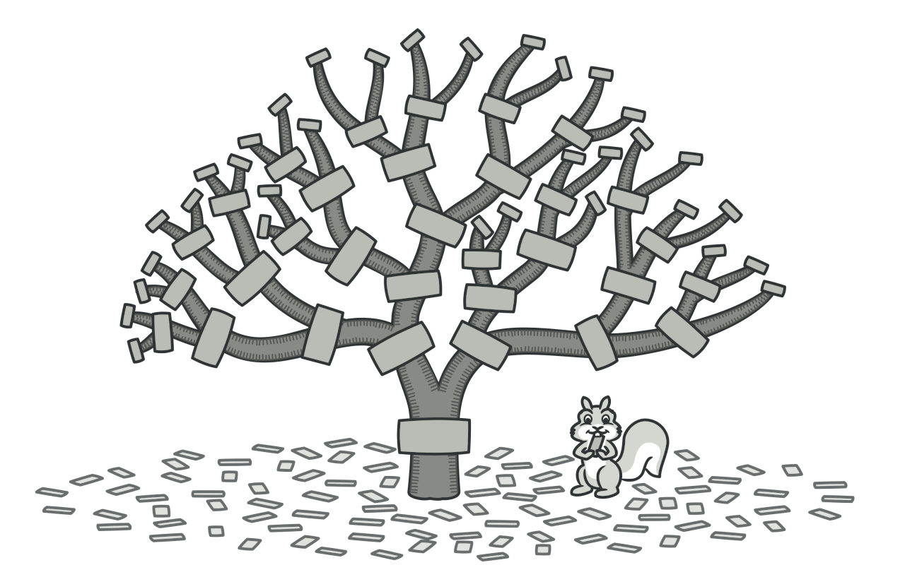
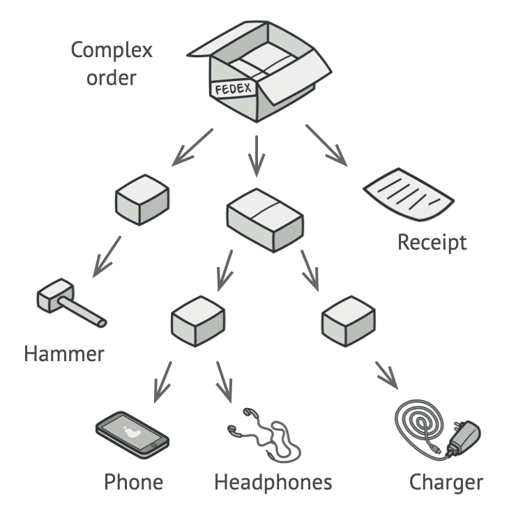
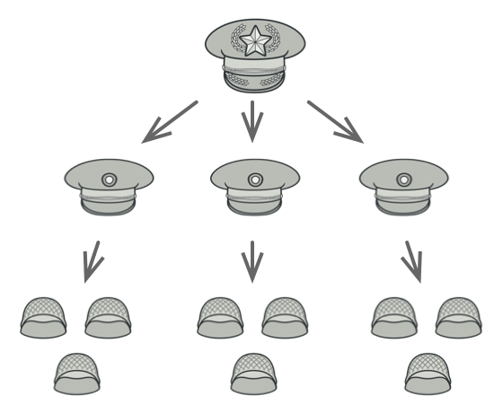
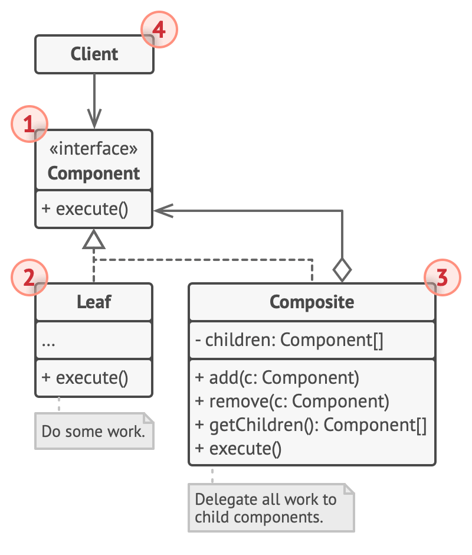
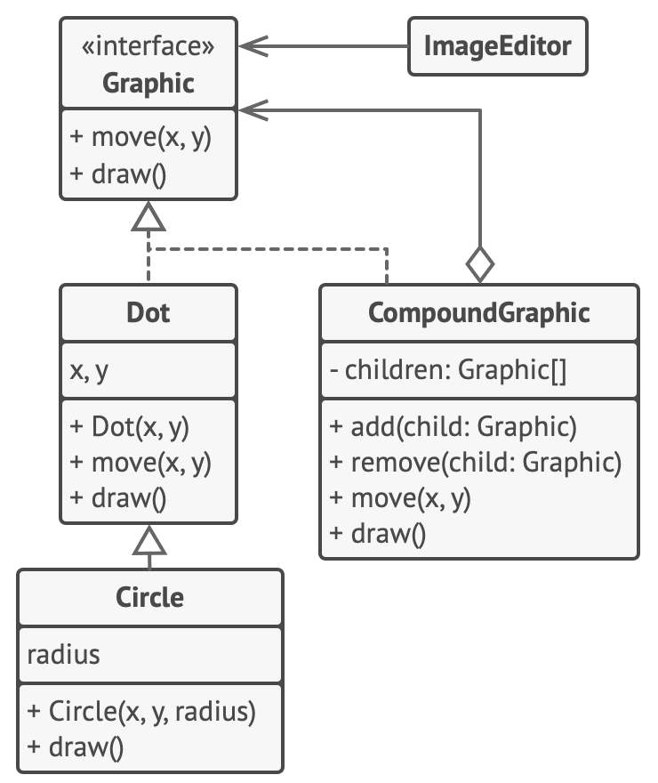

# Composite


**Type:** Structural · **Also known as:** Object Tree

> **The 10-second version:** make "one thing" and "a bag of things" implement the *same interface*, so the caller can stop asking which one it's holding — and recursion does the rest.

<br clear="all">

## Quick card

| | |
|---|---|
| **Problem it solves** | Your data is a tree, but your code is full of `if (isFolder) recurse else doWork` branches that leak the tree's shape everywhere. |
| **Core move** | One `Component` interface. A `Leaf` implements it by doing real work. A `Composite` implements it by calling the *same method* on its children and combining results. |
| **You'll recognise it by** | A class that holds `List<TheSameInterfaceItImplements>` and whose method body is a `foreach` over that list calling the method it's currently inside. |
| **Rating** | Complexity ★★☆ · Popularity ★★☆ |
| **Closest relatives** | Decorator (same shape, exactly one child, adds behaviour), Iterator (walks the tree), Visitor (adds operations to the tree), Chain of Responsibility (walks *up* the tree), Flyweight (shares leaves) |
| **In your stack** | On-road price breakdowns (base + accessories + insurance + taxes), search filter trees (`AND`/`OR`/`NOT` → SQL `WHERE`), dealer-group → region → dealership → showroom hierarchies, category/body-type taxonomies, React/DOM component trees |

### How to read this file

Technical first, plain English second. 🗣️ marks the plain-English version. Part 1 is Refactoring.Guru's material with their diagrams; Parts 2–7 are code, your stack, and the stuff that makes it stick.

---

# PART 1 — The pattern

## 1. Intent

**Composite** is a structural design pattern that lets you compose objects into tree structures and then work with these structures as if they were individual objects.



### 🗣️ In plain words

You have a tree. Some nodes are simple (a product, a dot, a price line). Some nodes are containers (a box, a group, a bundle) that hold other nodes — including other containers, to any depth.

Composite says: **stop treating those two kinds differently.** Give them one interface. The simple node answers the question itself. The container answers it by asking every child the *same* question and combining the answers.

The caller then holds a single variable and calls a single method, and has no idea whether it just triggered one line of arithmetic or a thousand-node traversal. That ignorance is the whole point.

---

## 2. Problem

Using the Composite pattern makes sense only when the core model of your app can be represented as a tree.

For example, imagine that you have two types of objects: `Products` and `Boxes`. A `Box` can contain several `Products` as well as a number of smaller `Boxes`. These little `Boxes` can also hold some `Products` or even smaller `Boxes`, and so on.

Say you decide to create an ordering system that uses these classes. Orders could contain simple products without any wrapping, as well as boxes stuffed with products...and other boxes. How would you determine the total price of such an order?



*An order might comprise various products, packaged in boxes, which are packaged in bigger boxes and so on. The whole structure looks like an upside down tree.*

You could try the direct approach: unwrap all the boxes, go over all the products and then calculate the total. That would be doable in the real world; but in a program, it’s not as simple as running a loop. You have to know the classes of `Products` and `Boxes` you’re going through, the nesting level of the boxes and other nasty details beforehand. All of this makes the direct approach either too awkward or even impossible.

### 🗣️ In plain words

The pain is not "I have a tree". The pain is **the tree's shape leaking into every function that touches it**.

Here is what that looks like in an automotive marketplace. You need the total on-road price of a quote. A quote has line items, but some "items" are actually bundles — an accessories pack that contains mats, a 7D dashcam and a ceramic coating; an insurance pack that contains own-damage, third-party and zero-dep add-on; and a dealer can nest a "Monsoon Offer" bundle *inside* the accessories pack.

```ts
// ❌ The shape of the tree is hard-coded into the caller.
function total(item: unknown): number {
  if (item instanceof LineItem) {
    return item.amount;
  }
  if (item instanceof AccessoryBundle) {
    let sum = 0;
    for (const child of item.accessories) {   // <- different field name
      sum += total(child);                     // <- recursion, but by hand
    }
    return sum - item.bundleDiscount;
  }
  if (item instanceof InsuranceBundle) {
    let sum = 0;
    for (const child of item.covers) {        // <- different field name again
      sum += total(child);
    }
    return sum;
  }
  throw new Error("unknown item type");        // <- and a new type breaks it
}
```

Now count the problems:

1. **Every new node type edits this function.** Add `ExchangeBonusBundle` and `total()` needs a new branch — and so does `describe()`, and `toInvoiceRows()`, and `applyGstRate()`. That's the Open/Closed Principle being violated once per operation, not once per type.
2. **The recursion is the caller's job.** The function has to *know* the tree is nested, has to know which field holds children, and has to remember to recurse. Miss one branch and the total is silently wrong — the worst kind of pricing bug, because nothing throws.
3. **`instanceof` chains drift.** Order matters (subclass before superclass), and nothing tells you when you've missed a case until production.
4. **You can't hand a subtree to anything.** Want to price only the accessories pack? You need a different entry point, because the function's contract is "give me a thing, I'll figure out what it is".

The direct approach — unwrap everything, flatten it, loop once — works on paper and falls apart in code, because flattening loses the structure you need to charge a bundle-level discount or print a nested invoice.

---

## 3. Solution

The Composite pattern suggests that you work with `Products` and `Boxes` through a common interface which declares a method for calculating the total price.

How would this method work? For a product, it’d simply return the product’s price. For a box, it’d go over each item the box contains, ask its price and then return a total for this box. If one of these items were a smaller box, that box would also start going over its contents and so on, until the prices of all inner components were calculated. A box could even add some extra cost to the final price, such as packaging cost.


*The Composite pattern lets you run a behavior recursively over all components of an object tree.*

The greatest benefit of this approach is that you don’t need to care about the concrete classes of objects that compose the tree. You don’t need to know whether an object is a simple product or a sophisticated box. You can treat them all the same via the common interface. When you call a method, the objects themselves pass the request down the tree.

### 🗣️ In plain words

Three mechanical moves. That's the entire pattern.

1. **Declare one interface for both kinds of node.** Pick the operations that make sense for a single item *and* for a bag of items: `total()`, `render()`, `move(x, y)`. If an operation only makes sense for one kind, it doesn't belong on the interface.
2. **Write the leaf: it answers directly.** `LineItem.total()` returns `this.amount`. No recursion, no children, no ceremony. Leaves do the actual work.
3. **Write the composite: it answers by delegating.** It holds `children: Component[]` — typed as the *interface*, never as concrete classes — and implements `total()` as a loop calling `child.total()` on every child, then combines the results (sum, max, concatenate, whatever the operation means). It may add its own contribution: a bundle discount, a packaging cost, a dashed selection rectangle.
4. **(Optional) Put `add`/`remove` on the interface too.** Then the client can assemble the tree without ever naming a concrete class. The cost is that leaves get methods that make no sense for them — a real trade-off, covered in §8 and §9.

The recursion is now *structural* rather than written down anywhere. Nobody wrote "and then walk the tree". Each composite only knows how to ask its direct children. The depth emerges because the children are the same interface, so they ask *their* children, and so on until a leaf answers for real.

> **The key insight:** the composite is a node whose implementation of an operation is *that same operation, applied to its children*. Once a container and its contents share a type, "traverse the tree" stops being an algorithm the caller writes and becomes a property of the objects themselves.

---

## 4. Real-world analogy



*An example of a military structure.*

Armies of most countries are structured as hierarchies. An army consists of several divisions; a division is a set of brigades, and a brigade consists of platoons, which can be broken down into squads. Finally, a squad is a small group of real soldiers. Orders are given at the top of the hierarchy and passed down onto each level until every soldier knows what needs to be done.

### 🗣️ Two more of my own

**A restaurant bill with a thali.** You order two dosas and one "South Indian Thali". The thali is itself six dishes with a combo price, and one of those six is a "sweets platter" holding three sweets. When the waiter totals the bill they don't unpack anything — they read one price per line, and the thali's price already contains the sweets platter's price, which already contains the three sweets. Every level answered the question "what do you cost?" in the same language, so the top level only had to add up three numbers.

**A folder you zip and email.** You right-click a folder and pick "Compress". You don't care that it contains 40 files, 6 sub-folders, and one sub-folder with 2,000 photos. The operating system asks each entry "compress yourself"; files compress their bytes, folders ask their contents and bundle the results. Then you email the zip like it's a single attachment — which is exactly the client's experience of a composite: a whole tree, handled as one object.

---

## 5. Structure



1. The **Component** interface describes operations that are common to both simple and complex elements of the tree.
2. The **Leaf** is a basic element of a tree that doesn’t have sub-elements.

   Usually, leaf components end up doing most of the real work, since they don’t have anyone to delegate the work to.
3. The **Container** (aka *composite*) is an element that has sub-elements: leaves or other containers. A container doesn’t know the concrete classes of its children. It works with all sub-elements only via the component interface.

   Upon receiving a request, a container delegates the work to its sub-elements, processes intermediate results and then returns the final result to the client.
4. The **Client** works with all elements through the component interface. As a result, the client can work in the same way with both simple or complex elements of the tree.

### 🗣️ Participants & roles — cheat table

| Role | What it is in code | Example from the site | Equivalent in reader's stack |
|---|---|---|---|
| **Component** | An interface or abstract base class declaring the operations both kinds support. Sometimes also `add`/`remove`/`getChild`. | `interface Graphic { move(x,y); draw() }` | `IQuoteNode { decimal Total(); string Describe(); }` in C#; `interface PriceNode { total(): number }` in TS |
| **Leaf** | A class implementing Component with **no** children. Does the real work. | `Dot`, and `Circle extends Dot` | `LineItem` (RTO charges, insurance premium, a single accessory); a single search predicate like `price <= 800000` |
| **Composite / Container** | A class implementing Component that holds `List<Component>` and implements every operation by looping over children and combining. | `CompoundGraphic` with `children: array of Graphic` | `Bundle` (accessories pack, insurance pack); `AndFilter` / `OrFilter` holding sub-filters |
| **Client** | Anything holding a `Component` reference and calling methods on it without type checks. | `ImageEditor`, which calls `all.draw()` | Your pricing endpoint, your invoice renderer, your SQL builder — each holds one root and calls one method |

Two things worth burning in:

- The composite's child list is typed as **Component**, not as `Leaf[]` and not as `Composite[]`. That single typing decision is what makes arbitrary nesting work.
- A composite may *also* extend another component (the site's `Circle extends Dot`). Component hierarchies are ordinary class hierarchies; nothing stops leaves from sharing a base.

### 🤝 Collaboration — who calls whom

```
 Client
   │  total()
   ▼
┌──────────────────────────────┐
│ Composite: "Quote"           │
│  children: Component[]       │
│  total() { Σ child.total() } │◄──┐  the recursive hop:
└───┬───────────┬──────────┬───┘   │  a composite calls the
    │           │          │       │  SAME method it is
    │total()    │total()   │total() │  inside, on children
    ▼           ▼          ▼       │  typed as Component
┌────────┐ ┌────────┐ ┌────────────┴────────────┐
│ Leaf   │ │ Leaf   │ │ Composite: "Accessories"│
│ ex-    │ │ RTO    │ │  total(){Σ child.total()│
│ showrm │ │ 78,400 │ │          - discount}    │
│ 8,49,0 │ │        │ └───┬───────────┬─────────┘
└────────┘ └────────┘     │total()    │total()
     ▲          ▲         ▼           ▼
     │          │    ┌────────┐ ┌──────────────┐
  leaves answer │    │ Leaf   │ │ Composite:   │
  immediately ──┘    │ mats   │ │ "Monsoon"    │
                     │ 4,500  │ │  (nested!)   │
                     └────────┘ └──────────────┘

 Returned values flow back up:  4,500 + 12,900 - 2,000 = 15,400
                                → 8,49,000 + 78,400 + 15,400 = 9,42,800
```

**The single most important hop** is the one marked with the arrow: `Composite.total()` calls `child.total()` where `child` is declared as `Component`. Nothing in that line knows whether the callee is a leaf or another composite — and because it doesn't know, depth is unlimited and free. Delete the recursion and you don't have Composite, you have a list.

---

## 6. Pseudocode (the website's example)

In this example, the **Composite** pattern lets you implement stacking of geometric shapes in a graphical editor.



*The geometric shapes editor example.*

The `CompoundGraphic` class is a container that can comprise any number of sub-shapes, including other compound shapes. A compound shape has the same methods as a simple shape. However, instead of doing something on its own, a compound shape passes the request recursively to all its children and “sums up” the result.

The client code works with all shapes through the single interface common to all shape classes. Thus, the client doesn’t know whether it’s working with a simple shape or a compound one. The client can work with very complex object structures without being coupled to concrete classes that form that structure.

```
// The component interface declares common operations for both
// simple and complex objects of a composition.
interface Graphic is
    method move(x, y)
    method draw()

// The leaf class represents end objects of a composition. A
// leaf object can't have any sub-objects. Usually, it's leaf
// objects that do the actual work, while composite objects only
// delegate to their sub-components.
class Dot implements Graphic is
    field x, y

    constructor Dot(x, y) { ... }

    method move(x, y) is
        this.x += x, this.y += y

    method draw() is
        // Draw a dot at X and Y.

// All component classes can extend other components.
class Circle extends Dot is
    field radius

    constructor Circle(x, y, radius) { ... }

    method draw() is
        // Draw a circle at X and Y with radius R.

// The composite class represents complex components that may
// have children. Composite objects usually delegate the actual
// work to their children and then "sum up" the result.
class CompoundGraphic implements Graphic is
    field children: array of Graphic

    // A composite object can add or remove other components
    // (both simple or complex) to or from its child list.
    method add(child: Graphic) is
        // Add a child to the array of children.

    method remove(child: Graphic) is
        // Remove a child from the array of children.

    method move(x, y) is
        foreach (child in children) do
            child.move(x, y)

    // A composite executes its primary logic in a particular
    // way. It traverses recursively through all its children,
    // collecting and summing up their results. Since the
    // composite's children pass these calls to their own
    // children and so forth, the whole object tree is traversed
    // as a result.
    method draw() is
        // 1. For each child component:
        //     - Draw the component.
        //     - Update the bounding rectangle.
        // 2. Draw a dashed rectangle using the bounding
        // coordinates.

// The client code works with all the components via their base
// interface. This way the client code can support simple leaf
// components as well as complex composites.
class ImageEditor is
    field all: CompoundGraphic

    method load() is
        all = new CompoundGraphic()
        all.add(new Dot(1, 2))
        all.add(new Circle(5, 3, 10))
        // ...

    // Combine selected components into one complex composite
    // component.
    method groupSelected(components: array of Graphic) is
        group = new CompoundGraphic()
        foreach (component in components) do
            group.add(component)
            all.remove(component)
        all.add(group)
        // All components will be drawn.
        all.draw()
```

### 🗣️ Reading that pseudocode

- **`interface Graphic is / method move(x, y) / method draw()`** — notice how tiny this is. Only two operations, and both are meaningful for a single dot *and* for a group of 500 shapes. That restraint is what stops the interface from bloating (the pattern's main documented downside).
- **`class Circle extends Dot`** — the comment says "All component classes can extend other components." Leaves are normal classes; they can share a base, override `draw()`, and reuse `move()`. Composite constrains the *interface*, not your inheritance tree.
- **`field children: array of Graphic`** — the load-bearing line of the entire example. Typed as the interface, so the array can hold `Dot`, `Circle`, and other `CompoundGraphic` objects indistinguishably.
- **`method move(x, y) is foreach (child in children) do child.move(x, y)`** — the purest composite method that exists: *no* own logic, just "pass it on". Moving a group of groups of dots is a two-line implementation.
- **`method draw()` on the composite** — this one both delegates *and* adds its own contribution (it draws the dashed bounding rectangle around everything). That's the "sum up, plus my bit" shape you'll write most often in real code: children first, then the container's own work.
- **`method groupSelected(components)`** — the client builds a new `CompoundGraphic`, moves selected shapes into it, removes them from the old parent, adds the group back, and calls `all.draw()`. The redraw code is untouched by the fact that the tree just grew a level. That is the payoff sentence of the whole pattern.

---

## 7. Applicability — when to reach for it

**Use the Composite pattern when you have to implement a tree-like object structure.**

The Composite pattern provides you with two basic element types that share a common interface: simple leaves and complex containers. A container can be composed of both leaves and other containers. This lets you construct a nested recursive object structure that resembles a tree.

**Use the pattern when you want the client code to treat both simple and complex elements uniformly.**

All elements defined by the Composite pattern share a common interface. Using this interface, the client doesn’t have to worry about the concrete class of the objects it works with.

### ✅ Quick checklist

- [ ] Can I draw my model as a tree on a whiteboard without lying about it? (Not a graph with cycles, not a flat list you *wish* were a tree.)
- [ ] Do containers need to hold **both** simple items and other containers, to arbitrary depth?
- [ ] Is there at least one operation that means the same thing at every level — `total()`, `render()`, `validate()`, `toSql()`?
- [ ] Am I currently writing `if (x is Folder) recurse else work` in more than one place?
- [ ] Do callers genuinely not care whether they hold one node or a subtree?
- [ ] Will new node types be added over time (more than new *operations*)? — if it's the reverse, look at Visitor.

Four or more ticks: build it. Two or fewer: you probably want a plain list, or a recursive function over a discriminated union, and that is fine.

---

## 8. How to implement — step by step

1. Make sure that the core model of your app can be represented as a tree structure. Try to break it down into simple elements and containers. Remember that containers must be able to contain both simple elements and other containers.
2. Declare the component interface with a list of methods that make sense for both simple and complex components.
3. Create a leaf class to represent simple elements. A program may have multiple different leaf classes.
4. Create a container class to represent complex elements. In this class, provide an array field for storing references to sub-elements. The array must be able to store both leaves and containers, so make sure it’s declared with the component interface type.

   While implementing the methods of the component interface, remember that a container is supposed to be delegating most of the work to sub-elements.
5. Finally, define the methods for adding and removal of child elements in the container.

   Keep in mind that these operations can be declared in the component interface. This would violate the *Interface Segregation Principle* because the methods will be empty in the leaf class. However, the client will be able to treat all the elements equally, even when composing the tree.

### 🗣️ The same steps, blunt version

1. **Draw the tree.** On paper. If you can't name what a "leaf" is and what a "container" is in your domain, stop — you don't have a Composite problem.
2. **Write the interface with the fewest methods that make sense for both.** If you're tempted to add `getChildren()` "just in case", don't. Add it when a Visitor or Iterator actually needs it.
3. **Write the leaf(es) first.** They're trivial and they pin down what the operation actually returns. You may have many leaf classes; that's normal and healthy.
4. **Write the composite.** One field: `List<Component>`. Every operation = loop children, call the same method, combine. Combine means sum, concat, `&&`, max, whichever the operation's algebra is. Add the container's own contribution *after* the loop.
5. **Decide where `add`/`remove` live.** On the Component (transparent — client never sees concrete types, leaves get useless methods) or only on the Composite (safe — leaves stay honest, client must type-check to build the tree). Pick transparent when clients assemble trees generically; pick safe when the tree is built once by a parser or a loader.

Two extras the site's steps imply but don't spell out:

6. **Guard against cycles at insert time** if the tree is user-editable — one `add` that creates a loop turns every traversal into a stack overflow.
7. **Define what an empty composite returns.** A bundle with zero children costs `0`, an `AndFilter` with zero children is `true`. Write that down; it's the identity element of your combine operation and it will bite you if you leave it to chance.

---

## 9. Pros and cons

- ✅ You can work with complex tree structures more conveniently: use polymorphism and recursion to your advantage.
- ✅ *Open/Closed Principle*. You can introduce new element types into the app without breaking the existing code, which now works with the object tree.

- ⛔ It might be difficult to provide a common interface for classes whose functionality differs too much. In certain scenarios, you’d need to overgeneralize the component interface, making it harder to comprehend.

### ⚖️ Honest trade-offs from the trenches

**The real cost is the interface, not the classes.** Everyone expects the cost to be "more files". It isn't — the classes are tiny. The cost arrives the day someone needs an operation that means something for containers but nothing for leaves (`applyBundleDiscount()`), or vice versa (`getSku()`). You then face three bad options: put it on the interface and throw from the wrong side, put it on the interface and return a null-ish default, or type-check and defeat the point. Refactoring.Guru's cons bullet is exactly this, and it's not theoretical — it's the thing that kills over-eager composites. **Keep the component interface small and it stays cheap forever.**

**The tell that it's worth it** is the *second* operation. One operation over a tree? Write a recursive function; you're done in ten lines. But when `total()`, `describe()`, `toInvoiceRows()` and `validate()` all need the same traversal, the recursive-function approach means four copies of the walking logic, four `switch` statements that must stay in sync, and four places to edit when a node type appears. Composite collapses the walking into the objects and leaves each operation as one line per class. That's the moment the pattern pays for itself.

**What modern C#/TS give you free.** In C#, `IEnumerable<T>` + LINQ means your composite's body is usually one expression — `_children.Sum(c => c.Total())` — and records give you value-equality and `with` for free, which makes immutable trees genuinely pleasant. C# collection expressions and `params ReadOnlySpan<T>` make `new Bundle("Accessories", [mats, dashcam, coating])` read like data. In TypeScript, a discriminated union plus an exhaustive `switch` with a `never` check is a *legitimate competitor*: the compiler proves you handled every node type, which the class-based version can't do. Use the union when the node types are closed and known at compile time (an AST you own), use classes when third parties add node types or when nodes carry behaviour and state. DI containers give you nothing here — Composite is about data shape, and resolving a tree from a container is usually the wrong instinct. The one DI-adjacent gift is real: registering several `IHandler` implementations and injecting `IEnumerable<IHandler>` into a `CompositeHandler` is Composite, and both .NET's built-in container and every other one support it out of the box.

**The cost nobody mentions: debugging depth.** A stack trace through a 12-deep composite is 12 identical frames of `Composite.Total()`. Give every node a stable `Name`/`Id` and implement `ToString()` to print the subtree — one afternoon of work that pays back the first time a price is off by ₹2,000 and you need to find which node lied.

---

## 10. Relations with other patterns

- You can use [Builder](https://refactoring.guru/design-patterns/builder) when creating complex [Composite](https://refactoring.guru/design-patterns/composite) trees because you can program its construction steps to work recursively.
- [Chain of Responsibility](https://refactoring.guru/design-patterns/chain-of-responsibility) is often used in conjunction with [Composite](https://refactoring.guru/design-patterns/composite). In this case, when a leaf component gets a request, it may pass it through the chain of all of the parent components down to the root of the object tree.
- You can use [Iterators](https://refactoring.guru/design-patterns/iterator) to traverse [Composite](https://refactoring.guru/design-patterns/composite) trees.
- You can use [Visitor](https://refactoring.guru/design-patterns/visitor) to execute an operation over an entire [Composite](https://refactoring.guru/design-patterns/composite) tree.
- You can implement shared leaf nodes of the [Composite](https://refactoring.guru/design-patterns/composite) tree as [Flyweights](https://refactoring.guru/design-patterns/flyweight) to save some RAM.
- [Composite](https://refactoring.guru/design-patterns/composite) and [Decorator](https://refactoring.guru/design-patterns/decorator) have similar structure diagrams since both rely on recursive composition to organize an open-ended number of objects.

  A *Decorator* is like a *Composite* but only has one child component. There’s another significant difference: *Decorator* adds additional responsibilities to the wrapped object, while *Composite* just “sums up” its children’s results.

  However, the patterns can also cooperate: you can use *Decorator* to extend the behavior of a specific object in the *Composite* tree.
- Designs that make heavy use of [Composite](https://refactoring.guru/design-patterns/composite) and [Decorator](https://refactoring.guru/design-patterns/decorator) can often benefit from using [Prototype](https://refactoring.guru/design-patterns/prototype). Applying the pattern lets you clone complex structures instead of re-constructing them from scratch.

### 🗣️ Disambiguation table

| Pattern | Structure | Intent | How to tell them apart |
|---|---|---|---|
| **Composite** | One parent, **N children**, same interface | Treat a tree like a single object; sum up children's results | The field is a **list**. The method is a **loop**. |
| **Decorator** | One wrapper, **exactly 1 child**, same interface | Add responsibilities to *one* object at runtime | The field is a **single reference**. The method calls through, then adds behaviour. |
| **Chain of Responsibility** | A **line** of handlers, each with a `next` | Pass a request along until someone handles it | It usually **stops early**. Composite always visits everyone. |
| **Visitor** | An operation object walked over an existing tree | Add new operations without editing node classes | Visitor needs a Composite (or some tree) to exist first. They're partners, not rivals. |
| **Iterator** | An object that yields nodes one at a time | Traverse without exposing internal structure | Iterator gives you *nodes*; Composite gives you an *answer*. |

***Composite has a list and sums up; Decorator has one child and adds on. Same diagram, opposite jobs.***

And the pairings worth remembering, because you'll actually use them:

- **Builder + Composite** — a recursive builder is the nicest way to assemble deep trees in code (`Quote.Bundle("Accessories").Item("Mats", 4500).Bundle("Monsoon")...`).
- **Iterator/Visitor + Composite** — the standard way to add traversals and operations once the tree exists.
- **Flyweight + Composite** — if a million leaves are identical (the same accessory SKU appearing across 50,000 quotes), share one instance.
- **Prototype + Composite** — cloning a configured subtree beats rebuilding it, and it's how "duplicate this quote" gets implemented.

---

# PART 2 — Official code examples from Refactoring.Guru

## 2.1 C#

**Complexity:** ★★☆ (2/3)

**Popularity:** ★★☆ (2/3)

**Usage examples:** The Composite pattern is pretty common in C# code. It’s often used to represent hierarchies of user interface components or the code that works with graphs.

**Identification:** If you have an object tree, and each object of a tree is a part of the same class hierarchy, this is most likely a composite. If methods of these classes delegate the work to child objects of the tree and do it via the base class/interface of the hierarchy, this is definitely a composite.

### Conceptual Example

This example illustrates the structure of the **Composite** design pattern. It focuses on answering these questions:

- What classes does it consist of?
- What roles do these classes play?
- In what way the elements of the pattern are related?

##### **Program.cs:** Conceptual example

```csharp
using System;
using System.Collections.Generic;

namespace RefactoringGuru.DesignPatterns.Composite.Conceptual
{
    // The base Component class declares common operations for both simple and
    // complex objects of a composition.
    abstract class Component
    {
        public Component() { }

        // The base Component may implement some default behavior or leave it to
        // concrete classes (by declaring the method containing the behavior as
        // "abstract").
        public abstract string Operation();

        // In some cases, it would be beneficial to define the child-management
        // operations right in the base Component class. This way, you won't
        // need to expose any concrete component classes to the client code,
        // even during the object tree assembly. The downside is that these
        // methods will be empty for the leaf-level components.
        public virtual void Add(Component component)
        {
            throw new NotImplementedException();
        }

        public virtual void Remove(Component component)
        {
            throw new NotImplementedException();
        }

        // You can provide a method that lets the client code figure out whether
        // a component can bear children.
        public virtual bool IsComposite()
        {
            return true;
        }
    }

    // The Leaf class represents the end objects of a composition. A leaf can't
    // have any children.
    //
    // Usually, it's the Leaf objects that do the actual work, whereas Composite
    // objects only delegate to their sub-components.
    class Leaf : Component
    {
        public override string Operation()
        {
            return "Leaf";
        }

        public override bool IsComposite()
        {
            return false;
        }
    }

    // The Composite class represents the complex components that may have
    // children. Usually, the Composite objects delegate the actual work to
    // their children and then "sum-up" the result.
    class Composite : Component
    {
        protected List<Component> _children = new List<Component>();

        public override void Add(Component component)
        {
            this._children.Add(component);
        }

        public override void Remove(Component component)
        {
            this._children.Remove(component);
        }

        // The Composite executes its primary logic in a particular way. It
        // traverses recursively through all its children, collecting and
        // summing their results. Since the composite's children pass these
        // calls to their children and so forth, the whole object tree is
        // traversed as a result.
        public override string Operation()
        {
            int i = 0;
            string result = "Branch(";

            foreach (Component component in this._children)
            {
                result += component.Operation();
                if (i != this._children.Count - 1)
                {
                    result += "+";
                }
                i++;
            }

            return result + ")";
        }
    }

    class Client
    {
        // The client code works with all of the components via the base
        // interface.
        public void ClientCode(Component leaf)
        {
            Console.WriteLine($"RESULT: {leaf.Operation()}\n");
        }

        // Thanks to the fact that the child-management operations are declared
        // in the base Component class, the client code can work with any
        // component, simple or complex, without depending on their concrete
        // classes.
        public void ClientCode2(Component component1, Component component2)
        {
            if (component1.IsComposite())
            {
                component1.Add(component2);
            }

            Console.WriteLine($"RESULT: {component1.Operation()}");
        }
    }

    class Program
    {
        static void Main(string[] args)
        {
            Client client = new Client();

            // This way the client code can support the simple leaf
            // components...
            Leaf leaf = new Leaf();
            Console.WriteLine("Client: I get a simple component:");
            client.ClientCode(leaf);

            // ...as well as the complex composites.
            Composite tree = new Composite();
            Composite branch1 = new Composite();
            branch1.Add(new Leaf());
            branch1.Add(new Leaf());
            Composite branch2 = new Composite();
            branch2.Add(new Leaf());
            tree.Add(branch1);
            tree.Add(branch2);
            Console.WriteLine("Client: Now I've got a composite tree:");
            client.ClientCode(tree);

            Console.Write("Client: I don't need to check the components classes even when managing the tree:\n");
            client.ClientCode2(tree, leaf);
        }
    }
}
```

##### **Output.txt:** Execution result

```output
Client: I get a simple component:
RESULT: Leaf

Client: Now I've got a composite tree:
RESULT: Branch(Branch(Leaf+Leaf)+Branch(Leaf))

Client: I don't need to check the components classes even when managing the tree:
RESULT: Branch(Branch(Leaf+Leaf)+Branch(Leaf)+Leaf)
```

## 2.2 TypeScript

**Complexity:** ★★☆ (2/3)

**Popularity:** ★★☆ (2/3)

**Usage examples:** The Composite pattern is pretty common in TypeScript code. It’s often used to represent hierarchies of user interface components or the code that works with graphs.

**Identification:** If you have an object tree, and each object of a tree is a part of the same class hierarchy, this is most likely a composite. If methods of these classes delegate the work to child objects of the tree and do it via the base class/interface of the hierarchy, this is definitely a composite.

### Conceptual Example

This example illustrates the structure of the **Composite** design pattern and focuses on the following questions:

- What classes does it consist of?
- What roles do these classes play?
- In what way the elements of the pattern are related?

##### **index.ts:** Conceptual example

```typescript
/**
 * The base Component class declares common operations for both simple and
 * complex objects of a composition.
 */
abstract class Component {
    protected parent!: Component | null;

    /**
     * Optionally, the base Component can declare an interface for setting and
     * accessing a parent of the component in a tree structure. It can also
     * provide some default implementation for these methods.
     */
    public setParent(parent: Component | null) {
        this.parent = parent;
    }

    public getParent(): Component | null {
        return this.parent;
    }

    /**
     * In some cases, it would be beneficial to define the child-management
     * operations right in the base Component class. This way, you won't need to
     * expose any concrete component classes to the client code, even during the
     * object tree assembly. The downside is that these methods will be empty
     * for the leaf-level components.
     */
    public add(component: Component): void { }

    public remove(component: Component): void { }

    /**
     * You can provide a method that lets the client code figure out whether a
     * component can bear children.
     */
    public isComposite(): boolean {
        return false;
    }

    /**
     * The base Component may implement some default behavior or leave it to
     * concrete classes (by declaring the method containing the behavior as
     * "abstract").
     */
    public abstract operation(): string;
}

/**
 * The Leaf class represents the end objects of a composition. A leaf can't have
 * any children.
 *
 * Usually, it's the Leaf objects that do the actual work, whereas Composite
 * objects only delegate to their sub-components.
 */
class Leaf extends Component {
    public operation(): string {
        return 'Leaf';
    }
}

/**
 * The Composite class represents the complex components that may have children.
 * Usually, the Composite objects delegate the actual work to their children and
 * then "sum-up" the result.
 */
class Composite extends Component {
    protected children: Component[] = [];

    /**
     * A composite object can add or remove other components (both simple or
     * complex) to or from its child list.
     */
    public add(component: Component): void {
        this.children.push(component);
        component.setParent(this);
    }

    public remove(component: Component): void {
        const componentIndex = this.children.indexOf(component);
        this.children.splice(componentIndex, 1);

        component.setParent(null);
    }

    public isComposite(): boolean {
        return true;
    }

    /**
     * The Composite executes its primary logic in a particular way. It
     * traverses recursively through all its children, collecting and summing
     * their results. Since the composite's children pass these calls to their
     * children and so forth, the whole object tree is traversed as a result.
     */
    public operation(): string {
        const results = [];
        for (const child of this.children) {
            results.push(child.operation());
        }

        return `Branch(${results.join('+')})`;
    }
}

/**
 * The client code works with all of the components via the base interface.
 */
function clientCode(component: Component) {
    // ...

    console.log(`RESULT: ${component.operation()}`);

    // ...
}

/**
 * This way the client code can support the simple leaf components...
 */
const simple = new Leaf();
console.log('Client: I\'ve got a simple component:');
clientCode(simple);
console.log('');

/**
 * ...as well as the complex composites.
 */
const tree = new Composite();
const branch1 = new Composite();
branch1.add(new Leaf());
branch1.add(new Leaf());
const branch2 = new Composite();
branch2.add(new Leaf());
tree.add(branch1);
tree.add(branch2);
console.log('Client: Now I\'ve got a composite tree:');
clientCode(tree);
console.log('');

/**
 * Thanks to the fact that the child-management operations are declared in the
 * base Component class, the client code can work with any component, simple or
 * complex, without depending on their concrete classes.
 */
function clientCode2(component1: Component, component2: Component) {
    // ...

    if (component1.isComposite()) {
        component1.add(component2);
    }
    console.log(`RESULT: ${component1.operation()}`);

    // ...
}

console.log('Client: I don\'t need to check the components classes even when managing the tree:');
clientCode2(tree, simple);
```

##### **Output.txt:** Execution result

```output
Client: I've got a simple component:
RESULT: Leaf

Client: Now I've got a composite tree:
RESULT: Branch(Branch(Leaf+Leaf)+Branch(Leaf))

Client: I don't need to check the components classes even when managing the tree:
RESULT: Branch(Branch(Leaf+Leaf)+Branch(Leaf)+Leaf)
```

## 2.3 C++

**Complexity:** ★★☆ (2/3)

**Popularity:** ★★☆ (2/3)

**Usage examples:** The Composite pattern is pretty common in C++ code. It’s often used to represent hierarchies of user interface components or the code that works with graphs.

**Identification:** If you have an object tree, and each object of a tree is a part of the same class hierarchy, this is most likely a composite. If methods of these classes delegate the work to child objects of the tree and do it via the base class/interface of the hierarchy, this is definitely a composite.

### Conceptual Example

This example illustrates the structure of the **Composite** design pattern. It focuses on answering these questions:

- What classes does it consist of?
- What roles do these classes play?
- In what way the elements of the pattern are related?

##### **main.cc:** Conceptual example

```cpp
#include <algorithm>
#include <iostream>
#include <list>
#include <string>
/**
 * The base Component class declares common operations for both simple and
 * complex objects of a composition.
 */
class Component {
  /**
   * @var Component
   */
 protected:
  Component *parent_;
  /**
   * Optionally, the base Component can declare an interface for setting and
   * accessing a parent of the component in a tree structure. It can also
   * provide some default implementation for these methods.
   */
 public:
  virtual ~Component() {}
  void SetParent(Component *parent) {
    this->parent_ = parent;
  }
  Component *GetParent() const {
    return this->parent_;
  }
  /**
   * In some cases, it would be beneficial to define the child-management
   * operations right in the base Component class. This way, you won't need to
   * expose any concrete component classes to the client code, even during the
   * object tree assembly. The downside is that these methods will be empty for
   * the leaf-level components.
   */
  virtual void Add(Component *component) {}
  virtual void Remove(Component *component) {}
  /**
   * You can provide a method that lets the client code figure out whether a
   * component can bear children.
   */
  virtual bool IsComposite() const {
    return false;
  }
  /**
   * The base Component may implement some default behavior or leave it to
   * concrete classes (by declaring the method containing the behavior as
   * "abstract").
   */
  virtual std::string Operation() const = 0;
};
/**
 * The Leaf class represents the end objects of a composition. A leaf can't have
 * any children.
 *
 * Usually, it's the Leaf objects that do the actual work, whereas Composite
 * objects only delegate to their sub-components.
 */
class Leaf : public Component {
 public:
  std::string Operation() const override {
    return "Leaf";
  }
};
/**
 * The Composite class represents the complex components that may have children.
 * Usually, the Composite objects delegate the actual work to their children and
 * then "sum-up" the result.
 */
class Composite : public Component {
  /**
   * @var \SplObjectStorage
   */
 protected:
  std::list<Component *> children_;

 public:
  /**
   * A composite object can add or remove other components (both simple or
   * complex) to or from its child list.
   */
  void Add(Component *component) override {
    this->children_.push_back(component);
    component->SetParent(this);
  }
  /**
   * Have in mind that this method removes the pointer to the list but doesn't
   * frees the
   *     memory, you should do it manually or better use smart pointers.
   */
  void Remove(Component *component) override {
    children_.remove(component);
    component->SetParent(nullptr);
  }
  bool IsComposite() const override {
    return true;
  }
  /**
   * The Composite executes its primary logic in a particular way. It traverses
   * recursively through all its children, collecting and summing their results.
   * Since the composite's children pass these calls to their children and so
   * forth, the whole object tree is traversed as a result.
   */
  std::string Operation() const override {
    std::string result;
    for (const Component *c : children_) {
      if (c == children_.back()) {
        result += c->Operation();
      } else {
        result += c->Operation() + "+";
      }
    }
    return "Branch(" + result + ")";
  }
};
/**
 * The client code works with all of the components via the base interface.
 */
void ClientCode(Component *component) {
  // ...
  std::cout << "RESULT: " << component->Operation();
  // ...
}

/**
 * Thanks to the fact that the child-management operations are declared in the
 * base Component class, the client code can work with any component, simple or
 * complex, without depending on their concrete classes.
 */
void ClientCode2(Component *component1, Component *component2) {
  // ...
  if (component1->IsComposite()) {
    component1->Add(component2);
  }
  std::cout << "RESULT: " << component1->Operation();
  // ...
}

/**
 * This way the client code can support the simple leaf components...
 */

int main() {
  Component *simple = new Leaf;
  std::cout << "Client: I've got a simple component:\n";
  ClientCode(simple);
  std::cout << "\n\n";
  /**
   * ...as well as the complex composites.
   */

  Component *tree = new Composite;
  Component *branch1 = new Composite;

  Component *leaf_1 = new Leaf;
  Component *leaf_2 = new Leaf;
  Component *leaf_3 = new Leaf;
  branch1->Add(leaf_1);
  branch1->Add(leaf_2);
  Component *branch2 = new Composite;
  branch2->Add(leaf_3);
  tree->Add(branch1);
  tree->Add(branch2);
  std::cout << "Client: Now I've got a composite tree:\n";
  ClientCode(tree);
  std::cout << "\n\n";

  std::cout << "Client: I don't need to check the components classes even when managing the tree:\n";
  ClientCode2(tree, simple);
  std::cout << "\n";

  delete simple;
  delete tree;
  delete branch1;
  delete branch2;
  delete leaf_1;
  delete leaf_2;
  delete leaf_3;

  return 0;
}
```

##### **Output.txt:** Execution result

```output
Client: I've got a simple component:
RESULT: Leaf

Client: Now I've got a composite tree:
RESULT: Branch(Branch(Leaf+Leaf)+Branch(Leaf))

Client: I don't need to check the components classes even when managing the tree:
RESULT: Branch(Branch(Leaf+Leaf)+Branch(Leaf)+Leaf)
```

## 2.4 Java

**Complexity:** ★★☆ (2/3)

**Popularity:** ★★☆ (2/3)

**Usage examples:** The Composite pattern is pretty common in Java code. It’s often used to represent hierarchies of user interface components or the code that works with graphs.

**Identification:** If you have an object tree, and each object of a tree is a part of the same class hierarchy, this is most likely a composite. If methods of these classes delegate the work to child objects of the tree and do it via the base class/interface of the hierarchy, this is definitely a composite.

### Simple and compound graphical shapes

This example shows how to create complex graphical shapes, composed of simpler shapes and treat both of them uniformly.

#### **shapes**

##### **shapes/Shape.java:** Common shape interface

```java
package refactoring_guru.composite.example.shapes;

import java.awt.*;

public interface Shape {
    int getX();
    int getY();
    int getWidth();
    int getHeight();
    void move(int x, int y);
    boolean isInsideBounds(int x, int y);
    void select();
    void unSelect();
    boolean isSelected();
    void paint(Graphics graphics);
}
```

##### **shapes/BaseShape.java:** Abstract shape with basic functionality

```java
package refactoring_guru.composite.example.shapes;

import java.awt.*;

abstract class BaseShape implements Shape {
    public int x;
    public int y;
    public Color color;
    private boolean selected = false;

    BaseShape(int x, int y, Color color) {
        this.x = x;
        this.y = y;
        this.color = color;
    }

    @Override
    public int getX() {
        return x;
    }

    @Override
    public int getY() {
        return y;
    }

    @Override
    public int getWidth() {
        return 0;
    }

    @Override
    public int getHeight() {
        return 0;
    }

    @Override
    public void move(int x, int y) {
        this.x += x;
        this.y += y;
    }

    @Override
    public boolean isInsideBounds(int x, int y) {
        return x > getX() && x < (getX() + getWidth()) &&
                y > getY() && y < (getY() + getHeight());
    }

    @Override
    public void select() {
        selected = true;
    }

    @Override
    public void unSelect() {
        selected = false;
    }

    @Override
    public boolean isSelected() {
        return selected;
    }

    void enableSelectionStyle(Graphics graphics) {
        graphics.setColor(Color.LIGHT_GRAY);

        Graphics2D g2 = (Graphics2D) graphics;
        float[] dash1 = {2.0f};
        g2.setStroke(new BasicStroke(1.0f,
                BasicStroke.CAP_BUTT,
                BasicStroke.JOIN_MITER,
                2.0f, dash1, 0.0f));
    }

    void disableSelectionStyle(Graphics graphics) {
        graphics.setColor(color);
        Graphics2D g2 = (Graphics2D) graphics;
        g2.setStroke(new BasicStroke());
    }

    @Override
    public void paint(Graphics graphics) {
        if (isSelected()) {
            enableSelectionStyle(graphics);
        }
        else {
            disableSelectionStyle(graphics);
        }

        // ...
    }
}
```

##### **shapes/Dot.java:** A dot

```java
package refactoring_guru.composite.example.shapes;

import java.awt.*;

public class Dot extends BaseShape {
    private final int DOT_SIZE = 3;

    public Dot(int x, int y, Color color) {
        super(x, y, color);
    }

    @Override
    public int getWidth() {
        return DOT_SIZE;
    }

    @Override
    public int getHeight() {
        return DOT_SIZE;
    }

    @Override
    public void paint(Graphics graphics) {
        super.paint(graphics);
        graphics.fillRect(x - 1, y - 1, getWidth(), getHeight());
    }
}
```

##### **shapes/Circle.java:** A circle

```java
package refactoring_guru.composite.example.shapes;

import java.awt.*;

public class Circle extends BaseShape {
    public int radius;

    public Circle(int x, int y, int radius, Color color) {
        super(x, y, color);
        this.radius = radius;
    }

    @Override
    public int getWidth() {
        return radius * 2;
    }

    @Override
    public int getHeight() {
        return radius * 2;
    }

    @Override
    public void paint(Graphics graphics) {
        super.paint(graphics);
        graphics.drawOval(x, y, getWidth() - 1, getHeight() - 1);
    }
}
```

##### **shapes/Rectangle.java:** A rectangle

```java
package refactoring_guru.composite.example.shapes;

import java.awt.*;

public class Rectangle extends BaseShape {
    public int width;
    public int height;

    public Rectangle(int x, int y, int width, int height, Color color) {
        super(x, y, color);
        this.width = width;
        this.height = height;
    }

    @Override
    public int getWidth() {
        return width;
    }

    @Override
    public int getHeight() {
        return height;
    }

    @Override
    public void paint(Graphics graphics) {
        super.paint(graphics);
        graphics.drawRect(x, y, getWidth() - 1, getHeight() - 1);
    }
}
```

##### **shapes/CompoundShape.java:** Compound shape, which consists of other shape objects

```java
package refactoring_guru.composite.example.shapes;

import java.awt.*;
import java.util.ArrayList;
import java.util.Arrays;
import java.util.List;

public class CompoundShape extends BaseShape {
    protected List<Shape> children = new ArrayList<>();

    public CompoundShape(Shape... components) {
        super(0, 0, Color.BLACK);
        add(components);
    }

    public void add(Shape component) {
        children.add(component);
    }

    public void add(Shape... components) {
        children.addAll(Arrays.asList(components));
    }

    public void remove(Shape child) {
        children.remove(child);
    }

    public void remove(Shape... components) {
        children.removeAll(Arrays.asList(components));
    }

    public void clear() {
        children.clear();
    }

    @Override
    public int getX() {
        if (children.size() == 0) {
            return 0;
        }
        int x = children.get(0).getX();
        for (Shape child : children) {
            if (child.getX() < x) {
                x = child.getX();
            }
        }
        return x;
    }

    @Override
    public int getY() {
        if (children.size() == 0) {
            return 0;
        }
        int y = children.get(0).getY();
        for (Shape child : children) {
            if (child.getY() < y) {
                y = child.getY();
            }
        }
        return y;
    }

    @Override
    public int getWidth() {
        int maxWidth = 0;
        int x = getX();
        for (Shape child : children) {
            int childsRelativeX = child.getX() - x;
            int childWidth = childsRelativeX + child.getWidth();
            if (childWidth > maxWidth) {
                maxWidth = childWidth;
            }
        }
        return maxWidth;
    }

    @Override
    public int getHeight() {
        int maxHeight = 0;
        int y = getY();
        for (Shape child : children) {
            int childsRelativeY = child.getY() - y;
            int childHeight = childsRelativeY + child.getHeight();
            if (childHeight > maxHeight) {
                maxHeight = childHeight;
            }
        }
        return maxHeight;
    }

    @Override
    public void move(int x, int y) {
        for (Shape child : children) {
            child.move(x, y);
        }
    }

    @Override
    public boolean isInsideBounds(int x, int y) {
        for (Shape child : children) {
            if (child.isInsideBounds(x, y)) {
                return true;
            }
        }
        return false;
    }

    @Override
    public void unSelect() {
        super.unSelect();
        for (Shape child : children) {
            child.unSelect();
        }
    }

    public boolean selectChildAt(int x, int y) {
        for (Shape child : children) {
            if (child.isInsideBounds(x, y)) {
                child.select();
                return true;
            }
        }
        return false;
    }

    @Override
    public void paint(Graphics graphics) {
        if (isSelected()) {
            enableSelectionStyle(graphics);
            graphics.drawRect(getX() - 1, getY() - 1, getWidth() + 1, getHeight() + 1);
            disableSelectionStyle(graphics);
        }

        for (Shape child : children) {
            child.paint(graphics);
        }
    }
}
```

#### **editor**

##### **editor/ImageEditor.java:** Shape editor

```java
package refactoring_guru.composite.example.editor;

import refactoring_guru.composite.example.shapes.CompoundShape;
import refactoring_guru.composite.example.shapes.Shape;

import javax.swing.*;
import javax.swing.border.Border;
import java.awt.*;
import java.awt.event.MouseAdapter;
import java.awt.event.MouseEvent;

public class ImageEditor {
    private EditorCanvas canvas;
    private CompoundShape allShapes = new CompoundShape();

    public ImageEditor() {
        canvas = new EditorCanvas();
    }

    public void loadShapes(Shape... shapes) {
        allShapes.clear();
        allShapes.add(shapes);
        canvas.refresh();
    }

    private class EditorCanvas extends Canvas {
        JFrame frame;

        private static final int PADDING = 10;

        EditorCanvas() {
            createFrame();
            refresh();
            addMouseListener(new MouseAdapter() {
                @Override
                public void mousePressed(MouseEvent e) {
                    allShapes.unSelect();
                    allShapes.selectChildAt(e.getX(), e.getY());
                    e.getComponent().repaint();
                }
            });
        }

        void createFrame() {
            frame = new JFrame();
            frame.setDefaultCloseOperation(WindowConstants.EXIT_ON_CLOSE);
            frame.setLocationRelativeTo(null);

            JPanel contentPanel = new JPanel();
            Border padding = BorderFactory.createEmptyBorder(PADDING, PADDING, PADDING, PADDING);
            contentPanel.setBorder(padding);
            frame.setContentPane(contentPanel);

            frame.add(this);
            frame.setVisible(true);
            frame.getContentPane().setBackground(Color.LIGHT_GRAY);
        }

        public int getWidth() {
            return allShapes.getX() + allShapes.getWidth() + PADDING;
        }

        public int getHeight() {
            return allShapes.getY() + allShapes.getHeight() + PADDING;
        }

        void refresh() {
            this.setSize(getWidth(), getHeight());
            frame.pack();
        }

        public void paint(Graphics graphics) {
            allShapes.paint(graphics);
        }
    }
}
```

##### **Demo.java:** Client code

```java
package refactoring_guru.composite.example;

import refactoring_guru.composite.example.editor.ImageEditor;
import refactoring_guru.composite.example.shapes.Circle;
import refactoring_guru.composite.example.shapes.CompoundShape;
import refactoring_guru.composite.example.shapes.Dot;
import refactoring_guru.composite.example.shapes.Rectangle;

import java.awt.*;

public class Demo {
    public static void main(String[] args) {
        ImageEditor editor = new ImageEditor();

        editor.loadShapes(
                new Circle(10, 10, 10, Color.BLUE),

                new CompoundShape(
                    new Circle(110, 110, 50, Color.RED),
                    new Dot(160, 160, Color.RED)
                ),

                new CompoundShape(
                        new Rectangle(250, 250, 100, 100, Color.GREEN),
                        new Dot(240, 240, Color.GREEN),
                        new Dot(240, 360, Color.GREEN),
                        new Dot(360, 360, Color.GREEN),
                        new Dot(360, 240, Color.GREEN)
                )
        );
    }
}
```

##### **OutputDemo.png:** Execution result

---

# PART 3 — Learn it by building it

We'll build the same thing in four languages: an **on-road price quote** for a car listing. Leaves are charges. Composites are bundles. The tree nests arbitrarily because dealers nest offers inside packs inside packs.

## 3.1 The dumbest possible version — TypeScript

### ❌ BEFORE — the pain, for real

```ts
// Three unrelated shapes, three unrelated loops, one fragile function.
type Charge  = { kind: "charge"; label: string; amount: number };
type Pack    = { kind: "pack"; label: string; items: Charge[]; discount: number };
type Policy  = { kind: "policy"; label: string; covers: Charge[] };

// Nesting a Pack inside a Pack is IMPOSSIBLE without changing the type,
// because `items` is Charge[], not "Charge or Pack".
function quoteTotal(nodes: Array<Charge | Pack | Policy>): number {
  let sum = 0;
  for (const n of nodes) {
    if (n.kind === "charge") {
      sum += n.amount;
    } else if (n.kind === "pack") {
      for (const c of n.items) sum += c.amount;     // one level only
      sum -= n.discount;
    } else if (n.kind === "policy") {
      for (const c of n.covers) sum += c.amount;    // duplicated loop
    }
  }
  return sum;
}

// And now write describe(). And toInvoiceRows(). And gstBreakdown().
// Each one repeats this whole if/else and this whole loop. Forever.
```

Two fatal problems: nesting is capped at one level by the *types*, and every new operation duplicates the dispatch.

### ✅ AFTER — Composite

```ts
// ─────────────────────────────────────────────────────────────
//  COMPONENT — the only type the rest of the app ever names
// ─────────────────────────────────────────────────────────────
export interface PriceNode {
  readonly label: string;
  /** Rupees, in paise-free whole numbers for this example. */
  total(): number;
  /** Indented, human-readable breakdown. `depth` is a rendering detail. */
  describe(depth?: number): string;
}

// ─────────────────────────────────────────────────────────────
//  LEAF — knows its own number, delegates to nobody
// ─────────────────────────────────────────────────────────────
export class Charge implements PriceNode {
  constructor(
    readonly label: string,
    private readonly amount: number,
  ) {}

  total(): number {
    return this.amount;                       // 👈 leaves do the real work
  }

  describe(depth = 0): string {
    return `${"  ".repeat(depth)}${this.label.padEnd(28 - depth * 2)} ₹${this.amount.toLocaleString("en-IN")}`;
  }
}

// ─────────────────────────────────────────────────────────────
//  COMPOSITE — holds PriceNode[], not Charge[]. That is the trick.
// ─────────────────────────────────────────────────────────────
export class Bundle implements PriceNode {
  private readonly children: PriceNode[] = [];   // 👈 typed as the INTERFACE

  constructor(
    readonly label: string,
    /** e.g. 2000 off the whole accessories pack */
    private readonly bundleDiscount = 0,
  ) {}

  add(...nodes: PriceNode[]): this {
    this.children.push(...nodes);                // 👈 accepts leaves AND bundles
    return this;                                 //    fluent, so trees read as trees
  }

  remove(node: PriceNode): this {
    const i = this.children.indexOf(node);
    if (i >= 0) this.children.splice(i, 1);
    return this;
  }

  total(): number {
    // 👇 THE recursive hop. `c` may be a Charge or another Bundle.
    //    This line does not know and must not care.
    const sum = this.children.reduce((acc, c) => acc + c.total(), 0);
    return sum - this.bundleDiscount;            // 👈 container's own contribution
  }

  describe(depth = 0): string {
    const pad = "  ".repeat(depth);
    const head = `${pad}${this.label} — ₹${this.total().toLocaleString("en-IN")}`;
    const kids = this.children.map((c) => c.describe(depth + 1));
    const disc =
      this.bundleDiscount > 0
        ? [`${pad}  (bundle discount −₹${this.bundleDiscount.toLocaleString("en-IN")})`]
        : [];
    return [head, ...kids, ...disc].join("\n");
  }
}

// ─────────────────────────────────────────────────────────────
//  CLIENT — builds a tree, then forgets it is a tree
// ─────────────────────────────────────────────────────────────
const monsoon = new Bundle("Monsoon Offer").add(
  new Charge("Rain visors", 2_400),
  new Charge("Underbody coating", 6_500),
);

const accessories = new Bundle("Accessories Pack", 2_000).add(
  new Charge("Floor mats (7D)", 4_500),
  new Charge("Dashcam", 12_900),
  monsoon,                                       // 👈 a Bundle inside a Bundle
);

const insurance = new Bundle("Insurance").add(
  new Charge("Own damage", 18_200),
  new Charge("Third party", 7_890),
  new Charge("Zero depreciation", 5_400),
);

const quote: PriceNode = new Bundle("Swift VXi — On-road, Pune").add(
  new Charge("Ex-showroom", 849_000),
  new Charge("RTO + road tax", 78_400),
  accessories,
  insurance,
);

console.log(quote.describe());
console.log("TOTAL:", quote.total());

// The client holds ONE PriceNode. It never asks "are you a bundle?".
// Pricing a sub-tree is the identical call:
console.log("Accessories only:", accessories.total());   // 24,300
```

**What to notice:**

- `children: PriceNode[]` is the load-bearing line. If it were `Charge[]`, nesting would be impossible — exactly the wall the BEFORE version hit.
- `total()` inside `Bundle` calls `total()` on things that may be `Bundle`s. That's not a special case; it's the *only* case. Depth is free.
- The client variable is typed `PriceNode`, not `Bundle`. A single `Charge` could be assigned to it and every downstream line still works.
- `add()` returns `this`, so building a tree in code *looks* like a tree. That's Builder cooperating with Composite, exactly as the Relations section describes.
- `describe()` proves the second-operation payoff: it's four lines in `Bundle`, two in `Charge`, and zero anywhere else. In the BEFORE version it would have been another full `if/else` cascade.
- `bundleDiscount` shows the "delegate **and** contribute" shape — the composite isn't just a passthrough, it adds its own term after the loop.

## 3.2 Same thing in C#

```csharp
using System;
using System.Collections.Generic;
using System.Collections.Immutable;
using System.Linq;

namespace Marketplace.Pricing;

// ── COMPONENT ────────────────────────────────────────────────
public interface IPriceNode
{
    string Label { get; }
    decimal Total();                       // 👈 the one operation both kinds share
    IEnumerable<string> Describe(int depth = 0);
}

// ── LEAF ─────────────────────────────────────────────────────
// A record: value equality + `with` for free, which makes quote
// edits ("same quote but RTO is 81,000") trivial.
public sealed record Charge(string Label, decimal Amount) : IPriceNode
{
    public decimal Total() => Amount;      // 👈 leaves answer directly

    public IEnumerable<string> Describe(int depth = 0)
    {
        yield return $"{new string(' ', depth * 2)}{Label,-28} {Amount,12:C0}";
    }
}

// ── COMPOSITE ────────────────────────────────────────────────
public sealed class Bundle : IPriceNode
{
    private readonly List<IPriceNode> _children = [];   // 👈 interface-typed list

    public Bundle(string label, decimal bundleDiscount = 0m)
        => (Label, BundleDiscount) = (label, bundleDiscount);

    public string Label { get; }
    public decimal BundleDiscount { get; }

    public IReadOnlyList<IPriceNode> Children => _children;

    public Bundle Add(params IPriceNode[] nodes)
    {
        foreach (var n in nodes)
        {
            if (ReferenceEquals(n, this))
                throw new InvalidOperationException("A bundle cannot contain itself.");
            _children.Add(n);              // 👈 leaves and bundles, same call
        }
        return this;
    }

    public bool Remove(IPriceNode node) => _children.Remove(node);

    // 👇 the recursive hop, as a single LINQ expression
    public decimal Total() => _children.Sum(c => c.Total()) - BundleDiscount;

    public IEnumerable<string> Describe(int depth = 0)
    {
        var pad = new string(' ', depth * 2);
        yield return $"{pad}{Label,-28} {Total(),12:C0}";

        foreach (var line in _children.SelectMany(c => c.Describe(depth + 1)))
            yield return line;

        if (BundleDiscount > 0)
            yield return $"{pad}  (bundle discount {-BundleDiscount,10:C0})";
    }
}

// ── CLIENT ───────────────────────────────────────────────────
public static class QuoteDemo
{
    public static IPriceNode BuildSwiftQuote() =>
        new Bundle("Swift VXi — On-road, Pune").Add(
            new Charge("Ex-showroom", 849_000m),
            new Charge("RTO + road tax", 78_400m),
            new Bundle("Accessories Pack", bundleDiscount: 2_000m).Add(
                new Charge("Floor mats (7D)", 4_500m),
                new Charge("Dashcam", 12_900m),
                new Bundle("Monsoon Offer").Add(          // 👈 nested composite
                    new Charge("Rain visors", 2_400m),
                    new Charge("Underbody coating", 6_500m))),
            new Bundle("Insurance").Add(
                new Charge("Own damage", 18_200m),
                new Charge("Third party", 7_890m),
                new Charge("Zero depreciation", 5_400m)));

    public static void Run()
    {
        IPriceNode quote = BuildSwiftQuote();   // 👈 client sees only the interface

        foreach (var line in quote.Describe())
            Console.WriteLine(line);

        Console.WriteLine($"TOTAL: {quote.Total():C0}");

        // Uniform treatment: a lone charge works identically.
        IPriceNode single = new Charge("Fastag", 600m);
        Console.WriteLine($"Single node total: {single.Total():C0}");
    }
}
```

**C#-specific notes:**

- **`decimal`, never `double`, for money.** Composite makes it easy to forget you're summing floats through 12 levels; `double` accumulates error at every hop and your invoice ends in `.0000000001`.
- **`records` for leaves, `class` for composites.** Leaves are values (two `Charge("Dashcam", 12900)` really are the same thing). Composites have identity and mutable children, so a record's value-equality would be misleading — and a record's generated `Equals` on a mutable `List` field is a trap.
- **`_children.Sum(c => c.Total())` is the whole composite.** LINQ makes the combine step declarative. For `Describe`, `SelectMany` + `yield return` streams the lines lazily — useful when a tree is large and you're writing to a response stream.
- **Collection expressions (`= []`, `Add(params …)`)** make the tree literal read like the tree. C# 12's `[...]` and `params` collections are the closest the language gets to the TS version's ergonomics.
- **Pitfall: exposing `List<IPriceNode>` directly.** `public List<IPriceNode> Children` lets any caller mutate the tree behind your back, including creating cycles. Expose `IReadOnlyList<T>` and force edits through `Add`/`Remove` so you keep a single choke point for validation.
- **Pitfall: recomputing `Total()` inside `Describe()`.** Each call re-walks the subtree, so describing an N-deep tree is O(N·depth). Fine for a quote with 20 nodes; not fine for a 100k-node tree. See §3.5 for the caching variant.
- **Transparent vs safe:** this is the **safe** variant (`Add` lives only on `Bundle`). If your client assembles trees generically, move `Add`/`Remove` onto `IPriceNode` with default interface implementations that `throw NotSupportedException` — which is precisely what the site's C# example does with `virtual` + `NotImplementedException`.

## 3.3 C++

```cpp
#include <algorithm>
#include <iomanip>
#include <iostream>
#include <memory>
#include <numeric>
#include <string>
#include <string_view>
#include <utility>
#include <vector>

namespace marketplace {

// ── COMPONENT ────────────────────────────────────────────────
class PriceNode {
public:
    virtual ~PriceNode() = default;          // 👈 VIRTUAL DESTRUCTOR. Non-negotiable:
                                             //    children are deleted through
                                             //    PriceNode*, so without this the
                                             //    Bundle destructor never runs and
                                             //    the whole subtree leaks.
    virtual long total() const = 0;
    virtual void describe(std::ostream& os, int depth = 0) const = 0;
    virtual std::string_view label() const = 0;

protected:
    // Protected + defaulted: derived classes can copy/move, outside code
    // cannot slice a PriceNode by value.
    PriceNode() = default;
    PriceNode(const PriceNode&) = default;
    PriceNode& operator=(const PriceNode&) = default;
    PriceNode(PriceNode&&) = default;
    PriceNode& operator=(PriceNode&&) = default;
};

using NodePtr = std::unique_ptr<PriceNode>;   // 👈 ownership decision, made once

// ── LEAF ─────────────────────────────────────────────────────
class Charge final : public PriceNode {
public:
    Charge(std::string label, long amount)
        : label_(std::move(label)), amount_(amount) {}

    long total() const override { return amount_; }

    void describe(std::ostream& os, int depth = 0) const override {
        os << std::string(static_cast<std::size_t>(depth) * 2, ' ')
           << std::left << std::setw(28) << label_
           << std::right << std::setw(12) << amount_ << '\n';
    }

    std::string_view label() const override { return label_; }

private:
    std::string label_;
    long amount_;
};

// ── COMPOSITE ────────────────────────────────────────────────
class Bundle final : public PriceNode {
public:
    explicit Bundle(std::string label, long discount = 0)
        : label_(std::move(label)), discount_(discount) {}

    // Takes ownership. The && in the signature is the API saying
    // "hand me the node; it is mine now".
    Bundle& add(NodePtr child) {              // 👈 by value: caller must std::move
        children_.push_back(std::move(child));
        return *this;
    }

    long total() const override {
        // 👇 the recursive hop, through PriceNode* — no idea what it points at
        const long sum = std::accumulate(
            children_.begin(), children_.end(), 0L,
            [](long acc, const NodePtr& c) { return acc + c->total(); });
        return sum - discount_;
    }

    void describe(std::ostream& os, int depth = 0) const override {
        const std::string pad(static_cast<std::size_t>(depth) * 2, ' ');
        os << pad << std::left << std::setw(28) << label_
           << std::right << std::setw(12) << total() << '\n';
        for (const NodePtr& c : children_) {
            c->describe(os, depth + 1);
        }
        if (discount_ > 0) {
            os << pad << "  (bundle discount " << -discount_ << ")\n";
        }
    }

    std::string_view label() const override { return label_; }

private:
    std::vector<NodePtr> children_;           // 👈 owns the whole subtree
    std::string label_;
    long discount_;
};

// small helper so client code reads like a tree
template <typename T, typename... Args>
NodePtr make(Args&&... args) {
    return std::make_unique<T>(std::forward<Args>(args)...);
}

}  // namespace marketplace

int main() {
    using namespace marketplace;

    auto monsoon = std::make_unique<Bundle>("Monsoon Offer");
    monsoon->add(make<Charge>("Rain visors", 2400))
            .add(make<Charge>("Underbody coating", 6500));

    auto accessories = std::make_unique<Bundle>("Accessories Pack", 2000);
    accessories->add(make<Charge>("Floor mats (7D)", 4500))
                .add(make<Charge>("Dashcam", 12900))
                .add(std::move(monsoon));     // 👈 nested composite, ownership moves

    auto insurance = std::make_unique<Bundle>("Insurance");
    insurance->add(make<Charge>("Own damage", 18200))
              .add(make<Charge>("Third party", 7890))
              .add(make<Charge>("Zero depreciation", 5400));

    Bundle quote("Swift VXi — On-road, Pune");
    quote.add(make<Charge>("Ex-showroom", 849000))
         .add(make<Charge>("RTO + road tax", 78400))
         .add(std::move(accessories))
         .add(std::move(insurance));

    const PriceNode& node = quote;            // 👈 client holds a reference to the base
    node.describe(std::cout);
    std::cout << "TOTAL: " << node.total() << '\n';
    // Everything is freed here: ~Bundle destroys its vector, which destroys
    // each unique_ptr, which calls the VIRTUAL ~PriceNode of each child.
}
```

### C++ gotcha table

| Gotcha | What goes wrong | Fix |
|---|---|---|
| **Missing `virtual ~PriceNode()`** | `unique_ptr<PriceNode>` calls `~PriceNode` only. A `Bundle`'s `vector` is never destroyed → the entire subtree leaks, silently, per quote. | Declare `virtual ~PriceNode() = default;` on the component. Always. |
| **Object slicing** | `std::vector<PriceNode>` (by value) can't even compile with an abstract base; `std::vector<Charge>` holding a `Bundle` would slice off the children. Copying a `Bundle` into a `PriceNode` variable drops everything derived. | Store **pointers** (`unique_ptr<PriceNode>`), never values. Make the base's copy ctor `protected`, as above. |
| **`unique_ptr` vs `shared_ptr`** | `unique_ptr` = strict tree, one owner, cheap, destruction is deterministic. `shared_ptr` = a node may appear in two parents (Flyweight-shared leaves) but costs an atomic refcount per copy, and a parent back-pointer stored as `shared_ptr` creates a **cycle that never frees**. | Default to `unique_ptr`. Reach for `shared_ptr` only when leaves are genuinely shared; if you add parent pointers, make them `weak_ptr` or raw `PriceNode*`. |
| **`const`-correctness** | `total() const` lets you price a `const Bundle&`. If you forget `const`, every read path in your codebase has to take a mutable reference, and thread-safety analysis becomes impossible. | Mark every read operation `const`; mark the children vector's accessors `const` too. |
| **Move semantics on `add`** | `add(NodePtr)` by value + `std::move` at the call site makes the transfer of ownership visible in the caller's code. A raw `PriceNode*` parameter hides who deletes it. | Take `NodePtr` by value; force callers to `std::move`. The compiler then flags double-ownership mistakes. |
| **Deep recursion** | A 50,000-deep tree (a pathological parser output) overflows the stack in `total()`. | For unbounded depth, convert to an explicit `std::vector<const PriceNode*>` work stack. For domain trees ≤ dozens of levels, recursion is correct and clearer. |
| **`final` on leaves/composites** | Missing `final` costs you devirtualisation opportunities. | Mark concrete node classes `final` — it's free performance and documents intent. |

## 3.4 Java

```java
import java.util.ArrayList;
import java.util.List;

// ── COMPONENT ────────────────────────────────────────────────
sealed interface PriceNode permits Charge, Bundle {
    String label();
    long total();
    String describe(int depth);
}

// ── LEAF ─────────────────────────────────────────────────────
record Charge(String label, long amount) implements PriceNode {
    @Override public long total() { return amount; }

    @Override public String describe(int depth) {
        return " ".repeat(depth * 2) + "%-28s %,12d".formatted(label, amount);
    }
}

// ── COMPOSITE ────────────────────────────────────────────────
final class Bundle implements PriceNode {
    private final String label;
    private final long bundleDiscount;
    private final List<PriceNode> children = new ArrayList<>();  // 👈 interface-typed

    Bundle(String label) { this(label, 0L); }
    Bundle(String label, long bundleDiscount) {
        this.label = label;
        this.bundleDiscount = bundleDiscount;
    }

    Bundle add(PriceNode... nodes) {
        for (PriceNode n : nodes) {
            if (n == this) throw new IllegalArgumentException("cycle");
            children.add(n);
        }
        return this;
    }

    boolean remove(PriceNode node) { return children.remove(node); }

    @Override public String label() { return label; }

    @Override public long total() {
        long sum = children.stream().mapToLong(PriceNode::total).sum();  // 👈 hop
        return sum - bundleDiscount;
    }

    @Override public String describe(int depth) {
        var pad = " ".repeat(depth * 2);
        var sb = new StringBuilder(pad + "%-28s %,12d".formatted(label, total()));
        for (PriceNode c : children) sb.append('\n').append(c.describe(depth + 1));
        if (bundleDiscount > 0) sb.append('\n').append(pad)
            .append("  (bundle discount -%,d)".formatted(bundleDiscount));
        return sb.toString();
    }
}

public class QuoteDemo {
    public static void main(String[] args) {
        PriceNode quote = new Bundle("Swift VXi — On-road, Pune").add(
            new Charge("Ex-showroom", 849_000L),
            new Charge("RTO + road tax", 78_400L),
            new Bundle("Accessories Pack", 2_000L).add(
                new Charge("Floor mats (7D)", 4_500L),
                new Charge("Dashcam", 12_900L),
                new Bundle("Monsoon Offer").add(
                    new Charge("Rain visors", 2_400L),
                    new Charge("Underbody coating", 6_500L))),
            new Bundle("Insurance").add(
                new Charge("Own damage", 18_200L),
                new Charge("Third party", 7_890L),
                new Charge("Zero depreciation", 5_400L)));

        System.out.println(quote.describe(0));
        System.out.printf("TOTAL: %,d%n", quote.total());
    }
}
```

Java-specific notes: `sealed interface … permits` is a modern twist that gives you the union-type benefit *and* the Composite structure — with a sealed hierarchy, a `switch` pattern match over `PriceNode` is exhaustive at compile time, so a Visitor-style operation added later can't silently miss a node type. Records make leaves one line each. `mapToLong(...).sum()` avoids boxing every intermediate `Long` — worth it once trees get large.

### 💡 The line that makes it click

You have already written Composite in Java, in AWT/Swing, without knowing it:

```java
// java.awt.Container extends java.awt.Component
JPanel panel = new JPanel();          // Container  == COMPOSITE
panel.add(new JLabel("Ex-showroom")); // Component  == LEAF
panel.add(new JButton("Book now"));   // Component  == LEAF

JPanel outer = new JPanel();
outer.add(panel);                     // 👈 a Container added AS a Component
outer.setVisible(true);               // paint() recurses the whole tree
```

`java.awt.Container` **extends** `java.awt.Component`, and `Container.add(Component)` accepts anything that is a `Component` — including other `Container`s. When you call `paint()` or `setEnabled(false)` on the outer panel, AWT walks down the tree calling the same method on every child. `Container` is the Composite, `JLabel`/`JButton` are the Leaves, `Component` is the Component. The pattern is literally named after the roles Sun used.

The same shape, one abstraction up: `org.w3c.dom.Node` — `appendChild(Node)` on a `Node` — is the DOM's Composite, and it's byte-for-byte the same idea as the browser DOM you already use in JavaScript.

## 3.5 Deep dive — the four variants you'll actually meet

Composite in the wild is never *just* the textbook version. These four variants cover almost everything you'll see, and knowing which one you're building saves a lot of arguing in code review.

### Variant 1 — Transparent vs Safe (the only real design decision)

**Transparent:** `add`/`remove`/`getChild` live on the **Component**.

```csharp
public interface IPriceNode
{
    decimal Total();
    // Default interface implementations (C# 8+) keep leaves clean-ish.
    void Add(IPriceNode child) => throw new NotSupportedException("Leaf has no children.");
    bool Remove(IPriceNode child) => throw new NotSupportedException("Leaf has no children.");
    IReadOnlyList<IPriceNode> Children => Array.Empty<IPriceNode>();   // 👈 honest default
}
```

- ✅ The client never names a concrete class, even while *building* the tree. Generic tree editors (a drag-and-drop quote builder UI) need this.
- ⛔ Violates Interface Segregation. `charge.Add(x)` compiles and blows up at runtime.
- 🔧 Softener: give `Children` a real default of "empty" rather than throwing. Then *reading* the tree is uniform and total-safe, and only *mutation* can throw. That single change removes 90% of the pain, because reads massively outnumber writes.

**Safe:** `add`/`remove` live only on the **Composite**.

```csharp
if (node is Bundle bundle) bundle.Add(newCharge);   // client must type-check to build
```

- ✅ The type system tells the truth. No method exists that can't work.
- ⛔ The client needs a cast/pattern-match to assemble trees.
- 🔧 In practice: **safe** is right when the tree is built once by a parser, loader, or factory and then only read. **Transparent** is right when an end user edits the tree interactively.

> Rule of thumb: if the tree is built by code you own in one place, go safe. If arbitrary client code builds it, go transparent with non-throwing read defaults.

### Variant 2 — Parent back-pointers (turns Composite into a navigable tree)

Textbook Composite only points downward. Add a parent pointer and you unlock "which bundle is this charge in?", breadcrumbs, and bubbling.

```ts
export abstract class Node implements PriceNode {
  parent: Bundle | null = null;                 // 👈 set by Bundle.add()
  abstract label: string;
  abstract total(): number;
  abstract describe(depth?: number): string;

  /** Root-to-here path: "Quote / Accessories Pack / Monsoon Offer" */
  path(): string {
    const parts: string[] = [];
    // eslint-disable-next-line @typescript-eslint/no-this-alias
    for (let n: Node | null = this; n !== null; n = n.parent) parts.unshift(n.label);
    return parts.join(" / ");
  }

  /** Walk UP until a bundle answers — this is Chain of Responsibility. */
  effectiveCurrency(): string {
    for (let n: Node | null = this; n !== null; n = n.parent) {
      if (n instanceof Bundle && n.currency) return n.currency;
    }
    return "INR";
  }
}
```

Costs to know about: `add` must now set `child.parent = this` **and** `remove` must clear it, or you leak references and get wrong paths. In C++, the parent pointer must be raw or `weak_ptr`, never `shared_ptr` (cycle → permanent leak). And the moment you have parent pointers, you must reject `add` calls that would create a cycle — walk up from `this` and refuse if you meet the node being added.

This variant is exactly what the Relations section means by "Chain of Responsibility is often used in conjunction with Composite": the request goes **up** the parent chain until someone handles it, while normal composite operations go **down** the children.

### Variant 3 — Caching composite (when `total()` is called a lot)

The naive `Describe()` in §3.2 calls `Total()` at every level, so rendering a tree of depth *d* is O(N·d). Cache with a dirty flag:

```csharp
public sealed class CachingBundle : IPriceNode
{
    private readonly List<IPriceNode> _children = [];
    private decimal? _cachedTotal;                     // 👈 null = dirty
    private CachingBundle? _parent;

    public string Label { get; init; } = "";
    public decimal BundleDiscount { get; init; }

    public CachingBundle Add(IPriceNode node)
    {
        _children.Add(node);
        if (node is CachingBundle b) b._parent = this;
        Invalidate();                                  // 👈 must bubble UP
        return this;
    }

    public bool Remove(IPriceNode node)
    {
        var removed = _children.Remove(node);
        if (removed) Invalidate();
        return removed;
    }

    private void Invalidate()
    {
        for (var n = this; n is not null; n = n._parent) n._cachedTotal = null;
    }

    public decimal Total()
        => _cachedTotal ??= _children.Sum(c => c.Total()) - BundleDiscount;

    public IEnumerable<string> Describe(int depth = 0)
    {
        yield return $"{new string(' ', depth * 2)}{Label,-28} {Total(),12:C0}";
        foreach (var line in _children.SelectMany(c => c.Describe(depth + 1)))
            yield return line;
    }
}
```

The trap: **invalidation must travel upward**, because changing a leaf changes every ancestor's total. That's why the caching variant nearly always drags the parent-pointer variant in with it. Don't add caching until you've measured — for a 30-node quote it's pure liability.

### Variant 4 — Immutable composite (the one I'd default to for pricing)

Money trees are read-mostly and must be auditable. Make them immutable and a whole class of bugs disappears:

```csharp
public sealed record Charge(string Label, decimal Amount) : IPriceNode
{
    public decimal Total() => Amount;
}

public sealed record Bundle(
    string Label,
    ImmutableArray<IPriceNode> Children,
    decimal BundleDiscount = 0m) : IPriceNode
{
    public static Bundle Of(string label, params IPriceNode[] children)
        => new(label, [.. children]);

    public decimal Total() => Children.Sum(c => c.Total()) - BundleDiscount;

    // "Edits" produce a NEW tree; the old one is still valid for audit/diff.
    public Bundle With(IPriceNode extra)
        => this with { Children = Children.Add(extra) };
}
```

- Cycles are structurally impossible (you can't add a node to itself before it exists).
- Caching is trivially safe — the total can be computed once in the constructor and stored.
- Two quotes can share subtrees with no aliasing risk, which is the Flyweight cooperation the site mentions.
- Trade-off: "add an accessory" rebuilds the path from the changed node to the root. For a 20-node quote that's nothing. For a 100k-node scene graph it's the wrong choice.

### The decision test

Ask: **"Would `add()` on a leaf ever be called by code I don't control?"**
Yes → transparent, with non-throwing read defaults.
No → safe, and prefer immutable.

Then ask: **"Does anything need to walk upward?"** Yes → parent pointers, and pay the invalidation tax. No → keep the tree one-directional and stay out of cycle-hell entirely.

---

# PART 4 — Using this in your codebase

Composite is one of the patterns that fits a marketplace unusually well, because almost everything in one is a tree: prices break down, filters nest, dealer org charts nest, categories nest, and the UI is literally a tree. Below, strongest fit first.

## 4.1 C# backend — the search filter tree (strongest fit)

Pricing was the teaching example; **search filters are where Composite earns its keep in a marketplace backend.** A user's filter state is genuinely a tree: `(brand = Maruti OR brand = Hyundai) AND price <= 8L AND NOT (owners > 2)`. Rendering that to SQL, to Elasticsearch, and to a "chips" UI is three operations over one tree — the exact situation §9 says pays for the pattern.

```csharp
using System.Collections.Generic;
using System.Linq;

namespace Marketplace.Search;

// ── COMPONENT ────────────────────────────────────────────────
public interface IFilter
{
    /// <summary>Renders to a parameterised SQL fragment.</summary>
    string ToSql(SqlParams p);

    /// <summary>In-memory evaluation, for unit tests and cache warm-up.</summary>
    bool Matches(Listing listing);

    /// <summary>Human-readable chip text for the UI.</summary>
    string ToChip();
}

public sealed class SqlParams
{
    private readonly Dictionary<string, object> _values = [];
    private int _n;

    public string Add(object value)
    {
        var name = $"@p{_n++}";
        _values[name] = value;
        return name;
    }

    public IReadOnlyDictionary<string, object> Values => _values;
}

public sealed record Listing(
    string Make, string Model, decimal Price, int Owners, string City, int Year);

// ── LEAVES — one per concrete predicate ──────────────────────
public sealed record MakeIs(string Make) : IFilter
{
    public string ToSql(SqlParams p) => $"l.make = {p.Add(Make)}";
    public bool Matches(Listing l) => l.Make == Make;
    public string ToChip() => $"Brand: {Make}";
}

public sealed record PriceAtMost(decimal Max) : IFilter
{
    public string ToSql(SqlParams p) => $"l.price <= {p.Add(Max)}";
    public bool Matches(Listing l) => l.Price <= Max;
    public string ToChip() => $"Under ₹{Max:N0}";
}

public sealed record OwnersAtMost(int Max) : IFilter
{
    public string ToSql(SqlParams p) => $"l.owners <= {p.Add(Max)}";
    public bool Matches(Listing l) => l.Owners <= Max;
    public string ToChip() => Max == 1 ? "First owner" : $"Up to {Max} owners";
}

public sealed record YearFrom(int Year) : IFilter
{
    public string ToSql(SqlParams p) => $"l.year >= {p.Add(Year)}";
    public bool Matches(Listing l) => l.Year >= Year;
    public string ToChip() => $"{Year} or newer";
}

// ── COMPOSITES ───────────────────────────────────────────────
public sealed record All(IReadOnlyList<IFilter> Parts) : IFilter
{
    public static All Of(params IFilter[] parts) => new(parts);

    // Empty AND == TRUE. Writing the identity down (howto step 7).
    public string ToSql(SqlParams p) =>
        Parts.Count == 0 ? "1=1"
        : "(" + string.Join(" AND ", Parts.Select(f => f.ToSql(p))) + ")";

    public bool Matches(Listing l) => Parts.All(f => f.Matches(l));
    public string ToChip() => string.Join(" + ", Parts.Select(f => f.ToChip()));
}

public sealed record Any(IReadOnlyList<IFilter> Parts) : IFilter
{
    public static Any Of(params IFilter[] parts) => new(parts);

    // Empty OR == FALSE.
    public string ToSql(SqlParams p) =>
        Parts.Count == 0 ? "1=0"
        : "(" + string.Join(" OR ", Parts.Select(f => f.ToSql(p))) + ")";

    public bool Matches(Listing l) => Parts.Any(f => f.Matches(l));
    public string ToChip() => string.Join(" / ", Parts.Select(f => f.ToChip()));
}

public sealed record Not(IFilter Inner) : IFilter
{
    public string ToSql(SqlParams p) => $"NOT {Inner.ToSql(p)}";
    public bool Matches(Listing l) => !Inner.Matches(l);
    public string ToChip() => $"not ({Inner.ToChip()})";
}

// ── CLIENT ───────────────────────────────────────────────────
public static class SearchQueryBuilder
{
    public static (string Sql, IReadOnlyDictionary<string, object> Params) Build(IFilter filter)
    {
        var p = new SqlParams();
        var where = filter.ToSql(p);       // 👈 one call, whole tree
        var sql = $"""
            SELECT l.listing_id, l.make, l.model, l.price, l.city, l.year
            FROM   listings l
            WHERE  l.status = 'live' AND {where}
            ORDER  BY l.promoted_rank DESC, l.price ASC
            LIMIT  60
            """;
        return (sql, p.Values);
    }
}
```

Using it:

```csharp
IFilter filter = All.Of(
    Any.Of(new MakeIs("Maruti"), new MakeIs("Hyundai")),
    new PriceAtMost(800_000m),
    new YearFrom(2019),
    new Not(new OwnersAtMost(0)));          // silly but legal — shows nesting

var (sql, parameters) = SearchQueryBuilder.Build(filter);
// WHERE l.status = 'live'
//   AND ((l.make = @p0 OR l.make = @p1) AND l.price <= @p2 AND l.year >= @p3 AND NOT l.owners <= @p4)

// The SAME tree evaluates in memory — free unit tests, and free cache filtering:
bool hit = filter.Matches(new Listing("Maruti", "Baleno", 725_000m, 1, "Pune", 2021));
string chips = filter.ToChip();
```

Three things this buys you that a `StringBuilder`-with-`if`s version never will: parameterisation is structurally guaranteed (no leaf can concatenate raw user input into SQL, because `SqlParams.Add` is the only way to get a placeholder), the in-memory `Matches` gives you a test oracle for the SQL, and adding `ToElasticsearch(…)` is one method on each class rather than a fourth `if`-cascade.

**Where the framework already does this for you:** if you're on EF Core, `System.Linq.Expressions.Expression` *is* a Composite tree (`BinaryExpression` holds `Left` and `Right`, both `Expression`), and `ExpressionVisitor` is the Visitor over it. Composing `Expression<Func<Listing,bool>>` predicates with `Expression.AndAlso` is the idiomatic .NET version of the above — reach for it when your filters map 1:1 onto entity properties. Hand-roll the filter tree (as above) when you need to emit something that isn't LINQ: raw SQL for a reporting DB, an Elasticsearch DSL body, or a cache key.

Also genuinely-Composite in the .NET you already reference: `Microsoft.Extensions.Configuration` builds an `IConfigurationRoot` whose `GetSection` returns `IConfigurationSection` — a node that is itself `IConfiguration`. `Microsoft.Extensions.FileProviders.CompositeFileProvider` and `Microsoft.Extensions.Primitives.CompositeChangeToken` are Composites named as such in the BCL.

## 4.2 TypeScript / Node

The same filter tree in TS, plus the thing you'll hit sooner: **the category/body-type taxonomy** that drives navigation.

```ts
// ─────────────────────────────────────────────────────────────
//  Taxonomy: Body type → Segment → Model. Depth varies per branch.
// ─────────────────────────────────────────────────────────────
export interface CategoryNode {
  readonly slug: string;
  readonly name: string;
  /** Number of live listings under this node, inclusive of descendants. */
  listingCount(): number;
  /** Every descendant slug, for the SQL `IN (...)` that powers the page. */
  slugs(): string[];
  /** Depth-first walk, used by the sitemap generator. */
  walk(visit: (node: CategoryNode, depth: number) => void, depth?: number): void;
}

export class ModelNode implements CategoryNode {
  constructor(
    readonly slug: string,
    readonly name: string,
    private readonly liveCount: number,
  ) {}

  listingCount(): number { return this.liveCount; }     // 👈 leaf answers directly
  slugs(): string[] { return [this.slug]; }
  walk(visit: (n: CategoryNode, d: number) => void, depth = 0): void {
    visit(this, depth);
  }
}

export class CategoryGroup implements CategoryNode {
  private readonly children: CategoryNode[] = [];

  constructor(readonly slug: string, readonly name: string) {}

  add(...nodes: CategoryNode[]): this {
    this.children.push(...nodes);
    return this;
  }

  listingCount(): number {
    return this.children.reduce((n, c) => n + c.listingCount(), 0);   // 👈 hop
  }

  slugs(): string[] {
    return [this.slug, ...this.children.flatMap((c) => c.slugs())];
  }

  walk(visit: (n: CategoryNode, d: number) => void, depth = 0): void {
    visit(this, depth);
    for (const c of this.children) c.walk(visit, depth + 1);
  }
}

// ── build once at boot, from the DB ──────────────────────────
export const taxonomy: CategoryNode = new CategoryGroup("all", "All cars").add(
  new CategoryGroup("suv", "SUV").add(
    new CategoryGroup("compact-suv", "Compact SUV").add(
      new ModelNode("nexon", "Tata Nexon", 1_284),
      new ModelNode("venue", "Hyundai Venue", 976),
      new ModelNode("brezza", "Maruti Brezza", 1_102),
    ),
    new CategoryGroup("full-size-suv", "Full-size SUV").add(
      new ModelNode("fortuner", "Toyota Fortuner", 312),
      new ModelNode("safari", "Tata Safari", 221),
    ),
  ),
  new CategoryGroup("hatchback", "Hatchback").add(
    new ModelNode("swift", "Maruti Swift", 2_410),
    new ModelNode("i20", "Hyundai i20", 1_150),
  ),
);

// ── clients, none of which know the depth ────────────────────
taxonomy.listingCount();                 // 7,455 — one call, whole tree
findNode(taxonomy, "suv")?.slugs();      // ['suv','compact-suv','nexon',...]

// Breadcrumb/sitemap rendering: the SAME walk powers both.
const sitemap: string[] = [];
taxonomy.walk((node, depth) => {
  sitemap.push(`${"  ".repeat(depth)}/cars/${node.slug} (${node.listingCount()})`);
});

function findNode(root: CategoryNode, slug: string): CategoryNode | undefined {
  let found: CategoryNode | undefined;
  root.walk((n) => { if (n.slug === slug) found = n; });
  return found;
}
```

`slugs()` is the line that makes this worth building: your listings page needs `WHERE category_slug IN (...)` covering the whole subtree, and getting that list is one method call regardless of whether the user clicked "SUV" (three levels below) or "Tata Nexon" (a leaf).

**Where the ecosystem already gives you Composite:** the **DOM** (`Node.appendChild` — a `Node` containing `Node`s) and **React** (an element whose `props.children` are elements) are Composites you use every day; you almost never need to hand-roll one for UI. If you're doing 3D or canvas work, **three.js** `Object3D`/`Group` and **PixiJS** `Container`/`DisplayObject` are textbook Composites with `add(child)` and recursive transforms. And any AST you touch — Babel, ESLint, the TypeScript compiler, `unified`/`remark` — is a Composite, which is why they all ship a visitor.

For the filter tree in TS, a **discriminated union** is the honest alternative:

```ts
type Filter =
  | { kind: "make"; value: string }
  | { kind: "priceMax"; value: number }
  | { kind: "all"; parts: Filter[] }
  | { kind: "any"; parts: Filter[] }
  | { kind: "not"; inner: Filter };

export function toSql(f: Filter, p: Params): string {
  switch (f.kind) {
    case "make":     return `l.make = ${p.add(f.value)}`;
    case "priceMax": return `l.price <= ${p.add(f.value)}`;
    case "all":      return f.parts.length ? `(${f.parts.map(x => toSql(x, p)).join(" AND ")})` : "1=1";
    case "any":      return f.parts.length ? `(${f.parts.map(x => toSql(x, p)).join(" OR ")})`  : "1=0";
    case "not":      return `NOT ${toSql(f.inner, p)}`;
    default: {
      const _exhaustive: never = f;      // 👈 compiler proves you handled every case
      return _exhaustive;
    }
  }
}
```

Use the union when the filter tree arrives as JSON from the browser (it *is* JSON — no classes survive `JSON.parse`) and when node types are closed. Use classes when nodes need to carry behaviour, or when a plugin adds node types you don't compile against. Realistically: parse JSON into the union at the edge, and keep the class tree server-side if you need many operations.

## 4.3 SQL / data access — persisting the tree

This is the part people get wrong, because the object tree is easy and the *storage* is not. Four standard encodings, and when each is right:

**1. Adjacency list + recursive CTE** — the default, and almost always correct.

```sql
CREATE TABLE quote_node (
    node_id      BIGINT       PRIMARY KEY,
    quote_id     BIGINT       NOT NULL,
    parent_id    BIGINT       NULL REFERENCES quote_node(node_id),
    node_type    VARCHAR(16)  NOT NULL,       -- 'charge' | 'bundle'
    label        VARCHAR(120) NOT NULL,
    amount       DECIMAL(12,2) NULL,          -- leaves only
    discount     DECIMAL(12,2) NOT NULL DEFAULT 0,  -- bundles only
    sort_order   INT          NOT NULL DEFAULT 0
);
CREATE INDEX ix_quote_node_parent ON quote_node (quote_id, parent_id, sort_order);
```

Loading a whole tree in one round trip (SQL Server / PostgreSQL syntax both shown):

```sql
-- SQL Server
WITH tree AS (
    SELECT n.*, 0 AS depth,
           CAST(RIGHT('0000' + CAST(n.sort_order AS VARCHAR(4)), 4) AS VARCHAR(400)) AS path
    FROM   quote_node n
    WHERE  n.quote_id = @quoteId AND n.parent_id IS NULL

    UNION ALL

    SELECT c.*, t.depth + 1,
           CAST(t.path + '/' + RIGHT('0000' + CAST(c.sort_order AS VARCHAR(4)), 4) AS VARCHAR(400))
    FROM   quote_node c
    JOIN   tree t ON c.parent_id = t.node_id
)
SELECT node_id, parent_id, node_type, label, amount, discount, depth
FROM   tree
ORDER  BY path;                    -- 👈 rows arrive in depth-first order
OPTION (MAXRECURSION 100);         -- 👈 guard: a cycle would otherwise loop forever
```

Then rebuild the object tree in C# in one pass — **this is the function you actually need**, and it's short:

```csharp
public static IPriceNode Hydrate(IReadOnlyList<QuoteNodeRow> rows)
{
    // rows arrive parent-before-child thanks to ORDER BY path
    var byId = new Dictionary<long, IPriceNode>();
    var bundles = new Dictionary<long, Bundle>();
    IPriceNode? root = null;

    foreach (var r in rows)
    {
        IPriceNode node = r.NodeType switch
        {
            "bundle" => new Bundle(r.Label, r.Discount),
            "charge" => new Charge(r.Label, r.Amount ?? 0m),
            _ => throw new InvalidOperationException($"Unknown node_type '{r.NodeType}'")
        };

        byId[r.NodeId] = node;
        if (node is Bundle b) bundles[r.NodeId] = b;

        if (r.ParentId is long pid)
        {
            if (!bundles.TryGetValue(pid, out var parent))
                throw new InvalidOperationException($"Node {r.NodeId} has a non-bundle parent.");
            parent.Add(node);                 // 👈 the only place the tree is assembled
        }
        else
        {
            root = node;
        }
    }

    return root ?? throw new InvalidOperationException("Quote has no root node.");
}
```

**2. Materialized path** (`path VARCHAR(400)` = `'/1/7/23/'`) — one indexed `LIKE '/1/7/%'` gets a whole subtree with no CTE. Great for read-heavy taxonomies (your body-type tree), painful when you re-parent a node (you rewrite every descendant's path).

**3. Closure table** — a second table with `(ancestor_id, descendant_id, depth)` for every pair. Subtree queries and ancestor queries are both plain indexed joins, no recursion. Costs O(depth) rows per insert. This is the right answer when a marketplace taxonomy is read millions of times and edited by a content team twice a week.

**4. JSON column** — `quote_json NVARCHAR(MAX)` (SQL Server) or `jsonb` (PostgreSQL) holding the serialised tree. Honestly the right call for a **price quote**, because a quote is always read as a whole, never queried by inner node, and must be frozen for audit. Don't shred a document into rows if you never query the rows.

Two hard-won notes: **never let the DB be your cycle-detector.** A `parent_id` self-reference passes every FK constraint and hangs your recursive CTE — always cap recursion (`MAXRECURSION`, or a `depth < 50` predicate in the recursive arm) and validate on write. And **decide leaf-vs-composite by data, not by nullability**: a `node_type` discriminator column beats "it's a bundle if `amount IS NULL`", because the latter silently turns a zero-rupee charge into a bundle.

## 4.4 RabbitMQ / messaging — the weakest fit, honestly

Composite rarely drives messaging architecture; queues are flat by nature and your broker doesn't care about trees. But there are three places it genuinely shows up, and one of them you're probably already half-using.

**(a) Composite message handler — the one that's actually useful.** When several independent things must react to `ListingPriceChanged`, a composite handler lets the consumer stay ignorant of how many there are. .NET's DI gives you this for free — don't hand-roll a registry.

```csharp
public interface IEventHandler<in T> { Task HandleAsync(T evt, CancellationToken ct); }

// ── COMPOSITE ────────────────────────────────────────────────
public sealed class CompositeEventHandler<T>(IEnumerable<IEventHandler<T>> handlers,
                                             ILogger<CompositeEventHandler<T>> log)
    : IEventHandler<T>
{
    public async Task HandleAsync(T evt, CancellationToken ct)
    {
        var failures = new List<Exception>();
        foreach (var h in handlers)            // 👈 children typed as the interface
        {
            try { await h.HandleAsync(evt, ct); }
            catch (Exception ex)
            {
                // A composite must decide its failure policy explicitly:
                // fail-fast (rethrow) or collect-and-continue (below).
                log.LogError(ex, "Handler {Handler} failed for {Event}",
                             h.GetType().Name, typeof(T).Name);
                failures.Add(ex);
            }
        }
        if (failures.Count > 0) throw new AggregateException(failures);
    }
}

// Registration — note the composite is what the consumer resolves.
services.AddScoped<IEventHandler<ListingPriceChanged>, ReindexSearchHandler>();
services.AddScoped<IEventHandler<ListingPriceChanged>, NotifyWatchersHandler>();
services.AddScoped<IEventHandler<ListingPriceChanged>, RecalculateEmiHandler>();
services.AddScoped<CompositeEventHandler<ListingPriceChanged>>();

// The RabbitMQ consumer holds ONE handler, whatever the count.
public sealed class PriceChangedConsumer(CompositeEventHandler<ListingPriceChanged> handler)
{
    public Task OnMessage(ListingPriceChanged evt, CancellationToken ct)
        => handler.HandleAsync(evt, ct);      // 👈 one call, N behaviours
}
```

The subtlety that matters more than the pattern: **failure policy**. In a message consumer, "one child threw" decides whether you ack, nack-requeue, or dead-letter. Collect-and-continue plus `AggregateException` means a poison handler doesn't starve the other two, but you must then make each handler idempotent, because a redelivery re-runs all of them. Write that decision in a comment; future-you will thank present-you at 2 a.m.

**(b) Batch commands that contain sub-commands.** `BulkUpdateDealerInventory` carrying a list of per-listing commands, where some entries are themselves grouped ("apply to all 40 listings of this dealer"), is a genuine Composite: `Execute()` on the batch recurses into children. Useful when a dealer portal submits one payload that must succeed or fail as a unit.

**(c) Routing keys are a tree, but not a Composite.** `listing.dealer.pune.price_changed` with a topic exchange is hierarchical, and it's tempting to call it Composite. It isn't — there are no objects implementing a shared interface, just string matching in the broker. Use the hierarchy, don't model it as a class tree.

Where Composite is **wrong** in messaging: don't build a tree of queues, and don't serialise a deep object tree into a message just because your domain model is one. Messages should be flat, versioned contracts; hydrate into a Composite *after* you deserialise, at the consumer.

## 4.5 A concrete thing you could do this week

Pick the price-breakdown endpoint. Almost every marketplace has one function that computes on-road price and it has almost always grown into a 200-line method with nested `if`s for dealer offers, state-wise RTO, insurance variants and exchange bonus.

1. **Monday — write the interface.** `IPriceNode { string Label; decimal Total(); }`. Two members. Resist adding more.
2. **Tuesday — port one branch.** Take only the accessories section of the existing calculator and express it as `Charge` leaves inside a `Bundle`. Leave everything else alone. Assert in a test that `newAccessoriesTotal == oldAccessoriesTotal` for 200 real quotes pulled from prod (hash the inputs, compare the outputs).
3. **Wednesday — add the second operation.** Implement `Describe()` / `ToInvoiceRows()` on the two classes and delete the separate breakdown-rendering code. This is the step that proves the value; if it doesn't feel obviously better here, stop and keep the old calculator.
4. **Thursday — port the rest**, keeping the old calculator alive behind a feature flag and diffing both totals in production logs for a week. Pricing code should never be swapped without a shadow-compare period.
5. **Friday — freeze the output.** Serialise the tree to a `jsonb`/`NVARCHAR(MAX)` column on the quote row so an old quote renders exactly as it did the day it was issued, even after the pricing rules change. Immutable Composite (§3.5, variant 4) makes this a one-liner and makes your finance team very happy.

The whole thing is roughly 150 lines of new code, and the test in step 2 is what makes it safe.

---

# PART 5 — Anti-patterns & when NOT to use it

## 🚩 Don't use it when...

| Situation | Why Composite is wrong | Use instead |
|---|---|---|
| Your data is a **flat list** with a `parentId` column you never actually recurse on | You'll build Component/Leaf/Composite and every tree will be exactly one level deep — pure ceremony | `List<T>` + `GroupBy`. Add Composite the day real nesting appears. |
| The structure is a **graph with cycles** (related-cars "customers also viewed") | Composite assumes a tree; any recursive operation will loop forever or need a visited-set that defeats the simplicity | An explicit graph with BFS/DFS and a visited set, or a graph DB |
| Node types are **closed and known**, and you keep adding *operations* not *types* | Every new operation means editing every class — the opposite of what you want | Visitor over the tree, or a TS discriminated union / C# sealed hierarchy + exhaustive `switch` |
| Leaves and containers genuinely **can't share an interface** (a `Dealer` and a `Region` have almost nothing in common) | You'll over-generalise the interface into `object DoThing(string name, object[] args)` — the documented failure mode | Two separate types and an explicit traversal function |
| You need it to be **exactly one wrapper adding behaviour** | That's not a tree, it's a chain of one | Decorator |
| The hierarchy exists **only in the database** and is exported as CSV | You're paying for polymorphism nothing uses | A recursive CTE and a DTO |
| You need **exhaustive compile-time proof** you handled every node type | Class polymorphism can't give you that; you find out at runtime | TS discriminated union with a `never` check, or Java `sealed interface` + pattern `switch` |

## 🚩 Specific smells of misuse

**1. `instanceof` / `is` checks in the client.** The whole point was that the client stops asking. If it's still asking, the interface is wrong.

```ts
// ❌ You built a Composite and then refused to use it.
function total(n: PriceNode): number {
  if (n instanceof Bundle) return n.children.reduce((s, c) => s + total(c), 0);
  return (n as Charge).amount;
}
```

The fix is to move that logic *into* the classes: `Bundle.total()` and `Charge.total()`. One type check anywhere in the client (outside of building the tree, or a genuine Visitor) means the pattern isn't done.

**2. Leaves that throw on half the interface.**

```csharp
// ❌ Transparent Composite done carelessly.
public class Charge : IPriceNode
{
    public void Add(IPriceNode c) => throw new NotSupportedException();
    public void Remove(IPriceNode c) => throw new NotSupportedException();
    public IPriceNode GetChild(int i) => throw new NotSupportedException();
    public IReadOnlyList<IPriceNode> Children => throw new NotSupportedException(); // 👈 worst one
    public void Reorder(int from, int to) => throw new NotSupportedException();
    public decimal Total() => Amount;   // ...the only method that works
}
```

Five of six members are landmines. Either go safe (mutation lives on the composite) or at minimum make *reads* total — `Children => Array.Empty<IPriceNode>()` is true and harmless for a leaf.

**3. The composite that stopped delegating.**

```csharp
// ❌ It knows its children's concrete types. It is no longer a Composite.
public decimal Total()
{
    decimal sum = 0;
    foreach (var c in _children)
    {
        if (c is Charge charge)       sum += charge.Amount;
        else if (c is Bundle bundle)  sum += bundle.Total();   // 👈 why the branch?
        else if (c is Discount d)     sum -= d.Value;
    }
    return sum;
}
```

`sum += c.Total()` handles all three if `Discount.Total()` returns a negative number. Every branch here is a missing polymorphic method.

**4. God interface.** The component grows `Add`, `Remove`, `GetChild`, `GetParent`, `Clone`, `Accept`, `Serialize`, `Validate`, `Render`, `GetSku`, `ApplyBundleDiscount`… Half of them make sense for exactly one side. This is the pattern's documented downside arriving in full. Symptom: you can't explain in one sentence what the component interface is *for*.

**5. Unguarded `add` creating cycles.**

```ts
// ❌ Ships in every drag-and-drop tree editor at least once.
accessories.add(quote);   // quote already contains accessories
quote.total();            // RangeError: Maximum call stack size exceeded
```

Any user-editable tree needs an ancestor check in `add` (walk up from `this`; refuse if you meet the incoming node) or an immutable design where the situation can't arise.

## 🎯 The over-engineering test

**Ask yourself: "Can a container contain another container, and does more than one operation need to walk the whole thing?"**

**If no** — say your "tree" is always exactly two levels, or you only ever compute one total — you don't need Composite. Write a `List<T>`, write one recursive function if you must, and move on. A four-class hierarchy to sum a list is the kind of thing that makes people distrust design patterns, and they'd be right.

**If yes** — containers really do nest arbitrarily, *and* you have `total()` plus `render()` plus `validate()` all needing the same walk — build it now, before the third operation. The cost of retrofitting Composite grows with every `if (isBundle)` branch you write in the meantime, because each one is a place where the tree's shape has already leaked out.

---

# PART 6 — Famous real-world uses

## .NET / C#

| API | Role in the pattern |
|---|---|
| `System.Windows.Forms.Control` / `Control.ControlCollection` | `Control` is the Component; any control with children (`Panel`, `Form`) is the Composite via `Controls.Add(...)` |
| `System.Windows.UIElement` / `System.Windows.Controls.Panel.Children` (WPF) | `UIElement` is the Component; `Panel` (Grid, StackPanel) is the Composite; layout and rendering recurse the visual tree |
| `System.Text.Json.Nodes.JsonNode` / `JsonObject` / `JsonArray` | `JsonNode` is the Component; `JsonObject` and `JsonArray` are Composites holding `JsonNode`s; `JsonValue` is the Leaf |
| `System.Xml.Linq.XNode` / `XElement` / `XText` | `XNode` is the Component; `XElement` is the Composite (`.Add(object)`); `XText` is a Leaf |
| `System.Linq.Expressions.Expression` / `BinaryExpression` | `Expression` is the Component; `BinaryExpression` (with `Left`/`Right`) and `MethodCallExpression` are Composites; `ConstantExpression` is a Leaf. `ExpressionVisitor` is the matching Visitor |
| `Microsoft.Extensions.FileProviders.CompositeFileProvider` | A composite `IFileProvider` that delegates lookups to a list of child providers |
| `Microsoft.Extensions.Primitives.CompositeChangeToken` | An `IChangeToken` that fires when any of its child tokens fires |
| `Microsoft.Extensions.Configuration.IConfiguration` / `IConfigurationSection` | `GetSection` returns a section that is itself an `IConfiguration` — a node of the same type as the root |
| `System.IO.FileSystemInfo` / `DirectoryInfo` / `FileInfo` | The classic file-system Composite: `DirectoryInfo` enumerates `FileSystemInfo` children, `FileInfo` is the Leaf |

## Java / JVM

| API | Role in the pattern |
|---|---|
| `java.awt.Component` / `java.awt.Container` | The canonical example: `Container extends Component` and `add(Component)` accepts Containers; `paint()` recurses |
| `javax.swing.JComponent` / `JPanel` | Swing's layer on the same Composite; `JPanel` is the Composite you use daily |
| `org.w3c.dom.Node` / `Element` | `Node.appendChild(Node)` — the DOM Composite, identical in Java and in the browser |
| `java.security.Permission` / `PermissionCollection` / `Permissions` | `Permissions` is a collection of `PermissionCollection`s; `implies()` recurses through the structure |
| `javax.faces.component.UIComponent` (JSF) | Component tree with `getChildren()` returning more `UIComponent`s; rendering walks the tree |

## C++

| API | Role in the pattern |
|---|---|
| Qt: `QObject` parent/child ownership tree | Every `QObject` holds `children()` of type `QObject*`; destroying a parent destroys the subtree |
| Qt: `QWidget` | A `QWidget` may contain `QWidget`s; `show()`, `setEnabled()` and painting recurse the tree |
| Qt: `QLayoutItem` / `QLayout` | `QLayout` **is** a `QLayoutItem` and contains `QLayoutItem`s — a textbook Composite, nested layouts and all |
| `boost::property_tree::ptree` | A node that is a value *and* an ordered map of child `ptree`s; the same type at every level |
| wxWidgets: `wxWindow` | Windows contain windows; `Destroy()` and layout recurse the child list |

## JavaScript / TypeScript

| API | Role in the pattern |
|---|---|
| DOM `Node` / `Element.appendChild()` | `Node` is the Component; `Element` is the Composite; `Text` nodes are Leaves; `querySelectorAll` and event capture/bubble traverse the tree |
| React elements and `props.children` | An element's children are elements; reconciliation recurses; a component returning a single `<span>` and one returning a whole page are interchangeable to the caller |
| three.js `Object3D` / `Group` | `Object3D.add(child)` where children are `Object3D`s; world matrices propagate down the tree |
| PixiJS `Container` / `DisplayObject` | `Container extends DisplayObject` and holds `DisplayObject`s — the same relationship as AWT's `Container`/`Component` |
| ESTree / Babel / TypeScript ASTs | Every node is the same union type; visitors walk the tree uniformly |
| `unified` / `remark` / `rehype` node trees | `parent` nodes hold `children` of the same node type; plugins are Visitors over the Composite |

## The famous "aha"

**The browser DOM is the most-used Composite in the history of software.** `document.body` is a `Node`. A `<div>` is a `Node`. A text node is a `Node`. `appendChild(child: Node)` takes a `Node`, so a `div` can contain a `div` that contains a `section` that contains text, forever — and nothing in the API ever asks "are you a leaf?". That single uniformity is what makes the rest of the platform possible: CSS selectors match against a tree without knowing its depth, `element.remove()` takes a subtree of any size with one call, event capture-and-bubble walks the parent chain (Chain of Responsibility riding on top of Composite), and `cloneNode(true)` is Prototype over the same structure. Every framework you've used — React's virtual DOM, Vue's VNodes, Angular's view tree — is a second Composite layered over the first one, for the same reason: once container and content share a type, "render a page" and "render a button" become the same call.

---

# PART 7 — Extras

## 🧠 Mnemonic

> **"A box is a thing; a box of boxes is still just a thing."**

*In code terms:* `Composite implements Component { children: Component[]; op() { return combine(children.map(c => c.op())); } }` — the class holds a list of the very interface it implements, and its method body is that same method, applied to the list.

## 🎤 Interview questions you should be able to answer

**Q: What problem does Composite solve, in one sentence?**
It removes the distinction between a single object and a group of objects from the client's point of view, by giving both the same interface — so recursive tree operations stop being the caller's job and become a property of the objects.

**Q: What's the difference between Composite and Decorator? (the classic)**
Their UML diagrams look nearly identical — both wrap objects of the interface they implement. The difference is arity and intent: a Decorator holds **exactly one** child and *adds behaviour* around it; a Composite holds **N** children and *aggregates* their results. Put another way: Decorator changes what one call does; Composite changes how many things one call reaches. They cooperate happily — you can decorate a single node inside a composite tree.

**Q: What is the transparent vs safe trade-off?**
Transparent puts `add`/`remove` on the Component interface, so the client never touches concrete classes — at the cost of leaves having methods that can only throw (an Interface Segregation Principle violation). Safe puts them only on the Composite, so the type system is honest — at the cost of the client needing a cast to build the tree. Choose transparent for user-editable trees, safe for trees built once by a loader. A good middle ground: transparent for *reads* (a leaf returns an empty children list), safe for *mutations*.

**Q: Composite is said to support the Open/Closed Principle. When does it violate it instead?**
It's open to new *node types* — add a `TaxNode` and nothing else changes. It's closed against new *operations* — adding `toElasticsearch()` means editing every class in the hierarchy. If operations change more often than node types, you want Visitor over the composite (and you accept Visitor's opposite trade-off).

**Q: How do you handle a Composite that must be persisted in a relational database?**
Adjacency list (`parent_id`) plus a recursive CTE is the default; order results by a materialised path so rows arrive parent-before-child and hydration is a single pass with a dictionary. Materialized path is faster for read-heavy subtree queries but expensive to re-parent; a closure table makes both ancestor and descendant queries plain indexed joins at the cost of O(depth) rows per insert. If the tree is only ever read as a whole and must be frozen for audit, store it as a JSON document instead of shredding it.

**Q: What's the most common bug in a Composite implementation?**
Cycles. Nothing in the pattern prevents `a.add(b); b.add(a)`, and the next traversal is a stack overflow. Guard in `add` by walking up from the parent, or make the tree immutable so the situation is structurally impossible. A close second is forgetting the identity element — what an empty composite returns (0 for a sum, `true` for an AND, `false` for an OR).

## 🔬 Self-test — can you do these without looking?

1. Write, from memory, the minimal `Component` / `Leaf` / `Composite` trio in TypeScript for an operation that returns a number. What is the exact type of the composite's children field, and why does the pattern collapse if you change it?
2. Explain to someone who's never seen the pattern why a composite that contains a composite that contains a leaf requires **no extra code** to work at three levels rather than two.
3. Given `AND(OR(make='Maruti', make='Hyundai'), NOT(price > 800000))` as a Composite, write the `toSql()` method for the `NOT` node and say what `AND` with zero children must return, and why.
4. Name the two places `add`/`remove` can live, state the principle each choice violates or honours, and give one concrete situation where you'd pick each.
5. You add a parent back-pointer to enable breadcrumbs, and you also add caching of `total()`. Describe the bug that appears if you get the interaction wrong, and the one rule that prevents it.

## 📚 Further reading

- [Composite — Refactoring.Guru](https://refactoring.guru/design-patterns/composite) — Part 1 of this file
- *Design Patterns: Elements of Reusable Object-Oriented Software* (Gamma, Helm, Johnson, Vlissides), **Composite, p. 163** — the original write-up; the "transparency vs safety" discussion there is still the clearest one in print
- [MDN — `Node.appendChild()`](https://developer.mozilla.org/en-US/docs/Web/API/Node/appendChild) — the Composite you use every day
- [.NET — `System.Text.Json.Nodes.JsonNode`](https://learn.microsoft.com/en-us/dotnet/api/system.text.json.nodes.jsonnode) — a modern BCL Composite worth reading end to end
- [.NET — `ExpressionVisitor`](https://learn.microsoft.com/en-us/dotnet/api/system.linq.expressions.expressionvisitor) — Visitor over the LINQ expression Composite
- [Java — `java.awt.Container`](https://docs.oracle.com/en/java/javase/21/docs/api/java.desktop/java/awt/Container.html) — the textbook Composite, in the JDK
- [Qt — Object Trees & Ownership](https://doc.qt.io/qt-6/objecttrees.html) — how a C++ Composite handles lifetime
- [PostgreSQL — `WITH` / Recursive Queries](https://www.postgresql.org/docs/current/queries-with.html) — persisting and querying a Composite
- [SQL Server — Recursive CTEs](https://learn.microsoft.com/en-us/sql/t-sql/queries/with-common-table-expression-transact-sql) — including `MAXRECURSION`, your cycle guard

## ➡️ What to read next

- [`./04-decorator.md`](./04-decorator.md) — the pattern people confuse this one with most. Same recursive-composition diagram, exactly one child, opposite intent. Read them back to back and the difference sticks permanently.
- [`../03-behavioral/10-visitor.md`](../03-behavioral/10-visitor.md) — the answer to "how do I add a tenth operation without editing ten classes?". Visitor exists mostly because Composite exists.
- [`../03-behavioral/03-iterator.md`](../03-behavioral/03-iterator.md) — how to walk the tree you just built without exposing its structure; the natural next step once your composite has more than a handful of nodes.

---

*Part 1 content and diagrams: [Refactoring.Guru](https://refactoring.guru/design-patterns/composite). Parts 2–7 written for this guide.*
