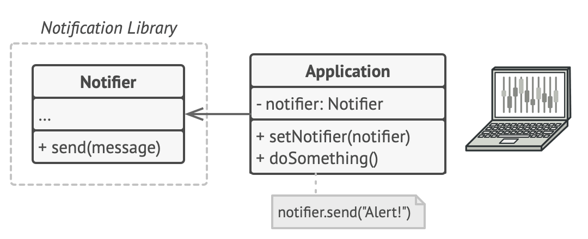
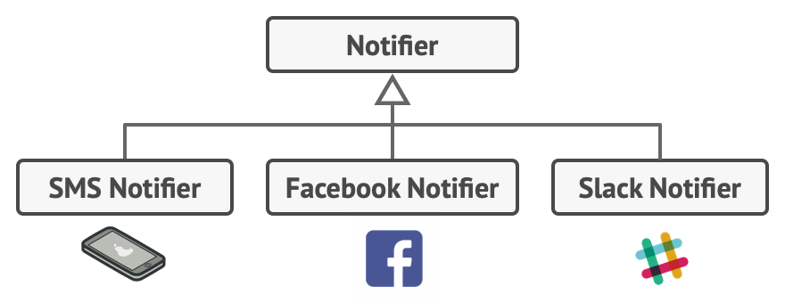
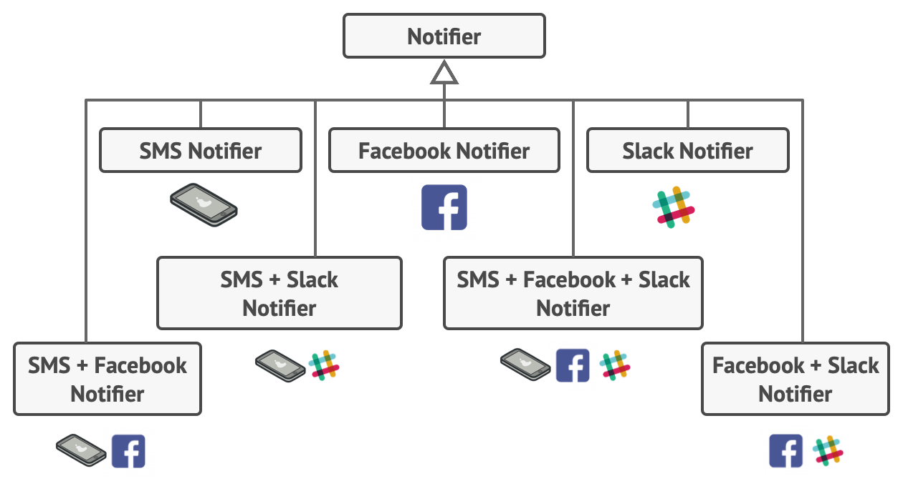
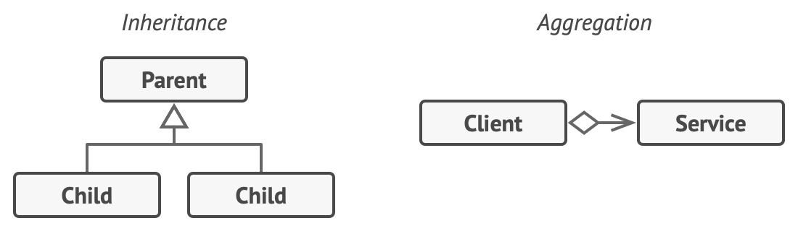
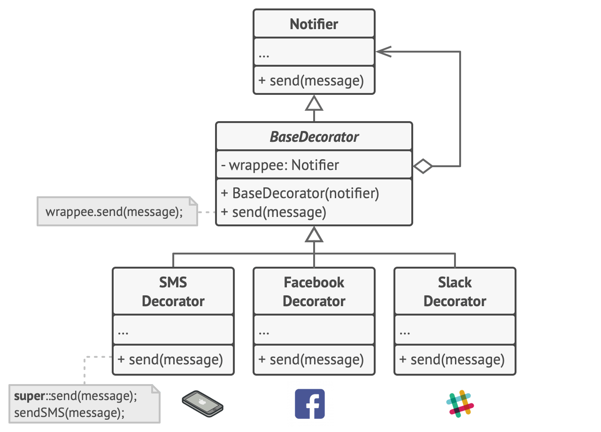
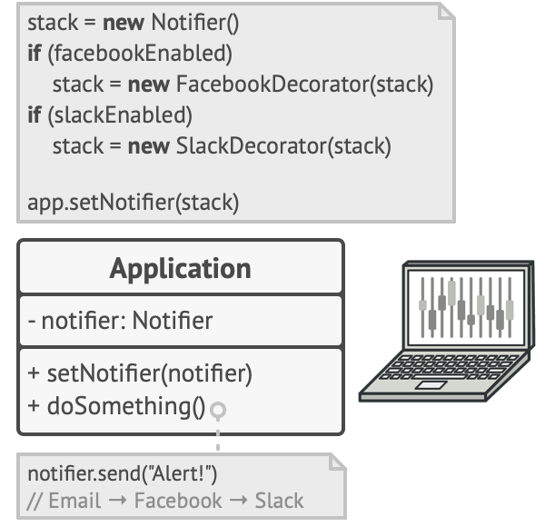
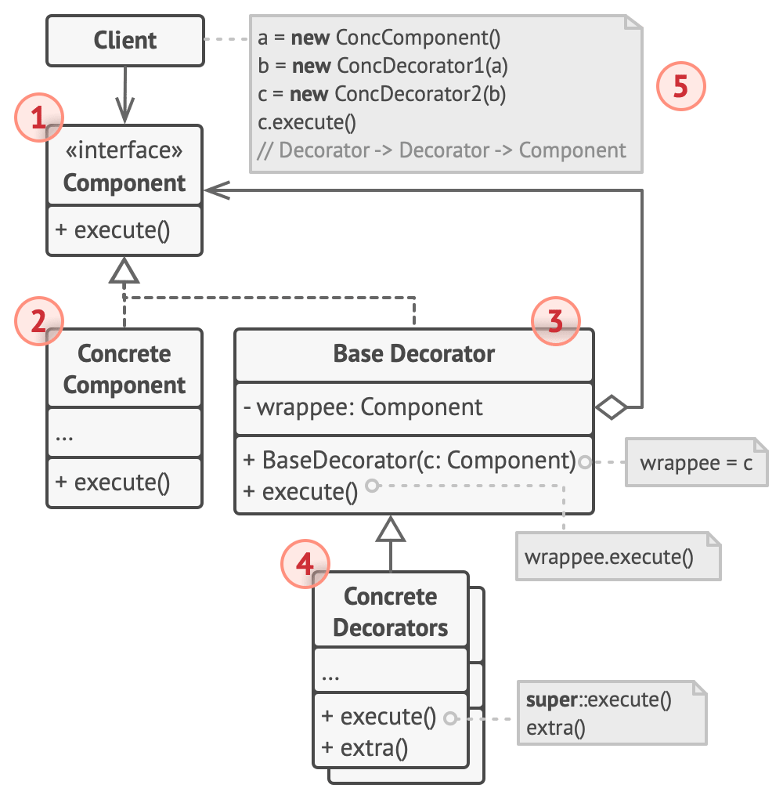
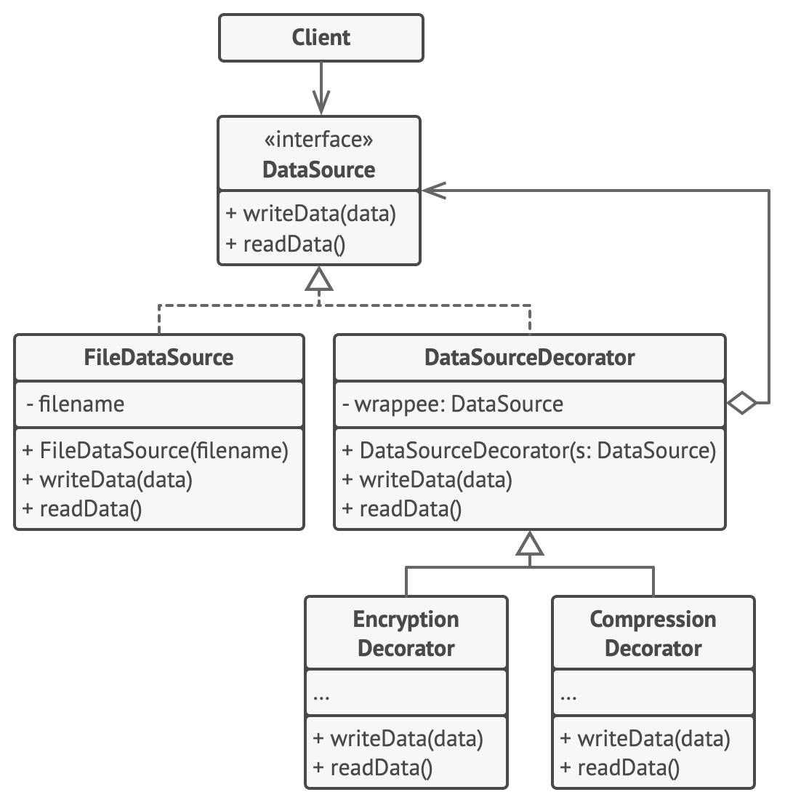

# Decorator


**Type:** Structural · **Also known as:** Wrapper

> **The 10-second version:** instead of *subclassing* to add a behaviour, you *wrap* the object in another object that has the same interface, does its own bit, and passes the call through. Wrap it again and the behaviours stack — at runtime, in whatever order you like.

<br clear="all">

## Quick card

| | |
|---|---|
| **Problem it solves** | You need N optional behaviours that can be combined freely. Doing it with inheritance needs 2^N subclasses. |
| **Core move** | A wrapper implements the same interface as the thing it wraps, holds a reference to it, and delegates — adding work before and/or after the delegation. |
| **You'll recognise it by** | A constructor that takes the *same interface the class itself implements*. `new Cache(new Retry(new HttpClient()))`. |
| **Rating** | Complexity ★★☆ · Popularity ★★☆ |
| **Closest relatives** | Proxy (same shape, controls access instead of adding features), Chain of Responsibility (may stop the call), Composite (many children instead of one), Strategy (swaps guts, not skin) |
| **In your stack** | ASP.NET Core middleware, `DelegatingHandler` on `HttpClient`, `Stream` wrappers (`GZipStream`, `CryptoStream`), Scrutor's `.Decorate<>()`, Node/Express middleware, RabbitMQ consumer pipelines (retry → dedupe → metrics → handler) |

### How to read this file

Technical first, plain English second. 🗣️ marks the plain-English version. Part 1 is Refactoring.Guru's material with their diagrams; Parts 2–7 are code, your stack, and the stuff that makes it stick.

---

# PART 1 — The pattern

## 1. Intent

**Decorator** is a structural design pattern that lets you attach new behaviors to objects by placing these objects inside special wrapper objects that contain the behaviors.


### 🗣️ In plain words

You have an object that works. You want it to do *one more thing* — log, cache, retry, compress, encrypt — without editing it and without making a subclass.

So you build a second object that looks exactly like the first from the outside (same interface), holds the first one inside it, and when someone calls a method it does its extra bit and then calls through to the one inside.

Because the wrapper looks identical to what it wraps, you can wrap the wrapper. And that one. The call travels inward through the layers, hits the real object, and travels back out. Nobody on the outside can tell how many layers there are.

---

## 2. Problem

Imagine that you’re working on a notification library which lets other programs notify their users about important events.

The initial version of the library was based on the `Notifier` class that had only a few fields, a constructor and a single `send` method. The method could accept a message argument from a client and send the message to a list of emails that were passed to the notifier via its constructor. A third-party app which acted as a client was supposed to create and configure the notifier object once, and then use it each time something important happened.



*A program could use the notifier class to send notifications about important events to a predefined set of emails.*

At some point, you realize that users of the library expect more than just email notifications. Many of them would like to receive an SMS about critical issues. Others would like to be notified on Facebook and, of course, the corporate users would love to get Slack notifications.



*Each notification type is implemented as a notifier’s subclass.*

How hard can that be? You extended the `Notifier` class and put the additional notification methods into new subclasses. Now the client was supposed to instantiate the desired notification class and use it for all further notifications.

But then someone reasonably asked you, “Why can’t you use several notification types at once? If your house is on fire, you’d probably want to be informed through every channel.”

You tried to address that problem by creating special subclasses which combined several notification methods within one class. However, it quickly became apparent that this approach would bloat the code immensely, not only the library code but the client code as well.



*Combinatorial explosion of subclasses.*

You have to find some other way to structure notifications classes so that their number won’t accidentally break some Guinness record.

### 🗣️ In plain words

Inheritance multiplies. Composition adds.

Suppose a car-listing price feed needs three optional behaviours: **caching**, **retry on transient failure**, and **audit logging**. With subclassing you end up writing every combination someone might ask for:

```csharp
// ❌ The combinatorial explosion, in miniature
class PriceFeed { }
class CachedPriceFeed : PriceFeed { }
class RetryingPriceFeed : PriceFeed { }
class AuditedPriceFeed : PriceFeed { }
class CachedRetryingPriceFeed : PriceFeed { }          // duplicate of two above
class CachedAuditedPriceFeed : PriceFeed { }           // duplicate again
class RetryingAuditedPriceFeed : PriceFeed { }         // and again
class CachedRetryingAuditedPriceFeed : PriceFeed { }   // 2^3 = 8 classes, 3 behaviours
```

Three behaviours → eight classes. A fourth behaviour (say, metrics) → sixteen. And the caching code is now physically copy-pasted into four of them, so a cache bug has to be fixed four times.

There's a second, sharper version of the problem: **inheritance is decided at compile time**. If a dealer on a paid tier should get the cached feed and a free-tier dealer shouldn't, you cannot change `CachedPriceFeed` back into a `PriceFeed` at runtime. You can only throw the object away and construct a different one — which means every call site needs to know about the whole class hierarchy.

And sometimes the base class is `sealed`/`final` and you simply cannot subclass it at all.

---

## 3. Solution

Extending a class is the first thing that comes to mind when you need to alter an object’s behavior. However, inheritance has several serious caveats that you need to be aware of.

- Inheritance is static. You can’t alter the behavior of an existing object at runtime. You can only replace the whole object with another one that’s created from a different subclass.
- Subclasses can have just one parent class. In most languages, inheritance doesn’t let a class inherit behaviors of multiple classes at the same time.

One of the ways to overcome these caveats is by using *Aggregation* or *Composition* *Aggregation*: object A contains objects B; B can live without A.
*Composition*: object A consists of objects B; A manages life cycle of B; B can’t live without A. instead of *Inheritance*. Both of the alternatives work almost the same way: one object *has a* reference to another and delegates it some work, whereas with inheritance, the object itself *is* able to do that work, inheriting the behavior from its superclass.

With this new approach you can easily substitute the linked “helper” object with another, changing the behavior of the container at runtime. An object can use the behavior of various classes, having references to multiple objects and delegating them all kinds of work. Aggregation/composition is the key principle behind many design patterns, including Decorator. On that note, let’s return to the pattern discussion.



*Inheritance vs. Aggregation*

“Wrapper” is the alternative nickname for the Decorator pattern that clearly expresses the main idea of the pattern. A *wrapper* is an object that can be linked with some *target* object. The wrapper contains the same set of methods as the target and delegates to it all requests it receives. However, the wrapper may alter the result by doing something either before or after it passes the request to the target.

When does a simple wrapper become the real decorator? As I mentioned, the wrapper implements the same interface as the wrapped object. That’s why from the client’s perspective these objects are identical. Make the wrapper’s reference field accept any object that follows that interface. This will let you cover an object in multiple wrappers, adding the combined behavior of all the wrappers to it.

In our notifications example, let’s leave the simple email notification behavior inside the base `Notifier` class, but turn all other notification methods into decorators.



*Various notification methods become decorators.*

The client code would need to wrap a basic notifier object into a set of decorators that match the client’s preferences. The resulting objects will be structured as a stack.



*Apps might configure complex stacks of notification decorators.*

The last decorator in the stack would be the object that the client actually works with. Since all decorators implement the same interface as the base notifier, the rest of the client code won’t care whether it works with the “pure” notifier object or the decorated one.

We could apply the same approach to other behaviors such as formatting messages or composing the recipient list. The client can decorate the object with any custom decorators, as long as they follow the same interface as the others.

### 🗣️ In plain words

Four mechanical moves. That's the whole pattern:

1. **Extract the interface.** Find the method(s) everyone cares about — `readData`/`writeData`, `send`, `GetPrice`. Put them in a `Component` interface. The real class implements it.
2. **Write a base wrapper that implements the same interface** and holds a `Component` field. Every method does nothing but forward: `wrappee.Send(msg)`. On its own this class is a no-op — that's the point, it's a blank canvas.
3. **Subclass the wrapper once per behaviour.** Each concrete decorator overrides a method, does its work *before* the `base.Method()` call, *after* it, or both, and always calls through.
4. **Let the client assemble the stack.** `new Encryption(new Compression(new FileDataSource("x.dat")))`. The outermost object is the one the client holds and passes around, and it is type-compatible with the bare component.

The important consequence of step 2: because the wrapper's field is typed as `Component` (not as `FileDataSource`), a wrapper can wrap another wrapper. That single typing decision is what turns "a wrapper" into "the Decorator pattern".

> **The key insight:** the decorator is *the same type as its argument*. `Component → Component`. That closure under wrapping is what makes the stacking recursive and unlimited — and it's the one line you should look for when deciding whether some code you're reading is really a Decorator.

---

## 4. Real-world analogy


*You get a combined effect from wearing multiple pieces of clothing.*

Wearing clothes is an example of using decorators. When you’re cold, you wrap yourself in a sweater. If you’re still cold with a sweater, you can wear a jacket on top. If it’s raining, you can put on a raincoat. All of these garments “extend” your basic behavior but aren’t part of you, and you can easily take off any piece of clothing whenever you don’t need it.

### 🗣️ Two more of my own

**Airport security lanes.** A passenger walks through a corridor: ID check, then the bag scanner, then the metal detector, then the boarding-pass scan at the gate. Each station does its own thing and then waves you on to the next; none of them knows or cares what the others do. Add a random-swab station tomorrow and nothing else in the corridor changes. Crucially, each station hands you back to the corridor — it's not allowed to be the end of the line.

**A courier repacking a parcel.** You hand over a book. The courier puts it in a padded envelope, then a waterproof sleeve, then a cardboard box with a shipping label. At the other end each layer comes off in reverse order and the book inside is untouched. Every layer has the same shape from the outside — "a thing you can carry and address" — which is exactly why the next layer can wrap it without knowing what's already inside.

---

## 5. Structure



1. The **Component** declares the common interface for both wrappers and wrapped objects.
2. **Concrete Component** is a class of objects being wrapped. It defines the basic behavior, which can be altered by decorators.
3. The **Base Decorator** class has a field for referencing a wrapped object. The field’s type should be declared as the component interface so it can contain both concrete components and decorators. The base decorator delegates all operations to the wrapped object.
4. **Concrete Decorators** define extra behaviors that can be added to components dynamically. Concrete decorators override methods of the base decorator and execute their behavior either before or after calling the parent method.
5. The **Client** can wrap components in multiple layers of decorators, as long as it works with all objects via the component interface.

### 🗣️ Participants & roles — cheat table

| Role | What it is in code | Example from the site | Equivalent in your stack |
|---|---|---|---|
| **Component** | The interface everyone — real thing *and* wrappers — implements | `DataSource` (`writeData`, `readData`) | `IPriceProvider`, `IMessageHandler`, `System.IO.Stream`, an Express `RequestHandler` |
| **Concrete Component** | The one class that actually does the real work | `FileDataSource` | `SqlPriceRepository`, `FileStream`, your terminal route handler |
| **Base Decorator** | Implements Component, holds a `Component` field, forwards everything unchanged | `DataSourceDecorator` with `protected wrappee` | An abstract `PriceProviderDecorator`, `DelegatingHandler` in `System.Net.Http` |
| **Concrete Decorator** | Extends Base Decorator, overrides a method, does work before/after `base.X()` | `EncryptionDecorator`, `CompressionDecorator` | `CachingPriceProvider`, `RetryHandler`, `GZipStream`, a `logging` middleware |
| **Client** | Builds the stack and then forgets about it — it only sees `Component` | `ApplicationConfigurator` / `SalaryManager` | Your DI registration (Program.cs), your consumer bootstrap, `app.use(...)` chain |

Note `SalaryManager` in the pseudocode: it takes a `DataSource` in its constructor and has **no idea** whether it got a bare file source or a three-layer stack. That's the payoff — the client of the client is completely insulated.

### 🤝 Collaboration — who calls whom

```
  Client
    │  holds ONE reference: the outermost wrapper
    ▼
┌──────────────────────────────────────────────────────────┐
│ EncryptionDecorator                 (Concrete Decorator) │
│   writeData(d):                                          │
│     d = encrypt(d)              ── work BEFORE           │
│     ├──────────────► base.writeData(d)                   │
│     │                  └─► wrappee.writeData(d)  ────┐   │
│     │                                                │   │
│ ┌────────────────────────────────────────────────────▼─┐ │
│ │ CompressionDecorator            (Concrete Decorator) │ │
│ │   writeData(d):                                      │ │
│ │     d = compress(d)         ── work BEFORE           │ │
│ │     ├──────────► base.writeData(d) ──────────────┐   │ │
│ │ ┌────────────────────────────────────────────────▼┐  │ │
│ │ │ FileDataSource             (Concrete Component) │  │ │
│ │ │   writeData(d): fwrite(d)   ── THE REAL WORK    │  │ │
│ │ └─────────────────────────────────────────────────┘  │ │
│ └──────────────────────────────────────────────────────┘ │
└──────────────────────────────────────────────────────────┘

READ path runs the same stack but the work happens AFTER the call returns:

  read()  →  Encryption  →  Compression  →  FileDataSource
                                                 │ raw bytes
             decrypt ◄──── decompress ◄──────────┘
             (after)        (after)

  Net effect: write = encrypt∘compress∘store,  read = decrypt∘decompress∘load.
  The layers unwind in exactly reverse order, which is why symmetric
  transforms compose correctly for free.
```

**The single most important hop:** `wrappee.writeData(d)` inside the base decorator. The field is typed `DataSource`, not `FileDataSource` — so the thing on the other end of that call may itself be another decorator. Change that field's type to the concrete class and the pattern collapses into a plain one-level wrapper.

---

## 6. Pseudocode (the website's example)

In this example, the **Decorator** pattern lets you compress and encrypt sensitive data independently from the code that actually uses this data.



*The encryption and compression decorators example.*

The application wraps the data source object with a pair of decorators. Both wrappers change the way the data is written to and read from the disk:

- Just before the data is **written to disk**, the decorators encrypt and compress it. The original class writes the encrypted and protected data to the file without knowing about the change.
- Right after the data is **read from disk**, it goes through the same decorators, which decompress and decode it.

The decorators and the data source class implement the same interface, which makes them all interchangeable in the client code.

```
// The component interface defines operations that can be
// altered by decorators.
interface DataSource is
    method writeData(data)
    method readData():data

// Concrete components provide default implementations for the
// operations. There might be several variations of these
// classes in a program.
class FileDataSource implements DataSource is
    constructor FileDataSource(filename) { ... }

    method writeData(data) is
        // Write data to file.

    method readData():data is
        // Read data from file.

// The base decorator class follows the same interface as the
// other components. The primary purpose of this class is to
// define the wrapping interface for all concrete decorators.
// The default implementation of the wrapping code might include
// a field for storing a wrapped component and the means to
// initialize it.
class DataSourceDecorator implements DataSource is
    protected field wrappee: DataSource

    constructor DataSourceDecorator(source: DataSource) is
        wrappee = source

    // The base decorator simply delegates all work to the
    // wrapped component. Extra behaviors can be added in
    // concrete decorators.
    method writeData(data) is
        wrappee.writeData(data)

    // Concrete decorators may call the parent implementation of
    // the operation instead of calling the wrapped object
    // directly. This approach simplifies extension of decorator
    // classes.
    method readData():data is
        return wrappee.readData()

// Concrete decorators must call methods on the wrapped object,
// but may add something of their own to the result. Decorators
// can execute the added behavior either before or after the
// call to a wrapped object.
class EncryptionDecorator extends DataSourceDecorator is
    method writeData(data) is
        // 1. Encrypt passed data.
        // 2. Pass encrypted data to the wrappee's writeData
        // method.

    method readData():data is
        // 1. Get data from the wrappee's readData method.
        // 2. Try to decrypt it if it's encrypted.
        // 3. Return the result.

// You can wrap objects in several layers of decorators.
class CompressionDecorator extends DataSourceDecorator is
    method writeData(data) is
        // 1. Compress passed data.
        // 2. Pass compressed data to the wrappee's writeData
        // method.

    method readData():data is
        // 1. Get data from the wrappee's readData method.
        // 2. Try to decompress it if it's compressed.
        // 3. Return the result.

// Option 1. A simple example of a decorator assembly.
class Application is
    method dumbUsageExample() is
        source = new FileDataSource("somefile.dat")
        source.writeData(salaryRecords)
        // The target file has been written with plain data.

        source = new CompressionDecorator(source)
        source.writeData(salaryRecords)
        // The target file has been written with compressed
        // data.

        source = new EncryptionDecorator(source)
        // The source variable now contains this:
        // Encryption > Compression > FileDataSource
        source.writeData(salaryRecords)
        // The file has been written with compressed and
        // encrypted data.

// Option 2. Client code that uses an external data source.
// SalaryManager objects neither know nor care about data
// storage specifics. They work with a pre-configured data
// source received from the app configurator.
class SalaryManager is
    field source: DataSource

    constructor SalaryManager(source: DataSource) { ... }

    method load() is
        return source.readData()

    method save() is
        source.writeData(salaryRecords)
    // ...Other useful methods...

// The app can assemble different stacks of decorators at
// runtime, depending on the configuration or environment.
class ApplicationConfigurator is
    method configurationExample() is
        source = new FileDataSource("salary.dat")
        if (enabledEncryption)
            source = new EncryptionDecorator(source)
        if (enabledCompression)
            source = new CompressionDecorator(source)

        logger = new SalaryManager(source)
        salary = logger.load()
    // ...
```

### 🗣️ Reading that pseudocode

- **`class DataSourceDecorator implements DataSource is / protected field wrappee: DataSource`** — this is the pattern, compressed to two lines. It implements the interface *and* holds the interface. Everything else is detail.
- **The base decorator's `writeData` is a pure pass-through.** It looks pointless. It isn't: it means a concrete decorator that only cares about reading can override `readData` alone and get correct write behaviour for free. Without it every decorator would have to implement every method.
- **The comment "Concrete decorators may call the parent implementation instead of calling the wrapped object directly."** Prefer `base.writeData(d)` over `wrappee.writeData(d)` in concrete decorators. It's one indirection more, but it means if you later add cross-cutting logic to the base decorator (timing, tracing), every concrete decorator picks it up automatically.
- **`dumbUsageExample()` reassigns the same variable:** `source = new CompressionDecorator(source)`. That reassignment is the visual signature of the pattern — the variable keeps its type and grows a layer. If you can write `x = new Something(x)` and it compiles, you're looking at a decorator.
- **The write path encrypts *then* delegates; the read path delegates *then* decrypts.** Order matters and it is not symmetric within a single decorator — it's symmetric across the stack. Get this backwards and you'll try to decompress ciphertext.
- **`ApplicationConfigurator` is the real lesson.** Two `if` statements build four different pipelines. Compare with the subclass approach, which would need four classes and a `switch`. The configuration *is* the composition.
- **`SalaryManager` never appears in the wrapping code.** It takes a `DataSource` and calls `readData()`. This is the acceptance test for a correct Decorator: business code compiles and runs identically against a bare component and a ten-layer stack.

---

## 7. Applicability — when to reach for it

**Use the Decorator pattern when you need to be able to assign extra behaviors to objects at runtime without breaking the code that uses these objects.**

The Decorator lets you structure your business logic into layers, create a decorator for each layer and compose objects with various combinations of this logic at runtime. The client code can treat all these objects in the same way, since they all follow a common interface.

**Use the pattern when it’s awkward or not possible to extend an object’s behavior using inheritance.**

Many programming languages have the `final` keyword that can be used to prevent further extension of a class. For a final class, the only way to reuse the existing behavior would be to wrap the class with your own wrapper, using the Decorator pattern.

### ✅ Quick checklist

- [ ] Do I have **two or more optional behaviours** that customers/config can turn on independently?
- [ ] Would writing them as subclasses produce class names containing two nouns joined by "And" or three adjectives?
- [ ] Do the behaviours **all preserve the same interface** — nothing needs a new method or a different return shape?
- [ ] Does the **order** of the behaviours matter in a way I can reason about (compress-then-encrypt vs encrypt-then-compress)?
- [ ] Do I need to decide the combination **at runtime** — per tenant, per feature flag, per environment?
- [ ] Is the class I want to extend `sealed`/`final`, third-party, or otherwise not mine to edit?

Four or more ticks → Decorator. One or two → just write the code inline; you're inventing ceremony.

---

## 8. How to implement — step by step

1. Make sure your business domain can be represented as a primary component with multiple optional layers over it.
2. Figure out what methods are common to both the primary component and the optional layers. Create a component interface and declare those methods there.
3. Create a concrete component class and define the base behavior in it.
4. Create a base decorator class. It should have a field for storing a reference to a wrapped object. The field should be declared with the component interface type to allow linking to concrete components as well as decorators. The base decorator must delegate all work to the wrapped object.
5. Make sure all classes implement the component interface.
6. Create concrete decorators by extending them from the base decorator. A concrete decorator must execute its behavior before or after the call to the parent method (which always delegates to the wrapped object).
7. The client code must be responsible for creating decorators and composing them in the way the client needs.

### 🗣️ The same steps, blunt version

1. Find the one object doing the real work. That's your Concrete Component.
2. Write down the methods callers actually use. That's your `Component` interface. Keep it small — every method you add is a method every future decorator must think about.
3. Make the real class implement the interface. Don't change its behaviour.
4. Write an abstract `XDecorator : IX` with a `protected readonly IX _inner` and one forwarding line per method. Zero logic.
5. For each behaviour, subclass the base decorator, override the method(s) you care about, put your code before and/or after `base.Method(...)`, and **always call through**. A decorator that swallows the call is a Chain of Responsibility handler, not a decorator.
6. Move all `new` calls into one composition point — DI container registration, a factory, a config reader. Never scatter wrapping across the codebase.
7. Verify: delete the whole stack, pass the bare component, and check the business code still compiles and passes its tests. If it doesn't, your decorator leaked.

---

## 9. Pros and cons

- ✅ You can extend an object’s behavior without making a new subclass.
- ✅ You can add or remove responsibilities from an object at runtime.
- ✅ You can combine several behaviors by wrapping an object into multiple decorators.
- ✅ *Single Responsibility Principle*. You can divide a monolithic class that implements many possible variants of behavior into several smaller classes.

- ⛔ It’s hard to remove a specific wrapper from the wrappers stack.
- ⛔ It’s hard to implement a decorator in such a way that its behavior doesn’t depend on the order in the decorators stack.
- ⛔ The initial configuration code of layers might look pretty ugly.

### ⚖️ Honest trade-offs from the trenches

**The true cost is debuggability, not class count.** Nobody minds four extra small classes. What hurts is the stack trace: eight frames of `XDecorator.Handle` before you reach the line that threw, and an object graph in the debugger that's a Russian doll of `_inner._inner._inner`. Mitigate it by giving every decorator a meaningful `ToString()` that prints its own name plus the inner one — `"Retry(Cache(SqlPriceRepository))"` in a log line saves you twenty minutes on a bad day.

**The tell that it's worth it** is when the wrapping decision lives in *configuration* rather than in code. If you can honestly write `if (options.EnableCaching) svc = new CachingX(svc);` and that condition genuinely varies — per environment, per tenant, per feature flag — Decorator is earning its keep. If the answer is always "yes, always wrapped, everywhere", you've built an indirection to express a fact; put the behaviour in the class and move on.

**The order trap is the real bug factory.** Cache-outside-retry caches the value and never retries; retry-outside-cache retries around a cache lookup and hammers the origin on a cache miss storm. Those two stacks are one line apart and behave completely differently under load. Write the intended order down as a comment *at the composition point*, and if the order is load-bearing, add a test that asserts it (count origin hits with a fake).

**What you get free in modern C#/TS — use it before hand-rolling.** In C#: `System.IO.Stream` is already a decorator framework (`GZipStream`, `CryptoStream`, `BufferedStream` all wrap a `Stream`); `DelegatingHandler` is the official decorator for `HttpClient`; ASP.NET Core middleware is Decorator with a `Func<RequestDelegate, RequestDelegate>` instead of a class; and **Scrutor**'s `services.Decorate<IFoo, CachingFoo>()` wires decorators through the DI container in one line instead of writing factory lambdas. In TypeScript: higher-order functions *are* decorators when the component interface has one method — `const withRetry = (f: Fetch): Fetch => async (...a) => {...}` is the whole pattern in three lines, no classes. Reach for classes only when the interface has several methods. (TypeScript's `@decorator` syntax is a different thing entirely — see Part 5.)

---

## 10. Relations with other patterns

- [Adapter](https://refactoring.guru/design-patterns/adapter) provides a completely different interface for accessing an existing object. On the other hand, with the [Decorator](https://refactoring.guru/design-patterns/decorator) pattern the interface either stays the same or gets extended. In addition, *Decorator* supports recursive composition, which isn’t possible when you use *Adapter*.
- With [Adapter](https://refactoring.guru/design-patterns/adapter) you access an existing object via different interface. With [Proxy](https://refactoring.guru/design-patterns/proxy), the interface stays the same. With [Decorator](https://refactoring.guru/design-patterns/decorator) you access the object via an enhanced interface.
- [Chain of Responsibility](https://refactoring.guru/design-patterns/chain-of-responsibility) and [Decorator](https://refactoring.guru/design-patterns/decorator) have very similar class structures. Both patterns rely on recursive composition to pass the execution through a series of objects. However, there are several crucial differences.

  The *CoR* handlers can execute arbitrary operations independently of each other. They can also stop passing the request further at any point. On the other hand, various *Decorators* can extend the object’s behavior while keeping it consistent with the base interface. In addition, decorators aren’t allowed to break the flow of the request.
- [Composite](https://refactoring.guru/design-patterns/composite) and [Decorator](https://refactoring.guru/design-patterns/decorator) have similar structure diagrams since both rely on recursive composition to organize an open-ended number of objects.

  A *Decorator* is like a *Composite* but only has one child component. There’s another significant difference: *Decorator* adds additional responsibilities to the wrapped object, while *Composite* just “sums up” its children’s results.

  However, the patterns can also cooperate: you can use *Decorator* to extend the behavior of a specific object in the *Composite* tree.
- Designs that make heavy use of [Composite](https://refactoring.guru/design-patterns/composite) and [Decorator](https://refactoring.guru/design-patterns/decorator) can often benefit from using [Prototype](https://refactoring.guru/design-patterns/prototype). Applying the pattern lets you clone complex structures instead of re-constructing them from scratch.
- [Decorator](https://refactoring.guru/design-patterns/decorator) lets you change the skin of an object, while [Strategy](https://refactoring.guru/design-patterns/strategy) lets you change the guts.
- [Decorator](https://refactoring.guru/design-patterns/decorator) and [Proxy](https://refactoring.guru/design-patterns/proxy) have similar structures, but very different intents. Both patterns are built on the composition principle, where one object is supposed to delegate some of the work to another. The difference is that a *Proxy* usually manages the life cycle of its service object on its own, whereas the composition of *Decorators* is always controlled by the client.

### 🗣️ Disambiguation table

| Pattern | Same interface? | How many inner objects? | May it stop the call? | Who controls the wrapping? | One-line separator |
|---|---|---|---|---|---|
| **Decorator** | Yes — same or extended | Exactly **one** | **No** — must delegate | The **client** builds the stack | *Adds behaviour.* |
| **Proxy** | Yes — identical | Exactly one | Sometimes (lazy, guard) | The **proxy** usually owns/creates the subject | *Controls access.* |
| **Adapter** | **No** — different interface | One | n/a | The client | *Changes the plug shape.* |
| **Chain of Responsibility** | Yes | One (`next`) | **Yes** — that's its job | The client builds the chain | *Finds a handler.* |
| **Composite** | Yes | **Many** children | No | The client builds the tree | *Sums up children.* |
| **Strategy** | No — component *holds* a strategy | One, but not same type | n/a | The context | *Swaps an algorithm.* |

**The separators worth memorising:**

- ***Decorator adds a feature; Proxy adds a gatekeeper.*** Ask "does the caller get more capability, or just more control?" Also: you hand a decorator its inner object, a proxy usually makes its own.
- ***Decorator must pass the call on; Chain of Responsibility is allowed to eat it.*** Identical UML, opposite contracts.
- ***Decorator has one child; Composite has many.*** A decorator with a list is a Composite wearing a disguise.
- ***Decorator changes the skin; Strategy changes the guts.*** (Straight from the site, and it's the best one-liner in the whole catalogue.)

---

# PART 2 — Official code examples from Refactoring.Guru

## 2.1 C#

**Complexity:** ★★☆ (2/3)

**Popularity:** ★★☆ (2/3)

**Usage examples:** The Decorator is pretty standard in C# code, especially in code related to streams.

**Identification:** Decorator can be recognized by creation methods or constructors that accept objects of the same class or interface as a current class.

### Conceptual Example

This example illustrates the structure of the **Decorator** design pattern. It focuses on answering these questions:

- What classes does it consist of?
- What roles do these classes play?
- In what way the elements of the pattern are related?

##### **Program.cs:** Conceptual example

```csharp
using System;

namespace RefactoringGuru.DesignPatterns.Composite.Conceptual
{
    // The base Component interface defines operations that can be altered by
    // decorators.
    public abstract class Component
    {
        public abstract string Operation();
    }

    // Concrete Components provide default implementations of the operations.
    // There might be several variations of these classes.
    class ConcreteComponent : Component
    {
        public override string Operation()
        {
            return "ConcreteComponent";
        }
    }

    // The base Decorator class follows the same interface as the other
    // components. The primary purpose of this class is to define the wrapping
    // interface for all concrete decorators. The default implementation of the
    // wrapping code might include a field for storing a wrapped component and
    // the means to initialize it.
    abstract class Decorator : Component
    {
        protected Component _component;

        public Decorator(Component component)
        {
            this._component = component;
        }

        public void SetComponent(Component component)
        {
            this._component = component;
        }

        // The Decorator delegates all work to the wrapped component.
        public override string Operation()
        {
            if (this._component != null)
            {
                return this._component.Operation();
            }
            else
            {
                return string.Empty;
            }
        }
    }

    // Concrete Decorators call the wrapped object and alter its result in some
    // way.
    class ConcreteDecoratorA : Decorator
    {
        public ConcreteDecoratorA(Component comp) : base(comp)
        {
        }

        // Decorators may call parent implementation of the operation, instead
        // of calling the wrapped object directly. This approach simplifies
        // extension of decorator classes.
        public override string Operation()
        {
            return $"ConcreteDecoratorA({base.Operation()})";
        }
    }

    // Decorators can execute their behavior either before or after the call to
    // a wrapped object.
    class ConcreteDecoratorB : Decorator
    {
        public ConcreteDecoratorB(Component comp) : base(comp)
        {
        }

        public override string Operation()
        {
            return $"ConcreteDecoratorB({base.Operation()})";
        }
    }

    public class Client
    {
        // The client code works with all objects using the Component interface.
        // This way it can stay independent of the concrete classes of
        // components it works with.
        public void ClientCode(Component component)
        {
            Console.WriteLine("RESULT: " + component.Operation());
        }
    }

    class Program
    {
        static void Main(string[] args)
        {
            Client client = new Client();

            var simple = new ConcreteComponent();
            Console.WriteLine("Client: I get a simple component:");
            client.ClientCode(simple);
            Console.WriteLine();

            // ...as well as decorated ones.
            //
            // Note how decorators can wrap not only simple components but the
            // other decorators as well.
            ConcreteDecoratorA decorator1 = new ConcreteDecoratorA(simple);
            ConcreteDecoratorB decorator2 = new ConcreteDecoratorB(decorator1);
            Console.WriteLine("Client: Now I've got a decorated component:");
            client.ClientCode(decorator2);
        }
    }
}
```

##### **Output.txt:** Execution result

```output
Client: I get a simple component:
RESULT: ConcreteComponent

Client: Now I've got a decorated component:
RESULT: ConcreteDecoratorB(ConcreteDecoratorA(ConcreteComponent))
```

## 2.2 TypeScript

**Complexity:** ★★☆ (2/3)

**Popularity:** ★★☆ (2/3)

**Usage examples:** The Decorator is pretty standard in TypeScript code, especially in code related to streams.

**Identification:** Decorator can be recognized by creation methods or constructors that accept objects of the same class or interface as a current class.

### Conceptual Example

This example illustrates the structure of the **Decorator** design pattern and focuses on the following questions:

- What classes does it consist of?
- What roles do these classes play?
- In what way the elements of the pattern are related?

##### **index.ts:** Conceptual example

```typescript
/**
 * The base Component interface defines operations that can be altered by
 * decorators.
 */
interface Component {
    operation(): string;
}

/**
 * Concrete Components provide default implementations of the operations. There
 * might be several variations of these classes.
 */
class ConcreteComponent implements Component {
    public operation(): string {
        return 'ConcreteComponent';
    }
}

/**
 * The base Decorator class follows the same interface as the other components.
 * The primary purpose of this class is to define the wrapping interface for all
 * concrete decorators. The default implementation of the wrapping code might
 * include a field for storing a wrapped component and the means to initialize
 * it.
 */
class Decorator implements Component {
    protected component: Component;

    constructor(component: Component) {
        this.component = component;
    }

    /**
     * The Decorator delegates all work to the wrapped component.
     */
    public operation(): string {
        return this.component.operation();
    }
}

/**
 * Concrete Decorators call the wrapped object and alter its result in some way.
 */
class ConcreteDecoratorA extends Decorator {
    /**
     * Decorators may call parent implementation of the operation, instead of
     * calling the wrapped object directly. This approach simplifies extension
     * of decorator classes.
     */
    public operation(): string {
        return `ConcreteDecoratorA(${super.operation()})`;
    }
}

/**
 * Decorators can execute their behavior either before or after the call to a
 * wrapped object.
 */
class ConcreteDecoratorB extends Decorator {
    public operation(): string {
        return `ConcreteDecoratorB(${super.operation()})`;
    }
}

/**
 * The client code works with all objects using the Component interface. This
 * way it can stay independent of the concrete classes of components it works
 * with.
 */
function clientCode(component: Component) {
    // ...

    console.log(`RESULT: ${component.operation()}`);

    // ...
}

/**
 * This way the client code can support both simple components...
 */
const simple = new ConcreteComponent();
console.log('Client: I\'ve got a simple component:');
clientCode(simple);
console.log('');

/**
 * ...as well as decorated ones.
 *
 * Note how decorators can wrap not only simple components but the other
 * decorators as well.
 */
const decorator1 = new ConcreteDecoratorA(simple);
const decorator2 = new ConcreteDecoratorB(decorator1);
console.log('Client: Now I\'ve got a decorated component:');
clientCode(decorator2);
```

##### **Output.txt:** Execution result

```output
Client: I've got a simple component:
RESULT: ConcreteComponent

Client: Now I've got a decorated component:
RESULT: ConcreteDecoratorB(ConcreteDecoratorA(ConcreteComponent))
```

## 2.3 C++

**Complexity:** ★★☆ (2/3)

**Popularity:** ★★☆ (2/3)

**Usage examples:** The Decorator is pretty standard in C++ code, especially in code related to streams.

**Identification:** Decorator can be recognized by creation methods or constructors that accept objects of the same class or interface as a current class.

### Conceptual Example

This example illustrates the structure of the **Decorator** design pattern. It focuses on answering these questions:

- What classes does it consist of?
- What roles do these classes play?
- In what way the elements of the pattern are related?

##### **main.cc:** Conceptual example

```cpp
/**
 * The base Component interface defines operations that can be altered by
 * decorators.
 */
class Component {
 public:
  virtual ~Component() {}
  virtual std::string Operation() const = 0;
};
/**
 * Concrete Components provide default implementations of the operations. There
 * might be several variations of these classes.
 */
class ConcreteComponent : public Component {
 public:
  std::string Operation() const override {
    return "ConcreteComponent";
  }
};
/**
 * The base Decorator class follows the same interface as the other components.
 * The primary purpose of this class is to define the wrapping interface for all
 * concrete decorators. The default implementation of the wrapping code might
 * include a field for storing a wrapped component and the means to initialize
 * it.
 */
class Decorator : public Component {
  /**
   * @var Component
   */
 protected:
  Component* component_;

 public:
  Decorator(Component* component) : component_(component) {
  }
  /**
   * The Decorator delegates all work to the wrapped component.
   */
  std::string Operation() const override {
    return this->component_->Operation();
  }
};
/**
 * Concrete Decorators call the wrapped object and alter its result in some way.
 */
class ConcreteDecoratorA : public Decorator {
  /**
   * Decorators may call parent implementation of the operation, instead of
   * calling the wrapped object directly. This approach simplifies extension of
   * decorator classes.
   */
 public:
  ConcreteDecoratorA(Component* component) : Decorator(component) {
  }
  std::string Operation() const override {
    return "ConcreteDecoratorA(" + Decorator::Operation() + ")";
  }
};
/**
 * Decorators can execute their behavior either before or after the call to a
 * wrapped object.
 */
class ConcreteDecoratorB : public Decorator {
 public:
  ConcreteDecoratorB(Component* component) : Decorator(component) {
  }

  std::string Operation() const override {
    return "ConcreteDecoratorB(" + Decorator::Operation() + ")";
  }
};
/**
 * The client code works with all objects using the Component interface. This
 * way it can stay independent of the concrete classes of components it works
 * with.
 */
void ClientCode(Component* component) {
  // ...
  std::cout << "RESULT: " << component->Operation();
  // ...
}

int main() {
  /**
   * This way the client code can support both simple components...
   */
  Component* simple = new ConcreteComponent;
  std::cout << "Client: I've got a simple component:\n";
  ClientCode(simple);
  std::cout << "\n\n";
  /**
   * ...as well as decorated ones.
   *
   * Note how decorators can wrap not only simple components but the other
   * decorators as well.
   */
  Component* decorator1 = new ConcreteDecoratorA(simple);
  Component* decorator2 = new ConcreteDecoratorB(decorator1);
  std::cout << "Client: Now I've got a decorated component:\n";
  ClientCode(decorator2);
  std::cout << "\n";

  delete simple;
  delete decorator1;
  delete decorator2;

  return 0;
}
```

##### **Output.txt:** Execution result

```output
Client: I've got a simple component:
RESULT: ConcreteComponent

Client: Now I've got a decorated component:
RESULT: ConcreteDecoratorB(ConcreteDecoratorA(ConcreteComponent))
```

## 2.4 Java

**Complexity:** ★★☆ (2/3)

**Popularity:** ★★☆ (2/3)

**Usage examples:** The Decorator is pretty standard in Java code, especially in code related to streams.

**Identification:** Decorator can be recognized by creation methods or constructors that accept objects of the same class or interface as a current class.

### Encoding and compression decorators

This example shows how you can adjust the behavior of an object without changing its code.

Initially, the business logic class could only read and write data in plain text. Then we created several small wrapper classes that add new behavior after executing standard operations in a wrapped object.

The first wrapper encrypts and decrypts data, and the second one compresses and extracts data.

You can even combine these wrappers by wrapping one decorator with another.

#### **decorators**

##### **decorators/DataSource.java:** A common data interface, which defines read and write operations

```java
package refactoring_guru.decorator.example.decorators;

public interface DataSource {
    void writeData(String data);

    String readData();
}
```

##### **decorators/FileDataSource.java:** Simple data reader-writer

```java
package refactoring_guru.decorator.example.decorators;

import java.io.*;

public class FileDataSource implements DataSource {
    private String name;

    public FileDataSource(String name) {
        this.name = name;
    }

    @Override
    public void writeData(String data) {
        File file = new File(name);
        try (OutputStream fos = new FileOutputStream(file)) {
            fos.write(data.getBytes(), 0, data.length());
        } catch (IOException ex) {
            System.out.println(ex.getMessage());
        }
    }

    @Override
    public String readData() {
        char[] buffer = null;
        File file = new File(name);
        try (FileReader reader = new FileReader(file)) {
            buffer = new char[(int) file.length()];
            reader.read(buffer);
        } catch (IOException ex) {
            System.out.println(ex.getMessage());
        }
        return new String(buffer);
    }
}
```

##### **decorators/DataSourceDecorator.java:** Abstract base decorator

```java
package refactoring_guru.decorator.example.decorators;

public abstract class DataSourceDecorator implements DataSource {
    private DataSource wrappee;

    DataSourceDecorator(DataSource source) {
        this.wrappee = source;
    }

    @Override
    public void writeData(String data) {
        wrappee.writeData(data);
    }

    @Override
    public String readData() {
        return wrappee.readData();
    }
}
```

##### **decorators/EncryptionDecorator.java:** Encryption decorator

```java
package refactoring_guru.decorator.example.decorators;

import java.util.Base64;

public class EncryptionDecorator extends DataSourceDecorator {

    public EncryptionDecorator(DataSource source) {
        super(source);
    }

    @Override
    public void writeData(String data) {
        super.writeData(encode(data));
    }

    @Override
    public String readData() {
        return decode(super.readData());
    }

    private String encode(String data) {
        byte[] result = data.getBytes();
        for (int i = 0; i < result.length; i++) {
            result[i] += (byte) 1;
        }
        return Base64.getEncoder().encodeToString(result);
    }

    private String decode(String data) {
        byte[] result = Base64.getDecoder().decode(data);
        for (int i = 0; i < result.length; i++) {
            result[i] -= (byte) 1;
        }
        return new String(result);
    }
}
```

##### **decorators/CompressionDecorator.java:** Compression decorator

```java
package refactoring_guru.decorator.example.decorators;

import java.io.ByteArrayInputStream;
import java.io.ByteArrayOutputStream;
import java.io.IOException;
import java.io.InputStream;
import java.util.Base64;
import java.util.zip.Deflater;
import java.util.zip.DeflaterOutputStream;
import java.util.zip.InflaterInputStream;

public class CompressionDecorator extends DataSourceDecorator {
    private int compLevel = 6;

    public CompressionDecorator(DataSource source) {
        super(source);
    }

    public int getCompressionLevel() {
        return compLevel;
    }

    public void setCompressionLevel(int value) {
        compLevel = value;
    }

    @Override
    public void writeData(String data) {
        super.writeData(compress(data));
    }

    @Override
    public String readData() {
        return decompress(super.readData());
    }

    private String compress(String stringData) {
        byte[] data = stringData.getBytes();
        try {
            ByteArrayOutputStream bout = new ByteArrayOutputStream(512);
            DeflaterOutputStream dos = new DeflaterOutputStream(bout, new Deflater(compLevel));
            dos.write(data);
            dos.close();
            bout.close();
            return Base64.getEncoder().encodeToString(bout.toByteArray());
        } catch (IOException ex) {
            return null;
        }
    }

    private String decompress(String stringData) {
        byte[] data = Base64.getDecoder().decode(stringData);
        try {
            InputStream in = new ByteArrayInputStream(data);
            InflaterInputStream iin = new InflaterInputStream(in);
            ByteArrayOutputStream bout = new ByteArrayOutputStream(512);
            int b;
            while ((b = iin.read()) != -1) {
                bout.write(b);
            }
            in.close();
            iin.close();
            bout.close();
            return new String(bout.toByteArray());
        } catch (IOException ex) {
            return null;
        }
    }
}
```

##### **Demo.java:** Client code

```java
package refactoring_guru.decorator.example;

import refactoring_guru.decorator.example.decorators.*;

public class Demo {
    public static void main(String[] args) {
        String salaryRecords = "Name,Salary\nJohn Smith,100000\nSteven Jobs,912000";
        DataSourceDecorator encoded = new CompressionDecorator(
                                         new EncryptionDecorator(
                                             new FileDataSource("out/OutputDemo.txt")));
        encoded.writeData(salaryRecords);
        DataSource plain = new FileDataSource("out/OutputDemo.txt");

        System.out.println("- Input ----------------");
        System.out.println(salaryRecords);
        System.out.println("- Encoded --------------");
        System.out.println(plain.readData());
        System.out.println("- Decoded --------------");
        System.out.println(encoded.readData());
    }
}
```

##### **OutputDemo.txt:** Execution result

```output
- Input ----------------
Name,Salary
John Smith,100000
Steven Jobs,912000
- Encoded --------------
Zkt7e1Q5eU8yUm1Qe0ZsdHJ2VXp6dDBKVnhrUHtUe0sxRUYxQkJIdjVLTVZ0dVI5Q2IwOXFISmVUMU5rcENCQmdxRlByaD4+
- Decoded --------------
Name,Salary
John Smith,100000
Steven Jobs,912000
```

---

# PART 3 — Learn it by building it

The running example for this whole part: a **used-car price provider**. It fetches a valuation for a listing. We want optional caching, optional retry, and optional audit logging — decided per environment.

## 3.1 The dumbest possible version — TypeScript

### ❌ BEFORE — everything crammed into one class

```typescript
// ❌ One class that does four unrelated jobs. Every new concern edits this file.
export class PriceProvider {
    private cache = new Map<number, { value: number; at: number }>();

    constructor(
        private readonly enableCache: boolean,
        private readonly enableRetry: boolean,
        private readonly enableAudit: boolean,
    ) {}

    async getPrice(listingId: number): Promise<number> {
        if (this.enableAudit) console.log(`[audit] price requested for ${listingId}`);

        if (this.enableCache) {
            const hit = this.cache.get(listingId);
            if (hit && Date.now() - hit.at < 60_000) return hit.value;
        }

        let attempt = 0;
        for (;;) {
            try {
                const res = await fetch(`https://valuations.internal/price/${listingId}`);
                const body = (await res.json()) as { price: number };
                if (this.enableCache) {
                    this.cache.set(listingId, { value: body.price, at: Date.now() });
                }
                return body.price;
            } catch (err) {
                attempt++;
                if (!this.enableRetry || attempt >= 3) throw err;
                await new Promise((r) => setTimeout(r, 200 * attempt));
            }
        }
    }
}
```

Three booleans, three concerns, one 30-line method with the actual HTTP call buried in the middle. Add "emit a metric" and this method grows again. Unit-test the retry logic and you have to stand up the cache too. The boolean flags are the smell: **a flag that switches a behaviour on and off is a decorator that hasn't been extracted yet.**

### ✅ AFTER — the same behaviours as a stack

```typescript
// ─────────────────────────────────────────────────────────────────
// 1. COMPONENT — the one interface everybody implements
// ─────────────────────────────────────────────────────────────────
export interface PriceProvider {
    getPrice(listingId: number): Promise<number>;
}

// ─────────────────────────────────────────────────────────────────
// 2. CONCRETE COMPONENT — does the real work, and ONLY the real work
// ─────────────────────────────────────────────────────────────────
export class HttpPriceProvider implements PriceProvider {
    constructor(private readonly baseUrl: string) {}

    async getPrice(listingId: number): Promise<number> {
        const res = await fetch(`${this.baseUrl}/price/${listingId}`);
        if (!res.ok) throw new Error(`valuation service returned ${res.status}`);
        const body = (await res.json()) as { price: number };
        return body.price;
    }
}

// ─────────────────────────────────────────────────────────────────
// 3. BASE DECORATOR — implements the interface AND holds the interface
//    This class has zero behaviour. That is deliberate.
// ─────────────────────────────────────────────────────────────────
export abstract class PriceProviderDecorator implements PriceProvider {
    protected constructor(protected readonly inner: PriceProvider) {} // 👈 field typed as the INTERFACE

    getPrice(listingId: number): Promise<number> {
        return this.inner.getPrice(listingId); // 👈 pure pass-through
    }

    toString(): string {
        return `${this.constructor.name}(${this.inner})`; // 👈 makes stacks readable in logs
    }
}

// ─────────────────────────────────────────────────────────────────
// 4. CONCRETE DECORATORS — one job each, work before/after super
// ─────────────────────────────────────────────────────────────────
export class CachingPriceProvider extends PriceProviderDecorator {
    private readonly cache = new Map<number, { value: number; expiresAt: number }>();

    constructor(inner: PriceProvider, private readonly ttlMs = 60_000) {
        super(inner);
    }

    override async getPrice(listingId: number): Promise<number> {
        const hit = this.cache.get(listingId);
        if (hit && hit.expiresAt > Date.now()) return hit.value; // 👈 short-circuit: allowed, the
                                                                //    result is still a valid price
        const value = await super.getPrice(listingId);          // 👈 call THROUGH, not inner.getPrice
        this.cache.set(listingId, { value, expiresAt: Date.now() + this.ttlMs });
        return value;                                           // 👈 work AFTER the delegation
    }
}

export class RetryingPriceProvider extends PriceProviderDecorator {
    constructor(inner: PriceProvider, private readonly maxAttempts = 3) {
        super(inner);
    }

    override async getPrice(listingId: number): Promise<number> {
        let lastError: unknown;
        for (let attempt = 1; attempt <= this.maxAttempts; attempt++) {
            try {
                return await super.getPrice(listingId);
            } catch (err) {
                lastError = err;
                if (attempt < this.maxAttempts) {
                    await new Promise((r) => setTimeout(r, 200 * 2 ** (attempt - 1)));
                }
            }
        }
        throw lastError;
    }
}

export class AuditingPriceProvider extends PriceProviderDecorator {
    constructor(inner: PriceProvider, private readonly log: (line: string) => void = console.log) {
        super(inner);
    }

    override async getPrice(listingId: number): Promise<number> {
        const startedAt = Date.now();                       // 👈 work BEFORE
        try {
            const price = await super.getPrice(listingId);
            this.log(`[audit] listing=${listingId} price=${price} ms=${Date.now() - startedAt}`);
            return price;                                   // 👈 work AFTER
        } catch (err) {
            this.log(`[audit] listing=${listingId} FAILED ms=${Date.now() - startedAt}`);
            throw err;                                      // 👈 rethrow — never swallow
        }
    }
}

// ─────────────────────────────────────────────────────────────────
// 5. CLIENT / COMPOSITION ROOT — the only place that knows the stack
// ─────────────────────────────────────────────────────────────────
export interface PriceOptions {
    baseUrl: string;
    cache: boolean;
    retry: boolean;
    audit: boolean;
}

export function buildPriceProvider(opts: PriceOptions): PriceProvider {
    let provider: PriceProvider = new HttpPriceProvider(opts.baseUrl);

    // ORDER MATTERS. Retry sits INSIDE cache so a cached value never
    // costs a retry, and a failed fetch is retried before we cache it.
    if (opts.retry) provider = new RetryingPriceProvider(provider);   // 👈 x = new Wrapper(x)
    if (opts.cache) provider = new CachingPriceProvider(provider);
    if (opts.audit) provider = new AuditingPriceProvider(provider);   // outermost: sees total time

    return provider;
}

// ─────────────────────────────────────────────────────────────────
// 6. BUSINESS CODE — cannot tell how many layers it got
// ─────────────────────────────────────────────────────────────────
export class ListingPageService {
    constructor(private readonly prices: PriceProvider) {} // 👈 just the interface

    async renderPriceBadge(listingId: number): Promise<string> {
        const price = await this.prices.getPrice(listingId);
        return `₹${price.toLocaleString("en-IN")}`;
    }
}

// Demo
async function main(): Promise<void> {
    const provider = buildPriceProvider({
        baseUrl: "https://valuations.internal",
        cache: true,
        retry: true,
        audit: true,
    });

    console.log(String(provider));
    // AuditingPriceProvider(CachingPriceProvider(RetryingPriceProvider([object Object])))

    const page = new ListingPageService(provider);
    console.log(await page.renderPriceBadge(88123));
    console.log(await page.renderPriceBadge(88123)); // second call: cache hit, no HTTP, no audit gap
}

void main();
```

**What to notice:**

- `buildPriceProvider` is **eight lines** and produces eight different pipelines. The BEFORE version needed three booleans threaded through one method — and couldn't change the order at all.
- `provider = new RetryingPriceProvider(provider)` — the variable's declared type never changes. That reassignment is the pattern's fingerprint.
- Every decorator calls `super.getPrice(...)`, not `this.inner.getPrice(...)`. Identical today; tomorrow when you add tracing to the base decorator, all three decorators inherit it.
- `CachingPriceProvider` returns early on a hit and *never* calls through. That's fine — it returns a semantically valid price. Compare with a decorator that returns `null` when it decides to bail; that would break the contract and make it a Chain of Responsibility handler.
- `AuditingPriceProvider` rethrows. A decorator that catches and swallows changes the interface's contract invisibly, which is the single nastiest bug this pattern enables.
- `ListingPageService` has one dependency and zero knowledge. Swap in `new HttpPriceProvider(url)` bare in a unit test and it works unchanged.

---

## 3.2 Same thing in C#

```csharp
using System;
using System.Collections.Concurrent;
using System.Net.Http;
using System.Net.Http.Json;
using System.Threading;
using System.Threading.Tasks;

namespace Carwale.Pricing;

// ── COMPONENT ───────────────────────────────────────────────────────
public interface IPriceProvider
{
    Task<decimal> GetPriceAsync(int listingId, CancellationToken ct = default);
}

// ── CONCRETE COMPONENT ──────────────────────────────────────────────
public sealed class HttpPriceProvider : IPriceProvider
{
    private readonly HttpClient _http;

    public HttpPriceProvider(HttpClient http) => _http = http;

    public async Task<decimal> GetPriceAsync(int listingId, CancellationToken ct = default)
    {
        var dto = await _http.GetFromJsonAsync<PriceDto>($"price/{listingId}", ct)
                  ?? throw new InvalidOperationException($"No valuation for listing {listingId}.");
        return dto.Price;
    }

    private sealed record PriceDto(decimal Price);

    public override string ToString() => nameof(HttpPriceProvider);
}

// ── BASE DECORATOR ──────────────────────────────────────────────────
public abstract class PriceProviderDecorator : IPriceProvider
{
    protected readonly IPriceProvider Inner;          // 👈 typed as the INTERFACE — this is the pattern

    protected PriceProviderDecorator(IPriceProvider inner)
        => Inner = inner ?? throw new ArgumentNullException(nameof(inner));

    public virtual Task<decimal> GetPriceAsync(int listingId, CancellationToken ct = default)
        => Inner.GetPriceAsync(listingId, ct);        // 👈 pure delegation, no logic

    public override string ToString() => $"{GetType().Name}({Inner})";
}

// ── CONCRETE DECORATORS ─────────────────────────────────────────────
public sealed class CachingPriceProvider : PriceProviderDecorator
{
    private readonly record struct Entry(decimal Value, DateTimeOffset ExpiresAt);

    private readonly ConcurrentDictionary<int, Entry> _cache = new();
    private readonly TimeSpan _ttl;
    private readonly TimeProvider _clock;

    public CachingPriceProvider(IPriceProvider inner, TimeSpan? ttl = null, TimeProvider? clock = null)
        : base(inner)
    {
        _ttl = ttl ?? TimeSpan.FromMinutes(1);
        _clock = clock ?? TimeProvider.System;         // 👈 injectable clock => testable expiry
    }

    public override async Task<decimal> GetPriceAsync(int listingId, CancellationToken ct = default)
    {
        var now = _clock.GetUtcNow();

        if (_cache.TryGetValue(listingId, out var entry) && entry.ExpiresAt > now)
            return entry.Value;                        // 👈 short-circuit on a fresh hit

        var price = await base.GetPriceAsync(listingId, ct).ConfigureAwait(false); // 👈 base, not Inner
        _cache[listingId] = new Entry(price, now + _ttl);
        return price;
    }
}

public sealed class RetryingPriceProvider : PriceProviderDecorator
{
    private readonly int _maxAttempts;

    public RetryingPriceProvider(IPriceProvider inner, int maxAttempts = 3) : base(inner)
        => _maxAttempts = maxAttempts > 0
            ? maxAttempts
            : throw new ArgumentOutOfRangeException(nameof(maxAttempts));

    public override async Task<decimal> GetPriceAsync(int listingId, CancellationToken ct = default)
    {
        for (var attempt = 1; ; attempt++)
        {
            try
            {
                return await base.GetPriceAsync(listingId, ct).ConfigureAwait(false);
            }
            catch (Exception ex) when (IsTransient(ex) && attempt < _maxAttempts)
            {
                // 👈 exception FILTER: the stack is not unwound when the filter is false,
                //    so non-transient failures keep their original throw site.
                var delay = TimeSpan.FromMilliseconds(200 * Math.Pow(2, attempt - 1));
                await Task.Delay(delay, ct).ConfigureAwait(false);
            }
        }
    }

    private static bool IsTransient(Exception ex) => ex switch
    {
        HttpRequestException => true,
        TaskCanceledException { InnerException: TimeoutException } => true,
        TimeoutException => true,
        _ => false,
    };
}

public sealed class AuditingPriceProvider : PriceProviderDecorator
{
    private readonly Action<string> _log;

    public AuditingPriceProvider(IPriceProvider inner, Action<string>? log = null) : base(inner)
        => _log = log ?? Console.WriteLine;

    public override async Task<decimal> GetPriceAsync(int listingId, CancellationToken ct = default)
    {
        var started = System.Diagnostics.Stopwatch.GetTimestamp();
        try
        {
            var price = await base.GetPriceAsync(listingId, ct).ConfigureAwait(false);
            _log($"[audit] listing={listingId} price={price} elapsed={Elapsed(started)}");
            return price;
        }
        catch (Exception ex)
        {
            _log($"[audit] listing={listingId} FAILED {ex.GetType().Name} elapsed={Elapsed(started)}");
            throw;                                     // 👈 bare `throw` preserves the stack trace
        }
    }

    private static TimeSpan Elapsed(long start)
        => System.Diagnostics.Stopwatch.GetElapsedTime(start);
}

// ── CLIENT / COMPOSITION ROOT ───────────────────────────────────────
public sealed record PricingOptions(bool Cache = true, bool Retry = true, bool Audit = false);

public static class PriceProviderFactory
{
    public static IPriceProvider Build(HttpClient http, PricingOptions options)
    {
        IPriceProvider provider = new HttpPriceProvider(http);

        // Retry innermost so a cache hit costs nothing; audit outermost so it
        // measures what the caller actually experienced.
        if (options.Retry) provider = new RetryingPriceProvider(provider);
        if (options.Cache) provider = new CachingPriceProvider(provider);
        if (options.Audit) provider = new AuditingPriceProvider(provider);

        return provider;
    }
}
```

**C#-specific notes:**

- **`protected readonly IPriceProvider Inner`** — declare it as the interface, mark it `readonly`. If you ever find yourself reassigning it, you've drifted into Strategy.
- **`virtual` on the base decorator's method, `override` on concretes.** Skip `virtual` and `new` will silently shadow instead of override, meaning a call through `IPriceProvider` hits the base and your decorator does nothing. This is the #1 C# Decorator bug and it compiles cleanly.
- **`base.GetPriceAsync(...)` over `Inner.GetPriceAsync(...)`**, per the site's own advice. Costs one virtual dispatch, buys you a central hook.
- **Exception filters (`catch (Exception ex) when (...)`)** are strictly better than `catch { if (...) throw; }` here: when the filter is false the stack isn't unwound, so the exception you see in the logs points at the real failure, not at your retry loop.
- **`throw;` not `throw ex;`** in the auditing decorator. `throw ex;` resets the stack trace to that line and destroys the thing you added auditing for.
- **`ConfigureAwait(false)`** in library-style decorators. Harmless in ASP.NET Core (no sync context), still correct practice for code that might get consumed elsewhere.
- **`TimeProvider`** (`.NET 8+`) injected into the cache is what makes TTL expiry unit-testable with `FakeTimeProvider` instead of `Thread.Sleep`.
- **`sealed` on concrete decorators.** Decorators are meant to be composed, not subclassed. Sealing them says so and gives the JIT devirtualisation opportunities.
- **Don't decorate a class with state the outer layer also mutates.** Each layer must own its own state (`_cache` lives in exactly one class here).

---

## 3.3 C++

```cpp
#include <chrono>
#include <iostream>
#include <memory>
#include <optional>
#include <stdexcept>
#include <string>
#include <unordered_map>
#include <utility>

namespace carwale {

// ── COMPONENT ───────────────────────────────────────────────────────
class PriceProvider {
public:
    virtual ~PriceProvider() = default;               // 👈 VIRTUAL DESTRUCTOR — non-negotiable.
                                                      //    Without it, deleting through a
                                                      //    unique_ptr<PriceProvider> that actually
                                                      //    points at a decorator is UB and leaks
                                                      //    the whole inner chain.
    virtual double getPrice(int listingId) const = 0;
    virtual std::string describe() const = 0;         // for readable stack printing

    PriceProvider() = default;
    PriceProvider(const PriceProvider&) = delete;      // 👈 non-copyable base: prevents accidental
    PriceProvider& operator=(const PriceProvider&) = delete; //   SLICING via by-value assignment
};

using PriceProviderPtr = std::unique_ptr<PriceProvider>;   // 👈 ownership is explicit and unique

// ── CONCRETE COMPONENT ──────────────────────────────────────────────
class HttpPriceProvider final : public PriceProvider {
public:
    explicit HttpPriceProvider(std::string baseUrl) : baseUrl_(std::move(baseUrl)) {}

    double getPrice(int listingId) const override {
        // Stand-in for a real HTTP call.
        if (listingId <= 0) throw std::runtime_error("bad listing id");
        return 450000.0 + static_cast<double>(listingId % 1000) * 100.0;
    }

    std::string describe() const override { return "HttpPriceProvider"; }

private:
    std::string baseUrl_;
};

// ── BASE DECORATOR ──────────────────────────────────────────────────
class PriceProviderDecorator : public PriceProvider {
public:
    // Takes ownership by value + move: the caller can see the transfer at the call site.
    explicit PriceProviderDecorator(PriceProviderPtr inner) : inner_(std::move(inner)) {
        if (!inner_) throw std::invalid_argument("decorator needs a non-null inner provider");
    }

    double getPrice(int listingId) const override {
        return inner_->getPrice(listingId);           // 👈 pure delegation
    }

    std::string describe() const override {
        return "Decorator(" + inner_->describe() + ")";
    }

protected:
    const PriceProvider& inner() const noexcept { return *inner_; }   // 👈 const-correct accessor

private:
    PriceProviderPtr inner_;                          // 👈 unique_ptr: this layer OWNS the next
};

// ── CONCRETE DECORATORS ─────────────────────────────────────────────
class CachingPriceProvider final : public PriceProviderDecorator {
public:
    using Clock = std::chrono::steady_clock;

    explicit CachingPriceProvider(PriceProviderPtr inner,
                                  std::chrono::seconds ttl = std::chrono::seconds{60})
        : PriceProviderDecorator(std::move(inner)), ttl_(ttl) {}

    double getPrice(int listingId) const override {
        const auto now = Clock::now();
        if (auto it = cache_.find(listingId); it != cache_.end() && it->second.expiresAt > now)
            return it->second.value;

        // getPrice() is const, so the cache must be mutable — the object is
        // logically const (same answer) even though it is physically changing.
        const double price = PriceProviderDecorator::getPrice(listingId);  // 👈 call the BASE
        cache_[listingId] = Entry{price, now + ttl_};
        return price;
    }

    std::string describe() const override {
        return "Caching(" + innerDescription() + ")";
    }

private:
    struct Entry {
        double value{};
        Clock::time_point expiresAt{};
    };

    std::string innerDescription() const {
        const std::string d = PriceProviderDecorator::describe();  // "Decorator(X)"
        return d.substr(10, d.size() - 11);                        // unwrap to "X"
    }

    mutable std::unordered_map<int, Entry> cache_;    // 👈 `mutable` is the idiomatic escape hatch
    std::chrono::seconds ttl_;
};

class RetryingPriceProvider final : public PriceProviderDecorator {
public:
    explicit RetryingPriceProvider(PriceProviderPtr inner, int maxAttempts = 3)
        : PriceProviderDecorator(std::move(inner)), maxAttempts_(maxAttempts) {}

    double getPrice(int listingId) const override {
        for (int attempt = 1;; ++attempt) {
            try {
                return PriceProviderDecorator::getPrice(listingId);
            } catch (const std::runtime_error&) {
                if (attempt >= maxAttempts_) throw;   // 👈 rethrow the ORIGINAL exception object
            }
        }
    }

    std::string describe() const override { return "Retrying(...)"; }

private:
    int maxAttempts_;
};

class LoggingPriceProvider final : public PriceProviderDecorator {
public:
    explicit LoggingPriceProvider(PriceProviderPtr inner, std::ostream& out = std::cout)
        : PriceProviderDecorator(std::move(inner)), out_(out) {}

    double getPrice(int listingId) const override {
        const auto start = std::chrono::steady_clock::now();
        try {
            const double price = PriceProviderDecorator::getPrice(listingId);
            const auto ms = std::chrono::duration_cast<std::chrono::milliseconds>(
                                std::chrono::steady_clock::now() - start).count();
            out_ << "[log] listing=" << listingId << " price=" << price << " ms=" << ms << '\n';
            return price;
        } catch (...) {
            out_ << "[log] listing=" << listingId << " FAILED\n";
            throw;                                    // 👈 bare throw preserves the active exception
        }
    }

    std::string describe() const override { return "Logging(...)"; }

private:
    std::ostream& out_;                               // 👈 reference, NOT owned — lifetime is caller's
};

// ── CLIENT ──────────────────────────────────────────────────────────
PriceProviderPtr buildProvider(bool retry, bool cache, bool log) {
    PriceProviderPtr p = std::make_unique<HttpPriceProvider>("https://valuations.internal");
    if (retry) p = std::make_unique<RetryingPriceProvider>(std::move(p));  // 👈 move, don't copy
    if (cache) p = std::make_unique<CachingPriceProvider>(std::move(p));
    if (log)   p = std::make_unique<LoggingPriceProvider>(std::move(p));
    return p;
}

}  // namespace carwale

int main() {
    auto provider = carwale::buildProvider(/*retry=*/true, /*cache=*/true, /*log=*/true);
    std::cout << provider->getPrice(88123) << '\n';
    std::cout << provider->getPrice(88123) << '\n';   // cache hit: no "[log]" gap, no inner call
    return 0;
}
// Destroying `provider` destroys Logging → Caching → Retrying → Http, in that
// order, because each unique_ptr member is destroyed with its owner.
```

### Gotcha table

| Gotcha | What goes wrong | Fix |
|---|---|---|
| Non-virtual destructor on `PriceProvider` | `delete` through the base pointer runs only the base dtor. The inner chain leaks; formally it's undefined behaviour. | `virtual ~PriceProvider() = default;` — always, on any polymorphic base. |
| **Object slicing** — storing `PriceProvider` by value, or passing a decorator by value | The derived part is chopped off; you're left with a base subobject and the override never fires. | Store/pass by `unique_ptr`, `shared_ptr`, or `const&`. Delete the copy ctor on the base so slicing won't compile. |
| Taking `const PriceProviderPtr&` in the decorator ctor | You can't move out of a const ref, so you'd have to copy — and `unique_ptr` isn't copyable, so it won't compile. | Take `PriceProviderPtr` **by value** and `std::move` into the member. Callers write `std::move(p)` at the call site, which documents the transfer. |
| `shared_ptr` used reflexively for the inner link | A decorator stack is a chain with exactly one owner per link. `shared_ptr` costs an atomic refcount per copy and hides lifetime bugs. | Use `unique_ptr` unless the same component genuinely has to sit in two stacks. Then `shared_ptr<const Component>`. |
| Caching inside a `const` method | Won't compile: you're mutating a member. | `mutable` on the cache (with a mutex if the stack is shared across threads). Or drop `const` from `getPrice` — but then the whole interface loses const-correctness. |
| Calling `inner_->getPrice()` from a concrete decorator | Works, but bypasses the base decorator. | Call `PriceProviderDecorator::getPrice(id)` — the C++ spelling of `base.Method()`. |
| `catch (const std::exception& e) { ...; throw e; }` | Copies and **slices** the exception to `std::exception`; you lose the derived type. | Bare `throw;` inside the catch block. |
| Rvalue-overload temptation (`getPrice() &&`) | Rarely useful here — decorator stacks are long-lived, not temporaries. | Skip it. The move semantics that matter are in *construction* (`std::move(p)`), not in the call path. |

---

## 3.4 Java

Java is where the reader has almost certainly used this pattern already without naming it. `java.io` is a Decorator textbook.

```java
package com.carwale.pricing;

import java.time.Duration;
import java.time.Instant;
import java.util.Map;
import java.util.concurrent.ConcurrentHashMap;

// ── COMPONENT ───────────────────────────────────────────────────────
public interface PriceProvider {
    double getPrice(int listingId);
}

// ── CONCRETE COMPONENT ──────────────────────────────────────────────
final class HttpPriceProvider implements PriceProvider {
    private final String baseUrl;

    HttpPriceProvider(String baseUrl) { this.baseUrl = baseUrl; }

    @Override public double getPrice(int listingId) {
        if (listingId <= 0) throw new IllegalArgumentException("bad listing id");
        return 450_000d + (listingId % 1000) * 100d;   // stand-in for the real call
    }

    @Override public String toString() { return "HttpPriceProvider"; }
}

// ── BASE DECORATOR ──────────────────────────────────────────────────
abstract class PriceProviderDecorator implements PriceProvider {
    protected final PriceProvider inner;               // 👈 interface-typed, final

    protected PriceProviderDecorator(PriceProvider inner) {
        this.inner = java.util.Objects.requireNonNull(inner, "inner");
    }

    @Override public double getPrice(int listingId) { return inner.getPrice(listingId); }

    @Override public String toString() {
        return getClass().getSimpleName() + "(" + inner + ")";
    }
}

// ── CONCRETE DECORATORS ─────────────────────────────────────────────
final class CachingPriceProvider extends PriceProviderDecorator {
    private record Entry(double value, Instant expiresAt) {}

    private final Map<Integer, Entry> cache = new ConcurrentHashMap<>();
    private final Duration ttl;

    CachingPriceProvider(PriceProvider inner, Duration ttl) {
        super(inner);
        this.ttl = ttl;
    }

    @Override public double getPrice(int listingId) {
        Entry hit = cache.get(listingId);
        if (hit != null && hit.expiresAt().isAfter(Instant.now())) return hit.value();

        double price = super.getPrice(listingId);      // 👈 super, not inner
        cache.put(listingId, new Entry(price, Instant.now().plus(ttl)));
        return price;
    }
}

final class RetryingPriceProvider extends PriceProviderDecorator {
    private final int maxAttempts;

    RetryingPriceProvider(PriceProvider inner, int maxAttempts) {
        super(inner);
        this.maxAttempts = maxAttempts;
    }

    @Override public double getPrice(int listingId) {
        RuntimeException last = null;
        for (int attempt = 1; attempt <= maxAttempts; attempt++) {
            try {
                return super.getPrice(listingId);
            } catch (IllegalArgumentException permanent) {
                throw permanent;                        // 👈 don't retry a client error
            } catch (RuntimeException transientError) {
                last = transientError;
            }
        }
        throw last;
    }
}

// ── CLIENT ──────────────────────────────────────────────────────────
public final class Demo {
    public static void main(String[] args) {
        PriceProvider provider = new HttpPriceProvider("https://valuations.internal");
        provider = new RetryingPriceProvider(provider, 3);
        provider = new CachingPriceProvider(provider, Duration.ofMinutes(1));

        System.out.println(provider);                   // CachingPriceProvider(RetryingPriceProvider(HttpPriceProvider))
        System.out.println(provider.getPrice(88123));
        System.out.println(provider.getPrice(88123));   // cache hit
    }
}
```

### 💡 The line that makes it click

You have written this, probably in your first week of Java:

```java
BufferedReader in = new BufferedReader(
                        new InputStreamReader(
                            new FileInputStream("listings.csv")));
```

Read it inside-out and it is *exactly* the pseudocode's `new EncryptionDecorator(new CompressionDecorator(new FileDataSource(...)))`:

| Layer | Role | What it adds |
|---|---|---|
| `FileInputStream` | Concrete Component | Actually reads bytes off the disk |
| `InputStreamReader` | Decorator (bytes → chars) | Character-set decoding |
| `BufferedReader` | Decorator | An 8 KB buffer and `readLine()` |

`java.io.FilterInputStream` and `java.io.FilterReader` **are** the Base Decorator class — go read their source, they're twenty lines of pure delegation to a `protected volatile InputStream in`. Every time you wrapped a stream in a `GZIPInputStream` or a `DataOutputStream`, you were composing decorators. The API is famously fiddly precisely because of the pattern's known downside: *"the initial configuration code of layers might look pretty ugly."*

---

## 3.5 Deep dive — from feature flags to a decorator stack, in seven steps

This is the refactoring you will actually perform, because the "before" state is extremely common: one service class that grew boolean options.

### Step 0 — The starting point

```csharp
// ❌ BEFORE
public sealed class ListingSearchService
{
    private readonly SqlConnection _db;
    private readonly IMemoryCache _cache;
    private readonly ILogger _logger;
    private readonly SearchOptions _options;

    public async Task<IReadOnlyList<Listing>> SearchAsync(SearchQuery q)
    {
        if (_options.LogQueries) _logger.LogInformation("search {@Query}", q);

        var key = q.ToCacheKey();
        if (_options.UseCache && _cache.TryGetValue(key, out IReadOnlyList<Listing>? cached))
            return cached!;

        if (_options.EnforceDealerQuota && !await QuotaOkAsync(q.DealerId))
            throw new QuotaExceededException(q.DealerId);

        var results = await RunSqlAsync(q);

        if (_options.HidePriceForGuests && q.IsGuest)
            results = results.Select(r => r with { Price = null }).ToList();

        if (_options.UseCache) _cache.Set(key, results, TimeSpan.FromMinutes(2));
        return results;
    }
}
```

One method, five concerns, four flags, and `RunSqlAsync` — the only thing this class is named after — is one line in the middle.

### Step 1 — Name the one real job

Everything that isn't "turn a query into rows from SQL" is a layer. That leaves `RunSqlAsync`. **The Concrete Component is the class you get when you delete every `if (_options.X)`.**

### Step 2 — Extract the interface

```csharp
public interface IListingSearch
{
    Task<IReadOnlyList<Listing>> SearchAsync(SearchQuery q, CancellationToken ct = default);
}
```

Keep it to the methods callers use. Resist adding `InvalidateCache()` — that's a caching concern, and putting it here forces every decorator and the SQL class to implement it.

### Step 3 — Shrink the component to nothing but the real work

```csharp
public sealed class SqlListingSearch : IListingSearch
{
    private readonly SqlConnection _db;
    public SqlListingSearch(SqlConnection db) => _db = db;

    public async Task<IReadOnlyList<Listing>> SearchAsync(SearchQuery q, CancellationToken ct = default)
    {
        const string sql = """
            SELECT TOP (@Take) l.ListingId, l.Make, l.Model, l.Year, l.Price, l.City
            FROM   dbo.Listing AS l
            WHERE  l.IsActive = 1
              AND (@Make  IS NULL OR l.Make  = @Make)
              AND (@City  IS NULL OR l.City  = @City)
              AND (@MaxPrice IS NULL OR l.Price <= @MaxPrice)
            ORDER BY l.RankScore DESC, l.ListingId DESC;
            """;

        var rows = await _db.QueryAsync<Listing>(
            new CommandDefinition(sql,
                new { q.Take, q.Make, q.City, q.MaxPrice },
                cancellationToken: ct));

        return rows.AsList();
    }
}
```

No flags. No cache. No logger. It can be unit-tested against a real database and nothing else.

### Step 4 — Write the base decorator (the boring, load-bearing one)

```csharp
public abstract class ListingSearchDecorator : IListingSearch
{
    protected readonly IListingSearch Inner;
    protected ListingSearchDecorator(IListingSearch inner) => Inner = inner;

    public virtual Task<IReadOnlyList<Listing>> SearchAsync(SearchQuery q, CancellationToken ct = default)
        => Inner.SearchAsync(q, ct);

    public override string ToString() => $"{GetType().Name} -> {Inner}";
}
```

### Step 5 — One `if` becomes one class

Each `if (_options.X)` from Step 0 lifts out mechanically. The flag disappears; the *presence of the class in the stack* is the flag.

```csharp
public sealed class QuotaCheckingSearch : ListingSearchDecorator
{
    private readonly IDealerQuota _quota;
    public QuotaCheckingSearch(IListingSearch inner, IDealerQuota quota) : base(inner)
        => _quota = quota;

    public override async Task<IReadOnlyList<Listing>> SearchAsync(SearchQuery q, CancellationToken ct = default)
    {
        if (!await _quota.IsWithinLimitAsync(q.DealerId, ct))
            throw new QuotaExceededException(q.DealerId);   // 👈 throwing is fine; returning
                                                            //    a fake empty list is NOT
        return await base.SearchAsync(q, ct);
    }
}

public sealed class GuestPriceMaskingSearch : ListingSearchDecorator
{
    public GuestPriceMaskingSearch(IListingSearch inner) : base(inner) { }

    public override async Task<IReadOnlyList<Listing>> SearchAsync(SearchQuery q, CancellationToken ct = default)
    {
        var results = await base.SearchAsync(q, ct);
        return q.IsGuest
            ? results.Select(r => r with { Price = null }).ToArray()   // work AFTER
            : results;
    }
}

public sealed class CachingSearch : ListingSearchDecorator
{
    private readonly IMemoryCache _cache;
    private readonly TimeSpan _ttl;

    public CachingSearch(IListingSearch inner, IMemoryCache cache, TimeSpan ttl) : base(inner)
        => (_cache, _ttl) = (cache, ttl);

    public override async Task<IReadOnlyList<Listing>> SearchAsync(SearchQuery q, CancellationToken ct = default)
    {
        var key = q.ToCacheKey();
        if (_cache.TryGetValue(key, out IReadOnlyList<Listing>? hit)) return hit!;

        var results = await base.SearchAsync(q, ct);
        _cache.Set(key, results, _ttl);
        return results;
    }
}
```

### Step 6 — Order the stack deliberately, and write down why

```csharp
IListingSearch search = new SqlListingSearch(db);
search = new GuestPriceMaskingSearch(search);         // innermost-but-one
search = new CachingSearch(search, cache, TimeSpan.FromMinutes(2));
search = new QuotaCheckingSearch(search, quota);      // outermost
search = new LoggingSearch(search, logger);           // truly outermost
```

Read the order out loud and check each claim:

- **Masking inside caching** — so the cached entry is already masked for the guest variant. ⚠️ This only works if `ToCacheKey()` includes `IsGuest`. If it doesn't, you'd cache a guest's masked result and serve it to a logged-in dealer. **If the cache key can't distinguish the variants, masking must go *outside* the cache.** This is the exact bug the pattern makes easy to create and easy to fix — it's one line's difference.
- **Quota outside caching** — a cached hit shouldn't be free quota. If you wanted cache hits to be free, you'd swap these two.
- **Logging outermost** — it measures what the caller experienced, including cache hits.

### Step 7 — Wire it once, in the composition root

```csharp
// Program.cs — hand-rolled
builder.Services.AddScoped<IListingSearch>(sp =>
{
    var opt = sp.GetRequiredService<IOptions<SearchOptions>>().Value;
    IListingSearch s = new SqlListingSearch(sp.GetRequiredService<SqlConnection>());

    s = new GuestPriceMaskingSearch(s);
    if (opt.UseCache)
        s = new CachingSearch(s, sp.GetRequiredService<IMemoryCache>(), opt.CacheTtl);
    if (opt.EnforceDealerQuota)
        s = new QuotaCheckingSearch(s, sp.GetRequiredService<IDealerQuota>());
    if (opt.LogQueries)
        s = new LoggingSearch(s, sp.GetRequiredService<ILogger<LoggingSearch>>());

    return s;
});
```

**Or, with Scrutor, the same thing declaratively:**

```csharp
builder.Services.AddScoped<IListingSearch, SqlListingSearch>();
builder.Services.Decorate<IListingSearch, GuestPriceMaskingSearch>();
builder.Services.Decorate<IListingSearch, CachingSearch>();        // applied outside the previous
builder.Services.Decorate<IListingSearch, QuotaCheckingSearch>();
builder.Services.Decorate<IListingSearch, LoggingSearch>();        // outermost
```

Each `Decorate` call wraps whatever is currently registered, and constructor dependencies (`IMemoryCache`, `IDealerQuota`) are resolved by the container. **The order of `Decorate` calls is the order of the stack, inside-out** — which also means these five lines are the documentation for the ordering decisions in Step 6.

### The scorecard

| | Before | After |
|---|---|---|
| Classes | 1 | 6 (5 tiny) |
| Longest method | ~25 lines | 6 lines |
| Boolean flags in business logic | 4 | 0 |
| Can you unit-test quota logic alone? | No | Yes — `new QuotaCheckingSearch(new FakeSearch(), fakeQuota)` |
| Can you change order without editing logic? | No | Yes — reorder 5 lines |
| Where do you look for "why is the price null?" | Everywhere | `GuestPriceMaskingSearch`, one class |

---

# PART 4 — Using this in your codebase

## 4.1 C# backend — the strongest fit by far

This is where Decorator lives in .NET. Three idiomatic vehicles, in order of how much you should prefer them:

**(a) `DelegatingHandler` — the framework's own decorator for `HttpClient`.** Do not hand-roll HTTP retry/logging wrappers; this exists.

```csharp
public sealed class DealerApiKeyHandler : DelegatingHandler
{
    private readonly IDealerTokenStore _tokens;
    public DealerApiKeyHandler(IDealerTokenStore tokens) => _tokens = tokens;

    protected override async Task<HttpResponseMessage> SendAsync(
        HttpRequestMessage request, CancellationToken ct)
    {
        request.Headers.Add("X-Dealer-Key", await _tokens.GetAsync(ct));
        return await base.SendAsync(request, ct);   // 👈 base.SendAsync IS the delegation
    }
}

public sealed class CorrelationIdHandler : DelegatingHandler
{
    protected override Task<HttpResponseMessage> SendAsync(
        HttpRequestMessage request, CancellationToken ct)
    {
        request.Headers.TryAddWithoutValidation(
            "X-Correlation-Id", Activity.Current?.Id ?? Guid.NewGuid().ToString());
        return base.SendAsync(request, ct);
    }
}

// Program.cs — the handlers form a stack, outermost first
builder.Services.AddHttpClient<IValuationClient, ValuationClient>(c =>
       {
           c.BaseAddress = new Uri("https://valuations.internal/");
           c.Timeout = TimeSpan.FromSeconds(10);
       })
       .AddHttpMessageHandler<CorrelationIdHandler>()   // outermost decorator
       .AddHttpMessageHandler<DealerApiKeyHandler>();   // then this, then the socket handler
```

`DelegatingHandler` **is** the Base Decorator — an abstract class implementing `HttpMessageHandler` with an `InnerHandler` property. `base.SendAsync` is the pass-through. Nothing to invent.

**(b) ASP.NET Core middleware — Decorator with functions instead of classes.**

```csharp
// Each middleware receives `next` (the rest of the pipeline) and returns a new
// RequestDelegate. RequestDelegate -> RequestDelegate is the decorator signature.
app.Use(async (ctx, next) =>
{
    var sw = Stopwatch.StartNew();
    await next();                                    // 👈 delegate inward
    app.Logger.LogInformation("{Method} {Path} -> {Status} in {Ms}ms",
        ctx.Request.Method, ctx.Request.Path, ctx.Response.StatusCode, sw.ElapsedMilliseconds);
});

app.UseResponseCompression();  // decorates the response body stream with GZipStream/BrotliStream
app.UseResponseCaching();
app.MapControllers();          // the Concrete Component at the bottom
```

Registration order **is** wrapping order. That's why `UseAuthentication` before `UseAuthorization` matters — you're literally building the stack.

**(c) Service decorators via Scrutor** — shown in 3.5 Step 7. Use it whenever you want caching/auditing/resilience around one of *your* interfaces.

**⚠️ One thing to not do:** don't build a hand-rolled retry decorator for anything that can use **Polly** (`Microsoft.Extensions.Http.Resilience` / `.AddStandardResilienceHandler()`). Polly's handlers are themselves decorators, tested against the failure modes you haven't thought of, with circuit breakers and jitter included.

## 4.2 TypeScript / Node — prefer functions when the interface has one method

For a single-method interface, a class hierarchy is ceremony. Higher-order functions give you the identical semantics:

```typescript
// ── Component as a TYPE, not an interface ────────────────────────────
export type Fetcher<TIn, TOut> = (input: TIn, signal?: AbortSignal) => Promise<TOut>;

// ── Concrete component ───────────────────────────────────────────────
export const fetchListing: Fetcher<number, Listing> = async (id, signal) => {
    const res = await fetch(`/api/listings/${id}`, { signal });
    if (!res.ok) throw new Error(`listing ${id}: HTTP ${res.status}`);
    return (await res.json()) as Listing;
};

// ── Decorators: Fetcher -> Fetcher  (the closure that makes it stack) ─
export function withRetry<I, O>(inner: Fetcher<I, O>, attempts = 3): Fetcher<I, O> {
    return async (input, signal) => {
        let lastError: unknown;
        for (let i = 1; i <= attempts; i++) {
            try {
                return await inner(input, signal);
            } catch (err) {
                if (signal?.aborted) throw err;          // never retry an abort
                lastError = err;
                await new Promise((r) => setTimeout(r, 200 * 2 ** (i - 1)));
            }
        }
        throw lastError;
    };
}

export function withCache<I, O>(
    inner: Fetcher<I, O>,
    keyOf: (input: I) => string,
    ttlMs = 30_000,
): Fetcher<I, O> {
    const cache = new Map<string, { value: Promise<O>; at: number }>();
    return (input, signal) => {
        const key = keyOf(input);
        const hit = cache.get(key);
        if (hit && Date.now() - hit.at < ttlMs) return hit.value;

        // Cache the PROMISE, not the value: two concurrent calls for the same
        // key share one in-flight request instead of firing two.
        const value = inner(input, signal).catch((err) => {
            cache.delete(key);                           // don't cache failures
            throw err;
        });
        cache.set(key, { value, at: Date.now() });
        return value;
    };
}

export function withTiming<I, O>(inner: Fetcher<I, O>, label: string): Fetcher<I, O> {
    return async (input, signal) => {
        const t0 = performance.now();
        try {
            return await inner(input, signal);
        } finally {
            console.debug(`${label} took ${(performance.now() - t0).toFixed(1)}ms`);
        }
    };
}

// ── Composition ──────────────────────────────────────────────────────
export const getListing = withTiming(
    withCache(
        withRetry(fetchListing, 3),
        (id) => `listing:${id}`,
        30_000,
    ),
    "getListing",
);

// Or with a tiny pipe helper, read left-to-right:
const pipe = <T>(seed: T, ...fns: Array<(x: T) => T>): T => fns.reduce((acc, f) => f(acc), seed);

export const getListing2 = pipe<Fetcher<number, Listing>>(
    fetchListing,
    (f) => withRetry(f, 3),
    (f) => withCache(f, (id) => `listing:${id}`),
    (f) => withTiming(f, "getListing"),
);
```

Every one of these has the signature `Fetcher → Fetcher`. **That closure over the type is the same property as `Component → Component` in the class version** — it is what makes them stack.

**On TypeScript's `@decorator` syntax:** it is *not* this pattern. `@Injectable()`, `@Component()`, `@Column()` are compile-time metadata/class-transformation hooks (Angular, NestJS, TypeORM). A TS `@decorator` can *implement* the Decorator pattern by returning a wrapping proxy, but the name collision is historical. Don't conflate them in an interview.

**Also already-built:** RxJS operators (`retry()`, `debounceTime()`, `shareReplay()`) are decorators over `Observable → Observable`; Express/Koa/Fastify middleware is Decorator over the handler; Node's `stream.pipeline(read, createGzip(), write)` is the exact `java.io` idea.

## 4.3 SQL / data access — good fit, with one trap

Data access is the classic place for a caching or auditing decorator, precisely because those concerns have nothing to do with SQL.

```csharp
public interface IDealerRepository
{
    Task<Dealer?> GetAsync(int dealerId, CancellationToken ct = default);
    Task UpdateAsync(Dealer dealer, CancellationToken ct = default);
}

public sealed class SqlDealerRepository : IDealerRepository
{
    private readonly SqlConnection _db;
    public SqlDealerRepository(SqlConnection db) => _db = db;

    public Task<Dealer?> GetAsync(int dealerId, CancellationToken ct = default) =>
        _db.QuerySingleOrDefaultAsync<Dealer>(new CommandDefinition(
            "SELECT DealerId, Name, City, Tier, IsActive FROM dbo.Dealer WHERE DealerId = @dealerId",
            new { dealerId }, cancellationToken: ct));

    public Task UpdateAsync(Dealer dealer, CancellationToken ct = default) =>
        _db.ExecuteAsync(new CommandDefinition("""
            UPDATE dbo.Dealer
            SET Name = @Name, City = @City, Tier = @Tier, IsActive = @IsActive
            WHERE DealerId = @DealerId
            """, dealer, cancellationToken: ct));
}

// Decorator 1: caching — note it must INVALIDATE on write, not just read-cache
public sealed class CachedDealerRepository : IDealerRepository
{
    private readonly IDealerRepository _inner;
    private readonly IDistributedCache _cache;
    private static readonly DistributedCacheEntryOptions Ttl =
        new() { AbsoluteExpirationRelativeToNow = TimeSpan.FromMinutes(10) };

    public CachedDealerRepository(IDealerRepository inner, IDistributedCache cache)
        => (_inner, _cache) = (inner, cache);

    private static string Key(int id) => $"dealer:{id}";

    public async Task<Dealer?> GetAsync(int dealerId, CancellationToken ct = default)
    {
        var json = await _cache.GetStringAsync(Key(dealerId), ct);
        if (json is not null) return JsonSerializer.Deserialize<Dealer>(json);

        var dealer = await _inner.GetAsync(dealerId, ct);
        if (dealer is not null)
            await _cache.SetStringAsync(Key(dealerId), JsonSerializer.Serialize(dealer), Ttl, ct);
        return dealer;
    }

    public async Task UpdateAsync(Dealer dealer, CancellationToken ct = default)
    {
        await _inner.UpdateAsync(dealer, ct);
        await _cache.RemoveAsync(Key(dealer.DealerId), ct);   // 👈 THE line people forget
    }
}

// Decorator 2: audit trail — pure cross-cutting, zero SQL knowledge
public sealed class AuditedDealerRepository : IDealerRepository
{
    private readonly IDealerRepository _inner;
    private readonly IAuditLog _audit;
    private readonly ICurrentUser _user;

    public AuditedDealerRepository(IDealerRepository inner, IAuditLog audit, ICurrentUser user)
        => (_inner, _audit, _user) = (inner, audit, user);

    public Task<Dealer?> GetAsync(int dealerId, CancellationToken ct = default)
        => _inner.GetAsync(dealerId, ct);                      // reads aren't audited

    public async Task UpdateAsync(Dealer dealer, CancellationToken ct = default)
    {
        var before = await _inner.GetAsync(dealer.DealerId, ct);
        await _inner.UpdateAsync(dealer, ct);
        await _audit.RecordAsync(new AuditEntry(
            Entity: "Dealer", EntityId: dealer.DealerId, Actor: _user.Email,
            Before: before, After: dealer, At: DateTimeOffset.UtcNow), ct);
    }
}
```

**The trap: transactions and connection lifetime.** A decorator must not open its own `SqlTransaction` around `base.UpdateAsync()` unless it genuinely owns the unit of work. If two decorators each start a transaction you get nesting you didn't design, and if a caching decorator writes to Redis *before* the surrounding transaction commits, a rollback leaves a poisoned cache. **Rule: a decorator around a repository may read, log, cache, or measure — it may not control the transaction.** Put transaction control in exactly one place (a `UnitOfWork`, or the command handler) and make it the outermost layer, or keep it out of the stack entirely.

Also note: **EF Core interceptors** (`DbCommandInterceptor`, `SaveChangesInterceptor`) are the framework's own decorator seam for the same job — prefer them for SQL-level logging over a hand-written repository wrapper.

## 4.4 RabbitMQ / messaging — very strong fit

Message consumers are almost pure Decorator: everything except "handle this message" is a layer that wants to compose.

```csharp
public interface IMessageHandler<TMessage>
{
    Task HandleAsync(TMessage message, MessageContext ctx, CancellationToken ct);
}

// ── Concrete component: the actual business logic ───────────────────
public sealed class PriceDropNotificationHandler : IMessageHandler<PriceChanged>
{
    private readonly INotificationSender _sender;
    private readonly IWatchlistRepository _watchlists;

    public PriceDropNotificationHandler(INotificationSender sender, IWatchlistRepository watchlists)
        => (_sender, _watchlists) = (sender, watchlists);

    public async Task HandleAsync(PriceChanged msg, MessageContext ctx, CancellationToken ct)
    {
        if (msg.NewPrice >= msg.OldPrice) return;

        foreach (var watcher in await _watchlists.GetWatchersAsync(msg.ListingId, ct))
            await _sender.SendAsync(watcher, $"Price dropped to ₹{msg.NewPrice:N0}", ct);
    }
}

// ── Base decorator ──────────────────────────────────────────────────
public abstract class MessageHandlerDecorator<TMessage> : IMessageHandler<TMessage>
{
    protected readonly IMessageHandler<TMessage> Inner;
    protected MessageHandlerDecorator(IMessageHandler<TMessage> inner) => Inner = inner;

    public virtual Task HandleAsync(TMessage message, MessageContext ctx, CancellationToken ct)
        => Inner.HandleAsync(message, ctx, ct);
}

// ── Idempotency: the single most valuable consumer decorator ─────────
public sealed class IdempotentHandler<TMessage> : MessageHandlerDecorator<TMessage>
{
    private readonly IProcessedMessageStore _store;

    public IdempotentHandler(IMessageHandler<TMessage> inner, IProcessedMessageStore store)
        : base(inner) => _store = store;

    public override async Task HandleAsync(TMessage message, MessageContext ctx, CancellationToken ct)
    {
        // RabbitMQ is at-least-once. Duplicates are not an edge case, they are normal.
        if (await _store.AlreadyProcessedAsync(ctx.MessageId, ct)) return;

        await base.HandleAsync(message, ctx, ct);
        await _store.MarkProcessedAsync(ctx.MessageId, TimeSpan.FromDays(7), ct);
    }
}

// ── Retry with a poison-message escape hatch ────────────────────────
public sealed class RetryingHandler<TMessage> : MessageHandlerDecorator<TMessage>
{
    private readonly int _maxAttempts;
    private readonly ILogger _logger;

    public RetryingHandler(IMessageHandler<TMessage> inner, ILogger logger, int maxAttempts = 3)
        : base(inner) => (_logger, _maxAttempts) = (logger, maxAttempts);

    public override async Task HandleAsync(TMessage message, MessageContext ctx, CancellationToken ct)
    {
        for (var attempt = 1; ; attempt++)
        {
            try
            {
                await base.HandleAsync(message, ctx, ct);
                return;
            }
            catch (Exception ex) when (attempt < _maxAttempts && ex is not OperationCanceledException)
            {
                _logger.LogWarning(ex, "attempt {Attempt}/{Max} failed for {MessageId}",
                    attempt, _maxAttempts, ctx.MessageId);
                await Task.Delay(TimeSpan.FromMilliseconds(250 * attempt), ct);
            }
        }
        // On final failure the exception escapes -> the consumer loop nacks
        // with requeue:false -> the broker routes to the DLX. The decorator
        // does NOT swallow it.
    }
}

// ── Correlation / tracing scope ─────────────────────────────────────
public sealed class TracedHandler<TMessage> : MessageHandlerDecorator<TMessage>
{
    private static readonly ActivitySource Source = new("Carwale.Messaging");
    private readonly ILogger _logger;

    public TracedHandler(IMessageHandler<TMessage> inner, ILogger logger) : base(inner)
        => _logger = logger;

    public override async Task HandleAsync(TMessage message, MessageContext ctx, CancellationToken ct)
    {
        using var activity = Source.StartActivity($"consume {typeof(TMessage).Name}",
                                                  ActivityKind.Consumer);
        activity?.SetTag("messaging.system", "rabbitmq");
        activity?.SetTag("messaging.message.id", ctx.MessageId);
        activity?.SetTag("messaging.destination.name", ctx.Queue);

        using var scope = _logger.BeginScope(new Dictionary<string, object>
        {
            ["MessageId"] = ctx.MessageId,
            ["CorrelationId"] = ctx.CorrelationId,
        });

        await base.HandleAsync(message, ctx, ct);
    }
}

// ── Composition: the whole consumer policy, in five readable lines ──
public static IMessageHandler<PriceChanged> BuildPriceChangedPipeline(IServiceProvider sp)
{
    IMessageHandler<PriceChanged> h = new PriceDropNotificationHandler(
        sp.GetRequiredService<INotificationSender>(),
        sp.GetRequiredService<IWatchlistRepository>());

    h = new RetryingHandler<PriceChanged>(h, sp.GetRequiredService<ILogger<RetryingHandler<PriceChanged>>>());
    h = new IdempotentHandler<PriceChanged>(h, sp.GetRequiredService<IProcessedMessageStore>());
    h = new TracedHandler<PriceChanged>(h, sp.GetRequiredService<ILogger<TracedHandler<PriceChanged>>>());

    return h;
}
```

**The ordering argument, spelled out** — this is where a wrong stack causes a real incident:

```
TracedHandler          ← outermost: every attempt is inside one trace span
  └─ IdempotentHandler ← duplicate check happens ONCE, before retries
       └─ RetryingHandler  ← retries the business logic only
            └─ PriceDropNotificationHandler   ← the real work
```

Put `RetryingHandler` *outside* `IdempotentHandler` and the idempotency check re-runs on every attempt — harmless. But put the *mark-as-processed* write outside the retry and a message that eventually succeeds on attempt 3 gets marked processed on attempt 1 and its retries become no-ops. The rule of thumb: **idempotency outside retry, tracing outside everything, business logic alone at the bottom.**

**Already built for you:** if you use **MassTransit**, this is `IFilter<ConsumeContext<T>>` and `cfg.UseMessageRetry(...)` / `UseInMemoryOutbox()` — a decorator pipeline with the ordering problems already solved. **NServiceBus** calls them behaviors. **Rebus** calls them steps. Use the library's pipeline before writing your own; hand-roll only if you're on raw `RabbitMQ.Client`.

## 4.5 A concrete thing you could do this week

Pick the one service in your codebase with the most `if (_options.Something)` or `if (_featureFlags.X)` inside a single method — search for `_options.` and `IsEnabled(` and sort by hit count per file. Then, in one afternoon:

1. Extract the interface for that class (Rider/VS: *Extract Interface*, 10 seconds).
2. Delete every flag-guarded block from the class, keeping only the core job. Let it not compile.
3. Add the 12-line abstract base decorator.
4. Paste each deleted block into its own decorator subclass.
5. Register with Scrutor: `services.AddScoped<IX, RealX>();` then one `.Decorate<IX, YDecorator>()` per flag, in the order you reasoned about.
6. Write a test that constructs *only* the interesting decorator over a fake component and asserts its behaviour — the test you couldn't write before.

Then measure the win honestly: the longest method's line count before and after, and whether you could write step 6's test in under five minutes. If the answer to the latter is no, the interface is too big — go back to step 1 and shrink it.

---

# PART 5 — Anti-patterns & when NOT to use it

## 🚩 Don't use it when...

| Situation | Why Decorator is wrong | Use instead |
|---|---|---|
| The wrapper needs to expose **new methods** the client must call | Clients would have to downcast to the concrete decorator, which defeats the transparency the pattern exists for | **Adapter** (new interface on purpose), or just a new class that composes |
| The wrapper must sometimes **not call through** and end the request | Decorators must delegate; short-circuiting silently changes the interface contract | **Chain of Responsibility**, or a pipeline type with an explicit `Result` |
| You need to **swap the algorithm**, not add to it | Only one behaviour is ever active; wrapping adds indirection for nothing | **Strategy** |
| There is exactly **one** optional behaviour and there always will be | 2 classes and an interface to express one `if` | Put it in the class, or a plain `if` |
| The wrapper's job is **access control / lazy loading / remote proxying** | Same shape, different intent; a proxy usually creates and owns its subject | **Proxy** |
| The behaviours must apply to a whole **tree** of objects | You need many children, not one | **Composite** (optionally decorated) |
| You need a **fast path** — millions of calls per second in a hot loop | Each layer is a virtual call plus an allocation; 6 layers on a 50 ns operation is measurable | Inline it, or use a single class with branch-predictable flags |
| The object's behaviour changes based on **its own internal state** | Decorators are configured once at construction | **State** |
| You want to change how objects are **created** | Wrong category entirely | **Factory Method / Builder** |

## 🚩 Specific smells of misuse

**1. The decorator that swallows the call.**

```csharp
// ❌ This is not a decorator. The caller gets a silent no-op.
public override async Task<IReadOnlyList<Listing>> SearchAsync(SearchQuery q, CancellationToken ct)
{
    if (!_features.IsEnabled("search-v2")) return Array.Empty<Listing>();  // 💥 lies to the caller
    return await base.SearchAsync(q, ct);
}
```
Either throw, or don't put the decorator in the stack in the first place. Returning a fake-valid result from a layer the caller can't see is the worst failure mode this pattern enables.

**2. The decorator that widens the interface.**

```csharp
// ❌ Forces every caller to know which layers are present.
public sealed class CachedSearch : ListingSearchDecorator
{
    public void InvalidateAll() => _cache.Clear();     // 💥 not on IListingSearch
}
// caller:
if (search is CachedSearch c) c.InvalidateAll();       // 💥 downcast = pattern broken
```
If invalidation is a real requirement, it belongs on the interface (and then the SQL component implements it as a no-op) — or on a separate `ICacheInvalidator` resolved independently.

**3. Order-sensitive decorators with no stated order.**

```csharp
// ❌ Which is right? Nothing here says, and both compile.
svc = new CachingSearch(new RetryingSearch(svc));   // retries feed the cache
svc = new RetryingSearch(new CachingSearch(svc));   // retries re-read the cache; origin never retried
```
Put a comment at the composition point stating *why*, and if it's load-bearing, add a test that counts inner calls with a fake.

**4. State smeared across layers.**

```csharp
// ❌ Two layers mutating the same dictionary through a shared reference.
var shared = new Dictionary<int, decimal>();
provider = new CachingProvider(provider, shared);
provider = new PrewarmProvider(provider, shared);   // 💥 now who owns eviction?
```
Each decorator owns its own state, full stop. If two layers need the same store, that store is a dependency of both — inject an `ICache` abstraction, don't pass a raw mutable object.

**5. Wrapping to avoid a conversation.**

```typescript
// ❌ A decorator whose entire body is a bug workaround for the inner class
class FixesNullNameProvider extends ProviderDecorator {
    override get(id: number) {
        const d = super.get(id);
        return { ...d, name: d.name ?? "Unknown Dealer" };   // 💥 fix it in the source
    }
}
```
Decorating a class *you own* to patch its bug is worse than fixing the bug: now two places define correctness. Decorate third-party or sealed code; fix your own.

## 🎯 The over-engineering test

**"If I delete every decorator and pass the bare component, does anything I actually ship break?"**

- **Yes, something breaks** → the behaviours are mandatory, not optional. They're part of the component's job. Put them in the class (or in one clearly-named orchestrator) and skip the ceremony. Wrapping mandatory behaviour in an optional-looking layer is a lie about the design.
- **No, it still works — just slower / unlogged / unretried, and *some* environment genuinely runs without them** → Decorator is correct. That's precisely the situation it was invented for: independently optional, independently combinable layers over a component that is complete on its own.

Follow-up if you're still unsure: **can you name two different stacks that both ship?** Dev without caching and prod with it. Free tier without quota checks and paid tier with them. If you can't name two, you have a class with extra steps.

---

# PART 6 — Famous real-world uses

## .NET / C#

| API | Role in the pattern |
|---|---|
| `System.IO.Stream` | **Component.** The abstract base every wrapper and source implements. |
| `System.IO.FileStream`, `MemoryStream`, `NetworkStream` | **Concrete Components.** Actual byte sources/sinks. |
| `System.IO.BufferedStream` | **Concrete Decorator.** Wraps a `Stream`, adds buffering. |
| `System.IO.Compression.GZipStream` / `DeflateStream` / `BrotliStream` | **Concrete Decorators.** Constructor takes a `Stream`; adds compression on the way through. |
| `System.Security.Cryptography.CryptoStream` | **Concrete Decorator.** Wraps a `Stream` + a transform — the literal `EncryptionDecorator` from the pseudocode. |
| `System.Net.Http.DelegatingHandler` | **Base Decorator** for `HttpMessageHandler`; `InnerHandler` is the wrappee, `base.SendAsync` the delegation. |
| `System.Net.Security.SslStream` | **Concrete Decorator.** Wraps a `NetworkStream`, adds TLS. |
| `System.IO.StreamReader` / `StreamWriter` | Decorators over `Stream` adding text encoding/decoding. |
| ASP.NET Core middleware (`IApplicationBuilder.Use`) | Decorator over `RequestDelegate`; `UseResponseCompression` in turn decorates the body stream. |
| Scrutor's `IServiceCollection.Decorate<TService, TDecorator>()` | Tooling that wires decorator stacks through DI registration. |
| `Microsoft.Extensions.Logging` `ILogger` wrappers / `DelegatingLoggerProvider`-style composition | Layering over a logging sink. |

## Java / JVM

| API | Role in the pattern |
|---|---|
| `java.io.InputStream` / `OutputStream` / `Reader` / `Writer` | **Components.** |
| `java.io.FilterInputStream` / `FilterOutputStream` / `FilterReader` / `FilterWriter` | **Base Decorators.** Literally named "Filter", pure delegation to a `protected` field. |
| `java.io.BufferedInputStream`, `BufferedReader` | **Concrete Decorators** — buffering, `readLine()`. |
| `java.util.zip.GZIPInputStream`, `ZipInputStream`, `DeflaterOutputStream` | **Concrete Decorators** — compression. |
| `java.io.DataInputStream` / `DataOutputStream` | **Concrete Decorators** — typed primitive read/write over raw bytes. |
| `javax.crypto.CipherInputStream` / `CipherOutputStream` | **Concrete Decorators** — encryption. |
| `java.util.Collections.unmodifiableList/Set/Map`, `synchronizedList`, `checkedList` | Decorators returning a wrapper with the same `List`/`Map` interface and altered behaviour. |
| `javax.servlet.http.HttpServletRequestWrapper` / `HttpServletResponseWrapper` | Base Decorators the Servlet spec ships specifically for filters to wrap request/response. |
| `javax.servlet.Filter` chains | Pipeline of decorators around the servlet. |

## C++

| API | Role in the pattern |
|---|---|
| `std::basic_streambuf` and custom stream buffers | **Component.** Deriving a filtering `streambuf` that forwards to another is the classic C++ decorator. |
| `std::ranges` view adaptors — `std::views::filter`, `transform`, `take`, `reverse` | Lazy decorators: each returns a view wrapping the previous range, same range concept, composed with `|`. |
| Boost.Iostreams filtering streams (`filtering_streambuf`, `gzip_compressor`, `zlib_decompressor`) | Explicitly a decorator/filter chain over a device. |
| `std::shared_ptr` aliasing constructor / custom deleters (composition of ownership behaviour) | Wrapping an existing resource handle with added behaviour while keeping the same handle type. |

## JavaScript / TypeScript

| API | Role in the pattern |
|---|---|
| Node.js `stream.Transform` (`zlib.createGzip()`, `crypto.createCipheriv()`) piped via `stream.pipeline` | Decorators over a readable/writable stream — the `java.io` idea in Node. |
| Express / Koa / Fastify middleware (`app.use`) | Decorators over the request handler; `next()` is the delegation. |
| RxJS operators (`retry`, `catchError`, `debounceTime`, `shareReplay`) piped over an `Observable` | `Observable → Observable` decorators. |
| Redux middleware (`applyMiddleware`, e.g. `redux-thunk`) | Decorators over `dispatch`: `Dispatch → Dispatch`. |
| `JSON.stringify` replacer / `Proxy` traps used to wrap an object's behaviour | `Proxy` gives you a transparent wrapper with the same shape — Decorator when you add behaviour, Proxy pattern when you gate access. |
| The Fetch API's `Request`/`Response` being re-constructible (`new Response(res.body, {...})`) | Enables handler-wrapping middleware in service workers and edge runtimes. |

## The famous "aha"

**`java.io` is the most-taught and most-complained-about Decorator implementation in existence**, and it teaches both sides of the pattern in one API. On the plus side: `new ObjectInputStream(new GZIPInputStream(new BufferedInputStream(new FileInputStream(f))))` composes four independent concerns — deserialization, decompression, buffering, file access — that were written by different people at different times and had never been specifically designed to work together. Any of them can wrap any of the others because they all speak `InputStream`. That is a genuinely extraordinary amount of reuse from one abstract class plus `FilterInputStream`.

On the minus side, that same line is the single most-cited example of the pattern's documented downside — *"the initial configuration code of layers might look pretty ugly"* — and generations of developers have found it baffling that reading a text file requires three nested constructors. Java 7's `Files.readAllLines()` and Java 11's `Files.readString()` exist largely because the decorator stack, correct as it is, was too much ceremony for the common case. **That's the whole lesson of this pattern in one API: maximum flexibility at the cost of an ugly composition root — and a convenience facade added on top once the common stacks became obvious.** When you build your own decorator stack, ship the `Files.readString()` equivalent alongside it: one factory function that returns the pipeline everybody actually wants.

---

# PART 7 — Extras

## 🧠 Mnemonic

> **Same shape, extra layer.** You can't tell a wrapped object from a bare one — until you use it.

**In code terms:** `Component → Component`. If the constructor takes the interface the class itself implements, it's a Decorator.

## 🎤 Interview questions you should be able to answer

**Q: What's the difference between Decorator and Proxy? They have the same UML.**
Intent and ownership. A Decorator **adds behaviour** the caller wants more of — logging, caching, compression — and the **client** constructs it and hands it the inner object, so stacks are built from outside. A Proxy **controls access** to a subject — lazy instantiation, permission checks, a remote call — and usually **creates and owns its subject itself**, so the client often can't even reach the real thing. Rule of thumb: you pass a decorator its wrappee; a proxy finds its own.

**Q: Decorator vs Chain of Responsibility?**
Structurally near-identical: both recurse through objects holding a reference to the next one. The contract differs. A **decorator must delegate** — it can add work before and after, but the call always reaches the bottom; every layer contributes to one result. A **CoR handler may stop the chain** — that's the point, it's looking for whoever should handle the request, and only one usually does. ASP.NET Core middleware is interesting here: it's structurally Decorator but middleware *is* allowed to short-circuit, which makes it a hybrid.

**Q: Decorator vs Strategy?**
*Decorator changes the skin; Strategy changes the guts.* A decorator wraps the object and keeps its interface, so N decorators stack. A strategy is a field *inside* the object that swaps one algorithm for another, so exactly one is active. If you find yourself wanting only one of your "decorators" to apply at a time, you wanted Strategy.

**Q: Decorator vs inheritance — when is a subclass simply better?**
When the behaviours are mutually exclusive, mandatory, or fixed at compile time, and there are few of them. Inheritance is faster (no extra indirection), simpler to debug, and gives you `protected` access. Decorator wins when behaviours are **optional and combinable** — the moment you'd need a class name with "And" in it, or a `sealed` class blocks you, or the combination must be chosen at runtime.

**Q: What are the real downsides?**
Three. (1) You can't easily remove a specific layer from an assembled stack — you rebuild it. (2) Order-dependence is invisible: two stacks one line apart behave differently and nothing enforces the right one. (3) Debugging gets noisy — deep stack traces and nested object graphs. Mitigate with a meaningful `ToString()` per layer and a single, commented composition root.

**Q: Give an example from a standard library.**
`java.io`: `new BufferedReader(new InputStreamReader(new FileInputStream(f)))` — `FilterInputStream`/`FilterReader` are literally the Base Decorator class. Or .NET: `new CryptoStream(new GZipStream(fileStream, CompressionMode.Compress), transform, CryptoStreamMode.Write)` — which is the Refactoring.Guru pseudocode example, shipped.

## 🔬 Self-test — can you do these without looking?

1. Write, from memory, the Base Decorator class in C# for an interface `INotifier { void Send(string message); }` — and explain why the field's declared type is `INotifier` and not the concrete notifier class.
2. Given a caching decorator and a retry decorator around an HTTP call, describe the observable behaviour of **both** stack orders under a scenario where the origin is down for 2 seconds and then recovers. Which order do you want, and why?
3. A colleague's `ValidatingHandler` returns `null` instead of calling `base.Handle()` when validation fails. Name what's wrong with it in pattern terms, and give two acceptable alternatives.
4. Identify three Decorator layers in `new ObjectInputStream(new GZIPInputStream(new BufferedInputStream(new FileInputStream(f))))` and say which one is the Concrete Component.
5. You need to add rate limiting to a third-party `sealed` client class you don't own. Sketch the approach and say why Decorator works here where inheritance cannot.

## 📚 Further reading

- [Refactoring.Guru — Decorator](https://refactoring.guru/design-patterns/decorator) — the source of Part 1.
- *Design Patterns: Elements of Reusable Object-Oriented Software* (Gamma, Helm, Johnson, Vlissides), the **Decorator** chapter in the Structural Patterns section — the original write-up, including the `VisualComponent`/`ScrollDecorator`/`BorderDecorator` example.
- [.NET — `System.IO.Stream`](https://learn.microsoft.com/dotnet/api/system.io.stream) and [`GZipStream`](https://learn.microsoft.com/dotnet/api/system.io.compression.gzipstream) — the canonical .NET decorator family.
- [.NET — `DelegatingHandler`](https://learn.microsoft.com/dotnet/api/system.net.http.delegatinghandler) and [HTTP message handlers in ASP.NET Core](https://learn.microsoft.com/aspnet/core/fundamentals/http-requests) — the framework's own Base Decorator.
- [ASP.NET Core Middleware](https://learn.microsoft.com/aspnet/core/fundamentals/middleware/) — Decorator expressed as `RequestDelegate → RequestDelegate`.
- [Scrutor on GitHub](https://github.com/khellang/Scrutor) — `services.Decorate<TService, TDecorator>()`.
- [Java — `java.io.FilterInputStream`](https://docs.oracle.com/en/java/javase/21/docs/api/java.base/java/io/FilterInputStream.html) — read the source; it is the Base Decorator, verbatim.
- [Node.js Stream API](https://nodejs.org/api/stream.html) — `Transform` streams and `stream.pipeline`.
- [RxJS operators](https://rxjs.dev/guide/operators) — `Observable → Observable` decorators.
- [cppreference — Ranges library](https://en.cppreference.com/w/cpp/ranges) — view adaptors as lazy decorators.

## ➡️ What to read next

- [`./07-proxy.md`](./07-proxy.md) — the pattern with the identical diagram and the opposite intent. Read it immediately after this one; the contrast is what makes both stick.
- [`./03-composite.md`](./03-composite.md) — same recursive composition, but many children instead of one. Together with Decorator it explains most "tree of objects" designs you'll meet.
- [`../03-behavioral/01-chain-of-responsibility.md`](../03-behavioral/01-chain-of-responsibility.md) — the one that's allowed to stop the call. If you build middleware pipelines, you're using both patterns and should be able to say which is which.

---

*Part 1 content and diagrams: [Refactoring.Guru](https://refactoring.guru/design-patterns/decorator). Parts 2–7 written for this guide.*
