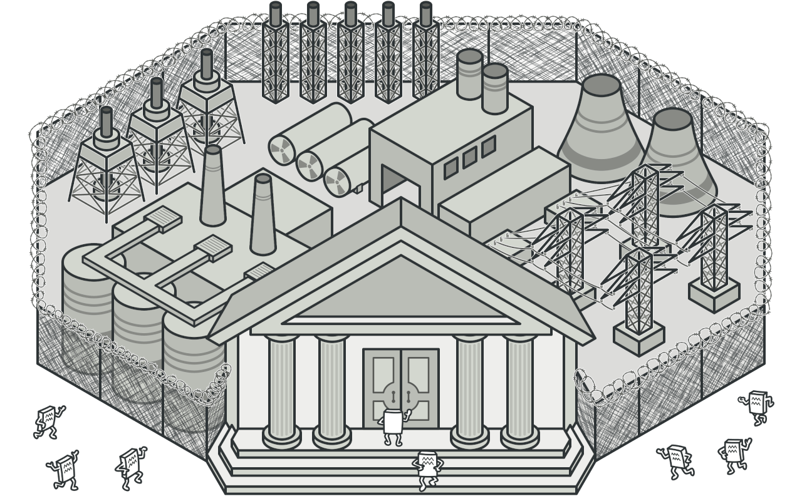
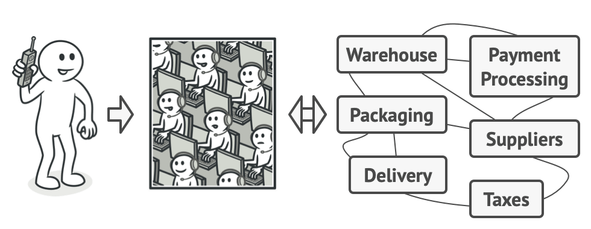
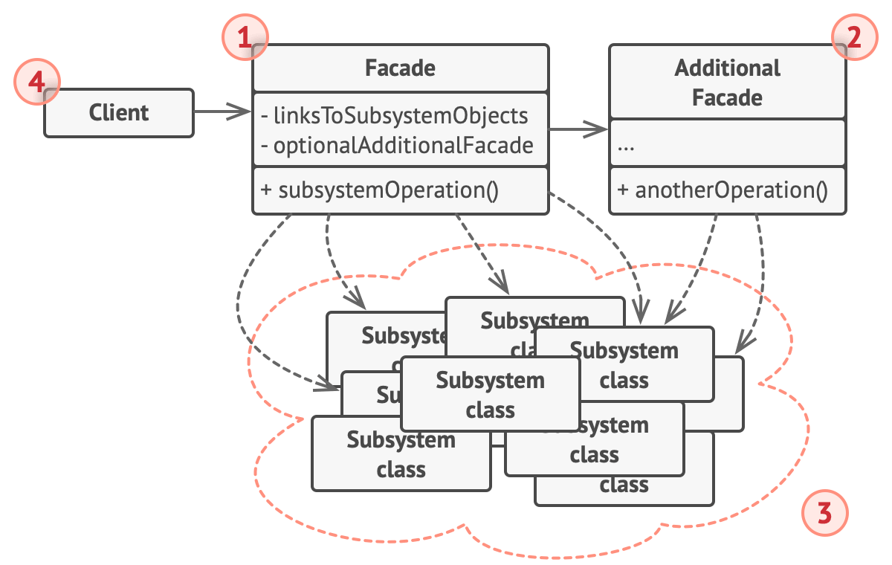
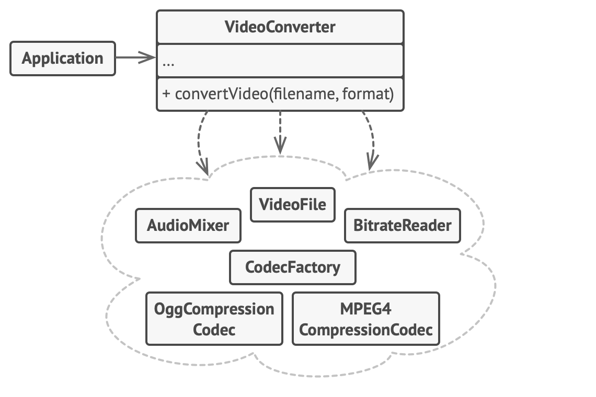

# Facade


**Type:** Structural · **Also known as:** 

> **The 10-second version:** One class with a few friendly methods stands in front of a pile of complicated classes, so your code says `converter.Convert(file, "mp4")` instead of orchestrating six objects in exactly the right order.

<br clear="all">

## Quick card

| | |
|---|---|
| **Problem it solves** | Using a subsystem correctly requires knowing too much: which objects to create, in what order, with what config, and how to clean up. That knowledge leaks into every caller. |
| **Core move** | Create a new class whose methods express *what the caller wants*, and have it do the *how* by driving the subsystem internally. |
| **You'll recognise it by** | A class with very few public methods, no interface of its own that the subsystem implements, and a constructor/body full of `new`-ing or resolving other services. Names like `...Service`, `...Manager`, `...Gateway`, `...Client`, `...Orchestrator`. |
| **Rating** | Complexity ★☆☆ · Popularity ★★☆ |
| **Closest relatives** | Adapter (wraps one object to change its interface), Mediator (subsystem knows about it), Proxy (same interface as the thing it wraps), Abstract Factory (hides construction only) |
| **In your stack** | `ListingPublisher` in C# that hides image processing + price validation + search indexing + RabbitMQ publish behind `PublishAsync(listingId)`; a TS `catalogApi.ts` module that hides three fetch endpoints, retries and DTO mapping behind `getListingPage(filters)`; a SQL repository that hides a 5-table join and a temp table behind `SearchListings(criteria)`. |

### How to read this file

Technical first, plain English second. 🗣️ marks the plain-English version. Part 1 is Refactoring.Guru's material with their diagrams; Parts 2-7 are code, your stack, and the stuff that makes it stick.

---

# PART 1 — The pattern

## 1. Intent
**Facade** is a structural design pattern that provides a simplified interface to a library, a framework, or any other complex set of classes.


### 🗣️ In plain words

You have a messy toolbox — a framework, a library, a cluster of your own classes — and using it properly takes ten lines of setup every single time. Facade is you writing one class with one obvious method that does those ten lines for you. Callers stop learning the toolbox and start learning your one method.

It does not make the toolbox simpler. It makes *your* view of it simpler, and it deliberately exposes less than the toolbox can do. That "less" is the whole point: you are trading power for a shorter path to the 90% case.

## 2. Problem
Imagine that you must make your code work with a broad set of objects that belong to a sophisticated library or framework. Ordinarily, you’d need to initialize all of those objects, keep track of dependencies, execute methods in the correct order, and so on.

As a result, the business logic of your classes would become tightly coupled to the implementation details of 3rd-party classes, making it hard to comprehend and maintain.
### 🗣️ In plain words

The pain is *sequence knowledge leaking upward*. The subsystem works fine — but only if you call it in the right order with the right intermediate objects, and nothing enforces that. So every caller re-derives the same ritual, and every caller is now a place that can get it wrong.

Here is the flavour of it, in the automotive-marketplace world. Publishing a car listing means: normalise photos, validate the asking price against the pricing engine, write to the search index, and tell downstream systems. Without a facade, the controller knows all four:

```csharp
// ❌ The controller is now an expert on four unrelated subsystems.
[HttpPost("listings/{id}/publish")]
public async Task<IActionResult> Publish(int id)
{
    var listing = await _db.Listings.FirstAsync(l => l.Id == id);

    // 1. Photos — must resize BEFORE upload, must upload BEFORE indexing.
    foreach (var photo in listing.Photos)
    {
        var resized = _imageResizer.Resize(photo.Original, 1200, 900);
        var watermarked = _watermarker.Apply(resized, "CarWale");
        photo.CdnUrl = await _cdnUploader.UploadAsync(watermarked, $"listings/{id}");
    }

    // 2. Pricing — needs the model year AND the variant AND the city.
    var band = await _pricingEngine.GetFairPriceBandAsync(
        listing.ModelId, listing.VariantId, listing.Year, listing.CityId);
    if (listing.AskingPrice > band.Max * 1.25m)
        return BadRequest("Price too far above market");
    listing.PriceBandFlag = listing.AskingPrice > band.Max ? "above" : "fair";

    // 3. Search index — document shape is a separate concern entirely.
    var doc = new SearchDocument {
        Id = listing.Id, Make = listing.MakeName, Model = listing.ModelName,
        Price = listing.AskingPrice, City = listing.CityName,
        Photos = listing.Photos.Select(p => p.CdnUrl).ToArray()
    };
    await _searchIndex.UpsertAsync("listings-v3", doc);

    // 4. Notify — and the routing key format is folklore.
    await _bus.PublishAsync("listings.published", new { ListingId = id, DealerId = listing.DealerId });

    listing.Status = ListingStatus.Live;
    await _db.SaveChangesAsync();
    return Ok();
}
```

Now write the bulk-import job. And the dealer-portal endpoint. And the admin re-publish tool. Each one copies that sequence, and each copy drifts. When the search index goes to `listings-v4`, you go hunting.

## 3. Solution
A facade is a class that provides a simple interface to a complex subsystem which contains lots of moving parts. A facade might provide limited functionality in comparison to working with the subsystem directly. However, it includes only those features that clients really care about.

Having a facade is handy when you need to integrate your app with a sophisticated library that has dozens of features, but you just need a tiny bit of its functionality.

For instance, an app that uploads short funny videos with cats to social media could potentially use a professional video conversion library. However, all that it really needs is a class with the single method `encode(filename, format)`. After creating such a class and connecting it with the video conversion library, you’ll have your first facade.
### 🗣️ In plain words

The mechanical moves:

1. **Name the thing the caller actually wants.** Not `ResizeThenUploadThenIndex` — `PublishListing`. The method signature is a sentence in the caller's language, not the subsystem's.
2. **Create a new class that owns the sequence.** It holds references to the subsystem pieces (injected or constructed) and runs them in the correct order with the correct intermediate data.
3. **Expose only the parameters the caller genuinely varies.** Everything else — index name, watermark text, resize dimensions, routing key format — becomes a private detail or a config value inside the facade.
4. **Point every caller at the facade and delete the duplicated ritual.** The subsystem classes are untouched; they do not know the facade exists and they still talk to each other directly.

> **The key insight:** A facade adds no new behaviour — it only *relocates knowledge*. The sequence, the ordering rules, the magic strings and the glue all still exist; they now live in exactly one place instead of being re-derived by every caller. That is why a facade is almost never "wrong" so much as "too big": the failure mode is accumulating knowledge, not misplacing it.

## 4. Real-world analogy


*Placing orders by phone.*

When you call a shop to place a phone order, an operator is your facade to all services and departments of the shop. The operator provides you with a simple voice interface to the ordering system, payment gateways, and various delivery services.

### 🗣️ Two more of my own

**The restaurant set menu.** The kitchen can make forty dishes with a hundred ingredients, and a confident diner could in principle specify every component. Instead the menu offers "Thali — ₹450", and behind that one line the kitchen decides the dal, the sabzi, the bread and the order they hit the plate. You lose the ability to swap the sabzi, and in exchange you order in three seconds. If you *really* need the sabzi swapped, the à la carte menu — the subsystem — is still there; the set menu never took it away.

**The car's ignition button.** Pressing it engages the starter motor, opens the fuel injectors, spins the oil pump, runs an ECU self-test and disengages the immobiliser, in a specific order with specific timing. The button neither knows how to build an engine nor prevents a mechanic from driving the starter directly with a jumper. It just means a driver does not need to be a mechanic. And note the giveaway: if the button also adjusted your seat, chose a radio station and booked your service appointment, you would start suspecting it had grown into a god object.

## 5. Structure


1. The **Facade** provides convenient access to a particular part of the subsystem’s functionality. It knows where to direct the client’s request and how to operate all the moving parts.
2. An **Additional Facade** class can be created to prevent polluting a single facade with unrelated features that might make it yet another complex structure. Additional facades can be used by both clients and other facades.
3. The **Complex Subsystem** consists of dozens of various objects. To make them all do something meaningful, you have to dive deep into the subsystem’s implementation details, such as initializing objects in the correct order and supplying them with data in the proper format.

   Subsystem classes aren’t aware of the facade’s existence. They operate within the system and work with each other directly.
4. The **Client** uses the facade instead of calling the subsystem objects directly.
### 🗣️ Participants & roles — cheat table

| Role | What it is in code | Example from the site | Equivalent in reader's stack |
|---|---|---|---|
| **Facade** | A plain class, usually with 1–5 public methods, holding the subsystem objects as fields | `VideoConverter` with `convert(filename, format)` | `ListingPublisher.PublishAsync(listingId)` in C#; `catalogApi.getListingPage(filters)` in TS |
| **Additional Facade** | A second facade for an unrelated slice, used by clients *and* by the first facade | Hinted at by the site: a separate audio-layer facade the video facade could call | `PhotoPipeline` — used directly by the upload endpoint *and* called by `ListingPublisher` |
| **Complex Subsystem** | The many classes doing the real work; they know nothing about the facade | `VideoFile`, `CodecFactory`, `BitrateReader`, `AudioMixer`, `OggCompressionCodec`, `MPEG4CompressionCodec` | `IImageResizer`, `IWatermarker`, `ICdnUploader`, `IPricingEngine`, `ISearchIndex`, `IBus` |
| **Client** | Whatever calls the facade instead of the subsystem | `Application.main()` | An ASP.NET controller, a MassTransit consumer, a Hangfire job, a React data hook |

The two rules that make it a Facade and not something else: the facade is **new**, it does not implement an interface the subsystem defines; and the subsystem is **unaware** of the facade — remove the facade and the subsystem still compiles and still works.

### 🤝 Collaboration — who calls whom

```
   CLIENT                FACADE                      COMPLEX SUBSYSTEM
  (controller)      (ListingPublisher)      (resizer, cdn, pricing, index, bus)
      |                    |                          |         |        |
      | PublishAsync(42)   |                          |         |        |
      |------------------->|                          |         |        |
      |                    | Resize(photo,1200,900)   |         |        |
      |                    |------------------------->|         |        |
      |                    |<-------------------------|         |        |
      |                    | UploadAsync(bytes) ----------------->|      |
      |                    |<------------------------------------|      |
      |                    | GetFairPriceBandAsync(...) ----------------->|
      |                    |<--------------------------------------------|
      |                    |                                             |
      |                    | (facade decides: band breached -> stop)  👈 decision lives HERE
      |                    |                                             |
      |                    | UpsertAsync("listings-v3", doc) ---------->[index]
      |                    | PublishAsync("listings.published", evt) -->[bus]
      |<-------------------|                                             |
      | PublishResult      |                                             |
      |                    |                                             |
      |                    |        [subsystem parts may also talk
      |                    |         to each other directly, and do
      |                    |         not know the facade exists]

  NOTE: there is NO arrow from the subsystem back up to the facade.
  That one-way street is the whole pattern. If the subsystem started
  calling back into the facade to coordinate, you would have drifted
  into Mediator.
```

The single most important hop is the one that *doesn't appear*: the client never touches the subsystem boxes. The moment one caller reaches around the facade "just this once" to grab the resizer directly, the facade stops protecting you from subsystem changes, because that caller is now a second place that must be updated.

## 6. Pseudocode (the website's example)
In this example, the **Facade** pattern simplifies interaction with a complex video conversion framework.



*An example of isolating multiple dependencies within a single facade class.*

Instead of making your code work with dozens of the framework classes directly, you create a facade class which encapsulates that functionality and hides it from the rest of the code. This structure also helps you to minimize the effort of upgrading to future versions of the framework or replacing it with another one. The only thing you’d need to change in your app would be the implementation of the facade’s methods.

```
// These are some of the classes of a complex 3rd-party video
// conversion framework. We don't control that code, therefore
// can't simplify it.

class VideoFile
// ...

class OggCompressionCodec
// ...

class MPEG4CompressionCodec
// ...

class CodecFactory
// ...

class BitrateReader
// ...

class AudioMixer
// ...

// We create a facade class to hide the framework's complexity
// behind a simple interface. It's a trade-off between
// functionality and simplicity.
class VideoConverter is
    method convert(filename, format):File is
        file = new VideoFile(filename)
        sourceCodec = (new CodecFactory).extract(file)
        if (format == "mp4")
            destinationCodec = new MPEG4CompressionCodec()
        else
            destinationCodec = new OggCompressionCodec()
        buffer = BitrateReader.read(filename, sourceCodec)
        result = BitrateReader.convert(buffer, destinationCodec)
        result = (new AudioMixer()).fix(result)
        return new File(result)

// Application classes don't depend on a billion classes
// provided by the complex framework. Also, if you decide to
// switch frameworks, you only need to rewrite the facade class.
class Application is
    method main() is
        convertor = new VideoConverter()
        mp4 = convertor.convert("funny-cats-video.ogg", "mp4")
        mp4.save()
```
### 🗣️ Reading that pseudocode

- **`class VideoFile` … `class AudioMixer` are stubs on purpose.** The comment says it: *"We don't control that code, therefore can't simplify it."* Facade is the pattern you reach for precisely when you cannot refactor the thing that hurts.
- **`VideoConverter` has exactly one public method.** `convert(filename, format)` — two primitives in, one `File` out. No codec objects, no buffers, no mixers appear in the signature. Everything framework-shaped is hidden below the waterline.
- **The `if (format == "mp4")` branch is the facade making a policy decision.** Choosing `MPEG4CompressionCodec` vs `OggCompressionCodec` is subsystem knowledge; the caller passes a friendly string and the facade translates. That translation table is exactly the kind of thing that used to be duplicated everywhere.
- **The ordering is the payload.** `extract` → pick codec → `read` → `convert` → `fix` → wrap. Nothing in the subsystem enforces that order; get it wrong and you get garbage or an exception. The facade is where "the right order" is written down once.
- **`BitrateReader.read` is static, `AudioMixer` is instantiated, `CodecFactory` is `new`-ed inline.** Three different lifecycles in five lines — that inconsistency is normal for a third-party framework, and swallowing it is part of the facade's job.
- **`Application.main()` is four lines and mentions one framework type: none.** That is the acceptance test for a facade. If the client still needs a `using` for the framework namespace, the facade is leaking.

## 7. Applicability — when to reach for it
**Use the Facade pattern when you need to have a limited but straightforward interface to a complex subsystem.**

Often, subsystems get more complex over time. Even applying design patterns typically leads to creating more classes. A subsystem may become more flexible and easier to reuse in various contexts, but the amount of configuration and boilerplate code it demands from a client grows ever larger. The Facade attempts to fix this problem by providing a shortcut to the most-used features of the subsystem which fit most client requirements.

**Use the Facade when you want to structure a subsystem into layers.**

Create facades to define entry points to each level of a subsystem. You can reduce coupling between multiple subsystems by requiring them to communicate only through facades.

For example, let’s return to our video conversion framework. It can be broken down into two layers: video- and audio-related. For each layer, you can create a facade and then make the classes of each layer communicate with each other via those facades. This approach looks very similar to the [Mediator](https://refactoring.guru/design-patterns/mediator) pattern.
### ✅ Quick checklist

- [ ] Do two or more callers repeat the same multi-step setup against the same set of classes?
- [ ] Would a new teammate need a wiki page or a senior's help to call this subsystem correctly the first time?
- [ ] Do you use maybe 10% of a library's surface area, but pay for 100% of its concept count every time you touch it?
- [ ] Is there a realistic chance you replace or upgrade this subsystem, and do you want the blast radius to be one file?
- [ ] Can you name the operation in the caller's vocabulary (`PublishListing`, `SendQuoteEmail`) rather than the subsystem's (`ResizeAndUploadAndIndex`)?
- [ ] Are you trying to draw a layer boundary — "everything above talks to storage only through this" — so coupling becomes a countable, reviewable thing?

If you ticked the first two, write the facade. If you only ticked the third, consider whether a couple of extension methods or a static helper would do; a class is not always the answer.

## 8. How to implement — step by step
1. Check whether it’s possible to provide a simpler interface than what an existing subsystem already provides. You’re on the right track if this interface makes the client code independent from many of the subsystem’s classes.
2. Declare and implement this interface in a new facade class. The facade should redirect the calls from the client code to appropriate objects of the subsystem. The facade should be responsible for initializing the subsystem and managing its further life cycle unless the client code already does this.
3. To get the full benefit from the pattern, make all the client code communicate with the subsystem only via the facade. Now the client code is protected from any changes in the subsystem code. For example, when a subsystem gets upgraded to a new version, you will only need to modify the code in the facade.
4. If the facade becomes [too big](https://refactoring.guru/smells/large-class), consider extracting part of its behavior to a new, refined facade class.
### 🗣️ The same steps, blunt version

1. **Find the ritual.** Grep for the sequence that appears in more than one caller. Copy the longest version into a scratch file; that is your first draft.
2. **Write the method signature you wish existed.** Caller's nouns, caller's verbs, no subsystem types in the parameters or the return type. Write it before you write the body.
3. **Move the ritual into the body.** Take the subsystem objects as constructor dependencies. If the client used to create and dispose them, the facade now does — it owns their lifetime.
4. **Rewrite every caller to use the facade, and mean it.** One straggler that still touches the subsystem directly cancels most of the benefit. If a caller genuinely needs more power, that is a signal to add a second facade method, not to make an exception.
5. **When it gets fat, split it — by subject, not by step.** `ListingPublisher` + `ListingArchiver` is a good split. `ListingPublisherPart1` + `ListingPublisherPart2` is not; that is just a long method wearing two hats.

## 9. Pros and cons
- ✅ You can isolate your code from the complexity of a subsystem.

- ⛔ A facade can become [a god object](https://refactoring.guru/antipatterns/god-object) coupled to all classes of an app.
### ⚖️ Honest trade-offs from the trenches

**The true cost is a hop you cannot skip.** Every facade adds one indirection between "where I am" and "where the work happens". Debugging a broken publish now means opening `ListingPublisher`, reading the sequence, then stepping into the real class. That is cheap — one file — but it is not free, and it compounds if you stack facades over facades. Two layers of facade between a controller and a HTTP call is a smell; you have built a call-forwarding service, not an abstraction.

**The tell that it is worth it is the diff when the subsystem changes.** If bumping your search client from v3 to v4 touches one file, the facade earned its keep. If it touches eleven files because callers reached around it, you have the cost without the benefit — fix the callers rather than blaming the pattern. A second good tell: can a new engineer publish a listing correctly without reading the pricing engine's docs? If yes, the facade is doing real work.

**What modern C#/TS gives you for free.** In C#, a DI container already solves *construction* — `IServiceProvider` will build your `IImageResizer` graph without you writing a factory. So build facades for *sequence and policy*, not for wiring; a class whose only job is `_a.Do(); ` with no ordering rules is a pointless hop. `HttpClient` + typed clients (`AddHttpClient<ICatalogApi, CatalogApi>()`) is the framework handing you a facade shape with retries and lifetime already handled — use it instead of hand-rolling. In TypeScript, a module with a few exported functions is a facade with zero ceremony; you do not need a `class` and you certainly do not need an interface with one implementation. And in both languages, `IAsyncDisposable` / `await using` and TS's `using` declarations mean the facade can own subsystem lifetimes cleanly rather than leaving `Dispose` calls scattered in callers.

**Where it genuinely goes wrong.** The god-object warning on the site is the real risk, and it arrives slowly: every sprint someone adds one more method because "the publisher already has the pricing engine injected". Watch the constructor. Once a facade has more than about six or seven injected dependencies, it is no longer simplifying a subsystem — it *is* the subsystem, and you should split it by business subject before it becomes untestable.

## 10. Relations with other patterns
- [Facade](https://refactoring.guru/design-patterns/facade) defines a new interface for existing objects, whereas [Adapter](https://refactoring.guru/design-patterns/adapter) tries to make the existing interface usable. *Adapter* usually wraps just one object, while *Facade* works with an entire subsystem of objects.
- [Abstract Factory](https://refactoring.guru/design-patterns/abstract-factory) can serve as an alternative to [Facade](https://refactoring.guru/design-patterns/facade) when you only want to hide the way the subsystem objects are created from the client code.
- [Flyweight](https://refactoring.guru/design-patterns/flyweight) shows how to make lots of little objects, whereas [Facade](https://refactoring.guru/design-patterns/facade) shows how to make a single object that represents an entire subsystem.
- [Facade](https://refactoring.guru/design-patterns/facade) and [Mediator](https://refactoring.guru/design-patterns/mediator) have similar jobs: they try to organize collaboration between lots of tightly coupled classes.

  - *Facade* defines a simplified interface to a subsystem of objects, but it doesn’t introduce any new functionality. The subsystem itself is unaware of the facade. Objects within the subsystem can communicate directly.
  - *Mediator* centralizes communication between components of the system. The components only know about the mediator object and don’t communicate directly.
- A [Facade](https://refactoring.guru/design-patterns/facade) class can often be transformed into a [Singleton](https://refactoring.guru/design-patterns/singleton) since a single facade object is sufficient in most cases.
- [Facade](https://refactoring.guru/design-patterns/facade) is similar to [Proxy](https://refactoring.guru/design-patterns/proxy) in that both buffer a complex entity and initialize it on its own. Unlike *Facade*, *Proxy* has the same interface as its service object, which makes them interchangeable.
### 🗣️ Disambiguation table

| Pattern | Wraps | Interface | Does the wrapped thing know? | One-line separator |
|---|---|---|---|---|
| **Facade** | A whole subsystem (many objects) | A **new**, simpler one you invented | No | *Fewer, friendlier methods than what is underneath.* |
| **Adapter** | Usually **one** object | An **existing** one the client already expects | No | *Same capability, different plug shape.* |
| **Proxy** | One object | The **same** interface as the wrapped object | No | *You could swap it in and nothing would compile differently.* |
| **Mediator** | Peer components | A new one, but components hold a reference to it | **Yes** — components talk only to the mediator | *Traffic flows through it in both directions.* |
| **Abstract Factory** | Object **creation** only | New, but returns subsystem objects to you | No | *Hides `new`, not the sequence.* |

**The memorable separator:** *Adapter changes an interface so it fits; Facade invents an interface so it's easy; Proxy keeps the interface identical so it's invisible; Mediator is a Facade the subsystem calls back.*

Two more notes worth carrying: the site points out that a Facade can often become a **Singleton** since one instance usually suffices — true in spirit, but in a C# app the right move is `AddSingleton<IListingPublisher, ListingPublisher>()` in DI, never a static `Instance` property. And **Flyweight vs Facade** is a nice pairing to remember by size: Flyweight makes *many tiny* objects cheap, Facade makes *one big* object represent many.

---

# PART 2 — Official code examples from Refactoring.Guru

## 2.1 C#
**Complexity:** ★☆☆ (1/3)

**Popularity:** ★★☆ (2/3)

**Usage examples:** The Facade pattern is commonly used in apps written in C#. It’s especially handy when working with complex libraries and APIs.

**Identification:** Facade can be recognized in a class that has a simple interface, but delegates most of the work to other classes. Usually, facades manage the full life cycle of objects they use.
### Conceptual Example

This example illustrates the structure of the **Facade** design pattern. It focuses on answering these questions:

- What classes does it consist of?
- What roles do these classes play?
- In what way the elements of the pattern are related?

##### **Program.cs:** Conceptual example

```csharp
using System;

namespace RefactoringGuru.DesignPatterns.Facade.Conceptual
{
    // The Facade class provides a simple interface to the complex logic of one
    // or several subsystems. The Facade delegates the client requests to the
    // appropriate objects within the subsystem. The Facade is also responsible
    // for managing their lifecycle. All of this shields the client from the
    // undesired complexity of the subsystem.
    public class Facade
    {
        protected Subsystem1 _subsystem1;

        protected Subsystem2 _subsystem2;

        public Facade(Subsystem1 subsystem1, Subsystem2 subsystem2)
        {
            this._subsystem1 = subsystem1;
            this._subsystem2 = subsystem2;
        }

        // The Facade's methods are convenient shortcuts to the sophisticated
        // functionality of the subsystems. However, clients get only to a
        // fraction of a subsystem's capabilities.
        public string Operation()
        {
            string result = "Facade initializes subsystems:\n";
            result += this._subsystem1.operation1();
            result += this._subsystem2.operation1();
            result += "Facade orders subsystems to perform the action:\n";
            result += this._subsystem1.operationN();
            result += this._subsystem2.operationZ();
            return result;
        }
    }

    // The Subsystem can accept requests either from the facade or client
    // directly. In any case, to the Subsystem, the Facade is yet another
    // client, and it's not a part of the Subsystem.
    public class Subsystem1
    {
        public string operation1()
        {
            return "Subsystem1: Ready!\n";
        }

        public string operationN()
        {
            return "Subsystem1: Go!\n";
        }
    }

    // Some facades can work with multiple subsystems at the same time.
    public class Subsystem2
    {
        public string operation1()
        {
            return "Subsystem2: Get ready!\n";
        }

        public string operationZ()
        {
            return "Subsystem2: Fire!\n";
        }
    }

    class Client
    {
        // The client code works with complex subsystems through a simple
        // interface provided by the Facade. When a facade manages the lifecycle
        // of the subsystem, the client might not even know about the existence
        // of the subsystem. This approach lets you keep the complexity under
        // control.
        public static void ClientCode(Facade facade)
        {
            Console.Write(facade.Operation());
        }
    }

    class Program
    {
        static void Main(string[] args)
        {
            // The client code may have some of the subsystem's objects already
            // created. In this case, it might be worthwhile to initialize the
            // Facade with these objects instead of letting the Facade create
            // new instances.
            Subsystem1 subsystem1 = new Subsystem1();
            Subsystem2 subsystem2 = new Subsystem2();
            Facade facade = new Facade(subsystem1, subsystem2);
            Client.ClientCode(facade);
        }
    }
}
```

##### **Output.txt:** Execution result

```output
Facade initializes subsystems:
Subsystem1: Ready!
Subsystem2: Get ready!
Facade orders subsystems to perform the action:
Subsystem1: Go!
Subsystem2: Fire!
```

## 2.2 TypeScript
**Complexity:** ★☆☆ (1/3)

**Popularity:** ★★☆ (2/3)

**Usage examples:** The Facade pattern is commonly used in apps written in TypeScript. It’s especially handy when working with complex libraries and APIs.

**Identification:** Facade can be recognized in a class that has a simple interface, but delegates most of the work to other classes. Usually, facades manage the full life cycle of objects they use.
### Conceptual Example

This example illustrates the structure of the **Facade** design pattern and focuses on the following questions:

- What classes does it consist of?
- What roles do these classes play?
- In what way the elements of the pattern are related?

##### **index.ts:** Conceptual example

```typescript
/**
 * The Facade class provides a simple interface to the complex logic of one or
 * several subsystems. The Facade delegates the client requests to the
 * appropriate objects within the subsystem. The Facade is also responsible for
 * managing their lifecycle. All of this shields the client from the undesired
 * complexity of the subsystem.
 */
class Facade {
    protected subsystem1: Subsystem1;

    protected subsystem2: Subsystem2;

    /**
     * Depending on your application's needs, you can provide the Facade with
     * existing subsystem objects or force the Facade to create them on its own.
     */
    constructor(subsystem1?: Subsystem1, subsystem2?: Subsystem2) {
        this.subsystem1 = subsystem1 || new Subsystem1();
        this.subsystem2 = subsystem2 || new Subsystem2();
    }

    /**
     * The Facade's methods are convenient shortcuts to the sophisticated
     * functionality of the subsystems. However, clients get only to a fraction
     * of a subsystem's capabilities.
     */
    public operation(): string {
        let result = 'Facade initializes subsystems:\n';
        result += this.subsystem1.operation1();
        result += this.subsystem2.operation1();
        result += 'Facade orders subsystems to perform the action:\n';
        result += this.subsystem1.operationN();
        result += this.subsystem2.operationZ();

        return result;
    }
}

/**
 * The Subsystem can accept requests either from the facade or client directly.
 * In any case, to the Subsystem, the Facade is yet another client, and it's not
 * a part of the Subsystem.
 */
class Subsystem1 {
    public operation1(): string {
        return 'Subsystem1: Ready!\n';
    }

    // ...

    public operationN(): string {
        return 'Subsystem1: Go!\n';
    }
}

/**
 * Some facades can work with multiple subsystems at the same time.
 */
class Subsystem2 {
    public operation1(): string {
        return 'Subsystem2: Get ready!\n';
    }

    // ...

    public operationZ(): string {
        return 'Subsystem2: Fire!';
    }
}

/**
 * The client code works with complex subsystems through a simple interface
 * provided by the Facade. When a facade manages the lifecycle of the subsystem,
 * the client might not even know about the existence of the subsystem. This
 * approach lets you keep the complexity under control.
 */
function clientCode(facade: Facade) {
    // ...

    console.log(facade.operation());

    // ...
}

/**
 * The client code may have some of the subsystem's objects already created. In
 * this case, it might be worthwhile to initialize the Facade with these objects
 * instead of letting the Facade create new instances.
 */
const subsystem1 = new Subsystem1();
const subsystem2 = new Subsystem2();
const facade = new Facade(subsystem1, subsystem2);
clientCode(facade);
```

##### **Output.txt:** Execution result

```output
Facade initializes subsystems:
Subsystem1: Ready!
Subsystem2: Get ready!
Facade orders subsystems to perform the action:
Subsystem1: Go!
Subsystem2: Fire!
```

## 2.3 C++
**Complexity:** ★☆☆ (1/3)

**Popularity:** ★★☆ (2/3)

**Usage examples:** The Facade pattern is commonly used in apps written in C++. It’s especially handy when working with complex libraries and APIs.

**Identification:** Facade can be recognized in a class that has a simple interface, but delegates most of the work to other classes. Usually, facades manage the full life cycle of objects they use.
### Conceptual Example

This example illustrates the structure of the **Facade** design pattern. It focuses on answering these questions:

- What classes does it consist of?
- What roles do these classes play?
- In what way the elements of the pattern are related?

##### **main.cc:** Conceptual example

```cpp
/**
 * The Subsystem can accept requests either from the facade or client directly.
 * In any case, to the Subsystem, the Facade is yet another client, and it's not
 * a part of the Subsystem.
 */
class Subsystem1 {
 public:
  std::string Operation1() const {
    return "Subsystem1: Ready!\n";
  }
  // ...
  std::string OperationN() const {
    return "Subsystem1: Go!\n";
  }
};
/**
 * Some facades can work with multiple subsystems at the same time.
 */
class Subsystem2 {
 public:
  std::string Operation1() const {
    return "Subsystem2: Get ready!\n";
  }
  // ...
  std::string OperationZ() const {
    return "Subsystem2: Fire!\n";
  }
};

/**
 * The Facade class provides a simple interface to the complex logic of one or
 * several subsystems. The Facade delegates the client requests to the
 * appropriate objects within the subsystem. The Facade is also responsible for
 * managing their lifecycle. All of this shields the client from the undesired
 * complexity of the subsystem.
 */
class Facade {
 protected:
  Subsystem1 *subsystem1_;
  Subsystem2 *subsystem2_;
  /**
   * Depending on your application's needs, you can provide the Facade with
   * existing subsystem objects or force the Facade to create them on its own.
   */
 public:
  /**
   * In this case we will delegate the memory ownership to Facade Class
   */
  Facade(
      Subsystem1 *subsystem1 = nullptr,
      Subsystem2 *subsystem2 = nullptr) {
    this->subsystem1_ = subsystem1 ?: new Subsystem1;
    this->subsystem2_ = subsystem2 ?: new Subsystem2;
  }
  ~Facade() {
    delete subsystem1_;
    delete subsystem2_;
  }
  /**
   * The Facade's methods are convenient shortcuts to the sophisticated
   * functionality of the subsystems. However, clients get only to a fraction of
   * a subsystem's capabilities.
   */
  std::string Operation() {
    std::string result = "Facade initializes subsystems:\n";
    result += this->subsystem1_->Operation1();
    result += this->subsystem2_->Operation1();
    result += "Facade orders subsystems to perform the action:\n";
    result += this->subsystem1_->OperationN();
    result += this->subsystem2_->OperationZ();
    return result;
  }
};

/**
 * The client code works with complex subsystems through a simple interface
 * provided by the Facade. When a facade manages the lifecycle of the subsystem,
 * the client might not even know about the existence of the subsystem. This
 * approach lets you keep the complexity under control.
 */
void ClientCode(Facade *facade) {
  // ...
  std::cout << facade->Operation();
  // ...
}
/**
 * The client code may have some of the subsystem's objects already created. In
 * this case, it might be worthwhile to initialize the Facade with these objects
 * instead of letting the Facade create new instances.
 */

int main() {
  Subsystem1 *subsystem1 = new Subsystem1;
  Subsystem2 *subsystem2 = new Subsystem2;
  Facade *facade = new Facade(subsystem1, subsystem2);
  ClientCode(facade);

  delete facade;

  return 0;
}
```

##### **Output.txt:** Execution result

```output
Facade initializes subsystems:
Subsystem1: Ready!
Subsystem2: Get ready!
Facade orders subsystems to perform the action:
Subsystem1: Go!
Subsystem2: Fire!
```

## 2.4 Java
**Complexity:** ★☆☆ (1/3)

**Popularity:** ★★☆ (2/3)

**Usage examples:** The Facade pattern is commonly used in apps written in Java. It’s especially handy when working with complex libraries and APIs.

**Identification:** Facade can be recognized in a class that has a simple interface, but delegates most of the work to other classes. Usually, facades manage the full life cycle of objects they use.
### Simple interface for a complex video conversion library

In this example, the Facade simplifies communication with a complex video conversion framework.

The Facade provides a single class with a single method that handles all the complexity of configuring the right classes of the framework and retrieving the result in a correct format.

#### **some_complex_media_library:** Complex video conversion library

##### **some_complex_media_library/VideoFile.java**

```java
package refactoring_guru.facade.example.some_complex_media_library;

public class VideoFile {
    private String name;
    private String codecType;

    public VideoFile(String name) {
        this.name = name;
        this.codecType = name.substring(name.indexOf(".") + 1);
    }

    public String getCodecType() {
        return codecType;
    }

    public String getName() {
        return name;
    }
}
```

##### **some_complex_media_library/Codec.java**

```java
package refactoring_guru.facade.example.some_complex_media_library;

public interface Codec {
}
```

##### **some_complex_media_library/MPEG4CompressionCodec.java**

```java
package refactoring_guru.facade.example.some_complex_media_library;

public class MPEG4CompressionCodec implements Codec {
    public String type = "mp4";

}
```

##### **some_complex_media_library/OggCompressionCodec.java**

```java
package refactoring_guru.facade.example.some_complex_media_library;

public class OggCompressionCodec implements Codec {
    public String type = "ogg";
}
```

##### **some_complex_media_library/CodecFactory.java**

```java
package refactoring_guru.facade.example.some_complex_media_library;

public class CodecFactory {
    public static Codec extract(VideoFile file) {
        String type = file.getCodecType();
        if (type.equals("mp4")) {
            System.out.println("CodecFactory: extracting mpeg audio...");
            return new MPEG4CompressionCodec();
        }
        else {
            System.out.println("CodecFactory: extracting ogg audio...");
            return new OggCompressionCodec();
        }
    }
}
```

##### **some_complex_media_library/BitrateReader.java**

```java
package refactoring_guru.facade.example.some_complex_media_library;

public class BitrateReader {
    public static VideoFile read(VideoFile file, Codec codec) {
        System.out.println("BitrateReader: reading file...");
        return file;
    }

    public static VideoFile convert(VideoFile buffer, Codec codec) {
        System.out.println("BitrateReader: writing file...");
        return buffer;
    }
}
```

##### **some_complex_media_library/AudioMixer.java**

```java
package refactoring_guru.facade.example.some_complex_media_library;

import java.io.File;

public class AudioMixer {
    public File fix(VideoFile result){
        System.out.println("AudioMixer: fixing audio...");
        return new File("tmp");
    }
}
```

#### **facade**

##### **facade/VideoConversionFacade.java:** Facade provides simple interface of video conversion

```java
package refactoring_guru.facade.example.facade;

import refactoring_guru.facade.example.some_complex_media_library.*;

import java.io.File;

public class VideoConversionFacade {
    public File convertVideo(String fileName, String format) {
        System.out.println("VideoConversionFacade: conversion started.");
        VideoFile file = new VideoFile(fileName);
        Codec sourceCodec = CodecFactory.extract(file);
        Codec destinationCodec;
        if (format.equals("mp4")) {
            destinationCodec = new MPEG4CompressionCodec();
        } else {
            destinationCodec = new OggCompressionCodec();
        }
        VideoFile buffer = BitrateReader.read(file, sourceCodec);
        VideoFile intermediateResult = BitrateReader.convert(buffer, destinationCodec);
        File result = (new AudioMixer()).fix(intermediateResult);
        System.out.println("VideoConversionFacade: conversion completed.");
        return result;
    }
}
```

##### **Demo.java:** Client code

```java
package refactoring_guru.facade.example;

import refactoring_guru.facade.example.facade.VideoConversionFacade;

import java.io.File;

public class Demo {
    public static void main(String[] args) {
        VideoConversionFacade converter = new VideoConversionFacade();
        File mp4Video = converter.convertVideo("youtubevideo.ogg", "mp4");
        // ...
    }
}
```

##### **OutputDemo.txt:** Execution result

```output
VideoConversionFacade: conversion started.
CodecFactory: extracting ogg audio...
BitrateReader: reading file...
BitrateReader: writing file...
AudioMixer: fixing audio...
VideoConversionFacade: conversion completed.
```

---

# PART 3 — Learn it by building it

## 3.1 The dumbest possible version — TypeScript

### ❌ BEFORE — the pain, in a React data layer

Every screen that shows car listings does the same four-step dance against the same three endpoints.

```ts
// ❌ SearchResultsPage.tsx — and this exact block also lives in
//    DealerInventoryPage.tsx and CompareDrawer.tsx, with drift.
async function loadResults(filters: Filters) {
  // 1. Filters must be flattened into the odd query shape the API wants.
  const qs = new URLSearchParams();
  if (filters.makeId) qs.set('make_id', String(filters.makeId));
  if (filters.maxPrice) qs.set('price_to', String(filters.maxPrice * 100000)); // API is in rupees, UI in lakhs
  qs.set('page', String(filters.page ?? 1));
  qs.set('per_page', '20');

  // 2. Three calls, and the second one NEEDS the ids from the first.
  const listRes = await fetch(`/api/v2/listings?${qs}`);
  if (!listRes.ok) throw new Error('listings failed');
  const listJson = await listRes.json();

  const ids = listJson.data.map((d: any) => d.listing_id).join(',');
  const priceRes = await fetch(`/api/v2/pricing/bands?listing_ids=${ids}`);
  const priceJson = priceRes.ok ? await priceJson_safe(priceRes) : { data: {} };

  const dealerIds = [...new Set(listJson.data.map((d: any) => d.dealer_id))].join(',');
  const dealerRes = await fetch(`/api/v1/dealers?ids=${dealerIds}`); // note: v1, not v2
  const dealerJson = await dealerRes.json();

  // 3. Snake_case -> camelCase, plus paise -> lakhs, by hand, every time.
  return listJson.data.map((d: any) => ({
    id: d.listing_id,
    title: `${d.make_name} ${d.model_name} ${d.variant_name}`,
    priceLakhs: d.asking_price / 100000,
    fairBand: priceJson.data[d.listing_id] ?? null,
    dealerName: dealerJson.data.find((x: any) => x.id === d.dealer_id)?.name ?? 'Private seller',
    thumb: d.photos?.[0]?.url ?? '/img/no-photo.png',
  }));
}
```

Three screens, three copies, and one of them forgot that pricing is optional. The `v1` vs `v2` mismatch is folklore living in three files.

### ✅ AFTER — one facade module

```ts
// ─────────────────────────────────────────────────────────────
//  catalog-facade.ts — the ONLY file that knows about /api/*
// ─────────────────────────────────────────────────────────────

// ── 1. The vocabulary the app speaks (subsystem words banned) ──

export interface ListingFilters {
  makeId?: number;
  maxPriceLakhs?: number;   // 👈 UI units, not API units. Conversion is our job.
  page?: number;
}

export interface ListingCard {
  id: number;
  title: string;
  priceLakhs: number;
  fairBand: { minLakhs: number; maxLakhs: number } | null;
  dealerName: string;
  thumb: string;
}

// ── 2. The subsystem: raw wire shapes, kept private to this file ──

interface RawListing {
  listing_id: number;
  make_name: string;
  model_name: string;
  variant_name: string;
  asking_price: number;      // paise... no, rupees. The API is in rupees.
  dealer_id: number | null;
  photos?: { url: string }[];
}
interface RawBand { min: number; max: number }
interface RawDealer { id: number; name: string }

const RUPEES_PER_LAKH = 100_000;
const PAGE_SIZE = 20;
const PLACEHOLDER = '/img/no-photo.png';

async function getJson<T>(url: string, signal?: AbortSignal): Promise<T> {
  const res = await fetch(url, { signal, headers: { accept: 'application/json' } });
  if (!res.ok) throw new CatalogError(`GET ${url} -> ${res.status}`, res.status);
  return (await res.json()) as T;
}

export class CatalogError extends Error {
  constructor(message: string, readonly status: number) {
    super(message);
    this.name = 'CatalogError';
  }
}

// ── 3. THE FACADE — one exported function per thing the app wants ──

export async function getListingPage(
  filters: ListingFilters,
  signal?: AbortSignal,
): Promise<ListingCard[]> {
  const qs = new URLSearchParams({
    page: String(filters.page ?? 1),
    per_page: String(PAGE_SIZE),
  });
  if (filters.makeId !== undefined) qs.set('make_id', String(filters.makeId));
  if (filters.maxPriceLakhs !== undefined) {
    qs.set('price_to', String(filters.maxPriceLakhs * RUPEES_PER_LAKH)); // 👈 unit translation, once
  }

  const list = await getJson<{ data: RawListing[] }>(`/api/v2/listings?${qs}`, signal);
  if (list.data.length === 0) return [];

  // 👈 The ordering rule: listings FIRST, because the next two calls need its ids.
  const [bands, dealers] = await Promise.all([
    fetchBands(list.data, signal),
    fetchDealers(list.data, signal),
  ]);

  return list.data.map((raw) => toCard(raw, bands, dealers));
}

// ── 4. Private helpers: the steps nobody outside needs to name ──

async function fetchBands(
  rows: RawListing[],
  signal?: AbortSignal,
): Promise<Record<number, RawBand>> {
  const ids = rows.map((r) => r.listing_id).join(',');
  try {
    const res = await getJson<{ data: Record<number, RawBand> }>(
      `/api/v2/pricing/bands?listing_ids=${ids}`, signal);
    return res.data;
  } catch (e) {
    if (e instanceof CatalogError) return {}; // 👈 policy: pricing is best-effort, listings are not
    throw e;
  }
}

async function fetchDealers(
  rows: RawListing[],
  signal?: AbortSignal,
): Promise<Map<number, string>> {
  const ids = [...new Set(rows.map((r) => r.dealer_id).filter((x): x is number => x !== null))];
  if (ids.length === 0) return new Map();
  // 👈 the v1-vs-v2 wart is now folklore in ONE place
  const res = await getJson<{ data: RawDealer[] }>(`/api/v1/dealers?ids=${ids.join(',')}`, signal);
  return new Map(res.data.map((d) => [d.id, d.name]));
}

function toCard(
  raw: RawListing,
  bands: Record<number, RawBand>,
  dealers: Map<number, string>,
): ListingCard {
  const band = bands[raw.listing_id];
  return {
    id: raw.listing_id,
    title: `${raw.make_name} ${raw.model_name} ${raw.variant_name}`,
    priceLakhs: raw.asking_price / RUPEES_PER_LAKH,
    fairBand: band
      ? { minLakhs: band.min / RUPEES_PER_LAKH, maxLakhs: band.max / RUPEES_PER_LAKH }
      : null,
    dealerName: raw.dealer_id !== null
      ? dealers.get(raw.dealer_id) ?? 'Dealer'
      : 'Private seller',
    thumb: raw.photos?.[0]?.url ?? PLACEHOLDER,
  };
}
```

And the caller:

```ts
// SearchResultsPage.tsx — no fetch, no snake_case, no unit maths.
import { getListingPage, CatalogError } from './catalog-facade';

async function loadResults(filters: ListingFilters, signal: AbortSignal) {
  try {
    return await getListingPage(filters, signal);
  } catch (e) {
    if (e instanceof CatalogError && e.status === 404) return [];
    throw e;
  }
}
```

**What to notice:**

- **The facade is a module, not a class.** In TypeScript that is idiomatic and sufficient. A class buys you nothing here because there is no per-instance state; reach for a class only when you need injected config (base URL, auth token) or you want to fake it in tests via a constructor.
- **`RawListing`, `RawBand`, `RawDealer` are not exported.** That is the boundary. If a wire type escapes the module, every consumer is coupled to the API shape again and the facade is decorative.
- **Unit conversion happens exactly twice** — in and out — and both are inside this file. The rest of the app thinks in lakhs, forever.
- **A policy decision lives here:** pricing failures degrade to `null`, listing failures throw. That is a product decision the facade is the right place to encode, because encoding it per-caller is how one screen ends up showing a blank page when pricing hiccups.
- **`AbortSignal` threads all the way through.** A facade that swallows cancellation makes React `useEffect` cleanup impossible; passing the signal is the small price of being a good citizen.
- **Nothing here is generic.** No `request<T>(method, path, body)` escape hatch. The moment you export that, callers will use it and route around your facade.

## 3.2 Same thing in C#

```csharp
// ─────────────────────────────────────────────────────────────
//  ListingPublisher — facade over photo, pricing, search, bus
// ─────────────────────────────────────────────────────────────
using System;
using System.Collections.Generic;
using System.Linq;
using System.Threading;
using System.Threading.Tasks;

namespace Marketplace.Listings;

// ── 1. The caller's vocabulary: a result type, not an exception-only API ──

public abstract record PublishResult
{
    public sealed record Published(int ListingId, int PhotoCount) : PublishResult;
    public sealed record RejectedOnPrice(decimal Asking, decimal FairMax) : PublishResult;
    public sealed record NotFound(int ListingId) : PublishResult;

    private PublishResult() { }   // 👈 closed hierarchy: switch expressions stay exhaustive
}

// ── 2. The subsystem contracts (each already exists; we do not touch them) ──

public interface IImageResizer { byte[] Resize(byte[] source, int width, int height); }
public interface IWatermarker  { byte[] Apply(byte[] image, string text); }
public interface ICdnUploader  { Task<string> UploadAsync(byte[] image, string key, CancellationToken ct); }
public interface IPricingEngine
{
    Task<PriceBand> GetFairPriceBandAsync(int modelId, int variantId, int year, int cityId, CancellationToken ct);
}
public readonly record struct PriceBand(decimal Min, decimal Max);
public interface ISearchIndex { Task UpsertAsync(string index, SearchDocument doc, CancellationToken ct); }
public sealed record SearchDocument(int Id, string Make, string Model, decimal Price, string City, string[] Photos);
public interface IEventBus { Task PublishAsync(string routingKey, object payload, CancellationToken ct); }
public interface IListingRepository
{
    Task<Listing?> GetAsync(int id, CancellationToken ct);
    Task SaveAsync(Listing listing, CancellationToken ct);
}

public sealed class Listing
{
    public int Id { get; init; }
    public int DealerId { get; init; }
    public int ModelId { get; init; }
    public int VariantId { get; init; }
    public int Year { get; init; }
    public int CityId { get; init; }
    public string MakeName { get; init; } = "";
    public string ModelName { get; init; } = "";
    public string CityName { get; init; } = "";
    public decimal AskingPrice { get; init; }
    public List<Photo> Photos { get; init; } = new();
    public string Status { get; set; } = "draft";
    public string? PriceBandFlag { get; set; }
}
public sealed class Photo
{
    public byte[] Original { get; init; } = Array.Empty<byte>();
    public string? CdnUrl { get; set; }
}

// ── 3. The facade itself ────────────────────────────────────────

public interface IListingPublisher
{
    Task<PublishResult> PublishAsync(int listingId, CancellationToken ct = default);
}

public sealed class ListingPublisher : IListingPublisher
{
    // Tuning knobs the caller should never see.
    private const int PhotoWidth = 1200;
    private const int PhotoHeight = 900;
    private const string Watermark = "CarWale";
    private const string IndexName = "listings-v3";        // 👈 one place to bump on v4
    private const string PublishedRoutingKey = "listings.published";
    private const decimal HardRejectMultiplier = 1.25m;

    private readonly IListingRepository _repo;
    private readonly IImageResizer _resizer;
    private readonly IWatermarker _watermarker;
    private readonly ICdnUploader _cdn;
    private readonly IPricingEngine _pricing;
    private readonly ISearchIndex _index;
    private readonly IEventBus _bus;

    public ListingPublisher(
        IListingRepository repo,
        IImageResizer resizer,
        IWatermarker watermarker,
        ICdnUploader cdn,
        IPricingEngine pricing,
        ISearchIndex index,
        IEventBus bus)
        => (_repo, _resizer, _watermarker, _cdn, _pricing, _index, _bus)
           = (repo, resizer, watermarker, cdn, pricing, index, bus);

    public async Task<PublishResult> PublishAsync(int listingId, CancellationToken ct = default)
    {
        var listing = await _repo.GetAsync(listingId, ct);
        if (listing is null) return new PublishResult.NotFound(listingId);

        await PreparePhotosAsync(listing, ct);                    // step 1

        var band = await _pricing.GetFairPriceBandAsync(          // step 2
            listing.ModelId, listing.VariantId, listing.Year, listing.CityId, ct);

        if (listing.AskingPrice > band.Max * HardRejectMultiplier) // 👈 the policy, owned here
            return new PublishResult.RejectedOnPrice(listing.AskingPrice, band.Max);

        listing.PriceBandFlag = listing.AskingPrice switch        // 👈 switch expression on decimal ranges
        {
            var p when p < band.Min => "below",
            var p when p > band.Max => "above",
            _                       => "fair",
        };

        await IndexAsync(listing, ct);                            // step 3

        listing.Status = "live";
        await _repo.SaveAsync(listing, ct);                       // step 4: persist before announcing

        await _bus.PublishAsync(PublishedRoutingKey,              // step 5
            new ListingPublishedEvent(listing.Id, listing.DealerId, DateTimeOffset.UtcNow), ct);

        return new PublishResult.Published(listing.Id, listing.Photos.Count);
    }

    // ── private steps: named, but not public ──

    private async Task PreparePhotosAsync(Listing listing, CancellationToken ct)
    {
        foreach (var photo in listing.Photos)
        {
            var resized = _resizer.Resize(photo.Original, PhotoWidth, PhotoHeight);
            var stamped = _watermarker.Apply(resized, Watermark);   // 👈 resize BEFORE watermark, always
            photo.CdnUrl = await _cdn.UploadAsync(stamped, $"listings/{listing.Id}", ct);
        }
    }

    private Task IndexAsync(Listing listing, CancellationToken ct)
    {
        var doc = new SearchDocument(
            listing.Id,
            listing.MakeName,
            listing.ModelName,
            listing.AskingPrice,
            listing.CityName,
            listing.Photos.Select(p => p.CdnUrl!).ToArray());
        return _index.UpsertAsync(IndexName, doc, ct);
    }
}

public sealed record ListingPublishedEvent(int ListingId, int DealerId, DateTimeOffset PublishedAt);
```

The controller collapses to this:

```csharp
[ApiController]
[Route("listings")]
public sealed class ListingsController : ControllerBase
{
    private readonly IListingPublisher _publisher;
    public ListingsController(IListingPublisher publisher) => _publisher = publisher;

    [HttpPost("{id:int}/publish")]
    public async Task<IActionResult> Publish(int id, CancellationToken ct) =>
        await _publisher.PublishAsync(id, ct) switch
        {
            PublishResult.Published p          => Ok(new { p.ListingId, p.PhotoCount }),
            PublishResult.RejectedOnPrice r    => UnprocessableEntity(
                                                    new { error = "price_out_of_band", r.Asking, r.FairMax }),
            PublishResult.NotFound             => NotFound(),
            _                                  => StatusCode(500),
        };
}
```

Registration:

```csharp
builder.Services.AddScoped<IListingPublisher, ListingPublisher>();
```

**C#-specific notes:**

- **Extract an interface only if you will fake it.** `IListingPublisher` exists here because controllers get unit-tested against a stub. If nothing will ever substitute it, register the concrete class and skip the interface — a one-implementation interface is ceremony, not decoupling.
- **The closed `record` hierarchy with a private constructor** makes the controller's `switch` expression genuinely exhaustive in intent, and gives you a readable API surface without throwing for expected outcomes. Reserve exceptions for "the subsystem broke", not "the price was too high".
- **Seven constructor dependencies is right at the edge.** It is defensible here because the whole point is that publishing touches seven things — but this is the number to watch. Adding an eighth is the moment to ask whether photo handling should become its own `IPhotoPipeline` facade that `ListingPublisher` calls (the site's "Additional Facade").
- **Do not make the facade `IDisposable` unless it owns disposables.** With DI, the container owns lifetimes; a scoped facade that disposes an injected singleton `HttpClient` is a classic production incident.
- **`CancellationToken` goes everywhere, with `= default` only on the public entry point.** A facade that drops the token turns every caller's timeout into a lie.
- **Ordering note worth stating out loud:** `SaveAsync` happens *before* `PublishAsync` to the bus. Publishing an event about a state you have not committed is the outbox problem in miniature — see §4.4.
- **Consider `[GeneratedRegex]`-style source generators and primary constructors** if you are on C# 12+: `public sealed class ListingPublisher(IListingRepository repo, ...) : IListingPublisher` removes the whole assignment block. I have written it long-hand above for clarity.

## 3.3 C++

```cpp
// ─────────────────────────────────────────────────────────────
//  telemetry_facade.cpp — a facade over a device-ingest subsystem
//  (connected-car telemetry: decode -> validate -> enrich -> store)
// ─────────────────────────────────────────────────────────────
#include <cstdint>
#include <memory>
#include <optional>
#include <span>
#include <stdexcept>
#include <string>
#include <string_view>
#include <utility>
#include <vector>

namespace telemetry {

// ── 1. Subsystem types. Third-party-ish: we do not get to change them. ──

struct Reading {
    std::uint64_t vehicle_id{};
    std::uint64_t timestamp_ms{};
    double        speed_kmph{};
    double        fuel_pct{};
    double        lat{}, lon{};
};

class FrameDecoder {
public:
    virtual ~FrameDecoder() = default;                       // 👈 virtual dtor: deleted via base ptr
    virtual std::optional<Reading> decode(std::span<const std::uint8_t> frame) const = 0;
};

class ObdFrameDecoder final : public FrameDecoder {
public:
    std::optional<Reading> decode(std::span<const std::uint8_t> frame) const override {
        if (frame.size() < 40) return std::nullopt;
        Reading r{};
        // Real code would unpack fields here; layout is fixed by the device spec.
        r.vehicle_id   = *reinterpret_cast<const std::uint64_t*>(frame.data());
        r.timestamp_ms = *reinterpret_cast<const std::uint64_t*>(frame.data() + 8);
        r.speed_kmph   = *reinterpret_cast<const double*>(frame.data() + 16);
        r.fuel_pct     = *reinterpret_cast<const double*>(frame.data() + 24);
        r.lat          = *reinterpret_cast<const double*>(frame.data() + 32);
        r.lon          = 0.0;
        return r;
    }
};

class PlausibilityChecker {
public:
    // const-correct: checking must not mutate the checker.
    bool is_plausible(const Reading& r) const noexcept {
        return r.speed_kmph >= 0.0 && r.speed_kmph < 320.0
            && r.fuel_pct  >= 0.0 && r.fuel_pct  <= 100.0
            && r.lat >= -90.0 && r.lat <= 90.0;
    }
};

class GeoResolver {
public:
    std::string city_for(double lat, double lon) const {
        (void)lon;
        return lat > 18.0 ? "Mumbai" : "Pune";               // stand-in for a real lookup
    }
};

class ReadingStore {
public:
    virtual ~ReadingStore() = default;
    virtual void append(const Reading& r, std::string_view city) = 0;
    virtual std::size_t size() const noexcept = 0;
};

class InMemoryStore final : public ReadingStore {
    std::vector<std::pair<Reading, std::string>> rows_;
public:
    void append(const Reading& r, std::string_view city) override {
        rows_.emplace_back(r, std::string{city});
    }
    std::size_t size() const noexcept override { return rows_.size(); }
};

// ── 2. THE FACADE ───────────────────────────────────────────────

struct IngestOutcome {
    std::size_t accepted{};
    std::size_t rejected_undecodable{};
    std::size_t rejected_implausible{};
};

class TelemetryIngest {
public:
    // Ownership, stated in the signature:
    //   - decoder and store are OWNED (unique_ptr, moved in)  👈
    //   - checker and geo are cheap value members
    TelemetryIngest(std::unique_ptr<FrameDecoder> decoder,
                    std::unique_ptr<ReadingStore> store)
        : decoder_(std::move(decoder)), store_(std::move(store)) {
        if (!decoder_ || !store_) throw std::invalid_argument("TelemetryIngest: null dependency");
    }

    // Non-copyable (owns unique_ptrs), movable. Stated explicitly so the
    // compiler's implicit rules are never a surprise.
    TelemetryIngest(const TelemetryIngest&)            = delete;
    TelemetryIngest& operator=(const TelemetryIngest&) = delete;
    TelemetryIngest(TelemetryIngest&&) noexcept            = default;   // 👈 move is the natural op
    TelemetryIngest& operator=(TelemetryIngest&&) noexcept = default;

    // THE one public method the rest of the program uses.
    IngestOutcome ingest(std::span<const std::span<const std::uint8_t>> frames) {
        IngestOutcome out{};
        for (const auto& frame : frames) {
            auto maybe = decoder_->decode(frame);
            if (!maybe) { ++out.rejected_undecodable; continue; }

            const Reading& r = *maybe;                        // 👈 const ref, no copy
            if (!checker_.is_plausible(r)) { ++out.rejected_implausible; continue; }

            store_->append(r, geo_.city_for(r.lat, r.lon));
            ++out.accepted;
        }
        return out;
    }

    std::size_t stored() const noexcept { return store_->size(); }

private:
    std::unique_ptr<FrameDecoder> decoder_;
    std::unique_ptr<ReadingStore> store_;
    PlausibilityChecker           checker_{};
    GeoResolver                   geo_{};
};

}  // namespace telemetry

// ── 3. Client: knows nothing about decoders, checkers or geo ──
//
// int main() {
//     using namespace telemetry;
//     TelemetryIngest ingest{std::make_unique<ObdFrameDecoder>(),
//                            std::make_unique<InMemoryStore>()};
//     std::vector<std::span<const std::uint8_t>> batch = collect_frames();
//     const IngestOutcome out = ingest.ingest(batch);
//     // out.accepted / out.rejected_* ...
// }
```

### C++ gotcha table

| Gotcha | Why it bites a Facade specifically | The fix |
|---|---|---|
| **Missing virtual destructor** | A facade almost always holds subsystem pieces through base pointers (`unique_ptr<FrameDecoder>`). Deleting through a base pointer without a `virtual ~Base()` is UB, and the derived member's destructor silently never runs. | `virtual ~FrameDecoder() = default;` on every polymorphic subsystem base. |
| **Object slicing** | Storing subsystem parts *by value* (`std::vector<FrameDecoder> decoders_`) silently chops off every derived part. Tempting because a facade "just holds a few things". | Store `unique_ptr<Base>` / `shared_ptr<Base>`, or references for non-owned deps. |
| **Accidental copy of the facade** | The facade looks like a value type, so someone passes it by value into a lambda. With `unique_ptr` members it will not compile; with `shared_ptr` members it *will*, and you quietly get shared mutable state. | `= delete` the copy ops explicitly, `= default` the moves, and pass by reference. |
| **Ownership ambiguity** | "Who deletes the store?" is exactly the question a facade is supposed to answer for the caller, so answer it in the signature. | Owned → `unique_ptr` by value in the constructor (moved in). Shared → `shared_ptr`. Borrowed and outliving the facade → plain reference or `T*`. |
| **const-correctness rot** | Read-only facade methods (`stored()`) that are not `const` force callers to hold a non-const facade everywhere, which defeats reasoning about mutation. | Mark every non-mutating method `const` (and `noexcept` where it truly is). |
| **Throwing from the constructor after partial setup** | A facade constructor that opens three resources and throws on the fourth leaks nothing *if* each is an RAII member — but leaks plenty if you used raw `new`. | Every member is RAII. Then the constructor body can throw freely; already-constructed members unwind correctly. |

**Move semantics angle for this pattern:** the facade is the natural owner of the subsystem, so a facade is usually *move-only*. Taking `std::unique_ptr<T>` **by value** in the constructor and `std::move`-ing into the member is the idiom — it documents transfer of ownership at the call site (`std::make_unique<ObdFrameDecoder>()` reads as "this is yours now") and costs one pointer move. Taking `const std::unique_ptr<T>&` would be a design error: it says "I need your unique_ptr but will not take it", which is never what a facade means.

## 3.4 Java

A compact facade over the JDK's own crypto/IO subsystems — a signed-payload verifier for dealer webhooks:

```java
package marketplace.webhooks;

import javax.crypto.Mac;
import javax.crypto.spec.SecretKeySpec;
import java.nio.charset.StandardCharsets;
import java.security.MessageDigest;
import java.security.NoSuchAlgorithmException;
import java.security.InvalidKeyException;
import java.util.HexFormat;
import java.util.Objects;

/**
 * Facade over Mac / SecretKeySpec / MessageDigest / HexFormat.
 * Callers get one method and one boolean; they never see a checked
 * crypto exception or a byte[] again.
 */
public final class WebhookSignatures {

    private static final String ALGORITHM = "HmacSHA256";

    private final byte[] secret;

    public WebhookSignatures(String secret) {
        this.secret = Objects.requireNonNull(secret, "secret")
                             .getBytes(StandardCharsets.UTF_8);
    }

    /** @return the lowercase hex HMAC a sender should put in the X-Signature header. */
    public String sign(String payload) {
        return HexFormat.of().formatHex(hmac(payload));
    }

    /** Constant-time comparison; never short-circuits on the first differing byte. */
    public boolean isValid(String payload, String providedHexSignature) {
        if (providedHexSignature == null) return false;
        final byte[] provided;
        try {
            provided = HexFormat.of().parseHex(providedHexSignature.trim().toLowerCase());
        } catch (IllegalArgumentException malformedHex) {
            return false;                       // not a signature at all
        }
        return MessageDigest.isEqual(hmac(payload), provided);   // <- timing-safe
    }

    private byte[] hmac(String payload) {
        try {
            Mac mac = Mac.getInstance(ALGORITHM);
            mac.init(new SecretKeySpec(secret, ALGORITHM));
            return mac.doFinal(payload.getBytes(StandardCharsets.UTF_8));
        } catch (NoSuchAlgorithmException | InvalidKeyException e) {
            // Neither can happen with a fixed algorithm and a non-empty key:
            // translate to unchecked so the facade's API stays clean.
            throw new IllegalStateException("HMAC unavailable", e);
        }
    }
}
```

Four JDK types, two checked exceptions and a hex codec collapse into `sign` / `isValid`. Note the extra value a facade often adds by accident: `MessageDigest.isEqual` is the timing-safe comparison, and putting it *inside* the facade means no caller can get it wrong with `==` or `.equals`.

### The line that makes it click

```java
javax.xml.parsers.DocumentBuilderFactory
    .newInstance()
    .newDocumentBuilder()
    .parse(inputStream);
```

`DocumentBuilder.parse(InputStream)` is a Facade you have used without naming it. Underneath sits a full SAX pipeline — `XMLReader`, `ContentHandler`, `EntityResolver`, `ErrorHandler`, an input buffer and a DOM tree builder — that you could wire by hand if you needed streaming control. `parse()` says: *you just want the Document*. It is the textbook shape: fewer methods than the subsystem, no interface the subsystem implements, and SAX has no idea DOM parsing exists.

The same recognition works elsewhere in the JDK: `java.net.URL.openStream()` hides protocol handler lookup, connection setup and stream selection behind one call, and `java.nio.file.Files` is a wall of static facade methods over `FileSystem`, `Path`, `SeekableByteChannel` and charset decoding.

## 3.5 Deep dive — the "is this actually a Facade?" decision test

People label half their service layer "Facade". Here is a test that separates the real thing from Adapter, Mediator, Proxy and plain old "a class".

Run four questions in order. Stop at the first that answers cleanly.

**Q1 — Does the thing I wrap *define* the interface I'm implementing?**

```csharp
// I must implement IPaymentGateway because the app already calls IPaymentGateway.
public sealed class StripePaymentGateway : IPaymentGateway
{
    private readonly StripeClient _stripe;
    public Task<PaymentResult> ChargeAsync(Money amount, Card card, CancellationToken ct) { /* ... */ }
}
```
The interface pre-existed and belongs to *my* app's expectations, not to me. That is **Adapter** — I am making Stripe fit a socket that was already there. A Facade's interface is invented by the facade author for convenience; nobody was waiting for it.

**Q2 — Is my public interface identical to the wrapped object's?**

```csharp
public sealed class CachingPricingEngine : IPricingEngine   // same interface as the real one
{
    private readonly IPricingEngine _inner;
    public async Task<PriceBand> GetFairPriceBandAsync(/* identical signature */) { /* cache, then _inner */ }
}
```
Identical signature, substitutable at the registration line. That is **Proxy**. A Facade deliberately has a *different, smaller* surface — you could not swap it in for `IPricingEngine`.

**Q3 — Do the things I coordinate hold a reference back to me?**

```csharp
public sealed class AuctionRoom            // components call INTO this
{
    public void Register(IBidder b) { b.Room = this; _bidders.Add(b); }   // 👈 back-reference
    public void PlaceBid(IBidder from, decimal amount) { /* notify others */ }
}
```
Two-way. That is **Mediator**. In a Facade the arrows are strictly one-way: facade → subsystem, never back. This is the question that catches the most mislabelling, because both patterns "reduce coupling between many classes" and the marketing sounds identical.

**Q4 — Am I only hiding construction?**

```csharp
public sealed class SearchClientFactory
{
    public ISearchIndex CreateIndex(string env) => env switch {
        "prod"    => new ElasticIndex(_prodConn),
        "staging" => new ElasticIndex(_stagingConn),
        _         => new InMemoryIndex(),
    };
}
```
Nothing is simplified after the object exists; callers still drive `ISearchIndex` themselves. That is **Abstract Factory / Factory**, and the site says so explicitly — a factory is the alternative to a facade when creation is the only complexity.

**If all four are "no"** — you invented the interface, it is smaller than what is underneath, the arrows are one-way, and you hide sequence not just construction — you have a Facade.

### The refactoring walkthrough, in five numbered steps

Take the ❌ controller from §2 and get to the ✅ facade without a big-bang rewrite.

**Step 1 — Extract Method, in place.** Before creating any new class, turn the controller's body into four private methods on the controller itself: `PreparePhotos`, `CheckPrice`, `Index`, `Announce`. No behaviour changes; you are just naming the steps. This is safe enough to do with the tests you already have.

**Step 2 — Extract Class.** Move those four methods, and the seven fields they need, into `ListingPublisher`. The controller now holds one field. Run the tests: they should still pass unchanged, because the sequence did not move — only its address did.

**Step 3 — Narrow the entry point.** The extracted class probably exposes all four methods publicly because that is how the extraction tool left it. Make three of them `private` and keep only `PublishAsync`. This is the step that turns "a class I extracted" into "a facade": the caller loses the ability to run the steps out of order.

**Step 4 — Replace the magic.** `"listings-v3"`, `1200`, `"CarWale"`, `1.25m`, `"listings.published"` become `private const` or options. Each one you move is a caller that can no longer disagree with you about it.

**Step 5 — Migrate the other callers, then delete the old path.** Bulk importer, dealer portal, admin tool. The last one is the important one: while any caller still drives the subsystem directly, you have the facade's cost and none of its protection. When the last straggler is gone, try the acid test — change `IndexName` to `"listings-v4"` and count the files in the diff. One file means you are done.

**What you should *not* do during this refactor:** do not add an interface per subsystem dependency "for testability" as part of the same change, and do not introduce a mediator because "several things are involved". Both are separate decisions; bundling them makes the diff unreviewable and makes it impossible to tell which change caused a regression.

---

# PART 4 — Using this in your codebase

Facade is the pattern with the *highest* hit rate across your stack — every layer boundary is a candidate. Leading with the two strongest fits.

## 4.1 C# backend — a facade over an integration, with resilience already solved

The most valuable facades in a .NET backend sit at the edge: one class that is the *only* thing in the solution that knows a third party exists.

The important honesty note first: **do not hand-roll HTTP plumbing inside your facade.** `IHttpClientFactory` plus a typed client gives you lifetime management, and `Microsoft.Extensions.Http.Resilience` (or Polly directly) gives you retries, timeouts and a circuit breaker. Your facade should contain *your* vocabulary and *your* policy; the transport concerns belong to the pipeline.

```csharp
// ── Program.cs ────────────────────────────────────────────────
builder.Services
    .AddHttpClient<IVehicleValuationApi, OrangeBookValueApi>(http =>
    {
        http.BaseAddress = new Uri(builder.Configuration["Valuation:BaseUrl"]!);
        http.Timeout = TimeSpan.FromSeconds(10);
        http.DefaultRequestHeaders.Add("X-Api-Key", builder.Configuration["Valuation:ApiKey"]);
    })
    .AddStandardResilienceHandler();   // 👈 retries + circuit breaker, not your problem

builder.Services.AddScoped<IListingPublisher, ListingPublisher>();
builder.Services.AddSingleton<IValuationCache, MemoryValuationCache>();
```

```csharp
// ── The facade: OUR words in, OUR types out ───────────────────
public interface IVehicleValuationApi
{
    Task<Valuation?> GetValuationAsync(ValuationRequest request, CancellationToken ct);
}

public readonly record struct ValuationRequest(
    int ModelId, int VariantId, int Year, int KmDriven, int CityId, string Owner);

public sealed record Valuation(decimal Low, decimal Fair, decimal High, DateOnly AsOf);

public sealed class OrangeBookValueApi : IVehicleValuationApi
{
    private readonly HttpClient _http;
    private readonly IValuationCache _cache;
    private readonly ILogger<OrangeBookValueApi> _log;

    public OrangeBookValueApi(HttpClient http, IValuationCache cache, ILogger<OrangeBookValueApi> log)
        => (_http, _cache, _log) = (http, cache, log);

    public async Task<Valuation?> GetValuationAsync(ValuationRequest request, CancellationToken ct)
    {
        var key = $"val:{request.ModelId}:{request.VariantId}:{request.Year}:{request.KmDriven / 5000}:{request.CityId}";
        if (_cache.TryGet(key, out var cached)) return cached;

        // The vendor's query shape is folklore. It lives here and nowhere else.
        var url = $"/v3/valuation" +
                  $"?model={request.ModelId}&variant={request.VariantId}" +
                  $"&year={request.Year}&odo={request.KmDriven}" +
                  $"&city={request.CityId}&owner={MapOwner(request.Owner)}";

        using var response = await _http.GetAsync(url, ct);

        if (response.StatusCode == HttpStatusCode.NotFound)
        {
            _log.LogInformation("No valuation for {ModelId}/{Year}", request.ModelId, request.Year);
            return null;                              // 👈 "no data" is not an exception
        }
        response.EnsureSuccessStatusCode();

        var dto = await response.Content.ReadFromJsonAsync<ValuationDto>(cancellationToken: ct)
                  ?? throw new InvalidOperationException("Valuation API returned empty body");

        var valuation = new Valuation(
            Low:  dto.price_low   / 1m,
            Fair: dto.price_fair  / 1m,
            High: dto.price_high  / 1m,
            AsOf: DateOnly.FromDateTime(dto.as_of));

        _cache.Set(key, valuation, TimeSpan.FromHours(6));
        return valuation;
    }

    // Their enum is "1"/"2"/"3+"; ours is "first"/"second"/"third_plus".
    private static string MapOwner(string owner) => owner switch
    {
        "first"       => "1",
        "second"      => "2",
        "third_plus"  => "3+",
        _             => "1",
    };

    // Wire shape stays private — this type must never escape the file.
    private sealed record ValuationDto(
        decimal price_low, decimal price_fair, decimal price_high, DateTime as_of);
}
```

The test that this facade is real: search the solution for `OrangeBook`. If it appears in exactly one file plus `Program.cs`, switching vendors is a one-file job.

## 4.2 TypeScript / Node — a facade that hides *which* backend answered

Strong fit. A frontend facade is usually the difference between "we migrated an endpoint" being a one-file change and a two-week change.

```ts
// ─────────────────────────────────────────────────────────────
//  notifications-facade.ts
//  Hides: which channel, which provider, template ids, opt-outs
// ─────────────────────────────────────────────────────────────
import type { Logger } from 'pino';

export type NotificationKind =
  | { kind: 'listing_published'; listingId: number; listingTitle: string }
  | { kind: 'price_drop'; listingId: number; oldPriceLakhs: number; newPriceLakhs: number }
  | { kind: 'lead_received'; listingId: number; buyerName: string; buyerPhone: string };

export interface Recipient {
  userId: number;
  email?: string;
  phone?: string;
  pushTokens?: string[];
}

export interface DeliveryReport {
  attempted: Array<'email' | 'sms' | 'push'>;
  delivered: Array<'email' | 'sms' | 'push'>;
  skippedReason?: 'opted_out' | 'quiet_hours' | 'no_channels';
}

// ── the subsystem, all private to this module ──
interface EmailProvider { send(to: string, templateId: string, vars: Record<string, string>): Promise<void> }
interface SmsProvider   { send(to: string, body: string): Promise<void> }
interface PushProvider  { send(tokens: string[], title: string, body: string): Promise<void> }
interface PreferenceStore {
  isOptedOut(userId: number, kind: string): Promise<boolean>;
  timezoneOffsetMinutes(userId: number): Promise<number>;
}

const TEMPLATES: Record<NotificationKind['kind'], string> = {
  listing_published: 'tpl_listing_live_v4',
  price_drop:        'tpl_price_drop_v2',
  lead_received:     'tpl_new_lead_v7',
};

export class NotificationFacade {
  constructor(
    private readonly email: EmailProvider,
    private readonly sms: SmsProvider,
    private readonly push: PushProvider,
    private readonly prefs: PreferenceStore,
    private readonly log: Logger,
  ) {}

  /** The ONLY method the rest of the app calls. */
  async notify(to: Recipient, event: NotificationKind): Promise<DeliveryReport> {
    if (await this.prefs.isOptedOut(to.userId, event.kind)) {
      return { attempted: [], delivered: [], skippedReason: 'opted_out' };
    }

    const localHour = await this.localHour(to.userId);
    const urgent = event.kind === 'lead_received';            // 👈 policy lives here
    if (!urgent && (localHour < 8 || localHour >= 21)) {
      return { attempted: [], delivered: [], skippedReason: 'quiet_hours' };
    }

    const channels = this.channelsFor(to, urgent);
    if (channels.length === 0) {
      return { attempted: [], delivered: [], skippedReason: 'no_channels' };
    }

    const copy = this.render(event);
    const delivered: DeliveryReport['delivered'] = [];

    // Parallel, and one failing channel must not kill the others. 👈
    const results = await Promise.allSettled(
      channels.map(async (channel) => {
        switch (channel) {
          case 'email':
            await this.email.send(to.email!, TEMPLATES[event.kind], copy.vars);
            return channel;
          case 'sms':
            await this.sms.send(to.phone!, copy.smsBody);
            return channel;
          case 'push':
            await this.push.send(to.pushTokens!, copy.title, copy.body);
            return channel;
        }
      }),
    );

    for (const r of results) {
      if (r.status === 'fulfilled') delivered.push(r.value);
      else this.log.warn({ err: r.reason, userId: to.userId, kind: event.kind }, 'channel failed');
    }

    return { attempted: channels, delivered };
  }

  private channelsFor(to: Recipient, urgent: boolean): DeliveryReport['attempted'] {
    const channels: DeliveryReport['attempted'] = [];
    if (to.pushTokens?.length) channels.push('push');
    if (to.email) channels.push('email');
    if (urgent && to.phone) channels.push('sms');   // SMS costs money: urgent only
    return channels;
  }

  private async localHour(userId: number): Promise<number> {
    const offset = await this.prefs.timezoneOffsetMinutes(userId);
    return new Date(Date.now() + offset * 60_000).getUTCHours();
  }

  private render(event: NotificationKind): { title: string; body: string; smsBody: string; vars: Record<string, string> } {
    switch (event.kind) {
      case 'listing_published':
        return {
          title: 'Your listing is live',
          body: `${event.listingTitle} is now visible to buyers.`,
          smsBody: `Your listing ${event.listingTitle} is live on CarWale.`,
          vars: { listing_id: String(event.listingId), listing_title: event.listingTitle },
        };
      case 'price_drop':
        return {
          title: 'Price drop',
          body: `Dropped from ₹${event.oldPriceLakhs}L to ₹${event.newPriceLakhs}L.`,
          smsBody: `Price drop: ₹${event.oldPriceLakhs}L -> ₹${event.newPriceLakhs}L.`,
          vars: {
            listing_id: String(event.listingId),
            old_price: String(event.oldPriceLakhs),
            new_price: String(event.newPriceLakhs),
          },
        };
      case 'lead_received':
        return {
          title: 'New enquiry',
          body: `${event.buyerName} is interested. Call ${event.buyerPhone}.`,
          smsBody: `New enquiry from ${event.buyerName}: ${event.buyerPhone}`,
          vars: { listing_id: String(event.listingId), buyer_name: event.buyerName },
        };
    }
  }
}
```

Callers write `await notifications.notify(user, { kind: 'price_drop', listingId, oldPriceLakhs, newPriceLakhs })` and remain blissfully unaware of quiet hours, opt-outs, template ids, or that SMS costs money.

**Where a library already does this:** if you are on RxJS, do not hand-roll a facade for stream composition — `combineLatest`, `switchMap` and a single exported `Observable` per view model *is* the facade shape, and an Angular service exposing three public observables over ten private subjects is the canonical "presentation facade". Likewise, TanStack Query already facades caching, retries and dedup; wrapping it in your own class usually subtracts value. Facade the *domain* calls, not the fetching machinery.

## 4.3 SQL / data access — good fit, with one warning

A repository is a facade over query construction, connection lifetime, mapping and parameterisation. This is one of the oldest and most useful applications.

```csharp
public interface IListingSearchRepository
{
    Task<SearchPage> SearchAsync(SearchCriteria criteria, CancellationToken ct);
}

public readonly record struct SearchCriteria(
    int? MakeId, int? ModelId, int? CityId,
    decimal? MinPrice, decimal? MaxPrice,
    int? MinYear, int? MaxKm,
    SearchSort Sort, int Page, int PageSize);

public enum SearchSort { Relevance, PriceAsc, PriceDesc, Newest, LowestKm }

public sealed record SearchPage(IReadOnlyList<ListingRow> Rows, int TotalCount, int Page, int PageSize);
public sealed record ListingRow(
    int Id, string Title, decimal Price, int Year, int KmDriven,
    string CityName, string DealerName, string? ThumbUrl);

public sealed class ListingSearchRepository : IListingSearchRepository
{
    private readonly IDbConnectionFactory _connections;
    public ListingSearchRepository(IDbConnectionFactory connections) => _connections = connections;

    public async Task<SearchPage> SearchAsync(SearchCriteria c, CancellationToken ct)
    {
        // Whitelisted ORDER BY — never interpolate a caller string into SQL. 👈
        var orderBy = c.Sort switch
        {
            SearchSort.PriceAsc  => "l.asking_price ASC",
            SearchSort.PriceDesc => "l.asking_price DESC",
            SearchSort.Newest    => "l.published_at DESC",
            SearchSort.LowestKm  => "l.km_driven ASC",
            _                    => "l.relevance_score DESC, l.published_at DESC",
        };

        const string baseSql = """
            FROM listings l
            JOIN models     m  ON m.id  = l.model_id
            JOIN makes      mk ON mk.id = m.make_id
            JOIN cities     ct ON ct.id = l.city_id
            LEFT JOIN dealers d ON d.id = l.dealer_id
            LEFT JOIN listing_photos p ON p.listing_id = l.id AND p.is_primary = 1
            WHERE l.status = 'live'
              AND (@MakeId   IS NULL OR mk.id = @MakeId)
              AND (@ModelId  IS NULL OR m.id  = @ModelId)
              AND (@CityId   IS NULL OR ct.id = @CityId)
              AND (@MinPrice IS NULL OR l.asking_price >= @MinPrice)
              AND (@MaxPrice IS NULL OR l.asking_price <= @MaxPrice)
              AND (@MinYear  IS NULL OR l.model_year   >= @MinYear)
              AND (@MaxKm    IS NULL OR l.km_driven    <= @MaxKm)
            """;

        var pageSql = $"""
            SELECT l.id, mk.name + ' ' + m.name AS Title, l.asking_price AS Price,
                   l.model_year AS Year, l.km_driven AS KmDriven,
                   ct.name AS CityName,
                   COALESCE(d.name, 'Private seller') AS DealerName,
                   p.cdn_url AS ThumbUrl
            {baseSql}
            ORDER BY {orderBy}
            OFFSET @Offset ROWS FETCH NEXT @PageSize ROWS ONLY;

            SELECT COUNT(*) {baseSql};
            """;

        var parameters = new
        {
            c.MakeId, c.ModelId, c.CityId, c.MinPrice, c.MaxPrice, c.MinYear, c.MaxKm,
            Offset = (c.Page - 1) * c.PageSize,
            c.PageSize,
        };

        using var conn = await _connections.OpenAsync(ct);
        using var multi = await conn.QueryMultipleAsync(
            new CommandDefinition(pageSql, parameters, cancellationToken: ct));

        var rows = (await multi.ReadAsync<ListingRow>()).AsList();
        var total = await multi.ReadSingleAsync<int>();

        return new SearchPage(rows, total, c.Page, c.PageSize);
    }
}
```

**The warning.** A repository facade is right until someone asks for it to be *generic*. `IRepository<T>` with `GetAll()`, `Find(Expression<Func<T,bool>>)` and `Query()` is not a facade — it is a leaky pass-through that exposes the whole of the underlying query language while pretending not to. If the caller can express any query, you have simplified nothing and lost the ability to tune SQL. Keep repository facades **task-shaped**: `SearchAsync`, `GetForDealerAsync`, `GetComparablesAsync` — a small number of named questions, each of which you can index for.

And say it plainly: EF Core's `DbContext` is itself a facade (over connections, transactions, change tracking, SQL generation and materialisation). Wrapping `DbContext` in *another* thin facade that just forwards `.Set<T>()` adds a hop and no simplification. Wrap it when you are hiding a genuine sequence — a multi-step transactional unit of work — not when you are hiding `.Where()`.

## 4.4 RabbitMQ / messaging — a genuinely strong fit

Messaging is where the boilerplate-to-intent ratio is worst, so facades pay off immediately. The ritual — connection, channel, exchange declare, serialisation, correlation ids, persistent delivery mode, publisher confirms — is identical at every call site and utterly uninteresting to the caller.

```csharp
// ── The facade: our events in, nothing RabbitMQ-shaped out ──
public interface IDomainEventPublisher
{
    Task PublishAsync<T>(T @event, CancellationToken ct = default) where T : IDomainEvent;
}

public interface IDomainEvent
{
    /// e.g. "listings.published", "leads.created"
    static abstract string RoutingKey { get; }   // 👈 C# 11 static abstract: routing key on the event type
}

public sealed record ListingPublished(int ListingId, int DealerId, DateTimeOffset At) : IDomainEvent
{
    public static string RoutingKey => "listings.published";
}

public sealed record LeadCreated(int LeadId, int ListingId, int BuyerId, DateTimeOffset At) : IDomainEvent
{
    public static string RoutingKey => "leads.created";
}

public sealed class RabbitDomainEventPublisher : IDomainEventPublisher, IAsyncDisposable
{
    private const string Exchange = "marketplace.events";

    private readonly IConnection _connection;
    private readonly ILogger<RabbitDomainEventPublisher> _log;
    private IChannel? _channel;
    private readonly SemaphoreSlim _gate = new(1, 1);

    public RabbitDomainEventPublisher(IConnection connection, ILogger<RabbitDomainEventPublisher> log)
        => (_connection, _log) = (connection, log);

    public async Task PublishAsync<T>(T @event, CancellationToken ct = default) where T : IDomainEvent
    {
        var channel = await GetChannelAsync(ct);

        var body = JsonSerializer.SerializeToUtf8Bytes(@event, JsonOptions.Default);
        var props = new BasicProperties
        {
            ContentType   = "application/json",
            DeliveryMode  = DeliveryModes.Persistent,      // 👈 survives a broker restart
            MessageId     = Guid.NewGuid().ToString("n"),
            CorrelationId = Activity.Current?.TraceId.ToString(),
            Timestamp     = new AmqpTimestamp(DateTimeOffset.UtcNow.ToUnixTimeSeconds()),
            Type          = typeof(T).Name,
        };

        await channel.BasicPublishAsync(
            exchange: Exchange,
            routingKey: T.RoutingKey,                      // 👈 no magic string at the call site
            mandatory: true,
            basicProperties: props,
            body: body,
            cancellationToken: ct);

        _log.LogDebug("Published {EventType} rk={RoutingKey} id={MessageId}",
            typeof(T).Name, T.RoutingKey, props.MessageId);
    }

    private async Task<IChannel> GetChannelAsync(CancellationToken ct)
    {
        if (_channel is { IsOpen: true }) return _channel;

        await _gate.WaitAsync(ct);
        try
        {
            if (_channel is { IsOpen: true }) return _channel;

            _channel = await _connection.CreateChannelAsync(
                new CreateChannelOptions(publisherConfirmationsEnabled: true,
                                         publisherConfirmationTrackingEnabled: true),
                cancellationToken: ct);

            await _channel.ExchangeDeclareAsync(
                exchange: Exchange, type: ExchangeType.Topic,
                durable: true, autoDelete: false, cancellationToken: ct);

            return _channel;
        }
        finally { _gate.Release(); }
    }

    public async ValueTask DisposeAsync()
    {
        if (_channel is not null) await _channel.DisposeAsync();
        _gate.Dispose();
    }
}
```

Call site: `await _events.PublishAsync(new ListingPublished(listing.Id, listing.DealerId, DateTimeOffset.UtcNow), ct);` — one line, no exchange name, no serialiser, no delivery mode, no channel lifetime.

**Say it honestly: MassTransit already is this facade.** If you are already using MassTransit or NServiceBus, `IPublishEndpoint.Publish(new ListingPublished(...))` gives you exactly the above plus retries, an outbox, scheduling and consumer topology — and hand-rolling `RabbitDomainEventPublisher` next to it is duplicated abstraction. Write the raw-client facade above only when you are on `RabbitMQ.Client` directly and want to stop the AMQP vocabulary from spreading past one file.

The consumer side deserves its own facade too, for a different reason: the ritual there is deserialise → validate → dispatch → ack/nack/dead-letter, and the *ack policy* is where teams get hurt. A facade that turns "your handler threw" into "nack without requeue after 3 attempts, then dead-letter" — once, in one place — prevents the infinite-redelivery incident that every team eventually has.

## 4.5 A concrete thing you could do this week

Pick the integration that appears in the most files. Run this in your solution root:

```bash
# Which third-party namespace has spread the furthest?
grep -rl "using Stripe\|using Elasticsearch\|using RabbitMQ.Client" --include="*.cs" . | wc -l
```

Whatever comes back with a count above three is your best facade candidate, ranked by how much pain it is currently causing.

Then, in one sitting:

1. **Create one file** — `Integrations/<Vendor>/I<Vendor>Facade.cs` — and write only the interface. Method names in *your* domain words. No vendor types in any signature.
2. **Implement it by copy-pasting** the most complete existing call site into the implementation. Do not improve it yet; get it compiling with behaviour identical.
3. **Migrate the two easiest callers.** Leave the hard ones. Two is enough to prove the interface is the right shape — if you find yourself adding a parameter for the second caller, better to learn that now.
4. **Add a test that fakes the facade, not the vendor.** This is the payoff you can show someone: the controller test no longer needs a vendor SDK mock, just `Substitute.For<IVehicleValuationApi>()`.
5. **Write one line in the file header** stating the rule: *"All access to \<vendor\> goes through this file."* Then add it to your PR checklist. Without that sentence the facade rots within two sprints.

Timebox it to an afternoon. If it takes longer, the subsystem you chose is probably not the one hurting most — it is the one that is most tangled, which is a different, bigger job.

---

# PART 5 — Anti-patterns & when NOT to use it

## 🚩 Don't use it when...

| Situation | Why this pattern is wrong | Use instead |
|---|---|---|
| The "subsystem" is one class with one method | You are adding a hop and a file to rename a method | Call it directly; or an extension method if the name genuinely bothers you |
| Callers already expect a specific interface that the wrapped thing does not implement | Facade invents a new interface; you need to satisfy an existing one | **Adapter** |
| The components need to coordinate *with each other*, not just be driven top-down | One-way facade calls cannot express peer-to-peer reactions | **Mediator** |
| You want to add caching, logging or lazy-loading without changing call sites | Facade changes the interface, so it is not substitutable | **Proxy** (or a decorator registered in DI) |
| Only *constructing* the subsystem is hard; using it is fine | You would hide creation and then re-expose everything | **Abstract Factory** / **Builder** |
| You need every feature of the library, at every call site | A facade that exposes everything is a pass-through with extra steps | Use the library directly, and standardise config instead |
| The facade would need to expose the subsystem objects as return values | Leaking the subsystem through the return type undoes the decoupling | Rethink the method's job, or accept you need the raw library here |
| You are wrapping something to "make it testable" and nothing else | Modern DI + an interface on the dependency already solves this | Register the dependency behind its own interface |

## 🚩 Specific smells of misuse

**1. The pass-through facade.** Every method forwards one call, unchanged.

```csharp
// ❌ This is a rename with a constructor attached.
public sealed class SearchFacade
{
    private readonly ISearchIndex _index;
    public Task Upsert(string i, SearchDocument d, CancellationToken ct) => _index.UpsertAsync(i, d, ct);
    public Task Delete(string i, int id, CancellationToken ct)           => _index.DeleteAsync(i, id, ct);
    public Task<SearchResult> Query(string i, Query q, CancellationToken ct) => _index.QueryAsync(i, q, ct);
}
```
No sequence hidden, no policy encoded, index name still a parameter. Delete the class.

**2. The leaking facade.** A subsystem type appears in a public signature.

```ts
// ❌ RawListing is the API's shape. Now every caller is coupled to the API again.
export async function getListingPage(f: ListingFilters): Promise<RawListing[]> { /* ... */ }
```
One exported wire type undoes the entire abstraction. The fix is mechanical: map at the boundary, always.

**3. The god facade.** The constructor is a scroll bar.

```csharp
// ❌ Fourteen dependencies. This is not simplifying a subsystem — it IS the subsystem.
public ListingService(
    IListingRepository repo, IImageResizer resizer, IWatermarker wm, ICdnUploader cdn,
    IPricingEngine pricing, ISearchIndex index, IEventBus bus, IEmailSender email,
    ISmsSender sms, IAuditLog audit, IFeatureFlags flags, IUserContext user,
    IDealerApi dealers, IInventorySync sync) { /* ... */ }
```
Split by business subject — `ListingPublisher`, `ListingArchiver`, `ListingMediaPipeline` — not by step.

**4. The escape hatch.** A facade with a back door.

```csharp
// ❌ Two weeks after merging, half the codebase uses .Raw and none of them use the facade methods.
public sealed class PaymentFacade
{
    public StripeClient Raw { get; }              // 👈 the door nobody can resist
    public Task<PaymentResult> ChargeAsync(...)   { /* ... */ }
}
```
If a caller truly needs more, add a facade method for that need. An exposed `Raw` guarantees the facade becomes optional, then vestigial.

**5. Facade stacks.** A facade over a facade over a client.

```ts
// ❌ listingsService -> listingsApi -> httpClient -> fetch. Four layers, one behaviour.
class ListingsService { constructor(private api: ListingsApi) {}
  getListings(f: Filters) { return this.api.getListings(f); } }
```
Each layer must *remove* something. If a layer's methods map 1:1 to the layer below with the same parameters, it is a tax, not an abstraction.

## 🎯 The over-engineering test

**Ask: "If I delete this class and inline its body into the one place that calls it, does the calling code become harder to read or harder to get right?"**

- **Yes, it gets worse** — because the body is a six-step sequence with ordering rules, magic constants and a policy decision that other callers would have to re-derive. Keep the facade. It is doing the one thing a facade does: holding knowledge in a single place.
- **No, it reads fine inlined** — because the body is two calls with no ordering constraint, or one forwarded call. Delete the facade. You built a hop. The cost of a needless indirection is not zero: it is every future reader opening a second file to discover nothing happened there.

A useful corollary: a facade with exactly one caller is suspicious. Not automatically wrong — you might be drawing a layer boundary deliberately, or the second caller lands next sprint — but it is the case where you should be able to say out loud *why*.

---

# PART 6 — Famous real-world uses

## .NET / C#

| API | Role it plays |
|---|---|
| `System.Net.Http.HttpClient` | Facade over `HttpMessageHandler`, `SocketsHttpHandler`, connection pooling, DNS, TLS and header encoding. `GetStringAsync(url)` is one call over an enormous subsystem. |
| `System.IO.File` | Static facade over `FileStream`, buffers, encodings and handles. `File.ReadAllText(path)` hides stream lifetime and charset detection entirely. |
| `Microsoft.EntityFrameworkCore.DbContext` | Facade over connection management, transactions, change tracking, SQL generation and object materialisation. |
| `System.Text.Json.JsonSerializer` | Facade over `Utf8JsonReader`/`Utf8JsonWriter`, converter resolution and metadata caching. |
| `Microsoft.Extensions.Hosting.Host.CreateApplicationBuilder` | Facade over configuration sources, logging providers, DI container setup and the hosting lifetime. |
| `System.Diagnostics.Process.Start` | Facade over the OS process-creation APIs, handle management and stream redirection. |
| `Microsoft.Extensions.Logging.ILogger` extension methods (`LogInformation`, etc.) | Thin facade over the `Log(logLevel, eventId, state, exception, formatter)` primitive. |

## Java / JVM

| API | Role it plays |
|---|---|
| `javax.xml.parsers.DocumentBuilder.parse(...)` | Facade over the whole SAX/DOM parsing subsystem. The textbook example. |
| `java.nio.file.Files` | Static facade over `FileSystem`, `Path`, `SeekableByteChannel`, charset decoding and attribute views. |
| `java.net.URL.openStream()` | Facade over protocol handler lookup, `URLConnection` setup and stream selection. |
| `java.net.http.HttpClient.send(...)` | Facade over connection pooling, HTTP/2 negotiation, redirects and body subscribers. |
| `org.springframework.jdbc.core.JdbcTemplate` | Facade over `Connection`, `PreparedStatement`, `ResultSet`, exception translation and resource closing. |
| `org.slf4j.LoggerFactory` | Facade over whichever logging backend is on the classpath — SLF4J is explicitly designed as a logging facade. |
| `java.util.concurrent.Executors` | Facade over `ThreadPoolExecutor` construction with its seven-argument constructor. |

## C++

| API | Role it plays |
|---|---|
| `std::filesystem::copy_file` / `remove_all` | Facade over platform file APIs, error handling and recursive traversal. |
| `std::async` | Facade over thread creation, `std::promise`/`std::future` wiring and lifetime. |
| `std::regex_search` / `std::regex_replace` | Facade over the compiled regex engine, match state and iterator machinery. |
| `std::stringstream` (and `std::format` in C++20) | Facade over locale-aware formatting and buffer management. |
| `std::lock_guard` / `std::scoped_lock` | RAII facade over lock/unlock pairing and multi-mutex deadlock-avoiding acquisition. |

## JavaScript / TypeScript

| API | Role it plays |
|---|---|
| `fetch()` | Facade over `XMLHttpRequest`-era plumbing, connection handling, streams and CORS negotiation. |
| `console.log` | Facade over the host's varied output subsystems (devtools, stdout, remote inspector). |
| jQuery's `$(...)` | The classic: one facade over DOM traversal, cross-browser event handling, AJAX and animation. It is arguably the most widely used facade ever shipped. |
| `document.querySelectorAll` | Facade over the CSS selector engine and DOM tree walking. |
| Node's `fs.promises.readFile` | Facade over file descriptors, read loops, buffer allocation and encoding. |
| `Intl.NumberFormat` / `Intl.DateTimeFormat` | Facade over the ICU locale-data subsystem. |

## The famous "aha"

**SLF4J** is the purest large-scale Facade in production software, and it says so in its own name — the Simple Logging Facade for Java. Every log call in a modern Java application goes through `org.slf4j.Logger`, an interface that is deliberately tiny: `debug`, `info`, `warn`, `error`, each with a handful of overloads. Behind it sits whichever logging subsystem the deployment actually has — Logback, Log4j 2, `java.util.logging`, or a no-op binding — each with its own appenders, layouts, filters, async queues and configuration formats, none of which your code ever names.

The payoff is visible at ecosystem scale. A library author writes against SLF4J and ships a JAR that works inside an application using any backend, because the library never took a position on logging infrastructure. An application team swaps Log4j 2 for Logback by changing one dependency, not one line of code — and during the Log4Shell scramble in late 2021, that is exactly what a great many teams did. That is the facade promise, cashed: the subsystem changed underneath, the callers did not, because callers had only ever known the facade's five verbs.

---

# PART 7 — Extras

## 🧠 Mnemonic

**"One doorbell, whole house."** You press one button; inside, wires, a transformer and a chime coordinate — and none of them know you exist.

*In code terms:* **one public method, N private collaborators, zero back-references.**

## 🎤 Interview questions you should be able to answer

**Q: What is the Facade pattern and what problem does it solve?**
A structural pattern that puts a new, simplified interface in front of a complex subsystem. It solves knowledge duplication: without it, every caller must know which subsystem objects to create, in what order to call them, and with what configuration — so that ritual gets copy-pasted and drifts. The facade holds it once. It adds no new behaviour; it relocates existing knowledge.

**Q: What is the difference between Facade and Adapter?** *(the classic)*
Adapter makes an *existing* interface usable — the interface is defined by someone else (your app or a framework) and the adapter's job is to satisfy it, usually by wrapping a single object. Facade *invents* a new, smaller interface for the author's own convenience, and typically wraps a whole subsystem of objects. Adapter is about compatibility; Facade is about simplification. The tell: if you deleted the interface your class implements and nothing else in the codebase cared, it is a Facade.

**Q: How is Facade different from Mediator?**
Both reduce coupling among many classes, but the direction of knowledge differs. In Facade, calls flow one way — client → facade → subsystem — and the subsystem does not know the facade exists; remove the facade and the subsystem still works. In Mediator, the components hold a reference to the mediator and talk *only* through it; remove the mediator and the components cannot collaborate at all. Facade is optional to the subsystem; Mediator is mandatory to its colleagues.

**Q: Facade vs Proxy?**
A proxy implements the *same* interface as the object it wraps, so it is substitutable — that is what lets it add caching, lazy loading, access control or remoting invisibly. A facade has a deliberately *different and smaller* interface, so it is not substitutable for anything. If you can swap it in at the DI registration line without changing a caller, it is a Proxy.

**Q: Is a Facade always a Singleton?**
Usually one instance suffices, and the GoF text notes the affinity — but implementing it as a classic static `Instance` singleton is a mistake in modern code because it hides the dependency and makes testing painful. Register it as a singleton *in your DI container* instead: same object count, but it is still injected, still substitutable, still testable. If the facade holds per-request state (a user context, a transaction), it should be scoped, not singleton.

**Q: What is the main drawback, and how do you keep it from happening?**
The facade becomes a god object coupled to everything — because "the facade already has that dependency injected" is an easy argument for adding just one more method, every sprint. The practical guard is to watch the constructor: past roughly six or seven dependencies, split the facade by business subject (not by step), which is exactly the "Additional Facade" the pattern's own structure diagram allows for.

## 🔬 Self-test — can you do these without looking?

1. Write, from scratch, a facade class over three collaborators where the *ordering* between them matters, and explain in one sentence what breaks if a caller runs them out of order.
2. Given a class named `PaymentFacade` that implements `IPaymentGateway`, argue whether it is actually a Facade, an Adapter, or a Proxy — and name the single question that settles it.
3. Name three real APIs from standard libraries you use that are facades, and for each say what subsystem is hidden.
4. Your facade has grown to eleven constructor dependencies. Describe the split you would perform, and explain why splitting by business subject beats splitting by step.
5. Explain why a facade with exactly one public method and one caller might still be correct — and describe the situation where the same class would be over-engineering.

## 📚 Further reading

- [Refactoring.Guru — Facade](https://refactoring.guru/design-patterns/facade) — the source of Part 1 above.
- [Refactoring.Guru — God Object antipattern](https://refactoring.guru/antipatterns/god-object) — the specific failure mode of an overgrown facade.
- [Refactoring.Guru — Large Class smell](https://refactoring.guru/smells/large-class) — linked directly from the "How to Implement" steps.
- *Design Patterns: Elements of Reusable Object-Oriented Software* (Gamma, Helm, Johnson, Vlissides, 1994) — Facade is in the Structural chapter, between Flyweight and Decorator in the catalog ordering.
- [Microsoft Learn — Use IHttpClientFactory to implement resilient HTTP requests](https://learn.microsoft.com/en-us/dotnet/architecture/microservices/implement-resilient-applications/use-httpclientfactory-to-implement-resilient-http-requests) — typed clients as the framework-blessed facade shape.
- [SLF4J — Simple Logging Facade for Java](https://www.slf4j.org/manual.html) — a production facade that names itself.
- [MassTransit documentation](https://masstransit.io/documentation/concepts) — the messaging facade you probably should not hand-roll.
- [cppreference — `std::unique_ptr`](https://en.cppreference.com/w/cpp/memory/unique_ptr) — for the ownership conventions used in §3.3.

## ➡️ What to read next

- [`./01-adapter.md`](./01-adapter.md) — the pattern most often confused with this one; reading them back to back is the fastest way to make the "existing interface vs invented interface" distinction permanent.
- [`./07-proxy.md`](./07-proxy.md) — the other wrapper. Proxy keeps the interface identical, which is exactly the axis Facade changes; together they cover both halves of "I put a class in front of a class".
- [`../03-behavioral/04-mediator.md`](../03-behavioral/04-mediator.md) — the site itself flags the overlap. Read it to internalise the one-way-vs-two-way arrow test from §3.5.

---

*Part 1 content and diagrams: [Refactoring.Guru](https://refactoring.guru/design-patterns/facade). Parts 2-7 written for this guide.*
