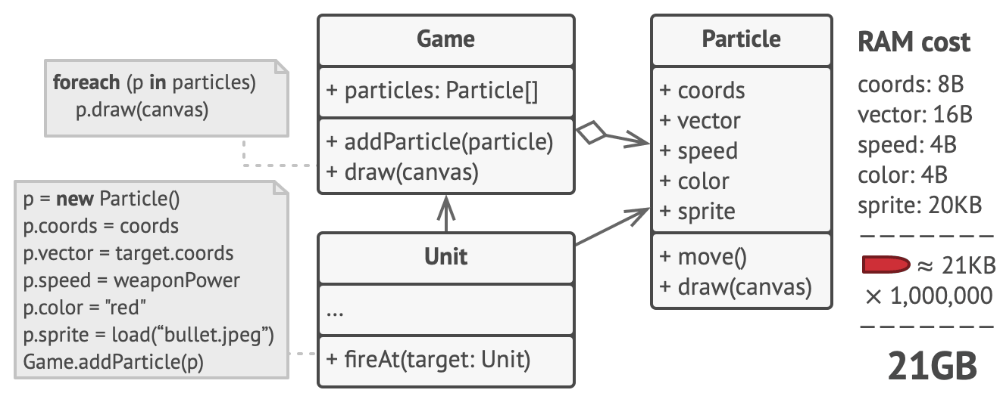
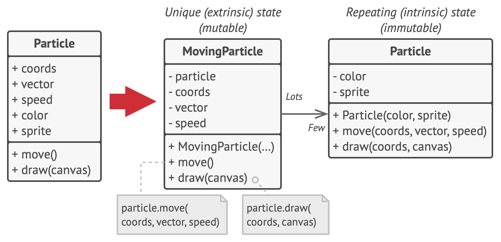
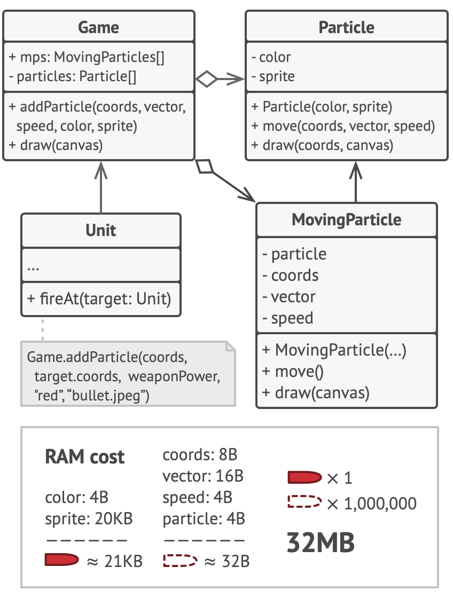
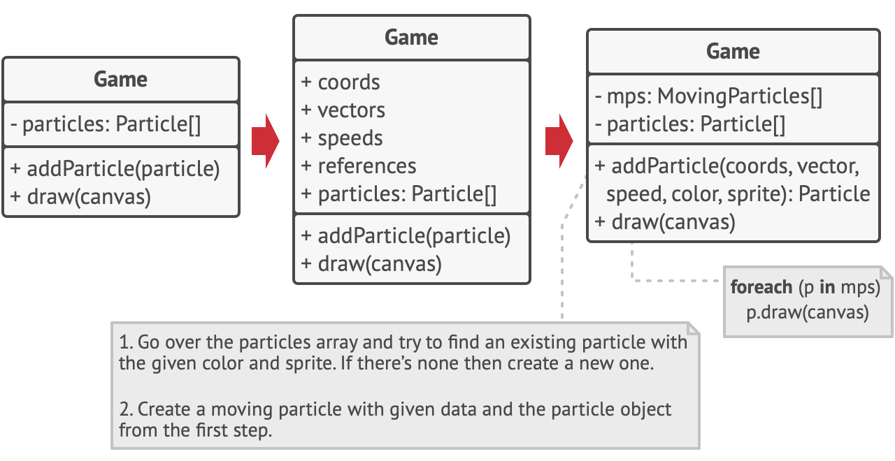
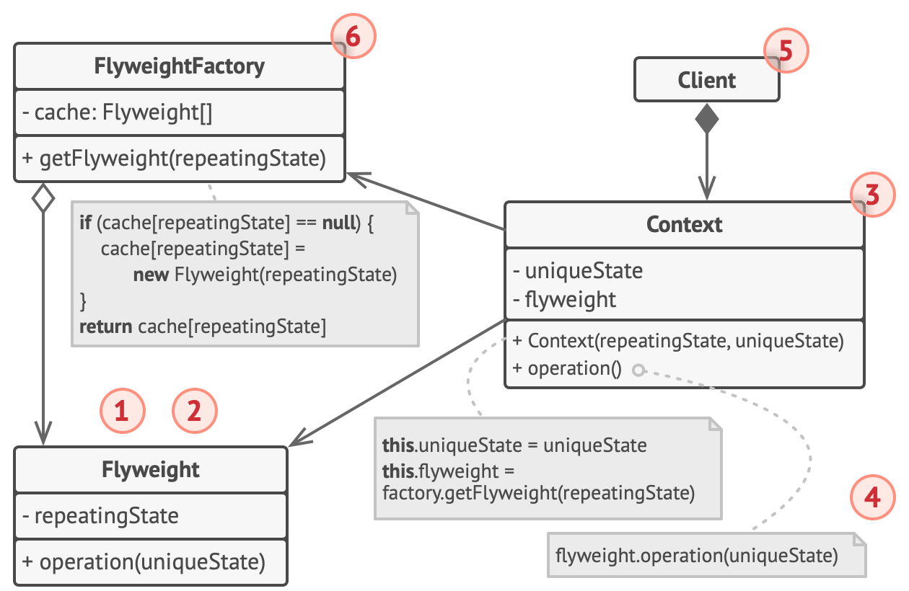
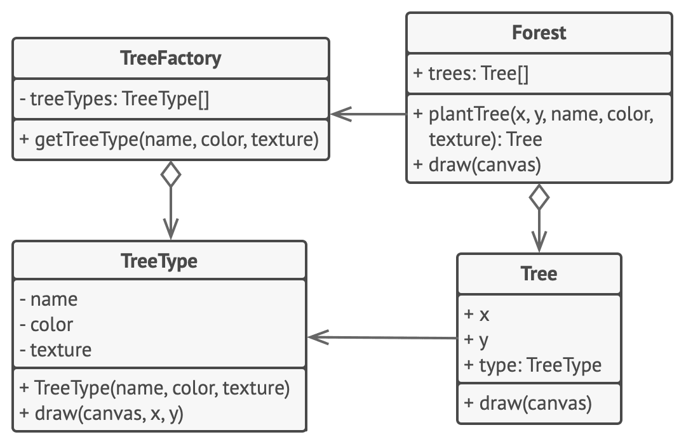

# Flyweight


**Type:** Structural · **Also known as:** Cache

> **The 10-second version:** you have a million objects and they are all secretly carrying the same heavy suitcase. Flyweight takes the suitcase away from each of them, keeps one copy in a cupboard, and hands every object a key to that cupboard instead.

<br clear="all">

## Quick card

| | |
|---|---|
| **Problem it solves** | A huge number of objects that are *mostly identical*. The duplicated part of their state is what's eating the RAM, not the objects themselves. |
| **Core move** | Split each object's fields into **intrinsic** (same for thousands of objects, immutable) and **extrinsic** (unique per object, changes). Keep only the intrinsic part in a shared, immutable object; pass the extrinsic part in as method arguments or hold it in a small context object that points at the shared one. |
| **You'll recognise it by** | A factory/`GetXxx(key)` method that returns a **cached** object instead of constructing a new one, plus a class with no setters and a constructor that runs exactly once per distinct key. Method signatures that look oddly parameter-heavy (`Draw(canvas, x, y)` instead of `Draw(canvas)`). |
| **Rating** | Complexity ★★★ · Popularity ★☆☆ |
| **Closest relatives** | Singleton (one instance vs. one-per-distinct-value), Composite (shared leaf nodes), Facade (many tiny objects vs. one big front), Proxy & Object Pool (both cache, for entirely different reasons) |
| **In your stack** | 2 million car listings sharing ~30 000 `VariantSpec` objects; interning `city`/`fuelType`/`colour` strings when hydrating a big result set; one shared depreciation curve per model-year used by every pricing calculation; a long-running RabbitMQ consumer that dedupes repeated string fields so the LOH stops growing |

### How to read this file

Technical first, plain English second. 🗣️ marks the plain-English version. Part 1 is Refactoring.Guru's material with their diagrams; Parts 2–7 are code, your stack, and the stuff that makes it stick.

---

# PART 1 — The pattern

## 1. Intent

**Flyweight** is a structural design pattern that lets you fit more objects into the available amount of RAM by sharing common parts of state between multiple objects instead of keeping all of the data in each object.


### 🗣️ In plain words

You are running out of memory because you have too many objects, and those objects are repeating themselves. Not repeating *each other* entirely — a bullet at (10, 40) really is different from a bullet at (900, 3) — but the *expensive* fields are identical.

Flyweight's whole idea is: stop copying the expensive fields. Store them once, in an object that never changes, and let every user of them hold a reference.

This is the one GoF pattern that is unapologetically a **performance optimisation**. Every other pattern is sold on flexibility or decoupling. This one is sold on bytes. If you don't have a bytes problem, you don't have a Flyweight problem.

---

## 2. Problem

To have some fun after long working hours, you decided to create a simple video game: players would be moving around a map and shooting each other. You chose to implement a realistic particle system and make it a distinctive feature of the game. Vast quantities of bullets, missiles, and shrapnel from explosions should fly all over the map and deliver a thrilling experience to the player.

Upon its completion, you pushed the last commit, built the game and sent it to your friend for a test drive. Although the game was running flawlessly on your machine, your friend wasn’t able to play for long. On his computer, the game kept crashing after a few minutes of gameplay. After spending several hours digging through debug logs, you discovered that the game crashed because of an insufficient amount of RAM. It turned out that your friend’s rig was much less powerful than your own computer, and that’s why the problem emerged so quickly on his machine.

The actual problem was related to your particle system. Each particle, such as a bullet, a missile or a piece of shrapnel was represented by a separate object containing plenty of data. At some point, when the carnage on a player’s screen reached its climax, newly created particles no longer fit into the remaining RAM, so the program crashed.



### 🗣️ In plain words

The pain is always the same shape: *the object count is legitimate, the per-object size is not.*

Here's our version of it. You're building an in-process search/ranking index over used-car listings so you can filter and sort 2 million of them without a database round-trip per request.

```csharp
// ❌ The naive hydration. Compiles, works, dies in production.
public sealed class CarListing
{
    public int    ListingId  { get; init; }
    public int    Price      { get; init; }
    public int    KmDriven   { get; init; }
    public string City       { get; init; }   // "Pune" — repeated ~90 000 times
    public string FuelType   { get; init; }   // "Petrol" — repeated ~1 100 000 times
    public string Colour     { get; init; }   // "Pearl White" — repeated a lot

    // …and then the part that actually kills you:
    public string Make       { get; init; }   // "Maruti Suzuki"
    public string Model      { get; init; }   // "Swift"
    public string Variant    { get; init; }   // "VXi AMT"
    public int    EngineCc   { get; init; }
    public string Transmission { get; init; }
    public string BodyType   { get; init; }
    public decimal Mileage   { get; init; }
    public int    SeatingCapacity { get; init; }
    public IReadOnlyList<string> Features { get; init; } // ~40 strings. Per listing.
}
```

Count the damage. There are maybe **30 000 distinct variants** on the market. There are **2 000 000 listings**. That `Features` list — forty strings, a `List<string>` header, an array — is roughly 1 KB per listing once you include the string objects themselves. Multiply by 2 000 000 and you have burned **~2 GB** storing the same forty strings about sixty-six times each, on average.

The listings are not the problem. `ListingId`, `Price`, `KmDriven` are 12 bytes and genuinely different every time. The *spec* is the problem, and there are only 30 000 real answers to "what is the spec?".

The version of this you'll actually hit first is subtler and nastier: it's not a crash, it's **Gen 2 growth and LOH fragmentation in a long-running service**. The process starts at 400 MB, and four hours later it's at 5 GB, and the GC pause graph looks like a saw. Nobody wrote a leak. Everybody wrote a duplicate.

---

## 3. Solution

On closer inspection of the `Particle` class, you may notice that the color and sprite fields consume a lot more memory than other fields. What’s worse is that these two fields store almost identical data across all particles. For example, all bullets have the same color and sprite.



Other parts of a particle’s state, such as coordinates, movement vector and speed, are unique to each particle. After all, the values of these fields change over time. This data represents the always changing context in which the particle exists, while the color and sprite remain constant for each particle.

This constant data of an object is usually called the *intrinsic state*. It lives within the object; other objects can only read it, not change it. The rest of the object’s state, often altered “from the outside” by other objects, is called the *extrinsic state*.

The Flyweight pattern suggests that you stop storing the extrinsic state inside the object. Instead, you should pass this state to specific methods which rely on it. Only the intrinsic state stays within the object, letting you reuse it in different contexts. As a result, you’d need fewer of these objects since they only differ in the intrinsic state, which has much fewer variations than the extrinsic.



Let’s return to our game. Assuming that we had extracted the extrinsic state from our particle class, only three different objects would suffice to represent all particles in the game: a bullet, a missile, and a piece of shrapnel. As you’ve probably guessed by now, an object that only stores the intrinsic state is called a flyweight.

#### Extrinsic state storage

Where does the extrinsic state move to? Some class should still store it, right? In most cases, it gets moved to the container object, which aggregates objects before we apply the pattern.

In our case, that’s the main `Game` object that stores all particles in the `particles` field. To move the extrinsic state into this class, you need to create several array fields for storing coordinates, vectors, and speed of each individual particle. But that’s not all. You need another array for storing references to a specific flyweight that represents a particle. These arrays must be in sync so that you can access all data of a particle using the same index.



A more elegant solution is to create a separate context class that would store the extrinsic state along with reference to the flyweight object. This approach would require having just a single array in the container class.

Wait a second! Won’t we need to have as many of these contextual objects as we had at the very beginning? Technically, yes. But the thing is, these objects are much smaller than before. The most memory-consuming fields have been moved to just a few flyweight objects. Now, a thousand small contextual objects can reuse a single heavy flyweight object instead of storing a thousand copies of its data.

#### Flyweight and immutability

Since the same flyweight object can be used in different contexts, you have to make sure that its state can’t be modified. A flyweight should initialize its state just once, via constructor parameters. It shouldn’t expose any setters or public fields to other objects.

#### Flyweight factory

For more convenient access to various flyweights, you can create a factory method that manages a pool of existing flyweight objects. The method accepts the intrinsic state of the desired flyweight from a client, looks for an existing flyweight object matching this state, and returns it if it was found. If not, it creates a new flyweight and adds it to the pool.

There are several options where this method could be placed. The most obvious place is a flyweight container. Alternatively, you could create a new factory class. Or you could make the factory method static and put it inside an actual flyweight class.

### 🗣️ In plain words

Three mechanical moves. That's the whole pattern.

1. **Cut the class in half along the "does this repeat?" line.** Everything that is identical across thousands of instances and never mutates goes into a new class — the flyweight. Everything unique-and-changing stays behind. In our case: `VariantSpec` (make, model, variant, engine, features) versus `CarListing` (id, price, km, dealer, photos).
2. **Make the flyweight immutable.** Fields set in the constructor, no setters, no public mutable collections. It is going to be shared by a million callers who have no idea about each other; a single setter turns a memory optimisation into a data-corruption bug.
3. **Put a factory in front of it that caches by key.** `GetSpec(variantId)` checks a dictionary, returns the existing instance if it's there, constructs and stores it if it isn't. Clients are forbidden from calling `new VariantSpec(...)` directly — that's the rule that makes the whole thing work.

And the consequence you have to accept: any behaviour that lived on the old class and needed the unique data now has to **receive that data as a parameter**. `spec.EstimateResaleValue(kmDriven, ageMonths)` instead of `listing.EstimateResaleValue()`. That parameter-passing is the visible tax.

> **The key insight:** Flyweight doesn't reduce the number of objects — you still have 2 000 000 listings. It reduces the *average size* of an object, by making the big part of it a shared pointer instead of a copy. You trade `N × size(heavy)` for `N × size(pointer) + distinct × size(heavy)`. The pattern pays off exactly when `N` is much larger than `distinct`, and not one moment before.

---

## 4. Real-world analogy

Refactoring.Guru does not give one for this pattern, so here are mine.

**The hotel key card.** A 400-room hotel doesn't give each guest a bespoke lock. There are maybe six *lock behaviours* in the building — standard room, suite, gym, pool, service corridor, roof — and 400 guests each carrying a card that is essentially a couple of bytes: room number and permission level. The behaviour (the shared, expensive, identical part) is programmed once into the door system; the card (the tiny, unique, per-guest part) is passed *into* that behaviour at the moment you tap it. If every guest instead carried a full copy of the lock firmware in their pocket, that would be the naive design.

**The parts catalogue in a service centre.** A workshop servicing 600 cars a month doesn't write out the full specification of a brake pad on every job card — its compound, its dimensions, its torque spec, its part drawing. The job card says `Part 5820-B, qty 2, fitted to KA-01-AB-1234`. The heavy, unchanging description lives once in the catalogue on the shelf; the job cards carry a reference plus the bits that are genuinely unique to the job (which car, which date, which mechanic). The catalogue is the flyweight pool; the part number is the key; the job card is the context.

---

## 5. Structure



1. The Flyweight pattern is merely an optimization. Before applying it, make sure your program does have the RAM consumption problem related to having a massive number of similar objects in memory at the same time. Make sure that this problem can’t be solved in any other meaningful way.
2. The **Flyweight** class contains the portion of the original object’s state that can be shared between multiple objects. The same flyweight object can be used in many different contexts. The state stored inside a flyweight is called *intrinsic.* The state passed to the flyweight’s methods is called *extrinsic.*
3. The **Context** class contains the extrinsic state, unique across all original objects. When a context is paired with one of the flyweight objects, it represents the full state of the original object.
4. Usually, the behavior of the original object remains in the flyweight class. In this case, whoever calls a flyweight’s method must also pass appropriate bits of the extrinsic state into the method’s parameters. On the other hand, the behavior can be moved to the context class, which would use the linked flyweight merely as a data object.
5. The **Client** calculates or stores the extrinsic state of flyweights. From the client’s perspective, a flyweight is a template object which can be configured at runtime by passing some contextual data into parameters of its methods.
6. The **Flyweight Factory** manages a pool of existing flyweights. With the factory, clients don’t create flyweights directly. Instead, they call the factory, passing it bits of the intrinsic state of the desired flyweight. The factory looks over previously created flyweights and either returns an existing one that matches search criteria or creates a new one if nothing is found.

### 🗣️ Participants & roles — cheat table

| Role | What it is in code | Example from the site | Equivalent in reader's stack |
|---|---|---|---|
| **Flyweight** | An immutable class holding only intrinsic state. No setters. Constructor-only initialisation. Methods take extrinsic state as parameters. | `TreeType` (name, colour, texture) with `draw(canvas, x, y)` | `VariantSpec` — make, model, variant, engine, body type, feature list. `EstimateResale(km, ageMonths)` takes the per-listing bits as arguments. |
| **Context** | A small class holding the extrinsic state plus **one reference field** to its flyweight. This is the object you have millions of. | `Tree` (x, y, `type: TreeType`) | `CarListing` — id, price, km, city id, dealer id, and `Spec: VariantSpec`. Around 48 bytes instead of 1 KB. |
| **Flyweight Factory** | Holds the pool (a dictionary keyed by intrinsic state) and the *only* creation path. Returns cached instances. | `TreeFactory.getTreeType(name, colour, texture)` | `VariantSpecPool.Get(variantId)` backed by a `ConcurrentDictionary<int, VariantSpec>`, registered as a singleton in DI. |
| **Client** | Computes or stores extrinsic state and asks the factory for flyweights. Never calls `new` on a flyweight. | `Forest.plantTree(x, y, name, colour, texture)` | Your hydration layer: the Dapper/EF mapper that turns a `SELECT` into `CarListing` objects, or the RabbitMQ consumer that deserialises a listing-updated event. |

The line worth memorising from the site's numbered list: *"whoever calls a flyweight's method must also pass appropriate bits of the extrinsic state into the method's parameters."* That sentence is the entire API consequence of the pattern.

### 🤝 Collaboration — who calls whom

```
   CLIENT (hydration loop, 2 000 000 iterations)
      │
      │ 1. for each DB row:
      │       spec = pool.Get(row.VariantId)      ◄── the ONE hop that matters
      ▼
 ┌──────────────────────────────┐
 │  VariantSpecPool  (factory)  │
 │  ──────────────────────────  │
 │  Dictionary<int, VariantSpec>│
 │                              │
 │  Get(id):                    │
 │    hit?  ──────► return it   │   30 000 misses, 1 970 000 hits
 │    miss? ──────► build once, │
 │                  store, ret. │
 └──────────────┬───────────────┘
                │ returns the SAME reference every time
                ▼
        ┌────────────────────┐
        │   VariantSpec      │  ← ~1 KB each, exactly 30 000 of them
        │   (FLYWEIGHT)      │
        │   immutable        │
        └────────▲───────────┘
                 │ one 8-byte reference per listing
     ┌───────────┼───────────┬───────────────┐
     │           │           │               │
 ┌───┴────┐ ┌────┴───┐ ┌─────┴──┐       ┌────┴───┐
 │Listing │ │Listing │ │Listing │  ...  │Listing │   2 000 000 of these
 │ 40 B   │ │ 40 B   │ │ 40 B   │       │ 40 B   │   ← CONTEXT objects
 └───┬────┘ └────────┘ └────────┘       └────────┘
     │
     │ 2. listing.EstimateResale()
     │      └─► spec.EstimateResale(this.KmDriven, this.AgeMonths)
     ▼                              ▲                ▲
   result                           └── extrinsic state pushed IN ──┘
```

**The single most important hop** is step 1: `pool.Get(...)` returning an *already existing reference*. If that method ever returns a freshly-constructed object on a cache hit, you still have the pattern's complexity and none of its benefit — and it will look completely correct in every unit test. Assert reference equality in a test (`ReferenceEquals(pool.Get(7), pool.Get(7))`), not value equality.

---

## 6. Pseudocode (the website's example)

In this example, the **Flyweight** pattern helps to reduce memory usage when rendering millions of tree objects on a canvas.



The pattern extracts the repeating intrinsic state from a main `Tree` class and moves it into the flyweight class `TreeType`.

Now instead of storing the same data in multiple objects, it’s kept in just a few flyweight objects and linked to appropriate `Tree` objects which act as contexts. The client code creates new tree objects using the flyweight factory, which encapsulates the complexity of searching for the right object and reusing it if needed.

```
// The flyweight class contains a portion of the state of a
// tree. These fields store values that are unique for each
// particular tree. For instance, you won't find here the tree
// coordinates. But the texture and colors shared between many
// trees are here. Since this data is usually BIG, you'd waste a
// lot of memory by keeping it in each tree object. Instead, we
// can extract texture, color and other repeating data into a
// separate object which lots of individual tree objects can
// reference.
class TreeType is
    field name
    field color
    field texture
    constructor TreeType(name, color, texture) { ... }
    method draw(canvas, x, y) is
        // 1. Create a bitmap of a given type, color & texture.
        // 2. Draw the bitmap on the canvas at X and Y coords.

// Flyweight factory decides whether to re-use existing
// flyweight or to create a new object.
class TreeFactory is
    static field treeTypes: collection of tree types
    static method getTreeType(name, color, texture) is
        type = treeTypes.find(name, color, texture)
        if (type == null)
            type = new TreeType(name, color, texture)
            treeTypes.add(type)
        return type

// The contextual object contains the extrinsic part of the tree
// state. An application can create billions of these since they
// are pretty small: just two integer coordinates and one
// reference field.
class Tree is
    field x,y
    field type: TreeType
    constructor Tree(x, y, type) { ... }
    method draw(canvas) is
        type.draw(canvas, this.x, this.y)

// The Tree and the Forest classes are the flyweight's clients.
// You can merge them if you don't plan to develop the Tree
// class any further.
class Forest is
    field trees: collection of Trees

    method plantTree(x, y, name, color, texture) is
        type = TreeFactory.getTreeType(name, color, texture)
        tree = new Tree(x, y, type)
        trees.add(tree)

    method draw(canvas) is
        foreach (tree in trees) do
            tree.draw(canvas)
```

### 🗣️ Reading that pseudocode

- **`class TreeType` holds `name`, `color`, `texture` — and no `x`, `y`.** That omission *is* the pattern. Read the field list of a flyweight class first; if a coordinate or a timestamp or an ID sneaks in there, the split is wrong.
- **`method draw(canvas, x, y)`** — the coordinates arrive as arguments. Before the refactoring this would have been `draw(canvas)` reading `this.x`. Every flyweight refactoring widens some method signatures; that widening is how you spot the pattern in a diff.
- **`static method getTreeType(name, color, texture)`** does find-or-create, and it's `static` here purely for convenience. In real code make it an instance method on an injected singleton — statics make it untestable and make the pool live for the whole process whether you want that or not.
- **`treeTypes.find(name, color, texture)`** — note the key is the *full intrinsic state*, not just the name. Two tree types with the same name but different textures must not collide. In C#/TS this means either a composite key string, a `record` key, or a tuple key.
- **`class Tree` is just `x`, `y`, and a reference.** That's the context class, and it's the one you have billions of. The comment says it out loud: "An application can create billions of these since they are pretty small."
- **`Forest.plantTree` never calls `new TreeType`.** It goes through the factory. Then it *does* call `new Tree` directly — contexts are cheap and unshared, so they're constructed normally. Only the flyweight is pooled. People get this backwards and try to pool the contexts too; that's an Object Pool, a different pattern with a different reason to exist.

---

## 7. Applicability — when to reach for it

**Use the Flyweight pattern only when your program must support a huge number of objects which barely fit into available RAM.**

The benefit of applying the pattern depends heavily on how and where it’s used. It’s most useful when:

- an application needs to spawn a huge number of similar objects
- this drains all available RAM on a target device
- the objects contain duplicate states which can be extracted and shared between multiple objects

### ✅ Quick checklist

- [ ] Have I **measured** and confirmed that memory (not CPU, not latency) is the actual constraint?
- [ ] Do I have **hundreds of thousands or more** instances alive *at the same time*, not just created over time?
- [ ] Is the ratio of instances to *distinct* values of the heavy fields at least ~10:1? (2M listings / 30k variants = 66:1 → yes. 2M listings / 1.9M distinct → absolutely not.)
- [ ] Is the shareable part genuinely **immutable**, or can I make it so without a fight?
- [ ] Can I tolerate **wider method signatures** and a team member asking "why is the spec not on the listing?" forever?
- [ ] Have I already ruled out the cheaper fixes — paging, streaming, `struct`/value types, a smaller DTO, `string` interning alone, or just not loading 2 million rows into RAM?

If the last box is unchecked, stop. Flyweight is the answer *after* the boring answers have failed.

---

## 8. How to implement — step by step

1. Divide fields of a class that will become a flyweight into two parts:

   - the intrinsic state: the fields that contain unchanging data duplicated across many objects
   - the extrinsic state: the fields that contain contextual data unique to each object
2. Leave the fields that represent the intrinsic state in the class, but make sure they’re immutable. They should take their initial values only inside the constructor.
3. Go over methods that use fields of the extrinsic state. For each field used in the method, introduce a new parameter and use it instead of the field.
4. Optionally, create a factory class to manage the pool of flyweights. It should check for an existing flyweight before creating a new one. Once the factory is in place, clients must only request flyweights through it. They should describe the desired flyweight by passing its intrinsic state to the factory.
5. The client must store or calculate values of the extrinsic state (context) to be able to call methods of flyweight objects. For the sake of convenience, the extrinsic state along with the flyweight-referencing field may be moved to a separate context class.

### 🗣️ The same steps, blunt version

1. **Open the class and draw a line down the field list.** Left column: fields that are the same for thousands of instances. Right column: fields that differ per instance or change over time. If you can't draw the line cleanly, the pattern doesn't apply — stop here.
2. **Make a new class out of the left column. Freeze it.** `readonly`/`init`-only fields, `const` methods in C++, `Object.freeze` in JS, no setters anywhere, and no exposing a mutable `List<T>` — hand out `IReadOnlyList<T>`.
3. **Fix every method that just lost a field.** Wherever a method used to read `this.price`, it now takes `price` as a parameter. Follow the compiler errors; they *are* the work list.
4. **Write the factory. Make the constructor private/internal so nobody can bypass it.** Find-or-create against a dictionary keyed by the complete intrinsic state. Thread-safe if the app is (`ConcurrentDictionary.GetOrAdd`, `computeIfAbsent`, a mutex around the C++ map).
5. **Give the remaining fields a home.** Either the old class becomes the context (holding extrinsic state + one reference to the flyweight), or the caller passes them in at every call site. The context class is almost always the better choice — it keeps call sites readable.
6. **Prove it worked.** Take a memory snapshot before and after. If the number didn't move materially, revert — you've added indirection for nothing, and the revert costs less today than in six months.

---

## 9. Pros and cons

- ✅ You can save lots of RAM, assuming your program has tons of similar objects.

- ⛔ You might be trading RAM over CPU cycles when some of the context data needs to be recalculated each time somebody calls a flyweight method.
- ⛔ The code becomes much more complicated. New team members will always be wondering why the state of an entity was separated in such a way.

### ⚖️ Honest trade-offs from the trenches

**The true cost is comprehension, and it's permanent.** Splitting one intuitive class into flyweight + context + factory means that for the rest of the codebase's life, `listing.Model` becomes `listing.Spec.Model`, and every new joiner asks why. The pattern also quietly imposes a discipline you have to police: the flyweight must never be mutated. One `public set` added by someone in a hurry, six months later, and you have a bug where editing one listing's "Features" silently changes 65 000 other listings. That bug is genuinely hard to find because it looks like data corruption, not like code. If you adopt Flyweight, make the flyweight type a `sealed record` or a class with `init`-only members and `IReadOnlyList<T>`, and write a test that asserts immutability by reflection if you're feeling paranoid.

**The tell that it's worth it** is a specific one: you have a memory profile where a *single type* accounts for a huge share of the heap, and the distinct-value count of that type's heavy fields is small. A dotMemory / `dotnet-gcdump` snapshot showing `System.String` at 3 GB with a 60:1 duplicate factor is the tell. "The service feels heavy" is not the tell. Do the profile first — I have seen a team apply Flyweight to save 40 MB in a service whose real problem was a 900 MB response cache.

**There's a second, quieter win people forget: cache locality.** Shrinking the context object from 1 KB to 40 bytes doesn't just save RAM, it means 25× more listings per CPU cache line's worth of scanning. A filter-and-sort pass over 2 million small contexts is often *faster* than over 2 million fat objects, even though you added a pointer dereference. That said, the site's own con is real too — if you have to recompute extrinsic state on every flyweight call instead of storing it, you've traded RAM for CPU and you need to measure which one you actually wanted.

**What modern tooling gives you for free — use these before hand-rolling.** In C#: the runtime already interns all string *literals*, `string.Intern` exists (but see the warning in Part 5), `System.Xml.NameTable` does exactly this for XML names, and `CultureInfo.GetCultureInfo` / `TimeZoneInfo.FindSystemTimeZoneById` hand back cached instances rather than new ones. A DI container registering a type as **Singleton** is a one-flyweight pool — but note it gives you *one* instance, not one-per-key, so it only covers the degenerate case; for keyed pools .NET 8's `[FromKeyedServices]` / `AddKeyedSingleton` gets you closer, and beyond a handful of keys you want your own `ConcurrentDictionary` anyway. In C++, `boost::flyweight<T>` is a real, mature implementation of exactly this pattern, and Qt's implicitly-shared types (`QString`, `QPixmap`) apply the idea at the library level. In TypeScript, `Symbol.for()` is a built-in global intern pool, and any decent 3D/2D library (three.js materials, PixiJS textures) already shares the heavy asset behind the scenes. Reach for a library before you write a pool.

---

## 10. Relations with other patterns

- You can implement shared leaf nodes of the [Composite](https://refactoring.guru/design-patterns/composite) tree as [Flyweights](https://refactoring.guru/design-patterns/flyweight) to save some RAM.
- [Flyweight](https://refactoring.guru/design-patterns/flyweight) shows how to make lots of little objects, whereas [Facade](https://refactoring.guru/design-patterns/facade) shows how to make a single object that represents an entire subsystem.
- [Flyweight](https://refactoring.guru/design-patterns/flyweight) would resemble [Singleton](https://refactoring.guru/design-patterns/singleton) if you somehow managed to reduce all shared states of the objects to just one flyweight object. But there are two fundamental differences between these patterns:

  1. There should be only one Singleton instance, whereas a *Flyweight* class can have multiple instances with different intrinsic states.
  2. The *Singleton* object can be mutable. Flyweight objects are immutable.

### 🗣️ Disambiguation table

| Pattern | What it's really for | How to tell it apart from Flyweight |
|---|---|---|
| **Singleton** | Guaranteeing exactly one instance of a thing, usually because it owns a resource or global coordination point. | Singleton has **one** instance, period, and it's often mutable. Flyweight has **one per distinct value** — thirty thousand of them — and they're immutable by law. If you can meaningfully ask "which one?", it's a Flyweight. |
| **Object Pool** *(not GoF, but people confuse it constantly)* | Avoiding the **cost of construction/destruction** by recycling instances — DB connections, `ArrayPool<T>` buffers, game bullets. | Pooled objects are **mutable, rented, reset and returned**, and no two users share one simultaneously. Flyweights are shared by everyone at once and never returned. Pool = time optimisation. Flyweight = space optimisation. |
| **Proxy** (specifically caching proxy) | Standing in for another object to control access — lazy loading, remote calls, caching responses. | A caching proxy caches *results of an operation* and has the same interface as the thing it fronts. A flyweight factory caches *instances of a data type* and has a completely different interface from the flyweight. |
| **Composite** | Building whole-part tree structures treated uniformly. | Complementary, not competing — the site says it directly: implement Composite's **shared leaf nodes** as Flyweights. A folder tree where a thousand nodes share one "PDF file type" object is both patterns at once. |
| **Facade** | One object fronting a whole subsystem. | Opposite direction. Facade makes *one* object where there were many. Flyweight makes *many tiny* objects where there was one fat one per instance. |

> **The separator sentence:** *Singleton says "there is only one." Flyweight says "there is only one **per value**." Object Pool says "there is only one **at a time**."*

---

# PART 2 — Official code examples from Refactoring.Guru

## 2.1 C#

**Complexity:** ★★★ (3/3)

**Popularity:** ★☆☆ (1/3)

**Usage examples:** The Flyweight pattern has a single purpose: minimizing memory intake. If your program doesn’t struggle with a shortage of RAM, then you might just ignore this pattern for a while.

**Identification:** Flyweight can be recognized by a creation method that returns cached objects instead of creating new.

### Conceptual Example

This example illustrates the structure of the **Flyweight** design pattern. It focuses on answering these questions:

- What classes does it consist of?
- What roles do these classes play?
- In what way the elements of the pattern are related?

##### **Program.cs:** Conceptual example

```csharp
using System;
using System.Collections.Generic;
using System.Linq;
using System.Text.Json;
// Use Json.NET library, you can download it from NuGet Package Manager

namespace RefactoringGuru.DesignPatterns.Flyweight.Conceptual
{
    // The Flyweight stores a common portion of the state (also called intrinsic
    // state) that belongs to multiple real business entities. The Flyweight
    // accepts the rest of the state (extrinsic state, unique for each entity)
    // via its method parameters.
    public class Flyweight
    {
        private Car _sharedState;

        public Flyweight(Car car)
        {
            this._sharedState = car;
        }

        public void Operation(Car uniqueState)
        {
            string s = JsonSerializer.Serialize(this._sharedState);
            string u = JsonSerializer.Serialize(uniqueState);
            Console.WriteLine($"Flyweight: Displaying shared {s} and unique {u} state.");
        }
    }

    // The Flyweight Factory creates and manages the Flyweight objects. It
    // ensures that flyweights are shared correctly. When the client requests a
    // flyweight, the factory either returns an existing instance or creates a
    // new one, if it doesn't exist yet.
    public class FlyweightFactory
    {
        private List<Tuple<Flyweight, string>> flyweights = new List<Tuple<Flyweight, string>>();

        public FlyweightFactory(params Car[] args)
        {
            foreach (var elem in args)
            {
                flyweights.Add(new Tuple<Flyweight, string>(new Flyweight(elem), this.getKey(elem)));
            }
        }

        // Returns a Flyweight's string hash for a given state.
        public string getKey(Car key)
        {
            List<string> elements = new List<string>();

            elements.Add(key.Model);
            elements.Add(key.Color);
            elements.Add(key.Company);

            if (key.Owner != null && key.Number != null)
            {
                elements.Add(key.Number);
                elements.Add(key.Owner);
            }

            elements.Sort();

            return string.Join("_", elements);
        }

        // Returns an existing Flyweight with a given state or creates a new
        // one.
        public Flyweight GetFlyweight(Car sharedState)
        {
            string key = this.getKey(sharedState);

            if (flyweights.Where(t => t.Item2 == key).Count() == 0)
            {
                Console.WriteLine("FlyweightFactory: Can't find a flyweight, creating new one.");
                this.flyweights.Add(new Tuple<Flyweight, string>(new Flyweight(sharedState), key));
            }
            else
            {
                Console.WriteLine("FlyweightFactory: Reusing existing flyweight.");
            }
            return this.flyweights.Where(t => t.Item2 == key).FirstOrDefault().Item1;
        }

        public void listFlyweights()
        {
            var count = flyweights.Count;
            Console.WriteLine($"\nFlyweightFactory: I have {count} flyweights:");
            foreach (var flyweight in flyweights)
            {
                Console.WriteLine(flyweight.Item2);
            }
        }
    }

    public class Car
    {
        public string Owner { get; set; }

        public string Number { get; set; }

        public string Company { get; set; }

        public string Model { get; set; }

        public string Color { get; set; }
    }

    class Program
    {
        static void Main(string[] args)
        {
            // The client code usually creates a bunch of pre-populated
            // flyweights in the initialization stage of the application.
            var factory = new FlyweightFactory(
                new Car { Company = "Chevrolet", Model = "Camaro2018", Color = "pink" },
                new Car { Company = "Mercedes Benz", Model = "C300", Color = "black" },
                new Car { Company = "Mercedes Benz", Model = "C500", Color = "red" },
                new Car { Company = "BMW", Model = "M5", Color = "red" },
                new Car { Company = "BMW", Model = "X6", Color = "white" }
            );
            factory.listFlyweights();

            addCarToPoliceDatabase(factory, new Car {
                Number = "CL234IR",
                Owner = "James Doe",
                Company = "BMW",
                Model = "M5",
                Color = "red"
            });

            addCarToPoliceDatabase(factory, new Car {
                Number = "CL234IR",
                Owner = "James Doe",
                Company = "BMW",
                Model = "X1",
                Color = "red"
            });

            factory.listFlyweights();
        }

        public static void addCarToPoliceDatabase(FlyweightFactory factory, Car car)
        {
            Console.WriteLine("\nClient: Adding a car to database.");

            var flyweight = factory.GetFlyweight(new Car {
                Color = car.Color,
                Model = car.Model,
                Company = car.Company
            });

            // The client code either stores or calculates extrinsic state and
            // passes it to the flyweight's methods.
            flyweight.Operation(car);
        }
    }
}
```

##### **Output.txt:** Execution result

```output
FlyweightFactory: I have 5 flyweights:
Camaro2018_Chevrolet_pink
black_C300_Mercedes Benz
C500_Mercedes Benz_red
BMW_M5_red
BMW_white_X6

Client: Adding a car to database.
FlyweightFactory: Reusing existing flyweight.
Flyweight: Displaying shared {"Owner":null,"Number":null,"Company":"BMW","Model":"M5","Color":"red"} and unique {"Owner":"James Doe","Number":"CL234IR","Company":"BMW","Model":"M5","Color":"red"} state.

Client: Adding a car to database.
FlyweightFactory: Can't find a flyweight, creating new one.
Flyweight: Displaying shared {"Owner":null,"Number":null,"Company":"BMW","Model":"X1","Color":"red"} and unique {"Owner":"James Doe","Number":"CL234IR","Company":"BMW","Model":"X1","Color":"red"} state.

FlyweightFactory: I have 6 flyweights:
Camaro2018_Chevrolet_pink
black_C300_Mercedes Benz
C500_Mercedes Benz_red
BMW_M5_red
BMW_white_X6
BMW_red_X1
```

## 2.2 TypeScript

**Complexity:** ★★★ (3/3)

**Popularity:** ☆☆☆ (0/3)

**Usage examples:** The Flyweight pattern has a single purpose: minimizing memory intake. If your program doesn’t struggle with a shortage of RAM, then you might just ignore this pattern for a while.

**Identification:** Flyweight can be recognized by a creation method that returns cached objects instead of creating new.

### Conceptual Example

This example illustrates the structure of the **Flyweight** design pattern and focuses on the following questions:

- What classes does it consist of?
- What roles do these classes play?
- In what way the elements of the pattern are related?

##### **index.ts:** Conceptual example

```typescript
/**
 * The Flyweight stores a common portion of the state (also called intrinsic
 * state) that belongs to multiple real business entities. The Flyweight accepts
 * the rest of the state (extrinsic state, unique for each entity) via its
 * method parameters.
 */
class Flyweight {
    private sharedState: any;

    constructor(sharedState: any) {
        this.sharedState = sharedState;
    }

    public operation(uniqueState): void {
        const s = JSON.stringify(this.sharedState);
        const u = JSON.stringify(uniqueState);
        console.log(`Flyweight: Displaying shared (${s}) and unique (${u}) state.`);
    }
}

/**
 * The Flyweight Factory creates and manages the Flyweight objects. It ensures
 * that flyweights are shared correctly. When the client requests a flyweight,
 * the factory either returns an existing instance or creates a new one, if it
 * doesn't exist yet.
 */
class FlyweightFactory {
    private flyweights: {[key: string]: Flyweight} = <any>{};

    constructor(initialFlyweights: string[][]) {
        for (const state of initialFlyweights) {
            this.flyweights[this.getKey(state)] = new Flyweight(state);
        }
    }

    /**
     * Returns a Flyweight's string hash for a given state.
     */
    private getKey(state: string[]): string {
        return state.join('_');
    }

    /**
     * Returns an existing Flyweight with a given state or creates a new one.
     */
    public getFlyweight(sharedState: string[]): Flyweight {
        const key = this.getKey(sharedState);

        if (!(key in this.flyweights)) {
            console.log('FlyweightFactory: Can\'t find a flyweight, creating new one.');
            this.flyweights[key] = new Flyweight(sharedState);
        } else {
            console.log('FlyweightFactory: Reusing existing flyweight.');
        }

        return this.flyweights[key];
    }

    public listFlyweights(): void {
        const count = Object.keys(this.flyweights).length;
        console.log(`\nFlyweightFactory: I have ${count} flyweights:`);
        for (const key in this.flyweights) {
            console.log(key);
        }
    }
}

/**
 * The client code usually creates a bunch of pre-populated flyweights in the
 * initialization stage of the application.
 */
const factory = new FlyweightFactory([
    ['Chevrolet', 'Camaro2018', 'pink'],
    ['Mercedes Benz', 'C300', 'black'],
    ['Mercedes Benz', 'C500', 'red'],
    ['BMW', 'M5', 'red'],
    ['BMW', 'X6', 'white'],
    // ...
]);
factory.listFlyweights();

// ...

function addCarToPoliceDatabase(
    ff: FlyweightFactory, plates: string, owner: string,
    brand: string, model: string, color: string,
) {
    console.log('\nClient: Adding a car to database.');
    const flyweight = ff.getFlyweight([brand, model, color]);

    // The client code either stores or calculates extrinsic state and passes it
    // to the flyweight's methods.
    flyweight.operation([plates, owner]);
}

addCarToPoliceDatabase(factory, 'CL234IR', 'James Doe', 'BMW', 'M5', 'red');

addCarToPoliceDatabase(factory, 'CL234IR', 'James Doe', 'BMW', 'X1', 'red');

factory.listFlyweights();
```

##### **Output.txt:** Execution result

```output
FlyweightFactory: I have 5 flyweights:
Chevrolet_Camaro2018_pink
Mercedes Benz_C300_black
Mercedes Benz_C500_red
BMW_M5_red
BMW_X6_white

Client: Adding a car to database.
FlyweightFactory: Reusing existing flyweight.
Flyweight: Displaying shared (["BMW","M5","red"]) and unique (["CL234IR","James Doe"]) state.

Client: Adding a car to database.
FlyweightFactory: Can't find a flyweight, creating new one.
Flyweight: Displaying shared (["BMW","X1","red"]) and unique (["CL234IR","James Doe"]) state.

FlyweightFactory: I have 6 flyweights:
Chevrolet_Camaro2018_pink
Mercedes Benz_C300_black
Mercedes Benz_C500_red
BMW_M5_red
BMW_X6_white
BMW_X1_red
```

## 2.3 C++

**Complexity:** ★★★ (3/3)

**Popularity:** ★☆☆ (1/3)

**Usage examples:** The Flyweight pattern has a single purpose: minimizing memory intake. If your program doesn’t struggle with a shortage of RAM, then you might just ignore this pattern for a while.

**Identification:** Flyweight can be recognized by a creation method that returns cached objects instead of creating new.

### Conceptual Example

This example illustrates the structure of the **Flyweight** design pattern. It focuses on answering these questions:

- What classes does it consist of?
- What roles do these classes play?
- In what way the elements of the pattern are related?

##### **main.cc:** Conceptual example

```cpp
/**
 * Flyweight Design Pattern
 *
 * Intent: Lets you fit more objects into the available amount of RAM by sharing
 * common parts of state between multiple objects, instead of keeping all of the
 * data in each object.
 */

struct SharedState
{
    std::string brand_;
    std::string model_;
    std::string color_;

    SharedState(const std::string &brand, const std::string &model, const std::string &color)
        : brand_(brand), model_(model), color_(color)
    {
    }

    friend std::ostream &operator<<(std::ostream &os, const SharedState &ss)
    {
        return os << "[ " << ss.brand_ << " , " << ss.model_ << " , " << ss.color_ << " ]";
    }
};

struct UniqueState
{
    std::string owner_;
    std::string plates_;

    UniqueState(const std::string &owner, const std::string &plates)
        : owner_(owner), plates_(plates)
    {
    }

    friend std::ostream &operator<<(std::ostream &os, const UniqueState &us)
    {
        return os << "[ " << us.owner_ << " , " << us.plates_ << " ]";
    }
};

/**
 * The Flyweight stores a common portion of the state (also called intrinsic
 * state) that belongs to multiple real business entities. The Flyweight accepts
 * the rest of the state (extrinsic state, unique for each entity) via its
 * method parameters.
 */
class Flyweight
{
private:
    SharedState *shared_state_;

public:
    Flyweight(const SharedState *shared_state) : shared_state_(new SharedState(*shared_state))
    {
    }
    Flyweight(const Flyweight &other) : shared_state_(new SharedState(*other.shared_state_))
    {
    }
    ~Flyweight()
    {
        delete shared_state_;
    }
    SharedState *shared_state() const
    {
        return shared_state_;
    }
    void Operation(const UniqueState &unique_state) const
    {
        std::cout << "Flyweight: Displaying shared (" << *shared_state_ << ") and unique (" << unique_state << ") state.\n";
    }
};
/**
 * The Flyweight Factory creates and manages the Flyweight objects. It ensures
 * that flyweights are shared correctly. When the client requests a flyweight,
 * the factory either returns an existing instance or creates a new one, if it
 * doesn't exist yet.
 */
class FlyweightFactory
{
    /**
     * @var Flyweight[]
     */
private:
    std::unordered_map<std::string, Flyweight> flyweights_;
    /**
     * Returns a Flyweight's string hash for a given state.
     */
    std::string GetKey(const SharedState &ss) const
    {
        return ss.brand_ + "_" + ss.model_ + "_" + ss.color_;
    }

public:
    FlyweightFactory(std::initializer_list<SharedState> share_states)
    {
        for (const SharedState &ss : share_states)
        {
            this->flyweights_.insert(std::make_pair<std::string, Flyweight>(this->GetKey(ss), Flyweight(&ss)));
        }
    }

    /**
     * Returns an existing Flyweight with a given state or creates a new one.
     */
    Flyweight GetFlyweight(const SharedState &shared_state)
    {
        std::string key = this->GetKey(shared_state);
        if (this->flyweights_.find(key) == this->flyweights_.end())
        {
            std::cout << "FlyweightFactory: Can't find a flyweight, creating new one.\n";
            this->flyweights_.insert(std::make_pair(key, Flyweight(&shared_state)));
        }
        else
        {
            std::cout << "FlyweightFactory: Reusing existing flyweight.\n";
        }
        return this->flyweights_.at(key);
    }
    void ListFlyweights() const
    {
        size_t count = this->flyweights_.size();
        std::cout << "\nFlyweightFactory: I have " << count << " flyweights:\n";
        for (std::pair<std::string, Flyweight> pair : this->flyweights_)
        {
            std::cout << pair.first << "\n";
        }
    }
};

// ...
void AddCarToPoliceDatabase(
    FlyweightFactory &ff, const std::string &plates, const std::string &owner,
    const std::string &brand, const std::string &model, const std::string &color)
{
    std::cout << "\nClient: Adding a car to database.\n";
    const Flyweight &flyweight = ff.GetFlyweight({brand, model, color});
    // The client code either stores or calculates extrinsic state and passes it
    // to the flyweight's methods.
    flyweight.Operation({owner, plates});
}

/**
 * The client code usually creates a bunch of pre-populated flyweights in the
 * initialization stage of the application.
 */

int main()
{
    FlyweightFactory *factory = new FlyweightFactory({{"Chevrolet", "Camaro2018", "pink"}, {"Mercedes Benz", "C300", "black"}, {"Mercedes Benz", "C500", "red"}, {"BMW", "M5", "red"}, {"BMW", "X6", "white"}});
    factory->ListFlyweights();

    AddCarToPoliceDatabase(*factory,
                            "CL234IR",
                            "James Doe",
                            "BMW",
                            "M5",
                            "red");

    AddCarToPoliceDatabase(*factory,
                            "CL234IR",
                            "James Doe",
                            "BMW",
                            "X1",
                            "red");
    factory->ListFlyweights();
    delete factory;

    return 0;
}
```

##### **Output.txt:** Execution result

```output
FlyweightFactory: I have 5 flyweights:
BMW_X6_white
Mercedes Benz_C500_red
Mercedes Benz_C300_black
BMW_M5_red
Chevrolet_Camaro2018_pink

Client: Adding a car to database.
FlyweightFactory: Reusing existing flyweight.
Flyweight: Displaying shared ([ BMW , M5 , red ]) and unique ([ CL234IR , James Doe ]) state.

Client: Adding a car to database.
FlyweightFactory: Can't find a flyweight, creating new one.
Flyweight: Displaying shared ([ BMW , X1 , red ]) and unique ([ CL234IR , James Doe ]) state.

FlyweightFactory: I have 6 flyweights:
BMW_X1_red
Mercedes Benz_C300_black
BMW_X6_white
Mercedes Benz_C500_red
BMW_M5_red
Chevrolet_Camaro2018_pink
```

## 2.4 Java

**Complexity:** ★★★ (3/3)

**Popularity:** ★☆☆ (1/3)

**Usage examples:** The Flyweight pattern has a single purpose: minimizing memory intake. If your program doesn’t struggle with a shortage of RAM, then you might just ignore this pattern for a while.

**Identification:** Flyweight can be recognized by a creation method that returns cached objects instead of creating new.

### Rendering a forest

In this example, we’re going to render a forest (1.000.000 trees)! Each tree will be represented by its own object that has some state (coordinates, texture and so on). Although the program does its primary job, naturally, it consumes a lot of RAM.

The reason is simple: too many tree objects contain duplicate data (name, texture, color). That’s why we can apply the Flyweight pattern and store these values inside separate flyweight objects (the `TreeType` class). Now, instead of storing the same data in thousands of `Tree` objects, we’re going to reference one of the flyweight objects with a particular set of values.

The client code isn’t going to notice anything since the complexity of reusing flyweight objects is buried inside a flyweight factory.

#### **trees**

##### **trees/Tree.java:** Contains state unique for each tree

```java
package refactoring_guru.flyweight.example.trees;

import java.awt.*;

public class Tree {
    private int x;
    private int y;
    private TreeType type;

    public Tree(int x, int y, TreeType type) {
        this.x = x;
        this.y = y;
        this.type = type;
    }

    public void draw(Graphics g) {
        type.draw(g, x, y);
    }
}
```

##### **trees/TreeType.java:** Contains state shared by several trees

```java
package refactoring_guru.flyweight.example.trees;

import java.awt.*;

public class TreeType {
    private String name;
    private Color color;
    private String otherTreeData;

    public TreeType(String name, Color color, String otherTreeData) {
        this.name = name;
        this.color = color;
        this.otherTreeData = otherTreeData;
    }

    public void draw(Graphics g, int x, int y) {
        g.setColor(Color.BLACK);
        g.fillRect(x - 1, y, 3, 5);
        g.setColor(color);
        g.fillOval(x - 5, y - 10, 10, 10);
    }
}
```

##### **trees/TreeFactory.java:** Encapsulates complexity of flyweight creation

```java
package refactoring_guru.flyweight.example.trees;

import java.awt.*;
import java.util.HashMap;
import java.util.Map;

public class TreeFactory {
    static Map<String, TreeType> treeTypes = new HashMap<>();

    public static TreeType getTreeType(String name, Color color, String otherTreeData) {
        TreeType result = treeTypes.get(name);
        if (result == null) {
            result = new TreeType(name, color, otherTreeData);
            treeTypes.put(name, result);
        }
        return result;
    }
}
```

#### **forest**

##### **forest/Forest.java:** Forest, which we draw

```java
package refactoring_guru.flyweight.example.forest;

import refactoring_guru.flyweight.example.trees.Tree;
import refactoring_guru.flyweight.example.trees.TreeFactory;
import refactoring_guru.flyweight.example.trees.TreeType;

import javax.swing.*;
import java.awt.*;
import java.util.ArrayList;
import java.util.List;

public class Forest extends JFrame {
    private List<Tree> trees = new ArrayList<>();

    public void plantTree(int x, int y, String name, Color color, String otherTreeData) {
        TreeType type = TreeFactory.getTreeType(name, color, otherTreeData);
        Tree tree = new Tree(x, y, type);
        trees.add(tree);
    }

    @Override
    public void paint(Graphics graphics) {
        for (Tree tree : trees) {
            tree.draw(graphics);
        }
    }
}
```

##### **Demo.java:** Client code

```java
package refactoring_guru.flyweight.example;

import refactoring_guru.flyweight.example.forest.Forest;

import java.awt.*;

public class Demo {
    static int CANVAS_SIZE = 500;
    static int TREES_TO_DRAW = 1000000;
    static int TREE_TYPES = 2;

    public static void main(String[] args) {
        Forest forest = new Forest();
        for (int i = 0; i < Math.floor(TREES_TO_DRAW / TREE_TYPES); i++) {
            forest.plantTree(random(0, CANVAS_SIZE), random(0, CANVAS_SIZE),
                    "Summer Oak", Color.GREEN, "Oak texture stub");
            forest.plantTree(random(0, CANVAS_SIZE), random(0, CANVAS_SIZE),
                    "Autumn Oak", Color.ORANGE, "Autumn Oak texture stub");
        }
        forest.setSize(CANVAS_SIZE, CANVAS_SIZE);
        forest.setVisible(true);

        System.out.println(TREES_TO_DRAW + " trees drawn");
        System.out.println("---------------------");
        System.out.println("Memory usage:");
        System.out.println("Tree size (8 bytes) * " + TREES_TO_DRAW);
        System.out.println("+ TreeTypes size (~30 bytes) * " + TREE_TYPES + "");
        System.out.println("---------------------");
        System.out.println("Total: " + ((TREES_TO_DRAW * 8 + TREE_TYPES * 30) / 1024 / 1024) +
                "MB (instead of " + ((TREES_TO_DRAW * 38) / 1024 / 1024) + "MB)");
    }

    private static int random(int min, int max) {
        return min + (int) (Math.random() * ((max - min) + 1));
    }
}
```

##### **OutputDemo.png:** Screenshot

##### **OutputDemo.txt:** RAM usage stats

```output
1000000 trees drawn
---------------------
Memory usage:
Tree size (8 bytes) * 1000000
+ TreeTypes size (~30 bytes) * 2
---------------------
Total: 7MB (instead of 36MB)
```

---

# PART 3 — Learn it by building it

## 3.1 The dumbest possible version — TypeScript

### ❌ BEFORE — the version that eats 2 GB

```ts
// Every listing carries its own full copy of the spec. Looks perfectly innocent.
interface Listing {
  listingId: number;
  price: number;
  kmDriven: number;
  registrationYear: number;
  // ---- the duplicated 1 KB ----
  make: string;
  model: string;
  variant: string;
  bodyType: string;
  fuelType: string;
  transmission: string;
  engineCc: number;
  seatingCapacity: number;
  features: string[];          // ~40 strings, per listing, again and again
}

function hydrate(rows: Row[]): Listing[] {
  return rows.map(r => ({
    listingId: r.listing_id,
    price: r.price,
    kmDriven: r.km_driven,
    registrationYear: r.reg_year,
    make: r.make,
    model: r.model,
    variant: r.variant,
    bodyType: r.body_type,
    fuelType: r.fuel_type,
    transmission: r.transmission,
    engineCc: r.engine_cc,
    seatingCapacity: r.seating_capacity,
    features: JSON.parse(r.features_json),   // 👈 a brand-new array of 40 strings. 2M times.
  }));
}

// 2 000 000 rows in → Node RSS climbs past 3 GB → the box OOMs.
// And there are only ~30 000 distinct (make, model, variant) triples in the whole dataset.
```

Note the specific crime on the `JSON.parse` line: it *cannot* share anything even in principle, because `JSON.parse` allocates fresh strings and a fresh array every single call.

### ✅ AFTER — flyweight + context + factory

```ts
// ─────────────────────────────────────────────────────────────
//  1. THE FLYWEIGHT — intrinsic state only, deeply immutable
// ─────────────────────────────────────────────────────────────

export class VariantSpec {
  readonly make: string;
  readonly model: string;
  readonly variant: string;
  readonly bodyType: string;
  readonly fuelType: string;
  readonly transmission: string;
  readonly engineCc: number;
  readonly seatingCapacity: number;
  readonly features: readonly string[];

  // 👈 private-by-convention: only VariantSpecPool is allowed to call this.
  //    TS has no true package-private, so we mark it and enforce it in review.
  private constructor(init: {
    make: string; model: string; variant: string; bodyType: string;
    fuelType: string; transmission: string; engineCc: number;
    seatingCapacity: number; features: readonly string[];
  }) {
    this.make = init.make;
    this.model = init.model;
    this.variant = init.variant;
    this.bodyType = init.bodyType;
    this.fuelType = init.fuelType;
    this.transmission = init.transmission;
    this.engineCc = init.engineCc;
    this.seatingCapacity = init.seatingCapacity;
    this.features = Object.freeze([...init.features]);   // 👈 defensive copy, then frozen
    Object.freeze(this);                                  // 👈 runtime guard, not just compile-time
  }

  /** Internal escape hatch used only by the pool. */
  static __create(init: ConstructorParameters<typeof VariantSpec>[0]): VariantSpec {
    // eslint-disable-next-line @typescript-eslint/no-explicit-any
    return new (VariantSpec as any)(init);
  }

  get displayName(): string {
    return `${this.make} ${this.model} ${this.variant}`;
  }

  // ─── EXTRINSIC STATE ARRIVES AS PARAMETERS ───
  // This used to be estimateResale() reading this.kmDriven and this.regYear.
  // Now the caller must supply them. That widening IS the pattern. 👈
  estimateResale(exShowroomPrice: number, kmDriven: number, ageMonths: number): number {
    const ageFactor  = Math.pow(0.88, ageMonths / 12);
    const kmPenalty  = Math.min(0.30, (kmDriven / 100_000) * 0.15);
    const dieselBump = this.fuelType === 'Diesel' && kmDriven > 60_000 ? 0.97 : 1.0;
    return Math.round(exShowroomPrice * ageFactor * (1 - kmPenalty) * dieselBump);
  }
}

// ─────────────────────────────────────────────────────────────
//  2. THE FACTORY — find-or-create, keyed by full intrinsic state
// ─────────────────────────────────────────────────────────────

type SpecInit = Parameters<typeof VariantSpec.__create>[0];

export class VariantSpecPool {
  private readonly pool = new Map<string, VariantSpec>();
  private hits = 0;
  private misses = 0;

  /** Key must cover EVERY intrinsic field, or two different specs will collide. 👈 */
  private static keyOf(i: SpecInit): string {
    return [
      i.make, i.model, i.variant, i.bodyType, i.fuelType,
      i.transmission, i.engineCc, i.seatingCapacity,
      i.features.join('\u0001'),          // \u0001 can't appear in a feature name
    ].join('\u0000');
  }

  get(init: SpecInit): VariantSpec {
    const key = VariantSpecPool.keyOf(init);
    const existing = this.pool.get(key);
    if (existing !== undefined) {        // 👈 THE LINE. Return the SAME reference.
      this.hits++;
      return existing;
    }
    this.misses++;
    const created = VariantSpec.__create(init);
    this.pool.set(key, created);
    return created;
  }

  get stats() {
    return {
      distinct: this.pool.size,
      hits: this.hits,
      misses: this.misses,
      sharingRatio: this.misses === 0 ? 0 : (this.hits + this.misses) / this.misses,
    };
  }
}

// ─────────────────────────────────────────────────────────────
//  3. THE CONTEXT — extrinsic state + ONE reference. Tiny.
// ─────────────────────────────────────────────────────────────

export class CarListing {
  constructor(
    readonly listingId: number,
    readonly price: number,
    readonly kmDriven: number,
    readonly ageMonths: number,
    readonly cityId: number,
    readonly dealerId: number,
    readonly spec: VariantSpec,          // 👈 8 bytes of pointer, not 1 KB of copy
  ) {}

  // Convenience wrapper: the context knows its own extrinsic state,
  // so it can feed it to the flyweight. Call sites stay readable.
  estimateResale(exShowroomPrice: number): number {
    return this.spec.estimateResale(exShowroomPrice, this.kmDriven, this.ageMonths);
  }

  get title(): string {
    return `${this.spec.displayName} · ${this.kmDriven.toLocaleString('en-IN')} km`;
  }
}

// ─────────────────────────────────────────────────────────────
//  4. THE CLIENT — hydration. Never calls `new VariantSpec`.
// ─────────────────────────────────────────────────────────────

interface Row {
  listing_id: number; price: number; km_driven: number; age_months: number;
  city_id: number; dealer_id: number;
  make: string; model: string; variant: string; body_type: string;
  fuel_type: string; transmission: string; engine_cc: number;
  seating_capacity: number; features_json: string;
}

export function hydrate(rows: Row[], pool: VariantSpecPool): CarListing[] {
  const out: CarListing[] = new Array(rows.length);
  for (let i = 0; i < rows.length; i++) {
    const r = rows[i];
    const spec = pool.get({                    // 👈 the one hop that matters
      make: r.make,
      model: r.model,
      variant: r.variant,
      bodyType: r.body_type,
      fuelType: r.fuel_type,
      transmission: r.transmission,
      engineCc: r.engine_cc,
      seatingCapacity: r.seating_capacity,
      features: JSON.parse(r.features_json),   // parsed, then thrown away on a cache hit
    });
    out[i] = new CarListing(
      r.listing_id, r.price, r.km_driven, r.age_months,
      r.city_id, r.dealer_id, spec,
    );
  }
  return out;
}

// ─────────────────────────────────────────────────────────────
//  5. PROOF — the test that actually verifies the pattern
// ─────────────────────────────────────────────────────────────

function demo(rows: Row[]) {
  const pool = new VariantSpecPool();
  const listings = hydrate(rows, pool);

  console.log(pool.stats);
  // { distinct: 29_814, hits: 1_970_186, misses: 29_814, sharingRatio: 67.08 }

  const a = listings.find(l => l.spec.variant === 'VXi AMT')!;
  const b = listings.filter(l => l.spec.variant === 'VXi AMT')[1]!;
  console.log(a.spec === b.spec);            // 👈 true — REFERENCE equality, not deep equality
}
```

**What to notice:**

- `a.spec === b.spec` is the only assertion that proves the pattern works. Deep-equality tests pass even when the pool is broken and allocating a fresh object every call — which is the single most common way this gets silently mis-implemented.
- The key function concatenates **every** intrinsic field with a separator that can't appear in the data. Keying on `variant` alone would merge a 2019 VXi with a 2023 VXi that gained two features.
- `Object.freeze(this)` plus `readonly` gives you both compile-time and runtime protection. `readonly` alone is erased at runtime, and shared mutable state is the failure mode that hurts.
- The context class still exposes `estimateResale(price)` — the *caller* doesn't have to know about the split. That's how you keep the pattern from leaking into every call site.
- `JSON.parse` still runs 2 million times and its result is discarded 1.97 million times. You traded RAM for CPU, exactly as the site's con warns. If that parse shows up in a flame graph, key the pool on `r.features_json` (the raw string) and only parse on a miss.
- Nothing pools `CarListing`. Contexts are cheap, unique and unshared. Only the flyweight is pooled.

---

## 3.2 Same thing in C#

```csharp
using System;
using System.Collections.Concurrent;
using System.Collections.Generic;
using System.Collections.Immutable;
using System.Linq;

namespace Marketplace.Catalog;

// ───────────────────────────────────────────────────────────────
//  FLYWEIGHT — a sealed record with init-only members.
//  Records give us value-equality and a compiler-generated GetHashCode,
//  which is exactly what a pool key wants.
// ───────────────────────────────────────────────────────────────
public sealed record VariantSpec
{
    public required string Make            { get; init; }
    public required string Model           { get; init; }
    public required string Variant         { get; init; }
    public required BodyType Body          { get; init; }
    public required FuelType Fuel          { get; init; }
    public required Transmission Gearbox   { get; init; }
    public required int    EngineCc        { get; init; }
    public required int    SeatingCapacity { get; init; }

    // ImmutableArray<T> is a struct wrapping a frozen array:
    // no defensive copy on every read, and genuinely unmodifiable. 👈
    public required ImmutableArray<string> Features { get; init; }

    public string DisplayName => $"{Make} {Model} {Variant}";

    // ─── extrinsic state arrives as parameters ─── 👈
    public decimal EstimateResale(decimal exShowroom, int kmDriven, int ageMonths)
    {
        var ageFactor  = (decimal)Math.Pow(0.88, ageMonths / 12.0);
        var kmPenalty  = Math.Min(0.30m, kmDriven / 100_000m * 0.15m);
        var fuelFactor = (Fuel, kmDriven) switch
        {
            (FuelType.Diesel, > 60_000) => 0.97m,   // high-km diesels discount harder
            (FuelType.Electric, _)      => 0.92m,   // battery-age anxiety
            (FuelType.Cng, _)           => 1.02m,
            _                           => 1.00m,
        };
        return decimal.Round(exShowroom * ageFactor * (1 - kmPenalty) * fuelFactor, 0);
    }
}

public enum BodyType     { Hatchback, Sedan, Suv, Muv, Coupe, Pickup }
public enum FuelType     { Petrol, Diesel, Cng, Electric, Hybrid }
public enum Transmission { Manual, Amt, Cvt, Dct, TorqueConverter }

// ───────────────────────────────────────────────────────────────
//  FLYWEIGHT FACTORY — one per process, registered as a singleton.
// ───────────────────────────────────────────────────────────────
public interface IVariantSpecPool
{
    VariantSpec Get(VariantSpecKey key);
    PoolStats Stats { get; }
}

/// <summary>
/// The pool key. A readonly record struct: value equality, GetHashCode for free,
/// and no heap allocation per lookup.
/// </summary>
public readonly record struct VariantSpecKey(
    string Make,
    string Model,
    string Variant,
    BodyType Body,
    FuelType Fuel,
    Transmission Gearbox,
    int EngineCc,
    int SeatingCapacity,
    string FeaturesRaw);          // raw JSON/CSV — cheap to hash, parsed only on a miss 👈

public readonly record struct PoolStats(int Distinct, long Hits, long Misses)
{
    public double SharingRatio => Misses == 0 ? 0 : (double)(Hits + Misses) / Misses;
}

public sealed class VariantSpecPool : IVariantSpecPool
{
    private readonly ConcurrentDictionary<VariantSpecKey, VariantSpec> _pool = new();
    private long _hits;
    private long _misses;

    public VariantSpec Get(VariantSpecKey key)
    {
        // Fast path first: TryGetValue avoids allocating the factory closure
        // on the 98% of calls that are hits. GetOrAdd alone would allocate
        // a display-class per call when the lambda captures `key`. 👈
        if (_pool.TryGetValue(key, out var existing))
        {
            Interlocked.Increment(ref _hits);
            return existing;
        }

        Interlocked.Increment(ref _misses);
        return _pool.GetOrAdd(key, static k => new VariantSpec
        {
            Make            = string.Intern(k.Make),    // see Part 5 before copying this line
            Model           = k.Model,
            Variant         = k.Variant,
            Body            = k.Body,
            Fuel            = k.Fuel,
            Gearbox         = k.Gearbox,
            EngineCc        = k.EngineCc,
            SeatingCapacity = k.SeatingCapacity,
            Features        = k.FeaturesRaw
                                 .Split('|', StringSplitOptions.RemoveEmptyEntries)
                                 .ToImmutableArray(),
        });
    }

    public PoolStats Stats => new(_pool.Count, Interlocked.Read(ref _hits), Interlocked.Read(ref _misses));
}

// ───────────────────────────────────────────────────────────────
//  CONTEXT — small, one reference to the flyweight.
//  A class, not a record: we have millions and we don't want
//  the generated equality machinery on the hot path.
// ───────────────────────────────────────────────────────────────
public sealed class CarListing
{
    public required int         ListingId { get; init; }
    public required decimal     Price     { get; init; }
    public required int         KmDriven  { get; init; }
    public required int         AgeMonths { get; init; }
    public required short       CityId    { get; init; }
    public required int         DealerId  { get; init; }
    public required VariantSpec Spec      { get; init; }   // 👈 8 bytes, shared

    public string Title => $"{Spec.DisplayName} · {KmDriven:N0} km";

    public decimal EstimateResale(decimal exShowroom)
        => Spec.EstimateResale(exShowroom, KmDriven, AgeMonths);
}

// ───────────────────────────────────────────────────────────────
//  CLIENT — hydration from a reader. Never news up a VariantSpec.
// ───────────────────────────────────────────────────────────────
public sealed class ListingHydrator(IVariantSpecPool pool)
{
    public List<CarListing> Hydrate(IEnumerable<ListingRow> rows)
    {
        var result = new List<CarListing>(capacity: 2_000_000);
        foreach (var r in rows)
        {
            var spec = pool.Get(new VariantSpecKey(
                r.Make, r.Model, r.Variant, r.Body, r.Fuel,
                r.Gearbox, r.EngineCc, r.SeatingCapacity, r.FeaturesRaw));

            result.Add(new CarListing
            {
                ListingId = r.ListingId,
                Price     = r.Price,
                KmDriven  = r.KmDriven,
                AgeMonths = r.AgeMonths,
                CityId    = r.CityId,
                DealerId  = r.DealerId,
                Spec      = spec,
            });
        }
        return result;
    }
}

public sealed record ListingRow(
    int ListingId, decimal Price, int KmDriven, int AgeMonths, short CityId, int DealerId,
    string Make, string Model, string Variant, BodyType Body, FuelType Fuel,
    Transmission Gearbox, int EngineCc, int SeatingCapacity, string FeaturesRaw);
```

Wiring and the test that proves it:

```csharp
// Program.cs
builder.Services.AddSingleton<IVariantSpecPool, VariantSpecPool>();  // 👈 Singleton, always
builder.Services.AddScoped<ListingHydrator>();

// ListingHydratorTests.cs
[Fact]
public void Identical_variants_share_one_spec_instance()
{
    var pool = new VariantSpecPool();
    var hydrator = new ListingHydrator(pool);

    var rows = new[]
    {
        new ListingRow(1, 550_000m, 42_000, 38, 1, 7, "Maruti Suzuki", "Swift", "VXi AMT",
                       BodyType.Hatchback, FuelType.Petrol, Transmission.Amt, 1197, 5, "ABS|Airbags|AC"),
        new ListingRow(2, 610_000m, 19_000, 22, 2, 9, "Maruti Suzuki", "Swift", "VXi AMT",
                       BodyType.Hatchback, FuelType.Petrol, Transmission.Amt, 1197, 5, "ABS|Airbags|AC"),
    };

    var listings = hydrator.Hydrate(rows);

    Assert.Same(listings[0].Spec, listings[1].Spec);   // 👈 REFERENCE equality. Not Assert.Equal.
    Assert.Equal(1, pool.Stats.Distinct);
}
```

**C#-specific notes:**

- **`record` is the right shape for a flyweight** — init-only members, value equality, and a compiler-generated `GetHashCode` that covers every member. But note the trap: a `record` containing an `ImmutableArray<string>` gets *reference* equality on that member, not sequence equality. That's why the pool is keyed by a separate `VariantSpecKey` holding the raw string, not by the `VariantSpec` itself.
- **`readonly record struct` for the key** avoids one heap allocation per lookup — and at 2 million lookups that's 2 million allocations you don't make.
- **`TryGetValue` before `GetOrAdd`.** `GetOrAdd(key, k => new VariantSpec { ... })` with a lambda that captures anything allocates a closure object *on every call*, hit or miss. Either check first, or use a `static` lambda (as above) so nothing is captured. This is the single most common perf bug in hand-rolled flyweight pools.
- **`ConcurrentDictionary.GetOrAdd` may run the factory more than once** under contention — it guarantees only one *result* wins, not one *invocation*. For an immutable flyweight that's harmless (you just throw away a duplicate). If construction has a side effect, it isn't.
- **Don't let the pool be a memory leak.** A `ConcurrentDictionary<K, V>` is a GC root for everything in it. With a bounded key space (30 000 variants) that's fine and desirable. With an unbounded one (per-user, per-listing) you've built a leak with a pattern name on it. Bound it, or use `ConditionalWeakTable<TKey, TValue>` / `WeakReference<T>` values so entries can be collected.
- **`ImmutableArray<T>` over `List<T>`** for the shared collection. `IReadOnlyList<T>` is a *view*, not a guarantee — the caller can cast back to `List<T>` and mutate. `ImmutableArray<T>` genuinely cannot be changed.
- `required` + `init` means the object is fully formed at the end of construction and never again, which is exactly the contract the pattern demands.

---

## 3.3 C++

```cpp
#include <atomic>
#include <cstdint>
#include <iostream>
#include <memory>
#include <mutex>
#include <string>
#include <string_view>
#include <unordered_map>
#include <vector>

namespace marketplace {

// ───────────────────────────────────────────────────────────────
//  FLYWEIGHT — immutable, heap-allocated once, shared by const ref.
//  All members const: the compiler enforces immutability for us. 👈
// ───────────────────────────────────────────────────────────────
class VariantSpec {
public:
    VariantSpec(std::string make, std::string model, std::string variant,
                std::uint16_t engineCc, std::uint8_t seats,
                std::vector<std::string> features)
        : make_(std::move(make)),              // 👈 move, don't copy: these strings
          model_(std::move(model)),            //     are built once and never again
          variant_(std::move(variant)),
          engineCc_(engineCc),
          seats_(seats),
          features_(std::move(features)) {}

    // No copy, no move. A flyweight must exist at exactly one address —
    // copying one silently defeats the entire pattern. 👈
    VariantSpec(const VariantSpec&)            = delete;
    VariantSpec& operator=(const VariantSpec&) = delete;
    VariantSpec(VariantSpec&&)                 = delete;
    VariantSpec& operator=(VariantSpec&&)      = delete;

    // const accessors returning const refs: no copying on read.
    [[nodiscard]] const std::string& make()    const noexcept { return make_; }
    [[nodiscard]] const std::string& model()   const noexcept { return model_; }
    [[nodiscard]] const std::string& variant() const noexcept { return variant_; }
    [[nodiscard]] std::uint16_t      engineCc()const noexcept { return engineCc_; }
    [[nodiscard]] const std::vector<std::string>& features() const noexcept { return features_; }

    // ─── extrinsic state passed in, method is const ─── 👈
    [[nodiscard]] double estimateResale(double exShowroom,
                                        std::uint32_t kmDriven,
                                        std::uint16_t ageMonths) const noexcept {
        const double ageFactor = std::pow(0.88, ageMonths / 12.0);
        const double kmPenalty = std::min(0.30, (kmDriven / 100000.0) * 0.15);
        return exShowroom * ageFactor * (1.0 - kmPenalty);
    }

private:
    const std::string              make_;
    const std::string              model_;
    const std::string              variant_;
    const std::uint16_t            engineCc_;
    const std::uint8_t             seats_;
    const std::vector<std::string> features_;
};

// ───────────────────────────────────────────────────────────────
//  FACTORY — owns the flyweights, hands out shared_ptr<const T>.
//  weak_ptr values let unused specs be reclaimed; swap to
//  shared_ptr values if you want the pool to be permanent.
// ───────────────────────────────────────────────────────────────
class VariantSpecPool {
public:
    using Handle = std::shared_ptr<const VariantSpec>;   // 👈 const: callers cannot mutate

    Handle get(const std::string& make, const std::string& model,
               const std::string& variant, std::uint16_t engineCc,
               std::uint8_t seats, const std::vector<std::string>& features) {
        const std::string key = makeKey(make, model, variant, engineCc, seats, features);

        std::lock_guard<std::mutex> lock(mutex_);
        if (auto it = pool_.find(key); it != pool_.end()) {
            if (Handle alive = it->second.lock()) {   // 👈 weak_ptr may have expired
                ++hits_;
                return alive;
            }
        }
        ++misses_;
        auto created = std::make_shared<const VariantSpec>(
            make, model, variant, engineCc, seats, features);
        pool_[key] = created;                          // stores a weak_ptr
        return created;
    }

    [[nodiscard]] std::size_t distinct() const {
        std::lock_guard<std::mutex> lock(mutex_);
        return pool_.size();
    }
    [[nodiscard]] std::uint64_t hits()   const noexcept { return hits_; }
    [[nodiscard]] std::uint64_t misses() const noexcept { return misses_; }

private:
    static std::string makeKey(const std::string& make, const std::string& model,
                               const std::string& variant, std::uint16_t engineCc,
                               std::uint8_t seats, const std::vector<std::string>& features) {
        std::string k;
        k.reserve(128);
        k += make;  k += '\x01';
        k += model; k += '\x01';
        k += variant; k += '\x01';
        k += std::to_string(engineCc); k += '\x01';
        k += std::to_string(seats);
        for (const auto& f : features) { k += '\x01'; k += f; }
        return k;
    }

    mutable std::mutex mutex_;
    std::unordered_map<std::string, std::weak_ptr<const VariantSpec>> pool_;
    std::uint64_t hits_{0};
    std::uint64_t misses_{0};
};

// ───────────────────────────────────────────────────────────────
//  CONTEXT — tiny value type. Copyable, movable, no virtuals.
//  sizeof ≈ 32 bytes: 16 for shared_ptr, 16 for the scalars.
// ───────────────────────────────────────────────────────────────
struct CarListing {
    std::uint32_t                 listingId{};
    std::uint32_t                 price{};
    std::uint32_t                 kmDriven{};
    std::uint16_t                 ageMonths{};
    std::uint16_t                 cityId{};
    VariantSpecPool::Handle       spec;      // 👈 shared, refcounted, const

    [[nodiscard]] double estimateResale(double exShowroom) const {
        return spec->estimateResale(exShowroom, kmDriven, ageMonths);
    }
};

}  // namespace marketplace

// ───────────────────────────────────────────────────────────────
//  DEMO
// ───────────────────────────────────────────────────────────────
int main() {
    using namespace marketplace;

    VariantSpecPool pool;
    std::vector<CarListing> listings;
    listings.reserve(1'000'000);

    const std::vector<std::string> swiftFeatures{"ABS", "DualAirbags", "AC", "PowerSteering"};

    for (std::uint32_t i = 0; i < 1'000'000; ++i) {
        auto spec = pool.get("Maruti Suzuki", "Swift", "VXi AMT", 1197, 5, swiftFeatures);
        listings.push_back(CarListing{
            /*listingId=*/i,
            /*price=*/550'000 + (i % 100'000),
            /*kmDriven=*/10'000 + (i % 90'000),
            /*ageMonths=*/static_cast<std::uint16_t>(12 + (i % 60)),
            /*cityId=*/static_cast<std::uint16_t>(i % 40),
            /*spec=*/std::move(spec)          // 👈 move the handle: avoids a refcount bump
        });
    }

    std::cout << "distinct specs: " << pool.distinct()
              << "  hits: " << pool.hits()
              << "  misses: " << pool.misses() << '\n';
    // distinct specs: 1  hits: 999999  misses: 1

    std::cout << "same instance? "
              << (listings[0].spec.get() == listings[999'999].spec.get() ? "yes" : "no") << '\n';
    std::cout << "sizeof(CarListing) = " << sizeof(CarListing) << " bytes\n";
    std::cout << "resale: " << listings[0].estimateResale(700'000.0) << '\n';
}
```

### C++ gotcha table

| Gotcha | What goes wrong | The fix |
|---|---|---|
| **Copying the flyweight** | `VariantSpec s = *pool.get(...)` compiles happily and gives you a private, unshared copy. Your memory graph shows the pattern is "not working" and you can't see why. | `= delete` the copy and move constructors, as above. The compiler then rejects the mistake. |
| **Handing out non-const handles** | `shared_ptr<VariantSpec>` lets any caller mutate the shared object; one listing edits `features`, 65 000 others change. | `shared_ptr<const VariantSpec>` everywhere. Make the accessors `const` and return `const&`. |
| **Object slicing** | If the flyweight is polymorphic (`class Flyweight` base, `class TreeType : Flyweight`) and you store `std::vector<Flyweight>`, every derived part is sliced off. | Store `std::vector<std::shared_ptr<const Flyweight>>`, never `vector<Flyweight>`. And if it's polymorphic, give the base a **`virtual ~Flyweight() = default;`** — deleting a derived object through a base pointer without a virtual destructor is undefined behaviour. (In the example above `VariantSpec` is final-by-design and non-polymorphic, so no vtable and no virtual destructor needed — one fewer 8-byte pointer per flyweight.) |
| **`shared_ptr` cost on the context** | `shared_ptr` is 16 bytes and every copy does an *atomic* refcount increment. At 2 million contexts that's 32 MB of pointers and a lot of atomics. | If the pool outlives every context (usually true — it's a process-lifetime singleton), store a plain `const VariantSpec*` in the context: 8 bytes, zero atomics. You give up automatic lifetime safety for half the size and no contention. Or store a 4-byte index into a `std::deque<VariantSpec>` and get it down to 4. |
| **`weak_ptr` pool never shrinks its map** | Expired `weak_ptr` entries stay as dead keys forever. | Periodically sweep the map, or use `shared_ptr` values and accept a permanent pool (fine for a bounded key space). |
| **Rebuilding the key string on every lookup** | `makeKey` allocates a `std::string` per call — 2 million allocations on the hot path. | Key by a cheap hashable tuple, or use a heterogeneous lookup (`std::unordered_map` with transparent hash, C++20) so you can look up with a `string_view` and never allocate on a hit. |

**Move semantics angle specific to this pattern:** moves matter in exactly two places. Inside the flyweight's constructor, take parameters *by value and `std::move` them in* — the strings are built once and should never be copied. And at the context construction site, `std::move` the handle into the context rather than copying it, so you skip an atomic increment/decrement pair per listing. Everywhere else in a flyweight design you want copies to be impossible, not cheap.

---

## 3.4 Java

```java
package marketplace.catalog;

import java.util.List;
import java.util.Map;
import java.util.Objects;
import java.util.concurrent.ConcurrentHashMap;
import java.util.concurrent.atomic.LongAdder;

// ─── FLYWEIGHT: a record is immutable by construction ───
public record VariantSpec(
        String make,
        String model,
        String variant,
        int engineCc,
        int seatingCapacity,
        List<String> features) {

    // Compact constructor: defend the one mutable thing we accept. 👈
    public VariantSpec {
        Objects.requireNonNull(make);
        Objects.requireNonNull(model);
        features = List.copyOf(features);   // unmodifiable snapshot
    }

    public String displayName() {
        return make + " " + model + " " + variant;
    }

    // ─── extrinsic state as parameters ───
    public long estimateResale(long exShowroom, int kmDriven, int ageMonths) {
        double ageFactor = Math.pow(0.88, ageMonths / 12.0);
        double kmPenalty = Math.min(0.30, (kmDriven / 100_000.0) * 0.15);
        return Math.round(exShowroom * ageFactor * (1 - kmPenalty));
    }
}

// ─── FACTORY ───
final class VariantSpecPool {
    private final Map<VariantSpec, VariantSpec> pool = new ConcurrentHashMap<>();
    private final LongAdder hits = new LongAdder();
    private final LongAdder misses = new LongAdder();

    /**
     * Canonicalising pool: the record IS the key, thanks to record equals/hashCode.
     * This is exactly how String.intern() works conceptually. 👈
     */
    VariantSpec intern(VariantSpec candidate) {
        VariantSpec existing = pool.get(candidate);
        if (existing != null) { hits.increment(); return existing; }
        misses.increment();
        return pool.computeIfAbsent(candidate, k -> k);   // 👈 store the candidate as its own value
    }

    int distinct() { return pool.size(); }
    long hits()    { return hits.sum(); }
}

// ─── CONTEXT ───
record CarListing(int listingId, long price, int kmDriven, int ageMonths,
                  short cityId, int dealerId, VariantSpec spec) {

    long estimateResale(long exShowroom) {
        return spec.estimateResale(exShowroom, kmDriven, ageMonths);
    }
}

// ─── CLIENT ───
final class Demo {
    public static void main(String[] args) {
        var pool = new VariantSpecPool();
        var listings = new java.util.ArrayList<CarListing>(1_000_000);

        for (int i = 0; i < 1_000_000; i++) {
            // Note: we still allocate a candidate record per row. It dies in Eden
            // almost immediately on a hit — cheap. The 40-string feature list
            // is what we're saving, and that's shared. 👈
            var spec = pool.intern(new VariantSpec(
                    "Maruti Suzuki", "Swift", "VXi AMT", 1197, 5,
                    List.of("ABS", "DualAirbags", "AC", "PowerSteering")));
            listings.add(new CarListing(i, 550_000 + (i % 100_000),
                    10_000 + (i % 90_000), 12 + (i % 60), (short) (i % 40), i % 5000, spec));
        }

        System.out.println("distinct = " + pool.distinct() + ", hits = " + pool.hits());
        // distinct = 1, hits = 999999

        System.out.println(listings.get(0).spec() == listings.get(999_999).spec());  // true
    }
}
```

### 💡 The line that makes it click

You have already used Flyweight in Java, almost certainly without noticing, and here is the proof:

```java
Integer a = 127, b = 127;
System.out.println(a == b);      // true   ← same object

Integer c = 128, d = 128;
System.out.println(c == d);      // false  ← different objects
```

That "weird Java gotcha" everyone gets burned by in their first year **is the Flyweight pattern**. `Integer.valueOf(int)` maintains a cache of `Integer` instances for the range −128 to 127 (the upper bound is tunable via `-XX:AutoBoxCacheMax`) and returns the shared instance for values inside it. Autoboxing calls `valueOf`, not `new Integer`, so `127` gives you the pooled flyweight and `128` gives you a fresh object.

`Boolean.valueOf`, `Character.valueOf`, `Byte.valueOf`, `Short.valueOf` and `Long.valueOf` all do the same thing. `String.intern()` is the same idea applied to the string pool, and every string *literal* in your source is interned automatically by the compiler — which is why `"Swift" == "Swift"` is `true` but `new String("Swift") == "Swift"` is `false`.

Once you see it as Flyweight, the gotcha stops being arbitrary. The JDK is saving allocations on the values that repeat most, exactly as the pattern prescribes, and the `==` surprise is the pattern's reference-sharing leaking into userland.

---

## 3.5 The memory arithmetic — does this actually pay?

This is the deep dive that matters for Flyweight, because unlike every other pattern, it either pays for itself in bytes or it doesn't exist. Here's how to do the sum *before* you write any code.

### Step 1 — the formula

```
BEFORE:  total = N × size(heavy + light)
AFTER:   total = N × (size(light) + pointer) + D × size(heavy) + pool_overhead

where   N = number of live instances
        D = number of DISTINCT values of the heavy part
        pointer = 8 bytes (64-bit CLR/JVM), or 4 with compressed oops / an index
        pool_overhead ≈ D × (~70 bytes for a Dictionary entry + the key itself)
```

Flyweight wins when `N × size(heavy)` is much bigger than `D × size(heavy) + N × pointer`, which simplifies to roughly:

```
size(heavy) × (N − D)  >  N × 8 bytes  +  pool_overhead
```

### Step 2 — plug in our numbers

| Quantity | Value |
|---|---|
| `N` (live listings) | 2 000 000 |
| `D` (distinct variant specs) | 30 000 |
| `size(light)` — id, price, km, age, cityId, dealerId + object header | ~48 B |
| `size(heavy)` — 8 strings + 40-string feature array, incl. string objects | ~1 000 B |
| Sharing ratio `N/D` | 66.7 |

```
BEFORE:  2 000 000 × (48 + 1 000)          = 2 096 000 000 B  ≈ 1.95 GB
AFTER:   2 000 000 × (48 + 8)              =   112 000 000 B
       +    30 000 × 1 000                 =    30 000 000 B
       +    30 000 × ~120 (dict + key)     =     3 600 000 B
                                           ─────────────────
                                             145 600 000 B  ≈ 139 MB
```

**≈ 14× reduction. 1.8 GB freed.** That's a pattern worth the confusion tax.

### Step 3 — the same arithmetic when it does *not* pay

Now suppose someone applies Flyweight to the **dealer** object instead. There are 12 000 dealers and 12 000 listings-per-dealer is not the shape — you only ever hold one dealer per request:

| Quantity | Value |
|---|---|
| `N` | 2 000 000 listings referencing dealers |
| `D` | 12 000 dealers |
| `size(heavy)` — dealer name, address, phone | ~200 B |

```
BEFORE:  2 000 000 × 200 =  400 MB
AFTER:   2 000 000 × 8 + 12 000 × 200 + overhead = 16 MB + 2.4 MB ≈ 19 MB
```

Still a win on paper — but you were probably storing a `dealerId int` already, which costs 4 bytes and zero pattern. **The cheapest flyweight is an integer ID plus a lookup you do only when you need the data.** Before reaching for the pattern, ask whether you need the heavy object *resident* at all, or whether a 4-byte foreign key and a lazy fetch is the real answer. In our 2-million-listing search index, we need the spec resident because we filter on `fuelType` and `bodyType` on every request. If you only needed it to render the 20 rows on the current page, the ID is strictly better.

### Step 4 — the three knobs, ranked by payoff

| Knob | Typical gain | Cost |
|---|---|---|
| **Share the heavy object** (the pattern proper) | Largest — scales with `size(heavy) × (N−D)` | Class split, factory, immutability discipline |
| **Intern the repeated strings** (`City`, `FuelType`, `Colour`) even without a full split | Often 20–40 % on its own | Almost none — one dictionary in the hydration loop |
| **Replace the reference with a 4-byte index** into a dense array of flyweights | Another 4 bytes × N, plus much better cache locality | You lose type safety on the handle; needs a lookup helper |

Step 2 is genuinely free and worth doing on its own. It's the version of Flyweight you can ship this afternoon without a design discussion:

```csharp
// Not the full pattern — just the interning half. Often 80% of the win, 5% of the cost.
var strings = new Dictionary<string, string>(StringComparer.Ordinal);
string Dedupe(string s) => strings.TryGetValue(s, out var hit) ? hit : strings[s] = s;

foreach (var row in reader)
{
    listings.Add(new CarListing
    {
        City     = Dedupe(row.GetString(3)),   // 👈 90 000 "Pune" strings become one
        FuelType = Dedupe(row.GetString(4)),
        Colour   = Dedupe(row.GetString(5)),
        // ...
    });
}
```

### Step 5 — verify, don't believe

Take the snapshot. In .NET: `dotnet-gcdump collect -p <pid>`, open in Visual Studio, sort by "Inclusive Size", and look at the instance count for your flyweight type. It should equal `D`, not `N`. In Node: `node --inspect` → Chrome DevTools → Memory → Heap snapshot → sort by Retained Size, and check the object count for `VariantSpec`. In the JVM: `jcmd <pid> GC.class_histogram`.

If the flyweight's instance count is close to `N`, your pool is broken — almost always because the key doesn't match (a trailing space, a different case, a `DateTime` that snuck into the intrinsic state) and every lookup is a miss.

---

# PART 4 — Using this in your codebase

Flyweight's fit varies wildly across these headings, so this part is ordered by how strong the fit actually is. **4.1 and 4.3 are where it earns its keep. 4.4 is the honest weak one.**

## 4.1 C# backend — the strongest fit

The realistic place this shows up in a .NET service is an in-memory catalogue or search index that is loaded once and queried millions of times.

```csharp
using System.Collections.Frozen;
using System.Collections.Immutable;

namespace Marketplace.Search;

/// <summary>
/// Loaded once at startup (or on a cache-refresh signal), queried by every request.
/// Bounded key space, process lifetime, read-only after build — the ideal flyweight pool.
/// </summary>
public sealed class CatalogueIndex
{
    // FrozenDictionary (.NET 8+) — built once, optimised for read-heavy lookup.
    // Strictly better than Dictionary for a pool that never changes after startup. 👈
    private readonly FrozenDictionary<int, VariantSpec> _specsById;
    private readonly ImmutableArray<CarListing> _listings;

    private CatalogueIndex(FrozenDictionary<int, VariantSpec> specs, ImmutableArray<CarListing> listings)
        => (_specsById, _listings) = (specs, listings);

    public static CatalogueIndex Build(IReadOnlyList<VariantRow> variantRows,
                                       IReadOnlyList<ListingRow> listingRows)
    {
        // 1. Build the flyweights ONCE — one per row of the variant dimension table.
        var specs = variantRows.ToDictionary(
            v => v.VariantId,
            v => new VariantSpec
            {
                Make            = v.Make,
                Model           = v.Model,
                Variant         = v.Variant,
                Body            = v.Body,
                Fuel            = v.Fuel,
                Gearbox         = v.Gearbox,
                EngineCc        = v.EngineCc,
                SeatingCapacity = v.Seats,
                Features        = v.Features.ToImmutableArray(),
            }).ToFrozenDictionary();

        // 2. Build the contexts — 2 million of them, each 8 bytes of spec.
        var listings = ImmutableArray.CreateBuilder<CarListing>(listingRows.Count);
        foreach (var r in listingRows)
        {
            listings.Add(new CarListing
            {
                ListingId = r.ListingId,
                Price     = r.Price,
                KmDriven  = r.KmDriven,
                AgeMonths = r.AgeMonths,
                CityId    = r.CityId,
                DealerId  = r.DealerId,
                Spec      = specs[r.VariantId],   // 👈 shared reference, no copy
            });
        }

        return new CatalogueIndex(specs, listings.MoveToImmutable());
    }

    /// <summary>Filtering reads through the shared spec — no allocation per candidate.</summary>
    public IEnumerable<CarListing> Search(FuelType? fuel, BodyType? body, decimal maxPrice, int take)
        => _listings
            .Where(l => l.Price <= maxPrice)
            .Where(l => fuel is null || l.Spec.Fuel == fuel)      // 👈 pointer hop, then a byte compare
            .Where(l => body is null || l.Spec.Body == body)
            .OrderBy(l => l.Price)
            .Take(take);

    public VariantSpec Spec(int variantId) => _specsById[variantId];
}
```

Register it and refresh it on a signal:

```csharp
builder.Services.AddSingleton<CatalogueIndexHolder>();
builder.Services.AddHostedService<CatalogueRefreshService>();

/// Swapping the whole index atomically is far simpler than mutating flyweights.
/// Flyweights must be immutable — so "updating" one means building a new index
/// and replacing the reference. 👈 This is the correct way to handle changing data.
public sealed class CatalogueIndexHolder
{
    private volatile CatalogueIndex _current = CatalogueIndex.Empty;
    public CatalogueIndex Current => _current;
    public void Swap(CatalogueIndex next) => _current = next;
}
```

**Where the framework already does this for you — don't hand-roll these:**

- `string.Intern` / literal interning — the CLR's own string flyweight pool.
- `System.Globalization.CultureInfo.GetCultureInfo("en-IN")` returns a **cached, read-only** instance; `new CultureInfo("en-IN")` allocates a fresh mutable one every call. Same class, two behaviours — one is the flyweight, one isn't.
- `System.TimeZoneInfo.FindSystemTimeZoneById("India Standard Time")` caches per process.
- `System.Text.Encoding.UTF8`, `Encoding.ASCII` — shared immutable singletons per encoding.
- `System.Xml.NameTable` — atomises XML element/attribute names so the parser stores one string per distinct name, not one per occurrence. This is a textbook Flyweight sitting in the BCL.
- **DI `AddSingleton<T>`** is a one-key flyweight pool; **`AddKeyedSingleton<T>(key)`** (.NET 8+) with `[FromKeyedServices("...")]` extends it to a handful of keys. Beyond a handful, write the dictionary.

## 4.2 TypeScript / Node

Two genuinely useful applications on the Node side.

**(a) Interning during deserialisation of large payloads.** `JSON.parse` allocates a fresh string for every occurrence of every value — so a 50 MB listings response with 200 000 repetitions of `"Petrol"` allocates 200 000 strings.

```ts
/**
 * A JSON.parse reviver that interns string values on specific keys.
 * Drop-in, ~15 lines, and it typically cuts a big listings payload's
 * retained heap by 25–40% with no other code change. 👈
 */
export function internReviver(keysToIntern: ReadonlySet<string>) {
  const pool = new Map<string, string>();
  return function (this: unknown, key: string, value: unknown): unknown {
    if (typeof value === 'string' && keysToIntern.has(key)) {
      const hit = pool.get(value);
      if (hit !== undefined) return hit;      // 👈 same reference for every repeat
      pool.set(value, value);
      return value;
    }
    return value;
  };
}

const INTERN_KEYS = new Set(['city', 'fuelType', 'transmission', 'bodyType', 'colour', 'make', 'model']);

const listings = JSON.parse(rawBody, internReviver(INTERN_KEYS)) as ListingDto[];
```

**(b) `Symbol.for()` — the built-in flyweight you already have.** JavaScript ships a global intern pool for symbols, and it behaves exactly like a flyweight factory:

```ts
Symbol.for('listing.updated') === Symbol.for('listing.updated');  // true  ← pooled 👈
Symbol('listing.updated')     === Symbol('listing.updated');      // false ← fresh each time
Symbol.keyFor(Symbol.for('listing.updated'));                     // 'listing.updated'
```

`Symbol.for` is find-or-create against a process-wide registry keyed by a string. If you ever need canonical, comparable-by-identity tokens for event names or capability keys, this is the pattern already implemented in the runtime.

**(c) The DOM/render angle.** If you render 5 000 listing cards, do not create 5 000 formatter objects:

```ts
// ❌ 5 000 Intl.NumberFormat instances — each one is genuinely expensive to construct.
cards.forEach(c => {
  const fmt = new Intl.NumberFormat('en-IN', { style: 'currency', currency: 'INR' });
  c.priceText = fmt.format(c.price);
});

// ✅ One shared, immutable formatter per (locale, options) combination — a flyweight pool.
const formatterPool = new Map<string, Intl.NumberFormat>();
function currencyFormatter(locale: string, currency: string): Intl.NumberFormat {
  const key = `${locale}|${currency}`;
  let f = formatterPool.get(key);
  if (!f) { f = new Intl.NumberFormat(locale, { style: 'currency', currency }); formatterPool.set(key, f); }
  return f;                                   // 👈 same instance for every card
}
const fmt = currencyFormatter('en-IN', 'INR');
cards.forEach(c => { c.priceText = fmt.format(c.price); });
```

`Intl.NumberFormat` is immutable and its constructor does real work (locale data resolution), so pooling it is both a memory *and* a CPU win. This is the most common real-world Flyweight in front-end code and almost nobody calls it that.

## 4.3 SQL / data access — Flyweight's true native habitat

Here's the thing worth internalising: **a normalised schema is Flyweight applied to disk.** A dimension table is the flyweight pool; the foreign key is the reference; the fact table row is the context.

```sql
-- The FLYWEIGHT POOL: ~30 000 rows, the heavy shared data, written once.
CREATE TABLE variant_spec (
    variant_id        INT           NOT NULL PRIMARY KEY,
    make              VARCHAR(60)   NOT NULL,
    model             VARCHAR(60)   NOT NULL,
    variant           VARCHAR(80)   NOT NULL,
    body_type         TINYINT       NOT NULL,
    fuel_type         TINYINT       NOT NULL,
    transmission      TINYINT       NOT NULL,
    engine_cc         SMALLINT      NOT NULL,
    seating_capacity  TINYINT       NOT NULL,
    features_json     NVARCHAR(MAX) NOT NULL,
    CONSTRAINT uq_variant_spec UNIQUE (make, model, variant, engine_cc, transmission)
);

-- The CONTEXT: 2 000 000 rows, narrow, one FK to the flyweight.
CREATE TABLE listing (
    listing_id   INT      NOT NULL PRIMARY KEY,
    variant_id   INT      NOT NULL REFERENCES variant_spec(variant_id),  -- 👈 the 4-byte reference
    price        INT      NOT NULL,
    km_driven    INT      NOT NULL,
    reg_year     SMALLINT NOT NULL,
    city_id      SMALLINT NOT NULL,
    dealer_id    INT      NOT NULL,
    created_utc  DATETIME2(0) NOT NULL
);
CREATE INDEX ix_listing_variant_price ON listing (variant_id, price) INCLUDE (km_driven, city_id);
```

The denormalised alternative — `make`, `model`, `variant`, `features_json` repeated on every `listing` row — is the exact "before" from Part 3.1, just persisted. Two million rows × ~1 KB of duplicated text is roughly 2 GB of table plus a proportionally larger buffer pool footprint, which means fewer useful pages cached and more I/O per query.

**The part that trips people up:** if you `SELECT` with a join and hydrate naively, you *reintroduce* the duplication in memory even though the database avoided it on disk:

```csharp
// ❌ The join undoes the normalisation the moment you map it.
// Each of the 2M rows carries its own copy of the spec columns and its own
// new VariantSpec instance. The DB was efficient; your mapper was not.
var sql = """
    SELECT l.listing_id, l.price, l.km_driven, l.city_id, l.dealer_id,
           v.variant_id, v.make, v.model, v.variant, v.engine_cc, v.features_json
    FROM   listing l
    JOIN   variant_spec v ON v.variant_id = l.variant_id
    """;
var listings = conn.Query<ListingRow>(sql)
                   .Select(r => new CarListing { /* ... */ Spec = new VariantSpec { /* ... */ } })
                   .ToList();                       // 👈 2M VariantSpec instances. Disaster.
```

```csharp
// ✅ Two queries. Build the pool first, then reference it. Fewer bytes on the wire, too.
public async Task<List<CarListing>> LoadAllAsync(IDbConnection conn)
{
    // 1. The flyweight pool: 30 000 rows.
    var specs = (await conn.QueryAsync<VariantRow>(
            "SELECT variant_id, make, model, variant, body_type, fuel_type, " +
            "       transmission, engine_cc, seating_capacity, features_json " +
            "FROM variant_spec"))
        .ToDictionary(v => v.VariantId, VariantSpec.FromRow);

    // 2. The contexts: narrow rows, no spec columns on the wire at all. 👈
    var listings = new List<CarListing>(2_000_000);
    await using var reader = await conn.ExecuteReaderAsync(
        "SELECT listing_id, variant_id, price, km_driven, reg_year, city_id, dealer_id FROM listing");

    while (await reader.ReadAsync())
    {
        listings.Add(new CarListing
        {
            ListingId = reader.GetInt32(0),
            Spec      = specs[reader.GetInt32(1)],      // 👈 shared reference
            Price     = reader.GetInt32(2),
            KmDriven  = reader.GetInt32(3),
            AgeMonths = (DateTime.UtcNow.Year - reader.GetInt16(4)) * 12,
            CityId    = reader.GetInt16(5),
            DealerId  = reader.GetInt32(6),
        });
    }
    return listings;
}
```

Two queries beat one join here on every axis: less network traffic (30 000 copies of the spec text instead of 2 000 000), fewer allocations, and the pool falls out for free. **EF Core does this automatically** — its identity map guarantees that within a `DbContext`, every row with the same primary key maps to the *same* entity instance. That identity map is a flyweight pool, and it's the reason `AsNoTracking()` can *increase* memory on a query with repeated related entities: turning off tracking turns off the sharing.

## 4.4 RabbitMQ / messaging — the honest weak fit

**Flyweight rarely shows up in messaging, and I'd be suspicious of anyone who says otherwise.** Messages are serialised bytes; there are no object references to share across a wire, and each message is consumed once and discarded. The pattern's premise — many long-lived objects co-resident in RAM — doesn't describe a queue.

There are exactly two places it genuinely applies:

**(a) Don't embed the flyweight in the message — send the key.** This is the on-the-wire version of the same trade:

```csharp
// ❌ Fat event: every ListingPriceChanged message carries the full spec.
// 50 000 messages/hour × 1 KB of spec = 50 MB/hour of pure duplication
// through the broker, plus serialisation CPU on both ends.
public sealed record ListingPriceChangedFat(
    int ListingId, decimal OldPrice, decimal NewPrice,
    string Make, string Model, string Variant, string[] Features);   // 👈 duplicated in every message

// ✅ Thin event: the variant_id is the flyweight key. The consumer resolves
// it against its own in-process pool, which it already has loaded.
public sealed record ListingPriceChanged(
    int ListingId, int VariantId, decimal OldPrice, decimal NewPrice, DateTime OccurredUtc);

public sealed class PriceChangedConsumer(CatalogueIndexHolder catalogue, ILogger<PriceChangedConsumer> log)
{
    public Task HandleAsync(ListingPriceChanged evt, CancellationToken ct)
    {
        var spec = catalogue.Current.Spec(evt.VariantId);   // 👈 flyweight lookup, zero allocation
        log.LogInformation("Price change on {Car}: {Old} → {New}",
            spec.DisplayName, evt.OldPrice, evt.NewPrice);
        return NotifyWatchersAsync(evt, spec, ct);
    }
}
```

The honest caveat: this is a versioning trade, not just a memory one. A thin event means the consumer must be able to resolve `VariantId`, which couples it to the catalogue and to *current* data rather than data as-of the event. For audit/event-sourcing streams you often deliberately want the fat, self-contained message. Choose consciously.

**(b) Interning inside a long-running consumer.** This one is real and bites people. A consumer processing 5 million messages a day deserialises the same handful of string values over and over; each one is a fresh allocation, and the survivors get promoted to Gen 2.

```csharp
// A bounded intern pool on the consumer's hot path.
// Bounded is the operative word — an unbounded pool in a consumer IS a memory leak. 👈
public sealed class BoundedStringPool(int capacity = 4096)
{
    private readonly Dictionary<string, string> _pool = new(capacity, StringComparer.Ordinal);

    public string Intern(string value)
    {
        if (_pool.TryGetValue(value, out var hit)) return hit;
        if (_pool.Count >= capacity) return value;   // 👈 give up rather than grow forever
        _pool[value] = value;
        return value;
    }
}

// In the consumer:
evt = evt with
{
    City     = _pool.Intern(evt.City),        // "Pune", "Mumbai", "Bengaluru" — ~40 distinct values
    FuelType = _pool.Intern(evt.FuelType),    // 5 distinct values
};
```

That's the whole messaging story. If someone shows you an elaborate Flyweight in a message-handling pipeline, ask them for the heap snapshot.

## 4.5 A concrete thing you could do this week

Pick the single hottest hydration path in the C# service — the one that loads the most rows — and do **only step 2 of the knob table** (interning, not the full class split). It's a contained, one-afternoon change with a measurable outcome and no architectural argument attached.

1. **Monday, 30 min.** `dotnet-counters monitor -p <pid> --counters System.Runtime` on the service under normal load. Note `gc-heap-size` and `gen-2-gc-count`. Then `dotnet-gcdump collect -p <pid>` and open it. Sort by inclusive size. If `System.String` isn't in the top three, stop — Flyweight is not your problem this week, and finding that out cost you thirty minutes.
2. **Monday, 30 min.** In the gcdump, find the top string values by instance count. You are looking for something like `"Petrol" × 1.1M`. That number is your ceiling.
3. **Tuesday, 1 hr.** Add a `BoundedStringPool` (the 12 lines above) to the hydration path. Intern only the columns with low cardinality: city, fuel type, transmission, body type, colour. Do not intern anything user-generated (listing descriptions, dealer notes) — high cardinality means the pool becomes a leak.
4. **Tuesday, 30 min.** Write the one test that matters: `Assert.Same(a.City, b.City)` for two listings from the same city. Reference equality, not `Assert.Equal`.
5. **Wednesday.** Deploy to one instance. Compare `gc-heap-size` and Gen-2 collection frequency against an untouched instance for a few hours.
6. **Thursday.** If the win is real (I'd expect 15–35 % on a listing-heavy service), write up the two numbers and *then* have the conversation about whether the full flyweight split on `VariantSpec` is worth it. You will be arguing from a measurement instead of from a pattern name, which is the only way that conversation goes well.

---

# PART 5 — Anti-patterns & when NOT to use it

## 🚩 Don't use it when...

| Situation | Why this pattern is wrong | Use instead |
|---|---|---|
| You haven't measured; it just "feels heavy" | Flyweight has a guaranteed cost (complexity, wider signatures, forever-explaining) and a *hypothetical* benefit. Un-measured, you are paying certain costs for uncertain gains. | `dotnet-gcdump` / a heap snapshot first. Fix whatever is actually at the top. |
| The heavy state is **mutable** or per-instance-editable | Sharing a mutable object across a million contexts means one edit corrupts all of them, in a way that looks like data corruption rather than a bug. | Keep the copies, or make the state immutable *first* and revisit. Copy-on-write if you must. |
| The distinct-value count is close to the instance count (`N ≈ D`) | You add a dictionary, a factory, a pointer indirection and a split class, and save nothing. The pool overhead can even make it *worse*. | Nothing. Leave the class alone. |
| You only need the heavy data for the 20 rows you're rendering | You are holding 2 million heavy objects to display twenty. That's a loading problem, not a sharing problem. | Store a 4-byte FK/ID and fetch the heavy data lazily, for the page you're showing. |
| You want to avoid **construction cost**, not memory | Different problem entirely. You want to reuse *mutable* instances over time, not share immutable ones simultaneously. | Object Pool — `ArrayPool<T>`, `ObjectPool<T>` from `Microsoft.Extensions.ObjectPool`, a DB connection pool. |
| The objects are short-lived (created and dropped within a request) | Gen 0 collection is close to free in .NET and the JVM. Short-lived garbage is not a memory problem; pooling it can make things worse by promoting objects to Gen 2. | Let the GC do its job. |
| It's a `struct`/value type with no reference fields | A `readonly record struct` of scalars has no heap allocation to save. Adding a pointer to a flyweight would make it *bigger*. | Leave it as a value type. |
| There's exactly one shared thing | That's Singleton, and you should say Singleton so people know what they're reading. | Singleton (or, better, a DI-registered singleton). |

## 🚩 Specific smells of misuse

**1. The flyweight has a setter.** The pattern is dead the moment this compiles.

```csharp
// ❌ Shared across 65 000 listings, and now mutable.
public sealed class VariantSpec
{
    public string Model { get; set; }                 // 👈 one edit changes 65 000 cars
    public List<string> Features { get; set; } = [];  // 👈 even worse: .Add() bypasses `init` entirely
}
```
`init` on the property doesn't help if the property type is mutable. `Features.Add("Sunroof")` works fine on an `init`-only `List<string>`. Use `ImmutableArray<T>`.

**2. Extrinsic state leaked into the intrinsic object.**

```ts
// ❌ Find the bug: this pool will have one entry per listing.
class VariantSpec {
  constructor(
    readonly make: string,
    readonly model: string,
    readonly lastViewedAt: Date,   // 👈 unique per listing. D now equals N.
  ) {}
}
```
Every timestamp is distinct, so every lookup misses, the pool grows to 2 million entries, and you've added a dictionary on top of the original memory usage. The symptom is "Flyweight made it worse" and the cause is always a field like this one.

**3. An unbounded pool — a memory leak wearing a pattern's name.**

```csharp
// ❌ Keyed by listing ID. Never evicted. This is `static` and process-lifetime.
private static readonly ConcurrentDictionary<int, ListingSnapshot> _pool = new();
public static ListingSnapshot Get(int listingId)
    => _pool.GetOrAdd(listingId, id => Load(id));   // 👈 grows forever, roots everything
```
A flyweight pool is only safe when the key space is **bounded and small**. Keyed by anything per-user, per-request or per-entity, it's an unbounded cache without an eviction policy — use `IMemoryCache` with a size limit, or `ConditionalWeakTable`/weak references.

**4. `string.Intern` used as a general-purpose dedupe.**

```csharp
// ❌ Interning user-generated content.
listing.Description = string.Intern(row.GetString(9));   // 👈 never collected. Ever.
```
The CLR's intern pool lives for the life of the **AppDomain** and its entries are never garbage collected. Interning 2 million distinct descriptions permanently pins 2 GB that you can never get back. Use your own `Dictionary<string, string>` — it's collectable when you drop it, and it's faster anyway. `string.Intern` is only appropriate for a small, genuinely bounded set of values.

**5. The factory doesn't actually cache.**

```ts
// ❌ Passes every unit test. Saves nothing.
get(key: string): VariantSpec {
  const existing = this.pool.get(key);
  return existing ? new VariantSpec(existing) : this.create(key);  // 👈 copies on a "hit"
}
```
Deep-equality assertions are green, the code reads as a pool, and the heap snapshot shows `N` instances. This is why the mandatory test is `Assert.Same` / `===` / pointer comparison, never value equality.

## 🎯 The over-engineering test

**Ask yourself: "Can I state the number of bytes this saves, and did I get that number from a profiler?"**

**If yes** — e.g. *"the gcdump shows 1.8 GB in VariantSpec strings across 2M listings with only 30k distinct variants"* — then apply it, and put that sentence in a comment above the pool class so the next person doesn't undo it.

**If no** — if the honest answer is "it'll probably help" or "this seems like a lot of duplicate data" — then you are adding a class split, a factory, an immutability contract and permanently wider method signatures in exchange for a feeling. Don't. Flyweight is the only GoF pattern where "I don't have the number" is a complete and sufficient reason not to use it. Go get the number; it takes half an hour, and about half the time it tells you the real problem is somewhere else entirely.

---

# PART 6 — Famous real-world uses

## .NET / C#

| API / class | Role in the pattern |
|---|---|
| `string.Intern(string)` / `string.IsInterned(string)` | Flyweight factory over the CLR's intern pool; string literals in your source are interned automatically at compile time. |
| `System.Xml.NameTable` (`XmlNameTable.Add` / `.Get`) | Atomises XML element and attribute names so the parser stores one string instance per distinct name rather than one per occurrence. A textbook Flyweight in the BCL. |
| `System.Globalization.CultureInfo.GetCultureInfo(string)` | Returns a **cached, read-only** `CultureInfo`; contrast with `new CultureInfo(...)`, which allocates a fresh mutable instance every call. |
| `System.TimeZoneInfo.FindSystemTimeZoneById(string)` | Caches time-zone instances per process; repeated lookups return the same immutable object. |
| `System.Text.Encoding.UTF8` / `.ASCII` / `.Unicode` | Shared immutable encoding instances rather than one per caller. |
| `System.Drawing.Brushes.*` / `System.Drawing.Pens.*` | Static shared immutable brushes and pens — the classic GUI flyweight; every control that paints red shares one `Brushes.Red`. |
| `System.Runtime.CompilerServices.ConditionalWeakTable<TKey,TValue>` | The building block for a flyweight pool whose entries can still be garbage collected — solves the "pool is a GC root" problem. |
| `System.Collections.Frozen.FrozenDictionary<K,V>` (.NET 8+) | Not the pattern itself, but the right backing store for a build-once, read-forever flyweight pool. |
| EF Core's change-tracker **identity map** | Guarantees one entity instance per primary key within a `DbContext` — a per-unit-of-work flyweight pool over your rows. |

## Java / JVM

| API / class | Role in the pattern |
|---|---|
| `java.lang.Integer.valueOf(int)` | The canonical example: caches instances for −128…127 (upper bound tunable with `-XX:AutoBoxCacheMax`). Autoboxing routes through it, which is why `Integer a = 127, b = 127; a == b` is `true`. |
| `java.lang.Boolean.valueOf(boolean)` | Returns `Boolean.TRUE` / `Boolean.FALSE` — a two-entry flyweight pool. |
| `java.lang.Character.valueOf(char)`, `Byte.valueOf`, `Short.valueOf`, `Long.valueOf` | Same caching scheme over their low-value ranges. |
| `java.lang.String.intern()` and the compile-time string pool | Canonicalises string instances; every string literal is pooled automatically. |
| `java.math.BigDecimal.valueOf(long)` | Returns cached instances for small values rather than constructing new ones. |
| `java.util.List.of()` / `Map.of()` (immutable collections) | Immutability is the precondition the pattern demands; these give it to you without a defensive-copy dance. |

## C++

| API / library | Role in the pattern |
|---|---|
| `boost::flyweight<T>` (Boost.Flyweight) | A complete, configurable implementation of the pattern: `flyweight<std::string>` gives you interned strings with value semantics and a pluggable factory/holder policy. |
| Qt implicit sharing — `QString`, `QByteArray`, `QPixmap` | Copy-on-write shared data blocks; copying a `QString` copies a pointer and bumps a refcount, not the characters. |
| `QPixmapCache` (Qt) | An application-wide cache of pixmaps keyed by string — the flyweight pool for expensive image assets. |
| LLVM's `LLVMContext` type uniquing (`llvm::Type`, `llvm::IntegerType::get`) | Every distinct LLVM type exists at exactly one address per context; `Type*` comparison is pointer comparison. A large-scale production Flyweight. |
| Clang's `IdentifierTable` / `llvm::StringMap` | Interns every identifier encountered while parsing so the AST stores pointers, not repeated strings. |
| `std::type_info` / `typeid` | One canonical `type_info` object per type per program. |

## JavaScript / TypeScript

| API | Role in the pattern |
|---|---|
| `Symbol.for(key)` / `Symbol.keyFor(sym)` | A genuine, spec-mandated global intern pool: `Symbol.for('x') === Symbol.for('x')` is `true`, while `Symbol('x') === Symbol('x')` is `false`. |
| V8 **hidden classes / Shapes** | Objects with the same property layout share one internal shape descriptor rather than each carrying its own. Engine-level Flyweight — it's why adding properties in a consistent order makes your code faster. |
| V8 string internalisation | Repeated string literals and property names are internalised to a single instance in the engine's string table. |
| three.js — `THREE.Material` / `THREE.BufferGeometry` shared across `THREE.Mesh` instances | The mesh is the context (position, rotation, scale); the geometry and material are the flyweights, shared by thousands of meshes. Exactly the site's tree example, shipped. |
| PixiJS — `PIXI.Texture.from(url)` | Returns a cached `Texture` for a given source rather than re-uploading the image to the GPU; thousands of `Sprite` contexts share one texture flyweight. |
| `Intl.NumberFormat` / `Intl.DateTimeFormat` instances reused across renders | Immutable and expensive to construct — pooling them per (locale, options) is the pattern applied by hand, and it's a common front-end optimisation. |

## The famous "aha"

The one that makes it land is **text rendering**. A document editor showing a 500-page manuscript has millions of characters on screen and in memory. The naive design gives each character an object holding its glyph outline, font metrics, kerning tables and rasterised bitmap — and dies instantly. The Flyweight design says: there are only a few hundred *distinct glyphs* in play (the alphabet × a handful of fonts and sizes). Store those once; give each character position in the document nothing but an index into the glyph table plus its coordinates. This is precisely the example the Gang of Four use in *Design Patterns* to motivate the pattern, via their Lexi document-editor case study, and it is still how font rendering works today: FreeType, Skia, DirectWrite and every browser maintain a **glyph cache** — rasterised glyph bitmaps keyed by (font, size, hinting, subpixel offset) — and the text layout engine walks a run of characters passing coordinates *into* those shared glyphs. Every character you are reading right now was drawn by a flyweight.

The same shape turns up wherever object counts get absurd: game engines share one mesh and material across thousands of instances (and modern GPUs formalise it as instanced rendering — one geometry, a buffer of per-instance transforms, which is Flyweight expressed in hardware); voxel games store a small palette of block types and give each of billions of world positions a one-byte index into it; and compilers intern every identifier so the AST can compare names by pointer. In all of them the sentence is identical: **the expensive thing exists once, and everything else carries a reference and its own coordinates.**

---

# PART 7 — Extras

## 🧠 Mnemonic

> **One suitcase in the cloakroom, a million people holding tickets.**

*In code terms:* `intrinsic` lives once behind a factory; `extrinsic` rides in the parameter list.

## 🎤 Interview questions you should be able to answer

**Q: What is the difference between intrinsic and extrinsic state?**
Intrinsic state is the part of an object's state that is identical across many instances and never changes — it lives inside the flyweight and is immutable. Extrinsic state is unique to each instance and changes over time — it lives in the context object or is passed into the flyweight's methods as parameters. The split test is simple: if two instances can ever disagree about a field's value, that field is extrinsic.

**Q: Flyweight vs. Singleton — what's the actual difference?** *(the classic comparison question)*
Two differences, and the site states them exactly. First, cardinality: a Singleton has precisely one instance, whereas a Flyweight class has one instance **per distinct intrinsic state** — potentially thousands. Second, mutability: a Singleton may be mutable and often is (it frequently owns shared resources or coordination state); a Flyweight must be immutable, because it is shared concurrently by unrelated contexts that must not be able to affect each other. The one-liner: *Singleton is "there is only one"; Flyweight is "there is only one per value."*

**Q: Flyweight vs. Object Pool — both cache objects, so what separates them?**
The resource they optimise and the sharing model. Object Pool optimises **construction/destruction time** by recycling *mutable* objects: you rent one, use it exclusively, reset it and return it, and no two users hold it at once (DB connections, `ArrayPool<T>` buffers). Flyweight optimises **memory** by sharing *immutable* objects: every user holds the same instance simultaneously and nobody ever returns anything. Pool = time, exclusive, mutable, returned. Flyweight = space, concurrent, immutable, permanent.

**Q: Why must a flyweight be immutable?**
Because it is shared by many contexts that don't know about each other. If context A mutates the flyweight, contexts B through Z silently observe the change — a bug that presents as data corruption, is not reproducible in isolation, and gets blamed on the database. Immutability is not a stylistic preference here; it's the invariant that makes the sharing sound. It also makes the flyweight trivially thread-safe, which matters because the pool is typically a process-wide singleton.

**Q: What are the costs of Flyweight?**
Three. (1) CPU: extrinsic state that used to be stored may now have to be recomputed or passed on every call, so you can trade RAM for cycles. (2) Complexity: one intuitive class becomes three, method signatures widen, and every new team member asks why the state is split. (3) Lifetime risk: the pool is a GC root, so an unbounded pool is a memory leak with a pattern name on it. Against all three you set a single benefit — potentially an order of magnitude less memory — which is why the pattern is only justified with a measurement.

**Q: Give an example of Flyweight in a standard library.**
`Integer.valueOf(int)` in Java caches instances for −128 to 127, which is why `Integer a = 127, b = 127; a == b` is `true` but the same with `128` is `false`. In .NET, `System.Xml.NameTable` atomises XML element and attribute names, and `CultureInfo.GetCultureInfo` returns cached read-only instances where `new CultureInfo(...)` does not. In JavaScript, `Symbol.for()` is a spec-mandated global intern pool.

## 🔬 Self-test — can you do these without looking?

1. Given a class with ten fields, write down the two-column test you'd use to decide which fields become intrinsic and which become extrinsic — and name one field type that *looks* intrinsic but almost never is.
2. Write the formula for when Flyweight pays off, in terms of `N` (instances), `D` (distinct values) and `size(heavy)`. At what approximate ratio of `N/D` does it stop being worth the complexity?
3. Implement a thread-safe flyweight factory in C# that does **not** allocate a closure on a cache hit. Explain why the naive `GetOrAdd(key, k => new T(k))` does.
4. Name the one assertion that proves a flyweight pool is actually working, and explain why a value-equality assertion passes even when the pool is completely broken.
5. Explain in two sentences why `string.Intern` is the wrong tool for deduplicating user-generated content, and what to use instead.

## 📚 Further reading

- **Refactoring.Guru — Flyweight:** https://refactoring.guru/design-patterns/flyweight
- **Gang of Four**, *Design Patterns: Elements of Reusable Object-Oriented Software* (Gamma, Helm, Johnson, Vlissides, Addison-Wesley, 1994) — **Flyweight, p. 195**, in the Structural Patterns chapter. The motivating example is the Lexi document editor's glyph sharing.
- **.NET — `String.Intern`:** https://learn.microsoft.com/en-us/dotnet/api/system.string.intern (read the Remarks on intern-pool lifetime before using it)
- **.NET — `XmlNameTable`:** https://learn.microsoft.com/en-us/dotnet/api/system.xml.xmlnametable
- **.NET — `ConditionalWeakTable<TKey,TValue>`:** https://learn.microsoft.com/en-us/dotnet/api/system.runtime.compilerservices.conditionalweaktable-2
- **.NET — `FrozenDictionary<TKey,TValue>`:** https://learn.microsoft.com/en-us/dotnet/api/system.collections.frozen.frozendictionary-2
- **Java — `Integer.valueOf(int)`:** https://docs.oracle.com/en/java/javase/21/docs/api/java.base/java/lang/Integer.html#valueOf(int)
- **Java — `String.intern()`:** https://docs.oracle.com/en/java/javase/21/docs/api/java.base/java/lang/String.html#intern()
- **Boost.Flyweight:** https://www.boost.org/doc/libs/release/libs/flyweight/
- **MDN — `Symbol.for()`:** https://developer.mozilla.org/en-US/docs/Web/JavaScript/Reference/Global_Objects/Symbol/for
- **.NET memory tooling:** `dotnet-gcdump` — https://learn.microsoft.com/en-us/dotnet/core/diagnostics/dotnet-gcdump

## ➡️ What to read next

- **[Composite](./03-composite.md)** — the site explicitly pairs them: shared leaf nodes in a Composite tree are the most common place Flyweight shows up inside another pattern. Read it to see where the two click together.
- **[Proxy](./07-proxy.md)** — the other structural pattern people confuse with Flyweight, because a caching proxy also returns something from a dictionary. Reading them back to back fixes the distinction permanently: Proxy caches *results and controls access*, Flyweight caches *instances to save space*.
- **[Singleton](../01-creational/05-singleton.md)** — the disambiguation you will be asked about in an interview. Flyweight is Singleton generalised from "one instance" to "one instance per value", with immutability made mandatory.

---

*Part 1 content and diagrams: [Refactoring.Guru](https://refactoring.guru/design-patterns/flyweight). Parts 2–7 written for this guide.*
