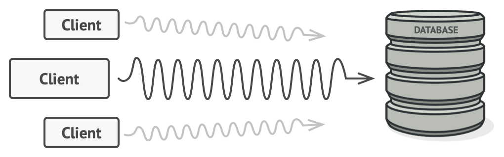
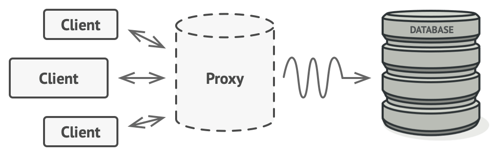
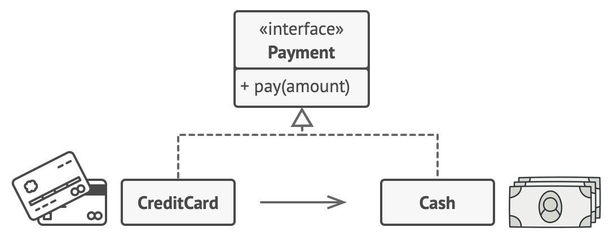
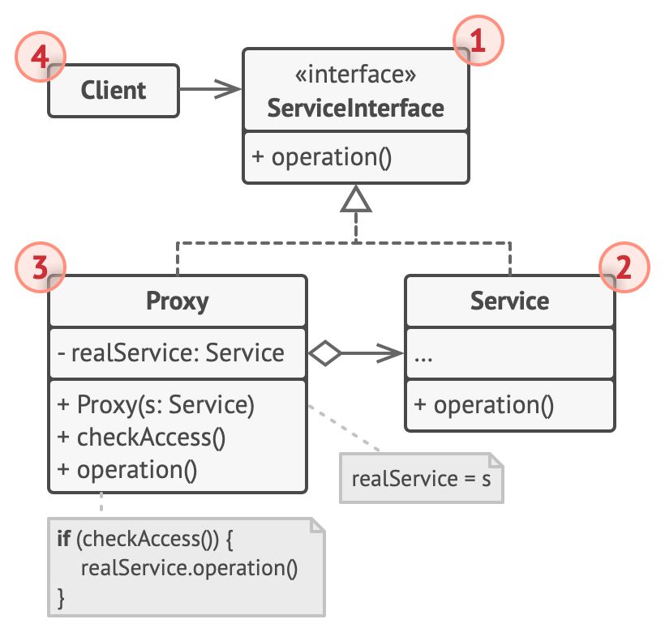
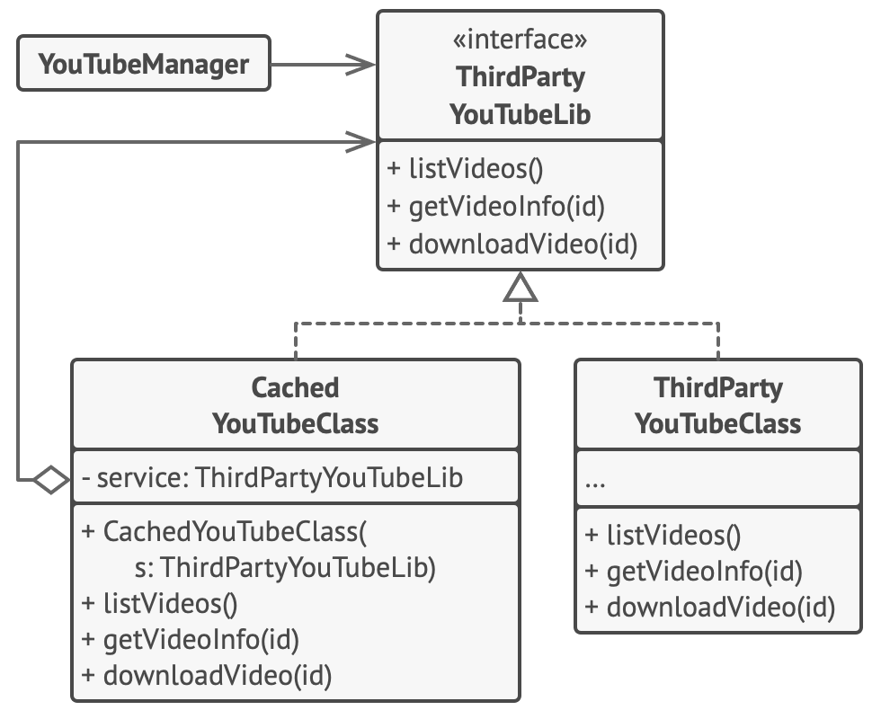

# Proxy


**Type:** Structural · **Also known as:** 

> **The 10-second version:** A stand-in object that looks exactly like the real thing, sits in front of it, and decides *when*, *whether* and *how often* the real thing actually gets called.

<br clear="all">

## Quick card

| | |
|---|---|
| **Problem it solves** | You need to do something *around* an object — delay creating it, cache its answers, check permissions, log calls, reach it over a network — but you can't or shouldn't put that code inside the object, and you don't want every caller to carry it. |
| **Core move** | Make a second class that implements the **same interface**, give it a reference to the real object, and hand that second class to the clients instead. It does its extra work, then delegates. |
| **You'll recognise it by** | A class whose every method is `do a little something; return _real.SameMethodName(args);`, and whose interface is byte-for-byte identical to the thing it wraps. Often it owns the field it delegates to, and creates it lazily. |
| **Rating** | Complexity ★★☆ · Popularity ★☆☆ |
| **Closest relatives** | **Decorator** (same shape, different intent — adds features, client owns the chain), **Adapter** (changes the interface), **Facade** (simplifies a subsystem, new interface), **Chain of Responsibility** (a line of handlers, any may stop). |
| **In your stack** | EF Core lazy-loading proxies and `IQueryable` (the most-used proxy in C# that nobody calls a proxy); `DispatchProxy` / Castle DynamicProxy behind Scrutor `.Decorate()`; the ES2015 `Proxy` object powering Vue 3 reactivity and MobX; a caching `IPricingService` in front of your pricing engine; a publisher proxy that writes to an outbox table before it ever touches RabbitMQ. |

### How to read this file

Technical first, plain English second. 🗣️ marks the plain-English version. Part 1 is Refactoring.Guru's material with their diagrams; Parts 2-7 are code, your stack, and the stuff that makes it stick.

---

# PART 1 — The pattern

## 1. Intent
**Proxy** is a structural design pattern that lets you provide a substitute or placeholder for another object. A proxy controls access to the original object, allowing you to perform something either before or after the request gets through to the original object.


### 🗣️ In plain words

You have an object. Something needs to happen *before* or *after* calls to it — or sometimes *instead of* calls to it — but the object's own code is the wrong place for that, or you can't edit it at all.

So you build a body double. Same interface, same method signatures, so nobody downstream can tell the difference. Inside, it does the extra job and then forwards the call to the real object — or doesn't forward it, if the answer was already in its pocket, or if the caller wasn't allowed to ask.

The caller keeps its type annotation. It keeps its calls. It never learns anything changed.

## 2. Problem
Why would you want to control access to an object? Here is an example: you have a massive object that consumes a vast amount of system resources. You need it from time to time, but not always.



*Database queries can be really slow.*

You could implement lazy initialization: create this object only when it’s actually needed. All of the object’s clients would need to execute some deferred initialization code. Unfortunately, this would probably cause a lot of code duplication.

In an ideal world, we’d want to put this code directly into our object’s class, but that isn’t always possible. For instance, the class may be part of a closed 3rd-party library.
### 🗣️ In plain words

Say you have a `VehicleHistoryService` in the car marketplace. It calls a paid third-party API — RTO records, accident history, insurance claims. Each call costs money and takes about 900 ms. Two different components on the listing page both want it.

The naive fix is to do the caching and lazy-loading where you happen to notice the pain:

```ts
// ❌ Every caller re-invents the same three lines, slightly differently.
class ListingPageController {
  private historyCache = new Map<string, VehicleHistory>();   // 👈 cache #1

  async render(regNo: string) {
    let history = this.historyCache.get(regNo);
    if (!history) {
      history = await this.historyService.fetch(regNo);        // paid API call
      this.historyCache.set(regNo, history);
    }
    // ...render
  }
}

class DealerDashboardController {
  private cache: Record<string, VehicleHistory> = {};          // 👈 cache #2, different shape

  async load(regNo: string) {
    if (!this.cache[regNo]) {
      this.cache[regNo] = await this.historyService.fetch(regNo);
    }
    // ...and this one never expires. Ever. Someone will find out in production.
  }
}
```

Now count the problems. Two caches that don't share entries, so you pay twice for the same registration number. Two different expiry policies (one has none). Zero logging, because nobody wanted to write it twice. And when someone adds a third caller, they'll write cache #3.

The "obvious" answer — put the caching inside `VehicleHistoryService` — isn't available if that class is a vendor SDK, is sealed, is owned by another team, or if you genuinely believe a service that fetches history should only fetch history.

## 3. Solution
The Proxy pattern suggests that you create a new proxy class with the same interface as an original service object. Then you update your app so that it passes the proxy object to all of the original object’s clients. Upon receiving a request from a client, the proxy creates a real service object and delegates all the work to it.



*The proxy disguises itself as a database object. It can handle lazy initialization and result caching without the client or the real database object even knowing.*

But what’s the benefit? If you need to execute something either before or after the primary logic of the class, the proxy lets you do this without changing that class. Since the proxy implements the same interface as the original class, it can be passed to any client that expects a real service object.
### 🗣️ In plain words

The pattern is three mechanical moves:

1. **Pin down the interface.** Whatever the clients depend on — `IVehicleHistoryService` — becomes the contract. If no interface exists yet, extract one; if you can't, subclass the service instead.
2. **Write a second class implementing that same interface**, holding a reference (often a *lazily created* one) to the real service.
3. **Put your extra behaviour in the proxy's methods, then delegate.** Check the cache first; log; verify the caller's role; open the socket. Then call the real object — or skip it.
4. **Change the wiring, not the callers.** Where the composition root used to hand out `new VehicleHistoryService()`, it now hands out `new CachedVehicleHistoryService(new VehicleHistoryService())`. Not one line of calling code changes.

> **The key insight:** Because the proxy is *type-identical* to the service, substitution is free — Liskov does the work for you. The entire pattern is a bet that "same interface" is enough of a disguise, and in a statically-typed language it almost always is. Everything else — caching, auth, laziness, remoting — is just what you chose to put in the gap you created.

## 4. Real-world analogy


*Credit cards can be used for payments just the same as cash.*

A credit card is a proxy for a bank account, which is a proxy for a bundle of cash. Both implement the same interface: they can be used for making a payment. A consumer feels great because there’s no need to carry loads of cash around. A shop owner is also happy since the income from a transaction gets added electronically to the shop’s bank account without the risk of losing the deposit or getting robbed on the way to the bank.

### 🗣️ Two more of my own

**The hotel front desk.** You want to speak to the manager, get a spare towel, complain about the AC. You don't wander into the back office — you talk to the front desk, which has exactly the same "answer guest requests" interface. Sometimes it handles you completely (a towel is right there — that's a cache hit). Sometimes it forwards you to the actual person. Sometimes it tells you the manager is unavailable and you cannot go find them yourself — that's a protection proxy. From your side, the hotel behaved like one thing.

**A power of attorney.** Your parent is abroad and can't sign the property paperwork, so they sign a power of attorney naming you. To the sub-registrar's office, your signature *is* theirs — same legal interface, identical effect. You're allowed to do only what the document lists, and the office logs every exercise of it. The real principal isn't present and doesn't need to be; the proxy carries the authority, scoped and audited.

## 5. Structure


1. The **Service Interface** declares the interface of the Service. The proxy must follow this interface to be able to disguise itself as a service object.
2. The **Service** is a class that provides some useful business logic.
3. The **Proxy** class has a reference field that points to a service object. After the proxy finishes its processing (e.g., lazy initialization, logging, access control, caching, etc.), it passes the request to the service object.

   Usually, proxies manage the full lifecycle of their service objects.
4. The **Client** should work with both services and proxies via the same interface. This way you can pass a proxy into any code that expects a service object.
### 🗣️ Participants & roles — cheat table

| Role | What it is in code | Example from the site | Equivalent in reader's stack |
|---|---|---|---|
| **Service Interface** | The shared contract. Both the proxy and the real thing implement it; the client only ever names this type. | `ThirdPartyYouTubeLib` — `listVideos()`, `getVideoInfo(id)`, `downloadVideo(id)` | `IVehicleHistoryService` in C#; an exported `interface PricingService` in TS; `IRepository<Listing>` |
| **Service (RealSubject)** | The class doing the actual, possibly expensive, work. Knows nothing about the proxy. | `ThirdPartyYouTubeClass` — really hits the YouTube API | `VehicleHistoryApiClient` (HTTP, paid, slow); `SqlListingRepository`; `RabbitMqPublisher` |
| **Proxy** | Same interface; holds a reference to the Service; adds behaviour then delegates. Usually owns the Service's lifetime. | `CachedYouTubeClass` — keeps `listCache`, `videoCache`, only calls through on a miss | `CachedVehicleHistoryService`, `AuditedPricingService`, `OutboxPublisherProxy`, an EF Core lazy-loading proxy |
| **Client** | Depends on the interface, so it can't tell the two apart. | `YouTubeManager` — takes a `ThirdPartyYouTubeLib`, never checks which one | Your controller / handler / MediatR `IRequestHandler`, constructor-injected by the DI container |
| *(assembler, implicit)* | Decides which one the client gets. Not a formal role, but always present. | `Application.init()` — builds service, wraps in proxy, injects | `Program.cs` / `services.AddScoped<...>()` + `.Decorate<...>()` |

### 🤝 Collaboration — who calls whom

```
                             ┌───────────────────────────────┐
  Client                     │   IVehicleHistoryService      │   (the disguise)
  (controller)               │   + Fetch(regNo) : History    │
     │                       └───────────────┬───────────────┘
     │                          implemented by│ both
     │                     ┌─────────────────┴──────────────────┐
     │                     │                                    │
     │             ┌───────▼─────────┐              ┌───────────▼───────────┐
     └── Fetch() ─►│ CachedHistory   │              │ VehicleHistoryApi     │
                   │ Proxy           │              │ Client  (REAL)        │
                   │  - _cache       │              │  - HttpClient         │
                   │  - _real  ──────┼─ delegates ─►│                       │
                   └─────────────────┘   (only on   └───────────────────────┘
                                          a miss)

  Timeline of two calls for the same regNo:

   Client            Proxy                      RealService        Paid API
     │                 │                             │                 │
     │──Fetch("MH01")─►│                             │                 │
     │                 │ cache.get → MISS            │                 │
     │                 │───────Fetch("MH01")────────►│                 │
     │                 │                             │────HTTP GET────►│
     │                 │                             │◄───900 ms───────│
     │                 │◄──────── History ───────────│                 │
     │                 │ cache.set("MH01", h)   👈 the whole pattern   │
     │◄─── History ────│                             │                 │
     │                 │                             │                 │
     │──Fetch("MH01")─►│                             │                 │
     │                 │ cache.get → HIT             │                 │
     │◄─── History ────│   (real service never woken, 0 ms, ₹0)        │
```

The hop that matters is the one that **doesn't happen**: on the second call the arrow from Proxy to RealService is absent. Decorator always forwards; Proxy reserves the right not to. That single option — to short-circuit, to defer, to refuse — is the difference between the two patterns even though the class diagrams are twins.

## 6. Pseudocode (the website's example)
This example illustrates how the **Proxy** pattern can help to introduce lazy initialization and caching to a 3rd-party YouTube integration library.



*Caching results of a service with a proxy.*

The library provides us with the video downloading class. However, it’s very inefficient. If the client application requests the same video multiple times, the library just downloads it over and over, instead of caching and reusing the first downloaded file.

The proxy class implements the same interface as the original downloader and delegates it all the work. However, it keeps track of the downloaded files and returns the cached result when the app requests the same video multiple times.

```
// The interface of a remote service.
interface ThirdPartyYouTubeLib is
    method listVideos()
    method getVideoInfo(id)
    method downloadVideo(id)

// The concrete implementation of a service connector. Methods
// of this class can request information from YouTube. The speed
// of the request depends on a user's internet connection as
// well as YouTube's. The application will slow down if a lot of
// requests are fired at the same time, even if they all request
// the same information.
class ThirdPartyYouTubeClass implements ThirdPartyYouTubeLib is
    method listVideos() is
        // Send an API request to YouTube.

    method getVideoInfo(id) is
        // Get metadata about some video.

    method downloadVideo(id) is
        // Download a video file from YouTube.

// To save some bandwidth, we can cache request results and keep
// them for some time. But it may be impossible to put such code
// directly into the service class. For example, it could have
// been provided as part of a third party library and/or defined
// as `final`. That's why we put the caching code into a new
// proxy class which implements the same interface as the
// service class. It delegates to the service object only when
// the real requests have to be sent.
class CachedYouTubeClass implements ThirdPartyYouTubeLib is
    private field service: ThirdPartyYouTubeLib
    private field listCache, videoCache
    field needReset

    constructor CachedYouTubeClass(service: ThirdPartyYouTubeLib) is
        this.service = service

    method listVideos() is
        if (listCache == null || needReset)
            listCache = service.listVideos()
        return listCache

    method getVideoInfo(id) is
        if (videoCache == null || needReset)
            videoCache = service.getVideoInfo(id)
        return videoCache

    method downloadVideo(id) is
        if (!downloadExists(id) || needReset)
            service.downloadVideo(id)

// The GUI class, which used to work directly with a service
// object, stays unchanged as long as it works with the service
// object through an interface. We can safely pass a proxy
// object instead of a real service object since they both
// implement the same interface.
class YouTubeManager is
    protected field service: ThirdPartyYouTubeLib

    constructor YouTubeManager(service: ThirdPartyYouTubeLib) is
        this.service = service

    method renderVideoPage(id) is
        info = service.getVideoInfo(id)
        // Render the video page.

    method renderListPanel() is
        list = service.listVideos()
        // Render the list of video thumbnails.

    method reactOnUserInput() is
        renderVideoPage()
        renderListPanel()

// The application can configure proxies on the fly.
class Application is
    method init() is
        aYouTubeService = new ThirdPartyYouTubeClass()
        aYouTubeProxy = new CachedYouTubeClass(aYouTubeService)
        manager = new YouTubeManager(aYouTubeProxy)
        manager.reactOnUserInput()
```
### 🗣️ Reading that pseudocode

- `class CachedYouTubeClass implements ThirdPartyYouTubeLib` — this is the entire pattern in one line. Not `extends`, not a new interface: **the same interface as the thing it replaces**. Everything else is detail.
- `private field service: ThirdPartyYouTubeLib` — note the *type*. The proxy holds the interface, not the concrete class, so you can stack proxies: a logging proxy wrapping a caching proxy wrapping the real client. Each one still satisfies the contract.
- `if (listCache == null || needReset) listCache = service.listVideos()` — the guard is the value. When `listCache` is populated, `service` is never touched. That's the short-circuit; in a Decorator that line would be unconditional.
- `needReset` is a public field, deliberately. It's the crude version of cache invalidation — the escape hatch the proxy exposes *beyond* the interface. In real code this becomes a TTL, an ETag, or a RabbitMQ `listing.updated` event that clears a key. Every caching proxy you write will need one, and it will be the part you get wrong.
- `class YouTubeManager` **does not change at all.** It still declares `protected field service: ThirdPartyYouTubeLib` and still calls `service.getVideoInfo(id)`. This is the payoff, and the reason the pattern is worth a class: the blast radius of adding caching was zero files of client code.
- `Application.init()` is where the swap happens — `new CachedYouTubeClass(new ThirdPartyYouTubeClass())`. In your world this line lives in `Program.cs` or your DI registration, and it's the *only* line that knows a proxy exists.

## 7. Applicability — when to reach for it
There are dozens of ways to utilize the Proxy pattern. Let’s go over the most popular uses.

**Lazy initialization (virtual proxy). This is when you have a heavyweight service object that wastes system resources by being always up, even though you only need it from time to time.**

Instead of creating the object when the app launches, you can delay the object’s initialization to a time when it’s really needed.

**Access control (protection proxy). This is when you want only specific clients to be able to use the service object; for instance, when your objects are crucial parts of an operating system and clients are various launched applications (including malicious ones).**

The proxy can pass the request to the service object only if the client’s credentials match some criteria.

**Local execution of a remote service (remote proxy). This is when the service object is located on a remote server.**

In this case, the proxy passes the client request over the network, handling all of the nasty details of working with the network.

**Logging requests (logging proxy). This is when you want to keep a history of requests to the service object.**

The proxy can log each request before passing it to the service.

**Caching request results (caching proxy). This is when you need to cache results of client requests and manage the life cycle of this cache, especially if results are quite large.**

The proxy can implement caching for recurring requests that always yield the same results. The proxy may use the parameters of requests as the cache keys.

**Smart reference. This is when you need to be able to dismiss a heavyweight object once there are no clients that use it.**

The proxy can keep track of clients that obtained a reference to the service object or its results. From time to time, the proxy may go over the clients and check whether they are still active. If the client list gets empty, the proxy might dismiss the service object and free the underlying system resources.

The proxy can also track whether the client had modified the service object. Then the unchanged objects may be reused by other clients.
### ✅ Quick checklist

- [ ] The extra behaviour (cache / auth / log / retry / lazy-load) is **orthogonal** to what the service does — the service would be worse if it knew about it.
- [ ] The clients already talk to an **interface**, or you can extract one without touching them.
- [ ] You'd otherwise be copy-pasting the same guard clause into three or more call sites.
- [ ] The real object is **expensive** to create or to call — a paid API, a heavy SQL query, a connection, a 20 MB image, a remote host.
- [ ] You need to be able to turn the behaviour **on and off by configuration** (cache in prod, no cache in tests) without an `if` in the business code.
- [ ] You **cannot change the service class** — vendor SDK, `sealed`, generated code, another team's package.

Four or more ticks: write the proxy. One or two: put the code in the service and move on.

## 8. How to implement — step by step
1. If there’s no pre-existing service interface, create one to make proxy and service objects interchangeable. Extracting the interface from the service class isn’t always possible, because you’d need to change all of the service’s clients to use that interface. Plan B is to make the proxy a subclass of the service class, and this way it’ll inherit the interface of the service.
2. Create the proxy class. It should have a field for storing a reference to the service. Usually, proxies create and manage the whole life cycle of their services. On rare occasions, a service is passed to the proxy via a constructor by the client.
3. Implement the proxy methods according to their purposes. In most cases, after doing some work, the proxy should delegate the work to the service object.
4. Consider introducing a creation method that decides whether the client gets a proxy or a real service. This can be a simple static method in the proxy class or a full-blown factory method.
5. Consider implementing lazy initialization for the service object.
### 🗣️ The same steps, blunt version

1. **Find or make the interface.** If clients depend on the concrete class, extract an interface first — that refactor is the real work; everything after is mechanical. If you can't (sealed, no source), subclass and override the virtual members instead.
2. **New class, `implements`/`: IThing`, one private field of the interface type.** Constructor takes it, or a factory for it if you want laziness.
3. **Implement every member as `extra work; return _real.Member(args);`** — every single one, including the boring ones. A proxy that forgets a method silently loses behaviour.
4. **Add a factory or a DI registration that decides who gets the proxy.** `AddScoped<IThing, RealThing>().Decorate<IThing, CachingThing>()` is that decision.
5. **Make the field lazy if creating the real thing is expensive** — `Lazy<T>`, a null check, or `??=`. If it isn't expensive, don't bother; eager is easier to debug.

## 9. Pros and cons
- ✅ You can control the service object without clients knowing about it.
- ✅ You can manage the lifecycle of the service object when clients don’t care about it.
- ✅ The proxy works even if the service object isn’t ready or is not available.
- ✅ *Open/Closed Principle*. You can introduce new proxies without changing the service or clients.

- ⛔ The code may become more complicated since you need to introduce a lot of new classes.
- ⛔ The response from the service might get delayed.
### ⚖️ Honest trade-offs from the trenches

**The real cost isn't the extra class — it's the stack trace and the surprise.** Once a proxy is in play, `_service.Fetch(id)` in your debugger doesn't step into the code you think it does, timings become bimodal (0 ms or 900 ms), and a bug report that says "stale price on the dealer dashboard" now has two suspects. Dynamic proxies (Castle, Spring AOP, `DispatchProxy`) make this dramatically worse: the class name in the exception is `Castle.Proxies.IPricingServiceProxy` and there is no file to open. Budget for it — name your proxies honestly (`CachedPricingService`, not `PricingServiceImpl2`), log a debug line on cache hits behind a flag, and expose a metric.

**The tell that it's worth it** is when you can delete code from the client. If adding the proxy lets you remove a `Dictionary`, a `if (x == null)` guard, or a `_logger.LogInformation` from two or three call sites, the pattern has paid for itself. If the client is unchanged and you've just added a layer "for flexibility", you've paid the cost and bought nothing. Also worth it whenever the behaviour must be *config-switchable* — caching in production, straight-through in integration tests — because a proxy makes that a registration change instead of a boolean parameter threaded through five methods.

**Modern C# and DI containers hand you most of this for free, and you should take it.** `Microsoft.Extensions.Caching.Hybrid` (`HybridCache`) and `IMemoryCache` mean you rarely hand-roll cache storage; **Scrutor**'s `.Decorate<IService, CachingService>()` does the wiring in one line and composes, so a logging proxy over a caching proxy over the real thing is three lines in `Program.cs`. `Lazy<T>` is a virtual proxy with thread-safety already solved. EF Core's `UseLazyLoadingProxies()` generates virtual proxies over your entities — that's why navigation properties must be `virtual`. `HttpClientFactory` + Polly gives you the retry/circuit-breaker proxy without a class. Reach for a hand-written proxy when the *policy* is domain-specific (which dealer may see wholesale pricing), not when it's infrastructure someone has already shipped.

**In TypeScript the language itself has the pattern**, and it is genuinely different from every other language here: the built-in `Proxy` object intercepts property access, not just method calls, with no interface to declare and no methods to forward. That is enormous power and a real footgun — it breaks `===` identity with the target, confuses `console.log`, and costs you the JIT's fast paths. Use a plain class implementing the interface when you know the methods; use `new Proxy()` when you genuinely can't enumerate them (reactivity, ORM entities, RPC clients).

## 10. Relations with other patterns
- With [Adapter](https://refactoring.guru/design-patterns/adapter) you access an existing object via different interface. With [Proxy](https://refactoring.guru/design-patterns/proxy), the interface stays the same. With [Decorator](https://refactoring.guru/design-patterns/decorator) you access the object via an enhanced interface.
- [Facade](https://refactoring.guru/design-patterns/facade) is similar to [Proxy](https://refactoring.guru/design-patterns/proxy) in that both buffer a complex entity and initialize it on its own. Unlike *Facade*, *Proxy* has the same interface as its service object, which makes them interchangeable.
- [Decorator](https://refactoring.guru/design-patterns/decorator) and [Proxy](https://refactoring.guru/design-patterns/proxy) have similar structures, but very different intents. Both patterns are built on the composition principle, where one object is supposed to delegate some of the work to another. The difference is that a *Proxy* usually manages the life cycle of its service object on its own, whereas the composition of *Decorators* is always controlled by the client.
### 🗣️ Disambiguation table

| Pattern | Interface vs. the wrapped object | Who owns the wrapped object | Can it skip the call? | One-line tell |
|---|---|---|---|---|
| **Proxy** | **Identical** | The proxy, usually — it may even create it lazily | **Yes** — cache hit, denied access, not-yet-needed | "Same door, a gatekeeper standing in it." |
| **Decorator** | Identical, but *enriched* in behaviour (and sometimes widened) | The **client** — it builds the chain explicitly, and stacking order is the client's decision | No — it always forwards, it only adds around | "Same door, another coat of paint on the thing behind it." |
| **Adapter** | **Different** — that's the whole point | Either; usually passed in | It must translate, so it always calls | "Different-shaped plug, same socket." |
| **Facade** | **New, smaller** interface over *many* objects | The facade, typically | Yes, but it's not the point | "One door instead of seven." |
| **Chain of Responsibility** | Identical handler interface, but a **list** | The chain builder | Yes — a handler may terminate the chain | "A queue of people, one of whom will deal with you." |

***Proxy controls access to one object; Decorator adds responsibilities to it; Adapter changes its shape; Facade hides a whole crowd of them.***

The one that actually trips people up is Proxy vs Decorator, because the UML is the same. Two practical separators: (1) *Who decides it exists?* Client code composes decorators (`new Compressed(new Encrypted(stream))`); a proxy is usually injected by configuration and the client doesn't know. (2) *Does removing it change the answer or just the trimmings?* Remove a decorator and you lose a feature; remove a caching or protection proxy and the answers are the same, just slower or less safe.

---

# PART 2 — Official code examples from Refactoring.Guru

## 2.1 C#
**Complexity:** ★★☆ (2/3)

**Popularity:** ★☆☆ (1/3)

**Usage examples:** While the Proxy pattern isn’t a frequent guest in most C# applications, it’s still very handy in some special cases. It’s irreplaceable when you want to add some additional behaviors to an object of some existing class without changing the client code.

**Identification:** Proxies delegate all of the real work to some other object. Each proxy method should, in the end, refer to a service object unless the proxy is a subclass of a service.
### Conceptual Example

This example illustrates the structure of the **Proxy** design pattern. It focuses on answering these questions:

- What classes does it consist of?
- What roles do these classes play?
- In what way the elements of the pattern are related?

##### **Program.cs:** Conceptual example

```csharp
using System;

namespace RefactoringGuru.DesignPatterns.Proxy.Conceptual
{
    // The Subject interface declares common operations for both RealSubject and
    // the Proxy. As long as the client works with RealSubject using this
    // interface, you'll be able to pass it a proxy instead of a real subject.
    public interface ISubject
    {
        void Request();
    }

    // The RealSubject contains some core business logic. Usually, RealSubjects
    // are capable of doing some useful work which may also be very slow or
    // sensitive - e.g. correcting input data. A Proxy can solve these issues
    // without any changes to the RealSubject's code.
    class RealSubject : ISubject
    {
        public void Request()
        {
            Console.WriteLine("RealSubject: Handling Request.");
        }
    }

    // The Proxy has an interface identical to the RealSubject.
    class Proxy : ISubject
    {
        private RealSubject _realSubject;

        public Proxy(RealSubject realSubject)
        {
            this._realSubject = realSubject;
        }

        // The most common applications of the Proxy pattern are lazy loading,
        // caching, controlling the access, logging, etc. A Proxy can perform
        // one of these things and then, depending on the result, pass the
        // execution to the same method in a linked RealSubject object.
        public void Request()
        {
            if (this.CheckAccess())
            {
                this._realSubject.Request();

                this.LogAccess();
            }
        }

        public bool CheckAccess()
        {
            // Some real checks should go here.
            Console.WriteLine("Proxy: Checking access prior to firing a real request.");

            return true;
        }

        public void LogAccess()
        {
            Console.WriteLine("Proxy: Logging the time of request.");
        }
    }

    public class Client
    {
        // The client code is supposed to work with all objects (both subjects
        // and proxies) via the Subject interface in order to support both real
        // subjects and proxies. In real life, however, clients mostly work with
        // their real subjects directly. In this case, to implement the pattern
        // more easily, you can extend your proxy from the real subject's class.
        public void ClientCode(ISubject subject)
        {
            // ...

            subject.Request();

            // ...
        }
    }

    class Program
    {
        static void Main(string[] args)
        {
            Client client = new Client();

            Console.WriteLine("Client: Executing the client code with a real subject:");
            RealSubject realSubject = new RealSubject();
            client.ClientCode(realSubject);

            Console.WriteLine();

            Console.WriteLine("Client: Executing the same client code with a proxy:");
            Proxy proxy = new Proxy(realSubject);
            client.ClientCode(proxy);
        }
    }
}
```

##### **Output.txt:** Execution result

```output
Client: Executing the client code with a real subject:
RealSubject: Handling Request.

Client: Executing the same client code with a proxy:
Proxy: Checking access prior to firing a real request.
RealSubject: Handling Request.
Proxy: Logging the time of request.
```

## 2.2 TypeScript
**Complexity:** ★★☆ (2/3)

**Popularity:** ★☆☆ (1/3)

**Usage examples:** While the Proxy pattern isn’t a frequent guest in most TypeScript applications, it’s still very handy in some special cases. It’s irreplaceable when you want to add some additional behaviors to an object of some existing class without changing the client code.

**Identification:** Proxies delegate all of the real work to some other object. Each proxy method should, in the end, refer to a service object unless the proxy is a subclass of a service.
### Conceptual Example

This example illustrates the structure of the **Proxy** design pattern and focuses on the following questions:

- What classes does it consist of?
- What roles do these classes play?
- In what way the elements of the pattern are related?

##### **index.ts:** Conceptual example

```typescript
/**
 * The Subject interface declares common operations for both RealSubject and the
 * Proxy. As long as the client works with RealSubject using this interface,
 * you'll be able to pass it a proxy instead of a real subject.
 */
interface Subject {
    request(): void;
}

/**
 * The RealSubject contains some core business logic. Usually, RealSubjects are
 * capable of doing some useful work which may also be very slow or sensitive -
 * e.g. correcting input data. A Proxy can solve these issues without any
 * changes to the RealSubject's code.
 */
class RealSubject implements Subject {
    public request(): void {
        console.log('RealSubject: Handling request.');
    }
}

/**
 * The Proxy has an interface identical to the RealSubject.
 */
class Proxy implements Subject {
    private realSubject: RealSubject;

    /**
     * The Proxy maintains a reference to an object of the RealSubject class. It
     * can be either lazy-loaded or passed to the Proxy by the client.
     */
    constructor(realSubject: RealSubject) {
        this.realSubject = realSubject;
    }

    /**
     * The most common applications of the Proxy pattern are lazy loading,
     * caching, controlling the access, logging, etc. A Proxy can perform one of
     * these things and then, depending on the result, pass the execution to the
     * same method in a linked RealSubject object.
     */
    public request(): void {
        if (this.checkAccess()) {
            this.realSubject.request();
            this.logAccess();
        }
    }

    private checkAccess(): boolean {
        // Some real checks should go here.
        console.log('Proxy: Checking access prior to firing a real request.');

        return true;
    }

    private logAccess(): void {
        console.log('Proxy: Logging the time of request.');
    }
}

/**
 * The client code is supposed to work with all objects (both subjects and
 * proxies) via the Subject interface in order to support both real subjects and
 * proxies. In real life, however, clients mostly work with their real subjects
 * directly. In this case, to implement the pattern more easily, you can extend
 * your proxy from the real subject's class.
 */
function clientCode(subject: Subject) {
    // ...

    subject.request();

    // ...
}

console.log('Client: Executing the client code with a real subject:');
const realSubject = new RealSubject();
clientCode(realSubject);

console.log('');

console.log('Client: Executing the same client code with a proxy:');
const proxy = new Proxy(realSubject);
clientCode(proxy);
```

##### **Output.txt:** Execution result

```output
Client: Executing the client code with a real subject:
RealSubject: Handling request.

Client: Executing the same client code with a proxy:
Proxy: Checking access prior to firing a real request.
RealSubject: Handling request.
Proxy: Logging the time of request.
```

## 2.3 C++
**Complexity:** ★★☆ (2/3)

**Popularity:** ★☆☆ (1/3)

**Usage examples:** While the Proxy pattern isn’t a frequent guest in most C++ applications, it’s still very handy in some special cases. It’s irreplaceable when you want to add some additional behaviors to an object of some existing class without changing the client code.

**Identification:** Proxies delegate all of the real work to some other object. Each proxy method should, in the end, refer to a service object unless the proxy is a subclass of a service.
### Conceptual Example

This example illustrates the structure of the **Proxy** design pattern. It focuses on answering these questions:

- What classes does it consist of?
- What roles do these classes play?
- In what way the elements of the pattern are related?

##### **main.cc:** Conceptual example

```cpp
#include <iostream>
/**
 * The Subject interface declares common operations for both RealSubject and the
 * Proxy. As long as the client works with RealSubject using this interface,
 * you'll be able to pass it a proxy instead of a real subject.
 */
class Subject {
 public:
  virtual void Request() const = 0;
};
/**
 * The RealSubject contains some core business logic. Usually, RealSubjects are
 * capable of doing some useful work which may also be very slow or sensitive -
 * e.g. correcting input data. A Proxy can solve these issues without any
 * changes to the RealSubject's code.
 */
class RealSubject : public Subject {
 public:
  void Request() const override {
    std::cout << "RealSubject: Handling request.\n";
  }
};
/**
 * The Proxy has an interface identical to the RealSubject.
 */
class Proxy : public Subject {
  /**
   * @var RealSubject
   */
 private:
  RealSubject *real_subject_;

  bool CheckAccess() const {
    // Some real checks should go here.
    std::cout << "Proxy: Checking access prior to firing a real request.\n";
    return true;
  }
  void LogAccess() const {
    std::cout << "Proxy: Logging the time of request.\n";
  }

  /**
   * The Proxy maintains a reference to an object of the RealSubject class. It
   * can be either lazy-loaded or passed to the Proxy by the client.
   */
 public:
  Proxy(RealSubject *real_subject) : real_subject_(new RealSubject(*real_subject)) {
  }

  ~Proxy() {
    delete real_subject_;
  }
  /**
   * The most common applications of the Proxy pattern are lazy loading,
   * caching, controlling the access, logging, etc. A Proxy can perform one of
   * these things and then, depending on the result, pass the execution to the
   * same method in a linked RealSubject object.
   */
  void Request() const override {
    if (this->CheckAccess()) {
      this->real_subject_->Request();
      this->LogAccess();
    }
  }
};
/**
 * The client code is supposed to work with all objects (both subjects and
 * proxies) via the Subject interface in order to support both real subjects and
 * proxies. In real life, however, clients mostly work with their real subjects
 * directly. In this case, to implement the pattern more easily, you can extend
 * your proxy from the real subject's class.
 */
void ClientCode(const Subject &subject) {
  // ...
  subject.Request();
  // ...
}

int main() {
  std::cout << "Client: Executing the client code with a real subject:\n";
  RealSubject *real_subject = new RealSubject;
  ClientCode(*real_subject);
  std::cout << "\n";
  std::cout << "Client: Executing the same client code with a proxy:\n";
  Proxy *proxy = new Proxy(real_subject);
  ClientCode(*proxy);

  delete real_subject;
  delete proxy;
  return 0;
}
```

##### **Output.txt:** Execution result

```output
Client: Executing the client code with a real subject:
RealSubject: Handling request.

Client: Executing the same client code with a proxy:
Proxy: Checking access prior to firing a real request.
RealSubject: Handling request.
Proxy: Logging the time of request.
```

## 2.4 Java
**Complexity:** ★★☆ (2/3)

**Popularity:** ★☆☆ (1/3)

**Usage examples:** While the Proxy pattern isn’t a frequent guest in most Java applications, it’s still very handy in some special cases. It’s irreplaceable when you want to add some additional behaviors to an object of some existing class without changing the client code.

**Identification:** Proxies delegate all of the real work to some other object. Each proxy method should, in the end, refer to a service object unless the proxy is a subclass of a service.
### Caching proxy

In this example, the Proxy pattern helps to implement the lazy initialization and caching to an inefficient 3rd-party YouTube integration library.

Proxy is invaluable when you have to add some additional behaviors to a class which code you can’t change.

#### **some_cool_media_library**

##### **some_cool_media_library/ThirdPartyYouTubeLib.java:** Remote service interface

```java
package refactoring_guru.proxy.example.some_cool_media_library;

import java.util.HashMap;

public interface ThirdPartyYouTubeLib {
    HashMap<String, Video> popularVideos();

    Video getVideo(String videoId);
}
```

##### **some_cool_media_library/ThirdPartyYouTubeClass.java:** Remote service implementation

```java
package refactoring_guru.proxy.example.some_cool_media_library;

import java.util.HashMap;

public class ThirdPartyYouTubeClass implements ThirdPartyYouTubeLib {

    @Override
    public HashMap<String, Video> popularVideos() {
        connectToServer("http://www.youtube.com");
        return getRandomVideos();
    }

    @Override
    public Video getVideo(String videoId) {
        connectToServer("http://www.youtube.com/" + videoId);
        return getSomeVideo(videoId);
    }

    // -----------------------------------------------------------------------
    // Fake methods to simulate network activity. They as slow as a real life.

    private int random(int min, int max) {
        return min + (int) (Math.random() * ((max - min) + 1));
    }

    private void experienceNetworkLatency() {
        int randomLatency = random(5, 10);
        for (int i = 0; i < randomLatency; i++) {
            try {
                Thread.sleep(100);
            } catch (InterruptedException ex) {
                ex.printStackTrace();
            }
        }
    }

    private void connectToServer(String server) {
        System.out.print("Connecting to " + server + "... ");
        experienceNetworkLatency();
        System.out.print("Connected!" + "\n");
    }

    private HashMap<String, Video> getRandomVideos() {
        System.out.print("Downloading populars... ");

        experienceNetworkLatency();
        HashMap<String, Video> hmap = new HashMap<String, Video>();
        hmap.put("catzzzzzzzzz", new Video("sadgahasgdas", "Catzzzz.avi"));
        hmap.put("mkafksangasj", new Video("mkafksangasj", "Dog play with ball.mp4"));
        hmap.put("dancesvideoo", new Video("asdfas3ffasd", "Dancing video.mpq"));
        hmap.put("dlsdk5jfslaf", new Video("dlsdk5jfslaf", "Barcelona vs RealM.mov"));
        hmap.put("3sdfgsd1j333", new Video("3sdfgsd1j333", "Programing lesson#1.avi"));

        System.out.print("Done!" + "\n");
        return hmap;
    }

    private Video getSomeVideo(String videoId) {
        System.out.print("Downloading video... ");

        experienceNetworkLatency();
        Video video = new Video(videoId, "Some video title");

        System.out.print("Done!" + "\n");
        return video;
    }

}
```

##### **some_cool_media_library/Video.java:** Video file

```java
package refactoring_guru.proxy.example.some_cool_media_library;

public class Video {
    public String id;
    public String title;
    public String data;

    Video(String id, String title) {
        this.id = id;
        this.title = title;
        this.data = "Random video.";
    }
}
```

#### **proxy**

##### **proxy/YouTubeCacheProxy.java:** Caching proxy

```java
package refactoring_guru.proxy.example.proxy;

import refactoring_guru.proxy.example.some_cool_media_library.ThirdPartyYouTubeClass;
import refactoring_guru.proxy.example.some_cool_media_library.ThirdPartyYouTubeLib;
import refactoring_guru.proxy.example.some_cool_media_library.Video;

import java.util.HashMap;

public class YouTubeCacheProxy implements ThirdPartyYouTubeLib {
    private ThirdPartyYouTubeLib youtubeService;
    private HashMap<String, Video> cachePopular = new HashMap<String, Video>();
    private HashMap<String, Video> cacheAll = new HashMap<String, Video>();

    public YouTubeCacheProxy() {
        this.youtubeService = new ThirdPartyYouTubeClass();
    }

    @Override
    public HashMap<String, Video> popularVideos() {
        if (cachePopular.isEmpty()) {
            cachePopular = youtubeService.popularVideos();
        } else {
            System.out.println("Retrieved list from cache.");
        }
        return cachePopular;
    }

    @Override
    public Video getVideo(String videoId) {
        Video video = cacheAll.get(videoId);
        if (video == null) {
            video = youtubeService.getVideo(videoId);
            cacheAll.put(videoId, video);
        } else {
            System.out.println("Retrieved video '" + videoId + "' from cache.");
        }
        return video;
    }

    public void reset() {
        cachePopular.clear();
        cacheAll.clear();
    }
}
```

#### **downloader**

##### **downloader/YouTubeDownloader.java:** Media downloader app

```java
package refactoring_guru.proxy.example.downloader;

import refactoring_guru.proxy.example.some_cool_media_library.ThirdPartyYouTubeLib;
import refactoring_guru.proxy.example.some_cool_media_library.Video;

import java.util.HashMap;

public class YouTubeDownloader {
    private ThirdPartyYouTubeLib api;

    public YouTubeDownloader(ThirdPartyYouTubeLib api) {
        this.api = api;
    }

    public void renderVideoPage(String videoId) {
        Video video = api.getVideo(videoId);
        System.out.println("\n-------------------------------");
        System.out.println("Video page (imagine fancy HTML)");
        System.out.println("ID: " + video.id);
        System.out.println("Title: " + video.title);
        System.out.println("Video: " + video.data);
        System.out.println("-------------------------------\n");
    }

    public void renderPopularVideos() {
        HashMap<String, Video> list = api.popularVideos();
        System.out.println("\n-------------------------------");
        System.out.println("Most popular videos on YouTube (imagine fancy HTML)");
        for (Video video : list.values()) {
            System.out.println("ID: " + video.id + " / Title: " + video.title);
        }
        System.out.println("-------------------------------\n");
    }
}
```

##### **Demo.java:** Initialization code

```java
package refactoring_guru.proxy.example;

import refactoring_guru.proxy.example.downloader.YouTubeDownloader;
import refactoring_guru.proxy.example.proxy.YouTubeCacheProxy;
import refactoring_guru.proxy.example.some_cool_media_library.ThirdPartyYouTubeClass;

public class Demo {

    public static void main(String[] args) {
        YouTubeDownloader naiveDownloader = new YouTubeDownloader(new ThirdPartyYouTubeClass());
        YouTubeDownloader smartDownloader = new YouTubeDownloader(new YouTubeCacheProxy());

        long naive = test(naiveDownloader);
        long smart = test(smartDownloader);
        System.out.print("Time saved by caching proxy: " + (naive - smart) + "ms");

    }

    private static long test(YouTubeDownloader downloader) {
        long startTime = System.currentTimeMillis();

        // User behavior in our app:
        downloader.renderPopularVideos();
        downloader.renderVideoPage("catzzzzzzzzz");
        downloader.renderPopularVideos();
        downloader.renderVideoPage("dancesvideoo");
        // Users might visit the same page quite often.
        downloader.renderVideoPage("catzzzzzzzzz");
        downloader.renderVideoPage("someothervid");

        long estimatedTime = System.currentTimeMillis() - startTime;
        System.out.print("Time elapsed: " + estimatedTime + "ms\n");
        return estimatedTime;
    }
}
```

##### **OutputDemo.txt:** Execution result

```output
Connecting to http://www.youtube.com... Connected!
Downloading populars... Done!

-------------------------------
Most popular videos on YouTube (imagine fancy HTML)
ID: sadgahasgdas / Title: Catzzzz.avi
ID: asdfas3ffasd / Title: Dancing video.mpq
ID: 3sdfgsd1j333 / Title: Programing lesson#1.avi
ID: mkafksangasj / Title: Dog play with ball.mp4
ID: dlsdk5jfslaf / Title: Barcelona vs RealM.mov
-------------------------------

Connecting to http://www.youtube.com/catzzzzzzzzz... Connected!
Downloading video... Done!

-------------------------------
Video page (imagine fancy HTML)
ID: catzzzzzzzzz
Title: Some video title
Video: Random video.
-------------------------------

Connecting to http://www.youtube.com... Connected!
Downloading populars... Done!

-------------------------------
Most popular videos on YouTube (imagine fancy HTML)
ID: sadgahasgdas / Title: Catzzzz.avi
ID: asdfas3ffasd / Title: Dancing video.mpq
ID: 3sdfgsd1j333 / Title: Programing lesson#1.avi
ID: mkafksangasj / Title: Dog play with ball.mp4
ID: dlsdk5jfslaf / Title: Barcelona vs RealM.mov
-------------------------------

Connecting to http://www.youtube.com/dancesvideoo... Connected!
Downloading video... Done!

-------------------------------
Video page (imagine fancy HTML)
ID: dancesvideoo
Title: Some video title
Video: Random video.
-------------------------------

Connecting to http://www.youtube.com/catzzzzzzzzz... Connected!
Downloading video... Done!

-------------------------------
Video page (imagine fancy HTML)
ID: catzzzzzzzzz
Title: Some video title
Video: Random video.
-------------------------------

Connecting to http://www.youtube.com/someothervid... Connected!
Downloading video... Done!

-------------------------------
Video page (imagine fancy HTML)
ID: someothervid
Title: Some video title
Video: Random video.
-------------------------------

Time elapsed: 9354ms
Connecting to http://www.youtube.com... Connected!
Downloading populars... Done!

-------------------------------
Most popular videos on YouTube (imagine fancy HTML)
ID: sadgahasgdas / Title: Catzzzz.avi
ID: asdfas3ffasd / Title: Dancing video.mpq
ID: 3sdfgsd1j333 / Title: Programing lesson#1.avi
ID: mkafksangasj / Title: Dog play with ball.mp4
ID: dlsdk5jfslaf / Title: Barcelona vs RealM.mov
-------------------------------

Connecting to http://www.youtube.com/catzzzzzzzzz... Connected!
Downloading video... Done!

-------------------------------
Video page (imagine fancy HTML)
ID: catzzzzzzzzz
Title: Some video title
Video: Random video.
-------------------------------

Retrieved list from cache.

-------------------------------
Most popular videos on YouTube (imagine fancy HTML)
ID: sadgahasgdas / Title: Catzzzz.avi
ID: asdfas3ffasd / Title: Dancing video.mpq
ID: 3sdfgsd1j333 / Title: Programing lesson#1.avi
ID: mkafksangasj / Title: Dog play with ball.mp4
ID: dlsdk5jfslaf / Title: Barcelona vs RealM.mov
-------------------------------

Connecting to http://www.youtube.com/dancesvideoo... Connected!
Downloading video... Done!

-------------------------------
Video page (imagine fancy HTML)
ID: dancesvideoo
Title: Some video title
Video: Random video.
-------------------------------

Retrieved video 'catzzzzzzzzz' from cache.

-------------------------------
Video page (imagine fancy HTML)
ID: catzzzzzzzzz
Title: Some video title
Video: Random video.
-------------------------------

Connecting to http://www.youtube.com/someothervid... Connected!
Downloading video... Done!

-------------------------------
Video page (imagine fancy HTML)
ID: someothervid
Title: Some video title
Video: Random video.
-------------------------------

Time elapsed: 5875ms
Time saved by caching proxy: 3479ms
```

---

# PART 3 — Learn it by building it

## 3.1 The dumbest possible version — TypeScript

### ❌ BEFORE — the pain

A listing page needs a vehicle history report. The API is slow and billed per call.

```ts
// vehicle-history.ts
export interface VehicleHistory {
  regNo: string;
  accidents: number;
  ownerCount: number;
  insuranceValidTill: string;
}

export class VehicleHistoryApiClient {
  async fetch(regNo: string): Promise<VehicleHistory> {
    const res = await fetch(`https://vahan-partner.example/v2/history/${regNo}`, {
      headers: { 'x-api-key': process.env.VAHAN_KEY! },
    });
    if (!res.ok) throw new Error(`history api ${res.status}`);
    return (await res.json()) as VehicleHistory;
  }
}

// listing-page.ts
const api = new VehicleHistoryApiClient();

export async function renderListing(regNo: string) {
  const history = await api.fetch(regNo);          // 900 ms, ₹3
  const badge   = await api.fetch(regNo);          // 👈 SAME CALL. 900 ms, ₹3. Again.
  return { history, isClean: badge.accidents === 0 };
}
```

Two components, two calls, same registration number, double the bill. The instinct is to hoist a `Map` into `listing-page.ts` — and then to hoist another one into the dealer dashboard, and another into the search result enricher.

### ✅ AFTER — a caching proxy

```ts
// ───────────────────────────────────────────────────────────────────────────
// 1. THE CONTRACT  —  the disguise both classes wear
// ───────────────────────────────────────────────────────────────────────────
export interface VehicleHistory {
  regNo: string;
  accidents: number;
  ownerCount: number;
  insuranceValidTill: string;
}

export interface VehicleHistoryService {              // 👈 the Service Interface
  fetch(regNo: string): Promise<VehicleHistory>;
}

// ───────────────────────────────────────────────────────────────────────────
// 2. THE REAL SERVICE  —  unchanged, and unaware anything is happening
// ───────────────────────────────────────────────────────────────────────────
export class VehicleHistoryApiClient implements VehicleHistoryService {
  constructor(private readonly apiKey: string) {}

  async fetch(regNo: string): Promise<VehicleHistory> {
    const res = await fetch(`https://vahan-partner.example/v2/history/${regNo}`, {
      headers: { 'x-api-key': this.apiKey },
    });
    if (!res.ok) throw new Error(`history api responded ${res.status}`);
    return (await res.json()) as VehicleHistory;
  }
}

// ───────────────────────────────────────────────────────────────────────────
// 3. THE PROXY  —  same interface, extra brain
// ───────────────────────────────────────────────────────────────────────────
type CacheEntry = { value: VehicleHistory; expiresAt: number };

export class CachedVehicleHistoryService implements VehicleHistoryService {
  //                                     👆 identical interface: this is the pattern
  private readonly cache = new Map<string, CacheEntry>();

  // In-flight de-duplication: two simultaneous requests for the same regNo
  // must produce ONE network call, not two. Without this, a cache is useless
  // under concurrency — the classic "cache stampede".
  private readonly inFlight = new Map<string, Promise<VehicleHistory>>();

  constructor(
    private readonly real: VehicleHistoryService,     // 👈 holds the INTERFACE, not the class
    private readonly ttlMs = 6 * 60 * 60 * 1000,      // history barely changes: 6h
    private readonly now: () => number = Date.now,    // injectable clock => testable TTL
  ) {}

  async fetch(regNo: string): Promise<VehicleHistory> {
    const key = regNo.toUpperCase().replace(/\s+/g, '');

    const hit = this.cache.get(key);
    if (hit && hit.expiresAt > this.now()) {
      return hit.value;                               // 👈 THE REAL SERVICE IS NEVER CALLED
    }

    const pending = this.inFlight.get(key);
    if (pending) return pending;                      // 👈 someone else is already fetching it

    const promise = this.real
      .fetch(key)                                     // 👈 the delegation — the only line that talks to the real thing
      .then((value) => {
        this.cache.set(key, { value, expiresAt: this.now() + this.ttlMs });
        return value;
      })
      .finally(() => {
        this.inFlight.delete(key);                    // never leak a rejected promise
      });

    this.inFlight.set(key, promise);
    return promise;
  }

  /** Beyond the interface: the invalidation hook. Call this from a
   *  `listing.updated` consumer so a corrected record isn't stale for 6 hours. */
  invalidate(regNo: string): void {
    this.cache.delete(regNo.toUpperCase().replace(/\s+/g, ''));
  }
}

// ───────────────────────────────────────────────────────────────────────────
// 4. THE WIRING  —  the only file that knows a proxy exists
// ───────────────────────────────────────────────────────────────────────────
const history: VehicleHistoryService = new CachedVehicleHistoryService(
  new VehicleHistoryApiClient(process.env.VAHAN_KEY!),
);

// ───────────────────────────────────────────────────────────────────────────
// 5. THE CLIENT  —  identical to before. Not one character changed.
// ───────────────────────────────────────────────────────────────────────────
export async function renderListing(regNo: string) {
  const report = await history.fetch(regNo);          // 900 ms, ₹3
  const badge  = await history.fetch(regNo);          // 0 ms, ₹0  👈
  return { report, isClean: badge.accidents === 0 };
}
```

**What to notice:**

- `implements VehicleHistoryService` on **both** classes is the entire pattern. Delete that word from the proxy and you have a random helper class.
- The proxy's field is typed `VehicleHistoryService`, not `VehicleHistoryApiClient`. That's what lets you stack: `new LoggedHistoryService(new CachedVehicleHistoryService(new VehicleHistoryApiClient(key)))` type-checks, and each layer still satisfies every client.
- The `inFlight` map is the thing tutorials skip and production punishes you for. A cache without request coalescing turns a cold start plus a traffic spike into N simultaneous paid API calls.
- `invalidate()` is *not* on the interface. That's deliberate and normal: clients use the interface; whoever wires things up holds the concrete type and can reach the extra controls. Widening the interface would leak the proxy's existence to everybody.
- The injectable `now` is a one-line trick that makes TTL testable without `jest.useFakeTimers()` or a `sleep`.
- `renderListing` is byte-identical. If your "proxy" refactor forced you to edit callers, you didn't preserve the interface and you built something else.

## 3.2 Same thing in C#

A **protection proxy** this time, because it's the flavour that genuinely can't live in the service class: wholesale/trade pricing is visible to verified dealers, not to consumers.

```csharp
using System;
using System.Collections.Generic;
using System.Security;
using System.Threading;
using System.Threading.Tasks;
using Microsoft.Extensions.Logging;

namespace Carwale.Pricing;

// ── The data ────────────────────────────────────────────────────────────────
public sealed record PriceQuote(
    long ListingId,
    decimal RetailPrice,
    decimal TradeInPrice,          // dealers only
    decimal WholesaleFloor,        // dealers only
    DateOnly ValidOn);

public enum Audience { Anonymous, Consumer, VerifiedDealer, Internal }

public interface ICurrentUser
{
    long UserId { get; }
    Audience Audience { get; }
}

// ── 1. The Service Interface ────────────────────────────────────────────────
public interface IPricingService
{
    Task<PriceQuote> GetQuoteAsync(long listingId, CancellationToken ct = default);
}

// ── 2. The Service: real work, zero knowledge of who is asking ──────────────
public sealed class PricingEngine : IPricingService
{
    private readonly IListingRepository _listings;

    public PricingEngine(IListingRepository listings) => _listings = listings;

    public async Task<PriceQuote> GetQuoteAsync(long listingId, CancellationToken ct = default)
    {
        var listing = await _listings.GetAsync(listingId, ct)
                      ?? throw new KeyNotFoundException($"Listing {listingId} not found.");

        // Deliberately naive; the point is that it is expensive and pure.
        var baseline = listing.ModelBasePrice;
        var ageFactor = Math.Pow(0.88, DateTime.UtcNow.Year - listing.ManufactureYear);
        var kmFactor = listing.OdometerKm switch
        {
            < 20_000  => 1.00m,
            < 60_000  => 0.94m,
            < 100_000 => 0.87m,
            _         => 0.78m,
        };

        var retail = Math.Round(baseline * (decimal)ageFactor * kmFactor, -3);

        return new PriceQuote(
            ListingId:      listingId,
            RetailPrice:    retail,
            TradeInPrice:   Math.Round(retail * 0.86m, -3),
            WholesaleFloor: Math.Round(retail * 0.79m, -3),
            ValidOn:        DateOnly.FromDateTime(DateTime.UtcNow));
    }
}

// ── 3. The Proxy: same interface, decides who sees what ─────────────────────
public sealed class AudienceAwarePricingProxy : IPricingService
{
    private readonly IPricingService _inner;          // 👈 interface type, so proxies stack
    private readonly ICurrentUser _user;
    private readonly ILogger<AudienceAwarePricingProxy> _log;

    public AudienceAwarePricingProxy(
        IPricingService inner,
        ICurrentUser user,
        ILogger<AudienceAwarePricingProxy> log)
        => (_inner, _user, _log) = (inner, user, log);

    public async Task<PriceQuote> GetQuoteAsync(long listingId, CancellationToken ct = default)
    {
        if (_user.Audience is Audience.Anonymous)
        {
            // Short-circuit: the expensive engine is never touched.   👈
            throw new SecurityException("Sign in to see pricing.");
        }

        var quote = await _inner.GetQuoteAsync(listingId, ct);        // 👈 the delegation

        // Redact on the way OUT. Records make this a one-liner and keep it immutable.
        return _user.Audience switch
        {
            Audience.VerifiedDealer or Audience.Internal => quote,
            _ => quote with { TradeInPrice = 0m, WholesaleFloor = 0m },  // 👈
        };
    }
}

// ── 3b. A second proxy: caching. Stacks on top of the first. ────────────────
public sealed class CachedPricingProxy : IPricingService
{
    private readonly IPricingService _inner;
    private readonly IMemoryCacheLike _cache;
    private static readonly TimeSpan Ttl = TimeSpan.FromMinutes(15);

    public CachedPricingProxy(IPricingService inner, IMemoryCacheLike cache)
        => (_inner, _cache) = (inner, cache);

    public async Task<PriceQuote> GetQuoteAsync(long listingId, CancellationToken ct = default)
    {
        var key = $"quote:{listingId}";

        if (_cache.TryGet<PriceQuote>(key, out var cached) && cached is not null)
            return cached;                                             // 👈 no delegation at all

        var quote = await _inner.GetQuoteAsync(listingId, ct);
        _cache.Set(key, quote, Ttl);
        return quote;
    }
}

// ── 4. Composition root ─────────────────────────────────────────────────────
// services.AddScoped<IPricingService, PricingEngine>();
// services.Decorate<IPricingService, CachedPricingProxy>();          // Scrutor
// services.Decorate<IPricingService, AudienceAwarePricingProxy>();   // outermost
//
// Resulting chain, outside-in:
//   AudienceAwarePricingProxy → CachedPricingProxy → PricingEngine
//
// Order is a real decision: auth OUTSIDE cache means an anonymous user is
// rejected before touching shared cache entries, and — crucially — a redacted
// consumer quote is never what gets stored. Flip the order and you cache a
// zeroed TradeInPrice and serve it to a dealer. That bug is a proxy-ordering
// bug, and it will not show up in a unit test of either class alone.
```

**C#-specific notes:**

- **`record` + `with` is the redaction idiom.** `quote with { TradeInPrice = 0m }` gives you a modified copy without a mutable DTO and without a mapper. A protection proxy that mutates a shared cached instance instead is a data-leak bug waiting to happen — `with` sidesteps it structurally.
- **Switch expressions keep the policy readable.** The entire visibility rule is five lines and reads top-to-bottom; the same thing as nested `if`s is where someone eventually inverts a condition.
- **Scrutor's `.Decorate<TService, TDecorator>()`** is the idiomatic wiring and it composes — call it twice and you get a two-layer chain, last registration outermost. Hand-rolling this with factory lambdas works but you will write `provider.GetRequiredService` five times and get scoping wrong.
- **`sealed` on the proxy, interface-typed field inside.** Sealing the proxy is free performance (devirtualised calls) and stops someone "extending" a proxy, which is always a mistake. The *field* stays `IPricingService` so the chain works.
- **Pitfall — captive dependencies.** `AudienceAwarePricingProxy` takes `ICurrentUser`, which is scoped-per-request. Register the proxy as **Scoped**, never Singleton, or you will serve one user's audience to everyone. This is the single most common production bug in hand-written C# proxies.
- **Pitfall — `async` all the way.** Every method on the proxy must stay `Task`-returning and must `await`/return the inner task. A proxy that does `.Result` or `.Wait()` to "simplify" reintroduces deadlocks the service never had.
- **Pitfall — forgetting `CancellationToken`.** The proxy must forward it. A cache-miss path that drops the token turns a cancelled request into a full paid API call.
- **If your proxy is purely cross-cutting** (log every call, retry every call), consider `System.Reflection.DispatchProxy` or Castle DynamicProxy instead of writing one method per interface member — see 3.5.

## 3.3 C++

A **virtual proxy** for high-resolution listing photos: the gallery shows 40 thumbnails, but a 12 MB full-resolution image should only be decoded when the user actually opens one.

```cpp
#include <chrono>
#include <iostream>
#include <memory>
#include <mutex>
#include <optional>
#include <string>
#include <thread>
#include <vector>

namespace carwale {

// ── 1. The Service Interface ────────────────────────────────────────────────
class Image {
public:
    virtual ~Image() = default;                 // 👈 VIRTUAL DTOR. Non-negotiable:
                                                //    clients hold unique_ptr<Image>.
    virtual void   display() const = 0;
    virtual int    widthPx()  const = 0;
    virtual int    heightPx() const = 0;
    virtual size_t bytes()    const = 0;

    // Rule of five, the polymorphic-base flavour: declaring a destructor
    // suppresses the implicit move operations, so we restate them and make
    // copying protected to prevent slicing through the base.
protected:
    Image() = default;
    Image(const Image&)            = default;
    Image& operator=(const Image&) = default;
    Image(Image&&)                 = default;
    Image& operator=(Image&&)      = default;
};

// ── 2. The Service: expensive to construct, on purpose ──────────────────────
class HighResImage final : public Image {
public:
    explicit HighResImage(std::string path)
        : path_(std::move(path)) {                       // 👈 sink parameter + move
        std::cout << "  [decode] reading " << path_ << " from disk...\n";
        std::this_thread::sleep_for(std::chrono::milliseconds(120)); // pretend JPEG decode
        pixels_.assign(4032 * 3024 * 3, std::byte{0});   // ~36 MB
        std::cout << "  [decode] done, " << bytes() / (1024 * 1024) << " MB resident\n";
    }

    void   display()  const override { std::cout << "  <full-res " << path_ << ">\n"; }
    int    widthPx()  const override { return 4032; }
    int    heightPx() const override { return 3024; }
    size_t bytes()    const override { return pixels_.size(); }

private:
    std::string            path_;
    std::vector<std::byte> pixels_;
};

// ── 3. The Proxy: same interface, defers construction ───────────────────────
class LazyImageProxy final : public Image {
public:
    // Metadata comes from the DB row — cheap, known without decoding anything.
    LazyImageProxy(std::string path, int w, int h)
        : path_(std::move(path)), w_(w), h_(h) {}

    // Cheap answers served WITHOUT ever touching the real object.       👈
    int widthPx()  const override { return w_; }
    int heightPx() const override { return h_; }

    void display() const override {
        real().display();                                 // 👈 forces materialisation
    }

    size_t bytes() const override {
        return real_ ? real_->bytes() : 0;                // honest: nothing loaded yet
    }

    bool isLoaded() const noexcept { return real_ != nullptr; }

    /// Smart-reference behaviour: drop the pixels under memory pressure.
    void evict() noexcept {
        std::scoped_lock lock(mutex_);
        real_.reset();                                    // 👈 unique_ptr frees 36 MB
    }

private:
    // const, because display() is const but must be able to build the real object.
    Image& real() const {
        std::scoped_lock lock(mutex_);                    // mutable mutex, see below
        if (!real_) {
            real_ = std::make_unique<HighResImage>(path_);
        }
        return *real_;
    }

    std::string                    path_;
    int                            w_, h_;
    mutable std::unique_ptr<Image> real_;   // 👈 mutable: lazily filled inside const methods
    mutable std::mutex             mutex_;  // 👈 mutable: locking is not logical mutation
};

} // namespace carwale

// ── 4. The Client: takes the interface, by reference. No idea which it has. ─
void renderGallery(const std::vector<std::unique_ptr<carwale::Image>>& images) {
    for (const auto& img : images) {
        std::cout << "thumb " << img->widthPx() << "x" << img->heightPx()
                  << "  (resident: " << img->bytes() / 1024 << " KB)\n";
    }
}

int main() {
    std::vector<std::unique_ptr<carwale::Image>> gallery;
    gallery.reserve(3);
    gallery.push_back(std::make_unique<carwale::LazyImageProxy>("swift-front.jpg", 4032, 3024));
    gallery.push_back(std::make_unique<carwale::LazyImageProxy>("swift-rear.jpg",  4032, 3024));
    gallery.push_back(std::make_unique<carwale::LazyImageProxy>("swift-int.jpg",   4032, 3024));

    std::cout << "-- listing page loads: zero decodes --\n";
    renderGallery(gallery);                               // 0 ms, 0 MB

    std::cout << "\n-- user clicks photo 2 --\n";
    gallery[1]->display();                                // decode happens here, once

    std::cout << "\n-- user clicks photo 2 again --\n";
    gallery[1]->display();                                // already resident, instant
    return 0;
}
```

### C++ gotcha table

| Gotcha | What goes wrong | The fix used above |
|---|---|---|
| **Non-virtual destructor** | `delete` through `Image*` runs only `~Image()`; the 36 MB `vector` leaks and `~HighResImage` never runs. `unique_ptr<Image>` makes this silent, not loud. | `virtual ~Image() = default;` on the interface. Always, on any class you hold polymorphically. |
| **Object slicing** | `Image i = *proxy;` copies only the base subobject — the proxy-ness is gone and you get a useless husk. Passing `Image img` by value does the same silently. | Take `const Image&` or `unique_ptr<Image>` everywhere; make the base's copy ctor `protected`. |
| **const-correctness vs laziness** | `display()` is logically const but must construct the real object, so the naive version won't compile. | `mutable std::unique_ptr<Image> real_;` — `mutable` means "not part of the observable state", which is exactly true of a cache. |
| **Thread safety of the lazy init** | Two threads hit `display()` together, both see `!real_`, both decode 36 MB, one leaks its work. | `mutable std::mutex` + `std::scoped_lock`. (For a pure "create once" case, `std::call_once` / a function-local `static` are cheaper.) |
| **Ownership ambiguity** | `shared_ptr` everywhere makes eviction impossible — someone else still holds a reference and the memory never drops. | `unique_ptr` inside the proxy: the proxy *owns* the service, matching the GoF note that proxies usually manage the service's whole lifecycle. `evict()` then actually frees. |
| **Move semantics** | Declaring `~Image()` suppresses implicit moves; a proxy holding a `unique_ptr` is move-only by nature, and a stray copy won't compile in confusing ways. | Restate the five explicitly on the base; keep `LazyImageProxy` move-only and pass it around in a `unique_ptr`. |
| **`final` on leaf classes** | Devirtualisation opportunities lost; `LazyImageProxy` "extended" by someone who then breaks the lazy invariant. | `final` on both `HighResImage` and `LazyImageProxy`. |

**The C++-only flavour worth knowing:** C++ has *proxy objects returned by `operator[]`*. `std::vector<bool>::reference` is not a `bool&` — it's a proxy class that knows which bit in a word it stands for and forwards assignment to it. That's why `auto b = vec[0];` gives you a proxy, not a `bool`, and why `std::vector<bool>` is the standard library's most famous footgun. `std::bitset::reference` is the same idea, and any expression-template math library (returning a "sum of two matrices" object that only computes on assignment) is a proxy too.

## 3.4 Java

Java is the language where Proxy stopped being a pattern you write and became a runtime facility.

```java
package com.carwale.pricing;

import java.lang.reflect.InvocationHandler;
import java.lang.reflect.Method;
import java.lang.reflect.Proxy;
import java.time.Duration;
import java.time.Instant;
import java.util.List;
import java.util.Map;
import java.util.concurrent.ConcurrentHashMap;

// ── 1. The Service Interface ────────────────────────────────────────────────
interface ListingSearch {
    List<String> byCity(String city);
    List<String> byModel(String model);
}

// ── 2. The Service ──────────────────────────────────────────────────────────
final class SolrListingSearch implements ListingSearch {
    @Override public List<String> byCity(String city) {
        System.out.println("  [solr] q=city:" + city);
        return List.of("Swift VXi 2019", "i20 Asta 2021");
    }
    @Override public List<String> byModel(String model) {
        System.out.println("  [solr] q=model:" + model);
        return List.of("Creta SX 2020");
    }
}

// ── 3. The Proxy — ONE handler that caches EVERY method on the interface ────
final class CachingHandler implements InvocationHandler {

    private record Key(String method, List<Object> args) {}      // Java 16+ record as cache key
    private record Entry(Object value, Instant expiresAt) {}

    private final Object target;
    private final Duration ttl;
    private final Map<Key, Entry> cache = new ConcurrentHashMap<>();

    private CachingHandler(Object target, Duration ttl) {
        this.target = target;
        this.ttl = ttl;
    }

    @SuppressWarnings("unchecked")
    static <T> T wrap(Class<T> iface, T target, Duration ttl) {
        return (T) Proxy.newProxyInstance(                       // 👈 the JDK builds the class
                iface.getClassLoader(),
                new Class<?>[]{ iface },
                new CachingHandler(target, ttl));
    }

    @Override
    public Object invoke(Object proxy, Method method, Object[] args) throws Throwable {
        if (method.getDeclaringClass() == Object.class) {        // 👈 don't cache equals/hashCode/toString
            return method.invoke(target, args);
        }

        var key = new Key(method.getName(), args == null ? List.of() : List.of(args));
        var now = Instant.now();

        var hit = cache.get(key);
        if (hit != null && hit.expiresAt().isAfter(now)) {
            System.out.println("  [cache] hit " + key.method());
            return hit.value();                                  // 👈 target never invoked
        }

        Object value = method.invoke(target, args);              // 👈 the delegation
        cache.put(key, new Entry(value, now.plus(ttl)));
        return value;
    }
}

public class Demo {
    public static void main(String[] args) {
        ListingSearch real = new SolrListingSearch();
        ListingSearch search = CachingHandler.wrap(
                ListingSearch.class, real, Duration.ofMinutes(5));  // 👈 same type!

        search.byCity("Pune");   // [solr] q=city:Pune
        search.byCity("Pune");   // [cache] hit byCity
        search.byModel("Creta"); // [solr] q=model:Creta
    }
}
```

**The line that makes it click:** `Proxy.newProxyInstance(...)` in `java.lang.reflect` — the JDK generating a class at runtime that implements your interface and routes every call into your `invoke`. If you have ever used **Spring** and put `@Transactional` or `@Cacheable` on a method, *that* is this exact call happening behind your back. It's also why the famous Spring gotcha exists: a `@Transactional` method called from another method *in the same class* does nothing, because the internal call goes straight to `this` and never crosses the proxy boundary. Same story for **Hibernate lazy loading** — the `Listing` you got back isn't a `Listing`, it's a generated subclass proxy, which is why `getDealer()` can suddenly fire SQL and why `LazyInitializationException` exists once the session closes.

And the simplest one in the whole JDK: `Collections.unmodifiableList(list)` returns a protection proxy — identical `List` interface, delegates every read, throws `UnsupportedOperationException` on every write. `List.copyOf` / `List.of` are a different thing (real immutable copies); `unmodifiableList` is a genuine view-proxy, and the underlying list changing underneath it is the classic surprise.

## 3.5 Deep dive — the six flavours of Proxy, and choosing between static and dynamic

"Proxy" is one structure and six different jobs. Naming which one you're building forces the design decisions into the open.

### The tour

**1. Virtual proxy — "don't build it until someone asks."**

```csharp
// C# gives you this one in the BCL. Don't hand-roll it.
public sealed class ListingDetail
{
    private readonly Lazy<VehicleHistory> _history;   // 👈 thread-safe by default

    public ListingDetail(IVehicleHistoryService svc, string regNo)
        => _history = new Lazy<VehicleHistory>(() => svc.Fetch(regNo));

    public VehicleHistory History => _history.Value;  // 👈 first touch materialises it
}
```
*Use when:* construction is expensive and often unnecessary. *Trap:* the cost doesn't disappear, it moves — usually to a latency spike in a code path nobody profiled.

**2. Protection proxy — "you're not allowed to ask."** Section 3.2. *Use when:* the authorisation rule is about the *caller*, not the data. *Trap:* if the rule needs domain knowledge the service already has, it belongs in the service; a proxy that re-queries the DB to decide is a smell.

**3. Remote proxy — "the object is on another machine."** You use one every day without writing it: a gRPC generated client, a WCF channel, a `Refit` interface, an RMI stub. *Use when:* you want network calls to look like method calls. *Trap:* they aren't method calls. Timeouts, retries and partial failure are now your problem, and the whole "it looks local" illusion is exactly what makes distributed systems hard.

**4. Logging / instrumentation proxy — "record every call."**

```ts
// A generic one, in ~15 lines, using the ES Proxy object.
function instrumented<T extends object>(target: T, name: string): T {
  return new Proxy(target, {
    get(obj, prop, receiver) {
      const value = Reflect.get(obj, prop, receiver);
      if (typeof value !== 'function') return value;
      return (...args: unknown[]) => {
        const t0 = performance.now();
        const out = value.apply(obj, args);
        const done = () => console.debug(`${name}.${String(prop)} ${(performance.now() - t0).toFixed(1)}ms`);
        if (out instanceof Promise) { out.finally(done); } else { done(); }
        return out;                                     // 👈 always forwards
      };
    },
  });
}
```
*Use when:* you want timings/audit without editing the class. *Trap:* if you also have OpenTelemetry auto-instrumentation, you now have two sets of spans.

**5. Caching proxy — "I already know the answer."** Section 3.1. *Use when:* reads dominate and staleness is tolerable for a known window. *Trap:* invalidation. Always decide the invalidation story *before* you write the cache, not after the first stale-price support ticket.

**6. Smart reference — "let go of it when nobody's using it."** C++'s `shared_ptr` is the canonical one: it *is* a pointer interface with reference counting bolted on, and it frees the service when the count hits zero. The `evict()` in section 3.3 is the manual version.

### The decision test: static proxy or dynamic proxy?

| Question | Static (hand-written class) | Dynamic (`DispatchProxy`, Castle, `Proxy.newProxyInstance`, ES `Proxy`) |
|---|---|---|
| How many interface members? | 1–8. Writing them out is fine. | Dozens, or unknown ahead of time. |
| Is the behaviour per-member? | Yes — cache `GetQuote`, don't cache `Recalculate`. | No — uniform across everything. |
| Does the team debug this often? | Yes. A real class has a real stack frame and a real file. | Rarely. Stack traces get ugly fast. |
| Is the interface changing? | Stable — a new member is a compile error you *want*. | Churning — dynamic proxies pick up new members for free. |
| Performance-critical hot path? | Yes — a direct virtual call. | No — reflection/interception costs a few hundred ns per call. |

A hand-written static proxy in C# for a 3-method interface:

```csharp
// ~20 lines, debuggable, zero reflection. Almost always the right answer.
public sealed class LoggedListingRepository : IListingRepository
{
    private readonly IListingRepository _inner;
    private readonly ILogger _log;
    public LoggedListingRepository(IListingRepository inner, ILogger<LoggedListingRepository> log)
        => (_inner, _log) = (inner, log);

    public async Task<Listing?> GetAsync(long id, CancellationToken ct = default)
    {
        var sw = System.Diagnostics.Stopwatch.StartNew();
        var result = await _inner.GetAsync(id, ct);
        _log.LogDebug("GetAsync({Id}) -> {Found} in {Ms}ms", id, result is not null, sw.ElapsedMilliseconds);
        return result;
    }
    // ...and the other two members, spelled out. That's the cost. It is small.
}
```

The same thing dynamically, when the interface has thirty members:

```csharp
using System.Reflection;

public class LoggingDispatchProxy<T> : DispatchProxy where T : class
{
    private T _target = default!;
    private ILogger _log = default!;

    public static T Create(T target, ILogger log)
    {
        var proxy = Create<T, LoggingDispatchProxy<T>>() as LoggingDispatchProxy<T>;  // 👈 BCL builds the type
        proxy!._target = target;
        proxy._log = log;
        return (proxy as T)!;
    }

    protected override object? Invoke(MethodInfo? method, object?[]? args)
    {
        var sw = System.Diagnostics.Stopwatch.StartNew();
        try
        {
            return method!.Invoke(_target, args);          // 👈 one delegation for ALL members
        }
        finally
        {
            _log.LogDebug("{Method} took {Ms}ms", method?.Name, sw.ElapsedMilliseconds);
        }
    }
}
```

Note what you lose: `Invoke` returns `object?`, so async members come back as a `Task` you must unwrap to time correctly; exceptions arrive wrapped in `TargetInvocationException`; and `method.Invoke` costs roughly an order of magnitude more than a direct call. Those three lines of tax are why "just use a dynamic proxy" is bad default advice and good targeted advice.

**Rule of thumb:** write the class. Reach for dynamic interception only when writing the class means writing the same five lines thirty times.

---

# PART 4 — Using this in your codebase

## 4.1 C# backend — the strongest fit

Proxy is at its best in an ASP.NET Core service where DI already owns construction. The composition root is the only place that knows the chain exists.

```csharp
// ── Program.cs ──────────────────────────────────────────────────────────────
builder.Services.AddMemoryCache();
builder.Services.AddHttpContextAccessor();
builder.Services.AddScoped<ICurrentUser, HttpContextCurrentUser>();

// The real thing.
builder.Services.AddScoped<IPricingService, PricingEngine>();

// Proxies, innermost first. Scrutor.
builder.Services.Decorate<IPricingService, CachedPricingProxy>();
builder.Services.Decorate<IPricingService, AudienceAwarePricingProxy>();

// Feature-flagged proxy: only in non-prod, only when the flag is on.
if (builder.Configuration.GetValue<bool>("Diagnostics:LogPricingCalls"))
{
    builder.Services.Decorate<IPricingService, LoggedPricingProxy>();
}

// ── The controller. Knows nothing. ──────────────────────────────────────────
[ApiController]
[Route("api/listings/{id:long}/quote")]
public sealed class QuoteController : ControllerBase
{
    private readonly IPricingService _pricing;          // 👈 gets a 3-deep proxy chain
    public QuoteController(IPricingService pricing) => _pricing = pricing;

    [HttpGet]
    public async Task<ActionResult<PriceQuote>> Get(long id, CancellationToken ct)
    {
        try
        {
            return Ok(await _pricing.GetQuoteAsync(id, ct));
        }
        catch (SecurityException)
        {
            return Forbid();
        }
    }
}
```

**Say it plainly: a lot of what you'd hand-roll here already exists.** `IMemoryCache` / `HybridCache` for storage; `[Authorize]` and policy handlers for coarse authorization (use a protection proxy only when the rule is *data-shaping*, like redacting `WholesaleFloor`, which an attribute can't do); `HttpClientFactory` + Polly for retry/circuit-breaker/timeout proxies around outbound HTTP; `IOptionsMonitor<T>` as a virtual proxy over configuration. Write the proxy when the policy is yours; use the framework's when it's infrastructure.

## 4.2 TypeScript / Node

Two worlds here. In app code, a plain class implementing the interface (section 3.1) is almost always correct. The built-in `Proxy` object earns its place when you *can't* enumerate the members.

```ts
// ── A generic retry proxy for a flaky partner API, using ES Proxy ───────────
type AsyncFn = (...args: unknown[]) => Promise<unknown>;

export function withRetry<T extends object>(
  target: T,
  opts: { attempts?: number; baseDelayMs?: number } = {},
): T {
  const attempts = opts.attempts ?? 3;
  const baseDelay = opts.baseDelayMs ?? 200;

  return new Proxy(target, {
    get(obj, prop, receiver) {
      const original = Reflect.get(obj, prop, receiver);
      if (typeof original !== 'function') return original;

      return async (...args: unknown[]) => {
        let lastError: unknown;
        for (let i = 0; i < attempts; i++) {
          try {
            return await (original as AsyncFn).apply(obj, args);  // 👈 delegation
          } catch (err) {
            lastError = err;
            if (i === attempts - 1) break;
            // full jitter, so 200 concurrent consumers don't retry in lockstep
            const delay = Math.random() * baseDelay * 2 ** i;
            await new Promise((r) => setTimeout(r, delay));
          }
        }
        throw lastError;
      };
    },
  }) as T;
}

// Usage — the type is preserved, so callers are unchanged.
const history: VehicleHistoryService = withRetry(
  new CachedVehicleHistoryService(new VehicleHistoryApiClient(process.env.VAHAN_KEY!)),
  { attempts: 4 },
);
```

**Where the ecosystem already did it for you:** **Vue 3**'s `reactive()` wraps your object in an ES `Proxy` whose `get` trap records dependencies and whose `set` trap triggers re-renders — the purest production proxy in JavaScript. **MobX** v6 does the same. **Immer** uses proxies to record your "mutations" and produce an immutable next state. **Prisma** and **Knex** query builders are proxies over a query AST. **Comlink** proxies an object living in a Web Worker so `await api.doWork()` looks local — a textbook remote proxy.

**Two traps with ES `Proxy`**, both of which have bitten people:
- `proxy !== target`, so identity checks, `Map` keys and `WeakSet` membership silently diverge. Pick one — proxy or raw — and never mix them in the same collection.
- Traps run on *every* property access, including the ones your framework does internally. Don't proxy hot-loop objects; measure before you proxy anything in a render path.

## 4.3 SQL / data access — where you're already using it and didn't notice

**`IQueryable<T>` is a proxy.** `_db.Listings.Where(l => l.City == "Pune")` does not query anything. It builds an expression tree and hands you an object that *looks* like a collection; the real work happens when you enumerate it. That's a virtual proxy with a deferred-execution twist, and the classic bug — `Where(...).ToList().Count()` pulling 40,000 rows instead of `CountAsync()` — is a proxy misuse bug.

**EF Core lazy-loading proxies** are the explicit version:

```csharp
// dotnet add package Microsoft.EntityFrameworkCore.Proxies
builder.Services.AddDbContext<CarwaleDbContext>(o =>
    o.UseLazyLoadingProxies()                        // 👈 Castle generates a subclass per entity
     .UseSqlServer(conn));

public class Listing
{
    public long Id { get; set; }
    public string RegNo { get; set; } = "";
    public long DealerId { get; set; }

    // MUST be virtual — the generated proxy overrides it to fire the SELECT.
    public virtual Dealer Dealer { get; set; } = null!;          // 👈
    public virtual ICollection<ListingPhoto> Photos { get; set; } = new List<ListingPhoto>();
}
```

Be honest about this one: lazy-loading proxies are a **loaded footgun**. `foreach (var l in listings) Console.Write(l.Dealer.Name);` is a clean-looking line that issues one query per listing — the N+1 problem, generated by a proxy doing exactly what it promised. On a search results page that's 40 round trips. Prefer explicit `.Include(l => l.Dealer)` or a projection to a DTO; keep lazy loading for admin screens where convenience beats throughput.

The proxy you'd *write* here is a caching repository:

```csharp
public sealed class CachedDealerRepository : IDealerRepository
{
    private readonly IDealerRepository _inner;
    private readonly IMemoryCache _cache;

    public CachedDealerRepository(IDealerRepository inner, IMemoryCache cache)
        => (_inner, _cache) = (inner, cache);

    public async Task<Dealer?> GetAsync(long id, CancellationToken ct = default)
        => await _cache.GetOrCreateAsync($"dealer:{id}", entry =>
        {
            entry.AbsoluteExpirationRelativeToNow = TimeSpan.FromMinutes(30);
            entry.Size = 1;
            return _inner.GetAsync(id, ct);                      // 👈 only on a miss
        });

    // Writes must invalidate, or the cache is a liability.
    public async Task UpdateAsync(Dealer dealer, CancellationToken ct = default)
    {
        await _inner.UpdateAsync(dealer, ct);
        _cache.Remove($"dealer:{dealer.Id}");                    // 👈
    }
}
```

Dealer rows are read on every listing card and written approximately never — the ideal caching-proxy shape. Don't do this to `Listing` itself, where price and availability change constantly.

**And at the infrastructure level**, ProxySQL and PgBouncer are literally this pattern spoken aloud: the app connects to something that speaks the wire protocol perfectly, and behind it there's connection pooling, read-replica routing and query rewriting the app never sees.

## 4.4 RabbitMQ / messaging — a decent fit, with one killer use

Proxy shows up in messaging less than Chain of Responsibility (middleware pipelines) or Decorator (MassTransit filters). But there's one case where it is exactly the right answer: **the transactional outbox.**

The problem: you save a listing price change to SQL and publish `listing.price.changed` to RabbitMQ. Two systems, no distributed transaction. If the publish fails after the commit, downstream never learns; if it succeeds before a rollback, downstream learns about a change that never happened.

```csharp
public interface IEventPublisher
{
    Task PublishAsync<T>(string routingKey, T payload, CancellationToken ct = default) where T : class;
}

// The real one — talks to the broker.
public sealed class RabbitMqPublisher : IEventPublisher
{
    private readonly IChannel _channel;
    public RabbitMqPublisher(IChannel channel) => _channel = channel;

    public async Task PublishAsync<T>(string routingKey, T payload, CancellationToken ct = default)
        where T : class
    {
        var body = JsonSerializer.SerializeToUtf8Bytes(payload);
        var props = new BasicProperties
        {
            Persistent = true,
            ContentType = "application/json",
            MessageId = Guid.NewGuid().ToString("n"),
        };
        await _channel.BasicPublishAsync(
            exchange: "carwale.listings", routingKey: routingKey,
            mandatory: true, basicProperties: props, body: body, cancellationToken: ct);
    }
}

// The PROXY — same interface, but the broker is never touched during the request.
public sealed class OutboxPublisherProxy : IEventPublisher
{
    private readonly CarwaleDbContext _db;                       // same DbContext as the business write
    public OutboxPublisherProxy(CarwaleDbContext db) => _db = db;

    public Task PublishAsync<T>(string routingKey, T payload, CancellationToken ct = default)
        where T : class
    {
        _db.OutboxMessages.Add(new OutboxMessage
        {
            Id         = Guid.NewGuid(),
            RoutingKey = routingKey,
            Body       = JsonSerializer.Serialize(payload),
            OccurredAt = DateTime.UtcNow,
            SentAt     = null,                                   // a relay picks this up
        });
        return Task.CompletedTask;                               // 👈 the real publisher is NOT called
    }
}
```

The handler that calls `_publisher.PublishAsync("listing.price.changed", evt)` is unchanged and unaware. It now gets atomicity for free, because the outbox row and the price row commit in the same SQL transaction. A background relay reads unsent rows and uses the *real* `RabbitMqPublisher`. That's a proxy that redirects the call entirely — the most aggressive thing this pattern allows, and here it's the correct design.

The other messaging use is a **consumer-side idempotency proxy**: same `IMessageHandler` interface, checks a `processed_messages` table for the `MessageId`, and skips the handler on a duplicate. RabbitMQ is at-least-once, so duplicates are a certainty, not a risk. Wrapping every handler in one proxy beats putting an `if` at the top of forty handlers.

## 4.5 A concrete thing you could do this week

Pick the slowest third-party call in your service — a history report, a valuation API, a pincode-to-city lookup, anything billed per request.

1. **Extract the interface** if it doesn't exist. One interface, the methods your code actually calls, nothing else. This is 80% of the effort and is valuable even if you stop here.
2. **Write `CachedXxx : IXxx`.** Constructor takes `IXxx` plus `IMemoryCache`. One `GetOrCreateAsync`. Thirty lines.
3. **Decide the TTL out loud** and write it in a comment with the reason: *"6h — RTO records update nightly at best."* An unjustified TTL is a future incident.
4. **Wire it** with one `services.Decorate<IXxx, CachedXxx>()`. Touch no caller.
5. **Add two counters** — `cache.hit` and `cache.miss`, tagged by method. Without them you cannot tell a working cache from a broken one.
6. **Write two tests:** miss calls through exactly once; a second call within the TTL calls through zero times. Use a fake `IXxx` that counts invocations — that counter is your whole assertion, and it's the cleanest test the pattern gives you.

Ship it behind a config flag. Read the hit-rate dashboard on day two. If the hit rate is under ~20%, delete the proxy — you learned something cheaply and the client code never knew either way.

---

# PART 5 — Anti-patterns & when NOT to use it

## 🚩 Don't use it when...

| Situation | Why this pattern is wrong | Use instead |
|---|---|---|
| You need to change the interface — different method names, different shapes, an old API mapped to a new one | Proxy's defining constraint is an *identical* interface. The moment you rename a method you've left the pattern. | **Adapter** |
| You want to add a genuine new capability the client explicitly opts into (compression, encryption, retry-on-demand) and wants to stack in a chosen order | Decorator is the pattern where the client composes and each layer always forwards. | **Decorator** |
| You're hiding a whole subsystem behind one convenient entry point | Facade presents a *new, smaller* interface over many objects; it isn't interchangeable with anything. | **Facade** |
| You own the service class, the behaviour is intrinsic to it, and nobody needs it switchable | A class and a proxy to add one `if` is two files where one would do. | Put the code in the service. |
| Standard authorization: "admins only can hit this endpoint" | Framework-level authorization is declarative, testable and centrally visible. A hand-rolled protection proxy hides the rule. | `[Authorize(Policy=...)]`, middleware, API-gateway auth |
| Generic infrastructure concerns on outbound HTTP — retry, timeout, circuit breaker, logging | Already solved, battle-tested, with metrics. | `HttpClientFactory` + Polly; `DelegatingHandler` |
| Sequential handlers where any one may stop processing, and the sequence is the design | That's a chain, not a stand-in. | **Chain of Responsibility** |
| The thing you want to defer is cheap | Laziness costs a nullable field, a lock and an unpredictable latency spike, to save microseconds. | Just construct it. |

## 🚩 Specific smells of misuse

**1. The pass-through proxy.** Every method is a bare forward. Nothing added.

```csharp
// ❌ This class exists to make the architecture diagram look layered.
public sealed class ListingServiceProxy : IListingService
{
    private readonly IListingService _inner;
    public ListingServiceProxy(IListingService inner) => _inner = inner;
    public Task<Listing?> GetAsync(long id, CancellationToken ct) => _inner.GetAsync(id, ct);
    public Task<long> CreateAsync(NewListing l, CancellationToken ct) => _inner.CreateAsync(l, ct);
    // ...eleven more identical lines.
}
```
If you deleted it, nothing would change except one fewer stack frame. Delete it.

**2. The proxy that leaks itself.** Extra members bolted onto the shared interface.

```csharp
// ❌ Now every implementation must have a cache, and every client knows one exists.
public interface IPricingService
{
    Task<PriceQuote> GetQuoteAsync(long id, CancellationToken ct);
    void ClearCache();            // 👈 the disguise just fell off
    int CacheHitCount { get; }    // 👈 and here's the rest of it
}
```
Invalidation hooks live on the **concrete proxy**, reached by whoever wired it up, or are driven by an event the proxy subscribes to.

**3. The stale proxy — a cache with no invalidation story.**

```ts
// ❌ Writes go straight to the repository; the cache never hears about them.
class CachedListingRepo implements ListingRepo {
  private cache = new Map<number, Listing>();          // 👈 no TTL, no eviction, no bound

  async get(id: number) {
    if (!this.cache.has(id)) this.cache.set(id, await this.inner.get(id));
    return this.cache.get(id)!;
  }
  async update(l: Listing) { await this.inner.update(l); }   // 👈 forgot this.cache.delete(l.id)
}
```
Three bugs in nine lines: unbounded memory, permanently stale reads after any update, and no way to fix it at runtime. Every write path on a caching proxy must invalidate.

**4. The proxy that changes the answer.** A protection proxy that returns `null` instead of throwing, or an empty list instead of a denial, so callers can't distinguish "no results" from "not allowed". Debugging that costs hours. Throw, or return an explicit `Result` type — never silently substitute a plausible lie.

**5. Proxy stacking without an order rationale.** Five `.Decorate()` calls and nobody can say why auth sits outside cache. Write the intended chain in a comment at the registration site (see 3.2), because the order encodes correctness, not style.

## 🎯 The over-engineering test

**Ask: "Can I delete lines from at least two callers because this proxy exists?"**

- **Yes** — a `Dictionary` disappears from the controller, a null-check disappears from the handler, a `LogInformation` disappears from three services. Build it. You've moved duplicated policy into one named place, which is exactly what the pattern is for.
- **No — no caller changes at all, I'm adding a layer "so we can swap it later"** — don't build it. You've bought one more indirection in every stack trace, one more file to keep in sync when the interface changes, and a future reader who has to open two files to understand one call. "Later" usually never arrives, and when it does, adding the proxy then is a twenty-minute job with a DI container. Wait for the second real caller.

---

# PART 6 — Famous real-world uses

## .NET / C#

| API / class | Role in the pattern |
|---|---|
| `System.Reflection.DispatchProxy` | Builds a runtime proxy for any interface; your `Invoke` override is the delegation point. The BCL's supported dynamic-proxy facility. |
| `System.Lazy<T>` | Virtual proxy. Holds a factory; constructs the real value on first `.Value` access, thread-safe by default. |
| `Castle.DynamicProxy` (Castle.Core) | The dynamic-proxy engine used by Moq, EF Core lazy loading and most .NET AOP. Generates a subclass/interface implementation with interceptors. |
| `Microsoft.EntityFrameworkCore.Proxies` (`UseLazyLoadingProxies`) | Generates a proxy subclass per entity; overriding `virtual` navigation properties to issue the SELECT on first access. |
| `System.Linq.IQueryable<T>` + `EntityQueryable<T>` | Deferred-execution proxy: looks like a sequence, is actually an expression tree, runs on enumeration. |
| `System.ServiceModel.ChannelFactory<T>.CreateChannel()` (WCF / CoreWCF) | Remote proxy — returns an object implementing your service contract that marshals calls over the wire. |
| gRPC generated clients (`Grpc.Net.Client`, `GreeterClient`) | Remote proxy over HTTP/2; method calls become protobuf messages. |
| `System.Runtime.Remoting.Proxies.RealProxy` (.NET Framework) | The original explicit remoting proxy base class; historical, but the name is literally the pattern. |
| Moq / NSubstitute mocks | Every mock object is a dynamic proxy implementing your interface and recording calls. |

## Java / JVM

| API / class | Role in the pattern |
|---|---|
| `java.lang.reflect.Proxy` + `InvocationHandler` | The JDK's built-in dynamic proxy. Generates a class implementing your interfaces; all calls funnel into `invoke`. |
| `java.rmi` stubs | Remote proxy — the original motivating use case in the GoF book's era. |
| `Collections.unmodifiableList/Set/Map` | Protection proxy: same interface, reads delegate, writes throw `UnsupportedOperationException`. |
| Hibernate lazy-loading entity proxies | Generated subclass of your entity; touching a lazy association fires SQL. Source of `LazyInitializationException`. |
| Spring AOP proxies (`@Transactional`, `@Cacheable`, `@Async`) | JDK dynamic proxies or CGLIB subclasses wrapping your bean. Self-invocation bypasses them — the classic gotcha. |
| Spring Data repository interfaces | You declare an interface; Spring supplies a proxy that turns method names into queries. |
| Mockito mocks | Byte-Buddy-generated proxies standing in for the real type. |

## C++

| API / class | Role in the pattern |
|---|---|
| `std::shared_ptr<T>` / `std::unique_ptr<T>` | Smart reference: pointer-like interface via `operator->` and `operator*`, plus lifetime management. |
| `std::vector<bool>::reference` | Proxy object returned by `operator[]`; assigning to it writes a single bit. The reason `auto b = v[0]` surprises people. |
| `std::bitset<N>::reference` | Same idea, explicitly documented as a proxy class in the standard. |
| `std::reference_wrapper<T>` | Copyable, assignable stand-in for a reference, implicitly convertible back to `T&`. |
| `std::atomic_ref<T>` (C++20) | Proxy giving atomic operations over a non-atomic object you don't own. |
| Expression templates (Eigen, Blaze) | `a + b` returns a lightweight proxy describing the operation; evaluation is deferred to assignment. |

## JavaScript / TypeScript

| API / class | Role in the pattern |
|---|---|
| `Proxy` + `Reflect` (ES2015) | The pattern promoted to a language primitive: `get`/`set`/`has`/`apply` traps intercept operations on a target. |
| Vue 3 `reactive()` / `ref()` | Wraps state in a `Proxy`; `get` traps track dependencies, `set` traps trigger re-render. |
| MobX 6 `observable()` | Proxy-based observability over plain objects and arrays. |
| Immer `produce()` | Records "mutations" on a draft proxy and produces an immutable next state. |
| Comlink (Google) | Remote proxy: `await api.method()` on the main thread transparently `postMessage`s into a Web Worker. |
| Node.js `node:vm` / `Object.freeze` guards in sandboxes | Membrane-style proxies restricting what untrusted code can touch. |

## The famous "aha"

**Spring's `@Transactional` is the most widely deployed Proxy in the industry, and almost nobody who uses it knows it's a proxy — until it bites them.** You annotate a method, Spring creates a JDK dynamic proxy (or a CGLIB subclass) around your bean, and every call from outside that bean goes through the proxy, which opens a transaction, calls your method, then commits or rolls back. Your code never mentions a transaction. Millions of enterprise applications run on that illusion.

The illusion cracks in exactly one place, and it's the single most-asked Spring question on the internet: call a `@Transactional` method from *another method in the same class*, and nothing happens. No transaction, no error, no warning. The reason is pure Proxy: the internal call is `this.doWork()`, and `this` is the **real object**, not the proxy — so there is no gatekeeper in that path. The entire pattern lives and dies on the client going *through* the stand-in, and self-invocation is what it looks like when it doesn't. EF Core's lazy loading has the same shape, and so does every AOP framework ever written. Once you see that, you understand Proxy for good.

---

# PART 7 — Extras

## 🧠 Mnemonic

**"Same face, different agenda."** The proxy wears the service's exact face so nobody asks questions — but it has its own reasons for saying yes, saying no, or answering from memory.

*In code terms:* `class Proxy implements SameInterface { private real: SameInterface; method(x) { /* my agenda */ return this.real.method(x); /* ...maybe */ } }`

## 🎤 Interview questions you should be able to answer

**Q: What's the difference between Proxy and Decorator? They have identical UML.**
Intent, ownership and forwarding. A Decorator *adds responsibilities* and always forwards; the client builds the chain and chooses the order. A Proxy *controls access* and may not forward at all — cache hit, denied permission, object not built yet — and it usually owns the service's lifecycle, including creating it lazily. Practically: a decorator's absence loses a feature; a proxy's absence loses safety or speed, not correctness of the answer.

**Q: Name the main kinds of proxy and give a real example of each.**
Virtual (`Lazy<T>`, EF Core lazy loading), protection (`Collections.unmodifiableList`, a redacting pricing proxy), remote (gRPC client stub, WCF channel, Comlink), logging/instrumentation (an AOP interceptor), caching (a caching repository), smart reference (`std::shared_ptr`).

**Q: Proxy vs Adapter?**
Adapter changes the interface because the client and the service don't agree on one. Proxy keeps the interface exactly, because interchangeability is the whole point. If your wrapper has different method names, it's an Adapter.

**Q: Why must EF Core navigation properties be `virtual` for lazy loading, and why does `@Transactional` do nothing on a self-call in Spring?**
Same answer: both are proxies implemented as generated subclasses/interface implementations. The generated type can only intercept what it can override — hence `virtual`. And it only intercepts calls that actually go *through* the proxy instance; `this.method()` inside the real object bypasses it entirely.

**Q: You add a caching proxy and users report stale data. What did you get wrong?**
One or more of: no invalidation on the write path; TTL longer than the data's real change rate; no request coalescing so a stampede wrote a torn value; or proxy *ordering* — a redacted/per-user response got cached in a shared cache and served to a different audience. That last one is the dangerous one, because it's a correctness bug disguised as a caching bug.

**Q: When would you use a dynamic proxy instead of writing the class?**
When the behaviour is uniform across a large or changing interface — logging every call, timing every call, generic retry. Costs: reflective invocation overhead, `TargetInvocationException` wrapping, awkward async handling, and unreadable stack traces. For a 3-method interface, write the class.

## 🔬 Self-test — can you do these without looking?

1. Write, from memory, a caching proxy in TypeScript for an interface with a single async method — including in-flight request de-duplication and a TTL.
2. Explain to a colleague, in under 60 seconds and without drawing UML, why Proxy and Decorator are different despite having the same class diagram.
3. You have `services.AddScoped<IPricingService, PricingEngine>()` plus a caching proxy and a per-user redacting proxy. In what order must they be registered, and what exactly breaks if you swap them?
4. In the C++ lazy-image proxy, name three things that go wrong if you remove `virtual` from the base destructor, `mutable` from the `unique_ptr`, and the mutex — one consequence each.
5. Name the JDK method that creates a dynamic proxy, the interface you must implement to use it, and the one call pattern that silently bypasses every proxy ever generated by it.

## 📚 Further reading

- [Refactoring.Guru — Proxy](https://refactoring.guru/design-patterns/proxy) — the source of Part 1.
- *Design Patterns: Elements of Reusable Object-Oriented Software* (Gamma, Helm, Johnson, Vlissides, 1994) — Proxy is the last pattern in the Structural Patterns chapter; the "Known Uses" section there is still the clearest treatment of virtual vs remote vs protection proxies.
- [`System.Reflection.DispatchProxy`](https://learn.microsoft.com/en-us/dotnet/api/system.reflection.dispatchproxy) — .NET's supported dynamic proxy base class.
- [EF Core — Lazy loading with proxies](https://learn.microsoft.com/en-us/ef/core/querying/related-data/lazy) — read the caveats section, not just the setup.
- [`java.lang.reflect.Proxy`](https://docs.oracle.com/en/java/javase/21/docs/api/java.base/java/lang/reflect/Proxy.html) — the JDK javadoc, including the rules for how the generated class resolves methods.
- [MDN — `Proxy`](https://developer.mozilla.org/en-US/docs/Web/JavaScript/Reference/Global_Objects/Proxy) and [`Reflect`](https://developer.mozilla.org/en-US/docs/Web/JavaScript/Reference/Global_Objects/Reflect) — the full trap list.
- [Vue 3 — Reactivity in Depth](https://vuejs.org/guide/extras/reactivity-in-depth.html) — a production proxy explained by the people who shipped it.
- [Scrutor](https://github.com/khellang/Scrutor) — `.Decorate<TService, TDecorator>()` for Microsoft.Extensions.DependencyInjection.
- [cppreference — `std::vector<bool>`](https://en.cppreference.com/w/cpp/container/vector_bool) — the standard library's most instructive proxy object.

## ➡️ What to read next

- [`./04-decorator.md`](./04-decorator.md) — read it immediately after this one. Same structure, different intent; you won't fully own Proxy until you can state the difference in one sentence without hesitating.
- [`./05-facade.md`](./05-facade.md) — the other "wrapper" pattern people confuse with Proxy. Facade invents a *new, smaller* interface over many objects; seeing that contrast locks in why Proxy's identical interface is load-bearing.
- [`../03-behavioral/01-chain-of-responsibility.md`](../03-behavioral/01-chain-of-responsibility.md) — where stacked proxies stop being proxies and become a pipeline. If you found yourself with four `.Decorate()` calls in Part 4, this is the pattern you actually wanted.

---

*Part 1 content and diagrams: [Refactoring.Guru](https://refactoring.guru/design-patterns/proxy). Parts 2-7 written for this guide.*
