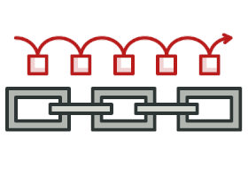
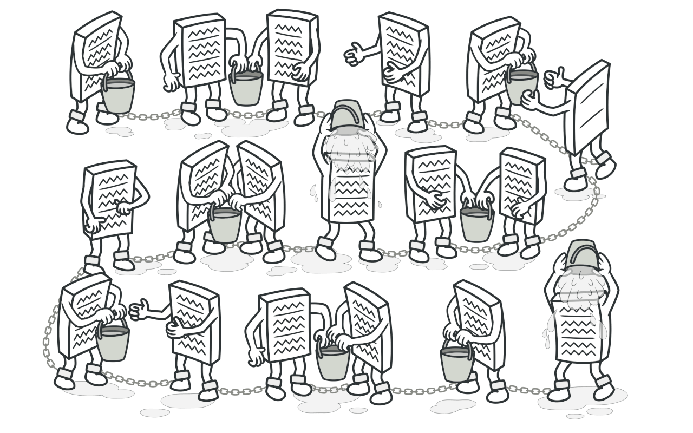
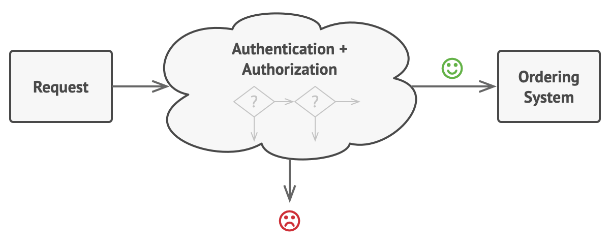
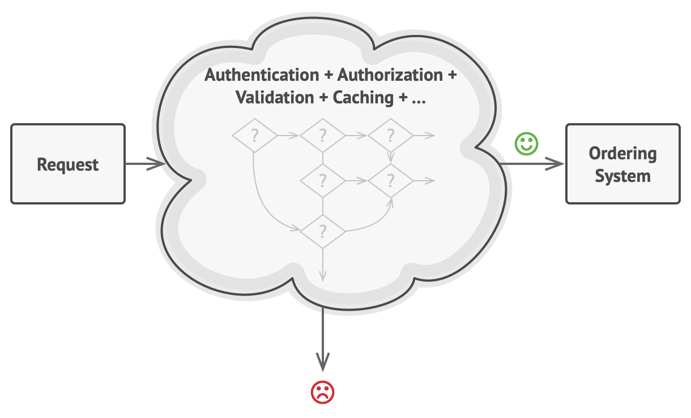
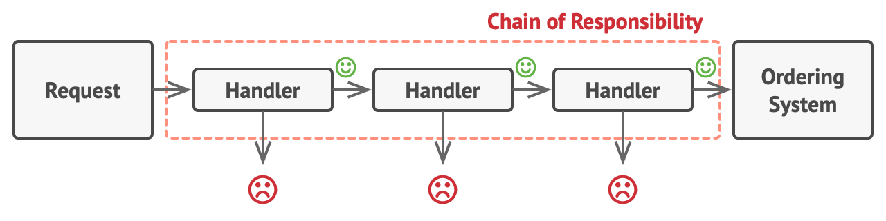
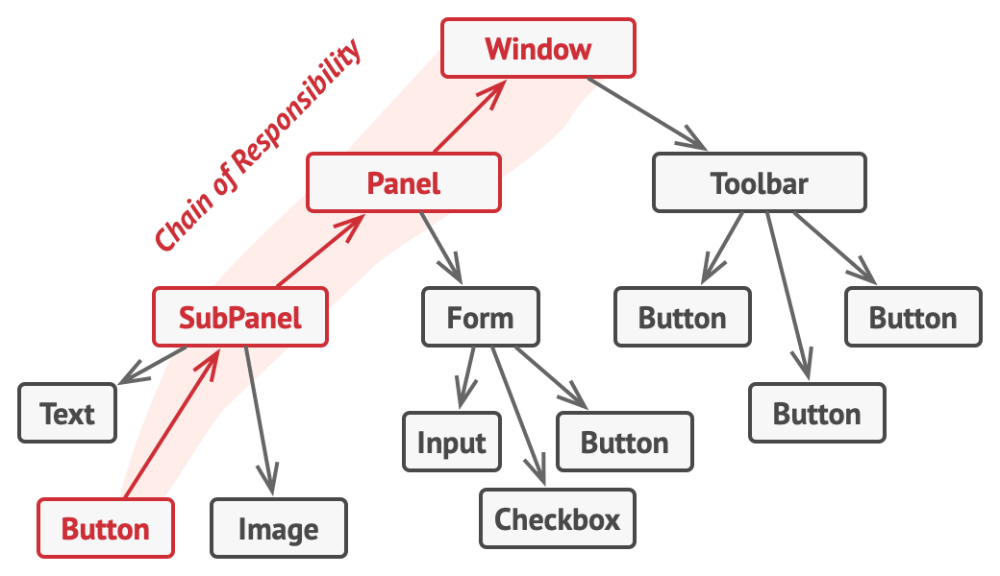
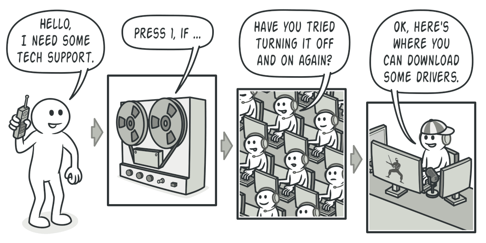
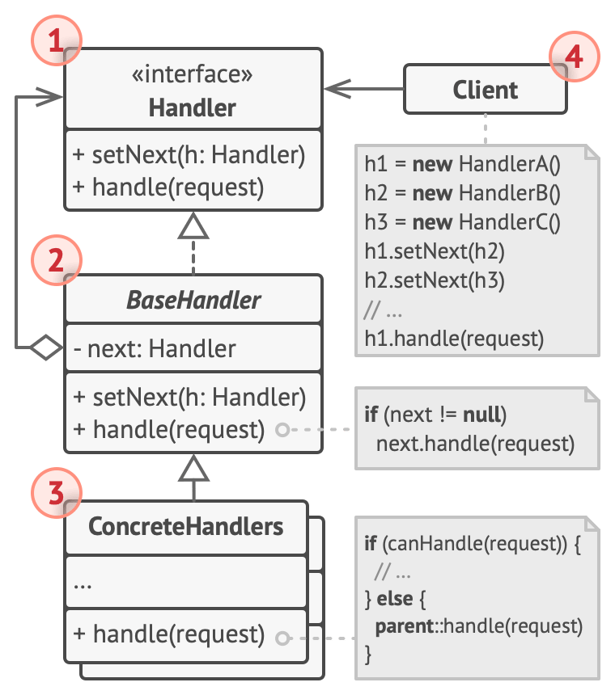
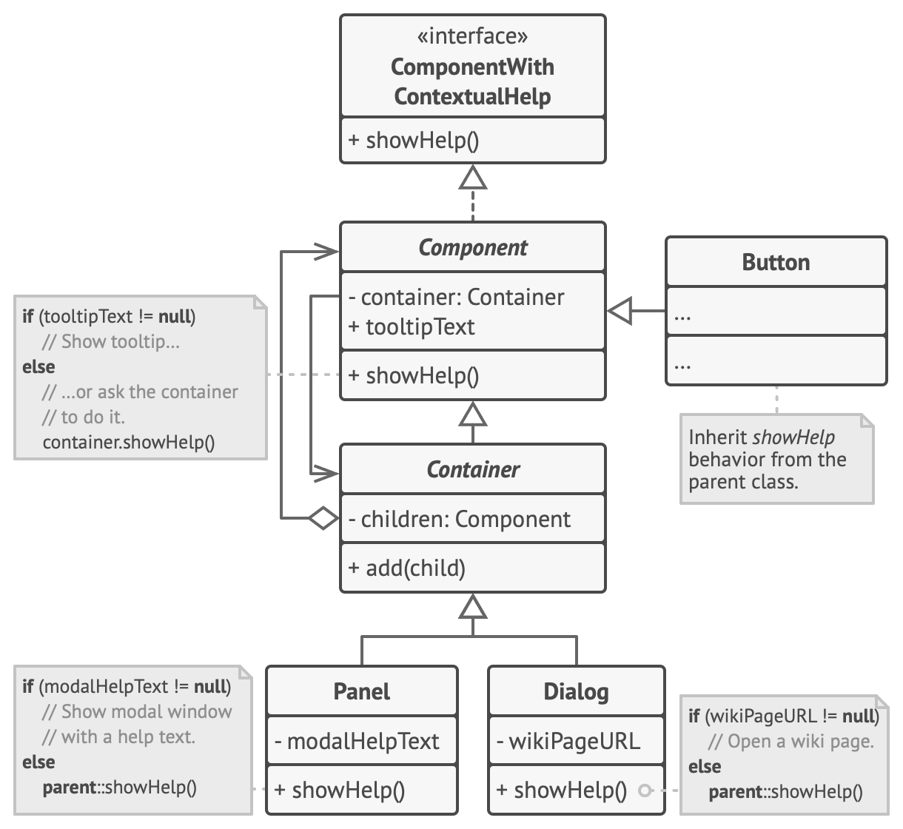
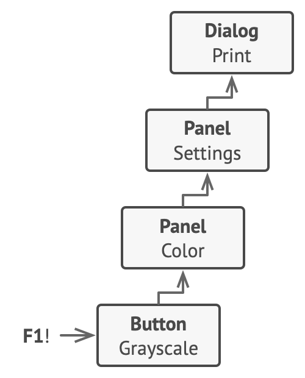

# Chain of Responsibility



**Type:** Behavioral · **Also known as:** CoR, Chain of Command

> **The 10-second version:** Instead of one giant `if/else` deciding what to do with a request, you line up small single-purpose handlers and hand the request down the line — each one either deals with it, tweaks it and passes it on, or drops it on the floor.

<br clear="all">

## Quick card

| | |
|---|---|
| **Problem it solves** | A request needs to survive a growing, reorderable gauntlet of checks/steps, and cramming them into one method turns it into a 400-line unmaintainable `if` pyramid that you can't reuse piecemeal. |
| **Core move** | Turn each step into its own object behind one interface; give each object a reference to the *next* one; the caller talks only to the head of the chain. |
| **You'll recognise it by** | A `Handler` interface with `handle(request)` plus a `next`/`successor` field, a `SetNext(...)` builder, and handler bodies that end with either `return next?.Handle(req)` or a bare `return`/`null`. |
| **Rating** | Complexity ★★☆ · Popularity ★★☆ |
| **Closest relatives** | Decorator (same shape, different contract), Command (handlers can *be* commands), Composite (a chain is often a branch of a tree), Strategy (pick one vs. try many). |
| **In your stack** | ASP.NET Core middleware (`app.Use(next => ...)`) *is* this pattern; `HttpMessageHandler`/`DelegatingHandler` in `HttpClient` is this pattern; Express/Koa/NestJS middleware is this pattern; a RabbitMQ consumer that runs a message through dedupe → validate → enrich → persist is this pattern; even SQL `COALESCE` over fallback price columns is a degenerate one-expression version of it. |

### How to read this file

Technical first, plain English second. 🗣️ marks the plain-English version. Part 1 is Refactoring.Guru's material with their diagrams; Parts 2-7 are code, your stack, and the stuff that makes it stick.

---

# PART 1 — The pattern

## 1. Intent
**Chain of Responsibility** is a behavioral design pattern that lets you pass requests along a chain of handlers. Upon receiving a request, each handler decides either to process the request or to pass it to the next handler in the chain.


### 🗣️ In plain words

You have a request and several things that *might* know what to do with it. Rather than making the caller figure out who to ask, you arrange the candidates in a queue and give the request to the first one. Each one looks at it and makes two independent decisions: *do I act?* and *do I pass it on?* The caller never learns who actually did the work — it just hands the envelope to the front of the line and gets a result (or nothing) back.

The important bit is that the chain is **assembled at runtime**, not compiled in. Swapping the order of two checks, or adding a fifth one, is a change to the assembly code, not to any handler.

## 2. Problem
Imagine that you’re working on an online ordering system. You want to restrict access to the system so only authenticated users can create orders. Also, users who have administrative permissions must have full access to all orders.

After a bit of planning, you realized that these checks must be performed sequentially. The application can attempt to authenticate a user to the system whenever it receives a request that contains the user’s credentials. However, if those credentials aren’t correct and authentication fails, there’s no reason to proceed with any other checks.



*The request must pass a series of checks before the ordering system itself can handle it.*

During the next few months, you implemented several more of those sequential checks.

- One of your colleagues suggested that it’s unsafe to pass raw data straight to the ordering system. So you added an extra validation step to sanitize the data in a request.
- Later, somebody noticed that the system is vulnerable to brute force password cracking. To negate this, you promptly added a check that filters repeated failed requests coming from the same IP address.
- Someone else suggested that you could speed up the system by returning cached results on repeated requests containing the same data. Hence, you added another check which lets the request pass through to the system only if there’s no suitable cached response.



*The bigger the code grew, the messier it became.*

The code of the checks, which had already looked like a mess, became more and more bloated as you added each new feature. Changing one check sometimes affected the others. Worst of all, when you tried to reuse the checks to protect other components of the system, you had to duplicate some of the code since those components required some of the checks, but not all of them.

The system became very hard to comprehend and expensive to maintain. You struggled with the code for a while, until one day you decided to refactor the whole thing.
### 🗣️ In plain words

Every real request handler starts life as three lines and ends up as a cliff face. Picture the endpoint that creates a car listing on a marketplace:

```csharp
// ❌ The thing that grows in the dark
public async Task<IActionResult> CreateListing(ListingDto dto)
{
    if (!User.Identity.IsAuthenticated) return Unauthorized();
    if (!User.IsInRole("Dealer") && !User.IsInRole("Admin")) return Forbid();
    if (await _rateLimiter.CountForIpAsync(Ip) > 20) return StatusCode(429);
    if (dto.Price <= 0 || dto.Price > 100_000_000) return BadRequest("price");
    if (dto.Vin is not null && !VinChecksum.IsValid(dto.Vin)) return BadRequest("vin");
    if (await _db.Listings.CountAsync(l => l.DealerId == dto.DealerId) >= _plan.MaxListings)
        return BadRequest("quota");
    if (await _dedupe.SeenAsync(dto.Fingerprint())) return Conflict();
    if (_profanity.Contains(dto.Description)) return BadRequest("description");
    // ... and now the ACTUAL business logic, 200 lines down
}
```

Four specific pains, all of which the pattern is aimed at:

1. **You cannot reuse a subset.** The bulk-upload endpoint wants rate limiting and VIN validation but *not* the quota check. Today that means copy-paste.
2. **Order is implicit and fragile.** The dedupe check hits the database; you want it *after* the cheap validations. Nothing in the code says so, so the next person reorders it innocently.
3. **Every new rule edits this method.** Open/Closed violated on a weekly cadence.
4. **Testing one rule means constructing the whole world.** You can't unit-test "quota exceeded" without a `ClaimsPrincipal`, an IP, a VIN, and a DB.

## 3. Solution
Like many other behavioral design patterns, the **Chain of Responsibility** relies on transforming particular behaviors into stand-alone objects called *handlers*. In our case, each check should be extracted to its own class with a single method that performs the check. The request, along with its data, is passed to this method as an argument.

The pattern suggests that you link these handlers into a chain. Each linked handler has a field for storing a reference to the next handler in the chain. In addition to processing a request, handlers pass the request further along the chain. The request travels along the chain until all handlers have had a chance to process it.

Here’s the best part: a handler can decide not to pass the request further down the chain and effectively stop any further processing.

In our example with ordering systems, a handler performs the processing and then decides whether to pass the request further down the chain. Assuming the request contains the right data, all the handlers can execute their primary behavior, whether it’s authentication checks or caching.



*Handlers are lined up one by one, forming a chain.*

However, there’s a slightly different approach (and it’s a bit more canonical) in which, upon receiving a request, a handler decides whether it can process it. If it can, it doesn’t pass the request any further. So it’s either only one handler that processes the request or none at all. This approach is very common when dealing with events in stacks of elements within a graphical user interface.

For instance, when a user clicks a button, the event propagates through the chain of GUI elements that starts with the button, goes along its containers (like forms or panels), and ends up with the main application window. The event is processed by the first element in the chain that’s capable of handling it. This example is also noteworthy because it shows that a chain can always be extracted from an object tree.



*A chain can be formed from a branch of an object tree.*

It’s crucial that all handler classes implement the same interface. Each concrete handler should only care about the following one having the `execute` method. This way you can compose chains at runtime, using various handlers without coupling your code to their concrete classes.
### 🗣️ In plain words

The mechanical moves, in order:

1. **Extract each step into its own class** implementing one shared interface, typically `Handle(request)`. The step's entire job fits in one method and it knows nothing about its neighbours.
2. **Give every handler a `next` reference** (usually on an abstract base class, along with a `SetNext` that returns the argument so you can fluently chain them).
3. **End each handler's body with one of two things:** `return next?.Handle(request)` — "I'm done, carry on" — or a terminal value / `return` — "I'm claiming this, nobody else runs."
4. **Let the client assemble the chain** and hold only the head. Adding, removing or reordering steps is now edits to the assembly line, not to any handler.

There are two flavours and it matters which one you're building:

- **Pipeline flavour** (the Refactoring.Guru ordering-system example, ASP.NET middleware): *every* handler runs unless one deliberately short-circuits. Used for cross-cutting concerns.
- **Canonical flavour** (the GUI help example, GUI event bubbling): the *first* handler that is capable claims the request and nobody else runs. Used for dispatch.

Both are Chain of Responsibility. Both have a `next`. The difference is only in whether the default is "pass along" or "stop".

> **The key insight:** each handler makes *two independent decisions* — "do I act?" and "do I forward?" — and because those two bits are independent you get four behaviours (act-and-forward, act-and-stop, ignore-and-forward, ignore-and-stop) from one tiny interface. That's the entire pattern. Everything else is plumbing.

## 4. Real-world analogy


*A call to tech support can go through multiple operators.*

You’ve just bought and installed a new piece of hardware on your computer. Since you’re a geek, the computer has several operating systems installed. You try to boot all of them to see whether the hardware is supported. Windows detects and enables the hardware automatically. However, your beloved Linux refuses to work with the new hardware. With a small flicker of hope, you decide to call the tech-support phone number written on the box.

The first thing you hear is the robotic voice of the autoresponder. It suggests nine popular solutions to various problems, none of which are relevant to your case. After a while, the robot connects you to a live operator.

Alas, the operator isn’t able to suggest anything specific either. He keeps quoting lengthy excerpts from the manual, refusing to listen to your comments. After hearing the phrase “have you tried turning the computer off and on again?” for the 10th time, you demand to be connected to a proper engineer.

Eventually, the operator passes your call to one of the engineers, who had probably longed for a live human chat for hours as he sat in his lonely server room in the dark basement of some office building. The engineer tells you where to download proper drivers for your new hardware and how to install them on Linux. Finally, the solution! You end the call, bursting with joy.

### 🗣️ Two more of my own

**The hospital triage line.** You walk into A&E with a hurt wrist. The receptionist takes your name and passes you on — she never treats anyone, she always forwards. The triage nurse looks, decides it isn't life-threatening, and passes you on. The junior doctor handles it, plasters the wrist, and you never reach the consultant. If you'd walked in clutching your chest, the triage nurse would have *stopped forwarding along the normal chain* and pulled you out of it immediately. Same line, same people, two completely different routes depending on the request.

**Passing the plate at a family dinner.** The dish of biryani comes in from the left. You either take some and pass it on, take some and it's now empty so it goes back to the kitchen, take nothing and pass it on, or the dish is the last one and it stops with you. Nobody at the table needs to know who's hungry — the dish just travels, and each person decides for themselves. Crucially, whoever started the plate has no idea who ate. That anonymity is exactly what the pattern buys you.

## 5. Structure


1. The **Handler** declares the interface, common for all concrete handlers. It usually contains just a single method for handling requests, but sometimes it may also have another method for setting the next handler on the chain.
2. The **Base Handler** is an optional class where you can put the boilerplate code that’s common to all handler classes.

   Usually, this class defines a field for storing a reference to the next handler. The clients can build a chain by passing a handler to the constructor or setter of the previous handler. The class may also implement the default handling behavior: it can pass execution to the next handler after checking for its existence.
3. **Concrete Handlers** contain the actual code for processing requests. Upon receiving a request, each handler must decide whether to process it and, additionally, whether to pass it along the chain.

   Handlers are usually self-contained and immutable, accepting all necessary data just once via the constructor.
4. The **Client** may compose chains just once or compose them dynamically, depending on the application’s logic. Note that a request can be sent to any handler in the chain—it doesn’t have to be the first one.
### 🗣️ Participants & roles — cheat table

| Role | What it is in code | Example from the site | Equivalent in reader's stack |
|---|---|---|---|
| **Handler** | An interface with one method, usually `Handle(request)`, sometimes plus `SetNext(handler)` | `ComponentWithContextualHelp` with `showHelp()` | `IListingRule` in C#; `RequestDelegate` in ASP.NET Core; `(ctx, next) => {}` in Koa/Express |
| **Base Handler** | Optional abstract class holding the `next` field and the default "just forward" implementation | `Component` — holds `container`, forwards `showHelp()` when it has no tooltip | `abstract class ListingRule : IListingRule` with `protected IListingRule? Next`; `DelegatingHandler` in `System.Net.Http` |
| **Concrete Handler** | One class per step; decides act / forward | `Button` (inherits default), `Panel` and `Dialog` (override, fall back to `super`) | `VinChecksumRule`, `DealerQuotaRule`, `ProfanityRule`; `AuthenticationMiddleware` |
| **Client** | Assembles the chain, holds the head, sends the request | `Application.createUI()` wires dialog → panel → buttons; `onF1KeyPress()` fires the request | `Program.cs` calling `app.UseAuthentication().UseAuthorization()`; a DI registration that orders `IEnumerable<IListingRule>` |
| **Request** | The data object passed down. Often mutable so handlers can enrich it | The implicit "show help for me" call | `ListingContext` record / `HttpContext` / a RabbitMQ `MessageEnvelope` |

### 🤝 Collaboration — who calls whom

```
 Client                Auth            RateLimit          Validate          Persist
   |                    |                  |                  |                |
   |--- Handle(req) --->|                  |                  |                |
   |                    |-- checks token   |                  |                |
   |                    |-- ok, forward -->|                  |                |
   |                    |                  |-- counts ip      |                |
   |                    |                  |-- ok, forward -->|                |
   |                    |                  |                  |-- bad VIN!     |
   |                    |                  |                  |   STOP  (X)    |
   |                    |                  |<--- Reject ------|                |
   |                    |<--- Reject ------|                  |                |
   |<---- Reject -------|                  |                  |                |
   |                    |                  |                  |                |
        (Persist never ran; Client never learned who rejected)

 Short-circuit view — the only two exits a handler has:

   handle(req):
       if (not my business) ............ return next?.handle(req)   // forward
       do work
       if (I own the outcome) .......... return result              // STOP  <-- the whole pattern
       else ............................ return next?.handle(req)   // act + forward
```

The single most important hop is the **`return next?.Handle(req)` at the bottom of a handler** — the `?.` is the end-of-chain guard, and the fact that the handler *chose* to write that line instead of `return result` is the only thing that keeps the request moving. Every bug in a hand-rolled chain is a handler that forgot to forward.

## 6. Pseudocode (the website's example)
In this example, the **Chain of Responsibility** pattern is responsible for displaying contextual help information for active GUI elements.



*The GUI classes are built with the Composite pattern. Each element is linked to its container element. At any point, you can build a chain of elements that starts with the element itself and goes through all of its container elements.*

The application’s GUI is usually structured as an object tree. For example, the `Dialog` class, which renders the main window of the app, would be the root of the object tree. The dialog contains `Panels`, which might contain other panels or simple low-level elements like `Buttons` and `TextFields`.

A simple component can show brief contextual tooltips, as long as the component has some help text assigned. But more complex components define their own way of showing contextual help, such as showing an excerpt from the manual or opening a page in a browser.



*That’s how a help request traverses GUI objects.*

When a user points the mouse cursor at an element and presses the `F1` key, the application detects the component under the pointer and sends it a help request. The request bubbles up through all the element’s containers until it reaches the element that’s capable of displaying the help information.

```
// The handler interface declares a method for executing a
// request.
interface ComponentWithContextualHelp is
    method showHelp()

// The base class for simple components.
abstract class Component implements ComponentWithContextualHelp is
    field tooltipText: string

    // The component's container acts as the next link in the
    // chain of handlers.
    protected field container: Container

    // The component shows a tooltip if there's help text
    // assigned to it. Otherwise it forwards the call to the
    // container, if it exists.
    method showHelp() is
        if (tooltipText != null)
            // Show tooltip.
        else
            container.showHelp()

// Containers can contain both simple components and other
// containers as children. The chain relationships are
// established here. The class inherits showHelp behavior from
// its parent.
abstract class Container extends Component is
    protected field children: array of Component

    method add(child) is
        children.add(child)
        child.container = this

// Primitive components may be fine with default help
// implementation...
class Button extends Component is
    // ...

// But complex components may override the default
// implementation. If the help text can't be provided in a new
// way, the component can always call the base implementation
// (see Component class).
class Panel extends Container is
    field modalHelpText: string

    method showHelp() is
        if (modalHelpText != null)
            // Show a modal window with the help text.
        else
            super.showHelp()

// ...same as above...
class Dialog extends Container is
    field wikiPageURL: string

    method showHelp() is
        if (wikiPageURL != null)
            // Open the wiki help page.
        else
            super.showHelp()

// Client code.
class Application is
    // Every application configures the chain differently.
    method createUI() is
        dialog = new Dialog("Budget Reports")
        dialog.wikiPageURL = "http://..."
        panel = new Panel(0, 0, 400, 800)
        panel.modalHelpText = "This panel does..."
        ok = new Button(250, 760, 50, 20, "OK")
        ok.tooltipText = "This is an OK button that..."
        cancel = new Button(320, 760, 50, 20, "Cancel")
        // ...
        panel.add(ok)
        panel.add(cancel)
        dialog.add(panel)

    // Imagine what happens here.
    method onF1KeyPress() is
        component = this.getComponentAtMouseCoords()
        component.showHelp()
```
### 🗣️ Reading that pseudocode

- **`interface ComponentWithContextualHelp` has exactly one method, `showHelp()`.** No `setNext`, no request object. The "request" here is literally just the call itself — the pattern does not require a parameter.
- **`Component.container` is the `next` pointer, but it's spelled as a parent link.** This is the big lesson of this example: the chain wasn't built for the chain's sake, it already existed as the Composite tree's parent references. CoR just walks it upward.
- **`Component.showHelp()` is the Base Handler's default behaviour** — "if I have something, do it; otherwise forward." Note it forwards *unconditionally* with `container.showHelp()`, no null check. Read that as the pseudocode taking a shortcut; in real code the root must terminate or you get a `NullReferenceException`.
- **`Container.add(child)` is where the chain gets wired:** `child.container = this`. The chain is assembled as a side effect of building the UI tree, not by a separate builder.
- **`Panel` and `Dialog` override `showHelp()` and call `super.showHelp()` in the else branch.** That `super` call *is* the forward step. Inheritance is doing the job that a `next` field does elsewhere — same pattern, different mechanics.
- **`onF1KeyPress()` sends the request to `getComponentAtMouseCoords()`, an arbitrary node.** That's the site's point 5 in "How to Implement" made concrete: the client fires at *any* link, not necessarily the head. With the parent-link chain, "the head" depends entirely on where the mouse was.

## 7. Applicability — when to reach for it
**Use the Chain of Responsibility pattern when your program is expected to process different kinds of requests in various ways, but the exact types of requests and their sequences are unknown beforehand.**

The pattern lets you link several handlers into one chain and, upon receiving a request, “ask” each handler whether it can process it. This way all handlers get a chance to process the request.

**Use the pattern when it’s essential to execute several handlers in a particular order.**

Since you can link the handlers in the chain in any order, all requests will get through the chain exactly as you planned.

**Use the CoR pattern when the set of handlers and their order are supposed to change at runtime.**

If you provide setters for a reference field inside the handler classes, you’ll be able to insert, remove or reorder handlers dynamically.
### ✅ Quick checklist

- [ ] Do I have **three or more** independent steps that currently live in one method?
- [ ] Would a **different caller** want a *subset* of these steps, in a possibly different order?
- [ ] Does the **order matter** and is it currently encoded only in line numbers?
- [ ] Do I need the set or order to be **configurable at runtime** (per tenant, per feature flag, per environment)?
- [ ] Is it acceptable — or desirable — that the **caller doesn't know which step handled it**?
- [ ] Can each step be **unit-tested in isolation** with a fake `next`? (If not, the steps aren't actually independent and CoR won't help.)

If you ticked fewer than three, you probably want an ordered `foreach` over a list of validators, or just a well-named private method. Say so out loud and move on.

## 8. How to implement — step by step
1. Declare the handler interface and describe the signature of a method for handling requests.

   Decide how the client will pass the request data into the method. The most flexible way is to convert the request into an object and pass it to the handling method as an argument.
2. To eliminate duplicate boilerplate code in concrete handlers, it might be worth creating an abstract base handler class, derived from the handler interface.

   This class should have a field for storing a reference to the next handler in the chain. Consider making the class immutable. However, if you plan to modify chains at runtime, you need to define a setter for altering the value of the reference field.

   You can also implement the convenient default behavior for the handling method, which is to forward the request to the next object unless there’s none left. Concrete handlers will be able to use this behavior by calling the parent method.
3. One by one create concrete handler subclasses and implement their handling methods. Each handler should make two decisions when receiving a request:

   - Whether it’ll process the request.
   - Whether it’ll pass the request along the chain.
4. The client may either assemble chains on its own or receive pre-built chains from other objects. In the latter case, you must implement some factory classes to build chains according to the configuration or environment settings.
5. The client may trigger any handler in the chain, not just the first one. The request will be passed along the chain until some handler refuses to pass it further or until it reaches the end of the chain.
6. Due to the dynamic nature of the chain, the client should be ready to handle the following scenarios:

   - The chain may consist of a single link.
   - Some requests may not reach the end of the chain.
   - Others may reach the end of the chain unhandled.
### 🗣️ The same steps, blunt version

1. **Write the interface.** One method. Bundle everything the steps need into a single request object — do not grow the parameter list, you will regret it by handler four.
2. **Write the abstract base.** It owns `next`, owns `SetNext` (return the argument so you can chain fluently), and owns the default `Handle` that just forwards. Make handlers immutable unless you genuinely reorder at runtime.
3. **Write each concrete handler.** Two decisions per handler, written explicitly: act or not, forward or not. Put them on separate lines so a reviewer can see both.
4. **Decide who builds the chain.** For anything with more than ~4 links, or where the order is config-driven, use a factory / DI registration rather than hand-wiring at the call site.
5. **Remember the client can fire at any link.** If yours can't, document that the head is the only entry point.
6. **Handle the three edge cases before you ship:** a one-link chain, a request that stops early, and a request that falls off the end unhandled. Decide *now* what the last one means — return `null`, return a "nobody handled it" sentinel, or throw. Silence is the number one CoR bug.

## 9. Pros and cons
- ✅ You can control the order of request handling.
- ✅ *Single Responsibility Principle*. You can decouple classes that invoke operations from classes that perform operations.
- ✅ *Open/Closed Principle*. You can introduce new handlers into the app without breaking the existing client code.

- ⛔ Some requests may end up unhandled.
### ⚖️ Honest trade-offs from the trenches

**The true cost is debuggability, and it's higher than people admit.** A stack trace through a ten-link chain is ten near-identical frames of `Handle`, `Handle`, `Handle`, and the interesting question — *why did the request stop at link four?* — is invisible. A `foreach` over validators would have told you in one line. Mitigate it deliberately: give every handler a `Name`, log a single structured line per hop at debug level (`{Handler} {Decision} {Elapsed}`), and return a *reason object* rather than `null` when a handler short-circuits. If you're not willing to build that, don't build the chain.

**The tell that it's worth it** is when you write the *second* assembly. One chain is a `foreach` with extra classes. The moment you have `BuildCreateListingChain()` and `BuildBulkImportChain()` sharing seven of nine handlers in a different order, the pattern has paid for itself and you'll never go back. Until then, a `List<IRule>` and a loop gives you 80% of the benefit — reuse, isolated tests, Open/Closed — with none of the `next` plumbing. That loop is the honest default; CoR earns its keep specifically when handlers need to **wrap** the rest of the chain (start a timer, open a transaction, catch an exception around everything downstream), which a flat loop simply cannot express.

**What you get for free in modern C#/TS, and should therefore not hand-roll.** ASP.NET Core's middleware pipeline is a production-grade CoR with DI, ordering, short-circuiting, and `try/finally` wrapping already solved — if your chain runs inside an HTTP request, write middleware. For outbound HTTP, `DelegatingHandler` chained via `AddHttpMessageHandler<T>()` gives you retry/auth/logging chains that Polly already populates. MediatR's `IPipelineBehavior<TRequest,TResponse>` is CoR for in-process commands and is the right answer for a ten-rule validation chain in a CQRS codebase. On the Node side, Express/Koa/Fastify hooks and NestJS interceptors/guards are the same thing. In C++ the closest free lunch is `std::function` composition; in Java it's `javax.servlet.Filter` and OkHttp's `Interceptor`. **Hand-roll the pattern only for domain logic that is not an HTTP or message pipeline** — pricing rules, eligibility rules, lead routing.

**The one con the site lists — "some requests may end up unhandled" — is understated.** In a validation chain, falling off the end means "approved," which is the failure mode that lets bad data in. Make the terminal link explicit: put a `TerminalHandler` at the end that either performs the real action or throws `UnhandledRequestException`. Never let `next?.Handle()` on a null `next` silently return `null` into business code.

## 10. Relations with other patterns
- [Chain of Responsibility](https://refactoring.guru/design-patterns/chain-of-responsibility), [Command](https://refactoring.guru/design-patterns/command), [Mediator](https://refactoring.guru/design-patterns/mediator) and [Observer](https://refactoring.guru/design-patterns/observer) address various ways of connecting senders and receivers of requests:

  - *Chain of Responsibility* passes a request sequentially along a dynamic chain of potential receivers until one of them handles it.
  - *Command* establishes unidirectional connections between senders and receivers.
  - *Mediator* eliminates direct connections between senders and receivers, forcing them to communicate indirectly via a mediator object.
  - *Observer* lets receivers dynamically subscribe to and unsubscribe from receiving requests.
- [Chain of Responsibility](https://refactoring.guru/design-patterns/chain-of-responsibility) is often used in conjunction with [Composite](https://refactoring.guru/design-patterns/composite). In this case, when a leaf component gets a request, it may pass it through the chain of all of the parent components down to the root of the object tree.
- Handlers in [Chain of Responsibility](https://refactoring.guru/design-patterns/chain-of-responsibility) can be implemented as [Commands](https://refactoring.guru/design-patterns/command). In this case, you can execute a lot of different operations over the same context object, represented by a request.

  However, there’s another approach, where the request itself is a *Command* object. In this case, you can execute the same operation in a series of different contexts linked into a chain.
- [Chain of Responsibility](https://refactoring.guru/design-patterns/chain-of-responsibility) and [Decorator](https://refactoring.guru/design-patterns/decorator) have very similar class structures. Both patterns rely on recursive composition to pass the execution through a series of objects. However, there are several crucial differences.

  The *CoR* handlers can execute arbitrary operations independently of each other. They can also stop passing the request further at any point. On the other hand, various *Decorators* can extend the object’s behavior while keeping it consistent with the base interface. In addition, decorators aren’t allowed to break the flow of the request.
### 🗣️ Disambiguation table

| Pattern | Structurally | The contract | How to tell them apart in review |
|---|---|---|---|
| **Chain of Responsibility** | Object A holds a reference to object B of the same interface | A handler **may refuse to forward**. Stopping the flow is a feature. | You see `if (...) return;` *without* calling `next`. |
| **Decorator** | Identical — object A wraps object B of the same interface | A decorator **must always delegate**; it only adds behaviour around the call. | Every method body contains a call to the wrapped object. No early exits. |
| **Command** | A request is reified as an object with `Execute()` | Sender → one specific receiver, unidirectional. No chain, no choice. | There's an `Execute()` and no `next`. (Handlers *can* be Commands — see the site's note.) |
| **Mediator** | All colleagues point to one central object | Star topology, not a line. The mediator knows everyone; colleagues know only it. | One class with references to *many*; the others reference only it. |
| **Observer** | One subject, N subscribers, dynamic subscription | **All** subscribers get it, order undefined, none can stop the others. | `+= handler` / `subscribe()`; no return value flows back. |
| **Strategy** | Client holds exactly one interchangeable algorithm | Pick **one** up front and run it. | A single field, chosen by a factory or a switch; no `next`, no fallback. |

> **The one-liner that separates them: a Decorator is a chain that isn't allowed to break; a Chain of Responsibility is a decorator that is.** And: *Strategy picks one, Chain tries several, Observer tells everyone, Mediator makes them all talk through a middleman.*

The Composite relation is worth internalising too: any tree with parent pointers already contains a chain from any leaf up to the root. DOM event bubbling, GUI help text, exception propagation up a call stack, config lookup falling back from dealer → region → global — all of them are CoR riding on a Composite that already existed.

---

# PART 2 — Official code examples from Refactoring.Guru

## 2.1 C#
**Complexity:** ★★☆ (2/3)

**Popularity:** ★★☆ (2/3)

**Usage examples:** The Chain of Responsibility is pretty common in C#. It’s mostly relevant when your code operates with chains of objects, such as filters, event chains, etc.

**Identification:** The pattern is recognizable by behavioral methods of one group of objects that indirectly call the same methods in other objects, while all the objects follow the common interface.
### Conceptual Example

This example illustrates the structure of the **Chain of Responsibility** design pattern. It focuses on answering these questions:

- What classes does it consist of?
- What roles do these classes play?
- In what way the elements of the pattern are related?

##### **Program.cs:** Conceptual example

```csharp
using System;
using System.Collections.Generic;

namespace RefactoringGuru.DesignPatterns.ChainOfResponsibility.Conceptual
{
    // The Handler interface declares a method for building the chain of
    // handlers. It also declares a method for executing a request.
    public interface IHandler
    {
        IHandler SetNext(IHandler handler);

        object Handle(object request);
    }

    // The default chaining behavior can be implemented inside a base handler
    // class.
    abstract class AbstractHandler : IHandler
    {
        private IHandler _nextHandler;

        public IHandler SetNext(IHandler handler)
        {
            this._nextHandler = handler;

            // Returning a handler from here will let us link handlers in a
            // convenient way like this:
            // monkey.SetNext(squirrel).SetNext(dog);
            return handler;
        }

        public virtual object Handle(object request)
        {
            if (this._nextHandler != null)
            {
                return this._nextHandler.Handle(request);
            }
            else
            {
                return null;
            }
        }
    }

    class MonkeyHandler : AbstractHandler
    {
        public override object Handle(object request)
        {
            if ((request as string) == "Banana")
            {
                return $"Monkey: I'll eat the {request.ToString()}.\n";
            }
            else
            {
                return base.Handle(request);
            }
        }
    }

    class SquirrelHandler : AbstractHandler
    {
        public override object Handle(object request)
        {
            if (request.ToString() == "Nut")
            {
                return $"Squirrel: I'll eat the {request.ToString()}.\n";
            }
            else
            {
                return base.Handle(request);
            }
        }
    }

    class DogHandler : AbstractHandler
    {
        public override object Handle(object request)
        {
            if (request.ToString() == "MeatBall")
            {
                return $"Dog: I'll eat the {request.ToString()}.\n";
            }
            else
            {
                return base.Handle(request);
            }
        }
    }

    class Client
    {
        // The client code is usually suited to work with a single handler. In
        // most cases, it is not even aware that the handler is part of a chain.
        public static void ClientCode(AbstractHandler handler)
        {
            foreach (var food in new List<string> { "Nut", "Banana", "Cup of coffee" })
            {
                Console.WriteLine($"Client: Who wants a {food}?");

                var result = handler.Handle(food);

                if (result != null)
                {
                    Console.Write($"   {result}");
                }
                else
                {
                    Console.WriteLine($"   {food} was left untouched.");
                }
            }
        }
    }

    class Program
    {
        static void Main(string[] args)
        {
            // The other part of the client code constructs the actual chain.
            var monkey = new MonkeyHandler();
            var squirrel = new SquirrelHandler();
            var dog = new DogHandler();

            monkey.SetNext(squirrel).SetNext(dog);

            // The client should be able to send a request to any handler, not
            // just the first one in the chain.
            Console.WriteLine("Chain: Monkey > Squirrel > Dog\n");
            Client.ClientCode(monkey);
            Console.WriteLine();

            Console.WriteLine("Subchain: Squirrel > Dog\n");
            Client.ClientCode(squirrel);
        }
    }
}
```

##### **Output.txt:** Execution result

```output
Chain: Monkey > Squirrel > Dog

Client: Who wants a Nut?
   Squirrel: I'll eat the Nut.
Client: Who wants a Banana?
   Monkey: I'll eat the Banana.
Client: Who wants a Cup of coffee?
   Cup of coffee was left untouched.

Subchain: Squirrel > Dog

Client: Who wants a Nut?
   Squirrel: I'll eat the Nut.
Client: Who wants a Banana?
   Banana was left untouched.
Client: Who wants a Cup of coffee?
   Cup of coffee was left untouched.
```

## 2.2 TypeScript
**Complexity:** ★★☆ (2/3)

**Popularity:** ★★☆ (2/3)

**Usage examples:** The Chain of Responsibility is pretty common in TypeScript. It’s mostly relevant when your code operates with chains of objects, such as filters, event chains, etc.

**Identification:** The pattern is recognizable by behavioral methods of one group of objects that indirectly call the same methods in other objects, while all the objects follow the common interface.
### Conceptual Example

This example illustrates the structure of the **Chain of Responsibility** design pattern and focuses on the following questions:

- What classes does it consist of?
- What roles do these classes play?
- In what way the elements of the pattern are related?

##### **index.ts:** Conceptual example

```typescript
/**
 * The Handler interface declares a method for building the chain of handlers.
 * It also declares a method for executing a request.
 */
interface Handler<Request = string, Result = string> {
    setNext(handler: Handler<Request, Result>): Handler<Request, Result>;

    handle(request: Request): Result;
}

/**
 * The default chaining behavior can be implemented inside a base handler class.
 */
abstract class AbstractHandler implements Handler
{
    private nextHandler: Handler;

    public setNext(handler: Handler): Handler {
        this.nextHandler = handler;
        // Returning a handler from here will let us link handlers in a
        // convenient way like this:
        // monkey.setNext(squirrel).setNext(dog);
        return handler;
    }

    public handle(request: string): string {
        if (this.nextHandler) {
            return this.nextHandler.handle(request);
        }

        return null;
    }
}

/**
 * All Concrete Handlers either handle a request or pass it to the next handler
 * in the chain.
 */
class MonkeyHandler extends AbstractHandler {
    public handle(request: string): string {
        if (request === 'Banana') {
            return `Monkey: I'll eat the ${request}.`;
        }
        return super.handle(request);

    }
}

class SquirrelHandler extends AbstractHandler {
    public handle(request: string): string {
        if (request === 'Nut') {
            return `Squirrel: I'll eat the ${request}.`;
        }
        return super.handle(request);
    }
}

class DogHandler extends AbstractHandler {
    public handle(request: string): string {
        if (request === 'MeatBall') {
            return `Dog: I'll eat the ${request}.`;
        }
        return super.handle(request);
    }
}

/**
 * The client code is usually suited to work with a single handler. In most
 * cases, it is not even aware that the handler is part of a chain.
 */
function clientCode(handler: Handler) {
    const foods = ['Nut', 'Banana', 'Cup of coffee'];

    for (const food of foods) {
        console.log(`Client: Who wants a ${food}?`);

        const result = handler.handle(food);
        if (result) {
            console.log(`  ${result}`);
        } else {
            console.log(`  ${food} was left untouched.`);
        }
    }
}

/**
 * The other part of the client code constructs the actual chain.
 */
const monkey = new MonkeyHandler();
const squirrel = new SquirrelHandler();
const dog = new DogHandler();

monkey.setNext(squirrel).setNext(dog);

/**
 * The client should be able to send a request to any handler, not just the
 * first one in the chain.
 */
console.log('Chain: Monkey > Squirrel > Dog\n');
clientCode(monkey);
console.log('');

console.log('Subchain: Squirrel > Dog\n');
clientCode(squirrel);
```

##### **Output.txt:** Execution result

```output
Chain: Monkey > Squirrel > Dog

Client: Who wants a Nut?
  Squirrel: I'll eat the Nut.
Client: Who wants a Banana?
  Monkey: I'll eat the Banana.
Client: Who wants a Cup of coffee?
  Cup of coffee was left untouched.

Subchain: Squirrel > Dog

Client: Who wants a Nut?
  Squirrel: I'll eat the Nut.
Client: Who wants a Banana?
  Banana was left untouched.
Client: Who wants a Cup of coffee?
  Cup of coffee was left untouched.
```

## 2.3 C++
**Complexity:** ★★☆ (2/3)

**Popularity:** ★★☆ (2/3)

**Usage examples:** The Chain of Responsibility is pretty common in C++. It’s mostly relevant when your code operates with chains of objects, such as filters, event chains, etc.

**Identification:** The pattern is recognizable by behavioral methods of one group of objects that indirectly call the same methods in other objects, while all the objects follow the common interface.
### Conceptual Example

This example illustrates the structure of the **Chain of Responsibility** design pattern. It focuses on answering these questions:

- What classes does it consist of?
- What roles do these classes play?
- In what way the elements of the pattern are related?

##### **main.cc:** Conceptual example

```cpp
/**
 * The Handler interface declares a method for building the chain of handlers.
 * It also declares a method for executing a request.
 */
class Handler {
 public:
  virtual Handler *SetNext(Handler *handler) = 0;
  virtual std::string Handle(std::string request) = 0;
};
/**
 * The default chaining behavior can be implemented inside a base handler class.
 */
class AbstractHandler : public Handler {
  /**
   * @var Handler
   */
 private:
  Handler *next_handler_;

 public:
  AbstractHandler() : next_handler_(nullptr) {
  }
  Handler *SetNext(Handler *handler) override {
    this->next_handler_ = handler;
    // Returning a handler from here will let us link handlers in a convenient
    // way like this:
    // $monkey->setNext($squirrel)->setNext($dog);
    return handler;
  }
  std::string Handle(std::string request) override {
    if (this->next_handler_) {
      return this->next_handler_->Handle(request);
    }

    return {};
  }
};
/**
 * All Concrete Handlers either handle a request or pass it to the next handler
 * in the chain.
 */
class MonkeyHandler : public AbstractHandler {
 public:
  std::string Handle(std::string request) override {
    if (request == "Banana") {
      return "Monkey: I'll eat the " + request + ".\n";
    } else {
      return AbstractHandler::Handle(request);
    }
  }
};
class SquirrelHandler : public AbstractHandler {
 public:
  std::string Handle(std::string request) override {
    if (request == "Nut") {
      return "Squirrel: I'll eat the " + request + ".\n";
    } else {
      return AbstractHandler::Handle(request);
    }
  }
};
class DogHandler : public AbstractHandler {
 public:
  std::string Handle(std::string request) override {
    if (request == "MeatBall") {
      return "Dog: I'll eat the " + request + ".\n";
    } else {
      return AbstractHandler::Handle(request);
    }
  }
};
/**
 * The client code is usually suited to work with a single handler. In most
 * cases, it is not even aware that the handler is part of a chain.
 */
void ClientCode(Handler &handler) {
  std::vector<std::string> food = {"Nut", "Banana", "Cup of coffee"};
  for (const std::string &f : food) {
    std::cout << "Client: Who wants a " << f << "?\n";
    const std::string result = handler.Handle(f);
    if (!result.empty()) {
      std::cout << "  " << result;
    } else {
      std::cout << "  " << f << " was left untouched.\n";
    }
  }
}
/**
 * The other part of the client code constructs the actual chain.
 */
int main() {
  MonkeyHandler *monkey = new MonkeyHandler;
  SquirrelHandler *squirrel = new SquirrelHandler;
  DogHandler *dog = new DogHandler;
  monkey->SetNext(squirrel)->SetNext(dog);

  /**
   * The client should be able to send a request to any handler, not just the
   * first one in the chain.
   */
  std::cout << "Chain: Monkey > Squirrel > Dog\n\n";
  ClientCode(*monkey);
  std::cout << "\n";
  std::cout << "Subchain: Squirrel > Dog\n\n";
  ClientCode(*squirrel);

  delete monkey;
  delete squirrel;
  delete dog;

  return 0;
}
```

##### **Output.txt:** Execution result

```output
Chain: Monkey > Squirrel > Dog

Client: Who wants a Nut?
  Squirrel: I'll eat the Nut.
Client: Who wants a Banana?
  Monkey: I'll eat the Banana.
Client: Who wants a Cup of coffee?
  Cup of coffee was left untouched.

Subchain: Squirrel > Dog

Client: Who wants a Nut?
  Squirrel: I'll eat the Nut.
Client: Who wants a Banana?
  Banana was left untouched.
Client: Who wants a Cup of coffee?
  Cup of coffee was left untouched.
```

## 2.4 Java
**Complexity:** ★★☆ (2/3)

**Popularity:** ★★☆ (2/3)

**Usage examples:** The Chain of Responsibility is pretty common in Java.

**Identification:** The pattern is recognizable by behavioral methods of one group of objects that indirectly call the same methods in other objects, while all the objects follow the common interface.
### Filtering access

This example shows how a request containing user data passes a sequential chain of handlers that perform various things such as authentication, authorization, and validation.

This example is a bit different from the canonical version of the pattern given by various authors. Most of the pattern examples are built on the notion of looking for the right handler, launching it and exiting the chain after that. But here we execute every handler until there’s one that **can’t handle** a request. Be aware that this still is the Chain of Responsibility pattern, even though the flow is a bit different.

#### **middleware**

##### **middleware/Middleware.java:** Basic validation interface

```java
package refactoring_guru.chain_of_responsibility.example.middleware;

/**
 * Base middleware class.
 */
public abstract class Middleware {
    private Middleware next;

    /**
     * Builds chains of middleware objects.
     */
    public static Middleware link(Middleware first, Middleware... chain) {
        Middleware head = first;
        for (Middleware nextInChain: chain) {
            head.next = nextInChain;
            head = nextInChain;
        }
        return first;
    }

    /**
     * Subclasses will implement this method with concrete checks.
     */
    public abstract boolean check(String email, String password);

    /**
     * Runs check on the next object in chain or ends traversing if we're in
     * last object in chain.
     */
    protected boolean checkNext(String email, String password) {
        if (next == null) {
            return true;
        }
        return next.check(email, password);
    }
}
```

##### **middleware/ThrottlingMiddleware.java:** Check whether the limit on the number of requests is reached

```java
package refactoring_guru.chain_of_responsibility.example.middleware;

/**
 * ConcreteHandler. Checks whether there are too many failed login requests.
 */
public class ThrottlingMiddleware extends Middleware {
    private int requestPerMinute;
    private int request;
    private long currentTime;

    public ThrottlingMiddleware(int requestPerMinute) {
        this.requestPerMinute = requestPerMinute;
        this.currentTime = System.currentTimeMillis();
    }

    /**
     * Please, not that checkNext() call can be inserted both in the beginning
     * of this method and in the end.
     *
     * This gives much more flexibility than a simple loop over all middleware
     * objects. For instance, an element of a chain can change the order of
     * checks by running its check after all other checks.
     */
    public boolean check(String email, String password) {
        if (System.currentTimeMillis() > currentTime + 60_000) {
            request = 0;
            currentTime = System.currentTimeMillis();
        }

        request++;

        if (request > requestPerMinute) {
            System.out.println("Request limit exceeded!");
            Thread.currentThread().stop();
        }
        return checkNext(email, password);
    }
}
```

##### **middleware/UserExistsMiddleware.java:** Check user’s credentials

```java
package refactoring_guru.chain_of_responsibility.example.middleware;

import refactoring_guru.chain_of_responsibility.example.server.Server;

/**
 * ConcreteHandler. Checks whether a user with the given credentials exists.
 */
public class UserExistsMiddleware extends Middleware {
    private Server server;

    public UserExistsMiddleware(Server server) {
        this.server = server;
    }

    public boolean check(String email, String password) {
        if (!server.hasEmail(email)) {
            System.out.println("This email is not registered!");
            return false;
        }
        if (!server.isValidPassword(email, password)) {
            System.out.println("Wrong password!");
            return false;
        }
        return checkNext(email, password);
    }
}
```

##### **middleware/RoleCheckMiddleware.java:** Check user’s role

```java
package refactoring_guru.chain_of_responsibility.example.middleware;

/**
 * ConcreteHandler. Checks a user's role.
 */
public class RoleCheckMiddleware extends Middleware {
    public boolean check(String email, String password) {
        if (email.equals("admin@example.com")) {
            System.out.println("Hello, admin!");
            return true;
        }
        System.out.println("Hello, user!");
        return checkNext(email, password);
    }
}
```

#### **server**

##### **server/Server.java:** Authorization target

```java
package refactoring_guru.chain_of_responsibility.example.server;

import refactoring_guru.chain_of_responsibility.example.middleware.Middleware;

import java.util.HashMap;
import java.util.Map;

/**
 * Server class.
 */
public class Server {
    private Map<String, String> users = new HashMap<>();
    private Middleware middleware;

    /**
     * Client passes a chain of object to server. This improves flexibility and
     * makes testing the server class easier.
     */
    public void setMiddleware(Middleware middleware) {
        this.middleware = middleware;
    }

    /**
     * Server gets email and password from client and sends the authorization
     * request to the chain.
     */
    public boolean logIn(String email, String password) {
        if (middleware.check(email, password)) {
            System.out.println("Authorization have been successful!");

            // Do something useful here for authorized users.

            return true;
        }
        return false;
    }

    public void register(String email, String password) {
        users.put(email, password);
    }

    public boolean hasEmail(String email) {
        return users.containsKey(email);
    }

    public boolean isValidPassword(String email, String password) {
        return users.get(email).equals(password);
    }
}
```

##### **Demo.java:** Client code

```java
package refactoring_guru.chain_of_responsibility.example;

import refactoring_guru.chain_of_responsibility.example.middleware.Middleware;
import refactoring_guru.chain_of_responsibility.example.middleware.RoleCheckMiddleware;
import refactoring_guru.chain_of_responsibility.example.middleware.ThrottlingMiddleware;
import refactoring_guru.chain_of_responsibility.example.middleware.UserExistsMiddleware;
import refactoring_guru.chain_of_responsibility.example.server.Server;

import java.io.BufferedReader;
import java.io.IOException;
import java.io.InputStreamReader;

/**
 * Demo class. Everything comes together here.
 */
public class Demo {
    private static BufferedReader reader = new BufferedReader(new InputStreamReader(System.in));
    private static Server server;

    private static void init() {
        server = new Server();
        server.register("admin@example.com", "admin_pass");
        server.register("user@example.com", "user_pass");

        // All checks are linked. Client can build various chains using the same
        // components.
        Middleware middleware = Middleware.link(
            new ThrottlingMiddleware(2),
            new UserExistsMiddleware(server),
            new RoleCheckMiddleware()
        );

        // Server gets a chain from client code.
        server.setMiddleware(middleware);
    }

    public static void main(String[] args) throws IOException {
        init();

        boolean success;
        do {
            System.out.print("Enter email: ");
            String email = reader.readLine();
            System.out.print("Input password: ");
            String password = reader.readLine();
            success = server.logIn(email, password);
        } while (!success);
    }
}
```

##### **OutputDemo.txt:** Execution result

```output
Enter email: admin@example.com
Input password: admin_pass
Hello, admin!
Authorization have been successful!

Enter email: wrong@example.com
Input password: wrong_pass
This email is not registered!
Enter email: wrong@example.com
Input password: wrong_pass
This email is not registered!
Enter email: wrong@example.com
Input password: wrong_pass
Request limit exceeded!
```

---

# PART 3 — Learn it by building it

## 3.1 The dumbest possible version — TypeScript

The domain: a dealer submits a car listing. Before it goes live it has to pass a gauntlet. Here is the version everybody writes first.

### ❌ BEFORE

```typescript
type Listing = {
  id: string;
  dealerId: string;
  make: string;
  model: string;
  year: number;
  priceInr: number;
  kmDriven: number;
  vin?: string;
  description: string;
  photoUrls: string[];
};

// One function. It only ever grows.
async function publishListing(listing: Listing): Promise<string> {
  const dealer = await db.getDealer(listing.dealerId);
  if (!dealer) throw new Error('Unknown dealer');
  if (dealer.status !== 'active') throw new Error('Dealer suspended');

  const liveCount = await db.countLiveListings(dealer.id);
  if (liveCount >= dealer.plan.maxListings) throw new Error('Quota exceeded');

  if (listing.year < 1980 || listing.year > new Date().getFullYear() + 1)
    throw new Error('Bad year');
  if (listing.priceInr <= 0 || listing.priceInr > 100_000_000)
    throw new Error('Bad price');
  if (listing.kmDriven < 0 || listing.kmDriven > 1_000_000)
    throw new Error('Bad odometer');

  if (listing.vin && !isValidVin(listing.vin)) throw new Error('Bad VIN');

  if (listing.photoUrls.length === 0) throw new Error('Needs a photo');

  const fingerprint = `${listing.dealerId}:${listing.vin ?? listing.model}:${listing.kmDriven}`;
  if (await cache.exists(`dupe:${fingerprint}`)) throw new Error('Duplicate');

  if (PROFANITY.some(w => listing.description.toLowerCase().includes(w)))
    throw new Error('Bad description');

  return db.insertListing(listing);
}
```

Three weeks later someone adds a bulk CSV importer that needs *everything except* the quota check, plus a new "price is 40% below market, flag for manual review" rule that has to run **after** dedupe but **before** insert. You now copy the function. That is the moment to reach for the pattern.

### ✅ AFTER

```typescript
// ── 1. THE REQUEST OBJECT ────────────────────────────────────────────────
// One bag of data + a place for handlers to write findings. Handlers enrich
// it as it travels — that is why it is mutable and why the signature never
// grows past one parameter.
export interface ListingContext {
  readonly listing: Listing;
  readonly now: Date;
  /** Handlers push here instead of throwing, so we can report every problem. */
  readonly issues: Array<{ code: string; message: string; handler: string }>;
  /** Enrichment written by earlier handlers and read by later ones. */
  marketPriceInr?: number;
  needsManualReview?: boolean;
}

// ── 2. THE HANDLER INTERFACE ─────────────────────────────────────────────
export type Decision = 'published' | 'rejected' | 'queued-for-review';

export interface ListingHandler {
  readonly name: string;
  setNext(next: ListingHandler): ListingHandler; // 👈 returns the ARGUMENT, so calls chain
  handle(ctx: ListingContext): Promise<Decision | null>;
}

// ── 3. THE BASE HANDLER ──────────────────────────────────────────────────
// Owns the `next` pointer and the default "I'm done, carry on" behaviour.
// Every concrete handler inherits the forwarding logic and never repeats it.
export abstract class BaseHandler implements ListingHandler {
  private next?: ListingHandler;

  abstract get name(): string;

  setNext(next: ListingHandler): ListingHandler {
    this.next = next;
    return next;                 // 👈 THIS is what makes a.setNext(b).setNext(c) work
  }

  async handle(ctx: ListingContext): Promise<Decision | null> {
    // 👈 The end-of-chain guard. `?? null` means "nobody claimed it".
    return this.next ? this.next.handle(ctx) : null;
  }

  /** Sugar so concrete handlers read as intent, not plumbing. */
  protected forward(ctx: ListingContext): Promise<Decision | null> {
    return super_handle(this, ctx);
  }
}

// TypeScript has no `super.method()` from an arrow/helper, so a tiny shim keeps
// the concrete handlers readable. In practice you just call `super.handle(ctx)`.
function super_handle(self: BaseHandler, ctx: ListingContext) {
  return BaseHandler.prototype.handle.call(self, ctx);
}

// ── 4. CONCRETE HANDLERS ─────────────────────────────────────────────────

/** Act + STOP. A suspended dealer ends the request; nothing downstream runs. */
export class DealerStatusHandler extends BaseHandler {
  get name() { return 'dealer-status'; }
  constructor(private readonly dealers: DealerRepo) { super(); }

  async handle(ctx: ListingContext): Promise<Decision | null> {
    const dealer = await this.dealers.get(ctx.listing.dealerId);
    if (!dealer || dealer.status !== 'active') {
      ctx.issues.push({ code: 'DEALER_INACTIVE', message: 'Dealer cannot publish', handler: this.name });
      return 'rejected';                    // 👈 SHORT-CIRCUIT: no `super.handle`
    }
    return super.handle(ctx);               // 👈 forward
  }
}

/** Pure validation. Collects issues but still forwards, so the dealer sees
 *  every problem in one response instead of playing whack-a-mole. */
export class FieldRangeHandler extends BaseHandler {
  get name() { return 'field-ranges'; }

  async handle(ctx: ListingContext): Promise<Decision | null> {
    const l = ctx.listing;
    const maxYear = ctx.now.getFullYear() + 1;
    if (l.year < 1980 || l.year > maxYear)
      ctx.issues.push({ code: 'BAD_YEAR', message: `Year must be 1980-${maxYear}`, handler: this.name });
    if (l.priceInr <= 0 || l.priceInr > 100_000_000)
      ctx.issues.push({ code: 'BAD_PRICE', message: 'Price out of range', handler: this.name });
    if (l.kmDriven < 0 || l.kmDriven > 1_000_000)
      ctx.issues.push({ code: 'BAD_ODO', message: 'Odometer out of range', handler: this.name });
    if (l.photoUrls.length === 0)
      ctx.issues.push({ code: 'NO_PHOTO', message: 'At least one photo required', handler: this.name });
    return super.handle(ctx);               // 👈 act AND forward
  }
}

/** A gate: if anything upstream complained, stop here before touching the DB. */
export class RejectIfIssuesHandler extends BaseHandler {
  get name() { return 'gate'; }
  async handle(ctx: ListingContext): Promise<Decision | null> {
    if (ctx.issues.length > 0) return 'rejected';   // 👈 the cheap/expensive boundary
    return super.handle(ctx);
  }
}

/** Ignore + forward when not applicable. VIN is optional on Indian listings. */
export class VinChecksumHandler extends BaseHandler {
  get name() { return 'vin-checksum'; }
  async handle(ctx: ListingContext): Promise<Decision | null> {
    const vin = ctx.listing.vin;
    if (!vin) return super.handle(ctx);     // 👈 not my business
    if (!isValidVin(vin)) {
      ctx.issues.push({ code: 'BAD_VIN', message: 'VIN checksum failed', handler: this.name });
      return 'rejected';
    }
    return super.handle(ctx);
  }
}

/** Enrichment: writes to the context so a LATER handler can use it. */
export class MarketPriceHandler extends BaseHandler {
  get name() { return 'market-price'; }
  constructor(private readonly pricing: PricingApi) { super(); }

  async handle(ctx: ListingContext): Promise<Decision | null> {
    ctx.marketPriceInr = await this.pricing.estimate(
      ctx.listing.make, ctx.listing.model, ctx.listing.year, ctx.listing.kmDriven);
    return super.handle(ctx);
  }
}

/** Reads what MarketPriceHandler wrote. Order dependency is now EXPLICIT:
 *  put this before market-price and it silently does nothing — which is the
 *  main hazard of enrichment chains. */
export class SuspiciousPriceHandler extends BaseHandler {
  get name() { return 'suspicious-price'; }
  async handle(ctx: ListingContext): Promise<Decision | null> {
    const market = ctx.marketPriceInr;
    if (market !== undefined && ctx.listing.priceInr < market * 0.6) {
      ctx.needsManualReview = true;
      ctx.issues.push({ code: 'PRICE_OUTLIER', message: 'Far below market', handler: this.name });
      return 'queued-for-review';           // 👈 claims the request, but not as a failure
    }
    return super.handle(ctx);
  }
}

/** The TERMINAL handler. Never forwards — it is the end of the line and it
 *  guarantees the request is never silently unhandled. */
export class PublishHandler extends BaseHandler {
  get name() { return 'publish'; }
  constructor(private readonly listings: ListingRepo) { super(); }

  async handle(ctx: ListingContext): Promise<Decision> {
    await this.listings.insert(ctx.listing);
    return 'published';                     // 👈 no super.handle — terminal by design
  }
}

// ── 5. ASSEMBLY — the only place order lives ─────────────────────────────
export function buildDealerPortalChain(deps: Deps): ListingHandler {
  const head = new DealerStatusHandler(deps.dealers);
  head
    .setNext(new FieldRangeHandler())
    .setNext(new VinChecksumHandler())
    .setNext(new RejectIfIssuesHandler())      // cheap checks done; gate before I/O
    .setNext(new MarketPriceHandler(deps.pricing))
    .setNext(new SuspiciousPriceHandler())
    .setNext(new PublishHandler(deps.listings));
  return head;                                  // 👈 client holds ONLY the head
}

/** Different caller, different chain. No quota rule, no manual-review gate,
 *  because bulk imports are pre-approved. Zero handler code changed. */
export function buildBulkImportChain(deps: Deps): ListingHandler {
  const head = new FieldRangeHandler();
  head
    .setNext(new VinChecksumHandler())
    .setNext(new RejectIfIssuesHandler())
    .setNext(new PublishHandler(deps.listings));
  return head;
}

// ── 6. CLIENT ────────────────────────────────────────────────────────────
export async function publishListing(listing: Listing, deps: Deps) {
  const ctx: ListingContext = { listing, now: new Date(), issues: [] };
  const decision = await buildDealerPortalChain(deps).handle(ctx);

  if (decision === null) {
    // Fell off the end. With PublishHandler terminal this cannot happen —
    // but assert it anyway, because chains get edited.
    throw new Error('Listing chain completed without a decision');
  }
  return { decision, issues: ctx.issues, needsManualReview: ctx.needsManualReview ?? false };
}
```

**What to notice:**

- **`setNext` returns the argument, not `this`.** That one choice is what turns wiring into a readable vertical list instead of nested constructor calls. It is the single most-copied line in every CoR implementation.
- **Four distinct handler shapes appear above**, and they're the four combinations of the two decisions: `DealerStatusHandler` (act + stop), `FieldRangeHandler` (act + forward), `VinChecksumHandler` on a null VIN (ignore + forward), `PublishHandler` (act + stop, terminal).
- **`RejectIfIssuesHandler` is a gate, not a check.** Putting a gate between the cheap in-memory rules and the I/O-bound ones is the standard trick for making chains fast: you never call the pricing API for a listing with no photos.
- **Enrichment creates an invisible ordering constraint.** `SuspiciousPriceHandler` reads `ctx.marketPriceInr`. Nothing in the type system stops you putting it first. That is the real cost of a mutable context, and the reason I made the field optional rather than `number` — the `undefined` check documents the dependency.
- **`null` means unhandled**, and the client treats it as a bug, not a pass. This is the most important defensive line in the file.
- **Two assemblies, one set of handlers.** That's the payoff. If you only ever have one assembly, use a loop.

## 3.2 Same thing in C#

```csharp
using System;
using System.Collections.Generic;
using System.Linq;
using System.Threading;
using System.Threading.Tasks;

namespace Marketplace.Listings;

// ── REQUEST ──────────────────────────────────────────────────────────────
public sealed record Listing(
    Guid Id,
    Guid DealerId,
    string Make,
    string Model,
    int Year,
    decimal PriceInr,
    int KmDriven,
    string? Vin,
    string Description,
    IReadOnlyList<string> PhotoUrls);

public sealed record Issue(string Code, string Message, string Handler);

/// <summary>Travels the chain. Immutable where it can be, mutable where handlers enrich.</summary>
public sealed class ListingContext(Listing listing, DateTimeOffset now)
{
    public Listing Listing { get; } = listing;
    public DateTimeOffset Now { get; } = now;
    public List<Issue> Issues { get; } = [];
    public decimal? MarketPriceInr { get; set; }
    public bool NeedsManualReview { get; set; }

    public void Fail(string code, string message, string handler) =>
        Issues.Add(new Issue(code, message, handler));
}

public enum Decision { Published, Rejected, QueuedForReview }

// ── HANDLER + BASE ───────────────────────────────────────────────────────
public interface IListingHandler
{
    string Name { get; }
    IListingHandler SetNext(IListingHandler next);
    Task<Decision?> HandleAsync(ListingContext ctx, CancellationToken ct = default);
}

public abstract class ListingHandler : IListingHandler
{
    private IListingHandler? _next;

    public abstract string Name { get; }

    public IListingHandler SetNext(IListingHandler next)
    {
        _next = next ?? throw new ArgumentNullException(nameof(next));
        return next;                                  // fluent: a.SetNext(b).SetNext(c)
    }

    public virtual Task<Decision?> HandleAsync(ListingContext ctx, CancellationToken ct = default)
        => _next is null
            ? Task.FromResult<Decision?>(null)        // end of chain, unhandled
            : _next.HandleAsync(ctx, ct);

    /// <summary>Readable alias for "pass it on".</summary>
    protected Task<Decision?> NextAsync(ListingContext ctx, CancellationToken ct)
        => base.HandleAsync(ctx, ct);
}

// ── CONCRETE HANDLERS ────────────────────────────────────────────────────
public sealed class DealerStatusHandler(IDealerRepository dealers) : ListingHandler
{
    public override string Name => "dealer-status";

    public override async Task<Decision?> HandleAsync(ListingContext ctx, CancellationToken ct = default)
    {
        var dealer = await dealers.GetAsync(ctx.Listing.DealerId, ct);

        return dealer switch
        {
            null => Reject(ctx, "DEALER_UNKNOWN", "No such dealer"),
            { Status: DealerStatus.Suspended } => Reject(ctx, "DEALER_SUSPENDED", "Dealer is suspended"),
            { Status: DealerStatus.Pending }   => Reject(ctx, "DEALER_PENDING", "Dealer not yet verified"),
            _ => await NextAsync(ctx, ct)
        };
    }

    private Decision? Reject(ListingContext ctx, string code, string msg)
    {
        ctx.Fail(code, msg, Name);
        return Decision.Rejected;
    }
}

public sealed class FieldRangeHandler : ListingHandler
{
    public override string Name => "field-ranges";

    public override Task<Decision?> HandleAsync(ListingContext ctx, CancellationToken ct = default)
    {
        var l = ctx.Listing;
        var maxYear = ctx.Now.Year + 1;

        if (l.Year is < 1980 || l.Year > maxYear)
            ctx.Fail("BAD_YEAR", $"Year must be between 1980 and {maxYear}", Name);
        if (l.PriceInr is <= 0 or > 100_000_000m)
            ctx.Fail("BAD_PRICE", "Price out of allowed range", Name);
        if (l.KmDriven is < 0 or > 1_000_000)
            ctx.Fail("BAD_ODO", "Odometer reading out of range", Name);
        if (l.PhotoUrls.Count == 0)
            ctx.Fail("NO_PHOTO", "At least one photo is required", Name);

        return NextAsync(ctx, ct);      // collect everything, then forward
    }
}

public sealed class VinChecksumHandler : ListingHandler
{
    public override string Name => "vin-checksum";

    public override Task<Decision?> HandleAsync(ListingContext ctx, CancellationToken ct = default)
    {
        if (ctx.Listing.Vin is not { Length: 17 } vin)
            return NextAsync(ctx, ct);  // VIN optional -> not my business

        if (!VinValidator.ChecksumIsValid(vin))
        {
            ctx.Fail("BAD_VIN", "VIN checksum failed", Name);
            return Task.FromResult<Decision?>(Decision.Rejected);
        }
        return NextAsync(ctx, ct);
    }
}

/// <summary>Gate between cheap in-memory rules and expensive I/O ones.</summary>
public sealed class GateOnIssuesHandler : ListingHandler
{
    public override string Name => "gate";

    public override Task<Decision?> HandleAsync(ListingContext ctx, CancellationToken ct = default)
        => ctx.Issues.Count > 0
            ? Task.FromResult<Decision?>(Decision.Rejected)
            : NextAsync(ctx, ct);
}

public sealed class MarketPriceHandler(IPricingService pricing) : ListingHandler
{
    public override string Name => "market-price";

    public override async Task<Decision?> HandleAsync(ListingContext ctx, CancellationToken ct = default)
    {
        var l = ctx.Listing;
        ctx.MarketPriceInr = await pricing.EstimateAsync(l.Make, l.Model, l.Year, l.KmDriven, ct);
        return await NextAsync(ctx, ct);
    }
}

public sealed class SuspiciousPriceHandler : ListingHandler
{
    public override string Name => "suspicious-price";

    public override Task<Decision?> HandleAsync(ListingContext ctx, CancellationToken ct = default)
    {
        if (ctx.MarketPriceInr is { } market && ctx.Listing.PriceInr < market * 0.6m)
        {
            ctx.NeedsManualReview = true;
            ctx.Fail("PRICE_OUTLIER", "Listed far below market estimate", Name);
            return Task.FromResult<Decision?>(Decision.QueuedForReview);
        }
        return NextAsync(ctx, ct);
    }
}

/// <summary>Terminal. Never forwards. Guarantees no request falls off the end.</summary>
public sealed class PublishHandler(IListingRepository repo) : ListingHandler
{
    public override string Name => "publish";

    public override async Task<Decision?> HandleAsync(ListingContext ctx, CancellationToken ct = default)
    {
        await repo.InsertAsync(ctx.Listing, ct);
        return Decision.Published;
    }
}

// ── ASSEMBLY + CLIENT ────────────────────────────────────────────────────
public interface IListingChainFactory { IListingHandler ForDealerPortal(); IListingHandler ForBulkImport(); }

public sealed class ListingChainFactory(
    IDealerRepository dealers,
    IPricingService pricing,
    IListingRepository listings) : IListingChainFactory
{
    public IListingHandler ForDealerPortal()
    {
        var head = new DealerStatusHandler(dealers);
        head.SetNext(new FieldRangeHandler())
            .SetNext(new VinChecksumHandler())
            .SetNext(new GateOnIssuesHandler())
            .SetNext(new MarketPriceHandler(pricing))
            .SetNext(new SuspiciousPriceHandler())
            .SetNext(new PublishHandler(listings));
        return head;
    }

    public IListingHandler ForBulkImport()
    {
        var head = new FieldRangeHandler();
        head.SetNext(new VinChecksumHandler())
            .SetNext(new GateOnIssuesHandler())
            .SetNext(new PublishHandler(listings));
        return head;
    }
}

public sealed class PublishListingService(IListingChainFactory chains)
{
    public async Task<(Decision Decision, IReadOnlyList<Issue> Issues)> PublishAsync(
        Listing listing, CancellationToken ct = default)
    {
        var ctx = new ListingContext(listing, DateTimeOffset.UtcNow);
        var decision = await chains.ForDealerPortal().HandleAsync(ctx, ct)
            ?? throw new InvalidOperationException(
                   "Listing chain finished without a decision — a terminal handler is missing.");
        return (decision, ctx.Issues);
    }
}
```

**C#-specific notes:**

- **`Decision?` (a nullable enum) is the "unhandled" signal.** It's better than an `Unhandled` enum member because the `??` throw at the call site becomes a one-liner and the compiler nags you about the null case. If you'd rather not use nullable, `OneOf<T>` or a small `Result` record works too.
- **`Task<Decision?>` and `NextAsync` mean you should avoid `async` on handlers that don't await anything.** `FieldRangeHandler` returns `NextAsync(...)` directly with no `async` modifier — no state machine allocated, no extra frame in the stack trace. Small, but a chain runs on every request.
- **Primary constructors (`class DealerStatusHandler(IDealerRepository dealers)`)** cut the ceremony so the handler is just its logic. C# 12+.
- **The `switch` expression over `dealer`** with property patterns (`{ Status: DealerStatus.Suspended }`) is the idiomatic way to write a multi-outcome guard. Note `_ => await NextAsync(...)` — you can `await` inside a switch arm in an `async` method.
- **Pitfall — DI lifetimes.** Handlers hold repositories. If you register handlers as singletons in an ASP.NET app while the repositories are scoped, you've captured a disposed `DbContext`. Either register the whole chain as *scoped*, or build the chain per-request from a factory (what `ListingChainFactory` above does). This is the number-one production bug with hand-rolled C# chains.
- **Pitfall — `SetNext` on a shared instance.** If handlers are singletons and two chains both call `SetNext` on the same `FieldRangeHandler` instance, the second wiring silently overwrites the first and requests leak into the wrong chain. Above, the factory news up fresh handlers per chain. Either do that, or make handlers immutable with `next` passed via constructor.
- **If this lives inside an HTTP request, prefer middleware.** If it lives inside MediatR, prefer `IPipelineBehavior<,>`. Hand-roll only for domain chains like this one.

## 3.3 C++

```cpp
#include <chrono>
#include <iostream>
#include <memory>
#include <optional>
#include <string>
#include <string_view>
#include <utility>
#include <vector>

namespace marketplace {

// ── REQUEST ──────────────────────────────────────────────────────────────
struct Listing {
    std::string        dealerId;
    std::string        make;
    std::string        model;
    int                year{};
    long long          priceInr{};
    int                kmDriven{};
    std::optional<std::string> vin;
    std::vector<std::string>   photoUrls;
};

struct Issue { std::string code; std::string message; std::string handler; };

enum class Decision { Published, Rejected, QueuedForReview };

/// Mutable travelling context. Passed by REFERENCE the whole way down —
/// never by value, or every handler copies the photo vector.
struct ListingContext {
    const Listing&      listing;          // non-owning; caller outlives the chain
    int                 currentYear{};
    std::vector<Issue>  issues;
    std::optional<long long> marketPriceInr;
    bool                needsManualReview{false};

    void fail(std::string code, std::string message, std::string handler) {
        issues.push_back({std::move(code), std::move(message), std::move(handler)});
    }
};

// ── HANDLER INTERFACE ────────────────────────────────────────────────────
class ListingHandler {
public:
    // 👈 VIRTUAL DESTRUCTOR. Without it, `delete` through a
    //    unique_ptr<ListingHandler> on a derived object is UB and leaks the
    //    derived members. This is non-negotiable in every CoR in C++.
    virtual ~ListingHandler() = default;

    virtual std::string_view name() const noexcept = 0;
    virtual std::optional<Decision> handle(ListingContext& ctx) = 0;

    /// Takes ownership of the next link and returns a RAW observer pointer to
    /// it so callers can keep chaining. Ownership stays with the chain.
    virtual ListingHandler* setNext(std::unique_ptr<ListingHandler> next) = 0;

protected:
    // Not copyable/movable through the base: prevents accidental slicing at
    // the interface level.
    ListingHandler() = default;
    ListingHandler(const ListingHandler&) = delete;
    ListingHandler& operator=(const ListingHandler&) = delete;
};

// ── BASE HANDLER ─────────────────────────────────────────────────────────
class BaseHandler : public ListingHandler {
public:
    ListingHandler* setNext(std::unique_ptr<ListingHandler> next) override {
        next_ = std::move(next);          // 👈 unique_ptr: each link owns the next
        return next_.get();               // 👈 raw ptr = non-owning view, for fluency
    }

    std::optional<Decision> handle(ListingContext& ctx) override {
        return next_ ? next_->handle(ctx) : std::nullopt;   // end of chain
    }

protected:
    /// Explicit "pass it on" for derived classes.
    std::optional<Decision> forward(ListingContext& ctx) {
        return BaseHandler::handle(ctx);  // 👈 qualified call, NOT a virtual dispatch
    }

private:
    std::unique_ptr<ListingHandler> next_;   // owns the rest of the chain
};

// ── CONCRETE HANDLERS ────────────────────────────────────────────────────
class FieldRangeHandler final : public BaseHandler {
public:
    std::string_view name() const noexcept override { return "field-ranges"; }

    std::optional<Decision> handle(ListingContext& ctx) override {
        const Listing& l = ctx.listing;
        const int maxYear = ctx.currentYear + 1;

        if (l.year < 1980 || l.year > maxYear)
            ctx.fail("BAD_YEAR", "Year out of range", std::string(name()));
        if (l.priceInr <= 0 || l.priceInr > 100'000'000LL)
            ctx.fail("BAD_PRICE", "Price out of range", std::string(name()));
        if (l.kmDriven < 0 || l.kmDriven > 1'000'000)
            ctx.fail("BAD_ODO", "Odometer out of range", std::string(name()));
        if (l.photoUrls.empty())
            ctx.fail("NO_PHOTO", "At least one photo required", std::string(name()));

        return forward(ctx);
    }
};

class VinChecksumHandler final : public BaseHandler {
public:
    std::string_view name() const noexcept override { return "vin-checksum"; }

    std::optional<Decision> handle(ListingContext& ctx) override {
        if (!ctx.listing.vin.has_value()) return forward(ctx);   // not my business

        if (!checksumOk(*ctx.listing.vin)) {
            ctx.fail("BAD_VIN", "VIN checksum failed", std::string(name()));
            return Decision::Rejected;                            // 👈 short-circuit
        }
        return forward(ctx);
    }

private:
    // const member function: it reads nothing from the handler, and marking it
    // const documents that handlers are stateless/immutable.
    static bool checksumOk(const std::string& vin) noexcept { return vin.size() == 17; }
};

class GateOnIssuesHandler final : public BaseHandler {
public:
    std::string_view name() const noexcept override { return "gate"; }
    std::optional<Decision> handle(ListingContext& ctx) override {
        if (!ctx.issues.empty()) return Decision::Rejected;
        return forward(ctx);
    }
};

class SuspiciousPriceHandler final : public BaseHandler {
public:
    explicit SuspiciousPriceHandler(long long marketEstimate) noexcept
        : market_(marketEstimate) {}

    std::string_view name() const noexcept override { return "suspicious-price"; }

    std::optional<Decision> handle(ListingContext& ctx) override {
        ctx.marketPriceInr = market_;
        if (ctx.listing.priceInr * 10 < market_ * 6) {   // < 60% of market, integer-safe
            ctx.needsManualReview = true;
            ctx.fail("PRICE_OUTLIER", "Far below market", std::string(name()));
            return Decision::QueuedForReview;
        }
        return forward(ctx);
    }

private:
    const long long market_;    // immutable handler state, set once in the ctor
};

/// Terminal handler: never calls forward(). The chain always produces a value.
class PublishHandler final : public BaseHandler {
public:
    std::string_view name() const noexcept override { return "publish"; }
    std::optional<Decision> handle(ListingContext& ctx) override {
        std::cout << "PUBLISH " << ctx.listing.make << ' ' << ctx.listing.model << '\n';
        return Decision::Published;
    }
};

// ── ASSEMBLY ─────────────────────────────────────────────────────────────
/// Returns the head, which transitively OWNS the whole chain. When the
/// unique_ptr dies, every link is destroyed in order. No manual cleanup.
inline std::unique_ptr<ListingHandler> buildDealerPortalChain(long long marketEstimate) {
    auto head = std::make_unique<FieldRangeHandler>();
    ListingHandler* tail = head.get();
    tail = tail->setNext(std::make_unique<VinChecksumHandler>());
    tail = tail->setNext(std::make_unique<GateOnIssuesHandler>());
    tail = tail->setNext(std::make_unique<SuspiciousPriceHandler>(marketEstimate));
    tail->setNext(std::make_unique<PublishHandler>());
    return head;                       // 👈 move out; NRVO/move, never a copy
}

} // namespace marketplace

// ── CLIENT ───────────────────────────────────────────────────────────────
int main() {
    using namespace marketplace;

    const Listing listing{
        .dealerId = "D-104", .make = "Maruti", .model = "Swift VDi",
        .year = 2019, .priceInr = 380'000, .kmDriven = 62'000,
        .vin = std::nullopt, .photoUrls = {"https://cdn/1.jpg"}
    };

    ListingContext ctx{listing, 2026, {}, std::nullopt, false};

    auto chain = buildDealerPortalChain(/*marketEstimate=*/700'000);
    const std::optional<Decision> decision = chain->handle(ctx);

    if (!decision) {
        std::cerr << "Chain finished unhandled — terminal handler missing.\n";
        return 1;
    }
    for (const Issue& i : ctx.issues)
        std::cout << "  issue " << i.code << " (" << i.handler << "): " << i.message << '\n';

    std::cout << "decision = " << static_cast<int>(*decision) << '\n';
    return 0;
}
```

### C++ gotchas table

| Gotcha | What goes wrong | Fix used above |
|---|---|---|
| **Missing virtual destructor** | `unique_ptr<ListingHandler>` deleting a `PublishHandler` is UB; derived members leak | `virtual ~ListingHandler() = default;` on the interface |
| **Object slicing** | Storing handlers by value in a `std::vector<BaseHandler>` truncates them to the base and the overrides vanish silently | Store `std::unique_ptr<ListingHandler>`; copy ctor `= delete`d on the base |
| **Ownership cycle** | `shared_ptr` next + `shared_ptr` back-pointer to previous = leak | `unique_ptr` forward only; if you need a back-pointer, make it `ListingHandler*` or `weak_ptr` |
| **Dangling context** | `ListingContext` holds `const Listing&`; if the `Listing` is a temporary, you've got a dangling reference through the whole chain | Caller owns the `Listing` and outlives the chain; consider taking `const Listing&&` deleted overload to ban temporaries |
| **`forward()` calling the virtual `handle`** | `this->handle(ctx)` inside a handler recurses into *itself* forever | Qualified call `BaseHandler::handle(ctx)` — this is the C++ equivalent of `super.handle()` |
| **Deep chain recursion** | 500 handlers = 500 stack frames; a request object passed by value copies 500 times | Pass context by `&`; for very long chains, flatten to a `vector` + index loop |
| **Copying the context** | `handle(ListingContext ctx)` by value copies the issues vector at every hop | Always `ListingContext&` |

**Move semantics angle for this pattern:** the chain is built with `std::move`d `unique_ptr`s, so assembly is allocation-only — no handler is ever copied. `setNext` takes `std::unique_ptr<ListingHandler>` *by value* and moves it into the member, which is the canonical "sink parameter" idiom: callers pass a `make_unique` temporary and it moves; callers with a named ptr must write `std::move(p)` and can see the transfer at the call site. Returning the raw `.get()` pointer for fluency is safe precisely because the chain owns it and the head outlives the expression.

**A non-OO alternative worth knowing:** in modern C++ you can skip the class hierarchy entirely and build the chain as composed `std::function<std::optional<Decision>(ListingContext&)>` values, each capturing the next by value. Fewer types, no virtual dispatch cost to reason about, but you lose the handler names for logging — which, per Part 1 §9, is exactly what you need most.

## 3.4 Java

```java
package marketplace.listings;

import java.util.ArrayList;
import java.util.List;
import java.util.Optional;

public sealed interface ListingHandler permits BaseHandler {
    String name();
    Optional<Decision> handle(ListingContext ctx);
    ListingHandler setNext(ListingHandler next);
}

enum Decision { PUBLISHED, REJECTED, QUEUED_FOR_REVIEW }

record Issue(String code, String message, String handler) {}

final class ListingContext {
    final Listing listing;
    final int currentYear;
    final List<Issue> issues = new ArrayList<>();
    Long marketPriceInr;
    boolean needsManualReview;

    ListingContext(Listing listing, int currentYear) {
        this.listing = listing;
        this.currentYear = currentYear;
    }
    void fail(String code, String message, String handler) {
        issues.add(new Issue(code, message, handler));
    }
}

abstract non-sealed class BaseHandler implements ListingHandler {
    private ListingHandler next;

    @Override public ListingHandler setNext(ListingHandler next) {
        this.next = next;
        return next;                                   // fluent chaining
    }

    @Override public Optional<Decision> handle(ListingContext ctx) {
        return next == null ? Optional.empty() : next.handle(ctx);
    }

    protected Optional<Decision> forward(ListingContext ctx) {
        return BaseHandler.super_handle(this, ctx);
    }
    private static Optional<Decision> super_handle(BaseHandler self, ListingContext ctx) {
        // In real code just write `super.handle(ctx)` inside the subclass.
        throw new UnsupportedOperationException("use super.handle(ctx)");
    }
}

final class FieldRangeHandler extends BaseHandler {
    @Override public String name() { return "field-ranges"; }

    @Override public Optional<Decision> handle(ListingContext ctx) {
        var l = ctx.listing;
        int maxYear = ctx.currentYear + 1;
        if (l.year() < 1980 || l.year() > maxYear)
            ctx.fail("BAD_YEAR", "Year out of range", name());
        if (l.priceInr() <= 0 || l.priceInr() > 100_000_000L)
            ctx.fail("BAD_PRICE", "Price out of range", name());
        if (l.photoUrls().isEmpty())
            ctx.fail("NO_PHOTO", "At least one photo required", name());
        return super.handle(ctx);                      // act + forward
    }
}

final class GateOnIssuesHandler extends BaseHandler {
    @Override public String name() { return "gate"; }
    @Override public Optional<Decision> handle(ListingContext ctx) {
        return ctx.issues.isEmpty() ? super.handle(ctx) : Optional.of(Decision.REJECTED);
    }
}

final class PublishHandler extends BaseHandler {
    private final ListingRepository repo;
    PublishHandler(ListingRepository repo) { this.repo = repo; }
    @Override public String name() { return "publish"; }
    @Override public Optional<Decision> handle(ListingContext ctx) {
        repo.insert(ctx.listing);
        return Optional.of(Decision.PUBLISHED);        // terminal: no super call
    }
}

final class Chains {
    static ListingHandler dealerPortal(ListingRepository repo) {
        var head = new FieldRangeHandler();
        head.setNext(new GateOnIssuesHandler())
            .setNext(new PublishHandler(repo));
        return head;
    }
}
```

### 💡 The line that makes it click

You have already written a Chain of Responsibility in Java without knowing it, and the line is this one:

```java
@Override
public void doFilter(ServletRequest req, ServletResponse res, FilterChain chain)
        throws IOException, ServletException {
    // ... your check ...
    chain.doFilter(req, res);   // 👈 THIS. This is `next.handle(request)`.
}
```

`javax.servlet.Filter` (now `jakarta.servlet.Filter`) is textbook CoR. `FilterChain` is the `next` pointer, handed to you as a parameter instead of stored as a field — a variation, not a different pattern. And the moment it clicks is when you realise **omitting `chain.doFilter(...)` is how you short-circuit**: an auth filter that writes a 401 and simply doesn't call `doFilter` has stopped the chain. Every Spring Security filter, every servlet logging filter, every CORS filter you've configured is a concrete handler.

Three more places the JDK/ecosystem hands you one:

| API | The `next` | The short-circuit |
|---|---|---|
| `jakarta.servlet.Filter` / `FilterChain` | `chain.doFilter(req, res)` | don't call it |
| `java.util.logging.Logger` parent hierarchy | `Logger.getParent()` | `setUseParentHandlers(false)` |
| `java.lang.ClassLoader` | `parent.loadClass(name)` | find it locally first |
| `okhttp3.Interceptor` | `chain.proceed(request)` | return a synthetic `Response` |

`ClassLoader` is the most interesting one: the parent-delegation model is a canonical-flavour chain where the *parent* gets first refusal and the child only handles what the parent couldn't. That inverted order is why you can't override `java.lang.String` with your own class.

## 3.5 Deep dive — the four chain shapes, and how to pick

Most "should I use CoR here?" arguments are really arguments about *which shape*. There are four, they look nearly identical, and picking wrong is where the pain comes from.

### Shape A — Dispatcher (canonical CoR)

*Exactly one handler acts. The first capable one wins.*

```typescript
interface Router { canHandle(msg: InboundMessage): boolean; handle(msg: InboundMessage): void; }

// Each handler owns one message type. First match wins, rest never run.
class PriceAlertRouter extends BaseRouter {
  handle(msg: InboundMessage) {
    if (msg.type !== 'price-drop') return super.handle(msg);   // not mine
    this.notifier.sendPriceDrop(msg.userId, msg.listingId);     // mine — STOP
  }
}
```

Use when: **routing**, **dispatch**, **lookup with fallback**. Symptom that you want this: your handlers are mutually exclusive and a `switch` on a type tag would also work — CoR wins over the `switch` only if the set of cases is open or runtime-configurable.

### Shape B — Pipeline (every handler runs)

*All handlers run in order; each may enrich; any may abort.*

```csharp
// ASP.NET Core middleware IS this shape.
app.UseExceptionHandler("/error");
app.UseHttpsRedirection();
app.UseRateLimiter();
app.UseAuthentication();
app.UseAuthorization();
app.MapControllers();
```

Use when: **cross-cutting concerns**, **validation gauntlets**, **ETL steps**. The listing example in 3.1/3.2 is this shape.

### Shape C — Wrapper pipeline (each handler surrounds the rest)

*The handler runs code before AND after `next`, so it can time, retry, catch, or transact around everything downstream.*

```csharp
public sealed class TransactionBehavior<TReq, TRes>(AppDbContext db) : IPipelineBehavior<TReq, TRes>
    where TReq : ICommand
{
    public async Task<TRes> Handle(TReq request, RequestHandlerDelegate<TRes> next, CancellationToken ct)
    {
        await using var tx = await db.Database.BeginTransactionAsync(ct);
        try
        {
            var response = await next();          // 👈 the ENTIRE rest of the chain
            await db.SaveChangesAsync(ct);
            await tx.CommitAsync(ct);
            return response;
        }
        catch
        {
            await tx.RollbackAsync(ct);
            throw;
        }
    }
}
```

**This is the shape a flat `foreach` loop cannot express**, and it's the strongest single argument for CoR over a list of validators. If any of your steps needs to wrap the others, you need the chain.

### Shape D — Bubbling (chain derived from a tree)

*There's no `next` field; the chain is the parent-pointer path of an existing Composite.*

```typescript
// Config resolution: listing -> dealer -> city -> country -> global default
function resolveCommissionRate(node: ConfigNode | null, key: string): number | undefined {
  if (node === null) return undefined;                  // fell off the end
  const own = node.overrides[key];
  if (own !== undefined) return own;                    // I can handle it — STOP
  return resolveCommissionRate(node.parent, key);       // bubble up
}
```

This is the Refactoring.Guru pseudocode's shape (GUI help text), DOM event bubbling, exception propagation, and `ClassLoader` delegation. You almost never *build* this chain — you discover it's already there.

### The decision test

Ask these in order and stop at the first "yes":

```
1. Does any step need to run code BEFORE and AFTER the rest of the steps
   (timing, transaction, try/catch, retry)?
      YES -> Shape C. Use a real chain (or the framework's pipeline API).
      NO  -> continue

2. Is exactly ONE step supposed to act, chosen by inspecting the request?
      YES -> Shape A, or a Dictionary<type, handler> lookup if the key is simple.
      NO  -> continue

3. Do the steps already sit in a tree with parent pointers?
      YES -> Shape D. Just walk the parents. Don't build anything.
      NO  -> continue

4. Do you have 2+ different orderings/subsets of the same steps?
      YES -> Shape B chain, assembled by a factory.
      NO  -> foreach over List<IValidator>. Stop. Do not build a chain.
```

Step 4's "no" branch is the honest answer for most codebases, and saying it out loud in a design review will earn you more credibility than shipping the chain.

### Before → after, the mechanical refactor in six steps

Given the 60-line `publishListing` from 3.1:

1. **Draw the horizontal lines.** Print the function and physically mark where one concern ends and the next begins. Those lines are your handler boundaries. If you can't draw them, the code isn't a chain — it's one algorithm.
2. **Invent the context object.** Every local variable that crosses one of your lines becomes a field on it. Every variable that doesn't cross a line stays local to its handler. This step usually reveals two "hidden" dependencies you didn't know about.
3. **Move one block at a time**, bottom-up, into a handler class. Bottom-up because the last block is the terminal handler and you want it in place before anything can fall off the end.
4. **Replace each `throw`/`return` with an explicit decision.** `throw new Error('Quota')` becomes `ctx.fail(...); return Decision.Rejected;`. This is where you decide, per rule, whether it's fatal (stop) or collectable (forward).
5. **Write the factory** and delete the original function body, replacing it with three lines: build context, run chain, map decision to response.
6. **Only now** write the second chain. If you can't think of a plausible second chain, revert steps 1-5 and use a loop — you've learned something valuable for free.

---

# PART 4 — Using this in your codebase

## 4.1 C# backend — the strongest fit

Two answers, and you should reach for the framework one first.

**(a) If it's an HTTP concern, it's middleware. Don't hand-roll.**

```csharp
// Middleware/DealerApiKeyMiddleware.cs
public sealed class DealerApiKeyMiddleware(RequestDelegate next, IDealerKeyStore keys)
{
    public async Task InvokeAsync(HttpContext context)
    {
        // Not my business: only the dealer API needs a key.
        if (!context.Request.Path.StartsWithSegments("/api/dealer"))
        {
            await next(context);                       // 👈 forward
            return;
        }

        if (!context.Request.Headers.TryGetValue("X-Dealer-Key", out var key)
            || await keys.ResolveDealerIdAsync(key!) is not { } dealerId)
        {
            context.Response.StatusCode = StatusCodes.Status401Unauthorized;
            await context.Response.WriteAsJsonAsync(new { error = "invalid_dealer_key" });
            return;                                    // 👈 SHORT-CIRCUIT: next never called
        }

        context.Items["DealerId"] = dealerId;          // enrich for downstream handlers
        await next(context);
    }
}

// Program.cs — the assembly. This ordered list IS the chain.
var app = builder.Build();
app.UseExceptionHandler("/error");        // Shape C: wraps everything below
app.UseHttpsRedirection();
app.UseRateLimiter();                     // built-in, .NET 7+
app.UseMiddleware<DealerApiKeyMiddleware>();
app.UseAuthentication();
app.UseAuthorization();
app.UseMiddleware<RequestTimingMiddleware>();
app.MapControllers();                     // terminal handler
app.Run();
```

`RequestDelegate` is literally `Func<HttpContext, Task>` — the `next` pointer, injected by constructor. `app.Use...` order is the chain order, and getting it wrong (authorization before authentication) is the classic production bug that this explicit list makes debuggable.

**(b) If it's a domain rule chain, use MediatR pipeline behaviors — or hand-roll like 3.2.**

```csharp
// Wrapper-shape behavior applied to every command in the pipeline.
public sealed class ValidationBehavior<TRequest, TResponse>(
    IEnumerable<IValidator<TRequest>> validators)
    : IPipelineBehavior<TRequest, TResponse>
    where TRequest : notnull
{
    public async Task<TResponse> Handle(
        TRequest request, RequestHandlerDelegate<TResponse> next, CancellationToken ct)
    {
        var failures = validators
            .Select(v => v.Validate(request))
            .SelectMany(r => r.Errors)
            .Where(f => f is not null)
            .ToList();

        if (failures.Count > 0)
            throw new ValidationException(failures);    // short-circuit before `next`

        return await next();                            // forward to the rest
    }
}

// Registration order = chain order.
builder.Services.AddMediatR(cfg =>
{
    cfg.RegisterServicesFromAssemblyContaining<Program>();
    cfg.AddOpenBehavior(typeof(LoggingBehavior<,>));      // outermost
    cfg.AddOpenBehavior(typeof(ValidationBehavior<,>));
    cfg.AddOpenBehavior(typeof(TransactionBehavior<,>));  // innermost wrapper
});
```

**(c) Outbound HTTP to a pricing or valuation partner — `DelegatingHandler` is a chain you configure:**

```csharp
public sealed class DealerAuthHandler(ITokenCache tokens) : DelegatingHandler
{
    protected override async Task<HttpResponseMessage> SendAsync(
        HttpRequestMessage request, CancellationToken ct)
    {
        request.Headers.Authorization =
            new AuthenticationHeaderValue("Bearer", await tokens.GetAsync(ct));
        return await base.SendAsync(request, ct);    // 👈 base.SendAsync == next.handle
    }
}

builder.Services.AddHttpClient<IPricingService, PricingService>(c =>
        c.BaseAddress = new Uri("https://pricing.internal/"))
    .AddHttpMessageHandler<CorrelationIdHandler>()
    .AddHttpMessageHandler<DealerAuthHandler>()
    .AddStandardResilienceHandler();                 // Polly retry/circuit-breaker link
```

## 4.2 TypeScript / Node — strong fit

Express/Koa/Fastify middleware is the same pattern with a different spelling. The thing worth writing yourself is a **domain** chain, e.g. routing an inbound lead from a car-enquiry form.

```typescript
// leads/routing.ts
export interface Lead {
  id: string;
  listingId: string;
  dealerId: string;
  city: string;
  budgetInr: number;
  source: 'web' | 'app' | 'partner';
  isVerifiedPhone: boolean;
}

export type Route =
  | { kind: 'assigned'; dealerId: string; reason: string }
  | { kind: 'dropped'; reason: string }
  | { kind: 'manual-queue'; reason: string };

export type LeadHandler = (lead: Lead, next: () => Promise<Route>) => Promise<Route>;

/** Fold a list of handlers into one function. This is the whole chain engine —
 *  8 lines, no classes, and it gives you Shape C (wrapping) for free. */
export function chain(handlers: LeadHandler[], terminal: (lead: Lead) => Promise<Route>) {
  return (lead: Lead): Promise<Route> => {
    const step = (i: number): Promise<Route> =>
      i < handlers.length ? handlers[i](lead, () => step(i + 1)) : terminal(lead);
    return step(0);
  };
}

// ── Handlers ─────────────────────────────────────────────────────────────
const dropUnverified: LeadHandler = async (lead, next) =>
  lead.isVerifiedPhone
    ? next()
    : { kind: 'dropped', reason: 'phone-not-verified' };

const dropBots: LeadHandler = async (lead, next) =>
  lead.budgetInr <= 0 || lead.budgetInr > 50_000_000
    ? { kind: 'dropped', reason: 'implausible-budget' }
    : next();

/** Wrapper shape: times the REST of the chain, including the terminal. */
const withTiming = (log: Logger): LeadHandler => async (lead, next) => {
  const t0 = performance.now();
  try {
    return await next();
  } finally {
    log.info({ leadId: lead.id, ms: Math.round(performance.now() - t0) }, 'lead routed');
  }
};

const preferOwningDealer: LeadHandler = async (lead, next) => {
  const dealer = await dealers.get(lead.dealerId);
  if (dealer?.status === 'active' && dealer.acceptsLeads)
    return { kind: 'assigned', dealerId: dealer.id, reason: 'listing-owner' };
  return next();                                   // fall through to the next rule
};

const nearestActiveDealer: LeadHandler = async (lead, next) => {
  const candidate = await dealers.nearestActive(lead.city, lead.budgetInr);
  return candidate
    ? { kind: 'assigned', dealerId: candidate.id, reason: 'nearest-active' }
    : next();
};

// ── Assembly ─────────────────────────────────────────────────────────────
export const routeLead = chain(
  [withTiming(logger), dropBots, dropUnverified, preferOwningDealer, nearestActiveDealer],
  async () => ({ kind: 'manual-queue', reason: 'no-eligible-dealer' })   // terminal
);
```

**Why the function-composition version and not classes here:** in TS the handler is a closure, `next` is a parameter rather than a field, and the whole engine is the eight-line `chain` function. You get Shape C (the `try/finally` in `withTiming` wraps everything downstream) which the class version in 3.1 does *not* give you without extra work. For most Node code this is the version I'd actually ship. Reach for classes when handlers need injected dependencies and lifecycle, which is the NestJS case — there, use `@Injectable()` guards/interceptors and let Nest assemble the chain.

**RxJS is not this pattern** and it's worth saying so: `pipe(map, filter, ...)` looks like a chain, but operators transform a *stream*, don't decide "handled or not", and can't hand control back. Don't reach for CoR vocabulary there.

## 4.3 SQL / data access — an honest weak fit

Chain of Responsibility is an object-composition pattern; SQL has no objects. There are exactly three places it legitimately touches your data layer.

**(a) Fallback lookup, which is the SQL-native degenerate chain.** "Use the dealer's override price, else the regional price, else the national list price" is a two-link chain expressed in one expression:

```sql
SELECT
    l.listing_id,
    COALESCE(dp.override_price_inr,      -- link 1: dealer override
             rp.regional_price_inr,      -- link 2: regional
             l.list_price_inr)   AS effective_price_inr,  -- link 3: terminal, NOT NULL
    CASE
        WHEN dp.override_price_inr IS NOT NULL THEN 'dealer-override'
        WHEN rp.regional_price_inr IS NOT NULL THEN 'regional'
        ELSE 'list'
    END                          AS price_source          -- which handler "won"
FROM listings            AS l
LEFT JOIN dealer_prices  AS dp ON dp.listing_id = l.listing_id AND dp.valid_to IS NULL
LEFT JOIN regional_prices AS rp ON rp.model_id = l.model_id AND rp.city_id = l.city_id
WHERE l.status = 'live';
```

That `price_source` column is the equivalent of naming your handlers — it tells you which link claimed the request, which is exactly the observability CoR otherwise loses. **Do not** build a C# chain of `IPriceResolver` handlers that each issue their own query; that's three round-trips to replace one `COALESCE`.

**(b) Building a query, not executing one — this is where a real chain earns its place.** A search-filter chain where each handler appends a predicate:

```csharp
public interface IListingFilter
{
    IQueryable<ListingRow> Apply(IQueryable<ListingRow> query, ListingSearch search);
}

public sealed class PriceRangeFilter : IListingFilter
{
    public IQueryable<ListingRow> Apply(IQueryable<ListingRow> q, ListingSearch s) =>
        (s.MinPriceInr, s.MaxPriceInr) switch
        {
            (null, null)     => q,                                        // not my business
            ({ } min, null)  => q.Where(l => l.PriceInr >= min),
            (null, { } max)  => q.Where(l => l.PriceInr <= max),
            ({ } min, { } max) => q.Where(l => l.PriceInr >= min && l.PriceInr <= max)
        };
}

public sealed class FuelTypeFilter : IListingFilter
{
    public IQueryable<ListingRow> Apply(IQueryable<ListingRow> q, ListingSearch s) =>
        s.FuelTypes is { Count: > 0 } fuels ? q.Where(l => fuels.Contains(l.FuelType)) : q;
}

public sealed class ListingSearchService(IEnumerable<IListingFilter> filters, AppDbContext db)
{
    public Task<List<ListingRow>> SearchAsync(ListingSearch search, CancellationToken ct) =>
        filters
            .Aggregate(db.Listings.AsNoTracking().Where(l => l.Status == "live"),
                       (q, f) => f.Apply(q, search))    // 👈 each handler passes the query on
            .OrderByDescending(l => l.BumpedAtUtc)
            .Take(60)
            .ToListAsync(ct);
}
```

Note the honest bit: **this is a `foreach`/`Aggregate`, not a linked chain**, because no filter needs to short-circuit or wrap the others. That's the Part 3.5 decision test answering "no" at step 4, and this is what it looks like when you follow it. The `IEnumerable<IListingFilter>` comes straight from DI registration order, so adding a filter is one `AddScoped` line.

**(c) EF Core interceptors** (`SaveChangesInterceptor`, `DbCommandInterceptor`) are a framework-provided chain around data access — use them for soft-delete filters and audit columns rather than hand-rolling a repository decorator stack.

## 4.4 RabbitMQ / messaging — a very strong fit

Every consumer wants the same pre-processing before its business logic, and that's a pipeline. This is the second-strongest fit after middleware.

```csharp
// ── The travelling request ───────────────────────────────────────────────
public sealed class ConsumeContext
{
    public required BasicDeliverEventArgs Delivery { get; init; }
    public required string MessageId { get; init; }
    public required string CorrelationId { get; init; }
    public required ReadOnlyMemory<byte> Body { get; init; }
    public object? Payload { get; set; }                  // filled by DeserializeHandler
    public int DeliveryAttempt { get; set; }
}

public enum Ack { Ack, NackRequeue, NackDeadLetter }

public interface IConsumeHandler
{
    string Name { get; }
    IConsumeHandler SetNext(IConsumeHandler next);
    Task<Ack?> HandleAsync(ConsumeContext ctx, CancellationToken ct);
}

public abstract class ConsumeHandler : IConsumeHandler
{
    private IConsumeHandler? _next;
    public abstract string Name { get; }
    public IConsumeHandler SetNext(IConsumeHandler next) { _next = next; return next; }
    protected Task<Ack?> NextAsync(ConsumeContext ctx, CancellationToken ct)
        => _next is null ? Task.FromResult<Ack?>(null) : _next.HandleAsync(ctx, ct);
    public virtual Task<Ack?> HandleAsync(ConsumeContext ctx, CancellationToken ct)
        => NextAsync(ctx, ct);
}

// ── Wrapper shape: catches everything downstream and decides the ack ─────
public sealed class PoisonMessageHandler(ILogger<PoisonMessageHandler> log) : ConsumeHandler
{
    public override string Name => "poison-guard";

    public override async Task<Ack?> HandleAsync(ConsumeContext ctx, CancellationToken ct)
    {
        try
        {
            return await NextAsync(ctx, ct);
        }
        catch (Exception ex) when (ex is not OperationCanceledException)
        {
            log.LogError(ex, "Message {MessageId} failed on attempt {Attempt}",
                ctx.MessageId, ctx.DeliveryAttempt);
            return ctx.DeliveryAttempt >= 5 ? Ack.NackDeadLetter : Ack.NackRequeue;
        }
    }
}

// ── Idempotency: the handler every RabbitMQ consumer needs and forgets ───
public sealed class IdempotencyHandler(IDistributedCache cache) : ConsumeHandler
{
    public override string Name => "idempotency";

    public override async Task<Ack?> HandleAsync(ConsumeContext ctx, CancellationToken ct)
    {
        var key = $"consumed:{ctx.MessageId}";
        if (await cache.GetStringAsync(key, ct) is not null)
            return Ack.Ack;                               // 👈 already done — STOP, ack it

        var result = await NextAsync(ctx, ct);

        if (result == Ack.Ack)                            // only record genuine successes
            await cache.SetStringAsync(key, "1",
                new DistributedCacheEntryOptions { AbsoluteExpirationRelativeToNow = TimeSpan.FromHours(24) },
                ct);
        return result;
    }
}

public sealed class DeserializeHandler : ConsumeHandler
{
    public override string Name => "deserialize";

    public override Task<Ack?> HandleAsync(ConsumeContext ctx, CancellationToken ct)
    {
        try
        {
            ctx.Payload = JsonSerializer.Deserialize<PriceChangedEvent>(ctx.Body.Span);
        }
        catch (JsonException)
        {
            return Task.FromResult<Ack?>(Ack.NackDeadLetter);  // malformed: never requeue
        }
        return ctx.Payload is null
            ? Task.FromResult<Ack?>(Ack.NackDeadLetter)
            : NextAsync(ctx, ct);
    }
}

public sealed class PriceChangedBusinessHandler(IListingRepository repo) : ConsumeHandler
{
    public override string Name => "price-changed";

    public override async Task<Ack?> HandleAsync(ConsumeContext ctx, CancellationToken ct)
    {
        var evt = (PriceChangedEvent)ctx.Payload!;
        await repo.UpdatePriceAsync(evt.ListingId, evt.NewPriceInr, ct);
        return Ack.Ack;                                   // terminal
    }
}

// ── Assembly + the RabbitMQ consumer loop ────────────────────────────────
public sealed class PriceChangedConsumer(IChannel channel, IServiceScopeFactory scopes)
{
    private static IConsumeHandler BuildChain(IServiceProvider sp)
    {
        var head = ActivatorUtilities.CreateInstance<PoisonMessageHandler>(sp);
        head.SetNext(ActivatorUtilities.CreateInstance<IdempotencyHandler>(sp))
            .SetNext(new DeserializeHandler())
            .SetNext(ActivatorUtilities.CreateInstance<PriceChangedBusinessHandler>(sp));
        return head;
    }

    public async Task OnMessageAsync(BasicDeliverEventArgs ea, CancellationToken ct)
    {
        using var scope = scopes.CreateScope();           // scoped DbContext per message
        var ctx = new ConsumeContext
        {
            Delivery      = ea,
            MessageId     = ea.BasicProperties.MessageId ?? Guid.NewGuid().ToString(),
            CorrelationId = ea.BasicProperties.CorrelationId ?? "",
            Body          = ea.Body,
            DeliveryAttempt = ReadRetryCount(ea)
        };

        var ack = await BuildChain(scope.ServiceProvider).HandleAsync(ctx, ct)
                  ?? Ack.NackDeadLetter;                  // unhandled == suspicious

        switch (ack)
        {
            case Ack.Ack:
                await channel.BasicAckAsync(ea.DeliveryTag, multiple: false, ct);
                break;
            case Ack.NackRequeue:
                await channel.BasicNackAsync(ea.DeliveryTag, multiple: false, requeue: true, ct);
                break;
            case Ack.NackDeadLetter:
                await channel.BasicNackAsync(ea.DeliveryTag, multiple: false, requeue: false, ct);
                break;
        }
    }

    private static int ReadRetryCount(BasicDeliverEventArgs ea) =>
        ea.BasicProperties.Headers?.TryGetValue("x-delivery-count", out var v) == true
            ? Convert.ToInt32(v) : 0;
}
```

Why this is such a good fit: **order genuinely matters** (poison guard must be outermost or it can't catch deserialization failures; idempotency must be outside the business handler or you double-write), **the chain differs per queue** (the notification consumer wants a throttle handler the pricing consumer doesn't), and **two of the handlers are wrapper-shaped**, which a flat loop can't do. If you're on MassTransit or NServiceBus, both already give you this as filters/behaviors — use theirs.

## 4.5 A concrete thing you could do this week

Pick your messiest consumer or your messiest `Create*` endpoint and do this, in one sitting:

1. **Open it and draw the horizontal lines** (Part 3.5, step 1). Count them. If it's fewer than four, pick a different file.
2. **Write the context record** from the locals that cross a line. Don't write any handlers yet.
3. **Extract only the two cross-cutting ones** — logging/timing and idempotency (or auth). Those are wrapper-shaped, so they immediately prove the value and they're the least risky to move because they don't touch business logic.
4. **Add a `Name` to every handler and one structured log line per hop** at debug level. Do this in the same commit, not later. It is the thing that makes the chain survive its first production incident.
5. **Write the null check at the call site** that throws when the chain returns "unhandled." One line, and it turns the pattern's worst failure mode into an alert.
6. **Stop.** Do not extract the remaining validations until you have a second caller that wants a different subset. Leave a `// TODO: extract when bulk import lands` and go home.

The whole thing is about two hours and the diff is reviewable. If step 6 never arrives, you still gained the two wrapper handlers and lost nothing.

---

# PART 5 — Anti-patterns & when NOT to use it

## 🚩 Don't use it when...

| Situation | Why this pattern is wrong | Use instead |
|---|---|---|
| Every handler must run, none short-circuits, none wraps | The `next` field is pure overhead; the loop is clearer and debuggable | `foreach (var v in validators) v.Validate(x);` |
| You know at compile time exactly which handler handles which input | You're paying for runtime dispatch you don't need | `switch` expression, or `Dictionary<TKey, Handler>` |
| Only one algorithm runs and the caller picks it up front | That's selection, not delegation | **Strategy** |
| Every subscriber must be told, order irrelevant, nobody can veto | CoR's sequencing and short-circuit are wrong semantics | **Observer** / C# `event` / a fanout exchange |
| The chain is 2 links and will stay 2 links | Three classes and an interface to replace one `if/else` | An `if/else` |
| The steps are inherently parallel (call three pricing APIs, take the fastest) | A chain is strictly sequential by construction | `Task.WhenAny` / `Task.WhenAll` |
| You need to know *which* handler acted, on every request, for billing or audit | The caller's ignorance is the whole point of CoR; fighting it means threading a result back everywhere | A dispatcher returning `(handler, result)` explicitly |
| It's an HTTP cross-cutting concern in ASP.NET Core / Express | You're rebuilding middleware, badly and without the ordering tooling | The framework's middleware pipeline |
| Handlers need to feed each other's output as typed input | CoR passes one shared bag; typed piping is a different problem | A function pipeline / `Result<T>` bind chain |

## 🚩 Specific smells of misuse

**1. The handler that forgets to forward.**

```csharp
// ❌ Silently swallows every request that isn't a diesel listing.
public override Task<Decision?> HandleAsync(ListingContext ctx, CancellationToken ct)
{
    if (ctx.Listing.FuelType == "Diesel")
        return CheckEmissionsAsync(ctx, ct);
    return Task.FromResult<Decision?>(null);   // 👈 should be NextAsync(ctx, ct)
}
```
Every CoR outage I've seen is some version of this line. The defence: make `null` mean "bug" at the call site (throw), and write a test per handler asserting "given an irrelevant request, `next` was called exactly once."

**2. The god-context.**

```typescript
// ❌ By handler nine, the context has 40 optional fields and nobody knows
//    which handler sets which, or which handlers depend on which.
interface Ctx {
  listing?: Listing; dealer?: Dealer; user?: User; market?: number;
  tax?: number; fees?: Fee[]; flags?: Record<string, boolean>;
  temp1?: unknown; scratch?: Map<string, unknown>; /* ... */
}
```
Symptom that the chain has become a shared mutable global. Fix: split into two smaller chains with narrow contexts, or make enrichment explicit by having handlers return a *new* context (at the cost of allocations).

**3. Order encoded in handler bodies instead of assembly.**

```csharp
// ❌ A handler asserting where it sits. Now the assembly and the handler
//    both know the order, and they will disagree.
if (ctx.MarketPriceInr is null)
    throw new InvalidOperationException("MarketPriceHandler must run before me");
```
If you need this, the dependency is real and should be a compile-time one: merge the two handlers, or make the second one take the market price as a constructor argument from a factory that ran the first.

**4. The chain that's really a state machine.**

```typescript
// ❌ Handlers re-entering the chain, jumping backwards, or mutating `next`
//    mid-flight. That's a graph, not a chain.
if (ctx.needsRecheck) { ctx.needsRecheck = false; return chainHead.handle(ctx); }
```
Infinite loops waiting to happen. If requests need to revisit handlers, you want an explicit state machine (see `../03-behavioral/07-state.md`) or a workflow engine.

**5. One-handler-per-`if`, applied mechanically.**

```csharp
public sealed class PriceIsPositiveHandler : ListingHandler { /* 12 lines for `price > 0` */ }
public sealed class PriceIsUnderCapHandler : ListingHandler { /* 12 lines for `price < cap` */ }
public sealed class PriceIsNotNullHandler  : ListingHandler { /* 12 lines */ }
```
Three files to express one range check. Handlers should be *concerns*, not *conditions*. If two handlers would always be added, removed and reordered together, they're one handler.

## 🎯 The over-engineering test

**"Can I name a second chain — a real, already-planned caller that wants a different subset or order of these same steps — and can I name at least one step that needs to run code both before and after the others?"**

- **If yes to either:** build it. The second chain justifies the interface and the base class; the wrapping step justifies the `next` pointer over a loop. You'll be able to defend both in review with one sentence.
- **If no to both:** you want `foreach (var rule in _rules) rule.Check(ctx);` with the rules coming from DI. You keep every real benefit — one class per rule, isolated tests, add-a-rule-without-editing-the-caller — and you skip the `next` plumbing, the "handler forgot to forward" bug class, and the ten-frame stack traces. Write the loop, add a comment saying "promote to a chain when a second caller needs a different order," and move on with your day.

---

# PART 6 — Famous real-world uses

## .NET / C#

| API | Role in the pattern |
|---|---|
| `Microsoft.AspNetCore.Http.RequestDelegate` + `IApplicationBuilder.Use(...)` | The handler interface (`Func<HttpContext, Task>`) and the chain assembler. `app.Use...` order is the chain order. |
| `System.Net.Http.DelegatingHandler` | Base Handler. `InnerHandler` is `next`; `base.SendAsync(...)` is the forward call. |
| `IHttpClientBuilder.AddHttpMessageHandler<T>()` | The client that assembles an outbound `HttpClient` chain. |
| `Microsoft.AspNetCore.Authorization.IAuthorizationHandler` + `AuthorizationHandlerContext.Succeed/Fail` | Handlers voting on a requirement; `Fail()` short-circuits the outcome. |
| `System.Diagnostics.TraceListener` / `Trace.Listeners` | Multiple listeners receive the record; a trace source hierarchy forwards upward. |
| Entity Framework Core `IInterceptor` (`SaveChangesInterceptor`, `DbCommandInterceptor`) | Handlers wrapping the data-access call, able to alter or suppress it. |
| `System.Exception` propagation up the CLR call stack | The purest bubbling chain in the runtime: each frame's `catch` either handles or rethrows. |

## Java / JVM

| API | Role in the pattern |
|---|---|
| `jakarta.servlet.Filter` + `FilterChain.doFilter(...)` | The canonical example. Not calling `doFilter` is the short-circuit. |
| Spring Security `FilterChainProxy` / `SecurityFilterChain` | A configured, ordered chain of security handlers per URL pattern. |
| `java.lang.ClassLoader` parent delegation (`loadClass` → `parent.loadClass`) | Bubbling chain where the parent gets first refusal. |
| `java.util.logging.Logger` parent hierarchy + `setUseParentHandlers(false)` | Records bubble to parent loggers; that setter is the explicit "stop forwarding." |
| `okhttp3.Interceptor` + `Chain.proceed(request)` | Wrapper-shape handlers around an HTTP call. |
| `javax.servlet.http.HttpServlet` → `service()` → `doGet/doPost` dispatch | A small dispatcher-shape chain inside the servlet API. |

## C++

| API | Role in the pattern |
|---|---|
| C++ exception propagation / stack unwinding | Each enclosing `try` block is a handler that either catches or lets the exception continue up. |
| Qt `QObject::event()` → `QWidget::event()` → parent widget, with `QEvent::ignore()/accept()` | Textbook GUI bubbling chain; `accept()` stops propagation. |
| Qt `QObject::installEventFilter` / `eventFilter()` returning `true` | Filter handlers inserted ahead of the object's own handler; `true` short-circuits. |
| Boost.Asio composed handlers / `boost::beast` layered streams | Each layer wraps the next stream and may alter or consume the data. |

## JavaScript / TypeScript

| API | Role in the pattern |
|---|---|
| DOM event bubbling + `Event.stopPropagation()` | The browser's built-in bubbling chain; `stopPropagation()` is the short-circuit. |
| Express `app.use((req, res, next) => ...)` | `next` is handed in as a parameter; not calling it ends the chain. |
| Koa `app.use(async (ctx, next) => { ...; await next(); ... })` | Wrapper shape by design — the "onion model." |
| Node.js `http.Server` `'request'` handlers via Connect-style middleware | Same chain, the foundation Express is built on. |
| Redux middleware `store => next => action => next(action)` | Explicit curried chain; a middleware can swallow an action by not calling `next`. |
| NestJS `CanActivate` guards, `NestInterceptor`, `ExceptionFilter` | DI-assembled chains, ordered by decorator/module registration. |
| `fetch` via `undici` interceptors / `Dispatcher.compose` | Composable handlers around an outbound request. |

## The famous "aha"

The one to internalise is **the servlet filter chain, and its descendant, ASP.NET Core middleware**. Every web request you've ever served has walked a Chain of Responsibility: the request enters at the outermost link, passes through exception handling, HTTPS redirection, static files, routing, CORS, authentication, authorization, rate limiting, and only then reaches your controller — and *any* of those links can end the journey by simply writing a response and not calling `next`. The reason this design won is exactly the pros the pattern advertises: you can reorder the pipeline in five lines of `Program.cs` without touching a single middleware class, a third-party package can insert itself with one `app.UseXyz()` call, and every link is independently unit-testable with a stub `next`. When people say "middleware," they mean Chain of Responsibility; the pattern is so successful in this shape that most engineers use it daily for years before they learn its name.

Second-most-famous, and worth knowing because it's the *other* flavour: **Java's ClassLoader parent-delegation model**. Same pattern, canonical shape, and the reason nobody can hijack `java.lang.String` — the bootstrap loader at the top of the chain always gets first refusal.

---

# PART 7 — Extras

## 🧠 Mnemonic

**"Pass the parcel — anyone can open it, anyone can stop the music."**

*In code terms:* `handle(req) { if (mine) return result; return next?.handle(req); }` — two decisions, one pointer, done.

## 🎤 Interview questions you should be able to answer

**Q: What problem does Chain of Responsibility solve, in one sentence?**
It decouples the sender of a request from its receiver by letting the request travel a runtime-assembled sequence of handlers, each of which independently decides whether to process it and whether to pass it on — so you can add, remove and reorder processing steps without touching the sender or the other handlers.

**Q (the classic): How is it different from Decorator? They have the same class diagram.**
Structurally identical — both hold a same-interface reference and recurse. The difference is the *contract*. A Decorator must always delegate to the wrapped object; it adds behaviour around a call it is not allowed to cancel. A CoR handler may refuse to forward, and that short-circuit is the entire point. One-liner: *a Decorator is a chain that isn't allowed to break; a CoR is a decorator that is.* Secondary difference: decorators all conform to the decorated object's interface so the client can't tell how many there are, whereas CoR handlers commonly have a request-shaped interface distinct from the final receiver's.

**Q: Chain of Responsibility vs. Observer?**
CoR is sequential, ordered, and stoppable: handlers run one at a time and any of them can end the request. Observer is broadcast: every subscriber gets the notification, order is undefined, no subscriber can prevent another from being called, and there's usually no return value. Use CoR when "someone should handle this"; use Observer when "everyone should know about this."

**Q: Can a request go unhandled? How do you deal with it?**
Yes — it's the pattern's one listed drawback. Either terminate the chain with a handler that always acts (a `PublishHandler`, a `MapControllers()`, a default route), or make "unhandled" an explicit, loud value: return `null`/`Optional.empty()` and have the client throw or alert. Never let a null-next silently return a falsy value into business logic — in a validation chain that reads as "approved."

**Q: How do you make a chain configurable at runtime?**
Keep `next` behind a setter rather than a constructor argument, and build the chain in a factory that reads config (per-tenant rules, feature flags, environment). Ship the handler classes once; ship the *ordering* as data. The trade-off is that handlers are no longer immutable, so you must not share instances across concurrently-assembled chains — either build fresh handlers per chain or store the chain as an ordered list and walk it by index.

**Q: How would you debug a request that stopped at the wrong link in a 12-handler chain?**
Give every handler a `Name`, emit one structured log line per hop (`handler`, `decision`, `elapsed`, correlation id), and return a reason object rather than a bare `null` when a handler short-circuits. This is non-optional operational cost of the pattern and should go in the same commit as the chain, not the follow-up ticket.

**Q: Where have you used it without realising?**
ASP.NET Core middleware, `DelegatingHandler` on `HttpClient`, servlet filters, Express/Koa middleware, Redux middleware, DOM event bubbling, and exception propagation up the call stack.

## 🔬 Self-test — can you do these without looking?

1. Write, from memory, the abstract base handler in C#: the `next` field, the fluent `SetNext` that returns the *argument*, and the default `HandleAsync` that forwards and handles the end of the chain. Then say why `SetNext` returns the argument rather than `this`.
2. Name the four behaviours a single handler can exhibit, derived from the two independent decisions it makes, and give a one-line example of each from a listing-validation chain.
3. Explain the difference between Chain of Responsibility and Decorator to someone who has just pointed out that their UML diagrams are identical. Then explain the difference between CoR and Strategy.
4. Given a chain where handler #6 reads a field that handler #4 writes onto the context, describe two ways to make that dependency safe, and state the cost of each.
5. Your teammate proposes a 7-class CoR to replace a list of five independent, order-irrelevant validations that nobody wants to reorder. Write the two-sentence review comment that talks them out of it — and then describe the one change to the requirements that would make you approve it.

## 📚 Further reading

- [Refactoring.Guru — Chain of Responsibility](https://refactoring.guru/design-patterns/chain-of-responsibility) — the source of Part 1, including the diagrams and the four-language examples in Part 2.
- *Design Patterns: Elements of Reusable Object-Oriented Software* (Gamma, Helm, Johnson, Vlissides, 1994) — Chain of Responsibility is the first pattern in the Behavioral chapter.
- [ASP.NET Core Middleware](https://learn.microsoft.com/en-us/aspnet/core/fundamentals/middleware/) — the reference implementation you already use; read the ordering diagram.
- [Write custom ASP.NET Core middleware](https://learn.microsoft.com/en-us/aspnet/core/fundamentals/middleware/write) — how `RequestDelegate` and short-circuiting actually work.
- [HTTP message handlers with `DelegatingHandler`](https://learn.microsoft.com/en-us/dotnet/architecture/microservices/implement-resilient-applications/use-httpclientfactory-to-implement-resilient-http-requests) — the outbound-request chain.
- [Jakarta Servlet `Filter` API](https://jakarta.ee/specifications/servlet/) — the canonical Java version; look at `FilterChain.doFilter`.
- [Express — Using middleware](https://expressjs.com/en/guide/using-middleware.html) and [Koa's onion model](https://koajs.com/#application) — the two flavours side by side in Node.
- [MDN — Event bubbling and capture](https://developer.mozilla.org/en-US/docs/Learn_web_development/Core/Scripting/Event_bubbling) — the bubbling chain, plus `stopPropagation()`.

## ➡️ What to read next

- [`./02-command.md`](./02-command.md) — the natural pairing: handlers in a chain are often Commands, and sometimes the *request itself* is a Command executed against a series of contexts. Read it right after this one to nail down the "connecting senders and receivers" family.
- [`../02-structural/04-decorator.md`](../02-structural/04-decorator.md) — the same class diagram with the opposite contract. Reading them back to back is the fastest way to stop confusing them, and it's the single most common interview question on this pattern.
- [`../02-structural/03-composite.md`](../02-structural/03-composite.md) — where the Refactoring.Guru pseudocode's chain actually comes from: a Composite's parent pointers *are* a chain, which is why GUI help text, DOM bubbling and config fallback all work the way they do.

---

*Part 1 content and diagrams: [Refactoring.Guru](https://refactoring.guru/design-patterns/chain-of-responsibility). Parts 2-7 written for this guide.*
