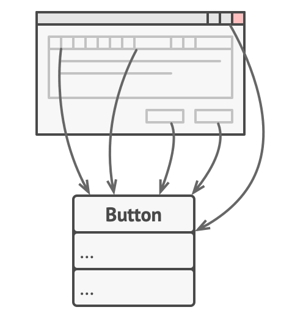
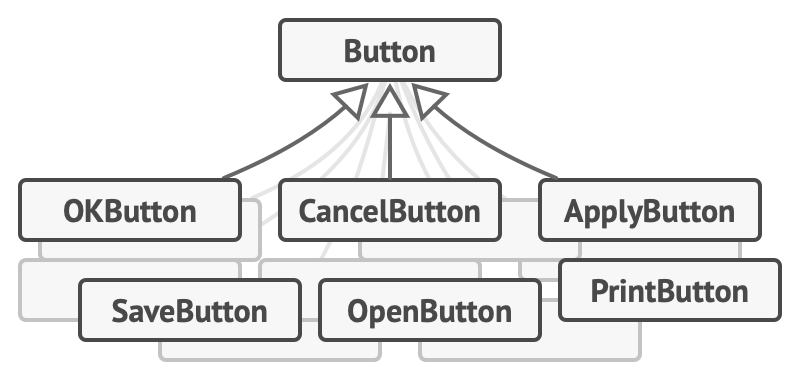
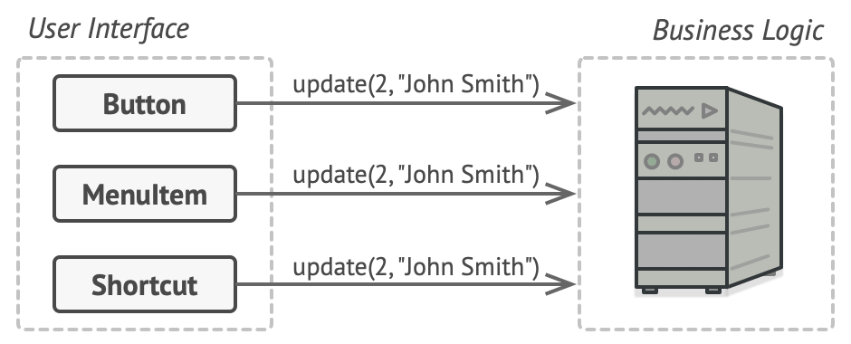
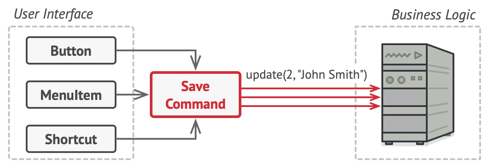
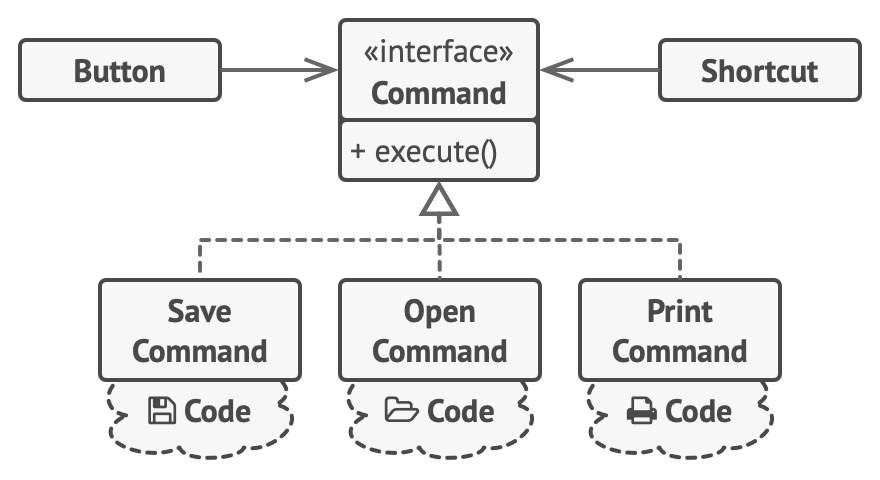
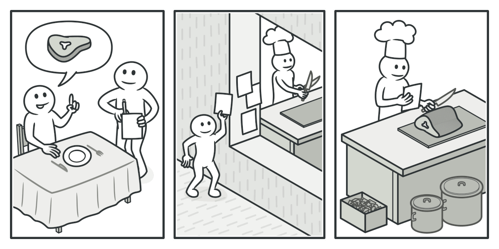
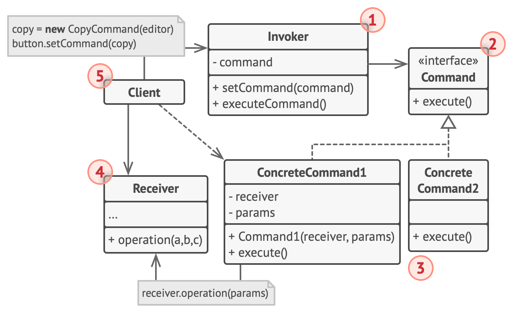
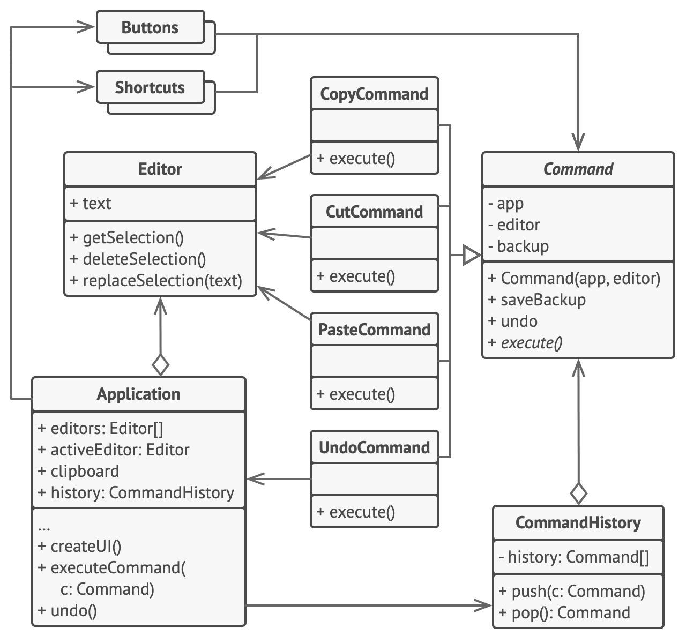

# Command


**Type:** Behavioral · **Also known as:** Action, Transaction

> **The 10-second version:** Stop calling the method — build a little object that *remembers* the call (receiver + arguments + "go") so you can pass it around, queue it, log it, retry it, or undo it later.

<br clear="all">

## Quick card

| | |
|---|---|
| **Problem it solves** | A method call is a *moment* — it happens and it's gone. You can't store it, schedule it, ship it over the wire, replay it, or take it back. Callers also end up hard-wired to the exact service and method they invoke. |
| **Core move** | Reify the call. Package "which object, which method, which arguments" into an object with one parameterless `Execute()`. The caller now holds a *thing* instead of performing an *action*. |
| **You'll recognise it by** | An interface with exactly one no-argument method (`Execute`/`Run`/`Handle`), concrete classes whose constructors take all the arguments, and a caller that does `command.Execute()` without knowing what happens inside. Bonus tell: a `Stack<ICommand>` named `_history` and an `Undo()` method. |
| **Rating** | Complexity ★☆☆ · Popularity ★★★ |
| **Closest relatives** | Strategy (same shape, different intent), Chain of Responsibility (routes the request), Memento (stores the state a command needs to undo), Mediator (removes the sender→receiver link entirely) |
| **In your stack** | Every RabbitMQ message you publish with a name like `apply_price_drop` **is** a serialized Command. MediatR's `IRequest`/`IRequestHandler` is Command with a dispatcher bolted on. A transactional-outbox row in SQL is a Command persisted so it survives a crash. In TS, a closure `() => service.doThing(id)` is the same pattern with the ceremony removed — until you need undo or a name, at which point the object comes back. |

### How to read this file

Technical first, plain English second. 🗣️ marks the plain-English version. Part 1 is Refactoring.Guru's material with their diagrams; Parts 2-7 are code, your stack, and the stuff that makes it stick.

---

# PART 1 — The pattern

## 1. Intent
**Command** is a behavioral design pattern that turns a request into a stand-alone object that contains all information about the request. This transformation lets you pass requests as a method arguments, delay or queue a request’s execution, and support undoable operations.


### 🗣️ In plain words

Normally when you want something done you *do it*: `pricing.ApplyDrop(listingId, 15000)`. That call exists for a few microseconds and then it's over — nothing was ever stored, so there's nothing to hold, log, or reverse.

Command says: build an object that holds everything needed to make that call — the target, the arguments, and a single button labelled **Execute**. Now the call is a *noun*. Nouns can be put in a list, a queue, a database table, a message envelope, or an undo stack. Verbs can't.

The caller (the button, the HTTP endpoint, the cron job) now only knows "I have something executable." It has no idea what it does or who does it.

## 2. Problem
Imagine that you’re working on a new text-editor app. Your current task is to create a toolbar with a bunch of buttons for various operations of the editor. You created a very neat `Button` class that can be used for buttons on the toolbar, as well as for generic buttons in various dialogs.



*All buttons of the app are derived from the same class.*

While all of these buttons look similar, they’re all supposed to do different things. Where would you put the code for the various click handlers of these buttons? The simplest solution is to create tons of subclasses for each place where the button is used. These subclasses would contain the code that would have to be executed on a button click.



*Lots of button subclasses. What can go wrong?*

Before long, you realize that this approach is deeply flawed. First, you have an enormous number of subclasses, and that would be okay if you weren’t risking breaking the code in these subclasses each time you modify the base `Button` class. Put simply, your GUI code has become awkwardly dependent on the volatile code of the business logic.


*Several classes implement the same functionality.*

And here’s the ugliest part. Some operations, such as copying/pasting text, would need to be invoked from multiple places. For example, a user could click a small “Copy” button on the toolbar, or copy something via the context menu, or just hit `Ctrl+C` on the keyboard.

Initially, when our app only had the toolbar, it was okay to place the implementation of various operations into the button subclasses. In other words, having the code for copying text inside the `CopyButton` subclass was fine. But then, when you implement context menus, shortcuts, and other stuff, you have to either duplicate the operation’s code in many classes or make menus dependent on buttons, which is an even worse option.
### 🗣️ In plain words

The website's pain is a toolbar. Yours looks like an admin screen for car listings. You start with one place that can drop a price, so you write it inline:

```ts
// ❌ The "it's just one call" phase
publishButton.onclick = () => {
  const listing = await api.getListing(listingId);
  listing.status = 'published';
  await api.saveListing(listing);
  await audit.log('published', listingId, currentUser.id);
  await search.reindex(listingId);
};
```

Then reality arrives, in this order, over about four months:

1. Dealers can also publish from the **bulk upload** screen. Copy-paste #1.
2. There's a **keyboard shortcut** and a **right-click context menu** on the listings grid. Copy-paste #2 and #3.
3. Ops want a **"publish at 9am tomorrow"** scheduler. You can't schedule a click handler, so you write a *second* code path that stores `{action: 'publish', listingId, at}` in a table — a hand-rolled Command that doesn't share code with the real one.
4. A dealer publishes 400 cars by mistake and asks for an **undo**. There is no undo, because nobody ever recorded what happened — only that the rows changed.
5. Someone adds a "listing published" RabbitMQ event *in one of the four copies*, and the other three silently skip it for two months.

Every one of these is the same root cause: **the operation was never a thing**. It was scattered across the callers that happened to trigger it. Fix it in one, forget the other three.

## 3. Solution
Good software design is often based on the *principle of separation of concerns*, which usually results in breaking an app into layers. The most common example: a layer for the graphical user interface and another layer for the business logic. The GUI layer is responsible for rendering a beautiful picture on the screen, capturing any input and showing results of what the user and the app are doing. However, when it comes to doing something important, like calculating the trajectory of the moon or composing an annual report, the GUI layer delegates the work to the underlying layer of business logic.

In the code it might look like this: a GUI object calls a method of a business logic object, passing it some arguments. This process is usually described as one object sending another a *request*.



*The GUI objects may access the business logic objects directly.*

The Command pattern suggests that GUI objects shouldn’t send these requests directly. Instead, you should extract all of the request details, such as the object being called, the name of the method and the list of arguments into a separate *command* class with a single method that triggers this request.

Command objects serve as links between various GUI and business logic objects. From now on, the GUI object doesn’t need to know what business logic object will receive the request and how it’ll be processed. The GUI object just triggers the command, which handles all the details.



*Accessing the business logic layer via a command.*

The next step is to make your commands implement the same interface. Usually it has just a single execution method that takes no parameters. This interface lets you use various commands with the same request sender, without coupling it to concrete classes of commands. As a bonus, now you can switch command objects linked to the sender, effectively changing the sender’s behavior at runtime.

You might have noticed one missing piece of the puzzle, which is the request parameters. A GUI object might have supplied the business-layer object with some parameters. Since the command execution method doesn’t have any parameters, how would we pass the request details to the receiver? It turns out the command should be either pre-configured with this data, or capable of getting it on its own.



*The GUI objects delegate the work to commands.*

Let’s get back to our text editor. After we apply the Command pattern, we no longer need all those button subclasses to implement various click behaviors. It’s enough to put a single field into the base `Button` class that stores a reference to a command object and make the button execute that command on a click.

You’ll implement a bunch of command classes for every possible operation and link them with particular buttons, depending on the buttons’ intended behavior.

Other GUI elements, such as menus, shortcuts or entire dialogs, can be implemented in the same way. They’ll be linked to a command which gets executed when a user interacts with the GUI element. As you’ve probably guessed by now, the elements related to the same operations will be linked to the same commands, preventing any code duplication.

As a result, commands become a convenient middle layer that reduces coupling between the GUI and business logic layers. And that’s only a fraction of the benefits that the Command pattern can offer!
### 🗣️ In plain words

The mechanical moves, in order:

1. **Name the operation and give it an interface.** One method, no parameters: `interface ICommand { void Execute(); }`. The "no parameters" part is not decoration — it's what makes every command interchangeable to a caller.
2. **Move the arguments into the constructor.** `new PublishListingCommand(listingRepo, searchIndex, listingId, userId)`. The command is now fully loaded, like a round in a chamber, and can sit there indefinitely.
3. **Point the caller at the interface.** The button, the shortcut, the context menu and the scheduler all hold an `ICommand` and all do exactly one thing: `command.Execute()`. They are now identical and interchangeable.
4. **(Optional but this is why people actually reach for it)** Keep the executed commands in a stack and add `Undo()`, or serialize them to a queue, or log them. All three are free once the operation is an object.

> **The key insight:** A method call is an *event in time* — it happens and evaporates. A command object is that same call *frozen into data*, and data can be stored, moved, copied, queued, replayed and reversed. Everything Command gives you — undo, queuing, scheduling, remote execution, macros, audit logs — is downstream of that one conversion from verb to noun.

## 4. Real-world analogy


*Making an order in a restaurant.*

After a long walk through the city, you get to a nice restaurant and sit at the table by the window. A friendly waiter approaches you and quickly takes your order, writing it down on a piece of paper. The waiter goes to the kitchen and sticks the order on the wall. After a while, the order gets to the chef, who reads it and cooks the meal accordingly. The cook places the meal on a tray along with the order. The waiter discovers the tray, checks the order to make sure everything is as you wanted it, and brings everything to your table.

The paper order serves as a command. It remains in a queue until the chef is ready to serve it. The order contains all the relevant information required to cook the meal. It allows the chef to start cooking right away instead of running around clarifying the order details from you directly.

### 🗣️ Two more of my own

**The sticky note on the fridge.** You want your flatmate to buy milk. You could stand in the kitchen and say it at the exact moment they're leaving (a method call — they have to be present, and if they aren't, the request is lost). Instead you write "buy 2L milk, full fat, from the shop on the corner" on a sticky note. The note holds the receiver-agnostic instruction *and* all the parameters. It survives until someone picks it up, it can be handed to a different flatmate, you can put three notes in order, and you can take one down before it's done. That's a command object with a queue and a cancel.

**The bank standing instruction.** Paying a bill by walking into a branch is a method call: you, present, now. A standing instruction is a command — you fill out a form once with the amount, the payee and the schedule, hand it to the bank, and the *bank* executes it on the date, possibly years later, possibly when you're asleep. Crucially, the bank doesn't need to understand why you're paying; it only needs the filled-in form and the ability to run it. And you can cancel it, which is the closest a real bank comes to `Undo()`.

## 5. Structure


1. The **Sender** class (aka *invoker*) is responsible for initiating requests. This class must have a field for storing a reference to a command object. The sender triggers that command instead of sending the request directly to the receiver. Note that the sender isn’t responsible for creating the command object. Usually, it gets a pre-created command from the client via the constructor.
2. The **Command** interface usually declares just a single method for executing the command.
3. **Concrete Commands** implement various kinds of requests. A concrete command isn’t supposed to perform the work on its own, but rather to pass the call to one of the business logic objects. However, for the sake of simplifying the code, these classes can be merged.

   Parameters required to execute a method on a receiving object can be declared as fields in the concrete command. You can make command objects immutable by only allowing the initialization of these fields via the constructor.
4. The **Receiver** class contains some business logic. Almost any object may act as a receiver. Most commands only handle the details of how a request is passed to the receiver, while the receiver itself does the actual work.
5. The **Client** creates and configures concrete command objects. The client must pass all of the request parameters, including a receiver instance, into the command’s constructor. After that, the resulting command may be associated with one or multiple senders.
### 🗣️ Participants & roles — cheat table

| Role | What it is in code | Example from the site | Equivalent in your stack |
|---|---|---|---|
| **Sender / Invoker** | Holds a command field and calls `Execute()`. Knows nothing else. | `Button`, `Shortcuts`, the `Application.executeCommand` method | An ASP.NET controller action, a `BackgroundService` loop, a RabbitMQ consumer, an Angular/React click handler |
| **Command (interface)** | One method, usually no args, often `Undo()` alongside | `abstract class Command` with `execute()` / `undo()` | `IRequest<TResponse>` in MediatR, `ICommand` in WPF, a TS `interface Command { execute(): Promise<void> }` |
| **Concrete Command** | Stores the receiver + all arguments as readonly fields; delegates in `Execute()` | `CopyCommand`, `CutCommand`, `PasteCommand`, `UndoCommand` | `ApplyPriceDropCommand(listingId, newPrice, reason)`, `PublishListingCommand`, `ReserveVehicleCommand` |
| **Receiver** | The object that actually does the work | `Editor` (`getSelection`, `deleteSelection`, `replaceSelection`) | `IListingRepository`, `PricingService`, `ISearchIndex`, a Dapper-backed data access class |
| **Client** | Wires it up: creates receivers, creates commands with receivers, hands commands to senders | `Application.createUI()` | Your DI container registration, a `CommandFactory`, or the deserializer that turns a queue message back into a command |

Two things worth burning in:

- The **Sender never talks to the Receiver**. If it does, you don't have Command, you have a class holding a lambda for no reason.
- The **Client** is the only party that knows both sides. In a DI-heavy C# app the container *is* the client — it resolves the handler and its dependencies.

### 🤝 Collaboration — who calls whom

```
                      wires everything up
   ┌──────────┐        (knows both sides)
   │  CLIENT  │──────────────────────────────────┐
   └────┬─────┘                                  │
        │ new PublishListingCmd(repo, id)        │ new PublishListingCmd(repo, id)
        ▼                                        ▼
   ┌───────────────────┐                  ┌───────────────────┐
   │ ConcreteCommand A │                  │ ConcreteCommand B │
   │  - receiver       │                  │  - receiver       │
   │  - listingId      │                  │  - listingId      │
   │  + Execute()      │                  │  + Execute()      │
   │  + Undo()         │                  │  + Undo()         │
   └─────────┬─────────┘                  └─────────┬─────────┘
             │                                      │
   ┌─────────┴──────────┐                           │
   │                    │                           │
   ▼                    ▼                           ▼
┌────────┐        ┌───────────┐              ┌────────────┐
│ Button │        │ Shortcut  │              │  Scheduler │   ← SENDERS
│ .cmd   │        │  .cmd     │              │   .cmd     │     (identical code!)
└───┬────┘        └─────┬─────┘              └──────┬─────┘
    │  cmd.Execute()    │  cmd.Execute()            │  cmd.Execute()
    └───────────────────┴───────────────────────────┘
                        │
                        ▼   command.Execute() calls…
              ┌──────────────────────┐
              │      RECEIVER        │   listingRepo.Publish(id)
              │  (business logic)    │   searchIndex.Reindex(id)
              └──────────────────────┘

  after execute:  history.Push(command)   ──►  Undo() pops and reverses
```

**The single most important hop** is the dashed-in-your-head line that *doesn't exist*: there is no arrow from `Button` to `Receiver`. The button holds an `ICommand` and nothing else. That missing arrow is the entire pattern — everything else (undo, queueing, macros) is a bonus you get because the call is now an object sitting in a field.

## 6. Pseudocode (the website's example)
In this example, the **Command** pattern helps to track the history of executed operations and makes it possible to revert an operation if needed.



*Undoable operations in a text editor.*

Commands which result in changing the state of the editor (e.g., cutting and pasting) make a backup copy of the editor’s state before executing an operation associated with the command. After a command is executed, it’s placed into the command history (a stack of command objects) along with the backup copy of the editor’s state at that point. Later, if the user needs to revert an operation, the app can take the most recent command from the history, read the associated backup of the editor’s state, and restore it.

The client code (GUI elements, command history, etc.) isn’t coupled to concrete command classes because it works with commands via the command interface. This approach lets you introduce new commands into the app without breaking any existing code.

```
// The base command class defines the common interface for all
// concrete commands.
abstract class Command is
    protected field app: Application
    protected field editor: Editor
    protected field backup: text

    constructor Command(app: Application, editor: Editor) is
        this.app = app
        this.editor = editor

    // Make a backup of the editor's state.
    method saveBackup() is
        backup = editor.text

    // Restore the editor's state.
    method undo() is
        editor.text = backup

    // The execution method is declared abstract to force all
    // concrete commands to provide their own implementations.
    // The method must return true or false depending on whether
    // the command changes the editor's state.
    abstract method execute()

// The concrete commands go here.
class CopyCommand extends Command is
    // The copy command isn't saved to the history since it
    // doesn't change the editor's state.
    method execute() is
        app.clipboard = editor.getSelection()
        return false

class CutCommand extends Command is
    // The cut command does change the editor's state, therefore
    // it must be saved to the history. And it'll be saved as
    // long as the method returns true.
    method execute() is
        saveBackup()
        app.clipboard = editor.getSelection()
        editor.deleteSelection()
        return true

class PasteCommand extends Command is
    method execute() is
        saveBackup()
        editor.replaceSelection(app.clipboard)
        return true

// The undo operation is also a command.
class UndoCommand extends Command is
    method execute() is
        app.undo()
        return false

// The global command history is just a stack.
class CommandHistory is
    private field history: array of Command

    // Last in...
    method push(c: Command) is
        // Push the command to the end of the history array.

    // ...first out
    method pop():Command is
        // Get the most recent command from the history.

// The editor class has actual text editing operations. It plays
// the role of a receiver: all commands end up delegating
// execution to the editor's methods.
class Editor is
    field text: string

    method getSelection() is
        // Return selected text.

    method deleteSelection() is
        // Delete selected text.

    method replaceSelection(text) is
        // Insert the clipboard's contents at the current
        // position.

// The application class sets up object relations. It acts as a
// sender: when something needs to be done, it creates a command
// object and executes it.
class Application is
    field clipboard: string
    field editors: array of Editors
    field activeEditor: Editor
    field history: CommandHistory

    // The code which assigns commands to UI objects may look
    // like this.
    method createUI() is
        // ...
        copy = function() { executeCommand(
            new CopyCommand(this, activeEditor)) }
        copyButton.setCommand(copy)
        shortcuts.onKeyPress("Ctrl+C", copy)

        cut = function() { executeCommand(
            new CutCommand(this, activeEditor)) }
        cutButton.setCommand(cut)
        shortcuts.onKeyPress("Ctrl+X", cut)

        paste = function() { executeCommand(
            new PasteCommand(this, activeEditor)) }
        pasteButton.setCommand(paste)
        shortcuts.onKeyPress("Ctrl+V", paste)

        undo = function() { executeCommand(
            new UndoCommand(this, activeEditor)) }
        undoButton.setCommand(undo)
        shortcuts.onKeyPress("Ctrl+Z", undo)

    // Execute a command and check whether it has to be added to
    // the history.
    method executeCommand(command) is
        if (command.execute())
            history.push(command)

    // Take the most recent command from the history and run its
    // undo method. Note that we don't know the class of that
    // command. But we don't have to, since the command knows
    // how to undo its own action.
    method undo() is
        command = history.pop()
        if (command != null)
            command.undo()
```
### 🗣️ Reading that pseudocode

- **`abstract class Command` holds `app`, `editor` and `backup`.** Notice the base class carries the receiver references *and* the undo storage. That's a deliberate simplification — in a stricter design the backup would be a separate Memento object, which is exactly what the Relations section suggests.
- **`execute()` returns a bool, and that bool means "did I change state?"** This is the cleverest line in the whole example. `CopyCommand` returns `false`, `CutCommand` returns `true`. It's how `executeCommand` decides whether the command is worth pushing onto the history stack. Read-only commands never pollute the undo stack.
- **`saveBackup()` is called *inside* `execute()`, before the mutation.** The command snapshots the world at the moment it runs, not at the moment it was constructed. If you snapshot at construction time you'll undo to the wrong state whenever a command sits in a queue.
- **`UndoCommand` is itself a `Command`** that calls `app.undo()` and returns `false`. Undo is not special-cased in the UI layer — it's just another object bound to Ctrl+Z. That's the payoff of making operations uniform.
- **`createUI()` binds the *same* command factory to both a button and a shortcut**: `copyButton.setCommand(copy)` and `shortcuts.onKeyPress("Ctrl+C", copy)`. One operation, two senders, zero duplication — this is the exact problem from section 2, solved in two lines.
- **`Application.undo()` doesn't know the concrete class it popped.** `command.undo()` on an `abstract Command` reference. Adding a `ReplaceAllCommand` next sprint requires zero changes here — that's the Open/Closed Principle bullet in the pros list, made concrete.

## 7. Applicability — when to reach for it
**Use the Command pattern when you want to parameterize objects with operations.**

The Command pattern can turn a specific method call into a stand-alone object. This change opens up a lot of interesting uses: you can pass commands as method arguments, store them inside other objects, switch linked commands at runtime, etc.

Here’s an example: you’re developing a GUI component such as a context menu, and you want your users to be able to configure menu items that trigger operations when an end user clicks an item.

**Use the Command pattern when you want to queue operations, schedule their execution, or execute them remotely.**

As with any other object, a command can be serialized, which means converting it to a string that can be easily written to a file or a database. Later, the string can be restored as the initial command object. Thus, you can delay and schedule command execution. But there’s even more! In the same way, you can queue, log or send commands over the network.

**Use the Command pattern when you want to implement reversible operations.**

Although there are many ways to implement undo/redo, the Command pattern is perhaps the most popular of all.

To be able to revert operations, you need to implement the history of performed operations. The command history is a stack that contains all executed command objects along with related backups of the application’s state.

This method has two drawbacks. First, it isn’t that easy to save an application’s state because some of it can be private. This problem can be mitigated with the [Memento](https://refactoring.guru/design-patterns/memento) pattern.

Second, the state backups may consume quite a lot of RAM. Therefore, sometimes you can resort to an alternative implementation: instead of restoring the past state, the command performs the inverse operation. The reverse operation also has a price: it may turn out to be hard or even impossible to implement.
### ✅ Quick checklist

- [ ] Do **two or more different triggers** need to perform the same operation? (button + shortcut + API + scheduled job + queue consumer)
- [ ] Does the user need to **undo, or does ops need to reverse, an operation** after it completed?
- [ ] Does the operation need to **survive a process restart** — scheduled, queued, retried, or written to an outbox?
- [ ] Do you need an **audit trail of what was requested**, not just what the rows look like now?
- [ ] Do you need to **compose operations** — run five of them as one atomic "macro", or replay a batch?
- [ ] Is the operation **chosen at runtime** from configuration or user input, rather than being known at compile time?

Two "yes" answers and it's probably worth it. One "yes" and a delegate/lambda will do the job with a tenth of the typing. Zero and you're building a cathedral around `repo.Save()`.

## 8. How to implement — step by step
1. Declare the command interface with a single execution method.
2. Start extracting requests into concrete command classes that implement the command interface. Each class must have a set of fields for storing the request arguments along with a reference to the actual receiver object. All these values must be initialized via the command’s constructor.
3. Identify classes that will act as *senders*. Add the fields for storing commands into these classes. Senders should communicate with their commands only via the command interface. Senders usually don’t create command objects on their own, but rather get them from the client code.
4. Change the senders so they execute the command instead of sending a request to the receiver directly.
5. The client should initialize objects in the following order:

   - Create receivers.
   - Create commands, and associate them with receivers if needed.
   - Create senders, and associate them with specific commands.
### 🗣️ The same steps, blunt version

1. Write the interface. One method. No parameters. Resist adding parameters — the moment `Execute(x)` appears, senders have to know what `x` is and the whole thing collapses.
2. For each operation, make a class. Everything the operation needs goes in the constructor and gets stored in `readonly` / `private final` / `const` fields. Make it immutable; a command that mutates itself between construction and execution is a bug factory.
3. Find every place that triggers the operation. Give each one a field of the interface type. Delete the direct service references from those classes.
4. Replace the direct call with `command.Execute()`. If a sender still imports the service, you're not done.
5. Wire it up in one place, in this order: **receivers → commands (holding receivers) → senders (holding commands)**. In C# that "one place" is usually `Program.cs` / your DI registration; in Node it's your composition root.
6. *(Only if you need it)* Add `Undo()` and a `Stack<ICommand>`. Push after a successful execute. Pop and call `Undo()` on request. Decide now whether undo restores a snapshot or performs an inverse operation, because you can't cleanly mix the two.

## 9. Pros and cons
- ✅ *Single Responsibility Principle*. You can decouple classes that invoke operations from classes that perform these operations.
- ✅ *Open/Closed Principle*. You can introduce new commands into the app without breaking existing client code.
- ✅ You can implement undo/redo.
- ✅ You can implement deferred execution of operations.
- ✅ You can assemble a set of simple commands into a complex one.

- ⛔ The code may become more complicated since you’re introducing a whole new layer between senders and receivers.
### ⚖️ Honest trade-offs from the trenches

**The real cost is not the interface — it's the class explosion and the indirection tax on reading code.** Twenty operations means twenty classes, twenty files, twenty constructors. When a new dev asks "what happens when I click publish?", the answer is now "go to the DI registration, find which command is bound, open that file, find the receiver, open *that* file." A direct call would have been one F12. That's a genuine cost and the Cons list on the site is not being polite about it — it's real. The mitigation is naming: `ApplyPriceDropCommand` should be greppable and should sit next to `PricingService`, not in a `Commands/` folder three modules away.

**The tell that it's worth it is the word "later".** "Can we run this later / retry it / schedule it / undo it / replay it against staging / see who requested it last Tuesday?" Every one of those needs the operation to exist as data. If nobody has said "later" about this operation, and nobody will, you probably want a method. The second tell is *three or more senders*. One sender = a method. Two = a lambda. Three or more, especially across layers (HTTP + queue + cron) = a command.

**A lot of this is already in the box, and hand-rolling it is the common mistake.** In C#, `Action`/`Func<T>` *are* command objects — the CLR's closure classes literally capture the receiver and arguments into a generated class with one invoke method, which is Command compiled by Roslyn for you. WPF and MAUI ship `System.Windows.Input.ICommand` with `Execute`/`CanExecute` and you bind to it from XAML. For a server-side command bus, MediatR's `IRequest<T>` + `IRequestHandler<T>` gives you the interface, the dispatcher, and a pipeline for logging/validation/transactions — writing your own `ICommandBus` with reflection is a week you don't get back. In TypeScript, a `() => Promise<void>` closure covers the parameterization case entirely; you only need the object when you need a *name*, *serialization*, or *undo* — because a closure can't be JSON'd and can't be introspected.

**Where hand-rolling genuinely wins:** undo/redo. There is no framework undo stack for your domain; you write it. And serialized commands over RabbitMQ, where the command must be a DTO with a discriminator, not a delegate. Those two cases justify the full ceremony. "Parameterizing a button" almost never does in 2026.

## 10. Relations with other patterns
- [Chain of Responsibility](https://refactoring.guru/design-patterns/chain-of-responsibility), [Command](https://refactoring.guru/design-patterns/command), [Mediator](https://refactoring.guru/design-patterns/mediator) and [Observer](https://refactoring.guru/design-patterns/observer) address various ways of connecting senders and receivers of requests:

  - *Chain of Responsibility* passes a request sequentially along a dynamic chain of potential receivers until one of them handles it.
  - *Command* establishes unidirectional connections between senders and receivers.
  - *Mediator* eliminates direct connections between senders and receivers, forcing them to communicate indirectly via a mediator object.
  - *Observer* lets receivers dynamically subscribe to and unsubscribe from receiving requests.
- Handlers in [Chain of Responsibility](https://refactoring.guru/design-patterns/chain-of-responsibility) can be implemented as [Commands](https://refactoring.guru/design-patterns/command). In this case, you can execute a lot of different operations over the same context object, represented by a request.

  However, there’s another approach, where the request itself is a *Command* object. In this case, you can execute the same operation in a series of different contexts linked into a chain.
- You can use [Command](https://refactoring.guru/design-patterns/command) and [Memento](https://refactoring.guru/design-patterns/memento) together when implementing “undo”. In this case, commands are responsible for performing various operations over a target object, while mementos save the state of that object just before a command gets executed.
- [Command](https://refactoring.guru/design-patterns/command) and [Strategy](https://refactoring.guru/design-patterns/strategy) may look similar because you can use both to parameterize an object with some action. However, they have very different intents.

  - You can use *Command* to convert any operation into an object. The operation’s parameters become fields of that object. The conversion lets you defer execution of the operation, queue it, store the history of commands, send commands to remote services, etc.
  - On the other hand, *Strategy* usually describes different ways of doing the same thing, letting you swap these algorithms within a single context class.
- [Prototype](https://refactoring.guru/design-patterns/prototype) can help when you need to save copies of [Commands](https://refactoring.guru/design-patterns/command) into history.
- You can treat [Visitor](https://refactoring.guru/design-patterns/visitor) as a powerful version of the [Command](https://refactoring.guru/design-patterns/command) pattern. Its objects can execute operations over various objects of different classes.
### 🗣️ Disambiguation table

| Pattern | Shape on screen | What it's actually for | How to tell them apart in a code review |
|---|---|---|---|
| **Command** | `interface X { execute(); }` with args in the constructor | Turn *one specific call* into an object so it can be stored, queued, replayed or reversed | The constructor is full of **data** (ids, amounts, user). Swapping implementations is not the point; *keeping* them is. |
| **Strategy** | `interface X { execute(data); }` — often takes args | Swap *how* a thing is done, inside a context that stays put | The constructor is usually **empty** and the method takes the data. Nobody ever keeps a history of strategies. |
| **Chain of Responsibility** | Handlers with a `next` pointer | Find *who* should handle a request, by walking candidates | There's a `_next` field and a loop/recursion. Command has exactly one receiver, decided at construction. |
| **Observer** | `subscribe` / `notify`, many listeners | Announce that *something happened*, to anyone interested | Command = "do this" to one receiver. Observer = "this happened", to N subscribers who may ignore it. This is also the **command vs. event** distinction in messaging. |
| **Memento** | `CreateSnapshot()` / `Restore(snapshot)` | Capture and restore state without exposing internals | They're partners, not rivals: the command runs the operation, the memento holds the "before" picture so `Undo()` has something to restore. |

***Strategy is a verb you can swap; Command is a verb you can save.*** If you'd never keep a list of them, it's a Strategy. If a `Stack<>` or a queue of them makes obvious sense, it's a Command.

And the messaging one-liner, because it'll come up in your RabbitMQ work: ***a Command is addressed and imperative ("apply this price drop"), an Event is broadcast and past-tense ("the price was dropped").*** One consumer for a command, N for an event.

---

# PART 2 — Official code examples from Refactoring.Guru

## 2.1 C#
**Complexity:** ★☆☆ (1/3)

**Popularity:** ★★★ (3/3)

**Usage examples:** The Command pattern is pretty common in C# code. Most often it’s used as an alternative for callbacks to parameterizing UI elements with actions. It’s also used for queueing tasks, tracking operations history, etc.

**Identification:** The Command pattern is recognizable by behavioral methods in an abstract/interface type (sender) which invokes a method in an implementation of a different abstract/interface type (receiver) which has been encapsulated by the command implementation during its creation. Command classes are usually limited to specific actions.
### Conceptual Example

This example illustrates the structure of the **Command** design pattern. It focuses on answering these questions:

- What classes does it consist of?
- What roles do these classes play?
- In what way the elements of the pattern are related?

##### **Program.cs:** Conceptual example

```csharp
using System;

namespace RefactoringGuru.DesignPatterns.Command.Conceptual
{
    // The Command interface declares a method for executing a command.
    public interface ICommand
    {
        void Execute();
    }

    // Some commands can implement simple operations on their own.
    class SimpleCommand : ICommand
    {
        private string _payload = string.Empty;

        public SimpleCommand(string payload)
        {
            this._payload = payload;
        }

        public void Execute()
        {
            Console.WriteLine($"SimpleCommand: See, I can do simple things like printing ({this._payload})");
        }
    }

    // However, some commands can delegate more complex operations to other
    // objects, called "receivers."
    class ComplexCommand : ICommand
    {
        private Receiver _receiver;

        // Context data, required for launching the receiver's methods.
        private string _a;

        private string _b;

        // Complex commands can accept one or several receiver objects along
        // with any context data via the constructor.
        public ComplexCommand(Receiver receiver, string a, string b)
        {
            this._receiver = receiver;
            this._a = a;
            this._b = b;
        }

        // Commands can delegate to any methods of a receiver.
        public void Execute()
        {
            Console.WriteLine("ComplexCommand: Complex stuff should be done by a receiver object.");
            this._receiver.DoSomething(this._a);
            this._receiver.DoSomethingElse(this._b);
        }
    }

    // The Receiver classes contain some important business logic. They know how
    // to perform all kinds of operations, associated with carrying out a
    // request. In fact, any class may serve as a Receiver.
    class Receiver
    {
        public void DoSomething(string a)
        {
            Console.WriteLine($"Receiver: Working on ({a}.)");
        }

        public void DoSomethingElse(string b)
        {
            Console.WriteLine($"Receiver: Also working on ({b}.)");
        }
    }

    // The Invoker is associated with one or several commands. It sends a
    // request to the command.
    class Invoker
    {
        private ICommand _onStart;

        private ICommand _onFinish;

        // Initialize commands.
        public void SetOnStart(ICommand command)
        {
            this._onStart = command;
        }

        public void SetOnFinish(ICommand command)
        {
            this._onFinish = command;
        }

        // The Invoker does not depend on concrete command or receiver classes.
        // The Invoker passes a request to a receiver indirectly, by executing a
        // command.
        public void DoSomethingImportant()
        {
            Console.WriteLine("Invoker: Does anybody want something done before I begin?");
            if (this._onStart is ICommand)
            {
                this._onStart.Execute();
            }

            Console.WriteLine("Invoker: ...doing something really important...");

            Console.WriteLine("Invoker: Does anybody want something done after I finish?");
            if (this._onFinish is ICommand)
            {
                this._onFinish.Execute();
            }
        }
    }

    class Program
    {
        static void Main(string[] args)
        {
            // The client code can parameterize an invoker with any commands.
            Invoker invoker = new Invoker();
            invoker.SetOnStart(new SimpleCommand("Say Hi!"));
            Receiver receiver = new Receiver();
            invoker.SetOnFinish(new ComplexCommand(receiver, "Send email", "Save report"));

            invoker.DoSomethingImportant();
        }
    }
}
```

##### **Output.txt:** Execution result

```output
Invoker: Does anybody want something done before I begin?
SimpleCommand: See, I can do simple things like printing (Say Hi!)
Invoker: ...doing something really important...
Invoker: Does anybody want something done after I finish?
ComplexCommand: Complex stuff should be done by a receiver object.
Receiver: Working on (Send email.)
Receiver: Also working on (Save report.)
```

## 2.2 TypeScript
**Complexity:** ★☆☆ (1/3)

**Popularity:** ★★★ (3/3)

**Usage examples:** The Command pattern is pretty common in TypeScript code. Most often it’s used as an alternative for callbacks to parameterizing UI elements with actions. It’s also used for queueing tasks, tracking operations history, etc.

**Identification:** The Command pattern is recognizable by behavioral methods in an abstract/interface type (sender) which invokes a method in an implementation of a different abstract/interface type (receiver) which has been encapsulated by the command implementation during its creation. Command classes are usually limited to specific actions.
### Conceptual Example

This example illustrates the structure of the **Command** design pattern and focuses on the following questions:

- What classes does it consist of?
- What roles do these classes play?
- In what way the elements of the pattern are related?

##### **index.ts:** Conceptual example

```typescript
/**
 * The Command interface declares a method for executing a command.
 */
interface Command {
    execute(): void;
}

/**
 * Some commands can implement simple operations on their own.
 */
class SimpleCommand implements Command {
    private payload: string;

    constructor(payload: string) {
        this.payload = payload;
    }

    public execute(): void {
        console.log(`SimpleCommand: See, I can do simple things like printing (${this.payload})`);
    }
}

/**
 * However, some commands can delegate more complex operations to other objects,
 * called "receivers."
 */
class ComplexCommand implements Command {
    private receiver: Receiver;

    /**
     * Context data, required for launching the receiver's methods.
     */
    private a: string;

    private b: string;

    /**
     * Complex commands can accept one or several receiver objects along with
     * any context data via the constructor.
     */
    constructor(receiver: Receiver, a: string, b: string) {
        this.receiver = receiver;
        this.a = a;
        this.b = b;
    }

    /**
     * Commands can delegate to any methods of a receiver.
     */
    public execute(): void {
        console.log('ComplexCommand: Complex stuff should be done by a receiver object.');
        this.receiver.doSomething(this.a);
        this.receiver.doSomethingElse(this.b);
    }
}

/**
 * The Receiver classes contain some important business logic. They know how to
 * perform all kinds of operations, associated with carrying out a request. In
 * fact, any class may serve as a Receiver.
 */
class Receiver {
    public doSomething(a: string): void {
        console.log(`Receiver: Working on (${a}.)`);
    }

    public doSomethingElse(b: string): void {
        console.log(`Receiver: Also working on (${b}.)`);
    }
}

/**
 * The Invoker is associated with one or several commands. It sends a request to
 * the command.
 */
class Invoker {
    private onStart: Command;

    private onFinish: Command;

    /**
     * Initialize commands.
     */
    public setOnStart(command: Command): void {
        this.onStart = command;
    }

    public setOnFinish(command: Command): void {
        this.onFinish = command;
    }

    /**
     * The Invoker does not depend on concrete command or receiver classes. The
     * Invoker passes a request to a receiver indirectly, by executing a
     * command.
     */
    public doSomethingImportant(): void {
        console.log('Invoker: Does anybody want something done before I begin?');
        if (this.isCommand(this.onStart)) {
            this.onStart.execute();
        }

        console.log('Invoker: ...doing something really important...');

        console.log('Invoker: Does anybody want something done after I finish?');
        if (this.isCommand(this.onFinish)) {
            this.onFinish.execute();
        }
    }

    private isCommand(object): object is Command {
        return object.execute !== undefined;
    }
}

/**
 * The client code can parameterize an invoker with any commands.
 */
const invoker = new Invoker();
invoker.setOnStart(new SimpleCommand('Say Hi!'));
const receiver = new Receiver();
invoker.setOnFinish(new ComplexCommand(receiver, 'Send email', 'Save report'));

invoker.doSomethingImportant();
```

##### **Output.txt:** Execution result

```output
Invoker: Does anybody want something done before I begin?
SimpleCommand: See, I can do simple things like printing (Say Hi!)
Invoker: ...doing something really important...
Invoker: Does anybody want something done after I finish?
ComplexCommand: Complex stuff should be done by a receiver object.
Receiver: Working on (Send email.)
Receiver: Also working on (Save report.)
```

## 2.3 C++
**Complexity:** ★☆☆ (1/3)

**Popularity:** ★★★ (3/3)

**Usage examples:** The Command pattern is pretty common in C++ code. Most often it’s used as an alternative for callbacks to parameterizing UI elements with actions. It’s also used for queueing tasks, tracking operations history, etc.

**Identification:** The Command pattern is recognizable by behavioral methods in an abstract/interface type (sender) which invokes a method in an implementation of a different abstract/interface type (receiver) which has been encapsulated by the command implementation during its creation. Command classes are usually limited to specific actions.
### Conceptual Example

This example illustrates the structure of the **Command** design pattern. It focuses on answering these questions:

- What classes does it consist of?
- What roles do these classes play?
- In what way the elements of the pattern are related?

##### **main.cc:** Conceptual example

```cpp
/**
 * The Command interface declares a method for executing a command.
 */
class Command {
 public:
  virtual ~Command() {
  }
  virtual void Execute() const = 0;
};
/**
 * Some commands can implement simple operations on their own.
 */
class SimpleCommand : public Command {
 private:
  std::string pay_load_;

 public:
  explicit SimpleCommand(std::string pay_load) : pay_load_(pay_load) {
  }
  void Execute() const override {
    std::cout << "SimpleCommand: See, I can do simple things like printing (" << this->pay_load_ << ")\n";
  }
};

/**
 * The Receiver classes contain some important business logic. They know how to
 * perform all kinds of operations, associated with carrying out a request. In
 * fact, any class may serve as a Receiver.
 */
class Receiver {
 public:
  void DoSomething(const std::string &a) {
    std::cout << "Receiver: Working on (" << a << ".)\n";
  }
  void DoSomethingElse(const std::string &b) {
    std::cout << "Receiver: Also working on (" << b << ".)\n";
  }
};

/**
 * However, some commands can delegate more complex operations to other objects,
 * called "receivers."
 */
class ComplexCommand : public Command {
  /**
   * @var Receiver
   */
 private:
  Receiver *receiver_;
  /**
   * Context data, required for launching the receiver's methods.
   */
  std::string a_;
  std::string b_;
  /**
   * Complex commands can accept one or several receiver objects along with any
   * context data via the constructor.
   */
 public:
  ComplexCommand(Receiver *receiver, std::string a, std::string b) : receiver_(receiver), a_(a), b_(b) {
  }
  /**
   * Commands can delegate to any methods of a receiver.
   */
  void Execute() const override {
    std::cout << "ComplexCommand: Complex stuff should be done by a receiver object.\n";
    this->receiver_->DoSomething(this->a_);
    this->receiver_->DoSomethingElse(this->b_);
  }
};

/**
 * The Invoker is associated with one or several commands. It sends a request to
 * the command.
 */
class Invoker {
  /**
   * @var Command
   */
 private:
  Command *on_start_;
  /**
   * @var Command
   */
  Command *on_finish_;
  /**
   * Initialize commands.
   */
 public:
  ~Invoker() {
    delete on_start_;
    delete on_finish_;
  }

  void SetOnStart(Command *command) {
    this->on_start_ = command;
  }
  void SetOnFinish(Command *command) {
    this->on_finish_ = command;
  }
  /**
   * The Invoker does not depend on concrete command or receiver classes. The
   * Invoker passes a request to a receiver indirectly, by executing a command.
   */
  void DoSomethingImportant() {
    std::cout << "Invoker: Does anybody want something done before I begin?\n";
    if (this->on_start_) {
      this->on_start_->Execute();
    }
    std::cout << "Invoker: ...doing something really important...\n";
    std::cout << "Invoker: Does anybody want something done after I finish?\n";
    if (this->on_finish_) {
      this->on_finish_->Execute();
    }
  }
};
/**
 * The client code can parameterize an invoker with any commands.
 */

int main() {
  Invoker *invoker = new Invoker;
  invoker->SetOnStart(new SimpleCommand("Say Hi!"));
  Receiver *receiver = new Receiver;
  invoker->SetOnFinish(new ComplexCommand(receiver, "Send email", "Save report"));
  invoker->DoSomethingImportant();

  delete invoker;
  delete receiver;

  return 0;
}
```

##### **Output.txt:** Execution result

```output
Invoker: Does anybody want something done before I begin?
SimpleCommand: See, I can do simple things like printing (Say Hi!)
Invoker: ...doing something really important...
Invoker: Does anybody want something done after I finish?
ComplexCommand: Complex stuff should be done by a receiver object.
Receiver: Working on (Send email.)
Receiver: Also working on (Save report.)
```

## 2.4 Java
**Complexity:** ★☆☆ (1/3)

**Popularity:** ★★★ (3/3)

**Usage examples:** The Command pattern is pretty common in Java code. Most often it’s used as an alternative for callbacks to parameterizing UI elements with actions. It’s also used for queueing tasks, tracking operations history, etc.

**Identification:** If you see a set of related classes that represent specific actions (such as “Copy”, “Cut”, “Send”, “Print”, etc.), this may be a Command pattern. These classes should implement the same interface/abstract class. The commands may implement the relevant actions on their own or delegate the work to separate objects—that will be the receivers. The last piece of the puzzle is to identify an invoker—search for a class that accepts the command objects in the parameters of its methods or constructor.
### Text editor commands and undo

The text editor in this example creates new command objects each time a user interacts with it. After executing its actions, a command is pushed to the history stack.

Now, to perform the undo operation, the application takes the last executed command from the history and either performs an inverse action or restores the past state of the editor, saved by that command.

#### **commands**

##### **commands/Command.java:** Abstract base command

```java
package refactoring_guru.command.example.commands;

import refactoring_guru.command.example.editor.Editor;

public abstract class Command {
    public Editor editor;
    private String backup;

    Command(Editor editor) {
        this.editor = editor;
    }

    void backup() {
        backup = editor.textField.getText();
    }

    public void undo() {
        editor.textField.setText(backup);
    }

    public abstract boolean execute();
}
```

##### **commands/CopyCommand.java:** Copy selected text to clipboard

```java
package refactoring_guru.command.example.commands;

import refactoring_guru.command.example.editor.Editor;

public class CopyCommand extends Command {

    public CopyCommand(Editor editor) {
        super(editor);
    }

    @Override
    public boolean execute() {
        editor.clipboard = editor.textField.getSelectedText();
        return false;
    }
}
```

##### **commands/PasteCommand.java:** Paste text from clipboard

```java
package refactoring_guru.command.example.commands;

import refactoring_guru.command.example.editor.Editor;

public class PasteCommand extends Command {

    public PasteCommand(Editor editor) {
        super(editor);
    }

    @Override
    public boolean execute() {
        if (editor.clipboard == null || editor.clipboard.isEmpty()) return false;

        backup();
        editor.textField.insert(editor.clipboard, editor.textField.getCaretPosition());
        return true;
    }
}
```

##### **commands/CutCommand.java:** Cut text to clipboard

```java
package refactoring_guru.command.example.commands;

import refactoring_guru.command.example.editor.Editor;

public class CutCommand extends Command {

    public CutCommand(Editor editor) {
        super(editor);
    }

    @Override
    public boolean execute() {
        if (editor.textField.getSelectedText().isEmpty()) return false;

        backup();
        String source = editor.textField.getText();
        editor.clipboard = editor.textField.getSelectedText();
        editor.textField.setText(cutString(source));
        return true;
    }

    private String cutString(String source) {
        String start = source.substring(0, editor.textField.getSelectionStart());
        String end = source.substring(editor.textField.getSelectionEnd());
        return start + end;
    }
}
```

##### **commands/CommandHistory.java:** Command history

```java
package refactoring_guru.command.example.commands;

import java.util.Stack;

public class CommandHistory {
    private Stack<Command> history = new Stack<>();

    public void push(Command c) {
        history.push(c);
    }

    public Command pop() {
        return history.pop();
    }

    public boolean isEmpty() { return history.isEmpty(); }
}
```

#### **editor**

##### **editor/Editor.java:** GUI of text editor

```java
package refactoring_guru.command.example.editor;

import refactoring_guru.command.example.commands.*;

import javax.swing.*;
import java.awt.*;
import java.awt.event.ActionEvent;
import java.awt.event.ActionListener;

public class Editor {
    public JTextArea textField;
    public String clipboard;
    private CommandHistory history = new CommandHistory();

    public void init() {
        JFrame frame = new JFrame("Text editor (type & use buttons, Luke!)");
        JPanel content = new JPanel();
        frame.setContentPane(content);
        frame.setDefaultCloseOperation(WindowConstants.EXIT_ON_CLOSE);
        content.setLayout(new BoxLayout(content, BoxLayout.Y_AXIS));
        textField = new JTextArea();
        textField.setLineWrap(true);
        content.add(textField);
        JPanel buttons = new JPanel(new FlowLayout(FlowLayout.CENTER));
        JButton ctrlC = new JButton("Ctrl+C");
        JButton ctrlX = new JButton("Ctrl+X");
        JButton ctrlV = new JButton("Ctrl+V");
        JButton ctrlZ = new JButton("Ctrl+Z");
        Editor editor = this;
        ctrlC.addActionListener(new ActionListener() {
            @Override
            public void actionPerformed(ActionEvent e) {
                executeCommand(new CopyCommand(editor));
            }
        });
        ctrlX.addActionListener(new ActionListener() {
            @Override
            public void actionPerformed(ActionEvent e) {
                executeCommand(new CutCommand(editor));
            }
        });
        ctrlV.addActionListener(new ActionListener() {
            @Override
            public void actionPerformed(ActionEvent e) {
                executeCommand(new PasteCommand(editor));
            }
        });
        ctrlZ.addActionListener(new ActionListener() {
            @Override
            public void actionPerformed(ActionEvent e) {
                undo();
            }
        });
        buttons.add(ctrlC);
        buttons.add(ctrlX);
        buttons.add(ctrlV);
        buttons.add(ctrlZ);
        content.add(buttons);
        frame.setSize(450, 200);
        frame.setLocationRelativeTo(null);
        frame.setVisible(true);
    }

    private void executeCommand(Command command) {
        if (command.execute()) {
            history.push(command);
        }
    }

    private void undo() {
        if (history.isEmpty()) return;

        Command command = history.pop();
        if (command != null) {
            command.undo();
        }
    }
}
```

##### **Demo.java:** Client code

```java
package refactoring_guru.command.example;

import refactoring_guru.command.example.editor.Editor;

public class Demo {
    public static void main(String[] args) {
        Editor editor = new Editor();
        editor.init();
    }
}
```

##### **OutputDemo.png:** Execution result

---

# PART 3 — Learn it by building it

## 3.1 The dumbest possible version — TypeScript

### ❌ BEFORE — the listing admin panel, four months in

```ts
// listings-admin.ts — every trigger re-implements the operation

const priceInput = document.querySelector<HTMLInputElement>('#price')!;

// Trigger 1: the toolbar button
saveButton.onclick = async () => {
  const listing = await api.getListing(currentListingId);
  const old = listing.price;
  listing.price = Number(priceInput.value);
  await api.saveListing(listing);
  await audit.log(`price ${old} -> ${listing.price}`);
};

// Trigger 2: the keyboard shortcut — copy-pasted, and someone
// "improved" it here by skipping the audit log to make it faster
document.addEventListener('keydown', async (e) => {
  if (e.key === 'Enter' && e.ctrlKey) {
    const listing = await api.getListing(currentListingId);
    listing.price = Number(priceInput.value);
    await api.saveListing(listing);          // 👈 audit.log silently missing
  }
});

// Trigger 3: bulk mode — a third copy, with a loop around it
async function applyBulkDrop(ids: string[], newPrice: number) {
  for (const id of ids) {
    const listing = await api.getListing(id);
    listing.price = newPrice;
    await api.saveListing(listing);
  }
  // and no undo, obviously — the old prices are gone
}
```

Three copies, one already divergent, and a dealer who just nuked 400 prices and wants them back.

### ✅ AFTER — the same thing as commands

```ts
// ─────────────────────────────────────────────────────────────
//  1. THE CONTRACT — one method, NO parameters. That's the whole trick.
// ─────────────────────────────────────────────────────────────
export interface Command {
  /** Human-readable, for the history UI and the audit log. */
  readonly label: string;
  /** Do the thing. Returns true if it changed state and belongs in history. */
  execute(): Promise<boolean>;
  /** Put the world back. Only called if execute() returned true. */
  undo(): Promise<void>;
}

// ─────────────────────────────────────────────────────────────
//  2. THE RECEIVER — plain business logic. Knows nothing about commands.
// ─────────────────────────────────────────────────────────────
export interface Listing {
  id: string;
  price: number;
  status: 'draft' | 'published' | 'sold';
}

export class ListingService {
  constructor(private readonly api: ListingApi, private readonly audit: AuditLog) {}

  async get(id: string): Promise<Listing> {
    return this.api.getListing(id);
  }

  async setPrice(id: string, price: number): Promise<void> {
    const listing = await this.api.getListing(id);
    listing.price = price;
    await this.api.saveListing(listing);
    await this.audit.log(`listing ${id} price set to ${price}`);
  }

  async setStatus(id: string, status: Listing['status']): Promise<void> {
    const listing = await this.api.getListing(id);
    listing.status = status;
    await this.api.saveListing(listing);
    await this.audit.log(`listing ${id} status set to ${status}`);
  }
}

// ─────────────────────────────────────────────────────────────
//  3. CONCRETE COMMANDS — arguments live in the constructor,
//     as readonly fields. The command is immutable and "loaded".
// ─────────────────────────────────────────────────────────────
export class ApplyPriceDropCommand implements Command {
  private previousPrice?: number;              // 👈 the undo snapshot

  constructor(
    private readonly listings: ListingService, // 👈 the receiver
    private readonly listingId: string,        // 👈 the arguments…
    private readonly newPrice: number,         //    …frozen at construction
  ) {}

  get label(): string {
    return `Drop price of ${this.listingId} to ₹${this.newPrice.toLocaleString('en-IN')}`;
  }

  async execute(): Promise<boolean> {
    const current = await this.listings.get(this.listingId);
    if (current.price === this.newPrice) return false;   // 👈 no-op → not in history

    this.previousPrice = current.price;                  // 👈 snapshot BEFORE mutating,
    await this.listings.setPrice(this.listingId, this.newPrice); //   at execute time, not
    return true;                                         //   construction time
  }

  async undo(): Promise<void> {
    if (this.previousPrice === undefined) return;
    await this.listings.setPrice(this.listingId, this.previousPrice);
  }
}

export class PublishListingCommand implements Command {
  private previousStatus?: Listing['status'];

  constructor(
    private readonly listings: ListingService,
    private readonly listingId: string,
  ) {}

  get label(): string {
    return `Publish ${this.listingId}`;
  }

  async execute(): Promise<boolean> {
    const current = await this.listings.get(this.listingId);
    if (current.status === 'published') return false;

    this.previousStatus = current.status;
    await this.listings.setStatus(this.listingId, 'published');
    return true;
  }

  async undo(): Promise<void> {
    if (this.previousStatus === undefined) return;
    await this.listings.setStatus(this.listingId, this.previousStatus);
  }
}

// ─────────────────────────────────────────────────────────────
//  4. MACRO COMMAND — a command made of commands. Composite, for free.
// ─────────────────────────────────────────────────────────────
export class BulkCommand implements Command {
  private readonly done: Command[] = [];

  constructor(readonly label: string, private readonly children: readonly Command[]) {}

  async execute(): Promise<boolean> {
    for (const child of this.children) {
      if (await child.execute()) this.done.push(child); // 👈 remember what actually ran
    }
    return this.done.length > 0;
  }

  async undo(): Promise<void> {
    // Reverse order — undo is a stack, always.
    for (let i = this.done.length - 1; i >= 0; i--) {
      await this.done[i].undo();
    }
    this.done.length = 0;
  }
}

// ─────────────────────────────────────────────────────────────
//  5. THE INVOKER + HISTORY — the only code that knows about undo
// ─────────────────────────────────────────────────────────────
export class CommandBus {
  private readonly history: Command[] = [];
  private readonly redoStack: Command[] = [];

  constructor(private readonly onChange: (labels: string[]) => void = () => {}) {}

  async run(command: Command): Promise<void> {
    const changed = await command.execute();
    if (changed) {
      this.history.push(command);
      this.redoStack.length = 0;   // 👈 a new action invalidates the redo branch
      this.notify();
    }
  }

  async undo(): Promise<void> {
    const command = this.history.pop();
    if (!command) return;
    await command.undo();
    this.redoStack.push(command);
    this.notify();
  }

  async redo(): Promise<void> {
    const command = this.redoStack.pop();
    if (!command) return;
    await command.execute();
    this.history.push(command);
    this.notify();
  }

  private notify(): void {
    this.onChange(this.history.map((c) => c.label));
  }
}

// ─────────────────────────────────────────────────────────────
//  6. THE CLIENT — receivers, then commands, then senders. One place.
// ─────────────────────────────────────────────────────────────
const listings = new ListingService(api, audit);
const bus = new CommandBus((labels) => renderHistoryPanel(labels));

saveButton.onclick = () =>
  bus.run(new ApplyPriceDropCommand(listings, currentListingId, Number(priceInput.value)));

document.addEventListener('keydown', (e) => {
  if (e.ctrlKey && e.key === 'Enter') {
    // 👈 SAME command class. Cannot drift from the button any more.
    void bus.run(new ApplyPriceDropCommand(listings, currentListingId, Number(priceInput.value)));
  }
  if (e.ctrlKey && e.key === 'z') void bus.undo();
  if (e.ctrlKey && e.key === 'y') void bus.redo();
});

bulkButton.onclick = () =>
  bus.run(
    new BulkCommand(
      `Drop ${selectedIds.length} listings to ₹${bulkPrice}`,
      selectedIds.map((id) => new ApplyPriceDropCommand(listings, id, bulkPrice)),
    ),
  );
```

**What to notice:**

- **`execute()` takes no arguments.** That's why `CommandBus.run` can accept *any* command and why the button, the shortcut and the bulk action are now the same three lines.
- **The snapshot is taken inside `execute()`, not the constructor.** If you captured `previousPrice` when you built the object, a command sitting in a queue for ten minutes would undo to a stale price.
- **`execute()` returns a boolean**, lifted straight from the site's pseudocode. A no-op command doesn't get pushed, so Ctrl+Z never "does nothing" from the user's point of view.
- **`BulkCommand` implements the same interface it composes.** That's Composite fused into Command, and it's the cheapest macro-recording feature you will ever ship. Note it undoes in reverse and only undoes children that actually ran.
- **`redoStack` is cleared on every new command.** Editors do this too — once you branch, the old redo path is unreachable.
- **`ListingService` never imports `Command`.** Dependencies point one way: commands → service. That's what keeps the business logic testable without the pattern.

## 3.2 Same thing in C#

```csharp
using System;
using System.Collections.Generic;
using System.Threading;
using System.Threading.Tasks;

namespace Marketplace.Listings.Commands;

// ── 1. CONTRACT ───────────────────────────────────────────────
public interface ICommand
{
    string Label { get; }
    /// <returns>true if state changed and the command belongs in history</returns>
    Task<bool> ExecuteAsync(CancellationToken ct = default);
    Task UndoAsync(CancellationToken ct = default);
}

// ── 2. RECEIVER ───────────────────────────────────────────────
public sealed record Listing(string Id, decimal Price, ListingStatus Status);

public enum ListingStatus { Draft, Published, Sold, Withdrawn }

public interface IListingService
{
    Task<Listing> GetAsync(string id, CancellationToken ct = default);
    Task SetPriceAsync(string id, decimal price, CancellationToken ct = default);
    Task SetStatusAsync(string id, ListingStatus status, CancellationToken ct = default);
}

// ── 3. CONCRETE COMMANDS ──────────────────────────────────────
public sealed class ApplyPriceDropCommand : ICommand
{
    private readonly IListingService _listings;
    private readonly string _listingId;
    private readonly decimal _newPrice;
    private decimal? _previousPrice;                    // 👈 undo snapshot

    public ApplyPriceDropCommand(IListingService listings, string listingId, decimal newPrice)
    {
        _listings  = listings ?? throw new ArgumentNullException(nameof(listings));
        _listingId = listingId;
        _newPrice  = newPrice > 0
            ? newPrice
            : throw new ArgumentOutOfRangeException(nameof(newPrice), "Price must be positive.");
    }

    public string Label => $"Drop {_listingId} to {_newPrice:C0}";

    public async Task<bool> ExecuteAsync(CancellationToken ct = default)
    {
        var current = await _listings.GetAsync(_listingId, ct);
        if (current.Price == _newPrice) return false;   // 👈 no-op, skip history

        _previousPrice = current.Price;
        await _listings.SetPriceAsync(_listingId, _newPrice, ct);
        return true;
    }

    public async Task UndoAsync(CancellationToken ct = default)
    {
        if (_previousPrice is not { } price) return;    // pattern-matched null check
        await _listings.SetPriceAsync(_listingId, price, ct);
    }
}

public sealed class ChangeStatusCommand : ICommand
{
    private readonly IListingService _listings;
    private readonly string _listingId;
    private readonly ListingStatus _target;
    private ListingStatus? _previous;

    public ChangeStatusCommand(IListingService listings, string listingId, ListingStatus target)
        => (_listings, _listingId, _target) = (listings, listingId, target);

    public string Label => _target switch          // 👈 switch expression, C# 8+
    {
        ListingStatus.Published => $"Publish {_listingId}",
        ListingStatus.Withdrawn => $"Withdraw {_listingId}",
        ListingStatus.Sold      => $"Mark {_listingId} sold",
        _                       => $"Set {_listingId} to {_target}",
    };

    public async Task<bool> ExecuteAsync(CancellationToken ct = default)
    {
        var current = await _listings.GetAsync(_listingId, ct);
        if (current.Status == _target) return false;

        _previous = current.Status;
        await _listings.SetStatusAsync(_listingId, _target, ct);
        return true;
    }

    public async Task UndoAsync(CancellationToken ct = default)
    {
        if (_previous is not { } previous) return;
        await _listings.SetStatusAsync(_listingId, previous, ct);
    }
}

// ── 4. MACRO ──────────────────────────────────────────────────
public sealed class MacroCommand : ICommand
{
    private readonly IReadOnlyList<ICommand> _children;
    private readonly List<ICommand> _executed = new();

    public MacroCommand(string label, IReadOnlyList<ICommand> children)
        => (Label, _children) = (label, children);

    public string Label { get; }

    public async Task<bool> ExecuteAsync(CancellationToken ct = default)
    {
        foreach (var child in _children)
        {
            if (await child.ExecuteAsync(ct)) _executed.Add(child);
        }
        return _executed.Count > 0;
    }

    public async Task UndoAsync(CancellationToken ct = default)
    {
        for (var i = _executed.Count - 1; i >= 0; i--)   // 👈 reverse order
            await _executed[i].UndoAsync(ct);
        _executed.Clear();
    }
}

// ── 5. INVOKER ────────────────────────────────────────────────
public sealed class CommandHistory
{
    private readonly Stack<ICommand> _done = new();
    private readonly Stack<ICommand> _undone = new();

    public IReadOnlyCollection<ICommand> Done => _done;
    public bool CanUndo => _done.Count > 0;
    public bool CanRedo => _undone.Count > 0;

    public async Task RunAsync(ICommand command, CancellationToken ct = default)
    {
        if (await command.ExecuteAsync(ct))
        {
            _done.Push(command);
            _undone.Clear();
        }
    }

    public async Task UndoAsync(CancellationToken ct = default)
    {
        if (!_done.TryPop(out var command)) return;
        await command.UndoAsync(ct);
        _undone.Push(command);
    }

    public async Task RedoAsync(CancellationToken ct = default)
    {
        if (!_undone.TryPop(out var command)) return;
        await command.ExecuteAsync(ct);
        _done.Push(command);
    }
}

// ── 6. CLIENT ─────────────────────────────────────────────────
public static class Demo
{
    public static async Task RunAsync(IListingService listings)
    {
        var history = new CommandHistory();

        await history.RunAsync(new ApplyPriceDropCommand(listings, "CW-1001", 845_000m));
        await history.RunAsync(new ChangeStatusCommand(listings, "CW-1001", ListingStatus.Published));

        var ids = new[] { "CW-2001", "CW-2002", "CW-2003" };
        var bulk = new MacroCommand(
            $"Festive drop on {ids.Length} listings",
            Array.ConvertAll(ids, id => (ICommand)new ApplyPriceDropCommand(listings, id, 799_000m)));

        await history.RunAsync(bulk);

        // Dealer panics:
        await history.UndoAsync();   // all three prices restored, in reverse order
        await history.RedoAsync();   // …and back again
    }
}
```

**C#-specific notes:**

- **`decimal`, not `double`, for money.** Unrelated to the pattern, but it's the single most common bug in pricing code and this is a pricing example.
- **`_previousPrice is not { } price`** is the modern null-check-and-bind. It reads better than `!_previousPrice.HasValue` and gives you the unwrapped `price` in one line. Nullable value types are exactly right for "I have no snapshot yet."
- **`Stack<T>.TryPop`** avoids the `Count > 0` + `Pop()` two-step and its race window if the history is ever touched from more than one thread. If it genuinely can be, use a lock — `Stack<T>` is not thread-safe, and an undo stack shared across requests is a design smell anyway (scope it per user session).
- **Don't reach for `record` for commands that carry undo state.** A `record` implies value semantics and `with`-copies; a command with a mutable `_previousPrice` is a stateful object. Use `record` for *serializable* commands (Part 4) and `sealed class` for *undoable* ones.
- **`Action`/`Func<Task>` already is a command** when all you need is "run this later". `history.RunAsync(new ApplyPriceDropCommand(...))` earns its keep only because of `Undo` and `Label`. If you strip those, write `Func<CancellationToken, Task>` and go home.
- **Pitfall — capturing DI-scoped services in a long-lived command.** If an `ICommand` holds a `DbContext` and then sits in a history stack (or a queue) past the end of the HTTP request, you get `ObjectDisposedException`. Either hold an `IServiceScopeFactory` and resolve inside `ExecuteAsync`, or make the command a pure data DTO and let a handler supply the services.
- **`CancellationToken` belongs on `ExecuteAsync`, not in the constructor.** It's per-invocation, not per-command. This is the one parameter it's fine to break the "no parameters" rule for — it's infrastructure, not request data.

## 3.3 C++

```cpp
#include <chrono>
#include <iostream>
#include <memory>
#include <optional>
#include <stdexcept>
#include <string>
#include <unordered_map>
#include <utility>
#include <vector>

namespace marketplace {

// ── RECEIVER ──────────────────────────────────────────────────
class ListingRepository {
public:
    void setPrice(const std::string& id, long long price) {
        prices_[id] = price;
        std::cout << "  [repo] " << id << " price -> " << price << '\n';
    }

    [[nodiscard]] long long price(const std::string& id) const {
        const auto it = prices_.find(id);
        if (it == prices_.end()) throw std::out_of_range("unknown listing " + id);
        return it->second;
    }

private:
    std::unordered_map<std::string, long long> prices_{
        {"CW-1001", 899000}, {"CW-2001", 1'250'000}};
};

// ── COMMAND INTERFACE ─────────────────────────────────────────
class Command {
public:
    virtual ~Command() = default;              // 👈 MANDATORY: deleted via base pointer

    Command(const Command&)            = delete;   // commands own state; no accidental copies
    Command& operator=(const Command&) = delete;
    Command(Command&&)                 = default;  // but moving into a vector is fine
    Command& operator=(Command&&)      = default;

    [[nodiscard]] virtual std::string label() const = 0;
    virtual bool execute() = 0;                // true => push onto history
    virtual void undo()    = 0;

protected:
    Command() = default;                       // only derived classes construct
};

// ── CONCRETE COMMAND ──────────────────────────────────────────
class ApplyPriceDropCommand final : public Command {
public:
    // Receiver by reference: the repo outlives every command. Arguments by value,
    // moved in — the command owns its own copy of the id string.
    ApplyPriceDropCommand(ListingRepository& repo, std::string listingId, long long newPrice)
        : repo_(repo), listingId_(std::move(listingId)), newPrice_(newPrice) {}

    [[nodiscard]] std::string label() const override {
        return "Drop " + listingId_ + " to " + std::to_string(newPrice_);
    }

    bool execute() override {
        const long long current = repo_.price(listingId_);
        if (current == newPrice_) return false;

        previousPrice_ = current;              // 👈 snapshot at execute time
        repo_.setPrice(listingId_, newPrice_);
        return true;
    }

    void undo() override {
        if (!previousPrice_) return;
        repo_.setPrice(listingId_, *previousPrice_);
        previousPrice_.reset();
    }

private:
    ListingRepository& repo_;                  // non-owning: lifetime guaranteed by caller
    std::string listingId_;
    long long newPrice_;
    std::optional<long long> previousPrice_;   // 👈 "no snapshot yet" without a sentinel
};

// ── MACRO (Composite) ─────────────────────────────────────────
class MacroCommand final : public Command {
public:
    MacroCommand(std::string label, std::vector<std::unique_ptr<Command>> children)
        : label_(std::move(label)), children_(std::move(children)) {}

    [[nodiscard]] std::string label() const override { return label_; }

    bool execute() override {
        executed_.clear();
        for (auto& child : children_) {
            if (child->execute()) executed_.push_back(child.get()); // raw = observer ptr
        }
        return !executed_.empty();
    }

    void undo() override {
        for (auto it = executed_.rbegin(); it != executed_.rend(); ++it) (*it)->undo();
        executed_.clear();
    }

private:
    std::string label_;
    std::vector<std::unique_ptr<Command>> children_;  // 👈 OWNS the children
    std::vector<Command*> executed_;                  // 👈 non-owning view into children_
};

// ── INVOKER ───────────────────────────────────────────────────
class CommandHistory {
public:
    void run(std::unique_ptr<Command> command) {       // 👈 takes ownership, by value
        if (command->execute()) {
            done_.push_back(std::move(command));
            undone_.clear();
        }
        // if it returned false, `command` dies here — exactly right
    }

    void undo() {
        if (done_.empty()) return;
        auto command = std::move(done_.back());
        done_.pop_back();
        command->undo();
        undone_.push_back(std::move(command));
    }

    void redo() {
        if (undone_.empty()) return;
        auto command = std::move(undone_.back());
        undone_.pop_back();
        command->execute();
        done_.push_back(std::move(command));
    }

private:
    std::vector<std::unique_ptr<Command>> done_;
    std::vector<std::unique_ptr<Command>> undone_;
};

}  // namespace marketplace

int main() {
    using namespace marketplace;
    ListingRepository repo;
    CommandHistory history;

    history.run(std::make_unique<ApplyPriceDropCommand>(repo, "CW-1001", 845000));

    std::vector<std::unique_ptr<Command>> batch;
    batch.push_back(std::make_unique<ApplyPriceDropCommand>(repo, "CW-1001", 839000));
    batch.push_back(std::make_unique<ApplyPriceDropCommand>(repo, "CW-2001", 1'199'000));
    history.run(std::make_unique<MacroCommand>("Festive batch", std::move(batch)));

    std::cout << "-- undo --\n";
    history.undo();   // reverses both, newest first
    std::cout << "-- redo --\n";
    history.redo();
    return 0;
}
```

### The lightweight alternative — `std::function` when you don't need undo

```cpp
#include <functional>
#include <queue>

using Task = std::function<void()>;            // this IS a command object

std::queue<Task> pending;

void scheduleDrop(marketplace::ListingRepository& repo, std::string id, long long price) {
    // Capture by value; `repo` by reference only because it outlives the queue.
    pending.emplace([&repo, id = std::move(id), price] { repo.setPrice(id, price); });
}

void drain() {
    while (!pending.empty()) {
        Task task = std::move(pending.front());   // 👈 move out, don't copy the closure
        pending.pop();
        task();
    }
}
```

`std::function` erases the type the same way an abstract base does, at the cost of a possible heap allocation and an indirect call. Reach for the class hierarchy when you need `undo()`, `label()`, or serialization; reach for `std::function` when you need "run this later" and nothing else.

### Gotchas table

| Gotcha | What goes wrong | Fix |
|---|---|---|
| Missing `virtual ~Command()` | `delete basePtr` calls only the base destructor — `std::string listingId_` leaks, and it's UB | Always `virtual ~Command() = default;` on any polymorphic base |
| Storing `std::vector<Command>` | Object slicing: the derived part is chopped off and `execute()` dispatches to the base (or won't compile with a pure virtual) | Store `std::vector<std::unique_ptr<Command>>` |
| `shared_ptr` everywhere out of habit | Atomic refcount on every push/pop; ownership becomes "who knows" | History **owns** the command → `unique_ptr`. Share only if a command genuinely lives in two stacks (redo across documents) |
| Dangling receiver reference | Command stored in history outlives the `ListingRepository` it references → UB on undo | Either guarantee the receiver outlives the history (a member of the app object), or hold `std::shared_ptr<ListingRepository>` / `std::weak_ptr` |
| `label()` not `const` | Can't call it on a `const Command&` while rendering the history panel | Mark accessors `const` and `[[nodiscard]]`; `execute()`/`undo()` are the only non-const ones |
| Copying a command with undo state | Two objects both think they hold "the" previous price; undoing twice restores twice | `= delete` the copy ops, allow move (as above) |

**Move semantics angle specific to Command:** the invoker's `run(std::unique_ptr<Command>)` takes the pointer *by value*, so callers must `std::move` into it — the type system now enforces "the history owns this command, you don't get to execute it again behind its back." If `execute()` returns `false`, the `unique_ptr` is never moved into `done_` and the command is destroyed at the end of `run` — zero-cost cleanup of a no-op, no branch needed.

## 3.4 Java

```java
import java.util.ArrayDeque;
import java.util.ArrayList;
import java.util.Deque;
import java.util.List;
import java.util.Objects;
import java.util.Optional;

// ── CONTRACT ──────────────────────────────────────────────────
interface Command {
    String label();
    boolean execute();      // true => worth remembering
    void undo();
}

// ── RECEIVER ──────────────────────────────────────────────────
final class ListingService {
    private final java.util.Map<String, Long> prices = new java.util.HashMap<>();

    ListingService() {
        prices.put("CW-1001", 899_000L);
        prices.put("CW-2001", 1_250_000L);
    }

    long priceOf(String id) {
        Long p = prices.get(id);
        if (p == null) throw new IllegalArgumentException("unknown listing: " + id);
        return p;
    }

    void setPrice(String id, long price) {
        prices.put(id, price);
        System.out.printf("  [svc] %s price -> %,d%n", id, price);
    }
}

// ── CONCRETE COMMAND ──────────────────────────────────────────
final class ApplyPriceDropCommand implements Command {
    private final ListingService listings;
    private final String listingId;
    private final long newPrice;
    private Long previousPrice;      // null = never executed

    ApplyPriceDropCommand(ListingService listings, String listingId, long newPrice) {
        this.listings  = Objects.requireNonNull(listings);
        this.listingId = Objects.requireNonNull(listingId);
        if (newPrice <= 0) throw new IllegalArgumentException("price must be positive");
        this.newPrice = newPrice;
    }

    @Override public String label() {
        return "Drop %s to %,d".formatted(listingId, newPrice);
    }

    @Override public boolean execute() {
        long current = listings.priceOf(listingId);
        if (current == newPrice) return false;
        previousPrice = current;
        listings.setPrice(listingId, newPrice);
        return true;
    }

    @Override public void undo() {
        Optional.ofNullable(previousPrice)
                .ifPresent(p -> listings.setPrice(listingId, p));
        previousPrice = null;
    }
}

// ── MACRO ─────────────────────────────────────────────────────
final class MacroCommand implements Command {
    private final String label;
    private final List<Command> children;
    private final List<Command> executed = new ArrayList<>();

    MacroCommand(String label, List<Command> children) {
        this.label = label;
        this.children = List.copyOf(children);
    }

    @Override public String label() { return label; }

    @Override public boolean execute() {
        executed.clear();
        for (Command c : children) if (c.execute()) executed.add(c);
        return !executed.isEmpty();
    }

    @Override public void undo() {
        for (int i = executed.size() - 1; i >= 0; i--) executed.get(i).undo();
        executed.clear();
    }
}

// ── INVOKER ───────────────────────────────────────────────────
final class CommandHistory {
    private final Deque<Command> done = new ArrayDeque<>();
    private final Deque<Command> undone = new ArrayDeque<>();

    void run(Command command) {
        if (command.execute()) { done.push(command); undone.clear(); }
    }

    void undo() {
        Command c = done.poll();
        if (c == null) return;
        c.undo();
        undone.push(c);
    }

    void redo() {
        Command c = undone.poll();
        if (c == null) return;
        c.execute();
        done.push(c);
    }
}

public class Demo {
    public static void main(String[] args) {
        ListingService svc = new ListingService();
        CommandHistory history = new CommandHistory();

        history.run(new ApplyPriceDropCommand(svc, "CW-1001", 845_000L));
        history.run(new MacroCommand("Festive batch", List.of(
                new ApplyPriceDropCommand(svc, "CW-1001", 839_000L),
                new ApplyPriceDropCommand(svc, "CW-2001", 1_199_000L))));

        System.out.println("-- undo --");
        history.undo();
    }
}
```

### 💡 The line that makes it click

```java
ExecutorService pool = Executors.newFixedThreadPool(4);
pool.submit(() -> listings.setPrice("CW-1001", 845_000L));   // 👈 this is Command
```

`java.lang.Runnable` is the Command interface: one method, `void run()`, no parameters. Your lambda is the Concrete Command — javac compiles it into an object that captures `listings`, the id and the price as fields. `ExecutorService` is the Invoker: it stores your command in a `BlockingQueue`, hands it to a worker thread whenever one is free, and never once knows what the command does.

Every `new Thread(runnable).start()` you have ever written was Command. Same for `Callable<V>` (Command that returns a value — `Future<V>` is the receipt), and for Swing's `javax.swing.Action` / `AbstractAction`, which adds a name, an icon and an enabled flag to the same `actionPerformed` call so one action object can back a toolbar button and a menu item simultaneously — the site's toolbar problem, solved in the JDK since 1998.

## 3.5 Deep dive — the five faces of Command (a variant tour)

Command shows up in five recognisably different costumes. People argue about whether they're "really" the same pattern; they are — same reification, different reason for it. Knowing which one you're building stops you from carrying ceremony you don't need.

---

### Variant 1 — **Closure Command** (no undo, no name, no serialization)

```ts
type Command = () => Promise<void>;

const commands: Record<string, Command> = {
  publish: () => listings.setStatus(id, 'published'),
  withdraw: () => listings.setStatus(id, 'withdrawn'),
  reindex: () => search.reindex(id),
};

await commands[req.body.action]();
```

**When:** you only need to parameterize a caller. **Cost:** near zero. **Loses:** you can't name it in a UI, can't put it in a database, can't undo it. In C# this is `Action`/`Func<Task>`; in C++ `std::function<void()>`; in Java `Runnable`. **This is the right default** — do not build classes until one of the next four variants is what you actually need.

---

### Variant 2 — **Undoable Command** (the GoF classic, sections 3.1–3.4)

Adds `undo()` and a history stack. Two sub-strategies, and mixing them is the classic mistake:

| | **Snapshot undo** | **Inverse-operation undo** |
|---|---|---|
| How | Store the "before" state, restore it | Apply the mathematical opposite |
| Example | `previousPrice = 899000` → set it back | `credit(500)` ↔ `debit(500)` |
| Memory | Grows with state size — a whole document per edit | Tiny — just the delta |
| Safety | Always correct | Wrong if anything else changed in between |
| Partner pattern | **Memento** (that's literally its job) | none needed |

Rule of thumb: **snapshot for small state, inverse for large state that is exclusively yours.** For a price field, snapshot. For a 40MB image, inverse (or a diff). The site's pseudocode uses snapshot (`backup = editor.text`) and the Applicability section calls out both drawbacks honestly.

---

### Variant 3 — **Serializable Command / Message** (this is the one your job is full of)

```ts
// The command as pure data. No behaviour, no receiver reference.
type ApplyPriceDrop = {
  type: 'apply_price_drop';
  version: 1;
  listingId: string;
  newPrice: number;
  requestedBy: string;
  requestedAt: string;   // ISO 8601
};
```

The behaviour moves to a **handler** looked up by `type`. Why the split? Because a `unique_ptr<Command>` can't cross a network. Once the command is JSON:

- it goes into a RabbitMQ queue and is executed by a different process, possibly tomorrow;
- it survives a deploy, a crash, a restart;
- it can be written to a SQL outbox table inside the same transaction as the data change;
- it can be replayed from an audit log to reconstruct history.

The `version` field is not optional ceremony. A command that sits in a queue while you deploy v2 of the handler is a real Tuesday afternoon.

---

### Variant 4 — **Command Bus / Dispatcher** (Command + a lookup table)

One entry point, N commands, N handlers, plus a pipeline. This is MediatR, and it's what most C# "clean architecture" codebases mean when they say Command:

```
  Controller ──► IMediator.Send(command)
                      │
                      ├─► LoggingBehavior      ┐
                      ├─► ValidationBehavior   │  cross-cutting, written once
                      ├─► TransactionBehavior  ┘
                      │
                      └─► ApplyPriceDropHandler.Handle(command, ct)
                                 │
                                 └─► PricingService (the receiver)
```

The win isn't the indirection, it's the **pipeline**: logging, validation, retries and transaction scoping written once and applied to every operation in the system, because every operation now has the same shape. That's the payoff that justifies the ceremony in a large backend.

---

### Variant 5 — **CQRS Command** (Command as an architectural boundary)

Here "Command" means "a write request, as opposed to a Query." It's the same reification scaled up to a whole system boundary: commands mutate and return nothing (or an id), queries read and return data, and they may use entirely different models and even different databases. It borrows the name and the shape; it is not what GoF was describing. **Know which one your interviewer means** — "tell me about the Command pattern" from a .NET architect usually means Variant 4 or 5, while the same question from a C++ or game dev means Variant 2.

---

### The decision test

```
Do you need to run this operation later, or from more than 2 places?
  NO  → call the method. Stop. You're done.
  YES ↓

Does it need to survive a process restart / cross a network?
  YES → Variant 3: serializable data command + handler lookup.
  NO  ↓

Does a human need to reverse it?
  YES → Variant 2: class with execute/undo + a history stack.
  NO  ↓

Do you have 20+ operations that all need logging/validation/transactions?
  YES → Variant 4: a command bus (use MediatR, don't write one).
  NO  → Variant 1: a lambda. Genuinely.
```

---

# PART 4 — Using this in your codebase

## 4.1 C# backend — the strongest fit

Two flavours worth having. First, **the boring correct one** — MediatR, because the pipeline is the point:

```csharp
// ── The command: a record. Immutable, serializable, self-describing. ──
public sealed record ApplyPriceDropCommand(
    string ListingId,
    decimal NewPrice,
    string Reason,
    string RequestedBy) : IRequest<PriceDropResult>;

public sealed record PriceDropResult(string ListingId, decimal OldPrice, decimal NewPrice);

// ── The handler: the receiver-facing half. ──
public sealed class ApplyPriceDropHandler
    : IRequestHandler<ApplyPriceDropCommand, PriceDropResult>
{
    private readonly IListingRepository _listings;
    private readonly IOutbox _outbox;
    private readonly ILogger<ApplyPriceDropHandler> _logger;

    public ApplyPriceDropHandler(
        IListingRepository listings, IOutbox outbox, ILogger<ApplyPriceDropHandler> logger)
        => (_listings, _outbox, _logger) = (listings, outbox, logger);

    public async Task<PriceDropResult> Handle(ApplyPriceDropCommand cmd, CancellationToken ct)
    {
        var listing = await _listings.GetAsync(cmd.ListingId, ct)
            ?? throw new ListingNotFoundException(cmd.ListingId);

        var oldPrice = listing.Price;
        if (cmd.NewPrice >= oldPrice)
            throw new InvalidOperationException("A price drop must lower the price.");

        await _listings.UpdatePriceAsync(cmd.ListingId, cmd.NewPrice, ct);

        // Same transaction as the write — see 4.3.
        await _outbox.EnqueueAsync(
            new PriceDroppedEvent(cmd.ListingId, oldPrice, cmd.NewPrice, DateTimeOffset.UtcNow), ct);

        _logger.LogInformation(
            "Price drop {ListingId}: {Old} -> {New} by {User}",
            cmd.ListingId, oldPrice, cmd.NewPrice, cmd.RequestedBy);

        return new PriceDropResult(cmd.ListingId, oldPrice, cmd.NewPrice);
    }
}

// ── The sender: three lines, knows nothing. ──
[ApiController]
[Route("api/listings")]
public sealed class ListingsController : ControllerBase
{
    private readonly IMediator _mediator;
    public ListingsController(IMediator mediator) => _mediator = mediator;

    [HttpPost("{id}/price-drop")]
    public async Task<ActionResult<PriceDropResult>> DropPrice(
        string id, [FromBody] PriceDropRequest body, CancellationToken ct)
    {
        var result = await _mediator.Send(
            new ApplyPriceDropCommand(id, body.NewPrice, body.Reason, User.Identity!.Name!), ct);
        return Ok(result);
    }
}
```

And the reason this shape pays for itself — **one pipeline behaviour, applied to every command in the app**:

```csharp
public sealed class TransactionBehavior<TRequest, TResponse>
    : IPipelineBehavior<TRequest, TResponse> where TRequest : notnull
{
    private readonly IDbConnectionFactory _factory;
    public TransactionBehavior(IDbConnectionFactory factory) => _factory = factory;

    public async Task<TResponse> Handle(
        TRequest request, RequestHandlerDelegate<TResponse> next, CancellationToken ct)
    {
        // Queries don't need a transaction; commands do.
        if (request is not ICommandMarker) return await next();

        using var connection = await _factory.OpenAsync(ct);
        using var tx = connection.BeginTransaction();
        var response = await next();
        tx.Commit();
        return response;
    }
}
```

That is the argument for the pattern in one screen: transactions, logging, validation and retry written *once*, for all 60 operations, because every operation is the same shape.

Second flavour, **when you need undo**: the `ICommand`/`CommandHistory` from 3.2, scoped per user session (in a `Scoped`/session-backed service, never a singleton). MediatR gives you dispatch and pipelines; it does *not* give you undo. Those are different variants and you can run both — MediatR for the write path, a history stack on top for the "oops" button.

> **Already-in-the-box note:** `System.Windows.Input.ICommand` (`Execute` / `CanExecute` / `CanExecuteChanged`) is Command shipped in .NET for XAML UIs, and `Action`/`Func<T>` are commands for everything else. Don't rebuild any of those.

## 4.2 TypeScript / Node

The honest version for a Node service: **don't hand-roll a class hierarchy for HTTP handlers.** Do build data commands with a discriminated union and a handler map — TypeScript's exhaustiveness checking makes this genuinely nice:

```ts
// ── Commands as data, discriminated by `type` ──
export type ListingCommand =
  | { type: 'apply_price_drop'; listingId: string; newPrice: number; requestedBy: string }
  | { type: 'publish_listing';  listingId: string; requestedBy: string }
  | { type: 'withdraw_listing'; listingId: string; reason: string; requestedBy: string };

export interface Deps {
  listings: ListingService;
  search: SearchIndex;
  bus: EventPublisher;
}

// ── One handler per command type. The map IS the dispatcher. ──
type Handler<C extends ListingCommand> = (cmd: C, deps: Deps) => Promise<void>;

const handlers: { [C in ListingCommand as C['type']]: Handler<C> } = {
  apply_price_drop: async (cmd, { listings, bus }) => {
    const before = await listings.get(cmd.listingId);
    if (cmd.newPrice >= before.price) throw new Error('A drop must lower the price');
    await listings.setPrice(cmd.listingId, cmd.newPrice);
    await bus.publish('listing.price_dropped', {
      listingId: cmd.listingId, oldPrice: before.price, newPrice: cmd.newPrice,
    });
  },

  publish_listing: async (cmd, { listings, search }) => {
    await listings.setStatus(cmd.listingId, 'published');
    await search.reindex(cmd.listingId);
  },

  withdraw_listing: async (cmd, { listings, search }) => {
    await listings.setStatus(cmd.listingId, 'withdrawn');
    await search.remove(cmd.listingId);
  },
};

// ── The single entry point. Every trigger goes through here. ──
export async function dispatch(cmd: ListingCommand, deps: Deps): Promise<void> {
  const started = Date.now();
  const handler = handlers[cmd.type] as Handler<ListingCommand>;
  if (!handler) throw new Error(`No handler for command type: ${(cmd as { type: string }).type}`);

  try {
    await handler(cmd, deps);
    logger.info({ cmd: cmd.type, ms: Date.now() - started, by: cmd.requestedBy }, 'command ok');
  } catch (err) {
    logger.error({ cmd, err }, 'command failed');
    throw err;
  }
}
```

**Why this is the TS-idiomatic shape:** add a fourth member to the union and TypeScript will fail the build on the `handlers` object until you write its handler. You get the "no forgotten operation" guarantee that a class hierarchy gives you, with none of the files. And because commands are plain objects, the same type flows unchanged from an Express route body → a BullMQ job payload → a RabbitMQ message.

```ts
// Express is just one sender:
app.post('/listings/:id/price-drop', async (req, res) => {
  await dispatch({
    type: 'apply_price_drop',
    listingId: req.params.id,
    newPrice: Number(req.body.newPrice),
    requestedBy: req.user.id,
  }, deps);
  res.sendStatus(202);
});

// …the queue consumer is another, with identical code after parsing:
queue.process(async (job) => dispatch(job.data as ListingCommand, deps));
```

For a front-end with undo (a listing editor, a bulk-edit grid), use the class version from 3.1. **Note the overlap you already know:** a Redux action is a serialized command and the reducer is its handler — that's why Redux DevTools can time-travel. If you're on RxJS, a subject of command objects plus `concatMap(dispatch)` gives you a serialized command queue in four lines; don't build a queue class.

## 4.3 SQL / data access

Two genuinely good uses, and one trap.

**Use 1 — the transactional outbox.** This is Command-as-a-row, and it's the correct fix for "I updated the DB but the RabbitMQ publish failed":

```sql
CREATE TABLE dbo.OutboxCommands (
    Id             BIGINT IDENTITY(1,1) PRIMARY KEY,
    CommandType    VARCHAR(100)   NOT NULL,   -- 'apply_price_drop'
    Payload        NVARCHAR(MAX)  NOT NULL,   -- the serialized command (JSON)
    SchemaVersion  INT            NOT NULL DEFAULT 1,
    CorrelationId  UNIQUEIDENTIFIER NOT NULL,
    CreatedAtUtc   DATETIME2(3)   NOT NULL DEFAULT SYSUTCDATETIME(),
    AvailableAtUtc DATETIME2(3)   NOT NULL DEFAULT SYSUTCDATETIME(), -- scheduling, free
    ProcessedAtUtc DATETIME2(3)   NULL,
    Attempts       INT            NOT NULL DEFAULT 0,
    LastError      NVARCHAR(2000) NULL
);

CREATE INDEX IX_Outbox_Pending
    ON dbo.OutboxCommands (AvailableAtUtc)
    WHERE ProcessedAtUtc IS NULL;   -- filtered index: the pending set stays tiny
```

```csharp
// Inside the SAME transaction as the business write:
await connection.ExecuteAsync(
    "UPDATE Listings SET Price = @NewPrice WHERE Id = @ListingId",
    new { cmd.NewPrice, cmd.ListingId }, tx);

await connection.ExecuteAsync(
    @"INSERT INTO dbo.OutboxCommands (CommandType, Payload, CorrelationId, AvailableAtUtc)
      VALUES (@Type, @Payload, @CorrelationId, @AvailableAt)",
    new
    {
        Type          = "notify_price_watchers",
        Payload       = JsonSerializer.Serialize(
                            new NotifyPriceWatchersCommand(cmd.ListingId, cmd.NewPrice)),
        CorrelationId = correlationId,
        AvailableAt   = DateTimeOffset.UtcNow.UtcDateTime,
    }, tx);

tx.Commit();   // 👈 the price change and the intent to notify commit together, or neither
```

A background worker then claims rows and publishes them. Because the command is data, `AvailableAtUtc` gives you *scheduled* commands for free — "publish this listing at 9am" is a row with a future timestamp, not a second code path.

**Use 2 — the audit trail that actually answers questions.** An audit table of *commands* ("who asked for what") is strictly more useful than an audit table of *row diffs* ("this column changed"), because it records intent and actor. When a dealer disputes a price, `SELECT * FROM OutboxCommands WHERE JSON_VALUE(Payload,'$.listingId') = 'CW-1001' ORDER BY CreatedAtUtc` tells you the story.

**The trap:** do not build a "generic SQL command object" that wraps `IDbCommand` in your own `ICommand` so you can queue arbitrary SQL. ADO.NET already has `SqlCommand`, Dapper already parameterizes, and a queue of raw SQL strings is an injection surface and a migration nightmare. Serialize *domain intent*, never SQL text.

## 4.4 RabbitMQ / messaging — the other strongest fit

**A RabbitMQ message with an imperative name is a Command that crossed a process boundary.** This isn't an analogy; it's the same pattern with the transport swapped in. The Invoker is the publisher, the queue is the history/waiting list, the consumer is the client that reconstructs the command and calls its receiver.

The distinction that matters, and the one people get wrong:

| | **Command message** | **Event message** |
|---|---|---|
| Name | Imperative — `apply_price_drop` | Past tense — `price_dropped` |
| Consumers | Exactly one logical consumer | Zero to many, none required |
| Exchange | `direct` (or default) to a known queue | `fanout` / `topic` |
| Sender knows | What should happen | Only what did happen |
| On failure | Retry/DLQ — someone must do it | Consumer's problem, publisher moved on |

```csharp
// ── Publishing a command (direct exchange, one owner) ──
public sealed class RabbitCommandPublisher
{
    private readonly IModel _channel;
    public RabbitCommandPublisher(IModel channel) => _channel = channel;

    public void Send<TCommand>(TCommand command, string routingKey, Guid correlationId)
    {
        var body = JsonSerializer.SerializeToUtf8Bytes(command);

        var props = _channel.CreateBasicProperties();
        props.ContentType   = "application/json";
        props.DeliveryMode  = 2;                              // persistent
        props.Type          = typeof(TCommand).Name;          // 👈 the discriminator
        props.CorrelationId = correlationId.ToString();
        props.MessageId     = Guid.NewGuid().ToString();      // 👈 idempotency key
        props.Headers       = new Dictionary<string, object>
        {
            ["schema-version"] = 1,
        };

        _channel.BasicPublish(
            exchange: "listings.commands",   // direct exchange
            routingKey: routingKey,          // "listing.apply_price_drop"
            basicProperties: props,
            body: body);
    }
}

// ── Consuming: rebuild the command, run it, ack ──
public sealed class PriceDropConsumer
{
    private readonly IMediator _mediator;
    private readonly IProcessedMessageStore _seen;
    private readonly IModel _channel;

    public PriceDropConsumer(IMediator mediator, IProcessedMessageStore seen, IModel channel)
        => (_mediator, _seen, _channel) = (mediator, seen, channel);

    public void Start()
    {
        _channel.BasicQos(prefetchSize: 0, prefetchCount: 20, global: false);

        var consumer = new AsyncEventingBasicConsumer(_channel);
        consumer.Received += async (_, ea) =>
        {
            var messageId = ea.BasicProperties.MessageId;
            try
            {
                // Commands are delivered at-least-once. Guard, always.
                if (await _seen.AlreadyHandledAsync(messageId))
                {
                    _channel.BasicAck(ea.DeliveryTag, multiple: false);
                    return;
                }

                var command = JsonSerializer.Deserialize<ApplyPriceDropCommand>(ea.Body.Span)
                    ?? throw new InvalidOperationException("Empty command payload");

                await _mediator.Send(command);              // 👈 same handler as the HTTP path
                await _seen.MarkHandledAsync(messageId);

                _channel.BasicAck(ea.DeliveryTag, multiple: false);
            }
            catch (JsonException)
            {
                _channel.BasicNack(ea.DeliveryTag, multiple: false, requeue: false); // poison → DLQ
            }
            catch (Exception)
            {
                _channel.BasicNack(ea.DeliveryTag, multiple: false, requeue: true);  // transient
            }
        };

        _channel.BasicConsume(queue: "listings.apply_price_drop", autoAck: false, consumer: consumer);
    }
}
```

**The three things this buys you** that a direct HTTP call doesn't: the command survives the consumer being down (it waits in the queue), it retries without the caller knowing, and — because `IMediator.Send` is the *same handler* the controller uses — there is exactly one implementation of "apply a price drop" in the whole system, reachable from HTTP, from the queue, and from a cron job.

**The one rule people break:** commands are at-least-once, so the handler must be idempotent or you must dedupe on `MessageId`. A price drop executed twice is harmless (it's absolute, not a delta); `decrement_stock_by_1` executed twice is a bug. Prefer absolute commands over delta commands for exactly this reason.

## 4.5 A concrete thing you could do this week

Pick the one operation in your system that is triggered from the most places — a good candidate is "publish/unpublish a listing", which typically has an admin UI, a bulk tool, a dealer-facing API and some scheduled job behind it.

1. **Monday — find the copies.** Grep for the status write. Count the call sites. Write the number on a sticky note; it's your before-metric.
2. **Tuesday — define the command as a record and one handler.** `record PublishListingCommand(string ListingId, string RequestedBy) : IRequest<Unit>;` plus `PublishListingHandler`. Move the *union* of all the copies' behaviour into it (whichever copy does the most is usually the correct one — check the audit/reindex steps).
3. **Wednesday — repoint one caller.** Just one. The admin endpoint. Ship it. Watch the logs.
4. **Thursday — repoint the rest and delete the copies.** The diff should be strongly net-negative. Any behaviour differences you find between copies are bugs you just discovered for free; list them rather than silently picking one.
5. **Friday — add the pipeline behaviour.** One `LoggingBehavior<TRequest,TResponse>` that logs command type, actor and duration. You now have a structured, queryable log of every write intent in the system, and the next command you add gets it for free.

If you want the undo flavour instead, the smallest honest version is the bulk-price-edit grid: snapshot the previous prices into a `MacroCommand`, keep the last one in session state, and show a "Undo last bulk edit" toast for 60 seconds. That single feature usually justifies the whole pattern to a product owner faster than any architecture argument.

---

# PART 5 — Anti-patterns & when NOT to use it

## 🚩 Don't use it when...

| Situation | Why this pattern is wrong | Use instead |
|---|---|---|
| One caller, one operation, no "later" | You've added a class, an interface and a wiring step to express `service.DoThing(x)` | Call the method |
| You just need to pass behaviour into a function | A whole class hierarchy to express "run this" | `Action` / `Func<T>` / a lambda / `Runnable` / `std::function` |
| You want to swap *algorithms* inside one operation | Command reifies a specific call with its arguments; you want interchangeable implementations of one job | [Strategy](./08-strategy.md) |
| Several candidate handlers and you don't know who should take it | Command has one receiver, fixed at construction | [Chain of Responsibility](./01-chain-of-responsibility.md) |
| "Something happened, whoever cares should react" | Commands are addressed and imperative; you want a broadcast | [Observer](./06-observer.md) / a fanout exchange |
| You need undo of large or private object state | The command shouldn't be reaching into the receiver's internals to snapshot it | Command **+** [Memento](./05-memento.md) together |
| Building a CRUD admin screen with 40 entities | 160 command classes that each call one repository method | Generic repository + a thin service; add commands only where "later" appears |
| Hot loop, tight latency budget | Each command is an allocation and a virtual call; a queue of them adds indirection and cache misses | Direct calls, or a flat array of POD structs with a switch |

## 🚩 Specific smells of misuse

**1. The command that takes parameters at execute time.**

```csharp
// ❌ Now every sender must know what a price is. The interface bought you nothing.
public interface ICommand { void Execute(string listingId, decimal price); }
```

The whole value is that `Execute()` is uniform. If it has parameters, senders are coupled to the operation again and you cannot store heterogeneous commands in one list. Parameters go in the constructor. (`CancellationToken` is the one fair exception — it's infrastructure, not request data.)

**2. The anaemic pass-through command — one per repository method.**

```csharp
// ❌ Twelve files that each forward one call, called from exactly one place
public sealed class GetListingByIdCommand : ICommand { /* calls _repo.GetById(_id) */ }
public sealed class GetListingsByDealerCommand : ICommand { /* calls _repo.ByDealer(_id) */ }
public sealed class CountListingsCommand : ICommand { /* calls _repo.Count() */ }
```

This is the CQRS cargo cult: every read wrapped in a "command" object for symmetry. Reads don't need undo, queueing, or an audit of intent. If a command has no second sender, no undo and no serialization, delete it and call the repository.

**3. The command that does the work itself.**

```ts
// ❌ 300 lines of pricing rules, tax logic and SQL inside execute()
class ApplyPriceDropCommand {
  async execute() {
    const rows = await this.db.query('SELECT ...');
    /* … depreciation curve, GST, dealer margin, notification templates … */
  }
}
```

The site says it plainly: *"A concrete command isn't supposed to perform the work on its own."* A command is a *wire*, not a *workshop*. When the logic lives in the command, it can't be reused from anywhere that isn't going through the command, and you've just made a god class with a fashionable interface. Ten to twenty lines of delegation is the healthy size.

**4. Stateful commands reused across executions.**

```csharp
var cmd = new ApplyPriceDropCommand(svc, "CW-1001", 845_000m);
await history.RunAsync(cmd);
await history.RunAsync(cmd);   // ❌ _previousPrice is now 845000 — undo restores the WRONG price
```

Undo state makes a command single-use. Either construct a fresh one per execution, or make the command a pure immutable DTO and keep the snapshot in the history entry rather than in the command.

**5. Undo that lies.**

```ts
async undo() {
  await this.listings.setPrice(this.listingId, this.previousPrice!);
  // ❌ …but execute() also reindexed search, notified 400 watchers and
  //    published a RabbitMQ event. None of that is undone.
}
```

If `execute()` has side effects beyond the receiver — emails, webhooks, published events — then `undo()` is a half-truth and users will be angrier about the inconsistency than they'd have been about no undo at all. Either keep irreversible side effects out of undoable commands (defer them until the undo window closes), or be explicit in the UI: "Undo restores the price. Watchers have already been notified."

## 🎯 The over-engineering test

**Ask: "Name the second place this operation is triggered from, or name the moment it has to run later than now."**

- **If you can name one** — "the bulk tool also publishes", "ops needs to schedule it for 9am", "the dealer can undo it within a minute" — build the command. The pattern is paying for a real requirement and the class will earn its file.
- **If you can't** — if the honest answer is "well, we might need it later" or "it's more testable" (it isn't; the receiver was already testable) — you are converting a one-line method call into an interface, a class, a constructor, a DI registration and a layer of indirection for a benefit nobody has asked for. Write the method call. Command is a cheap refactor to *arrive at* the day someone asks; it is an expensive thing to *start with*.

---

# PART 6 — Famous real-world uses

## .NET / C#

| API | Role in the pattern |
|---|---|
| `System.Windows.Input.ICommand` (WPF, MAUI) | *The* Command interface, in the framework: `Execute(object?)`, `CanExecute(object?)`, `CanExecuteChanged`. XAML `Button.Command` is the Sender. |
| `System.Windows.Input.RoutedCommand` / `ApplicationCommands.Copy` | Named, shared commands bound to menus, toolbars and key gestures at once — the site's exact toolbar problem |
| `System.Action`, `System.Action<T>`, `System.Func<T>` | Closure Commands: the compiler generates a class capturing the receiver and arguments with a single invoke method |
| `System.Threading.Tasks.Task` / `TaskFactory.StartNew(Action)` | The `Action` is the command; the TPL scheduler is the Invoker holding a work queue |
| `System.Data.Common.DbCommand` / `SqlCommand` | A database call reified as an object — `CommandText` + `Parameters` + `ExecuteNonQuery()`. Textbook Command, shipped since ADO.NET 1.0 |
| `MediatR` `IRequest<T>` / `IRequestHandler<T,R>` / `IPipelineBehavior` | The command-bus variant; the de-facto standard in .NET "clean architecture" codebases |
| `Hangfire` `BackgroundJob.Enqueue(() => svc.Method(arg))` | Serializes the expression into a persisted command row and executes it later in another process |
| `System.Windows.Input.KeyBinding` | Binds a key gesture to an `ICommand` — the `shortcuts.onKeyPress("Ctrl+C", copy)` line from the pseudocode, as a framework type |

## Java / JVM

| API | Role in the pattern |
|---|---|
| `java.lang.Runnable` | The canonical Command interface in the JDK: one `void run()`, no parameters |
| `java.util.concurrent.Callable<V>` | Command that returns a value; `Future<V>` is the receipt for a deferred execution |
| `java.util.concurrent.ExecutorService.submit(...)` | The Invoker — queues commands and hands them to worker threads |
| `javax.swing.Action` / `AbstractAction` | Command plus a name, icon and enabled flag, so one object backs a menu item *and* a toolbar button |
| `java.awt.event.ActionListener` | `actionPerformed(ActionEvent)` — the pre-lambda Command for every AWT/Swing control |
| `javax.swing.undo.UndoManager` / `UndoableEdit` | An undo/redo stack of commands, in the standard library, with `undo()`/`redo()`/`canUndo()` |
| `java.sql.PreparedStatement` | A parameterized database call held as an object and executed on demand |
| `java.util.TimerTask` | A `Runnable` command scheduled for later — deferred execution in the JDK |

## C++

| API | Role in the pattern |
|---|---|
| `std::function<void()>` | Type-erased command object; the standard "store a call for later" type |
| `std::packaged_task<R()>` | A command bundled with a `std::future<R>` for its result |
| `std::async` / `std::thread` taking a callable | The callable is the command; the runtime is the invoker |
| Qt `QUndoCommand` / `QUndoStack` | The undoable-command variant as a first-class framework feature, with `redo()`, `undo()`, `mergeWith()` and command compression |
| Qt `QAction` | One action object shared by a menu, a toolbar button and a shortcut — the site's problem, solved in the framework |
| `boost::asio::post(executor, handler)` | Handlers are commands queued on an executor and run by the io_context later |

## JavaScript / TypeScript

| API | Role in the pattern |
|---|---|
| Redux actions + reducers | The action object is a serialized command (`{type, payload}`); the reducer is its handler. Serializability is why time-travel debugging works |
| Redux DevTools time travel | The command history, made visible and rewindable |
| VS Code `vscode.commands.registerCommand` / `executeCommand(id, ...args)` | A global command registry keyed by string id; the command palette, keybindings and menus are all senders of the same commands |
| `document.execCommand('bold')` (legacy) | The browser's named-command API for contenteditable — commands addressed by string, undoable via the browser's own stack |
| CodeMirror 6 / ProseMirror `Command` types | Editor operations as first-class command functions, bound to keymaps and menus alike |
| `AbortController` + queued task runners (BullMQ, Bee-Queue jobs) | Job payloads are serialized commands persisted in Redis and executed by a worker later |

## The famous "aha"

**Every undo button you have ever pressed is a command history.** Photoshop's History palette, Word's Ctrl+Z, Figma's multiplayer undo, the Qt apps on your desktop with their `QUndoStack` — they are all the same structure the pseudocode in section 6 sketches: a stack of objects, each of which knows the operation it performed and enough state to reverse it. The reason the History palette can *show you a list of what you did* is precisely that the operations are objects with labels rather than calls that already evaporated.

The second, less obvious one: **every background job system in production** — Hangfire, Sidekiq, Celery, BullMQ, and your own RabbitMQ consumers — is Command with a database or broker standing in for the history stack. "Enqueue a job" means "serialize a command", "worker picks it up" means "deserialize and execute", "retry" means "execute it again", and "dead-letter queue" means "this command failed too many times, keep it for a human." The entire industry's async infrastructure is built on the observation that a call you can store is a call you can move, delay and retry — which is the whole of this pattern in one sentence.

---

# PART 7 — Extras

## 🧠 Mnemonic

> **A command is a call in a jar** — screw the lid on now, open it whenever you like, and there's a label on the front telling you what's inside.

*In code terms:* the arguments go in the **constructor**, the lid is `Execute()` **with no parameters**, and the label is why you can put it in an undo stack, a queue or a log.

## 🎤 Interview questions you should be able to answer

**Q: What problem does the Command pattern actually solve?**
It turns a method call — a transient event — into an object, so the call can be stored, passed around, queued, scheduled, logged, replayed or reversed. Secondarily it decouples the sender of a request from its receiver: the sender only knows an interface with one method.

**Q: Command vs Strategy — they look identical. What's the difference?**
The shape is the same (an interface, an implementation, a call); the *intent* is opposite. Strategy encapsulates *how* something is done so you can swap algorithms inside one context — its method usually takes the data as parameters and nobody keeps a list of strategies. Command encapsulates *a specific call with its arguments already baked in* so you can keep it — constructor full of data, no-arg `Execute()`, and a `Stack` or queue of them makes obvious sense. Strategy is a verb you can swap; Command is a verb you can save.

**Q: How do you implement undo, and what are the trade-offs?**
Two approaches. Snapshot: store the receiver's "before" state in the command (or a Memento) and restore it — always correct, but memory-heavy for large state. Inverse operation: apply the mathematical opposite — tiny, but only correct if nothing else touched the state in the meantime, and some operations have no inverse. Snapshot for small state, inverse for large state you exclusively own, and don't mix them within one history stack.

**Q: Why does `Execute()` take no parameters?**
Because that's what makes all commands interchangeable to the invoker. A button, a shortcut, a scheduler and a queue consumer can all hold an `ICommand` and call `Execute()` without knowing anything about the operation. The moment you add a parameter, senders must know what to pass, the coupling comes straight back, and you can no longer store heterogeneous commands in one collection.

**Q: Where does Command show up in messaging, and how is it different from an Event?**
A command message is a serialized command object crossing a process boundary: imperative name, exactly one logical consumer, sent to a direct exchange, and someone must handle it (retry/DLQ on failure). An event is past-tense, fanned out to zero-or-more consumers, and the publisher doesn't care if anyone listens. Same envelope, opposite contract. And because delivery is at-least-once, command handlers must be idempotent or dedupe on message id.

**Q: When would you *not* use it?**
When the operation has one caller and never needs to happen later. Then it's a method call, and wrapping it costs you a class, an interface, a DI registration and an F12 that no longer lands on the logic. Also when a lambda suffices — `Action`, `Func<Task>`, `Runnable` and `std::function` are already command objects, and hand-rolling an interface to replace them is pure ceremony.

## 🔬 Self-test — can you do these without looking?

1. Sketch the five participants (Sender, Command, Concrete Command, Receiver, Client) and draw exactly which arrows exist between them — including the one arrow that must **not** exist.
2. Write, from scratch, a `MacroCommand` that executes a list of commands and undoes them correctly when the third of five fails partway through.
3. In the website's pseudocode, `execute()` returns a boolean. What does it mean, which command returns `false`, and what breaks if you always return `true`?
4. You have a command that must survive a service restart and be executed by a different process. Name three things your command class must change into, and why a lambda can't do the job.
5. Give a one-sentence rule that separates Command from Strategy, and a second one that separates a command message from an event message in RabbitMQ.

## 📚 Further reading

- [Refactoring.Guru — Command](https://refactoring.guru/design-patterns/command) — the source of Part 1, including all four language examples
- *Design Patterns: Elements of Reusable Object-Oriented Software* (Gamma, Helm, Johnson, Vlissides) — "Command", in the Behavioral Patterns chapter; the original `MenuItem`/`Document` example and the discussion of command history
- [`System.Windows.Input.ICommand` (Microsoft Learn)](https://learn.microsoft.com/dotnet/api/system.windows.input.icommand) — the pattern as a shipped .NET interface, with `CanExecute`
- [MediatR (GitHub)](https://github.com/jbogard/MediatR) — the command-bus variant; read the `IPipelineBehavior` docs specifically, that's where the value is
- [`java.lang.Runnable` (Java SE API docs)](https://docs.oracle.com/en/java/javase/21/docs/api/java.base/java/lang/Runnable.html) and [`javax.swing.undo.UndoManager`](https://docs.oracle.com/en/java/javase/21/docs/api/java.desktop/javax/swing/undo/UndoManager.html) — Command and a command history in the standard library
- [Qt `QUndoCommand` / `QUndoStack`](https://doc.qt.io/qt-6/qundocommand.html) — the most complete production implementation of undoable commands you can read, including command merging
- [Microservices.io — Transactional Outbox](https://microservices.io/patterns/data/transactional-outbox.html) — the "command as a database row" pattern from section 4.3
- [RabbitMQ tutorials](https://www.rabbitmq.com/tutorials) — tutorial 2 (work queues) is Command with a broker as the invoker

## ➡️ What to read next

- [`./05-memento.md`](./05-memento.md) — **read this next if you're building undo.** Memento is the missing half: it stores the receiver's state without exposing its internals, so your command doesn't have to reach inside and snapshot private fields.
- [`./08-strategy.md`](./08-strategy.md) — the pattern Command is most often confused with. Reading them back to back is the fastest way to make the "swap it vs. save it" distinction permanent.
- [`./01-chain-of-responsibility.md`](./01-chain-of-responsibility.md) — the other answer to "how do a sender and a receiver connect?". Command picks the receiver at construction time; Chain discovers it at run time, and the two compose (handlers can *be* commands).

---

*Part 1 content and diagrams: [Refactoring.Guru](https://refactoring.guru/design-patterns/command). Parts 2-7 written for this guide.*
