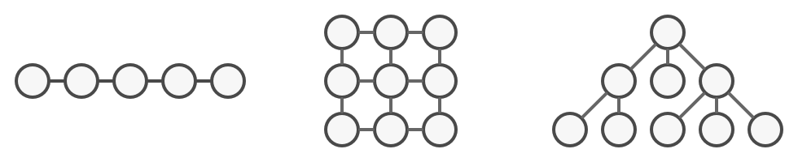
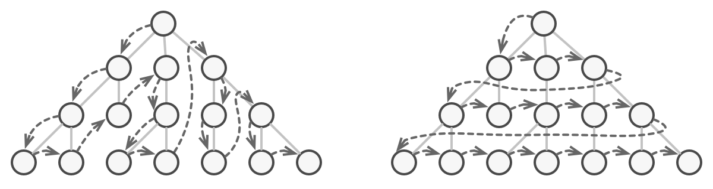
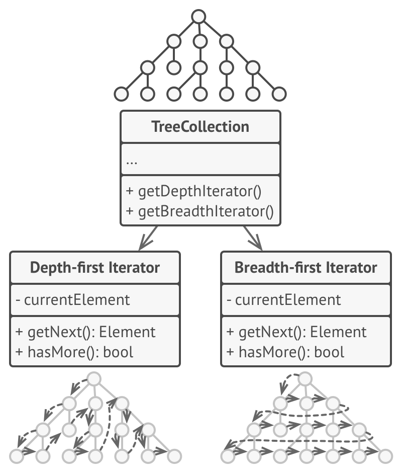
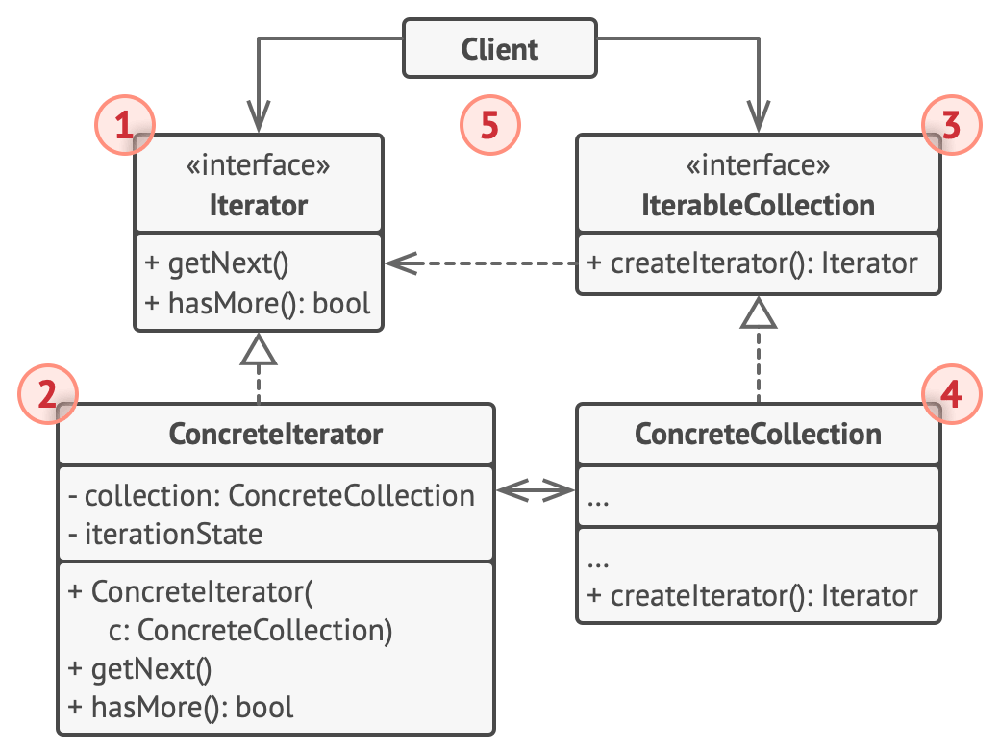
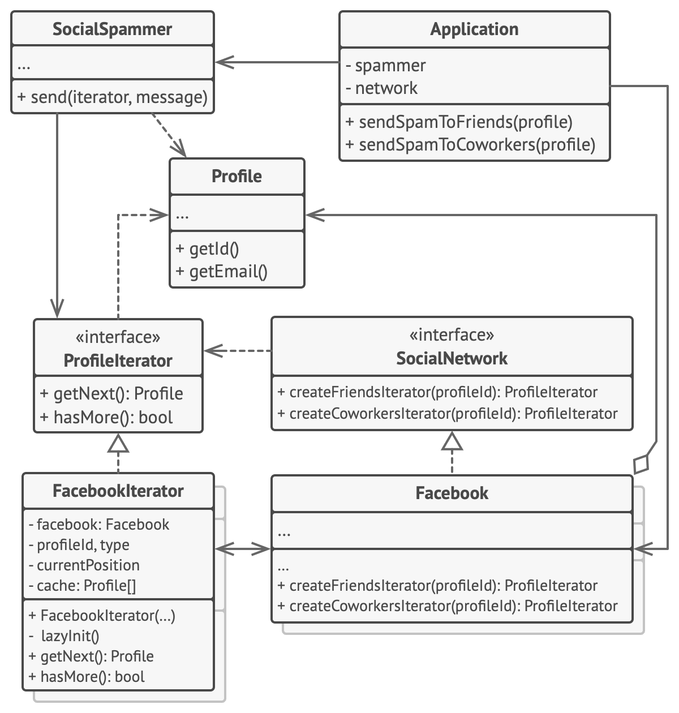

# Iterator


**Type:** Behavioral · **Also known as:** 

> **The 10-second version:** Move the "how do I walk this thing?" logic out of the collection and into a small cursor object, so callers can say `next()` without ever learning whether they're standing on an array, a tree, or page 7 of a REST API.

<br clear="all">

## Quick card

| | |
|---|---|
| **Problem it solves** | Traversal logic either bloats the collection (which should just *store* things) or leaks its internals into every caller, welding client code to one concrete data structure |
| **Core move** | Extract "current position + how to advance" into a separate object behind a tiny interface (`hasNext()` / `next()`), and let the collection hand those objects out |
| **You'll recognise it by** | A `GetEnumerator()` / `createIterator()` / `begin()` factory method on a collection, plus a second class that owns nothing but a cursor and a back-reference to the collection |
| **Rating** | Complexity ★★☆ · Popularity ★★★ |
| **Closest relatives** | Composite (iterators walk its trees), Factory Method (the `createIterator` call *is* one), Visitor (walks + acts), Memento (snapshot the cursor), Strategy (an iterator is a traversal strategy) |
| **In your stack** | You already ship this daily: `IEnumerable<T>`/`yield return` and `IAsyncEnumerable<T>` in C#, `Symbol.iterator`/`function*`/`for await...of` in TS, a SQL cursor or keyset-paginated `WHERE (sortKey, id) > (@k, @id)` loop, and a RabbitMQ consumer turned into an async stream of messages |

### How to read this file

Technical first, plain English second. 🗣️ marks the plain-English version. Part 1 is Refactoring.Guru's material with their diagrams; Parts 2-7 are code, your stack, and the stuff that makes it stick.

---

# PART 1 — The pattern

## 1. Intent
**Iterator** is a behavioral design pattern that lets you traverse elements of a collection without exposing its underlying representation (list, stack, tree, etc.).


### 🗣️ In plain words

A collection's job is to hold things well. Walking through those things is a *different* job. Iterator splits them: the collection keeps storing, and a small throwaway object keeps the bookmark.

The caller gets two verbs — "is there more?" and "give me the next one" — and that is the entire contract. Whether the next element comes from `array[3]`, from the left subtree, or from an HTTP call to page 4 of a dealer inventory feed is none of the caller's business.

Because the bookmark lives in the iterator and not in the collection, you can have five bookmarks in the same book at once, and none of them trip over each other.

## 2. Problem
Collections are one of the most used data types in programming. Nonetheless, a collection is just a container for a group of objects.



*Various types of collections.*

Most collections store their elements in simple lists. However, some of them are based on stacks, trees, graphs and other complex data structures.

But no matter how a collection is structured, it must provide some way of accessing its elements so that other code can use these elements. There should be a way to go through each element of the collection without accessing the same elements over and over.

This may sound like an easy job if you have a collection based on a list. You just loop over all of the elements. But how do you sequentially traverse elements of a complex data structure, such as a tree? For example, one day you might be just fine with depth-first traversal of a tree. Yet the next day you might require breadth-first traversal. And the next week, you might need something else, like random access to the tree elements.



*The same collection can be traversed in several different ways.*

Adding more and more traversal algorithms to the collection gradually blurs its primary responsibility, which is efficient data storage. Additionally, some algorithms might be tailored for a specific application, so including them into a generic collection class would be weird.

On the other hand, the client code that’s supposed to work with various collections may not even care how they store their elements. However, since collections all provide different ways of accessing their elements, you have no option other than to couple your code to the specific collection classes.
### 🗣️ In plain words

You have a listings catalogue. Today it's a `List<Listing>`. Every caller loops it directly with an index, so every caller now *knows* it's a list:

```csharp
// ❌ The catalogue leaked its guts. Everyone indexes into it.
public class ListingCatalogue
{
    public List<Listing> Items = new();   // public field, public shape
}

// Caller 1
for (int i = 0; i < catalogue.Items.Count; i++)
    Render(catalogue.Items[i]);

// Caller 2 — only certified cars, but still index-driven
for (int i = 0; i < catalogue.Items.Count; i++)
    if (catalogue.Items[i].IsCertified) Render(catalogue.Items[i]);

// Caller 3 — walks it backwards, because "newest last"
for (int i = catalogue.Items.Count - 1; i >= 0; i--)
    Render(catalogue.Items[i]);
```

Then reality arrives, in this order:

1. The catalogue gets big, so it becomes a paged API call — no `.Count` up front, no indexing.
2. Product wants "cheapest first within each dealer", which is a tree walk over dealer → model → trim.
3. Someone wants two cursors open at once: one rendering the grid, one pre-fetching images three cards ahead.

Every one of those breaks all three call sites. The alternative — stuffing `IterateDepthFirst()`, `IterateBreadthFirst()`, `IterateCertifiedOnly()` into `ListingCatalogue` — turns a storage class into a junk drawer of traversal algorithms, and half of them only exist for one screen in one app.

That's the squeeze: **either the collection swells with traversal code, or the traversal code hard-codes the collection's shape into every caller.**

## 3. Solution
The main idea of the Iterator pattern is to extract the traversal behavior of a collection into a separate object called an *iterator*.



*Iterators implement various traversal algorithms. Several iterator objects can traverse the same collection at the same time.*

In addition to implementing the algorithm itself, an iterator object encapsulates all of the traversal details, such as the current position and how many elements are left till the end. Because of this, several iterators can go through the same collection at the same time, independently of each other.

Usually, iterators provide one primary method for fetching elements of the collection. The client can keep running this method until it doesn’t return anything, which means that the iterator has traversed all of the elements.

All iterators must implement the same interface. This makes the client code compatible with any collection type or any traversal algorithm as long as there’s a proper iterator. If you need a special way to traverse a collection, you just create a new iterator class, without having to change the collection or the client.
### 🗣️ In plain words

The pattern performs exactly three mechanical moves:

1. **Define a cursor interface.** Two methods is enough: "is there another element?" and "hand me the next one." Everything else (reset, current index, peek) is convenience, not pattern.
2. **Write one cursor class per traversal algorithm.** Each one owns its own position state and holds a reference back to the collection it is walking. Depth-first and breadth-first become two classes, not two flags.
3. **Give the collection a factory method that returns a cursor**, typed as the *interface*, never the concrete class. `createFriendsIterator()`, `GetEnumerator()`, `begin()` — same idea.

Then the client loops against the interface and never names a concrete collection or a concrete traversal again.

> **The key insight:** iteration *state* does not belong to the collection — it belongs to the act of iterating. Once the position lives in its own object, "traverse this two different ways", "traverse it twice at once", and "pause halfway and resume tomorrow" all stop being special cases and become free.

## 4. Real-world analogy


*Various ways to walk around Rome.*

You plan to visit Rome for a few days and visit all of its main sights and attractions. But once there, you could waste a lot of time walking in circles, unable to find even the Colosseum.

On the other hand, you could buy a virtual guide app for your smartphone and use it for navigation. It’s smart and inexpensive, and you could be staying at some interesting places for as long as you want.

A third alternative is that you could spend some of the trip’s budget and hire a local guide who knows the city like the back of his hand. The guide would be able to tailor the tour to your likings, show you every attraction and tell a lot of exciting stories. That’ll be even more fun; but, alas, more expensive, too.

All of these options—the random directions born in your head, the smartphone navigator or the human guide—act as iterators over the vast collection of sights and attractions located in Rome.

### 🗣️ Two more of my own

**The deli ticket dispenser.** The shop holds the customers; the little paper ticket holds *your place*. The shop doesn't have to remember where each person is in the queue, and you can hold a ticket, wander off to look at the cheese, and come back — your position survived because it was printed on something separate from the shop. Two people can even hold tickets for two different counters in the same shop at once.

**A bookmark versus a dog-ear.** A dog-eared page is the book remembering where you stopped — which means only one reader can ever be mid-way through that copy, and the book got physically modified to track it. A bookmark is an iterator: external, cheap, disposable, and you can slide three of them into the same book for three different readers without the book knowing or caring.

## 5. Structure


1. The **Iterator** interface declares the operations required for traversing a collection: fetching the next element, retrieving the current position, restarting iteration, etc.
2. **Concrete Iterators** implement specific algorithms for traversing a collection. The iterator object should track the traversal progress on its own. This allows several iterators to traverse the same collection independently of each other.
3. The **Collection** interface declares one or multiple methods for getting iterators compatible with the collection. Note that the return type of the methods must be declared as the iterator interface so that the concrete collections can return various kinds of iterators.
4. **Concrete Collections** return new instances of a particular concrete iterator class each time the client requests one. You might be wondering, where’s the rest of the collection’s code? Don’t worry, it should be in the same class. It’s just that these details aren’t crucial to the actual pattern, so we’re omitting them.
5. The **Client** works with both collections and iterators via their interfaces. This way the client isn’t coupled to concrete classes, allowing you to use various collections and iterators with the same client code.

   Typically, clients don’t create iterators on their own, but instead get them from collections. Yet, in certain cases, the client can create one directly; for example, when the client defines its own special iterator.
### 🗣️ Participants & roles — cheat table

| Role | What it is in code | Example from the site | Equivalent in reader's stack |
|---|---|---|---|
| **Iterator** | Interface with `hasMore()` / `getNext()`; no data of its own beyond a cursor | `ProfileIterator` | `IEnumerator<T>` (C#), the iterator protocol object `{ next(): {value, done} }` (TS), `InputIterator` concept (C++), `java.util.Iterator<E>` |
| **Concrete Iterator** | Class holding current position + back-reference to the collection; one class per traversal algorithm | `FacebookIterator` (with `type` = friends/coworkers, a `cache`, `currentPosition`, `lazyInit()`) | The compiler-generated state machine behind `yield return`; a generator object from `function*`; `std::vector<T>::iterator`; `ArrayList.Itr` |
| **Collection** | Interface declaring the iterator factory method(s), returning the *iterator interface* | `SocialNetwork` with `createFriendsIterator` / `createCoworkersIterator` | `IEnumerable<T>` (C#), `Iterable<T>`/`Symbol.iterator` (TS), `Iterable<E>` (Java), anything with `begin()`/`end()` (C++) |
| **Concrete Collection** | Real storage class; returns a fresh concrete iterator per request | `Facebook`, `LinkedIn` | `List<T>`, `ArrayList`, `std::map`, your own `ListingPage` feed class |
| **Client** | Loops using only the two interfaces; never names a concrete class | `SocialSpammer.send(iterator, message)` | Your service method that takes `IAsyncEnumerable<Listing>` and doesn't care if it came from SQL, Redis, or a stub |

Note the detail that makes `FacebookIterator` worth studying: `lazyInit()` means **nothing is fetched until the first `hasMore()`**. An iterator is allowed to be lazier than the collection it walks — that is exactly how LINQ's deferred execution works.

### 🤝 Collaboration — who calls whom

```
  Client                 Collection              ConcreteIterator        Storage/Source
    |                        |                          |                      |
    |-- createIterator() --->|                          |                      |
    |                        |-- new(this, args) ------>|                      |
    |                        |    (passes ITSELF) 👈    |                      |
    |<----- Iterator ref ----|                          |                      |
    |     (typed as the INTERFACE, not the class)       |                      |
    |                        |                          |                      |
    |-- hasMore()? --------------------------------->   |                      |
    |                        |                          |-- lazyInit(): fetch->|
    |                        |                          |<---- page/cache -----|
    |<------------------------------------ true --------|                      |
    |-- getNext() ----------------------------------->  |                      |
    |<------------------------- element ----------------|  pos++               |
    |-- hasMore()? --------------------------------->   |  (reads cache only)  |
    |<------------------------------------ true --------|                      |
    |            ... loop until hasMore() == false ...                         |
    |                                                                          |
    |  A SECOND iterator on the SAME collection has its OWN pos + cache.       |
```

The hop that matters is the second one: **the collection passes `this` into the iterator's constructor.** That single line is what lets the iterator read private storage while the client cannot, and it's why the iterator is usually a nested/inner class (C# `private sealed class Enumerator`, Java `private class Itr`) — it needs privileged access that the public API deliberately withholds.

## 6. Pseudocode (the website's example)
In this example, the **Iterator** pattern is used to walk through a special kind of collection which encapsulates access to Facebook’s social graph. The collection provides several iterators that can traverse profiles in various ways.



*Example of iterating over social profiles.*

The ‘friends’ iterator can be used to go over the friends of a given profile. The ‘colleagues’ iterator does the same, except it omits friends who don’t work at the same company as a target person. Both iterators implement a common interface which allows clients to fetch profiles without diving into implementation details such as authentication and sending REST requests.

The client code isn’t coupled to concrete classes because it works with collections and iterators only through interfaces. If you decide to connect your app to a new social network, you simply need to provide new collection and iterator classes without changing the existing code.

```
// The collection interface must declare a factory method for
// producing iterators. You can declare several methods if there
// are different kinds of iteration available in your program.
interface SocialNetwork is
    method createFriendsIterator(profileId):ProfileIterator
    method createCoworkersIterator(profileId):ProfileIterator

// Each concrete collection is coupled to a set of concrete
// iterator classes it returns. But the client isn't, since the
// signature of these methods returns iterator interfaces.
class Facebook implements SocialNetwork is
    // ... The bulk of the collection's code should go here ...

    // Iterator creation code.
    method createFriendsIterator(profileId) is
        return new FacebookIterator(this, profileId, "friends")
    method createCoworkersIterator(profileId) is
        return new FacebookIterator(this, profileId, "coworkers")

// The common interface for all iterators.
interface ProfileIterator is
    method getNext():Profile
    method hasMore():bool

// The concrete iterator class.
class FacebookIterator implements ProfileIterator is
    // The iterator needs a reference to the collection that it
    // traverses.
    private field facebook: Facebook
    private field profileId, type: string

    // An iterator object traverses the collection independently
    // from other iterators. Therefore it has to store the
    // iteration state.
    private field currentPosition
    private field cache: array of Profile

    constructor FacebookIterator(facebook, profileId, type) is
        this.facebook = facebook
        this.profileId = profileId
        this.type = type

    private method lazyInit() is
        if (cache == null)
            cache = facebook.socialGraphRequest(profileId, type)

    // Each concrete iterator class has its own implementation
    // of the common iterator interface.
    method getNext() is
        if (hasMore())
            result = cache[currentPosition]
            currentPosition++
            return result

    method hasMore() is
        lazyInit()
        return currentPosition < cache.length

// Here is another useful trick: you can pass an iterator to a
// client class instead of giving it access to a whole
// collection. This way, you don't expose the collection to the
// client.
//
// And there's another benefit: you can change the way the
// client works with the collection at runtime by passing it a
// different iterator. This is possible because the client code
// isn't coupled to concrete iterator classes.
class SocialSpammer is
    method send(iterator: ProfileIterator, message: string) is
        while (iterator.hasMore())
            profile = iterator.getNext()
            System.sendEmail(profile.getEmail(), message)

// The application class configures collections and iterators
// and then passes them to the client code.
class Application is
    field network: SocialNetwork
    field spammer: SocialSpammer

    method config() is
        if working with Facebook
            this.network = new Facebook()
        if working with LinkedIn
            this.network = new LinkedIn()
        this.spammer = new SocialSpammer()

    method sendSpamToFriends(profile) is
        iterator = network.createFriendsIterator(profile.getId())
        spammer.send(iterator, "Very important message")

    method sendSpamToCoworkers(profile) is
        iterator = network.createCoworkersIterator(profile.getId())
        spammer.send(iterator, "Very important message")
```
### 🗣️ Reading that pseudocode

- **`interface SocialNetwork` declares two factory methods, not one.** That's the pattern's escape hatch for "several kinds of iteration": friends and coworkers are two traversal algorithms over the same graph, so they get two factory methods, both returning `ProfileIterator`. No boolean flag, no enum switch in the client.
- **`FacebookIterator` stores `facebook`, `profileId`, `type`, `currentPosition`, `cache`.** Every one of those fields is *iteration state*. None of it lives on `Facebook`. That is the whole pattern in five fields.
- **`lazyInit()` fires inside `hasMore()`, not in the constructor.** Creating the iterator costs nothing; the REST call happens on first use. If the client never loops, you never pay. This is deferred execution, hand-written.
- **`getNext()` guards with `hasMore()` and increments after reading.** Read-then-advance is the classic external-iterator shape; get it backwards and you skip the first element or run off the end.
- **`SocialSpammer.send(iterator, message)` takes an *iterator*, not a collection.** The comment in the source calls this out explicitly, and it's the most under-rated line on the page: hand a client a cursor and it physically cannot re-order, mutate, count, or re-query your collection. It's a capability, narrowed.
- **`Application.config()` picks `Facebook` or `LinkedIn`; `sendSpamToFriends` never changes.** Swap the network, swap the traversal, the client code is untouched — that's the Open/Closed payoff the pros list claims.

## 7. Applicability — when to reach for it
**Use the Iterator pattern when your collection has a complex data structure under the hood, but you want to hide its complexity from clients (either for convenience or security reasons).**

The iterator encapsulates the details of working with a complex data structure, providing the client with several simple methods of accessing the collection elements. While this approach is very convenient for the client, it also protects the collection from careless or malicious actions which the client would be able to perform if working with the collection directly.

**Use the pattern to reduce duplication of the traversal code across your app.**

The code of non-trivial iteration algorithms tends to be very bulky. When placed within the business logic of an app, it may blur the responsibility of the original code and make it less maintainable. Moving the traversal code to designated iterators can help you make the code of the application more lean and clean.

**Use the Iterator when you want your code to be able to traverse different data structures or when types of these structures are unknown beforehand.**

The pattern provides a couple of generic interfaces for both collections and iterators. Given that your code now uses these interfaces, it’ll still work if you pass it various kinds of collections and iterators that implement these interfaces.
### ✅ Quick checklist

- [ ] Is the underlying structure **non-trivial** (tree, graph, paged remote feed, cursor, stream) rather than a plain in-memory list?
- [ ] Do you need the **same data walked more than one way** (newest-first, cheapest-first, certified-only, depth-first vs breadth-first)?
- [ ] Do you need **two or more traversals live at the same time** over one collection, each with its own position?
- [ ] Is traversal code **duplicated in three or more call sites**, or tangled into a class whose real job is storage?
- [ ] Do you want to **hand out read access without handing out the collection** (so callers can't mutate or re-query it)?
- [ ] Might the data be **too large or too remote to materialise** all at once, so you need it lazily?

Four or more ticks: reach for it. One tick, and the collection is a `List<Listing>` with 40 items: `foreach` already is the pattern — stop there.

## 8. How to implement — step by step
1. Declare the iterator interface. At the very least, it must have a method for fetching the next element from a collection. But for the sake of convenience you can add a couple of other methods, such as fetching the previous element, tracking the current position, and checking the end of the iteration.
2. Declare the collection interface and describe a method for fetching iterators. The return type should be equal to that of the iterator interface. You may declare similar methods if you plan to have several distinct groups of iterators.
3. Implement concrete iterator classes for the collections that you want to be traversable with iterators. An iterator object must be linked with a single collection instance. Usually, this link is established via the iterator’s constructor.
4. Implement the collection interface in your collection classes. The main idea is to provide the client with a shortcut for creating iterators, tailored for a particular collection class. The collection object must pass itself to the iterator’s constructor to establish a link between them.
5. Go over the client code to replace all of the collection traversal code with the use of iterators. The client fetches a new iterator object each time it needs to iterate over the collection elements.
### 🗣️ The same steps, blunt version

1. Write the cursor interface. `hasNext()` + `next()`. Resist adding `reset()`, `count`, `peek()` until something actually needs them.
2. Put a factory method on the collection interface that returns that cursor interface. One method per traversal flavour.
3. Write one iterator class per traversal algorithm. Position state goes *in the iterator*. It takes the collection in its constructor.
4. Have each concrete collection implement the factory and pass `this` into the iterator. Make the iterator a nested private class so it can read the internals the public API hides.
5. Delete the hand-rolled loops in client code. Every traversal now starts by asking the collection for a fresh cursor — fresh, because a reused cursor is already at the end.

And a zeroth step your language probably grants you: **check whether the runtime already does all five.** In C# `yield return` writes steps 1-4 for you; in TS a `function*` does; in C++20 ranges and in Java `Iterable` do most of it. Hand-rolling the class is for when you need something the built-in cannot express — a bidirectional cursor, a resumable position you can persist, or a traversal that must be swapped at runtime.

## 9. Pros and cons
- ✅ *Single Responsibility Principle*. You can clean up the client code and the collections by extracting bulky traversal algorithms into separate classes.
- ✅ *Open/Closed Principle*. You can implement new types of collections and iterators and pass them to existing code without breaking anything.
- ✅ You can iterate over the same collection in parallel because each iterator object contains its own iteration state.
- ✅ For the same reason, you can delay an iteration and continue it when needed.

- ⛔ Applying the pattern can be an overkill if your app only works with simple collections.
- ⛔ Using an iterator may be less efficient than going through elements of some specialized collections directly.
### ⚖️ Honest trade-offs from the trenches

**The true cost is that laziness is contagious, and nobody reads the type.** The moment a method returns `IEnumerable<Listing>` instead of `List<Listing>`, the work has not happened yet — it happens at the `foreach`, possibly in a different layer, possibly inside a `using` block that has already closed the DB connection, possibly *twice* because someone called `.Count()` and then looped. "Collection was modified; enumeration operation may not execute", `ObjectDisposedException` on a `SqlDataReader`, and the silent double-query are all the same bug wearing different hats. The discipline that fixes it is boring and absolute: **lazy inside, materialised at the boundary.** Return `IEnumerable<T>`/`IAsyncEnumerable<T>` between pipeline stages; call `.ToList()` exactly once, at the edge where you hand data to a controller, a view, or a publisher.

**The tell that a hand-rolled iterator is worth it** is when you catch yourself passing traversal *options* into a collection method — `GetListings(bool newestFirst, bool certifiedOnly, bool groupByDealer)`. Those booleans are three iterator classes in a trench coat. The second tell is needing to *stop and resume*: a cursor you can serialise (last-seen sort key + id) is an iterator you can put in Redis, in a message body, or in a `continuation_token` on your API. A `foreach` can't do that; an explicit cursor object can.

**Your languages already give away most of it.** C#: `yield return` compiles into a full `IEnumerator<T>` state machine with `MoveNext`, disposal, and cancellation plumbing; LINQ is a library of iterator decorators (`Where`, `Select`, `Take` each wrap an upstream enumerator); `IAsyncEnumerable<T>` + `await foreach` gives you the same thing over I/O, which is precisely what a paged API or a Rabbit consumer wants. TypeScript: `function*`, `Symbol.iterator`, `Symbol.asyncIterator`, `for await...of`, and Node's `Readable` streams being async-iterable out of the box. C++: the whole standard library is iterator-shaped, and C++20 ranges let you write `dealers | views::filter(...) | views::take(20)` with no cursor class in sight. Writing `class ListingIterator : IEnumerator<Listing>` by hand in 2026 is almost always a sign you reached for the diagram instead of the language.

**The cost the site lists as "less efficient" is real but narrow.** `List<T>.Enumerator` is a *struct* specifically so `foreach` over a `List<T>` allocates nothing — but the moment you store it as `IEnumerable<T>`, it boxes, and you're back to a heap allocation plus interface dispatch per `MoveNext`. In a hot search-ranking loop over a few hundred thousand listings that is measurable; in the 99% of code that is awaiting a database anyway, it is noise. Measure before you un-abstract.

## 10. Relations with other patterns
- You can use [Iterators](https://refactoring.guru/design-patterns/iterator) to traverse [Composite](https://refactoring.guru/design-patterns/composite) trees.
- You can use [Factory Method](https://refactoring.guru/design-patterns/factory-method) along with [Iterator](https://refactoring.guru/design-patterns/iterator) to let collection subclasses return different types of iterators that are compatible with the collections.
- You can use [Memento](https://refactoring.guru/design-patterns/memento) along with [Iterator](https://refactoring.guru/design-patterns/iterator) to capture the current iteration state and roll it back if necessary.
- You can use [Visitor](https://refactoring.guru/design-patterns/visitor) along with [Iterator](https://refactoring.guru/design-patterns/iterator) to traverse a complex data structure and execute some operation over its elements, even if they all have different classes.
### 🗣️ Disambiguation table

| Pattern | What it does | How to tell it apart from Iterator |
|---|---|---|
| **Visitor** | Runs an operation over each element of a structure, dispatching on the element's *type* | Iterator answers *"what's next?"*; Visitor answers *"what do I do with it?"*. They compose: iterate to reach the nodes, visit to act on them. If your `next()` has a `switch` on element type in it, you wanted a Visitor too. |
| **Composite** | Models a tree of part/whole objects with one interface | Composite is the *shape*, Iterator is the *walk* over that shape. A Composite with a depth-first and a breadth-first iterator is the canonical pairing. |
| **Strategy** | Swaps an interchangeable algorithm at runtime | An iterator *is* a traversal strategy, so they blur. The separator: a Strategy is called once and returns an answer; an Iterator is called repeatedly and carries position between calls. **Strategy is stateless between calls; Iterator's entire point is the state between calls.** |
| **Observer** | Pushes items to subscribers as they occur | Direction. Iterator is **pull** — the client asks for the next element and controls the pace. Observer/`IObservable`/RxJS is **push** — the source fires and the client copes. Backpressure problems are what you get when you needed pull and built push. |
| **Memento** | Captures and restores an object's internal state | Used *with* Iterator to snapshot a cursor and roll it back. Memento stores the position; Iterator advances it. |

***If it remembers where you are between two calls, it's an Iterator. If it decides what to do when it gets there, it's a Visitor. If it calls you instead of you calling it, it's an Observer.***

---

# PART 2 — Official code examples from Refactoring.Guru

## 2.1 C#
**Complexity:** ★★☆ (2/3)

**Popularity:** ★★★ (3/3)

**Usage examples:** The pattern is very common in C# code. Many frameworks and libraries use it to provide a standard way for traversing their collections.

**Identification:** Iterator is easy to recognize by the navigation methods (such as `next`, `previous` and others). Client code that uses iterators might not have direct access to the collection being traversed.
### Conceptual Example

This example illustrates the structure of the **Iterator** design pattern. It focuses on answering these questions:

- What classes does it consist of?
- What roles do these classes play?
- In what way the elements of the pattern are related?

##### **Program.cs:** Conceptual example

```csharp
using System;
using System.Collections;
using System.Collections.Generic;

namespace RefactoringGuru.DesignPatterns.Iterator.Conceptual
{
    abstract class Iterator : IEnumerator
    {
        object IEnumerator.Current => Current();

        // Returns the key of the current element
        public abstract int Key();

        // Returns the current element
        public abstract object Current();

        // Move forward to next element
        public abstract bool MoveNext();

        // Rewinds the Iterator to the first element
        public abstract void Reset();
    }

    abstract class IteratorAggregate : IEnumerable
    {
        // Returns an Iterator or another IteratorAggregate for the implementing
        // object.
        public abstract IEnumerator GetEnumerator();
    }

    // Concrete Iterators implement various traversal algorithms. These classes
    // store the current traversal position at all times.
    class AlphabeticalOrderIterator : Iterator
    {
        private WordsCollection _collection;

        // Stores the current traversal position. An iterator may have a lot of
        // other fields for storing iteration state, especially when it is
        // supposed to work with a particular kind of collection.
        private int _position = -1;

        private bool _reverse = false;

        public AlphabeticalOrderIterator(WordsCollection collection, bool reverse = false)
        {
            this._collection = collection;
            this._reverse = reverse;

            if (reverse)
            {
                this._position = collection.getItems().Count;
            }
        }

        public override object Current()
        {
            return this._collection.getItems()[_position];
        }

        public override int Key()
        {
            return this._position;
        }

        public override bool MoveNext()
        {
            int updatedPosition = this._position + (this._reverse ? -1 : 1);

            if (updatedPosition >= 0 && updatedPosition < this._collection.getItems().Count)
            {
                this._position = updatedPosition;
                return true;
            }
            else
            {
                return false;
            }
        }

        public override void Reset()
        {
            this._position = this._reverse ? this._collection.getItems().Count - 1 : 0;
        }
    }

    // Concrete Collections provide one or several methods for retrieving fresh
    // iterator instances, compatible with the collection class.
    class WordsCollection : IteratorAggregate
    {
        List<string> _collection = new List<string>();

        bool _direction = false;

        public void ReverseDirection()
        {
            _direction = !_direction;
        }

        public List<string> getItems()
        {
            return _collection;
        }

        public void AddItem(string item)
        {
            this._collection.Add(item);
        }

        public override IEnumerator GetEnumerator()
        {
            return new AlphabeticalOrderIterator(this, _direction);
        }
    }

    class Program
    {
        static void Main(string[] args)
        {
            // The client code may or may not know about the Concrete Iterator
            // or Collection classes, depending on the level of indirection you
            // want to keep in your program.
            var collection = new WordsCollection();
            collection.AddItem("First");
            collection.AddItem("Second");
            collection.AddItem("Third");

            Console.WriteLine("Straight traversal:");

            foreach (var element in collection)
            {
                Console.WriteLine(element);
            }

            Console.WriteLine("\nReverse traversal:");

            collection.ReverseDirection();

            foreach (var element in collection)
            {
                Console.WriteLine(element);
            }
        }
    }
}
```

##### **Output.txt:** Execution result

```output
Straight traversal:
First
Second
Third

Reverse traversal:
Third
Second
First
```

## 2.2 TypeScript
**Complexity:** ★★☆ (2/3)

**Popularity:** ★★★ (3/3)

**Usage examples:** The pattern is very common in TypeScript code. Many frameworks and libraries use it to provide a standard way for traversing their collections.

**Identification:** Iterator is easy to recognize by the navigation methods (such as `next`, `previous` and others). Client code that uses iterators might not have direct access to the collection being traversed.
### Conceptual Example

This example illustrates the structure of the **Iterator** design pattern and focuses on the following questions:

- What classes does it consist of?
- What roles do these classes play?
- In what way the elements of the pattern are related?

##### **index.ts:** Conceptual example

```typescript
/**
 * Iterator Design Pattern
 *
 * Intent: Lets you traverse elements of a collection without exposing its
 * underlying representation (list, stack, tree, etc.).
 */

interface Iterator<T> {
    // Return the current element.
    current(): T;

    // Return the current element and move forward to next element.
    next(): T;

    // Return the key of the current element.
    key(): number;

    // Checks if current position is valid.
    valid(): boolean;

    // Rewind the Iterator to the first element.
    rewind(): void;
}

interface Aggregator {
    // Retrieve an external iterator.
    getIterator(): Iterator<string>;
}

/**
 * Concrete Iterators implement various traversal algorithms. These classes
 * store the current traversal position at all times.
 */

class AlphabeticalOrderIterator implements Iterator<string> {
    private collection: WordsCollection;

    /**
     * Stores the current traversal position. An iterator may have a lot of
     * other fields for storing iteration state, especially when it is supposed
     * to work with a particular kind of collection.
     */
    private position: number = 0;

    /**
     * This variable indicates the traversal direction.
     */
    private reverse: boolean = false;

    constructor(collection: WordsCollection, reverse: boolean = false) {
        this.collection = collection;
        this.reverse = reverse;

        if (reverse) {
            this.position = collection.getCount() - 1;
        }
    }

    public rewind() {
        this.position = this.reverse ?
            this.collection.getCount() - 1 :
            0;
    }

    public current(): string {
        return this.collection.getItems()[this.position];
    }

    public key(): number {
        return this.position;
    }

    public next(): string {
        const item = this.collection.getItems()[this.position];
        this.position += this.reverse ? -1 : 1;
        return item;
    }

    public valid(): boolean {
        if (this.reverse) {
            return this.position >= 0;
        }

        return this.position < this.collection.getCount();
    }
}

/**
 * Concrete Collections provide one or several methods for retrieving fresh
 * iterator instances, compatible with the collection class.
 */
class WordsCollection implements Aggregator {
    private items: string[] = [];

    public getItems(): string[] {
        return this.items;
    }

    public getCount(): number {
        return this.items.length;
    }

    public addItem(item: string): void {
        this.items.push(item);
    }

    public getIterator(): Iterator<string> {
        return new AlphabeticalOrderIterator(this);
    }

    public getReverseIterator(): Iterator<string> {
        return new AlphabeticalOrderIterator(this, true);
    }
}

/**
 * The client code may or may not know about the Concrete Iterator or Collection
 * classes, depending on the level of indirection you want to keep in your
 * program.
 */
const collection = new WordsCollection();
collection.addItem('First');
collection.addItem('Second');
collection.addItem('Third');

const iterator = collection.getIterator();

console.log('Straight traversal:');
while (iterator.valid()) {
    console.log(iterator.next());
}

console.log('');
console.log('Reverse traversal:');
const reverseIterator = collection.getReverseIterator();
while (reverseIterator.valid()) {
    console.log(reverseIterator.next());
}
```

##### **Output.txt:** Execution result

```output
Straight traversal:
First
Second
Third

Reverse traversal:
Third
Second
First
```

## 2.3 C++
**Complexity:** ★★☆ (2/3)

**Popularity:** ★★★ (3/3)

**Usage examples:** The pattern is very common in C++ code. Many frameworks and libraries use it to provide a standard way for traversing their collections.

**Identification:** Iterator is easy to recognize by the navigation methods (such as `next`, `previous` and others). Client code that uses iterators might not have direct access to the collection being traversed.
### Conceptual Example

This example illustrates the structure of the **Iterator** design pattern. It focuses on answering these questions:

- What classes does it consist of?
- What roles do these classes play?
- In what way the elements of the pattern are related?

##### **main.cc:** Conceptual example

```cpp
/**
 * Iterator Design Pattern
 *
 * Intent: Lets you traverse elements of a collection without exposing its
 * underlying representation (list, stack, tree, etc.).
 */

#include <iostream>
#include <string>
#include <vector>

/**
 * C++ has its own implementation of iterator that works with a different
 * generics containers defined by the standard library.
 */

template <typename T, typename U>
class Iterator {
 public:
  typedef typename std::vector<T>::iterator iter_type;
  Iterator(U *p_data, bool reverse = false) : m_p_data_(p_data) {
    m_it_ = m_p_data_->m_data_.begin();
  }

  void First() {
    m_it_ = m_p_data_->m_data_.begin();
  }

  void Next() {
    m_it_++;
  }

  bool IsDone() {
    return (m_it_ == m_p_data_->m_data_.end());
  }

  iter_type Current() {
    return m_it_;
  }

 private:
  U *m_p_data_;
  iter_type m_it_;
};

/**
 * Generic Collections/Containers provides one or several methods for retrieving
 * fresh iterator instances, compatible with the collection class.
 */

template <class T>
class Container {
  friend class Iterator<T, Container>;

 public:
  void Add(T a) {
    m_data_.push_back(a);
  }

  Iterator<T, Container> *CreateIterator() {
    return new Iterator<T, Container>(this);
  }

 private:
  std::vector<T> m_data_;
};

class Data {
 public:
  Data(int a = 0) : m_data_(a) {}

  void set_data(int a) {
    m_data_ = a;
  }

  int data() {
    return m_data_;
  }

 private:
  int m_data_;
};

/**
 * The client code may or may not know about the Concrete Iterator or Collection
 * classes, for this implementation the container is generic so you can used
 * with an int or with a custom class.
 */
void ClientCode() {
  std::cout << "________________Iterator with int______________________________________" << std::endl;
  Container<int> cont;

  for (int i = 0; i < 10; i++) {
    cont.Add(i);
  }

  Iterator<int, Container<int>> *it = cont.CreateIterator();
  for (it->First(); !it->IsDone(); it->Next()) {
    std::cout << *it->Current() << std::endl;
  }

  Container<Data> cont2;
  Data a(100), b(1000), c(10000);
  cont2.Add(a);
  cont2.Add(b);
  cont2.Add(c);

  std::cout << "________________Iterator with custom Class______________________________" << std::endl;
  Iterator<Data, Container<Data>> *it2 = cont2.CreateIterator();
  for (it2->First(); !it2->IsDone(); it2->Next()) {
    std::cout << it2->Current()->data() << std::endl;
  }
  delete it;
  delete it2;
}

int main() {
  ClientCode();
  return 0;
}
```

##### **Output.txt:** Execution result

```output
________________Iterator with int______________________________________
0
1
2
3
4
5
6
7
8
9
________________Iterator with custom Class______________________________
100
1000
10000
```

## 2.4 Java
**Complexity:** ★★☆ (2/3)

**Popularity:** ★★★ (3/3)

**Usage examples:** The pattern is very common in Java code. Many frameworks and libraries use it to provide a standard way for traversing their collections.

**Identification:** Iterator is easy to recognize by the navigation methods (such as `next`, `previous` and others). Client code that uses iterators might not have direct access to the collection being traversed.
### Iterating over social network profiles

In this example, the Iterator pattern is used to go over social profiles of a remote social network collection without exposing any of the communication details to the client code.

#### **iterators**

##### **iterators/ProfileIterator.java:** Defines profile interface

```java
package refactoring_guru.iterator.example.iterators;

import refactoring_guru.iterator.example.profile.Profile;

public interface ProfileIterator {
    boolean hasNext();

    Profile getNext();

    void reset();
}
```

##### **iterators/FacebookIterator.java:** Implements iteration over Facebook profiles

```java
package refactoring_guru.iterator.example.iterators;

import refactoring_guru.iterator.example.profile.Profile;
import refactoring_guru.iterator.example.social_networks.Facebook;

import java.util.ArrayList;
import java.util.List;

public class FacebookIterator implements ProfileIterator {
    private Facebook facebook;
    private String type;
    private String email;
    private int currentPosition = 0;
    private List<String> emails = new ArrayList<>();
    private List<Profile> profiles = new ArrayList<>();

    public FacebookIterator(Facebook facebook, String type, String email) {
        this.facebook = facebook;
        this.type = type;
        this.email = email;
    }

    private void lazyLoad() {
        if (emails.size() == 0) {
            List<String> profiles = facebook.requestProfileFriendsFromFacebook(this.email, this.type);
            for (String profile : profiles) {
                this.emails.add(profile);
                this.profiles.add(null);
            }
        }
    }

    @Override
    public boolean hasNext() {
        lazyLoad();
        return currentPosition < emails.size();
    }

    @Override
    public Profile getNext() {
        if (!hasNext()) {
            return null;
        }

        String friendEmail = emails.get(currentPosition);
        Profile friendProfile = profiles.get(currentPosition);
        if (friendProfile == null) {
            friendProfile = facebook.requestProfileFromFacebook(friendEmail);
            profiles.set(currentPosition, friendProfile);
        }
        currentPosition++;
        return friendProfile;
    }

    @Override
    public void reset() {
        currentPosition = 0;
    }
}
```

##### **iterators/LinkedInIterator.java:** Implements iteration over LinkedIn profiles

```java
package refactoring_guru.iterator.example.iterators;

import refactoring_guru.iterator.example.profile.Profile;
import refactoring_guru.iterator.example.social_networks.LinkedIn;

import java.util.ArrayList;
import java.util.List;

public class LinkedInIterator implements ProfileIterator {
    private LinkedIn linkedIn;
    private String type;
    private String email;
    private int currentPosition = 0;
    private List<String> emails = new ArrayList<>();
    private List<Profile> contacts = new ArrayList<>();

    public LinkedInIterator(LinkedIn linkedIn, String type, String email) {
        this.linkedIn = linkedIn;
        this.type = type;
        this.email = email;
    }

    private void lazyLoad() {
        if (emails.size() == 0) {
            List<String> profiles = linkedIn.requestRelatedContactsFromLinkedInAPI(this.email, this.type);
            for (String profile : profiles) {
                this.emails.add(profile);
                this.contacts.add(null);
            }
        }
    }

    @Override
    public boolean hasNext() {
        lazyLoad();
        return currentPosition < emails.size();
    }

    @Override
    public Profile getNext() {
        if (!hasNext()) {
            return null;
        }

        String friendEmail = emails.get(currentPosition);
        Profile friendContact = contacts.get(currentPosition);
        if (friendContact == null) {
            friendContact = linkedIn.requestContactInfoFromLinkedInAPI(friendEmail);
            contacts.set(currentPosition, friendContact);
        }
        currentPosition++;
        return friendContact;
    }

    @Override
    public void reset() {
        currentPosition = 0;
    }
}
```

#### **social_networks**

##### **social_networks/SocialNetwork.java:** Defines common social network interface

```java
package refactoring_guru.iterator.example.social_networks;

import refactoring_guru.iterator.example.iterators.ProfileIterator;

public interface SocialNetwork {
    ProfileIterator createFriendsIterator(String profileEmail);

    ProfileIterator createCoworkersIterator(String profileEmail);
}
```

##### **social_networks/Facebook.java:** Facebook

```java
package refactoring_guru.iterator.example.social_networks;

import refactoring_guru.iterator.example.iterators.FacebookIterator;
import refactoring_guru.iterator.example.iterators.ProfileIterator;
import refactoring_guru.iterator.example.profile.Profile;

import java.util.ArrayList;
import java.util.List;

public class Facebook implements SocialNetwork {
    private List<Profile> profiles;

    public Facebook(List<Profile> cache) {
        if (cache != null) {
            this.profiles = cache;
        } else {
            this.profiles = new ArrayList<>();
        }
    }

    public Profile requestProfileFromFacebook(String profileEmail) {
        // Here would be a POST request to one of the Facebook API endpoints.
        // Instead, we emulates long network connection, which you would expect
        // in the real life...
        simulateNetworkLatency();
        System.out.println("Facebook: Loading profile '" + profileEmail + "' over the network...");

        // ...and return test data.
        return findProfile(profileEmail);
    }

    public List<String> requestProfileFriendsFromFacebook(String profileEmail, String contactType) {
        // Here would be a POST request to one of the Facebook API endpoints.
        // Instead, we emulates long network connection, which you would expect
        // in the real life...
        simulateNetworkLatency();
        System.out.println("Facebook: Loading '" + contactType + "' list of '" + profileEmail + "' over the network...");

        // ...and return test data.
        Profile profile = findProfile(profileEmail);
        if (profile != null) {
            return profile.getContacts(contactType);
        }
        return null;
    }

    private Profile findProfile(String profileEmail) {
        for (Profile profile : profiles) {
            if (profile.getEmail().equals(profileEmail)) {
                return profile;
            }
        }
        return null;
    }

    private void simulateNetworkLatency() {
        try {
            Thread.sleep(2500);
        } catch (InterruptedException ex) {
            ex.printStackTrace();
        }
    }

    @Override
    public ProfileIterator createFriendsIterator(String profileEmail) {
        return new FacebookIterator(this, "friends", profileEmail);
    }

    @Override
    public ProfileIterator createCoworkersIterator(String profileEmail) {
        return new FacebookIterator(this, "coworkers", profileEmail);
    }

}
```

##### **social_networks/LinkedIn.java:** LinkedIn

```java
package refactoring_guru.iterator.example.social_networks;

import refactoring_guru.iterator.example.iterators.LinkedInIterator;
import refactoring_guru.iterator.example.iterators.ProfileIterator;
import refactoring_guru.iterator.example.profile.Profile;

import java.util.ArrayList;
import java.util.List;

public class LinkedIn implements SocialNetwork {
    private List<Profile> contacts;

    public LinkedIn(List<Profile> cache) {
        if (cache != null) {
            this.contacts = cache;
        } else {
            this.contacts = new ArrayList<>();
        }
    }

    public Profile requestContactInfoFromLinkedInAPI(String profileEmail) {
        // Here would be a POST request to one of the LinkedIn API endpoints.
        // Instead, we emulates long network connection, which you would expect
        // in the real life...
        simulateNetworkLatency();
        System.out.println("LinkedIn: Loading profile '" + profileEmail + "' over the network...");

        // ...and return test data.
        return findContact(profileEmail);
    }

    public List<String> requestRelatedContactsFromLinkedInAPI(String profileEmail, String contactType) {
        // Here would be a POST request to one of the LinkedIn API endpoints.
        // Instead, we emulates long network connection, which you would expect
        // in the real life.
        simulateNetworkLatency();
        System.out.println("LinkedIn: Loading '" + contactType + "' list of '" + profileEmail + "' over the network...");

        // ...and return test data.
        Profile profile = findContact(profileEmail);
        if (profile != null) {
            return profile.getContacts(contactType);
        }
        return null;
    }

    private Profile findContact(String profileEmail) {
        for (Profile profile : contacts) {
            if (profile.getEmail().equals(profileEmail)) {
                return profile;
            }
        }
        return null;
    }

    private void simulateNetworkLatency() {
        try {
            Thread.sleep(2500);
        } catch (InterruptedException ex) {
            ex.printStackTrace();
        }
    }

    @Override
    public ProfileIterator createFriendsIterator(String profileEmail) {
        return new LinkedInIterator(this, "friends", profileEmail);
    }

    @Override
    public ProfileIterator createCoworkersIterator(String profileEmail) {
        return new LinkedInIterator(this, "coworkers", profileEmail);
    }
}
```

#### **profile**

##### **profile/Profile.java:** Social profiles

```java
package refactoring_guru.iterator.example.profile;

import java.util.ArrayList;
import java.util.HashMap;
import java.util.List;
import java.util.Map;

public class Profile {
    private String name;
    private String email;
    private Map<String, List<String>> contacts = new HashMap<>();

    public Profile(String email, String name, String... contacts) {
        this.email = email;
        this.name = name;

        // Parse contact list from a set of "friend:email@gmail.com" pairs.
        for (String contact : contacts) {
            String[] parts = contact.split(":");
            String contactType = "friend", contactEmail;
            if (parts.length == 1) {
                contactEmail = parts[0];
            }
            else {
                contactType = parts[0];
                contactEmail = parts[1];
            }
            if (!this.contacts.containsKey(contactType)) {
                this.contacts.put(contactType, new ArrayList<>());
            }
            this.contacts.get(contactType).add(contactEmail);
        }
    }

    public String getEmail() {
        return email;
    }

    public String getName() {
        return name;
    }

    public List<String> getContacts(String contactType) {
        if (!this.contacts.containsKey(contactType)) {
            this.contacts.put(contactType, new ArrayList<>());
        }
        return contacts.get(contactType);
    }
}
```

#### **spammer**

##### **spammer/SocialSpammer.java:** Message sending app

```java
package refactoring_guru.iterator.example.spammer;

import refactoring_guru.iterator.example.iterators.ProfileIterator;
import refactoring_guru.iterator.example.profile.Profile;
import refactoring_guru.iterator.example.social_networks.SocialNetwork;

public class SocialSpammer {
    public SocialNetwork network;
    public ProfileIterator iterator;

    public SocialSpammer(SocialNetwork network) {
        this.network = network;
    }

    public void sendSpamToFriends(String profileEmail, String message) {
        System.out.println("\nIterating over friends...\n");
        iterator = network.createFriendsIterator(profileEmail);
        while (iterator.hasNext()) {
            Profile profile = iterator.getNext();
            sendMessage(profile.getEmail(), message);
        }
    }

    public void sendSpamToCoworkers(String profileEmail, String message) {
        System.out.println("\nIterating over coworkers...\n");
        iterator = network.createCoworkersIterator(profileEmail);
        while (iterator.hasNext()) {
            Profile profile = iterator.getNext();
            sendMessage(profile.getEmail(), message);
        }
    }

    public void sendMessage(String email, String message) {
        System.out.println("Sent message to: '" + email + "'. Message body: '" + message + "'");
    }
}
```

##### **Demo.java:** Client code

```java
package refactoring_guru.iterator.example;

import refactoring_guru.iterator.example.profile.Profile;
import refactoring_guru.iterator.example.social_networks.Facebook;
import refactoring_guru.iterator.example.social_networks.LinkedIn;
import refactoring_guru.iterator.example.social_networks.SocialNetwork;
import refactoring_guru.iterator.example.spammer.SocialSpammer;

import java.util.ArrayList;
import java.util.List;
import java.util.Scanner;

/**
 * Demo class. Everything comes together here.
 */
public class Demo {
    public static Scanner scanner = new Scanner(System.in);

    public static void main(String[] args) {
        System.out.println("Please specify social network to target spam tool (default:Facebook):");
        System.out.println("1. Facebook");
        System.out.println("2. LinkedIn");
        String choice = scanner.nextLine();

        SocialNetwork network;
        if (choice.equals("2")) {
            network = new LinkedIn(createTestProfiles());
        }
        else {
            network = new Facebook(createTestProfiles());
        }

        SocialSpammer spammer = new SocialSpammer(network);
        spammer.sendSpamToFriends("anna.smith@bing.com",
                "Hey! This is Anna's friend Josh. Can you do me a favor and like this post [link]?");
        spammer.sendSpamToCoworkers("anna.smith@bing.com",
                "Hey! This is Anna's boss Jason. Anna told me you would be interested in [link].");
    }

    public static List<Profile> createTestProfiles() {
        List<Profile> data = new ArrayList<Profile>();
        data.add(new Profile("anna.smith@bing.com", "Anna Smith", "friends:mad_max@ya.com", "friends:catwoman@yahoo.com", "coworkers:sam@amazon.com"));
        data.add(new Profile("mad_max@ya.com", "Maximilian", "friends:anna.smith@bing.com", "coworkers:sam@amazon.com"));
        data.add(new Profile("bill@microsoft.eu", "Billie", "coworkers:avanger@ukr.net"));
        data.add(new Profile("avanger@ukr.net", "John Day", "coworkers:bill@microsoft.eu"));
        data.add(new Profile("sam@amazon.com", "Sam Kitting", "coworkers:anna.smith@bing.com", "coworkers:mad_max@ya.com", "friends:catwoman@yahoo.com"));
        data.add(new Profile("catwoman@yahoo.com", "Liza", "friends:anna.smith@bing.com", "friends:sam@amazon.com"));
        return data;
    }
}
```

##### **OutputDemo.txt:** Execution result

```output
Please specify social network to target spam tool (default:Facebook):
1. Facebook
2. LinkedIn
> 1

Iterating over friends...

Facebook: Loading 'friends' list of 'anna.smith@bing.com' over the network...
Facebook: Loading profile 'mad_max@ya.com' over the network...
Sent message to: 'mad_max@ya.com'. Message body: 'Hey! This is Anna's friend Josh. Can you do me a favor and like this post [link]?'
Facebook: Loading profile 'catwoman@yahoo.com' over the network...
Sent message to: 'catwoman@yahoo.com'. Message body: 'Hey! This is Anna's friend Josh. Can you do me a favor and like this post [link]?'

Iterating over coworkers...

Facebook: Loading 'coworkers' list of 'anna.smith@bing.com' over the network...
Facebook: Loading profile 'sam@amazon.com' over the network...
Sent message to: 'sam@amazon.com'. Message body: 'Hey! This is Anna's boss Jason. Anna told me you would be interested in [link].'
```

---

# PART 3 — Learn it by building it

## 3.1 The dumbest possible version — TypeScript

### ❌ BEFORE — the pain

A dealer inventory feed that arrives one page at a time. Every consumer re-implements paging.

```typescript
// ❌ BEFORE: three call sites, three copies of the same while-loop,
//    and every one of them knows about pageSize, cursors and HTTP.

type Listing = { id: string; make: string; model: string; priceInr: number; certified: boolean };

async function fetchPage(dealerId: string, page: number): Promise<{ items: Listing[]; hasMore: boolean }> {
  const res = await fetch(`/api/dealers/${dealerId}/listings?page=${page}&size=50`);
  return res.json();
}

// Call site 1 — render a grid
async function renderGrid(dealerId: string) {
  let page = 0;
  let hasMore = true;
  while (hasMore) {
    const res = await fetchPage(dealerId, page);   // paging logic, copy #1
    for (const l of res.items) draw(l);
    hasMore = res.hasMore;
    page++;
  }
}

// Call site 2 — count certified cars
async function countCertified(dealerId: string) {
  let page = 0, n = 0, hasMore = true;
  while (hasMore) {
    const res = await fetchPage(dealerId, page);   // paging logic, copy #2
    n += res.items.filter(l => l.certified).length;
    hasMore = res.hasMore;
    page++;
  }
  return n;
}

// Call site 3 — find the cheapest, then STOP. Except it can't stop:
async function cheapest(dealerId: string) {
  let page = 0, best: Listing | null = null, hasMore = true;
  while (hasMore) {
    const res = await fetchPage(dealerId, page);   // paging logic, copy #3
    for (const l of res.items) if (!best || l.priceInr < best.priceInr) best = l;
    hasMore = res.hasMore;
    page++;                                        // 👈 always drains ALL pages
  }
  return best;
}
```

Three copies of a while-loop, and the third one cannot early-exit without more bookkeeping. Change `size=50` to `size=200` and you edit three files.

### ✅ AFTER — the hand-rolled iterator

First the explicit, GoF-shaped version, so you can see every moving part:

```typescript
// ─────────────────────────────────────────────────────────────
//  1. THE ITERATOR INTERFACE  — two verbs, nothing else
// ─────────────────────────────────────────────────────────────
interface AsyncCursor<T> {
  hasNext(): Promise<boolean>;
  next(): Promise<T>;
}

// ─────────────────────────────────────────────────────────────
//  2. THE COLLECTION INTERFACE — a factory method per traversal
// ─────────────────────────────────────────────────────────────
interface ListingSource {
  createCursor(): AsyncCursor<Listing>;
  createCertifiedCursor(): AsyncCursor<Listing>;   // 👈 a 2nd traversal, not a boolean flag
}

// ─────────────────────────────────────────────────────────────
//  3. THE CONCRETE ITERATOR — owns ALL the position state
// ─────────────────────────────────────────────────────────────
class DealerFeedCursor implements AsyncCursor<Listing> {
  private buffer: Listing[] = [];
  private indexInBuffer = 0;          // 👈 where we are inside the current page
  private nextPage = 0;               // 👈 where we are across pages
  private sourceExhausted = false;

  constructor(
    private readonly feed: DealerFeed,          // 👈 back-reference to the collection
    private readonly keep: (l: Listing) => boolean = () => true,
  ) {}

  async hasNext(): Promise<boolean> {
    // Lazy: the first HTTP call happens HERE, not in the constructor.
    while (this.indexInBuffer >= this.buffer.length && !this.sourceExhausted) {
      await this.fill();
    }
    return this.indexInBuffer < this.buffer.length;
  }

  async next(): Promise<Listing> {
    if (!(await this.hasNext())) throw new Error("Cursor exhausted");
    return this.buffer[this.indexInBuffer++];      // 👈 read, THEN advance
  }

  private async fill(): Promise<void> {
    const page = await this.feed.loadPage(this.nextPage++);
    this.buffer = page.items.filter(this.keep);    // 👈 the traversal rule lives here
    this.indexInBuffer = 0;
    this.sourceExhausted = !page.hasMore;
  }
}

// ─────────────────────────────────────────────────────────────
//  4. THE CONCRETE COLLECTION — hands out fresh cursors
// ─────────────────────────────────────────────────────────────
class DealerFeed implements ListingSource {
  constructor(private readonly dealerId: string, private readonly pageSize = 50) {}

  createCursor(): AsyncCursor<Listing> {
    return new DealerFeedCursor(this);                              // passes ITSELF 👈
  }

  createCertifiedCursor(): AsyncCursor<Listing> {
    return new DealerFeedCursor(this, (l) => l.certified);
  }

  /** Internal — the cursor is the only thing that calls this. */
  async loadPage(page: number): Promise<{ items: Listing[]; hasMore: boolean }> {
    const res = await fetch(
      `/api/dealers/${this.dealerId}/listings?page=${page}&size=${this.pageSize}`,
    );
    if (!res.ok) throw new Error(`Feed failed: ${res.status}`);
    return res.json();
  }
}

// ─────────────────────────────────────────────────────────────
//  5. THE CLIENT — knows neither HTTP nor pages
// ─────────────────────────────────────────────────────────────
async function cheapest(cursor: AsyncCursor<Listing>): Promise<Listing | null> {
  let best: Listing | null = null;
  while (await cursor.hasNext()) {
    const l = await cursor.next();
    if (!best || l.priceInr < best.priceInr) best = l;
  }
  return best;
}

async function firstMatch(
  cursor: AsyncCursor<Listing>,
  pred: (l: Listing) => boolean,
): Promise<Listing | null> {
  while (await cursor.hasNext()) {
    const l = await cursor.next();
    if (pred(l)) return l;            // 👈 early exit: pages 3..N are never fetched
  }
  return null;
}

// Usage — and note the two INDEPENDENT cursors over one feed.
const feed = new DealerFeed("dlr_8821");
const cheapestAny = await cheapest(feed.createCursor());
const firstCertifiedSuv = await firstMatch(feed.createCertifiedCursor(), (l) => l.model.includes("SUV"));
```

**What to notice:**

- `DealerFeedCursor` holds four fields of state; `DealerFeed` holds zero. Iteration state moved out of the collection — that's the entire pattern.
- The first `fetch` happens inside `hasNext()`, not the constructor. Creating a cursor is free; a client that never loops never hits the network.
- `firstMatch` early-exits and the remaining pages are simply never requested. The `BEFORE` version physically could not do that.
- `createCertifiedCursor()` is a *second traversal algorithm* expressed as a second factory method — the same shape as the site's `createFriendsIterator` / `createCoworkersIterator`.
- Two cursors from the same `feed` have separate `buffer`, `indexInBuffer` and `nextPage`. Parallel iteration comes for free once position is external.
- `loadPage` is the only place that knows about HTTP and page size. Swap it for a SQL keyset query and no client changes.

### And now the version you'd actually ship

TypeScript has the iterator protocol built in. `Symbol.asyncIterator` + a generator collapses the whole thing:

```typescript
class DealerFeed2 implements AsyncIterable<Listing> {
  constructor(private readonly dealerId: string, private readonly pageSize = 50) {}

  // The factory method from step 2 — the language just spells it this way.
  async *[Symbol.asyncIterator](): AsyncIterator<Listing> {
    let page = 0;
    for (;;) {
      const res = await fetch(
        `/api/dealers/${this.dealerId}/listings?page=${page}&size=${this.pageSize}`,
      );
      if (!res.ok) throw new Error(`Feed failed: ${res.status}`);
      const body: { items: Listing[]; hasMore: boolean } = await res.json();
      yield* body.items;                 // 👈 each item handed out one at a time
      if (!body.hasMore) return;
      page++;
    }
  }

  /** A second traversal = a second generator, still no cursor class. */
  async *certified(): AsyncGenerator<Listing> {
    for await (const l of this) if (l.certified) yield l;
  }
}

// Client code becomes ordinary-looking:
const feed2 = new DealerFeed2("dlr_8821");
for await (const l of feed2) {
  if (l.model.includes("SUV")) { console.log(l); break; }   // break → generator .return() → cleanup
}
```

Same pattern, one-fifth the code. The `break` even calls the generator's `return()` under the hood, which is where you'd put cleanup in a `try/finally`.

## 3.2 Same thing in C#

```csharp
using System;
using System.Collections.Generic;
using System.Net.Http;
using System.Net.Http.Json;
using System.Runtime.CompilerServices;
using System.Threading;
using System.Threading.Tasks;

namespace Marketplace.Inventory;

public sealed record Listing(
    string Id,
    string Make,
    string Model,
    decimal PriceInr,
    int Year,
    bool Certified);

public sealed record ListingPage(IReadOnlyList<Listing> Items, string? NextCursor);

// ─────────────────────────────────────────────────────────────
//  The collection. It exposes traversals, not storage.
// ─────────────────────────────────────────────────────────────
public sealed class DealerInventory : IAsyncEnumerable<Listing>
{
    private readonly HttpClient _http;
    private readonly string _dealerId;
    private readonly int _pageSize;

    public DealerInventory(HttpClient http, string dealerId, int pageSize = 50)
        => (_http, _dealerId, _pageSize) = (http, dealerId, pageSize);

    // ── Traversal #1: everything, oldest page first ──────────
    public async IAsyncEnumerator<Listing> GetAsyncEnumerator(
        CancellationToken ct = default)
    {
        string? cursor = null;
        do
        {
            var page = await LoadPageAsync(cursor, ct);   // 👈 one network hop per page
            foreach (var listing in page.Items)
            {
                ct.ThrowIfCancellationRequested();
                yield return listing;                     // 👈 the state machine parks here
            }
            cursor = page.NextCursor;
        }
        while (cursor is not null);
    }

    // ── Traversal #2: certified only. A method, not a flag. ──
    public async IAsyncEnumerable<Listing> CertifiedAsync(
        [EnumeratorCancellation] CancellationToken ct = default)
    {
        await foreach (var l in this.WithCancellation(ct))
            if (l.Certified)
                yield return l;
    }

    // ── Traversal #3: stop as soon as the price floor is hit ─
    public async IAsyncEnumerable<Listing> UnderAsync(
        decimal maxPriceInr,
        [EnumeratorCancellation] CancellationToken ct = default)
    {
        await foreach (var l in this.WithCancellation(ct))
        {
            if (l.PriceInr > maxPriceInr) continue;
            yield return l;
        }
    }

    private async Task<ListingPage> LoadPageAsync(string? cursor, CancellationToken ct)
    {
        var url = cursor is null
            ? $"/api/dealers/{_dealerId}/listings?size={_pageSize}"
            : $"/api/dealers/{_dealerId}/listings?size={_pageSize}&cursor={Uri.EscapeDataString(cursor)}";

        var page = await _http.GetFromJsonAsync<ListingPage>(url, ct);
        return page ?? new ListingPage(Array.Empty<Listing>(), null);
    }
}

// ─────────────────────────────────────────────────────────────
//  Client — takes the INTERFACE. Doesn't know HTTP exists.
// ─────────────────────────────────────────────────────────────
public static class PricingScan
{
    public static async Task<Listing?> CheapestAsync(
        IAsyncEnumerable<Listing> listings,
        CancellationToken ct = default)
    {
        Listing? best = null;
        await foreach (var l in listings.WithCancellation(ct))
            best = best is null || l.PriceInr < best.PriceInr ? l : best;
        return best;
    }

    public static async Task<Listing?> FirstSuvAsync(
        IAsyncEnumerable<Listing> listings,
        CancellationToken ct = default)
    {
        await foreach (var l in listings.WithCancellation(ct))
            if (l.Model.Contains("SUV", StringComparison.OrdinalIgnoreCase))
                return l;      // 👈 remaining pages are never fetched
        return null;
    }

    public static string Describe(Listing l) => l switch
    {
        { Certified: true, Year: >= 2022 } => $"{l.Make} {l.Model} — certified, near-new",
        { Certified: true }                => $"{l.Make} {l.Model} — certified",
        { Year: <= 2015 }                  => $"{l.Make} {l.Model} — older stock",
        _                                  => $"{l.Make} {l.Model}",
    };
}
```

**C#-specific notes:**

- **`yield return` *is* the pattern.** The compiler generates a private nested class implementing `IEnumerator<T>`/`IAsyncEnumerator<T>` with a `<>1__state` field, a `MoveNext()` containing your code chopped at each `yield`, and a `Dispose()` that runs your `finally` blocks. Writing that class by hand is re-doing the compiler's homework.
- **`IEnumerable<T>` vs `IEnumerator<T>` trips everyone once.** `IEnumerable` is the *collection* role ("I can produce cursors"); `IEnumerator` is the *cursor* role ("I have a position"). `foreach` calls `GetEnumerator()` to get a fresh cursor every time — which is why enumerating an `IEnumerable` twice re-runs the whole pipeline, including the database query.
- **`[EnumeratorCancellation]`** is required on the `CancellationToken` parameter of an `async IAsyncEnumerable` method; without it, `WithCancellation(ct)` at the call site silently fails to reach your loop.
- **Deferred execution bites at layer boundaries.** If `LoadPageAsync` used a `SqlConnection` opened in a `using` inside the *calling* method, the connection closes before the consumer's first `MoveNextAsync`. Rule: whoever opens the resource must stay alive for the whole enumeration — put the `using` *inside* the iterator method, where `Dispose()` runs on enumerator disposal.
- **Multiple enumeration is the classic bug.** `if (listings.Any()) foreach (var l in listings)` runs the pipeline twice. Roslyn analysers flag it; `.ToList()` once, or restructure, fixes it.
- **`List<T>.Enumerator` is a struct** so `foreach (var x in myList)` allocates nothing. Casting to `IEnumerable<T>` boxes it. Also: a struct enumerator copied into a variable and mutated is a famous foot-gun — never store one in a `var` and call `MoveNext()` on a copy.
- **`ConfigureAwait(false)`** goes on the enumerable in library code: `await foreach (var l in src.ConfigureAwait(false))`.

## 3.3 C++

```cpp
#include <cstddef>
#include <iterator>
#include <memory>
#include <string>
#include <utility>
#include <vector>
#include <algorithm>
#include <iostream>

namespace marketplace {

struct Listing {
    std::string id;
    std::string make;
    std::string model;
    long long   price_inr{};
    bool        certified{};
};

// ─────────────────────────────────────────────────────────────
//  A) The STL way: expose begin()/end() and you are done.
//     Everything in <algorithm> and every range-for works.
// ─────────────────────────────────────────────────────────────
class Inventory {
public:
    using container    = std::vector<Listing>;
    using iterator     = container::iterator;
    using const_iterator = container::const_iterator;

    void add(Listing l) { items_.push_back(std::move(l)); }   // 👈 move, no copy

    iterator       begin()        noexcept { return items_.begin(); }
    iterator       end()          noexcept { return items_.end(); }
    const_iterator begin()  const noexcept { return items_.begin(); }   // 👈 const-correct
    const_iterator end()    const noexcept { return items_.end(); }
    const_iterator cbegin() const noexcept { return items_.cbegin(); }
    const_iterator cend()   const noexcept { return items_.cend(); }

    std::size_t size() const noexcept { return items_.size(); }

private:
    container items_;
};

// ─────────────────────────────────────────────────────────────
//  B) A CUSTOM iterator: walk only certified listings.
//     Forward iterator — the minimum that range-for + <algorithm> like.
// ─────────────────────────────────────────────────────────────
class CertifiedView {
public:
    explicit CertifiedView(const Inventory& inv) noexcept : inv_(&inv) {}

    class iterator {
    public:
        using iterator_category = std::forward_iterator_tag;
        using value_type        = Listing;
        using difference_type   = std::ptrdiff_t;
        using pointer           = const Listing*;
        using reference         = const Listing&;

        iterator(Inventory::const_iterator cur, Inventory::const_iterator last)
            : cur_(cur), last_(last) { skip_to_next_match(); }   // 👈 land on a valid element

        reference operator*()  const noexcept { return *cur_; }
        pointer   operator->() const noexcept { return &*cur_; }

        iterator& operator++() { ++cur_; skip_to_next_match(); return *this; }   // pre-increment
        iterator  operator++(int) { auto tmp = *this; ++(*this); return tmp; }   // post-increment

        friend bool operator==(const iterator& a, const iterator& b) noexcept { return a.cur_ == b.cur_; }
        friend bool operator!=(const iterator& a, const iterator& b) noexcept { return !(a == b); }

    private:
        void skip_to_next_match() {
            while (cur_ != last_ && !cur_->certified) ++cur_;
        }
        Inventory::const_iterator cur_, last_;
    };

    iterator begin() const { return iterator(inv_->begin(), inv_->end()); }
    iterator end()   const { return iterator(inv_->end(),   inv_->end()); }

private:
    const Inventory* inv_;   // 👈 non-owning. The view must not outlive the Inventory.
};

// ─────────────────────────────────────────────────────────────
//  C) A POLYMORPHIC cursor (the GoF shape), for when the
//     concrete iterator type must be hidden behind an ABI.
// ─────────────────────────────────────────────────────────────
class ListingCursor {
public:
    virtual ~ListingCursor() = default;          // 👈 VIRTUAL DTOR or you leak the derived part
    virtual bool has_next() const = 0;
    virtual const Listing& next() = 0;

    ListingCursor(const ListingCursor&)            = delete;   // cursors are not value types here
    ListingCursor& operator=(const ListingCursor&) = delete;
protected:
    ListingCursor() = default;
};

class CheapestFirstCursor final : public ListingCursor {
public:
    explicit CheapestFirstCursor(const Inventory& inv) {
        order_.reserve(inv.size());
        for (const auto& l : inv) order_.push_back(&l);
        std::sort(order_.begin(), order_.end(),
                  [](const Listing* a, const Listing* b) { return a->price_inr < b->price_inr; });
    }
    bool has_next() const override { return pos_ < order_.size(); }
    const Listing& next() override { return *order_[pos_++]; }
private:
    std::vector<const Listing*> order_;   // pointers, not copies — no slicing, no deep copy
    std::size_t pos_{0};
};

// Factory on the collection, returning the INTERFACE by unique_ptr.
inline std::unique_ptr<ListingCursor> make_cheapest_first(const Inventory& inv) {
    return std::make_unique<CheapestFirstCursor>(inv);   // 👈 caller owns; base dtor is virtual
}

}  // namespace marketplace

int main() {
    using namespace marketplace;

    Inventory inv;
    inv.add({"l1", "Maruti", "Swift",   650000, true});
    inv.add({"l2", "Hyundai", "Creta", 1450000, false});
    inv.add({"l3", "Tata",   "Nexon",   980000, true});

    for (const auto& l : CertifiedView{inv})            // custom forward iterator
        std::cout << "certified: " << l.model << '\n';

    auto cur = make_cheapest_first(inv);                // polymorphic cursor
    while (cur->has_next())
        std::cout << "cheapest-first: " << cur->next().model << '\n';
}
```

**C++ gotcha table:**

| Gotcha | What goes wrong | Fix |
|---|---|---|
| Non-virtual destructor on the cursor base | `delete`ing through `ListingCursor*` skips the derived destructor → `order_` vector leaks | `virtual ~ListingCursor() = default;` — always, on any polymorphic base |
| Object slicing | `ListingCursor c = *derived;` copies only the base subobject; `next()` dispatches to a pure-virtual | Hand out `std::unique_ptr<ListingCursor>`; delete the copy ctor on the base, as above |
| Iterator invalidation | `push_back` during a range-for reallocates the `vector` → every existing iterator dangles; `erase` invalidates from that point on | Never mutate a container while iterating it; use the `it = v.erase(it)` idiom, or collect then apply |
| Dangling view | `CertifiedView` stores a raw `const Inventory*`; if the `Inventory` dies first, `begin()` reads freed memory | Views are borrow-only and short-lived: never store one as a member; C++20 `views::filter` has the same rule |
| Missing `const` overloads | `for (const auto& l : inv)` fails to compile on a `const Inventory&` | Provide both `begin()/end()` and their `const` versions (plus `cbegin/cend`) |
| Storing copies in the cursor | `std::vector<Listing> order_` deep-copies every listing just to sort | Store `const Listing*` (or `std::reference_wrapper<const Listing>`) — sort pointers, not payloads |
| Move semantics | Returning a big `Inventory` by value looks expensive | It isn't: `vector`'s move ctor is O(1), and `add(Listing l)` + `std::move(l)` gives a single move per insert |

**C++20 postscript:** most of section B disappears with ranges —

```cpp
#include <ranges>
for (const auto& l : inv | std::views::filter([](const Listing& x) { return x.certified; })
                         | std::views::take(20)) {
    std::cout << l.model << '\n';
}
```

Each `view` is a lazy iterator adaptor — the same decoration LINQ does in C#.

## 3.4 Java

```java
package marketplace;

import java.util.ArrayList;
import java.util.Iterator;
import java.util.List;
import java.util.NoSuchElementException;

public record Listing(String id, String make, String model, long priceInr, boolean certified) {}

/** A collection that hands out cursors instead of exposing its list. */
public final class Inventory implements Iterable<Listing> {

    private final List<Listing> items = new ArrayList<>();

    public void add(Listing l) { items.add(l); }

    /** Traversal #1 — insertion order. This is the factory method. */
    @Override
    public Iterator<Listing> iterator() {
        return new FilteringIterator(l -> true);
    }

    /** Traversal #2 — certified only. A separate factory, returning the same interface. */
    public Iterable<Listing> certified() {
        return () -> new FilteringIterator(Listing::certified);
    }

    /** Nested + private: it can read `items`, callers cannot. */
    private final class FilteringIterator implements Iterator<Listing> {
        private final java.util.function.Predicate<Listing> keep;
        private int cursor = 0;
        private Integer peeked = null;          // index of the next match, or null

        private FilteringIterator(java.util.function.Predicate<Listing> keep) { this.keep = keep; }

        @Override
        public boolean hasNext() {
            if (peeked != null) return true;
            while (cursor < items.size()) {
                if (keep.test(items.get(cursor))) { peeked = cursor; return true; }
                cursor++;
            }
            return false;
        }

        @Override
        public Listing next() {
            if (!hasNext()) throw new NoSuchElementException();
            Listing l = items.get(peeked);
            cursor = peeked + 1;
            peeked = null;
            return l;
        }
    }
}
```

Usage:

```java
Inventory inv = new Inventory();
inv.add(new Listing("l1", "Maruti", "Swift", 650_000, true));
inv.add(new Listing("l2", "Hyundai", "Creta", 1_450_000, false));

for (Listing l : inv)              // uses iterator()
    System.out.println(l.model());

for (Listing l : inv.certified())  // uses the second traversal
    System.out.println("certified " + l.model());
```

### The line that makes it click

```java
for (String name : dealerNames) { ... }
```

That enhanced-for has been Iterator the whole time. `javac` desugars it into:

```java
for (Iterator<String> it = dealerNames.iterator(); it.hasNext(); ) {
    String name = it.next();
    ...
}
```

Two more places you've already used it without naming it:

- **`ConcurrentModificationException`.** `ArrayList`'s inner `Itr` keeps a `modCount` snapshot and compares it on every `next()`. Removing from the list inside the loop bumps `modCount`, the check fails, and you get the exception. The fix — `it.remove()` — works precisely because `remove()` is a method *on the iterator*, so it can update its own bookkeeping. That exception is the Iterator pattern telling you its state went stale.
- **`java.util.Scanner` implements `Iterator<String>`**, which is why a file or `System.in` can be treated as a sequence of tokens. And `Iterable` is a functional-ish single-method interface, so any lambda that returns an `Iterator` — as in `certified()` above — is a collection in the pattern's sense.

## 3.5 Deep dive — turning a pagination nightmare into an iterator, step by step

This is the refactor you will actually do at work. Start with a service that loads every listing for a price-recalculation job.

### Step 0 — where it starts

```csharp
// ❌ Loads 400,000 rows into RAM, then loops. ~600 MB, 40s, one giant transaction.
public async Task RecalculateAllAsync()
{
    List<Listing> all = await _db.Listings.ToListAsync();
    foreach (var l in all)
        await _pricing.RecalculateAsync(l);
}
```

Three things are wrong: peak memory scales with the table, nothing happens until the whole load finishes, and a failure at row 399,999 loses everything.

### Step 1 — name the traversal

Write down the sentence: *"walk every listing, in a stable order, in chunks, resumably."* Every word there is a requirement the current code doesn't meet. "Stable order" and "resumably" are the ones that will decide the design.

### Step 2 — pick the cursor key, not the page number

`OFFSET 50000 LIMIT 50` forces the database to count past 50,000 rows every page, and if a row is inserted mid-scan, pages shift and you skip or duplicate records. A **keyset cursor** — remember the last `(UpdatedAt, Id)` you saw and ask for rows strictly after it — is O(index seek) per page and immune to inserts behind you.

```sql
SELECT TOP (@size) Id, Make, Model, PriceInr, UpdatedAt
FROM   Listings
WHERE  (UpdatedAt > @lastUpdatedAt)
   OR  (UpdatedAt = @lastUpdatedAt AND Id > @lastId)
ORDER  BY UpdatedAt, Id;
```

That composite comparison, plus an index on `(UpdatedAt, Id)`, is the whole trick. The pair `(lastUpdatedAt, lastId)` *is* the iterator's position — and unlike a `foreach`, you can serialise it.

### Step 3 — wrap it in an iterator method

```csharp
public sealed record ListingCursorKey(DateTime UpdatedAt, string Id);

public async IAsyncEnumerable<Listing> StreamAllAsync(
    ListingCursorKey? start = null,
    int pageSize = 500,
    [EnumeratorCancellation] CancellationToken ct = default)
{
    var key = start ?? new ListingCursorKey(DateTime.MinValue, string.Empty);

    while (true)
    {
        // A fresh connection per page: no long-lived transaction, no lock held for 40s.
        await using var conn = new SqlConnection(_connectionString);
        await conn.OpenAsync(ct);

        var page = (await conn.QueryAsync<Listing>(
            """
            SELECT TOP (@size) Id, Make, Model, PriceInr, UpdatedAt
            FROM   Listings
            WHERE  (UpdatedAt > @lastUpdatedAt)
               OR  (UpdatedAt = @lastUpdatedAt AND Id > @lastId)
            ORDER  BY UpdatedAt, Id;
            """,
            new { size = pageSize, lastUpdatedAt = key.UpdatedAt, lastId = key.Id })).ToList();

        if (page.Count == 0) yield break;        // 👈 the only exit

        foreach (var l in page)
        {
            ct.ThrowIfCancellationRequested();
            yield return l;                      // 👈 one row at a time to the caller
        }

        var last = page[^1];
        key = new ListingCursorKey(last.UpdatedAt, last.Id);
        if (page.Count < pageSize) yield break;  // short page = end of table
    }
}
```

Memory is now `pageSize` rows, not the table. The first row reaches the caller after one query, not after all of them.

### Step 4 — the client shrinks to nothing

```csharp
public async Task RecalculateAllAsync(CancellationToken ct)
{
    await foreach (var l in _repo.StreamAllAsync(ct: ct).WithCancellation(ct))
        await _pricing.RecalculateAsync(l, ct);
}
```

### Step 5 — now collect the free wins

Because position is an object, not a stack frame, you get things the original couldn't do:

```csharp
// Resume after a crash: persist the key, pass it back in next run.
var saved = await _checkpoints.LoadAsync("price-recalc", ct);
await foreach (var l in _repo.StreamAllAsync(saved, ct: ct).WithCancellation(ct))
{
    await _pricing.RecalculateAsync(l, ct);
    if (++n % 1000 == 0)
        await _checkpoints.SaveAsync("price-recalc", new ListingCursorKey(l.UpdatedAt, l.Id), ct);
}

// Compose with decorators — each is itself an iterator wrapping an iterator.
await foreach (var batch in _repo.StreamAllAsync(ct: ct).Chunk(100).WithCancellation(ct))
    await _bus.PublishBatchAsync(batch, ct);
```

And a reusable chunker, which is Iterator-decorates-Iterator in nine lines:

```csharp
public static async IAsyncEnumerable<IReadOnlyList<T>> Chunk<T>(
    this IAsyncEnumerable<T> source,
    int size,
    [EnumeratorCancellation] CancellationToken ct = default)
{
    var buffer = new List<T>(size);
    await foreach (var item in source.WithCancellation(ct))
    {
        buffer.Add(item);
        if (buffer.Count == size) { yield return buffer.ToArray(); buffer.Clear(); }
    }
    if (buffer.Count > 0) yield return buffer.ToArray();
}
```

### Step 6 — the scorecard

| | Before | After |
|---|---|---|
| Peak memory | ~all rows | `pageSize` rows |
| Time to first row | full table load | one page query |
| DB lock duration | one long transaction | one short query per page |
| Resumable after crash | no | yes — persist `(UpdatedAt, Id)` |
| Early exit (e.g. `.Take(10)`) | loads everything first | stops after one page |
| Composable (`Where`, `Chunk`) | must re-materialise | free, lazily |

That table is the honest argument for Iterator: not elegance, but memory, latency and recoverability.

---

# PART 4 — Using this in your codebase

Iterator's strongest fit for you is **data access** — it is the pattern behind every "don't load the whole table" conversation. Second strongest is **messaging**, where turning a push-based consumer into a pull-based stream is what gives you backpressure. I've led with those.

## 4.1 C# backend — a search-results feed that doesn't materialise

A ranked search over listings, streamed to the caller, with a decorator that dedupes by dealer so one dealer can't flood page one.

```csharp
using System.Collections.Generic;
using System.Runtime.CompilerServices;
using System.Threading;

namespace Marketplace.Search;

public sealed record SearchQuery(
    string? Make,
    string? City,
    decimal? MaxPriceInr,
    int? MinYear);

public interface IListingSearch
{
    IAsyncEnumerable<Listing> StreamAsync(SearchQuery q, CancellationToken ct = default);
}

public sealed class SqlListingSearch : IListingSearch
{
    private readonly IListingRepository _repo;
    public SqlListingSearch(IListingRepository repo) => _repo = repo;

    public async IAsyncEnumerable<Listing> StreamAsync(
        SearchQuery q,
        [EnumeratorCancellation] CancellationToken ct = default)
    {
        ListingCursorKey? key = null;
        while (true)
        {
            var page = await _repo.SearchPageAsync(q, key, pageSize: 200, ct);
            if (page.Count == 0) yield break;

            foreach (var l in page)
                yield return l;

            var last = page[^1];
            key = new ListingCursorKey(last.RankScore, last.Id);
            if (page.Count < 200) yield break;
        }
    }
}

/// <summary>Iterator decorating an iterator: at most N per dealer.</summary>
public static class FeedRules
{
    public static async IAsyncEnumerable<Listing> CapPerDealer(
        this IAsyncEnumerable<Listing> source,
        int maxPerDealer,
        [EnumeratorCancellation] CancellationToken ct = default)
    {
        var seen = new Dictionary<string, int>();
        await foreach (var l in source.WithCancellation(ct))
        {
            seen.TryGetValue(l.DealerId, out var n);
            if (n >= maxPerDealer) continue;
            seen[l.DealerId] = n + 1;
            yield return l;
        }
    }

    public static async IAsyncEnumerable<T> TakeAsync<T>(
        this IAsyncEnumerable<T> source,
        int count,
        [EnumeratorCancellation] CancellationToken ct = default)
    {
        if (count <= 0) yield break;
        var taken = 0;
        await foreach (var item in source.WithCancellation(ct))
        {
            yield return item;
            if (++taken == count) yield break;     // 👈 upstream stops fetching pages
        }
    }
}

// Minimal API endpoint — streams JSON without ever holding the full result set.
app.MapGet("/api/search", (
    [AsParameters] SearchQuery q,
    IListingSearch search,
    CancellationToken ct) =>
{
    return search.StreamAsync(q, ct)
                 .CapPerDealer(3, ct)
                 .TakeAsync(60, ct);              // ASP.NET Core serialises IAsyncEnumerable as a JSON array
});
```

Note: ASP.NET Core's `System.Text.Json` integration serialises `IAsyncEnumerable<T>` directly, writing elements as they arrive. You get a streaming endpoint without writing a single `Stream.Write`.

> If you're on .NET 10 / C# 14, `System.Linq.AsyncEnumerable` ships in the BCL, so `Where`, `Select`, `Take` and friends already exist for `IAsyncEnumerable<T>` — check before hand-rolling `TakeAsync`. On older targets, `System.Linq.Async` (the Rx.NET package) gives you the same operators.

## 4.2 TypeScript / Node — one async generator, three consumers

```typescript
// listingStream.ts
export type Listing = {
  id: string;
  dealerId: string;
  make: string;
  model: string;
  priceInr: number;
  year: number;
  updatedAt: string;   // ISO
};

type CursorKey = { updatedAt: string; id: string };

export interface ListingRepo {
  page(after: CursorKey | null, size: number): Promise<Listing[]>;
}

/** The iterator. Lazy, resumable, cancellable via the caller's `break`. */
export async function* streamListings(
  repo: ListingRepo,
  opts: { start?: CursorKey; pageSize?: number } = {},
): AsyncGenerator<Listing, void, undefined> {
  const size = opts.pageSize ?? 200;
  let key: CursorKey | null = opts.start ?? null;

  try {
    for (;;) {
      const page = await repo.page(key, size);
      if (page.length === 0) return;

      for (const l of page) yield l;

      const last = page[page.length - 1];
      key = { updatedAt: last.updatedAt, id: last.id };
      if (page.length < size) return;
    }
  } finally {
    // Runs on normal completion AND on `break`/`throw` in the consumer. 👈
    console.debug("stream closed at", key);
  }
}

/** Iterator decorators — each takes an async iterable and returns one. */
export async function* filter<T>(
  src: AsyncIterable<T>,
  pred: (x: T) => boolean,
): AsyncGenerator<T> {
  for await (const x of src) if (pred(x)) yield x;
}

export async function* take<T>(src: AsyncIterable<T>, n: number): AsyncGenerator<T> {
  if (n <= 0) return;
  let i = 0;
  for await (const x of src) {
    yield x;
    if (++i >= n) return;      // 👈 triggers the upstream generator's finally
  }
}

export async function* chunk<T>(src: AsyncIterable<T>, size: number): AsyncGenerator<T[]> {
  let buf: T[] = [];
  for await (const x of src) {
    buf.push(x);
    if (buf.length === size) { yield buf; buf = []; }
  }
  if (buf.length) yield buf;
}
```

Three consumers, zero duplicated paging:

```typescript
// 1. Stream NDJSON out of an Express/Fastify handler.
app.get("/export/listings", async (req, res) => {
  res.type("application/x-ndjson");
  for await (const l of streamListings(repo)) {
    if (!res.write(JSON.stringify(l) + "\n")) {
      await new Promise((r) => res.once("drain", r));   // backpressure, because we PULL
    }
  }
  res.end();
});

// 2. Re-index cheap cars in batches of 500.
for await (const batch of chunk(filter(streamListings(repo), (l) => l.priceInr < 500_000), 500)) {
  await searchIndex.bulkUpsert(batch);
}

// 3. First 10 SUVs and stop — later pages are never queried.
const suvs: Listing[] = [];
for await (const l of take(filter(streamListings(repo), (l) => /suv/i.test(l.model)), 10)) {
  suvs.push(l);
}
```

Two things to internalise:

- **Node `Readable` streams are async-iterable.** `for await (const chunk of fs.createReadStream(path))` and `for await (const line of readline.createInterface({ input }))` both work today — the Iterator pattern is how Node exposes backpressure.
- **RxJS is *not* this.** An `Observable` pushes; an async iterator pulls. If a consumer is slower than the producer and you're dropping or buffering unboundedly, you have a push abstraction where you needed pull. Rx has `bufferCount`/`concatMap` to fake it; an async generator gets it structurally.

## 4.3 SQL / data access — the strongest fit

Three levels, cheapest correct option first.

**Level 1 — keyset pagination as a cursor** (already shown in 3.5). Use this for batch jobs and public "load more" APIs. Note for your team: `OFFSET/FETCH` is fine on page 1-20 of a user-facing UI and awful for a full-table walk.

**Level 2 — `SqlDataReader` is literally an iterator over the wire.**

```csharp
public async IAsyncEnumerable<Listing> StreamAllRawAsync(
    [EnumeratorCancellation] CancellationToken ct = default)
{
    // The `using`s live INSIDE the iterator method, so Dispose runs when the
    // ENUMERATOR is disposed — i.e. when the consumer's foreach ends or breaks. 👈
    await using var conn = new SqlConnection(_connectionString);
    await conn.OpenAsync(ct);

    await using var cmd = new SqlCommand(
        "SELECT Id, Make, Model, PriceInr, Year, Certified FROM Listings ORDER BY Id", conn);
    cmd.CommandTimeout = 0;

    await using var reader = await cmd.ExecuteReaderAsync(
        System.Data.CommandBehavior.SequentialAccess, ct);

    while (await reader.ReadAsync(ct))          // 👈 ReadAsync() IS MoveNextAsync()
    {
        yield return new Listing(
            Id:        reader.GetString(0),
            Make:      reader.GetString(1),
            Model:     reader.GetString(2),
            PriceInr:  reader.GetDecimal(3),
            Year:      reader.GetInt32(4),
            Certified: reader.GetBoolean(5));
    }
}
```

`SqlDataReader` is forward-only and one-row-at-a-time: an external iterator with a network behind it. It holds a connection open for the whole enumeration — fine for a single job, dangerous under a web request. That's the trade against Level 1's connection-per-page.

**Level 3 — EF Core.** `AsAsyncEnumerable()` streams; `ToListAsync()` materialises. And `IQueryable` is an iterator whose traversal is compiled into SQL at the moment you enumerate:

```csharp
var q = _db.Listings
           .Where(l => l.City == city && l.PriceInr <= maxPrice)
           .OrderBy(l => l.PriceInr)
           .AsNoTracking();

// Nothing has run yet. The query is built, not executed. 👈
await foreach (var l in q.AsAsyncEnumerable().WithCancellation(ct))
    await Handle(l);
```

**Never return `IQueryable<T>` out of your repository layer.** It looks like a collection and behaves like an open database session: the caller can bolt on a `Where` that becomes SQL you never reviewed, enumerate it twice (two round-trips), or enumerate it after the `DbContext` is disposed. Return `IAsyncEnumerable<T>` — lazy, but with the *traversal* already fixed by you.

**Dapper:** `QueryAsync` buffers by default; pass `buffered: false` (or use `QueryUnbufferedAsync` on recent versions) to get a genuinely streaming `IEnumerable<T>`.

## 4.4 RabbitMQ / messaging — pull instead of push

RabbitMQ's .NET client is push-based: `AsyncEventingBasicConsumer` fires an event per delivery and your handler had better keep up. Wrapping it as an iterator converts that into a pull loop with real backpressure — `Channel<T>`'s bounded capacity plus a `prefetchCount` become one coherent limit.

```csharp
using System.Collections.Generic;
using System.Runtime.CompilerServices;
using System.Threading;
using System.Threading.Channels;
using RabbitMQ.Client;
using RabbitMQ.Client.Events;

namespace Marketplace.Messaging;

public sealed record Delivery(ulong DeliveryTag, ReadOnlyMemory<byte> Body, IReadOnlyBasicProperties Props);

public sealed class RabbitStream
{
    private readonly IChannel _channel;
    public RabbitStream(IChannel channel) => _channel = channel;

    /// Turns a push-based consumer into a pull-based async iterator.
    public async IAsyncEnumerable<Delivery> ConsumeAsync(
        string queue,
        ushort prefetch = 50,
        [EnumeratorCancellation] CancellationToken ct = default)
    {
        // Bounded channel => if the consumer loop stalls, writes block,
        // the broker stops handing us messages, and the queue absorbs the spike. 👈
        var buffer = Channel.CreateBounded<Delivery>(new BoundedChannelOptions(prefetch)
        {
            FullMode = BoundedChannelFullMode.Wait,
            SingleReader = true,
        });

        await _channel.BasicQosAsync(0, prefetch, global: false, ct);

        var consumer = new AsyncEventingBasicConsumer(_channel);
        consumer.ReceivedAsync += async (_, ea) =>
        {
            await buffer.Writer.WriteAsync(
                new Delivery(ea.DeliveryTag, ea.Body.ToArray(), ea.BasicProperties), ct);
        };

        var tag = await _channel.BasicConsumeAsync(queue, autoAck: false, consumer, ct);

        try
        {
            await foreach (var d in buffer.Reader.ReadAllAsync(ct))   // 👈 MoveNextAsync over the wire
                yield return d;
        }
        finally
        {
            // Runs on break, on exception, on cancellation.
            await _channel.BasicCancelAsync(tag, noWait: true, CancellationToken.None);
            buffer.Writer.TryComplete();
        }
    }
}

// Consumer: read, handle, ack — with ack/nack under YOUR control, not the event handler's.
public sealed class PriceDropNotifier
{
    private readonly RabbitStream _stream;
    private readonly IChannel _channel;
    private readonly INotificationSender _sender;

    public PriceDropNotifier(RabbitStream stream, IChannel channel, INotificationSender sender)
        => (_stream, _channel, _sender) = (stream, channel, sender);

    public async Task RunAsync(CancellationToken ct)
    {
        await foreach (var d in _stream.ConsumeAsync("listing.price-changed", prefetch: 50, ct))
        {
            try
            {
                var evt = System.Text.Json.JsonSerializer.Deserialize<PriceChanged>(d.Body.Span)!;
                await _sender.NotifyWatchersAsync(evt.ListingId, evt.OldPrice, evt.NewPrice, ct);
                await _channel.BasicAckAsync(d.DeliveryTag, multiple: false, ct);
            }
            catch (Exception)
            {
                await _channel.BasicNackAsync(d.DeliveryTag, multiple: false, requeue: false, ct);
            }
        }
    }
}
```

Honest caveats, because this one is easy to oversell:

- This is a **convenience wrapper**, not a throughput win. A single `await foreach` processes one message at a time; to parallelise you run N of these loops (N channels) or fan out with `Parallel.ForEachAsync`, and then message *order* is gone.
- **Do not ack inside the generator.** Ack after the work succeeds, in the consumer — otherwise a crash between yield and handling silently drops a message.
- `System.Threading.Channels` is the real MVP here: `ChannelReader<T>.ReadAllAsync()` is an `IAsyncEnumerable<T>` and is the canonical "producer pushes, consumer pulls" bridge in .NET. Reach for it any time you need to turn events into a stream.
- In Node, `amqplib` is also push-based (`ch.consume(q, cb)`); the same bridge is a small async queue feeding an `async function*`.

## 4.5 A concrete thing you could do this week

Find the one endpoint or job in your service that calls `.ToList()` / `ToListAsync()` on something unbounded — an export, a nightly re-index, a "send the weekly digest to all watchers" job. Then, in about two hours:

1. Add a covering index on the natural sort pair, e.g. `CREATE INDEX IX_Listings_UpdatedAt_Id ON Listings (UpdatedAt, Id) INCLUDE (Make, Model, PriceInr);`
2. Add one repository method `IAsyncEnumerable<T> StreamAsync(Key? start, int pageSize, CancellationToken ct)` using the keyset query from 3.5. Keep the old method; don't touch other callers yet.
3. Switch that one job to `await foreach`, and add a checkpoint write every N items into a tiny `JobCheckpoints(JobName, LastSortKey, LastId, UpdatedAt)` table.
4. Measure peak working set and wall-clock before and after. Write the two numbers in the PR description — that is the argument that gets the pattern adopted everywhere else.
5. Only then delete the old `ToListAsync` method, once nothing references it.

The reason to do this specific thing first: it is a genuine memory/latency win, it's reversible, and the checkpoint step demonstrates the one capability a plain `foreach` can never have.

---

# PART 5 — Anti-patterns & when NOT to use it

## 🚩 Don't use it when...

| Situation | Why this pattern is wrong | Use instead |
|---|---|---|
| A small in-memory `List<T>` / `T[]` you always walk front-to-back | `foreach` already *is* the iterator; a custom class adds a file and an allocation for zero capability | Plain `foreach` / `for (const x of arr)` |
| You need random access — "give me item 5,000" | Iterators are sequential by design; you'd be simulating indexing with 5,000 `MoveNext()` calls | An indexed collection (`IList<T>`, `operator[]`, `std::vector`) |
| The consumer must be *told* when things happen, not ask | Pull vs push. An iterator blocks waiting for the next item; you wanted events | Observer / `IObservable` / RxJS / `event` |
| You need aggregates the storage can compute far faster | Iterating 400k rows in C# to sum them is a network round trip per page, versus one `SUM()` in the DB | Push it into SQL: `SUM`, `COUNT`, `GROUP BY`, window functions |
| Elements are heterogeneous and each needs type-specific handling | You'll end up with a `switch` on type inside the loop | Visitor (composed *with* an iterator) |
| A tight numeric hot loop over a contiguous array | Interface dispatch per element defeats bounds-check elimination, SIMD and inlining | `for` over `Span<T>` / raw indices; measure |
| You want "all results, right now, sorted, on one screen" | Laziness buys you nothing and costs you surprise re-execution | Materialise once with `.ToList()` and pass the list |

## 🚩 Specific smells of misuse

**1. Multiple enumeration — the silent double query.**

```csharp
// ❌ Two full traversals. With an IQueryable behind it, that's TWO round trips to SQL.
IEnumerable<Listing> results = _repo.Search(query);
if (results.Any())                      // traversal 1
    foreach (var l in results)          // traversal 2 — re-runs the whole pipeline
        Render(l);
```

Fix: `var list = _repo.Search(query).ToList();` once, then use `list`. Or restructure so you only enumerate once.

**2. Leaking `IQueryable` (or a live reader) past the layer boundary.**

```csharp
// ❌ The controller can now append arbitrary SQL, or enumerate after disposal.
public IQueryable<Listing> GetListings() => _db.Listings;
```

Fix: return `IAsyncEnumerable<Listing>` or a materialised DTO list; fix the traversal *inside* the repository.

**3. Mutating the collection while iterating it.**

```csharp
// ❌ InvalidOperationException: "Collection was modified…"
foreach (var l in _cache.Listings)
    if (l.IsExpired) _cache.Listings.Remove(l);
```

```typescript
// ❌ Silently skips elements: removing index i shifts everything left.
for (let i = 0; i < listings.length; i++)
  if (listings[i].expired) listings.splice(i, 1);
```

Fix: collect first, then apply (`var dead = list.Where(...).ToList(); foreach (var d in dead) list.Remove(d);`), or use `RemoveAll`/`filter` which returns a new array.

**4. Hand-rolling an `IEnumerator<T>` class that `yield return` would have written.**

```csharp
// ❌ 60 lines of MoveNext/Current/Reset/Dispose boilerplate…
public sealed class ListingEnumerator : IEnumerator<Listing>
{
    private int _index = -1;
    private readonly IReadOnlyList<Listing> _items;
    public ListingEnumerator(IReadOnlyList<Listing> items) => _items = items;
    public Listing Current => _items[_index];
    object System.Collections.IEnumerator.Current => Current!;
    public bool MoveNext() => ++_index < _items.Count;
    public void Reset() => _index = -1;
    public void Dispose() { }
}
```

…replaced by `public IEnumerator<Listing> GetEnumerator() { foreach (var l in _items) yield return l; }`. Write the class only when you need something generators can't express: bidirectional movement, a persistable position, or a cursor you swap at runtime.

**5. An iterator with side effects.**

```csharp
// ❌ Enumerating this SENDS EMAILS. Enumerate twice, spam twice.
public IEnumerable<Listing> GetStaleListings()
{
    foreach (var l in _db.Listings.Where(l => l.UpdatedAt < _cutoff))
    {
        _mailer.Send(l.DealerEmail, "Please refresh your listing");   // 👈 hidden, deferred, repeatable
        yield return l;
    }
}
```

An iterator should *produce*, not *do*. Side effects inside a lazy sequence fire at an unpredictable time, possibly more than once, possibly never. Split it: one method yields the stale listings, the caller sends the mail.

## 🎯 The over-engineering test

**Ask: "Can I name a second way this collection needs to be walked, or a second consumer that must not see the storage — and will either exist in the next month?"**

- **No.** Then `foreach` over the list, and stop. `List<Listing>` plus a `foreach` already *is* the Iterator pattern; adding a `ListingIterator` class buys you a file to maintain and nothing else. The GoF diagram is not a target.
- **Yes.** Then still don't write the class first — write a second `yield return` / `function*` method. You get the pattern's benefit with one method instead of three types. Escalate to an explicit cursor class only when you need state the language's generator won't give you: a position you can serialise and resume, movement in both directions, or a traversal object chosen at runtime by configuration.

---

# PART 6 — Famous real-world uses

## .NET / C#

| API | Role in the pattern |
|---|---|
| `System.Collections.Generic.IEnumerable<T>` | The Collection (Aggregate) interface — declares `GetEnumerator()` |
| `System.Collections.Generic.IEnumerator<T>` | The Iterator interface — `MoveNext()`, `Current`, `Dispose()` |
| `yield return` / `yield break` | Compiler-generated Concrete Iterator (a state machine implementing `IEnumerator<T>`) |
| `List<T>.Enumerator` | Concrete Iterator, deliberately a *struct* so `foreach` over `List<T>` allocates nothing |
| `System.Linq.Enumerable` (`Where`, `Select`, `Take`…) | Iterator decorators — each returns a lazy iterator wrapping the upstream one |
| `IQueryable<T>` / `IQueryProvider` | Collection whose traversal is translated to SQL at enumeration time |
| `IAsyncEnumerable<T>` / `IAsyncEnumerator<T>` + `await foreach` | Asynchronous Iterator — `MoveNextAsync()` returns `ValueTask<bool>` |
| `System.Data.SqlClient` / `Microsoft.Data.SqlClient` `SqlDataReader` | Forward-only Concrete Iterator over a result set; `Read()` is `MoveNext()` |
| `Directory.EnumerateFiles` / `EnumerateDirectories` | Lazy Iterator over the filesystem (vs. the eager `GetFiles`) |
| `System.Xml.XmlReader` | Forward-only pull parser — an iterator over XML nodes |
| `System.Threading.Channels.ChannelReader<T>.ReadAllAsync()` | Bridges push producers to a pull-based `IAsyncEnumerable<T>` |
| `System.Text.Json.Utf8JsonReader` | Forward-only, ref-struct iterator over JSON tokens |

## Java / JVM

| API | Role in the pattern |
|---|---|
| `java.util.Iterator<E>` | The canonical Iterator interface — `hasNext()`, `next()`, `remove()` |
| `java.lang.Iterable<T>` | The Collection interface; enhanced-`for` desugars to `iterator()` + `hasNext()`/`next()` |
| `java.util.ListIterator<E>` | Bidirectional Iterator — adds `hasPrevious()`, `previous()`, `set()`, `add()` |
| `ArrayList.Itr` (private inner class) | Concrete Iterator; its `modCount` check is what throws `ConcurrentModificationException` |
| `java.util.Spliterator<T>` | Splittable iterator underpinning `Stream` and parallel traversal |
| `java.util.stream.Stream<T>` | Lazy pipeline of iterator-like stages, terminal op drives the traversal |
| `java.util.Scanner` | Implements `Iterator<String>` — tokens from a file or `System.in` |
| `java.nio.file.DirectoryStream<Path>` | `Iterable<Path>` over a directory, lazily and closeably |
| `java.sql.ResultSet` | Cursor over query rows; `next()` advances it |
| `java.util.Enumeration<E>` | The legacy (JDK 1.0) form — `hasMoreElements()`, `nextElement()` |

## C++

| API | Role in the pattern |
|---|---|
| `begin()` / `end()` on every standard container | The Collection interface; range-`for` is defined in terms of them |
| `std::vector<T>::iterator`, `std::map<K,V>::iterator`, … | Concrete Iterators, one per container, with different categories |
| Iterator category tags (`input_iterator_tag` … `random_access_iterator_tag`) | The contract that lets algorithms pick optimal implementations |
| `std::istream_iterator<T>` / `std::ostream_iterator<T>` | Iterators over streams — input as a sequence |
| `std::back_insert_iterator` (`std::back_inserter`) | Output iterator whose `operator=` calls `push_back` |
| `std::filesystem::directory_iterator` / `recursive_directory_iterator` | Lazy iterator over filesystem entries |
| `std::ranges::views::filter` / `transform` / `take` (C++20) | Lazy iterator adaptors — decoration, exactly like LINQ |
| `std::generator<T>` (C++23, `<generator>`) | Coroutine-based Concrete Iterator — the `yield return` equivalent |

## JavaScript / TypeScript

| API | Role in the pattern |
|---|---|
| `Symbol.iterator` | The Collection interface — makes an object usable by `for...of`, spread, destructuring |
| The iterator protocol object `{ next(): { value, done } }` | The Iterator interface |
| `function*` generators | Concrete Iterator written as a state machine by the engine |
| `Symbol.asyncIterator` + `for await...of` | Asynchronous Iterator |
| `Array.prototype.values() / keys() / entries()` | Multiple traversals of one collection, the GoF way |
| `Map.prototype.entries()`, `Set.prototype.values()` | Iterators over non-array structures |
| Node.js `stream.Readable` (async-iterable) | Iterator over I/O, with backpressure built in |
| Node.js `readline.createInterface()` | Async iterator over lines of a stream |
| Iterator Helpers (`.map`, `.filter`, `.take`, `.drop`, `.toArray` on iterators) | Lazy iterator decorators standardised on `Iterator.prototype` |

## The famous "aha"

**LINQ is not a query language — it's a pile of iterators.** When you write `listings.Where(l => l.Certified).Select(l => l.Model).Take(10)`, no filtering happens on that line. `Where` returns a `WhereEnumerableIterator` holding a reference to the source and your predicate; `Select` wraps that; `Take` wraps that. You have built a three-deep chain of iterators, each one a Concrete Iterator whose `MoveNext()` calls the upstream `MoveNext()` until it finds something to hand down. Only when `foreach` (or `.ToList()`) pulls the first element does anything execute — and it executes one element at a time, all the way up the chain, which is why `Take(10)` over a million records touches eleven of them. Microsoft even fused some of these (`Where` followed by `Select` collapses into a single combined iterator) as a pure performance optimisation, invisible to you, because the interface is so narrow that they *can*.

The same shape, rediscovered: Unix pipes (`grep | sort | head` is pull-based iteration across processes), Java Streams, C++20 ranges, and every `for await...of` you write over a Node stream. Learn Iterator properly and four ecosystems stop looking like separate things.

---

# PART 7 — Extras

## 🧠 Mnemonic

**"The bookmark isn't in the book."**

*In code terms:* the collection stores, the iterator remembers — `hasNext()` + `next()`, and the position lives in the cursor, not the container.

## 🎤 Interview questions you should be able to answer

**Q: What problem does Iterator actually solve? Isn't `foreach` enough?**
It decouples *traversal* from *storage*. `foreach` is the pattern already — it's syntax over `GetEnumerator()`/`MoveNext()`. The pattern matters when you need more than one way to walk a structure, several independent positions at once, traversal over something that isn't a list (a tree, a paged API, a stream), or the ability to hand out read access without handing out the collection.

**Q: `IEnumerable<T>` vs `IEnumerator<T>` — what's the difference and why do both exist?**
`IEnumerable<T>` is the collection role: "I can give you a cursor," via `GetEnumerator()`. `IEnumerator<T>` is the cursor: it owns `Current` and `MoveNext()`. They're separate so that one collection can produce many independent cursors — that's what makes nested loops over the same collection, and parallel traversal, work. It's also why enumerating an `IEnumerable` twice re-runs the whole pipeline: `foreach` asks for a *fresh* enumerator each time.

**Q: Internal vs external iterators?**
External: the client drives — `while (it.hasNext()) it.next()`. You control the pace, can pause, can early-exit, can interleave two sequences. Internal: the collection drives and you supply a callback — `list.forEach(x => ...)`. Less code, but you can't break out cleanly, can't pause, and can't step two collections in lockstep. `IEnumerable`/`Iterator`/`for...of` are external; `forEach`/`Stream.forEach` are internal. Generators are the interesting hybrid: written like internal code, consumed like an external iterator.

**Q: Iterator vs Observer — when do you pick which?**
Direction of control. Iterator is **pull**: the consumer asks for the next element and therefore sets the pace, which gives you backpressure for free. Observer is **push**: the source emits and the consumer must keep up or buffer or drop. Pick pull when the consumer is the bottleneck or the data is finite and at-rest (DB rows, files, paged APIs). Pick push when events are genuinely external and time-driven (UI clicks, price-change notifications, websocket feeds). `IAsyncEnumerable<T>` vs `IObservable<T>` is exactly this fork in .NET.

**Q: Why does `ConcurrentModificationException` (or "Collection was modified") exist at all?**
Because the iterator's state can go stale independently of the collection's. `ArrayList`'s inner iterator snapshots `modCount` at creation and checks it on every `next()`. If you structurally modify the list elsewhere, the iterator's index no longer means what it meant, so it fails fast rather than silently skipping or duplicating elements. The sanctioned way to remove during iteration is `iterator.remove()` — a method on the iterator, so it can fix its own bookkeeping.

**Q: How would you iterate something too big to fit in memory?**
Make traversal lazy and chunked: a keyset cursor (`WHERE (sortKey, id) > (@k, @id) ORDER BY sortKey, id`) behind an `IAsyncEnumerable<T>`/async generator, one page in flight at a time. Bonus properties: the position is a serialisable value, so the job is resumable after a crash; early exit stops fetching; and you can decorate it (filter, chunk, rate-limit) without materialising anything.

## 🔬 Self-test — can you do these without looking?

1. Write, from scratch and without generators, a class implementing `IEnumerator<T>` that yields every *other* element of an `IReadOnlyList<T>` — then say which two fields are the "iteration state" and why they can't live on the collection.
2. Explain precisely what happens, and how many database round trips occur, when a method returns `IEnumerable<Listing>` backed by an EF `IQueryable`, and the caller does `if (x.Any()) foreach (var l in x) ...`.
3. Given a paged HTTP endpoint that returns `{ items, nextCursor }`, write an async generator in TypeScript that yields individual items, stops on a null cursor, and cleans up on `break`.
4. Name three concrete capabilities you gain by making the iteration position an explicit object rather than a loop variable — and give a real use case for each.
5. Sketch both a depth-first and a breadth-first iterator over a dealer → model → trim tree, and explain what each one must store between calls to `next()`.

## 📚 Further reading

- [Refactoring.Guru — Iterator](https://refactoring.guru/design-patterns/iterator) — the source of Part 1.
- *Design Patterns: Elements of Reusable Object-Oriented Software* (Gamma, Helm, Johnson, Vlissides, 1994) — Iterator, Behavioral chapter, p. 257.
- [Iterators (C# Programming Guide) — Microsoft Learn](https://learn.microsoft.com/en-us/dotnet/csharp/iterators)
- [`IAsyncEnumerable<T>` — .NET API reference](https://learn.microsoft.com/en-us/dotnet/api/system.collections.generic.iasyncenumerable-1)
- [Generate and consume async streams — Microsoft Learn tutorial](https://learn.microsoft.com/en-us/dotnet/csharp/asynchronous-programming/generate-consume-asynchronous-stream)
- [Iteration protocols — MDN](https://developer.mozilla.org/en-US/docs/Web/JavaScript/Reference/Iteration_protocols)
- [`for await...of` — MDN](https://developer.mozilla.org/en-US/docs/Web/JavaScript/Reference/Statements/for-await...of)
- [Node.js streams as async iterators — Node.js docs](https://nodejs.org/api/stream.html#streams-compatibility-with-async-generators-and-async-iterators)
- [`java.util.Iterator` — Java SE API docs](https://docs.oracle.com/en/java/javase/21/docs/api/java.base/java/util/Iterator.html)
- [Iterator library — cppreference](https://en.cppreference.com/w/cpp/iterator)
- [Ranges library (C++20) — cppreference](https://en.cppreference.com/w/cpp/ranges)
- [System.Threading.Channels — Microsoft Learn](https://learn.microsoft.com/en-us/dotnet/core/extensions/channels)

## ➡️ What to read next

- [Composite](../02-structural/03-composite.md) — the structure iterators most often walk; build a dealer → model → trim tree there, then come back and write depth-first and breadth-first iterators for it.
- [Visitor](./10-visitor.md) — the natural partner: Iterator gets you to each node, Visitor decides what to do with it. Reading them back to back is what makes the pull-vs-act distinction permanent.
- [Observer](./06-observer.md) — the push twin of this pull pattern. Read it next if the RabbitMQ section in Part 4 is the part you'll use first; the contrast is the fastest way to learn when backpressure is your problem.

---

*Part 1 content and diagrams: [Refactoring.Guru](https://refactoring.guru/design-patterns/iterator). Parts 2-7 written for this guide.*
