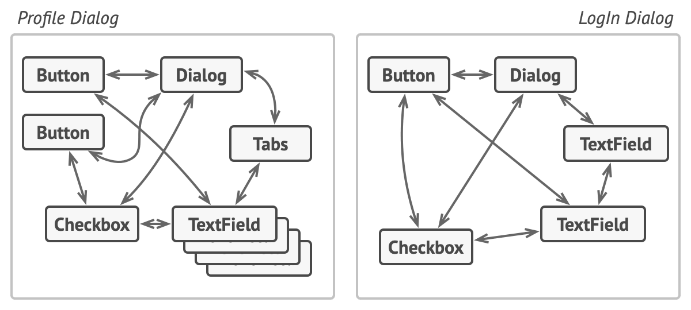
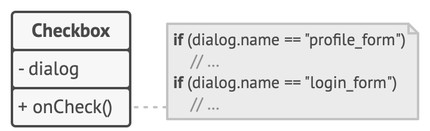
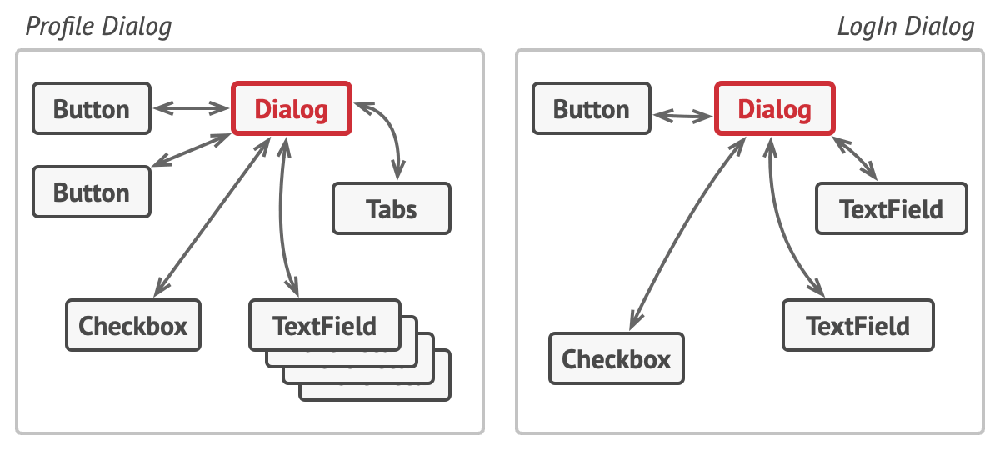
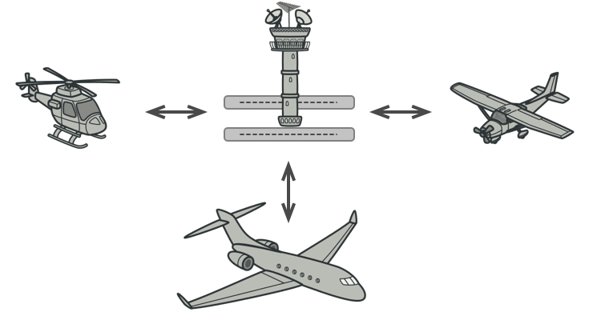
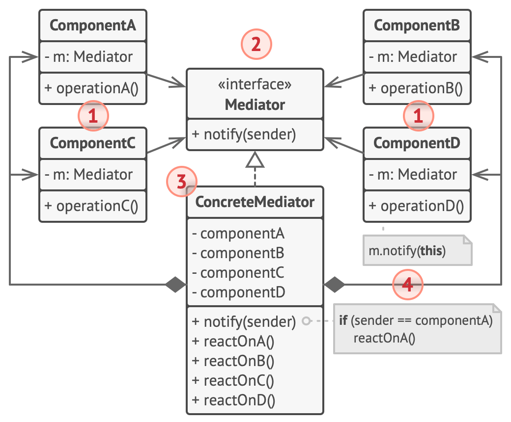
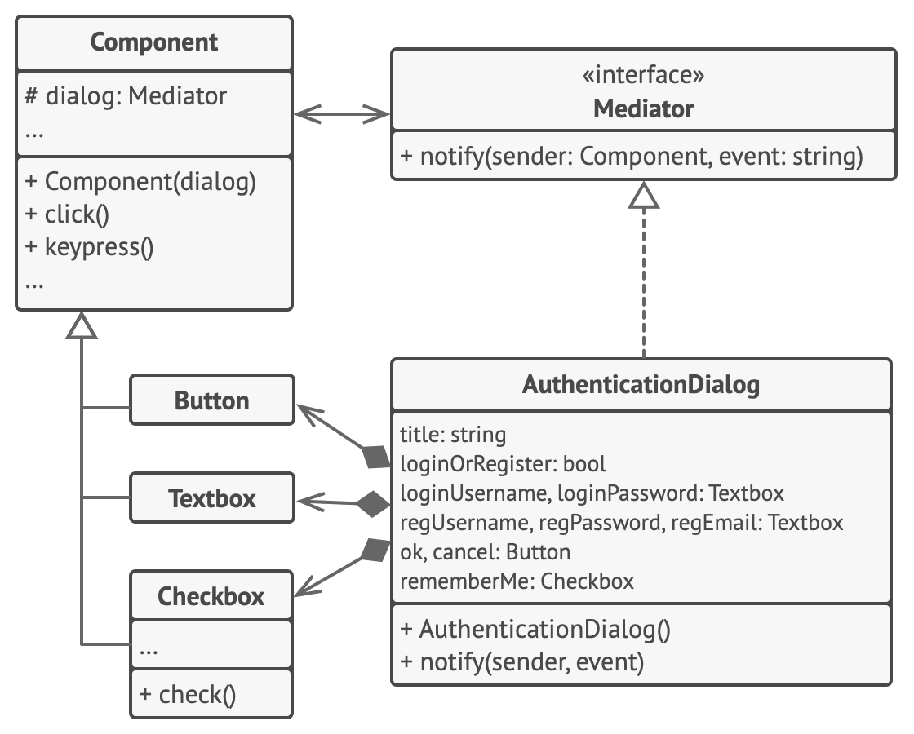

# Mediator


**Type:** Behavioral · **Also known as:** Intermediary, Controller

> **The 10-second version:** Stop objects from calling each other; make them all call one hub, and put every "when X happens, do Y" rule inside that hub.

<br clear="all">

## Quick card

| | |
|---|---|
| **Problem it solves** | N objects that each know about the other N-1. Every new object multiplies the wiring, and no single class can be lifted out and reused. |
| **Core move** | Cut all the peer-to-peer edges. Give every component one reference — to a `Mediator` interface — and move the *relationship logic* into a concrete mediator that holds references to everybody. |
| **You'll recognise it by** | A component whose only outward call is `mediator.notify(this, "something happened")`, and a hub class with a big dispatch on `(sender, event)`. |
| **Rating** | Complexity ★★☆ · Popularity ★★☆ |
| **Closest relatives** | Observer (dynamic subscriptions, no central rule-holder), Facade (simplifies a subsystem that still talks internally), Command (one-way sender→receiver), Chain of Responsibility (sequential hand-off). |
| **In your stack** | A `ListingEditor` view-model coordinating form controls in TS; `MediatR`'s `IMediator.Publish` / a hand-rolled domain coordinator in C#; a Unit-of-Work that sequences repository writes in one transaction for SQL; and a **RabbitMQ topic exchange**, which is Mediator at infrastructure scale — publishers and consumers never learn each other's names. |

### How to read this file

Technical first, plain English second. 🗣️ marks the plain-English version. Part 1 is Refactoring.Guru's material with their diagrams; Parts 2-7 are code, your stack, and the stuff that makes it stick.

---

# PART 1 — The pattern

## 1. Intent
**Mediator** is a behavioral design pattern that lets you reduce chaotic dependencies between objects. The pattern restricts direct communications between the objects and forces them to collaborate only via a mediator object.


### 🗣️ In plain words

Objects that all know about each other turn into a hairball. Mediator says: nobody talks to anybody. Everybody talks to *one* object in the middle, and that object knows who should react.

Each component keeps a single dependency — the mediator — instead of a dozen. The interesting knowledge ("when the condition dropdown flips to *New*, hide the odometer field and clear the certified checkbox") stops living scattered across five classes and moves into one readable place.

## 2. Problem
Say you have a dialog for creating and editing customer profiles. It consists of various form controls such as text fields, checkboxes, buttons, etc.



*Relations between elements of the user interface can become chaotic as the application evolves.*

Some of the form elements may interact with others. For instance, selecting the “I have a dog” checkbox may reveal a hidden text field for entering the dog’s name. Another example is the submit button that has to validate values of all fields before saving the data.



*Elements can have lots of relations with other elements. Hence, changes to some elements may affect the others.*

By having this logic implemented directly inside the code of the form elements you make these elements’ classes much harder to reuse in other forms of the app. For example, you won’t be able to use that checkbox class inside another form, because it’s coupled to the dog’s text field. You can use either all the classes involved in rendering the profile form, or none at all.
### 🗣️ In plain words

Picture the dealer-facing form where someone lists a car. It has a *condition* dropdown, an *odometer* field, a *certified pre-owned* checkbox, a *price* field with a "below market" hint, and a *Publish* button. The rules between them are real business rules, not cosmetics: new cars have no odometer reading, only used cars can be certified, and certification needs a mileage under the programme cap.

Written the obvious way, the rules end up *inside* the controls:

```ts
// ❌ Each control reaches into its neighbours.
class ConditionSelect {
  constructor(
    private odometer: OdometerField,      // 👈 knows the odometer
    private certified: CertifiedCheckbox, // 👈 knows the checkbox
    private price: PriceField,            // 👈 knows the price field
  ) {}

  onChange(value: 'new' | 'used') {
    this.odometer.setVisible(value === 'used');
    if (value === 'new') {
      this.certified.setChecked(false);
      this.certified.setEnabled(false);
    }
    this.price.recomputeHint(value);
  }
}
```

Three consequences, all painful:

1. **`ConditionSelect` is now unusable anywhere else.** Want the same dropdown on the bulk-upload screen, which has no certified checkbox? You can't — its constructor demands one.
2. **Every new field edits old classes.** Adding a "warranty months" field means touching the dropdown, the checkbox, *and* the button.
3. **Nobody can read the rules.** "What happens when condition changes?" requires opening five files and reconstructing the graph in your head.

## 3. Solution
The Mediator pattern suggests that you should cease all direct communication between the components which you want to make independent of each other. Instead, these components must collaborate indirectly, by calling a special mediator object that redirects the calls to appropriate components. As a result, the components depend only on a single mediator class instead of being coupled to dozens of their colleagues.

In our example with the profile editing form, the dialog class itself may act as the mediator. Most likely, the dialog class is already aware of all of its sub-elements, so you won’t even need to introduce new dependencies into this class.



*UI elements should communicate indirectly, via the mediator object.*

The most significant change happens to the actual form elements. Let’s consider the submit button. Previously, each time a user clicked the button, it had to validate the values of all individual form elements. Now its single job is to notify the dialog about the click. Upon receiving this notification, the dialog itself performs the validations or passes the task to the individual elements. Thus, instead of being tied to a dozen form elements, the button is only dependent on the dialog class.

You can go further and make the dependency even looser by extracting the common interface for all types of dialogs. The interface would declare the notification method which all form elements can use to notify the dialog about events happening to those elements. Thus, our submit button should now be able to work with any dialog that implements that interface.

This way, the Mediator pattern lets you encapsulate a complex web of relations between various objects inside a single mediator object. The fewer dependencies a class has, the easier it becomes to modify, extend or reuse that class.
### 🗣️ In plain words

The pattern is three mechanical moves:

1. **Sever the edges.** Delete every field in which one component holds another component. Replace all of them with a single field: `mediator: Mediator`.
2. **Reduce components to reporters.** A component's only outward call becomes `mediator.notify(this, "changed")`. It still owns its own state and its own rendering — it just stops deciding what that means for anyone else.
3. **Concentrate the rules.** The concrete mediator holds references to all components and implements one `notify(sender, event)` method containing every cross-component rule, as a flat, readable dispatch.

Optional fourth move: let the mediator *create* the components too, so the wiring has exactly one owner — at which point it starts to resemble a Facade or a Factory, which is fine.

> **The key insight:** the tangled relationships between objects are themselves a *thing* — a real, changeable, testable piece of logic. Mediator gives that thing a class of its own instead of smearing it across everybody's neighbours.

## 4. Real-world analogy


*Aircraft pilots don’t talk to each other directly when deciding who gets to land their plane next. All communication goes through the control tower.*

Pilots of aircraft that approach or depart the airport control area don’t communicate directly with each other. Instead, they speak to an air traffic controller, who sits in a tall tower somewhere near the airstrip. Without the air traffic controller, pilots would need to be aware of every plane in the vicinity of the airport, discussing landing priorities with a committee of dozens of other pilots. That would probably skyrocket the airplane crash statistics.

The tower doesn’t need to control the whole flight. It exists only to enforce constraints in the terminal area because the number of involved actors there might be overwhelming to a pilot.

### 🗣️ Two more of my own

**The wedding planner.** The florist does not phone the caterer, and the caterer does not phone the DJ. All of them phone the planner, who is the only person who knows that the cake has to arrive after the tables are set and before the speeches. Swap the planner for a different one and the same florist works at a completely different wedding, unchanged.

**The school group chat that became a WhatsApp admin.** Twenty parents each holding nineteen phone numbers is the "before" picture: one person changes their number and nineteen address books go stale. One class-rep who collects everything and forwards what's relevant is the "after": every parent holds exactly one number, and the rep is the only place the routing rules live. It is also the classic failure mode — the rep becomes a bottleneck who knows everything about everyone.

## 5. Structure


1. **Components** are various classes that contain some business logic. Each component has a reference to a mediator, declared with the type of the mediator interface. The component isn’t aware of the actual class of the mediator, so you can reuse the component in other programs by linking it to a different mediator.
2. The **Mediator** interface declares methods of communication with components, which usually include just a single notification method. Components may pass any context as arguments of this method, including their own objects, but only in such a way that no coupling occurs between a receiving component and the sender’s class.
3. **Concrete Mediators** encapsulate relations between various components. Concrete mediators often keep references to all components they manage and sometimes even manage their lifecycle.
4. Components must not be aware of other components. If something important happens within or to a component, it must only notify the mediator. When the mediator receives the notification, it can easily identify the sender, which might be just enough to decide what component should be triggered in return.

   From a component’s perspective, it all looks like a total black box. The sender doesn’t know who’ll end up handling its request, and the receiver doesn’t know who sent the request in the first place.
### 🗣️ Participants & roles — cheat table

| Role | What it is in code | Example from the site | Equivalent in reader's stack |
|---|---|---|---|
| **Mediator** (interface) | One method, usually `notify(sender, event)`. Deliberately tiny and generic so components stay portable. | `interface Mediator { notify(sender, event) }` | `IListingEditorMediator` in C#; a TS `interface Mediator`; `IMediator` from MediatR; conceptually, the AMQP exchange contract. |
| **Concrete Mediator** | Holds references to every component; implements all cross-component rules in one dispatch. | `AuthenticationDialog` | `ListingEditorViewModel` (TS), `DealCoordinator` (C#), a SignalR `Hub`, a RabbitMQ topic exchange. |
| **Component** (base) | Stores the mediator reference, exposes `notify`-shaped hooks. Knows *nothing* about siblings. | `class Component { field dialog: Mediator }` | A `FormControl` base class; a domain service that takes `IMediator` in its constructor. |
| **Concrete Components** | The actual leaves: buttons, fields, services. They own local state, and report events. | `Button`, `Textbox`, `Checkbox` | `ConditionSelect`, `OdometerField`, `CertifiedCheckbox`, `PublishButton`; on the backend: `PricingService`, `InventoryService`, `NotificationService`. |
| **Client** | Constructs the mediator, which constructs or receives the components. | Code that news up `AuthenticationDialog` | Your DI container registration, or a composition-root factory. |

### 🤝 Collaboration — who calls whom

```
BEFORE (no mediator) — 5 components, up to 10 edges

   ConditionSelect <-------> OdometerField
        |   \                   /   |
        |    \                 /    |
        |     \               /     |
   PriceField --\-----------/-- CertifiedCheckbox
        \        \         /        /
         \        \       /        /
          ----- PublishButton -----

AFTER (mediator) — 5 components, 5 edges

   ConditionSelect     OdometerField     CertifiedCheckbox
            \                |                /
             \               |               /
              v              v              v
            +---------------------------------+
            |      ListingEditorMediator      |
            |  notify(sender, event) { ... }  |
            +---------------------------------+
              ^              ^              ^
             /               |               \
   PriceField          PublishButton        StatusLabel

SEQUENCE — user flips condition to "new"

  User        ConditionSelect       Mediator          Odometer   Certified
   |                |                  |                 |          |
   |--select "new"->|                  |                 |          |
   |                |--notify(this,----|                 |          |
   |                |    "changed")    |                 |          |
   |                |                  |--setVisible(false)->|      |
   |                |                  |--setChecked(false)---------->|
   |                |                  |--setEnabled(false)---------->|
   |                |<--- returns -----|                 |          |
```

The one hop that matters is `notify(this, "changed")`. The component passes **itself** as the sender — that is how the mediator identifies who spoke without the sender needing to know who will listen. Everything downstream of that arrow is invisible to `ConditionSelect`, which is exactly the point.

## 6. Pseudocode (the website's example)
In this example, the **Mediator** pattern helps you eliminate mutual dependencies between various UI classes: buttons, checkboxes and text labels.



*Structure of the UI dialog classes.*

An element, triggered by a user, doesn’t communicate with other elements directly, even if it looks like it’s supposed to. Instead, the element only needs to let its mediator know about the event, passing any contextual info along with that notification.

In this example, the whole authentication dialog acts as the mediator. It knows how concrete elements are supposed to collaborate and facilitates their indirect communication. Upon receiving a notification about an event, the dialog decides what element should address the event and redirects the call accordingly.

```
// The mediator interface declares a method used by components
// to notify the mediator about various events. The mediator may
// react to these events and pass the execution to other
// components.
interface Mediator is
    method notify(sender: Component, event: string)

// The concrete mediator class. The intertwined web of
// connections between individual components has been untangled
// and moved into the mediator.
class AuthenticationDialog implements Mediator is
    private field title: string
    private field loginOrRegisterChkBx: Checkbox
    private field loginUsername, loginPassword: Textbox
    private field registrationUsername, registrationPassword,
                  registrationEmail: Textbox
    private field okBtn, cancelBtn: Button

    constructor AuthenticationDialog() is
        // Create all component objects by passing the current
        // mediator into their constructors to establish links.

    // When something happens with a component, it notifies the
    // mediator. Upon receiving a notification, the mediator may
    // do something on its own or pass the request to another
    // component.
    method notify(sender, event) is
        if (sender == loginOrRegisterChkBx and event == "check")
            if (loginOrRegisterChkBx.checked)
                title = "Log in"
                // 1. Show login form components.
                // 2. Hide registration form components.
            else
                title = "Register"
                // 1. Show registration form components.
                // 2. Hide login form components

        if (sender == okBtn && event == "click")
            if (loginOrRegister.checked)
                // Try to find a user using login credentials.
                if (!found)
                    // Show an error message above the login
                    // field.
            else
                // 1. Create a user account using data from the
                // registration fields.
                // 2. Log that user in.
                // ...

// Components communicate with a mediator using the mediator
// interface. Thanks to that, you can use the same components in
// other contexts by linking them with different mediator
// objects.
class Component is
    field dialog: Mediator

    constructor Component(dialog) is
        this.dialog = dialog

    method click() is
        dialog.notify(this, "click")

    method keypress() is
        dialog.notify(this, "keypress")

// Concrete components don't talk to each other. They have only
// one communication channel, which is sending notifications to
// the mediator.
class Button extends Component is
    // ...

class Textbox extends Component is
    // ...

class Checkbox extends Component is
    method check() is
        dialog.notify(this, "check")
    // ...
```
### 🗣️ Reading that pseudocode

- `interface Mediator is method notify(sender: Component, event: string)` — the whole contract is **one method with two parameters**. Resist the urge to add `notifyButtonClicked`, `notifyCheckboxToggled`, etc.; the generic shape is what keeps components reusable.
- `class AuthenticationDialog implements Mediator` holds *fields for every component* (`loginOrRegisterChkBx`, `okBtn`, the textboxes). The mediator is allowed to be coupled to everything — that is its job. The components are not.
- The constructor comment, *"Create all component objects by passing the current mediator into their constructors"*, is the wiring step. The mediator hands `this` down, so the link is established exactly once, in one place.
- Inside `notify`, every branch is `if (sender == X and event == "Y")`. That flat dispatch *is* the untangled dependency graph — the edges from the "before" diagram, rewritten as data you can read top to bottom.
- `class Component` has one field: `field dialog: Mediator`. Not `Checkbox`, not `AuthenticationDialog` — the interface. That is what lets the same `Button` class be dropped into a completely different dialog.
- `Checkbox.check()` calls `dialog.notify(this, "check")` and then stops. It does **not** show or hide anything itself. A component that tries to be helpful and also nudge a sibling has quietly re-created the hairball.

## 7. Applicability — when to reach for it
**Use the Mediator pattern when it’s hard to change some of the classes because they are tightly coupled to a bunch of other classes.**

The pattern lets you extract all the relationships between classes into a separate class, isolating any changes to a specific component from the rest of the components.

**Use the pattern when you can’t reuse a component in a different program because it’s too dependent on other components.**

After you apply the Mediator, individual components become unaware of the other components. They could still communicate with each other, albeit indirectly, through a mediator object. To reuse a component in a different app, you need to provide it with a new mediator class.

**Use the Mediator when you find yourself creating tons of component subclasses just to reuse some basic behavior in various contexts.**

Since all relations between components are contained within the mediator, it’s easy to define entirely new ways for these components to collaborate by introducing new mediator classes, without having to change the components themselves.
### ✅ Quick checklist

- [ ] Do two or more classes hold **direct references to each other** purely to keep each other in sync?
- [ ] When you add one new participant, do you have to **edit several existing** ones?
- [ ] Is there a class you'd like to reuse elsewhere but **can't**, because its constructor demands its current siblings?
- [ ] Would a newcomer have to open 4+ files to answer *"what happens when this changes?"*
- [ ] Do you have **many-to-many** interaction (not just fan-out, which is Observer's job)?
- [ ] Is the coordination logic itself something you'd like to **unit-test in isolation**, with all components faked?

Four or more ticks: reach for it. One or two: you probably just want a callback or an event.

## 8. How to implement — step by step
1. Identify a group of tightly coupled classes which would benefit from being more independent (e.g., for easier maintenance or simpler reuse of these classes).
2. Declare the mediator interface and describe the desired communication protocol between mediators and various components. In most cases, a single method for receiving notifications from components is sufficient.

   This interface is crucial when you want to reuse component classes in different contexts. As long as the component works with its mediator via the generic interface, you can link the component with a different implementation of the mediator.
3. Implement the concrete mediator class. Consider storing references to all components inside the mediator. This way, you could call any component from the mediator’s methods.
4. You can go even further and make the mediator responsible for the creation and destruction of component objects. After this, the mediator may resemble a [factory](https://refactoring.guru/design-patterns/abstract-factory) or a [facade](https://refactoring.guru/design-patterns/facade).
5. Components should store a reference to the mediator object. The connection is usually established in the component’s constructor, where a mediator object is passed as an argument.
6. Change the components’ code so that they call the mediator’s notification method instead of methods on other components. Extract the code that involves calling other components into the mediator class. Execute this code whenever the mediator receives notifications from that component.
### 🗣️ The same steps, blunt version

1. **List the tangle.** Write down every `A -> B` reference that exists only for coordination.
2. **Declare `interface Mediator { notify(sender, event) }`.** One method. Two parameters. Stop.
3. **Write the concrete mediator.** Give it a field per component and a single `notify` with one branch per rule from step 1.
4. *(Optional)* **Let the mediator build the components.** One owner for the wiring; it now smells a bit like a Facade or a Factory, and that's allowed.
5. **Put `mediator` in each component's constructor.** Store it. That is the component's only outward dependency.
6. **Delete the sibling calls.** Every `this.otherThing.doSomething()` becomes `this.mediator.notify(this, "whatHappened")`, and the deleted body moves into the matching branch of `notify`.

## 9. Pros and cons
- ✅ *Single Responsibility Principle*. You can extract the communications between various components into a single place, making it easier to comprehend and maintain.
- ✅ *Open/Closed Principle*. You can introduce new mediators without having to change the actual components.
- ✅ You can reduce coupling between various components of a program.
- ✅ You can reuse individual components more easily.

- ⛔ Over time a mediator can evolve into a [God Object](https://refactoring.guru/antipatterns/god-object).
### ⚖️ Honest trade-offs from the trenches

**The real cost is indirection at debugging time.** "Go to definition" used to land you on the code that runs; now it lands on `notify(sender, event)` and you have to read a dispatch to find the branch. That cost is paid every single time anyone debugs, forever. The benefit — one place to read the rules — is paid back only when the rules actually change. So the honest test is: *do these relationships change often enough to be worth a permanent tax on tracing?* For a form with five fields and rules that have been stable for two years, no. For an order/deal workflow that product keeps re-negotiating, absolutely yes.

**The tell that it's worth it** is when you catch yourself adding a constructor parameter to class A only so it can poke class B. Do that twice and the graph is already quadratic; a mediator pays for itself the third time. The other tell is testability: a good mediator can be unit-tested with every component replaced by a fake, which means you can assert the *rules* without touching the UI, the database, or the broker.

**The God Object warning on the site is not theoretical.** Every mediator I've seen decay did so the same way: somebody put *business* logic into the hub instead of only *coordination* logic. The discipline is that the mediator decides **who reacts to what** and nothing else — pricing math stays in the pricing component, validation stays in the field. When the mediator starts computing rather than routing, split it: one mediator per cohesive cluster (`ListingEditorMediator`, `PhotoUploadMediator`) rather than one `AppMediator`.

**Modern C#/TS give you a lot of this for free — take it.** In C#, `MediatR`'s `IMediator.Publish` plus `INotificationHandler<T>` is a ready-made mediator with DI-resolved participants (though it's a *dispatcher* flavour — see §10). Plain C# `event` + a coordinating subscriber gets you 80% of it with zero dependencies. In TS, an RxJS `Subject` or a Redux store already centralises "what happens when" — a Redux reducer is literally `notify(sender=action.type, event=payload)` with the rules in one switch. And every DI container is itself an argument for Mediator: it will happily inject `IMediator` into ten components without any of them learning each other's types. Hand-roll only when you need the mediator to *own* component lifecycle or state, which is the case a generic bus does not cover.

## 10. Relations with other patterns
- [Chain of Responsibility](https://refactoring.guru/design-patterns/chain-of-responsibility), [Command](https://refactoring.guru/design-patterns/command), [Mediator](https://refactoring.guru/design-patterns/mediator) and [Observer](https://refactoring.guru/design-patterns/observer) address various ways of connecting senders and receivers of requests:

  - *Chain of Responsibility* passes a request sequentially along a dynamic chain of potential receivers until one of them handles it.
  - *Command* establishes unidirectional connections between senders and receivers.
  - *Mediator* eliminates direct connections between senders and receivers, forcing them to communicate indirectly via a mediator object.
  - *Observer* lets receivers dynamically subscribe to and unsubscribe from receiving requests.
- [Facade](https://refactoring.guru/design-patterns/facade) and [Mediator](https://refactoring.guru/design-patterns/mediator) have similar jobs: they try to organize collaboration between lots of tightly coupled classes.

  - *Facade* defines a simplified interface to a subsystem of objects, but it doesn’t introduce any new functionality. The subsystem itself is unaware of the facade. Objects within the subsystem can communicate directly.
  - *Mediator* centralizes communication between components of the system. The components only know about the mediator object and don’t communicate directly.
- The difference between [Mediator](https://refactoring.guru/design-patterns/mediator) and [Observer](https://refactoring.guru/design-patterns/observer) is often elusive. In most cases, you can implement either of these patterns; but sometimes you can apply both simultaneously. Let’s see how we can do that.

  The primary goal of *Mediator* is to eliminate mutual dependencies among a set of system components. Instead, these components become dependent on a single mediator object. The goal of *Observer* is to establish dynamic one-way connections between objects, where some objects act as subordinates of others.

  There’s a popular implementation of the *Mediator* pattern that relies on *Observer*. The mediator object plays the role of publisher, and the components act as subscribers which subscribe to and unsubscribe from the mediator’s events. When *Mediator* is implemented this way, it may look very similar to *Observer*.

  When you’re confused, remember that you can implement the Mediator pattern in other ways. For example, you can permanently link all the components to the same mediator object. This implementation won’t resemble *Observer* but will still be an instance of the Mediator pattern.

  Now imagine a program where all components have become publishers, allowing dynamic connections between each other. There won’t be a centralized mediator object, only a distributed set of observers.
### 🗣️ Disambiguation table

| Pattern | Direction of knowledge | Where the rules live | One-line separator |
|---|---|---|---|
| **Mediator** | Components → hub (and hub → components). Components know *nothing* about each other. | Centralised, in the hub. | *"I don't know who cares — the middle does."* |
| **Observer** | Subject → subscribers, one way. Subscribers know the subject's event; the subject knows nothing about them. | Distributed: each subscriber decides how to react. | *"I announce; whoever signed up reacts however they like."* |
| **Facade** | Client → facade → subsystem. The subsystem does **not** know the facade exists, and its parts still call each other. | Nowhere new — Facade adds no behaviour, only a simpler door. | *"I simplify the entrance; the rooms still talk among themselves."* |
| **Command** | Sender → command object → one receiver. Unidirectional and pre-bound. | In the command, as an encapsulated request. | *"I package one request for one receiver."* |
| **Chain of Responsibility** | Sender → handler → next handler, sequentially until someone handles it. | Distributed along the chain's `CanHandle`. | *"Pass it along until somebody takes it."* |

**The Mediator-vs-Observer question is the one you'll be asked.** The clean answer: *Observer is about **notification** (one-to-many, subscribers opt in dynamically); Mediator is about **coordination** (many-to-many, the hub decides who reacts).* They routinely appear together — the most common real implementation of Mediator uses Observer as its transport, with the hub as publisher and components as subscribers. The site says this outright, and it's why people confuse them.

**Facade vs Mediator, memorably:** *a Facade is a receptionist for a department that already works fine internally; a Mediator is the only reason the department works at all.*

---

# PART 2 — Official code examples from Refactoring.Guru

## 2.1 C#
**Complexity:** ★★☆ (2/3)

**Popularity:** ★★☆ (2/3)

**Usage examples:** The most popular usage of the Mediator pattern in C# code is facilitating communications between GUI components of an app. The synonym of the Mediator is the Controller part of MVC pattern.
### Conceptual Example

This example illustrates the structure of the **Mediator** design pattern. It focuses on answering these questions:

- What classes does it consist of?
- What roles do these classes play?
- In what way the elements of the pattern are related?

##### **Program.cs:** Conceptual example

```csharp
using System;

namespace RefactoringGuru.DesignPatterns.Mediator.Conceptual
{
    // The Mediator interface declares a method used by components to notify the
    // mediator about various events. The Mediator may react to these events and
    // pass the execution to other components.
    public interface IMediator
    {
        void Notify(object sender, string ev);
    }

    // Concrete Mediators implement cooperative behavior by coordinating several
    // components.
    class ConcreteMediator : IMediator
    {
        private Component1 _component1;

        private Component2 _component2;

        public ConcreteMediator(Component1 component1, Component2 component2)
        {
            this._component1 = component1;
            this._component1.SetMediator(this);
            this._component2 = component2;
            this._component2.SetMediator(this);
        }

        public void Notify(object sender, string ev)
        {
            if (ev == "A")
            {
                Console.WriteLine("Mediator reacts on A and triggers following operations:");
                this._component2.DoC();
            }
            if (ev == "D")
            {
                Console.WriteLine("Mediator reacts on D and triggers following operations:");
                this._component1.DoB();
                this._component2.DoC();
            }
        }
    }

    // The Base Component provides the basic functionality of storing a
    // mediator's instance inside component objects.
    class BaseComponent
    {
        protected IMediator _mediator;

        public BaseComponent(IMediator mediator = null)
        {
            this._mediator = mediator;
        }

        public void SetMediator(IMediator mediator)
        {
            this._mediator = mediator;
        }
    }

    // Concrete Components implement various functionality. They don't depend on
    // other components. They also don't depend on any concrete mediator
    // classes.
    class Component1 : BaseComponent
    {
        public void DoA()
        {
            Console.WriteLine("Component 1 does A.");

            this._mediator.Notify(this, "A");
        }

        public void DoB()
        {
            Console.WriteLine("Component 1 does B.");

            this._mediator.Notify(this, "B");
        }
    }

    class Component2 : BaseComponent
    {
        public void DoC()
        {
            Console.WriteLine("Component 2 does C.");

            this._mediator.Notify(this, "C");
        }

        public void DoD()
        {
            Console.WriteLine("Component 2 does D.");

            this._mediator.Notify(this, "D");
        }
    }

    class Program
    {
        static void Main(string[] args)
        {
            // The client code.
            Component1 component1 = new Component1();
            Component2 component2 = new Component2();
            new ConcreteMediator(component1, component2);

            Console.WriteLine("Client triggers operation A.");
            component1.DoA();

            Console.WriteLine();

            Console.WriteLine("Client triggers operation D.");
            component2.DoD();
        }
    }
}
```

##### **Output.txt:** Execution result

```output
Client triggers operation A.
Component 1 does A.
Mediator reacts on A and triggers following operations:
Component 2 does C.

Client triggers operation D.
Component 2 does D.
Mediator reacts on D and triggers following operations:
Component 1 does B.
Component 2 does C.
```

## 2.2 TypeScript
**Complexity:** ★★☆ (2/3)

**Popularity:** ☆☆☆ (0/3)

**Usage examples:** The most popular usage of the Mediator pattern in TypeScript code is facilitating communications between GUI components of an app. The synonym of the Mediator is the Controller part of MVC pattern.
### Conceptual Example

This example illustrates the structure of the **Mediator** design pattern and focuses on the following questions:

- What classes does it consist of?
- What roles do these classes play?
- In what way the elements of the pattern are related?

##### **index.ts:** Conceptual example

```typescript
/**
 * The Mediator interface declares a method used by components to notify the
 * mediator about various events. The Mediator may react to these events and
 * pass the execution to other components.
 */
interface Mediator {
    notify(sender: object, event: string): void;
}

/**
 * Concrete Mediators implement cooperative behavior by coordinating several
 * components.
 */
class ConcreteMediator implements Mediator {
    private component1: Component1;

    private component2: Component2;

    constructor(c1: Component1, c2: Component2) {
        this.component1 = c1;
        this.component1.setMediator(this);
        this.component2 = c2;
        this.component2.setMediator(this);
    }

    public notify(sender: object, event: string): void {
        if (event === 'A') {
            console.log('Mediator reacts on A and triggers following operations:');
            this.component2.doC();
        }

        if (event === 'D') {
            console.log('Mediator reacts on D and triggers following operations:');
            this.component1.doB();
            this.component2.doC();
        }
    }
}

/**
 * The Base Component provides the basic functionality of storing a mediator's
 * instance inside component objects.
 */
class BaseComponent {
    protected mediator: Mediator;

    constructor(mediator?: Mediator) {
        this.mediator = mediator!;
    }

    public setMediator(mediator: Mediator): void {
        this.mediator = mediator;
    }
}

/**
 * Concrete Components implement various functionality. They don't depend on
 * other components. They also don't depend on any concrete mediator classes.
 */
class Component1 extends BaseComponent {
    public doA(): void {
        console.log('Component 1 does A.');
        this.mediator.notify(this, 'A');
    }

    public doB(): void {
        console.log('Component 1 does B.');
        this.mediator.notify(this, 'B');
    }
}

class Component2 extends BaseComponent {
    public doC(): void {
        console.log('Component 2 does C.');
        this.mediator.notify(this, 'C');
    }

    public doD(): void {
        console.log('Component 2 does D.');
        this.mediator.notify(this, 'D');
    }
}

/**
 * The client code.
 */
const c1 = new Component1();
const c2 = new Component2();
const mediator = new ConcreteMediator(c1, c2);

console.log('Client triggers operation A.');
c1.doA();

console.log('');
console.log('Client triggers operation D.');
c2.doD();
```

##### **Output.txt:** Execution result

```output
Client triggers operation A.
Component 1 does A.
Mediator reacts on A and triggers following operations:
Component 2 does C.

Client triggers operation D.
Component 2 does D.
Mediator reacts on D and triggers following operations:
Component 1 does B.
Component 2 does C.
```

## 2.3 C++
**Complexity:** ★★☆ (2/3)

**Popularity:** ★★☆ (2/3)

**Usage examples:** The most popular usage of the Mediator pattern in C++ code is facilitating communications between GUI components of an app. The synonym of the Mediator is the Controller part of MVC pattern.
### Conceptual Example

This example illustrates the structure of the **Mediator** design pattern. It focuses on answering these questions:

- What classes does it consist of?
- What roles do these classes play?
- In what way the elements of the pattern are related?

##### **main.cc:** Conceptual example

```cpp
#include <iostream>
#include <string>
/**
 * The Mediator interface declares a method used by components to notify the
 * mediator about various events. The Mediator may react to these events and
 * pass the execution to other components.
 */
class BaseComponent;
class Mediator {
 public:
  virtual void Notify(BaseComponent *sender, std::string event) const = 0;
};

/**
 * The Base Component provides the basic functionality of storing a mediator's
 * instance inside component objects.
 */
class BaseComponent {
 protected:
  Mediator *mediator_;

 public:
  BaseComponent(Mediator *mediator = nullptr) : mediator_(mediator) {
  }
  void set_mediator(Mediator *mediator) {
    this->mediator_ = mediator;
  }
};

/**
 * Concrete Components implement various functionality. They don't depend on
 * other components. They also don't depend on any concrete mediator classes.
 */
class Component1 : public BaseComponent {
 public:
  void DoA() {
    std::cout << "Component 1 does A.\n";
    this->mediator_->Notify(this, "A");
  }
  void DoB() {
    std::cout << "Component 1 does B.\n";
    this->mediator_->Notify(this, "B");
  }
};

class Component2 : public BaseComponent {
 public:
  void DoC() {
    std::cout << "Component 2 does C.\n";
    this->mediator_->Notify(this, "C");
  }
  void DoD() {
    std::cout << "Component 2 does D.\n";
    this->mediator_->Notify(this, "D");
  }
};

/**
 * Concrete Mediators implement cooperative behavior by coordinating several
 * components.
 */
class ConcreteMediator : public Mediator {
 private:
  Component1 *component1_;
  Component2 *component2_;

 public:
  ConcreteMediator(Component1 *c1, Component2 *c2) : component1_(c1), component2_(c2) {
    this->component1_->set_mediator(this);
    this->component2_->set_mediator(this);
  }
  void Notify(BaseComponent *sender, std::string event) const override {
    if (event == "A") {
      std::cout << "Mediator reacts on A and triggers following operations:\n";
      this->component2_->DoC();
    }
    if (event == "D") {
      std::cout << "Mediator reacts on D and triggers following operations:\n";
      this->component1_->DoB();
      this->component2_->DoC();
    }
  }
};

/**
 * The client code.
 */

void ClientCode() {
  Component1 *c1 = new Component1;
  Component2 *c2 = new Component2;
  ConcreteMediator *mediator = new ConcreteMediator(c1, c2);
  std::cout << "Client triggers operation A.\n";
  c1->DoA();
  std::cout << "\n";
  std::cout << "Client triggers operation D.\n";
  c2->DoD();

  delete c1;
  delete c2;
  delete mediator;
}

int main() {
  ClientCode();
  return 0;
}
```

##### **Output.txt:** Execution result

```output
Client triggers operation A.
Component 1 does A.
Mediator reacts on A and triggers following operations:
Component 2 does C.

Client triggers operation D.
Component 2 does D.
Mediator reacts on D and triggers following operations:
Component 1 does B.
Component 2 does C.
```

## 2.4 Java
**Complexity:** ★★☆ (2/3)

**Popularity:** ★★☆ (2/3)

**Usage examples:** The most popular usage of the Mediator pattern in Java code is facilitating communications between GUI components of an app. The synonym of the Mediator is the Controller part of MVC pattern.
### Notes app

This example shows how to organize lots of GUI elements so that they cooperate with the help of a mediator but don’t depend on each other.

#### **components:** Colleague classes

##### **components/Component.java**

```java
package refactoring_guru.mediator.example.components;

import refactoring_guru.mediator.example.mediator.Mediator;

/**
 * Common component interface.
 */
public interface Component {
    void setMediator(Mediator mediator);
    String getName();
}
```

##### **components/AddButton.java**

```java
package refactoring_guru.mediator.example.components;

import refactoring_guru.mediator.example.mediator.Mediator;
import refactoring_guru.mediator.example.mediator.Note;

import javax.swing.*;
import java.awt.event.ActionEvent;

/**
 * Concrete components don't talk with each other. They have only one
 * communication channel–sending requests to the mediator.
 */
public class AddButton extends JButton implements Component {
    private Mediator mediator;

    public AddButton() {
        super("Add");
    }

    @Override
    public void setMediator(Mediator mediator) {
        this.mediator = mediator;
    }

    @Override
    protected void fireActionPerformed(ActionEvent actionEvent) {
        mediator.addNewNote(new Note());
    }

    @Override
    public String getName() {
        return "AddButton";
    }
}
```

##### **components/DeleteButton.java**

```java
package refactoring_guru.mediator.example.components;

import refactoring_guru.mediator.example.mediator.Mediator;

import javax.swing.*;
import java.awt.event.ActionEvent;

/**
 * Concrete components don't talk with each other. They have only one
 * communication channel–sending requests to the mediator.
 */
public class DeleteButton extends JButton  implements Component {
    private Mediator mediator;

    public DeleteButton() {
        super("Del");
    }

    @Override
    public void setMediator(Mediator mediator) {
        this.mediator = mediator;
    }

    @Override
    protected void fireActionPerformed(ActionEvent actionEvent) {
        mediator.deleteNote();
    }

    @Override
    public String getName() {
        return "DelButton";
    }
}
```

##### **components/Filter.java**

```java
package refactoring_guru.mediator.example.components;

import refactoring_guru.mediator.example.mediator.Mediator;
import refactoring_guru.mediator.example.mediator.Note;

import javax.swing.*;
import java.awt.event.KeyEvent;
import java.util.ArrayList;

/**
 * Concrete components don't talk with each other. They have only one
 * communication channel–sending requests to the mediator.
 */
public class Filter extends JTextField implements Component {
    private Mediator mediator;
    private ListModel listModel;

    public Filter() {}

    @Override
    public void setMediator(Mediator mediator) {
        this.mediator = mediator;
    }

    @Override
    protected void processComponentKeyEvent(KeyEvent keyEvent) {
        String start = getText();
        searchElements(start);
    }

    public void setList(ListModel listModel) {
        this.listModel = listModel;
    }

    private void searchElements(String s) {
        if (listModel == null) {
            return;
        }

        if (s.equals("")) {
            mediator.setElementsList(listModel);
            return;
        }

        ArrayList<Note> notes = new ArrayList<>();
        for (int i = 0; i < listModel.getSize(); i++) {
            notes.add((Note) listModel.getElementAt(i));
        }
        DefaultListModel<Note> listModel = new DefaultListModel<>();
        for (Note note : notes) {
            if (note.getName().contains(s)) {
                listModel.addElement(note);
            }
        }
        mediator.setElementsList(listModel);
    }

    @Override
    public String getName() {
        return "Filter";
    }
}
```

##### **components/List.java**

```java
package refactoring_guru.mediator.example.components;

import refactoring_guru.mediator.example.mediator.Mediator;
import refactoring_guru.mediator.example.mediator.Note;

import javax.swing.*;

/**
 * Concrete components don't talk with each other. They have only one
 * communication channel–sending requests to the mediator.
 */
@SuppressWarnings("unchecked")
public class List extends JList implements Component {
    private Mediator mediator;
    private final DefaultListModel LIST_MODEL;

    public List(DefaultListModel listModel) {
        super(listModel);
        this.LIST_MODEL = listModel;
        setModel(listModel);
        this.setLayoutOrientation(JList.VERTICAL);
        Thread thread = new Thread(new Hide(this));
        thread.start();
    }

    @Override
    public void setMediator(Mediator mediator) {
        this.mediator = mediator;
    }

    public void addElement(Note note) {
        LIST_MODEL.addElement(note);
        int index = LIST_MODEL.size() - 1;
        setSelectedIndex(index);
        ensureIndexIsVisible(index);
        mediator.sendToFilter(LIST_MODEL);
    }

    public void deleteElement() {
        int index = this.getSelectedIndex();
        try {
            LIST_MODEL.remove(index);
            mediator.sendToFilter(LIST_MODEL);
        } catch (ArrayIndexOutOfBoundsException ignored) {}
    }

    public Note getCurrentElement() {
        return (Note)getSelectedValue();
    }

    @Override
    public String getName() {
        return "List";
    }

    private class Hide implements Runnable {
        private List list;

        Hide(List list) {
            this.list = list;
        }

        @Override
        public void run() {
            while (true) {
                try {
                    Thread.sleep(300);
                } catch (InterruptedException ex) {
                    ex.printStackTrace();
                }
                if (list.isSelectionEmpty()) {
                    mediator.hideElements(true);
                } else {
                    mediator.hideElements(false);
                }
            }
        }
    }
}
```

##### **components/SaveButton.java**

```java
package refactoring_guru.mediator.example.components;

import refactoring_guru.mediator.example.mediator.Mediator;

import javax.swing.*;
import java.awt.event.ActionEvent;

/**
 * Concrete components don't talk with each other. They have only one
 * communication channel–sending requests to the mediator.
 */
public class SaveButton extends JButton implements Component {
    private Mediator mediator;

    public SaveButton() {
        super("Save");
    }

    @Override
    public void setMediator(Mediator mediator) {
        this.mediator = mediator;
    }

    @Override
    protected void fireActionPerformed(ActionEvent actionEvent) {
        mediator.saveChanges();
    }

    @Override
    public String getName() {
        return "SaveButton";
    }
}
```

##### **components/TextBox.java**

```java
package refactoring_guru.mediator.example.components;

import refactoring_guru.mediator.example.mediator.Mediator;

import javax.swing.*;
import java.awt.event.KeyEvent;

/**
 * Concrete components don't talk with each other. They have only one
 * communication channel–sending requests to the mediator.
 */
public class TextBox extends JTextArea implements Component {
    private Mediator mediator;

    @Override
    public void setMediator(Mediator mediator) {
        this.mediator = mediator;
    }

    @Override
    protected void processComponentKeyEvent(KeyEvent keyEvent) {
        mediator.markNote();
    }

    @Override
    public String getName() {
        return "TextBox";
    }
}
```

##### **components/Title.java**

```java
package refactoring_guru.mediator.example.components;

import refactoring_guru.mediator.example.mediator.Mediator;

import javax.swing.*;
import java.awt.event.KeyEvent;

/**
 * Concrete components don't talk with each other. They have only one
 * communication channel–sending requests to the mediator.
 */
public class Title extends JTextField implements Component {
    private Mediator mediator;

    @Override
    public void setMediator(Mediator mediator) {
        this.mediator = mediator;
    }

    @Override
    protected void processComponentKeyEvent(KeyEvent keyEvent) {
        mediator.markNote();
    }

    @Override
    public String getName() {
        return "Title";
    }
}
```

#### **mediator**

##### **mediator/Mediator.java:** Defines common mediator interface

```java
package refactoring_guru.mediator.example.mediator;

import refactoring_guru.mediator.example.components.Component;

import javax.swing.*;

/**
 * Common mediator interface.
 */
public interface Mediator {
    void addNewNote(Note note);
    void deleteNote();
    void getInfoFromList(Note note);
    void saveChanges();
    void markNote();
    void clear();
    void sendToFilter(ListModel listModel);
    void setElementsList(ListModel list);
    void registerComponent(Component component);
    void hideElements(boolean flag);
    void createGUI();
}
```

##### **mediator/Editor.java:** Concrete mediator

```java
package refactoring_guru.mediator.example.mediator;

import refactoring_guru.mediator.example.components.*;
import refactoring_guru.mediator.example.components.Component;
import refactoring_guru.mediator.example.components.List;

import javax.swing.*;
import javax.swing.border.LineBorder;
import java.awt.*;

/**
 * Concrete mediator. All chaotic communications between concrete components
 * have been extracted to the mediator. Now components only talk with the
 * mediator, which knows who has to handle a request.
 */
public class Editor implements Mediator {
    private Title title;
    private TextBox textBox;
    private AddButton add;
    private DeleteButton del;
    private SaveButton save;
    private List list;
    private Filter filter;

    private JLabel titleLabel = new JLabel("Title:");
    private JLabel textLabel = new JLabel("Text:");
    private JLabel label = new JLabel("Add or select existing note to proceed...");

    /**
     * Here the registration of components by the mediator.
     */
    @Override
    public void registerComponent(Component component) {
        component.setMediator(this);
        switch (component.getName()) {
            case "AddButton":
                add = (AddButton)component;
                break;
            case "DelButton":
                del = (DeleteButton)component;
                break;
            case "Filter":
                filter = (Filter)component;
                break;
            case "List":
                list = (List)component;
                this.list.addListSelectionListener(listSelectionEvent -> {
                    Note note = (Note)list.getSelectedValue();
                    if (note != null) {
                        getInfoFromList(note);
                    } else {
                        clear();
                    }
                });
                break;
            case "SaveButton":
                save = (SaveButton)component;
                break;
            case "TextBox":
                textBox = (TextBox)component;
                break;
            case "Title":
                title = (Title)component;
                break;
        }
    }

    /**
     * Various methods to handle requests from particular components.
     */
    @Override
    public void addNewNote(Note note) {
        title.setText("");
        textBox.setText("");
        list.addElement(note);
    }

    @Override
    public void deleteNote() {
        list.deleteElement();
    }

    @Override
    public void getInfoFromList(Note note) {
        title.setText(note.getName().replace('*', ' '));
        textBox.setText(note.getText());
    }

    @Override
    public void saveChanges() {
        try {
            Note note = (Note) list.getSelectedValue();
            note.setName(title.getText());
            note.setText(textBox.getText());
            list.repaint();
        } catch (NullPointerException ignored) {}
    }

    @Override
    public void markNote() {
        try {
            Note note = list.getCurrentElement();
            String name = note.getName();
            if (!name.endsWith("*")) {
                note.setName(note.getName() + "*");
            }
            list.repaint();
        } catch (NullPointerException ignored) {}
    }

    @Override
    public void clear() {
        title.setText("");
        textBox.setText("");
    }

    @Override
    public void sendToFilter(ListModel listModel) {
        filter.setList(listModel);
    }

    @SuppressWarnings("unchecked")
    @Override
    public void setElementsList(ListModel list) {
        this.list.setModel(list);
        this.list.repaint();
    }

    @Override
    public void hideElements(boolean flag) {
        titleLabel.setVisible(!flag);
        textLabel.setVisible(!flag);
        title.setVisible(!flag);
        textBox.setVisible(!flag);
        save.setVisible(!flag);
        label.setVisible(flag);
    }

    @Override
    public void createGUI() {
        JFrame notes = new JFrame("Notes");
        notes.setSize(960, 600);
        notes.setDefaultCloseOperation(WindowConstants.EXIT_ON_CLOSE);
        JPanel left = new JPanel();
        left.setBorder(new LineBorder(Color.BLACK));
        left.setSize(320, 600);
        left.setLayout(new BoxLayout(left, BoxLayout.Y_AXIS));
        JPanel filterPanel = new JPanel();
        filterPanel.add(new JLabel("Filter:"));
        filter.setColumns(20);
        filterPanel.add(filter);
        filterPanel.setPreferredSize(new Dimension(280, 40));
        JPanel listPanel = new JPanel();
        list.setFixedCellWidth(260);
        listPanel.setSize(320, 470);
        JScrollPane scrollPane = new JScrollPane(list);
        scrollPane.setPreferredSize(new Dimension(275, 410));
        listPanel.add(scrollPane);
        JPanel buttonPanel = new JPanel();
        add.setPreferredSize(new Dimension(85, 25));
        buttonPanel.add(add);
        del.setPreferredSize(new Dimension(85, 25));
        buttonPanel.add(del);
        buttonPanel.setLayout(new FlowLayout());
        left.add(filterPanel);
        left.add(listPanel);
        left.add(buttonPanel);
        JPanel right = new JPanel();
        right.setLayout(null);
        right.setSize(640, 600);
        right.setLocation(320, 0);
        right.setBorder(new LineBorder(Color.BLACK));
        titleLabel.setBounds(20, 4, 50, 20);
        title.setBounds(60, 5, 555, 20);
        textLabel.setBounds(20, 4, 50, 130);
        textBox.setBorder(new LineBorder(Color.DARK_GRAY));
        textBox.setBounds(20, 80, 595, 410);
        save.setBounds(270, 535, 80, 25);
        label.setFont(new Font("Verdana", Font.PLAIN, 22));
        label.setBounds(100, 240, 500, 100);
        right.add(label);
        right.add(titleLabel);
        right.add(title);
        right.add(textLabel);
        right.add(textBox);
        right.add(save);
        notes.setLayout(null);
        notes.getContentPane().add(left);
        notes.getContentPane().add(right);
        notes.setResizable(false);
        notes.setLocationRelativeTo(null);
        notes.setVisible(true);
    }
}
```

##### **mediator/Note.java:** A note’s class

```java
package refactoring_guru.mediator.example.mediator;

/**
 * Note class.
 */
public class Note {
    private String name;
    private String text;

    public Note() {
        name = "New note";
    }

    public void setName(String name) {
        this.name = name;
    }

    public void setText(String text) {
        this.text = text;
    }

    public String getName() {
        return name;
    }

    public String getText() {
        return text;
    }

    @Override
    public String toString() {
        return name;
    }
}
```

##### **Demo.java:** Initialization code

```java
package refactoring_guru.mediator.example;

import refactoring_guru.mediator.example.components.*;
import refactoring_guru.mediator.example.mediator.Editor;
import refactoring_guru.mediator.example.mediator.Mediator;

import javax.swing.*;

/**
 * Demo class. Everything comes together here.
 */
public class Demo {
    public static void main(String[] args) {
        Mediator mediator = new Editor();

        mediator.registerComponent(new Title());
        mediator.registerComponent(new TextBox());
        mediator.registerComponent(new AddButton());
        mediator.registerComponent(new DeleteButton());
        mediator.registerComponent(new SaveButton());
        mediator.registerComponent(new List(new DefaultListModel()));
        mediator.registerComponent(new Filter());

        mediator.createGUI();
    }
}
```

##### **OutputDemo.png:** Execution result

---

# PART 3 — Learn it by building it

## 3.1 The dumbest possible version — TypeScript

The scenario throughout Part 3: the **dealer listing editor**. Five controls, real cross-field rules.

### ❌ BEFORE — the hairball

```ts
// ── The "obvious" design: every control wires itself to its neighbours ──
class OdometerField {
  value = 0;
  visible = true;
  setVisible(v: boolean) { this.visible = v; }
}

class CertifiedCheckbox {
  checked = false;
  enabled = true;
  constructor(private odometer: OdometerField) {}   // 👈 edge #1

  toggle(next: boolean) {
    // Business rule smeared into the checkbox:
    if (next && this.odometer.value > 100_000) {
      throw new Error('Cannot certify above 100,000 km');
    }
    this.checked = next;
  }
}

class ConditionSelect {
  value: 'new' | 'used' = 'used';
  constructor(
    private odometer: OdometerField,        // 👈 edge #2
    private certified: CertifiedCheckbox,   // 👈 edge #3
    private price: PriceField,              // 👈 edge #4
  ) {}

  select(next: 'new' | 'used') {
    this.value = next;
    this.odometer.setVisible(next === 'used');
    if (next === 'new') { this.certified.toggle(false); }
    this.price.recomputeHint(next);
  }
}

class PriceField {
  value = 0;
  hint = '';
  recomputeHint(condition: 'new' | 'used') {
    this.hint = condition === 'new' && this.value < 500_000 ? 'Below market' : '';
  }
}

class PublishButton {
  constructor(                                // 👈 edges #5, #6, #7, #8
    private condition: ConditionSelect,
    private odometer: OdometerField,
    private certified: CertifiedCheckbox,
    private price: PriceField,
  ) {}
  click() {
    if (this.price.value <= 0) return;
    if (this.condition.value === 'used' && this.odometer.value <= 0) return;
    // ...and it grows with every new field
  }
}
```

Eight edges between five classes. `CertifiedCheckbox` cannot be reused without an `OdometerField`. Adding a "warranty months" field edits four files.

### ✅ AFTER — one hub

```ts
// ══════════════════ mediator.ts ══════════════════

// ── 1. The contract: ONE method, two parameters ──────────────────────────
export type EditorEvent = 'changed' | 'toggled' | 'clicked';

export interface Mediator {
  notify(sender: Component, event: EditorEvent): void;   // 👈 the whole API
}

// ── 2. The component base: exactly one outward dependency ────────────────
export abstract class Component {
  protected mediator: Mediator | null = null;

  /** Late binding lets the mediator build components then adopt them. */
  setMediator(mediator: Mediator): void {
    this.mediator = mediator;
  }

  protected announce(event: EditorEvent): void {
    this.mediator?.notify(this, event);   // 👈 the only call a component makes
  }
}

// ── 3. Concrete components: local state + rendering, zero sibling knowledge ─
export class ConditionSelect extends Component {
  value: 'new' | 'used' = 'used';

  select(next: 'new' | 'used'): void {
    if (this.value === next) return;
    this.value = next;
    this.announce('changed');             // 👈 "something happened to me"
  }
}

export class OdometerField extends Component {
  value = 0;
  visible = true;
  error: string | null = null;

  setVisible(visible: boolean): void { this.visible = visible; }
  setError(error: string | null): void { this.error = error; }

  type(km: number): void {
    this.value = km;
    this.announce('changed');
  }
}

export class CertifiedCheckbox extends Component {
  checked = false;
  enabled = true;

  /** Programmatic set — used by the mediator, does NOT re-announce. */
  force(checked: boolean, enabled = this.enabled): void {
    this.checked = checked;
    this.enabled = enabled;               // 👈 no announce ⇒ no feedback loop
  }

  toggle(): void {
    if (!this.enabled) return;
    this.checked = !this.checked;
    this.announce('toggled');
  }
}

export class PriceField extends Component {
  value = 0;
  hint = '';

  setHint(hint: string): void { this.hint = hint; }

  type(rupees: number): void {
    this.value = rupees;
    this.announce('changed');
  }
}

export class PublishButton extends Component {
  enabled = false;
  setEnabled(enabled: boolean): void { this.enabled = enabled; }
  click(): void { if (this.enabled) this.announce('clicked'); }
}

export class StatusLabel extends Component {
  text = '';
  show(text: string): void { this.text = text; }
}

// ── 4. The concrete mediator: knows everybody, holds every rule ───────────
const CERTIFIED_KM_CAP = 100_000;

export class ListingEditorMediator implements Mediator {
  constructor(
    private readonly condition: ConditionSelect,
    private readonly odometer: OdometerField,
    private readonly certified: CertifiedCheckbox,
    private readonly price: PriceField,
    private readonly publish: PublishButton,
    private readonly status: StatusLabel,
    private readonly api: { publishListing(payload: ListingPayload): Promise<void> },
  ) {
    // Wiring happens exactly ONCE, here.
    for (const c of [condition, odometer, certified, price, publish, status]) {
      c.setMediator(this);                // 👈 the single wiring point
    }
    this.applyConditionRules();
    this.revalidate();
  }

  notify(sender: Component, event: EditorEvent): void {
    // ── The untangled dependency graph, readable top to bottom ──
    if (sender === this.condition && event === 'changed') {
      this.applyConditionRules();
    }

    if (sender === this.odometer && event === 'changed') {
      this.applyCertifiedEligibility();
    }

    if (sender === this.certified && event === 'toggled') {
      this.status.show(
        this.certified.checked ? 'Certified inspection required before going live.' : '',
      );
    }

    if (sender === this.price && event === 'changed') {
      this.price.setHint(this.isBelowMarket() ? 'Below market — expect fast enquiries' : '');
    }

    if (sender === this.publish && event === 'clicked') {
      void this.submit();
      return;                             // submit() drives its own status
    }

    this.revalidate();                    // 👈 one place decides button state
  }

  // ── Coordination helpers — routing, not business math ──
  private applyConditionRules(): void {
    const isUsed = this.condition.value === 'used';
    this.odometer.setVisible(isUsed);
    if (!isUsed) {
      this.odometer.setError(null);
      this.certified.force(false, false);
    } else {
      this.applyCertifiedEligibility();
    }
  }

  private applyCertifiedEligibility(): void {
    const eligible =
      this.condition.value === 'used' && this.odometer.value <= CERTIFIED_KM_CAP;
    if (!eligible && this.certified.checked) this.certified.force(false, eligible);
    else this.certified.force(this.certified.checked, eligible);
    this.odometer.setError(
      !eligible && this.odometer.value > CERTIFIED_KM_CAP
        ? `Above the ${CERTIFIED_KM_CAP.toLocaleString()} km certification cap`
        : null,
    );
  }

  private isBelowMarket(): boolean {
    // Deliberately trivial: real pricing belongs in a PricingService component.
    return this.price.value > 0 && this.price.value < 500_000;
  }

  private revalidate(): void {
    const odometerOk = this.condition.value === 'new' || this.odometer.value > 0;
    this.publish.setEnabled(this.price.value > 0 && odometerOk);
  }

  private async submit(): Promise<void> {
    this.publish.setEnabled(false);
    this.status.show('Publishing…');
    try {
      await this.api.publishListing({
        condition: this.condition.value,
        odometerKm: this.condition.value === 'used' ? this.odometer.value : null,
        certified: this.certified.checked,
        priceRupees: this.price.value,
      });
      this.status.show('Listing is live.');
    } catch {
      this.status.show('Could not publish. Try again.');
      this.revalidate();
    }
  }
}

export interface ListingPayload {
  condition: 'new' | 'used';
  odometerKm: number | null;
  certified: boolean;
  priceRupees: number;
}
```

Usage:

```ts
const condition = new ConditionSelect();
const odometer = new OdometerField();
const certified = new CertifiedCheckbox();
const price = new PriceField();
const publish = new PublishButton();
const status = new StatusLabel();

const editor = new ListingEditorMediator(
  condition, odometer, certified, price, publish, status,
  { publishListing: async () => {} },
);

condition.select('new');   // odometer hidden, certified cleared + disabled
price.type(449_000);       // hint appears, publish enabled
publish.click();           // mediator submits
```

**What to notice:**

- Every component class now compiles with **zero imports of its siblings**. Copy `CertifiedCheckbox` into the bulk-upload screen and it just works under a different mediator.
- `announce()` passes `this`. The mediator identifies the sender by **reference identity**, which is why `notify(sender, event)` needs no per-component method.
- `force()` vs `toggle()` is the single most important detail: programmatic changes made *by* the mediator must not fire another `notify`, or you get infinite ping-pong. Every real mediator needs this split.
- The mediator's constructor does the wiring loop. There is exactly one place where "who is in this dialog" is written down.
- `revalidate()` runs after almost every event. Centralised coordination lets you say "recompute the whole world" cheaply — a thing the tangled version could never do without ordering bugs.
- The mediator routes; it does not compute. `isBelowMarket()` is a stub precisely because real pricing should be a component the mediator calls, not logic the mediator owns.

## 3.2 Same thing in C#

```csharp
#nullable enable
using System;
using System.Collections.Generic;
using System.Threading;
using System.Threading.Tasks;

namespace Marketplace.Listings.Editor;

// ── 1. Contract ───────────────────────────────────────────────────────────
public enum EditorEvent { Changed, Toggled, Clicked }

public interface IEditorMediator
{
    void Notify(EditorComponent sender, EditorEvent e);
}

// ── 2. Component base ─────────────────────────────────────────────────────
public abstract class EditorComponent
{
    private IEditorMediator? _mediator;

    public void SetMediator(IEditorMediator mediator) => _mediator = mediator;

    protected void Announce(EditorEvent e) => _mediator?.Notify(this, e);
}

// ── 3. Concrete components ────────────────────────────────────────────────
public sealed class ConditionSelect : EditorComponent
{
    public VehicleCondition Value { get; private set; } = VehicleCondition.Used;

    public void Select(VehicleCondition next)
    {
        if (Value == next) return;
        Value = next;
        Announce(EditorEvent.Changed);
    }
}

public enum VehicleCondition { New, Used }

public sealed class OdometerField : EditorComponent
{
    public int Km { get; private set; }
    public bool Visible { get; private set; } = true;
    public string? Error { get; private set; }

    public void SetVisible(bool visible) => Visible = visible;
    public void SetError(string? error) => Error = error;

    public void Type(int km)
    {
        Km = km;
        Announce(EditorEvent.Changed);
    }
}

public sealed class CertifiedCheckbox : EditorComponent
{
    public bool Checked { get; private set; }
    public bool Enabled { get; private set; } = true;

    /// <summary>Mediator-driven set. Intentionally silent — no Announce.</summary>
    public void Force(bool isChecked, bool isEnabled)
    {
        Checked = isChecked;
        Enabled = isEnabled;
    }

    public void Toggle()
    {
        if (!Enabled) return;
        Checked = !Checked;
        Announce(EditorEvent.Toggled);
    }
}

public sealed class PriceField : EditorComponent
{
    public decimal Rupees { get; private set; }
    public string Hint { get; private set; } = string.Empty;

    public void SetHint(string hint) => Hint = hint;

    public void Type(decimal rupees)
    {
        Rupees = rupees;
        Announce(EditorEvent.Changed);
    }
}

public sealed class PublishButton : EditorComponent
{
    public bool Enabled { get; private set; }
    public void SetEnabled(bool enabled) => Enabled = enabled;
    public void Click() { if (Enabled) Announce(EditorEvent.Clicked); }
}

public sealed class StatusLabel : EditorComponent
{
    public string Text { get; private set; } = string.Empty;
    public void Show(string text) => Text = text;
}

// ── 4. The payload, as a record ───────────────────────────────────────────
public sealed record ListingDraft(
    VehicleCondition Condition,
    int? OdometerKm,
    bool Certified,
    decimal PriceRupees);

public interface IListingApi
{
    Task PublishAsync(ListingDraft draft, CancellationToken ct = default);
}

// ── 5. Concrete mediator ──────────────────────────────────────────────────
public sealed class ListingEditorMediator : IEditorMediator
{
    private const int CertifiedKmCap = 100_000;

    private readonly ConditionSelect _condition;
    private readonly OdometerField _odometer;
    private readonly CertifiedCheckbox _certified;
    private readonly PriceField _price;
    private readonly PublishButton _publish;
    private readonly StatusLabel _status;
    private readonly IListingApi _api;

    public ListingEditorMediator(
        ConditionSelect condition,
        OdometerField odometer,
        CertifiedCheckbox certified,
        PriceField price,
        PublishButton publish,
        StatusLabel status,
        IListingApi api)
    {
        (_condition, _odometer, _certified, _price, _publish, _status, _api) =
            (condition, odometer, certified, price, publish, status, api);

        foreach (var c in new EditorComponent[]
                 { condition, odometer, certified, price, publish, status })
        {
            c.SetMediator(this);                       // 👈 single wiring point
        }

        ApplyConditionRules();
        Revalidate();
    }

    public void Notify(EditorComponent sender, EditorEvent e)
    {
        switch (sender, e)                             // 👈 tuple pattern switch
        {
            case (ConditionSelect, EditorEvent.Changed):
                ApplyConditionRules();
                break;

            case (OdometerField, EditorEvent.Changed):
                ApplyCertifiedEligibility();
                break;

            case (CertifiedCheckbox cb, EditorEvent.Toggled):
                _status.Show(cb.Checked
                    ? "Certified inspection required before going live."
                    : string.Empty);
                break;

            case (PriceField p, EditorEvent.Changed):
                _status.Show(string.Empty);
                p.SetHint(IsBelowMarket(p.Rupees) ? "Below market — expect fast enquiries" : "");
                break;

            case (PublishButton, EditorEvent.Clicked):
                _ = SubmitAsync();                     // fire-and-forget by design
                return;                                // SubmitAsync owns the state

            default:
                break;                                 // unknown pairs are ignored
        }

        Revalidate();
    }

    private void ApplyConditionRules()
    {
        var isUsed = _condition.Value is VehicleCondition.Used;
        _odometer.SetVisible(isUsed);

        if (!isUsed)
        {
            _odometer.SetError(null);
            _certified.Force(isChecked: false, isEnabled: false);
        }
        else
        {
            ApplyCertifiedEligibility();
        }
    }

    private void ApplyCertifiedEligibility()
    {
        var eligible = _condition.Value is VehicleCondition.Used
                       && _odometer.Km <= CertifiedKmCap;

        _certified.Force(isChecked: eligible && _certified.Checked, isEnabled: eligible);

        _odometer.SetError(_odometer.Km > CertifiedKmCap
            ? $"Above the {CertifiedKmCap:N0} km certification cap"
            : null);
    }

    private static bool IsBelowMarket(decimal rupees) => rupees is > 0 and < 500_000m;

    private void Revalidate()
    {
        var odometerOk = _condition.Value is VehicleCondition.New || _odometer.Km > 0;
        _publish.SetEnabled(_price.Rupees > 0 && odometerOk);
    }

    private async Task SubmitAsync()
    {
        _publish.SetEnabled(false);
        _status.Show("Publishing…");
        try
        {
            await _api.PublishAsync(new ListingDraft(
                _condition.Value,
                _condition.Value is VehicleCondition.Used ? _odometer.Km : null,
                _certified.Checked,
                _price.Rupees));
            _status.Show("Listing is live.");
        }
        catch (Exception ex)
        {
            _status.Show($"Could not publish: {ex.Message}");
            Revalidate();
        }
    }
}
```

**C#-specific notes:**

- **`switch (sender, e)` with tuple + type patterns** is the idiomatic modern dispatch. `case (CertifiedCheckbox cb, EditorEvent.Toggled)` type-tests *and* binds in one line — far better than a chain of `if (ReferenceEquals(sender, _certified))`.
- **Type-pattern vs reference-equality matters when you have two of the same type.** With one price field, `case (PriceField p, ...)` is fine. With `_askingPrice` and `_offerPrice`, you must switch back to `ReferenceEquals(sender, _askingPrice)` or give components an `Id`. This is a real bug source.
- **`Force` vs `Toggle` is the C# version of the re-entrancy guard.** If you'd rather implement components with `event EventHandler`, add a `_suppressEvents` bool field and set it around programmatic writes — WinForms code has done exactly this for twenty years.
- **`#nullable enable` earns its keep here:** `IEditorMediator? _mediator` documents that a component can legally exist un-adopted, and `Announce` uses `?.` rather than throwing. If you prefer construction-time wiring, make it a `required IEditorMediator` constructor parameter and delete the null checks.
- **Fire-and-forget `_ = SubmitAsync()`** is acceptable only because `SubmitAsync` swallows its own exceptions into the status label. If it didn't, you'd get an unobserved-task exception. In a real app, make the mediator expose `Task NotifyAsync(...)` instead and let the caller await.
- **DI registration:** register the components as `Scoped` and the mediator as `Scoped` too — the container will build the graph for you, and no component's constructor mentions another component, which is the whole point.

## 3.3 C++

```cpp
// ══════════════════ listing_editor.hpp ══════════════════
#include <algorithm>
#include <functional>
#include <iostream>
#include <memory>
#include <optional>
#include <string>
#include <string_view>
#include <vector>

namespace marketplace {

enum class EditorEvent { Changed, Toggled, Clicked };
enum class Condition { New, Used };

class Component;

// ── 1. Mediator interface — virtual dtor is non-negotiable ────────────────
class Mediator {
public:
    virtual ~Mediator() = default;                       // 👈 or you leak/UB
    virtual void notify(Component& sender, EditorEvent e) = 0;

    Mediator() = default;
    Mediator(const Mediator&) = delete;                  // a hub is not copyable
    Mediator& operator=(const Mediator&) = delete;
};

// ── 2. Component base ─────────────────────────────────────────────────────
//    OWNERSHIP RULE: the mediator OWNS components (unique_ptr, downward),
//    components hold a NON-OWNING back-pointer (raw pointer, upward).
//    That breaks the cycle without any reference counting at all.
class Component {
public:
    virtual ~Component() = default;                      // 👈 deleted via base ptr

    void set_mediator(Mediator* m) noexcept { mediator_ = m; }

protected:
    void announce(EditorEvent e) {
        if (mediator_ != nullptr) mediator_->notify(*this, e);
    }

private:
    Mediator* mediator_ = nullptr;                       // 👈 non-owning, never delete
};

// ── 3. Concrete components ────────────────────────────────────────────────
class ConditionSelect final : public Component {
public:
    [[nodiscard]] Condition value() const noexcept { return value_; }   // const-correct

    void select(Condition next) {
        if (value_ == next) return;
        value_ = next;
        announce(EditorEvent::Changed);
    }

private:
    Condition value_ = Condition::Used;
};

class OdometerField final : public Component {
public:
    [[nodiscard]] int km() const noexcept { return km_; }
    [[nodiscard]] bool visible() const noexcept { return visible_; }
    [[nodiscard]] const std::optional<std::string>& error() const noexcept { return error_; }

    void set_visible(bool v) noexcept { visible_ = v; }
    void set_error(std::optional<std::string> e) { error_ = std::move(e); }  // 👈 sink by value + move

    void type(int km) {
        km_ = km;
        announce(EditorEvent::Changed);
    }

private:
    int km_ = 0;
    bool visible_ = true;
    std::optional<std::string> error_;
};

class CertifiedCheckbox final : public Component {
public:
    [[nodiscard]] bool checked() const noexcept { return checked_; }
    [[nodiscard]] bool enabled() const noexcept { return enabled_; }

    void force(bool checked, bool enabled) noexcept {    // silent, mediator-driven
        checked_ = checked;
        enabled_ = enabled;
    }

    void toggle() {
        if (!enabled_) return;
        checked_ = !checked_;
        announce(EditorEvent::Toggled);
    }

private:
    bool checked_ = false;
    bool enabled_ = true;
};

class PriceField final : public Component {
public:
    [[nodiscard]] long long rupees() const noexcept { return rupees_; }
    [[nodiscard]] std::string_view hint() const noexcept { return hint_; }

    void set_hint(std::string hint) { hint_ = std::move(hint); }

    void type(long long rupees) {
        rupees_ = rupees;
        announce(EditorEvent::Changed);
    }

private:
    long long rupees_ = 0;
    std::string hint_;
};

class PublishButton final : public Component {
public:
    [[nodiscard]] bool enabled() const noexcept { return enabled_; }
    void set_enabled(bool e) noexcept { enabled_ = e; }
    void click() { if (enabled_) announce(EditorEvent::Clicked); }

private:
    bool enabled_ = false;
};

class StatusLabel final : public Component {
public:
    [[nodiscard]] std::string_view text() const noexcept { return text_; }
    void show(std::string text) { text_ = std::move(text); }

private:
    std::string text_;
};

// ── 4. Concrete mediator: owns every component ────────────────────────────
class ListingEditor final : public Mediator {
public:
    static constexpr int kCertifiedKmCap = 100'000;

    ListingEditor()
        : condition_(std::make_unique<ConditionSelect>()),
          odometer_(std::make_unique<OdometerField>()),
          certified_(std::make_unique<CertifiedCheckbox>()),
          price_(std::make_unique<PriceField>()),
          publish_(std::make_unique<PublishButton>()),
          status_(std::make_unique<StatusLabel>())
    {
        for (Component* c : {static_cast<Component*>(condition_.get()),
                             static_cast<Component*>(odometer_.get()),
                             static_cast<Component*>(certified_.get()),
                             static_cast<Component*>(price_.get()),
                             static_cast<Component*>(publish_.get()),
                             static_cast<Component*>(status_.get())}) {
            c->set_mediator(this);                       // 👈 `this` must outlive them: it owns them
        }
        apply_condition_rules();
        revalidate();
    }

    // Accessors so the "UI layer" can drive the components.
    [[nodiscard]] ConditionSelect&    condition() noexcept { return *condition_; }
    [[nodiscard]] OdometerField&      odometer()  noexcept { return *odometer_; }
    [[nodiscard]] CertifiedCheckbox&  certified() noexcept { return *certified_; }
    [[nodiscard]] PriceField&         price()     noexcept { return *price_; }
    [[nodiscard]] PublishButton&      publish()   noexcept { return *publish_; }
    [[nodiscard]] const StatusLabel&  status() const noexcept { return *status_; }

    void notify(Component& sender, EditorEvent e) override {
        if (&sender == condition_.get() && e == EditorEvent::Changed) {
            apply_condition_rules();
        } else if (&sender == odometer_.get() && e == EditorEvent::Changed) {
            apply_certified_eligibility();
        } else if (&sender == certified_.get() && e == EditorEvent::Toggled) {
            status_->show(certified_->checked()
                              ? "Certified inspection required before going live."
                              : "");
        } else if (&sender == price_.get() && e == EditorEvent::Changed) {
            price_->set_hint(is_below_market() ? "Below market" : "");
        } else if (&sender == publish_.get() && e == EditorEvent::Clicked) {
            submit();
            return;
        }
        revalidate();
    }

private:
    void apply_condition_rules() {
        const bool is_used = condition_->value() == Condition::Used;
        odometer_->set_visible(is_used);
        if (!is_used) {
            odometer_->set_error(std::nullopt);
            certified_->force(false, false);
        } else {
            apply_certified_eligibility();
        }
    }

    void apply_certified_eligibility() {
        const bool eligible = condition_->value() == Condition::Used &&
                              odometer_->km() <= kCertifiedKmCap;
        certified_->force(eligible && certified_->checked(), eligible);
        odometer_->set_error(odometer_->km() > kCertifiedKmCap
                                 ? std::optional<std::string>{"Above certification km cap"}
                                 : std::nullopt);
    }

    [[nodiscard]] bool is_below_market() const noexcept {
        return price_->rupees() > 0 && price_->rupees() < 500'000;
    }

    void revalidate() {
        const bool odometer_ok =
            condition_->value() == Condition::New || odometer_->km() > 0;
        publish_->set_enabled(price_->rupees() > 0 && odometer_ok);
    }

    void submit() {
        publish_->set_enabled(false);
        status_->show("Publishing...");
        // Real code posts to an HTTP client here.
        status_->show("Listing is live.");
    }

    std::unique_ptr<ConditionSelect>   condition_;       // 👈 mediator owns
    std::unique_ptr<OdometerField>     odometer_;
    std::unique_ptr<CertifiedCheckbox> certified_;
    std::unique_ptr<PriceField>        price_;
    std::unique_ptr<PublishButton>     publish_;
    std::unique_ptr<StatusLabel>       status_;
};

} // namespace marketplace

// ── Driver ────────────────────────────────────────────────────────────────
int main() {
    marketplace::ListingEditor editor;

    editor.odometer().type(120'000);
    editor.certified().toggle();                 // refused: over the cap, disabled
    editor.price().type(449'000);
    editor.publish().click();

    std::cout << editor.status().text() << '\n';
    std::cout << "certified=" << std::boolalpha << editor.certified().checked() << '\n';
    return 0;
}
```

### Gotcha table

| Gotcha | What goes wrong | Fix |
|---|---|---|
| **Missing virtual destructor** on `Component` / `Mediator` | `delete` through a base pointer is UB; derived members never destruct → leaked `std::string`s. | `virtual ~Component() = default;` on both bases. Every abstract base in this pattern needs one. |
| **`shared_ptr` both ways** (mediator → components *and* components → mediator) | Reference cycle: neither side ever hits zero, the whole dialog leaks. | Own downward with `unique_ptr`, point upward with a raw `Mediator*` (non-owning) or `std::weak_ptr`. |
| **Object slicing** | `std::vector<Component> parts;` copies only the base subobject — your `PriceField` becomes a bare `Component` and `announce` dispatch dies. | Store `std::vector<std::unique_ptr<Component>>`, never `vector<Component>`. Mark concretes `final` and delete copy ctors on the base if you want the compiler to catch it. |
| **Dangling `mediator_`** | A component outliving its mediator calls into freed memory. | Because the mediator *owns* the components, it always outlives them — this is the main reason for that ownership direction. If you must invert it, use `weak_ptr` and check. |
| **Re-entrant `notify`** | `notify` mutates a component which announces, which re-enters `notify` mid-flight → stack overflow or half-applied state. | The silent `force()` setters. For dynamic component lists, also set a `bool dispatching_` guard and queue events. |
| **Iterator invalidation** | A rule that adds/removes components while looping the component vector. | Collect changes into a local vector, apply after the loop. |
| **Const-correctness** | Non-const getters let a rule accidentally mutate a sibling from a read path. | `[[nodiscard]] ... const noexcept` on every getter; the mediator takes `Component&` non-const only because it legitimately writes. |
| **Move semantics** | Moving a `ListingEditor` would move the `unique_ptr`s but leave every component's `mediator_` pointing at the *old, moved-from* object. | Make the mediator non-copyable **and** non-movable (it already is, via the deleted copy ops on `Mediator`), or re-run `set_mediator(this)` in a hand-written move constructor. Sinks like `set_error(std::optional<std::string>)` still take by value + `std::move` internally, which is the right idiom for *data*. |

## 3.4 Java

A focused idiom section — the mechanics are identical to C#, so here is what's distinctly Java about it:

```java
package marketplace.listings;

import java.util.List;
import java.util.Objects;

// ── Sealed events: exhaustive switch without a default ──
sealed interface EditorEvent
        permits EditorEvent.Changed, EditorEvent.Toggled, EditorEvent.Clicked {
    record Changed() implements EditorEvent {}
    record Toggled() implements EditorEvent {}
    record Clicked() implements EditorEvent {}
}

interface Mediator {
    void notify(Component sender, EditorEvent event);
}

abstract class Component {
    private Mediator mediator;

    void setMediator(Mediator mediator) {
        this.mediator = Objects.requireNonNull(mediator);
    }

    protected void announce(EditorEvent event) {
        if (mediator != null) mediator.notify(this, event);
    }
}

final class ConditionSelect extends Component {
    enum Condition { NEW, USED }
    private Condition value = Condition.USED;

    Condition value() { return value; }

    void select(Condition next) {
        if (value == next) return;
        value = next;
        announce(new EditorEvent.Changed());
    }
}

final class CertifiedCheckbox extends Component {
    private boolean checked;
    private boolean enabled = true;

    boolean checked() { return checked; }
    boolean enabled() { return enabled; }

    void force(boolean checked, boolean enabled) {   // silent
        this.checked = checked;
        this.enabled = enabled;
    }

    void toggle() {
        if (!enabled) return;
        checked = !checked;
        announce(new EditorEvent.Toggled());
    }
}

final class ListingEditor implements Mediator {
    private final ConditionSelect condition = new ConditionSelect();
    private final CertifiedCheckbox certified = new CertifiedCheckbox();

    ListingEditor() {
        List.<Component>of(condition, certified).forEach(c -> c.setMediator(this));
    }

    ConditionSelect condition() { return condition; }
    CertifiedCheckbox certified() { return certified; }

    @Override
    public void notify(Component sender, EditorEvent event) {
        // Pattern matching for switch (Java 21): no default needed, sealed hierarchy.
        switch (event) {
            case EditorEvent.Changed ignored -> {
                if (sender == condition) {
                    certified.force(false, condition.value() == ConditionSelect.Condition.USED);
                }
            }
            case EditorEvent.Toggled ignored -> { /* update status label */ }
            case EditorEvent.Clicked ignored -> { /* submit */ }
        }
    }
}
```

### 💡 The line that makes it click

```java
ExecutorService pool = Executors.newFixedThreadPool(8);
pool.submit(() -> repriceListing(listingId));
```

You have used Mediator here without noticing. `repriceListing` has **no idea** which thread will run it, and the worker threads have **no idea** who submitted the work. Neither side holds a reference to the other — `ExecutorService` sits in the middle, holds references to both, and owns every rule about who runs what and when (queue policy, pool size, rejection handling). Rip out the executor and you'd be back to each producer holding `Thread` objects for each consumer: the hairball, in concurrency form.

The same shape appears in `java.util.concurrent.Exchanger<V>`, where two threads hand objects to each other through a mediator rather than sharing a field, and in Spring's `ApplicationEventPublisher`, where publishers and `@EventListener` methods never see each other's types.

## 3.5 Deep dive: the five flavours of Mediator you'll actually meet

Mediator is unusual in that its *implementation* varies more than almost any other pattern, and the variants have wildly different trade-offs. Knowing which one you're in is most of the skill.

### Variant 1 — Classic hand-rolled hub (what Part 3 built)

```
Component ──notify(this, "x")──> ConcreteMediator ──direct calls──> Component
```

- **Coupling:** mediator knows every concrete component type.
- **Dispatch:** explicit `if`/`switch` on `(sender, event)`.
- **Best for:** a bounded, known set of participants — a form, a wizard, a game board, a state-heavy screen.
- **Cost:** the mediator grows linearly with participants. Above roughly a dozen branches, split it.

### Variant 2 — Event aggregator / message bus

```
Publisher ──publish(Event)──> Bus ──dispatch by TYPE──> Subscriber(s)
```

- **Coupling:** the bus knows *nothing* about participants; it routes purely by message type.
- **Dispatch:** a `Dictionary<Type, List<Handler>>`.
- **Best for:** open-ended participant sets, plugin architectures, cross-module notification.
- **Cost:** **you lose the rules.** A bus is a transport, not a coordinator — the "when X then Y" logic disperses back into subscribers, which is Observer wearing a Mediator hat. Use it when the rules genuinely belong to the subscribers.

```ts
// Minimal, honest event aggregator in TS
type Handler<T> = (payload: T) => void;

class EventAggregator {
  private readonly handlers = new Map<string, Set<Handler<unknown>>>();

  on<T>(topic: string, handler: Handler<T>): () => void {
    const set = this.handlers.get(topic) ?? new Set();
    set.add(handler as Handler<unknown>);
    this.handlers.set(topic, set);
    return () => set.delete(handler as Handler<unknown>);
  }

  publish<T>(topic: string, payload: T): void {
    for (const h of this.handlers.get(topic) ?? []) (h as Handler<T>)(payload);
  }
}
```

### Variant 3 — Request/response dispatcher (MediatR-style)

```
Caller ──Send(IRequest<TResponse>)──> Mediator ──resolves ONE handler──> Handler
```

- **Coupling:** none in either direction; DI resolves `IRequestHandler<TRequest, TResponse>`.
- **Dispatch:** by generic type, one handler per request.
- **Best for:** CQRS-ish backends. This is what `MediatR` is famous for.
- **Honest caveat:** `Send` is closer to **Command** than to GoF Mediator — one sender, one receiver, no many-to-many coordination. `Publish` (notifications, many handlers) is the genuinely Mediator-ish half. Say this in an interview and you'll sound like you've used it.

### Variant 4 — Broker / distributed mediator (RabbitMQ)

```
Producer ──publish(routing.key)──> Exchange ──bindings──> Queue(s) ──> Consumer
```

- **Coupling:** producers know a routing key; consumers know a binding pattern. Neither knows the other exists, or whether the other is even running.
- **Dispatch:** binding rules held by the broker — the mediator's rule table, stored in infrastructure rather than code.
- **Best for:** cross-service coordination, exactly your `listing.published` → pricing + search-index + notification fan-out.
- **Cost:** the routing table becomes ops-owned config that no compiler checks.

### Variant 5 — State-machine mediator

The hub holds an explicit state field and routes *by state*, not just by sender:

```csharp
public void Notify(Component sender, EditorEvent e)
{
    _state = (_state, sender, e) switch
    {
        (WizardState.Details,  PublishButton, EditorEvent.Clicked) when IsDetailsValid()
            => WizardState.Photos,
        (WizardState.Photos,   PublishButton, EditorEvent.Clicked) when HasMinimumPhotos()
            => WizardState.Pricing,
        (WizardState.Pricing,  PublishButton, EditorEvent.Clicked)
            => WizardState.Submitting,
        var unchanged => unchanged.Item1
    };
    Render();
}
```

- **Best for:** multi-step flows — your listing-creation wizard, a dealer onboarding flow, a test-drive booking funnel.
- **Why it's the strongest variant:** it makes illegal transitions *unrepresentable* and gives you one `Render()` that derives all component visibility from state. It is Mediator plus State, and it's the version most worth learning.

### The decision test

Ask, in order:

1. **Do the participants need to know each other's *identities*?** No → a bus or broker will do (variants 2/4). Yes → variants 1/3/5.
2. **Is the interaction many-to-many, or fan-out?** Fan-out → use Observer, don't build a mediator. Many-to-many → Mediator.
3. **Does the coordination have *state* that outlives a single event?** Yes → variant 5. No → variant 1.
4. **Are the participants in one process?** No → variant 4, and accept eventual consistency.
5. **Do you need a return value?** Yes → variant 3 (`Send`), because `notify` returning `void` is the classic shape and bending it into request/response by hand gets ugly fast.

---

# PART 4 — Using this in your codebase

## 4.1 C# backend — the strongest fit

Backend Mediator shows up as a **workflow coordinator**: one place that knows the order in which services must react to a domain event.

### Before — services calling services

```csharp
// ❌ ListingService knows four collaborators; each of them knows two more.
public sealed class ListingService
{
    private readonly IPricingService _pricing;
    private readonly ISearchIndexer _search;
    private readonly INotificationService _notifications;
    private readonly IDealerQuotaService _quota;
    // ... and PricingService itself calls _search when a band changes. 🙃
}
```

### After — a domain mediator with MediatR

MediatR already implements the dispatch; do **not** hand-roll it when it's in the project.

```csharp
using MediatR;

// ── The notification: a record, published once ───────────────────────────
public sealed record ListingPublished(
    int ListingId,
    int DealerId,
    string MakeModel,
    decimal PriceRupees,
    DateTimeOffset PublishedAtUtc) : INotification;

// ── The only thing the publishing code knows is IMediator ────────────────
public sealed class PublishListingHandler(
    IListingRepository repository,
    IMediator mediator) : IRequestHandler<PublishListingCommand, int>
{
    public async Task<int> Handle(PublishListingCommand cmd, CancellationToken ct)
    {
        var listing = await repository.GetDraftAsync(cmd.ListingId, ct)
                      ?? throw new ListingNotFoundException(cmd.ListingId);

        listing.Publish(cmd.PriceRupees);
        await repository.SaveAsync(listing, ct);

        // 👈 One call. No knowledge of who reacts, or how many do.
        await mediator.Publish(new ListingPublished(
            listing.Id, listing.DealerId, listing.MakeModel,
            listing.PriceRupees, DateTimeOffset.UtcNow), ct);

        return listing.Id;
    }
}

// ── Participants: each knows only the event ──────────────────────────────
public sealed class ReindexOnPublish(ISearchIndexer indexer)
    : INotificationHandler<ListingPublished>
{
    public Task Handle(ListingPublished e, CancellationToken ct) =>
        indexer.UpsertAsync(e.ListingId, ct);
}

public sealed class NotifyWatchersOnPublish(
    IWatchlistRepository watchlists,
    IPushSender push) : INotificationHandler<ListingPublished>
{
    public async Task Handle(ListingPublished e, CancellationToken ct)
    {
        var watchers = await watchlists.FindMatchingAsync(e.MakeModel, e.PriceRupees, ct);
        foreach (var watcher in watchers)
        {
            await push.SendAsync(watcher.DeviceToken,
                $"New listing: {e.MakeModel} at ₹{e.PriceRupees:N0}", ct);
        }
    }
}

public sealed class DecrementQuotaOnPublish(IDealerQuotaService quota)
    : INotificationHandler<ListingPublished>
{
    public Task Handle(ListingPublished e, CancellationToken ct) =>
        quota.ConsumeListingSlotAsync(e.DealerId, ct);
}
```

Registration is one line — `services.AddMediatR(cfg => cfg.RegisterServicesFromAssemblyContaining<Program>());` — and adding a fifth reaction means adding a class, touching nothing.

**Where MediatR stops and you take over:** `Publish` gives you fan-out, not *ordering* or *conditional* routing. When reaction B must run only if A succeeded, that is real coordination logic and it belongs in an explicit coordinator class that calls the pieces in order — a hand-rolled mediator in front of the handlers. Don't fake ordering with handler priorities.

**Also already in your toolbox:** `SignalR`'s `Hub` is a textbook Mediator — connected clients never address each other, they call hub methods and the hub decides which group receives what. If you're building dealer-to-buyer chat or live auction rooms, use `Hub` rather than inventing a hub.

## 4.2 TypeScript / Node

Front end, RxJS version — for a search results page where facet panels, the sort dropdown, the map, and the results grid all affect each other.

```ts
import { BehaviorSubject, Subject, combineLatest, merge } from 'rxjs';
import { debounceTime, distinctUntilChanged, map, switchMap, shareReplay } from 'rxjs/operators';

// ── Component-facing events ──────────────────────────────────────────────
export type SearchEvent =
  | { kind: 'facet'; field: 'make' | 'fuel' | 'bodyType'; values: string[] }
  | { kind: 'priceRange'; min: number; max: number }
  | { kind: 'sort'; by: 'price' | 'year' | 'km' | 'relevance' }
  | { kind: 'mapBounds'; north: number; south: number; east: number; west: number }
  | { kind: 'page'; index: number };

export interface SearchQuery {
  facets: Record<string, string[]>;
  price: { min: number; max: number };
  sort: SearchEvent extends { kind: 'sort'; by: infer B } ? B : never;
  bounds: { north: number; south: number; east: number; west: number } | null;
  page: number;
}

/**
 * The mediator. Every panel calls notify(); nobody imports another panel.
 */
export class SearchMediator {
  private readonly events$ = new Subject<SearchEvent>();
  private readonly query$ = new BehaviorSubject<SearchQuery>({
    facets: {}, price: { min: 0, max: 10_000_000 },
    sort: 'relevance', bounds: null, page: 0,
  });

  readonly results$;
  readonly resultCount$;

  constructor(private readonly api: { search(q: SearchQuery): Promise<SearchResults> }) {
    this.events$.subscribe((event) => this.reduce(event));   // 👈 the rules

    this.results$ = this.query$.pipe(
      debounceTime(250),                     // coordination concern, not panel concern
      distinctUntilChanged((a, b) => JSON.stringify(a) === JSON.stringify(b)),
      switchMap((q) => this.api.search(q)),  // cancels the in-flight request
      shareReplay({ bufferSize: 1, refCount: true }),
    );

    this.resultCount$ = this.results$.pipe(map((r) => r.total));
  }

  /** Panels call exactly this. */
  notify(event: SearchEvent): void {
    this.events$.next(event);
  }

  private reduce(event: SearchEvent): void {
    const current = this.query$.value;

    switch (event.kind) {
      case 'facet': {
        // Rule: changing a facet always resets pagination.
        const facets = { ...current.facets, [event.field]: event.values };
        this.query$.next({ ...current, facets, page: 0 });
        break;
      }
      case 'priceRange':
        this.query$.next({ ...current, price: { min: event.min, max: event.max }, page: 0 });
        break;
      case 'sort':
        // Rule: sorting by distance is meaningless without map bounds.
        this.query$.next({ ...current, sort: event.by, page: 0 });
        break;
      case 'mapBounds':
        // Rule: panning the map clears the "near me" chip and resets paging.
        this.query$.next({
          ...current,
          bounds: { north: event.north, south: event.south, east: event.east, west: event.west },
          page: 0,
        });
        break;
      case 'page':
        this.query$.next({ ...current, page: event.index });
        break;
    }
  }
}

export interface SearchResults { total: number; items: Array<{ id: number; title: string }>; }
```

**The honest framing:** in React, **Redux is already this pattern** — `dispatch(action)` is `notify(sender, event)`, the reducer is the `switch`, and no component imports another. If the project uses Redux Toolkit or Zustand, write the mediator as a slice, not as a class. Hand-roll only for non-React code or when the coordinator owns imperative side effects (focus, scroll, an in-flight upload) that don't belong in a reducer.

On the Node side, `EventEmitter` is variant 2 (a bus): fine for decoupling, but put the actual rules in one subscriber class, not spread across ten `.on()` calls in different files, or you've decoupled yourself into an untraceable mess.

## 4.3 SQL / data access — the weakest fit, one honest use

Mediator is not a data-access pattern, and if you find yourself writing a "QueryMediator" you've probably reinvented a repository. There is exactly one place it earns its keep here: **coordinating multiple repositories inside one transaction**.

The anti-pattern to escape is *database triggers doing cross-table coordination* — that is the hairball moved into SQL, where you can't read it, test it, or step through it.

```csharp
/// <summary>
/// Coordinates repositories that must not know about each other, inside one transaction.
/// A Unit of Work is a Mediator for persistence: repositories talk to it, never to each other.
/// </summary>
public sealed class ListingPublicationCoordinator(
    MarketplaceDbContext db,
    IListingRepository listings,
    IDealerQuotaRepository quotas,
    IPriceHistoryRepository priceHistory,
    ISearchIndexOutbox outbox)
{
    public async Task<PublishResult> PublishAsync(int listingId, decimal price, CancellationToken ct)
    {
        await using var tx = await db.Database.BeginTransactionAsync(ct);

        var listing = await listings.GetForUpdateAsync(listingId, ct);
        if (listing is null) return PublishResult.NotFound;

        // 👈 The coordination rules: order and conditionality live HERE, in C#,
        //    not in triggers and not inside the repositories.
        if (!await quotas.TryConsumeSlotAsync(listing.DealerId, ct))
            return PublishResult.QuotaExhausted;

        listing.Publish(price);
        await listings.SaveAsync(listing, ct);
        await priceHistory.AppendAsync(listing.Id, price, DateTimeOffset.UtcNow, ct);

        // Transactional outbox: the message is written in the SAME transaction,
        // so "published" and "message sent" cannot disagree.
        await outbox.EnqueueAsync("listing.published", new
        {
            listingId = listing.Id,
            dealerId = listing.DealerId,
            priceRupees = price,
        }, ct);

        await db.SaveChangesAsync(ct);
        await tx.CommitAsync(ct);
        return PublishResult.Published;
    }
}

public enum PublishResult { Published, NotFound, QuotaExhausted }
```

```sql
-- The outbox table this writes into. One row per domain event, same transaction.
CREATE TABLE ListingOutbox (
    Id           BIGINT IDENTITY PRIMARY KEY,
    Topic        VARCHAR(64)    NOT NULL,
    PayloadJson  NVARCHAR(MAX)  NOT NULL,
    OccurredUtc  DATETIME2(3)   NOT NULL DEFAULT SYSUTCDATETIME(),
    PublishedUtc DATETIME2(3)   NULL,
    INDEX IX_ListingOutbox_Unpublished (Id) WHERE PublishedUtc IS NULL
);
```

`EF Core`'s `DbContext` is itself a Unit of Work — so you are layering a *domain* mediator on top of an existing *persistence* mediator. Don't build a third.

## 4.4 RabbitMQ / messaging — Mediator at infrastructure scale

This is the cleanest real-world Mediator you already operate. A **topic exchange is the mediator**; producers and consumers are the components; the bindings are `notify`'s dispatch table.

```
  ListingService                                   +----------------+
  (producer)  --publish "listing.published"------> |                |---> q.search.index    --> SearchIndexer
                                                   |  topic exchange|
  PricingService                                   |  "marketplace" |---> q.notifications   --> WatchlistNotifier
  (producer)  --publish "listing.price.dropped"--> |   (MEDIATOR)   |
                                                   |                |---> q.dealer.analytics--> AnalyticsWorker
  DealerService                                    +----------------+
  (producer)  --publish "dealer.suspended"-------->        |
                                                    bindings = the rules
```

```csharp
using RabbitMQ.Client;
using System.Text;
using System.Text.Json;

public sealed class MarketplaceBus : IAsyncDisposable
{
    private const string Exchange = "marketplace";     // 👈 the mediator
    private readonly IConnection _connection;
    private readonly IChannel _channel;

    private MarketplaceBus(IConnection connection, IChannel channel)
        => (_connection, _channel) = (connection, channel);

    public static async Task<MarketplaceBus> CreateAsync(string uri, CancellationToken ct = default)
    {
        var factory = new ConnectionFactory { Uri = new Uri(uri) };
        var connection = await factory.CreateConnectionAsync(ct);
        var channel = await connection.CreateChannelAsync(cancellationToken: ct);

        await channel.ExchangeDeclareAsync(
            exchange: Exchange, type: ExchangeType.Topic,
            durable: true, autoDelete: false, cancellationToken: ct);

        return new MarketplaceBus(connection, channel);
    }

    /// <summary>The producer's ONLY outward call. It names a topic, never a consumer.</summary>
    public Task PublishAsync<T>(string routingKey, T payload, CancellationToken ct = default)
    {
        var body = JsonSerializer.SerializeToUtf8Bytes(payload);
        var props = new BasicProperties
        {
            ContentType = "application/json",
            DeliveryMode = DeliveryModes.Persistent,
            MessageId = Guid.NewGuid().ToString("n"),
            Type = routingKey,
        };

        return _channel.BasicPublishAsync(
            exchange: Exchange, routingKey: routingKey,
            mandatory: false, basicProperties: props, body: body,
            cancellationToken: ct).AsTask();
    }

    /// <summary>A consumer declares what it cares about — the binding is the rule.</summary>
    public async Task BindAsync(string queue, string bindingPattern, CancellationToken ct = default)
    {
        await _channel.QueueDeclareAsync(queue, durable: true, exclusive: false,
            autoDelete: false, cancellationToken: ct);
        await _channel.QueueBindAsync(queue, Exchange, bindingPattern, cancellationToken: ct);
    }

    public async ValueTask DisposeAsync()
    {
        await _channel.DisposeAsync();
        await _connection.DisposeAsync();
    }
}
```

```csharp
// Wiring — the entire "rule table", in one readable place at startup.
await bus.BindAsync("q.search.index",      "listing.*");
await bus.BindAsync("q.notifications",     "listing.price.dropped");
await bus.BindAsync("q.notifications",     "listing.published");
await bus.BindAsync("q.dealer.analytics",  "dealer.#");
await bus.BindAsync("q.audit",             "#");          // audit sees everything

// Producing — no consumer names anywhere:
await bus.PublishAsync("listing.price.dropped", new
{
    listingId = 481_223,
    dealerId = 91,
    oldPriceRupees = 725_000m,
    newPriceRupees = 689_000m,
});
```

**The contrast that makes it click:** publishing to the *default* exchange with a queue name as the routing key (`BasicPublish("", "q.notifications", …)`) is the **hairball** — the producer names the consumer. Publishing `listing.price.dropped` to a topic exchange is **Mediator** — the producer states what happened, and the broker's bindings decide who cares. Migrating one direct-queue publish to a topic exchange is often a one-afternoon change with a permanent payoff.

**The God Object risk applies here too:** one `marketplace` exchange with 60 bindings and a routing-key scheme nobody can explain is a distributed god object. Split by bounded context (`listings`, `dealers`, `payments`) exactly as you'd split an in-process mediator.

## 4.5 A concrete thing you could do this week

Pick the ugliest cross-field form in the dealer console — the listing editor or the price-update modal — and do this in one sitting:

1. **Grep for cross-component references.** In the component folder, search for imports of sibling components. Each hit is an edge on the "before" diagram. Write them on paper; if you count more than five, continue.
2. **Create `<Screen>Mediator.ts` with one method:** `notify(sender: string, event: string, payload?: unknown): void`. (Strings instead of object identity is fine in TS/React and plays better with hooks.)
3. **Move one rule.** Just one — the one you understand best. Delete the sibling call from the component, replace it with `mediator.notify('conditionSelect', 'changed')`, and put the deleted body in a `switch` branch.
4. **Write the first test.** The mediator is now unit-testable with plain objects. `expect(certified.enabled).toBe(false)` after `mediator.notify('conditionSelect','changed')` — no DOM, no render, no mocking library.
5. **Repeat for the remaining rules, then delete the now-unused constructor parameters.** The moment a component's constructor takes zero siblings, extract it into the shared component folder — that reuse is the payoff you can show someone.

Back end, if you'd rather: find one place where service A calls service B calls service C on a domain event, and replace it with one `IMediator.Publish(new SomethingHappened(...))` plus three `INotificationHandler<>` classes. Measure the win by counting constructor parameters removed.

---

# PART 5 — Anti-patterns & when NOT to use it

## 🚩 Don't use it when...

| Situation | Why this pattern is wrong | Use instead |
|---|---|---|
| Two objects, one relationship | A mediator adds a class and an indirection to save zero edges. | A direct reference, or a callback parameter. |
| One publisher, many passive listeners | There is no coordination — just announcement. A mediator would be an empty pass-through. | **Observer** / C# `event` / RxJS `Subject`. |
| You just want a simpler front door to a stable subsystem | Nothing is tangled; the subsystem works fine internally. | **Facade**. |
| The interaction is one sender → one receiver, possibly queued/undoable | Mediator's `void notify` fights you the whole way. | **Command** (and MediatR's `Send`, which is this). |
| Request must be tried by several candidates until one handles it | You'd be writing a chain inside `notify`. | **Chain of Responsibility**. |
| Hot path — per-frame rendering, tight loops, per-row processing | Indirection plus dictionary/switch dispatch on every event is real overhead, and it destroys inlining. | Direct calls; measure before abstracting. |
| The components are genuinely independent already | You'd be creating coupling to the hub where none existed. | Leave it alone. |
| Cross-service coordination that needs distributed transactions | An in-process mediator gives you no retry, no durability, no ordering. | Broker + **outbox** + Saga/process manager. |

## 🚩 Specific smells of misuse

**1. The God Mediator.** One `AppMediator` that every screen, service and worker talks to.

```csharp
// ❌ 4,000 lines, 80 branches, every feature team edits it daily.
public sealed class AppMediator : IMediator
{
    public void Notify(object sender, string ev) { /* switch with 80 cases */ }
}
```
Fix: one mediator per cohesive cluster. `ListingEditorMediator`, `PhotoUploadMediator`, `DealCloseCoordinator`. Mediators may call each other *hierarchically* — a parent hub coordinating child hubs is fine and common.

**2. Business logic in the hub.** The mediator starts *computing* rather than *routing*.

```csharp
// ❌ The mediator now owns pricing.
case (PriceField, EditorEvent.Changed):
    var depreciation = Math.Pow(0.85, DateTime.Now.Year - _year.Value);
    var mileagePenalty = _odometer.Km > 80_000 ? 0.92 : 1.0;
    _price.SetHint($"Fair value ₹{_basePrice * depreciation * mileagePenalty:N0}");
    break;
```
Fix: `_price.SetHint(_pricingService.FairValueHint(draft))`. The hub decides *that* pricing runs; the pricing component decides *what* it yields.

**3. Components that peek around the mediator.**

```ts
// ❌ "Just this once" — and the hairball is back.
class PublishButton extends Component {
  click() {
    if (this.mediator instanceof ListingEditorMediator) {      // 👈 downcast
      if (!this.mediator.priceField.value) return;             // 👈 reaching through
    }
    this.announce('clicked');
  }
}
```
Fix: the component announces unconditionally; the mediator decides whether to act. If a component needs to know something, the mediator pushes it in (`button.setEnabled(false)`), it never gets pulled out.

**4. Notification ping-pong.** A mediator-driven setter that announces, causing re-entry.

```ts
// ❌ certified.setChecked() announces → notify → applyConditionRules →
//    certified.setChecked() → ... → RangeError: Maximum call stack size exceeded
```
Fix: the `force()` / `Toggle()` split shown throughout Part 3, or an explicit `_dispatching` guard with an event queue.

**5. A mediator that is really a bus with delusions.** Named `Mediator`, but the `notify` body is a single line that forwards to registered handlers — the rules all live in subscribers.

```csharp
// ❌ This is an event aggregator. Call it one, and stop claiming coordination.
public void Notify(object sender, string ev) => _handlers[ev].ForEach(h => h(sender));
```
Fix: either genuinely centralise the rules, or rename it `EventAggregator` so the next reader isn't hunting for coordination logic that doesn't exist. Names are a contract.

## 🎯 The over-engineering test

> **"If I delete the mediator and let these components call each other directly, how many *new* references appear?"**

**Answer: zero, one or two.** You do not need this pattern. A direct reference, a constructor callback, or a single `event` is simpler, faster, and easier to debug. Keep the components coupled and get on with your day; you can extract a mediator later when the third relationship shows up, and it will be a twenty-minute refactor.

**Answer: five or more, and they point in both directions.** Build the mediator. You have already paid the cost of the tangle — you're paying it every time someone adds a field or tries to reuse a class. The indirection tax is cheaper than the graph.

---

# PART 6 — Famous real-world uses

## .NET / C#

| Real class / API | Role in the pattern |
|---|---|
| `Microsoft.AspNetCore.SignalR.Hub` | The Concrete Mediator. Clients invoke hub methods; the hub decides which client, group or caller receives what. Clients never address each other. |
| `MediatR`'s `IMediator.Publish` + `INotificationHandler<T>` | Mediator interface and dynamically-resolved components. (`Send` + `IRequestHandler<,>` is the Command-flavoured half.) |
| `System.Windows.Forms.Form` / `System.Windows.Forms.UserControl` | The canonical GoF example in .NET: the form holds every control and implements all the cross-control event-handler logic. |
| `System.ComponentModel.IContainer` + `ISite` | Components hold an `ISite` rather than sibling references; the container mediates between sited components. This is the designer infrastructure behind WinForms. |
| `Prism.Events.IEventAggregator` | The event-aggregator variant (variant 2), the standard decoupling mechanism in WPF/Prism apps. |
| `System.Threading.Channels.Channel<T>` | Producers and consumers hold the channel, never each other; the channel owns buffering and back-pressure policy. |

## Java / JVM

| Real class / API | Role in the pattern |
|---|---|
| `java.util.concurrent.ExecutorService` | Mediates between task submitters and worker threads; owns queueing, pool sizing and rejection policy. Neither side knows the other. |
| `java.util.concurrent.Exchanger<V>` | A two-party mediator: threads hand objects to each other through it instead of sharing state. |
| `java.util.concurrent.BlockingQueue` implementations | Producer/consumer hub — the decoupling point in nearly every JVM pipeline. |
| `org.springframework.context.ApplicationEventPublisher` + `@EventListener` | Publisher-side mediator; listeners are resolved by event type and never referenced by the publisher. |
| `javax.swing.JDialog` / `JPanel` acting as its children's controller | The Smalltalk-era GoF example, alive in Swing: the container holds the cross-widget rules. |
| `org.springframework.messaging.MessageChannel` (Spring Integration) | Explicit channel-as-mediator between message endpoints. |

## C++

| Real class / API | Role in the pattern |
|---|---|
| `QDialog` / `QWidget` subclasses coordinating child widgets via slots | The classic Qt form-as-mediator: child widgets emit signals, the dialog's slots hold all cross-widget rules. |
| `QObject::connect` / the `QApplication` event dispatcher | Sender and receiver are connected through Qt's meta-object machinery rather than by holding each other's concrete types. |
| `boost::asio::io_context` | Handlers and I/O sources both register with the context, never with each other. (Strictly a Reactor, but the decoupling motivation is the same — worth knowing the distinction.) |
| ROS / ROS 2 topic-based node communication | Nodes publish and subscribe to topics via the middleware; no node holds a reference to another. A distributed mediator, like an AMQP exchange. |

Most C++ mediators in application code are hand-rolled — there is no standard-library `Mediator`, and that is normal for this pattern.

## JavaScript / TypeScript

| Real class / API | Role in the pattern |
|---|---|
| `node:events` `EventEmitter` | The event-aggregator variant; the decoupling backbone of Node's own stream, server and process APIs. |
| Redux / Redux Toolkit `store` + reducers | Textbook Mediator: `dispatch(action)` is `notify(sender, event)`, the reducer is the centralised rule table, and no component imports another. |
| `rxjs` `Subject` / `BehaviorSubject` | The hub through which Angular services coordinate components that never reference each other. |
| `EventTarget` / `window.addEventListener` (DOM) | The platform's own mediator — handlers and dispatchers are linked by event name, not by object reference. |
| `BroadcastChannel` (Web API) | Mediates between same-origin tabs, workers and iframes, none of which hold references to the others. |
| `MessageChannel` / `MessagePort` (Web API) | Two-party mediator between a page and a worker or cross-origin frame. |

## The famous "aha"

**Air traffic control is the analogy; a message broker is the production system.** Every RabbitMQ, Kafka or Azure Service Bus deployment on earth is the Mediator pattern promoted to infrastructure. A producer that publishes `listing.price.dropped` has no idea that a search indexer, a push-notification worker, an analytics sink and an audit log all react — and crucially, it doesn't have to be *redeployed* when a fifth consumer appears. The entire "add a service without touching existing services" promise of event-driven architecture is Mediator's "add a component without editing the others", scaled up from method calls to network hops, with the routing table moved from a `switch` statement into broker bindings. When someone asks why event-driven systems are easier to extend and harder to debug, the answer is precisely the trade-off in §9: centralised coordination buys you decoupling and charges you traceability. That is why distributed tracing exists.

---

# PART 7 — Extras

## 🧠 Mnemonic

> **"Don't call your neighbours — call the tower."**

*In code terms:* delete every sibling field, keep one — `mediator` — and everything you deleted moves into `notify(sender, event)`.

## 🎤 Interview questions you should be able to answer

**Q: What problem does Mediator actually solve?**
Many-to-many coupling. With N mutually-aware objects you can have up to N(N-1)/2 edges; every new object multiplies the wiring and no single class can be reused alone. Mediator reduces that to N edges — each component knows only the hub — and, just as importantly, moves the relationship logic into one class you can read and test.

**Q: What's the difference between Mediator and Observer?** *(the classic)*
Observer is one-way notification: a subject announces, subscribers opt in dynamically, and each subscriber decides what to do — the rules are distributed. Mediator is many-way coordination: components report to a hub, and the *hub* decides who reacts — the rules are centralised. They compose: the most common Mediator implementation uses Observer as its transport, with the mediator as publisher and components as subscribers. If you're asked to pick one line: *Observer announces, Mediator decides.*

**Q: Mediator vs Facade?**
A Facade is a simplified entry point to a subsystem that already works; the subsystem doesn't know the facade exists and its parts still call each other directly. A Mediator is known *by* its components, and it exists because they must *not* call each other. Facade adds no behaviour; Mediator holds all the interaction behaviour. Also, Facade is structural, Mediator is behavioural.

**Q: Is MediatR an implementation of the Mediator pattern?**
Partly, and the distinction is worth making. `IMediator.Publish` with multiple `INotificationHandler<T>`s is genuinely Mediator-shaped — sender and handlers are mutually unaware. `IMediator.Send` with a single `IRequestHandler<TRequest,TResponse>` is closer to **Command** with a dispatcher: one sender, one receiver, a return value. Neither gives you GoF's many-to-many coordination with state, which is why teams still hand-roll coordinators on top of it.

**Q: What's the main drawback, and how do you prevent it?**
The mediator drifts into a God Object. Prevent it with a hard rule: the mediator *routes*, it never *computes*. Business logic stays in components; only "who reacts to what" lives in the hub. When the dispatch passes roughly a dozen branches, split into per-cluster mediators, which may themselves be coordinated hierarchically.

**Q: How do you avoid infinite loops when the mediator updates a component that then notifies the mediator?**
Split each component's API into a public action that announces (`toggle()`, user-initiated) and a silent setter the mediator uses (`force()`, programmatic). Alternatively, keep a `dispatching` flag and queue events raised during dispatch, draining them after the current `notify` returns. Every non-trivial mediator needs one of these.

## 🔬 Self-test — can you do these without looking?

1. Draw the before/after dependency graphs for six mutually-aware components, and state the exact edge count in each.
2. Write the `Mediator` interface and `Component` base class from memory, in TypeScript, including the re-entrancy-safe setter split.
3. Explain to a colleague, in two sentences and without using the word "decouple", why Observer and Mediator are different.
4. Name the ownership direction you'd choose in C++ between mediator and components, and give two concrete reasons.
5. Given a RabbitMQ topology that publishes directly to named queues, describe the exact changes that turn it into the Mediator shape — and name one thing you lose.

## 📚 Further reading

- [Mediator — Refactoring.Guru](https://refactoring.guru/design-patterns/mediator) (Part 1 above)
- *Design Patterns: Elements of Reusable Object-Oriented Software* — Gamma, Helm, Johnson, Vlissides. Mediator is in the Behavioral chapter; the motivating example is a Smalltalk font-dialog widget, and the `Colleague`/`DialogDirector` naming there is worth seeing once.
- [MediatR (GitHub)](https://github.com/jbogard/MediatR) — read the `INotification` / `INotificationHandler` docs specifically.
- [ASP.NET Core SignalR Hubs](https://learn.microsoft.com/aspnet/core/signalr/hubs) — a production Mediator with an API surface you can study.
- [RabbitMQ topic exchange tutorial](https://www.rabbitmq.com/tutorials/tutorial-five-dotnet) — the distributed variant, in C#.
- [RxJS `Subject`](https://rxjs.dev/guide/subject) and [Redux "Core Concepts"](https://redux.js.org/introduction/core-concepts) — the same pattern under two other names.

## ➡️ What to read next

- [`./06-observer.md`](./06-observer.md) — the pattern people most often confuse with this one, and the one most Mediators are built *on top of*. Read it next while the distinction is fresh.
- [`../02-structural/05-facade.md`](../02-structural/05-facade.md) — the other "one object in front of many" pattern. Learning where Facade stops and Mediator starts is the fastest way to stop misusing both.
- [`./07-state.md`](./07-state.md) — variant 5 in §3.5 was Mediator plus State. If your coordination has to remember where it is in a flow (a listing wizard, a deal funnel), that file is the missing half.

---

*Part 1 content and diagrams: [Refactoring.Guru](https://refactoring.guru/design-patterns/mediator). Parts 2-7 written for this guide.*
