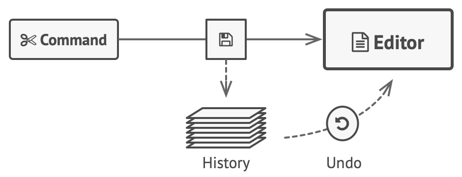
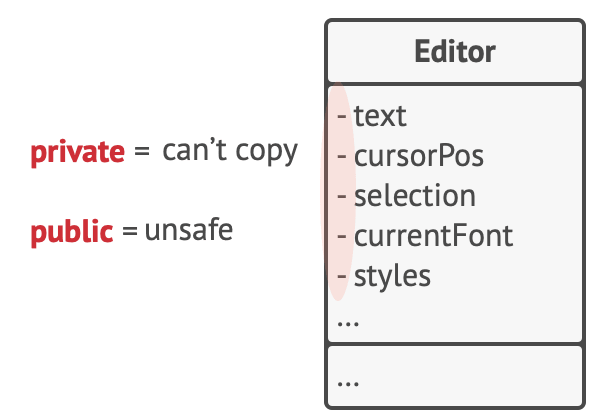
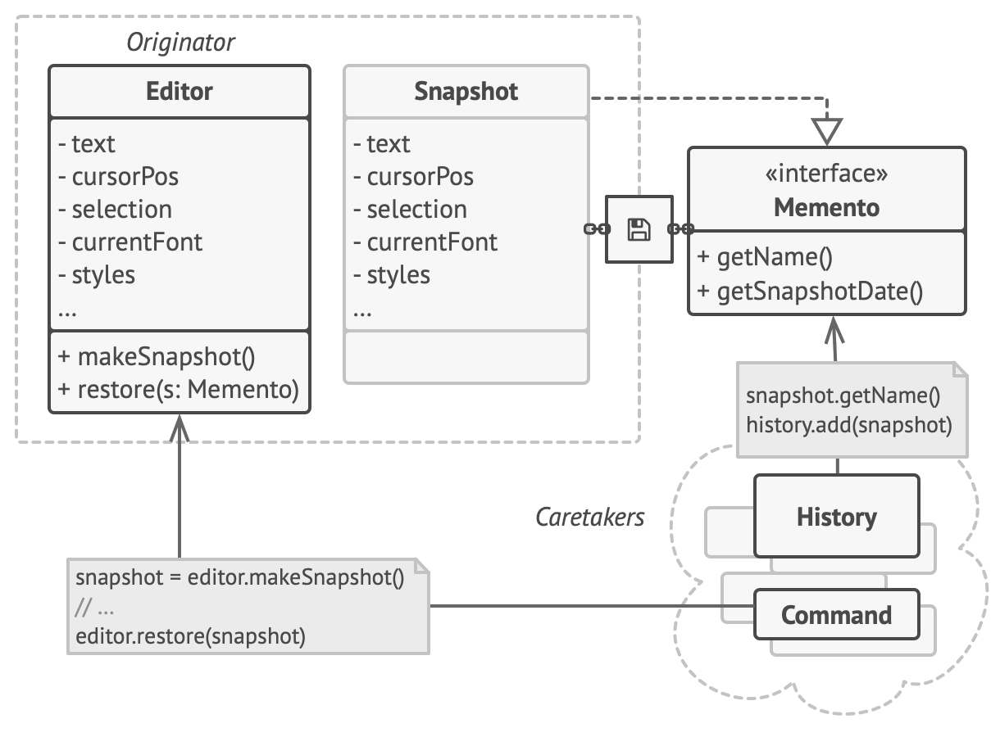
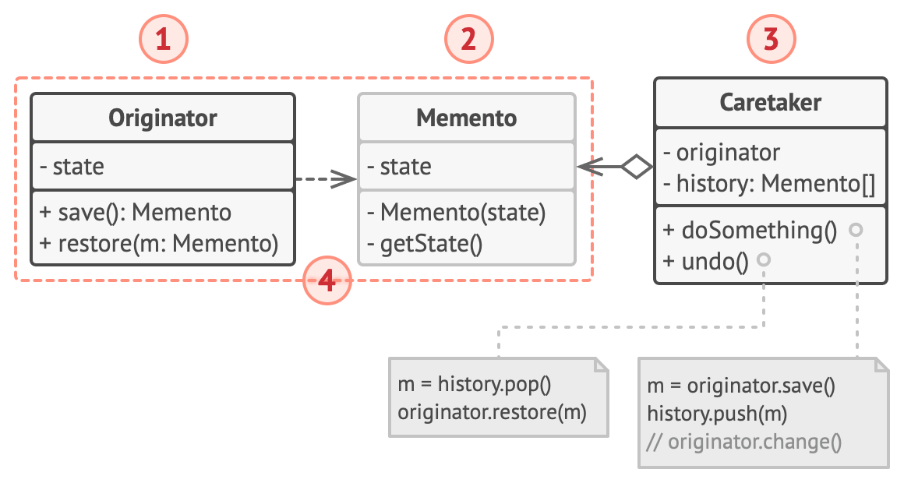
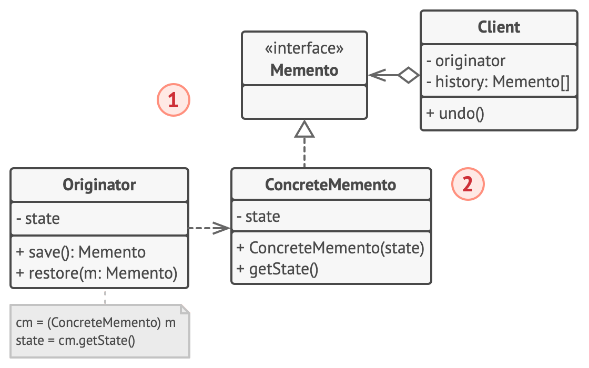
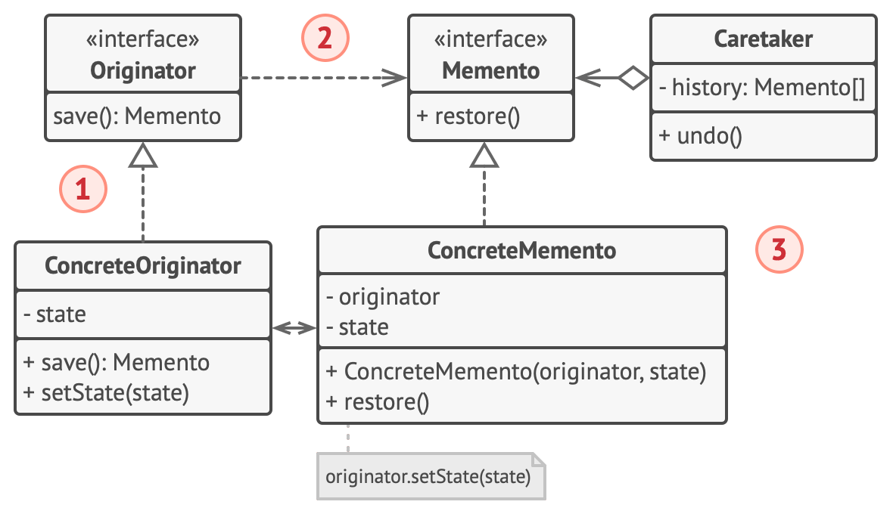
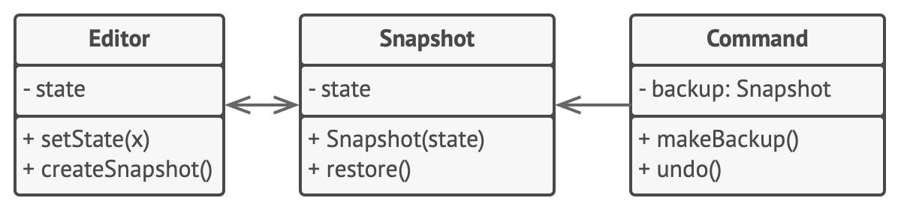

# Memento


**Type:** Behavioral · **Also known as:** Snapshot

> **The 10-second version:** Let an object hand you a sealed envelope containing its own state — you can hold the envelope and hand it back later, but you can never open it.

<br clear="all">

## Quick card

| | |
|---|---|
| **Problem it solves** | You need undo / rollback / checkpoints, but producing a state snapshot from the outside means either making every field public or writing a copier that breaks every time the class changes. |
| **Core move** | The object that owns the state produces its own snapshot object. Everyone else can store and pass that snapshot around, but only the originator can read what's inside it. |
| **You'll recognise it by** | A `CreateSnapshot()` / `Save()` returning an opaque type, a `Restore(snapshot)` taking it back, and a third class holding a `Stack<snapshot>` it never inspects. |
| **Rating** | Complexity ★★★ · Popularity ★☆☆ |
| **Closest relatives** | Command (the classic partner for undo), Prototype (the simpler alternative when the object is plain), Iterator (snapshot the traversal position), State (often the thing being snapshotted). |
| **In your stack** | C#: nested `sealed record` + a metadata-only interface; EF Core's `EntityEntry.OriginalValues` is a memento you already use. TS: `#private` fields + `structuredClone`, or Immer patches. SQL: a `listing_snapshots` row, a savepoint, or a SQL Server temporal table. RabbitMQ: store the pre-state memento before publishing so the compensating handler can roll back. |

### How to read this file

Technical first, plain English second. 🗣️ marks the plain-English version. Part 1 is Refactoring.Guru's material with their diagrams; Parts 2-7 are code, your stack, and the stuff that makes it stick.

---

# PART 1 — The pattern

## 1. Intent
**Memento** is a behavioral design pattern that lets you save and restore the previous state of an object without revealing the details of its implementation.


### 🗣️ In plain words

An object can take a photograph of itself and hand you the photograph. You're allowed to keep the photograph in a drawer, label it, and hand it back to the object later saying "go back to this." What you are *not* allowed to do is look at the photograph, edit it, or learn anything about how that object stores its data.

That one restriction is the whole pattern. Without it, "save the state" is just "copy the fields," which couples every caller to every field.

## 2. Problem
Imagine that you’re creating a text editor app. In addition to simple text editing, your editor can format text, insert inline images, etc.

At some point, you decided to let users undo any operations carried out on the text. This feature has become so common over the years that nowadays people expect every app to have it. For the implementation, you chose to take the direct approach. Before performing any operation, the app records the state of all objects and saves it in some storage. Later, when a user decides to revert an action, the app fetches the latest snapshot from the history and uses it to restore the state of all objects.



*Before executing an operation, the app saves a snapshot of the objects’ state, which can later be used to restore objects to their previous state.*

Let’s think about those state snapshots. How exactly would you produce one? You’d probably need to go over all the fields in an object and copy their values into storage. However, this would only work if the object had quite relaxed access restrictions to its contents. Unfortunately, most real objects won’t let others peek inside them that easily, hiding all significant data in private fields.

Ignore that problem for now and let’s assume that our objects behave like hippies: preferring open relations and keeping their state public. While this approach would solve the immediate problem and let you produce snapshots of objects’ states at will, it still has some serious issues. In the future, you might decide to refactor some of the editor classes, or add or remove some of the fields. Sounds easy, but this would also require changing the classes responsible for copying the state of the affected objects.



*How to make a copy of the object’s private state?*

But there’s more. Let’s consider the actual “snapshots” of the editor’s state. What data does it contain? At a bare minimum, it must contain the actual text, cursor coordinates, current scroll position, etc. To make a snapshot, you’d need to collect these values and put them into some kind of container.

Most likely, you’re going to store lots of these container objects inside some list that would represent the history. Therefore the containers would probably end up being objects of one class. The class would have almost no methods, but lots of fields that mirror the editor’s state. To allow other objects to write and read data to and from a snapshot, you’d probably need to make its fields public. That would expose all the editor’s states, private or not. Other classes would become dependent on every little change to the snapshot class, which would otherwise happen within private fields and methods without affecting outer classes.

It looks like we’ve reached a dead end: you either expose all internal details of classes, making them too fragile, or restrict access to their state, making it impossible to produce snapshots. Is there any other way to implement the "undo"?
### 🗣️ In plain words

You have an editor-like object with private state. Someone outside wants to save that state so it can be put back later. There are only two obvious routes, and both are bad.

**Route 1 — make the fields public so the outsider can copy them:**

```ts
// ❌ The "hippie object" approach
class ListingDraft {
  public title: string = "";
  public priceInr: number = 0;
  public kmDriven: number = 0;
  public photoOrder: string[] = [];
  public dirtyFlags: Set<string> = new Set();   // internal bookkeeping, now public
  public validationCache: Map<string, string> = new Map(); // ditto
}

class UndoService {
  private history: ListingDraft[] = [];

  backup(d: ListingDraft) {
    // I now know every field of ListingDraft. Every one of them.
    const copy = new ListingDraft();
    copy.title = d.title;
    copy.priceInr = d.priceInr;
    copy.kmDriven = d.kmDriven;
    copy.photoOrder = [...d.photoOrder];
    copy.dirtyFlags = new Set(d.dirtyFlags);
    copy.validationCache = new Map(d.validationCache);
    this.history.push(copy);
  }
}
```

Now add a `sellerNotes` field to `ListingDraft`. The compiler says nothing. `UndoService` silently stops copying it, and undo quietly corrupts the draft. This is the worst class of bug: no crash, wrong data.

**Route 2 — keep the fields private and give up on snapshots.** Now you can't implement undo at all, or you implement it by re-running the whole edit pipeline from scratch, which is slow and often not even deterministic.

And the snapshot container itself has the same disease. If `EditorSnapshot` has public fields so the editor can write to it and read from it, then every class that touches the history list can also read the editor's private state through the snapshot. You moved the leak, you didn't fix it.

> The dead end: *either* expose everything and become fragile, *or* expose nothing and lose the feature.

## 3. Solution
All problems that we’ve just experienced are caused by broken encapsulation. Some objects try to do more than they are supposed to. To collect the data required to perform some action, they invade the private space of other objects instead of letting these objects perform the actual action.

The Memento pattern delegates creating the state snapshots to the actual owner of that state, the *originator* object. Hence, instead of other objects trying to copy the editor’s state from the “outside,” the editor class itself can make the snapshot since it has full access to its own state.

The pattern suggests storing the copy of the object’s state in a special object called *memento*. The contents of the memento aren’t accessible to any other object except the one that produced it. Other objects must communicate with mementos using a limited interface which may allow fetching the snapshot’s metadata (creation time, the name of the performed operation, etc.), but not the original object’s state contained in the snapshot.



*The originator has full access to the memento, whereas the caretaker can only access the metadata.*

Such a restrictive policy lets you store mementos inside other objects, usually called *caretakers*. Since the caretaker works with the memento only via the limited interface, it’s not able to tamper with the state stored inside the memento. At the same time, the originator has access to all fields inside the memento, allowing it to restore its previous state at will.

In our text editor example, we can create a separate history class to act as the caretaker. A stack of mementos stored inside the caretaker will grow each time the editor is about to execute an operation. You could even render this stack within the app’s UI, displaying the history of previously performed operations to a user.

When a user triggers the undo, the history grabs the most recent memento from the stack and passes it back to the editor, requesting a roll-back. Since the editor has full access to the memento, it changes its own state with the values taken from the memento.
### 🗣️ In plain words

The trick is to stop asking "how does the outsider copy the state?" and start asking "why is an outsider copying state at all?"

The three mechanical moves:

1. **Move snapshot creation inside the owner.** The originator grows a `createSnapshot()` method. It has full access to its own privates, so copying is trivial and always complete — add a field, you edit the snapshot code that lives ten lines away in the same class.
2. **Return an opaque object.** The snapshot is a *memento*: immutable, constructor-only, and typed to the outside world as something with no state accessors — an empty marker interface, a metadata-only interface (`Label`, `TakenAt`), or a nested class whose members are private to the originator.
3. **Give the memento to a caretaker that can't read it.** A history stack, a command object, a transaction scope. It knows *when* to snapshot and *when* to restore. It has no idea *what* it's holding.
4. **(Optional, stricter)** Push the restore logic into the memento itself, so the memento holds a reference back to its originator and exposes only `restore()`. Now the caretaker can't even ask the originator to reload the wrong kind of snapshot.

> **The key insight:** Memento isn't a copying technique — it's an *access-control* technique. The copy is the easy part; the pattern exists entirely to make the copy visible to exactly one class and opaque to everyone else.

## 4. Real-world analogy

Refactoring.Guru does not give one for this pattern, so here are mine.

**The sealed evidence bag.** A forensics technician bags a sample, seals it, and writes only the case number and timestamp on the outside. That bag then travels through a courier, a storage room, and a clerk's filing cabinet — none of whom may open it. Only the lab that sealed it can break the seal and read the contents. The courier can *lose* the bag or *hand it back*, but the chain of custody guarantees they never learned what was inside.

**The hotel key-card drawer.** You check in and the desk programs a card; you hand it back at checkout and they hand it to you again on your next stay with the same room preferences. You can carry the card, lose it, put it in your wallet. You cannot read the magnetic stripe or edit what room it opens. The card is a token that means something only to the machine that wrote it.

## 5. Structure
#### Implementation based on nested classes

The classic implementation of the pattern relies on support for nested classes, available in many popular programming languages (such as C++, C#, and Java).



1. The **Originator** class can produce snapshots of its own state, as well as restore its state from snapshots when needed.
2. The **Memento** is a value object that acts as a snapshot of the originator’s state. It’s a common practice to make the memento immutable and pass it the data only once, via the constructor.
3. The **Caretaker** knows not only “when” and “why” to capture the originator’s state, but also when the state should be restored.

   A caretaker can keep track of the originator’s history by storing a stack of mementos. When the originator has to travel back in history, the caretaker fetches the topmost memento from the stack and passes it to the originator’s restoration method.
4. In this implementation, the memento class is nested inside the originator. This lets the originator access the fields and methods of the memento, even though they’re declared private. On the other hand, the caretaker has very limited access to the memento’s fields and methods, which lets it store mementos in a stack but not tamper with their state.

#### Implementation based on an intermediate interface

There’s an alternative implementation, suitable for programming languages that don’t support nested classes (yeah, PHP, I’m talking about you).



1. In the absence of nested classes, you can restrict access to the memento’s fields by establishing a convention that caretakers can work with a memento only through an explicitly declared intermediary interface, which would only declare methods related to the memento’s metadata.
2. On the other hand, originators can work with a memento object directly, accessing fields and methods declared in the memento class. The downside of this approach is that you need to declare all members of the memento public.

#### Implementation with even stricter encapsulation

There’s another implementation which is useful when you don’t want to leave even the slightest chance of other classes accessing the state of the originator through the memento.



1. This implementation allows having multiple types of originators and mementos. Each originator works with a corresponding memento class. Neither originators nor mementos expose their state to anyone.
2. Caretakers are now explicitly restricted from changing the state stored in mementos. Moreover, the caretaker class becomes independent from the originator because the restoration method is now defined in the memento class.
3. Each memento becomes linked to the originator that produced it. The originator passes itself to the memento’s constructor, along with the values of its state. Thanks to the close relationship between these classes, a memento can restore the state of its originator, given that the latter has defined the appropriate setters.
### 🗣️ Participants & roles — cheat table

| Role | What it is in code | Example from the site | Equivalent in reader's stack |
|---|---|---|---|
| **Originator** | The class that owns the private state and knows how to serialise/deserialise *itself*. Grows two methods: `createSnapshot()` and (usually) restore setters. | `Editor` with `text, curX, curY, selectionWidth` | `ListingDraftAggregate` in your C# domain layer; a `PricingRuleSet`; a React-free `SearchFilterModel` in TS |
| **Memento** | Immutable value object. All state goes in via the constructor; there are no setters and no public getters for the state. May expose harmless metadata. | `Snapshot` — private fields, no public getters, holds a back-reference to its `Editor` | C#: `private sealed record Memento(...)` nested in the originator, exposed as `IListingMemento`. TS: a class with `#` fields. |
| **Caretaker** | Holds mementos. Decides *when* to save and *when* to restore. Never inspects them. | `Command` — holds one `backup: Snapshot`, calls `backup.restore()` on undo | A `Stack<IListingMemento>` in an editor service; a `TransactionScope`-ish rollback guard; a RabbitMQ consumer holding the pre-state before it publishes |
| **Narrow interface** (variant 2) | The public face of the memento: metadata only, no state. | The intermediate interface for languages without nested classes | `IListingMemento { string Label { get; } DateTimeOffset TakenAt { get; } }` |
| **Client** | Triggers the whole dance. | The user pressing Ctrl+Z | Your API controller / the dealer clicking "Undo last price change" |

### 🤝 Collaboration — who calls whom

```
   Client                Caretaker (History)          Originator (Editor)          Memento
     |                        |                              |                       |
     |  edit("₹5,40,000")     |                              |                       |
     |----------------------->|                              |                       |
     |                        |  createSnapshot()            |                       |
     |                        |----------------------------->|                       |
     |                        |                              |  new Snapshot(state)  |
     |                        |                              |---------------------->|
     |                        |<- - - - IMemento (opaque) - - |                       |
     |                        |                              |                       |
     |                   [ push onto stack ]                  |                       |
     |                        |                              |                       |
     |                        |  setPrice(540000)            |                       |
     |                        |----------------------------->|  state MUTATES        |
     |                        |                              |                       |
     |  undo()                |                              |                       |
     |----------------------->|                              |                       |
     |                   [ pop stack ]                        |                       |
     |                        |  restore(m)   ───────────────>|  reads m's privates   |
     |                        |               (or m.restore())|<--------------------->|
     |                        |                              |  state ROLLED BACK    |
     |<-----------------------|                              |                       |
```

**The hop that matters:** the dashed `IMemento (opaque)` return. That arrow is the entire pattern. If the caretaker can call `m.getText()` on what comes back, you have written a DTO with extra ceremony, not a Memento. The compiler — not a code-review comment — has to be the thing stopping it.

## 6. Pseudocode (the website's example)
This example uses the Memento pattern alongside the [Command](https://refactoring.guru/design-patterns/command) pattern for storing snapshots of the complex text editor’s state and restoring an earlier state from these snapshots when needed.



*Saving snapshots of the text editor’s state.*

The command objects act as caretakers. They fetch the editor’s memento before executing operations related to commands. When a user attempts to undo the most recent command, the editor can use the memento stored in that command to revert itself to the previous state.

The memento class doesn’t declare any public fields, getters or setters. Therefore no object can alter its contents. Mementos are linked to the editor object that created them. This lets a memento restore the linked editor’s state by passing the data via setters on the editor object. Since mementos are linked to specific editor objects, you can make your app support several independent editor windows with a centralized undo stack.

```
// The originator holds some important data that may change over
// time. It also defines a method for saving its state inside a
// memento and another method for restoring the state from it.
class Editor is
    private field text, curX, curY, selectionWidth

    method setText(text) is
        this.text = text

    method setCursor(x, y) is
        this.curX = x
        this.curY = y

    method setSelectionWidth(width) is
        this.selectionWidth = width

    // Saves the current state inside a memento.
    method createSnapshot():Snapshot is
        // Memento is an immutable object; that's why the
        // originator passes its state to the memento's
        // constructor parameters.
        return new Snapshot(this, text, curX, curY, selectionWidth)

// The memento class stores the past state of the editor.
class Snapshot is
    private field editor: Editor
    private field text, curX, curY, selectionWidth

    constructor Snapshot(editor, text, curX, curY, selectionWidth) is
        this.editor = editor
        this.text = text
        this.curX = x
        this.curY = y
        this.selectionWidth = selectionWidth

    // At some point, a previous state of the editor can be
    // restored using a memento object.
    method restore() is
        editor.setText(text)
        editor.setCursor(curX, curY)
        editor.setSelectionWidth(selectionWidth)

// A command object can act as a caretaker. In that case, the
// command gets a memento just before it changes the
// originator's state. When undo is requested, it restores the
// originator's state from a memento.
class Command is
    private field backup: Snapshot

    method makeBackup() is
        backup = editor.createSnapshot()

    method undo() is
        if (backup != null)
            backup.restore()
    // ...
```
### 🗣️ Reading that pseudocode

- **`method createSnapshot():Snapshot`** — the snapshot is born *inside* `Editor`. Nothing outside ever reads `text`, `curX`, `curY`, `selectionWidth`. Add a fifth field tomorrow and the only place you touch is this one method.
- **`return new Snapshot(this, text, curX, curY, selectionWidth)`** — note `this` goes in first. The memento is bound to *the editor that made it*. That's what lets you run three editor windows with one shared undo stack: each memento knows which window it belongs to.
- **`class Snapshot is / private field ...`** — every field is private and there is not a single getter or setter in the class. The only public member is `restore()`. This is the "even stricter encapsulation" variant from the Structure section, and it's the one worth copying.
- **`method restore() is / editor.setText(text) ...`** — restoration lives in the memento, not the caretaker. The caretaker never has to know that an editor has a cursor. It calls one no-argument method.
- **`class Command is / private field backup: Snapshot`** — this is Memento's famous double act with Command. The caretaker isn't a dedicated "History" class here; it's whatever command is about to mutate the editor. Each command carries its own escape hatch.
- **`if (backup != null) backup.restore()`** — the null guard matters because `undo()` can be called on a command that never ran. In C# make the field `IMemento?` and let nullable reference types force you to check; in TS make it `Snapshot | null` with `strictNullChecks`.

## 7. Applicability — when to reach for it
**Use the Memento pattern when you want to produce snapshots of the object’s state to be able to restore a previous state of the object.**

The Memento pattern lets you make full copies of an object’s state, including private fields, and store them separately from the object. While most people remember this pattern thanks to the “undo” use case, it’s also indispensable when dealing with transactions (i.e., if you need to roll back an operation on error).

**Use the pattern when direct access to the object’s fields/getters/setters violates its encapsulation.**

The Memento makes the object itself responsible for creating a snapshot of its state. No other object can read the snapshot, making the original object’s state data safe and secure.
### ✅ Quick checklist

- [ ] Does something outside the object need to put its state back the way it was?
- [ ] Is that state genuinely private — i.e. would exposing it to enable snapshots be a real encapsulation loss, not a shrug?
- [ ] Is the state cheap enough to copy that holding N copies won't blow memory? (If not, you want a command log, not snapshots.)
- [ ] Do you need to roll back on *error* (transaction/saga compensation), not just on user request?
- [ ] Is re-deriving the old state impossible or non-deterministic (random IDs, timestamps, external calls)?
- [ ] Do you have more than one place that needs "put it back" — undo, preview-then-discard, retry-after-failure?

Four or more ticks: build it. One or two ticks and the object is a plain bag of primitives: just clone it (Prototype) and move on.

## 8. How to implement — step by step
1. Determine what class will play the role of the originator. It’s important to know whether the program uses one central object of this type or multiple smaller ones.
2. Create the memento class. One by one, declare a set of fields that mirror the fields declared inside the originator class.
3. Make the memento class immutable. A memento should accept the data just once, via the constructor. The class should have no setters.
4. If your programming language supports nested classes, nest the memento inside the originator. If not, extract a blank interface from the memento class and make all other objects use it to refer to the memento. You may add some metadata operations to the interface, but nothing that exposes the originator’s state.
5. Add a method for producing mementos to the originator class. The originator should pass its state to the memento via one or multiple arguments of the memento’s constructor.

   The return type of the method should be of the interface you extracted in the previous step (assuming that you extracted it at all). Under the hood, the memento-producing method should work directly with the memento class.
6. Add a method for restoring the originator’s state to its class. It should accept a memento object as an argument. If you extracted an interface in the previous step, make it the type of the parameter. In this case, you need to typecast the incoming object to the memento class, since the originator needs full access to that object.
7. The caretaker, whether it represents a command object, a history, or something entirely different, should know when to request new mementos from the originator, how to store them and when to restore the originator with a particular memento.
8. The link between caretakers and originators may be moved into the memento class. In this case, each memento must be connected to the originator that had created it. The restoration method would also move to the memento class. However, this would all make sense only if the memento class is nested into originator or the originator class provides sufficient setters for overriding its state.
### 🗣️ The same steps, blunt version

1. Pick the class that owns the state. One central one, or many small ones — decide now, because "many" means each memento must remember which instance it came from.
2. Write the memento with one field per piece of state you need to restore. Not per field in the class — per field that *matters*. Caches and derived values usually don't.
3. All fields `readonly`/`final`/`const`, set once in the constructor, no setters. Make it genuinely immutable, including deep-copying any collections you put in it.
4. Nest it inside the originator if your language lets you (C#, Java, C++ all do). If not, extract an interface with metadata only and hand that out.
5. Give the originator a `createSnapshot()` that returns the *narrow* type. Internally it constructs the real thing.
6. Give the originator a `restore(memento)` that takes the narrow type and casts down — or skip it and put `restore()` on the memento itself.
7. Write the caretaker: a stack, a command, a rollback guard. Its only job is timing. It must not have a single line that inspects a memento.
8. If you want the strict variant, move the back-reference and the restore logic into the memento. Then the caretaker doesn't even know the originator's type.

## 9. Pros and cons
- ✅ You can produce snapshots of the object’s state without violating its encapsulation.
- ✅ You can simplify the originator’s code by letting the caretaker maintain the history of the originator’s state.

- ⛔ The app might consume lots of RAM if clients create mementos too often.
- ⛔ Caretakers should track the originator’s lifecycle to be able to destroy obsolete mementos.
- ⛔ Most dynamic programming languages, such as PHP, Python and JavaScript, can’t guarantee that the state within the memento stays untouched.
### ⚖️ Honest trade-offs from the trenches

**The real cost is memory, and it arrives later than you expect.** A `ListingDraft` memento is maybe 2 KB with photo URLs and a spec map. Fifty undo steps is 100 KB — nothing. Now put that undo stack in an ASP.NET session, multiply by 3,000 concurrent dealers editing during a weekend campaign, and you're at 300 MB of snapshots living in server memory doing nothing. The pattern doesn't fail loudly; it fails as a slow, confusing memory climb that nobody traces back to "we added undo." Cap the stack (`if (_history.Count > 25) _history.RemoveFirst()`), or don't hold mementos server-side at all.

**The tell that it's worth it is the second consumer.** If undo is the only reason you're reaching for it, and the object is five primitives, just clone it. Memento earns its ceremony when the *same* snapshot mechanism serves undo *and* transaction rollback *and* "preview these bulk price changes before committing." At that point the opacity stops being pedantry: three different caretakers now hold the same token and none of them can corrupt it.

**Modern C# and TS give you a chunk of this for free — use it.** A C# `record` with positional parameters is already an immutable, value-equal, `with`-cloneable memento; you don't hand-write `Equals` or defensive constructors, and `record` + `init` accessors means the compiler enforces "set once." In TS, `structuredClone()` is now standard in Node 17+ and every modern browser and does a correct deep copy of Maps, Sets, Dates and typed arrays — no more `JSON.parse(JSON.stringify(x))` silently turning your `Date` into a string. And if you're already using **Immer**, `produceWithPatches` gives you *inverse patches*, which is the command-log alternative to Memento with the memory profile of a diff instead of a full copy.

**Where your DI container and ORM already did it:** EF Core's change tracker holds `entry.OriginalValues` for every tracked entity — that *is* a memento, complete with a narrow interface (`PropertyValues`), and `entry.CurrentValues.SetValues(entry.OriginalValues)` is the restore. `System.Data.DataRow` has had `BeginEdit`/`CancelEdit`/`RejectChanges` since .NET 1.0. Before you hand-roll a snapshot of an entity that's already tracked, check whether the ORM is holding one for you.

## 10. Relations with other patterns
- You can use [Command](https://refactoring.guru/design-patterns/command) and [Memento](https://refactoring.guru/design-patterns/memento) together when implementing “undo”. In this case, commands are responsible for performing various operations over a target object, while mementos save the state of that object just before a command gets executed.
- You can use [Memento](https://refactoring.guru/design-patterns/memento) along with [Iterator](https://refactoring.guru/design-patterns/iterator) to capture the current iteration state and roll it back if necessary.
- Sometimes [Prototype](https://refactoring.guru/design-patterns/prototype) can be a simpler alternative to [Memento](https://refactoring.guru/design-patterns/memento). This works if the object, the state of which you want to store in the history, is fairly straightforward and doesn’t have links to external resources, or the links are easy to re-establish.
### 🗣️ Disambiguation table

| Pattern | What it actually does | How it differs from Memento | When you'd pick it instead |
|---|---|---|---|
| **Command** | Encapsulates a *request* as an object, with `execute()` and often `undo()`. | Command stores the **operation**; Memento stores the **state**. They're partners, not rivals: the command is usually the caretaker holding the memento. | Undo where the inverse op is cheap and exact (`setPrice(old)`), and state is huge. |
| **Prototype** | `clone()` — an object copies itself into a new, fully usable object. | A clone is a *live object with a public API*; a memento is an *inert token nobody can read*. Prototype gives you a second editor; Memento gives you a sealed envelope. | The object is a simple value bag with no private invariants and no external handles. |
| **State** | Object changes behaviour by swapping an internal state object. | State manages *which* behaviour is active now; Memento preserves *what* the state was then. You very often snapshot a State machine. | You need behaviour to vary, not history to be kept. |
| **Iterator** | Walks a collection, holding a position. | Not a rival — a client. Snapshot the iterator's position so you can rewind a traversal. | — |
| **Observer** | Broadcasts changes to subscribers. | Observer pushes *deltas forward*; Memento holds *state backward*. | You need other components to react, not to rewind. |

> ***Command remembers what you did. Memento remembers what you were. Prototype makes another one of you.***

---

# PART 2 — Official code examples from Refactoring.Guru

## 2.1 C#
**Complexity:** ★★★ (3/3)

**Popularity:** ★☆☆ (1/3)

**Usage examples:** The Memento’s principle can be achieved using serialization, which is quite common in C#. While it’s not the only and the most efficient way to make snapshots of an object’s state, it still allows storing state backups while protecting the originator’s structure from other objects.
### Conceptual Example

This example illustrates the structure of the **Memento** design pattern. It focuses on answering these questions:

- What classes does it consist of?
- What roles do these classes play?
- In what way the elements of the pattern are related?

##### **Program.cs:** Conceptual example

```csharp
using System;
using System.Collections.Generic;
using System.Linq;
using System.Threading;

namespace RefactoringGuru.DesignPatterns.Memento.Conceptual
{
    // The Originator holds some important state that may change over time. It
    // also defines a method for saving the state inside a memento and another
    // method for restoring the state from it.
    class Originator
    {
        // For the sake of simplicity, the originator's state is stored inside a
        // single variable.
        private string _state;

        public Originator(string state)
        {
            this._state = state;
            Console.WriteLine("Originator: My initial state is: " + state);
        }

        // The Originator's business logic may affect its internal state.
        // Therefore, the client should backup the state before launching
        // methods of the business logic via the save() method.
        public void DoSomething()
        {
            Console.WriteLine("Originator: I'm doing something important.");
            this._state = this.GenerateRandomString(30);
            Console.WriteLine($"Originator: and my state has changed to: {_state}");
        }

        private string GenerateRandomString(int length = 10)
        {
            string allowedSymbols = "abcdefghijklmnopqrstuvwxyzABCDEFGHIJKLMNOPQRSTUVWXYZ";
            string result = string.Empty;

            while (length > 0)
            {
                result += allowedSymbols[new Random().Next(0, allowedSymbols.Length)];

                Thread.Sleep(12);

                length--;
            }

            return result;
        }

        // Saves the current state inside a memento.
        public IMemento Save()
        {
            return new ConcreteMemento(this._state);
        }

        // Restores the Originator's state from a memento object.
        public void Restore(IMemento memento)
        {
            if (!(memento is ConcreteMemento))
            {
                throw new Exception("Unknown memento class " + memento.ToString());
            }

            this._state = memento.GetState();
            Console.Write($"Originator: My state has changed to: {_state}");
        }
    }

    // The Memento interface provides a way to retrieve the memento's metadata,
    // such as creation date or name. However, it doesn't expose the
    // Originator's state.
    public interface IMemento
    {
        string GetName();

        string GetState();

        DateTime GetDate();
    }

    // The Concrete Memento contains the infrastructure for storing the
    // Originator's state.
    class ConcreteMemento : IMemento
    {
        private string _state;

        private DateTime _date;

        public ConcreteMemento(string state)
        {
            this._state = state;
            this._date = DateTime.Now;
        }

        // The Originator uses this method when restoring its state.
        public string GetState()
        {
            return this._state;
        }

        // The rest of the methods are used by the Caretaker to display
        // metadata.
        public string GetName()
        {
            return $"{this._date} / ({this._state.Substring(0, 9)})...";
        }

        public DateTime GetDate()
        {
            return this._date;
        }
    }

    // The Caretaker doesn't depend on the Concrete Memento class. Therefore, it
    // doesn't have access to the originator's state, stored inside the memento.
    // It works with all mementos via the base Memento interface.
    class Caretaker
    {
        private List<IMemento> _mementos = new List<IMemento>();

        private Originator _originator = null;

        public Caretaker(Originator originator)
        {
            this._originator = originator;
        }

        public void Backup()
        {
            Console.WriteLine("\nCaretaker: Saving Originator's state...");
            this._mementos.Add(this._originator.Save());
        }

        public void Undo()
        {
            if (this._mementos.Count == 0)
            {
                return;
            }

            var memento = this._mementos.Last();
            this._mementos.Remove(memento);

            Console.WriteLine("Caretaker: Restoring state to: " + memento.GetName());

            try
            {
                this._originator.Restore(memento);
            }
            catch (Exception)
            {
                this.Undo();
            }
        }

        public void ShowHistory()
        {
            Console.WriteLine("Caretaker: Here's the list of mementos:");

            foreach (var memento in this._mementos)
            {
                Console.WriteLine(memento.GetName());
            }
        }
    }

    class Program
    {
        static void Main(string[] args)
        {
            // Client code.
            Originator originator = new Originator("Super-duper-super-puper-super.");
            Caretaker caretaker = new Caretaker(originator);

            caretaker.Backup();
            originator.DoSomething();

            caretaker.Backup();
            originator.DoSomething();

            caretaker.Backup();
            originator.DoSomething();

            Console.WriteLine();
            caretaker.ShowHistory();

            Console.WriteLine("\nClient: Now, let's rollback!\n");
            caretaker.Undo();

            Console.WriteLine("\n\nClient: Once more!\n");
            caretaker.Undo();

            Console.WriteLine();
        }
    }
}
```

##### **Output.txt:** Execution result

```output
Originator: My initial state is: Super-duper-super-puper-super.

Caretaker: Saving Originator's state...
Originator: I'm doing something important.
Originator: and my state has changed to: oGyQIIatlDDWNgYYqJATTmdwnnGZQj

Caretaker: Saving Originator's state...
Originator: I'm doing something important.
Originator: and my state has changed to: jBtMDDWogzzRJbTTmEwOOhZrjjBULe

Caretaker: Saving Originator's state...
Originator: I'm doing something important.
Originator: and my state has changed to: exoHyyRkbuuNEXOhhArKccUmexPPHZ

Caretaker: Here's the list of mementos:
12.06.2018 15:52:45 / (Super-dup...)
12.06.2018 15:52:46 / (oGyQIIatl...)
12.06.2018 15:52:46 / (jBtMDDWog...)

Client: Now, let's rollback!

Caretaker: Restoring state to: 12.06.2018 15:52:46 / (jBtMDDWog...)
Originator: My state has changed to: jBtMDDWogzzRJbTTmEwOOhZrjjBULe

Client: Once more!

Caretaker: Restoring state to: 12.06.2018 15:52:46 / (oGyQIIatl...)
Originator: My state has changed to: oGyQIIatlDDWNgYYqJATTmdwnnGZQj
```

## 2.2 TypeScript
**Complexity:** ★★★ (3/3)

**Popularity:** ★☆☆ (1/3)

**Usage examples:** The Memento’s principle can be achieved using serialization, which is quite common in TypeScript. While it’s not the only and the most efficient way to make snapshots of an object’s state, it still allows storing state backups while protecting the originator’s structure from other objects.
### Conceptual Example

This example illustrates the structure of the **Memento** design pattern and focuses on the following questions:

- What classes does it consist of?
- What roles do these classes play?
- In what way the elements of the pattern are related?

##### **index.ts:** Conceptual example

```typescript
/**
 * The Originator holds some important state that may change over time. It also
 * defines a method for saving the state inside a memento and another method for
 * restoring the state from it.
 */
class Originator {
    /**
     * For the sake of simplicity, the originator's state is stored inside a
     * single variable.
     */
    private state: string;

    constructor(state: string) {
        this.state = state;
        console.log(`Originator: My initial state is: ${state}`);
    }

    /**
     * The Originator's business logic may affect its internal state. Therefore,
     * the client should backup the state before launching methods of the
     * business logic via the save() method.
     */
    public doSomething(): void {
        console.log('Originator: I\'m doing something important.');
        this.state = this.generateRandomString(30);
        console.log(`Originator: and my state has changed to: ${this.state}`);
    }

    private generateRandomString(length: number = 10): string {
        const charSet = 'abcdefghijklmnopqrstuvwxyzABCDEFGHIJKLMNOPQRSTUVWXYZ';

        return Array
            .apply(null, { length })
            .map(() => charSet.charAt(Math.floor(Math.random() * charSet.length)))
            .join('');
    }

    /**
     * Saves the current state inside a memento.
     */
    public save(): Memento {
        return new ConcreteMemento(this.state);
    }

    /**
     * Restores the Originator's state from a memento object.
     */
    public restore(memento: Memento): void {
        this.state = memento.getState();
        console.log(`Originator: My state has changed to: ${this.state}`);
    }
}

/**
 * The Memento interface provides a way to retrieve the memento's metadata, such
 * as creation date or name. However, it doesn't expose the Originator's state.
 */
interface Memento {
    getState(): string;

    getName(): string;

    getDate(): string;
}

/**
 * The Concrete Memento contains the infrastructure for storing the Originator's
 * state.
 */
class ConcreteMemento implements Memento {
    private state: string;

    private date: string;

    constructor(state: string) {
        this.state = state;
        this.date = new Date().toISOString().slice(0, 19).replace('T', ' ');
    }

    /**
     * The Originator uses this method when restoring its state.
     */
    public getState(): string {
        return this.state;
    }

    /**
     * The rest of the methods are used by the Caretaker to display metadata.
     */
    public getName(): string {
        return `${this.date} / (${this.state.substr(0, 9)}...)`;
    }

    public getDate(): string {
        return this.date;
    }
}

/**
 * The Caretaker doesn't depend on the Concrete Memento class. Therefore, it
 * doesn't have access to the originator's state, stored inside the memento. It
 * works with all mementos via the base Memento interface.
 */
class Caretaker {
    private mementos: Memento[] = [];

    private originator: Originator;

    constructor(originator: Originator) {
        this.originator = originator;
    }

    public backup(): void {
        console.log('\nCaretaker: Saving Originator\'s state...');
        this.mementos.push(this.originator.save());
    }

    public undo(): void {
        if (!this.mementos.length) {
            return;
        }
        const memento = this.mementos.pop();

        console.log(`Caretaker: Restoring state to: ${memento.getName()}`);
        this.originator.restore(memento);
    }

    public showHistory(): void {
        console.log('Caretaker: Here\'s the list of mementos:');
        for (const memento of this.mementos) {
            console.log(memento.getName());
        }
    }
}

/**
 * Client code.
 */
const originator = new Originator('Super-duper-super-puper-super.');
const caretaker = new Caretaker(originator);

caretaker.backup();
originator.doSomething();

caretaker.backup();
originator.doSomething();

caretaker.backup();
originator.doSomething();

console.log('');
caretaker.showHistory();

console.log('\nClient: Now, let\'s rollback!\n');
caretaker.undo();

console.log('\nClient: Once more!\n');
caretaker.undo();
```

##### **Output.txt:** Execution result

```output
Originator: My initial state is: Super-duper-super-puper-super.

Caretaker: Saving Originator's state...
Originator: I'm doing something important.
Originator: and my state has changed to: qXqxgTcLSCeLYdcgElOghOFhPGfMxo

Caretaker: Saving Originator's state...
Originator: I'm doing something important.
Originator: and my state has changed to: iaVCJVryJwWwbipieensfodeMSWvUY

Caretaker: Saving Originator's state...
Originator: I'm doing something important.
Originator: and my state has changed to: oSUxsOCiZEnohBMQEjwnPWJLGnwGmy

Caretaker: Here's the list of mementos:
2019-02-17 15:14:05 / (Super-dup...)
2019-02-17 15:14:05 / (qXqxgTcLS...)
2019-02-17 15:14:05 / (iaVCJVryJ...)

Client: Now, let's rollback!

Caretaker: Restoring state to: 2019-02-17 15:14:05 / (iaVCJVryJ...)
Originator: My state has changed to: iaVCJVryJwWwbipieensfodeMSWvUY

Client: Once more!

Caretaker: Restoring state to: 2019-02-17 15:14:05 / (qXqxgTcLS...)
Originator: My state has changed to: qXqxgTcLSCeLYdcgElOghOFhPGfMxo
```

## 2.3 C++
**Complexity:** ★★★ (3/3)

**Popularity:** ★☆☆ (1/3)

**Usage examples:** The Memento’s principle can be achieved using serialization, which is quite common in C++. While it’s not the only and the most efficient way to make snapshots of an object’s state, it still allows storing state backups while protecting the originator’s structure from other objects.
### Conceptual Example

This example illustrates the structure of the **Memento** design pattern. It focuses on answering these questions:

- What classes does it consist of?
- What roles do these classes play?
- In what way the elements of the pattern are related?

##### **main.cc:** Conceptual example

```cpp
/**
 * The Memento interface provides a way to retrieve the memento's metadata, such
 * as creation date or name. However, it doesn't expose the Originator's state.
 */
class Memento {
 public:
  virtual ~Memento() {}
  virtual std::string GetName() const = 0;
  virtual std::string date() const = 0;
  virtual std::string state() const = 0;
};

/**
 * The Concrete Memento contains the infrastructure for storing the Originator's
 * state.
 */
class ConcreteMemento : public Memento {
 private:
  std::string state_;
  std::string date_;

 public:
  ConcreteMemento(std::string state) : state_(state) {
    this->state_ = state;
    std::time_t now = std::time(0);
    this->date_ = std::ctime(&now);
  }
  /**
   * The Originator uses this method when restoring its state.
   */
  std::string state() const override {
    return this->state_;
  }
  /**
   * The rest of the methods are used by the Caretaker to display metadata.
   */
  std::string GetName() const override {
    return this->date_ + " / (" + this->state_.substr(0, 9) + "...)";
  }
  std::string date() const override {
    return this->date_;
  }
};

/**
 * The Originator holds some important state that may change over time. It also
 * defines a method for saving the state inside a memento and another method for
 * restoring the state from it.
 */
class Originator {
  /**
   * @var string For the sake of simplicity, the originator's state is stored
   * inside a single variable.
   */
 private:
  std::string state_;

  std::string GenerateRandomString(int length = 10) {
    const char alphanum[] =
        "0123456789"
        "ABCDEFGHIJKLMNOPQRSTUVWXYZ"
        "abcdefghijklmnopqrstuvwxyz";
    int stringLength = sizeof(alphanum) - 1;

    std::string random_string;
    for (int i = 0; i < length; i++) {
      random_string += alphanum[std::rand() % stringLength];
    }
    return random_string;
  }

 public:
  Originator(std::string state) : state_(state) {
    std::cout << "Originator: My initial state is: " << this->state_ << "\n";
  }
  /**
   * The Originator's business logic may affect its internal state. Therefore,
   * the client should backup the state before launching methods of the business
   * logic via the save() method.
   */
  void DoSomething() {
    std::cout << "Originator: I'm doing something important.\n";
    this->state_ = this->GenerateRandomString(30);
    std::cout << "Originator: and my state has changed to: " << this->state_ << "\n";
  }

  /**
   * Saves the current state inside a memento.
   */
  Memento *Save() {
    return new ConcreteMemento(this->state_);
  }
  /**
   * Restores the Originator's state from a memento object.
   */
  void Restore(Memento *memento) {
    this->state_ = memento->state();
    std::cout << "Originator: My state has changed to: " << this->state_ << "\n";
    delete memento;
  }
};

/**
 * The Caretaker doesn't depend on the Concrete Memento class. Therefore, it
 * doesn't have access to the originator's state, stored inside the memento. It
 * works with all mementos via the base Memento interface.
 */
class Caretaker {
  /**
   * @var Memento[]
   */
 private:
  std::vector<Memento *> mementos_;

  /**
   * @var Originator
   */
  Originator *originator_;

 public:
     Caretaker(Originator* originator) : originator_(originator) {
     }

     ~Caretaker() {
         for (auto m : mementos_) delete m;
     }

  void Backup() {
    std::cout << "\nCaretaker: Saving Originator's state...\n";
    this->mementos_.push_back(this->originator_->Save());
  }
  void Undo() {
    if (!this->mementos_.size()) {
      return;
    }
    Memento *memento = this->mementos_.back();
    this->mementos_.pop_back();
    std::cout << "Caretaker: Restoring state to: " << memento->GetName() << "\n";
    try {
      this->originator_->Restore(memento);
    } catch (...) {
      this->Undo();
    }
  }
  void ShowHistory() const {
    std::cout << "Caretaker: Here's the list of mementos:\n";
    for (Memento *memento : this->mementos_) {
      std::cout << memento->GetName() << "\n";
    }
  }
};
/**
 * Client code.
 */

void ClientCode() {
  Originator *originator = new Originator("Super-duper-super-puper-super.");
  Caretaker *caretaker = new Caretaker(originator);
  caretaker->Backup();
  originator->DoSomething();
  caretaker->Backup();
  originator->DoSomething();
  caretaker->Backup();
  originator->DoSomething();
  std::cout << "\n";
  caretaker->ShowHistory();
  std::cout << "\nClient: Now, let's rollback!\n\n";
  caretaker->Undo();
  std::cout << "\nClient: Once more!\n\n";
  caretaker->Undo();

  delete originator;
  delete caretaker;
}

int main() {
  std::srand(static_cast<unsigned int>(std::time(NULL)));
  ClientCode();
  return 0;
}
```

##### **Output.txt:** Execution result

```output
Originator: My initial state is: Super-duper-super-puper-super.

Caretaker: Saving Originator's state...
Originator: I'm doing something important.
Originator: and my state has changed to: uOInE8wmckHYPwZS7PtUTwuwZfCIbz

Caretaker: Saving Originator's state...
Originator: I'm doing something important.
Originator: and my state has changed to: te6RGmykRpbqaWo5MEwjji1fpM1t5D

Caretaker: Saving Originator's state...
Originator: I'm doing something important.
Originator: and my state has changed to: hX5xWDVljcQ9ydD7StUfbBt5Z7pcSN

Caretaker: Here's the list of mementos:
Sat Oct 19 18:09:37 2019
 / (Super-dup...)
Sat Oct 19 18:09:37 2019
 / (uOInE8wmc...)
Sat Oct 19 18:09:37 2019
 / (te6RGmykR...)

Client: Now, let's rollback!

Caretaker: Restoring state to: Sat Oct 19 18:09:37 2019
 / (te6RGmykR...)
Originator: My state has changed to: te6RGmykRpbqaWo5MEwjji1fpM1t5D

Client: Once more!

Caretaker: Restoring state to: Sat Oct 19 18:09:37 2019
 / (uOInE8wmc...)
Originator: My state has changed to: uOInE8wmckHYPwZS7PtUTwuwZfCIbz
```

## 2.4 Java
**Complexity:** ★★★ (3/3)

**Popularity:** ★☆☆ (1/3)

**Usage examples:** The Memento’s principle can be achieved using serialization, which is quite common in Java. While it’s not the only and the most efficient way to make snapshots of an object’s state, it still allows storing state backups while protecting the originator’s structure from other objects.
### Shape editor and complex undo/redo

This graphical editor allows changing the color and position of the shapes on the screen. Any modification can be undone and repeated, though.

The “undo” is based on the collaboration between the Memento and Command patterns. The editor tracks a history of performed commands. Before executing any command, it makes a backup and connects it to the command object. After the execution, it pushes the executed command into history.

When a user requests the undo, the editor fetches a recent command from the history and restores the state from the backup kept inside that command. If the user requests another undo, the editor takes a following command from the history and so on.

Reverted commands are kept in history until the user makes some modifications to the shapes on the screen. This is crucial for redoing undone commands.

#### **editor**

##### **editor/Editor.java:** Editor code

```java
package refactoring_guru.memento.example.editor;

import refactoring_guru.memento.example.commands.Command;
import refactoring_guru.memento.example.history.History;
import refactoring_guru.memento.example.history.Memento;
import refactoring_guru.memento.example.shapes.CompoundShape;
import refactoring_guru.memento.example.shapes.Shape;

import javax.swing.*;
import java.io.*;
import java.util.Base64;

public class Editor extends JComponent {
    private Canvas canvas;
    private CompoundShape allShapes = new CompoundShape();
    private History history;

    public Editor() {
        canvas = new Canvas(this);
        history = new History();
    }

    public void loadShapes(Shape... shapes) {
        allShapes.clear();
        allShapes.add(shapes);
        canvas.refresh();
    }

    public CompoundShape getShapes() {
        return allShapes;
    }

    public void execute(Command c) {
        history.push(c, new Memento(this));
        c.execute();
    }

    public void undo() {
        if (history.undo())
            canvas.repaint();
    }

    public void redo() {
        if (history.redo())
            canvas.repaint();
    }

    public String backup() {
        try {
            ByteArrayOutputStream baos = new ByteArrayOutputStream();
            ObjectOutputStream oos = new ObjectOutputStream(baos);
            oos.writeObject(this.allShapes);
            oos.close();
            return Base64.getEncoder().encodeToString(baos.toByteArray());
        } catch (IOException e) {
            return "";
        }
    }

    public void restore(String state) {
        try {
            byte[] data = Base64.getDecoder().decode(state);
            ObjectInputStream ois = new ObjectInputStream(new ByteArrayInputStream(data));
            this.allShapes = (CompoundShape) ois.readObject();
            ois.close();
        } catch (ClassNotFoundException e) {
            System.out.print("ClassNotFoundException occurred.");
        } catch (IOException e) {
            System.out.print("IOException occurred.");
        }
    }
}
```

##### **editor/Canvas.java:** Canvas code

```java
package refactoring_guru.memento.example.editor;

import refactoring_guru.memento.example.commands.ColorCommand;
import refactoring_guru.memento.example.commands.MoveCommand;
import refactoring_guru.memento.example.shapes.Shape;

import javax.swing.*;
import javax.swing.border.Border;
import java.awt.*;
import java.awt.event.*;
import java.awt.image.BufferedImage;

class Canvas extends java.awt.Canvas {
    private Editor editor;
    private JFrame frame;
    private static final int PADDING = 10;

    Canvas(Editor editor) {
        this.editor = editor;
        createFrame();
        attachKeyboardListeners();
        attachMouseListeners();
        refresh();
    }

    private void createFrame() {
        frame = new JFrame();
        frame.setDefaultCloseOperation(WindowConstants.EXIT_ON_CLOSE);
        frame.setLocationRelativeTo(null);

        JPanel contentPanel = new JPanel();
        Border padding = BorderFactory.createEmptyBorder(PADDING, PADDING, PADDING, PADDING);
        contentPanel.setBorder(padding);
        contentPanel.setLayout(new BoxLayout(contentPanel, BoxLayout.Y_AXIS));
        frame.setContentPane(contentPanel);

        contentPanel.add(new JLabel("Select and drag to move."), BorderLayout.PAGE_END);
        contentPanel.add(new JLabel("Right click to change color."), BorderLayout.PAGE_END);
        contentPanel.add(new JLabel("Undo: Ctrl+Z, Redo: Ctrl+R"), BorderLayout.PAGE_END);
        contentPanel.add(this);
        frame.setVisible(true);
        contentPanel.setBackground(Color.LIGHT_GRAY);
    }

    private void attachKeyboardListeners() {
        addKeyListener(new KeyAdapter() {
            @Override
            public void keyPressed(KeyEvent e) {
                if ((e.getModifiers() & KeyEvent.CTRL_MASK) != 0) {
                    switch (e.getKeyCode()) {
                        case KeyEvent.VK_Z:
                            editor.undo();
                            break;
                        case KeyEvent.VK_R:
                            editor.redo();
                            break;
                    }
                }
            }
        });
    }

    private void attachMouseListeners() {
        MouseAdapter colorizer = new MouseAdapter() {
            @Override
            public void mousePressed(MouseEvent e) {
                if (e.getButton() != MouseEvent.BUTTON3) {
                    return;
                }
                Shape target = editor.getShapes().getChildAt(e.getX(), e.getY());
                if (target != null) {
                    editor.execute(new ColorCommand(editor, new Color((int) (Math.random() * 0x1000000))));
                    repaint();
                }
            }
        };
        addMouseListener(colorizer);

        MouseAdapter selector = new MouseAdapter() {
            @Override
            public void mousePressed(MouseEvent e) {
                if (e.getButton() != MouseEvent.BUTTON1) {
                    return;
                }

                Shape target = editor.getShapes().getChildAt(e.getX(), e.getY());
                boolean ctrl = (e.getModifiers() & ActionEvent.CTRL_MASK) == ActionEvent.CTRL_MASK;

                if (target == null) {
                    if (!ctrl) {
                        editor.getShapes().unSelect();
                    }
                } else {
                    if (ctrl) {
                        if (target.isSelected()) {
                            target.unSelect();
                        } else {
                            target.select();
                        }
                    } else {
                        if (!target.isSelected()) {
                            editor.getShapes().unSelect();
                        }
                        target.select();
                    }
                }
                repaint();
            }
        };
        addMouseListener(selector);

        MouseAdapter dragger = new MouseAdapter() {
            MoveCommand moveCommand;

            @Override
            public void mouseDragged(MouseEvent e) {
                if ((e.getModifiersEx() & MouseEvent.BUTTON1_DOWN_MASK) != MouseEvent.BUTTON1_DOWN_MASK) {
                    return;
                }
                if (moveCommand == null) {
                    moveCommand = new MoveCommand(editor);
                    moveCommand.start(e.getX(), e.getY());
                }
                moveCommand.move(e.getX(), e.getY());
                repaint();
            }

            @Override
            public void mouseReleased(MouseEvent e) {
                if (e.getButton() != MouseEvent.BUTTON1 || moveCommand == null) {
                    return;
                }
                moveCommand.stop(e.getX(), e.getY());
                editor.execute(moveCommand);
                this.moveCommand = null;
                repaint();
            }
        };
        addMouseListener(dragger);
        addMouseMotionListener(dragger);
    }

    public int getWidth() {
        return editor.getShapes().getX() + editor.getShapes().getWidth() + PADDING;
    }

    public int getHeight() {
        return editor.getShapes().getY() + editor.getShapes().getHeight() + PADDING;
    }

    void refresh() {
        this.setSize(getWidth(), getHeight());
        frame.pack();
    }

    public void update(Graphics g) {
        paint(g);
    }

    public void paint(Graphics graphics) {
        BufferedImage buffer = new BufferedImage(this.getWidth(), this.getHeight(), BufferedImage.TYPE_INT_RGB);
        Graphics2D ig2 = buffer.createGraphics();
        ig2.setBackground(Color.WHITE);
        ig2.clearRect(0, 0, this.getWidth(), this.getHeight());

        editor.getShapes().paint(buffer.getGraphics());

        graphics.drawImage(buffer, 0, 0, null);
    }
}
```

#### **history**

##### **history/History.java:** History stores commands and mementos

```java
package refactoring_guru.memento.example.history;

import refactoring_guru.memento.example.commands.Command;

import java.util.ArrayList;
import java.util.List;

public class History {
    private List<Pair> history = new ArrayList<Pair>();
    private int virtualSize = 0;

    private class Pair {
        Command command;
        Memento memento;
        Pair(Command c, Memento m) {
            command = c;
            memento = m;
        }

        private Command getCommand() {
            return command;
        }

        private Memento getMemento() {
            return memento;
        }
    }

    public void push(Command c, Memento m) {
        if (virtualSize != history.size() && virtualSize > 0) {
            history = history.subList(0, virtualSize - 1);
        }
        history.add(new Pair(c, m));
        virtualSize = history.size();
    }

    public boolean undo() {
        Pair pair = getUndo();
        if (pair == null) {
            return false;
        }
        System.out.println("Undoing: " + pair.getCommand().getName());
        pair.getMemento().restore();
        return true;
    }

    public boolean redo() {
        Pair pair = getRedo();
        if (pair == null) {
            return false;
        }
        System.out.println("Redoing: " + pair.getCommand().getName());
        pair.getMemento().restore();
        pair.getCommand().execute();
        return true;
    }

    private Pair getUndo() {
        if (virtualSize == 0) {
            return null;
        }
        virtualSize = Math.max(0, virtualSize - 1);
        return history.get(virtualSize);
    }

    private Pair getRedo() {
        if (virtualSize == history.size()) {
            return null;
        }
        virtualSize = Math.min(history.size(), virtualSize + 1);
        return history.get(virtualSize - 1);
    }
}
```

##### **history/Memento.java:** Memento class

```java
package refactoring_guru.memento.example.history;

import refactoring_guru.memento.example.editor.Editor;

public class Memento {
    private String backup;
    private Editor editor;

    public Memento(Editor editor) {
        this.editor = editor;
        this.backup = editor.backup();
    }

    public void restore() {
        editor.restore(backup);
    }
}
```

#### **commands**

##### **commands/Command.java:** Base command class

```java
package refactoring_guru.memento.example.commands;

public interface Command {
    String getName();
    void execute();
}
```

##### **commands/ColorCommand.java:** Changes color of selected shape

```java
package refactoring_guru.memento.example.commands;

import refactoring_guru.memento.example.editor.Editor;
import refactoring_guru.memento.example.shapes.Shape;

import java.awt.*;

public class ColorCommand implements Command {
    private Editor editor;
    private Color color;

    public ColorCommand(Editor editor, Color color) {
        this.editor = editor;
        this.color = color;
    }

    @Override
    public String getName() {
        return "Colorize: " + color.toString();
    }

    @Override
    public void execute() {
        for (Shape child : editor.getShapes().getSelected()) {
            child.setColor(color);
        }
    }
}
```

##### **commands/MoveCommand.java:** Moves selected shape

```java
package refactoring_guru.memento.example.commands;

import refactoring_guru.memento.example.editor.Editor;
import refactoring_guru.memento.example.shapes.Shape;

public class MoveCommand implements Command {
    private Editor editor;
    private int startX, startY;
    private int endX, endY;

    public MoveCommand(Editor editor) {
        this.editor = editor;
    }

    @Override
    public String getName() {
        return "Move by X:" + (endX - startX) + " Y:" + (endY - startY);
    }

    public void start(int x, int y) {
        startX = x;
        startY = y;
        for (Shape child : editor.getShapes().getSelected()) {
            child.drag();
        }
    }

    public void move(int x, int y) {
        for (Shape child : editor.getShapes().getSelected()) {
            child.moveTo(x - startX, y - startY);
        }
    }

    public void stop(int x, int y) {
        endX = x;
        endY = y;
        for (Shape child : editor.getShapes().getSelected()) {
            child.drop();
        }
    }

    @Override
    public void execute() {
        for (Shape child : editor.getShapes().getSelected()) {
            child.moveBy(endX - startX, endY - startY);
        }
    }
}
```

#### **shapes:** Various shapes

##### **shapes/Shape.java**

```java
package refactoring_guru.memento.example.shapes;

import java.awt.*;
import java.io.Serializable;

public interface Shape extends Serializable {
    int getX();
    int getY();
    int getWidth();
    int getHeight();
    void drag();
    void drop();
    void moveTo(int x, int y);
    void moveBy(int x, int y);
    boolean isInsideBounds(int x, int y);
    Color getColor();
    void setColor(Color color);
    void select();
    void unSelect();
    boolean isSelected();
    void paint(Graphics graphics);
}
```

##### **shapes/BaseShape.java**

```java
package refactoring_guru.memento.example.shapes;

import java.awt.*;

public abstract class BaseShape implements Shape {
    int x, y;
    private int dx = 0, dy = 0;
    private Color color;
    private boolean selected = false;

    BaseShape(int x, int y, Color color) {
        this.x = x;
        this.y = y;
        this.color = color;
    }

    @Override
    public int getX() {
        return x;
    }

    @Override
    public int getY() {
        return y;
    }

    @Override
    public int getWidth() {
        return 0;
    }

    @Override
    public int getHeight() {
        return 0;
    }

    @Override
    public void drag() {
        dx = x;
        dy = y;
    }

    @Override
    public void moveTo(int x, int y) {
        this.x = dx + x;
        this.y = dy + y;
    }

    @Override
    public void moveBy(int x, int y) {
        this.x += x;
        this.y += y;
    }

    @Override
    public void drop() {
        this.x = dx;
        this.y = dy;
    }

    @Override
    public boolean isInsideBounds(int x, int y) {
        return x > getX() && x < (getX() + getWidth()) &&
                y > getY() && y < (getY() + getHeight());
    }

    @Override
    public Color getColor() {
        return color;
    }

    @Override
    public void setColor(Color color) {
        this.color = color;
    }

    @Override
    public void select() {
        selected = true;
    }

    @Override
    public void unSelect() {
        selected = false;
    }

    @Override
    public boolean isSelected() {
        return selected;
    }

    void enableSelectionStyle(Graphics graphics) {
        graphics.setColor(Color.LIGHT_GRAY);

        Graphics2D g2 = (Graphics2D) graphics;
        float[] dash1 = {2.0f};
        g2.setStroke(new BasicStroke(1.0f,
                BasicStroke.CAP_BUTT,
                BasicStroke.JOIN_MITER,
                2.0f, dash1, 0.0f));
    }

    void disableSelectionStyle(Graphics graphics) {
        graphics.setColor(color);
        Graphics2D g2 = (Graphics2D) graphics;
        g2.setStroke(new BasicStroke());
    }

    @Override
    public void paint(Graphics graphics) {
        if (isSelected()) {
            enableSelectionStyle(graphics);
        }
        else {
            disableSelectionStyle(graphics);
        }

        // ...
    }
}
```

##### **shapes/Circle.java**

```java
package refactoring_guru.memento.example.shapes;

import java.awt.*;

public class Circle extends BaseShape {
    private int radius;

    public Circle(int x, int y, int radius, Color color) {
        super(x, y, color);
        this.radius = radius;
    }

    @Override
    public int getWidth() {
        return radius * 2;
    }

    @Override
    public int getHeight() {
        return radius * 2;
    }

    @Override
    public void paint(Graphics graphics) {
        super.paint(graphics);
        graphics.drawOval(x, y, getWidth() - 1, getHeight() - 1);
    }
}
```

##### **shapes/Dot.java**

```java
package refactoring_guru.memento.example.shapes;

import java.awt.*;

public class Dot extends BaseShape {
    private final int DOT_SIZE = 3;

    public Dot(int x, int y, Color color) {
        super(x, y, color);
    }

    @Override
    public int getWidth() {
        return DOT_SIZE;
    }

    @Override
    public int getHeight() {
        return DOT_SIZE;
    }

    @Override
    public void paint(Graphics graphics) {
        super.paint(graphics);
        graphics.fillRect(x - 1, y - 1, getWidth(), getHeight());
    }
}
```

##### **shapes/Rectangle.java**

```java
package refactoring_guru.memento.example.shapes;

import java.awt.*;

public class Rectangle extends BaseShape {
    private int width;
    private int height;

    public Rectangle(int x, int y, int width, int height, Color color) {
        super(x, y, color);
        this.width = width;
        this.height = height;
    }

    @Override
    public int getWidth() {
        return width;
    }

    @Override
    public int getHeight() {
        return height;
    }

    @Override
    public void paint(Graphics graphics) {
        super.paint(graphics);
        graphics.drawRect(x, y, getWidth() - 1, getHeight() - 1);
    }
}
```

##### **shapes/CompoundShape.java**

```java
package refactoring_guru.memento.example.shapes;

import java.awt.*;
import java.util.ArrayList;
import java.util.Arrays;
import java.util.List;

public class CompoundShape extends BaseShape {
    private List<Shape> children = new ArrayList<>();

    public CompoundShape(Shape... components) {
        super(0, 0, Color.BLACK);
        add(components);
    }

    public void add(Shape component) {
        children.add(component);
    }

    public void add(Shape... components) {
        children.addAll(Arrays.asList(components));
    }

    public void remove(Shape child) {
        children.remove(child);
    }

    public void remove(Shape... components) {
        children.removeAll(Arrays.asList(components));
    }

    public void clear() {
        children.clear();
    }

    @Override
    public int getX() {
        if (children.size() == 0) {
            return 0;
        }
        int x = children.get(0).getX();
        for (Shape child : children) {
            if (child.getX() < x) {
                x = child.getX();
            }
        }
        return x;
    }

    @Override
    public int getY() {
        if (children.size() == 0) {
            return 0;
        }
        int y = children.get(0).getY();
        for (Shape child : children) {
            if (child.getY() < y) {
                y = child.getY();
            }
        }
        return y;
    }

    @Override
    public int getWidth() {
        int maxWidth = 0;
        int x = getX();
        for (Shape child : children) {
            int childsRelativeX = child.getX() - x;
            int childWidth = childsRelativeX + child.getWidth();
            if (childWidth > maxWidth) {
                maxWidth = childWidth;
            }
        }
        return maxWidth;
    }

    @Override
    public int getHeight() {
        int maxHeight = 0;
        int y = getY();
        for (Shape child : children) {
            int childsRelativeY = child.getY() - y;
            int childHeight = childsRelativeY + child.getHeight();
            if (childHeight > maxHeight) {
                maxHeight = childHeight;
            }
        }
        return maxHeight;
    }

    @Override
    public void drag() {
        for (Shape child : children) {
            child.drag();
        }
    }

    @Override
    public void drop() {
        for (Shape child : children) {
            child.drop();
        }
    }

    @Override
    public void moveTo(int x, int y) {
        for (Shape child : children) {
            child.moveTo(x, y);
        }
    }

    @Override
    public void moveBy(int x, int y) {
        for (Shape child : children) {
            child.moveBy(x, y);
        }
    }

    @Override
    public boolean isInsideBounds(int x, int y) {
        for (Shape child : children) {
            if (child.isInsideBounds(x, y)) {
                return true;
            }
        }
        return false;
    }

    @Override
    public void setColor(Color color) {
        super.setColor(color);
        for (Shape child : children) {
            child.setColor(color);
        }
    }

    @Override
    public void unSelect() {
        super.unSelect();
        for (Shape child : children) {
            child.unSelect();
        }
    }

    public Shape getChildAt(int x, int y) {
        for (Shape child : children) {
            if (child.isInsideBounds(x, y)) {
                return child;
            }
        }
        return null;
    }

    public boolean selectChildAt(int x, int y) {
        Shape child = getChildAt(x,y);
        if (child != null) {
            child.select();
            return true;
        }
        return false;
    }

    public List<Shape> getSelected() {
        List<Shape> selected = new ArrayList<>();
        for (Shape child : children) {
            if (child.isSelected()) {
                selected.add(child);
            }
        }
        return selected;
    }

    @Override
    public void paint(Graphics graphics) {
        if (isSelected()) {
            enableSelectionStyle(graphics);
            graphics.drawRect(getX() - 1, getY() - 1, getWidth() + 1, getHeight() + 1);
            disableSelectionStyle(graphics);
        }

        for (Shape child : children) {
            child.paint(graphics);
        }
    }
}
```

##### **Demo.java:** Initialization code

```java
package refactoring_guru.memento.example;

import refactoring_guru.memento.example.editor.Editor;
import refactoring_guru.memento.example.shapes.Circle;
import refactoring_guru.memento.example.shapes.CompoundShape;
import refactoring_guru.memento.example.shapes.Dot;
import refactoring_guru.memento.example.shapes.Rectangle;

import java.awt.*;

public class Demo {
    public static void main(String[] args) {
        Editor editor = new Editor();
        editor.loadShapes(
                new Circle(10, 10, 10, Color.BLUE),

                new CompoundShape(
                        new Circle(110, 110, 50, Color.RED),
                        new Dot(160, 160, Color.RED)
                ),

                new CompoundShape(
                        new Rectangle(250, 250, 100, 100, Color.GREEN),
                        new Dot(240, 240, Color.GREEN),
                        new Dot(240, 360, Color.GREEN),
                        new Dot(360, 360, Color.GREEN),
                        new Dot(360, 240, Color.GREEN)
                )
        );
    }
}
```

##### **OutputDemo.png:** Screenshot

---

# PART 3 — Learn it by building it

## 3.1 The dumbest possible version — TypeScript

### ❌ BEFORE — the pain, in full

A dealer edits a car listing in a multi-step form. Product wants Ctrl+Z. Here's the first thing everyone writes:

```ts
// ❌ BEFORE — undo by reaching into the object
class ListingDraft {
  title = "";
  priceInr = 0;
  kmDriven = 0;
  photoUrls: string[] = [];
  // internal-only, must NOT be part of the public contract:
  validationErrors = new Map<string, string>();
  lastSavedAt: Date | null = null;
}

class UndoStack {
  private frames: ListingDraft[] = [];

  push(d: ListingDraft): void {
    const copy = new ListingDraft();
    copy.title = d.title;
    copy.priceInr = d.priceInr;
    copy.kmDriven = d.kmDriven;
    copy.photoUrls = [...d.photoUrls];
    // ...and validationErrors? lastSavedAt? Nobody knows. Nobody checked.
    this.frames.push(copy);
  }

  undo(d: ListingDraft): void {
    const prev = this.frames.pop();
    if (!prev) return;
    d.title = prev.title;
    d.priceInr = prev.priceInr;
    d.kmDriven = prev.kmDriven;
    d.photoUrls = prev.photoUrls;   // 💥 aliased! both now share one array
  }
}
```

Three separate bugs are already in there: every field of `ListingDraft` is public so nothing is encapsulated; the copy list will silently drift out of date the moment someone adds a field; and `undo` aliases the `photoUrls` array so the "restored" draft and the discarded frame mutate together.

### ✅ AFTER — the same feature, done as a Memento

```ts
// ────────────────────────────────────────────────────────────────
//  1. THE NARROW INTERFACE — this is all the outside world sees
// ────────────────────────────────────────────────────────────────
/**
 * Metadata only. Deliberately has no way to read the draft's state.
 * The caretaker is typed against THIS, never against DraftMemento.
 */
export interface ListingSnapshot {
  readonly label: string;
  readonly takenAt: Date;
}

// ────────────────────────────────────────────────────────────────
//  2. THE MEMENTO — immutable, module-private, unreadable outside
// ────────────────────────────────────────────────────────────────
/**
 * NOT exported.  Even if someone imports ListingSnapshot, they can
 * never name this type, and `#` fields are hard-private at runtime —
 * not a TS-only fiction like `private`.
 */
class DraftMemento implements ListingSnapshot {
  readonly #title: string;
  readonly #priceInr: number;
  readonly #kmDriven: number;
  readonly #photoUrls: readonly string[];
  readonly #lastSavedAt: Date | null;

  readonly label: string;
  readonly takenAt: Date;

  constructor(
    label: string,
    title: string,
    priceInr: number,
    kmDriven: number,
    photoUrls: readonly string[],
    lastSavedAt: Date | null,
  ) {
    this.label = label;
    this.takenAt = new Date();
    this.#title = title;
    this.#priceInr = priceInr;
    this.#kmDriven = kmDriven;
    this.#photoUrls = [...photoUrls];          // 👈 deep-ish copy ON THE WAY IN
    this.#lastSavedAt = lastSavedAt === null ? null : new Date(lastSavedAt);
    Object.freeze(this);                        // 👈 label/takenAt can't be swapped either
  }

  /**
   * The ONLY reader, and it is package-private by convention:
   * only ListingDraft calls it, because only ListingDraft can
   * construct the shape it returns.
   */
  unseal(): DraftState {
    return {
      title: this.#title,
      priceInr: this.#priceInr,
      kmDriven: this.#kmDriven,
      photoUrls: [...this.#photoUrls],          // 👈 copy ON THE WAY OUT too
      lastSavedAt: this.#lastSavedAt === null ? null : new Date(this.#lastSavedAt),
    };
  }
}

interface DraftState {
  title: string;
  priceInr: number;
  kmDriven: number;
  photoUrls: string[];
  lastSavedAt: Date | null;
}

// ────────────────────────────────────────────────────────────────
//  3. THE ORIGINATOR — owns the state, makes its own snapshots
// ────────────────────────────────────────────────────────────────
export class ListingDraft {
  #title = "";
  #priceInr = 0;
  #kmDriven = 0;
  #photoUrls: string[] = [];
  #lastSavedAt: Date | null = null;
  #validationErrors = new Map<string, string>();   // 👈 deliberately NOT snapshotted

  get title(): string { return this.#title; }
  get priceInr(): number { return this.#priceInr; }
  get kmDriven(): number { return this.#kmDriven; }
  get photoUrls(): readonly string[] { return this.#photoUrls; }

  rename(title: string): void {
    this.#title = title;
    this.#validationErrors.delete("title");
  }

  reprice(priceInr: number): void {
    if (priceInr < 0) throw new RangeError("price must be >= 0");
    this.#priceInr = priceInr;
  }

  setOdometer(km: number): void { this.#kmDriven = km; }

  addPhoto(url: string): void { this.#photoUrls.push(url); }

  removePhoto(url: string): void {
    this.#photoUrls = this.#photoUrls.filter((u) => u !== url);
  }

  /** 👈 THE PIVOT: the object photographs itself. */
  save(label: string): ListingSnapshot {
    return new DraftMemento(
      label,
      this.#title,
      this.#priceInr,
      this.#kmDriven,
      this.#photoUrls,
      this.#lastSavedAt,
    );
  }

  /** 👈 THE OTHER PIVOT: takes the narrow type, casts down internally. */
  restore(snapshot: ListingSnapshot): void {
    if (!(snapshot instanceof DraftMemento)) {
      throw new TypeError("snapshot was not produced by ListingDraft");
    }
    const s = snapshot.unseal();
    this.#title = s.title;
    this.#priceInr = s.priceInr;
    this.#kmDriven = s.kmDriven;
    this.#photoUrls = s.photoUrls;
    this.#lastSavedAt = s.lastSavedAt;
    this.#validationErrors.clear();   // derived state: rebuilt, not restored
  }
}

// ────────────────────────────────────────────────────────────────
//  4. THE CARETAKER — knows WHEN, never WHAT
// ────────────────────────────────────────────────────────────────
export class DraftHistory {
  readonly #frames: ListingSnapshot[] = [];
  readonly #limit: number;

  constructor(private readonly draft: ListingDraft, limit = 25) {
    this.#limit = limit;
  }

  /** Call this immediately BEFORE a mutation, never after. */
  checkpoint(label: string): void {
    this.#frames.push(this.draft.save(label));
    if (this.#frames.length > this.#limit) this.#frames.shift();  // 👈 bounded
  }

  undo(): boolean {
    const frame = this.#frames.pop();
    if (frame === undefined) return false;
    this.draft.restore(frame);
    return true;
  }

  /** The caretaker can show history to the user — labels only. */
  timeline(): ReadonlyArray<{ label: string; takenAt: Date }> {
    return this.#frames.map((f) => ({ label: f.label, takenAt: f.takenAt }));
  }
}

// ────────────────────────────────────────────────────────────────
//  5. USAGE
// ────────────────────────────────────────────────────────────────
const draft = new ListingDraft();
const history = new DraftHistory(draft);

history.checkpoint("initial");
draft.rename("2019 Maruti Swift VXi");
draft.setOdometer(42_000);

history.checkpoint("before price drop");
draft.reprice(540_000);
draft.addPhoto("https://cdn.example/img/swift-front.jpg");

console.log(draft.priceInr, draft.photoUrls.length);   // 540000  1
history.undo();
console.log(draft.priceInr, draft.photoUrls.length);   // 0  0   <- back to "before price drop"
console.log(draft.title);                              // "2019 Maruti Swift VXi"  (survived)
console.log(history.timeline());                       // [{ label: "initial", takenAt: ... }]
```

**What to notice:**

- `DraftMemento` is **not exported**. That's the TypeScript substitute for a nested private class — module scope is the access boundary. `ListingSnapshot` leaves the module; the implementation never does.
- `#title` is a real ECMAScript private field, not TS's compile-time `private`. `snapshot["#title"]` doesn't work, `Object.keys(snapshot)` doesn't show it, `JSON.stringify(snapshot)` emits only `label` and `takenAt`. That last one matters: an accidental log line can't leak state.
- Copies happen **twice** — once into the memento, once out of it. Skip either and the aliasing bug from the BEFORE version comes straight back.
- `#validationErrors` is deliberately absent from the snapshot. Mementos capture *authoritative* state, not derived caches. Restoring a stale validation cache is a bug, not a feature.
- `checkpoint()` runs **before** the mutation. Half of all broken undo implementations snapshot after the change and are permanently off by one.
- `#limit` with a `shift()` is the anti-memory-leak line. Every production undo stack needs one.
- The caretaker's only concession to curiosity is `timeline()`, which reads `label` and `takenAt` — metadata the memento chose to expose. It cannot reach the price.

## 3.2 Same thing in C#

```csharp
#nullable enable
using System;
using System.Collections.Generic;
using System.Collections.Immutable;
using System.Linq;

namespace Marketplace.Listings;

// ─────────────────────────────────────────────────────────────────
//  1. THE NARROW INTERFACE — metadata only
// ─────────────────────────────────────────────────────────────────
public interface IListingSnapshot
{
    string Label { get; }
    DateTimeOffset TakenAt { get; }
}

// ─────────────────────────────────────────────────────────────────
//  2. ORIGINATOR, with the MEMENTO NESTED INSIDE IT
// ─────────────────────────────────────────────────────────────────
public sealed class ListingDraft
{
    private string _title = string.Empty;
    private decimal _priceInr;
    private int _kmDriven;
    private ImmutableList<string> _photoUrls = ImmutableList<string>.Empty;
    private ListingStatus _status = ListingStatus.Draft;
    private readonly Dictionary<string, string> _validationErrors = new();  // not snapshotted

    public string Title => _title;
    public decimal PriceInr => _priceInr;
    public int KmDriven => _kmDriven;
    public IReadOnlyList<string> PhotoUrls => _photoUrls;
    public ListingStatus Status => _status;

    public void Rename(string title)
    {
        _title = title ?? throw new ArgumentNullException(nameof(title));
        _validationErrors.Remove(nameof(Title));
    }

    public void Reprice(decimal priceInr)
    {
        if (priceInr < 0) throw new ArgumentOutOfRangeException(nameof(priceInr));
        _priceInr = priceInr;
    }

    public void SetOdometer(int km) => _kmDriven = km;

    public void AddPhoto(string url) => _photoUrls = _photoUrls.Add(url);

    public void Publish() => _status = _status switch
    {
        ListingStatus.Draft     => ListingStatus.Live,
        ListingStatus.Paused    => ListingStatus.Live,
        ListingStatus.Live      => ListingStatus.Live,
        ListingStatus.Sold      => throw new InvalidOperationException("sold listings cannot be republished"),
        _                       => throw new InvalidOperationException($"unhandled status {_status}")
    };

    // 👈 THE PIVOT: returns the NARROW type; builds the real one privately.
    public IListingSnapshot Save(string label) =>
        new Memento(label, DateTimeOffset.UtcNow, _title, _priceInr, _kmDriven, _photoUrls, _status);

    // 👈 Takes the narrow type, casts down. The cast is safe *because*
    //    Memento is private — nobody else can ever implement IListingSnapshot
    //    and hand us a fake... well, unless they try. Hence the pattern match.
    public void Restore(IListingSnapshot snapshot)
    {
        if (snapshot is not Memento m)
            throw new ArgumentException(
                $"Snapshot of type {snapshot.GetType().Name} was not produced by {nameof(ListingDraft)}.",
                nameof(snapshot));

        _title      = m.Title;
        _priceInr   = m.PriceInr;
        _kmDriven   = m.KmDriven;
        _photoUrls  = m.PhotoUrls;      // ImmutableList — sharing is safe by construction
        _status     = m.Status;
        _validationErrors.Clear();
    }

    // ─── THE MEMENTO ───────────────────────────────────────────────
    // private + nested: only ListingDraft can name this type or read
    // its members. A positional record gives us immutability, value
    // equality and a copy constructor for free.
    private sealed record Memento(
        string Label,
        DateTimeOffset TakenAt,
        string Title,
        decimal PriceInr,
        int KmDriven,
        ImmutableList<string> PhotoUrls,
        ListingStatus Status) : IListingSnapshot;
}

public enum ListingStatus { Draft, Live, Paused, Sold }

// ─────────────────────────────────────────────────────────────────
//  3. CARETAKER — bounded, and blind to the contents
// ─────────────────────────────────────────────────────────────────
public sealed class DraftHistory
{
    private readonly ListingDraft _draft;
    private readonly LinkedList<IListingSnapshot> _frames = new();
    private readonly int _limit;

    public DraftHistory(ListingDraft draft, int limit = 25)
    {
        _draft = draft;
        _limit = limit > 0 ? limit : throw new ArgumentOutOfRangeException(nameof(limit));
    }

    public void Checkpoint(string label)
    {
        _frames.AddLast(_draft.Save(label));
        if (_frames.Count > _limit) _frames.RemoveFirst();   // 👈 bound the memory
    }

    public bool Undo()
    {
        if (_frames.Last is null) return false;
        var frame = _frames.Last.Value;
        _frames.RemoveLast();
        _draft.Restore(frame);
        return true;
    }

    public IReadOnlyList<(string Label, DateTimeOffset TakenAt)> Timeline() =>
        _frames.Select(f => (f.Label, f.TakenAt)).ToList();
}

// ─────────────────────────────────────────────────────────────────
//  4. A SECOND CARETAKER: rollback-on-exception, same mementos
// ─────────────────────────────────────────────────────────────────
public readonly struct DraftScope : IDisposable
{
    private readonly ListingDraft _draft;
    private readonly IListingSnapshot _entry;
    private readonly bool[] _committed;   // boxed-free mutable cell for a readonly struct

    public DraftScope(ListingDraft draft, string label)
    {
        _draft = draft;
        _entry = draft.Save(label);
        _committed = new bool[1];
    }

    public void Commit() => _committed[0] = true;

    public void Dispose()
    {
        if (!_committed[0]) _draft.Restore(_entry);   // 👈 rollback on any escape path
    }
}

// ─────────────────────────────────────────────────────────────────
//  5. USAGE
// ─────────────────────────────────────────────────────────────────
public static class Demo
{
    public static void Run()
    {
        var draft = new ListingDraft();
        var history = new DraftHistory(draft);

        history.Checkpoint("initial");
        draft.Rename("2019 Maruti Swift VXi");
        draft.SetOdometer(42_000);
        draft.Reprice(575_000m);

        history.Checkpoint("before festive discount");
        draft.Reprice(540_000m);
        Console.WriteLine(draft.PriceInr);   // 540000
        history.Undo();
        Console.WriteLine(draft.PriceInr);   // 575000

        // Same mementos, completely different caretaker:
        using (var scope = new DraftScope(draft, "bulk import"))
        {
            draft.AddPhoto("https://cdn.example/img/swift-front.jpg");
            draft.Publish();
            // scope.Commit();  <- not called, so Dispose rolls everything back
        }
        Console.WriteLine(draft.Status);          // Draft
        Console.WriteLine(draft.PhotoUrls.Count); // 0
    }
}
```

**C#-specific notes:**

- **`private sealed record` nested inside the originator** is the canonical C# memento. `record` gives you `init`-only positional properties (immutable), structural equality, and `ToString()` — everything step 3 of "How to Implement" asks for, in one line.
- **The nested class is what enforces opacity.** `IListingSnapshot` exposes only `Label` and `TakenAt`; the private nested `Memento` type is unnameable outside `ListingDraft`, so no caller can declare a variable of it or cast to it. This is strictly stronger than the interface-only variant used in PHP-style languages.
- **`is not Memento m` instead of a blind cast.** A hostile or confused caller *can* implement `IListingSnapshot` themselves and pass it in. Pattern-match, don't `(Memento)snapshot`, and give a message that names the type — you will thank yourself when someone passes a `ListingDraft` snapshot to a `PricingRuleSet`.
- **`ImmutableList<string>` removes a whole bug class.** With a plain `List<string>` you must copy into the memento *and* out of it. With an immutable collection, sharing the reference is correct and free — this is the single highest-value swap in the whole file.
- **Don't use `MemberwiseClone()` as a shortcut.** It's a shallow copy: your `List<string>`, `Dictionary<,>` and any mutable child objects come back aliased, and you get the exact bug you wrote the memento to avoid.
- **Don't reach for `BinaryFormatter`.** It's obsolete and disabled by default since .NET 5 for security reasons. If you want serialisation-based snapshots, use `System.Text.Json` with a private DTO — and know it costs an allocation + parse per snapshot.
- **`readonly struct` + `IDisposable` for the rollback scope** means zero heap allocation for the common "commit" path, and `using` guarantees rollback on exception. The `bool[1]` cell is a small hack to keep mutable state in a `readonly struct`; a plain `sealed class` is fine too if you'd rather.

## 3.3 C++

```cpp
#include <chrono>
#include <memory>
#include <stdexcept>
#include <string>
#include <utility>
#include <vector>

namespace marketplace {

// ─────────────────────────────────────────────────────────────────
//  1. NARROW INTERFACE — the caretaker owns these, and only these.
//     Virtual destructor is MANDATORY: the caretaker deletes through
//     this pointer, and without it the derived Memento's members
//     (std::string, std::vector) leak.
// ─────────────────────────────────────────────────────────────────
class IListingSnapshot {
public:
    virtual ~IListingSnapshot() = default;                     // 👈 non-negotiable
    virtual const std::string& label() const noexcept = 0;
    virtual std::chrono::system_clock::time_point takenAt() const noexcept = 0;

    // Non-copyable through the base: prevents object slicing at the
    // one place where it would silently destroy the derived state.
    IListingSnapshot(const IListingSnapshot&)            = delete;  // 👈 no slicing
    IListingSnapshot& operator=(const IListingSnapshot&) = delete;
protected:
    IListingSnapshot() = default;
};

using SnapshotPtr = std::unique_ptr<IListingSnapshot>;

// ─────────────────────────────────────────────────────────────────
//  2. ORIGINATOR with a PRIVATE NESTED MEMENTO
// ─────────────────────────────────────────────────────────────────
class ListingDraft {
public:
    ListingDraft() = default;

    const std::string& title()   const noexcept { return title_; }
    long long          price()   const noexcept { return priceInr_; }
    int                odometer()const noexcept { return kmDriven_; }
    const std::vector<std::string>& photos() const noexcept { return photoUrls_; }

    void rename(std::string t)            { title_ = std::move(t); }           // 👈 sink by value + move
    void reprice(long long p) {
        if (p < 0) throw std::invalid_argument("price must be >= 0");
        priceInr_ = p;
    }
    void setOdometer(int km) noexcept     { kmDriven_ = km; }
    void addPhoto(std::string url)        { photoUrls_.push_back(std::move(url)); }

    // 👈 THE PIVOT. Returns owning pointer to the narrow type.
    [[nodiscard]] SnapshotPtr save(std::string label) const {
        return std::make_unique<Memento>(std::move(label),
                                         std::chrono::system_clock::now(),
                                         title_, priceInr_, kmDriven_, photoUrls_);
    }

    // 👈 Takes the narrow type by const&, downcasts, reads privates.
    void restore(const IListingSnapshot& snapshot) {
        const auto* m = dynamic_cast<const Memento*>(&snapshot);
        if (m == nullptr)
            throw std::invalid_argument("snapshot was not produced by ListingDraft");
        title_     = m->title_;
        priceInr_  = m->priceInr_;
        kmDriven_  = m->kmDriven_;
        photoUrls_ = m->photoUrls_;
    }

    // Move-restore: steals from a memento you are done with. Saves a
    // full vector<string> copy on the hot undo path.
    void restoreFrom(SnapshotPtr&& snapshot) {
        auto* m = dynamic_cast<Memento*>(snapshot.get());
        if (m == nullptr)
            throw std::invalid_argument("snapshot was not produced by ListingDraft");
        title_     = std::move(m->title_);
        priceInr_  = m->priceInr_;
        kmDriven_  = m->kmDriven_;
        photoUrls_ = std::move(m->photoUrls_);     // 👈 O(1) instead of O(n) copies
        snapshot.reset();                           // memento is now hollow — destroy it
    }

private:
    // ─── THE MEMENTO ───────────────────────────────────────────────
    // Private nested class. Every data member is private. The enclosing
    // class ListingDraft is an implicit friend of its own nested class
    // in C++11 and later, so ListingDraft::restore can read these.
    class Memento final : public IListingSnapshot {
    public:
        Memento(std::string label,
                std::chrono::system_clock::time_point at,
                std::string title, long long price, int km,
                std::vector<std::string> photos)
            : label_(std::move(label)), takenAt_(at),
              title_(std::move(title)), priceInr_(price), kmDriven_(km),
              photoUrls_(std::move(photos)) {}

        const std::string& label() const noexcept override { return label_; }
        std::chrono::system_clock::time_point takenAt() const noexcept override { return takenAt_; }

    private:
        friend class ListingDraft;          // explicit, for readers who don't know the rule
        std::string label_;
        std::chrono::system_clock::time_point takenAt_;
        std::string title_;
        long long   priceInr_ = 0;
        int         kmDriven_ = 0;
        std::vector<std::string> photoUrls_;
    };

    std::string title_;
    long long   priceInr_ = 0;
    int         kmDriven_ = 0;
    std::vector<std::string> photoUrls_;
};

// ─────────────────────────────────────────────────────────────────
//  3. CARETAKER — owns the mementos, can only read metadata
// ─────────────────────────────────────────────────────────────────
class DraftHistory {
public:
    explicit DraftHistory(ListingDraft& draft, std::size_t limit = 25)
        : draft_(draft), limit_(limit) {}

    void checkpoint(std::string label) {
        frames_.push_back(draft_.save(std::move(label)));
        if (frames_.size() > limit_) frames_.erase(frames_.begin());
    }

    bool undo() {
        if (frames_.empty()) return false;
        SnapshotPtr frame = std::move(frames_.back());
        frames_.pop_back();
        draft_.restoreFrom(std::move(frame));       // 👈 move, don't copy
        return true;
    }

    // All the caretaker is allowed to know:
    std::vector<std::string> labels() const {
        std::vector<std::string> out;
        out.reserve(frames_.size());
        for (const auto& f : frames_) out.push_back(f->label());
        return out;
    }

private:
    ListingDraft& draft_;
    std::vector<SnapshotPtr> frames_;   // unique_ptr: single owner, auto-freed
    std::size_t  limit_;
};

}  // namespace marketplace
```

### 🧨 C++ gotcha table

| Gotcha | What goes wrong | Fix |
|---|---|---|
| Non-virtual destructor on `IListingSnapshot` | `delete` through the base pointer runs only the base dtor; the derived `std::string`/`std::vector` members are never destroyed. Undefined behaviour + guaranteed leak. | `virtual ~IListingSnapshot() = default;` — the very first line of the interface. |
| **Object slicing** — storing `std::vector<IListingSnapshot>` | Copying a derived object into a base-sized slot silently discards all the snapshot's actual state. You keep an undo stack of empty envelopes. | Store `std::vector<std::unique_ptr<IListingSnapshot>>`. Also `= delete` the base copy ctor, as above, so slicing won't compile. |
| `shared_ptr` everywhere out of habit | Undo frames have exactly one owner (the caretaker). `shared_ptr` costs an atomic refcount per push/pop and hides lifetime bugs. | `unique_ptr` by default. Reach for `shared_ptr` only if several caretakers legitimately share a checkpoint (e.g. a branching history tree). |
| Copying the memento on restore | A 200-photo `vector<string>` gets deep-copied on every Ctrl+Z. | Add `restoreFrom(SnapshotPtr&&)` and `std::move` the members out. The memento is being discarded anyway. |
| `restore()` not `const`-correct | `void restore(IListingSnapshot& s)` lets you accidentally mutate the memento. | Take `const IListingSnapshot&` on the copying path; take `SnapshotPtr&&` (explicit ownership transfer) on the move path. Never a non-const lvalue ref. |
| Originator holding a raw `Memento*` back-pointer | The strict variant (memento restores its own originator) creates a dangling pointer if the originator dies first. | Either keep restore on the originator (as above), or give the memento a `std::weak_ptr<ListingDraft>` and check `.lock()`. |
| `dynamic_cast` on a class with no virtual functions | Won't compile — RTTI needs a polymorphic base. | The virtual destructor already makes it polymorphic, so this Just Works. One more reason line 1 matters. |

**On `const` and `save()`:** `save()` is `const` because photographing yourself doesn't change you. That's not cosmetic — it means you can snapshot a `const ListingDraft&`, which is exactly what a read-only audit path wants.

## 3.4 Java

```java
package marketplace.listings;

import java.time.Instant;
import java.util.ArrayDeque;
import java.util.ArrayList;
import java.util.Deque;
import java.util.List;
import java.util.Objects;

/** Narrow interface: metadata only. */
interface ListingSnapshot {
    String label();
    Instant takenAt();
}

public final class ListingDraft {

    private String title = "";
    private long priceInr;
    private int kmDriven;
    private List<String> photoUrls = new ArrayList<>();

    public String title()      { return title; }
    public long priceInr()     { return priceInr; }
    public int kmDriven()      { return kmDriven; }
    public List<String> photoUrls() { return List.copyOf(photoUrls); }

    public void rename(String t)     { this.title = Objects.requireNonNull(t); }
    public void reprice(long p) {
        if (p < 0) throw new IllegalArgumentException("price must be >= 0");
        this.priceInr = p;
    }
    public void setOdometer(int km)  { this.kmDriven = km; }
    public void addPhoto(String url) { this.photoUrls.add(url); }

    /** THE PIVOT — returns the narrow type. */
    public ListingSnapshot save(String label) {
        return new Memento(label, Instant.now(), title, priceInr, kmDriven, List.copyOf(photoUrls));
    }

    public void restore(ListingSnapshot snapshot) {
        if (!(snapshot instanceof Memento m)) {          // Java 16+ pattern matching
            throw new IllegalArgumentException("snapshot not produced by ListingDraft");
        }
        this.title      = m.title;
        this.priceInr   = m.priceInr;
        this.kmDriven   = m.kmDriven;
        this.photoUrls  = new ArrayList<>(m.photoUrls);
    }

    /**
     * Private static nested class: the outer class can read its private
     * fields, nobody else can even name the type. This is the classic
     * GoF-in-Java memento.
     */
    private static final class Memento implements ListingSnapshot {
        private final String label;
        private final Instant takenAt;
        private final String title;
        private final long priceInr;
        private final int kmDriven;
        private final List<String> photoUrls;   // already immutable via List.copyOf

        Memento(String label, Instant takenAt, String title,
                long priceInr, int kmDriven, List<String> photoUrls) {
            this.label = label;
            this.takenAt = takenAt;
            this.title = title;
            this.priceInr = priceInr;
            this.kmDriven = kmDriven;
            this.photoUrls = photoUrls;
        }

        @Override public String label()    { return label; }
        @Override public Instant takenAt() { return takenAt; }
    }

    /** Caretaker. */
    public static final class History {
        private final ListingDraft draft;
        private final Deque<ListingSnapshot> frames = new ArrayDeque<>();
        private final int limit;

        public History(ListingDraft draft, int limit) {
            this.draft = draft;
            this.limit = limit;
        }

        public void checkpoint(String label) {
            frames.addLast(draft.save(label));
            if (frames.size() > limit) frames.removeFirst();
        }

        public boolean undo() {
            ListingSnapshot f = frames.pollLast();
            if (f == null) return false;
            draft.restore(f);
            return true;
        }

        public List<String> labels() {
            return frames.stream().map(ListingSnapshot::label).toList();
        }
    }
}
```

> **Java 17+ note:** you can replace the nested `Memento` class body with `private record Memento(String label, Instant takenAt, String title, long priceInr, int kmDriven, List<String> photoUrls) implements ListingSnapshot {}` and delete twenty lines. A `record` is final, its fields are final, and it gets a canonical constructor — exactly the memento contract. The only thing to watch: records generate *public* accessors for every component, so a nested record memento leaks its state to anything that can name the type. Keeping it `private` inside the originator is what saves you.

### 💡 The line that makes it click

You have already used this pattern in the JDK, in `javax.swing.undo`:

```java
public interface StateEditable {
    void storeState(Hashtable<Object, Object> state);     // <- createSnapshot
    void restoreState(Hashtable<?, ?> state);             // <- restore
}
```

`javax.swing.undo.StateEdit` is the caretaker: you hand it a `StateEditable`, it calls `storeState` before your change and again after, and `StateEdit.undo()` calls `restoreState` with the "before" map. `UndoManager` holds a stack of these. That is textbook Memento, shipped in the JDK since 1.2 — the only compromise being that the memento is a `Hashtable` rather than a private class, which is precisely the weakened-encapsulation trade-off the site warns about for dynamic languages.

The other JDK "aha": `java.io.Serializable` + `ObjectOutputStream` → `ByteArrayOutputStream` is a *serialisation-based memento*. The byte array is opaque to everyone, and only the class that wrote it can meaningfully read it back. It's slow and fragile across versions, but conceptually it's the same envelope.

## 3.5 Deep dive — four ways to keep history, and what each one costs

Memento is the *snapshot* answer to "let me go back." It is not the only answer, and picking wrong is the most common way this pattern gets a bad reputation. Here is the full decision, with numbers.

### The four strategies

| # | Strategy | What you store per step | Undo cost | Redo cost | Memory for N steps |
|---|---|---|---|---|---|
| 1 | **Full snapshot (Memento)** | A complete copy of the state | O(1) — swap in the copy | O(1) | N × sizeof(state) |
| 2 | **Command log / inverse ops** | The operation + the arguments needed to invert it | O(1) per step, but you must replay in order | O(1) | N × sizeof(one delta) |
| 3 | **Copy-on-write / structural sharing** | A new root; unchanged subtrees shared | O(1) | O(1) | N × sizeof(changed path) |
| 4 | **Checkpoint + log (hybrid)** | A full snapshot every K steps, deltas in between | O(K) worst case — restore checkpoint, replay | O(K) | (N/K) × sizeof(state) + N × sizeof(delta) |

### Worked example: bulk price update on 5,000 listings

Say each listing's snapshot-worthy state is ~400 bytes (price, status, a few IDs, a timestamp). A dealer runs a bulk repricing across their 5,000-car inventory and wants an "undo this batch" button for 30 minutes.

- **Strategy 1, naive:** snapshot the whole inventory before the batch = 5,000 × 400 B = **2 MB**. Do this for 20 dealers running batches concurrently = 40 MB. Fine. Do it *per listing edited* with a 25-deep undo stack = 5,000 × 25 × 400 B = **50 MB per dealer**. Not fine.
- **Strategy 2:** store `(listingId, oldPrice, newPrice)` = ~24 bytes × 5,000 = **120 KB**. 17× smaller. And this is the honest truth about bulk operations: *when the change is uniform and exactly invertible, a command log beats a memento by an order of magnitude.*
- **Strategy 3:** if `Inventory` were an immutable tree (or you used `ImmutableDictionary<int, Listing>`), each edit shares every untouched node. 5,000 edits touch 5,000 leaves plus ~log₂(5000) ≈ 13 internal nodes each. Roughly **the same as strategy 2** in space, with strategy 1's O(1) undo. This is what Immer, Redux and F#'s persistent collections give you for free.
- **Strategy 4:** snapshot every 100 edits, log deltas between. Memory = 50 snapshots × 2 MB / 100 … you get the idea. This is exactly how databases do it: a full checkpoint plus a write-ahead log.

### The decision test, in order

1. **Is the operation exactly invertible with a small, self-contained delta?** (`setPrice(540000)` → I need only the old price.) → **Command log.** Don't build a memento.
2. **Is the operation lossy or non-deterministic?** (`normalizeSpecs()` collapses fields; `regenerateSlug()` uses a random suffix; `applyPricingRules()` calls a service whose output changes.) → **Memento.** You cannot invert what you cannot reconstruct. This is the single strongest signal for the pattern.
3. **Is the state genuinely private, with invariants the outside world must not break?** → **Memento**, even if the delta would have been small, because the opacity is the point.
4. **Is the state large and mostly unchanged between steps?** → **Structural sharing** (`ImmutableDictionary` / Immer), possibly wrapped in a memento-shaped API so the caretaker still can't peek.
5. **Is N unbounded (an all-day editing session, an append-only audit trail)?** → **Checkpoint + log.**

### The refactoring path, concretely

If you already have hand-rolled undo (the BEFORE code in 3.1) and want to get to a Memento without a big-bang rewrite:

1. **Freeze the surface.** Add `save(label): Snapshot` and `restore(s)` to the originator. Implement them *by calling your existing copy code* — no behaviour change, no risk.
2. **Move the copy code inside.** Cut the field-by-field copying out of `UndoService` and paste it into `save()`. The tests should still pass; if they don't, you just found a field the old copier was missing.
3. **Introduce the narrow type.** Change `save()`'s return type to an interface with only `label`/`takenAt`. The compiler now lists every place the caretaker was peeking. Fix each one — usually by adding metadata to the memento, not by widening the interface.
4. **Make the memento private/nested.** In C# make it a `private sealed record`; in TS, un-export it; in Java, `private static final class`. The compiler confirms nobody outside can name it.
5. **Shrink the fields.** Delete every derived/cache field from the memento. Anything that can be recomputed should be recomputed on restore.
6. **Bound the stack.** Add the limit and the eviction. Measure the memento's size once with a serializer and write the number in a comment, so the next person knows what 25 frames costs.
7. **Add the second caretaker.** A `using`-scope rollback, or a saga compensation handler. If step 7 was easy, the refactor paid for itself.

---

# PART 4 — Using this in your codebase

Memento's strongest fit in an automotive marketplace is the **draft-and-rollback** shape: anything a dealer edits before committing, and anything a background job mutates that might have to be undone. It is a *weaker* fit for messaging, and I'll say exactly why in 4.4 rather than pretend otherwise.

## 4.1 C# backend — pricing rules with transactional rollback

Strongest fit. A pricing rule engine mutates a rule set in several steps; if any step fails validation, the whole edit reverts.

```csharp
#nullable enable
using System;
using System.Collections.Generic;
using System.Collections.Immutable;
using System.Threading;
using System.Threading.Tasks;
using Microsoft.Extensions.Logging;

namespace Marketplace.Pricing;

public interface IRuleSetSnapshot
{
    string Reason { get; }
    DateTimeOffset TakenAt { get; }
    int Version { get; }
}

public sealed class DealerPricingRuleSet
{
    private ImmutableDictionary<string, decimal> _multipliersByModel =
        ImmutableDictionary<string, decimal>.Empty;
    private decimal _floorInr;
    private decimal _ceilingInr = decimal.MaxValue;
    private bool _autoDiscountEnabled;
    private int _version;

    public int Version => _version;
    public decimal FloorInr => _floorInr;
    public bool AutoDiscountEnabled => _autoDiscountEnabled;

    public void SetMultiplier(string model, decimal multiplier)
    {
        if (multiplier is <= 0m or > 3m)
            throw new ArgumentOutOfRangeException(nameof(multiplier), "multiplier must be in (0, 3]");
        _multipliersByModel = _multipliersByModel.SetItem(model, multiplier);
        _version++;
    }

    public void SetBand(decimal floorInr, decimal ceilingInr)
    {
        if (floorInr > ceilingInr) throw new ArgumentException("floor above ceiling");
        _floorInr = floorInr;
        _ceilingInr = ceilingInr;
        _version++;
    }

    public void EnableAutoDiscount(bool enabled)
    {
        _autoDiscountEnabled = enabled;
        _version++;
    }

    public decimal QuoteFor(string model, decimal basePriceInr)
    {
        var multiplier = _multipliersByModel.TryGetValue(model, out var m) ? m : 1.0m;
        var quoted = basePriceInr * multiplier;
        if (_autoDiscountEnabled) quoted *= 0.97m;
        return Math.Clamp(quoted, _floorInr, _ceilingInr);
    }

    public IRuleSetSnapshot Save(string reason) =>
        new Memento(reason, DateTimeOffset.UtcNow, _version,
                    _multipliersByModel, _floorInr, _ceilingInr, _autoDiscountEnabled);

    public void Restore(IRuleSetSnapshot snapshot)
    {
        if (snapshot is not Memento m)
            throw new ArgumentException("foreign snapshot", nameof(snapshot));
        _multipliersByModel  = m.Multipliers;
        _floorInr            = m.FloorInr;
        _ceilingInr          = m.CeilingInr;
        _autoDiscountEnabled = m.AutoDiscount;
        _version             = m.Version;
    }

    private sealed record Memento(
        string Reason,
        DateTimeOffset TakenAt,
        int Version,
        ImmutableDictionary<string, decimal> Multipliers,
        decimal FloorInr,
        decimal CeilingInr,
        bool AutoDiscount) : IRuleSetSnapshot;
}

/// <summary>
/// Caretaker: applies a batch of rule changes atomically. Any exception
/// inside the batch reverts every change made so far.
/// </summary>
public sealed class RuleSetEditor
{
    private readonly ILogger<RuleSetEditor> _log;
    public RuleSetEditor(ILogger<RuleSetEditor> log) => _log = log;

    public async Task<bool> ApplyBatchAsync(
        DealerPricingRuleSet rules,
        IReadOnlyList<Action<DealerPricingRuleSet>> changes,
        Func<DealerPricingRuleSet, CancellationToken, Task<bool>> validateAsync,
        string reason,
        CancellationToken ct)
    {
        IRuleSetSnapshot before = rules.Save(reason);   // 👈 one snapshot, before anything

        try
        {
            foreach (var change in changes) change(rules);

            if (!await validateAsync(rules, ct))
            {
                _log.LogWarning("Rule batch '{Reason}' failed validation; reverting to v{Version}",
                                before.Reason, before.Version);
                rules.Restore(before);                   // 👈 business-rule rollback
                return false;
            }

            return true;
        }
        catch (Exception ex)
        {
            _log.LogError(ex, "Rule batch '{Reason}' threw; reverting to v{Version}",
                          before.Reason, before.Version);
            rules.Restore(before);                       // 👈 exception rollback
            throw;
        }
    }
}
```

**Already-built alternatives, use them where they fit:**

- **EF Core's change tracker is a memento you're already paying for.** For a tracked entity: `var entry = ctx.Entry(listing); entry.CurrentValues.SetValues(entry.OriginalValues);` reverts an entity to the state it had when loaded. `entry.OriginalValues` is a `PropertyValues` — a narrow, read-mostly view. Don't hand-roll a snapshot of something EF is already tracking.
- **`System.Data.DataRow`** has had `BeginEdit()` / `CancelEdit()` / `RejectChanges()` and `row[col, DataRowVersion.Original]` forever. If you're in a `DataSet`-era codebase, the memento exists.
- **`System.ComponentModel.IEditableObject`** (`BeginEdit`/`CancelEdit`/`EndEdit`) is the .NET interface *designed* for this, and WPF/WinForms grids call it automatically when a user starts and cancels a row edit. Implementing it on your view models is free undo in the UI layer.

## 4.2 TypeScript / Node — a multi-step listing wizard with undo

```ts
// ────────────────────────────────────────────────────────────────
//  A wizard where each step mutates a draft, and Back must not
//  silently keep the forward step's data.
// ────────────────────────────────────────────────────────────────

export interface WizardSnapshot {
  readonly step: number;
  readonly takenAt: number;
}

type WizardState = {
  step: number;
  registrationNo: string;
  make: string;
  model: string;
  variant: string;
  year: number;
  kmDriven: number;
  askingPriceInr: number;
  features: Set<string>;
  photos: { url: string; angle: string }[];
};

class WizardMemento implements WizardSnapshot {
  readonly step: number;
  readonly takenAt: number;
  readonly #state: WizardState;

  constructor(state: WizardState) {
    // structuredClone handles Set, Date, Map, nested arrays correctly.
    // JSON.parse(JSON.stringify(x)) does NOT — it would turn the Set
    // into {} and any Date into a string.
    this.#state = structuredClone(state);        // 👈 the one line that matters
    this.step = state.step;
    this.takenAt = Date.now();
    Object.freeze(this);
  }

  unseal(): WizardState {
    return structuredClone(this.#state);         // 👈 copy out as well as in
  }
}

export class ListingWizard {
  #state: WizardState = {
    step: 1,
    registrationNo: "",
    make: "", model: "", variant: "",
    year: new Date().getFullYear(),
    kmDriven: 0,
    askingPriceInr: 0,
    features: new Set<string>(),
    photos: [],
  };

  get step(): number { return this.#state.step; }
  get summary(): string {
    const s = this.#state;
    return `${s.year} ${s.make} ${s.model} ${s.variant} · ${s.kmDriven.toLocaleString("en-IN")} km · ₹${s.askingPriceInr.toLocaleString("en-IN")}`;
  }

  setVehicle(make: string, model: string, variant: string, year: number): void {
    Object.assign(this.#state, { make, model, variant, year });
  }
  setUsage(kmDriven: number): void { this.#state.kmDriven = kmDriven; }
  setPrice(inr: number): void { this.#state.askingPriceInr = inr; }
  toggleFeature(f: string): void {
    this.#state.features.has(f) ? this.#state.features.delete(f) : this.#state.features.add(f);
  }
  addPhoto(url: string, angle: string): void { this.#state.photos.push({ url, angle }); }
  advance(): void { this.#state.step += 1; }

  save(): WizardSnapshot { return new WizardMemento(this.#state); }

  restore(snapshot: WizardSnapshot): void {
    if (!(snapshot instanceof WizardMemento)) throw new TypeError("foreign snapshot");
    this.#state = snapshot.unseal();
  }
}

// Caretaker: the router. It snapshots before every forward navigation.
export class WizardNavigator {
  readonly #back: WizardSnapshot[] = [];

  constructor(private readonly wizard: ListingWizard) {}

  goForward(mutate: (w: ListingWizard) => void): void {
    this.#back.push(this.wizard.save());   // 👈 BEFORE the mutation
    mutate(this.wizard);
    this.wizard.advance();
  }

  goBack(): boolean {
    const prev = this.#back.pop();
    if (!prev) return false;
    this.wizard.restore(prev);
    return true;
  }

  get breadcrumb(): number[] { return this.#back.map((s) => s.step); }
}

// ─── usage ───
const wizard = new ListingWizard();
const nav = new WizardNavigator(wizard);

nav.goForward((w) => w.setVehicle("Hyundai", "Creta", "SX(O) 1.5 Diesel", 2021));
nav.goForward((w) => w.setUsage(38_500));
nav.goForward((w) => { w.setPrice(1_640_000); w.toggleFeature("sunroof"); });

console.log(wizard.summary);  // 2021 Hyundai Creta SX(O) 1.5 Diesel · 38,500 km · ₹16,40,000
nav.goBack();
console.log(wizard.summary);  // ...₹0  — price step cleanly undone, features too
```

**The modern-library version — use this in a Redux/Zustand app instead of hand-rolling:**

```ts
import { produceWithPatches, applyPatches, enablePatches, type Patch } from "immer";
enablePatches();

type Draft = { priceInr: number; features: string[]; photos: string[] };

const history: Patch[][] = [];   // inverse patches — a command log, not a memento

function edit(state: Draft, recipe: (d: Draft) => void): Draft {
  const [next, , inverse] = produceWithPatches(state, recipe);
  history.push(inverse);          // 👈 stores only the DIFF, not the whole state
  return next;
}

function undo(state: Draft): Draft {
  const inverse = history.pop();
  return inverse ? applyPatches(state, inverse) : state;
}

let draft: Draft = { priceInr: 1_640_000, features: [], photos: [] };
draft = edit(draft, (d) => { d.priceInr = 1_590_000; d.features.push("sunroof"); });
draft = undo(draft);   // { priceInr: 1640000, features: [], photos: [] }
```

Be honest about which one you're using. **Immer's inverse patches are strategy 2 from 3.5 (command log), not Memento.** They're smaller and they compose beautifully with Redux DevTools — but they don't encapsulate anything, because Immer state is a plain object by design. Use the hand-rolled memento when the originator has real private invariants (a state machine, a validation cache, a connection); use Immer when the state is a plain data tree you're already treating as public.

## 4.3 SQL / data access — persisted mementos and what the DB already gives you

Three levels, cheapest first.

**Level 1 — the database's own memento: savepoints.** For a multi-statement operation where only part might fail:

```sql
-- SQL Server
BEGIN TRANSACTION;

  UPDATE dbo.Listings SET Status = 'Live', PublishedAt = SYSUTCDATETIME()
  WHERE DealerId = @DealerId AND Status = 'Draft';

  SAVE TRANSACTION BeforePriceSync;          -- 👈 a memento, managed by the engine

  BEGIN TRY
      UPDATE dbo.Listings
      SET    AskingPriceInr = AskingPriceInr * @Multiplier
      WHERE  DealerId = @DealerId AND Status = 'Live';

      IF EXISTS (SELECT 1 FROM dbo.Listings
                 WHERE DealerId = @DealerId AND AskingPriceInr <= 0)
          THROW 51000, 'Multiplier produced a non-positive price', 1;
  END TRY
  BEGIN CATCH
      ROLLBACK TRANSACTION BeforePriceSync;  -- 👈 restore, keeping the publish
  END CATCH

COMMIT TRANSACTION;
```

The publish survives; only the price sync reverts. You did not write a single line of snapshot code.

**Level 2 — SQL Server temporal tables: automatic, queryable history.**

```sql
ALTER TABLE dbo.Listings ADD
    SysStartTime datetime2 GENERATED ALWAYS AS ROW START HIDDEN
        CONSTRAINT DF_Listings_SysStart DEFAULT SYSUTCDATETIME(),
    SysEndTime   datetime2 GENERATED ALWAYS AS ROW END   HIDDEN
        CONSTRAINT DF_Listings_SysEnd   DEFAULT CONVERT(datetime2, '9999-12-31 23:59:59.9999999'),
    PERIOD FOR SYSTEM_TIME (SysStartTime, SysEndTime);

ALTER TABLE dbo.Listings
    SET (SYSTEM_VERSIONING = ON (HISTORY_TABLE = dbo.ListingsHistory));

-- "What did this listing look like before yesterday's bulk update?"
SELECT ListingId, AskingPriceInr, Status
FROM   dbo.Listings
FOR SYSTEM_TIME AS OF '2026-09-21T18:30:00'
WHERE  DealerId = 4471;

-- Restore one listing to that state
UPDATE l
SET    l.AskingPriceInr = h.AskingPriceInr,
       l.Status         = h.Status
FROM   dbo.Listings l
JOIN  (SELECT ListingId, AskingPriceInr, Status
       FROM dbo.Listings FOR SYSTEM_TIME AS OF '2026-09-21T18:30:00') h
  ON   h.ListingId = l.ListingId
WHERE  l.ListingId = @ListingId;
```

The engine keeps every previous row version, and the history table is not writable by your app — opaque-ish by construction. This is Memento at the storage layer, and it costs you zero application code.

**Level 3 — explicit snapshot rows, when you need your own labels and metadata.**

```sql
CREATE TABLE dbo.ListingSnapshots (
    SnapshotId      bigint IDENTITY(1,1) PRIMARY KEY,
    ListingId       int            NOT NULL,
    Label           nvarchar(120)  NOT NULL,
    TakenAt         datetime2      NOT NULL CONSTRAINT DF_LS_TakenAt DEFAULT SYSUTCDATETIME(),
    TakenByUserId   int            NULL,
    -- the opaque payload: your app is the ONLY thing that knows the shape
    Payload         nvarchar(max)  NOT NULL,
    PayloadVersion  tinyint        NOT NULL CONSTRAINT DF_LS_Ver DEFAULT 1,
    CONSTRAINT FK_LS_Listing FOREIGN KEY (ListingId) REFERENCES dbo.Listings(ListingId)
);

CREATE INDEX IX_ListingSnapshots_Listing_TakenAt
    ON dbo.ListingSnapshots (ListingId, TakenAt DESC)
    INCLUDE (Label);
```

```csharp
// Persisting a memento: serialise INSIDE the originator, so the shape
// never leaks into the repository.
public sealed partial class ListingDraft
{
    public string SerializeSnapshot(IListingSnapshot snapshot)
    {
        if (snapshot is not Memento m) throw new ArgumentException("foreign snapshot");
        return System.Text.Json.JsonSerializer.Serialize(m);
    }

    public IListingSnapshot DeserializeSnapshot(string label, string payload)
    {
        var m = System.Text.Json.JsonSerializer.Deserialize<Memento>(payload)
                ?? throw new InvalidOperationException("corrupt snapshot payload");
        return m;
    }
}
```

**Three things that bite on level 3:**

1. **Version your payload.** `PayloadVersion` is not optional. A memento written by yesterday's build must still deserialise into today's code, or "undo" becomes "throw an exception in front of a dealer." Keep the old shape readable for at least one release.
2. **Purge on a schedule.** `DELETE FROM dbo.ListingSnapshots WHERE TakenAt < DATEADD(day, -30, SYSUTCDATETIME());` — the site's own con list says caretakers must destroy obsolete mementos. In SQL the caretaker is a nightly job, and nobody writes it until the table is 400 GB.
3. **Don't index the payload.** The whole point is that it's opaque. If you find yourself writing `WHERE JSON_VALUE(Payload, '$.priceInr') > 500000`, you've turned the memento into a queryable table and you should promote those fields into real columns instead.

## 4.4 RabbitMQ / messaging — honest fit: narrow, but real

**Memento is a weak fit for messaging, and the reason is important:** a memento is deliberately opaque and tied to the in-process class that made it, while a message is deliberately transparent, versioned and consumed by processes that may be on a different deploy. Putting a serialised memento in a message body is an anti-pattern — you've coupled two services to one class's private layout.

Here's the one place it genuinely belongs: **saga compensation**. The handler that's about to make a change captures a memento *locally*, persists it keyed by correlation ID, and the message carries only the key.

```csharp
using System;
using System.Text.Json;
using System.Threading;
using System.Threading.Tasks;
using Microsoft.Extensions.Logging;

namespace Marketplace.Messaging;

public sealed record BulkRepriceRequested(Guid CorrelationId, int DealerId, decimal Multiplier);
public sealed record BulkRepriceFailed(Guid CorrelationId, int DealerId, string Reason);

public interface ISnapshotStore
{
    Task SaveAsync(Guid correlationId, string label, string payload, CancellationToken ct);
    Task<string?> LoadAsync(Guid correlationId, CancellationToken ct);
    Task DeleteAsync(Guid correlationId, CancellationToken ct);
}

public sealed class BulkRepriceHandler
{
    private readonly IInventoryRepository _repo;
    private readonly ISnapshotStore _snapshots;
    private readonly ILogger<BulkRepriceHandler> _log;

    public BulkRepriceHandler(IInventoryRepository repo, ISnapshotStore snapshots,
                              ILogger<BulkRepriceHandler> log)
        => (_repo, _snapshots, _log) = (repo, snapshots, log);

    public async Task HandleAsync(BulkRepriceRequested msg, CancellationToken ct)
    {
        DealerInventory inventory = await _repo.LoadAsync(msg.DealerId, ct);

        // 👈 Memento taken and stored LOCALLY, before any mutation.
        IInventorySnapshot before = inventory.Save($"pre-reprice {msg.CorrelationId}");
        await _snapshots.SaveAsync(
            msg.CorrelationId,
            label: "pre-reprice",
            payload: inventory.SerializeSnapshot(before),   // serialisation stays inside the originator
            ct);

        inventory.ApplyMultiplier(msg.Multiplier);
        await _repo.SaveAsync(inventory, ct);
        // The message we publish next carries the CorrelationId — NOT the memento.
    }

    /// Compensating handler, triggered by BulkRepriceFailed from a downstream service.
    public async Task CompensateAsync(BulkRepriceFailed msg, CancellationToken ct)
    {
        string? payload = await _snapshots.LoadAsync(msg.CorrelationId, ct);
        if (payload is null)
        {
            _log.LogError("No snapshot for correlation {Id}; manual intervention required", msg.CorrelationId);
            return;                                   // 👈 never guess; escalate
        }

        DealerInventory inventory = await _repo.LoadAsync(msg.DealerId, ct);
        inventory.Restore(inventory.DeserializeSnapshot("pre-reprice", payload));
        await _repo.SaveAsync(inventory, ct);
        await _snapshots.DeleteAsync(msg.CorrelationId, ct);

        _log.LogInformation("Rolled back bulk reprice for dealer {DealerId}, correlation {Id}",
                            msg.DealerId, msg.CorrelationId);
    }
}
```

**Messaging-specific rules:**

- **Never put the memento in the message body.** Put a key. The memento's shape is a private implementation detail of one service; a message contract is a public API of your system.
- **Compensation must be idempotent.** RabbitMQ redelivers. Restoring to the same snapshot twice must be harmless — it is, if the memento is a full state snapshot (that's one advantage over a delta log, where applying the inverse twice corrupts the data).
- **The snapshot write and the mutation must share a transaction** (or use an outbox). Otherwise a crash between them leaves you with no rollback point.
- **Snapshot rows need a TTL.** A correlation that never completes leaves an orphan. Purge anything older than your longest saga timeout, and alert on the count.
- **`basic.nack(requeue: false)` → DLQ is not rollback.** Dead-lettering stops the message; it doesn't undo what the handler already wrote. If the handler mutated state, you need the compensation path above.

## 4.5 A concrete thing you could do this week

**Add "Undo last bulk price update" to the dealer dashboard.** It's a two-day job and it's the highest-visibility use of this pattern you have.

1. **Monday morning — find the originator.** Locate whatever aggregate the bulk update mutates. If it's an EF entity, check whether `ctx.Entry(x).OriginalValues` already gets you there for a single-request undo; if the undo must survive a page reload, you need a persisted snapshot and should carry on.
2. **Monday afternoon — add `Save`/`Restore`.** Nested `private sealed record Memento`, narrow `IInventorySnapshot` with `Label` + `TakenAt` + `AffectedCount`. Include only the fields the bulk operation touches (price, status, updated-at). Not the whole entity.
3. **Tuesday morning — the snapshot table.** `dbo.InventorySnapshots` from 4.3 level 3, with `PayloadVersion`, a covering index on `(DealerId, TakenAt DESC)`, and a nightly purge job at 30 days. Write the purge job *now*, not later.
4. **Tuesday afternoon — one caretaker, one endpoint.** `POST /api/dealers/{id}/inventory/undo-last-bulk` that loads the newest snapshot, restores, saves, and marks the snapshot consumed. Rate-limit it, audit-log who pressed it, and cap undo at the last operation only — "unlimited undo of bulk operations" is a completely different (and much harder) feature.
5. **Measure once.** Log `payload.Length` on the first ten snapshots. Multiply by your dealer count and your retention window. If that number scares you, switch to the command-log form (`listingId, oldPrice`) from 3.5 — the API surface you just built doesn't have to change.

---

# PART 5 — Anti-patterns & when NOT to use it

## 🚩 Don't use it when...

| Situation | Why this pattern is wrong | Use instead |
|---|---|---|
| The operation has an exact, tiny inverse (`setPrice`, `toggleFlag`, `addTag`) | You're storing kilobytes to undo something a 16-byte delta would fix. Snapshot memory scales with state size × history depth for no benefit. | **Command** with an `Undo()` that applies the inverse. |
| The object is a plain, fully public data bag with no invariants | The encapsulation you're protecting doesn't exist. All the ceremony buys nothing. | **Prototype** — just `clone()` / `record with` / `structuredClone`. |
| You need *audit* — who changed what, when, and why, queryable | Mementos are opaque by design. You'll immediately want to query inside them, which breaks the pattern. | An append-only **audit/event table** with real columns, or **Event Sourcing**. |
| The state includes a DB connection, file handle, socket, or `HttpClient` | A snapshot of a live handle is meaningless after restore — at best stale, at worst a use-after-dispose. | Snapshot the *identifiers* and re-acquire the handles on restore. |
| The state is hundreds of MB (an image buffer, a full search index) | N copies will OOM you. The site's own con list leads with exactly this. | **Copy-on-write / structural sharing**, or **checkpoint + log**. |
| The rollback must survive a process crash, across services | An in-memory stack dies with the process; a memento isn't a durable contract. | **DB transactions / savepoints**, a **saga** with persisted compensation data. |
| Other components must *react* to the state change | Memento is silent and backward-looking; nothing is notified. | **Observer** (or C# `event` / RxJS) for the forward notification, Memento alongside it if you also need rollback. |
| A dynamic language where you can't actually enforce opacity | The site says it plainly: JS/Python/PHP can't guarantee the state stays untouched. Half-enforced encapsulation gives false confidence. | In TS use `#private` fields (real runtime privacy) and un-exported classes — or accept it's a Prototype and name it honestly. |

## 🚩 Specific smells of misuse

**1. The memento with getters — "Memento" that's just a DTO.**

```csharp
// ❌ Every field readable by anyone holding the snapshot.
public class ListingMemento
{
    public string Title { get; set; }        // public setter too! not even immutable
    public decimal PriceInr { get; set; }
    public List<string> PhotoUrls { get; set; }
}
```

If the caretaker can read the price, the encapsulation the pattern exists to protect is gone. You have a public DTO with an aspirational name. Either make it private and nested, or stop calling it a Memento.

**2. The caretaker that peeks.**

```ts
// ❌ The history class reading inside the frames.
undoUntilPriceBelow(limit: number) {
  while (this.frames.length && (this.frames.at(-1) as any).priceInr > limit) {
    this.frames.pop();
  }
}
```

The `as any` is the confession. If the caretaker needs to make decisions based on state, expose that as *metadata on the memento* (`snapshot.priceBandLabel`) chosen deliberately by the originator — don't cast.

**3. The unbounded stack.**

```csharp
// ❌ Grows forever, lives in session state, nobody ever notices.
public void Checkpoint(string label) => _frames.Push(_draft.Save(label));
```

No limit, no eviction, no lifecycle. Every undo stack needs a cap and every persisted snapshot table needs a purge job. This is the con the site names twice ("lots of RAM", "track the originator's lifecycle") and the one that actually takes production down.

**4. The shallow snapshot.**

```csharp
// ❌ MemberwiseClone gives you aliased collections.
public IListingSnapshot Save(string label) => (Memento)this.MemberwiseClone();
```

```ts
// ❌ Loses Sets, Maps, Dates; chokes on cycles.
const frame = JSON.parse(JSON.stringify(this.state));
```

Both "work" in the demo and both corrupt real data. Use `ImmutableList`/`ImmutableDictionary` in C# and `structuredClone` in TS/Node.

**5. The snapshot taken after the mutation.**

```ts
// ❌ Off by one forever.
draft.reprice(540_000);
history.checkpoint("price change");   // captures the NEW price
```

Now the first undo does nothing visible and the second one skips a step. Snapshot **before**. If you can't guarantee call order, move the checkpoint inside the mutating method or into a command's `execute()`.

## 🎯 The over-engineering test

> **"If I deleted the memento class today and just gave the caretaker a public `Clone()` of the object, would anything actually break — or would I only be slightly embarrassed?"**

**If something would break** — a caretaker could now mutate state it shouldn't, an invariant could be violated by a half-applied restore, two different originator types could get their snapshots crossed, or a `Clone()` would hand out live handles — **build the Memento.** The opacity is doing real work and the compiler should enforce it.

**If you'd only be embarrassed** — the object is five primitives, one caretaker, one call site, and the only argument for the memento is "encapsulation" as an abstract virtue — **ship the clone.** `record` + `with` in C#, `structuredClone` in TS. You can promote it to a real memento in an afternoon the day a second caretaker appears, and that day may never come.

---

# PART 6 — Famous real-world uses

## .NET / C#

| API | Role in the pattern |
|---|---|
| `System.ComponentModel.IEditableObject` (`BeginEdit` / `CancelEdit` / `EndEdit`) | The originator's contract. `BeginEdit` takes an internal snapshot; `CancelEdit` restores it. WPF and WinForms data grids call it automatically on row edit/escape. |
| `System.Data.DataRow` (`BeginEdit`, `CancelEdit`, `RejectChanges`, `DataRowVersion.Original`) | Originator + built-in memento. The `Original` row version *is* the stored snapshot; `RejectChanges` is the restore. |
| `System.Data.DataSet.GetChanges()` / `AcceptChanges()` / `RejectChanges()` | Whole-graph memento semantics across many tables at once. |
| EF Core `EntityEntry.OriginalValues` / `CurrentValues.SetValues(...)` | `OriginalValues` is the memento (a `PropertyValues` narrow view); `SetValues` is the restore. Held by the change tracker, which is the caretaker. |
| `System.Transactions.TransactionScope` | Caretaker at the ambient-transaction level: dispose without `Complete()` and every enlisted resource rolls back. |
| `System.Text.Json.JsonSerializer` / `System.Runtime.Serialization.DataContractSerializer` | The serialisation-based memento: an opaque payload only the owning type can meaningfully rehydrate. |

## Java / JVM

| API | Role in the pattern |
|---|---|
| `javax.swing.undo.StateEditable` (`storeState` / `restoreState`) | The originator interface, verbatim GoF. The `Hashtable` passed in is the memento. |
| `javax.swing.undo.StateEdit` | The caretaker: captures before/after state around an edit and replays either direction. |
| `javax.swing.undo.UndoManager` / `UndoableEdit` | The stack-of-mementos caretaker, plus the Command half of the classic Command+Memento pairing. |
| `java.io.Serializable` + `ObjectOutputStream` → `ByteArrayOutputStream` | Serialisation memento: the byte array is opaque to everything except the class that wrote it. |
| `java.sql.Connection.setSavepoint()` / `rollback(Savepoint)` | JDBC's savepoint object is a memento handle — you hold it, you can't inspect it, you hand it back to roll back. |
| `java.util.Calendar` / `java.text.Format` `clone()` | Prototype-flavoured checkpoints, the "simpler alternative" the site mentions. |

## C++

| API | Role in the pattern |
|---|---|
| `std::ios_base::flags()` / `flags(fmtflags)` | Save the stream's formatting state and restore it — the idiom behind every hand-written `ios_flags_saver` RAII guard. |
| `std::basic_ios::copyfmt()` | Copies the entire formatting state of one stream to another — a full memento of stream configuration. |
| `std::ios_base::precision()` / `width()` returning the previous value | Micro-memento: the setter hands back the old value precisely so you can restore it. |
| Qt `QUndoStack` / `QUndoCommand` | Caretaker + Command pairing. `QUndoCommand::undo()` implementations typically hold the pre-state — Memento inside Command. |
| Boost.Serialization | Serialisation-based snapshots for arbitrary object graphs, including cycles and polymorphic types. |

## JavaScript / TypeScript

| API | Role in the pattern |
|---|---|
| `structuredClone(value)` | The correct deep-copy primitive for building a memento's payload (handles `Map`, `Set`, `Date`, typed arrays, cycles). |
| `history.pushState(state, "", url)` / `popstate` event's `event.state` | The browser is the caretaker; `state` is your memento. You hand it in, you get it back on Back, and no other page can read it. |
| CodeMirror 6 `EditorState` + `@codemirror/commands` `history()` / `undo` / `redo` | `EditorState` is an immutable snapshot; the history extension is the caretaker stack. |
| ProseMirror `EditorState.toJSON()` / `EditorState.fromJSON()` | Explicit serialise/restore of full editor state. |
| Immer `produceWithPatches` / `applyPatches` | The command-log cousin: inverse patches instead of full snapshots, same undo surface. |
| Redux DevTools time-travel | Caretaker over a series of whole-store states; "jump to action" is a restore. |

## The famous "aha"

**Redux DevTools time-travel debugging** is the most widely-seen Memento in software. Every Redux store state is immutable, so every dispatched action leaves behind a complete, frozen snapshot of the application; the DevTools extension is a pure caretaker holding that list and doing nothing but timing. Drag the slider and the UI rewinds through hours of user interaction, action by action, because restoring "the app as it was at 14:32:07" is just handing one of those snapshots back to the store. The reason it feels like magic and not like a hack is exactly the pattern's discipline: the DevTools panel never reaches into your reducers or your component internals — it only holds envelopes and hands them back. Git's object model has the same shape at a different scale: every commit is an immutable, content-addressed memento of the working tree, the reflog is the caretaker's stack, and `git checkout <sha>` is `restore()`.

---

# PART 7 — Extras

## 🧠 Mnemonic

> **"The object takes its own photo, seals it in an envelope, and lets you hold the envelope — never open it."**

*In code terms:* `save()` returns an opaque token; `restore(token)` takes it back; the caretaker's type system makes peeking a compile error.

## 🎤 Interview questions you should be able to answer

**Q: What problem does Memento solve that a simple `clone()` doesn't?**
Encapsulation. A clone is a live object with the full public API, so anyone holding it can read and mutate the copied state. A memento is opaque: the caretaker can store it, label it and hand it back, but cannot read a single field. Memento also lets the originator choose *which* state to snapshot (skip caches, skip handles), which a mechanical clone can't.

**Q: Memento vs Command — how do they differ, and how do they work together?**
Command stores the *operation* (and often its inverse); Memento stores the *state*. They're complementary, and the classic undo implementation uses both: the command is the caretaker that grabs a memento just before it mutates the originator, and `undo()` hands the memento back. Prefer Command alone when the inverse is exact and cheap; prefer Memento when the operation is lossy or non-deterministic.

**Q: How do you enforce the memento's opacity in a language without nested classes?**
Extract a narrow interface exposing only metadata (label, timestamp, version) and declare the caretaker's fields as that interface. The concrete memento is then module-private (TypeScript: don't export it; C++: private nested class; Java/C#: `private` nested). The originator downcasts internally with a type check. In fully dynamic languages you can't truly enforce it — the site says so explicitly — so you're relying on convention plus, in TS, ECMAScript `#private` fields for real runtime privacy.

**Q: What are the memory implications, and how do you control them?**
Memory is O(history depth × state size), and it grows silently. Controls: cap the stack and evict the oldest frames; snapshot only authoritative state, never derived caches; use structurally-shared immutable collections so unchanged subtrees cost nothing; use checkpoint-plus-delta for long histories; and give persisted snapshots a TTL with an actual purge job.

**Q: When would you pick Prototype over Memento?**
When the object is simple — a value bag with no private invariants and no external handles — and the only consumer is a single piece of undo code you control. The site names this explicitly as the simpler alternative. `record with` in C# or `structuredClone` in TS gets you there in one line; you can promote to a real memento when a second caretaker appears.

**Q: How do you make a memento survive a process restart or a service boundary?**
Serialise it — but do the serialisation *inside the originator*, so the payload shape stays private, and store it as an opaque blob with an explicit schema version. Across a service boundary, never put the memento in the message: persist it locally and put only the correlation key on the wire, or the two services become coupled to one class's private layout.

## 🔬 Self-test — can you do these without looking?

1. Implement a `SearchFilterModel` (make, model, price range, city, sort order) in TypeScript with a memento-based back-button history, using `#private` fields and an un-exported memento class. Explain why `JSON.parse(JSON.stringify(state))` would be wrong for it.
2. In C#, write a memento whose `Restore` cannot be fooled by a caller who implements your narrow interface themselves. What exactly stops them, and what does the failure look like?
3. You have a 50 MB in-memory search index and you need "undo the last re-index." Which of the four history strategies do you pick, and what's the memory arithmetic that justifies it?
4. Take the C++ example and remove the virtual destructor. Describe precisely what leaks, when, and how you'd detect it.
5. Design the rollback path for a RabbitMQ saga that reprices 5,000 listings across two services. Say where the memento lives, what goes on the wire, what happens on redelivery, and what happens if the compensating message arrives after the snapshot's TTL expired.

## 📚 Further reading

- [Refactoring.Guru — Memento](https://refactoring.guru/design-patterns/memento) — Part 1 above, with the three structure variants.
- *Design Patterns: Elements of Reusable Object-Oriented Software* (Gamma, Helm, Johnson, Vlissides) — "Memento," in the Behavioral Patterns chapter. The original write-up on wide vs narrow interfaces is still the clearest statement of the idea.
- [`IEditableObject` — .NET API docs](https://learn.microsoft.com/en-us/dotnet/api/system.componentmodel.ieditableobject)
- [`DataRow.RejectChanges` — .NET API docs](https://learn.microsoft.com/en-us/dotnet/api/system.data.datarow.rejectchanges)
- [EF Core change tracking — accessing tracked entities](https://learn.microsoft.com/en-us/ef/core/change-tracking/entity-entries)
- [Temporal tables — SQL Server docs](https://learn.microsoft.com/en-us/sql/relational-databases/tables/temporal-tables)
- [`javax.swing.undo.StateEditable` — Java SE docs](https://docs.oracle.com/javase/8/docs/api/javax/swing/undo/StateEditable.html)
- [`QUndoStack` — Qt documentation](https://doc.qt.io/qt-6/qundostack.html)
- [`structuredClone()` — MDN](https://developer.mozilla.org/en-US/docs/Web/API/Window/structuredClone)
- [Implementing undo history — Redux docs](https://redux.js.org/usage/implementing-undo-history)
- [Immer — patches](https://immerjs.github.io/immer/patches)

## ➡️ What to read next

- [Command](./02-command.md) — the other half of every real undo system. Read it next; the command is usually the caretaker holding your memento, and the two patterns are designed to be used together.
- [Prototype](../01-creational/04-prototype.md) — the simpler alternative the site explicitly recommends when the object is straightforward. Knowing exactly where the line sits stops you over-engineering.
- [State](./07-state.md) — the pattern whose objects you most often end up snapshotting. Understanding how State keeps its internals private explains why Memento's opacity requirement is not academic.

---

*Part 1 content and diagrams: [Refactoring.Guru](https://refactoring.guru/design-patterns/memento). Parts 2-7 written for this guide.*
