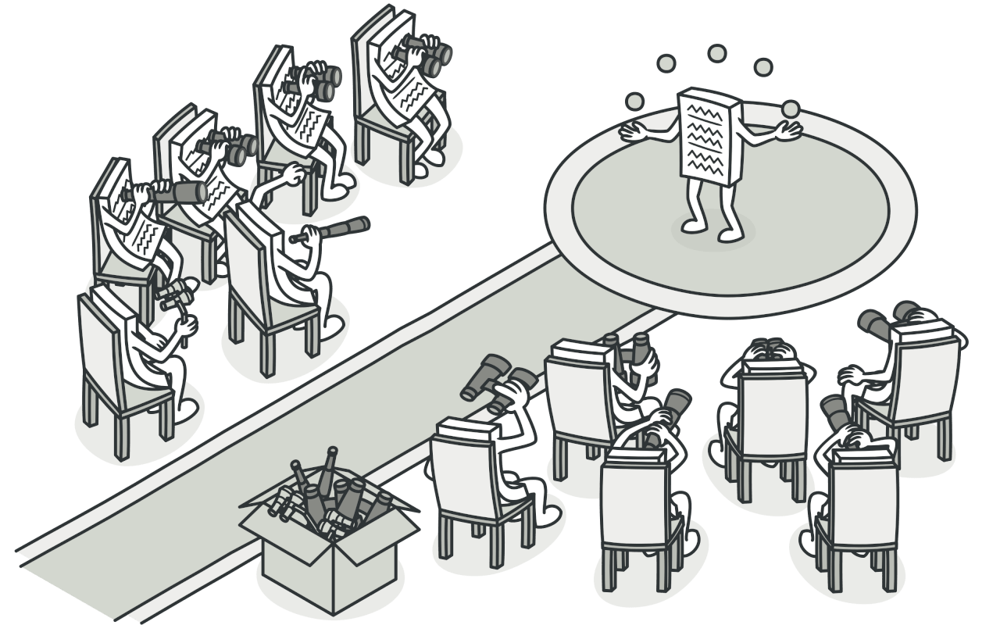
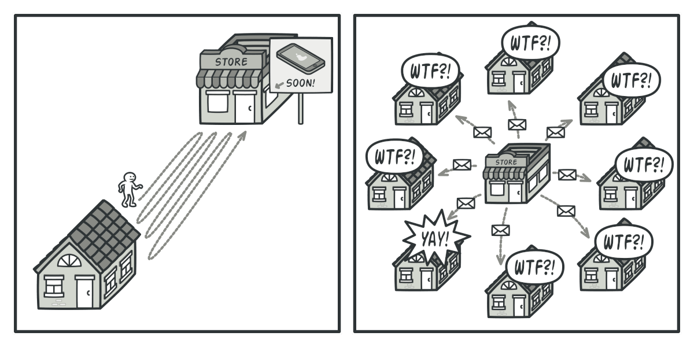
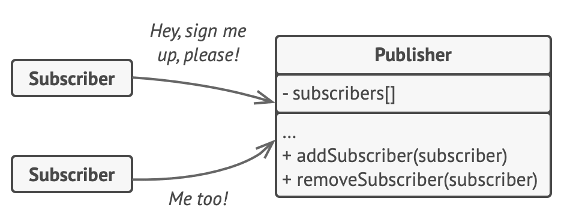
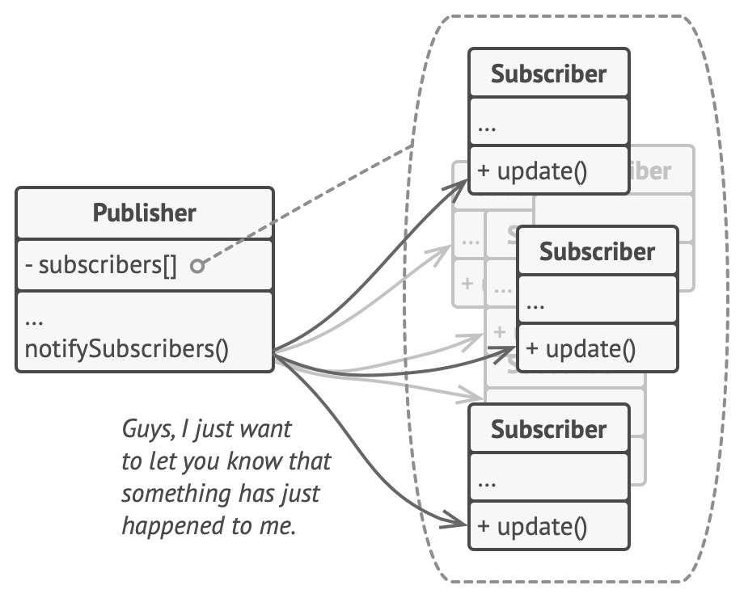
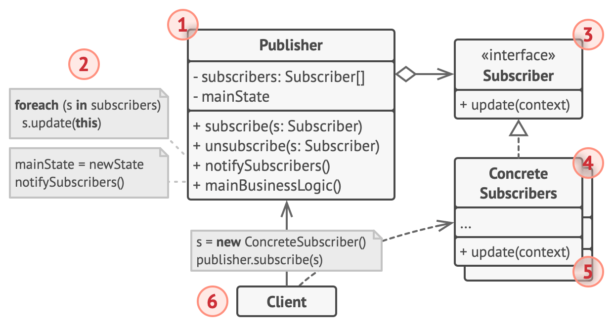
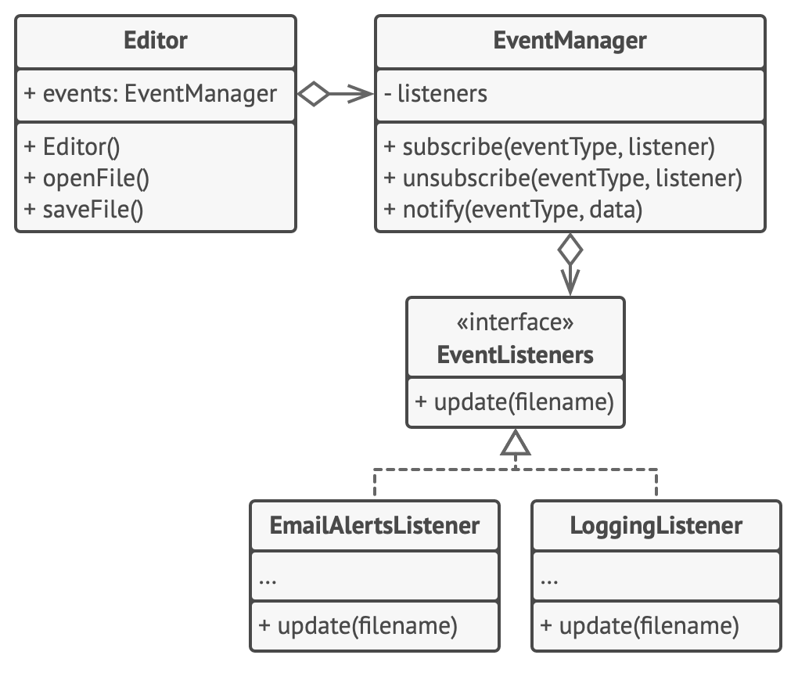

# Observer


**Type:** Behavioral · **Also known as:** Event-Subscriber, Listener

> **The 10-second version:** instead of everyone repeatedly asking "has it changed yet?", the thing that changes keeps a list of who cares and tells them when it happens.

<br clear="all">

## Quick card

| | |
|---|---|
| **Problem it solves** | Several objects need to react when one object changes, and you don't want that object hard-wired to all of them. |
| **Core move** | The publisher keeps a list of subscribers behind one interface and calls `update()` on each when an event happens. |
| **You'll recognise it by** | `subscribe` / `unsubscribe` / `notify` methods, a list of listeners, `+=` on a C# event, `.on()` / `.addEventListener()` in JS. |
| **Rating** | Complexity ★★☆ · Popularity ★★★ |
| **Closest relatives** | Mediator (central coordinator), Chain of Responsibility (one handler, not all), Command (the thing sent), pub/sub (Observer across a broker) |
| **In your stack** | C# `event` / `IObservable<T>`, Node `EventEmitter`, DOM events, RxJS, domain events, RabbitMQ fanout/topic exchanges |

### How to read this file

Technical first, plain English second. 🗣️ marks the plain-English version. Part 1 is Refactoring.Guru's material with their diagrams; Parts 2–7 are code, your stack, and the stuff that makes it stick.

---

# PART 1 — The pattern

## 1. Intent

**Observer** is a behavioral design pattern that lets you define a subscription mechanism to notify multiple objects about any events that happen to the object they’re observing.



### 🗣️ In plain words

One object (the **publisher**) has something interesting going on. Many other objects (the **subscribers**) want to know when it changes. Observer gives the publisher a sign-up sheet. People who care write their name on it; when something happens, the publisher goes down the sheet and tells each of them.

The part that matters: the publisher **doesn't know who's on the sheet** beyond "they all have an `update()` method". You can add a tenth subscriber without editing the publisher at all.

---

## 2. Problem

Imagine that you have two types of objects: a `Customer` and a `Store`. The customer is very interested in a particular brand of product (say, it’s a new model of the iPhone) which should become available in the store very soon.

The customer could visit the store every day and check product availability. But while the product is still en route, most of these trips would be pointless.



*Visiting the store vs. sending spam*

On the other hand, the store could send tons of emails (which might be considered spam) to all customers each time a new product becomes available. This would save some customers from endless trips to the store. At the same time, it’d upset other customers who aren’t interested in new products.

It looks like we’ve got a conflict. Either the customer wastes time checking product availability or the store wastes resources notifying the wrong customers.

### 🗣️ In plain words

There are two bad options and you want neither:

1. **Polling.** Every subscriber keeps asking "is it ready yet?" Wasted work, and latency equal to your poll interval.
2. **Hard-wired broadcast.** The publisher knows every interested party by name and calls them directly.

Option 2 looks like this in real code, and it's everywhere:

```csharp
// ❌ BEFORE — the publisher knows every consumer by name
public class ListingService
{
    public async Task PublishAsync(Listing listing)
    {
        await _repo.SaveAsync(listing);

        await _searchIndexer.IndexAsync(listing);       // coupling #1
        await _emailService.NotifyDealerAsync(listing); // coupling #2
        await _analytics.TrackAsync("published", listing.Id); // coupling #3
        await _cache.InvalidateAsync($"dealer:{listing.DealerId}"); // coupling #4
        // next sprint: push notifications, price-alert matching, sitemap...
    }
}
```

Every new reaction edits `ListingService`. If the email service throws, indexing for the next line never happens. The class that owns "publish a listing" now owns six unrelated concerns.

---

## 3. Solution

The object that has some interesting state is often called *subject*, but since it’s also going to notify other objects about the changes to its state, we’ll call it *publisher*. All other objects that want to track changes to the publisher’s state are called *subscribers*.

The Observer pattern suggests that you add a subscription mechanism to the publisher class so individual objects can subscribe to or unsubscribe from a stream of events coming from that publisher. Fear not! Everything isn’t as complicated as it sounds. In reality, this mechanism consists of 1) an array field for storing a list of references to subscriber objects and 2) several public methods which allow adding subscribers to and removing them from that list.



*A subscription mechanism lets individual objects subscribe to event notifications.*

Now, whenever an important event happens to the publisher, it goes over its subscribers and calls the specific notification method on their objects.

Real apps might have dozens of different subscriber classes that are interested in tracking events of the same publisher class. You wouldn’t want to couple the publisher to all of those classes. Besides, you might not even know about some of them beforehand if your publisher class is supposed to be used by other people.

That’s why it’s crucial that all subscribers implement the same interface and that the publisher communicates with them only via that interface. This interface should declare the notification method along with a set of parameters that the publisher can use to pass some contextual data along with the notification.



*Publisher notifies subscribers by calling the specific notification method on their objects.*

If your app has several different types of publishers and you want to make your subscribers compatible with all of them, you can go even further and make all publishers follow the same interface. This interface would only need to describe a few subscription methods. The interface would allow subscribers to observe publishers’ states without coupling to their concrete classes.

### 🗣️ In plain words

1. **Define one subscriber interface** — usually a single `update(eventData)` method.
2. **Give the publisher a list** of that interface plus `subscribe` / `unsubscribe` methods.
3. **When something happens, loop over the list** and call `update` on each.
4. **Wire subscribers up at the edge** (startup / composition root), not inside the publisher.

> **The key insight:** the dependency arrow flips. Before, the publisher depended on every consumer. After, consumers depend on the publisher's *event*, and the publisher depends on nothing but an interface. That flip is why you can add reactions without touching the source.

---

## 4. Real-world analogy


*Magazine and newspaper subscriptions.*

If you subscribe to a newspaper or magazine, you no longer need to go to the store to check if the next issue is available. Instead, the publisher sends new issues directly to your mailbox right after publication or even in advance.

The publisher maintains a list of subscribers and knows which magazines they’re interested in. Subscribers can leave the list at any time when they wish to stop the publisher sending new magazine issues to them.

### 🗣️ Two more of my own

**The price-drop alert.** On a car site you click "notify me if this car drops below ₹6 lakh". You stop checking the page every morning. When the dealer changes the price, the system goes through everyone who asked and sends them a message. Unsubscribing is one click, and the dealer never learns your name.

**The group chat vs. calling everyone.** If the school cancels class, the teacher posts once in the class WhatsApp group. They don't phone 40 parents. New parents join the group and get the next message without the teacher changing anything.

---

## 5. Structure



1. The **Publisher** issues events of interest to other objects. These events occur when the publisher changes its state or executes some behaviors. Publishers contain a subscription infrastructure that lets new subscribers join and current subscribers leave the list.
2. When a new event happens, the publisher goes over the subscription list and calls the notification method declared in the subscriber interface on each subscriber object.
3. The **Subscriber** interface declares the notification interface. In most cases, it consists of a single `update` method. The method may have several parameters that let the publisher pass some event details along with the update.
4. **Concrete Subscribers** perform some actions in response to notifications issued by the publisher. All of these classes must implement the same interface so the publisher isn’t coupled to concrete classes.
5. Usually, subscribers need some contextual information to handle the update correctly. For this reason, publishers often pass some context data as arguments of the notification method. The publisher can pass itself as an argument, letting subscriber fetch any required data directly.
6. The **Client** creates publisher and subscriber objects separately and then registers subscribers for publisher updates.

### 🗣️ Participants & roles — cheat table

| Role | What it is in code | Site example | Your stack |
|---|---|---|---|
| **Publisher** (Subject) | Owns state/events + subscriber list + `subscribe`/`unsubscribe`/`notify` | `Editor` + `EventManager` | `ListingService` raising `ListingPublished` |
| **Subscriber** interface | One `update(data)` method | `EventListener` | `IListingEventHandler`, a C# delegate, a JS callback |
| **Concrete Subscribers** | React to the event | `LoggingListener`, `EmailAlertsListener` | `SearchIndexer`, `DealerEmailer`, `CacheInvalidator` |
| **Client** | Creates publisher + subscribers, wires them together | `Application.config()` | `Program.cs` / DI registration |

### 🤝 Collaboration — who calls whom

```
Startup (client)
  │  publisher.subscribe(indexer)
  │  publisher.subscribe(emailer)
  │  publisher.subscribe(cache)
  ▼
Publisher.subscribers = [indexer, emailer, cache]     ← only knows the interface

... later, something happens ...

Publisher.publish(listing)
  │
  │  notify(event)  → for each s in subscribers:
  ├──────────────►  indexer.update(event)
  ├──────────────►  emailer.update(event)
  └──────────────►  cache.update(event)
                         │
                         │ (optional "pull"): subscriber reads more state
                         ▼
                    event.source.getSomething()
```

The loop in `notify` is the whole pattern. Everything else is bookkeeping.

---

## 6. Pseudocode (the website's example)

In this example, the **Observer** pattern lets the text editor object notify other service objects about changes in its state.



*Notifying objects about events that happen to other objects.*

The list of subscribers is compiled dynamically: objects can start or stop listening to notifications at runtime, depending on the desired behavior of your app.

In this implementation, the editor class doesn’t maintain the subscription list by itself. It delegates this job to the special helper object devoted to just that. You could upgrade that object to serve as a centralized event dispatcher, letting any object act as a publisher.

Adding new subscribers to the program doesn’t require changes to existing publisher classes, as long as they work with all subscribers through the same interface.

```
// The base publisher class includes subscription management
// code and notification methods.
class EventManager is
    private field listeners: hash map of event types and listeners

    method subscribe(eventType, listener) is
        listeners.add(eventType, listener)

    method unsubscribe(eventType, listener) is
        listeners.remove(eventType, listener)

    method notify(eventType, data) is
        foreach (listener in listeners.of(eventType)) do
            listener.update(data)

// The concrete publisher contains real business logic that's
// interesting for some subscribers. We could derive this class
// from the base publisher, but that isn't always possible in
// real life because the concrete publisher might already be a
// subclass. In this case, you can patch the subscription logic
// in with composition, as we did here.
class Editor is
    public field events: EventManager
    private field file: File

    constructor Editor() is
        events = new EventManager()

    // Methods of business logic can notify subscribers about
    // changes.
    method openFile(path) is
        this.file = new File(path)
        events.notify("open", file.name)

    method saveFile() is
        file.write()
        events.notify("save", file.name)

    // ...

// Here's the subscriber interface. If your programming language
// supports functional types, you can replace the whole
// subscriber hierarchy with a set of functions.
interface EventListener is
    method update(filename)

// Concrete subscribers react to updates issued by the publisher
// they are attached to.
class LoggingListener implements EventListener is
    private field log: File
    private field message: string

    constructor LoggingListener(log_filename, message) is
        this.log = new File(log_filename)
        this.message = message

    method update(filename) is
        log.write(replace('%s',filename,message))

class EmailAlertsListener implements EventListener is
    private field email: string
    private field message: string

    constructor EmailAlertsListener(email, message) is
        this.email = email
        this.message = message

    method update(filename) is
        system.email(email, replace('%s',filename,message))

// An application can configure publishers and subscribers at
// runtime.
class Application is
    method config() is
        editor = new Editor()

        logger = new LoggingListener(
            "/path/to/log.txt",
            "Someone has opened the file: %s")
        editor.events.subscribe("open", logger)

        emailAlerts = new EmailAlertsListener(
            "admin@example.com",
            "Someone has changed the file: %s")
        editor.events.subscribe("save", emailAlerts)
```

### 🗣️ Reading that pseudocode

- `EventManager` is a **separate helper object**, not a base class. `Editor` *has* an event manager. That's composition, and it's the version that scales.
- Subscriptions are **keyed by event type** (`"open"`, `"save"`). Subscribers pick which events they care about.
- `Editor.openFile()` and `saveFile()` just call `events.notify(...)`. The editor has no idea logging or email exists.
- `LoggingListener` and `EmailAlertsListener` hold their own config (log path, email address). The publisher passes only the event data.
- `Application.config()` is where the wiring happens — the one place that knows who listens to what.

---

## 7. Applicability — when to reach for it

**Use the Observer pattern when changes to the state of one object may require changing other objects, and the actual set of objects is unknown beforehand or changes dynamically.**

You can often experience this problem when working with classes of the graphical user interface. For example, you created custom button classes, and you want to let the clients hook some custom code to your buttons so that it fires whenever a user presses a button.

The Observer pattern lets any object that implements the subscriber interface subscribe for event notifications in publisher objects. You can add the subscription mechanism to your buttons, letting the clients hook up their custom code via custom subscriber classes.

**Use the pattern when some objects in your app must observe others, but only for a limited time or in specific cases.**

The subscription list is dynamic, so subscribers can join or leave the list whenever they need to.

### ✅ Quick checklist

- [ ] One thing changes and **several** other things need to react.
- [ ] The set of reactors **changes over time** or isn't known when you write the publisher.
- [ ] The publisher **shouldn't care** whether anyone is listening.
- [ ] Reactions are **side effects**, not a result the publisher needs back.
- [ ] You'd otherwise be adding a new line to the publisher each sprint.

If the publisher needs a *return value* from the reactor, that's not Observer — that's a normal call, or Chain of Responsibility.

---

## 8. How to implement — step by step

1. Look over your business logic and try to break it down into two parts: the core functionality, independent from other code, will act as the publisher; the rest will turn into a set of subscriber classes.
2. Declare the subscriber interface. At a bare minimum, it should declare a single `update` method.
3. Declare the publisher interface and describe a pair of methods for adding a subscriber object to and removing it from the list. Remember that publishers must work with subscribers only via the subscriber interface.
4. Decide where to put the actual subscription list and the implementation of subscription methods. Usually, this code looks the same for all types of publishers, so the obvious place to put it is in an abstract class derived directly from the publisher interface. Concrete publishers extend that class, inheriting the subscription behavior.

   However, if you’re applying the pattern to an existing class hierarchy, consider an approach based on composition: put the subscription logic into a separate object, and make all real publishers use it.
5. Create concrete publisher classes. Each time something important happens inside a publisher, it must notify all its subscribers.
6. Implement the update notification methods in concrete subscriber classes. Most subscribers would need some context data about the event. It can be passed as an argument of the notification method.

   But there’s another option. Upon receiving a notification, the subscriber can fetch any data directly from the notification. In this case, the publisher must pass itself via the update method. The less flexible option is to link a publisher to the subscriber permanently via the constructor.
7. The client must create all necessary subscribers and register them with proper publishers.

### 🗣️ The same steps, blunt version

1. Split your class into "the thing that happens" and "the reactions to it".
2. Write a subscriber interface with one method.
3. Put a list + `Subscribe`/`Unsubscribe` in the publisher (or in a helper it owns).
4. Call every subscriber when the event fires.
5. Turn each reaction into its own subscriber class.
6. Register them at startup.
7. **Decide your failure policy** — what happens when subscriber #2 throws? (The site doesn't dwell on this. Production code must.)

---

## 9. Pros and cons

- ✅ *Open/Closed Principle*. You can introduce new subscriber classes without having to change the publisher’s code (and vice versa if there’s a publisher interface).
- ✅ You can establish relations between objects at runtime.

- ⛔ Subscribers are notified in random order.

### ⚖️ Honest trade-offs from the trenches

**"Subscribers are notified in random order" is the polite version of the real con.** The bigger problems in production are:

- **Invisible control flow.** Reading `ListingService.PublishAsync` no longer tells you what happens when a listing is published. You have to go find every registration. Good naming and one registration file per event help a lot.
- **Error isolation.** In a naive `foreach`, one throwing subscriber stops the rest. You must decide: catch-and-log per subscriber, or fail the whole thing.
- **Memory leaks.** The publisher holds references to subscribers. If a short-lived object subscribes to a long-lived publisher and never unsubscribes, it never gets garbage-collected. This is the #1 C# event bug.
- **Cascades.** Subscriber A's reaction fires event B, whose subscriber fires event A... Now you have an infinite loop across three files.

**You almost never hand-roll this in 2026.** C# has `event` and `IObservable<T>`, Node has `EventEmitter`, browsers have `addEventListener`, and RxJS/Rx.NET exist. Learn the pattern so you understand those tools; use the tools.

---

## 10. Relations with other patterns

- [Chain of Responsibility](https://refactoring.guru/design-patterns/chain-of-responsibility), [Command](https://refactoring.guru/design-patterns/command), [Mediator](https://refactoring.guru/design-patterns/mediator) and [Observer](https://refactoring.guru/design-patterns/observer) address various ways of connecting senders and receivers of requests:

  - *Chain of Responsibility* passes a request sequentially along a dynamic chain of potential receivers until one of them handles it.
  - *Command* establishes unidirectional connections between senders and receivers.
  - *Mediator* eliminates direct connections between senders and receivers, forcing them to communicate indirectly via a mediator object.
  - *Observer* lets receivers dynamically subscribe to and unsubscribe from receiving requests.
- The difference between [Mediator](https://refactoring.guru/design-patterns/mediator) and [Observer](https://refactoring.guru/design-patterns/observer) is often elusive. In most cases, you can implement either of these patterns; but sometimes you can apply both simultaneously. Let’s see how we can do that.

  The primary goal of *Mediator* is to eliminate mutual dependencies among a set of system components. Instead, these components become dependent on a single mediator object. The goal of *Observer* is to establish dynamic one-way connections between objects, where some objects act as subordinates of others.

  There’s a popular implementation of the *Mediator* pattern that relies on *Observer*. The mediator object plays the role of publisher, and the components act as subscribers which subscribe to and unsubscribe from the mediator’s events. When *Mediator* is implemented this way, it may look very similar to *Observer*.

  When you’re confused, remember that you can implement the Mediator pattern in other ways. For example, you can permanently link all the components to the same mediator object. This implementation won’t resemble *Observer* but will still be an instance of the Mediator pattern.

  Now imagine a program where all components have become publishers, allowing dynamic connections between each other. There won’t be a centralized mediator object, only a distributed set of observers.

### 🗣️ Disambiguation table

| | Who receives the message | Does sender know receivers? | Typical shape |
|---|---|---|---|
| **Observer** | **All** subscribers | Only via an interface/list | `subscribe` / `notify` |
| **Mediator** | Whoever the mediator decides | No — components only know the mediator | Central coordinator with rules |
| **Chain of Responsibility** | **One** handler (the first that accepts), or each in order | Only the next link | `handler.SetNext(...)` |
| **Pub/Sub (broker)** | All subscribers of a topic | **No** — not even the list; the broker holds it | RabbitMQ exchange, Kafka topic |
| **Command** | Whoever executes it | Varies | The *message object* itself |

**Memorise:** *Observer broadcasts to everyone who signed up; Mediator decides who should hear it; Chain passes it along until someone handles it.*

**Observer vs. Pub/Sub:** in Observer, the publisher holds the subscriber list in memory and calls them directly (same process, synchronous by default). In pub/sub, a broker sits in between — publisher and subscribers don't know each other exist, may run on different machines, and delivery is asynchronous. Pub/sub is "Observer across a network with a broker as the list".

---

# PART 2 — Official code examples from Refactoring.Guru

## 2.1 C#

**Complexity:** ★★☆ (2/3)

**Popularity:** ★★★ (3/3)

**Usage examples:** The Observer pattern is pretty common in C# code, especially in the GUI components. It provides a way to react to events happening in other objects without coupling to their classes.

**Identification:** The pattern can be recognized by subscription methods, that store objects in a list and by calls to the update method issued to objects in that list.

### Conceptual Example

This example illustrates the structure of the **Observer** design pattern. It focuses on answering these questions:

- What classes does it consist of?
- What roles do these classes play?
- In what way the elements of the pattern are related?

##### **Program.cs:** Conceptual example

```csharp
using System;
using System.Collections.Generic;
using System.Threading;

namespace RefactoringGuru.DesignPatterns.Observer.Conceptual
{
    public interface IObserver
    {
        // Receive update from subject
        void Update(ISubject subject);
    }

    public interface ISubject
    {
        // Attach an observer to the subject.
        void Attach(IObserver observer);

        // Detach an observer from the subject.
        void Detach(IObserver observer);

        // Notify all observers about an event.
        void Notify();
    }

    // The Subject owns some important state and notifies observers when the
    // state changes.
    public class Subject : ISubject
    {
        // For the sake of simplicity, the Subject's state, essential to all
        // subscribers, is stored in this variable.
        public int State { get; set; } = -0;

        // List of subscribers. In real life, the list of subscribers can be
        // stored more comprehensively (categorized by event type, etc.).
        private List<IObserver> _observers = new List<IObserver>();

        // The subscription management methods.
        public void Attach(IObserver observer)
        {
            Console.WriteLine("Subject: Attached an observer.");
            this._observers.Add(observer);
        }

        public void Detach(IObserver observer)
        {
            this._observers.Remove(observer);
            Console.WriteLine("Subject: Detached an observer.");
        }

        // Trigger an update in each subscriber.
        public void Notify()
        {
            Console.WriteLine("Subject: Notifying observers...");

            foreach (var observer in _observers)
            {
                observer.Update(this);
            }
        }

        // Usually, the subscription logic is only a fraction of what a Subject
        // can really do. Subjects commonly hold some important business logic,
        // that triggers a notification method whenever something important is
        // about to happen (or after it).
        public void SomeBusinessLogic()
        {
            Console.WriteLine("\nSubject: I'm doing something important.");
            this.State = new Random().Next(0, 10);

            Thread.Sleep(15);

            Console.WriteLine("Subject: My state has just changed to: " + this.State);
            this.Notify();
        }
    }

    // Concrete Observers react to the updates issued by the Subject they had
    // been attached to.
    class ConcreteObserverA : IObserver
    {
        public void Update(ISubject subject)
        {
            if ((subject as Subject).State < 3)
            {
                Console.WriteLine("ConcreteObserverA: Reacted to the event.");
            }
        }
    }

    class ConcreteObserverB : IObserver
    {
        public void Update(ISubject subject)
        {
            if ((subject as Subject).State == 0 || (subject as Subject).State >= 2)
            {
                Console.WriteLine("ConcreteObserverB: Reacted to the event.");
            }
        }
    }

    class Program
    {
        static void Main(string[] args)
        {
            // The client code.
            var subject = new Subject();
            var observerA = new ConcreteObserverA();
            subject.Attach(observerA);

            var observerB = new ConcreteObserverB();
            subject.Attach(observerB);

            subject.SomeBusinessLogic();
            subject.SomeBusinessLogic();

            subject.Detach(observerB);

            subject.SomeBusinessLogic();
        }
    }
}
```

##### **Output.txt:** Execution result

```output
Subject: Attached an observer.
Subject: Attached an observer.

Subject: I'm doing something important.
Subject: My state has just changed to: 2
Subject: Notifying observers...
ConcreteObserverA: Reacted to the event.
ConcreteObserverB: Reacted to the event.

Subject: I'm doing something important.
Subject: My state has just changed to: 1
Subject: Notifying observers...
ConcreteObserverA: Reacted to the event.
Subject: Detached an observer.

Subject: I'm doing something important.
Subject: My state has just changed to: 5
Subject: Notifying observers...
```

## 2.2 TypeScript

**Complexity:** ★★☆ (2/3)

**Popularity:** ★★★ (3/3)

**Usage examples:** The Observer pattern is pretty common in TypeScript code, especially in the GUI components. It provides a way to react to events happening in other objects without coupling to their classes.

**Identification:** The pattern can be recognized by subscription methods, that store objects in a list and by calls to the update method issued to objects in that list.

### Conceptual Example

This example illustrates the structure of the **Observer** design pattern and focuses on the following questions:

- What classes does it consist of?
- What roles do these classes play?
- In what way the elements of the pattern are related?

##### **index.ts:** Conceptual example

```typescript
/**
 * The Subject interface declares a set of methods for managing subscribers.
 */
interface Subject {
    // Attach an observer to the subject.
    attach(observer: Observer): void;

    // Detach an observer from the subject.
    detach(observer: Observer): void;

    // Notify all observers about an event.
    notify(): void;
}

/**
 * The Subject owns some important state and notifies observers when the state
 * changes.
 */
class ConcreteSubject implements Subject {
    /**
     * @type {number} For the sake of simplicity, the Subject's state, essential
     * to all subscribers, is stored in this variable.
     */
    public state: number;

    /**
     * @type {Observer[]} List of subscribers. In real life, the list of
     * subscribers can be stored more comprehensively (categorized by event
     * type, etc.).
     */
    private observers: Observer[] = [];

    /**
     * The subscription management methods.
     */
    public attach(observer: Observer): void {
        const isExist = this.observers.includes(observer);
        if (isExist) {
            return console.log('Subject: Observer has been attached already.');
        }

        console.log('Subject: Attached an observer.');
        this.observers.push(observer);
    }

    public detach(observer: Observer): void {
        const observerIndex = this.observers.indexOf(observer);
        if (observerIndex === -1) {
            return console.log('Subject: Nonexistent observer.');
        }

        this.observers.splice(observerIndex, 1);
        console.log('Subject: Detached an observer.');
    }

    /**
     * Trigger an update in each subscriber.
     */
    public notify(): void {
        console.log('Subject: Notifying observers...');
        for (const observer of this.observers) {
            observer.update(this);
        }
    }

    /**
     * Usually, the subscription logic is only a fraction of what a Subject can
     * really do. Subjects commonly hold some important business logic, that
     * triggers a notification method whenever something important is about to
     * happen (or after it).
     */
    public someBusinessLogic(): void {
        console.log('\nSubject: I\'m doing something important.');
        this.state = Math.floor(Math.random() * (10 + 1));

        console.log(`Subject: My state has just changed to: ${this.state}`);
        this.notify();
    }
}

/**
 * The Observer interface declares the update method, used by subjects.
 */
interface Observer {
    // Receive update from subject.
    update(subject: Subject): void;
}

/**
 * Concrete Observers react to the updates issued by the Subject they had been
 * attached to.
 */
class ConcreteObserverA implements Observer {
    public update(subject: Subject): void {
        if (subject instanceof ConcreteSubject && subject.state < 3) {
            console.log('ConcreteObserverA: Reacted to the event.');
        }
    }
}

class ConcreteObserverB implements Observer {
    public update(subject: Subject): void {
        if (subject instanceof ConcreteSubject && (subject.state === 0 || subject.state >= 2)) {
            console.log('ConcreteObserverB: Reacted to the event.');
        }
    }
}

/**
 * The client code.
 */

const subject = new ConcreteSubject();

const observer1 = new ConcreteObserverA();
subject.attach(observer1);

const observer2 = new ConcreteObserverB();
subject.attach(observer2);

subject.someBusinessLogic();
subject.someBusinessLogic();

subject.detach(observer2);

subject.someBusinessLogic();
```

##### **Output.txt:** Execution result

```output
Subject: Attached an observer.
Subject: Attached an observer.

Subject: I'm doing something important.
Subject: My state has just changed to: 6
Subject: Notifying observers...
ConcreteObserverB: Reacted to the event.

Subject: I'm doing something important.
Subject: My state has just changed to: 1
Subject: Notifying observers...
ConcreteObserverA: Reacted to the event.
Subject: Detached an observer.

Subject: I'm doing something important.
Subject: My state has just changed to: 5
Subject: Notifying observers...
```

## 2.3 C++

**Complexity:** ★★☆ (2/3)

**Popularity:** ★★★ (3/3)

**Usage examples:** The Observer pattern is pretty common in C++ code, especially in the GUI components. It provides a way to react to events happening in other objects without coupling to their classes.

**Identification:** The pattern can be recognized by subscription methods, that store objects in a list and by calls to the update method issued to objects in that list.

### Conceptual Example

This example illustrates the structure of the **Observer** design pattern. It focuses on answering these questions:

- What classes does it consist of?
- What roles do these classes play?
- In what way the elements of the pattern are related?

##### **main.cc:** Conceptual example

```cpp
/**
 * Observer Design Pattern
 *
 * Intent: Lets you define a subscription mechanism to notify multiple objects
 * about any events that happen to the object they're observing.
 *
 * Note that there's a lot of different terms with similar meaning associated
 * with this pattern. Just remember that the Subject is also called the
 * Publisher and the Observer is often called the Subscriber and vice versa.
 * Also the verbs "observe", "listen" or "track" usually mean the same thing.
 */

#include <iostream>
#include <list>
#include <string>

class IObserver {
 public:
  virtual ~IObserver(){};
  virtual void Update(const std::string &message_from_subject) = 0;
};

class ISubject {
 public:
  virtual ~ISubject(){};
  virtual void Attach(IObserver *observer) = 0;
  virtual void Detach(IObserver *observer) = 0;
  virtual void Notify() = 0;
};

/**
 * The Subject owns some important state and notifies observers when the state
 * changes.
 */

class Subject : public ISubject {
 public:
  virtual ~Subject() {
    std::cout << "Goodbye, I was the Subject.\n";
  }

  /**
   * The subscription management methods.
   */
  void Attach(IObserver *observer) override {
    list_observer_.push_back(observer);
  }
  void Detach(IObserver *observer) override {
    list_observer_.remove(observer);
  }
  void Notify() override {
    std::list<IObserver *>::iterator iterator = list_observer_.begin();
    HowManyObserver();
    while (iterator != list_observer_.end()) {
      (*iterator)->Update(message_);
      ++iterator;
    }
  }

  void CreateMessage(std::string message = "Empty") {
    this->message_ = message;
    Notify();
  }
  void HowManyObserver() {
    std::cout << "There are " << list_observer_.size() << " observers in the list.\n";
  }

  /**
   * Usually, the subscription logic is only a fraction of what a Subject can
   * really do. Subjects commonly hold some important business logic, that
   * triggers a notification method whenever something important is about to
   * happen (or after it).
   */
  void SomeBusinessLogic() {
    this->message_ = "change message message";
    Notify();
    std::cout << "I'm about to do some thing important\n";
  }

 private:
  std::list<IObserver *> list_observer_;
  std::string message_;
};

class Observer : public IObserver {
 public:
  Observer(Subject &subject) : subject_(subject) {
    this->subject_.Attach(this);
    std::cout << "Hi, I'm the Observer \"" << ++Observer::static_number_ << "\".\n";
    this->number_ = Observer::static_number_;
  }
  virtual ~Observer() {
    std::cout << "Goodbye, I was the Observer \"" << this->number_ << "\".\n";
  }

  void Update(const std::string &message_from_subject) override {
    message_from_subject_ = message_from_subject;
    PrintInfo();
  }
  void RemoveMeFromTheList() {
    subject_.Detach(this);
    std::cout << "Observer \"" << number_ << "\" removed from the list.\n";
  }
  void PrintInfo() {
    std::cout << "Observer \"" << this->number_ << "\": a new message is available --> " << this->message_from_subject_ << "\n";
  }

 private:
  std::string message_from_subject_;
  Subject &subject_;
  static int static_number_;
  int number_;
};

int Observer::static_number_ = 0;

void ClientCode() {
  Subject *subject = new Subject;
  Observer *observer1 = new Observer(*subject);
  Observer *observer2 = new Observer(*subject);
  Observer *observer3 = new Observer(*subject);
  Observer *observer4;
  Observer *observer5;

  subject->CreateMessage("Hello World! :D");
  observer3->RemoveMeFromTheList();

  subject->CreateMessage("The weather is hot today! :p");
  observer4 = new Observer(*subject);

  observer2->RemoveMeFromTheList();
  observer5 = new Observer(*subject);

  subject->CreateMessage("My new car is great! ;)");
  observer5->RemoveMeFromTheList();

  observer4->RemoveMeFromTheList();
  observer1->RemoveMeFromTheList();

  delete observer5;
  delete observer4;
  delete observer3;
  delete observer2;
  delete observer1;
  delete subject;
}

int main() {
  ClientCode();
  return 0;
}
```

##### **Output.txt:** Execution result

```output
Hi, I'm the Observer "1".
Hi, I'm the Observer "2".
Hi, I'm the Observer "3".
There are 3 observers in the list.
Observer "1": a new message is available --> Hello World! :D
Observer "2": a new message is available --> Hello World! :D
Observer "3": a new message is available --> Hello World! :D
Observer "3" removed from the list.
There are 2 observers in the list.
Observer "1": a new message is available --> The weather is hot today! :p
Observer "2": a new message is available --> The weather is hot today! :p
Hi, I'm the Observer "4".
Observer "2" removed from the list.
Hi, I'm the Observer "5".
There are 3 observers in the list.
Observer "1": a new message is available --> My new car is great! ;)
Observer "4": a new message is available --> My new car is great! ;)
Observer "5": a new message is available --> My new car is great! ;)
Observer "5" removed from the list.
Observer "4" removed from the list.
Observer "1" removed from the list.
Goodbye, I was the Observer "5".
Goodbye, I was the Observer "4".
Goodbye, I was the Observer "3".
Goodbye, I was the Observer "2".
Goodbye, I was the Observer "1".
Goodbye, I was the Subject.
```

## 2.4 Java

**Complexity:** ★★☆ (2/3)

**Popularity:** ★★★ (3/3)

**Usage examples:** The Observer pattern is pretty common in Java code, especially in the GUI components. It provides a way to react to events happening in other objects without coupling to their classes.

**Identification:** The pattern can be recognized if you see a subscription method that stores incoming objects in a list. You can confirm the identification, if you see some sort of notification method that iterates over objects in that list and calls their “update” method.

### Event subscription

In this example, the Observer pattern establishes indirect collaboration between objects of a text editor. Each time the `Editor` object changes, it notifies its subscribers. `EmailNotificationListener` and `LogOpenListener` react to these notifications by executing their primary behaviors.

Subscriber classes aren’t coupled to the editor class and can be reused in other apps if needed. The `Editor` class depends only on the abstract subscriber interface. This allows adding new subscriber types without changing the editor’s code.

#### **publisher**

##### **publisher/EventManager.java:** Basic publisher

```java
package refactoring_guru.observer.example.publisher;

import refactoring_guru.observer.example.listeners.EventListener;

import java.io.File;
import java.util.ArrayList;
import java.util.HashMap;
import java.util.List;
import java.util.Map;

public class EventManager {
    Map<String, List<EventListener>> listeners = new HashMap<>();

    public EventManager(String... operations) {
        for (String operation : operations) {
            this.listeners.put(operation, new ArrayList<>());
        }
    }

    public void subscribe(String eventType, EventListener listener) {
        List<EventListener> users = listeners.get(eventType);
        users.add(listener);
    }

    public void unsubscribe(String eventType, EventListener listener) {
        List<EventListener> users = listeners.get(eventType);
        users.remove(listener);
    }

    public void notify(String eventType, File file) {
        List<EventListener> users = listeners.get(eventType);
        for (EventListener listener : users) {
            listener.update(eventType, file);
        }
    }
}
```

#### **editor**

##### **editor/Editor.java:** Concrete publisher, tracked by other objects

```java
package refactoring_guru.observer.example.editor;

import refactoring_guru.observer.example.publisher.EventManager;

import java.io.File;

public class Editor {
    public EventManager events;
    private File file;

    public Editor() {
        this.events = new EventManager("open", "save");
    }

    public void openFile(String filePath) {
        this.file = new File(filePath);
        events.notify("open", file);
    }

    public void saveFile() throws Exception {
        if (this.file != null) {
            events.notify("save", file);
        } else {
            throw new Exception("Please open a file first.");
        }
    }
}
```

#### **listeners**

##### **listeners/EventListener.java:** Common observer interface

```java
package refactoring_guru.observer.example.listeners;

import java.io.File;

public interface EventListener {
    void update(String eventType, File file);
}
```

##### **listeners/EmailNotificationListener.java:** Sends emails upon receiving notification

```java
package refactoring_guru.observer.example.listeners;

import java.io.File;

public class EmailNotificationListener implements EventListener {
    private String email;

    public EmailNotificationListener(String email) {
        this.email = email;
    }

    @Override
    public void update(String eventType, File file) {
        System.out.println("Email to " + email + ": Someone has performed " + eventType + " operation with the following file: " + file.getName());
    }
}
```

##### **listeners/LogOpenListener.java:** Writes a message to a log upon receiving notification

```java
package refactoring_guru.observer.example.listeners;

import java.io.File;

public class LogOpenListener implements EventListener {
    private File log;

    public LogOpenListener(String fileName) {
        this.log = new File(fileName);
    }

    @Override
    public void update(String eventType, File file) {
        System.out.println("Save to log " + log + ": Someone has performed " + eventType + " operation with the following file: " + file.getName());
    }
}
```

##### **Demo.java:** Initialization code

```java
package refactoring_guru.observer.example;

import refactoring_guru.observer.example.editor.Editor;
import refactoring_guru.observer.example.listeners.EmailNotificationListener;
import refactoring_guru.observer.example.listeners.LogOpenListener;

public class Demo {
    public static void main(String[] args) {
        Editor editor = new Editor();
        editor.events.subscribe("open", new LogOpenListener("/path/to/log/file.txt"));
        editor.events.subscribe("save", new EmailNotificationListener("admin@example.com"));

        try {
            editor.openFile("test.txt");
            editor.saveFile();
        } catch (Exception e) {
            e.printStackTrace();
        }
    }
}
```

##### **OutputDemo.txt:** Execution result

```output
Save to log \path\to\log\file.txt: Someone has performed open operation with the following file: test.txt
Email to admin@example.com: Someone has performed save operation with the following file: test.txt
```

---

# PART 3 — Learn it by building it

## 3.1 The dumbest possible version — TypeScript

```typescript
// ── 1. The event data ───────────────────────────────────────────────────
interface ListingPublished {
  listingId: string;
  dealerId: string;
  price: number;
  make: string;
}

// ── 2. The Subscriber interface ─────────────────────────────────────────
interface ListingSubscriber {
  update(event: ListingPublished): Promise<void>;
}

// ── 3. The Publisher ────────────────────────────────────────────────────
class ListingPublisher {
  private subscribers = new Set<ListingSubscriber>();   // Set = no double-subscribe

  subscribe(s: ListingSubscriber): () => void {
    this.subscribers.add(s);
    return () => this.subscribers.delete(s);            // 👈 return an unsubscribe fn
  }

  async publish(event: ListingPublished): Promise<void> {
    // 👈 THE PATTERN: loop over everyone, isolate failures
    const results = await Promise.allSettled(
      [...this.subscribers].map(s => s.update(event))
    );
    results.forEach((r, i) => {
      if (r.status === "rejected") console.error(`subscriber #${i} failed:`, r.reason);
    });
  }
}

// ── 4. Concrete Subscribers ─────────────────────────────────────────────
class SearchIndexer implements ListingSubscriber {
  async update(e: ListingPublished) {
    console.log(`[search] indexing ${e.listingId}`);
  }
}

class DealerEmailer implements ListingSubscriber {
  async update(e: ListingPublished) {
    console.log(`[email] telling dealer ${e.dealerId} their listing is live`);
  }
}

class PriceAlertMatcher implements ListingSubscriber {
  constructor(private alerts: { userId: string; make: string; maxPrice: number }[]) {}
  async update(e: ListingPublished) {
    const hits = this.alerts.filter(a => a.make === e.make && e.price <= a.maxPrice);
    hits.forEach(a => console.log(`[alert] ping ${a.userId}: ${e.make} at ₹${e.price}`));
  }
}

class FlakySubscriber implements ListingSubscriber {
  async update() { throw new Error("analytics is down"); }
}

// ── 5. Wiring (composition root) ────────────────────────────────────────
const publisher = new ListingPublisher();
publisher.subscribe(new SearchIndexer());
publisher.subscribe(new DealerEmailer());
publisher.subscribe(new FlakySubscriber());           // proves failure isolation
const stopAlerts = publisher.subscribe(
  new PriceAlertMatcher([{ userId: "u-7", make: "Maruti", maxPrice: 600000 }])
);

await publisher.publish({ listingId: "L1", dealerId: "D9", price: 550000, make: "Maruti" });
stopAlerts();                                          // unsubscribe
await publisher.publish({ listingId: "L2", dealerId: "D9", price: 540000, make: "Maruti" });
```

**What to notice:**

- `subscribe` returns an **unsubscribe function**. That's the idiomatic JS/TS shape (React `useEffect`, RxJS, Redux all do this), and it makes leaks much harder.
- `Promise.allSettled` means the flaky subscriber doesn't stop search indexing. **Failure isolation is a decision you make**, not a default.
- `ListingPublisher` has no import of `SearchIndexer` or `DealerEmailer`. That's the point.

**The idiomatic Node version** — you'd normally just use `EventEmitter`:

```typescript
import { EventEmitter } from "node:events";

const listings = new EventEmitter();
listings.on("published", (e: ListingPublished) => console.log("[search]", e.listingId));
listings.on("published", (e: ListingPublished) => console.log("[email]", e.dealerId));
listings.emit("published", { listingId: "L1", dealerId: "D9", price: 550000, make: "Maruti" });
```

⚠️ `EventEmitter` calls listeners **synchronously, in order**, and a throwing listener throws out of `emit()`. Also, an `"error"` event with no listener crashes the process. Know those two facts before relying on it.

## 3.2 Same thing in C#

C# has Observer **built into the language** as `event`. Here's the idiomatic version first, then the pitfalls.

```csharp
using System;
using System.Collections.Generic;
using System.Threading.Tasks;

public sealed record ListingPublished(string ListingId, string DealerId, decimal Price, string Make);

// ── Publisher using a C# event ──────────────────────────────────────────
public sealed class ListingService
{
    // 👇 the subscriber list + subscribe/unsubscribe, generated by the compiler
    public event EventHandler<ListingPublished>? Published;

    public void Publish(ListingPublished e)
    {
        // save to DB ...
        OnPublished(e);
    }

    private void OnPublished(ListingPublished e)
    {
        // 👇 copy the delegate so a concurrent unsubscribe can't null it mid-call
        var handlers = Published;
        if (handlers is null) return;

        // 👇 invoke one at a time so one failure doesn't stop the rest
        foreach (EventHandler<ListingPublished> h in handlers.GetInvocationList())
        {
            try { h(this, e); }
            catch (Exception ex) { Console.WriteLine($"subscriber failed: {ex.Message}"); }
        }
    }
}

// ── Subscribers ─────────────────────────────────────────────────────────
public sealed class SearchIndexer
{
    public void OnPublished(object? sender, ListingPublished e)
        => Console.WriteLine($"[search] indexing {e.ListingId}");
}

public sealed class DealerEmailer
{
    public void OnPublished(object? sender, ListingPublished e)
        => Console.WriteLine($"[email] dealer {e.DealerId}: your listing is live");
}

// ── Wiring ──────────────────────────────────────────────────────────────
public static class Program
{
    public static void Main()
    {
        var service = new ListingService();
        var indexer = new SearchIndexer();
        var emailer = new DealerEmailer();

        service.Published += indexer.OnPublished;       // subscribe
        service.Published += emailer.OnPublished;
        service.Published += (_, e) => throw new InvalidOperationException("analytics down");

        service.Publish(new ListingPublished("L1", "D9", 550000m, "Maruti"));

        service.Published -= emailer.OnPublished;       // unsubscribe
        service.Publish(new ListingPublished("L2", "D9", 540000m, "Maruti"));
    }
}
```

**C#-specific notes:**

- **`event` is Observer.** The compiler generates a private multicast delegate plus `add`/`remove` accessors. Outside code can only `+=` / `-=`; it can't invoke or clear the list. That encapsulation is exactly what the pattern asks for.
- **The `Published?.Invoke(this, e)` one-liner** is fine when you're happy for the first exception to stop everyone. Use `GetInvocationList()` when you need isolation.
- **Memory leaks:** `longLivedService.Published += shortLivedViewModel.Handler` keeps the view model alive forever. Always `-=` in `Dispose`, or use weak events.
- **Async handlers:** `event EventHandler` + `async void` handler = exceptions crash the process and you can't await them. For async, don't use `event`; keep a `List<Func<T, Task>>` and `await Task.WhenAll(...)`, or use a mediator library (see Part 4).
- **`IObservable<T>` / `IObserver<T>`** are the BCL's formal Observer interfaces (`OnNext`, `OnError`, `OnCompleted`). Raw use is rare; they shine with **Rx.NET** (`System.Reactive`), where you get LINQ over event streams.

## 3.3 C++ — ownership is the whole problem

In C++ the hard part of Observer isn't the loop. It's **lifetime**: what happens when a subscriber is destroyed while the publisher still holds a pointer to it? Dangling pointer, then a crash on the next notify.

```cpp
#include <algorithm>
#include <functional>
#include <iostream>
#include <memory>
#include <string>
#include <vector>

struct ListingPublished {
    std::string listingId;
    std::string dealerId;
    long price;
};

// ── Subscriber interface ────────────────────────────────────────────────
class ListingObserver {
public:
    virtual ~ListingObserver() = default;               // polymorphic base → virtual dtor
    virtual void update(const ListingPublished& e) = 0;
};

// ── Publisher holding weak_ptrs, so dead subscribers are skipped safely ─
class ListingPublisher {
    std::vector<std::weak_ptr<ListingObserver>> observers_;
public:
    void subscribe(const std::shared_ptr<ListingObserver>& o) {
        observers_.push_back(o);                         // weak ref: publisher does NOT own it
    }

    void publish(const ListingPublished& e) {
        // drop expired observers, notify live ones
        observers_.erase(
            std::remove_if(observers_.begin(), observers_.end(),
                           [](const auto& w) { return w.expired(); }),
            observers_.end());

        // copy first: an observer might subscribe/unsubscribe during update()
        auto snapshot = observers_;
        for (auto& w : snapshot) {
            if (auto o = w.lock()) {                     // promote to shared_ptr for the call
                o->update(e);
            }
        }
    }
};

// ── Concrete subscribers ────────────────────────────────────────────────
class SearchIndexer : public ListingObserver {
public:
    void update(const ListingPublished& e) override {
        std::cout << "[search] indexing " << e.listingId << "\n";
    }
};

class DealerEmailer : public ListingObserver {
public:
    void update(const ListingPublished& e) override {
        std::cout << "[email] dealer " << e.dealerId << "\n";
    }
};

int main() {
    ListingPublisher publisher;
    auto indexer = std::make_shared<SearchIndexer>();
    publisher.subscribe(indexer);

    {
        auto emailer = std::make_shared<DealerEmailer>();
        publisher.subscribe(emailer);
        publisher.publish({"L1", "D9", 550000});         // both notified
    }                                                    // emailer destroyed here

    publisher.publish({"L2", "D9", 540000});             // only indexer; no dangling pointer
}
```

**C++ gotchas:**

| Gotcha | What goes wrong | Fix |
|---|---|---|
| Storing raw `Observer*` | Observer destroyed → publisher calls freed memory → crash | `std::weak_ptr`, or have the observer unsubscribe in its destructor |
| Storing `shared_ptr` in the publisher | Publisher keeps every observer alive forever (leak, and possible cycles) | `weak_ptr` for non-owning references |
| Iterating the live vector during `update()` | An observer unsubscribes mid-loop → iterator invalidated → UB | Iterate a copy (snapshot) |
| Missing virtual destructor | Deleting via base pointer is undefined behaviour | `virtual ~ListingObserver() = default;` |
| Threads | Subscribe on one thread while publishing on another → data race | Guard the list with a `std::mutex`; don't hold the lock while calling `update()` |

**The functional alternative:** many C++ codebases skip the interface and store `std::function<void(const ListingPublished&)>` callbacks, returning a token to unsubscribe. That's what signal/slot libraries like **Boost.Signals2** and **Qt** give you, with connection objects that disconnect automatically when they go out of scope.

## 3.4 Java — the line that makes it click

```java
button.addActionListener(e -> System.out.println("clicked"));
```

That's Observer. `JButton` is the publisher, `ActionListener` is the subscriber interface, and `addActionListener` is `subscribe`. The whole of Swing/AWT event handling is built on it, and so is the `...Listener` naming convention across the JDK.

A minimal hand-rolled version, using `PropertyChangeSupport` — the JDK's reusable subscription-list helper (same idea as the site's `EventManager`):

```java
import java.beans.PropertyChangeListener;
import java.beans.PropertyChangeSupport;

class Listing {
    private final PropertyChangeSupport events = new PropertyChangeSupport(this);  // 👈 helper object
    private long price;

    public void addPriceListener(PropertyChangeListener l)    { events.addPropertyChangeListener("price", l); }
    public void removePriceListener(PropertyChangeListener l) { events.removePropertyChangeListener("price", l); }

    public void setPrice(long newPrice) {
        long old = this.price;
        this.price = newPrice;
        events.firePropertyChange("price", old, newPrice);   // 👈 notify
    }
}

public class Demo {
    public static void main(String[] args) {
        Listing car = new Listing();
        car.addPriceListener(e ->
            System.out.println("price " + e.getOldValue() + " -> " + e.getNewValue()));
        car.setPrice(600_000);
        car.setPrice(550_000);
    }
}
```

**Historical note:** `java.util.Observable` / `java.util.Observer` exist but have been **deprecated since Java 9** — `Observable` is a class (so you can't extend anything else) and its notification model is too thin. Use `PropertyChangeSupport`, `java.util.concurrent.Flow` (reactive streams), or a library.

## 3.5 Deep dive — the five decisions every real Observer makes

The textbook pattern is a list and a loop. Real implementations have to make five decisions, and most bugs come from making one of them by accident.

**1. Push or pull?**

| | Push | Pull |
|---|---|---|
| What's sent | Full event data: `update(ListingPublished e)` | Just "something changed": `update(publisher)` |
| Subscriber then | Uses the data | Calls back `publisher.getX()` for what it needs |
| Good when | Events are small, subscribers need similar data | Subscribers need very different slices of big state |
| Risk | Sending lots of data nobody uses | Subscriber reads state that changed again since the event |

Default to **push with an immutable event record**. It's easier to test and safer with async.

**2. Sync or async?**

Synchronous: `publish()` doesn't return until every subscriber has run. Simple, ordered, and one slow subscriber slows the publisher. Asynchronous: `publish()` queues the work and returns. Faster, but subscribers may see events out of order, and failures are no longer the publisher's to handle. In-process, `Task.WhenAll` / `Promise.allSettled` is the middle ground. Across processes, this is where a message broker takes over (Part 4.4).

**3. What happens when a subscriber throws?**

| Policy | Implementation | When |
|---|---|---|
| Fail fast | plain `foreach` / `?.Invoke` | All subscribers are part of one atomic operation |
| Isolate and log | try/catch per subscriber | Subscribers are independent side effects (the usual case) |
| Retry / dead-letter | hand off to a queue | Side effects must eventually happen |

**4. Ordering.** The site says subscribers are notified in random order. In practice most implementations use **registration order**, and code quietly starts depending on it ("the cache must be invalidated before the indexer runs"). If order matters, the subscribers aren't independent, and you should make that dependency explicit rather than relying on registration order.

**5. Re-entrancy.** What if a subscriber, inside `update()`, publishes another event or unsubscribes itself? Iterating a snapshot of the list (as in the C++ and TS examples) makes unsubscribing safe. Publishing inside a handler can cause loops; guard with a depth counter or a "currently dispatching" flag if your domain allows event chains.

---

# PART 4 — Using this in your codebase

## 4.1 C# backend — domain events (the strongest fit)

The most valuable in-process use of Observer in a C# backend is **domain events**: an aggregate records "this happened", and handlers react after the save. With DI, the "subscriber list" becomes "every registered `IDomainEventHandler<T>`".

```csharp
public interface IDomainEvent { }
public sealed record ListingPublished(Guid ListingId, int DealerId, decimal Price, string Make) : IDomainEvent;
public sealed record ListingPriceChanged(Guid ListingId, decimal OldPrice, decimal NewPrice) : IDomainEvent;

// ── Subscriber interface ────────────────────────────────────────────────
public interface IDomainEventHandler<in TEvent> where TEvent : IDomainEvent
{
    Task HandleAsync(TEvent e, CancellationToken ct);
}

// ── Publisher: finds every handler registered for this event type ───────
public sealed class DomainEventDispatcher(IServiceProvider sp, ILogger<DomainEventDispatcher> log)
{
    public async Task DispatchAsync<TEvent>(TEvent e, CancellationToken ct) where TEvent : IDomainEvent
    {
        var handlers = sp.GetServices<IDomainEventHandler<TEvent>>();   // 👈 DI is the subscriber list
        foreach (var h in handlers)
        {
            try { await h.HandleAsync(e, ct); }
            catch (Exception ex)
            {
                log.LogError(ex, "{Handler} failed for {Event}", h.GetType().Name, typeof(TEvent).Name);
            }
        }
    }
}

// ── Concrete subscribers ────────────────────────────────────────────────
public sealed class InvalidateDealerCache(IDistributedCache cache) : IDomainEventHandler<ListingPublished>
{
    public Task HandleAsync(ListingPublished e, CancellationToken ct)
        => cache.RemoveAsync($"dealer:{e.DealerId}:listings", ct);
}

public sealed class MatchPriceAlerts(IPriceAlertRepo alerts, INotifier notifier)
    : IDomainEventHandler<ListingPriceChanged>
{
    public async Task HandleAsync(ListingPriceChanged e, CancellationToken ct)
    {
        if (e.NewPrice >= e.OldPrice) return;                        // only on drops
        foreach (var a in await alerts.FindMatchingAsync(e.ListingId, e.NewPrice, ct))
            await notifier.SendAsync(a.UserId, $"Price dropped to ₹{e.NewPrice:N0}", ct);
    }
}

// ── Registration = subscribing ──────────────────────────────────────────
services.AddScoped<DomainEventDispatcher>();
services.AddScoped<IDomainEventHandler<ListingPublished>, InvalidateDealerCache>();
services.AddScoped<IDomainEventHandler<ListingPriceChanged>, MatchPriceAlerts>();
// Adding a reaction = one new class + one line here. ListingService never changes.
```

**⚠️ Don't hand-roll this if you already use MediatR.** `INotification` + `INotificationHandler<T>` + `mediator.Publish(...)` is exactly this dispatcher. Read the library's docs on its publish strategy (sequential vs parallel, and what it does on exceptions) — that's decision #3 from Part 3.5, made for you.

**⚠️ The transaction trap.** If a handler sends an email and then the DB transaction rolls back, the customer got an email about a listing that doesn't exist. Two common fixes: dispatch events **after** `SaveChangesAsync` succeeds, or write events to an **outbox table** in the same transaction and publish them from there (see 4.3 and 4.4).

## 4.2 TypeScript / Node

**Frontend:** you're already using Observer everywhere — `addEventListener`, React state subscriptions, store subscriptions (`store.subscribe(listener)` returning an unsubscribe function). The skill is remembering to unsubscribe:

```typescript
// React: subscribe on mount, unsubscribe on unmount — the classic leak fix
useEffect(() => {
  const unsubscribe = priceFeed.subscribe(listingId, setPrice);
  return unsubscribe;                         // 👈 without this, every re-mount adds a listener
}, [listingId]);
```

**Backend, typed events** — plain `EventEmitter` loses types. A small typed wrapper is worth it:

```typescript
type Events = {
  "listing.published": { listingId: string; dealerId: string; price: number };
  "listing.priceChanged": { listingId: string; oldPrice: number; newPrice: number };
};

class TypedBus<E extends Record<string, unknown>> {
  private handlers: { [K in keyof E]?: Array<(p: E[K]) => void | Promise<void>> } = {};

  on<K extends keyof E>(event: K, fn: (p: E[K]) => void | Promise<void>): () => void {
    (this.handlers[event] ??= []).push(fn);
    return () => { this.handlers[event] = this.handlers[event]!.filter(h => h !== fn); };
  }

  async emit<K extends keyof E>(event: K, payload: E[K]): Promise<void> {
    const list = [...(this.handlers[event] ?? [])];         // snapshot = re-entrancy safe
    const results = await Promise.allSettled(list.map(h => h(payload)));
    results.filter(r => r.status === "rejected")
           .forEach(r => console.error(`[${String(event)}] handler failed`, (r as PromiseRejectedResult).reason));
  }
}

const bus = new TypedBus<Events>();
bus.on("listing.priceChanged", e => {
  if (e.newPrice < e.oldPrice) console.log(`drop on ${e.listingId}`);   // e is fully typed
});
await bus.emit("listing.priceChanged", { listingId: "L1", oldPrice: 600000, newPrice: 550000 });
// bus.emit("listing.priceChanged", { listingId: "L1" })   ← compile error: missing fields
```

**RxJS** is Observer plus operators. Use it when you need to *transform* event streams — debounce a search box, combine two feeds, retry with backoff:

```typescript
import { fromEvent, debounceTime, map, distinctUntilChanged, switchMap } from "rxjs";

fromEvent<InputEvent>(searchInput, "input").pipe(
  map(e => (e.target as HTMLInputElement).value.trim()),
  debounceTime(300),                  // wait until typing pauses
  distinctUntilChanged(),             // skip if unchanged
  switchMap(q => searchListings(q)),  // cancel the previous in-flight request
).subscribe(renderResults);
```

## 4.3 SQL / data access — honestly a weak fit, with two real cases

Databases don't really do in-process Observer. Two things are close enough to matter:

**(a) Triggers are a form of Observer — and a warning.** An `AFTER UPDATE` trigger is a subscriber to a table. It has all of Observer's cons at their worst: invisible control flow (nobody reading the app code knows it exists), and failures that roll back the writer's transaction. Keep triggers for audit/integrity; put business reactions in the application.

**(b) The transactional outbox — the right way to publish events from a DB write.**

```sql
-- One transaction: the business change AND the event record commit together, or neither does.
BEGIN TRANSACTION;

UPDATE listings SET price = @newPrice, updated_at = SYSUTCDATETIME()
WHERE id = @listingId;

INSERT INTO outbox (id, event_type, payload, created_at, published_at)
VALUES (NEWID(), 'listing.priceChanged',
        JSON_OBJECT('listingId': @listingId, 'oldPrice': @oldPrice, 'newPrice': @newPrice),
        SYSUTCDATETIME(), NULL);

COMMIT;
```

A background worker reads unpublished rows and pushes them to RabbitMQ (4.4). The subscribers are downstream consumers. This fixes the "email sent, transaction rolled back" bug from 4.1.

(`JSON_OBJECT` is SQL Server 2022+ syntax; on older versions build the JSON in C# and pass it as a parameter. MySQL has its own `JSON_OBJECT('k', v)` form.)

**Change Data Capture** (SQL Server CDC, MySQL binlog + Debezium) is Observer at the database level: downstream systems subscribe to row changes without the writing app knowing about them.

## 4.4 RabbitMQ / messaging — Observer across processes

A **fanout** or **topic exchange** is Observer with a broker as the subscriber list:

| Observer concept | RabbitMQ equivalent |
|---|---|
| Publisher | Producer publishing to an exchange |
| `notify()` | `BasicPublish` to the exchange |
| Subscriber list | The queues bound to the exchange |
| `subscribe()` | `QueueBind(queue, exchange, routingKey)` |
| Concrete subscriber | A consumer service reading its own queue |
| Event data | Message body + headers |

What the broker changes: the publisher **doesn't even hold the list** (true decoupling), delivery is **asynchronous and durable**, each subscriber gets **its own queue** (so one slow consumer doesn't slow others), and failed handling goes to retry/DLQ instead of throwing at the publisher.

```csharp
using System.Text;
using System.Text.Json;
using RabbitMQ.Client;
using RabbitMQ.Client.Events;

// ── Publisher side (e.g. the outbox worker) ─────────────────────────────
channel.ExchangeDeclare("listings", ExchangeType.Topic, durable: true);

var evt  = new { listingId = "L1", oldPrice = 600000, newPrice = 550000 };
var body = JsonSerializer.SerializeToUtf8Bytes(evt);
var props = channel.CreateBasicProperties();
props.Persistent  = true;
props.MessageId   = Guid.NewGuid().ToString();       // lets consumers de-duplicate
props.ContentType = "application/json";

channel.BasicPublish("listings", routingKey: "listing.price-changed", props, body);
// The publisher has no idea how many services care. That's Observer, done properly.

// ── Subscriber #1: price-alert service — its OWN queue ──────────────────
channel.QueueDeclare("price-alerts.listing-events", durable: true, exclusive: false, autoDelete: false);
channel.QueueBind("price-alerts.listing-events", "listings", "listing.price-changed");  // 👈 subscribe

// ── Subscriber #2: search service — another queue, same exchange ────────
channel.QueueDeclare("search.listing-events", durable: true, exclusive: false, autoDelete: false);
channel.QueueBind("search.listing-events", "listings", "listing.*");                    // 👈 wildcard

// ── Consumer loop for subscriber #1 ─────────────────────────────────────
channel.BasicQos(prefetchSize: 0, prefetchCount: 20, global: false);
var consumer = new AsyncEventingBasicConsumer(channel);
consumer.Received += async (_, ea) =>                       // 👈 a C# event: Observer inside Observer
{
    try
    {
        var e = JsonSerializer.Deserialize<PriceChanged>(ea.Body.Span)!;
        if (await _processed.AlreadyHandledAsync(ea.BasicProperties.MessageId)) // idempotency
        { channel.BasicAck(ea.DeliveryTag, false); return; }

        await _alerts.MatchAndNotifyAsync(e);
        await _processed.MarkAsync(ea.BasicProperties.MessageId);
        channel.BasicAck(ea.DeliveryTag, false);
    }
    catch (Exception ex)
    {
        _log.LogError(ex, "price alert handling failed");
        channel.BasicNack(ea.DeliveryTag, false, requeue: false);   // → dead-letter exchange
    }
};
channel.BasicConsume("price-alerts.listing-events", autoAck: false, consumer);
```

(Shown with the synchronous `IModel` API of RabbitMQ.Client 6.x. Version 7 is async-first — `IChannel`, `BasicPublishAsync`, `BasicAckAsync` — but the mapping to Observer is identical.)

**Three rules that come straight from the Observer cons:**

1. **One queue per subscriber service**, not one shared queue. A shared queue is *competing consumers* (work distribution), not Observer (broadcast).
2. **Consumers must be idempotent.** Brokers deliver at-least-once, so the same event can arrive twice.
3. **Don't assume order across subscribers.** Search might index before the cache is invalidated. If one reaction depends on another, chain them explicitly (A publishes a new event that B subscribes to).

## 4.5 A concrete thing you could do this week

Find a service method that ends with a list of "and also..." calls:

```csharp
await _repo.SaveAsync(x);
await _a.DoThing(x);
await _b.DoOtherThing(x);
await _c.YetAnotherThing(x);
```

Ask of each trailing call: **"Does the caller need this to succeed before returning?"**

- **Yes** → leave it as a direct call. It's part of the operation.
- **No, it's a side effect** → raise a domain event and move it to a handler (4.1). If it crosses a service boundary or must survive a crash, use outbox + RabbitMQ (4.3/4.4).

Moving even two side effects out usually makes the original method readable again and gives you per-reaction error handling for free.

---

# PART 5 — Anti-patterns & when NOT to use it

## 🚩 Don't use it when...

| Situation | Why Observer is wrong | Use instead |
|---|---|---|
| There's exactly one reactor and there always will be | You've made a direct call invisible | Call it directly |
| The caller needs a result back | Observer is fire-and-forget by design | A normal method call, or Chain of Responsibility |
| Reactions must happen in a strict order | "Random order" is part of the contract | An explicit sequence, a pipeline, or a Mediator |
| The reaction must happen even if the process crashes | In-memory subscriber lists vanish on restart | Outbox + message broker |
| Subscribers need to coordinate with each other | Observers aren't supposed to know about each other | Mediator |

## 🚩 Specific smells of misuse

**1. The leaked subscriber.**
```csharp
// ❌ view model subscribes to a singleton, never unsubscribes — lives forever
public ListingViewModel(IPriceFeed feed) { feed.PriceChanged += OnPriceChanged; }
```
Fix: implement `IDisposable` and `-=` in `Dispose`, or use a subscription token.

**2. The `async void` handler.**
```csharp
// ❌ exceptions here are unobserved and can crash the process; publisher can't await it
service.Published += async (s, e) => await _email.SendAsync(e);
```
Fix: use an async-aware dispatcher (`Func<T, Task>` list, MediatR, or a queue).

**3. Event ping-pong.**
```
PriceChanged → handler recalculates discount → raises DiscountChanged
DiscountChanged → handler recalculates price → raises PriceChanged → ...
```
Fix: make one side a plain calculation, not an event; or guard with "only raise if the value actually changed".

**4. Hidden hard dependency.** A handler that *must* run for the system to be correct (e.g. "debit the wallet") registered as an optional side effect. If it fails and gets logged-and-skipped, you've lost money. Fix: required steps are direct calls inside the transaction; only true side effects become events.

**5. God event.** One `SomethingChanged(object data)` event that every subscriber filters by inspecting `data`. Fix: specific, typed events (`ListingPublished`, `ListingPriceChanged`).

## 🎯 The over-engineering test

**"If I deleted the event and called the handler directly, what would I lose?"**

- *"The ability to add reactions without touching this class, per-handler failure isolation, and independent deployment"* → keep Observer.
- *"Nothing — there's one handler and it's always going to be that one"* → call it directly. An event with one permanent subscriber is just an indirect function call that's harder to follow.

---

# PART 6 — Famous real-world uses

## .NET / C#

| Where | Role |
|---|---|
| The C# `event` keyword + `EventHandler<T>` | Language-level Observer: multicast delegate as subscriber list, `+=`/`-=` as subscribe/unsubscribe |
| `System.IObservable<T>` / `System.IObserver<T>` | The formal BCL interfaces (`Subscribe`, `OnNext`, `OnError`, `OnCompleted`) |
| Rx.NET (`System.Reactive`) | Observer + LINQ operators over event streams |
| `INotifyPropertyChanged` / `ObservableCollection<T>` | The backbone of WPF/MAUI data binding — the UI observes the view model |
| `IOptionsMonitor<T>.OnChange` | Subscribe to configuration reloads |
| `CancellationToken.Register` | Subscribe a callback to cancellation |
| `FileSystemWatcher` | Subscribe to file-system changes |
| MediatR `INotification` / `INotificationHandler<T>` | In-process publish to many handlers |

## Java / JVM

| Where | Role |
|---|---|
| Swing/AWT `addActionListener`, `addMouseListener`, ... | The classic listener model; the whole UI toolkit is built on it |
| `java.beans.PropertyChangeSupport` | Reusable subscription-list helper (like the site's `EventManager`) |
| `java.util.concurrent.Flow` (Java 9+) | Reactive Streams interfaces: `Publisher`, `Subscriber`, `Subscription` |
| `java.util.Observable` / `Observer` | The original JDK version — **deprecated since Java 9** |
| Spring `ApplicationEventPublisher` + `@EventListener` | In-process domain/application events |
| RxJava, Project Reactor | Observer + operators |

## C++

| Where | Role |
|---|---|
| Qt signals & slots | Observer with compile-checked connections and automatic disconnection when a `QObject` is destroyed |
| Boost.Signals2 | Thread-safe signal/slot library with scoped connections |
| Model–View in GUI toolkits (Qt `QAbstractItemModel` signals such as `dataChanged`) | Views observe models |

## JavaScript / TypeScript

| Where | Role |
|---|---|
| DOM `addEventListener` / `removeEventListener` | The browser's Observer, used on every page |
| Node.js `EventEmitter` (`on`, `off`, `emit`) | Backbone of streams, HTTP servers, sockets |
| RxJS `Observable` / `Subject` | Observer + operators; heavily used in Angular |
| Redux `store.subscribe` | UI layers observe the store; returns an unsubscribe function |
| `MutationObserver`, `IntersectionObserver`, `ResizeObserver` | Browser APIs literally named after the pattern |
| Vue / MobX / Svelte reactivity | Dependency tracking = automatic subscription to the state you read |

## The famous "aha"

**Model–View–Controller**, from Smalltalk-80, is where most people's mental model of Observer comes from: the view subscribes to the model, and when the model changes, every view redraws. Every modern reactive UI — React re-rendering on state change, Vue's reactivity, WPF data binding, spreadsheet cells recalculating when an input changes — is the same idea: *declare what depends on what, and let changes flow to the dependents*. And at the other end of the scale, **every message broker** — RabbitMQ exchanges, Kafka topics, AWS SNS — is Observer stretched across a network.

---

# PART 7 — Extras

## 🧠 Mnemonic

> **"Don't call us, we'll call you."**

In code terms: **a list of callbacks and a `for` loop** — plus the discipline to unsubscribe.

## 🎤 Interview questions you should be able to answer

**Q: Observer vs. Pub/Sub?**
In Observer the publisher holds the subscriber list and calls subscribers directly, usually in-process and synchronously. In pub/sub a broker sits between them: publishers and subscribers don't know each other, and delivery is asynchronous, often durable, and cross-process. Pub/sub is Observer with the list moved into infrastructure.

**Q: Observer vs. Mediator?**
Observer: one-to-many broadcast; the publisher doesn't decide who reacts. Mediator: many-to-many coordination through a central object that contains the rules for who gets told what. A Mediator is often *implemented* with Observer (components subscribe to the mediator).

**Q: What's the lapsed-listener problem?**
A subscriber that's no longer needed stays referenced by the publisher's list, so it's never garbage-collected — and it keeps receiving (and reacting to) events. Fixes: explicit unsubscribe (`Dispose`, return-an-unsubscribe-function), weak references, or scoped subscriptions.

**Q: Push vs. pull model?**
Push sends the event data in the notification. Pull sends a bare "changed" signal and subscribers query the publisher. Push is simpler and safer with async; pull avoids sending data nobody needs.

**Q: What happens if a subscriber throws?**
Depends on the implementation — naive loops stop at the first exception. Production code should decide explicitly: isolate-and-log per subscriber, fail the whole operation, or hand off to a retry queue.

**Q: Why is `async void` a problem with C# events?**
`EventHandler` returns `void`, so async handlers become `async void`: the publisher can't await them, and exceptions escape to the synchronization context — in many hosts that crashes the process.

## 🔬 Self-test — can you do these without looking?

1. Name the four participants and map each onto a RabbitMQ concept.
2. Write a TypeScript `subscribe` that returns an unsubscribe function.
3. Explain why the C++ publisher stores `weak_ptr` rather than `shared_ptr` or raw pointers.
4. A handler sends an email, then the DB transaction rolls back. What went wrong, and what are two fixes?
5. When does one shared RabbitMQ queue stop being Observer and become something else?

## 📚 Further reading

- [Refactoring.Guru — Observer](https://refactoring.guru/design-patterns/observer) (source of Part 1)
- [Microsoft Docs — Observer design pattern](https://learn.microsoft.com/dotnet/standard/events/observer-design-pattern) (`IObservable<T>` / `IObserver<T>`)
- [Microsoft Docs — Events (C# programming guide)](https://learn.microsoft.com/dotnet/csharp/programming-guide/events/)
- [Node.js — Events](https://nodejs.org/api/events.html)
- [RxJS documentation](https://rxjs.dev/)
- [RabbitMQ tutorial — Publish/Subscribe](https://www.rabbitmq.com/tutorials/tutorial-three-dotnet) and [Topics](https://www.rabbitmq.com/tutorials/tutorial-five-dotnet)
- *Design Patterns* (Gamma, Helm, Johnson, Vlissides), the Observer chapter

## ➡️ What to read next

- **[Mediator](./04-mediator.md)** — when subscribers start needing to coordinate with each other, a central coordinator replaces a web of subscriptions.
- **[Command](./02-command.md)** — the message you send is often a command object; the difference between a *command* message ("do this") and an *event* message ("this happened") matters a lot in RabbitMQ.
- **[Chain of Responsibility](./01-chain-of-responsibility.md)** — the other "send a request to several objects" pattern; there, one handler takes it (or each passes it on), instead of all being notified.

---

*Part 1 content and diagrams: [Refactoring.Guru](https://refactoring.guru/design-patterns/observer). Parts 2–7 written for this guide.*
