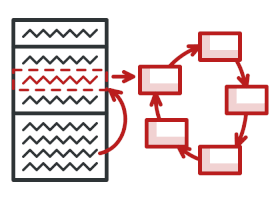
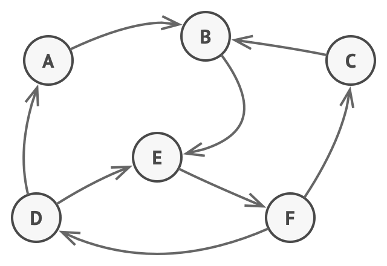
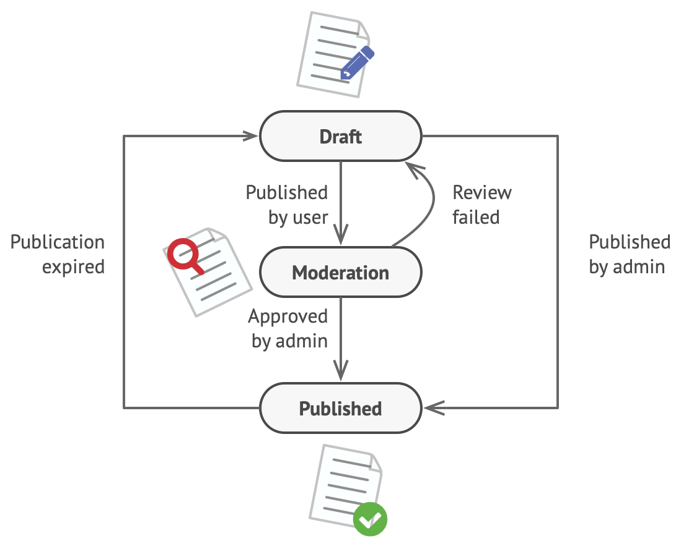
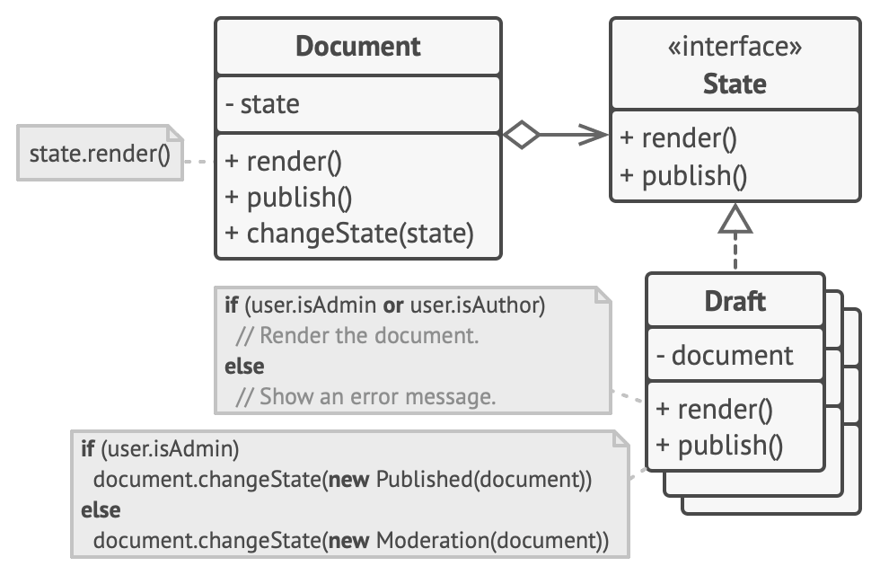
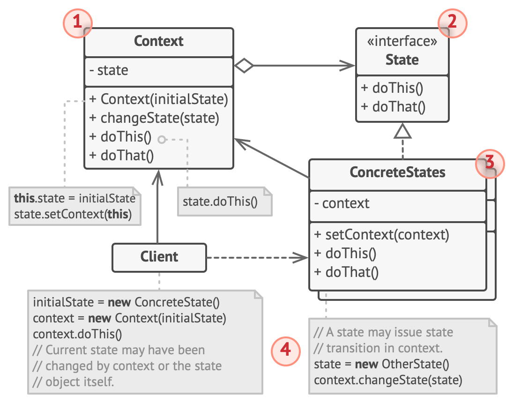
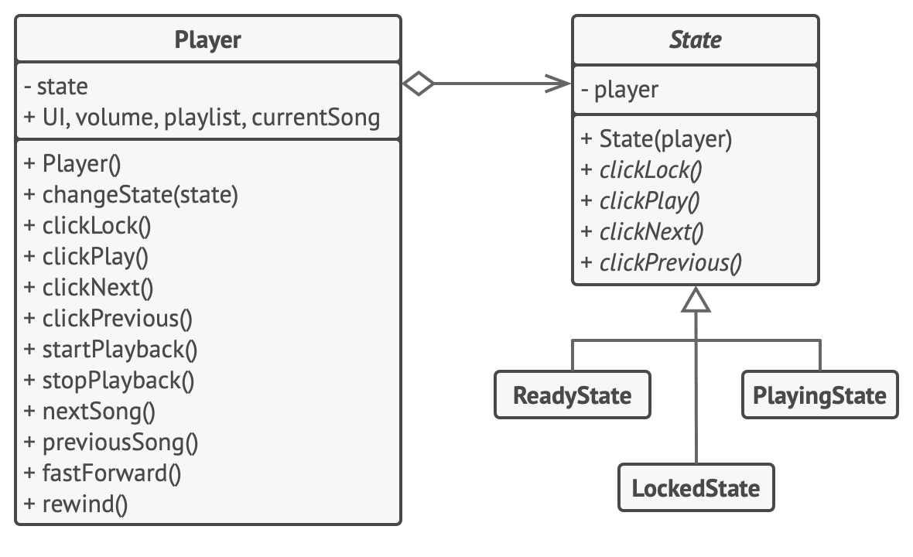

# State



**Type:** Behavioral · **Also known as:** 

> **The 10-second version:** Give the object a swappable brain — one small class per state — so that "what happens when you press this button" is answered by whichever brain is plugged in right now, instead of by a switch statement in every method.

<br clear="all">

## Quick card

| | |
|---|---|
| **Problem it solves** | One class behaves differently depending on a `status` field, so every method grows the same `switch (status)` and every new status means editing all of them. |
| **Core move** | Extract each status into its own class implementing a shared interface. The original object (the *context*) holds a reference to one of them and forwards every state-dependent call to it. Transitioning = replacing that reference. |
| **You'll recognise it by** | A field typed as an interface named `...State`, a public `TransitionTo(newState)` / `ChangeState(...)` on the context, and concrete state classes that construct *each other*. |
| **Rating** | Complexity ★☆☆ · Popularity ★★☆ |
| **Closest relatives** | Strategy (identical diagram, opposite intent), Bridge (same composition shape, different problem), Command (the thing that fires transitions), Memento (snapshots the state you're in), Flyweight (how stateless state objects get shared). |
| **In your stack** | C#: listing/order lifecycle classes + one `switch` expression at the rehydration boundary; or the `Stateless` NuGet library. TS: a discriminated union with an exhaustive `switch`, or XState for anything with guards and timers. SQL: the `status` column plus the guarded `UPDATE ... WHERE status = @expected` that makes transitions atomic. RabbitMQ: a saga / process manager — MassTransit's `MassTransitStateMachine` is this pattern with durable persistence bolted on. |

### How to read this file

Technical first, plain English second. 🗣️ marks the plain-English version. Part 1 is Refactoring.Guru's material with their diagrams; Parts 2-7 are code, your stack, and the stuff that makes it stick.

---

# PART 1 — The pattern

## 1. Intent
**State** is a behavioral design pattern that lets an object alter its behavior when its internal state changes. It appears as if the object changed its class.


### 🗣️ In plain words

An object that can be in several *modes* usually needs to answer the same questions differently in each mode. Instead of asking "which mode am I in?" at the top of every method, you put each mode in its own class, and the object keeps a pointer to the class for the mode it's in right now.

Calling `listing.reserve()` then means "ask my current mode object what `reserve` means." In `Live` mode that object books the car; in `Sold` mode it refuses. Nobody wrote an `if`.

Swap the pointer and, from the outside, the object appears to have changed class — same reference, same type, completely different behaviour.

## 2. Problem
The State pattern is closely related to the concept of a *Finite-State Machine* Finite-State Machine: [https://refactoring.guru/fsm](https://refactoring.guru/fsm).



*Finite-State Machine.*

The main idea is that, at any given moment, there’s a *finite* number of *states* which a program can be in. Within any unique state, the program behaves differently, and the program can be switched from one state to another instantaneously. However, depending on a current state, the program may or may not switch to certain other states. These switching rules, called *transitions*, are also finite and predetermined.

You can also apply this approach to objects. Imagine that we have a `Document` class. A document can be in one of three states: `Draft`, `Moderation` and `Published`. The `publish` method of the document works a little bit differently in each state:

- In `Draft`, it moves the document to moderation.
- In `Moderation`, it makes the document public, but only if the current user is an administrator.
- In `Published`, it doesn’t do anything at all.



*Possible states and transitions of a document object.*

State machines are usually implemented with lots of conditional statements (`if` or `switch`) that select the appropriate behavior depending on the current state of the object. Usually, this “state” is just a set of values of the object’s fields. Even if you’ve never heard about finite-state machines before, you’ve probably implemented a state at least once. Does the following code structure ring a bell?

```
class Document is
    field state: string
    // ...
    method publish() is
        switch (state)
            "draft":
                state = "moderation"
                break
            "moderation":
                if (currentUser.role == "admin")
                    state = "published"
                break
            "published":
                // Do nothing.
                break
    // ...
```

The biggest weakness of a state machine based on conditionals reveals itself once we start adding more and more states and state-dependent behaviors to the `Document` class. Most methods will contain monstrous conditionals that pick the proper behavior of a method according to the current state. Code like this is very difficult to maintain because any change to the transition logic may require changing state conditionals in every method.

The problem tends to get bigger as a project evolves. It’s quite difficult to predict all possible states and transitions at the design stage. Hence, a lean state machine built with a limited set of conditionals can grow into a bloated mess over time.
### 🗣️ In plain words

The site's `Document` example is the shape of the disease. Here it is in the domain you actually work in — a used-car listing that moves through `Draft → PendingReview → Live → Reserved → Sold`, and can also be `Rejected` or `Expired`.

```ts
// ❌ BEFORE — one status field, and every method has to interrogate it
type Status = "draft" | "pendingReview" | "live" | "reserved" | "sold" | "rejected" | "expired";

class Listing {
  status: Status = "draft";
  priceInr = 0;
  reservedBy: string | null = null;

  submitForReview() {
    switch (this.status) {
      case "draft":         this.status = "pendingReview"; notifyModerators(this); break;
      case "rejected":      this.status = "pendingReview"; notifyModerators(this); break;
      case "expired":       this.status = "pendingReview"; break;
      case "pendingReview": break;                                   // already there, ignore
      case "live":
      case "reserved":
      case "sold":          throw new Error("already published");
    }
  }

  changePrice(newPrice: number) {
    switch (this.status) {
      case "draft":
      case "rejected":      this.priceInr = newPrice; break;
      case "live":          this.priceInr = newPrice; reindexSearch(this); emitPriceDrop(this); break;
      case "pendingReview": throw new Error("cannot edit while under review");
      case "reserved":      throw new Error("price locked during reservation");
      case "sold":
      case "expired":       throw new Error("listing is closed");
    }
  }

  reserve(buyerId: string) {
    switch (this.status) {
      case "live":          this.status = "reserved"; this.reservedBy = buyerId; holdInventory(this); break;
      case "reserved":      throw new Error("already reserved");
      default:              throw new Error("not reservable");
    }
  }

  markSold() { /* ...another switch... */ }
  expire()   { /* ...another switch... */ }
  archive()  { /* ...another switch... */ }
}
```

Six methods × seven statuses = forty-two branches that all have to agree with each other. Nothing in the language forces them to. Three specific things go wrong:

1. **Adding a state is a shotgun edit.** Product adds `PendingInspection` between review and live. You must now open all six methods and decide what each one does in the new state — and the compiler will not remind you about the two you forgot, because `default:` and missing `case`s compile happily.
2. **The transition rules live nowhere.** "Can a reserved listing go back to live?" The answer is smeared across `reserve`, `markSold` and `expire`. There is no single place to read the state machine, so nobody can review it.
3. **Per-state data leaks into the class.** `reservedBy` is meaningful only in `Reserved`. `rejectionReason` only in `Rejected`. `expiresAt` only in `Live`. All of them sit on the class permanently, mostly null, and every reader has to know which combinations are legal.

The final symptom is the one the site names: it starts lean. Two states, one `if`. Nobody refactors a two-branch `if`. By the time it's seven states and forty branches, the class is load-bearing and untouchable.

## 3. Solution
The State pattern suggests that you create new classes for all possible states of an object and extract all state-specific behaviors into these classes.

Instead of implementing all behaviors on its own, the original object, called *context*, stores a reference to one of the state objects that represents its current state, and delegates all the state-related work to that object.



*Document delegates the work to a state object.*

To transition the context into another state, replace the active state object with another object that represents that new state. This is possible only if all state classes follow the same interface and the context itself works with these objects through that interface.

This structure may look similar to the [Strategy](https://refactoring.guru/design-patterns/strategy) pattern, but there’s one key difference. In the State pattern, the particular states may be aware of each other and initiate transitions from one state to another, whereas strategies almost never know about each other.
### 🗣️ In plain words

Turn the branches inside out. Instead of *one class that knows seven behaviours*, you get *seven classes that each know one behaviour*, plus one object that holds whichever is current.

The mechanical moves:

1. **Declare a state interface** with one method per state-dependent operation — `submitForReview`, `changePrice`, `reserve`, `markSold`. These are the *events* that can hit the object.
2. **Write one class per state.** Take the body of `case "live":` out of every method and drop it into `LiveState`. That class now contains the complete answer to "what does a live listing do?" — readable top to bottom, in one file.
3. **Give the context a field of the interface type and a public setter.** Every state-dependent method on the context becomes a one-line forward: `reserve(b) { this.state.reserve(this, b) }`.
4. **Let the states perform the transitions.** A state's method finishes by telling the context which state comes next — `context.transitionTo(new ReservedState())`. Because each state names its own successors, the transition graph is now written down in code, distributed across the states, and the compiler checks that each successor actually exists.

The default implementations in the abstract base do real work too: make the base class throw `InvalidTransition` for everything, and each concrete state only overrides the handful of events it actually allows. "Illegal unless listed" becomes the default, which is exactly the safety property the `switch` version never had.

> **The key insight:** State doesn't delete the conditional — it *relocates* it. The seven-way branch stops being evaluated inside every method and becomes a single pointer assignment that happens once per transition. You pay the branch at transition time instead of at call time, and in exchange the compiler starts helping you: adding a state is adding a file, not editing six.

## 4. Real-world analogy
The buttons and switches in your smartphone behave differently depending on the current state of the device:

- When the phone is unlocked, pressing buttons leads to executing various functions.
- When the phone is locked, pressing any button leads to the unlock screen.
- When the phone’s charge is low, pressing any button shows the charging screen.
### 🗣️ Two more of my own

**The petrol pump nozzle.** The same trigger in your hand does four different things depending on where the pump is in its cycle. Before you swipe the card, squeezing does nothing. After authorisation, squeezing dispenses. When the tank sends back the full-tank signal, the same squeeze cuts off instantly. After you hang up the nozzle, squeezing prints nothing and does nothing until the next card. One physical control, one interface, four behaviours — and crucially, the pump's own internals decide when to move from one mode to the next; the customer never selects a mode.

**A cricket match under lights.** "Appeal to the umpire" means something different in each phase of the match. During live play it's a decision. Between overs it's ignored. After the third umpire has been called it's deferred. Once stumps are drawn it's meaningless. The players don't change — the *phase* changes, and the phase decides which appeals are even legal. Notice too that the phases move each other along: the end of an over starts the drinks break, and the drinks break ends into live play. Nobody outside the match picks the phase.

## 5. Structure


1. **Context** stores a reference to one of the concrete state objects and delegates to it all state-specific work. The context communicates with the state object via the state interface. The context exposes a setter for passing it a new state object.
2. The **State** interface declares the state-specific methods. These methods should make sense for all concrete states because you don’t want some of your states to have useless methods that will never be called.
3. **Concrete States** provide their own implementations for the state-specific methods. To avoid duplication of similar code across multiple states, you may provide intermediate abstract classes that encapsulate some common behavior.

   State objects may store a backreference to the context object. Through this reference, the state can fetch any required info from the context object, as well as initiate state transitions.
4. Both context and concrete states can set the next state of the context and perform the actual state transition by replacing the state object linked to the context.
### 🗣️ Participants & roles — cheat table

| Role | What it is in code | Example from the site | Equivalent in reader's stack |
|---|---|---|---|
| **Context** | The object everyone else holds. Owns the identity and the shared data; owns exactly one state reference; forwards state-dependent calls; exposes a public `changeState` / `TransitionTo`. | `AudioPlayer` — holds `state`, `volume`, `playlist`, forwards `clickPlay()` etc. | `Listing` / `Order` / `TestDriveBooking` aggregate in your C# domain layer; a `CheckoutWizard` model in TS |
| **State interface** | Abstract class or interface declaring one method per *event*, not per getter. Usually has non-abstract defaults that throw or no-op. | `abstract class State` with `clickLock/clickPlay/clickNext/clickPrevious` | `IListingState` / `abstract class ListingState`; in TS often a discriminated union instead |
| **Concrete States** | One class per state. Contains the behaviour *and* names the next state. Typically stateless → can be a singleton. | `LockedState`, `ReadyState`, `PlayingState` | `DraftState`, `PendingReviewState`, `LiveState`, `ReservedState`, `SoldState` |
| **Backreference** | The state's handle on the context — either a constructor-injected field (the site's version) or a method parameter (the singleton-friendly version). | `protected field player: AudioPlayer` | `void Reserve(Listing listing)` — pass the context in, keep states stateless |
| **Transition** | Assigning a new object to the context's state field. May be triggered by the context, by a state, or by the client. | `player.changeState(new PlayingState(player))` | `listing.TransitionTo(ReservedState.Instance, reason: "buyer hold")` |
| **Client** | Fires events. Should know only the context and the event names, never the concrete state classes. | The UI buttons | Your API controller, a RabbitMQ consumer, a background expiry job |

### 🤝 Collaboration — who calls whom

```
  Client              Context (Listing)        LiveState            ReservedState
    |                        |                     |                      |
    |  reserve("buyer-42")   |                     |                      |
    |----------------------->|                     |                      |
    |                        | state.reserve(this, |                      |
    |                        |          "buyer-42")|                      |
    |                        |-------------------->|                      |
    |                        |                     |                      |
    |                        |  listing.holdInventory()   <-- state calls back                        
    |                        |<--------------------|      into the context
    |                        |                     |                      |
    |                        |                     |  new ReservedState() |
    |                        |                     |--------------------->|
    |                        |  transitionTo(  ────|                      |
    |                        |      ReservedState) |                      |
    |                        |<--------------------|                      |
    |                        |                     |                      |
    |            [ this.state = ReservedState ] <-- THE ONLY MUTATION THAT MATTERS
    |                        |                     |                      |
    |<-----------------------|                     |                      |
    |                        |                     |                      |
    |  reserve("buyer-99")   |                     |                      |
    |----------------------->| state.reserve(...)  |                      |
    |                        |--------------------------------------------> throws
    |<---- InvalidTransition |                     |       AlreadyReserved|
```

**The hop that matters:** `transitionTo(ReservedState)` — a *state* telling the *context* to replace it. That one arrow is the whole difference from Strategy. In Strategy that arrow does not exist: the strategy object never reaches back and swaps itself out, only the client does. If you delete that arrow from your design, you have written a Strategy and should call it one.

Second thing to notice: the object executing `reserve()` is the same object that is about to be discarded. In C++ and Rust that's a lifetime hazard (see §3.3); in C# and Java the GC makes it a non-issue.

## 6. Pseudocode (the website's example)
In this example, the **State** pattern lets the same controls of the media player behave differently, depending on the current playback state.



*Example of changing object behavior with state objects.*

The main object of the player is always linked to a state object that performs most of the work for the player. Some actions replace the current state object of the player with another, which changes the way the player reacts to user interactions.

```
// The AudioPlayer class acts as a context. It also maintains a
// reference to an instance of one of the state classes that
// represents the current state of the audio player.
class AudioPlayer is
    field state: State
    field UI, volume, playlist, currentSong

    constructor AudioPlayer() is
        this.state = new ReadyState(this)

        // Context delegates handling user input to a state
        // object. Naturally, the outcome depends on what state
        // is currently active, since each state can handle the
        // input differently.
        UI = new UserInterface()
        UI.lockButton.onClick(this.clickLock)
        UI.playButton.onClick(this.clickPlay)
        UI.nextButton.onClick(this.clickNext)
        UI.prevButton.onClick(this.clickPrevious)

    // Other objects must be able to switch the audio player's
    // active state.
    method changeState(state: State) is
        this.state = state

    // UI methods delegate execution to the active state.
    method clickLock() is
        state.clickLock()
    method clickPlay() is
        state.clickPlay()
    method clickNext() is
        state.clickNext()
    method clickPrevious() is
        state.clickPrevious()

    // A state may call some service methods on the context.
    method startPlayback() is
        // ...
    method stopPlayback() is
        // ...
    method nextSong() is
        // ...
    method previousSong() is
        // ...
    method fastForward(time) is
        // ...
    method rewind(time) is
        // ...

// The base state class declares methods that all concrete
// states should implement and also provides a backreference to
// the context object associated with the state. States can use
// the backreference to transition the context to another state.
abstract class State is
    protected field player: AudioPlayer

    // Context passes itself through the state constructor. This
    // may help a state fetch some useful context data if it's
    // needed.
    constructor State(player) is
        this.player = player

    abstract method clickLock()
    abstract method clickPlay()
    abstract method clickNext()
    abstract method clickPrevious()

// Concrete states implement various behaviors associated with a
// state of the context.
class LockedState extends State is

    // When you unlock a locked player, it may assume one of two
    // states.
    method clickLock() is
        if (player.playing)
            player.changeState(new PlayingState(player))
        else
            player.changeState(new ReadyState(player))

    method clickPlay() is
        // Locked, so do nothing.

    method clickNext() is
        // Locked, so do nothing.

    method clickPrevious() is
        // Locked, so do nothing.

// They can also trigger state transitions in the context.
class ReadyState extends State is
    method clickLock() is
        player.changeState(new LockedState(player))

    method clickPlay() is
        player.startPlayback()
        player.changeState(new PlayingState(player))

    method clickNext() is
        player.nextSong()

    method clickPrevious() is
        player.previousSong()

class PlayingState extends State is
    method clickLock() is
        player.changeState(new LockedState(player))

    method clickPlay() is
        player.stopPlayback()
        player.changeState(new ReadyState(player))

    method clickNext() is
        if (event.doubleclick)
            player.nextSong()
        else
            player.fastForward(5)

    method clickPrevious() is
        if (event.doubleclick)
            player.previous()
        else
            player.rewind(5)
```
### 🗣️ Reading that pseudocode

- **`field state: State` plus `method changeState(state)`** — that pair *is* the pattern. Everything else is furniture. Note `changeState` is public: it exists so the states can drive the machine, not for the client's convenience.
- **The four `clickX()` methods on `AudioPlayer` are pure forwarding** — `method clickPlay() is state.clickPlay()`. No `if` survived anywhere in the context. When a context method still has a conditional after refactoring, that conditional was never state-dependent and should stay put.
- **`constructor State(player)`** — the backreference is passed in the constructor, so every state instance belongs to exactly one player. That's why the code says `new PlayingState(player)` every time instead of reusing one. The alternative (pass the player as a method argument) lets you make all states singletons; both are correct, and §3.2 shows the second.
- **`LockedState.clickPlay()` is an empty method.** That's a deliberate no-op, and it's the pattern's quiet superpower: "do nothing" and "throw" are both first-class, explicit, greppable decisions — not an accidentally missing `case` label.
- **`LockedState.clickLock()` branches on `player.playing`** — a conditional that the pattern does *not* remove, because it isn't a state test, it's a "which of two successor states applies" test. Conditionals about *transitions* are fine and normal. Conditionals about *which behaviour to run* are the ones you extracted.
- **`ReadyState.clickPlay()` does `player.startPlayback()` then `player.changeState(new PlayingState(player))`** — action first, transition last. Keep that order: if the action throws, you haven't already moved to a state that assumes the action succeeded.
- **Every concrete state constructs the others.** `ReadyState` names `LockedState` and `PlayingState`. That mutual knowledge is legal here and would be a smell in Strategy. The cost is real though: your state classes form a dependency cycle, so they live and change together.

## 7. Applicability — when to reach for it
**Use the State pattern when you have an object that behaves differently depending on its current state, the number of states is enormous, and the state-specific code changes frequently.**

The pattern suggests that you extract all state-specific code into a set of distinct classes. As a result, you can add new states or change existing ones independently of each other, reducing the maintenance cost.

**Use the pattern when you have a class polluted with massive conditionals that alter how the class behaves according to the current values of the class’s fields.**

The State pattern lets you extract branches of these conditionals into methods of corresponding state classes. While doing so, you can also clean temporary fields and helper methods involved in state-specific code out of your main class.

**Use State when you have a lot of duplicate code across similar states and transitions of a condition-based state machine.**

The State pattern lets you compose hierarchies of state classes and reduce duplication by extracting common code into abstract base classes.
### ✅ Quick checklist

- [ ] Does the class have a `status` / `phase` / `mode` field that **more than two methods** inspect?
- [ ] Do the same status values keep appearing in several different `switch`/`if` chains that have to stay in agreement?
- [ ] Is the set of legal transitions something a **product person could draw as a diagram** — and would they be annoyed if it were wrong?
- [ ] Are there fields that are only meaningful in some states (`rejectionReason`, `reservedBy`, `soldAt`) and null the rest of the time?
- [ ] Are new states or new transition rules arriving regularly (once a quarter or more)?
- [ ] Do you need an audit trail of "what moved from where to where, when, and why"?

Four or more ticks: extract the states. Two ticks: keep the `switch`, but move it into *one* method so the next person can find it. Zero or one tick: you have a status enum, not a state machine, and that is a perfectly good thing to have.

## 8. How to implement — step by step
1. Decide what class will act as the context. It could be an existing class which already has the state-dependent code; or a new class, if the state-specific code is distributed across multiple classes.
2. Declare the state interface. Although it may mirror all the methods declared in the context, aim only for those that may contain state-specific behavior.
3. For every actual state, create a class that derives from the state interface. Then go over the methods of the context and extract all code related to that state into your newly created class.

   While moving the code to the state class, you might discover that it depends on private members of the context. There are several workarounds:

   - Make these fields or methods public.
   - Turn the behavior you’re extracting into a public method in the context and call it from the state class. This way is ugly but quick, and you can always fix it later.
   - Nest the state classes into the context class, but only if your programming language supports nesting classes.
4. In the context class, add a reference field of the state interface type and a public setter that allows overriding the value of that field.
5. Go over the method of the context again and replace empty state conditionals with calls to corresponding methods of the state object.
6. To switch the state of the context, create an instance of one of the state classes and pass it to the context. You can do this within the context itself, or in various states, or in the client. Wherever this is done, the class becomes dependent on the concrete state class that it instantiates.
### 🗣️ The same steps, blunt version

1. **Name the context.** It's almost always the class that already owns the `status` field.
2. **List the events, not the states.** Write down the verbs that behave differently: `submit`, `approve`, `changePrice`, `reserve`, `sell`. That list is your interface. If a method behaves the same in every state, it stays on the context and is not in the interface.
3. **Make the base class hostile.** Every method's default implementation throws `InvalidTransition`. Now every concrete state is a short whitelist of what's allowed.
4. **Create one class per state; move one `case` body into each.** Do it one state at a time and keep the tests green between each move.
5. **Where the moved code touches privates**, prefer promoting the operation to a public/internal method on the context (`listing.HoldInventory()`) over making the field public. Nested/inner state classes are the cleanest fix when your language has them (C#, Java, C++ all do).
6. **Add `state` field + `TransitionTo(next)` to the context**, and replace each method body with a single forwarding call.
7. **Decide who transitions**, and write it down: the state (most common), the context (when a central policy applies), or the client (rare, and usually means you wanted Strategy).
8. **Keep exactly one `switch`** — the one at the persistence boundary that maps the stored string/enum back to a state object. You will never get rid of that one, and you shouldn't try.
9. **Log every transition** as `(from, to, trigger, actor, timestamp)`. It costs five lines and it's the first thing you'll want in production.

## 9. Pros and cons
- ✅ *Single Responsibility Principle*. Organize the code related to particular states into separate classes.
- ✅ *Open/Closed Principle*. Introduce new states without changing existing state classes or the context.
- ✅ Simplify the code of the context by eliminating bulky state machine conditionals.

- ⛔ Applying the pattern can be overkill if a state machine has only a few states or rarely changes.
### ⚖️ Honest trade-offs from the trenches

**The true cost is class count and navigation, not performance.** Seven states × one file each, plus the interface and the context, and the behaviour of a single feature ("what happens on price change?") is now spread over seven files instead of gathered in one method. Reading *one state* got much easier; reading *one event across all states* got harder. If your team's most common question is "what does `changePrice` do?" rather than "what can a reserved listing do?", you have optimised for the wrong axis — and a transition *table* (§3.5, rung 2) might serve you better than state classes.

**The tell that it's worth it** is not the number of states, it's the amount of *behaviour per state*. Seven states whose entire content is "set status, emit event" do not deserve seven classes; a `Dictionary<(Status, Trigger), Status>` handles that in twenty lines and prints itself as a diagram. But three states where each one has twenty lines of guard checks, side effects and integrations — that is exactly where classes pay. The pattern's cons bullet above says "overkill for a few states"; I'd sharpen it to *overkill for states with little behaviour*.

**Modern C# gives you a lot of this for free, and you should take it.** `sealed` records plus a switch *expression* over a closed hierarchy gets you compiler-enforced exhaustiveness — the single biggest weakness of the old `switch` version disappears, and the pattern's advantage narrows. `required`/`init` members let you model per-state data properly instead of nullable fields on the context. And if your machine is genuinely table-shaped, the `Stateless` library gives you guards, entry/exit actions, sub-states and a graph export in less code than you'd write by hand. In TypeScript the equivalent is a discriminated union with an exhaustive `switch` guarded by `assertNever` — that is idiomatic TS State, and hand-rolled state *classes* are usually the wrong reflex there unless each state carries real behaviour.

**A DI container does not help you here, and that trips people up.** States are created and destroyed by the machine at runtime, not resolved at composition time, so you can't just register them as services and inject them. If a state needs a collaborator (a repository, a message bus), pass it through the context — `state.Reserve(listing)` where the `listing` can reach a unit of work — or pass a small services record into the state method. Injecting scoped services into long-lived singleton state objects is the classic captive-dependency bug waiting to happen.

## 10. Relations with other patterns
- [Bridge](https://refactoring.guru/design-patterns/bridge), [State](https://refactoring.guru/design-patterns/state), [Strategy](https://refactoring.guru/design-patterns/strategy) (and to some degree [Adapter](https://refactoring.guru/design-patterns/adapter)) have very similar structures. Indeed, all of these patterns are based on composition, which is delegating work to other objects. However, they all solve different problems. A pattern isn’t just a recipe for structuring your code in a specific way. It can also communicate to other developers the problem the pattern solves.
- [State](https://refactoring.guru/design-patterns/state) can be considered as an extension of [Strategy](https://refactoring.guru/design-patterns/strategy). Both patterns are based on composition: they change the behavior of the context by delegating some work to helper objects. *Strategy* makes these objects completely independent and unaware of each other. However, *State* doesn’t restrict dependencies between concrete states, letting them alter the state of the context at will.
### 🗣️ Disambiguation table

**State vs Strategy — the one that actually matters.** The class diagrams are *identical*. You cannot tell them apart from a UML picture, ever. The difference is 100% intent plus one structural tell.

| Question | **State** | **Strategy** |
|---|---|---|
| Who decides which concrete object is in the field? | The object itself — a state installs its successor via the context | The client, from outside, usually once |
| Do the concrete classes reference each other? | **Yes, normally.** `ReadyState` constructs `PlayingState`. | **No, almost never.** `QuickSort` has never heard of `MergeSort`. |
| Does the concrete class hold/receive the context and mutate it? | Yes — that's the point | Usually no; it takes inputs, returns a result |
| How many times does the field change in one object's life? | Many — once per event | Usually zero or one |
| Is "this operation is illegal right now" a normal outcome? | Yes — half the methods throw or no-op | No — every strategy handles every call |
| What breaks if you delete one concrete class? | The graph: other states reference it | Nothing: you lost an option |
| Vocabulary the domain expert uses | states, transitions, events, guards, lifecycle | algorithm, policy, rule, provider, calculator |
| Typical name | `DraftState`, `LiveState` | `FlatRateShipping`, `PercentageDiscount` |

> **The separator sentence:** *Strategy is a drawer of interchangeable tools the client picks from; State is a set of rooms that lock and unlock the doors between themselves.*
>
> Or the one-line test: **if the object in the field can replace itself, it's State; if only the client can replace it, it's Strategy.**

And the honest caveat: plenty of real code sits in the middle — a `PricingPolicy` chosen by the client that never self-replaces is Strategy even if you called the field `state`; a `ListingState` that the client sets directly from a REST endpoint (`PUT /listings/1/status`) is State with a lazy client. Name the class for the intent you want readers to assume.

| Pattern | How it differs from State | The giveaway |
|---|---|---|
| **Strategy** | Same shape, different intent. Objects are independent alternatives, chosen from outside, not a lifecycle. | No object in the family ever swaps the context's field. |
| **Bridge** | Also composition-based, but the second hierarchy is a *platform/implementation* axis that varies independently, and it doesn't change at runtime per event. | Bridge's implementor is chosen once, at construction, and both sides have their own subclass trees. |
| **Memento** | Captures a *snapshot of data* so it can be restored; State is about *behaviour* attached to a mode. They compose: a memento can record which state you were in. | Memento is opaque and does nothing; a State object is transparent and does everything. |
| **Command** | Encapsulates the *request* (what the user asked for); State encapsulates the *response policy* (what the object will do about it). Commands are the usual triggers of transitions. | Command has one `execute()`; State has one method per event. |
| **Flyweight** | Not an alternative — a technique you apply *to* State. Stateless state objects (no backreference field) can be shared singletons across every context instance. | If your states have no fields, you're already one step from Flyweight. |
| **A plain status enum** | The honest baseline. If behaviour doesn't vary, or varies in one method, an enum is not a worse State — it's the right tool. | Ask: how many methods `switch` on it? One? Stop. |

---

# PART 2 — Official code examples from Refactoring.Guru

## 2.1 C#
**Complexity:** ★☆☆ (1/3)

**Popularity:** ★★☆ (2/3)

**Usage examples:** The State pattern is commonly used in C# to convert massive `switch`-base state machines into objects.

**Identification:** State pattern can be recognized by methods that change their behavior depending on the objects’ state, controlled externally.
### Conceptual Example

This example illustrates the structure of the **State** design pattern. It focuses on answering these questions:

- What classes does it consist of?
- What roles do these classes play?
- In what way the elements of the pattern are related?

##### **Program.cs:** Conceptual example

```csharp
using System;

namespace RefactoringGuru.DesignPatterns.State.Conceptual
{
    // The Context defines the interface of interest to clients. It also
    // maintains a reference to an instance of a State subclass, which
    // represents the current state of the Context.
    class Context
    {
        // A reference to the current state of the Context.
        private State _state = null;

        public Context(State state)
        {
            this.TransitionTo(state);
        }

        // The Context allows changing the State object at runtime.
        public void TransitionTo(State state)
        {
            Console.WriteLine($"Context: Transition to {state.GetType().Name}.");
            this._state = state;
            this._state.SetContext(this);
        }

        // The Context delegates part of its behavior to the current State
        // object.
        public void Request1()
        {
            this._state.Handle1();
        }

        public void Request2()
        {
            this._state.Handle2();
        }
    }

    // The base State class declares methods that all Concrete State should
    // implement and also provides a backreference to the Context object,
    // associated with the State. This backreference can be used by States to
    // transition the Context to another State.
    abstract class State
    {
        protected Context _context;

        public void SetContext(Context context)
        {
            this._context = context;
        }

        public abstract void Handle1();

        public abstract void Handle2();
    }

    // Concrete States implement various behaviors, associated with a state of
    // the Context.
    class ConcreteStateA : State
    {
        public override void Handle1()
        {
            Console.WriteLine("ConcreteStateA handles request1.");
            Console.WriteLine("ConcreteStateA wants to change the state of the context.");
            this._context.TransitionTo(new ConcreteStateB());
        }

        public override void Handle2()
        {
            Console.WriteLine("ConcreteStateA handles request2.");
        }
    }

    class ConcreteStateB : State
    {
        public override void Handle1()
        {
            Console.Write("ConcreteStateB handles request1.");
        }

        public override void Handle2()
        {
            Console.WriteLine("ConcreteStateB handles request2.");
            Console.WriteLine("ConcreteStateB wants to change the state of the context.");
            this._context.TransitionTo(new ConcreteStateA());
        }
    }

    class Program
    {
        static void Main(string[] args)
        {
            // The client code.
            var context = new Context(new ConcreteStateA());
            context.Request1();
            context.Request2();
        }
    }
}
```

##### **Output.txt:** Execution result

```output
Context: Transition to ConcreteStateA.
ConcreteStateA handles request1.
ConcreteStateA wants to change the state of the context.
Context: Transition to ConcreteStateB.
ConcreteStateB handles request2.
ConcreteStateB wants to change the state of the context.
Context: Transition to ConcreteStateA.
```

## 2.2 TypeScript
**Complexity:** ★☆☆ (1/3)

**Popularity:** ★★☆ (2/3)

**Usage examples:** The State pattern is commonly used in TypeScript to convert massive `switch`-base state machines into objects.

**Identification:** State pattern can be recognized by methods that change their behavior depending on the objects’ state, controlled externally.
### Conceptual Example

This example illustrates the structure of the **State** design pattern and focuses on the following questions:

- What classes does it consist of?
- What roles do these classes play?
- In what way the elements of the pattern are related?

##### **index.ts:** Conceptual example

```typescript
/**
 * The Context defines the interface of interest to clients. It also maintains a
 * reference to an instance of a State subclass, which represents the current
 * state of the Context.
 */
class Context {
    /**
     * @type {State} A reference to the current state of the Context.
     */
    private state: State;

    constructor(state: State) {
        this.transitionTo(state);
    }

    /**
     * The Context allows changing the State object at runtime.
     */
    public transitionTo(state: State): void {
        console.log(`Context: Transition to ${(<any>state).constructor.name}.`);
        this.state = state;
        this.state.setContext(this);
    }

    /**
     * The Context delegates part of its behavior to the current State object.
     */
    public request1(): void {
        this.state.handle1();
    }

    public request2(): void {
        this.state.handle2();
    }
}

/**
 * The base State class declares methods that all Concrete State should
 * implement and also provides a backreference to the Context object, associated
 * with the State. This backreference can be used by States to transition the
 * Context to another State.
 */
abstract class State {
    protected context: Context;

    public setContext(context: Context) {
        this.context = context;
    }

    public abstract handle1(): void;

    public abstract handle2(): void;
}

/**
 * Concrete States implement various behaviors, associated with a state of the
 * Context.
 */
class ConcreteStateA extends State {
    public handle1(): void {
        console.log('ConcreteStateA handles request1.');
        console.log('ConcreteStateA wants to change the state of the context.');
        this.context.transitionTo(new ConcreteStateB());
    }

    public handle2(): void {
        console.log('ConcreteStateA handles request2.');
    }
}

class ConcreteStateB extends State {
    public handle1(): void {
        console.log('ConcreteStateB handles request1.');
    }

    public handle2(): void {
        console.log('ConcreteStateB handles request2.');
        console.log('ConcreteStateB wants to change the state of the context.');
        this.context.transitionTo(new ConcreteStateA());
    }
}

/**
 * The client code.
 */
const context = new Context(new ConcreteStateA());
context.request1();
context.request2();
```

##### **Output.txt:** Execution result

```output
Context: Transition to ConcreteStateA.
ConcreteStateA handles request1.
ConcreteStateA wants to change the state of the context.
Context: Transition to ConcreteStateB.
ConcreteStateB handles request2.
ConcreteStateB wants to change the state of the context.
Context: Transition to ConcreteStateA.
```

## 2.3 C++
**Complexity:** ★☆☆ (1/3)

**Popularity:** ★★☆ (2/3)

**Usage examples:** The State pattern is commonly used in C++ to convert massive `switch`-base state machines into objects.

**Identification:** State pattern can be recognized by methods that change their behavior depending on the objects’ state, controlled externally.
### Conceptual Example

This example illustrates the structure of the **State** design pattern. It focuses on answering these questions:

- What classes does it consist of?
- What roles do these classes play?
- In what way the elements of the pattern are related?

##### **main.cc:** Conceptual example

```cpp
#include <iostream>
#include <typeinfo>
/**
 * The base State class declares methods that all Concrete State should
 * implement and also provides a backreference to the Context object, associated
 * with the State. This backreference can be used by States to transition the
 * Context to another State.
 */

class Context;

class State {
  /**
   * @var Context
   */
 protected:
  Context *context_;

 public:
  virtual ~State() {
  }

  void set_context(Context *context) {
    this->context_ = context;
  }

  virtual void Handle1() = 0;
  virtual void Handle2() = 0;
};

/**
 * The Context defines the interface of interest to clients. It also maintains a
 * reference to an instance of a State subclass, which represents the current
 * state of the Context.
 */
class Context {
  /**
   * @var State A reference to the current state of the Context.
   */
 private:
  State *state_;

 public:
  Context(State *state) : state_(nullptr) {
    this->TransitionTo(state);
  }
  ~Context() {
    delete state_;
  }
  /**
   * The Context allows changing the State object at runtime.
   */
  void TransitionTo(State *state) {
    std::cout << "Context: Transition to " << typeid(*state).name() << ".\n";
    if (this->state_ != nullptr)
      delete this->state_;
    this->state_ = state;
    this->state_->set_context(this);
  }
  /**
   * The Context delegates part of its behavior to the current State object.
   */
  void Request1() {
    this->state_->Handle1();
  }
  void Request2() {
    this->state_->Handle2();
  }
};

/**
 * Concrete States implement various behaviors, associated with a state of the
 * Context.
 */

class ConcreteStateA : public State {
 public:
  void Handle1() override;

  void Handle2() override {
    std::cout << "ConcreteStateA handles request2.\n";
  }
};

class ConcreteStateB : public State {
 public:
  void Handle1() override {
    std::cout << "ConcreteStateB handles request1.\n";
  }
  void Handle2() override {
    std::cout << "ConcreteStateB handles request2.\n";
    std::cout << "ConcreteStateB wants to change the state of the context.\n";
    this->context_->TransitionTo(new ConcreteStateA);
  }
};

void ConcreteStateA::Handle1() {
  {
    std::cout << "ConcreteStateA handles request1.\n";
    std::cout << "ConcreteStateA wants to change the state of the context.\n";

    this->context_->TransitionTo(new ConcreteStateB);
  }
}

/**
 * The client code.
 */
void ClientCode() {
  Context *context = new Context(new ConcreteStateA);
  context->Request1();
  context->Request2();
  delete context;
}

int main() {
  ClientCode();
  return 0;
}
```

##### **Output.txt:** Execution result

```output
Context: Transition to 14ConcreteStateA.
ConcreteStateA handles request1.
ConcreteStateA wants to change the state of the context.
Context: Transition to 14ConcreteStateB.
ConcreteStateB handles request2.
ConcreteStateB wants to change the state of the context.
Context: Transition to 14ConcreteStateA.

```

## 2.4 Java
**Complexity:** ★☆☆ (1/3)

**Popularity:** ★★☆ (2/3)

**Usage examples:** The State pattern is commonly used in Java to convert massive `switch`-base state machines into objects.

**Identification:** The State pattern can be recognized by methods that change their behavior depending on the objects’ state. You can confirm identification if you see that this state can be controlled or replaced by other objects, including state objects themselves.
### Interface of a media player

In this example, the State pattern lets the same media player controls behave differently, depending on the current playback state. The main class of the player contains a reference to a state object, which performs most of the work for the player. Some actions may end-up replacing the state object with another, which changes the way the player reacts to the user interactions.

#### **states**

##### **states/State.java:** Common state interface

```java
package refactoring_guru.state.example.states;

import refactoring_guru.state.example.ui.Player;

/**
 * Common interface for all states.
 */
public abstract class State {
    Player player;

    /**
     * Context passes itself through the state constructor. This may help a
     * state to fetch some useful context data if needed.
     */
    State(Player player) {
        this.player = player;
    }

    public abstract String onLock();
    public abstract String onPlay();
    public abstract String onNext();
    public abstract String onPrevious();
}
```

##### **states/LockedState.java**

```java
package refactoring_guru.state.example.states;

import refactoring_guru.state.example.ui.Player;

/**
 * Concrete states provide the special implementation for all interface methods.
 */
public class LockedState extends State {

    LockedState(Player player) {
        super(player);
        player.setPlaying(false);
    }

    @Override
    public String onLock() {
        if (player.isPlaying()) {
            player.changeState(new ReadyState(player));
            return "Stop playing";
        } else {
            return "Locked...";
        }
    }

    @Override
    public String onPlay() {
        player.changeState(new ReadyState(player));
        return "Ready";
    }

    @Override
    public String onNext() {
        return "Locked...";
    }

    @Override
    public String onPrevious() {
        return "Locked...";
    }
}
```

##### **states/ReadyState.java**

```java
package refactoring_guru.state.example.states;

import refactoring_guru.state.example.ui.Player;

/**
 * They can also trigger state transitions in the context.
 */
public class ReadyState extends State {

    public ReadyState(Player player) {
        super(player);
    }

    @Override
    public String onLock() {
        player.changeState(new LockedState(player));
        return "Locked...";
    }

    @Override
    public String onPlay() {
        String action = player.startPlayback();
        player.changeState(new PlayingState(player));
        return action;
    }

    @Override
    public String onNext() {
        return "Locked...";
    }

    @Override
    public String onPrevious() {
        return "Locked...";
    }
}
```

##### **states/PlayingState.java**

```java
package refactoring_guru.state.example.states;

import refactoring_guru.state.example.ui.Player;

public class PlayingState extends State {

    PlayingState(Player player) {
        super(player);
    }

    @Override
    public String onLock() {
        player.changeState(new LockedState(player));
        player.setCurrentTrackAfterStop();
        return "Stop playing";
    }

    @Override
    public String onPlay() {
        player.changeState(new ReadyState(player));
        return "Paused...";
    }

    @Override
    public String onNext() {
        return player.nextTrack();
    }

    @Override
    public String onPrevious() {
        return player.previousTrack();
    }
}
```

#### **ui**

##### **ui/Player.java:** Player primary code

```java
package refactoring_guru.state.example.ui;

import refactoring_guru.state.example.states.ReadyState;
import refactoring_guru.state.example.states.State;

import java.util.ArrayList;
import java.util.List;

public class Player {
    private State state;
    private boolean playing = false;
    private List<String> playlist = new ArrayList<>();
    private int currentTrack = 0;

    public Player() {
        this.state = new ReadyState(this);
        setPlaying(true);
        for (int i = 1; i <= 12; i++) {
            playlist.add("Track " + i);
        }
    }

    public void changeState(State state) {
        this.state = state;
    }

    public State getState() {
        return state;
    }

    public void setPlaying(boolean playing) {
        this.playing = playing;
    }

    public boolean isPlaying() {
        return playing;
    }

    public String startPlayback() {
        return "Playing " + playlist.get(currentTrack);
    }

    public String nextTrack() {
        currentTrack++;
        if (currentTrack > playlist.size() - 1) {
            currentTrack = 0;
        }
        return "Playing " + playlist.get(currentTrack);
    }

    public String previousTrack() {
        currentTrack--;
        if (currentTrack < 0) {
            currentTrack = playlist.size() - 1;
        }
        return "Playing " + playlist.get(currentTrack);
    }

    public void setCurrentTrackAfterStop() {
        this.currentTrack = 0;
    }
}
```

##### **ui/UI.java:** Player’s GUI

```java
package refactoring_guru.state.example.ui;

import javax.swing.*;
import java.awt.*;

public class UI {
    private Player player;
    private static JTextField textField = new JTextField();

    public UI(Player player) {
        this.player = player;
    }

    public void init() {
        JFrame frame = new JFrame("Test player");
        frame.setDefaultCloseOperation(JFrame.EXIT_ON_CLOSE);
        JPanel context = new JPanel();
        context.setLayout(new BoxLayout(context, BoxLayout.Y_AXIS));
        frame.getContentPane().add(context);
        JPanel buttons = new JPanel(new FlowLayout(FlowLayout.CENTER));
        context.add(textField);
        context.add(buttons);

        // Context delegates handling user's input to a state object. Naturally,
        // the outcome will depend on what state is currently active, since all
        // states can handle the input differently.
        JButton play = new JButton("Play");
        play.addActionListener(e -> textField.setText(player.getState().onPlay()));
        JButton stop = new JButton("Stop");
        stop.addActionListener(e -> textField.setText(player.getState().onLock()));
        JButton next = new JButton("Next");
        next.addActionListener(e -> textField.setText(player.getState().onNext()));
        JButton prev = new JButton("Prev");
        prev.addActionListener(e -> textField.setText(player.getState().onPrevious()));
        frame.setVisible(true);
        frame.setSize(300, 100);
        buttons.add(play);
        buttons.add(stop);
        buttons.add(next);
        buttons.add(prev);
    }
}
```

##### **Demo.java:** Initialization code

```java
package refactoring_guru.state.example;

import refactoring_guru.state.example.ui.Player;
import refactoring_guru.state.example.ui.UI;

/**
 * Demo class. Everything comes together here.
 */
public class Demo {
    public static void main(String[] args) {
        Player player = new Player();
        UI ui = new UI(player);
        ui.init();
    }
}
```

##### **OutputDemo.png:** Screenshot

---

# PART 3 — Learn it by building it

## 3.1 The dumbest possible version — TypeScript

### ❌ BEFORE — the pain, in full

A listing lifecycle written the way it actually gets written the first time.

```ts
// ---------------------------------------------------------------------------
// BEFORE: one class, one status string, and a switch in every single method.
// ---------------------------------------------------------------------------
type Status = "draft" | "pendingReview" | "live" | "reserved" | "sold";

interface Actor { id: string; role: "seller" | "moderator" | "system"; }

class Listing {
  status: Status = "draft";
  reservedBy: string | null = null;   // only means anything in "reserved"
  rejectionNote: string | null = null;  // only means anything after a rejection
  soldAt: Date | null = null;         // only means anything in "sold"

  constructor(readonly id: string, public priceInr: number) {}

  submitForReview(actor: Actor) {
    switch (this.status) {
      case "draft":
        if (this.priceInr <= 0) throw new Error("price required");
        this.status = "pendingReview";
        break;
      case "pendingReview":
        break;                                   // idempotent, fine
      case "live":
      case "reserved":
      case "sold":
        throw new Error(`cannot submit from ${this.status}`);
    }
  }

  approve(actor: Actor) {
    switch (this.status) {
      case "pendingReview":
        if (actor.role !== "moderator") throw new Error("forbidden");
        this.status = "live";
        break;
      default:
        throw new Error(`cannot approve from ${this.status}`);
    }
  }

  changePrice(newPrice: number, actor: Actor) {
    switch (this.status) {
      case "draft":
        this.priceInr = newPrice;
        break;
      case "live":
        // extra rule that exists ONLY here, and you will miss it in review
        if (newPrice > this.priceInr) throw new Error("price can only drop while live");
        this.priceInr = newPrice;
        break;
      case "pendingReview":
      case "reserved":
      case "sold":
        throw new Error(`price locked in ${this.status}`);
    }
  }

  reserve(buyerId: string) {
    switch (this.status) {
      case "live":
        this.status = "reserved";
        this.reservedBy = buyerId;
        break;
      default:
        throw new Error(`cannot reserve from ${this.status}`);
    }
  }

  markSold(actor: Actor) {
    switch (this.status) {
      case "reserved":
        this.status = "sold";
        this.soldAt = new Date();
        break;
      case "live":
        // walk-in sale, added six months later, and NOBODY updated changePrice()
        this.status = "sold";
        this.soldAt = new Date();
        break;
      default:
        throw new Error(`cannot sell from ${this.status}`);
    }
  }
}
```

Look at the last method. The "walk-in sale" branch was added later and it is *correct* — but nothing about the code tells you that the price-drop rule in `changePrice` and the reservation rule in `reserve` now need re-checking. Five methods, five independent mental models of the same state machine. Add `pendingInspection` and you edit all five.

### ✅ AFTER — the same lifecycle as a State machine

```ts
// ===========================================================================
//  1. THE EVENTS  — the interface is a list of things that can HAPPEN,
//                   not a list of getters.
// ===========================================================================
type Status = "draft" | "pendingReview" | "live" | "reserved" | "sold";

interface Actor { id: string; role: "seller" | "moderator" | "system"; }

export class InvalidTransitionError extends Error {
  constructor(from: Status, event: string) {
    super(`Cannot '${event}' while listing is ${from}`);
    this.name = "InvalidTransitionError";
  }
}

// ===========================================================================
//  2. THE BASE STATE — hostile by default.
//     Every event throws unless a concrete state explicitly allows it.
//     THIS is what replaces the "did I remember every case?" problem.
// ===========================================================================
abstract class ListingState {
  abstract readonly status: Status;

  // The backreference. Set once by the context in transitionTo().
  protected listing!: Listing;                      // <-- filled in by the context
  attach(listing: Listing): void { this.listing = listing; }

  // Optional lifecycle hooks — see §3.5 for why these are worth having.
  onEnter(): void {}
  onExit(): void {}

  submitForReview(_actor: Actor): void { this.deny("submitForReview"); }
  approve(_actor: Actor): void { this.deny("approve"); }
  reject(_actor: Actor, _note: string): void { this.deny("reject"); }
  changePrice(_newPrice: number, _actor: Actor): void { this.deny("changePrice"); }
  reserve(_buyerId: string): void { this.deny("reserve"); }
  markSold(_actor: Actor): void { this.deny("markSold"); }

  protected deny(event: string): never {
    throw new InvalidTransitionError(this.status, event);   // <-- the safety net
  }
}

// ===========================================================================
//  3. THE CONTEXT — holds the data, holds ONE state, forwards everything.
//     Notice: there is not a single `if (this.status === ...)` in here.
// ===========================================================================
export class Listing {
  #state!: ListingState;                            // truly private: states cannot poke it
  #history: Array<{ from: Status | null; to: Status; at: Date; why: string }> = [];

  // Shared data lives on the context...
  priceInr: number;
  // ...and so does per-state data, but see §3.5 for the better option.
  reservedBy: string | null = null;
  soldAt: Date | null = null;
  rejectionNote: string | null = null;

  constructor(readonly id: string, priceInr: number) {
    this.priceInr = priceInr;
    this.transitionTo(new DraftState(), "created");
  }

  // PUBLIC on purpose: the states call this. It is the pattern's hinge.
  transitionTo(next: ListingState, why: string): void {          // <-- the hinge
    const from = this.#state?.status ?? null;
    this.#state?.onExit();
    next.attach(this);
    this.#state = next;
    this.#history.push({ from, to: next.status, at: new Date(), why });
    next.onEnter();
  }

  get status(): Status { return this.#state.status; }
  get history(): ReadonlyArray<{ from: Status | null; to: Status; at: Date; why: string }> {
    return this.#history;
  }

  // Every state-dependent operation is a one-line forward. That's the job.
  submitForReview(actor: Actor) { this.#state.submitForReview(actor); }
  approve(actor: Actor)         { this.#state.approve(actor); }
  reject(actor: Actor, n: string) { this.#state.reject(actor, n); }
  changePrice(p: number, a: Actor) { this.#state.changePrice(p, a); }
  reserve(buyerId: string)      { this.#state.reserve(buyerId); }
  markSold(actor: Actor)        { this.#state.markSold(actor); }

  // Service methods the states are allowed to call back into.
  indexForSearch(): void { /* push to the search index */ }
  removeFromSearch(): void { /* drop from the search index */ }
  holdInventory(buyerId: string): void { this.reservedBy = buyerId; }
  releaseInventory(): void { this.reservedBy = null; }
}

// ===========================================================================
//  4. THE CONCRETE STATES — each one is a short whitelist.
//     Read any single class and you know everything about that state.
// ===========================================================================
class DraftState extends ListingState {
  readonly status = "draft" as const;

  submitForReview(_actor: Actor): void {
    if (this.listing.priceInr <= 0) throw new Error("set a price before submitting");
    this.listing.transitionTo(new PendingReviewState(), "seller submitted");
  }

  changePrice(newPrice: number, _actor: Actor): void {
    this.listing.priceInr = newPrice;               // no restrictions in draft
  }
}

class PendingReviewState extends ListingState {
  readonly status = "pendingReview" as const;

  // Idempotent: re-submitting while already queued is a no-op, not an error.
  submitForReview(_actor: Actor): void { /* deliberately nothing */ }

  approve(actor: Actor): void {
    if (actor.role !== "moderator") throw new Error("only moderators can approve");
    this.listing.transitionTo(new LiveState(), `approved by ${actor.id}`);
  }

  reject(actor: Actor, note: string): void {
    if (actor.role !== "moderator") throw new Error("only moderators can reject");
    this.listing.rejectionNote = note;
    this.listing.transitionTo(new DraftState(), `rejected by ${actor.id}`);   // <-- back to Draft
  }
  // changePrice/reserve/markSold are NOT overridden => they throw. Deliberate.
}

class LiveState extends ListingState {
  readonly status = "live" as const;

  onEnter(): void { this.listing.indexForSearch(); }     // <-- entry action
  onExit(): void  { this.listing.removeFromSearch(); }   // <-- exit action

  // The rule that lived only inside one `case` now lives in the state it belongs to.
  changePrice(newPrice: number, _actor: Actor): void {
    if (newPrice > this.listing.priceInr) throw new Error("price can only drop while live");
    this.listing.priceInr = newPrice;
  }

  reserve(buyerId: string): void {
    this.listing.holdInventory(buyerId);
    this.listing.transitionTo(new ReservedState(), `held for ${buyerId}`);
  }

  markSold(_actor: Actor): void {                        // the walk-in sale
    this.listing.soldAt = new Date();
    this.listing.transitionTo(new SoldState(), "walk-in sale");
  }
}

class ReservedState extends ListingState {
  readonly status = "reserved" as const;

  markSold(_actor: Actor): void {
    this.listing.soldAt = new Date();
    this.listing.transitionTo(new SoldState(), "reservation converted");
  }

  // Reservation fell through -> back to live. A state naming another state.
  reject(_actor: Actor, note: string): void {
    this.listing.releaseInventory();
    this.listing.rejectionNote = note;
    this.listing.transitionTo(new LiveState(), "reservation released");
  }
}

class SoldState extends ListingState {
  readonly status = "sold" as const;
  // Nothing is overridden. A sold listing accepts no events at all.
  // Terminal states are the cheapest classes you will ever write.
}

// ===========================================================================
//  5. USING IT
// ===========================================================================
const moderator: Actor = { id: "mod-7", role: "moderator" };
const seller: Actor = { id: "sel-1", role: "seller" };

const l = new Listing("CW-2201", 540_000);
l.submitForReview(seller);        // draft -> pendingReview
l.approve(moderator);             // pendingReview -> live  (onEnter indexes it)
l.changePrice(529_000, seller);   // allowed: price dropped
l.reserve("buyer-42");            // live -> reserved  (onExit de-indexes it)

try {
  l.changePrice(500_000, seller);
} catch (e) {
  console.log((e as Error).message); // "Cannot 'changePrice' while listing is reserved"
}

l.markSold(moderator);            // reserved -> sold
console.log(l.status);            // "sold"
console.table(l.history);         // full audit trail, for free
```

**What to notice:**

- **The context has zero conditionals.** Every method is one line. If you ever add an `if` back into `Listing`, ask whether it's really state-dependent — if it is, it belongs in a state class.
- **`deny()` in the base class inverts the default.** Before, a forgotten `case` silently fell through; now a forgotten override throws a named error with the state in the message. That single design choice removes the entire class of bug the `switch` version had.
- **The price-drop rule moved to `LiveState` and nowhere else.** You can now answer "what are the rules for a live listing?" by reading one 15-line class.
- **`PendingReviewState.submitForReview()` is an empty body with a comment.** That's an explicit idempotency decision, visible in code review. In the `switch` version it was a bare `break;` that looked like a mistake.
- **`onEnter` / `onExit` give you search indexing for free at every entry and exit**, including transitions you haven't written yet. That's the single best reason to add the hooks.
- **`transitionTo` writes the audit trail.** One place. You cannot forget to log a transition because you cannot transition without going through it.
- **The states construct each other** (`new LiveState()` inside `ReservedState`). Legal, expected, and the reason these classes ship as one module.
- **TypeScript-specific:** `#state` is a real private field, so a state class physically cannot read or write it — it must go through `transitionTo`. Using `private state` (TS-only, erased at runtime) would be a weaker guarantee.

## 3.2 Same thing in C#

Modern C#, and with one deliberate change from the TS version: **states are stateless singletons and receive the context as a parameter.** That's the variant you want on a server, where you may have thousands of listings in flight and don't want a fresh state object per listing per transition.

```csharp
// ListingStateMachine.cs — .NET 8, <Nullable>enable</Nullable>
using System;
using System.Collections.Generic;

namespace CarWale.Listings.Domain;

public enum ListingStatus { Draft, PendingReview, Live, Reserved, Sold }

public sealed record Actor(string Id, ActorRole Role);
public enum ActorRole { Seller, Moderator, System }

public sealed record StateTransition(
    ListingStatus? From,
    ListingStatus To,
    string Reason,
    string ActorId,
    DateTimeOffset At);

public sealed class InvalidTransitionException(ListingStatus from, string trigger)
    : InvalidOperationException($"Cannot '{trigger}' while listing is {from}")
{
    public ListingStatus From { get; } = from;
    public string Trigger { get; } = trigger;
}

// ===========================================================================
//  THE STATE — abstract base, hostile defaults, NO instance fields.
//  No fields => safe to share one instance across every Listing in the process.
// ===========================================================================
public abstract class ListingState
{
    public abstract ListingStatus Status { get; }

    public virtual void OnEnter(Listing listing) { }
    public virtual void OnExit(Listing listing) { }

    public virtual void SubmitForReview(Listing listing, Actor actor) => throw Deny(nameof(SubmitForReview));
    public virtual void Approve(Listing listing, Actor actor)         => throw Deny(nameof(Approve));
    public virtual void Reject(Listing listing, Actor actor, string note) => throw Deny(nameof(Reject));
    public virtual void ChangePrice(Listing listing, decimal newPrice, Actor actor) => throw Deny(nameof(ChangePrice));
    public virtual void Reserve(Listing listing, string buyerId)      => throw Deny(nameof(Reserve));
    public virtual void MarkSold(Listing listing, Actor actor)        => throw Deny(nameof(MarkSold));

    private InvalidTransitionException Deny(string trigger) => new(Status, trigger);
}

// ===========================================================================
//  THE CONTEXT
// ===========================================================================
public sealed class Listing
{
    private ListingState _state = null!;                 // set via TransitionTo in the ctor
    private readonly List<StateTransition> _history = [];

    public string Id { get; }
    public decimal PriceInr { get; internal set; }
    public string? ReservedBy { get; internal set; }
    public DateTimeOffset? SoldAt { get; internal set; }
    public string? RejectionNote { get; internal set; }

    public ListingStatus Status => _state.Status;
    public IReadOnlyList<StateTransition> History => _history;

    public Listing(string id, decimal priceInr)
    {
        Id = id;
        PriceInr = priceInr;
        TransitionTo(DraftState.Instance, "created", "system");
    }

    private Listing(string id, decimal priceInr, ListingState state)   // rehydration ctor
    {
        Id = id;
        PriceInr = priceInr;
        _state = state;
    }

    // Public so states can drive the machine. `internal` if your states live
    // in the same assembly and you want the API surface smaller.
    public void TransitionTo(ListingState next, string reason, string actorId)
    {
        ArgumentNullException.ThrowIfNull(next);
        var from = _state?.Status;
        _state?.OnExit(this);
        _state = next;
        _history.Add(new StateTransition(from, next.Status, reason, actorId, DateTimeOffset.UtcNow));
        next.OnEnter(this);
    }

    // Pure forwarding. No conditionals live here.
    public void SubmitForReview(Actor actor) => _state.SubmitForReview(this, actor);
    public void Approve(Actor actor)         => _state.Approve(this, actor);
    public void Reject(Actor actor, string note) => _state.Reject(this, actor, note);
    public void ChangePrice(decimal p, Actor a)  => _state.ChangePrice(this, p, a);
    public void Reserve(string buyerId)      => _state.Reserve(this, buyerId);
    public void MarkSold(Actor actor)        => _state.MarkSold(this, actor);

    public bool CanReserve => _state is LiveState;       // ask the TYPE, not a string

    // ---- service methods the states call back into -------------------------
    internal void IndexForSearch()   { /* enqueue search index upsert */ }
    internal void RemoveFromSearch() { /* enqueue search index delete */ }

    // ---- THE ONE SWITCH YOU KEEP ------------------------------------------
    // Mapping persisted status -> state object. A switch EXPRESSION over a
    // closed enum: the compiler warns if you add a status and forget this.
    public static Listing Rehydrate(string id, decimal priceInr, ListingStatus status) =>
        new(id, priceInr, FromStatus(status));

    public static ListingState FromStatus(ListingStatus status) => status switch
    {
        ListingStatus.Draft         => DraftState.Instance,
        ListingStatus.PendingReview => PendingReviewState.Instance,
        ListingStatus.Live          => LiveState.Instance,
        ListingStatus.Reserved      => ReservedState.Instance,
        ListingStatus.Sold          => SoldState.Instance,
        _ => throw new ArgumentOutOfRangeException(nameof(status), status, "unmapped status")
    };
}

// ===========================================================================
//  CONCRETE STATES — singletons, because they hold no data.
// ===========================================================================
public sealed class DraftState : ListingState
{
    public static readonly DraftState Instance = new();
    private DraftState() { }
    public override ListingStatus Status => ListingStatus.Draft;

    public override void SubmitForReview(Listing listing, Actor actor)
    {
        if (listing.PriceInr <= 0) throw new InvalidOperationException("set a price before submitting");
        listing.TransitionTo(PendingReviewState.Instance, "seller submitted", actor.Id);
    }

    public override void ChangePrice(Listing listing, decimal newPrice, Actor actor)
        => listing.PriceInr = newPrice;
}

public sealed class PendingReviewState : ListingState
{
    public static readonly PendingReviewState Instance = new();
    private PendingReviewState() { }
    public override ListingStatus Status => ListingStatus.PendingReview;

    // Idempotent on purpose: a duplicated command must not blow up. See §4.4.
    public override void SubmitForReview(Listing listing, Actor actor) { }

    public override void Approve(Listing listing, Actor actor)
    {
        if (actor.Role is not ActorRole.Moderator)
            throw new UnauthorizedAccessException("only moderators can approve");
        listing.TransitionTo(LiveState.Instance, $"approved by {actor.Id}", actor.Id);
    }

    public override void Reject(Listing listing, Actor actor, string note)
    {
        if (actor.Role is not ActorRole.Moderator)
            throw new UnauthorizedAccessException("only moderators can reject");
        listing.RejectionNote = note;
        listing.TransitionTo(DraftState.Instance, $"rejected: {note}", actor.Id);
    }
}

public sealed class LiveState : ListingState
{
    public static readonly LiveState Instance = new();
    private LiveState() { }
    public override ListingStatus Status => ListingStatus.Live;

    public override void OnEnter(Listing listing) => listing.IndexForSearch();
    public override void OnExit(Listing listing)  => listing.RemoveFromSearch();

    public override void ChangePrice(Listing listing, decimal newPrice, Actor actor)
    {
        if (newPrice > listing.PriceInr)
            throw new InvalidOperationException("price can only drop while live");
        listing.PriceInr = newPrice;
    }

    public override void Reserve(Listing listing, string buyerId)
    {
        listing.ReservedBy = buyerId;
        listing.TransitionTo(ReservedState.Instance, $"held for {buyerId}", buyerId);
    }

    public override void MarkSold(Listing listing, Actor actor)
    {
        listing.SoldAt = DateTimeOffset.UtcNow;
        listing.TransitionTo(SoldState.Instance, "walk-in sale", actor.Id);
    }
}

public sealed class ReservedState : ListingState
{
    public static readonly ReservedState Instance = new();
    private ReservedState() { }
    public override ListingStatus Status => ListingStatus.Reserved;

    public override void MarkSold(Listing listing, Actor actor)
    {
        listing.SoldAt = DateTimeOffset.UtcNow;
        listing.TransitionTo(SoldState.Instance, "reservation converted", actor.Id);
    }

    public override void Reject(Listing listing, Actor actor, string note)
    {
        listing.ReservedBy = null;
        listing.TransitionTo(LiveState.Instance, $"reservation released: {note}", actor.Id);
    }
}

public sealed class SoldState : ListingState
{
    public static readonly SoldState Instance = new();
    private SoldState() { }
    public override ListingStatus Status => ListingStatus.Sold;
    // Terminal. Every inherited method throws. Nothing to write.
}
```

**C#-specific notes:**

- **Stateless states → `static readonly Instance` + private constructor.** Because no state object holds a `Listing`, one instance serves every request on every thread. This is Flyweight applied to State, and on a busy API it removes a per-transition allocation. The moment a state needs its own field, this optimisation is off the table — go back to `new LiveState(listing)`.
- **`internal set` on the context's properties** is the clean answer to the site's "states need the context's privates" problem. States live in the same assembly, so they can write; controllers in the web assembly can only read. No public setters, no reflection.
- **Keep the one `switch` expression** in `FromStatus`. Over a closed `enum`, the compiler emits CS8524-style warnings for unhandled values, which is precisely the compile-time safety the original 42-branch code lacked. Adding `PendingInspection` now breaks the build in exactly one place — that's the win, stated precisely.
- **`_state is LiveState` for queries, never `Status == ListingStatus.Live` scattered around.** Better still, expose intent-named booleans (`CanReserve`) so callers never type-test at all.
- **Pitfall — `_state = null!` plus a constructor that calls a virtual-ish path.** `TransitionTo` invokes `next.OnEnter(this)` while the `Listing` constructor is still running, so `OnEnter` can see a half-built object. Either keep `OnEnter` free of property access during construction, or set the initial state directly (`_state = DraftState.Instance;`) and only use `TransitionTo` after construction. The rehydration constructor above does exactly that.
- **Pitfall — serialising the context.** `System.Text.Json` will happily try to serialise `ListingState` and produce `{}` or blow up on the cycle. Persist the `Status` enum, not the state object; mark the field `[JsonIgnore]` if the context is ever serialised directly.
- **Don't register states in DI.** They're chosen at runtime by the machine. If a state needs `IEmailSender`, pass a small `record ListingServices(IEmailSender Email, IClock Clock)` into the method alongside the listing, or raise a domain event the application layer handles.

## 3.3 C++

C++ is where State gets genuinely interesting, because "the state object replaces itself" means *the object currently executing a method is about to be destroyed*. The fix is a change of shape: state methods **return** the next state instead of installing it.

```cpp
// state_listing.cpp — C++17 or later.  g++ -std=c++17 -Wall -Wextra state_listing.cpp
#include <iostream>
#include <memory>
#include <stdexcept>
#include <string>
#include <string_view>
#include <utility>
#include <vector>

class Listing;   // forward declaration: states take the context by reference

// ===========================================================================
//  THE STATE INTERFACE
//  Next == "who should be current after this call". nullptr == "stay put".
// ===========================================================================
class ListingState {
public:
    using Next = std::unique_ptr<ListingState>;

    virtual ~ListingState() = default;                 // <-- VIRTUAL DTOR. Non-negotiable:
                                                       //     we delete through the base pointer.
    ListingState(const ListingState&)            = delete;   // states are not copied...
    ListingState& operator=(const ListingState&) = delete;   // ...they are created and moved
    ListingState(ListingState&&)                 = delete;
    ListingState& operator=(ListingState&&)      = delete;

    [[nodiscard]] virtual std::string_view name() const noexcept = 0;

    // Hostile defaults, exactly as in C#/TS.
    [[nodiscard]] virtual Next submit(Listing&)                 { return deny("submit"); }
    [[nodiscard]] virtual Next approve(Listing&, bool isMod)    { (void)isMod; return deny("approve"); }
    [[nodiscard]] virtual Next changePrice(Listing&, long long) { return deny("changePrice"); }
    [[nodiscard]] virtual Next reserve(Listing&, std::string)   { return deny("reserve"); }
    [[nodiscard]] virtual Next markSold(Listing&)               { return deny("markSold"); }

    virtual void onEnter(Listing&) {}
    virtual void onExit(Listing&)  {}

protected:
    ListingState() = default;

    [[nodiscard]] Next deny(std::string_view trigger) const {
        throw std::logic_error("cannot '" + std::string{trigger} +
                               "' while listing is " + std::string{name()});
    }
    [[nodiscard]] static Next stay() noexcept { return nullptr; }   // explicit "no transition"
};

// ===========================================================================
//  THE CONTEXT
// ===========================================================================
class Listing {
public:
    Listing(std::string id, long long priceInr);      // defined after the states exist

    ~Listing() = default;
    Listing(const Listing&)            = delete;      // unique_ptr member => not copyable
    Listing& operator=(const Listing&) = delete;
    Listing(Listing&&) noexcept            = default; // moving is fine: the state moves with it
    Listing& operator=(Listing&&) noexcept = default;

    // Every event: delegate, then apply whatever came back.
    void submit()                           { apply(state_->submit(*this)); }
    void approve(bool isModerator)          { apply(state_->approve(*this, isModerator)); }
    void changePrice(long long p)           { apply(state_->changePrice(*this, p)); }
    void reserve(std::string buyerId)       { apply(state_->reserve(*this, std::move(buyerId))); }
    void markSold()                         { apply(state_->markSold(*this)); }

    // const-correct observers: querying the machine must never mutate it.
    [[nodiscard]] std::string_view status() const noexcept { return state_->name(); }
    [[nodiscard]] long long price() const noexcept         { return priceInr_; }
    [[nodiscard]] const std::string& id() const noexcept   { return id_; }
    [[nodiscard]] const std::vector<std::string>& audit() const noexcept { return audit_; }

    // Service methods the states call back into.
    void setPrice(long long p) noexcept { priceInr_ = p; }
    void setBuyer(std::string b)        { buyerId_ = std::move(b); }
    void indexForSearch()   { audit_.emplace_back("[search] indexed " + id_); }
    void removeFromSearch() { audit_.emplace_back("[search] removed " + id_); }

private:
    // THE critical function. Called only after the state's method has RETURNED,
    // so the object being destroyed is no longer on the call stack.
    void apply(ListingState::Next next) {
        if (!next) return;                              // nullptr => stay in this state
        state_->onExit(*this);
        audit_.emplace_back(std::string{state_->name()} + " -> " + std::string{next->name()});
        state_ = std::move(next);                       // <-- old state destroyed HERE, safely
        state_->onEnter(*this);
    }

    std::string id_;
    long long   priceInr_{0};
    std::string buyerId_;
    std::vector<std::string> audit_;
    std::unique_ptr<ListingState> state_;               // sole owner of the current state
};

// ===========================================================================
//  CONCRETE STATES
// ===========================================================================
class DraftState final : public ListingState {
public:
    [[nodiscard]] std::string_view name() const noexcept override { return "Draft"; }
    [[nodiscard]] Next submit(Listing& l) override;
    [[nodiscard]] Next changePrice(Listing& l, long long p) override {
        l.setPrice(p);
        return stay();                                   // behaviour without a transition
    }
};

class PendingReviewState final : public ListingState {
public:
    [[nodiscard]] std::string_view name() const noexcept override { return "PendingReview"; }
    [[nodiscard]] Next submit(Listing&) override { return stay(); }   // idempotent
    [[nodiscard]] Next approve(Listing& l, bool isModerator) override;
};

class LiveState final : public ListingState {
public:
    [[nodiscard]] std::string_view name() const noexcept override { return "Live"; }
    void onEnter(Listing& l) override { l.indexForSearch(); }
    void onExit(Listing& l)  override { l.removeFromSearch(); }
    [[nodiscard]] Next changePrice(Listing& l, long long p) override {
        if (p > l.price()) throw std::logic_error("price can only drop while live");
        l.setPrice(p);
        return stay();
    }
    [[nodiscard]] Next reserve(Listing& l, std::string buyerId) override;
    [[nodiscard]] Next markSold(Listing& l) override;
};

class ReservedState final : public ListingState {
public:
    [[nodiscard]] std::string_view name() const noexcept override { return "Reserved"; }
    [[nodiscard]] Next markSold(Listing& l) override;
};

class SoldState final : public ListingState {
public:
    [[nodiscard]] std::string_view name() const noexcept override { return "Sold"; }
    // terminal: everything inherited throws
};

// ---- out-of-line definitions: states may now name each other ---------------
ListingState::Next DraftState::submit(Listing& l) {
    if (l.price() <= 0) throw std::logic_error("set a price before submitting");
    return std::make_unique<PendingReviewState>();
}

ListingState::Next PendingReviewState::approve(Listing&, bool isModerator) {
    if (!isModerator) throw std::logic_error("only moderators can approve");
    return std::make_unique<LiveState>();
}

ListingState::Next LiveState::reserve(Listing& l, std::string buyerId) {
    l.setBuyer(std::move(buyerId));                      // move, don't copy the string
    return std::make_unique<ReservedState>();
}

ListingState::Next LiveState::markSold(Listing&)    { return std::make_unique<SoldState>(); }
ListingState::Next ReservedState::markSold(Listing&) { return std::make_unique<SoldState>(); }

Listing::Listing(std::string id, long long priceInr)
    : id_(std::move(id)),
      priceInr_(priceInr),
      state_(std::make_unique<DraftState>())             // no virtual call during construction
{
    state_->onEnter(*this);                              // safe: the object is fully built
}

// ===========================================================================
int main() {
    Listing l{"CW-2201", 540000};
    l.submit();                 // Draft -> PendingReview
    l.approve(true);            // PendingReview -> Live (indexes)
    l.changePrice(529000);      // allowed, no transition
    l.reserve("buyer-42");      // Live -> Reserved (de-indexes)

    try { l.changePrice(500000); }
    catch (const std::logic_error& e) { std::cout << "rejected: " << e.what() << '\n'; }

    l.markSold();               // Reserved -> Sold
    std::cout << "status: " << l.status() << "\n--- audit ---\n";
    for (const auto& line : l.audit()) std::cout << line << '\n';
}
```

### 🧨 C++ gotcha table

| Gotcha | What happens | The fix |
|---|---|---|
| **Suicide transition** — a state calls `listing.setState(make_unique<Other>())` from inside its own member function | `unique_ptr::operator=` destroys the current state *while its method is still on the stack*. Every subsequent `this->` access is UB; it often "works" in debug and corrupts in release. | Return the next state (as above), or hold the outgoing state alive in a local `auto old = std::move(state_);` until `apply()` returns. |
| **Missing `virtual ~ListingState()`** | `delete` through the base pointer runs only the base destructor → leaks any member the derived state owns; formally UB. | Always `virtual ~Base() = default;` in any polymorphic base. Or `final` + `shared_ptr` (which type-erases the deleter) if you truly can't. |
| **Object slicing** — `std::vector<ListingState> history;` or passing `ListingState s` by value | The derived part is chopped off; you get base-class behaviour and, with a pure-virtual base, a compile error instead (which is the lucky case). | Store `std::unique_ptr<ListingState>`; pass `ListingState&` or `const ListingState&`. Deleting the copy ctor (as above) turns slicing into a compile error. |
| **Copying the context** | The `unique_ptr<ListingState>` member makes `Listing` non-copyable. Somebody adds a `clone()` and copies the state *object* — now two listings share transition logic but the backreference variant would point at the wrong listing. | Keep `Listing` move-only, or give states a `virtual Next clone() const` and copy explicitly. The context-as-parameter shape (no backreference) makes this problem disappear. |
| **`const` erosion** | `status()` needs to call `state_->name()`, so `name()` must be `const noexcept`. If any observer is non-const, callers start holding `Listing&` where `const Listing&` would do. | Split the interface: `const` observers, non-const event handlers. Mark every observer `[[nodiscard]]`. |
| **Allocation per transition** | Hot loops (a parser, a game tick) doing `make_unique` on every state change thrash the allocator. | States are stateless → return a pointer to a function-local `static` singleton with a no-op deleter, or drop to `std::variant<Draft, Live, Reserved, Sold>` + `std::visit`, which is heap-free and often faster than a vtable dispatch. |
| **Move semantics of the context** | `Listing(Listing&&) = default` moves the `unique_ptr` — correct and cheap. But if states hold a `Listing*` backreference, the moved-from address is now stale. | Another argument for passing the context as a method parameter rather than storing it in the state. |

The `std::variant` alternative is worth knowing, because it's the idiomatic modern-C++ answer when states have no data and performance matters:

```cpp
// Heap-free State: the "current state" is a type held in a variant.
#include <variant>
struct Draft {}; struct PendingReview {}; struct Live {}; struct Reserved {}; struct Sold {};
using Phase = std::variant<Draft, PendingReview, Live, Reserved, Sold>;

struct SubmitEvent {
    Phase operator()(Draft) const          { return PendingReview{}; }
    Phase operator()(PendingReview p) const { return p; }           // idempotent
    template <typename Other> Phase operator()(Other) const {
        throw std::logic_error("cannot submit from this phase");
    }
};

inline void submit(Phase& phase) { phase = std::visit(SubmitEvent{}, phase); }
```

No virtuals, no allocation, exhaustiveness enforced by overload resolution — but the behaviour for each state now lives in the *event* visitor rather than the state class, which flips the readability axis back. Pick based on which question you ask more often (see §9).

## 3.4 Java

Java has a language feature purpose-built for this: **an `enum` with constant-specific method bodies**. You get singletons, serialisation (`name()`/`valueOf`), `EnumMap`/`EnumSet`, and switch exhaustiveness — all free.

```java
// ListingState.java
package com.carwale.listings;

import java.time.Instant;
import java.util.ArrayList;
import java.util.List;

public class Listing {

    public record Actor(String id, Role role) { }
    public enum Role { SELLER, MODERATOR, SYSTEM }

    public record Transition(ListingState from, ListingState to, String reason, Instant at) { }

    public static final class InvalidTransitionException extends IllegalStateException {
        public InvalidTransitionException(ListingState from, String trigger) {
            super("Cannot '" + trigger + "' while listing is " + from);
        }
    }

    // =======================================================================
    //  THE STATE — an enum whose constants override behaviour.
    //  Each constant IS a singleton instance of an anonymous subclass.
    // =======================================================================
    public enum ListingState {
        DRAFT {
            @Override void submit(Listing l, Actor a) {
                if (l.priceInr <= 0) throw new IllegalArgumentException("set a price before submitting");
                l.transitionTo(PENDING_REVIEW, "seller submitted");
            }
            @Override void changePrice(Listing l, long newPrice, Actor a) { l.priceInr = newPrice; }
        },

        PENDING_REVIEW {
            @Override void submit(Listing l, Actor a) { /* idempotent no-op */ }
            @Override void approve(Listing l, Actor a) {
                requireModerator(a);
                l.transitionTo(LIVE, "approved by " + a.id());
            }
            @Override void reject(Listing l, Actor a, String note) {
                requireModerator(a);
                l.rejectionNote = note;
                l.transitionTo(DRAFT, "rejected: " + note);
            }
        },

        LIVE {
            @Override void onEnter(Listing l) { l.indexForSearch(); }
            @Override void onExit(Listing l)  { l.removeFromSearch(); }
            @Override void changePrice(Listing l, long newPrice, Actor a) {
                if (newPrice > l.priceInr) throw new IllegalArgumentException("price can only drop while live");
                l.priceInr = newPrice;
            }
            @Override void reserve(Listing l, String buyerId) {
                l.reservedBy = buyerId;
                l.transitionTo(RESERVED, "held for " + buyerId);
            }
            @Override void markSold(Listing l, Actor a) {
                l.soldAt = Instant.now();
                l.transitionTo(SOLD, "walk-in sale");
            }
        },

        RESERVED {
            @Override void markSold(Listing l, Actor a) {
                l.soldAt = Instant.now();
                l.transitionTo(SOLD, "reservation converted");
            }
            @Override void reject(Listing l, Actor a, String note) {
                l.reservedBy = null;
                l.transitionTo(LIVE, "reservation released");
            }
        },

        SOLD { /* terminal: inherits all the denials */ };

        // ---- hostile defaults, shared by every constant --------------------
        void onEnter(Listing l) { }
        void onExit(Listing l)  { }
        void submit(Listing l, Actor a)      { throw new InvalidTransitionException(this, "submit"); }
        void approve(Listing l, Actor a)     { throw new InvalidTransitionException(this, "approve"); }
        void reject(Listing l, Actor a, String note) { throw new InvalidTransitionException(this, "reject"); }
        void changePrice(Listing l, long p, Actor a) { throw new InvalidTransitionException(this, "changePrice"); }
        void reserve(Listing l, String buyerId)      { throw new InvalidTransitionException(this, "reserve"); }
        void markSold(Listing l, Actor a)            { throw new InvalidTransitionException(this, "markSold"); }

        static void requireModerator(Actor a) {
            if (a.role() != Role.MODERATOR) throw new SecurityException("moderator required");
        }
    }

    // =======================================================================
    //  THE CONTEXT
    // =======================================================================
    private final String id;
    private ListingState state;
    private long priceInr;
    private String reservedBy;
    private String rejectionNote;
    private Instant soldAt;
    private final List<Transition> history = new ArrayList<>();

    public Listing(String id, long priceInr) {
        this.id = id;
        this.priceInr = priceInr;
        this.state = ListingState.DRAFT;
        this.state.onEnter(this);
    }

    /** Rehydration: no switch needed at all — the enum name IS the key. */
    public static Listing rehydrate(String id, long priceInr, String storedState) {
        Listing l = new Listing(id, priceInr);
        l.state = ListingState.valueOf(storedState);      // <-- free persistence mapping
        return l;
    }

    void transitionTo(ListingState next, String reason) {
        ListingState from = this.state;
        from.onExit(this);
        this.state = next;
        history.add(new Transition(from, next, reason, Instant.now()));
        next.onEnter(this);
    }

    public void submit(Actor a)                 { state.submit(this, a); }
    public void approve(Actor a)                { state.approve(this, a); }
    public void reject(Actor a, String note)    { state.reject(this, a, note); }
    public void changePrice(long p, Actor a)    { state.changePrice(this, p, a); }
    public void reserve(String buyerId)         { state.reserve(this, buyerId); }
    public void markSold(Actor a)               { state.markSold(this, a); }

    public ListingState state()            { return state; }
    public long priceInr()                 { return priceInr; }
    public List<Transition> history()      { return List.copyOf(history); }

    void indexForSearch()   { /* search index upsert */ }
    void removeFromSearch() { /* search index delete */ }
}
```

Why the enum version is usually right in Java:

- **Persistence is solved.** `state.name()` out, `ListingState.valueOf(s)` in. JPA does it automatically with `@Enumerated(EnumType.STRING)`. No mapping switch at all — the only version of this pattern in any of the four languages where that switch genuinely disappears.
- **`EnumSet` / `EnumMap` become your query tools.** `EnumSet.of(LIVE, RESERVED)` is the "visible on the site" set, stored as a single long. `EnumMap<ListingState, Duration>` gives you per-state SLAs.
- **You cannot create a rogue state.** The set is closed at compile time, instances are singletons, and `switch` over the enum is exhaustive in modern Java.
- **When to use classes instead:** when a state needs its own fields (a retry counter, a deadline), needs generics, or when there are so many states that one enum file becomes unreadable. Enums are stateless singletons by construction — same trade-off as the C# `Instance` version.

### 💡 The line that makes it click

You have already used constant-specific method bodies without calling it State:

```java
import java.util.concurrent.TimeUnit;

TimeUnit.SECONDS.toMillis(5);      // 5000
TimeUnit.MINUTES.toMillis(5);      // 300000
TimeUnit.MILLISECONDS.toMillis(5); // 5
```

`java.util.concurrent.TimeUnit` is an enum where **each constant overrides `toMillis`, `convert`, `sleep` and friends with its own body** — the exact mechanism above. (Its *intent* is closer to Strategy, since you pick the unit from outside and it never swaps itself; that pairing is itself the best possible illustration of §10 — identical mechanism, different intent, different name.)

For intent-true State on the JVM, the one to look at is **`Thread.State`** (`NEW`, `RUNNABLE`, `BLOCKED`, `WAITING`, `TIMED_WAITING`, `TERMINATED`): a lifecycle your code cannot set directly, that the runtime moves for you, and where what you're allowed to do depends entirely on where you are — `Thread.start()` on a `TERMINATED` thread throws `IllegalThreadStateException`, which is `deny("start")` by another name.

## 3.5 Deep dive — the five-rung ladder, and when to climb

Most "should I use the State pattern?" arguments are really arguments about *which rung of this ladder you're on*. Learn the ladder and the question answers itself.

```
 rung 4   Durable / distributed machine   MassTransit saga, Temporal, Step Functions
   ^      (state survives process restarts, transitions are messages)
   |
 rung 3   Statechart library              Stateless (C#), XState (TS), Spring Statemachine
   ^      (guards, entry/exit, hierarchy, timers, diagram export — declared, not coded)
   |
 rung 2   STATE PATTERN (classes)         one class per state, behaviour lives with the state
   ^
   |
 rung 1   Transition table                Dictionary<(State,Trigger), State> + a switch of actions
   ^
   |
 rung 0   Status field + switch           the honest starting point
```

### What each rung is actually good at

| Rung | Cost to add a **state** | Cost to add an **event** | Where the behaviour lives | Can you print the diagram? | Good when |
|---|---|---|---|---|---|
| 0 — enum + switch | Edit every method | Add one method | Scattered | No | ≤3 states, ≤2 methods that care |
| 1 — transition table | Add rows | Add a column/rows | Table = transitions, switch = actions | **Yes, trivially** | Many states, thin behaviour |
| 2 — State classes | Add a file | Add a method to the base + N overrides | With the state | Only by reading code | Few-to-many states, **thick** behaviour |
| 3 — statechart lib | One `Configure` block | One `Permit`/`on` entry | Config + handlers | **Yes, built in** | Guards, hierarchy, timeouts, non-devs need to see it |
| 4 — durable saga | One `During` block | One `When` | Config + handlers | Yes | State spans services/hours/days |

Note the asymmetry at rung 2 that nobody tells you about: **State classes make adding a state cheap and adding an event expensive.** A new event means touching the base class plus every state that cares. If your machine's states are stable but its *verbs* keep multiplying, rung 1 or 3 may serve you better. This is the single most useful thing on this page.

### Worked refactoring — rung 0 → rung 2, in the order that keeps you safe

Take the `Listing` from §3.1 BEFORE. Do it in this order and you can stop after any step and still ship.

1. **Write the table first, on paper.** Rows = states, columns = events, cells = `allowed → next state` or `denied`. Reviewing *that* with product is ten minutes; reviewing 42 branches is never.

   ```
                submit      approve     changePrice   reserve      markSold
   Draft        ->Review    deny        allow (stay)  deny         deny
   PendingRev   no-op       ->Live      deny          deny         deny
   Live         deny        deny        allow if drop ->Reserved   ->Sold
   Reserved     deny        deny        deny          deny         ->Sold
   Sold         deny        deny        deny          deny         deny
   ```

2. **Characterisation tests from the table.** One test per cell — 25 tiny tests, mostly `Assert.Throws`. They take twenty minutes to write and they are the entire safety net for everything that follows. Do not skip this.
3. **Introduce the interface and the base class with hostile defaults.** Nothing uses it yet. Build stays green.
4. **Add the `state` field and `TransitionTo` to the context, but keep the switches.** Set the field alongside the status string; assert in tests that the two never disagree. This is the strangler step — both mechanisms live at once.
5. **Migrate one state at a time, starting with the most terminal.** `Sold` first (it's an empty class), then `Reserved`, then `Live`. Terminal states have the fewest inbound rules, so they're the least risky. After each move, the context method becomes `if (this.state) return this.state.event(); /* legacy switch */`.
6. **When the last state is migrated, delete the switches** and make the status field a *derived* property (`get status() => this.state.status`). That's the moment the two representations collapse into one and the bug class disappears.
7. **Move the persistence mapping into the single `FromStatus` switch.** Keep it. Give it a comment saying it is intentionally the only one.
8. **Only now** add entry/exit actions, and delete the duplicated "index for search" calls scattered around the service layer.

### Who owns the transition? — pick one and be consistent

| Owner | Looks like | Use when | Cost |
|---|---|---|---|
| **The state** (default) | `listing.TransitionTo(LiveState.Instance, ...)` inside `PendingReviewState.Approve` | Rules are local: "an approved review becomes live" | States depend on each other; the graph is distributed |
| **The context** | `_state = NextFor(_state, trigger)` in one context method | You want one readable transition map and thin states | Context regains a switch — you've half-slid to rung 1 |
| **The client** | `listing.TransitionTo(SoldState.Instance)` from a controller | Almost never. An admin "force status" tool is the legitimate case. | Clients now depend on concrete states; you've built Strategy and called it State |

### Where per-state data should live

The `reservedBy` / `soldAt` / `rejectionNote` nullable-field problem doesn't go away by itself — the pattern moves *behaviour*, not *data*. Three options, best last:

1. **Leave them on the context as nullables.** Fine for two or three. Honest, boring, everyone understands it.
2. **Put them on the state object.** `ReservedState(buyerId, heldUntil)` — data and behaviour together, and the field cannot exist in the wrong state. Cost: the state is no longer a singleton, and persistence now needs a per-state payload column.
3. **Make the whole thing a discriminated union** (TS) or a closed record hierarchy (C# `abstract record ListingPhase` with `sealed record Reserved(string BuyerId, DateTimeOffset HeldUntil) : ListingPhase`). Illegal combinations become *unrepresentable*, and pattern matching gives you exhaustiveness. This is the strongest version, and the reason §4.2 leads with unions in TypeScript.

---

# PART 4 — Using this in your codebase

## 4.1 C# backend — the listing lifecycle, end to end

This is the strongest fit of the five. An automotive marketplace is made of lifecycles: listing, lead, test-drive booking, dealer onboarding, payment. Here's the application layer around the domain from §3.2.

```csharp
// Application/ListingWorkflowService.cs
using CarWale.Listings.Domain;
using Microsoft.EntityFrameworkCore;

namespace CarWale.Listings.Application;

public sealed class ListingWorkflowService(
    ListingDbContext db,
    IPublishEndpoint bus,
    ILogger<ListingWorkflowService> log)
{
    public async Task<Result> ApproveAsync(string listingId, Actor actor, CancellationToken ct)
    {
        // 1. Load the row (data only — the row has no behaviour).
        var row = await db.Listings.SingleOrDefaultAsync(x => x.Id == listingId, ct);
        if (row is null) return Result.NotFound();

        // 2. Rehydrate the aggregate: the ONE switch, in ONE place.
        var listing = Listing.Rehydrate(row.Id, row.PriceInr, row.Status);

        // 3. Fire the event. The state decides everything.
        try
        {
            listing.Approve(actor);
        }
        catch (InvalidTransitionException ex)
        {
            // 409, not 500: the caller asked for something the lifecycle forbids.
            log.LogInformation(ex, "Rejected {Trigger} on {ListingId} in {From}",
                ex.Trigger, listingId, ex.From);
            return Result.Conflict(ex.Message);
        }

        // 4. Persist the new status with an OPTIMISTIC GUARD (see §4.3).
        //    'row.Status' still holds the value we loaded, so EF's concurrency
        //    token makes this an atomic compare-and-set.
        row.Status = listing.Status;
        row.PriceInr = listing.PriceInr;

        foreach (var t in listing.History)
            db.ListingTransitions.Add(new ListingTransitionRow
            {
                ListingId = listing.Id,
                FromStatus = t.From,
                ToStatus = t.To,
                Reason = t.Reason,
                ActorId = t.ActorId,
                OccurredAt = t.At
            });

        // 5. Outbox, not a direct publish — same transaction as the status change.
        db.Outbox.Add(OutboxMessage.For(new ListingApproved(listing.Id, actor.Id)));

        try { await db.SaveChangesAsync(ct); }
        catch (DbUpdateConcurrencyException)
        {
            // Somebody else moved the listing between our load and our save.
            return Result.Conflict("listing changed concurrently, retry");
        }

        return Result.Ok();
    }
}
```

**What this buys you:** the controller has no knowledge of statuses, the service has no `if (status == ...)`, the transition audit table is populated automatically, and a forbidden transition is a typed exception that maps cleanly to HTTP 409.

**The library that already does this: `Stateless`** (NuGet, `dotnet-state-machine/stateless`). Reach for it when your machine is mostly *rules* rather than *behaviour* — it gives you guards, entry/exit, sub-states, reentrancy and a graph export, declaratively:

```csharp
public sealed class ListingMachine
{
    public enum Trigger { Submit, Approve, Reject, Reserve, Sell, Expire }

    private readonly StateMachine<ListingStatus, Trigger> _machine;
    private readonly ListingRow _row;

    public ListingMachine(ListingRow row, Actor actor, ISearchIndex search)
    {
        _row = row;
        _machine = new StateMachine<ListingStatus, Trigger>(
            () => _row.Status, s => _row.Status = s);       // read/write the persisted status

        _machine.Configure(ListingStatus.Draft)
                .Permit(Trigger.Submit, ListingStatus.PendingReview);

        _machine.Configure(ListingStatus.PendingReview)
                .PermitIf(Trigger.Approve, ListingStatus.Live, () => actor.Role == ActorRole.Moderator)
                .Permit(Trigger.Reject, ListingStatus.Draft)
                .Ignore(Trigger.Submit);                    // idempotent resubmit

        _machine.Configure(ListingStatus.Live)
                .OnEntry(() => search.Index(_row.Id))
                .OnExit(() => search.Remove(_row.Id))
                .Permit(Trigger.Reserve, ListingStatus.Reserved)
                .Permit(Trigger.Sell, ListingStatus.Sold)
                .Permit(Trigger.Expire, ListingStatus.Expired);

        _machine.Configure(ListingStatus.Reserved)
                .Permit(Trigger.Sell, ListingStatus.Sold)
                .Permit(Trigger.Reject, ListingStatus.Live);

        _machine.Configure(ListingStatus.Sold);             // terminal, no permits
    }

    public bool CanReserve => _machine.CanFire(Trigger.Reserve);
    public IEnumerable<Trigger> Allowed => _machine.PermittedTriggers;  // drives the UI buttons
    public void Fire(Trigger t) => _machine.Fire(t);                    // throws if not permitted
}
```

`PermittedTriggers` alone justifies the dependency: your API can return the list of legal next actions and the front end stops hard-coding "show the Reserve button when status == live".

## 4.2 TypeScript / Node — lead pipeline as a discriminated union

Second-strongest fit, but with a different idiom. On the Node side, **a discriminated union with exhaustive switching is idiomatic TypeScript State** and is usually better than hand-rolled classes, because it makes per-state data impossible to get wrong.

```ts
// leadPipeline.ts — enquiry lifecycle for a car listing
// NEW -> CONTACTED -> TEST_DRIVE_BOOKED -> NEGOTIATING -> WON | LOST

// ---- 1. States carry their own data. Illegal combinations can't be built. --
export type Lead =
  | { phase: "new";            leadId: string; listingId: string; createdAt: Date }
  | { phase: "contacted";      leadId: string; listingId: string; agentId: string; contactedAt: Date }
  | { phase: "testDriveBooked";leadId: string; listingId: string; agentId: string; slot: Date; centreId: string }
  | { phase: "negotiating";    leadId: string; listingId: string; agentId: string; offerInr: number }
  | { phase: "won";            leadId: string; listingId: string; agentId: string; soldInr: number }
  | { phase: "lost";           leadId: string; listingId: string; reason: LostReason };

export type LostReason = "no_response" | "price" | "bought_elsewhere" | "vehicle_sold";

// ---- 2. Events are data too --------------------------------------------
export type LeadEvent =
  | { type: "AGENT_CONTACTED"; agentId: string }
  | { type: "TEST_DRIVE_BOOKED"; slot: Date; centreId: string }
  | { type: "OFFER_MADE"; offerInr: number }
  | { type: "DEAL_CLOSED"; soldInr: number }
  | { type: "LOST"; reason: LostReason };

export class InvalidTransitionError extends Error {
  constructor(public readonly phase: Lead["phase"], public readonly event: LeadEvent["type"]) {
    super(`Cannot apply '${event}' to a lead in phase '${phase}'`);
  }
}

function assertNever(x: never): never {          // <-- the exhaustiveness guard
  throw new Error(`Unhandled variant: ${JSON.stringify(x)}`);
}

// ---- 3. One pure function. Same shape as a reducer, because it IS one. ----
export function transition(lead: Lead, event: LeadEvent): Lead {
  switch (lead.phase) {
    case "new":
      if (event.type === "AGENT_CONTACTED")
        return { ...lead, phase: "contacted", agentId: event.agentId, contactedAt: new Date() };
      if (event.type === "LOST")
        return { leadId: lead.leadId, listingId: lead.listingId, phase: "lost", reason: event.reason };
      throw new InvalidTransitionError(lead.phase, event.type);

    case "contacted":
      if (event.type === "TEST_DRIVE_BOOKED")
        return { ...lead, phase: "testDriveBooked", slot: event.slot, centreId: event.centreId };
      if (event.type === "OFFER_MADE")
        return { ...lead, phase: "negotiating", offerInr: event.offerInr };
      if (event.type === "LOST")
        return { leadId: lead.leadId, listingId: lead.listingId, phase: "lost", reason: event.reason };
      throw new InvalidTransitionError(lead.phase, event.type);

    case "testDriveBooked":
      if (event.type === "OFFER_MADE")
        return { leadId: lead.leadId, listingId: lead.listingId, agentId: lead.agentId,
                 phase: "negotiating", offerInr: event.offerInr };
      if (event.type === "LOST")
        return { leadId: lead.leadId, listingId: lead.listingId, phase: "lost", reason: event.reason };
      throw new InvalidTransitionError(lead.phase, event.type);

    case "negotiating":
      if (event.type === "OFFER_MADE")          // counter-offer: same phase, new data
        return { ...lead, offerInr: event.offerInr };
      if (event.type === "DEAL_CLOSED")
        return { leadId: lead.leadId, listingId: lead.listingId, agentId: lead.agentId,
                 phase: "won", soldInr: event.soldInr };
      if (event.type === "LOST")
        return { leadId: lead.leadId, listingId: lead.listingId, phase: "lost", reason: event.reason };
      throw new InvalidTransitionError(lead.phase, event.type);

    case "won":
    case "lost":
      throw new InvalidTransitionError(lead.phase, event.type);   // terminal

    default:
      return assertNever(lead);                 // <-- ADD A PHASE, BREAK THE BUILD
  }
}

// ---- 4. Behaviour that differs per phase, also exhaustive -----------------
export function slaHours(lead: Lead): number {
  switch (lead.phase) {
    case "new":             return 1;
    case "contacted":       return 24;
    case "testDriveBooked": return 72;
    case "negotiating":     return 48;
    case "won":
    case "lost":            return Infinity;
    default:                return assertNever(lead);
  }
}
```

**Why this beats hand-rolled classes in TS:** `agentId` literally does not exist on a `new` lead, so `lead.agentId` is a compile error rather than a runtime `undefined`. Serialising to JSON and back is free — the lead *is* the JSON. And `assertNever` gives you the compile-time exhaustiveness that the §3.1 class version had to buy with a hostile base class.

**When to use classes in TS anyway:** when each phase has 50+ lines of behaviour with its own dependencies. The union's `switch` gets long; classes split it by state. Same trade-off as rung 1 vs rung 2 in §3.5.

**The library that already does this: XState.** Reach for it when you need guards, delays, parallel regions, or a diagram non-developers can read:

```ts
import { createMachine, createActor } from "xstate";   // xstate v5

const leadMachine = createMachine({
  id: "lead",
  initial: "new",
  context: { agentId: null as string | null, offerInr: 0 },
  states: {
    new:             { on: { AGENT_CONTACTED: "contacted", LOST: "lost" } },
    contacted:       { on: { TEST_DRIVE_BOOKED: "testDriveBooked", OFFER_MADE: "negotiating", LOST: "lost" } },
    testDriveBooked: { on: { OFFER_MADE: "negotiating", LOST: "lost" },
                       after: { 259200000: "lost" } },      // 72h no-show => lost, declaratively
    negotiating:     { on: { DEAL_CLOSED: "won", LOST: "lost" } },
    won:             { type: "final" },
    lost:            { type: "final" }
  }
});

const actor = createActor(leadMachine).start();
actor.send({ type: "AGENT_CONTACTED" });
console.log(actor.getSnapshot().value);   // "contacted"
```

The `after` block is the argument for the library: a 72-hour timeout expressed in one line instead of a cron job plus a status check.

## 4.3 SQL / data access — where the state machine actually gets enforced

Honest framing: **SQL cannot hold the behaviour, but it must hold the truth.** Every in-memory state machine is a lie if two requests can both read `Live` and both write `Reserved`. This section is short, and it is the most important one in Part 4.

```sql
-- ---------------------------------------------------------------------------
-- 1. The status column, constrained. Strings, not ints: readable in prod,
--    and reordering an enum in C# can silently remap int-backed rows.
-- ---------------------------------------------------------------------------
CREATE TABLE listings (
    id            VARCHAR(32)   NOT NULL PRIMARY KEY,
    price_inr     DECIMAL(12,2) NOT NULL,
    status        VARCHAR(24)   NOT NULL,
    reserved_by   VARCHAR(32)   NULL,
    sold_at       DATETIME2     NULL,
    row_version   ROWVERSION,                                   -- EF concurrency token
    CONSTRAINT ck_listings_status CHECK (status IN
        ('Draft','PendingReview','Live','Reserved','Sold','Expired')),
    -- per-state data invariants, enforced by the DB, not by hope
    CONSTRAINT ck_listings_reserved_by CHECK
        ((status = 'Reserved' AND reserved_by IS NOT NULL) OR
         (status <> 'Reserved' AND reserved_by IS NULL)),
    CONSTRAINT ck_listings_sold_at CHECK
        ((status = 'Sold' AND sold_at IS NOT NULL) OR (status <> 'Sold' AND sold_at IS NULL))
);

-- Worklist queries hit one or two statuses; a filtered index is far smaller
-- than a full index on a column with six values and terrible selectivity.
CREATE INDEX ix_listings_pending ON listings (id)
    WHERE status = 'PendingReview';

-- ---------------------------------------------------------------------------
-- 2. THE GUARDED TRANSITION. This is the whole section.
--    Compare-and-set: the UPDATE only fires if we're still in the state we
--    made the decision from. Zero rows affected == somebody beat us to it.
-- ---------------------------------------------------------------------------
UPDATE listings
   SET status      = 'Reserved',
       reserved_by = @buyerId
 WHERE id     = @listingId
   AND status = 'Live';          -- <-- the guard. Never write this without it.

-- @@ROWCOUNT = 1 -> we won the race, publish ListingReserved
-- @@ROWCOUNT = 0 -> already reserved/sold by someone else -> return 409

-- ---------------------------------------------------------------------------
-- 3. The transition log. Append-only, never updated. Your incident-response
--    tool, your funnel analytics, and your event-sourcing escape hatch.
-- ---------------------------------------------------------------------------
CREATE TABLE listing_transitions (
    id           BIGINT IDENTITY PRIMARY KEY,
    listing_id   VARCHAR(32) NOT NULL,
    from_status  VARCHAR(24) NULL,          -- NULL for creation
    to_status    VARCHAR(24) NOT NULL,
    trigger      VARCHAR(32) NOT NULL,
    actor_id     VARCHAR(32) NOT NULL,
    reason       NVARCHAR(400) NULL,
    occurred_at  DATETIME2 NOT NULL DEFAULT SYSUTCDATETIME()
);
CREATE INDEX ix_transitions_listing ON listing_transitions (listing_id, occurred_at);

-- Time-in-state, straight out of the log — the report product will ask for:
SELECT to_status,
       AVG(DATEDIFF(MINUTE, occurred_at,
           LEAD(occurred_at) OVER (PARTITION BY listing_id ORDER BY occurred_at))) AS avg_minutes
  FROM listing_transitions
 GROUP BY to_status;

-- ---------------------------------------------------------------------------
-- 4. OPTIONAL: the legal-edge table. Useful for validation and for generating
--    the diagram. NOT a place to put behaviour.
-- ---------------------------------------------------------------------------
CREATE TABLE listing_allowed_transitions (
    from_status VARCHAR(24) NOT NULL,
    trigger     VARCHAR(32) NOT NULL,
    to_status   VARCHAR(24) NOT NULL,
    PRIMARY KEY (from_status, trigger)
);
```

Three rules that come out of this:

1. **Never `UPDATE ... SET status = @new WHERE id = @id` without a status guard.** That one omission is how two buyers reserve the same car. The guarded update is a compare-and-set and costs nothing.
2. **Store the status, never the state object.** Serialising `LiveState` into a column couples your schema to your class names forever. The status string is your persistence contract; the class is an implementation detail.
3. **Keep behaviour out of the database.** `listing_allowed_transitions` is fine for validation and for generating the diagram. A trigger that fires business logic on status change is a state machine nobody can debug, test or deploy.

## 4.4 RabbitMQ / messaging — the saga / process manager

Also a strong fit, and the place where the pattern's edges show. A long-running workflow ("dealer onboarding": documents → KYC → inventory upload → go live) *is* a state machine whose transitions are messages.

The thing to internalise: **with at-least-once delivery, "illegal transition" and "duplicate message" look identical.** Your machine must distinguish them or it will 500 on every redelivery and poison your queue.

```csharp
// Consumers/ApproveListingConsumer.cs
public sealed class ApproveListingConsumer(
    ListingDbContext db,
    IPublishEndpoint bus,
    ILogger<ApproveListingConsumer> log) : IConsumer<ApproveListing>
{
    public async Task Consume(ConsumeContext<ApproveListing> ctx)
    {
        var msg = ctx.Message;
        var row = await db.Listings.SingleOrDefaultAsync(x => x.Id == msg.ListingId);
        if (row is null) return;                        // gone: ack, don't retry forever

        // ---- IDEMPOTENCY FIRST, before the state machine sees the message ----
        if (row.Status == ListingStatus.Live)
        {
            log.LogDebug("Duplicate approve for {Id}; already Live", msg.ListingId);
            return;                                     // ACK. Not an error.
        }

        var listing = Listing.Rehydrate(row.Id, row.PriceInr, row.Status);

        try
        {
            listing.Approve(new Actor(msg.ModeratorId, ActorRole.Moderator));
        }
        catch (InvalidTransitionException ex)
        {
            // A genuinely illegal transition — e.g. approve on a Sold listing.
            // Do NOT throw: a retry will fail identically forever. Park it.
            log.LogWarning(ex, "Illegal {Trigger} for {Id} in {From}", ex.Trigger, msg.ListingId, ex.From);
            await ctx.Publish(new ListingCommandRejected(msg.ListingId, ex.From.ToString(), ex.Trigger));
            return;                                     // ack + alert, no retry storm
        }

        row.Status = listing.Status;
        db.Outbox.Add(OutboxMessage.For(new ListingApproved(listing.Id, msg.ModeratorId)));
        await db.SaveChangesAsync();                    // status + event, one transaction
    }
}
```

**The three messaging rules for state machines:**

1. **Transitions must be idempotent by target state.** "If I'm already where this message would put me, ack and return." Check this *before* the machine, because the machine is correctly designed to reject the duplicate.
2. **Distinguish retryable from terminal.** A DB timeout → throw, let the retry policy work. An illegal transition → never retryable; ack, publish a rejection, alert. Throwing on the latter is how you fill a dead-letter queue with 40,000 copies of one message.
3. **Change state and publish the event in one transaction, via an outbox.** Publish-then-commit loses the message on a crash; commit-then-publish double-publishes. The outbox table plus a relay is the only version that survives.

**The library that already does this: MassTransit's state machine sagas**, which are this pattern with durable persistence, correlation and RabbitMQ wiring supplied:

```csharp
public sealed class DealerOnboardingState : SagaStateMachineInstance
{
    public Guid CorrelationId { get; set; }
    public string CurrentState { get; set; } = null!;   // persisted state name
    public string DealerId { get; set; } = null!;
    public DateTime? KycStartedAt { get; set; }
}

public sealed class DealerOnboardingSaga : MassTransitStateMachine<DealerOnboardingState>
{
    public State AwaitingDocuments { get; private set; } = null!;
    public State AwaitingKyc { get; private set; } = null!;
    public State AwaitingInventory { get; private set; } = null!;

    public Event<DealerRegistered> Registered { get; private set; } = null!;
    public Event<DocumentsUploaded> DocumentsUploaded { get; private set; } = null!;
    public Event<KycCleared> KycCleared { get; private set; } = null!;
    public Event<InventoryUploaded> InventoryUploaded { get; private set; } = null!;

    public DealerOnboardingSaga()
    {
        InstanceState(x => x.CurrentState);

        Initially(
            When(Registered)
                .Then(ctx => ctx.Saga.DealerId = ctx.Message.DealerId)
                .TransitionTo(AwaitingDocuments));

        During(AwaitingDocuments,
            When(DocumentsUploaded)
                .Then(ctx => ctx.Saga.KycStartedAt = DateTime.UtcNow)
                .Publish(ctx => new StartKycCheck(ctx.Saga.DealerId))
                .TransitionTo(AwaitingKyc),
            When(Registered).Then(_ => { }));           // duplicate registration: ignore

        During(AwaitingKyc,
            When(KycCleared).TransitionTo(AwaitingInventory));

        During(AwaitingInventory,
            When(InventoryUploaded)
                .Publish(ctx => new DealerWentLive(ctx.Saga.DealerId))
                .Finalize());

        SetCompletedWhenFinalized();                     // delete the row when done
    }
}
```

`During(state, When(event))` is `switch (state) { case X: switch (event) {...} }` turned into a declaration — rung 4 of the ladder, with correlation and persistence included. Hand-rolling this on raw `IModel`/`BasicConsume` is where weekends go.

**Weak fit, said honestly:** don't try to represent states as *queues* (a `listing.pending-review` queue, a `listing.live` queue, moving messages between them). Queues are transport, not storage. The state belongs in a row you can query, index and report on; the queue just carries the trigger.

## 4.5 A concrete thing you could do this week

Pick the one class in your codebase with the most `switch (status)` occurrences — `grep -c` will find it in a minute. Then, in this order, in one afternoon each:

1. **Draw the table** (states × events) and get it reviewed by whoever owns the product area. You will find at least one transition that everyone believed was impossible and is not.
2. **Add the guarded UPDATE.** Find every `SET status =` in your data layer and add `AND status = @expectedStatus`, plus a rowcount check that returns 409. This has the best effort-to-bug-prevented ratio of anything in this file, and it does not require the pattern at all.
3. **Add the `*_transitions` table and write to it from the one place that changes status.** Two days later you will be answering "why is this listing live?" in ten seconds instead of an hour.
4. **Extract exactly two states** — the terminal one and the one with the most behaviour — behind the hostile-default base class, leaving the legacy switch in place for the rest. Ship it. If the team likes reading it, continue; if not, you've lost one afternoon and gained an audit table.

Do not start by extracting all seven states in one PR. Nobody can review that, and the characterisation tests from step 1 are what make it safe anyway.

---

# PART 5 — Anti-patterns & when NOT to use it

## 🚩 Don't use it when...

| Situation | Why this pattern is wrong | Use instead |
|---|---|---|
| The status is **reported** but never changes behaviour (`Active`/`Inactive` shown in a grid) | You'd create classes with no methods. All cost, no benefit. | A plain enum + `CHECK` constraint. |
| Two or three states and one method that cares | The `switch` is three lines and fits on screen. The pattern adds five files. | Keep the `switch`; extract it to a named method. |
| The client picks the behaviour and it never changes afterwards | The objects never replace themselves — that's the definition of Strategy. | **Strategy**, and name the classes `...Policy` / `...Calculator`. |
| The states are thin but the *transition rules* are complex (guards, timeouts, hierarchy) | You'd hand-roll timers and guards into behaviour classes. | A statechart library: Stateless, XState, Spring Statemachine. |
| The workflow spans services and hours/days | In-memory state objects don't survive a pod restart. | A durable saga: MassTransit saga, Temporal, Step Functions. |
| The "state" is really the *shape* of the data (a `Result` that's either success or failure) | You want exhaustive matching, not polymorphic dispatch plus transitions. | Discriminated union / closed record hierarchy + pattern matching. |
| Hot path, millions of iterations (parsers, tick loops, codecs) | Virtual dispatch + an allocation per transition per iteration. | Table-driven FSM over ints, or `std::variant` + `std::visit`, or a jump table. |
| You need the state to be queryable in SQL (`WHERE status = 'Live'`) and that's the *only* need | Classes don't help a `WHERE` clause. | The status column, indexed. (You can have both, but don't do the pattern *for* this.) |

## 🚩 Specific smells of misuse

**1. States that all implement the method identically.** If five of your seven states have the same `ChangePrice` body, that behaviour isn't state-dependent — it belongs on the context.

```csharp
// ❌ five copies of this across five state classes
public override void ChangePrice(Listing l, decimal p, Actor a) => l.PriceInr = p;
```

Put it on the context as a normal method and remove it from the state interface entirely. The interface should contain only genuinely varying operations.

**2. Type-testing the state from outside.** The `switch` you deleted grows back in the controllers.

```csharp
// ❌ the conditional came back, wearing a different hat
if (listing.Status == ListingStatus.Live || listing.Status == ListingStatus.Reserved)
    ShowContactDealerButton();
```

Ask the machine, don't interrogate it: `if (listing.CanContactDealer)`, or return `PermittedTriggers` from the API and let the UI render whatever came back.

**3. States that hold mutable business data.** A state object with fields that change during its lifetime destroys the singleton optimisation and, worse, means "which state am I in" no longer fully determines behaviour.

```ts
// ❌ a state with a mutable counter is a state machine with hidden states
class NegotiatingState extends LeadState {
  private offerCount = 0;                 // this is 1 state pretending to be N
  makeOffer(amount: number) { this.offerCount++; if (this.offerCount > 3) /* ...? */ }
}
```

Either put the counter on the context, or admit the states are `Negotiating(round: 1..3)` and model the rounds explicitly.

**4. A context that's pure pass-through plus a god-service.** Every context method forwards, but the *real* logic sits in a 600-line `ListingService` that switches on status anyway. You moved the names, not the logic.

**5. Transitions scattered outside the machine.** `listing.TransitionTo(SoldState.Instance)` called from three controllers, a background job and a migration script. Now the transition graph in your state classes is fiction. Make `TransitionTo` `internal`/package-private and force everything through the events.

**6. One state class per *status value* when several share behaviour.** `ExpiredState`, `RejectedState` and `ArchivedState` all deny everything and are distinguishable only by a string. Give them one `ClosedState` class parameterised by the status, or an abstract `TerminalState` base — the pattern's own guidance in the site's How-to-Implement step 3 says exactly this.

## 🎯 The over-engineering test

> **"When product adds one new status next quarter, how many existing files do I have to open — and would the compiler catch it if I missed one?"**

**If the answer is "one or two files, and yes, the compiler catches it":** you don't need the pattern. A `switch` expression over a closed enum in one place, with a `CHECK` constraint in the database, is already correct, already exhaustive-checked, and is understood by everyone on the team on their first day. Adding five classes to it is cargo cult.

**If the answer is "six files, and no — missing a `case` compiles fine, and I'd find out in production when a sold car got re-listed":** extract the states. That's not over-engineering, that's the compiler finally being allowed to do its job. Start with the two states from §4.5, not all seven.

---

# PART 6 — Famous real-world uses

## .NET / C#

| API / class | Role in the pattern |
|---|---|
| `System.Runtime.CompilerServices.IAsyncStateMachine` (+ the compiler-generated `MoveNext`) | Every `async` method you write is rewritten into a class implementing this interface, with an `int` state field and a `switch` in `MoveNext`. A table-driven state machine, generated for you. |
| `System.Data.ConnectionState` (`DbConnection.State`) | Classic state-dependent behaviour: `Open()` on an already-`Open` connection throws; commands require `Open`. |
| `System.Xml.XmlWriter.WriteState` (`WriteState` enum: `Start`, `Prolog`, `Element`, `Attribute`, `Content`, `Closed`, `Error`) | The writer accepts or rejects each `WriteX` call purely on its current write state — `deny(trigger)` in the framework. |
| `System.Net.WebSockets.WebSocket.State` (`WebSocketState`) | `SendAsync` is legal only in `Open`; the socket's own transitions drive what you may call. |
| `System.Activities.Statements.StateMachine` / `State` / `Transition` (Windows Workflow Foundation) | The pattern as first-class framework types: states and transitions are objects you compose. |
| `Stateless` (NuGet, `dotnet-state-machine/stateless`) | A widely used explicit state-machine library: `Configure`, `Permit`, `PermitIf`, `OnEntry`, `Fire`, `PermittedTriggers`. |
| `MassTransit.MassTransitStateMachine<T>` | Durable saga state machines over RabbitMQ/Azure Service Bus: `Initially`, `During`, `When`, `TransitionTo`. |

## Java / JVM

| API / class | Role in the pattern |
|---|---|
| `java.lang.Thread.State` (`NEW`, `RUNNABLE`, `BLOCKED`, `WAITING`, `TIMED_WAITING`, `TERMINATED`) | A lifecycle the runtime owns; `Thread.start()` on a non-`NEW` thread throws `IllegalThreadStateException` — state-dependent legality. |
| Enum constant-specific method bodies (e.g. `java.util.concurrent.TimeUnit`) | The language mechanism that makes one-class-per-state free on the JVM. |
| `java.util.concurrent.Future` / `FutureTask` lifecycle (`isDone`, `isCancelled`, `cancel`) | Behaviour of `cancel`/`get` depends entirely on which lifecycle phase the task is in. |
| Akka `AbstractActor` — `getContext().become(Receive)` / `unbecome()` | The purest State pattern in a mainstream framework: an actor literally swaps its message-handling behaviour object at runtime. |
| Spring Statemachine (`StateMachine<S, E>`, `StateMachineFactory`) | Declarative states, transitions, guards, actions, hierarchical and parallel regions. |
| Apache Commons SCXML | Executes W3C SCXML statechart documents — the state machine as data. |

## C++

| API / library | Role in the pattern |
|---|---|
| `std::ios_base::iostate` (`goodbit`, `eofbit`, `failbit`, `badbit`) | Once `failbit` is set, further extractions become no-ops until `clear()`. Flag-based rather than polymorphic, but genuinely state-dependent behaviour you use daily. |
| Boost.Statechart | UML statecharts as C++ types: each state is a class template parameterised by its context and transitions. |
| Boost.MSM (Meta State Machine) | Transition-table-based state machines resolved at compile time — rung 1 of §3.5 with zero runtime cost. |
| Qt's State Machine Framework (`QStateMachine`, `QState`, `QAbstractTransition`, `QFinalState`) | States and transitions as first-class QObjects, wired to signals. |
| `std::variant` + `std::visit` | The standard-library way to hold "one of N state types" without heap allocation or virtual dispatch. |

## JavaScript / TypeScript

| API | Role in the pattern |
|---|---|
| `WebSocket.readyState` (`CONNECTING`, `OPEN`, `CLOSING`, `CLOSED`) | `send()` throws `InvalidStateError` unless the socket is `OPEN` — the canonical browser example. |
| `XMLHttpRequest.readyState` (0–4) + `onreadystatechange` | The original readyState machine; the handler is invoked on each transition. |
| `document.readyState` (`loading`, `interactive`, `complete`) | Page lifecycle; what you may safely do depends on which value it holds. |
| `HTMLMediaElement` (`paused`, `ended`, `networkState`, `readyState`) | Almost exactly the site's `AudioPlayer` pseudocode, shipped in every browser: `play()` behaves differently per state. |
| Node.js streams — `readable.readableFlowing` (`null` / `false` / `true`) | Three documented modes that change how data is delivered; `pipe()`/`on('data')` transition between them. |
| XState (`createMachine`, `createActor`) | Statecharts for JS/TS, with a visualiser — the reference implementation of rung 3 in the JS world. |
| Redux reducers | `(state, action) => state` is a transition function. A state machine written as data, not classes. |

## The famous "aha"

**TCP is a state machine, and you have been programming against it your whole career.** RFC 793 defines eleven states — `CLOSED`, `LISTEN`, `SYN-SENT`, `SYN-RECEIVED`, `ESTABLISHED`, `FIN-WAIT-1`, `FIN-WAIT-2`, `CLOSE-WAIT`, `CLOSING`, `LAST-ACK`, `TIME-WAIT` — and a transition diagram that fits on one page. Every confusing thing about sockets falls out of it: `send()` fails on a closed connection because `send` is denied in that state; `TIME-WAIT` is why your service can't rebind a port for two minutes after restart; half-open connections are just `CLOSE-WAIT` sitting there because your code never called `close()`. Run `netstat` and you are reading the current state of every machine on the box. The diagram *is* the protocol — the specification is written as a state machine because there is no clearer way to say "what may happen next depends on where you are", which is precisely what this pattern exists to express in code.

The second aha, closer to home: the `async`/`await` you write every day in C# and TypeScript is compiled into exactly this. The compiler slices your method at every `await`, numbers the slices, and generates a class with a state field and a `MoveNext` that switches on it. You have been writing state machines since your first `await` — you just weren't the one naming the states.

---

# PART 7 — Extras

## 🧠 Mnemonic

> **Same button, different behaviour — because the object swapped its brain, and the brain chose the next brain.**

*In code terms:* `context.event()` → `state.event(context)` → `context.transitionTo(nextState)`. The third arrow is what makes it State and not Strategy.

## 🎤 Interview questions you should be able to answer

**Q: What is the State pattern, in one sentence?**
It lets an object change its behaviour when its internal state changes, by extracting each state into its own class and delegating state-dependent operations to whichever state object is currently installed in the context — so the object appears to change its class.

**Q: State and Strategy have identical class diagrams. What's the actual difference?** *(the classic)*
Intent plus one structural tell. Strategy's objects are independent, interchangeable algorithms selected by the *client*, usually once, and they never know about each other. State's objects represent phases of a lifecycle, they typically hold a reference back to the context, and they *install their own successors* — `ReadyState` creates `PlayingState`. If the objects in the family can replace each other in the context, it's State; if only the client can replace them, it's Strategy. Also: in State, "this operation is not legal right now" is a normal outcome; in Strategy every strategy handles every call.

**Q: Where should the transition logic live — in the states, the context, or the client?**
Default to the states: the rule "an approved review becomes live" is local to the review state, and it keeps the context free of conditionals. Put it in the context when there's one central policy you want to read in one place — but recognise that this reintroduces a switch and slides you toward a transition table. In the client only for admin/override tooling; routine client-driven transitions mean you wrote a Strategy.

**Q: Doesn't the pattern just move the `switch` somewhere else?**
Yes, deliberately, and that's the point. It collapses N switches (one per method) into one switch that runs once at the persistence boundary, when you map a stored status back to a state object. In C# make it a `switch` *expression* over a closed enum so the compiler warns on unhandled values; in Java with an enum-based machine, `valueOf` removes even that one.

**Q: How do you persist a state machine?**
Store the status as a string in a column with a `CHECK` constraint — never the serialised state object, and preferably not an int (reordering an enum silently remaps existing rows). Rehydrate through one factory. Make every transition a guarded compare-and-set (`UPDATE ... WHERE id = @id AND status = @expected`) and treat zero rows affected as a conflict. Append every transition to a log table.

**Q: Can state objects be shared between contexts?**
Yes, if they're stateless — pass the context in as a method parameter instead of storing it as a field, then a single instance per state serves every context (static readonly `Instance` in C#, enum constants in Java). That's Flyweight applied to State. The moment a state needs its own data, you're back to one instance per context.

**Q: When would you *not* use it?**
When the states have little or no behaviour (use an enum), when there are two states and one method that cares (use the `if`), when the client chooses and it never self-transitions (that's Strategy), when transition rules are complex enough to want guards/timeouts/hierarchy (use a statechart library), or when the workflow spans services and time (use a durable saga).

## 🔬 Self-test — can you do these without looking?

1. Draw the class diagram for State, then the class diagram for Strategy. Now write down every difference you can see in the drawings — and explain why the real difference isn't visible in either one.
2. Take a class with a seven-value status and five methods that switch on it. List the exact steps, in order, that let you refactor it to State without ever having a red build or an untested transition.
3. Your state objects are singletons shared across every request on a web server. What must be true of them, and what happens the day someone adds a `private int retryCount` field?
4. A RabbitMQ message telling you to approve a listing is delivered twice. The first delivery moved it `PendingReview → Live`. Describe exactly what your consumer does on the second delivery, and why throwing would be the wrong choice.
5. Name three places you've used a state machine this week without writing a single state class — and say for each one who owned the state and who owned the transitions.

## 📚 Further reading

- [Refactoring.Guru — State](https://refactoring.guru/design-patterns/state) — the source of Part 1 above.
- [Refactoring.Guru — Finite-State Machines](https://refactoring.guru/fsm) — the theory the pattern implements; linked from the Problem section.
- *Design Patterns* (Gamma, Helm, Johnson, Vlissides, 1994) — State, p. 305; Strategy follows at p. 315, and reading them back to back is the fastest way to internalise §10.
- David Harel, *Statecharts: A Visual Formalism for Complex Systems* (Science of Computer Programming, 1987) — where hierarchical and parallel states come from; everything XState and Spring Statemachine do traces back here.
- [Stateless (C#) on GitHub](https://github.com/dotnet-state-machine/stateless) — read `Configure`/`Permit`/`OnEntry` and the graph export.
- [MassTransit — saga state machines](https://masstransit.io/documentation/patterns/saga/state-machine) — the durable, message-driven version.
- [XState documentation](https://stately.ai/docs) — statecharts in TS, with a visualiser worth opening even if you never adopt it.
- [MDN — `WebSocket.readyState`](https://developer.mozilla.org/en-US/docs/Web/API/WebSocket/readyState) — the smallest complete real-world example in existence.
- [Boost.Statechart](https://www.boost.org/doc/libs/release/libs/statechart/doc/index.html) — UML statecharts as C++ types.
- [RFC 793 — Transmission Control Protocol](https://www.rfc-editor.org/rfc/rfc793) — the TCP state diagram from Part 6.

## ➡️ What to read next

- [Strategy](./08-strategy.md) — read it **immediately after this one**. Same diagram, opposite intent; you won't truly own either until you've seen them side by side and can say which arrow is missing.
- [Command](./02-command.md) — commands are what *fire* your transitions, and a command plus a state machine is the standard shape for an auditable, undoable workflow.
- [Memento](./05-memento.md) — once you have explicit states, "put this listing back the way it was" becomes a real requirement; Memento is how you snapshot the context that State drives.

---

*Part 1 content and diagrams: [Refactoring.Guru](https://refactoring.guru/design-patterns/state). Parts 2-7 written for this guide.*
