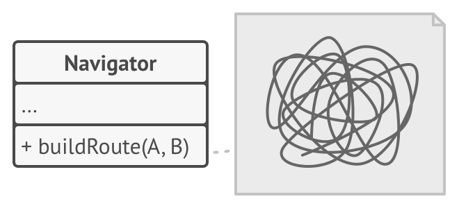
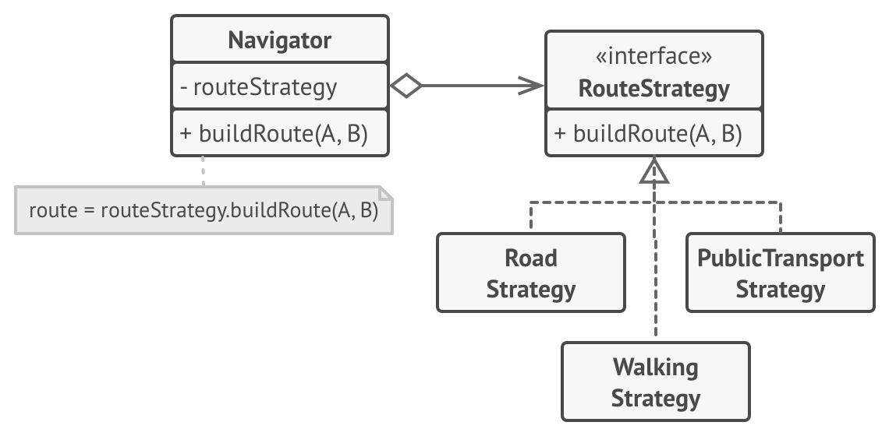
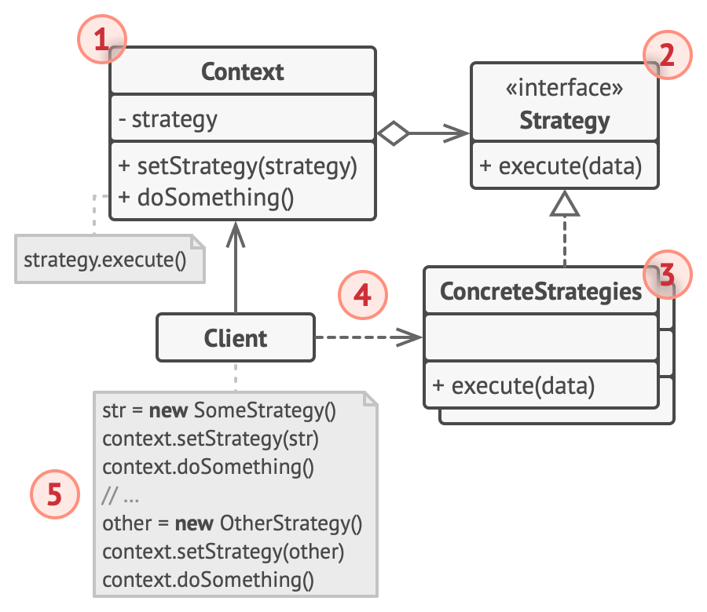

# Strategy


**Type:** Behavioral · **Also known as:** 

> **The 10-second version:** Pull each branch of a big `switch` out into its own object behind one shared interface, then let the caller hand the object in — so "which algorithm" becomes data you pass, not code you edit.

<br clear="all">

## Quick card

| | |
|---|---|
| **Problem it solves** | One class has grown several interchangeable ways of doing the same job, and they're all tangled together in a conditional that everyone has to edit and nobody can test in isolation. |
| **Core move** | Extract each variant into its own class implementing one interface. The original class keeps a reference to *one* of them and delegates. The client decides which one it gets. |
| **You'll recognise it by** | An interface with a single verb-shaped method (`Score`, `Calculate`, `Compare`, `Build`), several tiny classes implementing it, and a context class with a `SetX(...)` setter or constructor parameter that stores one. |
| **Rating** | Complexity ★☆☆ · Popularity ★★★ |
| **Closest relatives** | State (identical diagram, opposite intent), Template Method (same goal, inheritance instead of composition), Bridge (same structure, bigger scope), Command (also an action-as-object, different purpose), Decorator (changes the skin, not the guts). |
| **In your stack** | C#: `IComparer<T>`, `IEqualityComparer<T>`, `Func<T,decimal>`, .NET 8 **keyed DI** (`AddKeyedScoped`), Polly retry strategies. TS: a plain function type plus a `Record<SortKey, Ranker>` lookup — you write Strategy every time you pass a `compareFn` to `sort`. SQL: one SQL fragment builder per sort order for keyset pagination. RabbitMQ: swappable backoff/retry strategies and per-tenant routing strategies. |

### How to read this file

Technical first, plain English second. 🗣️ marks the plain-English version. Part 1 is Refactoring.Guru's material with their diagrams; Parts 2-7 are code, your stack, and the stuff that makes it stick.

---

# PART 1 — The pattern

## 1. Intent
**Strategy** is a behavioral design pattern that lets you define a family of algorithms, put each of them into a separate class, and make their objects interchangeable.


### 🗣️ In plain words

You have several different ways of doing the same job — several ways to price a car, several ways to sort search results, several ways to retry a failed message. Instead of stuffing all of them into one class and picking between them with an `if`, you give each way its own small class, and you make all those classes look identical from the outside: same method name, same parameters, same return type.

Now "which algorithm do we use?" stops being a code question and becomes a *value* you hold in a variable. You can pass it in, store it in config, read it from a database row, or let a user click a button to change it while the program is running.

The class that uses the algorithm never learns which one it got. That's the point.

## 2. Problem
One day you decided to create a navigation app for casual travelers. The app was centered around a beautiful map which helped users quickly orient themselves in any city.

One of the most requested features for the app was automatic route planning. A user should be able to enter an address and see the fastest route to that destination displayed on the map.

The first version of the app could only build the routes over roads. People who traveled by car were bursting with joy. But apparently, not everybody likes to drive on their vacation. So with the next update, you added an option to build walking routes. Right after that, you added another option to let people use public transport in their routes.

However, that was only the beginning. Later you planned to add route building for cyclists. And even later, another option for building routes through all of a city’s tourist attractions.



*The code of the navigator became bloated.*

While from a business perspective the app was a success, the technical part caused you many headaches. Each time you added a new routing algorithm, the main class of the navigator doubled in size. At some point, the beast became too hard to maintain.

Any change to one of the algorithms, whether it was a simple bug fix or a slight adjustment of the street score, affected the whole class, increasing the chance of creating an error in already-working code.

In addition, teamwork became inefficient. Your teammates, who had been hired right after the successful release, complain that they spend too much time resolving merge conflicts. Implementing a new feature requires you to change the same huge class, conflicting with the code produced by other people.
### 🗣️ In plain words

Start with one method that does one thing. Then the requirements arrive, one at a time, each one reasonable on its own.

```ts
// ❌ Month 1. Perfectly fine.
class SearchService {
  sort(listings: Listing[], sortBy: string): Listing[] {
    if (sortBy === "price_asc") {
      return [...listings].sort((a, b) => a.priceInr - b.priceInr);
    }
    return listings;
  }
}
```

```ts
// ❌ Month 9. Still "just a switch". Nobody has noticed yet.
class SearchService {
  sort(listings: Listing[], sortBy: string, userLat?: number, userLon?: number,
       budget?: number, boostCertified?: boolean, experimentBucket?: string): Listing[] {
    const out = [...listings];
    switch (sortBy) {
      case "price_asc":
        return out.sort((a, b) => a.priceInr - b.priceInr);
      case "price_desc":
        return out.sort((a, b) => b.priceInr - a.priceInr);
      case "newest":
        return out.sort((a, b) => +b.listedAt - +a.listedAt);
      case "km_asc":
        return out.sort((a, b) => a.kmDriven - b.kmDriven);
      case "nearest": {
        if (userLat === undefined || userLon === undefined) return out;   // silent no-op
        const d = (l: Listing) =>
          Math.hypot(l.lat - userLat, l.lon - userLon);
        return out.sort((a, b) => d(a) - d(b));
      }
      case "best_deal": {
        // 60 lines of scoring: price vs model-year median, km vs age,
        // dealer rating, photo count, certified flag, freshness decay...
        const median = this.medianByModelYear(out);
        return out.sort((a, b) => this.dealScore(b, median, budget, boostCertified)
                                - this.dealScore(a, median, budget, boostCertified));
      }
      case "relevance":
      default:
        return out.sort((a, b) => b.textRelevance - a.textRelevance);
    }
  }

  private medianByModelYear(l: Listing[]) { /* ... */ return new Map<string, number>(); }
  private dealScore(l: Listing, m: Map<string, number>,
                    budget?: number, boostCertified?: boolean) { /* ... */ return 0; }
}
```

Count what just went wrong, because each one is a separate kind of pain:

1. **The parameter list is the union of every branch's needs.** `userLat`, `budget`, `boostCertified`, `experimentBucket` — most callers pass `undefined` for most of them, and `nearest` silently does nothing when they forget. The signature is now a lie: it claims all those arguments matter, and for five of the six branches none of them do.
2. **Changing "best deal" risks breaking "price ascending."** They live in the same file, share private helpers, and every edit touches the same class. One bad merge and cheap cars stop sorting.
3. **You can't unit-test one branch without constructing the whole service.** Want to test the deal score? You instantiate `SearchService`, which pulls in whatever `SearchService` depends on.
4. **Adding the seventh sort means editing a file six other people are also editing.** This is the merge-conflict complaint from the navigation-app story, and it is the most *organisationally* expensive symptom. The class becomes a bottleneck with a queue.
5. **The class violates Open/Closed by construction.** Every new behaviour is a modification, never an extension. And there is no compiler help: add a new `sortBy` string somewhere and forget the branch, and you silently fall through to `default`.

And the killer: **the ranking rules now want to change faster than you can deploy.** Marketing wants a different "best deal" weighting for Diwali. Data science wants an A/B test with two scorers running simultaneously. Neither of those is expressible when "the algorithm" is a `case` label inside a method.

> The dead end: the algorithm variants are *values* the business wants to choose between, but you've encoded them as *control flow*, which only a developer with a deploy can change.

## 3. Solution
The Strategy pattern suggests that you take a class that does something specific in a lot of different ways and extract all of these algorithms into separate classes called *strategies*.

The original class, called *context*, must have a field for storing a reference to one of the strategies. The context delegates the work to a linked strategy object instead of executing it on its own.

The context isn’t responsible for selecting an appropriate algorithm for the job. Instead, the client passes the desired strategy to the context. In fact, the context doesn’t know much about strategies. It works with all strategies through the same generic interface, which only exposes a single method for triggering the algorithm encapsulated within the selected strategy.

This way the context becomes independent of concrete strategies, so you can add new algorithms or modify existing ones without changing the code of the context or other strategies.



*Route planning strategies.*

In our navigation app, each routing algorithm can be extracted to its own class with a single `buildRoute` method. The method accepts an origin and destination and returns a collection of the route’s checkpoints.

Even though given the same arguments, each routing class might build a different route, the main navigator class doesn’t really care which algorithm is selected since its primary job is to render a set of checkpoints on the map. The class has a method for switching the active routing strategy, so its clients, such as the buttons in the user interface, can replace the currently selected routing behavior with another one.
### 🗣️ In plain words

The mechanical moves, in order:

1. **Name the varying thing as an interface with one method.** Look at every `case` body and ask: what's the *smallest* signature that all of them could share? For the sort example it's `score(listing, context) -> number` or `compare(a, b) -> number`. Everything the branches disagreed about gets packed into a small `context` object so the signature stops growing.
2. **Move each `case` body into its own class implementing that interface.** Cut, paste, fix the compile errors. The private helper that only `best_deal` used moves *with it* and becomes private to that class. This step alone usually deletes more code than it adds, because the shared-helper gymnastics disappear.
3. **Give the original class one field of the interface type, plus a way to set it.** Constructor parameter for the common case, setter for the runtime-switchable case. The original class's method shrinks to one line of delegation.
4. **Push the choice up to the client.** The context no longer decides; whoever creates the context decides, and can change its mind later. That "later" — a setter call after construction — is the difference between Strategy and just having several classes.

> **The key insight:** Strategy doesn't make the algorithms simpler — each one is exactly as complex as it was inside the switch. What it changes is *who is allowed to know about them*. The context is downgraded from "the class that knows all six algorithms" to "the class that knows there is one algorithm," and that single demotion is what buys you independent testing, independent deployment, independent editing, and runtime swapping all at once.

## 4. Real-world analogy


*Various strategies for getting to the airport.*

Imagine that you have to get to the airport. You can catch a bus, order a cab, or get on your bicycle. These are your transportation strategies. You can pick one of the strategies depending on factors such as budget or time constraints.
### 🗣️ Two more of my own

**The payment terminal at a shop counter.** The shop's job is identical no matter how you pay: total the basket, take the money, print a receipt. Cash, card, UPI, and a gift voucher are four completely different procedures — different hardware, different failure modes, different paperwork — but the cashier runs the same three steps regardless, because each one exposes the same "collect ₹X, tell me yes or no" contract. The cashier never learns how a UPI handshake works. Add a new payment method next year and the cashier's script doesn't change by a single word.

**Choosing a cooking method for the same ingredient.** You have a piece of chicken and four appliances: oven, air fryer, pressure cooker, pan. Each one is a genuinely different algorithm with different timings and different internals, but the interface is identical — *ingredient in, cooked ingredient out* — and you pick based on constraints you have right now: how much time, how much cleanup, whether you want it crispy. The recipe card doesn't say "if you own an air fryer, then..." It says "cook the chicken," and you supply the method. The day someone invents a new appliance, every existing recipe card still works.

## 5. Structure


1. The **Context** maintains a reference to one of the concrete strategies and communicates with this object only via the strategy interface.
2. The **Strategy** interface is common to all concrete strategies. It declares a method the context uses to execute a strategy.
3. **Concrete Strategies** implement different variations of an algorithm the context uses.
4. The context calls the execution method on the linked strategy object each time it needs to run the algorithm. The context doesn’t know what type of strategy it works with or how the algorithm is executed.
5. The **Client** creates a specific strategy object and passes it to the context. The context exposes a setter which lets clients replace the strategy associated with the context at runtime.
### 🗣️ Participants & roles — cheat table

| Role | What it is in code | Example from the site | Equivalent in reader's stack |
|---|---|---|---|
| **Context** | The class that *has* a job to do and delegates one varying step of it. Holds exactly one strategy reference; talks to it only through the interface; never `is`/`instanceof`-checks it. | `Navigator` — holds `routeStrategy`, calls `buildRoute` | `SearchResultRanker`, `ListingPriceCalculator`, `MessageRetryLoop` in C#; a `SearchService` class or a closure in TS |
| **Strategy** (interface) | One method, verb-shaped, no state implied. The narrowest signature all variants can share. | `RouteStrategy` with `buildRoute(A, B)` | `IRankingStrategy.Score(listing, ctx)`; `IComparer<T>`; a TS `type Ranker = (l: Listing, c: Ctx) => number`; `Func<Listing, RankingContext, double>` |
| **Concrete Strategies** | One class (or lambda, or enum constant) per variant. Usually stateless, therefore safely shareable as a singleton. Owns its own private helpers. | `RoadStrategy`, `WalkingStrategy`, `PublicTransportStrategy` | `PriceAscRanker`, `BestDealRanker`, `NearestRanker`; `StringComparer.OrdinalIgnoreCase`; a Polly `ResiliencePipeline` |
| **Client** | Whoever constructs the concrete strategy and hands it over. It is the *only* participant that knows the differences between strategies — which is also the pattern's main cost. | The UI buttons that switch routing mode | Your ASP.NET controller reading `?sort=best_deal`; a DI container resolving a keyed service; a feature-flag check |
| **Context data** (optional) | A parameter object, or an interface the context exposes so the strategy can read what it needs. | The origin/destination arguments | `RankingContext(Now, BudgetCeilingInr, OriginLat, OriginLon)` — the thing that stops the parameter list from exploding |

### 🤝 Collaboration — who calls whom

```
   Client                Context (Ranker)        Strategy (interface)     ConcreteStrategy
     |                         |                         |                       |
     |  new BestDealRanker()   |                         |                       |
     |--------------------------------------------------------------------------->|
     |                         |                         |                       |
     |  setStrategy(s)         |                         |                       |
     |------------------------>|  _strategy = s          |                       |
     |                         |  (stores the REFERENCE, |                       |
     |                         |   learns nothing else)  |                       |
     |                         |                         |                       |
     |  rank(listings, ctx)    |                         |                       |
     |------------------------>|                         |                       |
     |                         |  _strategy.score(l,ctx) |                       |
     |                         |------------------------>|   virtual dispatch    |
     |                         |                         |---------------------->|
     |                         |                         |     runs THE algorithm|
     |                         |<- - - - - - - - -  score (a double) - - - - - - -|
     |                         |                         |                       |
     |                  [ sorts by score, renders page ]  |                       |
     |<------------------------|                         |                       |
     |                         |                         |                       |
     |  user taps "Nearest"    |                         |                       |
     |  setStrategy(new NearestRanker())                  |                       |
     |------------------------>|  field REPLACED — no subclassing, no restart    |
     |                         |                         |                       |
```

**The hop that matters:** the very first arrow — `Client → new BestDealRanker()`. In Strategy, the *client* picks and the *context* obeys. The moment you see `if (mode == "x") this.strategy = new X()` **inside the context**, you have quietly turned Strategy into a Factory-with-extra-steps, and you've put the conditional back in the exact class you were trying to free.

## 6. Pseudocode (the website's example)
In this example, the context uses multiple **strategies** to execute various arithmetic operations.

```
// The strategy interface declares operations common to all
// supported versions of some algorithm. The context uses this
// interface to call the algorithm defined by the concrete
// strategies.
interface Strategy is
    method execute(a, b)

// Concrete strategies implement the algorithm while following
// the base strategy interface. The interface makes them
// interchangeable in the context.
class ConcreteStrategyAdd implements Strategy is
    method execute(a, b) is
        return a + b

class ConcreteStrategySubtract implements Strategy is
    method execute(a, b) is
        return a - b

class ConcreteStrategyMultiply implements Strategy is
    method execute(a, b) is
        return a * b

// The context defines the interface of interest to clients.
class Context is
    // The context maintains a reference to one of the strategy
    // objects. The context doesn't know the concrete class of a
    // strategy. It should work with all strategies via the
    // strategy interface.
    private strategy: Strategy

    // Usually the context accepts a strategy through the
    // constructor, and also provides a setter so that the
    // strategy can be switched at runtime.
    method setStrategy(Strategy strategy) is
        this.strategy = strategy

    // The context delegates some work to the strategy object
    // instead of implementing multiple versions of the
    // algorithm on its own.
    method executeStrategy(int a, int b) is
        return strategy.execute(a, b)

// The client code picks a concrete strategy and passes it to
// the context. The client should be aware of the differences
// between strategies in order to make the right choice.
class ExampleApplication is
    method main() is
        Create context object.

        Read first number.
        Read last number.
        Read the desired action from user input.

        if (action == addition) then
            context.setStrategy(new ConcreteStrategyAdd())

        if (action == subtraction) then
            context.setStrategy(new ConcreteStrategySubtract())

        if (action == multiplication) then
            context.setStrategy(new ConcreteStrategyMultiply())

        result = context.executeStrategy(First number, Second number)

        Print result.
```
### 🗣️ Reading that pseudocode

- **`interface Strategy is / method execute(a, b)`** — one method, and note the parameters are *the algorithm's inputs*, not the context's internals. That's deliberate: a strategy that needs six getters off the context is a strategy that isn't really separable.
- **`class ConcreteStrategyAdd implements Strategy`** — every concrete strategy here is stateless. That matters enormously in practice: stateless strategies can be allocated once and shared across every thread and every request. Make them `static readonly` singletons in C#, module-level `const` in TS.
- **`private strategy: Strategy`** — the context stores the *interface* type, not a concrete type and not an enum. If the field's type is `ConcreteStrategyAdd`, or if there's a second field called `strategyKind`, you haven't finished the refactor.
- **`method setStrategy(Strategy strategy)`** — the setter is what separates Strategy from "I split my class up." Without it you have polymorphism; with it you have runtime-swappable behaviour, which is the headline benefit.
- **`method executeStrategy(int a, int b) is / return strategy.execute(a, b)`** — the context method is *one line*. That one-line-ness is the smell test. If the context still has an `if` in it after the refactor, the extraction was incomplete.
- **`if (action == addition) then context.setStrategy(new ConcreteStrategyAdd())`** — the conditional did not vanish from the universe; it *moved into the client*, where it belongs, and it shrank from "sixty lines of algorithm per branch" to "one line of construction per branch." That's the honest trade, and the site's own con list says it out loud: the client must know the differences.

## 7. Applicability — when to reach for it
**Use the Strategy pattern when you want to use different variants of an algorithm within an object and be able to switch from one algorithm to another during runtime.**

The Strategy pattern lets you indirectly alter the object’s behavior at runtime by associating it with different sub-objects which can perform specific sub-tasks in different ways.

**Use the Strategy when you have a lot of similar classes that only differ in the way they execute some behavior.**

The Strategy pattern lets you extract the varying behavior into a separate class hierarchy and combine the original classes into one, thereby reducing duplicate code.

**Use the pattern to isolate the business logic of a class from the implementation details of algorithms that may not be as important in the context of that logic.**

The Strategy pattern lets you isolate the code, internal data, and dependencies of various algorithms from the rest of the code. Various clients get a simple interface to execute the algorithms and switch them at runtime.

**Use the pattern when your class has a massive conditional statement that switches between different variants of the same algorithm.**

The Strategy pattern lets you do away with such a conditional by extracting all algorithms into separate classes, all of which implement the same interface. The original object delegates execution to one of these objects, instead of implementing all variants of the algorithm.
### ✅ Quick checklist

- [ ] Do you have two or more implementations of the *same* logical operation, with the same inputs and the same output shape?
- [ ] Does someone outside the class need to choose between them — a user, a config row, a feature flag, an A/B bucket, a tenant setting?
- [ ] Do the variants need to change independently, ideally by different people, ideally without re-testing the others?
- [ ] Is there already a `switch` or `if/else if` chain that has been edited more than twice, and grows by one arm every quarter?
- [ ] Could the choice need to change *while the process is running* (per request, per message, per user)?
- [ ] Do some variants pull in dependencies (an HTTP client, an ML model, a geo index) that the others don't need and shouldn't load?

Four or more ticks: extract the strategies. Two or fewer, and the branches are three lines each: leave the `switch` alone — the site's first con is aimed squarely at you.

## 8. How to implement — step by step
1. In the context class, identify an algorithm that’s prone to frequent changes. It may also be a massive conditional that selects and executes a variant of the same algorithm at runtime.
2. Declare the strategy interface common to all variants of the algorithm.
3. One by one, extract all algorithms into their own classes. They should all implement the strategy interface.
4. In the context class, add a field for storing a reference to a strategy object. Provide a setter for replacing values of that field. The context should work with the strategy object only via the strategy interface. The context may define an interface which lets the strategy access its data.
5. Clients of the context must associate it with a suitable strategy that matches the way they expect the context to perform its primary job.
### 🗣️ The same steps, blunt version

1. Find the conditional. It's the one that grows every quarter and shows up in every merge conflict.
2. Write down the signature every branch could share. Pack the union of extra arguments into one `context` parameter object so it stays one method.
3. Declare the interface. One method. Name it after the verb, not the noun (`IRankingStrategy.Score`, not `IRanker.GetRankerResult`).
4. Move one branch into a class. Get it green. Then the next. Don't do all six in one commit — the point of this pattern is that they're independent, so prove it.
5. Drag each branch's private helpers into the class that actually uses them. If two strategies genuinely share a helper, put it in a separate plain static class, not on the interface.
6. Add the field + constructor parameter + setter to the context. Make the field the interface type. Make it non-nullable and validate it once.
7. Delete the conditional from the context. The method should now be one line of delegation. If it isn't, something is still leaking.
8. Move the selection into the client — a dictionary lookup, a DI keyed resolve, a switch expression that only *constructs*, never *computes*.
9. Make stateless strategies singletons. Allocating a `PriceAscRanker` per request is free-ish but pointless; a `static readonly` instance is clearer about the intent.
10. Write one test per strategy that never mentions the context, and one test for the context that uses a fake strategy returning a constant. If you can't do both, the seam isn't clean yet.

## 9. Pros and cons
- ✅ You can swap algorithms used inside an object at runtime.
- ✅ You can isolate the implementation details of an algorithm from the code that uses it.
- ✅ You can replace inheritance with composition.
- ✅ *Open/Closed Principle*. You can introduce new strategies without having to change the context.

- ⛔ If you only have a couple of algorithms and they rarely change, there’s no real reason to overcomplicate the program with new classes and interfaces that come along with the pattern.
- ⛔ Clients must be aware of the differences between strategies to be able to select a proper one.
- ⛔ A lot of modern programming languages have functional type support that lets you implement different versions of an algorithm inside a set of anonymous functions. Then you could use these functions exactly as you’d have used the strategy objects, but without bloating your code with extra classes and interfaces.
### ⚖️ Honest trade-offs from the trenches

**The real cost isn't the extra classes, it's the extra *selection* code — and it's easy to miss that it moved rather than vanished.** You delete a six-arm switch from `SearchService` and feel great, then three weeks later you notice there's a six-entry dictionary in a factory, a six-case switch expression in the controller mapping query strings to keys, six DI registrations, and a six-value enum that must stay in sync with all of them. That's four places to edit for a new strategy instead of one. The fix isn't to abandon the pattern; it's to make *one* of those places authoritative — usually a single registry keyed by string, with the DI container enumerating `IEnumerable<IRankingStrategy>` and indexing them by a `Key` property the strategies declare themselves. Then adding a strategy really is one new file and zero edits.

**The tell that it's worth it is that the variants have different dependencies.** Six sorts that are all one-line comparators over fields you already have? Leave them as lambdas in a dictionary; classes buy you nothing. But the moment `BestDealRanker` needs a median-price cache, `NearestRanker` needs a geo service, and `PersonalisedRanker` needs an HTTP call to a model endpoint, the pattern pays for itself instantly — each strategy takes exactly its own dependencies through its own constructor, and the two cheap ones don't drag an HTTP client into every unit test. That divergence in dependencies, more than divergence in logic, is the real signal.

**Modern C# and TypeScript already hand you most of this, and you should take it.** The site's third con is the important one: a strategy is a function, and both your languages have first-class functions. In C#, `Func<Listing, RankingContext, double>` *is* the strategy interface, and `IComparer<T>`/`Comparison<T>` have shipped in the BCL since generics existed — don't write `IListingComparer`. In TypeScript, `type Ranker = (l: Listing, c: Ctx) => number` plus `const rankers: Record<SortKey, Ranker>` is the whole pattern in four lines with exhaustiveness checking from the compiler. Reach for a real interface and real classes only when you need something a function can't give you: constructor-injected dependencies, a `Key`/`DisplayName` for discovery, multiple related methods, or the ability for a DI container to manage lifetime and decorate them.

**Your DI container is the strategy selector you were about to hand-roll.** .NET 8 added **keyed services** — `services.AddKeyedScoped<IRankingStrategy, BestDealRanker>("best_deal")` and then `[FromKeyedServices("best_deal")] IRankingStrategy s` or `sp.GetRequiredKeyedService<IRankingStrategy>(key)`. That deletes your factory class outright. If you're on an older runtime, inject `IEnumerable<IRankingStrategy>` and build a `FrozenDictionary` by `Key` in the constructor; it's five lines and it's still better than a switch. And for the specific case of retry/backoff strategies, stop writing them at all: **Polly**'s resilience pipelines are Strategy done properly by people who've thought about jitter harder than you have.

## 10. Relations with other patterns
- [Bridge](https://refactoring.guru/design-patterns/bridge), [State](https://refactoring.guru/design-patterns/state), [Strategy](https://refactoring.guru/design-patterns/strategy) (and to some degree [Adapter](https://refactoring.guru/design-patterns/adapter)) have very similar structures. Indeed, all of these patterns are based on composition, which is delegating work to other objects. However, they all solve different problems. A pattern isn’t just a recipe for structuring your code in a specific way. It can also communicate to other developers the problem the pattern solves.
- [Command](https://refactoring.guru/design-patterns/command) and [Strategy](https://refactoring.guru/design-patterns/strategy) may look similar because you can use both to parameterize an object with some action. However, they have very different intents.

  - You can use *Command* to convert any operation into an object. The operation’s parameters become fields of that object. The conversion lets you defer execution of the operation, queue it, store the history of commands, send commands to remote services, etc.
  - On the other hand, *Strategy* usually describes different ways of doing the same thing, letting you swap these algorithms within a single context class.
- [Decorator](https://refactoring.guru/design-patterns/decorator) lets you change the skin of an object, while [Strategy](https://refactoring.guru/design-patterns/strategy) lets you change the guts.
- [Template Method](https://refactoring.guru/design-patterns/template-method) is based on inheritance: it lets you alter parts of an algorithm by extending those parts in subclasses. [Strategy](https://refactoring.guru/design-patterns/strategy) is based on composition: you can alter parts of the object’s behavior by supplying it with different strategies that correspond to that behavior. *Template Method* works at the class level, so it’s static. *Strategy* works on the object level, letting you switch behaviors at runtime.
- [State](https://refactoring.guru/design-patterns/state) can be considered as an extension of [Strategy](https://refactoring.guru/design-patterns/strategy). Both patterns are based on composition: they change the behavior of the context by delegating some work to helper objects. *Strategy* makes these objects completely independent and unaware of each other. However, *State* doesn’t restrict dependencies between concrete states, letting them alter the state of the context at will.
### 🗣️ Disambiguation table

| Pattern | What it actually does | How it differs from Strategy | When you'd pick it instead |
|---|---|---|---|
| **State** | Object changes behaviour when its internal state changes; the state objects usually decide what the *next* state is. | **Identical class diagram. Totally different intent.** See the deep-dive below — this is the one that matters. | The variants are *phases of a lifecycle*, transitions between them are the domain rule, and they must know about each other. |
| **Template Method** | A base class fixes the skeleton of an algorithm and subclasses override named steps. | Inheritance, not composition; class-level, not object-level. Chosen at compile time and fixed for the object's life. Also: multiple hook points, whereas Strategy replaces the whole algorithm at once. | The algorithm has a genuinely invariant skeleton with 2-5 varying steps, and you'll never need to swap at runtime. |
| **Bridge** | Splits an abstraction hierarchy from an implementation hierarchy so both can vary. | Same composition shape, but Bridge is *architectural* — both sides are whole hierarchies that grow, and the split is planned up front. Strategy is *tactical* — one varying algorithm, extracted after the fact. | You have an N × M explosion (3 report types × 4 export formats), not one varying step. |
| **Command** | Turns a request into an object so you can queue it, log it, undo it, ship it over a wire. | Command answers *what to do and when*; Strategy answers *how to do the one thing we're already doing*. A command usually carries its arguments as fields and returns nothing; a strategy takes arguments and returns a result. | You need deferral, queuing, history, undo, or remote dispatch. |
| **Decorator** | Wraps an object to add behaviour around its existing behaviour. | Decorator *layers*; Strategy *replaces*. A decorator calls through to what it wraps; a strategy has nothing underneath it. The site's line is unbeatable here. | You want to add logging/caching/retry *around* an algorithm rather than swap which algorithm runs. |
| **Factory Method / Abstract Factory** | Decides which object to create. | Creational, not behavioural. It's the thing the *client* of a Strategy usually uses to pick one. They pair constantly; they don't compete. | You need the selection logic itself to be polymorphic or configurable. |

> ***Strategy changes the guts; Decorator changes the skin; Template Method changes the parts; State changes as a consequence of what just happened.***

#### 🔍 Strategy vs State — the one you will actually be asked about

Put the two UML diagrams side by side and they are the same picture: a Context holding a reference to an interface, with several concrete classes implementing it. There is no structural test that separates them. The differences are all in intent and in three concrete, checkable behaviours.

| | **Strategy** | **State** |
|---|---|---|
| **Who chooses the current object?** | The **client**, from outside, before or between operations. | The **state objects themselves** (or the context on their instruction), from inside, as a consequence of an operation. |
| **Do the concrete classes know about each other?** | **No — deliberately.** `PriceAscRanker` has never heard of `NearestRanker`. That mutual ignorance is a design constraint you enforce. | **Yes — necessarily.** `DraftState` knows that publishing leads to `UnderReviewState`. The transition table *is* the domain logic. |
| **Do they hold a reference back to the context?** | Usually not. The strategy receives what it needs as parameters and returns a value. | Almost always. The state calls `context.TransitionTo(new PublishedState())`. |
| **Do the variants vary in *what they compute* or *what is allowed*?** | They compute the same thing differently. Same question, several answers. | They permit different operations. `Publish()` is legal in `DraftState` and throws in `SoldState`. |
| **Is the set of variants ordered / connected?** | Unordered. A flat, unconnected family. Adding a seventh disturbs nothing. | A graph. Adding a state means deciding its edges in and out, which touches other states. |
| **Number of methods on the interface** | Typically exactly one. | Typically one per event the machine handles (`Publish`, `Reserve`, `MarkSold`, `Expire`). |
| **Marketplace example** | "Sort these 4,000 listings by price / distance / best deal." Which ranker you pick has no bearing on which one you pick next. | "This listing is Draft → Under Review → Live → Reserved → Sold." `LiveState.Reserve()` moves it to `ReservedState`; nothing outside gets to say "actually, jump to Sold." |

**The one-line separator:**

> ***If the objects are interchangeable and mutually ignorant, it's Strategy. If they're sequential and they hand off to each other, it's State.***

Or, even blunter: **Strategy is a menu; State is a flowchart.** You order off a menu; a flowchart tells you where you go next.

A useful sanity check when you can't decide: *try deleting one variant.* Delete `NearestRanker` and the other five rankers compile and behave exactly as before — Strategy. Delete `ReservedState` and `LiveState` stops compiling because it names it — State. And if you genuinely have one class that both (a) lets the client swap it freely and (b) decides its own successor, you've built a state machine with a public override and you should be nervous about it.

---

# PART 2 — Official code examples from Refactoring.Guru

## 2.1 C#
**Complexity:** ★☆☆ (1/3)

**Popularity:** ★★★ (3/3)

**Usage examples:** The Strategy pattern is very common in C# code. It’s often used in various frameworks to provide users a way to change the behavior of a class without extending it.

**Identification:** Strategy pattern can be recognized by a method that lets a nested object do the actual work, as well as a setter that allows replacing that object with a different one.
### Conceptual Example

This example illustrates the structure of the **Strategy** design pattern. It focuses on answering these questions:

- What classes does it consist of?
- What roles do these classes play?
- In what way the elements of the pattern are related?

##### **Program.cs:** Conceptual example

```csharp
using System;
using System.Collections.Generic;

namespace RefactoringGuru.DesignPatterns.Strategy.Conceptual
{
    // The Context defines the interface of interest to clients.
    class Context
    {
        // The Context maintains a reference to one of the Strategy objects. The
        // Context does not know the concrete class of a strategy. It should
        // work with all strategies via the Strategy interface.
        private IStrategy _strategy;

        public Context()
        { }

        // Usually, the Context accepts a strategy through the constructor, but
        // also provides a setter to change it at runtime.
        public Context(IStrategy strategy)
        {
            this._strategy = strategy;
        }

        // Usually, the Context allows replacing a Strategy object at runtime.
        public void SetStrategy(IStrategy strategy)
        {
            this._strategy = strategy;
        }

        // The Context delegates some work to the Strategy object instead of
        // implementing multiple versions of the algorithm on its own.
        public void DoSomeBusinessLogic()
        {
            Console.WriteLine("Context: Sorting data using the strategy (not sure how it'll do it)");
            var result = this._strategy.DoAlgorithm(new List<string> { "a", "b", "c", "d", "e" });

            string resultStr = string.Empty;
            foreach (var element in result as List<string>)
            {
                resultStr += element + ",";
            }

            Console.WriteLine(resultStr);
        }
    }

    // The Strategy interface declares operations common to all supported
    // versions of some algorithm.
    //
    // The Context uses this interface to call the algorithm defined by Concrete
    // Strategies.
    public interface IStrategy
    {
        object DoAlgorithm(object data);
    }

    // Concrete Strategies implement the algorithm while following the base
    // Strategy interface. The interface makes them interchangeable in the
    // Context.
    class ConcreteStrategyA : IStrategy
    {
        public object DoAlgorithm(object data)
        {
            var list = data as List<string>;
            list.Sort();

            return list;
        }
    }

    class ConcreteStrategyB : IStrategy
    {
        public object DoAlgorithm(object data)
        {
            var list = data as List<string>;
            list.Sort();
            list.Reverse();

            return list;
        }
    }

    class Program
    {
        static void Main(string[] args)
        {
            // The client code picks a concrete strategy and passes it to the
            // context. The client should be aware of the differences between
            // strategies in order to make the right choice.
            var context = new Context();

            Console.WriteLine("Client: Strategy is set to normal sorting.");
            context.SetStrategy(new ConcreteStrategyA());
            context.DoSomeBusinessLogic();

            Console.WriteLine();

            Console.WriteLine("Client: Strategy is set to reverse sorting.");
            context.SetStrategy(new ConcreteStrategyB());
            context.DoSomeBusinessLogic();
        }
    }
}
```

##### **Output.txt:** Execution result

```output
Client: Strategy is set to normal sorting.
Context: Sorting data using the strategy (not sure how it'll do it)
a,b,c,d,e

Client: Strategy is set to reverse sorting.
Context: Sorting data using the strategy (not sure how it'll do it)
e,d,c,b,a
```

## 2.2 TypeScript
**Complexity:** ★☆☆ (1/3)

**Popularity:** ★★★ (3/3)

**Usage examples:** The Strategy pattern is very common in TypeScript code. It’s often used in various frameworks to provide users a way to change the behavior of a class without extending it.

**Identification:** Strategy pattern can be recognized by a method that lets a nested object do the actual work, as well as a setter that allows replacing that object with a different one.
### Conceptual Example

This example illustrates the structure of the **Strategy** design pattern and focuses on the following questions:

- What classes does it consist of?
- What roles do these classes play?
- In what way the elements of the pattern are related?

##### **index.ts:** Conceptual example

```typescript
/**
 * The Context defines the interface of interest to clients.
 */
class Context {
    /**
     * @type {Strategy} The Context maintains a reference to one of the Strategy
     * objects. The Context does not know the concrete class of a strategy. It
     * should work with all strategies via the Strategy interface.
     */
    private strategy: Strategy;

    /**
     * Usually, the Context accepts a strategy through the constructor, but also
     * provides a setter to change it at runtime.
     */
    constructor(strategy: Strategy) {
        this.strategy = strategy;
    }

    /**
     * Usually, the Context allows replacing a Strategy object at runtime.
     */
    public setStrategy(strategy: Strategy) {
        this.strategy = strategy;
    }

    /**
     * The Context delegates some work to the Strategy object instead of
     * implementing multiple versions of the algorithm on its own.
     */
    public doSomeBusinessLogic(): void {
        // ...

        console.log('Context: Sorting data using the strategy (not sure how it\'ll do it)');
        const result = this.strategy.doAlgorithm(['a', 'b', 'c', 'd', 'e']);
        console.log(result.join(','));

        // ...
    }
}

/**
 * The Strategy interface declares operations common to all supported versions
 * of some algorithm.
 *
 * The Context uses this interface to call the algorithm defined by Concrete
 * Strategies.
 */
interface Strategy {
    doAlgorithm(data: string[]): string[];
}

/**
 * Concrete Strategies implement the algorithm while following the base Strategy
 * interface. The interface makes them interchangeable in the Context.
 */
class ConcreteStrategyA implements Strategy {
    public doAlgorithm(data: string[]): string[] {
        return data.sort();
    }
}

class ConcreteStrategyB implements Strategy {
    public doAlgorithm(data: string[]): string[] {
        return data.reverse();
    }
}

/**
 * The client code picks a concrete strategy and passes it to the context. The
 * client should be aware of the differences between strategies in order to make
 * the right choice.
 */
const context = new Context(new ConcreteStrategyA());
console.log('Client: Strategy is set to normal sorting.');
context.doSomeBusinessLogic();

console.log('');

console.log('Client: Strategy is set to reverse sorting.');
context.setStrategy(new ConcreteStrategyB());
context.doSomeBusinessLogic();
```

##### **Output.txt:** Execution result

```output
Client: Strategy is set to normal sorting.
Context: Sorting data using the strategy (not sure how it'll do it)
a,b,c,d,e

Client: Strategy is set to reverse sorting.
Context: Sorting data using the strategy (not sure how it'll do it)
e,d,c,b,a
```

## 2.3 C++
**Complexity:** ★☆☆ (1/3)

**Popularity:** ★★★ (3/3)

**Usage examples:** The Strategy pattern is very common in C++ code. It’s often used in various frameworks to provide users a way to change the behavior of a class without extending it.

**Identification:** Strategy pattern can be recognized by a method that lets a nested object do the actual work, as well as a setter that allows replacing that object with a different one.
### Conceptual Example

This example illustrates the structure of the **Strategy** design pattern. It focuses on answering these questions:

- What classes does it consist of?
- What roles do these classes play?
- In what way the elements of the pattern are related?

##### **main.cc:** Conceptual example

```cpp
/**
 * The Strategy interface declares operations common to all supported versions
 * of some algorithm.
 *
 * The Context uses this interface to call the algorithm defined by Concrete
 * Strategies.
 */
class Strategy
{
public:
    virtual ~Strategy() = default;
    virtual std::string doAlgorithm(std::string_view data) const = 0;
};

/**
 * The Context defines the interface of interest to clients.
 */

class Context
{
    /**
     * @var Strategy The Context maintains a reference to one of the Strategy
     * objects. The Context does not know the concrete class of a strategy. It
     * should work with all strategies via the Strategy interface.
     */
private:
    std::unique_ptr<Strategy> strategy_;
    /**
     * Usually, the Context accepts a strategy through the constructor, but also
     * provides a setter to change it at runtime.
     */
public:
    explicit Context(std::unique_ptr<Strategy> &&strategy = {}) : strategy_(std::move(strategy))
    {
    }
    /**
     * Usually, the Context allows replacing a Strategy object at runtime.
     */
    void set_strategy(std::unique_ptr<Strategy> &&strategy)
    {
        strategy_ = std::move(strategy);
    }
    /**
     * The Context delegates some work to the Strategy object instead of
     * implementing +multiple versions of the algorithm on its own.
     */
    void doSomeBusinessLogic() const
    {
        if (strategy_) {
            std::cout << "Context: Sorting data using the strategy (not sure how it'll do it)\n";
            std::string result = strategy_->doAlgorithm("aecbd");
            std::cout << result << "\n";
        } else {
            std::cout << "Context: Strategy isn't set\n";
        }
    }
};

/**
 * Concrete Strategies implement the algorithm while following the base Strategy
 * interface. The interface makes them interchangeable in the Context.
 */
class ConcreteStrategyA : public Strategy
{
public:
    std::string doAlgorithm(std::string_view data) const override
    {
        std::string result(data);
        std::sort(std::begin(result), std::end(result));

        return result;
    }
};
class ConcreteStrategyB : public Strategy
{
    std::string doAlgorithm(std::string_view data) const override
    {
        std::string result(data);
        std::sort(std::begin(result), std::end(result), std::greater<>());

        return result;
    }
};
/**
 * The client code picks a concrete strategy and passes it to the context. The
 * client should be aware of the differences between strategies in order to make
 * the right choice.
 */

void clientCode()
{
    Context context(std::make_unique<ConcreteStrategyA>());
    std::cout << "Client: Strategy is set to normal sorting.\n";
    context.doSomeBusinessLogic();
    std::cout << "\n";
    std::cout << "Client: Strategy is set to reverse sorting.\n";
    context.set_strategy(std::make_unique<ConcreteStrategyB>());
    context.doSomeBusinessLogic();
}

int main()
{
    clientCode();
    return 0;
}
```

##### **Output.txt:** Execution result

```output
Client: Strategy is set to normal sorting.
Context: Sorting data using the strategy (not sure how it'll do it)
abcde

Client: Strategy is set to reverse sorting.
Context: Sorting data using the strategy (not sure how it'll do it)
edcba

```

## 2.4 Java
**Complexity:** ★☆☆ (1/3)

**Popularity:** ★★★ (3/3)

**Usage examples:** The Strategy pattern is very common in Java code. It’s often used in various frameworks to provide users a way to change the behavior of a class without extending it.

**Identification:** Strategy pattern can be recognized by a method that lets a nested object do the actual work, as well as a setter that allows replacing that object with a different one.
### Payment method in an e-commerce app

In this example, the Strategy pattern is used to implement the various payment methods in an e-commerce application. After selecting a product to purchase, a customer picks a payment method: either Paypal or credit card.

Concrete strategies not only perform the actual payment but also alter the behavior of the checkout form, providing appropriate fields to record payment details.

#### **strategies**

##### **strategies/PayStrategy.java:** Common interface of payment methods

```java
package refactoring_guru.strategy.example.strategies;

/**
 * Common interface for all strategies.
 */
public interface PayStrategy {
    boolean pay(int paymentAmount);
    void collectPaymentDetails();
}
```

##### **strategies/PayByPayPal.java:** Payment via PayPal

```java
package refactoring_guru.strategy.example.strategies;

import java.io.BufferedReader;
import java.io.IOException;
import java.io.InputStreamReader;
import java.util.HashMap;
import java.util.Map;

/**
 * Concrete strategy. Implements PayPal payment method.
 */
public class PayByPayPal implements PayStrategy {
    private static final Map<String, String> DATA_BASE = new HashMap<>();
    private final BufferedReader READER = new BufferedReader(new InputStreamReader(System.in));
    private String email;
    private String password;
    private boolean signedIn;

    static {
        DATA_BASE.put("amanda1985", "amanda@ya.com");
        DATA_BASE.put("qwerty", "john@amazon.eu");
    }

    /**
     * Collect customer's data.
     */
    @Override
    public void collectPaymentDetails() {
        try {
            while (!signedIn) {
                System.out.print("Enter the user's email: ");
                email = READER.readLine();
                System.out.print("Enter the password: ");
                password = READER.readLine();
                if (verify()) {
                    System.out.println("Data verification has been successful.");
                } else {
                    System.out.println("Wrong email or password!");
                }
            }
        } catch (IOException ex) {
            ex.printStackTrace();
        }
    }

    private boolean verify() {
        setSignedIn(email.equals(DATA_BASE.get(password)));
        return signedIn;
    }

    /**
     * Save customer data for future shopping attempts.
     */
    @Override
    public boolean pay(int paymentAmount) {
        if (signedIn) {
            System.out.println("Paying " + paymentAmount + " using PayPal.");
            return true;
        } else {
            return false;
        }
    }

    private void setSignedIn(boolean signedIn) {
        this.signedIn = signedIn;
    }
}
```

##### **strategies/PayByCreditCard.java:** Payment via credit card

```java
package refactoring_guru.strategy.example.strategies;

import java.io.BufferedReader;
import java.io.IOException;
import java.io.InputStreamReader;

/**
 * Concrete strategy. Implements credit card payment method.
 */
public class PayByCreditCard implements PayStrategy {
    private final BufferedReader READER = new BufferedReader(new InputStreamReader(System.in));
    private CreditCard card;

    /**
     * Collect credit card data.
     */
    @Override
    public void collectPaymentDetails() {
        try {
            System.out.print("Enter the card number: ");
            String number = READER.readLine();
            System.out.print("Enter the card expiration date 'mm/yy': ");
            String date = READER.readLine();
            System.out.print("Enter the CVV code: ");
            String cvv = READER.readLine();
            card = new CreditCard(number, date, cvv);

            // Validate credit card number...

        } catch (IOException ex) {
            ex.printStackTrace();
        }
    }

    /**
     * After card validation we can charge customer's credit card.
     */
    @Override
    public boolean pay(int paymentAmount) {
        if (cardIsPresent()) {
            System.out.println("Paying " + paymentAmount + " using Credit Card.");
            card.setAmount(card.getAmount() - paymentAmount);
            return true;
        } else {
            return false;
        }
    }

    private boolean cardIsPresent() {
        return card != null;
    }
}
```

##### **strategies/CreditCard.java:** A credit card class

```java
package refactoring_guru.strategy.example.strategies;

/**
 * Dummy credit card class.
 */
public class CreditCard {
    private int amount;
    private String number;
    private String date;
    private String cvv;

    CreditCard(String number, String date, String cvv) {
        this.amount = 100_000;
        this.number = number;
        this.date = date;
        this.cvv = cvv;
    }

    public void setAmount(int amount) {
        this.amount = amount;
    }

    public int getAmount() {
        return amount;
    }
}
```

#### **order**

##### **order/Order.java:** Order class

```java
package refactoring_guru.strategy.example.order;

import refactoring_guru.strategy.example.strategies.PayStrategy;

/**
 * Order class. Doesn't know the concrete payment method (strategy) user has
 * picked. It uses common strategy interface to delegate collecting payment data
 * to strategy object. It can be used to save order to database.
 */
public class Order {
    private int totalCost = 0;
    private boolean isClosed = false;

    public void processOrder(PayStrategy strategy) {
        strategy.collectPaymentDetails();
        // Here we could collect and store payment data from the strategy.
    }

    public void setTotalCost(int cost) {
        this.totalCost += cost;
    }

    public int getTotalCost() {
        return totalCost;
    }

    public boolean isClosed() {
        return isClosed;
    }

    public void setClosed() {
        isClosed = true;
    }
}
```

##### **Demo.java:** Client code

```java
package refactoring_guru.strategy.example;

import refactoring_guru.strategy.example.order.Order;
import refactoring_guru.strategy.example.strategies.PayByCreditCard;
import refactoring_guru.strategy.example.strategies.PayByPayPal;
import refactoring_guru.strategy.example.strategies.PayStrategy;

import java.io.BufferedReader;
import java.io.IOException;
import java.io.InputStreamReader;
import java.util.HashMap;
import java.util.Map;

/**
 * World first console e-commerce application.
 */
public class Demo {
    private static Map<Integer, Integer> priceOnProducts = new HashMap<>();
    private static BufferedReader reader = new BufferedReader(new InputStreamReader(System.in));
    private static Order order = new Order();
    private static PayStrategy strategy;

    static {
        priceOnProducts.put(1, 2200);
        priceOnProducts.put(2, 1850);
        priceOnProducts.put(3, 1100);
        priceOnProducts.put(4, 890);
    }

    public static void main(String[] args) throws IOException {
        while (!order.isClosed()) {
            int cost;

            String continueChoice;
            do {
                System.out.print("Please, select a product:" + "\n" +
                        "1 - Mother board" + "\n" +
                        "2 - CPU" + "\n" +
                        "3 - HDD" + "\n" +
                        "4 - Memory" + "\n");
                int choice = Integer.parseInt(reader.readLine());
                cost = priceOnProducts.get(choice);
                System.out.print("Count: ");
                int count = Integer.parseInt(reader.readLine());
                order.setTotalCost(cost * count);
                System.out.print("Do you wish to continue selecting products? Y/N: ");
                continueChoice = reader.readLine();
            } while (continueChoice.equalsIgnoreCase("Y"));

            if (strategy == null) {
                System.out.println("Please, select a payment method:" + "\n" +
                        "1 - PalPay" + "\n" +
                        "2 - Credit Card");
                String paymentMethod = reader.readLine();

                // Client creates different strategies based on input from user,
                // application configuration, etc.
                if (paymentMethod.equals("1")) {
                    strategy = new PayByPayPal();
                } else {
                    strategy = new PayByCreditCard();
                }
            }

            // Order object delegates gathering payment data to strategy object,
            // since only strategies know what data they need to process a
            // payment.
            order.processOrder(strategy);

            System.out.print("Pay " + order.getTotalCost() + " units or Continue shopping? P/C: ");
            String proceed = reader.readLine();
            if (proceed.equalsIgnoreCase("P")) {
                // Finally, strategy handles the payment.
                if (strategy.pay(order.getTotalCost())) {
                    System.out.println("Payment has been successful.");
                } else {
                    System.out.println("FAIL! Please, check your data.");
                }
                order.setClosed();
            }
        }
    }
}
```

##### **OutputDemo.txt:** Execution result

```output
Please, select a product:
1 - Mother board
2 - CPU
3 - HDD
4 - Memory
1
Count: 2
Do you wish to continue selecting products? Y/N: y
Please, select a product:
1 - Mother board
2 - CPU
3 - HDD
4 - Memory
2
Count: 1
Do you wish to continue selecting products? Y/N: n
Please, select a payment method:
1 - PalPay
2 - Credit Card
1
Enter the user's email: user@example.com
Enter the password: qwerty
Wrong email or password!
Enter user email: amanda@ya.com
Enter password: amanda1985
Data verification has been successful.
Pay 6250 units or Continue shopping?  P/C: p
Paying 6250 using PayPal.
Payment has been successful.
```

---

# PART 3 — Learn it by building it

## 3.1 The dumbest possible version — TypeScript

### ❌ BEFORE — the pain, in full

Search results on a car marketplace. Six sort orders, one method, nine months of accretion.

```ts
// ❌ BEFORE — every algorithm crammed into one class

export interface Listing {
  id: number;
  make: string;
  model: string;
  year: number;
  priceInr: number;
  kmDriven: number;
  lat: number;
  lon: number;
  listedAt: Date;
  dealerRating: number;   // 0..5
  photoCount: number;
  certified: boolean;
  textRelevance: number;  // 0..1, from the search engine
}

export class SearchService {
  // The parameter list is the UNION of what every branch needs.
  sort(
    listings: Listing[],
    sortBy: string,
    userLat?: number,
    userLon?: number,
    budgetInr?: number,
    now: Date = new Date(),
  ): Listing[] {
    const out = [...listings];

    switch (sortBy) {
      case "price_asc":
        return out.sort((a, b) => a.priceInr - b.priceInr);

      case "price_desc":
        return out.sort((a, b) => b.priceInr - a.priceInr);

      case "newest":
        return out.sort((a, b) => +b.listedAt - +a.listedAt);

      case "km_asc":
        return out.sort((a, b) => a.kmDriven - b.kmDriven);

      case "nearest": {
        if (userLat === undefined || userLon === undefined) {
          return out;                       // 💥 silently does nothing
        }
        const d = (l: Listing) =>
          Math.hypot(l.lat - userLat, l.lon - userLon);
        return out.sort((a, b) => d(a) - d(b));
      }

      case "best_deal": {
        const medians = this.medianPriceByModelYear(out);
        const score = (l: Listing) => {
          const key = `${l.make}|${l.model}|${l.year}`;
          const median = medians.get(key) ?? l.priceInr;
          let s = (median - l.priceInr) / median;               // cheaper than peers = good
          s -= (l.kmDriven / 10_000) * 0.02;                    // high km = bad
          s += (l.dealerRating / 5) * 0.15;
          s += Math.min(l.photoCount, 10) / 10 * 0.05;
          if (l.certified) s += 0.10;
          if (budgetInr !== undefined && l.priceInr > budgetInr) s -= 0.5;
          const ageDays = (+now - +l.listedAt) / 86_400_000;
          s -= Math.min(ageDays, 60) / 60 * 0.08;
          return s;
        };
        return out.sort((a, b) => score(b) - score(a));
      }

      case "relevance":
      default:
        return out.sort((a, b) => b.textRelevance - a.textRelevance);
    }
  }

  private medianPriceByModelYear(listings: Listing[]): Map<string, number> {
    const buckets = new Map<string, number[]>();
    for (const l of listings) {
      const key = `${l.make}|${l.model}|${l.year}`;
      (buckets.get(key) ?? buckets.set(key, []).get(key)!).push(l.priceInr);
    }
    const out = new Map<string, number>();
    for (const [key, prices] of buckets) {
      prices.sort((a, b) => a - b);
      out.set(key, prices[Math.floor(prices.length / 2)]);
    }
    return out;
  }
}
```

Three things are already wrong and will only get worse: `sortBy` is a `string` so typos compile fine and land in `default`; `nearest` fails silently when the caller forgets two optional arguments; and `medianPriceByModelYear` is a private method on `SearchService` that exactly one branch uses, so it will confuse every future reader of the other five.

### ✅ AFTER — the same feature as Strategy

```ts
// ════════════════════════════════════════════════════════════════
//  strategy/ranking.ts
//  Strategy — one ranking algorithm per object, chosen by the caller
// ════════════════════════════════════════════════════════════════

import type { Listing } from "../listing";

// ────────────────────────────────────────────────────────────────
//  1. THE CONTEXT DATA
//     Everything a ranker *might* need, in one object. This is the
//     move that stops the parameter list from exploding — the union
//     of all the branches' extra arguments lives here instead of in
//     six optional parameters on one method.
// ────────────────────────────────────────────────────────────────
export interface RankingContext {
  readonly now: Date;
  readonly origin?: { readonly lat: number; readonly lon: number };
  readonly budgetInr?: number;
  /** Median price per make|model|year across the current result set. */
  readonly medianByModelYear: ReadonlyMap<string, number>;
}

// ────────────────────────────────────────────────────────────────
//  2. THE STRATEGY INTERFACE
//     One method. Verb-shaped. Same inputs, same output, always.
//     `key` and `label` exist so the registry and the UI can
//     discover strategies instead of hard-coding a list.
// ────────────────────────────────────────────────────────────────
export interface RankingStrategy {
  readonly key: string;
  readonly label: string;
  /** Higher is better. The context sorts descending by this. */
  score(listing: Listing, ctx: RankingContext): number;   // 👈 THE contract
}

// ────────────────────────────────────────────────────────────────
//  3. CONCRETE STRATEGIES
//     Stateless ⇒ one shared instance each, frozen, module-level.
//     Each one owns whatever private maths it needs and NOTHING else
//     in the codebase has to know that maths exists.
// ────────────────────────────────────────────────────────────────

export const PriceAscending: RankingStrategy = Object.freeze({
  key: "price_asc",
  label: "Price: low to high",
  // Negated because the context always sorts descending by score.
  score: (l) => -l.priceInr,
});

export const PriceDescending: RankingStrategy = Object.freeze({
  key: "price_desc",
  label: "Price: high to low",
  score: (l) => l.priceInr,
});

export const Newest: RankingStrategy = Object.freeze({
  key: "newest",
  label: "Newest first",
  score: (l) => l.listedAt.getTime(),
});

export const LowestKilometres: RankingStrategy = Object.freeze({
  key: "km_asc",
  label: "Least driven",
  score: (l) => -l.kmDriven,
});

/**
 * A strategy with a HARD REQUIREMENT on the context. Note what it
 * does when the requirement is missing: it fails loudly, at the
 * point of use, instead of silently returning the input unsorted.
 */
export const Nearest: RankingStrategy = Object.freeze({
  key: "nearest",
  label: "Nearest to me",
  score: (l, ctx) => {
    if (!ctx.origin) {
      throw new Error("Nearest ranking requires ctx.origin");   // 👈 loud, not silent
    }
    return -Math.hypot(l.lat - ctx.origin.lat, l.lon - ctx.origin.lon);
  },
});

export const Relevance: RankingStrategy = Object.freeze({
  key: "relevance",
  label: "Best match",
  score: (l) => l.textRelevance,
});

/**
 * The complicated one. ALL of its weighting logic is now here, in a
 * file that nobody editing "price ascending" will ever open.
 * Marketing wants different Diwali weights? One class, one review,
 * one deploy, zero risk to the other five.
 */
export class BestDealRanking implements RankingStrategy {
  readonly key = "best_deal";
  readonly label = "Best deal";

  constructor(
    private readonly weights = {
      kmPenaltyPer10k: 0.02,
      dealerRating: 0.15,
      photos: 0.05,
      certifiedBonus: 0.10,
      overBudgetPenalty: 0.5,
      stalenessPenalty: 0.08,
    },
  ) {}

  score(l: Listing, ctx: RankingContext): number {
    const key = `${l.make}|${l.model}|${l.year}`;
    const median = ctx.medianByModelYear.get(key) ?? l.priceInr;

    let s = (median - l.priceInr) / median;
    s -= (l.kmDriven / 10_000) * this.weights.kmPenaltyPer10k;
    s += (l.dealerRating / 5) * this.weights.dealerRating;
    s += (Math.min(l.photoCount, 10) / 10) * this.weights.photos;
    if (l.certified) s += this.weights.certifiedBonus;
    if (ctx.budgetInr !== undefined && l.priceInr > ctx.budgetInr) {
      s -= this.weights.overBudgetPenalty;
    }
    const ageDays = (ctx.now.getTime() - l.listedAt.getTime()) / 86_400_000;
    s -= (Math.min(ageDays, 60) / 60) * this.weights.stalenessPenalty;
    return s;
  }
}

// ────────────────────────────────────────────────────────────────
//  4. THE CONTEXT
//     Holds ONE strategy. Delegates. Has no idea which one it has.
//     Notice there is not a single `if` about ranking in here.
// ────────────────────────────────────────────────────────────────
export class SearchResultRanker {
  #strategy: RankingStrategy;

  constructor(strategy: RankingStrategy) {
    this.#strategy = strategy;
  }

  /** Runtime swap — the thing that makes this Strategy and not just polymorphism. */
  setStrategy(strategy: RankingStrategy): void {          // 👈 THE setter
    this.#strategy = strategy;
  }

  get activeLabel(): string {
    return this.#strategy.label;
  }

  rank(listings: readonly Listing[], ctx: RankingContext): Listing[] {
    // Decorate-sort-undecorate: score() is called once per listing
    // instead of O(n log n) times inside the comparator.
    return listings
      .map((l) => ({ l, s: this.#strategy.score(l, ctx) }))   // 👈 the ONE delegation
      .sort((a, b) => b.s - a.s || a.l.id - b.l.id)           // stable tiebreak on id
      .map((x) => x.l);
  }
}

// ────────────────────────────────────────────────────────────────
//  5. THE CLIENT-SIDE SELECTION
//     The switch didn't disappear — it moved here and shrank to one
//     line per entry. ONE place to edit when a strategy is added.
// ────────────────────────────────────────────────────────────────
const ALL: readonly RankingStrategy[] = [
  PriceAscending, PriceDescending, Newest,
  LowestKilometres, Nearest, Relevance, new BestDealRanking(),
];

const REGISTRY: ReadonlyMap<string, RankingStrategy> =
  new Map(ALL.map((s) => [s.key, s]));

export function rankingFor(key: string | undefined): RankingStrategy {
  return REGISTRY.get(key ?? "") ?? Relevance;   // one explicit default
}

/** For the sort dropdown — the UI never hard-codes the option list. */
export function rankingOptions(): ReadonlyArray<{ key: string; label: string }> {
  return ALL.map(({ key, label }) => ({ key, label }));
}
```

Using it:

```ts
// search-controller.ts
import { rankingFor, SearchResultRanker, type RankingContext } from "./strategy/ranking";
import { medianPriceByModelYear } from "./pricing/medians";

export async function handleSearch(req: SearchRequest): Promise<Listing[]> {
  const listings = await searchIndex.query(req.filters);

  const ctx: RankingContext = {
    now: new Date(),
    origin: req.lat && req.lon ? { lat: req.lat, lon: req.lon } : undefined,
    budgetInr: req.budgetInr,
    medianByModelYear: medianPriceByModelYear(listings),
  };

  const ranker = new SearchResultRanker(rankingFor(req.sort));
  return ranker.rank(listings, ctx);
}
```

**What to notice:**

- **`SearchResultRanker` has zero conditionals about ranking.** That's the completion test. If an `if (this.#strategy.key === ...)` ever appears in there, the refactor has regressed.
- **The optional parameters became one `RankingContext`.** Six optional args on a method is how the original rotted. One context object means adding a new input for one strategy doesn't change any signature anyone else calls.
- **Stateless strategies are frozen module-level objects, not classes.** `PriceAscending` has no state and no dependencies, so it doesn't need a class or a `new`. `BestDealRanking` *does* have configurable weights, so it gets to be a class. Mixing the two shapes behind one interface is fine and normal.
- **`Nearest` throws instead of returning unsorted.** The `BEFORE` version silently did nothing when the origin was missing — a bug that reaches production and looks like "sort is broken sometimes." Strategies should validate their own preconditions loudly, because they're the only code that knows what they need.
- **`score()` returns a number, the context does the sorting.** Contrast with returning a comparator: scoring is easier to test (`expect(BestDeal.score(cheapCar, ctx)).toBeGreaterThan(BestDeal.score(dearCar, ctx))`), easier to log, easier to blend into a weighted ensemble later, and it lets the *context* own the tiebreak so results are stable across strategies.
- **`REGISTRY` is built from `ALL`, and the UI reads `rankingOptions()`.** Adding a strategy is: write the file, add one entry to `ALL`. No enum to update, no dropdown to edit, no controller switch.
- **`#strategy` uses a real private field.** With TS's `private` a caller can still reach in via `as any`. `#` is enforced at runtime.

## 3.2 Same thing in C#

```csharp
// ════════════════════════════════════════════════════════════════
//  CarMarket.Search — Strategy, modern C# (.NET 8 / C# 12)
// ════════════════════════════════════════════════════════════════
using System.Collections.Frozen;

namespace CarMarket.Search;

// ── The data ─────────────────────────────────────────────────────
public sealed record Listing(
    long           Id,
    string         Make,
    string         Model,
    int            Year,
    decimal        PriceInr,
    int            KmDriven,
    double         Lat,
    double         Lon,
    DateTimeOffset ListedAt,
    double         DealerRating,
    int            PhotoCount,
    bool           Certified,
    double         TextRelevance);

/// Everything a ranker might need that isn't on the listing itself.
/// Optional pieces are nullable so a strategy can demand them loudly.
public sealed record RankingContext(
    DateTimeOffset                        Now,
    IReadOnlyDictionary<string, decimal>  MedianByModelYear,
    (double Lat, double Lon)?             Origin    = null,
    decimal?                              BudgetInr = null);

// ── 1. THE STRATEGY INTERFACE ────────────────────────────────────
public interface IRankingStrategy
{
    /// Stable id used in the query string, config and telemetry.
    static abstract string Key { get; }          // C# 11 static abstract, see notes
    string DisplayName { get; }
    /// Higher is better.
    double Score(Listing listing, RankingContext ctx);
}

// A non-generic view so the registry can hold them all in one list.
public interface IRankingStrategyInstance
{
    string Key { get; }
    string DisplayName { get; }
    double Score(Listing listing, RankingContext ctx);
}

// ── 2. CONCRETE STRATEGIES ───────────────────────────────────────
// Stateless ⇒ sealed + a shared singleton instance.

public sealed class PriceAscendingRanking : IRankingStrategyInstance
{
    public static readonly PriceAscendingRanking Instance = new();
    private PriceAscendingRanking() { }

    public string Key         => "price_asc";
    public string DisplayName => "Price: low to high";
    public double Score(Listing l, RankingContext _) => -(double)l.PriceInr;
}

public sealed class PriceDescendingRanking : IRankingStrategyInstance
{
    public static readonly PriceDescendingRanking Instance = new();
    private PriceDescendingRanking() { }

    public string Key         => "price_desc";
    public string DisplayName => "Price: high to low";
    public double Score(Listing l, RankingContext _) => (double)l.PriceInr;
}

public sealed class NewestRanking : IRankingStrategyInstance
{
    public static readonly NewestRanking Instance = new();
    private NewestRanking() { }

    public string Key         => "newest";
    public string DisplayName => "Newest first";
    public double Score(Listing l, RankingContext _) =>
        l.ListedAt.ToUnixTimeSeconds();
}

public sealed class LowestKilometresRanking : IRankingStrategyInstance
{
    public static readonly LowestKilometresRanking Instance = new();
    private LowestKilometresRanking() { }

    public string Key         => "km_asc";
    public string DisplayName => "Least driven";
    public double Score(Listing l, RankingContext _) => -l.KmDriven;
}

/// A strategy with a precondition on the context: fail loudly.
public sealed class NearestRanking : IRankingStrategyInstance
{
    public static readonly NearestRanking Instance = new();
    private NearestRanking() { }

    public string Key         => "nearest";
    public string DisplayName => "Nearest to me";

    public double Score(Listing l, RankingContext ctx)
    {
        var origin = ctx.Origin
            ?? throw new InvalidOperationException(
                   "Nearest ranking requires RankingContext.Origin.");
        var dLat = l.Lat - origin.Lat;
        var dLon = l.Lon - origin.Lon;
        return -Math.Sqrt(dLat * dLat + dLon * dLon);
    }
}

public sealed class RelevanceRanking : IRankingStrategyInstance
{
    public static readonly RelevanceRanking Instance = new();
    private RelevanceRanking() { }

    public string Key         => "relevance";
    public string DisplayName => "Best match";
    public double Score(Listing l, RankingContext _) => l.TextRelevance;
}

/// The one with real logic — and real configuration.
public sealed record BestDealWeights(
    double KmPenaltyPer10k   = 0.02,
    double DealerRating      = 0.15,
    double Photos            = 0.05,
    double CertifiedBonus    = 0.10,
    double OverBudgetPenalty = 0.50,
    double StalenessPenalty  = 0.08);

public sealed class BestDealRanking(BestDealWeights? weights = null)
    : IRankingStrategyInstance                        // primary constructor, C# 12
{
    private readonly BestDealWeights _w = weights ?? new BestDealWeights();

    public string Key         => "best_deal";
    public string DisplayName => "Best deal";

    public double Score(Listing l, RankingContext ctx)
    {
        var key    = $"{l.Make}|{l.Model}|{l.Year}";
        var median = ctx.MedianByModelYear.TryGetValue(key, out var m) && m > 0
                     ? m : l.PriceInr;

        var s = (double)((median - l.PriceInr) / median);
        s -= l.KmDriven / 10_000.0 * _w.KmPenaltyPer10k;
        s += l.DealerRating / 5.0 * _w.DealerRating;
        s += Math.Min(l.PhotoCount, 10) / 10.0 * _w.Photos;
        if (l.Certified) s += _w.CertifiedBonus;
        if (ctx.BudgetInr is { } cap && l.PriceInr > cap) s -= _w.OverBudgetPenalty;

        var ageDays = (ctx.Now - l.ListedAt).TotalDays;
        s -= Math.Min(ageDays, 60) / 60.0 * _w.StalenessPenalty;
        return s;
    }
}

// ── 3. THE CONTEXT ───────────────────────────────────────────────
public sealed class SearchResultRanker
{
    private IRankingStrategyInstance _strategy;

    public SearchResultRanker(IRankingStrategyInstance strategy) =>
        _strategy = strategy ?? throw new ArgumentNullException(nameof(strategy));

    public string ActiveLabel => _strategy.DisplayName;

    /// Runtime swap.
    public void SetStrategy(IRankingStrategyInstance strategy) =>
        _strategy = strategy ?? throw new ArgumentNullException(nameof(strategy));

    public IReadOnlyList<Listing> Rank(
        IEnumerable<Listing> listings, RankingContext ctx)
    {
        // Score once per listing, then sort — not once per comparison.
        var scored = listings
            .Select(l => (Listing: l, Score: _strategy.Score(l, ctx)))
            .ToArray();

        Array.Sort(scored, static (a, b) =>
        {
            var byScore = b.Score.CompareTo(a.Score);        // descending
            return byScore != 0 ? byScore : a.Listing.Id.CompareTo(b.Listing.Id);
        });

        return Array.ConvertAll(scored, static x => x.Listing);
    }
}

// ── 4. SELECTION — one authoritative place ───────────────────────
public sealed class RankingRegistry
{
    private readonly FrozenDictionary<string, IRankingStrategyInstance> _byKey;
    public IRankingStrategyInstance Default { get; }

    public RankingRegistry(IEnumerable<IRankingStrategyInstance> strategies)
    {
        _byKey  = strategies.ToFrozenDictionary(s => s.Key, StringComparer.Ordinal);
        Default = _byKey["relevance"];
    }

    public IRankingStrategyInstance Resolve(string? key) =>
        key is not null && _byKey.TryGetValue(key, out var s) ? s : Default;

    public IReadOnlyList<(string Key, string Label)> Options() =>
        _byKey.Values.Select(s => (s.Key, s.DisplayName)).ToArray();
}
```

Wiring and use:

```csharp
// Program.cs
builder.Services.AddSingleton<IRankingStrategyInstance>(PriceAscendingRanking.Instance);
builder.Services.AddSingleton<IRankingStrategyInstance>(PriceDescendingRanking.Instance);
builder.Services.AddSingleton<IRankingStrategyInstance>(NewestRanking.Instance);
builder.Services.AddSingleton<IRankingStrategyInstance>(LowestKilometresRanking.Instance);
builder.Services.AddSingleton<IRankingStrategyInstance>(NearestRanking.Instance);
builder.Services.AddSingleton<IRankingStrategyInstance>(RelevanceRanking.Instance);
builder.Services.AddSingleton<IRankingStrategyInstance, BestDealRanking>();
builder.Services.AddSingleton<RankingRegistry>();

// SearchController.cs
[HttpGet("/search")]
public async Task<IReadOnlyList<Listing>> Search(
    [FromQuery] SearchQuery q,
    [FromServices] RankingRegistry registry,
    CancellationToken ct)
{
    var listings = await _index.QueryAsync(q.Filters, ct);

    var ctx = new RankingContext(
        Now:               _clock.GetUtcNow(),
        MedianByModelYear: _medians.For(listings),
        Origin:            q is { Lat: { } lat, Lon: { } lon } ? (lat, lon) : null,
        BudgetInr:         q.BudgetInr);

    var ranker = new SearchResultRanker(registry.Resolve(q.Sort));
    return ranker.Rank(listings, ctx);
}
```

**C#-specific notes:**

- **The BCL already has this interface — use it when it fits.** `IComparer<T>` and `Comparison<T>` *are* Strategy, and `List<T>.Sort`, `Array.Sort`, `OrderBy` and `SortedSet<T>` are contexts built to accept them. `StringComparer.OrdinalIgnoreCase` is a ready-made concrete strategy singleton. If your variants are pure comparisons with no dependencies and no display name, write `IComparer<Listing>` implementations and stop.
- **Scoring beats comparing when strategies get complex.** `Score → sort` computes the expensive part n times; `IComparer` computes it O(n log n) times unless you cache. It also composes: a weighted ensemble of three scorers is trivial, a weighted ensemble of three comparators is not.
- **`static abstract` members on interfaces (C# 11) are tempting and usually the wrong tool here.** I showed it above for completeness, but a static abstract `Key` means you can only reach it through a generic type parameter (`T.Key` where `T : IRankingStrategy`), which you can't do when you're holding `IRankingStrategyInstance` in a list. For a runtime registry, an ordinary instance property is what you want. Use static abstracts for compile-time policy, not runtime selection.
- **.NET 8 keyed services delete the registry entirely** if you only ever resolve by key: `services.AddKeyedSingleton<IRankingStrategyInstance, BestDealRanking>("best_deal")`, then `sp.GetRequiredKeyedService<IRankingStrategyInstance>(q.Sort ?? "relevance")` or `[FromKeyedServices("best_deal")]` on a parameter. Keep the registry when you also need to *enumerate* strategies (for the sort dropdown) or need a safe fallback for unknown keys — `GetRequiredKeyedService` throws on an unknown key, and an unknown key here is user input from a query string.
- **`ToFrozenDictionary` (.NET 8) is the right container for a lookup built once and read forever.** Slower to build, meaningfully faster to read than `Dictionary<,>`. Use `StringComparer.Ordinal` explicitly so a culture change can never alter which strategy a key resolves to.
- **Prefer `Func<Listing, RankingContext, double>` when there is no state and no metadata.** A delegate is a strategy. Keep an interface when you want DI-injected dependencies, a `Key`/`DisplayName` for discovery, or the ability to decorate (e.g. a `LoggingRankingDecorator` wrapping any strategy).
- **Watch the `decimal`/`double` seam.** Prices are `decimal` (money), scores are `double` (maths). Cast at the boundary deliberately, once, and never let a score become `decimal` — you'll pay 10-20× for arithmetic you don't need exact.
- **Pitfall — a mutable strategy shared as a singleton.** `BestDealRanking` holds weights, and I registered it as a singleton. That's safe *only* because `BestDealWeights` is an immutable record set once at construction. The moment someone adds a `public BestDealWeights Weights { get; set; }`, you have cross-request mutable state on a singleton and a race that shows up as "search results were briefly nonsense." Make strategies immutable or don't make them singletons.
- **Pitfall — `Array.Sort` is unstable.** Equal scores can come back in any order, which means a user paging through results can see the same car twice and miss another. That's what the `a.Listing.Id.CompareTo(b.Listing.Id)` tiebreak is for, and it belongs in the *context* so every strategy inherits it. (`OrderBy` in LINQ is stable, `Array.Sort`/`List<T>.Sort` are not.)

## 3.3 C++

```cpp
// ════════════════════════════════════════════════════════════════
//  Strategy in C++ — runtime polymorphic form
//  Compile: c++ -std=c++20 -Wall -Wextra
// ════════════════════════════════════════════════════════════════
#include <algorithm>
#include <cmath>
#include <functional>
#include <iostream>
#include <memory>
#include <stdexcept>
#include <string>
#include <string_view>
#include <unordered_map>
#include <utility>
#include <vector>

namespace carmarket {

struct Listing {
    long long   id{};
    std::string make;
    std::string model;
    int         year{};
    double      price_inr{};
    int         km_driven{};
    double      lat{}, lon{};
    double      days_since_listed{};
    double      dealer_rating{};   // 0..5
    int         photo_count{};
    bool        certified{};
    double      text_relevance{};  // 0..1
};

struct RankingContext {
    const std::unordered_map<std::string, double>* median_by_model_year = nullptr;
    std::optional<std::pair<double, double>>       origin{};   // lat, lon
    std::optional<double>                          budget_inr{};
};

// ────────────────────────────────────────────────────────────────
//  1. THE STRATEGY INTERFACE
//
//  Note the full set of special members. This is the standard
//  polymorphic-base idiom and every line of it is load-bearing:
//    * virtual destructor  -> delete through base pointer is defined
//    * PROTECTED copy/move -> you cannot slice a derived object into
//                             a base, because you cannot construct a
//                             RankingStrategy from outside at all
// ────────────────────────────────────────────────────────────────
class RankingStrategy {
public:
    virtual ~RankingStrategy() = default;                 // 👈 MANDATORY

    [[nodiscard]] virtual double score(const Listing& l,
                                       const RankingContext& ctx) const = 0;
    [[nodiscard]] virtual std::string_view key() const noexcept = 0;
    [[nodiscard]] virtual std::string_view display_name() const noexcept = 0;

protected:
    RankingStrategy()                                  = default;
    RankingStrategy(const RankingStrategy&)            = default;   // 👈 protected
    RankingStrategy& operator=(const RankingStrategy&) = default;   //    = no slicing
    RankingStrategy(RankingStrategy&&) noexcept        = default;
    RankingStrategy& operator=(RankingStrategy&&) noexcept = default;
};

// ────────────────────────────────────────────────────────────────
//  2. CONCRETE STRATEGIES
//     `final` lets the compiler devirtualise when the static type
//     is known, and documents that nobody should extend these.
// ────────────────────────────────────────────────────────────────
class PriceAscendingRanking final : public RankingStrategy {
public:
    [[nodiscard]] double score(const Listing& l, const RankingContext&) const override {
        return -l.price_inr;
    }
    [[nodiscard]] std::string_view key() const noexcept override { return "price_asc"; }
    [[nodiscard]] std::string_view display_name() const noexcept override {
        return "Price: low to high";
    }
};

class NewestRanking final : public RankingStrategy {
public:
    [[nodiscard]] double score(const Listing& l, const RankingContext&) const override {
        return -l.days_since_listed;
    }
    [[nodiscard]] std::string_view key() const noexcept override { return "newest"; }
    [[nodiscard]] std::string_view display_name() const noexcept override {
        return "Newest first";
    }
};

class NearestRanking final : public RankingStrategy {
public:
    [[nodiscard]] double score(const Listing& l, const RankingContext& ctx) const override {
        if (!ctx.origin) {
            throw std::invalid_argument("NearestRanking requires ctx.origin");
        }
        const auto [olat, olon] = *ctx.origin;
        return -std::hypot(l.lat - olat, l.lon - olon);
    }
    [[nodiscard]] std::string_view key() const noexcept override { return "nearest"; }
    [[nodiscard]] std::string_view display_name() const noexcept override {
        return "Nearest to me";
    }
};

struct BestDealWeights {
    double km_penalty_per_10k = 0.02;
    double dealer_rating      = 0.15;
    double photos             = 0.05;
    double certified_bonus    = 0.10;
    double over_budget        = 0.50;
    double staleness          = 0.08;
};

class BestDealRanking final : public RankingStrategy {
public:
    explicit BestDealRanking(BestDealWeights w = {}) : w_(w) {}

    [[nodiscard]] double score(const Listing& l, const RankingContext& ctx) const override {
        double median = l.price_inr;
        if (ctx.median_by_model_year != nullptr) {
            const auto k  = l.make + "|" + l.model + "|" + std::to_string(l.year);
            if (const auto it = ctx.median_by_model_year->find(k);
                it != ctx.median_by_model_year->end() && it->second > 0.0) {
                median = it->second;
            }
        }

        double s = (median - l.price_inr) / median;
        s -= l.km_driven / 10000.0 * w_.km_penalty_per_10k;
        s += l.dealer_rating / 5.0 * w_.dealer_rating;
        s += std::min(l.photo_count, 10) / 10.0 * w_.photos;
        if (l.certified) s += w_.certified_bonus;
        if (ctx.budget_inr && l.price_inr > *ctx.budget_inr) s -= w_.over_budget;
        s -= std::min(l.days_since_listed, 60.0) / 60.0 * w_.staleness;
        return s;
    }

    [[nodiscard]] std::string_view key() const noexcept override { return "best_deal"; }
    [[nodiscard]] std::string_view display_name() const noexcept override {
        return "Best deal";
    }

private:
    BestDealWeights w_;
};

// ────────────────────────────────────────────────────────────────
//  3. THE CONTEXT — owns its strategy via unique_ptr
//
//  OWNERSHIP DECISION: unique_ptr because the ranker outlives the
//  call that made the strategy and there is exactly one owner.
//  If strategies are stateless singletons living in a registry that
//  outlives every ranker, take `const RankingStrategy&` or a raw
//  non-owning pointer instead — see the gotcha table.
// ────────────────────────────────────────────────────────────────
class SearchResultRanker {
public:
    explicit SearchResultRanker(std::unique_ptr<RankingStrategy> s)
        : strategy_(std::move(s)) {
        if (!strategy_) throw std::invalid_argument("strategy must not be null");
    }

    void set_strategy(std::unique_ptr<RankingStrategy> s) {      // 👈 runtime swap
        if (!s) throw std::invalid_argument("strategy must not be null");
        strategy_ = std::move(s);                                // old one freed here
    }

    [[nodiscard]] std::string_view active_label() const noexcept {
        return strategy_->display_name();
    }

    // Takes by value + returns: caller can `std::move` a vector in and
    // pay nothing; the sort happens in place on our copy.
    [[nodiscard]] std::vector<Listing>
    rank(std::vector<Listing> listings, const RankingContext& ctx) const {
        // Decorate-sort-undecorate: one virtual call per listing,
        // not one per comparison.
        std::vector<std::pair<double, std::size_t>> scored;
        scored.reserve(listings.size());
        for (std::size_t i = 0; i < listings.size(); ++i) {
            scored.emplace_back(strategy_->score(listings[i], ctx), i);
        }

        std::stable_sort(scored.begin(), scored.end(),
                         [](const auto& a, const auto& b) { return a.first > b.first; });

        std::vector<Listing> out;
        out.reserve(listings.size());
        for (const auto& [s, idx] : scored) {
            out.push_back(std::move(listings[idx]));             // 👈 move, not copy
        }
        return out;                                              // NRVO / move
    }

private:
    std::unique_ptr<RankingStrategy> strategy_;
};

// ────────────────────────────────────────────────────────────────
//  4. THE LIGHTWEIGHT ALTERNATIVE — std::function
//     No hierarchy at all. Use when strategies are plain lambdas
//     and you don't need key()/display_name()/dependencies.
// ────────────────────────────────────────────────────────────────
using ScoreFn = std::function<double(const Listing&, const RankingContext&)>;

class FnRanker {
public:
    explicit FnRanker(ScoreFn f) : score_(std::move(f)) {
        if (!score_) throw std::invalid_argument("score fn must not be empty");
    }
    void set_strategy(ScoreFn f) { score_ = std::move(f); }

    [[nodiscard]] std::vector<Listing>
    rank(std::vector<Listing> v, const RankingContext& ctx) const {
        std::stable_sort(v.begin(), v.end(),
            [&](const Listing& a, const Listing& b) {
                return score_(a, ctx) > score_(b, ctx);
            });
        return v;
    }
private:
    ScoreFn score_;
};

// ────────────────────────────────────────────────────────────────
//  5. THE ZERO-COST ALTERNATIVE — policy as a template parameter
//     Chosen at COMPILE time. No vtable, fully inlinable. This is
//     how std::sort, std::unordered_map and std::unique_ptr do it.
// ────────────────────────────────────────────────────────────────
template <class ScorePolicy>
class StaticRanker {
public:
    explicit StaticRanker(ScorePolicy p = {}) : policy_(std::move(p)) {}

    [[nodiscard]] std::vector<Listing>
    rank(std::vector<Listing> v, const RankingContext& ctx) const {
        std::stable_sort(v.begin(), v.end(),
            [&](const Listing& a, const Listing& b) {
                return policy_(a, ctx) > policy_(b, ctx);   // inlined, no indirect call
            });
        return v;
    }
private:
    [[no_unique_address]] ScorePolicy policy_;   // 👈 empty policy costs 0 bytes
};

struct PriceAscPolicy {
    double operator()(const Listing& l, const RankingContext&) const noexcept {
        return -l.price_inr;
    }
};

} // namespace carmarket

// ── Demo ─────────────────────────────────────────────────────────
int main() {
    using namespace carmarket;

    std::vector<Listing> listings{
        {1, "Maruti", "Swift",  2019, 620000.0, 42000, 19.07, 72.87, 12.0, 4.4,  9, true,  0.71},
        {2, "Maruti", "Swift",  2019, 545000.0, 68000, 18.99, 72.82, 40.0, 3.9,  5, false, 0.66},
        {3, "Hyundai","i20",    2020, 780000.0, 21000, 19.21, 72.96,  3.0, 4.8, 14, true,  0.58},
    };

    std::unordered_map<std::string, double> medians{
        {"Maruti|Swift|2019", 600000.0}, {"Hyundai|i20|2020", 760000.0},
    };
    RankingContext ctx{&medians, std::pair{19.0760, 72.8777}, 700000.0};

    SearchResultRanker ranker{std::make_unique<BestDealRanking>()};
    for (const auto& l : ranker.rank(listings, ctx)) {
        std::cout << ranker.active_label() << " -> " << l.make << ' ' << l.model
                  << " #" << l.id << '\n';
    }

    // Runtime swap. The old BestDealRanking is destroyed right here,
    // through the base pointer — which is only safe because the base
    // destructor is virtual.
    ranker.set_strategy(std::make_unique<NearestRanking>());
    for (const auto& l : ranker.rank(listings, ctx)) {
        std::cout << ranker.active_label() << " -> #" << l.id << '\n';
    }

    // Compile-time version: zero indirection, zero allocation.
    StaticRanker<PriceAscPolicy> fast{};
    for (const auto& l : fast.rank(listings, ctx)) {
        std::cout << "static price_asc -> #" << l.id << '\n';
    }
}
```

### C++ gotcha table

| Gotcha | What goes wrong | The fix |
|---|---|---|
| **Non-virtual base destructor** | `delete basePtr` on a `BestDealRanking` runs only `~RankingStrategy`. `w_` is a POD so you may see nothing — until a strategy holds a `std::string` or a `std::vector` and you leak silently, forever, in a long-running service. Formally it's undefined behaviour. | `virtual ~RankingStrategy() = default;` — always, on every polymorphic base. |
| **Object slicing** | `RankingStrategy s = *bestDeal;` or `void rank(RankingStrategy s)` copies only the base subobject. The vtable pointer becomes the base's, `score()` calls the pure virtual, and you get a runtime abort — or, worse, silently wrong behaviour via a defaulted base. | Make the base's copy/move constructors `protected` (as above), or `= delete` them. Pass by `const&`, `unique_ptr`, or `shared_ptr` — never by value. |
| **Storing a reference to a temporary strategy** | `SearchResultRanker r{BestDealRanking{}};` with a `const RankingStrategy&` member — the temporary dies at the end of the full expression and every later `score()` call is use-after-free. Often "works" in a debug build. | Own it with `unique_ptr`, or document loudly that the reference form requires a strategy that outlives the context (a `static` singleton or a registry-owned one). |
| **`score()` not `const`** | The ranker's `rank()` can't be `const`, which cascades: `const SearchResultRanker&` becomes unusable and thread-safety reasoning collapses. | `virtual double score(...) const = 0;` and make every concrete override `const`. If a strategy truly needs a cache, make the cache `mutable` plus a mutex — and think hard first. |
| **Calling `score()` inside the comparator** | `std::sort`'s comparator runs O(n log n) times. A 20 µs `best_deal` score over 5,000 listings becomes ~1.2 s instead of 0.1 s, and a virtual call blocks inlining every time. | Decorate-sort-undecorate, as in `rank()` above: score once per element into a vector of `(score, index)`, sort that. |
| **A comparator that isn't a strict weak ordering** | `return score(a) >= score(b);` with `>=` breaks the strict-weak-ordering requirement. `std::sort` is then allowed to read out of bounds — this really does crash in libstdc++ debug mode and corrupt memory in release. | Use strict `>` (or `<`). If scores can be NaN, filter or map NaN to a sentinel first: any comparison with NaN is false, which also breaks the ordering. |
| **`std::function` in a hot loop** | Type erasure means an indirect call that can't be inlined, plus a heap allocation if the captured state exceeds the small-buffer size. | For hot paths use the template/policy form (`StaticRanker`) and let the compiler inline the whole thing. Keep `std::function` for the cold, configurable path. |
| **Copying the context to swap a strategy** | `ranker = SearchResultRanker{std::make_unique<NearestRanking>()};` throws away any other state the ranker held and isn't even copyable (it owns a `unique_ptr`). | Provide `set_strategy(std::unique_ptr<...>)` that `std::move`s in. The old strategy is destroyed deterministically at the assignment. |
| **Sharing one strategy between two contexts with `unique_ptr`** | It doesn't compile, and people "fix" it by copying the strategy or by using a raw pointer with unclear ownership. | If the strategy is stateless, share it: `shared_ptr<const RankingStrategy>`, or a `static const` instance plus a non-owning `const RankingStrategy*`. Stateless strategies are the overwhelmingly common case. |

**On move semantics specifically:** strategies themselves are usually tiny and stateless, so moving them is uninteresting. The move that matters is moving the *strategy handle* into the context (`std::move(s)` in the constructor and setter) and moving the *data* through `rank()` — note `rank` takes `std::vector<Listing>` **by value** so a caller who's done with their vector can `std::move` it in for free, and `out.push_back(std::move(listings[idx]))` avoids deep-copying every `std::string` in every listing during the undecorate step. On 5,000 listings with three strings each that's 15,000 avoided heap allocations.

## 3.4 Java

Java's Strategy has one idiom you won't find in C# or TypeScript: **an enum whose constants implement the interface.** You get the family, the registry, the singletons, `valueOf` parsing, exhaustive `switch`, and serialisation safety, all from the language, in one file.

```java
package com.carmarket.search;

import java.util.Comparator;
import java.util.List;
import java.util.Map;
import java.util.Objects;
import java.util.Optional;

record Listing(
        long id, String make, String model, int year,
        long priceInr, int kmDriven, double lat, double lon,
        double daysSinceListed, double dealerRating,
        int photoCount, boolean certified, double textRelevance) { }

record RankingContext(
        Map<String, Long> medianByModelYear,
        Optional<double[]> origin,          // {lat, lon}
        Optional<Long> budgetInr) { }

/** The strategy interface. One method. Higher score = better. */
@FunctionalInterface
interface RankingStrategy {
    double score(Listing listing, RankingContext ctx);

    /** Free for every implementation, including lambdas. */
    default Comparator<Listing> comparator(RankingContext ctx) {
        return Comparator.comparingDouble((Listing l) -> score(l, ctx))
                         .reversed()
                         .thenComparingLong(Listing::id);   // stable tiebreak
    }
}

/**
 * THE JAVA IDIOM: the family of strategies as enum constants with
 * constant-specific bodies. Singletons, a registry (values()),
 * a parser (valueOf) and serialisation safety, all for free.
 */
enum StandardRanking implements RankingStrategy {

    PRICE_ASC("price_asc", "Price: low to high") {
        @Override public double score(Listing l, RankingContext ctx) {
            return -l.priceInr();
        }
    },
    PRICE_DESC("price_desc", "Price: high to low") {
        @Override public double score(Listing l, RankingContext ctx) {
            return l.priceInr();
        }
    },
    NEWEST("newest", "Newest first") {
        @Override public double score(Listing l, RankingContext ctx) {
            return -l.daysSinceListed();
        }
    },
    KM_ASC("km_asc", "Least driven") {
        @Override public double score(Listing l, RankingContext ctx) {
            return -l.kmDriven();
        }
    },
    NEAREST("nearest", "Nearest to me") {
        @Override public double score(Listing l, RankingContext ctx) {
            double[] o = ctx.origin().orElseThrow(() ->
                    new IllegalStateException("NEAREST ranking requires an origin"));
            return -Math.hypot(l.lat() - o[0], l.lon() - o[1]);
        }
    },
    RELEVANCE("relevance", "Best match") {
        @Override public double score(Listing l, RankingContext ctx) {
            return l.textRelevance();
        }
    };

    private final String key;
    private final String displayName;

    StandardRanking(String key, String displayName) {
        this.key = key;
        this.displayName = displayName;
    }

    public String key()         { return key; }
    public String displayName() { return displayName; }

    public static RankingStrategy fromKey(String key) {
        for (StandardRanking r : values()) {
            if (r.key.equals(key)) return r;
        }
        return RELEVANCE;                       // one explicit default
    }
}

/** The strategy that needs configuration gets a real class. */
final class BestDealRanking implements RankingStrategy {
    record Weights(double kmPenaltyPer10k, double dealerRating, double photos,
                   double certifiedBonus, double overBudget, double staleness) {
        static Weights defaults() {
            return new Weights(0.02, 0.15, 0.05, 0.10, 0.50, 0.08);
        }
    }

    private final Weights w;

    BestDealRanking(Weights w) { this.w = Objects.requireNonNull(w); }
    BestDealRanking()          { this(Weights.defaults()); }

    @Override public double score(Listing l, RankingContext ctx) {
        String key = l.make() + "|" + l.model() + "|" + l.year();
        long median = ctx.medianByModelYear().getOrDefault(key, l.priceInr());
        if (median <= 0) median = l.priceInr();

        double s = (double) (median - l.priceInr()) / median;
        s -= l.kmDriven() / 10_000.0 * w.kmPenaltyPer10k();
        s += l.dealerRating() / 5.0 * w.dealerRating();
        s += Math.min(l.photoCount(), 10) / 10.0 * w.photos();
        if (l.certified()) s += w.certifiedBonus();
        if (ctx.budgetInr().isPresent() && l.priceInr() > ctx.budgetInr().get()) {
            s -= w.overBudget();
        }
        s -= Math.min(l.daysSinceListed(), 60.0) / 60.0 * w.staleness();
        return s;
    }
}

/** The context. */
final class SearchResultRanker {
    private RankingStrategy strategy;

    SearchResultRanker(RankingStrategy strategy) {
        this.strategy = Objects.requireNonNull(strategy);
    }

    void setStrategy(RankingStrategy strategy) {
        this.strategy = Objects.requireNonNull(strategy);
    }

    List<Listing> rank(List<Listing> listings, RankingContext ctx) {
        return listings.stream()
                       .sorted(strategy.comparator(ctx))
                       .toList();
    }
}
```

Because the interface is a `@FunctionalInterface`, an ad-hoc strategy is a lambda with no ceremony at all:

```java
var ranker = new SearchResultRanker(StandardRanking.PRICE_ASC);
ranker.setStrategy(new BestDealRanking());

// A one-off experiment strategy — no class, no file, no registration.
ranker.setStrategy((l, ctx) ->
        l.textRelevance() * 0.7 + (l.certified() ? 0.3 : 0.0));
```

### 💡 The line that makes it click

```java
listings.sort(Comparator.comparingLong(Listing::priceInr));
```

**`java.util.Comparator` is Strategy, and you have been using it since your first week of Java.** `List.sort`, `Collections.sort`, `Arrays.sort`, `TreeMap`, `TreeSet`, `PriorityQueue` and `Stream.sorted` are all *contexts*: they own the sorting algorithm and delegate the one varying decision — "which of these two comes first?" — to an object you hand in. `Comparator.comparing(...).reversed().thenComparing(...)` is a whole combinator library for building concrete strategies without writing a class.

The second one, and the one that makes the "algorithm family" idea concrete: **`java.util.concurrent.RejectedExecutionHandler`**. A `ThreadPoolExecutor` is a context that has to answer "what do I do when the queue is full?", and the JDK ships four interchangeable concrete strategies as nested classes — `AbortPolicy` (throw), `CallerRunsPolicy` (run it on the calling thread, which applies back-pressure), `DiscardPolicy` (drop it silently), and `DiscardOldestPolicy` (drop the oldest queued task and retry). Same interface, same inputs, wildly different production consequences, and you choose by passing one to the constructor. That's the whole pattern in a JDK class you've probably configured without noticing.

Third, if you've done Swing: `java.awt.LayoutManager`. `container.setLayout(new BorderLayout())` is a literal `setStrategy` call — the container keeps doing its job and the layout algorithm swaps underneath it at runtime.

## 3.5 Deep dive — the six shapes of Strategy, and how to pick one

The single most common mistake with this pattern isn't failing to use it. It's using the *heaviest* form of it when a lighter one would do. Here is the whole spectrum on one problem, cheapest first.

### Shape 1 — The lambda / delegate

No interface, no classes. The strategy *is* a function.

```ts
type Ranker = (l: Listing, ctx: RankingContext) => number;

function rank(listings: Listing[], ctx: RankingContext, score: Ranker): Listing[] {
  return [...listings].sort((a, b) => score(b, ctx) - score(a, ctx));
}

rank(results, ctx, (l) => -l.priceInr);
```

```csharp
public IReadOnlyList<Listing> Rank(
    IEnumerable<Listing> listings,
    RankingContext ctx,
    Func<Listing, RankingContext, double> score) =>
    listings.OrderByDescending(l => score(l, ctx)).ToList();
```

**Use when:** the algorithm is one expression, has no dependencies, and nothing needs to name it. This is the site's third con turned into a recommendation — most "strategies" in modern code should stop here.
**Stop using it when:** you find yourself writing `if (score === priceAsc)`, needing a display name, or wanting DI to build it.

### Shape 2 — The lookup table

The strategies are functions; the *selection* becomes data.

```ts
type SortKey = "price_asc" | "price_desc" | "newest" | "km_asc" | "relevance";

const RANKERS: Record<SortKey, Ranker> = {
  price_asc:  (l) => -l.priceInr,
  price_desc: (l) => l.priceInr,
  newest:     (l) => l.listedAt.getTime(),
  km_asc:     (l) => -l.kmDriven,
  relevance:  (l) => l.textRelevance,
};

// 👇 The compiler now enforces that every SortKey has an entry.
//    Add a key to the union and this object stops compiling.
const isSortKey = (s: string): s is SortKey => s in RANKERS;
```

**Use when:** several simple strategies, selection from a string/enum. The TypeScript version gives you *exhaustiveness checking for free*, which a `switch` only gives you if you remember `satisfies never` in the default arm.
**Stop using it when:** the entries stop fitting on one line, or any of them needs a dependency.

### Shape 3 — The interface + classes (the classic)

What Part 3.1 and 3.2 show. One class per strategy, each with its own constructor dependencies.

**Use when:** strategies have *different dependencies*, need metadata (`Key`, `DisplayName`), need their own configuration, or need to be individually unit-tested and individually deployed.
**Stop using it when:** you notice every class is a one-line `return` with an empty constructor — go back to shape 2.

### Shape 4 — DI-resolved strategies

The container is the registry.

```csharp
// .NET 8 keyed services
builder.Services.AddKeyedScoped<IRankingStrategyInstance, BestDealRanking>("best_deal");
builder.Services.AddKeyedScoped<IRankingStrategyInstance, PersonalisedRanking>("for_you");

// In a minimal API:
app.MapGet("/search", (
    [FromQuery] string? sort,
    [FromKeyedServices("best_deal")] IRankingStrategyInstance fallback,
    IServiceProvider sp) =>
{
    var strategy = sort is null
        ? fallback
        : sp.GetKeyedService<IRankingStrategyInstance>(sort) ?? fallback;
    // ...
});
```

**Use when:** strategies need scoped services (a `DbContext`, an `HttpClient`, a tenant accessor). This is the point where hand-rolled `new` stops working and you must let the container build them.
**Watch out:** `GetRequiredKeyedService` throws on an unknown key, and the key here came from a query string. Always resolve user-supplied keys with `GetKeyedService` + a null-coalescing fallback, or validate against a known set first. Also: mixing lifetimes bites — a singleton context holding a scoped strategy is a captive dependency and a classic source of "my DbContext is disposed" at 3 a.m.

### Shape 5 — Compile-time policy

The strategy is a template/generic parameter, resolved at compile time. No vtable, fully inlinable.

```cpp
template <class ScorePolicy>
class StaticRanker { /* as in 3.3 */ };
```

```csharp
// The C# equivalent: a struct constrained to an interface.
// The JIT specialises the generic per value type and devirtualises.
public static List<Listing> Rank<TScorer>(List<Listing> src, RankingContext ctx, TScorer scorer)
    where TScorer : struct, IRankingScorer      // 👈 struct constraint is the magic
{
    var copy = new List<Listing>(src);
    copy.Sort((a, b) => scorer.Score(b, ctx).CompareTo(scorer.Score(a, ctx)));
    return copy;
}

public readonly struct PriceAscScorer : IRankingScorer
{
    public double Score(Listing l, RankingContext ctx) => -(double)l.PriceInr;
}
```

**Use when:** the strategy is called millions of times in a hot loop and the algorithm itself is cheap enough that the indirect call is a measurable fraction of the cost. `std::sort` beating `qsort` is the canonical demonstration of exactly this.
**Stop using it when:** you need runtime selection. You can't pick a template argument from a query string — and the bridging code (a `switch` that instantiates one of N generic specialisations) is exactly the conditional you were trying to delete, plus code bloat.

### Shape 6 — Data-driven / composite strategies

The weights, and eventually the composition, live in the database.

```csharp
/// A strategy made of other strategies. Still just IRankingStrategyInstance,
/// so the context is completely unaware anything unusual is happening.
public sealed class WeightedEnsembleRanking(
    IReadOnlyList<(IRankingStrategyInstance Strategy, double Weight)> parts)
    : IRankingStrategyInstance
{
    public string Key         => "ensemble";
    public string DisplayName => "Recommended";

    public double Score(Listing l, RankingContext ctx)
    {
        double total = 0;
        foreach (var (strategy, weight) in parts)
            total += weight * strategy.Score(l, ctx);
        return total;
    }
}

// Built from a config table: ranking_weights(variant, strategy_key, weight)
var ensemble = new WeightedEnsembleRanking(
[
    (RelevanceRanking.Instance, 0.50),
    (new BestDealRanking(),     0.35),
    (NearestRanking.Instance,   0.15),
]);
```

**Use when:** marketing/data science want to tune behaviour without a deploy, or you're running A/B experiments. This is where Strategy stops being a refactoring and becomes a product capability: an experiment bucket maps to a set of weights, and shipping a new ranking variant is a database insert.
**Watch out:** the strategies must be *normalised* before you can blend them. `-l.priceInr` is in the hundreds of thousands and `l.textRelevance` is in [0,1] — a naive weighted sum is just "price, with rounding error." Either z-score/min-max each component over the result set, or blend *ranks* rather than raw scores.

### The decision table

| Signal | Shape |
|---|---|
| One expression, one call site | 1 — lambda |
| 3-8 one-liners, selected by a string or enum | 2 — lookup table |
| Variants have different dependencies or need metadata | 3 — interface + classes |
| Variants need scoped services (`DbContext`, `HttpClient`) | 4 — DI-resolved |
| Nanoseconds matter and selection is compile-time | 5 — policy / generic struct |
| Non-developers need to tune or A/B it | 6 — data-driven / ensemble |

### A word on performance, since it's the usual objection

A virtual call or delegate invoke is roughly 1-3 ns when the call site is monomorphic and predicted — in practice, indistinguishable from a direct call. It gets expensive only when (a) it prevents inlining of a *tiny* body, so the call overhead dominates the work, or (b) the call site is megamorphic, so the branch predictor can't help.

For ranking 5,000 listings: 5,000 virtual calls at ~2 ns is 10 µs. The `stable_sort` around it is ~60,000 comparisons. The database round-trip that fetched the listings was 8 ms. Optimising the dispatch here would be optimising 0.1% of 0.1%.

The one that *does* matter, and that people get wrong constantly, is **calling the strategy inside the comparator**. That turns n calls into O(n log n) calls — for n = 5,000 that's 5,000 vs ~61,000, a 12× multiplier on whatever the score costs. Score once into a scratch array, sort the array. Every example above does this; the naive `sort((a,b) => score(b) - score(a))` does not. That's the real performance decision, and it has nothing to do with virtual dispatch.

---

# PART 4 — Using this in your codebase

Strategy is the pattern with the highest hit rate in a marketplace backend, because pricing, ranking, fee calculation, and retry behaviour are all "several ways to do one thing, and the business wants to choose." I'm leading with C#, where the fit is strongest.

## 4.1 C# backend — pricing strategies

Listing fees are the textbook case: the same question ("what do we charge for this listing?") with genuinely different answers per dealer tier, per campaign, per city.

```csharp
// ════════════════════════════════════════════════════════════════
//  CarMarket.Billing — listing fee strategies
// ════════════════════════════════════════════════════════════════
namespace CarMarket.Billing;

public sealed record FeeContext(
    string          DealerId,
    DealerTier      Tier,
    int             ActiveListingsThisMonth,
    decimal         VehiclePriceInr,
    string          CityCode,
    DateTimeOffset  Now);

public enum DealerTier { Individual, Bronze, Silver, Gold }

public sealed record Fee(decimal AmountInr, string Explanation)
{
    public static Fee Free(string why) => new(0m, why);
}

// ── The strategy interface ───────────────────────────────────────
public interface IListingFeeStrategy
{
    string Key { get; }
    Fee Calculate(FeeContext ctx);
}

// ── Concrete strategies: each takes ONLY its own dependencies ────

/// No dependencies. Stateless. A singleton.
public sealed class FlatFeeStrategy : IListingFeeStrategy
{
    public string Key => "flat";
    public Fee Calculate(FeeContext ctx) =>
        new(499m, "Flat listing fee");
}

/// Depends on options — bound from configuration, reloadable.
public sealed class PercentageOfPriceStrategy(IOptionsMonitor<BillingOptions> opts)
    : IListingFeeStrategy
{
    public string Key => "percentage";

    public Fee Calculate(FeeContext ctx)
    {
        var o   = opts.CurrentValue;
        var raw = ctx.VehiclePriceInr * o.PercentageRate;
        var fee = Math.Clamp(raw, o.MinFeeInr, o.MaxFeeInr);
        return new Fee(
            decimal.Round(fee, 2),
            $"{o.PercentageRate:P1} of ₹{ctx.VehiclePriceInr:N0}, " +
            $"clamped to ₹{o.MinFeeInr:N0}–₹{o.MaxFeeInr:N0}");
    }
}

/// Depends on the DB — so it must be scoped, and therefore must be
/// built by the container, not by `new`.
public sealed class TierQuotaStrategy(BillingDbContext db) : IListingFeeStrategy
{
    public string Key => "tier_quota";

    public Fee Calculate(FeeContext ctx)
    {
        var quota = db.TierQuotas
                      .AsNoTracking()
                      .FirstOrDefault(q => q.Tier == ctx.Tier);

        if (quota is null) return new Fee(499m, "No quota configured; flat fee applied");

        if (ctx.ActiveListingsThisMonth < quota.FreeListings)
            return Fee.Free($"{quota.FreeListings - ctx.ActiveListingsThisMonth} free " +
                            $"listings remaining on {ctx.Tier}");

        return new Fee(quota.OverageFeeInr,
                       $"{ctx.Tier} quota of {quota.FreeListings} exhausted");
    }
}

/// A DECORATOR over any strategy — note this is Decorator, not
/// Strategy, and the two compose perfectly because both speak
/// IListingFeeStrategy.
public sealed class FestiveDiscountDecorator(
    IListingFeeStrategy inner,
    IFestiveCalendar calendar) : IListingFeeStrategy
{
    public string Key => inner.Key + "+festive";

    public Fee Calculate(FeeContext ctx)
    {
        var fee = inner.Calculate(ctx);
        if (!calendar.IsFestivePeriod(ctx.Now, ctx.CityCode)) return fee;

        var discounted = decimal.Round(fee.AmountInr * 0.75m, 2);
        return new Fee(discounted, fee.Explanation + "; 25% festive discount applied");
    }
}

// ── The context ──────────────────────────────────────────────────
public sealed class ListingFeeCalculator(
    [FromKeyedServices("default")] IListingFeeStrategy strategy,
    ILogger<ListingFeeCalculator> log)
{
    private IListingFeeStrategy _strategy = strategy;

    public void UseStrategy(IListingFeeStrategy s) =>
        _strategy = s ?? throw new ArgumentNullException(nameof(s));

    public Fee For(FeeContext ctx)
    {
        var fee = _strategy.Calculate(ctx);
        log.LogInformation(
            "Fee for dealer {DealerId} via {Strategy}: ₹{Amount} ({Why})",
            ctx.DealerId, _strategy.Key, fee.AmountInr, fee.Explanation);
        return fee;
    }
}
```

Registration, using .NET 8 keyed services:

```csharp
// Program.cs
builder.Services.AddKeyedSingleton<IListingFeeStrategy, FlatFeeStrategy>("flat");
builder.Services.AddKeyedScoped<IListingFeeStrategy, PercentageOfPriceStrategy>("percentage");
builder.Services.AddKeyedScoped<IListingFeeStrategy, TierQuotaStrategy>("tier_quota");

// The default is itself keyed, and wrapped in the festive decorator.
builder.Services.AddKeyedScoped<IListingFeeStrategy>("default", (sp, _) =>
    new FestiveDiscountDecorator(
        sp.GetRequiredKeyedService<IListingFeeStrategy>("tier_quota"),
        sp.GetRequiredService<IFestiveCalendar>()));

builder.Services.AddScoped<ListingFeeCalculator>();
```

Three things worth calling out. **`TierQuotaStrategy` is why the interface exists** — it needs a `DbContext`, so it must be scoped and container-built, which a lambda or a static method can't be. **`FestiveDiscountDecorator` is Decorator, not Strategy**, and the fact that it plugs in without the calculator noticing is the payoff for having a real interface. **The strategies are unit-testable without ASP.NET** — `new PercentageOfPriceStrategy(fakeOptions).Calculate(ctx)` is a pure function call.

## 4.2 TypeScript / Node — keep it functional unless you can't

In TS the honest advice is: **don't build classes until you need them.** The discriminated-union-plus-record form gives you exhaustiveness checking that classes don't.

```ts
// ════════════════════════════════════════════════════════════════
//  notifications/channel.ts — delivery strategies
// ════════════════════════════════════════════════════════════════

export type Channel = "push" | "sms" | "email" | "whatsapp";

export interface NotificationPayload {
  readonly userId: string;
  readonly title: string;
  readonly body: string;
  readonly deepLink: string;
  readonly listingId?: number;
}

export interface DeliveryResult {
  readonly channel: Channel;
  readonly delivered: boolean;
  readonly providerMessageId?: string;
  readonly error?: string;
}

export type DeliveryStrategy =
  (p: NotificationPayload, signal: AbortSignal) => Promise<DeliveryResult>;

// ── Concrete strategies: closures over their own dependencies ────
// A factory-returning-a-closure is the TS equivalent of constructor
// injection, and it keeps each strategy's deps invisible to the rest.

export function pushStrategy(fcm: FcmClient, tokens: TokenStore): DeliveryStrategy {
  return async (p, signal) => {
    const token = await tokens.forUser(p.userId);
    if (!token) {
      return { channel: "push", delivered: false, error: "no device token" };
    }
    const res = await fcm.send(
      { token, notification: { title: p.title, body: p.body },
        data: { deepLink: p.deepLink } },
      { signal });
    return { channel: "push", delivered: true, providerMessageId: res.messageId };
  };
}

export function smsStrategy(sms: SmsGateway, users: UserDirectory): DeliveryStrategy {
  return async (p, signal) => {
    const phone = await users.phoneFor(p.userId);
    if (!phone) return { channel: "sms", delivered: false, error: "no phone on file" };
    // SMS is metered — strategies own their own constraints.
    const text = `${p.title}: ${p.body}`.slice(0, 160);
    const res = await sms.send({ to: phone, text }, { signal });
    return { channel: "sms", delivered: true, providerMessageId: res.sid };
  };
}

export function emailStrategy(mail: MailClient, users: UserDirectory): DeliveryStrategy {
  return async (p, signal) => {
    const address = await users.emailFor(p.userId);
    if (!address) return { channel: "email", delivered: false, error: "no email" };
    const res = await mail.send(
      { to: address, subject: p.title, html: renderEmail(p) }, { signal });
    return { channel: "email", delivered: true, providerMessageId: res.id };
  };
}

export function whatsappStrategy(wa: WhatsAppClient, users: UserDirectory): DeliveryStrategy {
  return async (p, signal) => {
    const phone = await users.phoneFor(p.userId);
    if (!phone) return { channel: "whatsapp", delivered: false, error: "no phone" };
    const res = await wa.sendTemplate(
      { to: phone, template: "listing_alert",
        params: [p.title, p.body, p.deepLink] }, { signal });
    return { channel: "whatsapp", delivered: true, providerMessageId: res.id };
  };
}

// ── The registry. THE COMPILER ENFORCES COMPLETENESS. ────────────
// Add "voice" to the Channel union and this object fails to compile
// until you add the entry. A switch statement wouldn't tell you.
export function buildStrategies(deps: Deps): Record<Channel, DeliveryStrategy> {
  return {
    push:     pushStrategy(deps.fcm, deps.tokens),
    sms:      smsStrategy(deps.sms, deps.users),
    email:    emailStrategy(deps.mail, deps.users),
    whatsapp: whatsappStrategy(deps.wa, deps.users),
  };
}

// ── The context ──────────────────────────────────────────────────
export class NotificationDispatcher {
  constructor(
    private readonly strategies: Record<Channel, DeliveryStrategy>,
    private readonly prefs: PreferenceStore,
  ) {}

  /** Try the user's channels in their preferred order, stop at first success. */
  async deliver(p: NotificationPayload, signal: AbortSignal): Promise<DeliveryResult> {
    const order = await this.prefs.channelOrderFor(p.userId);   // 👈 data, not code
    let last: DeliveryResult = {
      channel: "push", delivered: false, error: "no channels enabled",
    };

    for (const channel of order) {
      const strategy = this.strategies[channel];   // 👈 THE delegation
      try {
        last = await strategy(p, signal);
        if (last.delivered) return last;
      } catch (err) {
        last = {
          channel,
          delivered: false,
          error: err instanceof Error ? err.message : String(err),
        };
      }
    }
    return last;
  }
}
```

**Notes for this stack:**

- `Record<Channel, DeliveryStrategy>` with a union key is the single best reason to prefer the functional form in TypeScript. Exhaustiveness is checked at the *registry*, which is one place, rather than at every `switch`.
- `channelOrderFor` returning `Channel[]` from the database is Shape 6 from the deep dive — the *sequence* of strategies is user preference data, not code.
- The fallback loop makes this look a bit like Chain of Responsibility, and that's a fair reading. The distinguishing question: do the handlers decide whether to pass along (Chain), or does an outer loop decide (Strategy + a retry policy)? Here the dispatcher decides, and each strategy is ignorant of the others — Strategy.
- Don't reach for a class hierarchy here. `class PushStrategy implements DeliveryStrategy` buys nothing over a closure in TS, and the closure form keeps `FcmClient` out of every other module's type graph.

## 4.3 SQL / data access — the honest fit

**This is the weakest of the four headings, and you should know why before you apply it.** Strategy swaps an in-memory algorithm; SQL execution happens in the database, where you can't pass an object. Hand-rolling `IQueryStrategy` implementations that each build a different `SELECT` usually ends in string concatenation, injection risk, and a query plan cache full of one-off plans.

There is one place where it genuinely earns its keep: **keyset pagination, where each sort order requires a structurally different `WHERE` clause.** That's a real family of algorithms with one job, and the variants can't be expressed as parameters.

```csharp
// ════════════════════════════════════════════════════════════════
//  CarMarket.Data — keyset pagination strategies
// ════════════════════════════════════════════════════════════════
public sealed record Cursor(decimal? Price, long? Km, DateTimeOffset? ListedAt, long LastId);

public interface IKeysetPageStrategy
{
    string SortKey { get; }
    /// A parameterised fragment. NEVER interpolate user input here.
    string WhereFragment { get; }
    string OrderByClause { get; }
    void BindCursor(DbCommand cmd, Cursor c);
    Cursor CursorFor(ListingRow last);
}

public sealed class PriceAscKeyset : IKeysetPageStrategy
{
    public string SortKey => "price_asc";

    // Compound keyset: (price, id) is unique, so paging can never
    // skip or repeat a row even when 400 cars share a price.
    public string WhereFragment =>
        "(@cursorPrice IS NULL OR price_inr > @cursorPrice " +
        " OR (price_inr = @cursorPrice AND listing_id > @cursorId))";

    public string OrderByClause => "price_inr ASC, listing_id ASC";

    public void BindCursor(DbCommand cmd, Cursor c)
    {
        cmd.AddParam("@cursorPrice", c.Price);
        cmd.AddParam("@cursorId",    c.LastId);
    }

    public Cursor CursorFor(ListingRow last) =>
        new(last.PriceInr, null, null, last.ListingId);
}

public sealed class NewestKeyset : IKeysetPageStrategy
{
    public string SortKey => "newest";

    public string WhereFragment =>
        "(@cursorListedAt IS NULL OR listed_at < @cursorListedAt " +
        " OR (listed_at = @cursorListedAt AND listing_id > @cursorId))";

    public string OrderByClause => "listed_at DESC, listing_id ASC";

    public void BindCursor(DbCommand cmd, Cursor c)
    {
        cmd.AddParam("@cursorListedAt", c.ListedAt);
        cmd.AddParam("@cursorId",       c.LastId);
    }

    public Cursor CursorFor(ListingRow last) =>
        new(null, null, last.ListedAt, last.ListingId);
}

// ── The context: one query shape, N orderings ────────────────────
public sealed class ListingPageReader(DbConnectionFactory factory)
{
    // The template is a CONST. Only the two fragments vary, and both
    // come from a closed set of strategy objects we wrote — never
    // from user input.
    private const string Template = """
        SELECT TOP (@pageSize)
               listing_id, make, model, model_year, price_inr,
               km_driven, listed_at, city_code
        FROM   dbo.listing
        WHERE  status = 'live'
          AND  city_code = @cityCode
          AND  {0}
        ORDER BY {1};
        """;

    public async Task<(IReadOnlyList<ListingRow> Rows, Cursor? Next)> ReadPageAsync(
        IKeysetPageStrategy strategy, string cityCode, Cursor? cursor,
        int pageSize, CancellationToken ct)
    {
        await using var conn = await factory.OpenAsync(ct);
        await using var cmd  = conn.CreateCommand();

        cmd.CommandText = string.Format(
            Template, strategy.WhereFragment, strategy.OrderByClause);

        cmd.AddParam("@pageSize", pageSize);
        cmd.AddParam("@cityCode", cityCode);
        strategy.BindCursor(cmd, cursor ?? new Cursor(null, null, null, 0));

        var rows = await cmd.ReadAllAsync<ListingRow>(ct);
        var next = rows.Count == pageSize ? strategy.CursorFor(rows[^1]) : null;
        return (rows, next);
    }
}
```

**The rules that keep this safe and fast:**

- **Every strategy returns a fragment with named parameters, never values.** The only strings that reach `CommandText` are compile-time constants from classes you wrote. If a strategy ever interpolates a caller-supplied column name, you've built an injection vector — validate against an allow-list of known strategy keys at the controller boundary and never let the key itself reach SQL.
- **Each sort order needs its own index**, and that's the real work: `(city_code, status, price_inr, listing_id)` for `price_asc`, `(city_code, status, listed_at DESC, listing_id)` for `newest`. The Strategy interface is the natural place to *document* which index each variant requires — add an `XML doc` comment or a `RequiredIndex` property and your DBA will thank you.
- **With EF Core, most of this isn't needed.** `IQueryable` composition already gives you pluggable ordering: `Func<IQueryable<Listing>, IOrderedQueryable<Listing>>` in a dictionary is a perfectly good strategy, and EF builds the SQL. Drop to raw SQL strategies only when you need keyset semantics EF can't express or a query hint it won't emit.
- **Where Strategy genuinely does *not* belong in data access:** picking a database, picking an ORM, or switching between "SQL Server" and "Postgres" implementations. That's **Bridge** (two hierarchies varying independently) or just a repository interface. Calling it Strategy is how people end up with a `IDatabaseStrategy` god-interface with 40 methods.

## 4.4 RabbitMQ / messaging — the strongest non-obvious fit

Three separate Strategy opportunities live in a message consumer, and they're often confused with each other.

### (a) Backoff strategies — but use Polly, don't write them

```csharp
// ❌ The hand-rolled version everyone writes first.
public interface IBackoffStrategy { TimeSpan Delay(int attempt); }
public sealed class ExponentialBackoff : IBackoffStrategy
{
    public TimeSpan Delay(int attempt) => TimeSpan.FromSeconds(Math.Pow(2, attempt));
}
```

It's correct Strategy and it's still the wrong call, because it's missing jitter, a cap, and a circuit breaker — and because **Polly already is this pattern, done properly**:

```csharp
// ✅ Polly v8 — "resilience strategies" is literally what they're called.
var pipeline = new ResiliencePipelineBuilder()
    .AddRetry(new RetryStrategyOptions
    {
        MaxRetryAttempts = 5,
        BackoffType      = DelayBackoffType.Exponential,
        UseJitter        = true,                       // 👈 the bit you'd forget
        Delay            = TimeSpan.FromMilliseconds(500),
        ShouldHandle     = new PredicateBuilder()
            .Handle<HttpRequestException>()
            .Handle<TimeoutException>(),
    })
    .AddTimeout(TimeSpan.FromSeconds(10))
    .Build();

await pipeline.ExecuteAsync(
    async token => await _pricingApi.RefreshAsync(listingId, token), ct);
```

If you're on **MassTransit**, the same thing is configuration: `cfg.UseMessageRetry(r => r.Exponential(5, TimeSpan.FromSeconds(1), TimeSpan.FromMinutes(5), TimeSpan.FromSeconds(2)))` for in-process retries, plus `UseDelayedRedelivery` for the long-tail ones that should leave the broker. Write your own backoff strategy interface only if you're on raw `RabbitMQ.Client` with no resilience library, and even then, add jitter.

> **Why jitter matters here specifically:** without it, 2,000 consumers that all failed on the same downstream outage retry at exactly the same millisecond, five times, and take the downstream service down again the moment it recovers. Exponential backoff without jitter is a synchronised herd.

### (b) Poison-message strategies — this one you *should* write

What to do with a message that has failed N times is a genuine business decision that differs per message type, and there's no library answer.

```csharp
public sealed record FailureContext(
    string MessageType, string MessageId, int DeliveryCount,
    Exception LastError, ReadOnlyMemory<byte> Body);

public interface IPoisonStrategy
{
    string Key { get; }
    Task<PoisonOutcome> HandleAsync(FailureContext ctx, CancellationToken ct);
}

public enum PoisonOutcome { Requeued, DeadLettered, Dropped, Escalated }

/// For price updates: stale data is worse than no data. Dead-letter and alert.
public sealed class DeadLetterAndAlertStrategy(
    IDeadLetterPublisher dlq, IAlertSink alerts) : IPoisonStrategy
{
    public string Key => "dead_letter_alert";

    public async Task<PoisonOutcome> HandleAsync(FailureContext ctx, CancellationToken ct)
    {
        await dlq.PublishAsync(ctx.MessageType, ctx.Body, ctx.LastError, ct);
        await alerts.RaiseAsync(
            severity: "warning",
            title: $"Poison message on {ctx.MessageType}",
            detail: $"{ctx.MessageId} failed {ctx.DeliveryCount}×: {ctx.LastError.Message}",
            ct);
        return PoisonOutcome.DeadLettered;
    }
}

/// For "dealer viewed listing" analytics events: losing one is free.
/// Dropping is correct and dead-lettering would just fill the DLQ.
public sealed class DropAndCountStrategy(IMetrics metrics) : IPoisonStrategy
{
    public string Key => "drop";

    public Task<PoisonOutcome> HandleAsync(FailureContext ctx, CancellationToken ct)
    {
        metrics.Increment("messages.dropped", tags: new() { ["type"] = ctx.MessageType });
        return Task.FromResult(PoisonOutcome.Dropped);
    }
}

/// For "dealer payment received": NEVER lose it. Park it for a human.
public sealed class ParkForManualReviewStrategy(IParkedMessageStore store) : IPoisonStrategy
{
    public string Key => "park";

    public async Task<PoisonOutcome> HandleAsync(FailureContext ctx, CancellationToken ct)
    {
        await store.ParkAsync(ctx.MessageType, ctx.MessageId, ctx.Body,
                              ctx.LastError.ToString(), ct);
        return PoisonOutcome.Escalated;
    }
}

// ── The consumer is the context ──────────────────────────────────
public sealed class ListingEventConsumer(
    IReadOnlyDictionary<string, IPoisonStrategy> poisonByMessageType,
    IPoisonStrategy defaultPoison,
    ResiliencePipeline retry,
    IMessageHandler handler,
    ILogger<ListingEventConsumer> log)
{
    public async Task OnMessageAsync(BasicDeliverEventArgs ea, IModel channel,
                                     CancellationToken ct)
    {
        var type = ea.BasicProperties.Type ?? "unknown";
        try
        {
            await retry.ExecuteAsync(
                async token => await handler.HandleAsync(type, ea.Body, token), ct);
            channel.BasicAck(ea.DeliveryTag, multiple: false);
        }
        catch (Exception ex)
        {
            var strategy = poisonByMessageType.GetValueOrDefault(type, defaultPoison);

            var outcome = await strategy.HandleAsync(
                new FailureContext(type, ea.BasicProperties.MessageId ?? "",
                                   DeliveryCount(ea), ex, ea.Body), ct);

            log.LogWarning(ex, "Message {Type}/{Id} handled by {Strategy}: {Outcome}",
                           type, ea.BasicProperties.MessageId, strategy.Key, outcome);

            // Requeue only if the strategy asked for it — otherwise ack
            // so the broker stops redelivering a message we've dealt with.
            channel.BasicNack(ea.DeliveryTag, multiple: false,
                              requeue: outcome == PoisonOutcome.Requeued);
        }
    }

    private static int DeliveryCount(BasicDeliverEventArgs ea) =>
        ea.BasicProperties.Headers is { } h &&
        h.TryGetValue("x-delivery-count", out var v) && v is int i ? i : 1;
}
```

### (c) Where Strategy does *not* fit in messaging

**Dispatching a message to the right handler by its type is not Strategy.** It looks like it — a dictionary of objects keyed by a string — but the handlers do *different jobs*, not the same job differently, and their inputs and outputs differ. That's a **Mediator** (MassTransit, MediatR) or **Command**. The test: could you swap `PriceUpdatedHandler` for `ListingSoldHandler` and get a different-but-valid answer to the same question? No — you'd get nonsense. Strategy requires that the variants are *substitutable*, which means they answer the same question.

**Serialization format (JSON vs MessagePack vs Protobuf) is a real Strategy**, though, and worth doing if you're migrating: `ISerializationStrategy` with a `content_type` header selecting it on the read side lets you roll a new format out consumer-first without a flag day.

## 4.5 A concrete thing you could do this week

Pick the single largest `switch` or `if/else if` chain in the codebase that (a) branches on a string or enum, (b) has had a new arm added in the last three months, and (c) appears in merge conflicts. Sort candidates by "number of commits touching this method" — `git log --format=%h -- path/to/file.cs | wc -l` is a decent proxy.

Then, in one afternoon:

1. **Write the interface from the existing signature.** Don't design it — read the branches and take the union of what they need, then push the optional parts into one `Context` record. One method.
2. **Extract exactly two branches.** The simplest one and the gnarliest one. Not all of them. Two is enough to prove the interface is right; if the gnarly one doesn't fit, your interface is wrong and you've found that out cheaply.
3. **Leave the `switch` in place with the extracted branches delegating.** `case "best_deal": return _bestDeal.Score(l, ctx);` This is a strangler step — the old and new shapes coexist and nothing is at risk.
4. **Write a test for the extracted strategies that never constructs the original class.** This is the moment the value becomes visible to everyone else: a 200-line test setup becomes four lines.
5. **Only then** replace the `switch` with a dictionary lookup or keyed DI, and extract the remaining branches one commit each.

Two more things that make it stick: **add a `Key` property from day one** so telemetry can tag every request with the strategy that served it (you will want this the first time someone asks "is best_deal actually better?"), and **log the strategy key on every invocation**. That single log line converts the refactor from a tidy-up into an observable product capability, and it's the argument you'll use when you ask for time to finish the other four branches.

---

# PART 5 — Anti-patterns & when NOT to use it

## 🚩 Don't use it when...

| Situation | Why this pattern is wrong | Use instead |
|---|---|---|
| Two branches, three lines each, unchanged for a year | Four new files, an interface, a registry and a DI registration to replace six lines. Every future reader pays the navigation cost. This is the site's first con verbatim. | Leave the `if`. Revisit at the third branch. |
| The "strategies" take different parameters or return different types | They're not substitutable, so the context *must* know which one it has — and it will, via casts and type checks. The interface becomes a lie. | Separate methods, or **Command** if you need them as objects. |
| One variant needs data the others don't, and you widened the interface for it | You get `Score(listing, ctx, geoIndex, mlClient, experimentBucket)` and five implementations ignoring three parameters. The interface now encodes the union of all needs. | A context/parameter object, or admit the odd one out isn't the same operation. |
| The variants are *phases* that hand off to each other | Strategy's whole premise is that concrete strategies are mutually ignorant. Transitions between them are exactly the dependency Strategy forbids. | **State** — and let the states name each other. |
| You want to add behaviour *around* an existing algorithm (logging, caching, retry) | Strategy replaces; it doesn't layer. Building this as Strategy gives you `CachedBestDealRanking`, `LoggedBestDealRanking`, `CachedLoggedBestDealRanking`… | **Decorator** over the same interface. |
| The selection logic itself is the complicated part | You've moved the complexity into a factory that now needs its own tests, and the "strategies" are trivial. The pattern isn't buying anything. | A rules table, or a **Chain of Responsibility** of predicates. |
| It's one expression and the language has lambdas | `class PriceAscRanking : IRankingStrategy` around `return -l.Price;` is ceremony with a filing system. | `Func<>` / `IComparer<T>` / an arrow function. The site's third con. |
| You need the algorithm choice to survive a restart, a deploy or a service boundary | An in-memory object reference isn't durable or serialisable. People "solve" this by serialising a type name, which is a remote-code-execution shape. | Persist the **key**, resolve the strategy from a whitelist registry at load time. |
| It's an N × M explosion across two independent dimensions | Strategy gives you one axis. Two axes means N × M classes. | **Bridge**. |

## 🚩 Specific smells of misuse

**1. The context that picks its own strategy.**

```csharp
// ❌ The conditional is back, in the class that was supposed to be freed of it.
public sealed class SearchResultRanker
{
    private IRankingStrategy _strategy;

    public IReadOnlyList<Listing> Rank(IEnumerable<Listing> l, string sortBy, RankingContext c)
    {
        _strategy = sortBy switch                      // 💥 the context is deciding
        {
            "price_asc" => new PriceAscendingRanking(),
            "best_deal" => new BestDealRanking(),
            _           => new RelevanceRanking(),
        };
        return l.OrderByDescending(x => _strategy.Score(x, c)).ToList();
    }
}
```

The context now depends on every concrete strategy — recompiles when any of them changes, can't be tested with a fake, and adding a strategy means editing it. You got all the classes and none of the decoupling. The selection belongs in the client or a registry. (If you genuinely want the context to be able to look one up, inject the *registry*, not the concretes — that's one dependency on an abstraction instead of N on concretions.)

**2. The strategy that asks what it is.**

```ts
// ❌
rank(listings: Listing[], ctx: RankingContext): Listing[] {
  if (this.strategy.key === "nearest" && !ctx.origin) {
    return listings;                         // 💥 context knows a specific strategy
  }
  if (this.strategy instanceof BestDealRanking) {
    ctx = { ...ctx, medianByModelYear: this.computeMedians(listings) };
  }
  return /* ... */;
}
```

Any `instanceof`, `is`, `as`, or `.key === "..."` in the context is the pattern failing. The fix here is to give the interface an honest way to express the requirement — a `requires: readonly (keyof RankingContext)[]` property the *client* validates, or a `prepare(listings): RankingContext` hook every strategy implements with a no-op default.

**3. Strategies that share mutable state.**

```csharp
// ❌ A singleton strategy with a per-call cache.
public sealed class BestDealRanking : IRankingStrategy
{
    private Dictionary<string, decimal> _medians = new();   // 💥 shared across requests

    public double Score(Listing l, RankingContext ctx)
    {
        if (_medians.Count == 0) _medians = ComputeMedians(ctx);   // race
        // ...
    }
}
```

Two requests with different result sets, one cache. Symptom: search results are occasionally ranked using another user's median prices, intermittently, unreproducibly. Strategies should be immutable; per-invocation state goes in the context or in a local.

**4. The interface that grew.**

```csharp
// ❌ Started as one method. Now it's an aspiring god-interface.
public interface IRankingStrategy
{
    double Score(Listing l, RankingContext ctx);
    bool   AppliesTo(SearchQuery q);
    void   Warmup();
    string BuildSqlOrderBy();               // 💥 leaks into the data layer
    Task   LogExperimentImpressionAsync(long listingId);
    IReadOnlyList<Listing> PostFilter(IReadOnlyList<Listing> ranked);
}
```

Every method added here must be implemented by all six strategies, four of which will return `null`, `true`, or throw `NotSupportedException`. When you catch yourself writing `throw new NotSupportedException()` in a strategy, the interface has stopped describing a single interchangeable algorithm. Split it, or move the extra concerns into decorators.

**5. One strategy that's used 99% of the time and five that are dead.**

```csharp
builder.Services.AddKeyedSingleton<IRankingStrategy, LegacyV1Ranking>("legacy_v1");
builder.Services.AddKeyedSingleton<IRankingStrategy, LegacyV2Ranking>("legacy_v2");
builder.Services.AddKeyedSingleton<IRankingStrategy, ExperimentJan2024>("exp_jan24");
// ...all still registered, still tested, none reachable from any UI
```

This is what Strategy rots into: the pattern makes adding variants so cheap that nobody ever deletes one. Tag every strategy with its usage share in telemetry, and delete anything under 1% for a full quarter. A family of one is a `switch` with extra files.

## 🎯 The over-engineering test

> **"Name the next strategy. Out loud, right now — its name, and who asked for it."**

**If you can name it and point at the person or ticket** — "the Diwali weighting, data science asked in the ranking review last Tuesday" — **build the pattern.** You have a second stakeholder for this code, which means the whole value proposition (they change theirs, you don't retest yours) is already real. Do it now, while it's two branches and cheap, not later when it's seven and a merge-conflict magnet.

**If you have to invent a hypothetical** — "well, I suppose we might want a different ranking someday" — **write the `if` and move on.** "Someday" is not a requirement, and the cost you're paying is real and immediate: an extra indirection every reader must follow, an interface you'll have to change anyway when the real second variant finally arrives with needs you didn't predict, and a registry to keep in sync. Refactoring a two-arm `switch` into Strategy later takes about an hour. Un-abstracting a wrong abstraction takes a week and an argument.

---

# PART 6 — Famous real-world uses

## .NET / C#

| API | Role in the pattern |
|---|---|
| `System.Collections.Generic.IComparer<T>` / `Comparison<T>` | The strategy interface. `List<T>.Sort`, `Array.Sort`, `SortedSet<T>`, `Enumerable.OrderBy` are the contexts. |
| `StringComparer.Ordinal` / `.OrdinalIgnoreCase` / `.InvariantCulture` | Concrete strategies shipped as ready-made shared instances — the singleton form done right. |
| `System.Collections.Generic.IEqualityComparer<T>` | Hashing + equality strategy injected into `Dictionary<,>`, `HashSet<T>`, `Enumerable.Distinct`, `GroupBy`. |
| `System.IFormatProvider` / `CultureInfo` / `NumberFormatInfo` passed to `ToString` / `Parse` | Formatting and parsing strategy selected per call. |
| `System.Text.Json.JsonNamingPolicy` (e.g. `JsonNamingPolicy.CamelCase`) on `JsonSerializerOptions` | Property-naming strategy plugged into the serializer context. |
| `System.Text.Encoding` (`Encoding.UTF8`, `Encoding.Unicode`, `Encoding.ASCII`) passed to `StreamReader`/`StreamWriter` | Byte↔character conversion strategy. |
| `Microsoft.AspNetCore.Identity.IPasswordHasher<TUser>` | Hashing strategy; change the registration, change the algorithm, Identity is untouched. |
| EF Core `IExecutionStrategy` / `DbContextOptionsBuilder.EnableRetryOnFailure()` | Transient-fault retry strategy injected into the DbContext. |
| Polly v8 `ResiliencePipeline`, `RetryStrategyOptions.BackoffType` (`DelayBackoffType.Exponential`) | An entire library built as composable resilience strategies. |
| `System.Security.Cryptography.RandomNumberGenerator` / `HashAlgorithm` subclasses behind a shared base | Interchangeable algorithm implementations selected at construction. |

## Java / JVM

| API | Role in the pattern |
|---|---|
| `java.util.Comparator<T>` → `List.sort`, `Collections.sort`, `TreeMap`, `PriorityQueue`, `Stream.sorted` | The canonical Strategy in the JDK, with a combinator DSL (`comparing`, `thenComparing`, `reversed`). |
| `java.util.concurrent.RejectedExecutionHandler` — `AbortPolicy`, `CallerRunsPolicy`, `DiscardPolicy`, `DiscardOldestPolicy` | Four interchangeable saturation strategies plugged into `ThreadPoolExecutor`. The clearest "family of algorithms" in the JDK. |
| `java.util.concurrent.ThreadFactory` | Thread-creation strategy handed to an executor. |
| `java.awt.LayoutManager` — `BorderLayout`, `FlowLayout`, `GridBagLayout` via `Container.setLayout` | A literal `setStrategy` call: the layout algorithm swaps at runtime under an unchanged container. |
| `java.text.Collator` (`Collator.getInstance(Locale)`) | Locale-specific string-ordering strategy, itself usable as a `Comparator`. |
| `java.util.function.Predicate` / `Function` passed to `Stream.filter` / `map` | Lambda-shaped strategies throughout the Streams API. |
| `javax.net.ssl.HostnameVerifier` on `HttpsURLConnection` | Verification strategy swapped per connection. |
| Spring Security `PasswordEncoder` — `BCryptPasswordEncoder`, `Argon2PasswordEncoder`, `Pbkdf2PasswordEncoder` | One bean swap changes the hashing algorithm application-wide. |
| Spring `PlatformTransactionManager` — `DataSourceTransactionManager`, `JpaTransactionManager` | Transaction-management strategy behind an unchanged `@Transactional`. |

## C++

| API | Role in the pattern |
|---|---|
| `std::sort` / `std::stable_sort` / `std::max_element` comparator parameter | Compile-time Strategy: a functor or lambda, fully inlined. The reason `std::sort` outperforms C's `qsort`, which uses a runtime function pointer. |
| `std::unordered_map<K, V, Hash, KeyEqual>` | Hashing *and* equality strategies as template parameters. |
| `std::unique_ptr<T, Deleter>` | The deletion strategy is a template parameter — the same class handles `delete`, `free`, `fclose` and `CloseHandle`. |
| `std::vector<T, Allocator>` and `std::pmr::polymorphic_allocator` over `std::pmr::memory_resource` | Allocation strategy in both forms: compile-time via the template parameter, runtime via `pmr`'s virtual `memory_resource`. |
| `std::locale` facets (`std::num_put`, `std::collate`) installed with `std::ios_base::imbue` | Formatting and collation strategies installed into a stream context at runtime. |
| `std::function<R(Args...)>` | The type-erased holder for a runtime-swappable strategy. |
| Random engines + distributions (`std::mt19937`, `std::uniform_int_distribution`) | Any engine works with any distribution — two independently swappable strategy axes. |

## JavaScript / TypeScript

| API | Role in the pattern |
|---|---|
| `Array.prototype.sort(compareFn)` | You write a Strategy every time you pass a comparator. `sort` is the context. |
| `Intl.Collator(locale, options).compare` passed straight to `sort` | A locale-aware comparison strategy produced by a factory. |
| `Intl.NumberFormat` / `Intl.DateTimeFormat` | Formatting strategies selected by locale and options object. |
| `JSON.stringify(value, replacer)` / `JSON.parse(text, reviver)` | Serialization and revival strategies injected into the serializer. |
| **Passport.js** — `passport.use(new LocalStrategy(...))`, `JwtStrategy`, `GoogleStrategy`, `SamlStrategy` | Named after the pattern, uses it exactly: every strategy implements the same `authenticate(req, options)` contract and `passport.authenticate('google')` selects one at runtime. |
| RxJS schedulers — `asyncScheduler`, `asapScheduler`, `queueScheduler`, `animationFrameScheduler` passed to `observeOn` / `subscribeOn` | Interchangeable "when does work run" strategies for the same operator pipeline. |
| Node `crypto.createHash(algorithm)` / `createHmac(algorithm, key)` | Algorithm selected by name — a factory that hands back the concrete strategy. |

## The famous "aha"

**Passport.js** is the clearest case of an entire ecosystem built on this one pattern, and it's worth looking at because the naming isn't an accident. Express needs to answer one question — *who is this request from?* — and there are hundreds of different answers: a username and password in a form, a JWT in a header, an OAuth redirect from Google, a SAML assertion from a corporate IdP, an API key, a magic link. Passport's core is tiny and knows none of them. It defines one contract — a strategy has a `name` and an `authenticate(req, options)` method that ends by calling `this.success(user)`, `this.fail()`, `this.redirect(url)` or `this.error(err)` — and everything else is a separate npm package written by someone Passport's authors never met. `passport.use(new GoogleStrategy(...))` is `setStrategy`; `passport.authenticate('google')` is the client choosing. Hundreds of published strategies exist because adding one requires changing zero lines of Passport, which is the Open/Closed Principle paying out at ecosystem scale rather than at file scale.

The same story with a different flavour is `java.util.Comparator`, which is probably the most-invoked Strategy implementation in the history of computing — every `List.sort` in every Java program on earth is a context delegating its one varying decision to an object it knows nothing about. And on the .NET side, **Polly** is a whole library whose public vocabulary is literally "resilience strategies": retry, timeout, circuit breaker, hedging, rate limiter — each one interchangeable, each one composable into a pipeline, and every one of them a thing that a million teams would otherwise have hand-rolled slightly wrong.

---

# PART 7 — Extras

## 🧠 Mnemonic

> **"Same question, several answers — and the asker never learns which answer it got."**

*In code terms:* one interface with one verb; one field on the context; a setter; and the client does the `new`.

## 🎤 Interview questions you should be able to answer

**Q: What's the difference between Strategy and State? Their class diagrams are identical.**
Structurally nothing; the difference is intent plus two checkable behaviours. In Strategy the **client** chooses the object and the concrete strategies are mutually ignorant — `PriceAscRanker` has never heard of `NearestRanker`, and you enforce that. In State the **state objects choose their own successor** and must therefore know about each other — `DraftState` names `UnderReviewState` because the transition graph *is* the domain logic. Also: Strategy's variants compute the same thing differently; State's variants change *which operations are legal*. The test: delete one variant. The other Strategies still compile; the other States don't.

**Q: Strategy vs Template Method — when do you pick each?**
Both let you vary parts of an algorithm. Template Method uses inheritance: a base class fixes the skeleton, subclasses override named steps, and the choice is bound at compile time and fixed for the object's lifetime. Strategy uses composition: the whole algorithm is a separate object, swappable at runtime, and the strategy can be shared between contexts or injected by a container. Pick Template Method when there's a genuinely invariant skeleton with a few holes and no runtime switching. Pick Strategy when the choice varies at runtime, when the variants need their own dependencies, or when you'd otherwise end up with an inheritance hierarchy that also needs to vary along a second axis.

**Q: Strategy vs Decorator?**
Strategy replaces the algorithm; Decorator wraps it. A decorator holds a reference to another object of the same interface and calls through to it, adding behaviour before or after; a strategy has nothing underneath it. Refactoring.Guru's line is the one to remember: *Decorator changes the skin, Strategy changes the guts.* They compose beautifully — a `CachingRankingDecorator` wrapping whichever `IRankingStrategy` you selected.

**Q: If your language has first-class functions, is Strategy obsolete?**
No, but most uses of it are. A lambda *is* a strategy and should be your default — `IComparer<T>`, `Func<T, TResult>`, `Comparator<T>` and arrow functions cover the majority of real cases with no classes at all, and Refactoring.Guru says so in its own con list. You still want a real interface when the variants need constructor-injected dependencies, when they need metadata (a key for config/telemetry, a display name for UI), when the container must manage their lifetime, or when you want to decorate them uniformly. The dividing line is dependencies and identity, not complexity.

**Q: Where does the conditional go after you apply Strategy?**
It moves to the client, and it shrinks from N branches of algorithm to N branches of construction — or it disappears entirely into a dictionary lookup, a keyed DI resolve, or a config row. That's the honest accounting: Strategy doesn't delete the selection, it relocates it to a place where it's one line per variant and only one file changes when you add one. The failure mode is leaving the selection *inside* the context, which gives you all the classes and none of the decoupling.

**Q: How do you handle strategies that need different inputs?**
Push the union of the inputs into one context/parameter object, and let each strategy read what it needs and validate its own preconditions loudly (throw, don't silently no-op). If that object grows past a handful of fields, or if the strategies genuinely take *different types* and return *different types*, they're not substitutable and you've misidentified the pattern — you probably want Command, or separate methods.

**Q: You have 5,000 items and an expensive scoring strategy. What's the performance mistake everyone makes?**
Calling the strategy inside the comparator. A comparator runs O(n log n) times — about 61,000 calls for n = 5,000, versus 5,000 if you score once per item. Decorate-sort-undecorate: project to `(score, item)` pairs, sort those, project back. The virtual-dispatch overhead people worry about is 1-3 ns and essentially never the problem.

## 🔬 Self-test — can you do these without looking?

1. Take a `switch` with five arms from your own codebase and write out, on paper, the single interface signature that all five bodies could share. If you can't, explain precisely which arm doesn't fit and why that means it isn't a strategy.
2. Implement a ranking strategy in TypeScript that requires a geo origin, and explain three different ways to make "origin missing" a compile-time or fail-fast error rather than a silent wrong result. Say which you'd ship and why.
3. In C++, write the strategy base class with the correct set of special member functions, then say exactly what goes wrong if you (a) drop `virtual` from the destructor and (b) make the copy constructor public.
4. Given `IRankingStrategy` registered six times in .NET 8 DI, write the resolution code for a key that comes from an untrusted query string — and say what `GetRequiredKeyedService` would do instead, and why that's a bug.
5. Design a weighted ensemble that blends "text relevance" (0-1), "price below market median" (a ratio around 0) and "distance in km" (0-500) into one score. State the normalisation you'd apply and why a naive weighted sum of the raw values is wrong.

## 📚 Further reading

- [Refactoring.Guru — Strategy](https://refactoring.guru/design-patterns/strategy) — Part 1 above, with the navigation-app story and the full diagrams.
- [Refactoring.Guru — State](https://refactoring.guru/design-patterns/state) — read straight after this one; the contrast is the fastest way to lock in both.
- *Design Patterns: Elements of Reusable Object-Oriented Software* (Gamma, Helm, Johnson, Vlissides) — "Strategy," in the Behavioral Patterns chapter. The original write-up on the context/strategy data-passing trade-off is still worth reading.
- [`IComparer<T>` — .NET API docs](https://learn.microsoft.com/en-us/dotnet/api/system.collections.generic.icomparer-1)
- [`IEqualityComparer<T>` — .NET API docs](https://learn.microsoft.com/en-us/dotnet/api/system.collections.generic.iequalitycomparer-1)
- [Dependency injection: keyed services — .NET docs](https://learn.microsoft.com/en-us/dotnet/core/extensions/dependency-injection)
- [Polly — resilience strategies](https://www.pollydocs.org/strategies/)
- [EF Core — connection resiliency](https://learn.microsoft.com/en-us/ef/core/miscellaneous/connection-resiliency)
- [`java.util.Comparator` — Java SE API docs](https://docs.oracle.com/en/java/javase/21/docs/api/java.base/java/util/Comparator.html)
- [`RejectedExecutionHandler` — Java SE API docs](https://docs.oracle.com/en/java/javase/21/docs/api/java.base/java/util/concurrent/RejectedExecutionHandler.html)
- [`std::sort` — cppreference](https://en.cppreference.com/w/cpp/algorithm/sort)
- [`std::pmr::memory_resource` — cppreference](https://en.cppreference.com/w/cpp/memory/memory_resource)
- [`Array.prototype.sort()` — MDN](https://developer.mozilla.org/en-US/docs/Web/JavaScript/Reference/Global_Objects/Array/sort)
- [`Intl.Collator` — MDN](https://developer.mozilla.org/en-US/docs/Web/JavaScript/Reference/Global_Objects/Intl/Collator)
- [Passport.js](https://www.passportjs.org/) — the ecosystem-scale example from Part 6.

## ➡️ What to read next

- [State](./07-state.md) — read it immediately after this file. The diagrams are identical and the intent is opposite; reading them back to back is the only reliable way to stop confusing them, and it's the comparison you'll be asked about in every interview.
- [Template Method](./09-template-method.md) — the inheritance-based answer to the same question Strategy answers with composition. Knowing exactly where the line sits (runtime swapping, own dependencies, sharing between contexts) is what makes the choice quick instead of a coin-flip.
- [Decorator](../02-structural/04-decorator.md) — the pattern you'll reach for the moment you want logging, caching or retry *around* a strategy rather than instead of it. The two share an interface and compose constantly, so learning them together is how you avoid a `CachedLoggedBestDealRanking` class.

---

*Part 1 content and diagrams: [Refactoring.Guru](https://refactoring.guru/design-patterns/strategy). Parts 2-7 written for this guide.*
