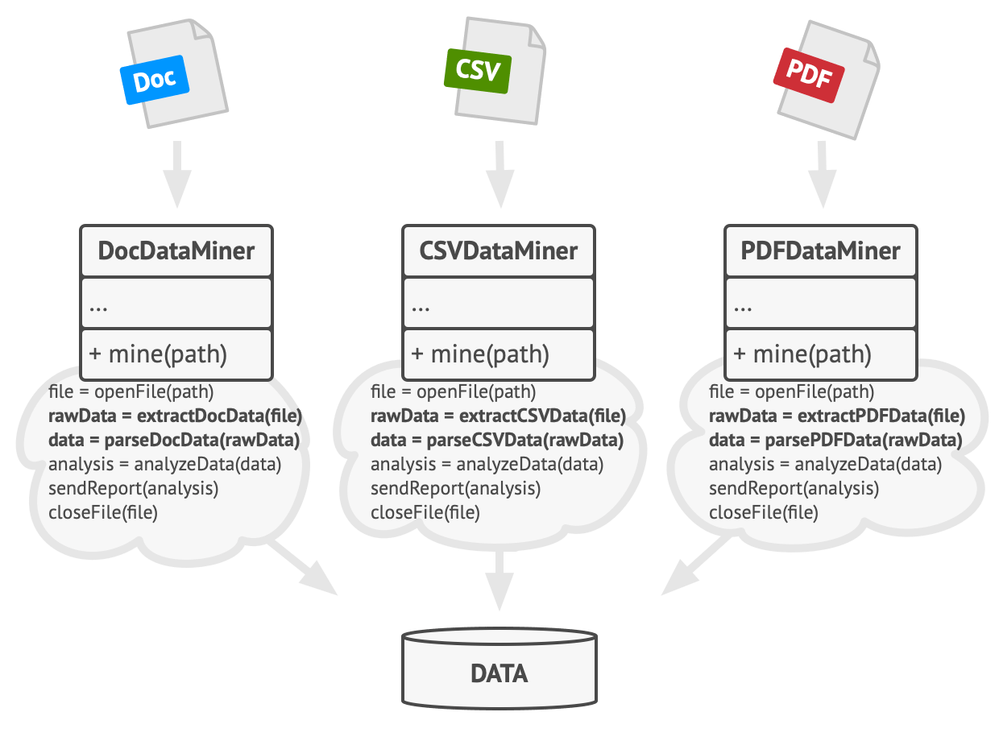
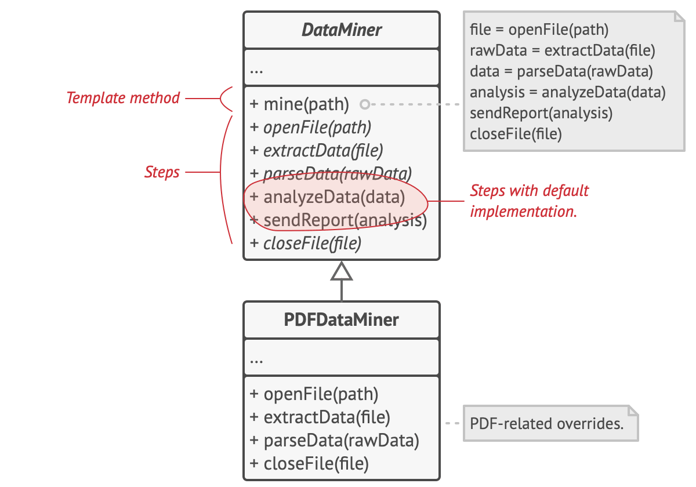
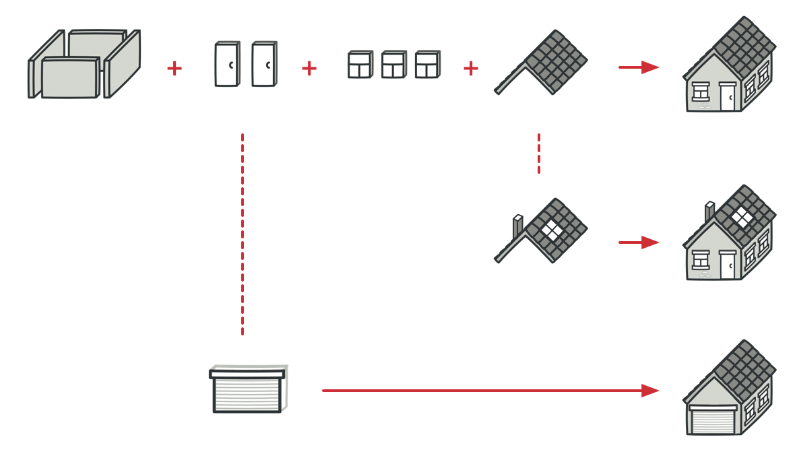
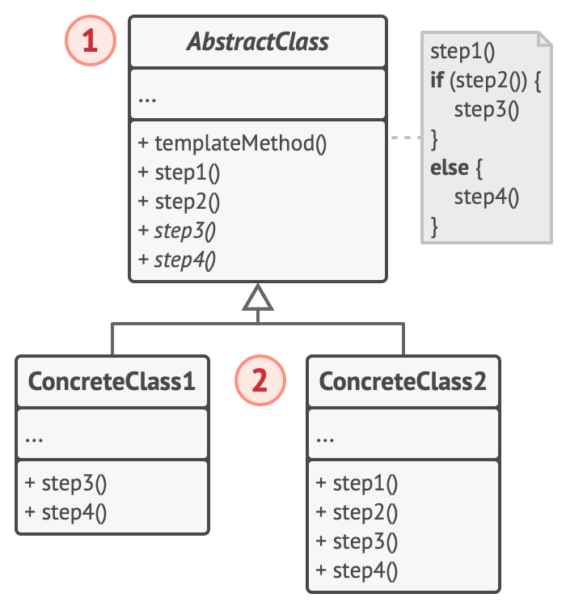
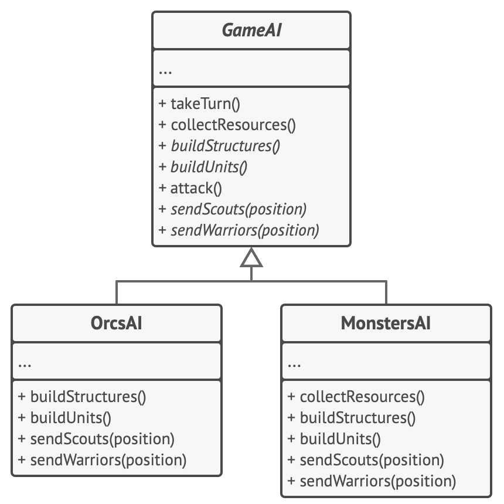

# Template Method


**Type:** Behavioral · **Also known as:** 

> **The 10-second version:** Write the algorithm's *order* once in a base class, leave labelled holes where the details differ, and let subclasses fill the holes but never move them.

<br clear="all">

## Quick card

| | |
|---|---|
| **Problem it solves** | Several classes run almost the same algorithm. The steps in the middle differ; the sequence, the error handling and the bookkeeping are identical — and copy-pasted into each class, where they slowly drift apart. |
| **Core move** | One non-overridable method in the base class holds the sequence of calls. Each varying step becomes a `protected abstract` (must implement) or `protected virtual` (may override) method. Subclasses supply steps; they never touch the sequence. |
| **You'll recognise it by** | A `sealed`/`final` public method whose entire body is calls to *other methods of the same class*, most of them `protected abstract` or empty. Plus subclasses that contain no orchestration at all — just step implementations. |
| **Rating** | Complexity ★☆☆ · Popularity ★★☆ |
| **Closest relatives** | Strategy (the same idea done with composition), Factory Method (a specialisation of this one — a single "which object" hole), Bridge (when the variation needs its own hierarchy), Builder's director (fixed construction sequence). |
| **In your stack** | C#: `BackgroundService.ExecuteAsync`, `Collection<T>.InsertItem`, `SafeHandle.ReleaseHandle`, `Dispose(bool)` — you already override framework holes daily. TS: Node's `Transform._transform`, React/Angular lifecycle hooks; in your own code a higher-order function is usually better than a base class. SQL: a `DapperQuery<T>` base that owns connection + timeout + logging and leaves `Sql`/`Map` abstract. RabbitMQ: **the strongest fit** — one base consumer owning deserialize → idempotency → ack/nack → retry → dead-letter, with `HandleAsync` as the only hole. |

### How to read this file

Technical first, plain English second. 🗣️ marks the plain-English version. Part 1 is Refactoring.Guru's material with their diagrams; Parts 2-7 are code, your stack, and the stuff that makes it stick.

---

# PART 1 — The pattern

## 1. Intent
**Template Method** is a behavioral design pattern that defines the skeleton of an algorithm in the superclass but lets subclasses override specific steps of the algorithm without changing its structure.


### 🗣️ In plain words

A parent class writes down the recipe: step 1, step 2, step 3, step 4, in that order, forever. Some of those steps it performs itself. Others are left blank, and any child class that wants to exist has to fill them in.

The child never gets to see or change the recipe. It cannot add a step, remove a step, or reorder them. It can only answer the questions the parent asked. That restriction is the entire value: the algorithm's *shape* becomes something the compiler protects, while the parts that genuinely differ stay pluggable.

## 2. Problem
Imagine that you’re creating a data mining application that analyzes corporate documents. Users feed the app documents in various formats (PDF, DOC, CSV), and it tries to extract meaningful data from these docs in a uniform format.

The first version of the app could work only with DOC files. In the following version, it was able to support CSV files. A month later, you “taught” it to extract data from PDF files.



*Data mining classes contained a lot of duplicate code.*

At some point, you noticed that all three classes have a lot of similar code. While the code for dealing with various data formats was entirely different in all classes, the code for data processing and analysis is almost identical. Wouldn’t it be great to get rid of the code duplication, leaving the algorithm structure intact?

There was another problem related to client code that used these classes. It had lots of conditionals that picked a proper course of action depending on the class of the processing object. If all three processing classes had a common interface or a base class, you’d be able to eliminate the conditionals in client code and use polymorphism when calling methods on a processing object.
### 🗣️ In plain words

You wrote one importer for dealer CSV feeds. It worked. Then a dealer group turned up with an XML feed, so you copied the file and changed the parsing. Then a partner API turned up, so you copied it again.

Each copy is roughly forty lines, and thirty-two of those lines are identical: timing, counters, validation, dedupe, writing to the database, publishing the "listings changed" event, logging the report.

```ts
// ❌ BEFORE — three classes, one algorithm, three chances to get it wrong
class CsvDealerFeedImporter {
  async import(dealerId: string) {
    const started = Date.now();
    const file = await this.sftp.download(`/feeds/${dealerId}.csv`);   // ← differs
    const rows = parseCsv(file);                                       // ← differs
    const listings = rows.map(toListing);
    const valid = listings.filter(l => l.priceInr > 0 && l.year >= 1990);
    await this.repo.upsertMany(dealerId, valid);
    await this.bus.publish("listings.changed", { dealerId, count: valid.length });
    this.log.info({ dealerId, ms: Date.now() - started, count: valid.length });
  }
}

class XmlDealerFeedImporter {
  async import(dealerId: string) {
    const started = Date.now();
    const xml = await this.http.get(`https://feeds.example/${dealerId}.xml`); // ← differs
    const rows = parseXml(xml);                                               // ← differs
    const listings = rows.map(toListing);
    const valid = listings.filter(l => l.priceInr > 0);   // ← someone dropped the year check
    await this.repo.upsertMany(dealerId, valid);
    // ← and forgot to publish the event entirely
    this.log.info({ dealerId, ms: Date.now() - started, count: valid.length });
  }
}
```

Two real bugs are already visible, and they are the *normal* outcome, not carelessness. Nobody diffs three files when they add a validation rule. Six months later "why didn't search update for XML dealers?" is a two-day investigation.

And there's the second half of the problem the site names: client code. Because the three classes share no base type, every caller grows a `switch (feedFormat)`.

## 3. Solution
The Template Method pattern suggests that you break down an algorithm into a series of steps, turn these steps into methods, and put a series of calls to these methods inside a single *template method.* The steps may either be `abstract`, or have some default implementation. To use the algorithm, the client is supposed to provide its own subclass, implement all abstract steps, and override some of the optional ones if needed (but not the template method itself).

Let’s see how this will play out in our data mining app. We can create a base class for all three parsing algorithms. This class defines a template method consisting of a series of calls to various document-processing steps.



*Template method breaks the algorithm into steps, allowing subclasses to override these steps but not the actual method.*

At first, we can declare all steps `abstract`, forcing the subclasses to provide their own implementations for these methods. In our case, subclasses already have all necessary implementations, so the only thing we might need to do is adjust signatures of the methods to match the methods of the superclass.

Now, let’s see what we can do to get rid of the duplicate code. It looks like the code for opening/closing files and extracting/parsing data is different for various data formats, so there’s no point in touching those methods. However, implementation of other steps, such as analyzing the raw data and composing reports, is very similar, so it can be pulled up into the base class, where subclasses can share that code.

As you can see, we’ve got two types of steps:

- *abstract steps* must be implemented by every subclass
- *optional steps* already have some default implementation, but still can be overridden if needed

There’s another type of step, called *hooks*. A hook is an optional step with an empty body. A template method would work even if a hook isn’t overridden. Usually, hooks are placed before and after crucial steps of algorithms, providing subclasses with additional extension points for an algorithm.
### 🗣️ In plain words

The pattern is three mechanical moves:

1. **Cut the algorithm into named steps.** Every distinct thing the method does gets its own method with a verb name: `fetch`, `parse`, `normalise`, `validate`, `persist`, `publish`. Nothing changes behaviourally yet — this is pure extract-method.
2. **Put the sequence in one method and lock it.** A single public method calls those steps in order, and nothing else. Mark it `sealed` (C#), `final` (Java), non-virtual (C++). Subclasses now physically cannot reorder the algorithm.
3. **Classify every step by who owns it.** Three buckets: *abstract* (base has no idea, subclass must supply — `fetch`, `parse`); *default* (base has a sensible version, subclass may replace — `normalise`); *hook* (base does nothing, subclass may bolt something on — `onBeforePersist`). Anything none of the subclasses should touch stays `private` and isn't a hole at all.
4. **Subclass per variation.** `CsvImporter`, `XmlImporter`, `PartnerApiImporter`. Each contains only step implementations — no orchestration, no timing, no logging, no event publishing.

> **The key insight:** The thing you are protecting is not the code in the steps — it's the **order and the completeness** of the sequence. Duplication of a parse routine is annoying; duplication of a sequence is dangerous, because a missing step in a copy looks exactly like a file that is simply shorter. Template Method makes the sequence a single fact with a single owner, and turns "did you remember to publish the event?" from a code-review question into a compile-time one.

## 4. Real-world analogy


*A typical architectural plan can be slightly altered to better fit the client’s needs.*

The template method approach can be used in mass housing construction. The architectural plan for building a standard house may contain several extension points that would let a potential owner adjust some details of the resulting house.

Each building step, such as laying the foundation, framing, building walls, installing plumbing and wiring for water and electricity, etc., can be slightly changed to make the resulting house a little bit different from others.
### Two more of my own

**The pre-flight checklist.** Every commercial flight runs the same checklist in the same order: doors, fuel, flaps, trim, brakes, clearance. The regulator owns the order and the crew cannot reshuffle it — not because pilots are careless, but because the order *is* the safety property. What varies is the content of each item: the flap setting depends on the aircraft type and the runway length, and the crew fills that in. A first officer who decides to do the fuel check after pushback isn't being creative, they're being dangerous. That is exactly what `sealed` on the template method means.

**The meal-kit box.** The recipe card is printed and fixed: preheat, brown the protein, add the aromatics, simmer for twelve minutes, finish with the sachet, rest for two. The box supplies most ingredients ready to go (default steps), one bag you must open and use (abstract step), and a little "optional: add chilli flakes" line (a hook). Every box in the range follows the same card; the chicken box and the paneer box differ only in what's in the bags. That's how a product line of ten dinners ships with one set of cooking instructions — and why a new dinner takes a day to add rather than a week.

## 5. Structure


1. The **Abstract Class** declares methods that act as steps of an algorithm, as well as the actual template method which calls these methods in a specific order. The steps may either be declared `abstract` or have some default implementation.
2. **Concrete Classes** can override all of the steps, but not the template method itself.
### Participants & roles — cheat table

| Role | What it is in code | Example from the site | Equivalent in your stack |
|---|---|---|---|
| **Abstract Class** | The base class that owns the algorithm. Holds the template method plus the step declarations. Usually `abstract`, usually has a protected constructor taking shared collaborators. | `GameAI` | `RabbitConsumer<TMessage>` in C#, `DealerFeedImporter` in TS, `BackgroundService` in .NET |
| **Template method** | One method whose body is *only* calls to step methods, in a fixed order. Non-virtual / `sealed` / `final`. | `turn()` — and `attack()`, since a class can have several | `RunAsync(...)`, `OnReceivedAsync(...)`, `Stream.CopyTo(...)` |
| **Abstract step** | `protected abstract` — the base has no default; every subclass must supply one. | `buildStructures()`, `buildUnits()`, `sendScouts(pos)` | `FetchAsync`, `Parse`, `HandleAsync(TMessage)`, `Transform._transform` |
| **Default (optional) step** | `protected virtual` with a real body — subclass overrides only if it needs to. | `collectResources()` | `Normalise(raw)`, `MaxAttempts => 5`, `Collection<T>.InsertItem` |
| **Hook** | `protected virtual` with an *empty* body, placed before/after crucial steps as an extension point. | (the site's conceptual C# example calls these `Hook1`, `Hook2`) | `OnBeforePersistAsync`, `ThreadPoolExecutor.beforeExecute`, `DbContext.OnConfiguring` |
| **Concrete Class** | Implements the abstract steps, may override defaults and hooks, must not touch the template method. Usually `sealed`. | `OrcsAI`, `MonstersAI` | `CsvDealerFeedImporter`, `PriceDropConsumer` |
| **Client** | Holds a reference of the *base* type and calls the template method. Knows nothing about which subclass it has. | the code that calls `ai.turn()` each tick | the job scheduler, the DI container, the message broker callback |

### Collaboration — who calls whom

```
   Client (scheduler / DI container / broker callback)
     |
     |  importer.run("dealer-4471")        <-- the ONLY call the client makes
     v
+--------------------------------------------------------+
|  DealerFeedImporter   (abstract base class)            |
|                                                        |
|  run()   <== TEMPLATE METHOD  (sealed / final)         |
|    |                                                   |
|    |-- 1. fetch(dealerId) .......... abstract ---------+---+
|    |-- 2. parse(payload) ........... abstract ---------+---+
|    |-- 3. normalise(raw) ........... default (may override) |
|    |-- 4. validate(batch) .......... default (may override) |
|    |-- 5. onBeforePersist(batch) ... hook, empty ------+---+
|    |-- 6. persist(batch) ........... private, no hole      |
|    `-- 7. publish(events) .......... private, no hole      |
+--------------------------------------------------------+   |
                                                              | virtual
                          +-----------------------------------+ dispatch
                          v                                   v
        +---------------------------+      +----------------------------+
        | CsvDealerFeedImporter     |      | PartnerApiFeedImporter     |
        |  fetch()  -> SFTP pull    |      |  fetch()  -> HTTPS + OAuth |
        |  parse()  -> CSV reader   |      |  parse()  -> JSON reader   |
        |  onBeforePersist() -> log |      |  normalise() -> override   |
        +---------------------------+      +----------------------------+
```

**The hop that matters is the downward one.** `run()` lives in the base class but the call `this.parse(payload)` lands in the *subclass* — control flows down the inheritance chain at runtime. This is the Hollywood Principle ("don't call us, we'll call you") in its purest form: the subclass never drives, it only answers. Every framework you have ever extended — ASP.NET Core, React class components, JUnit, Node streams — works this way, and this is the pattern underneath it.

## 6. Pseudocode (the website's example)
In this example, the **Template Method** pattern provides a “skeleton” for various branches of artificial intelligence in a simple strategy video game.



*AI classes of a simple video game.*

All races in the game have almost the same types of units and buildings. Therefore you can reuse the same AI structure for various races, while being able to override some of the details. With this approach, you can override the orcs’ AI to make it more aggressive, make humans more defense-oriented, and make monsters unable to build anything. Adding a new race to the game would require creating a new AI subclass and overriding the default methods declared in the base AI class.

```
// The abstract class defines a template method that contains a
// skeleton of some algorithm composed of calls, usually to
// abstract primitive operations. Concrete subclasses implement
// these operations, but leave the template method itself
// intact.
class GameAI is
    // The template method defines the skeleton of an algorithm.
    method turn() is
        collectResources()
        buildStructures()
        buildUnits()
        attack()

    // Some of the steps may be implemented right in a base
    // class.
    method collectResources() is
        foreach (s in this.builtStructures) do
            s.collect()

    // And some of them may be defined as abstract.
    abstract method buildStructures()
    abstract method buildUnits()

    // A class can have several template methods.
    method attack() is
        enemy = closestEnemy()
        if (enemy == null)
            sendScouts(map.center)
        else
            sendWarriors(enemy.position)

    abstract method sendScouts(position)
    abstract method sendWarriors(position)

// Concrete classes have to implement all abstract operations of
// the base class but they must not override the template method
// itself.
class OrcsAI extends GameAI is
    method buildStructures() is
        if (there are some resources) then
            // Build farms, then barracks, then stronghold.

    method buildUnits() is
        if (there are plenty of resources) then
            if (there are no scouts)
                // Build peon, add it to scouts group.
            else
                // Build grunt, add it to warriors group.

    // ...

    method sendScouts(position) is
        if (scouts.length > 0) then
            // Send scouts to position.

    method sendWarriors(position) is
        if (warriors.length > 5) then
            // Send warriors to position.

// Subclasses can also override some operations with a default
// implementation.
class MonstersAI extends GameAI is
    method collectResources() is
        // Monsters don't collect resources.

    method buildStructures() is
        // Monsters don't build structures.

    method buildUnits() is
        // Monsters don't build units.
```
### Reading that pseudocode

- **`method turn()` is the whole pattern in four lines.** Its body contains no logic at all — no conditionals, no loops, no state. Four calls in a fixed order. If you ever find yourself unsure whether something is a template method, ask: *could I delete the body and describe it in one sentence?* If yes, it is.
- **`collectResources()` has a body; `buildStructures()` does not.** That is the "default step vs abstract step" split made visible. Collecting resources is genuinely the same for every race, so it lives once in `GameAI`. Building structures is genuinely different, so the base class declines to guess.
- **`attack()` is a second template method, and that's deliberate.** The site's comment says so explicitly: *"A class can have several template methods."* `attack()` owns a small algorithm of its own (find enemy → scout or strike) and delegates to two further abstract steps. Template methods nest; a step of one can be the template of another.
- **`OrcsAI` contains zero orchestration.** Read it top to bottom: four method bodies, no sequence, no "first this then that" spanning steps. That is the smell test for a correct subclass. The moment a subclass starts calling its own sibling steps, the algorithm has leaked downward and you've lost the guarantee.
- **`MonstersAI` is the pattern's own warning label.** It overrides `collectResources()`, `buildStructures()` and `buildUnits()` with empty bodies — monsters don't build. It works, it's idiomatic, and it is *also* the Liskov violation the Pros-and-Cons section lists. A subclass that exists mainly to switch steps off is telling you the base class's algorithm is too broad for it.
- **Nothing in the base class knows a subclass exists.** No `if (race == ORCS)`, no protected `isMonster` flag. If you ever add one, you have rebuilt the conditional mess the pattern was introduced to remove.

## 7. Applicability — when to reach for it
**Use the Template Method pattern when you want to let clients extend only particular steps of an algorithm, but not the whole algorithm or its structure.**

The Template Method lets you turn a monolithic algorithm into a series of individual steps which can be easily extended by subclasses while keeping intact the structure defined in a superclass.

**Use the pattern when you have several classes that contain almost identical algorithms with some minor differences. As a result, you might need to modify all classes when the algorithm changes.**

When you turn such an algorithm into a template method, you can also pull up the steps with similar implementations into a superclass, eliminating code duplication. Code that varies between subclasses can remain in subclasses.
### Quick checklist

- [ ] Do I have (or will I imminently have) **two or more** classes whose methods read almost line-for-line the same, differing in the middle?
- [ ] Is the **order of steps** itself a correctness requirement — something a future copy-paste could silently break?
- [ ] Can I name the varying parts as **nouns/verbs in a fixed vocabulary** (`fetch`, `parse`, `handle`) rather than "whatever this one needs"?
- [ ] Do the variants need to be chosen **at compile time / wiring time**, not swapped mid-flight per request? (If they must swap at runtime → Strategy.)
- [ ] Am I building a **framework or an extension point** that other people — including future me — will plug into, and do I want to constrain what they can change?
- [ ] Is the number of holes **small and stable** (say ≤ 5)? A template with a dozen holes is a configuration language wearing a class as a hat.

Four or more ticks: build it. Two or fewer: you probably want a function with parameters, or Strategy.

## 8. How to implement — step by step
1. Analyze the target algorithm to see whether you can break it into steps. Consider which steps are common to all subclasses and which ones will always be unique.
2. Create the abstract base class and declare the template method and a set of abstract methods representing the algorithm’s steps. Outline the algorithm’s structure in the template method by executing corresponding steps. Consider making the template method `final` to prevent subclasses from overriding it.
3. It’s okay if all the steps end up being abstract. However, some steps might benefit from having a default implementation. Subclasses don’t have to implement those methods.
4. Think of adding hooks between the crucial steps of the algorithm.
5. For each variation of the algorithm, create a new concrete subclass. It *must* implement all of the abstract steps, but *may* also override some of the optional ones.
### The same steps, blunt version

1. **Write the algorithm out longhand for one case.** Don't design the base class first; write the concrete thing and make it work.
2. **Extract every distinct action into its own method**, in place, in the same class. Pure refactoring, no inheritance yet. The original method should shrink to a list of calls.
3. **Diff that list against the second variant.** The calls that match become base-class structure; the bodies that differ become holes.
4. **Create the abstract base.** Move the call-list method up as-is and mark it `sealed`/`final`/non-virtual. Move step bodies that are identical up too.
5. **Declare each remaining step.** No idea what it does → `protected abstract`. Sensible default exists → `protected virtual` with a body. Nothing to do but someone may want to inject something → `protected virtual` with an empty body (a hook), placed just before or after the risky steps.
6. **Make everything else `private`.** A method that isn't a deliberate hole must not be a hole. `protected` is a public API for your subclasses and you will be stuck with it.
7. **Subclass once per variation**, implement the abstract steps, override nothing else you don't have to.
8. **Delete the old classes** and point the callers at the base type. If any caller still needs a `switch`, you've missed a hole.

## 9. Pros and cons
- ✅ You can let clients override only certain parts of a large algorithm, making them less affected by changes that happen to other parts of the algorithm.
- ✅ You can pull the duplicate code into a superclass.

- ⛔ Some clients may be limited by the provided skeleton of an algorithm.
- ⛔ You might violate the *Liskov Substitution Principle* by suppressing a default step implementation via a subclass.
- ⛔ Template methods tend to be harder to maintain the more steps they have.
### Honest trade-offs from the trenches

**The real cost isn't inheritance, it's the reading path.** With a template method you cannot understand what `CsvImporter` does by reading `CsvImporter`. You have to read the base class to learn the order, then jump back down for each step, then check which defaults were overridden. With one level of inheritance that's a mild tax. With two (`SftpImporter : FileImporter : DealerFeedImporter`) it becomes genuinely hostile — you're now reconstructing a method that exists in no single file. My hard rule: **one level of inheritance, and the base class must fit on one screen.** If you want a second level, you wanted composition.

**The tell that it's worth it is that the *sequence* is the invariant.** If your answer to "what could go wrong if someone wrote this by hand?" is "they'd write it a bit differently" — don't bother, you're deduplicating for its own sake. If your answer is "they'd forget to ack the message" or "they'd publish the event before the transaction committed" or "they'd skip the idempotency check" — build the template. You're not saving keystrokes, you're making a class of bug unrepresentable. That's also why this pattern earns its keep most in *infrastructure* code (consumers, jobs, repositories) and least in *domain* code, where the "algorithm" is usually genuinely different each time.

**Modern C# hands you two-thirds of this for free, and you should take it.** `sealed override` lets you close a hole partway down a hierarchy. `protected abstract` on a property (`protected abstract string QueueName { get; }`) is a lovely way to demand configuration rather than behaviour. Primary constructors (C# 12) kill the ceremonial base-constructor boilerplate that used to make these classes ugly. And your DI container already injects into base-class constructors, so shared collaborators (`ILogger`, `IClock`, `IDbConnectionFactory`) belong there, not passed down through every subclass. Where the framework already owns the template — `BackgroundService.ExecuteAsync`, `AuthorizationHandler<T>.HandleRequirementAsync`, `Collection<T>.InsertItem`, `Dispose(bool)` — **do not build your own**; override the hole they gave you and move on.

**In TypeScript, reach for the higher-order function first.** `run({ fetch, parse })` beats `class X extends Base` for two or three variants: it's testable without subclasses, it composes, and it doesn't drag `this` binding and `protected` semantics along. TypeScript has no `final` on methods, so the *enforcement* half of the pattern — the half that's actually doing the work — doesn't exist there; you're relying on convention or a lint rule. Use a base class in TS when a framework demands it (`extends Transform`, Angular components, NestJS) or when the number of holes has grown past what a options object reads well as. Otherwise: functions.

## 10. Relations with other patterns
- [Factory Method](https://refactoring.guru/design-patterns/factory-method) is a specialization of [Template Method](https://refactoring.guru/design-patterns/template-method). At the same time, a *Factory Method* may serve as a step in a large *Template Method*.
- [Template Method](https://refactoring.guru/design-patterns/template-method) is based on inheritance: it lets you alter parts of an algorithm by extending those parts in subclasses. [Strategy](https://refactoring.guru/design-patterns/strategy) is based on composition: you can alter parts of the object’s behavior by supplying it with different strategies that correspond to that behavior. *Template Method* works at the class level, so it’s static. *Strategy* works on the object level, letting you switch behaviors at runtime.
### Disambiguation table

| Pattern | Class diagram | Who owns the algorithm's shape | How you vary behaviour | When to pick it over Template Method |
|---|---|---|---|---|
| **Strategy** | Context *has-a* Strategy interface; strategies are separate objects | The **context** owns the sequence; the strategy owns one pluggable step or the whole policy | Inject a different object — **at runtime**, per call, per request, from config | You must switch mid-flight, one algorithm needs several independently-varying parts, or you want to unit-test a step without instantiating the whole pipeline |
| **State** | Context *has-a* State interface; states *replace each other* | The **states** own the transitions; the context just forwards | The object swaps its own state object as a consequence of what happened | Behaviour depends on a lifecycle the object tracks (`Draft → Live → Sold`), and the object legitimately changes what it *is* over time |
| **Factory Method** | Creator declares an abstract `createProduct()`, concrete creators override it | The creator's other methods own the algorithm | Subclass decides **which object to instantiate** | You have exactly one hole and that hole is "which class do I `new`" |
| **Bridge** | Abstraction *has-a* Implementor; both hierarchies grow independently | Split across two hierarchies | Two dimensions vary independently (feed *format* × transport *channel*) | Subclass count starts multiplying: `CsvSftp`, `CsvHttp`, `XmlSftp`, `XmlHttp` |
| **Decorator** | Wrapper *has-a* component of the same interface | Each layer owns its own bit and delegates onward | Stack wrappers at runtime | You want to *add* behaviour around an algorithm you don't own, without subclassing it |

**Template Method vs Strategy — the one everybody gets asked.** The site's own line is the sharpest: *Template Method is based on inheritance and works at the class level (static); Strategy is based on composition and works at the object level (switchable at runtime).* Three practical consequences of that:

- **Direction of control.** In Template Method, the base class calls *down* into you. In Strategy, the context calls *out* to a collaborator it was handed. Template Method uses subclassing to fill the hole; Strategy uses a constructor parameter.
- **Granularity.** One Template Method subclass fills *all* the holes at once — you get `CsvImporter`, a bundle. With Strategy you can mix: this fetcher with that parser with the third validator. If two holes need to vary independently, Template Method forces a subclass per combination and you get the combinatorial explosion that sends you to Bridge.
- **Testability and lifetime.** A strategy is an object you can construct, fake, log, decorate, register in DI and swap per tenant. A template step is a method you can only reach by instantiating a subclass. That alone decides it more often than any theory does.

> ***Template Method: "you may only change the filling."*** ***Strategy: "you may change the whole dish, and you may change it between courses."***

**Template Method vs State** is less commonly confused but worth stating once, because Strategy and State *are* diagram-identical and Template Method is the odd one out. Both Strategy and State compose; Template Method inherits. Between Strategy and State: a strategy is **handed in from outside** and doesn't know or care about the context's other behaviour; a state is usually **created by the context or by a sibling state**, knows the context, and changes it — `state.handle(ctx)` frequently ends with `ctx.setState(new SoldState())`. Strategy objects are ignorant of each other by design; state objects form a graph. So: *same picture, three different intents — Template Method freezes an order, Strategy swaps a policy, State swaps the object's own identity over time.*

**Factory Method is Template Method's smallest possible case**, and the site says so: a specialisation of it. `createProduct()` is a single abstract step called from an otherwise-concrete algorithm. Conversely a Factory Method often *is* one step inside a bigger template — in the importer below, `parse()` could easily be `createParser().parse()`.

---

# PART 2 — Official code examples from Refactoring.Guru

## 2.1 C#
**Complexity:** ★☆☆ (1/3)

**Popularity:** ★★☆ (2/3)

**Usage examples:** The Template Method pattern is quite common in C# frameworks. Developers often use it to provide framework users with a simple means of extending standard functionality using inheritance.

**Identification:** Template Method can be recognized if you see a method in base class that calls a bunch of other methods that are either abstract or empty.
### Conceptual Example

This example illustrates the structure of the **Template Method** design pattern. It focuses on answering these questions:

- What classes does it consist of?
- What roles do these classes play?
- In what way the elements of the pattern are related?

##### **Program.cs:** Conceptual example

```csharp
using System;

namespace RefactoringGuru.DesignPatterns.TemplateMethod.Conceptual
{
    // The Abstract Class defines a template method that contains a skeleton of
    // some algorithm, composed of calls to (usually) abstract primitive
    // operations.
    //
    // Concrete subclasses should implement these operations, but leave the
    // template method itself intact.
    abstract class AbstractClass
    {
        // The template method defines the skeleton of an algorithm.
        public void TemplateMethod()
        {
            this.BaseOperation1();
            this.RequiredOperations1();
            this.BaseOperation2();
            this.Hook1();
            this.RequiredOperation2();
            this.BaseOperation3();
            this.Hook2();
        }

        // These operations already have implementations.
        protected void BaseOperation1()
        {
            Console.WriteLine("AbstractClass says: I am doing the bulk of the work");
        }

        protected void BaseOperation2()
        {
            Console.WriteLine("AbstractClass says: But I let subclasses override some operations");
        }

        protected void BaseOperation3()
        {
            Console.WriteLine("AbstractClass says: But I am doing the bulk of the work anyway");
        }

        // These operations have to be implemented in subclasses.
        protected abstract void RequiredOperations1();

        protected abstract void RequiredOperation2();

        // These are "hooks." Subclasses may override them, but it's not
        // mandatory since the hooks already have default (but empty)
        // implementation. Hooks provide additional extension points in some
        // crucial places of the algorithm.
        protected virtual void Hook1() { }

        protected virtual void Hook2() { }
    }

    // Concrete classes have to implement all abstract operations of the base
    // class. They can also override some operations with a default
    // implementation.
    class ConcreteClass1 : AbstractClass
    {
        protected override void RequiredOperations1()
        {
            Console.WriteLine("ConcreteClass1 says: Implemented Operation1");
        }

        protected override void RequiredOperation2()
        {
            Console.WriteLine("ConcreteClass1 says: Implemented Operation2");
        }
    }

    // Usually, concrete classes override only a fraction of base class'
    // operations.
    class ConcreteClass2 : AbstractClass
    {
        protected override void RequiredOperations1()
        {
            Console.WriteLine("ConcreteClass2 says: Implemented Operation1");
        }

        protected override void RequiredOperation2()
        {
            Console.WriteLine("ConcreteClass2 says: Implemented Operation2");
        }

        protected override void Hook1()
        {
            Console.WriteLine("ConcreteClass2 says: Overridden Hook1");
        }
    }

    class Client
    {
        // The client code calls the template method to execute the algorithm.
        // Client code does not have to know the concrete class of an object it
        // works with, as long as it works with objects through the interface of
        // their base class.
        public static void ClientCode(AbstractClass abstractClass)
        {
            // ...
            abstractClass.TemplateMethod();
            // ...
        }
    }

    class Program
    {
        static void Main(string[] args)
        {
            Console.WriteLine("Same client code can work with different subclasses:");

            Client.ClientCode(new ConcreteClass1());

            Console.Write("\n");

            Console.WriteLine("Same client code can work with different subclasses:");
            Client.ClientCode(new ConcreteClass2());
        }
    }
}
```

##### **Output.txt:** Execution result

```output
Same client code can work with different subclasses:
AbstractClass says: I am doing the bulk of the work
ConcreteClass1 says: Implemented Operation1
AbstractClass says: But I let subclasses override some operations
ConcreteClass1 says: Implemented Operation2
AbstractClass says: But I am doing the bulk of the work anyway

Same client code can work with different subclasses:
AbstractClass says: I am doing the bulk of the work
ConcreteClass2 says: Implemented Operation1
AbstractClass says: But I let subclasses override some operations
ConcreteClass2 says: Overridden Hook1
ConcreteClass2 says: Implemented Operation2
AbstractClass says: But I am doing the bulk of the work anyway
```

## 2.2 TypeScript
**Complexity:** ★☆☆ (1/3)

**Popularity:** ★★☆ (2/3)

**Usage examples:** The Template Method pattern is quite common in TypeScript frameworks. Developers often use it to provide framework users with a simple means of extending standard functionality using inheritance.

**Identification:** Template Method can be recognized if you see a method in base class that calls a bunch of other methods that are either abstract or empty.
### Conceptual Example

This example illustrates the structure of the **Template Method** design pattern and focuses on the following questions:

- What classes does it consist of?
- What roles do these classes play?
- In what way the elements of the pattern are related?

##### **index.ts:** Conceptual example

```typescript
/**
 * The Abstract Class defines a template method that contains a skeleton of some
 * algorithm, composed of calls to (usually) abstract primitive operations.
 *
 * Concrete subclasses should implement these operations, but leave the template
 * method itself intact.
 */
abstract class AbstractClass {
    /**
     * The template method defines the skeleton of an algorithm.
     */
    public templateMethod(): void {
        this.baseOperation1();
        this.requiredOperations1();
        this.baseOperation2();
        this.hook1();
        this.requiredOperation2();
        this.baseOperation3();
        this.hook2();
    }

    /**
     * These operations already have implementations.
     */
    protected baseOperation1(): void {
        console.log('AbstractClass says: I am doing the bulk of the work');
    }

    protected baseOperation2(): void {
        console.log('AbstractClass says: But I let subclasses override some operations');
    }

    protected baseOperation3(): void {
        console.log('AbstractClass says: But I am doing the bulk of the work anyway');
    }

    /**
     * These operations have to be implemented in subclasses.
     */
    protected abstract requiredOperations1(): void;

    protected abstract requiredOperation2(): void;

    /**
     * These are "hooks." Subclasses may override them, but it's not mandatory
     * since the hooks already have default (but empty) implementation. Hooks
     * provide additional extension points in some crucial places of the
     * algorithm.
     */
    protected hook1(): void { }

    protected hook2(): void { }
}

/**
 * Concrete classes have to implement all abstract operations of the base class.
 * They can also override some operations with a default implementation.
 */
class ConcreteClass1 extends AbstractClass {
    protected requiredOperations1(): void {
        console.log('ConcreteClass1 says: Implemented Operation1');
    }

    protected requiredOperation2(): void {
        console.log('ConcreteClass1 says: Implemented Operation2');
    }
}

/**
 * Usually, concrete classes override only a fraction of base class' operations.
 */
class ConcreteClass2 extends AbstractClass {
    protected requiredOperations1(): void {
        console.log('ConcreteClass2 says: Implemented Operation1');
    }

    protected requiredOperation2(): void {
        console.log('ConcreteClass2 says: Implemented Operation2');
    }

    protected hook1(): void {
        console.log('ConcreteClass2 says: Overridden Hook1');
    }
}

/**
 * The client code calls the template method to execute the algorithm. Client
 * code does not have to know the concrete class of an object it works with, as
 * long as it works with objects through the interface of their base class.
 */
function clientCode(abstractClass: AbstractClass) {
    // ...
    abstractClass.templateMethod();
    // ...
}

console.log('Same client code can work with different subclasses:');
clientCode(new ConcreteClass1());
console.log('');

console.log('Same client code can work with different subclasses:');
clientCode(new ConcreteClass2());
```

##### **Output.txt:** Execution result

```output
Same client code can work with different subclasses:
AbstractClass says: I am doing the bulk of the work
ConcreteClass1 says: Implemented Operation1
AbstractClass says: But I let subclasses override some operations
ConcreteClass1 says: Implemented Operation2
AbstractClass says: But I am doing the bulk of the work anyway

Same client code can work with different subclasses:
AbstractClass says: I am doing the bulk of the work
ConcreteClass2 says: Implemented Operation1
AbstractClass says: But I let subclasses override some operations
ConcreteClass2 says: Overridden Hook1
ConcreteClass2 says: Implemented Operation2
AbstractClass says: But I am doing the bulk of the work anyway
```

## 2.3 C++
**Complexity:** ★☆☆ (1/3)

**Popularity:** ★★☆ (2/3)

**Usage examples:** The Template Method pattern is quite common in C++ frameworks. Developers often use it to provide framework users with a simple means of extending standard functionality using inheritance.

**Identification:** Template Method can be recognized if you see a method in base class that calls a bunch of other methods that are either abstract or empty.
### Conceptual Example

This example illustrates the structure of the **Template Method** design pattern. It focuses on answering these questions:

- What classes does it consist of?
- What roles do these classes play?
- In what way the elements of the pattern are related?

##### **main.cc:** Conceptual example

```cpp
/**
 * The Abstract Class defines a template method that contains a skeleton of some
 * algorithm, composed of calls to (usually) abstract primitive operations.
 *
 * Concrete subclasses should implement these operations, but leave the template
 * method itself intact.
 */
class AbstractClass {
  /**
   * The template method defines the skeleton of an algorithm.
   */
 public:
  void TemplateMethod() const {
    this->BaseOperation1();
    this->RequiredOperations1();
    this->BaseOperation2();
    this->Hook1();
    this->RequiredOperation2();
    this->BaseOperation3();
    this->Hook2();
  }
  /**
   * These operations already have implementations.
   */
 protected:
  void BaseOperation1() const {
    std::cout << "AbstractClass says: I am doing the bulk of the work\n";
  }
  void BaseOperation2() const {
    std::cout << "AbstractClass says: But I let subclasses override some operations\n";
  }
  void BaseOperation3() const {
    std::cout << "AbstractClass says: But I am doing the bulk of the work anyway\n";
  }
  /**
   * These operations have to be implemented in subclasses.
   */
  virtual void RequiredOperations1() const = 0;
  virtual void RequiredOperation2() const = 0;
  /**
   * These are "hooks." Subclasses may override them, but it's not mandatory
   * since the hooks already have default (but empty) implementation. Hooks
   * provide additional extension points in some crucial places of the
   * algorithm.
   */
  virtual void Hook1() const {}
  virtual void Hook2() const {}
};
/**
 * Concrete classes have to implement all abstract operations of the base class.
 * They can also override some operations with a default implementation.
 */
class ConcreteClass1 : public AbstractClass {
 protected:
  void RequiredOperations1() const override {
    std::cout << "ConcreteClass1 says: Implemented Operation1\n";
  }
  void RequiredOperation2() const override {
    std::cout << "ConcreteClass1 says: Implemented Operation2\n";
  }
};
/**
 * Usually, concrete classes override only a fraction of base class' operations.
 */
class ConcreteClass2 : public AbstractClass {
 protected:
  void RequiredOperations1() const override {
    std::cout << "ConcreteClass2 says: Implemented Operation1\n";
  }
  void RequiredOperation2() const override {
    std::cout << "ConcreteClass2 says: Implemented Operation2\n";
  }
  void Hook1() const override {
    std::cout << "ConcreteClass2 says: Overridden Hook1\n";
  }
};
/**
 * The client code calls the template method to execute the algorithm. Client
 * code does not have to know the concrete class of an object it works with, as
 * long as it works with objects through the interface of their base class.
 */
void ClientCode(AbstractClass *class_) {
  // ...
  class_->TemplateMethod();
  // ...
}

int main() {
  std::cout << "Same client code can work with different subclasses:\n";
  ConcreteClass1 *concreteClass1 = new ConcreteClass1;
  ClientCode(concreteClass1);
  std::cout << "\n";
  std::cout << "Same client code can work with different subclasses:\n";
  ConcreteClass2 *concreteClass2 = new ConcreteClass2;
  ClientCode(concreteClass2);
  delete concreteClass1;
  delete concreteClass2;
  return 0;
}
```

##### **Output.txt:** Execution result

```output
Same client code can work with different subclasses:
AbstractClass says: I am doing the bulk of the work
ConcreteClass1 says: Implemented Operation1
AbstractClass says: But I let subclasses override some operations
ConcreteClass1 says: Implemented Operation2
AbstractClass says: But I am doing the bulk of the work anyway

Same client code can work with different subclasses:
AbstractClass says: I am doing the bulk of the work
ConcreteClass2 says: Implemented Operation1
AbstractClass says: But I let subclasses override some operations
ConcreteClass2 says: Overridden Hook1
ConcreteClass2 says: Implemented Operation2
AbstractClass says: But I am doing the bulk of the work anyway
```

## 2.4 Java
**Complexity:** ★☆☆ (1/3)

**Popularity:** ★★☆ (2/3)

**Usage examples:** The Template Method pattern is quite common in Java frameworks. Developers often use it to provide framework users with a simple means of extending standard functionality using inheritance.

**Identification:** Template Method can be recognized if you see a method in base class that calls a bunch of other methods that are either abstract or empty.
### Overriding standard steps of an algorithm

In this example, the Template Method pattern defines an algorithm of working with a social network. Subclasses that match a particular social network, implement these steps according to the API provided by the social network.

#### **networks**

##### **networks/Network.java:** Base social network class

```java
package refactoring_guru.template_method.example.networks;

/**
 * Base class of social network.
 */
public abstract class Network {
    String userName;
    String password;

    Network() {}

    /**
     * Publish the data to whatever network.
     */
    public boolean post(String message) {
        // Authenticate before posting. Every network uses a different
        // authentication method.
        if (logIn(this.userName, this.password)) {
            // Send the post data.
            boolean result =  sendData(message.getBytes());
            logOut();
            return result;
        }
        return false;
    }

    abstract boolean logIn(String userName, String password);
    abstract boolean sendData(byte[] data);
    abstract void logOut();
}
```

##### **networks/Facebook.java:** Concrete social network

```java
package refactoring_guru.template_method.example.networks;

/**
 * Class of social network
 */
public class Facebook extends Network {
    public Facebook(String userName, String password) {
        this.userName = userName;
        this.password = password;
    }

    public boolean logIn(String userName, String password) {
        System.out.println("\nChecking user's parameters");
        System.out.println("Name: " + this.userName);
        System.out.print("Password: ");
        for (int i = 0; i < this.password.length(); i++) {
            System.out.print("*");
        }
        simulateNetworkLatency();
        System.out.println("\n\nLogIn success on Facebook");
        return true;
    }

    public boolean sendData(byte[] data) {
        boolean messagePosted = true;
        if (messagePosted) {
            System.out.println("Message: '" + new String(data) + "' was posted on Facebook");
            return true;
        } else {
            return false;
        }
    }

    public void logOut() {
        System.out.println("User: '" + userName + "' was logged out from Facebook");
    }

    private void simulateNetworkLatency() {
        try {
            int i = 0;
            System.out.println();
            while (i < 10) {
                System.out.print(".");
                Thread.sleep(500);
                i++;
            }
        } catch (InterruptedException ex) {
            ex.printStackTrace();
        }
    }
}
```

##### **networks/Twitter.java:** One more social network

```java
package refactoring_guru.template_method.example.networks;

/**
 * Class of social network
 */
public class Twitter extends Network {

    public Twitter(String userName, String password) {
        this.userName = userName;
        this.password = password;
    }

    public boolean logIn(String userName, String password) {
        System.out.println("\nChecking user's parameters");
        System.out.println("Name: " + this.userName);
        System.out.print("Password: ");
        for (int i = 0; i < this.password.length(); i++) {
            System.out.print("*");
        }
        simulateNetworkLatency();
        System.out.println("\n\nLogIn success on Twitter");
        return true;
    }

    public boolean sendData(byte[] data) {
        boolean messagePosted = true;
        if (messagePosted) {
            System.out.println("Message: '" + new String(data) + "' was posted on Twitter");
            return true;
        } else {
            return false;
        }
    }

    public void logOut() {
        System.out.println("User: '" + userName + "' was logged out from Twitter");
    }

    private void simulateNetworkLatency() {
        try {
            int i = 0;
            System.out.println();
            while (i < 10) {
                System.out.print(".");
                Thread.sleep(500);
                i++;
            }
        } catch (InterruptedException ex) {
            ex.printStackTrace();
        }
    }
}
```

##### **Demo.java:** Client code

```java
package refactoring_guru.template_method.example;

import refactoring_guru.template_method.example.networks.Facebook;
import refactoring_guru.template_method.example.networks.Network;
import refactoring_guru.template_method.example.networks.Twitter;

import java.io.BufferedReader;
import java.io.IOException;
import java.io.InputStreamReader;

/**
 * Demo class. Everything comes together here.
 */
public class Demo {
    public static void main(String[] args) throws IOException {
        BufferedReader reader = new BufferedReader(new InputStreamReader(System.in));
        Network network = null;
        System.out.print("Input user name: ");
        String userName = reader.readLine();
        System.out.print("Input password: ");
        String password = reader.readLine();

        // Enter the message.
        System.out.print("Input message: ");
        String message = reader.readLine();

        System.out.println("\nChoose social network for posting message.\n" +
                "1 - Facebook\n" +
                "2 - Twitter");
        int choice = Integer.parseInt(reader.readLine());

        // Create proper network object and send the message.
        if (choice == 1) {
            network = new Facebook(userName, password);
        } else if (choice == 2) {
            network = new Twitter(userName, password);
        }
        network.post(message);
    }
}
```

##### **OutputDemo.txt:** Execution result

```output
Input user name: Jhonatan
Input password: qswe
Input message: Hello, World!

Choose social network for posting message.
1 - Facebook
2 - Twitter
2

Checking user's parameters
Name: Jhonatan
Password: ****
..........

LogIn success on Twitter
Message: 'Hello, World!' was posted on Twitter
User: 'Jhonatan' was logged out from Twitter
```

---

# PART 3 — Learn it by building it

The running example for all four languages: **importing car listings from dealer feeds**. Every dealer group sends inventory in a different shape (CSV over SFTP, XML, a partner JSON API), but what we *do* with the listings once we have them is identical — and getting that part wrong is what breaks search.

## 3.1 The dumbest possible version — TypeScript

### BEFORE (bad)

```ts
// ─────────────────────────────────────────────────────────────
//  Two importers. Spot the four differences. (There are four.)
// ─────────────────────────────────────────────────────────────
class CsvDealerFeedImporter {
  constructor(private sftp: Sftp, private repo: ListingRepo,
              private bus: Bus, private log: Logger) {}

  async import(dealerId: string): Promise<void> {
    const started = Date.now();
    const file = await this.sftp.download(`/feeds/${dealerId}.csv`);
    const rows = parseCsv(file);
    const listings = rows.map(r => ({
      externalId: r.id, priceInr: Number(r.price), year: Number(r.year),
      kmDriven: Number(r.km), city: r.city.trim(),
    }));
    const valid = listings.filter(l => l.priceInr > 0 && l.year >= 1990);
    await this.repo.upsertMany(dealerId, valid);
    await this.bus.publish("listings.changed", { dealerId, count: valid.length });
    this.log.info(`csv ${dealerId}: ${valid.length}/${listings.length} in ${Date.now() - started}ms`);
  }
}

class PartnerApiFeedImporter {
  constructor(private http: Http, private repo: ListingRepo,
              private bus: Bus, private log: Logger) {}

  async import(dealerId: string): Promise<void> {
    const started = Date.now();
    const body = await this.http.getJson(`https://partner.example/v2/stock/${dealerId}`);
    const listings = body.items.map((i: any) => ({
      externalId: i.sku, priceInr: i.price_inr, year: i.reg_year,
      kmDriven: i.odometer, city: i.location,
    }));
    const valid = listings.filter(l => l.priceInr > 0);        // ← lost the year rule
    await this.repo.upsertMany(dealerId, valid);
    // ← never publishes; search silently goes stale for every partner dealer
    this.log.info(`api ${dealerId}: ${valid.length} rows`);    // ← no timing, no ratio
  }
}
```

Nothing here is *badly written*. It's the third copy that kills you, and there is always a third copy.

### AFTER — the base class owns the recipe

```ts
// ══════════════════════════════════════════════════════════════
//  DOMAIN TYPES
// ══════════════════════════════════════════════════════════════
export interface RawListing {
  readonly externalId: string;
  readonly makeModel: string;
  readonly year: number;
  readonly priceInr: number;
  readonly kmDriven: number;
  readonly city: string;
  readonly photoUrls: readonly string[];
}

export interface NormalisedListing extends RawListing {
  readonly slug: string;
  readonly priceBand: "under-5L" | "5L-10L" | "10L-20L" | "above-20L";
}

export interface ImportReport {
  readonly dealerId: string;
  readonly fetched: number;
  readonly accepted: number;
  readonly rejected: readonly { externalId: string; reason: string }[];
  readonly durationMs: number;
}

export interface ImporterDeps {
  readonly repo: { upsertMany(dealerId: string, l: readonly NormalisedListing[]): Promise<number> };
  readonly bus: { publish(topic: string, payload: unknown): Promise<void> };
  readonly log: { info(o: object): void; warn(o: object): void };
  readonly clock: () => number;
}

// ══════════════════════════════════════════════════════════════
//  THE ABSTRACT CLASS — owns the algorithm, not the details
// ══════════════════════════════════════════════════════════════
export abstract class DealerFeedImporter {
  protected constructor(protected readonly deps: ImporterDeps) {}

  // ┌──────────────────────────────────────────────────────────┐
  // │  THE TEMPLATE METHOD.                                    │
  // │  Body is nothing but an ordered list of step calls.      │
  // │  TypeScript has no `final`; the naming + the lint rule   │
  // │  are the enforcement (see "What to notice").             │
  // └──────────────────────────────────────────────────────────┘
  async run(dealerId: string): Promise<ImportReport> {
    const started = this.deps.clock();

    const payload = await this.fetch(dealerId);              // ◀── abstract
    const raw = this.parse(payload);                         // ◀── abstract
    const normalised = raw.map(r => this.normalise(r));      // ◀── default, may override
    const { accepted, rejected } = this.partition(normalised); // ◀── default, may override

    await this.onBeforePersist(dealerId, accepted);          // ◀── HOOK (empty by default)
    const written = await this.persist(dealerId, accepted);  //     private — not a hole
    await this.publish(dealerId, written);                   //     private — not a hole

    const report: ImportReport = {
      dealerId,
      fetched: raw.length,
      accepted: accepted.length,
      rejected,
      durationMs: this.deps.clock() - started,
    };
    this.deps.log.info({ importer: this.constructor.name, ...report, rejected: rejected.length });
    return report;
  }

  // ── ABSTRACT STEPS: every subclass must answer these ───────
  protected abstract fetch(dealerId: string): Promise<string>;
  protected abstract parse(payload: string): readonly RawListing[];

  // ── DEFAULT STEPS: base has an opinion, subclass may differ ─
  protected normalise(raw: RawListing): NormalisedListing {
    return {
      ...raw,
      city: raw.city.trim(),
      slug: `${raw.makeModel}-${raw.year}-${raw.externalId}`
        .toLowerCase().replace(/[^a-z0-9]+/g, "-").replace(/(^-|-$)/g, ""),
      priceBand:
        raw.priceInr < 500_000 ? "under-5L" :
        raw.priceInr < 1_000_000 ? "5L-10L" :
        raw.priceInr < 2_000_000 ? "10L-20L" : "above-20L",
    };
  }

  protected partition(listings: readonly NormalisedListing[]): {
    accepted: NormalisedListing[];
    rejected: { externalId: string; reason: string }[];
  } {
    const accepted: NormalisedListing[] = [];
    const rejected: { externalId: string; reason: string }[] = [];
    for (const l of listings) {
      const reason = this.rejectReason(l);          // ◀── another hole, deliberately tiny
      if (reason) rejected.push({ externalId: l.externalId, reason });
      else accepted.push(l);
    }
    return { accepted, rejected };
  }

  protected rejectReason(l: NormalisedListing): string | null {
    if (l.priceInr <= 0) return "price-missing";
    if (l.year < 1990 || l.year > new Date().getFullYear() + 1) return "year-implausible";
    if (l.photoUrls.length === 0) return "no-photos";
    return null;
  }

  // ── HOOK: does nothing, exists purely as an extension point ─
  protected async onBeforePersist(
    _dealerId: string,
    _accepted: readonly NormalisedListing[],
  ): Promise<void> {
    /* intentionally empty */
  }

  // ── PRIVATE: shared, and NOT open for negotiation ──────────
  private async persist(dealerId: string, batch: readonly NormalisedListing[]): Promise<number> {
    if (batch.length === 0) return 0;
    return this.deps.repo.upsertMany(dealerId, batch);
  }

  private async publish(dealerId: string, written: number): Promise<void> {
    if (written === 0) return;
    await this.deps.bus.publish("listings.changed", { dealerId, count: written });
  }
}

// ══════════════════════════════════════════════════════════════
//  CONCRETE CLASSES — step bodies only, zero orchestration
// ══════════════════════════════════════════════════════════════
export class CsvDealerFeedImporter extends DealerFeedImporter {
  constructor(deps: ImporterDeps, private readonly sftp: { download(p: string): Promise<string> }) {
    super(deps);
  }

  protected async fetch(dealerId: string): Promise<string> {
    return this.sftp.download(`/feeds/${dealerId}.csv`);
  }

  protected parse(payload: string): readonly RawListing[] {
    const [header, ...lines] = payload.trim().split("\n");
    const cols = header.split(",").map(c => c.trim());
    const idx = (name: string) => cols.indexOf(name);
    return lines.map(line => {
      const c = line.split(",");
      return {
        externalId: c[idx("id")],
        makeModel: c[idx("make_model")],
        year: Number(c[idx("year")]),
        priceInr: Number(c[idx("price")]),
        kmDriven: Number(c[idx("km")]),
        city: c[idx("city")],
        photoUrls: (c[idx("photos")] ?? "").split("|").filter(Boolean),
      };
    });
  }

  // Overrides the hook: this dealer group sends stale rows, so we log a warning.
  protected override async onBeforePersist(dealerId: string, accepted: readonly NormalisedListing[]) {
    if (accepted.length < 10) this.deps.log.warn({ dealerId, msg: "suspiciously small CSV batch" });
  }
}

export class PartnerApiFeedImporter extends DealerFeedImporter {
  constructor(deps: ImporterDeps, private readonly http: { getText(url: string): Promise<string> }) {
    super(deps);
  }

  protected async fetch(dealerId: string): Promise<string> {
    return this.http.getText(`https://partner.example/v2/stock/${dealerId}`);
  }

  protected parse(payload: string): readonly RawListing[] {
    const body = JSON.parse(payload) as { items: readonly Record<string, unknown>[] };
    return body.items.map(i => ({
      externalId: String(i.sku),
      makeModel: `${i.make} ${i.model}`,
      year: Number(i.reg_year),
      priceInr: Number(i.price_inr),
      kmDriven: Number(i.odometer),
      city: String(i.location),
      photoUrls: (i.images as string[] | undefined) ?? [],
    }));
  }

  // This partner sends prices in thousands. One overridden step; nothing else changes.
  protected override normalise(raw: RawListing): NormalisedListing {
    return super.normalise({ ...raw, priceInr: raw.priceInr * 1000 });
  }
}

// ══════════════════════════════════════════════════════════════
//  CLIENT — knows only the base type
// ══════════════════════════════════════════════════════════════
export async function runNightlyImport(importers: readonly DealerFeedImporter[], dealerIds: readonly string[]) {
  const reports: ImportReport[] = [];
  for (const importer of importers) {
    for (const dealerId of dealerIds) {
      reports.push(await importer.run(dealerId));   // ◀── one call site, no switch
    }
  }
  return reports;
}
```

**What to notice:**

- **`run()` contains no business logic.** Read its body: eight lines, all of them either a step call or report assembly. If you ever add an `if` to a template method, you've probably found a new hook.
- **`persist` and `publish` are `private`, not `protected`.** That is a design decision, not an oversight. Making them `protected` would be inviting a subclass to "just skip the event this once" — which is exactly the bug the `PartnerApiFeedImporter` had in the BEFORE version. **`private` steps are how you make a guarantee.**
- **Three kinds of hole, visibly different.** `fetch`/`parse` are `abstract` (the compiler nags). `normalise`/`rejectReason` have bodies (opt-in override). `onBeforePersist` is empty (pure extension point). A reader can tell which is which without reading any subclass.
- **`PartnerApiFeedImporter.normalise` calls `super.normalise(...)`.** That's the healthy override shape: adjust the input, delegate to the base, don't reimplement. The unhealthy shape is an override that *replaces* base behaviour with `{}` — see the MonstersAI note in Part 1.
- **TypeScript can't stop a subclass overriding `run()`.** There is no `final`. In practice: name the template method distinctly, add an ESLint rule or a code-review habit, and put a comment on it. If enforcement genuinely matters, invert to composition (`createImporter({ fetch, parse })`) where there is nothing to override.
- **The client loop has no `switch`.** That's the *second* problem from the site's Problem section, quietly solved by the shared base type — you get it for free once you have one.

## 3.2 Same thing in C#

```csharp
using System.Diagnostics;
using System.Text;
using System.Text.Json;
using Microsoft.Extensions.Logging;

namespace Marketplace.Ingestion;

// ─── Domain types: records, because they're values ───────────────────────────
public sealed record RawListing(
    string ExternalId,
    string MakeModel,
    int Year,
    decimal PriceInr,
    int KmDriven,
    string City,
    IReadOnlyList<string> PhotoUrls);

public sealed record NormalisedListing(
    string ExternalId,
    string MakeModel,
    int Year,
    decimal PriceInr,
    int KmDriven,
    string City,
    IReadOnlyList<string> PhotoUrls,
    string Slug,
    PriceBand Band);

public enum PriceBand { Under5L, From5To10L, From10To20L, Above20L }

public sealed record Rejection(string ExternalId, string Reason);

public sealed record ImportReport(
    string DealerId,
    int Fetched,
    int Accepted,
    IReadOnlyList<Rejection> Rejected,
    TimeSpan Duration);

public interface IListingRepository
{
    Task<int> UpsertManyAsync(string dealerId, IReadOnlyList<NormalisedListing> listings, CancellationToken ct);
}

public interface IEventPublisher
{
    Task PublishAsync(string topic, object payload, CancellationToken ct);
}

// ════════════════════════════════════════════════════════════════════════════
//  ABSTRACT CLASS — primary constructor (C# 12) takes the shared collaborators
// ════════════════════════════════════════════════════════════════════════════
public abstract class DealerFeedImporter(
    IListingRepository repository,
    IEventPublisher publisher,
    ILogger logger,
    TimeProvider time)
{
    protected ILogger Logger { get; } = logger;

    // ╔══════════════════════════════════════════════════════════════════════╗
    // ║  THE TEMPLATE METHOD.                                                ║
    // ║  Not virtual → subclasses cannot override it, cannot reorder it,     ║
    // ║  cannot skip the publish. That is the whole point.                   ║
    // ╚══════════════════════════════════════════════════════════════════════╝
    public async Task<ImportReport> RunAsync(string dealerId, CancellationToken ct)
    {
        var started = Stopwatch.GetTimestamp();

        var payload   = await FetchAsync(dealerId, ct);                      // ◀── abstract
        var raw       = Parse(payload);                                      // ◀── abstract
        var normalised = raw.Select(Normalise).ToArray();                    // ◀── virtual
        var (accepted, rejected) = Partition(normalised);                    // ◀── virtual

        await OnBeforePersistAsync(dealerId, accepted, ct);                  // ◀── HOOK
        var written = await PersistAsync(dealerId, accepted, ct);            //     private
        await PublishAsync(dealerId, written, ct);                           //     private

        var report = new ImportReport(dealerId, raw.Count, accepted.Count, rejected,
                                      Stopwatch.GetElapsedTime(started));
        Logger.LogInformation(
            "{Importer} dealer={DealerId} fetched={Fetched} accepted={Accepted} rejected={Rejected} in {Ms}ms",
            GetType().Name, dealerId, report.Fetched, report.Accepted, rejected.Count,
            report.Duration.TotalMilliseconds);
        return report;
    }

    // ── Abstract steps ──────────────────────────────────────────────────────
    protected abstract Task<ReadOnlyMemory<byte>> FetchAsync(string dealerId, CancellationToken ct);
    protected abstract IReadOnlyList<RawListing> Parse(ReadOnlyMemory<byte> payload);

    // ── Default steps ───────────────────────────────────────────────────────
    protected virtual NormalisedListing Normalise(RawListing raw) => new(
        raw.ExternalId,
        raw.MakeModel.Trim(),
        raw.Year,
        raw.PriceInr,
        raw.KmDriven,
        raw.City.Trim(),
        raw.PhotoUrls,
        Slugify($"{raw.MakeModel}-{raw.Year}-{raw.ExternalId}"),
        raw.PriceInr switch
        {
            < 500_000m   => PriceBand.Under5L,
            < 1_000_000m => PriceBand.From5To10L,
            < 2_000_000m => PriceBand.From10To20L,
            _            => PriceBand.Above20L,
        });

    protected virtual string? RejectReason(NormalisedListing l) => l switch
    {
        { PriceInr: <= 0 }            => "price-missing",
        { Year: < 1990 }              => "year-implausible",
        { PhotoUrls.Count: 0 }        => "no-photos",
        { KmDriven: < 0 or > 900_000 } => "odometer-implausible",
        _                             => null,
    };

    // ── Hook: empty on purpose ──────────────────────────────────────────────
    protected virtual Task OnBeforePersistAsync(
        string dealerId, IReadOnlyList<NormalisedListing> accepted, CancellationToken ct)
        => Task.CompletedTask;

    // ── Private: shared and closed ──────────────────────────────────────────
    private (IReadOnlyList<NormalisedListing> Accepted, IReadOnlyList<Rejection> Rejected)
        Partition(IReadOnlyList<NormalisedListing> listings)
    {
        List<NormalisedListing> accepted = [];
        List<Rejection> rejected = [];
        foreach (var l in listings)
        {
            var reason = RejectReason(l);
            if (reason is null) accepted.Add(l);
            else rejected.Add(new Rejection(l.ExternalId, reason));
        }
        return (accepted, rejected);
    }

    private Task<int> PersistAsync(string dealerId, IReadOnlyList<NormalisedListing> batch, CancellationToken ct)
        => batch.Count == 0 ? Task.FromResult(0) : repository.UpsertManyAsync(dealerId, batch, ct);

    private Task PublishAsync(string dealerId, int written, CancellationToken ct)
        => written == 0
            ? Task.CompletedTask
            : publisher.PublishAsync("listings.changed",
                new { dealerId, count = written, at = time.GetUtcNow() }, ct);

    private static string Slugify(string s)
    {
        var sb = new StringBuilder(s.Length);
        foreach (var ch in s.ToLowerInvariant())
            sb.Append(char.IsAsciiLetterOrDigit(ch) ? ch : '-');
        return sb.ToString().Trim('-');
    }
}

// ════════════════════════════════════════════════════════════════════════════
//  CONCRETE CLASSES — sealed, because a third level would be a mistake
// ════════════════════════════════════════════════════════════════════════════
public sealed class CsvDealerFeedImporter(
    ISftpClient sftp,
    IListingRepository repository,
    IEventPublisher publisher,
    ILogger<CsvDealerFeedImporter> logger,
    TimeProvider time)
    : DealerFeedImporter(repository, publisher, logger, time)
{
    protected override Task<ReadOnlyMemory<byte>> FetchAsync(string dealerId, CancellationToken ct)
        => sftp.DownloadAsync($"/feeds/{dealerId}.csv", ct);

    protected override IReadOnlyList<RawListing> Parse(ReadOnlyMemory<byte> payload)
    {
        var text = Encoding.UTF8.GetString(payload.Span);
        var lines = text.Split('\n', StringSplitOptions.RemoveEmptyEntries | StringSplitOptions.TrimEntries);
        var cols = lines[0].Split(',');
        int Col(string name) => Array.IndexOf(cols, name);

        var (idIx, mmIx, yrIx, prIx, kmIx, ctIx, phIx) =
            (Col("id"), Col("make_model"), Col("year"), Col("price"), Col("km"), Col("city"), Col("photos"));

        return lines.Skip(1).Select(line =>
        {
            var c = line.Split(',');
            return new RawListing(
                c[idIx], c[mmIx], int.Parse(c[yrIx]), decimal.Parse(c[prIx]),
                int.Parse(c[kmIx]), c[ctIx],
                c[phIx].Split('|', StringSplitOptions.RemoveEmptyEntries));
        }).ToArray();
    }

    protected override Task OnBeforePersistAsync(
        string dealerId, IReadOnlyList<NormalisedListing> accepted, CancellationToken ct)
    {
        if (accepted.Count < 10)
            Logger.LogWarning("Suspiciously small CSV batch for dealer {DealerId}: {Count}", dealerId, accepted.Count);
        return Task.CompletedTask;
    }
}

public sealed class PartnerApiFeedImporter(
    HttpClient http,
    IListingRepository repository,
    IEventPublisher publisher,
    ILogger<PartnerApiFeedImporter> logger,
    TimeProvider time)
    : DealerFeedImporter(repository, publisher, logger, time)
{
    private sealed record ApiItem(string Sku, string Make, string Model, int RegYear,
                                  decimal PriceThousands, int Odometer, string Location,
                                  string[]? Images);
    private sealed record ApiBody(ApiItem[] Items);

    protected override async Task<ReadOnlyMemory<byte>> FetchAsync(string dealerId, CancellationToken ct)
        => await http.GetByteArrayAsync($"v2/stock/{dealerId}", ct);

    protected override IReadOnlyList<RawListing> Parse(ReadOnlyMemory<byte> payload)
    {
        var body = JsonSerializer.Deserialize<ApiBody>(payload.Span,
            new JsonSerializerOptions { PropertyNamingPolicy = JsonNamingPolicy.SnakeCaseLower })
            ?? throw new InvalidOperationException("Partner returned an empty body.");

        return body.Items.Select(i => new RawListing(
            i.Sku, $"{i.Make} {i.Model}", i.RegYear,
            i.PriceThousands * 1000m,          // ← this partner quotes in thousands
            i.Odometer, i.Location, i.Images ?? [])).ToArray();
    }
}
```

**C#-specific notes:**

- **`RunAsync` is deliberately not `virtual`.** In C# that's the default — you get the guarantee by *not typing a keyword*, which is exactly backwards from how important it is. Put a comment on it so the next person doesn't "helpfully" add `virtual`. If the class inherits from something that already made it virtual, close it with `sealed override`.
- **`sealed` on the concrete classes** prevents the second inheritance level, is the single best readability guard on this pattern, and lets the JIT devirtualise the step calls. Free performance and free clarity.
- **Never call a virtual step from the constructor.** In C#, base constructors run *before* derived field initialisers, so `Normalise` called from the base ctor would run against a subclass whose readonly fields are all `null`. Everything must be driven from `RunAsync`, not from construction. This is the number-one Template Method bug in C# and the compiler only warns you sometimes.
- **Primary constructors do the right thing here.** `repository` and `publisher` are captured directly by the private methods and never exposed to subclasses. `Logger` is deliberately promoted to a `protected` property because subclasses legitimately need it. That asymmetry is the design speaking.
- **`protected abstract` on *properties*, not just methods,** is an underused move: `protected abstract string QueueName { get; }` demands configuration from the subclass with zero ceremony. You'll see it in Part 4.
- **DI registration is unremarkable**: `services.AddScoped<CsvDealerFeedImporter>()` and inject `IEnumerable<DealerFeedImporter>` after registering each concrete type as the base. Nothing about Template Method fights your container — which is *not* true of Strategy-with-keyed-services, where you need `IKeyedServiceProvider` or a factory.
- **Async hooks should return `Task.CompletedTask`, not be `async` with no `await`.** `protected virtual Task OnBeforePersistAsync(...) => Task.CompletedTask;` allocates nothing when nobody overrides it.

## 3.3 C++ — the NVI idiom

In C++ this pattern has a name of its own: **NVI, the Non-Virtual Interface idiom**. The public method is non-virtual; the customisation points are **private virtual**. That last part surprises people: in C++ a derived class *can* override a private virtual function it cannot call. The access control governs calling, not overriding — which is precisely the property you want.

```cpp
#include <chrono>
#include <memory>
#include <optional>
#include <string>
#include <string_view>
#include <vector>

namespace marketplace {

// ─── Value types ────────────────────────────────────────────────────────────
struct RawListing {
    std::string external_id;
    std::string make_model;
    int         year{};
    long long   price_inr{};
    int         km_driven{};
    std::string city;
    std::vector<std::string> photo_urls;
};

struct NormalisedListing : RawListing {
    std::string slug;
};

struct Rejection { std::string external_id; std::string reason; };

struct ImportReport {
    std::string dealer_id;
    std::size_t fetched{};
    std::size_t accepted{};
    std::vector<Rejection> rejected;
    std::chrono::milliseconds duration{};
};

class ListingRepository {   // collaborator, injected by reference
public:
    virtual ~ListingRepository() = default;
    virtual std::size_t upsert_many(std::string_view dealer_id,
                                    const std::vector<NormalisedListing>& batch) = 0;
};

class EventBus {
public:
    virtual ~EventBus() = default;
    virtual void publish(std::string_view topic, std::string_view payload) = 0;
};

// ════════════════════════════════════════════════════════════════════════════
//  ABSTRACT CLASS  (NVI)
// ════════════════════════════════════════════════════════════════════════════
class FeedImporter {
public:
    // Public and virtual → mandatory, so deleting through a base pointer is safe.
    virtual ~FeedImporter() = default;

    // Polymorphic bases should not be copyable: copying one slices it.
    FeedImporter(const FeedImporter&)            = delete;
    FeedImporter& operator=(const FeedImporter&) = delete;
    FeedImporter(FeedImporter&&)                 = delete;
    FeedImporter& operator=(FeedImporter&&)      = delete;

    // ╔════════════════════════════════════════════════════════════════════╗
    // ║  THE TEMPLATE METHOD — public, NON-virtual. Cannot be overridden.  ║
    // ╚════════════════════════════════════════════════════════════════════╝
    ImportReport run(std::string_view dealer_id);

protected:
    // Protected + non-virtual: derived classes construct the base, nobody else.
    FeedImporter(ListingRepository& repo, EventBus& bus) noexcept
        : repo_(repo), bus_(bus) {}

    ListingRepository& repo_;
    EventBus&          bus_;

private:
    // ── Customisation points: PRIVATE virtual.
    //    Derived classes may override them; nobody may call them directly.
    virtual std::string fetch(std::string_view dealer_id) const = 0;              // abstract
    virtual std::vector<RawListing> parse(std::string_view payload) const = 0;    // abstract
    virtual NormalisedListing normalise(const RawListing& raw) const;             // default
    virtual std::optional<std::string> reject_reason(const NormalisedListing&) const; // default
    virtual void on_before_persist(std::string_view, const std::vector<NormalisedListing>&) const {} // hook
};

// ─── The algorithm, written exactly once ────────────────────────────────────
ImportReport FeedImporter::run(std::string_view dealer_id) {
    const auto started = std::chrono::steady_clock::now();

    const std::string payload = fetch(dealer_id);          // ◀── virtual dispatch, downward
    const std::vector<RawListing> raw = parse(payload);    // ◀── virtual dispatch, downward

    std::vector<NormalisedListing> accepted;
    accepted.reserve(raw.size());
    std::vector<Rejection> rejected;

    for (const RawListing& r : raw) {                      // by const& — no copies
        NormalisedListing n = normalise(r);
        if (auto why = reject_reason(n); why.has_value())
            rejected.push_back({n.external_id, *std::move(why)});
        else
            accepted.push_back(std::move(n));              // move, don't copy
    }

    on_before_persist(dealer_id, accepted);                // ◀── hook
    const std::size_t written = accepted.empty() ? 0 : repo_.upsert_many(dealer_id, accepted);
    if (written > 0)
        bus_.publish("listings.changed",
                     std::string{"{\"dealerId\":\""} + std::string{dealer_id} + "\"}");

    return ImportReport{                                   // NRVO / move on return
        .dealer_id = std::string{dealer_id},
        .fetched   = raw.size(),
        .accepted  = accepted.size(),
        .rejected  = std::move(rejected),
        .duration  = std::chrono::duration_cast<std::chrono::milliseconds>(
                         std::chrono::steady_clock::now() - started)};
}

NormalisedListing FeedImporter::normalise(const RawListing& raw) const {
    NormalisedListing n{raw};                              // slice-free: base-to-derived copy of fields
    n.slug = n.make_model + "-" + std::to_string(n.year) + "-" + n.external_id;
    for (char& c : n.slug)
        c = (std::isalnum(static_cast<unsigned char>(c))
                 ? static_cast<char>(std::tolower(static_cast<unsigned char>(c)))
                 : '-');
    return n;
}

std::optional<std::string> FeedImporter::reject_reason(const NormalisedListing& l) const {
    if (l.price_inr <= 0)      return "price-missing";
    if (l.year < 1990)         return "year-implausible";
    if (l.photo_urls.empty())  return "no-photos";
    return std::nullopt;
}

// ════════════════════════════════════════════════════════════════════════════
//  CONCRETE CLASS — `final` so nobody adds a third level
// ════════════════════════════════════════════════════════════════════════════
class CsvFeedImporter final : public FeedImporter {
public:
    CsvFeedImporter(ListingRepository& repo, EventBus& bus, std::string root_dir)
        : FeedImporter(repo, bus), root_dir_(std::move(root_dir)) {}

private:
    std::string root_dir_;

    std::string fetch(std::string_view dealer_id) const override;            // reads root_dir_/<id>.csv
    std::vector<RawListing> parse(std::string_view payload) const override;  // splits CSV

    void on_before_persist(std::string_view dealer_id,
                           const std::vector<NormalisedListing>& batch) const override {
        if (batch.size() < 10)
            std::fprintf(stderr, "warn: tiny CSV batch for %.*s (%zu)\n",
                         static_cast<int>(dealer_id.size()), dealer_id.data(), batch.size());
    }
};

// ─── Client: owns importers by unique_ptr, iterates by reference ────────────
ImportReport run_all(const std::vector<std::unique_ptr<FeedImporter>>& importers,
                     std::string_view dealer_id) {
    ImportReport last{};
    for (const std::unique_ptr<FeedImporter>& imp : importers)   // ◀── by ref: no slicing, no copy
        last = imp->run(dealer_id);
    return last;
}

}  // namespace marketplace
```

### C++ gotcha table

| Gotcha | What goes wrong | The fix |
|---|---|---|
| **Non-virtual destructor** | `delete basePtr;` on a `CsvFeedImporter*` held as `FeedImporter*` runs only the base destructor. `root_dir_`'s heap buffer leaks, silently, forever. | Base destructor is **public + virtual**, or **protected + non-virtual** if nobody deletes through the base. The code above does the former. |
| **Object slicing** | `void run_all(std::vector<FeedImporter> v)` or `FeedImporter copy = *derived;` copies only the base subobject. Virtual dispatch then resolves to the base, and your overridden `parse` never runs. | Store `std::unique_ptr<Base>` (or `shared_ptr`), pass by `const Base&`, and `= delete` the base copy/move operations as above so the compiler catches it. |
| **Calling a virtual step from the base constructor/destructor** | During the base constructor the object *is* a `FeedImporter`, not a `CsvFeedImporter`. `fetch()` resolves to the base version — which is pure virtual here, so it's undefined behaviour (usually a "pure virtual method called" abort). | Never call customisation points from a constructor. Drive everything from `run()`, which only executes after construction has finished. Same rule as C#, worse consequences. |
| **`override` omitted** | Signature drifts (`parse(std::string)` vs `parse(std::string_view)`) and you've silently *added* an overload instead of overriding. Base version still runs. | Always write `override`. Make the concrete class `final`. Turn on `-Wsuggest-override` / `-Winconsistent-missing-override`. |
| **Default arguments on virtual functions** | Default arguments are bound **statically**, from the type you call through — so a derived override's default is ignored. Genuinely maddening. | Never put default arguments on a virtual step. Put the default in the non-virtual `run()` instead. |
| **`const` on the wrong side** | Marking `run()` `const` fights you the moment the pipeline touches `repo_`; marking steps non-`const` prevents you from calling them on a `const Base&`. | `run()` is non-`const` (it mutates the world). The pure-computation steps (`normalise`, `reject_reason`) are `const`, so they're callable in const contexts and document that they don't touch state. |
| **Returning big objects by value** | Fear of copies leads to out-params. | `ImportReport` is returned by value: NRVO usually elides it entirely, and `std::move(rejected)` into the aggregate keeps the vector's buffer. Modern C++ makes value returns the right default. |

**The compile-time variant.** If your importers are known statically and virtual dispatch is genuinely too expensive (inner loops, embedded), CRTP moves the whole pattern to compile time:

```cpp
template <typename Derived>
class StaticFeedImporter {
public:
    ImportReport run(std::string_view dealer_id) {
        const auto payload = self().fetch(dealer_id);      // resolved at compile time
        const auto raw     = self().parse(payload);
        /* ...identical algorithm, zero vtable... */
        return {};
    }
private:
    Derived&       self()       { return static_cast<Derived&>(*this); }
    const Derived& self() const { return static_cast<const Derived&>(*this); }
};

class CsvStatic final : public StaticFeedImporter<CsvStatic> {
    friend class StaticFeedImporter<CsvStatic>;
    std::string fetch(std::string_view) const;
    std::vector<RawListing> parse(std::string_view) const;
};
```

You lose the ability to hold a heterogeneous `vector<Base*>`, and the error messages get worse. Take that trade only when a profiler asked you to.

## 3.4 Java

```java
package marketplace.ingestion;

import java.time.Duration;
import java.time.Instant;
import java.util.ArrayList;
import java.util.List;
import java.util.Objects;

public abstract class DealerFeedImporter {

    protected final ListingRepository repo;
    protected final EventPublisher bus;
    private final System.Logger log = System.getLogger(getClass().getName());

    protected DealerFeedImporter(ListingRepository repo, EventPublisher bus) {
        this.repo = Objects.requireNonNull(repo);
        this.bus  = Objects.requireNonNull(bus);
    }

    /**
     * THE TEMPLATE METHOD. {@code final} — subclasses cannot override it.
     * Java is the only one of these four languages where the enforcement
     * is a single keyword and everyone actually remembers to type it.
     */
    public final ImportReport run(String dealerId) {
        Instant started = Instant.now();

        byte[] payload             = fetch(dealerId);              // <-- abstract
        List<RawListing> raw       = parse(payload);               // <-- abstract

        List<NormalisedListing> accepted = new ArrayList<>(raw.size());
        List<Rejection> rejected         = new ArrayList<>();
        for (RawListing r : raw) {
            NormalisedListing n = normalise(r);                    // <-- default
            String why = rejectReason(n);                          // <-- default
            if (why == null) accepted.add(n);
            else rejected.add(new Rejection(n.externalId(), why));
        }

        onBeforePersist(dealerId, List.copyOf(accepted));          // <-- HOOK
        int written = accepted.isEmpty() ? 0 : repo.upsertMany(dealerId, accepted);
        if (written > 0) bus.publish("listings.changed", new ListingsChanged(dealerId, written));

        ImportReport report = new ImportReport(dealerId, raw.size(), accepted.size(),
                                               List.copyOf(rejected),
                                               Duration.between(started, Instant.now()));
        log.log(System.Logger.Level.INFO, "{0} {1}", getClass().getSimpleName(), report);
        return report;
    }

    // ── Abstract steps ──────────────────────────────────────────────────────
    protected abstract byte[] fetch(String dealerId);
    protected abstract List<RawListing> parse(byte[] payload);

    // ── Default steps ───────────────────────────────────────────────────────
    protected NormalisedListing normalise(RawListing raw) {
        String slug = (raw.makeModel() + "-" + raw.year() + "-" + raw.externalId())
                .toLowerCase().replaceAll("[^a-z0-9]+", "-").replaceAll("(^-|-$)", "");
        return new NormalisedListing(raw, slug);
    }

    protected String rejectReason(NormalisedListing l) {
        if (l.priceInr() <= 0)          return "price-missing";
        if (l.year() < 1990)            return "year-implausible";
        if (l.photoUrls().isEmpty())    return "no-photos";
        return null;
    }

    // ── Hook ────────────────────────────────────────────────────────────────
    protected void onBeforePersist(String dealerId, List<NormalisedListing> accepted) { }
}

final class CsvDealerFeedImporter extends DealerFeedImporter {
    private final SftpClient sftp;

    CsvDealerFeedImporter(SftpClient sftp, ListingRepository repo, EventPublisher bus) {
        super(repo, bus);
        this.sftp = sftp;
    }

    @Override protected byte[] fetch(String dealerId) {
        return sftp.download("/feeds/" + dealerId + ".csv");
    }

    @Override protected List<RawListing> parse(byte[] payload) {
        return CsvReader.read(new String(payload, java.nio.charset.StandardCharsets.UTF_8));
    }
}
```

**Java-specific notes:**

- `final` on the template method is free and load-bearing. Type it.
- `record RawListing(...)` (Java 16+) makes the value types one-liners, which matters because the pattern's readability depends on the base class fitting on a screen.
- Since Java 8 you can put a template method in an **interface** using a `default` method that calls `abstract` ones. It gets you the pattern without burning your single inheritance slot — at the cost of having no state and no `final` on default methods (a subinterface can override them).

```java
public interface FeedImporter {
    // Template method in an interface. Cannot be `final`, but it composes.
    default ImportReport run(String dealerId) {
        byte[] payload = fetch(dealerId);
        return persist(dealerId, parse(payload));
    }
    byte[] fetch(String dealerId);            // abstract step
    List<RawListing> parse(byte[] payload);   // abstract step
    ImportReport persist(String dealerId, List<RawListing> raw);
}
```

### 💡 The line that makes it click

You have written this pattern already, the first time you wrote a servlet:

```java
public class ListingServlet extends HttpServlet {
    @Override
    protected void doGet(HttpServletRequest req, HttpServletResponse resp) { /* your code */ }
}
```

You never wrote `service()`. `HttpServlet.service()` is the template method: it reads the HTTP verb, checks `If-Modified-Since` for GET, handles HEAD by running the GET path and discarding the body, and dispatches to `doGet` / `doPost` / `doPut` / `doDelete` — the abstract-ish steps you fill in. You inherited an entire HTTP-correctness algorithm and only supplied the interesting part. That is Template Method, and it is why you have never once had to remember what HEAD is supposed to do.

The other two everyone has touched: `java.io.InputStream.read(byte[], int, int)` is a concrete loop implemented purely in terms of the single abstract `read()`, and JUnit's `setUp` / test / `tearDown` cycle — JUnit 3's `TestCase.runBare()` is a literal, textbook template method.

## 3.5 🧭 Five ways to leave a hole in an algorithm — a variant tour and a decision test

Template Method is really a family. Knowing all five members is what stops you reaching for an abstract class reflexively.

### Variant 1 — Abstract step (the compiler nags)

```csharp
protected abstract Task<ReadOnlyMemory<byte>> FetchAsync(string dealerId, CancellationToken ct);
```
**Use when** the base genuinely cannot guess, and a subclass that forgot would be a bug. The compiler error is the feature. **Cost:** every new subclass must implement it, forever — so adding an abstract step to a shipped base class is a breaking change.

### Variant 2 — Default step (the base has an opinion)

```csharp
protected virtual NormalisedListing Normalise(RawListing raw) => /* sensible default */;
```
**Use when** 80% of subclasses want the same thing. **Cost:** an override silently changes behaviour with nothing at the call site to hint at it. Keep default steps small and pure; the moment a default step touches the database, overriding it becomes terrifying.

### Variant 3 — Hook (empty by design)

```csharp
protected virtual Task OnBeforePersistAsync(string dealerId, IReadOnlyList<NormalisedListing> b, CancellationToken ct)
    => Task.CompletedTask;
```
**Use when** you want to *offer* an extension point around a risky step without committing to what it does. Hooks are where logging, metrics, feature flags and dealer-specific warnings live. **Cost:** cheap, so people add too many. Five hooks is a framework; ten is a configuration file with syntax highlighting.

### Variant 4 — Delegate step (Template Method without inheritance) ← *usually the right answer in 2025*

The algorithm stays fixed, but the holes are parameters instead of overrides. Same guarantee, no hierarchy:

```csharp
public sealed record ImportPipeline(
    Func<string, CancellationToken, Task<ReadOnlyMemory<byte>>> Fetch,
    Func<ReadOnlyMemory<byte>, IReadOnlyList<RawListing>> Parse,
    Func<RawListing, NormalisedListing>? Normalise = null);

public static async Task<ImportReport> RunAsync(
    ImportPipeline p, string dealerId, IListingRepository repo, IEventPublisher bus, CancellationToken ct)
{
    var payload    = await p.Fetch(dealerId, ct);
    var raw        = p.Parse(payload);
    var normalise  = p.Normalise ?? DefaultNormalise;      // ← "default step" as a null-coalesce
    var normalised = raw.Select(normalise).ToArray();
    /* ...same fixed sequence, still impossible to reorder from outside... */
    return /* report */;
}
```

```ts
// TypeScript version — reads better than the class, and there is nothing to override
export function createImporter(steps: {
  fetch: (dealerId: string) => Promise<string>;
  parse: (payload: string) => readonly RawListing[];
  normalise?: (raw: RawListing) => NormalisedListing;
  onBeforePersist?: (dealerId: string, batch: readonly NormalisedListing[]) => Promise<void>;
}, deps: ImporterDeps) {
  return async function run(dealerId: string): Promise<ImportReport> { /* the fixed sequence */ };
}
```

**Use when** you're in TypeScript, when steps need independent testing, when a step needs its own dependencies from DI, or when the same `fetch` should be reusable across two different pipelines. **Cost:** you lose `protected` — every step is now public API — and you lose the compiler's "you forgot a step" error unless you make the fields non-optional.

### Variant 5 — Generic / static-polymorphism step

C++ CRTP (above), or in C# a generic constraint that pushes the holes into a type parameter:

```csharp
public interface IFeedParser
{
    static abstract IReadOnlyList<RawListing> Parse(ReadOnlyMemory<byte> payload);  // C# 11
}

public static ImportReport Run<TParser>(ReadOnlyMemory<byte> payload) where TParser : IFeedParser
    => Assemble(TParser.Parse(payload));    // resolved at JIT time, no virtual call
```
**Use when** the variants are fixed at compile time and dispatch cost is measurable. **Cost:** generic type parameters spread up the call stack like ivy. Only take this one with a profiler in hand.

### The decision test

Answer in order; stop at the first "yes".

| # | Question | If yes → |
|---|---|---|
| 1 | Does the variation have to change **per call / per request / at runtime**? | **Strategy** (or Variant 4 with the delegate chosen at call time) |
| 2 | Do **two or more** things vary **independently** (format × transport, parser × validator)? | **Bridge**, or Variant 4 — an abstract class would need a subclass per combination |
| 3 | Does a framework **already own the template** (`BackgroundService`, `Transform`, `AuthorizationHandler<T>`, `HttpServlet`)? | Just override their hole. Build nothing. |
| 4 | Is the language TypeScript or the team composition-first, and are there ≤ 4 holes? | **Variant 4**, the delegate/options version |
| 5 | Is the **sequence** the thing you're protecting, are variants known at wiring time, and is there a genuine "must implement" set? | **Classic Template Method** (Variants 1-3). Build it, seal it, one level only. |
| 6 | Do you have exactly **one** implementation today and no concrete second one named? | Write the plain method. Come back when the second one is real. |

---

# PART 4 — Using this in your codebase

Honest ordering for this pattern: **4.4 (RabbitMQ consumers) and 4.1 (C# background jobs) are where Template Method genuinely earns its place in your stack.** 4.2 (TypeScript) is real but usually better as a function. 4.3 (SQL/data access) is the **weakest fit** of the four and I'll say exactly where it goes wrong.

## 4.1 C# backend — the scheduled job base class

The strongest C# fit is any job where the *envelope* (leader election, timing, cancellation, timeout, error reporting, metrics) is fixed and only the body differs.

```csharp
using Microsoft.Extensions.Hosting;
using Microsoft.Extensions.Logging;
using System.Diagnostics;

namespace Marketplace.Jobs;

// BackgroundService.ExecuteAsync is ITSELF a template hole the framework gave us.
// We seal it shut and open a narrower, safer one for our own jobs.
public abstract class NightlyJob(ILogger logger, TimeProvider time) : BackgroundService
{
    protected ILogger Logger { get; } = logger;

    protected abstract string JobName { get; }            // ◀── config as an abstract property
    protected abstract TimeOnly RunAtIst { get; }
    protected virtual TimeSpan Timeout => TimeSpan.FromMinutes(30);
    protected virtual bool ContinueAfterFailure => true;

    protected abstract Task RunOnceAsync(CancellationToken ct);           // ◀── THE hole
    protected virtual Task OnFailureAsync(Exception ex, CancellationToken ct)  // ◀── hook
        => Task.CompletedTask;

    // `sealed override` — we override the framework's hole and immediately close it,
    // so nobody downstream can reopen the scheduling logic.
    protected sealed override async Task ExecuteAsync(CancellationToken stoppingToken)
    {
        while (!stoppingToken.IsCancellationRequested)
        {
            var delay = NextDelay();
            Logger.LogInformation("{Job} sleeping {Delay} until {RunAt} IST", JobName, delay, RunAtIst);
            try { await Task.Delay(delay, time, stoppingToken); }
            catch (OperationCanceledException) { return; }

            using var timeoutCts = CancellationTokenSource.CreateLinkedTokenSource(stoppingToken);
            timeoutCts.CancelAfter(Timeout);
            var started = Stopwatch.GetTimestamp();

            try
            {
                await RunOnceAsync(timeoutCts.Token);                       // ◀── the subclass
                Logger.LogInformation("{Job} ok in {Ms}ms", JobName,
                    Stopwatch.GetElapsedTime(started).TotalMilliseconds);
            }
            catch (Exception ex) when (ex is not OperationCanceledException || !stoppingToken.IsCancellationRequested)
            {
                Logger.LogError(ex, "{Job} failed after {Ms}ms", JobName,
                    Stopwatch.GetElapsedTime(started).TotalMilliseconds);
                await OnFailureAsync(ex, stoppingToken);                    // ◀── hook
                if (!ContinueAfterFailure) throw;
            }
        }
    }

    private TimeSpan NextDelay()
    {
        var nowIst = TimeZoneInfo.ConvertTime(time.GetUtcNow(),
            TimeZoneInfo.FindSystemTimeZoneById("India Standard Time"));
        var target = nowIst.Date + RunAtIst.ToTimeSpan();
        if (target <= nowIst) target = target.AddDays(1);
        return target - nowIst;
    }
}

// A concrete job: nine lines, none of them about scheduling.
public sealed class RefreshPriceBandsJob(
    IPricingService pricing, ILogger<RefreshPriceBandsJob> logger, TimeProvider time)
    : NightlyJob(logger, time)
{
    protected override string JobName => "refresh-price-bands";
    protected override TimeOnly RunAtIst => new(02, 30);
    protected override TimeSpan Timeout => TimeSpan.FromHours(2);

    protected override Task RunOnceAsync(CancellationToken ct) => pricing.RecomputeBandsAsync(ct);

    protected override Task OnFailureAsync(Exception ex, CancellationToken ct)
        => pricing.RaiseAlertAsync("price-bands-stale", ex.Message, ct);
}
```

Registration is the usual `services.AddHostedService<RefreshPriceBandsJob>();`.

**Where the framework already did it for you — don't hand-roll these:**

| You were about to build | .NET already gives you the hole |
|---|---|
| A base class for "run this on a schedule" | `BackgroundService.ExecuteAsync` (and Quartz.NET / Hangfire if you need cron + persistence) |
| A base class for "check this permission" | `AuthorizationHandler<TRequirement>.HandleRequirementAsync` — `HandleAsync` is the template |
| A base class for "do something around every action" | `ActionFilterAttribute.OnActionExecuting` / `OnActionExecuted` (and `IAsyncActionFilter`) |
| A base class for "validate before adding to my collection" | `Collection<T>.InsertItem` / `SetItem` / `RemoveItem` / `ClearItems` |
| A base class for "release my native handle safely" | `SafeHandle.ReleaseHandle` — the finaliser/`Dispose` dance is the template |
| Retry + timeout + circuit breaker around a step | **Polly** `ResiliencePipeline` — Variant 4 done properly, don't write your own |

## 4.2 TypeScript / Node — and when to use a function instead

Node's stream classes are the purest Template Method in the platform: you never call `write()`, you implement `_write()`.

```ts
import { Transform, type TransformCallback } from "node:stream";
import { pipeline } from "node:stream/promises";
import { createReadStream } from "node:fs";
import { createGunzip } from "node:zlib";

/**
 * Node's Writable/Readable/Transform ARE abstract classes with template methods.
 * `Transform.prototype._transform` is the abstract step; backpressure, buffering,
 * error propagation, object mode and `end` semantics all live in the base class.
 * You supply ~12 lines and inherit a correct streaming implementation.
 */
class CsvToListing extends Transform {
  #tail = "";
  #header: string[] | null = null;

  constructor() {
    super({ readableObjectMode: true, writableObjectMode: false });
  }

  override _transform(chunk: Buffer, _enc: BufferEncoding, done: TransformCallback): void {
    const text = this.#tail + chunk.toString("utf8");
    const lines = text.split("\n");
    this.#tail = lines.pop() ?? "";                 // keep the partial line for next chunk
    for (const line of lines) {
      if (!line.trim()) continue;
      if (this.#header === null) { this.#header = line.split(",").map(s => s.trim()); continue; }
      this.push(this.#toListing(line));             // push() is the base class's channel
    }
    done();
  }

  override _flush(done: TransformCallback): void {  // the framework's "hook"
    if (this.#tail.trim() && this.#header) this.push(this.#toListing(this.#tail));
    done();
  }

  #toListing(line: string) {
    const c = line.split(",");
    const at = (name: string) => c[this.#header!.indexOf(name)];
    return {
      externalId: at("id"),
      makeModel: at("make_model"),
      year: Number(at("year")),
      priceInr: Number(at("price")),
      kmDriven: Number(at("km")),
      city: at("city")?.trim() ?? "",
      photoUrls: (at("photos") ?? "").split("|").filter(Boolean),
    };
  }
}

export async function importGzippedCsv(path: string, repo: { upsert(l: unknown): Promise<void> }) {
  await pipeline(
    createReadStream(path),
    createGunzip(),
    new CsvToListing(),
    async function* (source) { for await (const listing of source) { await repo.upsert(listing); yield ""; } },
  );
}
```

**But for your own code, prefer the function.** The same guarantee with no `this`, no `protected`, no inheritance:

```ts
// The sequence is still owned in exactly one place and still cannot be reordered
// by callers — because callers cannot see it at all.
export const makeImporter = (steps: ImportSteps, deps: ImporterDeps) =>
  async (dealerId: string): Promise<ImportReport> => { /* the fixed sequence */ };

const csvImporter     = makeImporter({ fetch: sftpFetch,    parse: parseCsv  }, deps);
const partnerImporter = makeImporter({ fetch: partnerFetch, parse: parseJson,
                                       normalise: thousandsToRupees }, deps);
```

Use the class when a framework requires it (`extends Transform`, NestJS providers, Angular components) or when the hole count has outgrown a readable options object. Otherwise the closure version is easier to test (`makeImporter({ fetch: async () => FIXTURE, parse: parseCsv }, fakeDeps)` — no subclass, no mock framework) and easier to read.

## 4.3 SQL / data access — the honest one

**Weakest fit of the four, and the failure mode is famous.** The "abstract `RepositoryBase<TEntity>` with `GetById`, `GetAll`, `Add`, `Update`, `Delete`" is not Template Method, it's a generic repository, and over EF Core it's a net negative: `DbSet<T>` already *is* that repository, and the base class ends up leaking `IQueryable` anyway.

There is one shape that does work: **the resilience envelope around a query.** The fixed part (connection lifetime, timeout, cancellation, retry classification, slow-query logging) is real, is easy to forget, and has nothing to do with the SQL.

```csharp
using Dapper;
using Microsoft.Data.SqlClient;
using Microsoft.Extensions.Logging;
using System.Data;
using System.Diagnostics;

namespace Marketplace.Data;

public abstract class DapperQuery<TResult>(IDbConnectionFactory factory, ILogger logger)
{
    // ── the holes ───────────────────────────────────────────────────────────
    protected abstract string Sql { get; }
    protected abstract object? Parameters { get; }
    protected virtual int TimeoutSeconds => 5;
    protected virtual CommandType CommandType => CommandType.Text;
    protected virtual TimeSpan SlowThreshold => TimeSpan.FromMilliseconds(250);

    // ── the template method: not virtual ────────────────────────────────────
    public async Task<IReadOnlyList<TResult>> ExecuteAsync(CancellationToken ct)
    {
        var started = Stopwatch.GetTimestamp();
        await using var conn = await factory.OpenAsync(ct);

        var command = new CommandDefinition(
            Sql, Parameters,
            commandTimeout: TimeoutSeconds,
            commandType: CommandType,
            cancellationToken: ct);

        var rows = (await conn.QueryAsync<TResult>(command)).AsList();

        var elapsed = Stopwatch.GetElapsedTime(started);
        if (elapsed > SlowThreshold)
            logger.LogWarning("Slow query {Query} took {Ms}ms returning {Rows} rows",
                GetType().Name, elapsed.TotalMilliseconds, rows.Count);

        return rows;
    }
}

public sealed class TopListingsForDealerQuery(
    string dealerId, int limit, IDbConnectionFactory f, ILogger<TopListingsForDealerQuery> l)
    : DapperQuery<ListingCardRow>(f, l)
{
    protected override string Sql => """
        SELECT TOP (@Limit)
               l.ListingId, l.MakeModel, l.Year, l.PriceInr, l.KmDriven, l.City, l.ThumbnailUrl
        FROM   dbo.Listings AS l
        WHERE  l.DealerId = @DealerId
          AND  l.Status   = 'Live'
        ORDER  BY l.BoostScore DESC, l.PublishedAtUtc DESC;
        """;

    protected override object? Parameters => new { DealerId = dealerId, Limit = limit };
    protected override int TimeoutSeconds => 3;          // search-path query: fail fast
}
```

**Be honest about the trade:** every query is now a class, and that's more ceremony than `_db.QueryAsync<T>(sql, p)` deserves unless the envelope is doing something. It's worth it when you have a *policy* to enforce across dozens of read models — "every search query times out in 3 seconds and logs if it exceeds 250ms" — and worthless when you have eleven queries and one developer.

The delegate version is usually better and is what most teams converge on:

```csharp
public Task<T> QueryAsync<T>(Func<IDbConnection, CommandDefinition, Task<T>> body,
                             string sql, object? p, CancellationToken ct) { /* same envelope */ }
```

And for EF Core specifically, the template holes you should actually use are the ones the framework declared: `DbContext.OnModelCreating` (configure the model), `DbContext.OnConfiguring` (configure the provider), and `SaveChangesAsync` overridden to stamp audit columns before delegating to `base.SaveChangesAsync(ct)`.

## 4.4 RabbitMQ / messaging — the best fit in your whole stack

A message consumer has a long, fiddly, absolutely fixed envelope: deserialize → validate → idempotency check → handle → ack, plus nack/requeue/retry-count/dead-letter on failure. Every one of those steps is a place to introduce a subtle production bug, and *none* of them vary per message type. This is Template Method's home turf.

```csharp
using RabbitMQ.Client;
using RabbitMQ.Client.Events;
using Microsoft.Extensions.Logging;
using System.Text;
using System.Text.Json;

namespace Marketplace.Messaging;

public sealed record ConsumeContext(string MessageId, string CorrelationId, int Attempt, string RoutingKey);

/// <summary>
/// Owns the ack/nack/retry/dead-letter algorithm exactly once.
/// Subclasses implement HandleAsync and nothing else.
/// (RabbitMQ.Client v6 API shown: IModel + BasicAck. On v7 these become
///  IChannel + BasicAckAsync; the shape of the template is unchanged.)
/// </summary>
public abstract class RabbitConsumer<TMessage>(IModel channel, ILogger logger) : IDisposable
    where TMessage : class
{
    protected ILogger Logger { get; } = logger;

    // ── the holes ───────────────────────────────────────────────────────────
    protected abstract string QueueName { get; }
    protected abstract Task HandleAsync(TMessage message, ConsumeContext ctx, CancellationToken ct);

    protected virtual ushort Prefetch => 20;
    protected virtual int MaxAttempts => 5;
    protected virtual bool IsPoison(Exception ex) => ex is JsonException or ArgumentException;
    protected virtual Task OnPoisonAsync(ReadOnlyMemory<byte> body, Exception ex, ConsumeContext ctx)
        => Task.CompletedTask;                                            // hook

    // ── the template method ─────────────────────────────────────────────────
    public void Start()
    {
        channel.BasicQos(prefetchSize: 0, prefetchCount: Prefetch, global: false);
        var consumer = new AsyncEventingBasicConsumer(channel);
        consumer.Received += OnReceivedAsync;
        channel.BasicConsume(queue: QueueName, autoAck: false, consumer: consumer);
        Logger.LogInformation("Consuming {Queue} (prefetch {Prefetch})", QueueName, Prefetch);
    }

    private async Task OnReceivedAsync(object sender, BasicDeliverEventArgs ea)
    {
        var props   = ea.BasicProperties;
        var attempt = ReadAttempt(props) + 1;
        var ctx = new ConsumeContext(
            props.MessageId ?? Guid.NewGuid().ToString("n"),
            props.CorrelationId ?? "",
            attempt,
            ea.RoutingKey);

        TMessage? message;
        try
        {
            message = JsonSerializer.Deserialize<TMessage>(ea.Body.Span)
                      ?? throw new JsonException("null payload");
        }
        catch (Exception ex)
        {
            // Unparseable will never parse. Do not requeue — straight to the DLX.
            Logger.LogError(ex, "Poison message on {Queue} id={MessageId}", QueueName, ctx.MessageId);
            await OnPoisonAsync(ea.Body, ex, ctx);
            channel.BasicNack(ea.DeliveryTag, multiple: false, requeue: false);
            return;
        }

        try
        {
            await HandleAsync(message, ctx, CancellationToken.None);       // ◀── THE hole
            channel.BasicAck(ea.DeliveryTag, multiple: false);             // ack ONLY after success
        }
        catch (Exception ex) when (IsPoison(ex) || attempt >= MaxAttempts)
        {
            Logger.LogError(ex, "Dead-lettering {Queue} id={MessageId} after {Attempt} attempts",
                QueueName, ctx.MessageId, attempt);
            await OnPoisonAsync(ea.Body, ex, ctx);
            channel.BasicNack(ea.DeliveryTag, multiple: false, requeue: false);
        }
        catch (Exception ex)
        {
            Logger.LogWarning(ex, "Retrying {Queue} id={MessageId} attempt {Attempt}/{Max}",
                QueueName, ctx.MessageId, attempt, MaxAttempts);
            channel.BasicNack(ea.DeliveryTag, multiple: false, requeue: false);
            Republish(ea, attempt);   // to the delay/retry exchange, with x-attempt bumped
        }
    }

    private static int ReadAttempt(IBasicProperties props)
        => props.Headers is { } h && h.TryGetValue("x-attempt", out var v) && v is int i ? i : 0;

    private void Republish(BasicDeliverEventArgs ea, int attempt)
    {
        var props = channel.CreateBasicProperties();
        props.MessageId     = ea.BasicProperties.MessageId;
        props.CorrelationId = ea.BasicProperties.CorrelationId;
        props.Persistent    = true;
        props.Expiration    = (1000 * (int)Math.Pow(2, attempt)).ToString();   // 2s, 4s, 8s...
        props.Headers       = new Dictionary<string, object> { ["x-attempt"] = attempt };
        channel.BasicPublish(exchange: $"{QueueName}.retry", routingKey: ea.RoutingKey,
                             basicProperties: props, body: ea.Body);
    }

    public void Dispose() => channel.Dispose();
}

// ── A consumer. Twelve lines, none of them about acking. ────────────────────
public sealed record PriceChanged(long ListingId, decimal OldPriceInr, decimal NewPriceInr, DateTimeOffset AtUtc);

public sealed class PriceChangedConsumer(
    ISearchIndexer indexer, IAlertService alerts, IModel channel, ILogger<PriceChangedConsumer> logger)
    : RabbitConsumer<PriceChanged>(channel, logger)
{
    protected override string QueueName => "listings.price-changed";
    protected override ushort Prefetch  => 50;

    protected override async Task HandleAsync(PriceChanged msg, ConsumeContext ctx, CancellationToken ct)
    {
        await indexer.UpdatePriceAsync(msg.ListingId, msg.NewPriceInr, ct);
        var dropPct = (msg.OldPriceInr - msg.NewPriceInr) / msg.OldPriceInr * 100m;
        if (dropPct >= 5m)
            await alerts.NotifyWatchersAsync(msg.ListingId, dropPct, ct);
    }
}
```

**Why this one is worth the inheritance:** the bugs it prevents are the expensive kind. Acking before the handler finishes loses messages on a crash. `requeue: true` on a poison message creates an infinite hot loop that pins a CPU and fills your logs at 40 MB/minute. Forgetting `BasicQos` means one consumer grabs the whole queue. A team of six will get at least one of those wrong at least once per new consumer — unless there is exactly one place where it is written.

**And say it out loud: MassTransit already does all of this.** If you're on MassTransit (or NServiceBus), the base class is theirs — `IConsumer<T>.Consume(ConsumeContext<T>)` is the hole, and retry, redelivery, the outbox, dead-lettering and the idempotency filters are configured, not inherited:

```csharp
public sealed class PriceChangedConsumer(ISearchIndexer indexer) : IConsumer<PriceChanged>
{
    public async Task Consume(ConsumeContext<PriceChanged> context)
        => await indexer.UpdatePriceAsync(context.Message.ListingId, context.Message.NewPriceInr,
                                          context.CancellationToken);
}

// configuration owns the envelope instead of a base class
cfg.ReceiveEndpoint("listings.price-changed", e =>
{
    e.PrefetchCount = 50;
    e.UseMessageRetry(r => r.Exponential(5, TimeSpan.FromSeconds(1), TimeSpan.FromSeconds(30), TimeSpan.FromSeconds(2)));
    e.ConfigureConsumer<PriceChangedConsumer>(ctx);
});
```

Hand-roll the base consumer only if you're on the raw `RabbitMQ.Client` and don't want the framework. Never write both.

## 4.5 A concrete thing you could do this week

**Pick your two most similar RabbitMQ consumers and diff them side by side.** Not the handlers — the plumbing around the handlers. You are looking for: does one ack before the handler and the other after? Does one requeue poison messages? Do they use the same prefetch? Does one have a retry cap and the other not?

Then, in one afternoon:

1. **Create `RabbitConsumer<TMessage>`** from the code above, with the envelope from whichever consumer is *most* correct today (not an average — the best one).
2. **Port the more correct consumer first.** Its diff should be almost entirely deletions. If it isn't, your base class has the wrong holes; fix them now while there's only one subclass.
3. **Port the second one.** Every line you delete here is a behaviour difference you just eliminated — write each one down, because at least one of them is a live bug and worth a ticket on its own.
4. **Write two tests against the base class, not the subclasses**: "handler throws → message is not acked" and "unparseable body → nacked with `requeue: false` exactly once." These two tests now cover every consumer you will ever write.
5. **Make the abstract members tell the truth.** `QueueName` and `HandleAsync` abstract; `Prefetch`, `MaxAttempts`, `IsPoison` virtual with defaults. If you find yourself adding a third abstract member "just in case", delete it — abstract members are a permanent tax on every future consumer.

Do not do all your consumers. Two is the experiment; the third one is the decision.

---

# PART 5 — Anti-patterns & when NOT to use it

## Don't use it when...

| Situation | Why Template Method is wrong here | Use instead |
|---|---|---|
| The behaviour must change **at runtime** — per request, per tenant, per feature flag | A subclass is chosen when the object is constructed. You can't re-subclass an object mid-flight. | **Strategy**, injected and swappable |
| **Two or more dimensions** vary independently (feed format × transport, pricing rule × currency) | You need one subclass per combination: 3 formats × 3 transports = 9 classes, and 10 the moment either grows | **Bridge**, or the delegate variant |
| You have **exactly one** implementation and a hypothetical second | You've paid the whole abstraction cost up front for a guess. The imagined second variant is usually wrong about the seams. | A plain method. Extract the base the day the second one exists. |
| The steps need **their own dependencies** from DI | Base-class constructors have to take every dependency every subclass might need, and the parameter list becomes a monument | **Strategy** objects that DI constructs individually |
| You want to **add** behaviour around code you don't own | You can't subclass a `sealed` class, and inheriting from third-party types couples you to their internals | **Decorator** or **Proxy** |
| The "algorithm" is really a **pipeline whose stages change** | A fixed template with `if (shouldRunStage3)` in it isn't a template any more | **Chain of Responsibility**, or an ordered list of steps |
| The base class needs to know **which subclass it has** | `if (this is CsvImporter)` in a base class is the exact conditional the pattern exists to delete | You've modelled the holes wrong — find the real variation point |
| Your language/runtime discourages inheritance (Go, Rust, most modern TS codebases) | There's no `abstract class` worth the name and no `final` | The delegate/interface variant (Variant 4) |

## Specific smells of misuse

**1. The override that turns a step off.**

```csharp
// ❌ "This importer doesn't need validation."
protected override string? RejectReason(NormalisedListing l) => null;
```
A subclass whose job is to *not do* what the base class promised is a Liskov violation — the site lists it as a con for a reason. Client code holding a `DealerFeedImporter` now gets unvalidated data from one of them with nothing in the type to warn it. Either the base algorithm is too broad (split it) or that variant doesn't belong in the hierarchy.

**2. The base class that knows its children.**

```csharp
// ❌ The conditional came back, it just moved upstairs.
protected virtual NormalisedListing Normalise(RawListing raw)
{
    if (this is PartnerApiFeedImporter) raw = raw with { PriceInr = raw.PriceInr * 1000 };
    // or the slightly-disguised version:
    if (IsPartnerFeed) { /* ... */ }
    ...
}
```
If the base class branches on subclass identity — directly, or through a `protected bool` flag the subclass sets — you have a `switch` statement with extra steps. The branch body *is* the override you should have written.

**3. The virtual template method.**

```csharp
// ❌ Somebody will override this. Probably to "temporarily" skip the publish.
public virtual async Task<ImportReport> RunAsync(string dealerId, CancellationToken ct) { ... }
```
```java
// ❌ Same crime, and Java makes it one keyword to prevent.
public ImportReport run(String dealerId) { ... }   // missing `final`
```
The guarantee is the product. A virtual template method is a suggestion, and suggestions get overridden at 6pm on a Friday.

**4. Calling a virtual step from the constructor.**

```csharp
// ❌ C#: base ctor runs first, so _sftp is still null inside the override.
protected DealerFeedImporter() { _cachedConfig = LoadConfig(); }   // LoadConfig is virtual
```
```cpp
// ❌ C++: during the base constructor the object is NOT yet the derived type.
FeedImporter::FeedImporter() { parse(""); }   // pure virtual call → abort
```
In C# you get nulls; in C++ you get a crash or worse. Every step call must originate from the template method, which runs only after construction is complete.

**5. The fourteen-step template with nine hooks.**

```csharp
protected virtual void OnBeforeFetch() { }
protected virtual void OnAfterFetch() { }
protected virtual void OnBeforeParse() { }
protected virtual void OnAfterParse() { }
protected virtual void OnBeforeNormalise() { }
// ...four more
```
Nobody can answer "what does this class do?" any more, because the answer is spread over a base class and three subclasses and depends on which of nine hooks each one overrode. The site's own con — *"template methods tend to be harder to maintain the more steps they have"* — is a warning about this exact file. Cap it: if you need before/after around everything, you wanted middleware (Chain of Responsibility) or an event, not hooks.

**6. The three-deep hierarchy.**

```csharp
// ❌ Reconstructing RunAsync now requires reading four files.
public sealed class PartnerSftpXmlImporter : SftpImporter { }
public abstract class SftpImporter : FileBasedImporter { }
public abstract class FileBasedImporter : DealerFeedImporter { }
```
Each level adds overrides of overrides. Mark every concrete class `sealed`/`final` and you make this smell uncompilable, which is the only reliable cure.

## 🎯 The over-engineering test

> **"If I deleted the base class right now and pasted the sequence back into each subclass, what would actually go wrong — a *bug*, or just some *duplication*?"**

**If the answer is a bug** — someone would ack before handling, or skip the event publish, or forget the idempotency check, or drop the timeout, and the failure would be silent and expensive — **build the template method, seal it, and make the dangerous steps `private`.** You're not deduplicating; you're making a whole category of production incident impossible to write.

**If the answer is duplication** — the code would be longer and slightly inconsistent, but nothing would *break* — **don't build it yet.** Extract the shared helpers as plain functions and call them from both places. You keep local readability, you keep each class understandable on its own, and you keep the option open. The day a third variant appears and someone gets the sequence wrong, you'll have a real bug to point at and the base class will take twenty minutes to write.

---

# PART 6 — Famous real-world uses

## .NET / C#

| API | Role in the pattern |
|---|---|
| `System.IO.Stream.CopyTo(Stream)` / `CopyToAsync` | Template method: a concrete buffered loop written entirely in terms of the abstract `Read` / `Write` primitives that every derived stream supplies. |
| `System.Collections.ObjectModel.Collection<T>` | Textbook example. Public `Add`, `Insert`, `Remove`, `Clear` are the templates; `protected virtual InsertItem`, `SetItem`, `RemoveItem`, `ClearItems` are the holes you override to validate or raise events. |
| `System.Collections.ObjectModel.ObservableCollection<T>` | Built by overriding exactly those four holes to raise `CollectionChanged`. The pattern used in the framework's own source. |
| `Microsoft.Extensions.Hosting.BackgroundService` | `StartAsync` is the template (start, track the task, honour the stopping token); `protected abstract ExecuteAsync` is the single hole. |
| `System.Runtime.InteropServices.SafeHandle` | `Dispose`/finalisation ordering is the fixed, extremely delicate algorithm; `protected abstract bool ReleaseHandle()` is the one line you supply. |
| The `Dispose(bool disposing)` pattern | Public non-virtual `Dispose()` calls `GC.SuppressFinalize` and delegates to `protected virtual Dispose(bool)`. NVI in C#, and the most-written template method in the language. |
| `Microsoft.AspNetCore.Authorization.AuthorizationHandler<TRequirement>` | `HandleAsync` is the template that iterates pending requirements; `protected abstract HandleRequirementAsync` is your step. |
| `Microsoft.AspNetCore.Mvc.Filters.ActionFilterAttribute` | `OnActionExecuting` / `OnActionExecuted` / `OnResultExecuting` are hooks in the MVC pipeline's fixed algorithm. |
| `Microsoft.EntityFrameworkCore.DbContext` | `OnConfiguring` and `OnModelCreating` are protected virtual hooks the framework calls at fixed points during context initialisation. |
| `System.Windows.Forms.Control.OnPaint` / WPF `FrameworkElement.OnRender` | The framework owns the render/layout algorithm and invokes your `protected override` at the right moment. |

## Java / JVM

| API | Role in the pattern |
|---|---|
| `javax.servlet.http.HttpServlet.service(...)` | Template method: HTTP method dispatch, HEAD handling and `If-Modified-Since` logic; you implement `doGet` / `doPost` / `doPut` / `doDelete`. |
| `java.io.InputStream.read(byte[], int, int)` | Concrete loop built on the single abstract `read()`. `OutputStream.write(byte[], int, int)` is its mirror. |
| `java.util.AbstractList` / `AbstractMap` / `AbstractSet` / `AbstractCollection` | Skeletal implementations: dozens of concrete methods implemented in terms of two or three abstract primitives (`get(int)`, `size()`, `entrySet()`). |
| `java.util.concurrent.locks.AbstractQueuedSynchronizer` | `acquire`, `release`, `acquireShared` are the fixed queueing algorithm; `tryAcquire` / `tryRelease` / `tryAcquireShared` are the holes. `ReentrantLock`, `Semaphore` and `CountDownLatch` are all built by filling them. |
| `java.util.concurrent.ThreadPoolExecutor` | `beforeExecute`, `afterExecute` and `terminated` are protected hooks around the fixed worker loop. |
| `junit.framework.TestCase.runBare()` (JUnit 3) | `setUp()` → `runTest()` → `tearDown()` in a `finally`. The canonical teaching example, and the ancestor of every `@Before`/`@After` you've written. |
| `java.util.AbstractQueuedSynchronizer`-based `FutureTask` / `AbstractExecutorService.submit` | `submit` is the template; `newTaskFor` is the overridable step that decides which `RunnableFuture` wraps your task. |
| Spring `JdbcTemplate`, `TransactionTemplate`, `RestTemplate` | The class name says it. The template owns resource acquisition, exception translation and release; the varying part arrives as a callback — Template Method with the hole passed in rather than overridden. |

## C++

| API | Role in the pattern |
|---|---|
| `std::basic_streambuf` | The standard library's flagship NVI. Public non-virtual `sbumpc`, `sputc`, `pubsync`, `pubseekoff`; protected virtual `underflow`, `overflow`, `sync`, `seekoff`, `xsputn` are what you override to write a custom stream buffer. |
| `std::num_put` / `std::num_get` / `std::money_put` / `std::time_put` (locale facets) | Every facet exposes a public non-virtual `put`/`get` that forwards to a protected virtual `do_put`/`do_get`. The `f()` → `do_f()` naming convention in C++ *is* this pattern. |
| `std::ctype<charT>` | `widen`, `narrow`, `is` are non-virtual; `do_widen`, `do_narrow`, `do_is` are the customisation points. |
| `std::error_category` | Non-virtual `error_code` machinery calls the virtual `name()` and `message(int)` you supply for a custom category. |
| Qt `QWidget::event()` | The fixed dispatch algorithm; you override `paintEvent`, `mousePressEvent`, `resizeEvent` — pure hooks. |
| GoogleTest `::testing::Test` | `Run()` is the fixed algorithm (`SetUp()` → `TestBody()` → `TearDown()`, with failure handling); `TestBody()` is what the `TEST_F` macro generates for you. |
| Qt `QAbstractItemModel`, `QIODevice` | `QIODevice::read()` handles buffering and open-mode checks, then calls the pure virtual `readData()`. |

## JavaScript / TypeScript

| API | Role in the pattern |
|---|---|
| Node `stream.Readable._read()`, `Writable._write()` / `_writev()` / `_final()`, `Transform._transform()` / `_flush()` | The underscore methods are the abstract steps. Backpressure, buffering, object mode, error propagation and `end` semantics all live in the base class. |
| Node `http.Server` + `stream.Duplex` subclassing | Same mechanism at a higher level: the platform owns the protocol algorithm, you fill handlers. |
| `React.Component` — `render()` plus `componentDidMount`, `shouldComponentUpdate`, `componentDidUpdate`, `componentWillUnmount` | The reconciler owns the mount/update/unmount algorithm and calls your lifecycle methods at fixed points. `render()` is the abstract step; the rest are hooks. |
| Angular lifecycle interfaces — `ngOnInit`, `ngOnChanges`, `ngAfterViewInit`, `ngOnDestroy` | Identical arrangement expressed through interfaces instead of a base class. |
| Custom Elements — `connectedCallback`, `disconnectedCallback`, `attributeChangedCallback`, `adoptedCallback` | The browser owns the element lifecycle algorithm; your class supplies the reactions. |
| Jest / Mocha / Vitest — `beforeAll`, `beforeEach`, `afterEach`, `afterAll` | The runner's fixed per-test algorithm with registered hooks instead of overridden methods. |
| `Intl.NumberFormat` / `toJSON()` / `Symbol.iterator` | Protocol-shaped holes: the runtime's algorithm calls your method at a fixed point (`JSON.stringify` calls `toJSON()`; `for...of` calls `[Symbol.iterator]()`). |

## The famous "aha"

**Every unit-testing framework you have ever used is a Template Method, and it's the same one.** JUnit — written by Kent Beck and Erich Gamma, one of the four authors of the original patterns book — put the test lifecycle in a `final` method: set up the fixture, run the test, tear the fixture down in a `finally` so cleanup happens even when the assertion blows up. You supply only `setUp`, the test body and `tearDown`. That tiny decision is why "the fixture is always cleaned up" is something you have never once had to think about, in any language, for your entire career: NUnit's `[SetUp]`/`[TearDown]`, xUnit's constructor/`IDisposable`, GoogleTest's `SetUp()`/`TearDown()`, pytest's fixtures and Jest's `beforeEach`/`afterEach` are all the same skeleton with different syntax, because they all descend from the same idea. And it shows you the pattern's real payoff in one sentence: nobody has to remember the order, because the order isn't theirs to get wrong.

---

# PART 7 — Extras

## 🧠 Mnemonic

> **"The parent writes the recipe and never lets go of it. The children only fill in the blanks."**

*In code terms:* `sealed run() { a(); b(); c(); }` where `b()` is `protected abstract` — the subclass supplies `b`, and can never touch the order of `a`, `b`, `c`.

## 🎤 Interview questions you should be able to answer

**Q: Template Method vs Strategy — what's the difference?** *(the classic; expect it every time)*
Same goal — vary part of an algorithm — opposite mechanisms. Template Method uses **inheritance**: the base class holds the sequence and subclasses override steps, so the variation is fixed when the object is constructed and works at the class level. Strategy uses **composition**: the context holds a reference to a strategy object it was given, so behaviour can be swapped at runtime, per call, per tenant. Practically: choose Strategy if you need runtime switching, if more than one thing varies independently, or if you want to test a step in isolation; choose Template Method if the thing you're protecting is the *order and completeness of the sequence* and the variants are known at wiring time. Also worth saying: a Factory Method is a Template Method with a single hole, and Template Method's steps are frequently implemented by delegating to strategies.

**Q: Why should the template method be `final` / `sealed` / non-virtual?**
Because the sequence is the guarantee. If a subclass can override the template method, it can reorder steps, skip one, or wrap the whole thing — and then the base class's promise ("the event is always published after a successful write") is no longer true for every subclass, which means client code can no longer rely on it. In Java it's one keyword; in C# it's the default (don't add `virtual`); in C++ make it non-virtual and use NVI; in TypeScript there's no `final` at all, which is a genuine argument for using a higher-order function there instead.

**Q: What's a hook, and how is it different from an abstract step?**
An abstract step has no implementation and the compiler forces every subclass to provide one — use it when the base genuinely cannot proceed without an answer. A hook is a `virtual`/`protected` method with an *empty* body placed before or after a crucial step; subclasses may override it but nothing breaks if they don't. Hooks are the polite extension points — logging, metrics, per-variant warnings — and they're cheap enough that the real risk is adding too many.

**Q: How can Template Method violate the Liskov Substitution Principle?**
When a subclass overrides a step to *suppress* behaviour the base class promised — the classic being an empty override of a default step, like the site's `MonstersAI` disabling `collectResources()`. Client code holding the base type believes resource collection happened; for that subclass it didn't, and the type system says nothing. The fix is either to narrow the base algorithm so the step isn't part of the contract, or to accept that the variant doesn't belong in this hierarchy.

**Q: Why is calling a virtual step from a constructor a bug?**
In C#, base-class constructors run before derived field initialisers and the derived constructor body, so an overridden step invoked from the base constructor sees a half-built object with `null` fields. In C++ it's worse: during base construction the object's dynamic type *is* the base, so the call resolves to the base version — and if the step is pure virtual, it's undefined behaviour and typically an immediate abort. Drive every step from the template method, which only ever runs on a fully constructed object.

**Q: How would you implement Template Method without inheritance?**
Pass the varying steps in as functions. A single function (or a `record` of delegates) owns the fixed sequence and takes `fetch` and `parse` as parameters, with optional steps defaulted via null-coalescing. You keep the "sequence lives in one place, callers can't reorder it" guarantee and lose only `protected` visibility and the compiler's "you forgot a step" error — which you get back by making the fields non-optional. In TypeScript this is almost always the better version; in C# it's what Polly's `ResiliencePipeline` and Spring's `JdbcTemplate` callbacks do.

## 🔬 Self-test — can you do these without looking?

1. Write the abstract base for a listing importer from memory. Mark each member as abstract step, default step, hook, or private — and for each `private` one, say in a sentence what bug making it `protected` would eventually cause.
2. You have `CsvImporter`, `XmlImporter` and `JsonImporter`, and now each of them can arrive over SFTP, HTTPS or an S3 bucket. Sketch what happens to the class count under pure Template Method, then restructure it. Name the pattern you end up with and say which hierarchy holds the template method afterwards.
3. In C++, write the NVI version and then explain precisely why the customisation points can be `private` and still be overridable. Then describe the runtime symptom of calling one of them from the base constructor.
4. Take the RabbitMQ consumer base class from Part 4.4 and write the two unit tests that make its guarantee real. What exactly do you assert, and what do you fake?
5. Someone on your team has written a base class with 11 steps, 7 of them hooks, and three subclasses that each override a different 4. Describe the refactoring you'd propose, in order, and the one question you'd ask first.

## 📚 Further reading

- [Refactoring.Guru — Template Method](https://refactoring.guru/design-patterns/template-method) — Part 1 above, with the diagrams and the GameAI pseudocode.
- *Design Patterns: Elements of Reusable Object-Oriented Software* (Gamma, Helm, Johnson, Vlissides) — "Template Method," in the Behavioral Patterns chapter. The original is where the "hook operation vs primitive operation" vocabulary comes from, and it's still the clearest statement of the Hollywood Principle.
- [`Collection<T>` — .NET API docs](https://learn.microsoft.com/en-us/dotnet/api/system.collections.objectmodel.collection-1) — read the `InsertItem` / `SetItem` / `RemoveItem` / `ClearItems` members; it's the pattern with the labels on.
- [Implementing a Dispose method — .NET docs](https://learn.microsoft.com/en-us/dotnet/standard/garbage-collection/implementing-dispose) — the `Dispose()` → `Dispose(bool)` split is NVI, explained without ever using the word.
- [`BackgroundService` — .NET API docs](https://learn.microsoft.com/en-us/dotnet/api/microsoft.extensions.hosting.backgroundservice)
- [`SafeHandle` — .NET API docs](https://learn.microsoft.com/en-us/dotnet/api/system.runtime.interopservices.safehandle)
- [Polly resilience pipelines](https://www.pollydocs.org/pipelines/) — the delegate-shaped version of this pattern, done well.
- [`HttpServlet` — Jakarta Servlet API docs](https://jakarta.ee/specifications/servlet/) — `service()` dispatching to `doGet`/`doPost`.
- [`AbstractQueuedSynchronizer` — Java SE API docs](https://docs.oracle.com/en/java/javase/17/docs/api/java.base/java/util/concurrent/locks/AbstractQueuedSynchronizer.html)
- [`ThreadPoolExecutor` — Java SE API docs](https://docs.oracle.com/en/java/javase/17/docs/api/java.base/java/util/concurrent/ThreadPoolExecutor.html) — see `beforeExecute` / `afterExecute` / `terminated`.
- [`std::basic_streambuf` — cppreference](https://en.cppreference.com/w/cpp/io/basic_streambuf) — the protected virtual `underflow` / `overflow` / `sync` behind every public non-virtual operation.
- [C++ Core Guidelines](https://isocpp.github.io/CppCoreGuidelines/CppCoreGuidelines) — see the C.xx section on class hierarchies for the destructor and `override` rules that this pattern depends on.
- [Node.js Stream API — implementing a Transform stream](https://nodejs.org/api/stream.html#implementing-a-transform-stream) — `_transform` and `_flush` documented as exactly what they are.
- [MassTransit — consumers](https://masstransit.io/documentation/concepts/consumers) — the framework that already owns your message-handling template.

## ➡️ What to read next

- [Strategy](./08-strategy.md) — read this next, without exception. It solves the same problem with composition instead of inheritance, it's the comparison every interviewer asks about, and knowing exactly where the line sits is what stops you reaching for an abstract class by reflex.
- [Factory Method](../01-creational/01-factory-method.md) — the site calls it a specialisation of Template Method: one abstract step whose job is "decide which object to create." Seeing the smallest possible template makes the general shape obvious.
- [Bridge](../02-structural/02-bridge.md) — where you go the moment two things vary independently and your Template Method subclass count starts multiplying. It's the escape hatch from the combinatorial explosion described in Part 5.

---

*Part 1 content and diagrams: [Refactoring.Guru](https://refactoring.guru/design-patterns/template-method). Parts 2-7 written for this guide.*
