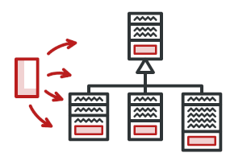
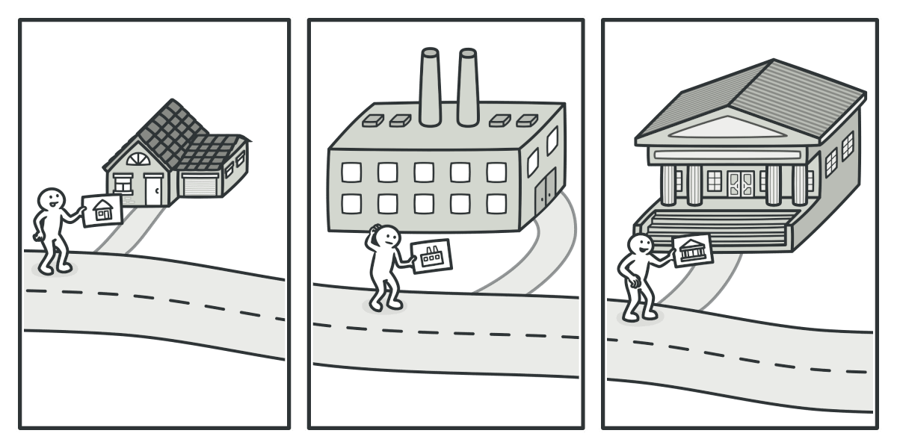
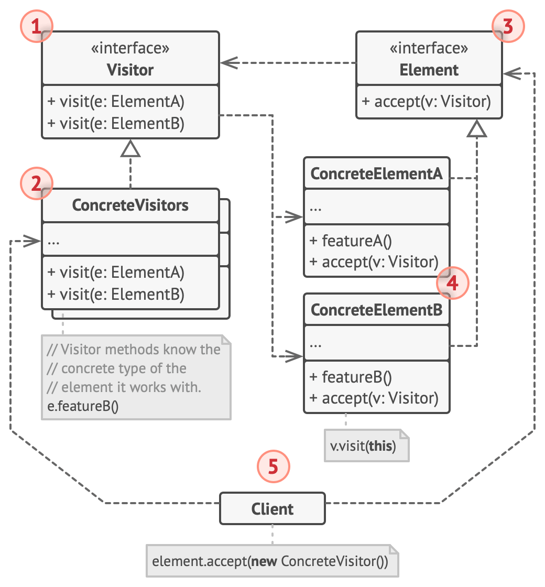
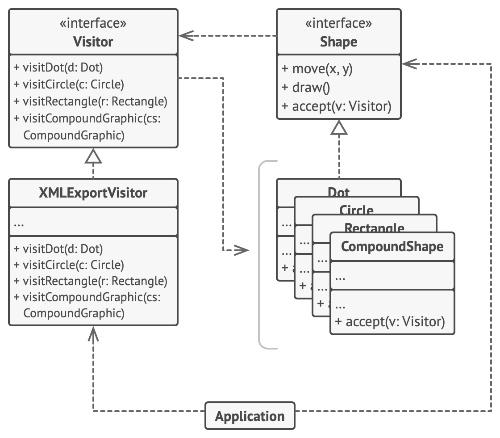

# Visitor



**Type:** Behavioral · **Also known as:** 

> **The 10-second version:** Instead of bolting a new operation onto twenty classes, you write one class containing twenty small methods, and each object tells it which of those methods to run.

<br clear="all">

## Quick card

| | |
|---|---|
| **Problem it solves** | You have a stable family of classes (an AST, a document tree, a set of domain events) and you keep needing *new operations* over all of them. Adding each operation as a method means editing every class, every time, and stuffing unrelated concerns into them. |
| **Core move** | Move the operation into a separate `Visitor` class with one method per element type. Give each element a two-line `accept(v)` that calls `v.visitMyExactType(this)`. That second call is the whole trick — the object picks the overload, so nobody has to type-check. |
| **You'll recognise it by** | A method literally called `accept` / `Accept` that does nothing but `return v.visitX(this)`, and an interface whose methods are all named `visitSomething` with different parameter types. |
| **Rating** | Complexity ★★★ · Popularity ★☆☆ |
| **Closest relatives** | Composite (the thing usually being visited), Iterator (the other way to walk a structure), Command (Visitor is a command that knows several object types), Strategy (a *different* algorithm for *one* type — not several). |
| **In your stack** | C#: `System.Linq.Expressions.ExpressionVisitor` — every EF Core query you have ever written is translated to SQL by one. TS: every Babel plugin and every ESLint rule you have ever installed is a visitor object. SQL: a search-filter AST turned into parameterised `WHERE` clauses by one visitor and into an Elasticsearch query by another. RabbitMQ: a closed union of domain events, visited by a projector that the compiler forces to handle every case. |

### How to read this file

Technical first, plain English second. 🗣️ marks the plain-English version. Part 1 is Refactoring.Guru's material with their diagrams; Parts 2-7 are code, your stack, and the stuff that makes it stick.

---

# PART 1 — The pattern

## 1. Intent
**Visitor** is a behavioral design pattern that lets you separate algorithms from the objects on which they operate.


### 🗣️ In plain words

You have a bunch of classes that are basically data — shapes, AST nodes, listing sections, geo nodes. Over time people keep asking for *new things to do* with all of them: export to XML, render as HTML, compute a total, validate, translate to SQL. The obvious move is to add a method to every class for every new thing. Do that five times and your classes are 80% other people's concerns.

Visitor says: leave those classes alone. Put each new operation in its own class, with one method per element type. Then teach every element one tiny thing — how to call the right method on a visitor. That's it. Forever after, a new operation is a new file, not twenty edits.

The price, which we will be honest about all the way through: this only works if the *set of element types* is basically frozen. Visitor trades "easy to add types" for "easy to add operations." You cannot have both cheaply.

## 2. Problem
Imagine that your team develops an app which works with geographic information structured as one colossal graph. Each node of the graph may represent a complex entity such as a city, but also more granular things like industries, sightseeing areas, etc. The nodes are connected with others if there’s a road between the real objects that they represent. Under the hood, each node type is represented by its own class, while each specific node is an object.


*Exporting the graph into XML.*

At some point, you got a task to implement exporting the graph into XML format. At first, the job seemed pretty straightforward. You planned to add an export method to each node class and then leverage recursion to go over each node of the graph, executing the export method. The solution was simple and elegant: thanks to polymorphism, you weren’t coupling the code which called the export method to concrete classes of nodes.

Unfortunately, the system architect refused to allow you to alter existing node classes. He said that the code was already in production and he didn’t want to risk breaking it because of a potential bug in your changes.


*The XML export method had to be added into all node classes, which bore the risk of breaking the whole application if any bugs slipped through along with the change.*

Besides, he questioned whether it makes sense to have the XML export code within the node classes. The primary job of these classes was to work with geodata. The XML export behavior would look alien there.

There was another reason for the refusal. It was highly likely that after this feature was implemented, someone from the marketing department would ask you to provide the ability to export into a different format, or request some other weird stuff. This would force you to change those precious and fragile classes again.
### 🗣️ In plain words

Swap the geographic graph for something closer to home. You have a saved-search filter that users build in the UI on a car marketplace:

> *"Petrol or Diesel, under ₹8,00,000, under 60,000 km, Maruti or Hyundai, not accident-history"*

You model it as a small tree — `And`, `Or`, `Not`, `PriceRange`, `MakeIn`, `KmUnder`, `FuelIn`. Perfect little hierarchy. Then the requests arrive:

1. Turn it into a SQL `WHERE` clause for the listings table.
2. Turn it into an Elasticsearch bool query for the search cluster.
3. Turn it into a human-readable label for the "Your alerts" email.
4. Estimate how many rows it will match, so we can warn "this alert will spam you."
5. Validate it — reject filters with a price range of zero width.

The naive answer puts all five on every node:

```ts
// ❌ The node classes are now a landfill
class PriceRange implements FilterNode {
  constructor(readonly minInr: number, readonly maxInr: number) {}

  toSql(): string { return `price BETWEEN ${this.minInr} AND ${this.maxInr}`; }   // SQL injection, but also: why is SQL in my domain model?
  toElastic(): object { return { range: { price: { gte: this.minInr, lte: this.maxInr } } }; }
  describe(): string { return `₹${this.minInr}–₹${this.maxInr}`; }
  estimateSelectivity(stats: PriceHistogram): number { /* needs the stats service */ return 0.2; }
  validate(errors: string[]): void { if (this.maxInr <= this.minInr) errors.push("bad price range"); }
}
```

Count the damage:

- **Seven node classes × five operations = thirty-five methods** you now maintain, scattered across seven files. Reading "how do we build SQL?" means opening seven files and mentally stitching them together.
- **The domain model now depends on everything.** `PriceRange` imports the SQL dialect, the Elasticsearch DSL shape, the i18n strings, and a statistics service. A class whose whole job is "hold two numbers."
- **Request six is coming.** Somebody in growth wants the filter rendered as a shareable URL. That is seven more edits to seven files that are already in production.
- **Some operations only make sense for some nodes.** `estimateSelectivity` is meaningful for `PriceRange` and meaningless for `Not`, so you get stub methods that lie.

And the moment you try to pull the operation *out* into one class, you hit the wall Refactoring.Guru describes:

```ts
// ❌ The wall
function toSql(node: FilterNode): string {
  if (node instanceof PriceRange) return sqlForPrice(node);
  if (node instanceof MakeIn)     return sqlForMake(node);
  if (node instanceof KmUnder)    return sqlForKm(node);
  // ... and this exact ladder, copy-pasted, in toElastic, describe, estimate, validate
}
```

Five ladders, each of which silently falls off the end when someone adds an eighth node type. No compiler help, no runtime error — just a filter that quietly returns `""` and matches every car in the country.

> The dead end: *either* the operation lives inside the classes and pollutes them, *or* it lives outside and degenerates into a type-test ladder.

## 3. Solution
The Visitor pattern suggests that you place the new behavior into a separate class called *visitor*, instead of trying to integrate it into existing classes. The original object that had to perform the behavior is now passed to one of the visitor’s methods as an argument, providing the method access to all necessary data contained within the object.

Now, what if that behavior can be executed over objects of different classes? For example, in our case with XML export, the actual implementation will probably be a little bit different across various node classes. Thus, the visitor class may define not one, but a set of methods, each of which could take arguments of different types, like this:

```
class ExportVisitor implements Visitor is
    method doForCity(City c) { ... }
    method doForIndustry(Industry f) { ... }
    method doForSightSeeing(SightSeeing ss) { ... }
    // ...
```

But how exactly would we call these methods, especially when dealing with the whole graph? These methods have different signatures, so we can’t use polymorphism. To pick a proper visitor method that’s able to process a given object, we’d need to check its class. Doesn’t this sound like a nightmare?

```
foreach (Node node in graph)
    if (node instanceof City)
        exportVisitor.doForCity((City) node)
    if (node instanceof Industry)
        exportVisitor.doForIndustry((Industry) node)
    // ...
}
```

You might ask, why don’t we use method overloading? That’s when you give all methods the same name, even if they support different sets of parameters. Unfortunately, even assuming that our programming language supports it at all (as Java and C# do), it won’t help us. Since the exact class of a node object is unknown in advance, the overloading mechanism won’t be able to determine the correct method to execute. It’ll default to the method that takes an object of the base `Node` class.

However, the Visitor pattern addresses this problem. It uses a technique called [Double Dispatch](https://refactoring.guru/design-patterns/visitor-double-dispatch), which helps to execute the proper method on an object without cumbersome conditionals. Instead of letting the client select a proper version of the method to call, how about we delegate this choice to objects we’re passing to the visitor as an argument? Since the objects know their own classes, they’ll be able to pick a proper method on the visitor less awkwardly. They “accept” a visitor and tell it what visiting method should be executed.

```
// Client code
foreach (Node node in graph)
    node.accept(exportVisitor)

// City
class City is
    method accept(Visitor v) is
        v.doForCity(this)
    // ...

// Industry
class Industry is
    method accept(Visitor v) is
        v.doForIndustry(this)
    // ...
```

I confess. We had to change the node classes after all. But at least the change is trivial and it lets us add further behaviors without altering the code once again.

Now, if we extract a common interface for all visitors, all existing nodes can work with any visitor you introduce into the app. If you find yourself introducing a new behavior related to nodes, all you have to do is implement a new visitor class.
### 🗣️ In plain words

The pattern is three mechanical moves plus one insight that makes the third move work.

1. **Make one class per operation, with one method per element type.** `SqlVisitor` has `visitPriceRange`, `visitMakeIn`, `visitAnd`, … Each method is small and knows exactly one concrete type, so no casting, no `instanceof`. All the SQL-building knowledge sits in one file you can read top to bottom.

2. **Extract a `Visitor` interface** listing those methods. Elements will only ever see the interface, so they stay ignorant of SQL, Elasticsearch and everything else you invent later.

3. **Give every element an `accept(visitor)` method whose entire body is one line: `visitor.visitMyExactClass(this)`.** Yes, this means editing the element classes — once, trivially, forever. `Circle.accept` calls `visitCircle`. `PriceRange.accept` calls `visitPriceRange`. Nothing else goes in there.

Move 3 is the one people ask about, so here is why it is not redundant. When you write `visitor.visit(node)` and rely on overloading, the compiler picks the overload from the **static** type of `node`. If the variable is typed `FilterNode`, you get `visit(FilterNode)` — always, no matter what is actually in the box. Overload resolution happens at compile time; it cannot see runtime types.

`accept` fixes this by splitting the decision in two:

- **Dispatch 1 (runtime, on the element):** `node.accept(v)` is a virtual call. The runtime picks `PriceRange.accept` because the object really is a `PriceRange`.
- **Dispatch 2 (compile time, inside that method):** inside `PriceRange.accept`, `this` has static type `PriceRange`, so `v.visitPriceRange(this)` resolves to exactly the right method.

Two dispatches on two different things — the element's runtime type and the visitor's runtime type — which is why the technique is called **double dispatch**. Single-dispatch languages (C#, Java, TypeScript, C++) give you one virtual dispatch per call, so Visitor is the standard trick for buying a second one.

> **The key insight:** Visitor is not really about "separating algorithms from objects" — that is the *benefit*. Mechanically, Visitor is a workaround for the fact that your language dispatches on one type at a time. `accept` is a one-line bounce off the object whose only purpose is to convert a runtime type into a compile-time type, so that overload resolution can finish the job.

## 4. Real-world analogy


*A good insurance agent is always ready to offer different policies to various types of organizations.*

Imagine a seasoned insurance agent who’s eager to get new customers. He can visit every building in a neighborhood, trying to sell insurance to everyone he meets. Depending on the type of organization that occupies the building, he can offer specialized insurance policies:

- If it’s a residential building, he sells medical insurance.
- If it’s a bank, he sells theft insurance.
- If it’s a coffee shop, he sells fire and flood insurance.
### Two more of my own

**The census enumerator.** A government worker walks a street with one clipboard full of different forms: one for a household, one for a shop, one for a farm, one for a factory. They don't guess which form to use by peering through the window. They knock, and whoever opens the door says "we're a household of four" and the household form comes out. The *form set* is the visitor; the *building* answers the door and names itself. Next year the government wants a public-health survey instead of a census — new clipboard, same street, nobody has to renovate a single building.

**The exam moderator.** A school has fixed paper types: multiple-choice, short-answer, essay, practical. The moderator arrives with a marking scheme. Each paper is stapled with a cover sheet saying "I am an essay paper" and the moderator flips to the essay rules. In March a different moderator arrives with a *plagiarism* scheme instead of a *marking* scheme — same papers, same cover sheets, entirely different logic. But the day the school invents a new paper type — an oral exam — *every* marking scheme in the building has to be reprinted. That last sentence is the pattern's cost, and it is the sentence people forget.

## 5. Structure


1. The **Visitor** interface declares a set of visiting methods that can take concrete elements of an object structure as arguments. These methods may have the same names if the program is written in a language that supports overloading, but the type of their parameters must be different.
2. Each **Concrete Visitor** implements several versions of the same behaviors, tailored for different concrete element classes.
3. The **Element** interface declares a method for “accepting” visitors. This method should have one parameter declared with the type of the visitor interface.
4. Each **Concrete Element** must implement the acceptance method. The purpose of this method is to redirect the call to the proper visitor’s method corresponding to the current element class. Be aware that even if a base element class implements this method, all subclasses must still override this method in their own classes and call the appropriate method on the visitor object.
5. The **Client** usually represents a collection or some other complex object (for example, a [Composite](https://refactoring.guru/design-patterns/composite) tree). Usually, clients aren’t aware of all the concrete element classes because they work with objects from that collection via some abstract interface.
### 🗣️ Participants & roles — cheat table

| Role | What it is in code | Example from the site | Equivalent in reader's stack |
|---|---|---|---|
| **Visitor** (interface) | One method per concrete element type. Same name with different parameter types in C#/Java, or distinct names (`visitDot`, `visitCircle`) which is safer and clearer. | `Visitor` with `visitDot`, `visitCircle`, `visitRectangle`, `visitCompoundShape` | `IFilterVisitor<TResult>` in C#; `interface FilterVisitor<R>` in TS; `ExpressionVisitor` in .NET, which .NET wrote for you |
| **Concrete Visitor** | One whole operation, implemented across all element types. Often carries accumulator state (`StringBuilder`, param list, running total). | `XMLExportVisitor` | `SqlWhereVisitor`, `ElasticQueryVisitor`, `FilterLabelVisitor`, `ListingCompletenessVisitor` |
| **Element** (interface) | Declares `accept(v: Visitor)`. That's its entire contribution. | `Shape` with `move`, `draw`, `accept` | `IFilterNode { TResult Accept<TResult>(IFilterVisitor<TResult> v); }` |
| **Concrete Element** | Implements `accept` with exactly one line calling *its own* visit method. Must be re-implemented in every subclass — inheriting it is a bug (see Part 5). | `Dot`, `Circle`, `Rectangle`, `CompoundShape` | `PriceRange`, `MakeIn`, `KmUnder`, `FuelIn`, `AndNode`, `OrNode`, `NotNode` |
| **Client** | Owns the structure, creates the visitor, kicks it off. Often a Composite tree or a plain collection. | `Application` with `allShapes` and `export()` | Your `SavedSearchService`, which holds the parsed filter tree and calls `tree.Accept(new SqlWhereVisitor())` |

### 🤝 Collaboration — who calls whom

```
  Client                 Element                     ConcreteVisitor
 (Application)          (Circle : Shape)             (XMLExportVisitor)
     |                        |                              |
     |  shape.accept(v)       |                              |
     |----------------------->|                              |
     |                        |                              |
     |            === DISPATCH #1 (runtime, virtual) ===      |
     |   The variable is typed `Shape`, but the object is a   |
     |   Circle, so Circle::accept runs. The runtime type     |
     |   has now been "captured".                             |
     |                        |                              |
     |                        |   v.visitCircle(this)        |
     |                        |----------------------------->|
     |                        |                              |
     |            === DISPATCH #2 (compile-time overload) === |
     |   Inside Circle::accept, `this` is statically a Circle,|
     |   so the compiler binds visitCircle. And `v` is itself |
     |   virtual, so WHICH visitor class runs is also chosen  |
     |   at runtime.                                          |
     |                        |                              |
     |                        |        [ reads c.radius,     |
     |                        |          appends to its own  |
     |                        |          StringBuilder ]     |
     |                        |<- - - - - - - - - - - - - - -|
     |<- - - - - - - - - - - -|                              |
     |                        |                              |
     |  ... repeat for every element ...                      |
     |                                                        |
     |  v.getResult()                                         |
     |------------------------------------------------------->|
```

**The one hop that matters:** the arrow from `Circle::accept` to `v.visitCircle(this)`. Nothing else in the pattern is interesting. That single line is where a runtime type becomes a compile-time type, and it is the reason you cannot replace Visitor with plain overloading.

For a tree (Composite), there is a second question the diagram hides: *who recurses?* Either `visitCompoundShape` loops over children and calls `child.accept(this)` (visitor-driven traversal — the visitor controls order and can skip subtrees), or `CompoundShape.accept` visits its children itself (element-driven). Visitor-driven is the more flexible default; element-driven is fine when the order is genuinely fixed.

## 6. Pseudocode (the website's example)
In this example, the **Visitor** pattern adds XML export support to the class hierarchy of geometric shapes.



*Exporting various types of objects into XML format via a visitor object.*

```
// The element interface declares an `accept` method that takes
// the base visitor interface as an argument.
interface Shape is
    method move(x, y)
    method draw()
    method accept(v: Visitor)

// Each concrete element class must implement the `accept`
// method in such a way that it calls the visitor's method that
// corresponds to the element's class.
class Dot implements Shape is
    // ...

    // Note that we're calling `visitDot`, which matches the
    // current class name. This way we let the visitor know the
    // class of the element it works with.
    method accept(v: Visitor) is
        v.visitDot(this)

class Circle implements Shape is
    // ...
    method accept(v: Visitor) is
        v.visitCircle(this)

class Rectangle implements Shape is
    // ...
    method accept(v: Visitor) is
        v.visitRectangle(this)

class CompoundShape implements Shape is
    // ...
    method accept(v: Visitor) is
        v.visitCompoundShape(this)

// The Visitor interface declares a set of visiting methods that
// correspond to element classes. The signature of a visiting
// method lets the visitor identify the exact class of the
// element that it's dealing with.
interface Visitor is
    method visitDot(d: Dot)
    method visitCircle(c: Circle)
    method visitRectangle(r: Rectangle)
    method visitCompoundShape(cs: CompoundShape)

// Concrete visitors implement several versions of the same
// algorithm, which can work with all concrete element classes.
//
// You can experience the biggest benefit of the Visitor pattern
// when using it with a complex object structure such as a
// Composite tree. In this case, it might be helpful to store
// some intermediate state of the algorithm while executing the
// visitor's methods over various objects of the structure.
class XMLExportVisitor implements Visitor is
    method visitDot(d: Dot) is
        // Export the dot's ID and center coordinates.

    method visitCircle(c: Circle) is
        // Export the circle's ID, center coordinates and
        // radius.

    method visitRectangle(r: Rectangle) is
        // Export the rectangle's ID, left-top coordinates,
        // width and height.

    method visitCompoundShape(cs: CompoundShape) is
        // Export the shape's ID as well as the list of its
        // children's IDs.

// The client code can run visitor operations over any set of
// elements without figuring out their concrete classes. The
// accept operation directs a call to the appropriate operation
// in the visitor object.
class Application is
    field allShapes: array of Shapes

    method export() is
        exportVisitor = new XMLExportVisitor()

        foreach (shape in allShapes) do
            shape.accept(exportVisitor)
```

If you wonder why we need the `accept` method in this example, my article [Visitor and Double Dispatch](https://refactoring.guru/design-patterns/visitor-double-dispatch) addresses this question in detail.
### 🗣️ Reading that pseudocode

- **`method accept(v: Visitor)` on the `Shape` interface** is the only thing the pattern asks of the existing hierarchy. Notice it takes the *interface*, not a concrete visitor — that's what keeps `Shape` from ever knowing XML exists.
- **`v.visitDot(this)` inside `Dot.accept`** — the method name matches the class name. That correspondence *is* the pattern. If you ever find yourself writing `v.visitShape(this)` from inside `Dot`, you have broken it and you are back to single dispatch.
- **Four `accept` methods, four one-liners, zero shared implementation.** `CompoundShape.accept` cannot inherit `Shape`'s version even if one existed, because `this` would have the wrong static type. Every concrete class writes its own.
- **`interface Visitor` lists every concrete class by name.** This is the coupling direction that matters: visitors know all elements; elements know no visitors. That asymmetry is exactly why adding a *visitor* is free and adding an *element* is expensive.
- **`XMLExportVisitor` has no return type on its methods.** The site's comment about "storing some intermediate state" tells you why: the result accumulates in the visitor's own fields, and you read it off afterwards. In C#/TS/Java you'll usually prefer a generic `TResult` return instead — see Part 3 — but the accumulator style is correct and is what you need when one node's output depends on siblings.
- **`Application.export()` loops and calls `shape.accept(exportVisitor)` with no type checks anywhere.** That loop is the payoff. Compare it to the `if (node instanceof City)` ladder in the Problem section — same behaviour, none of the fragility.

## 7. Applicability — when to reach for it
**Use the Visitor when you need to perform an operation on all elements of a complex object structure (for example, an object tree).**

The Visitor pattern lets you execute an operation over a set of objects with different classes by having a visitor object implement several variants of the same operation, which correspond to all target classes.

**Use the Visitor to clean up the business logic of auxiliary behaviors.**

The pattern lets you make the primary classes of your app more focused on their main jobs by extracting all other behaviors into a set of visitor classes.

**Use the pattern when a behavior makes sense only in some classes of a class hierarchy, but not in others.**

You can extract this behavior into a separate visitor class and implement only those visiting methods that accept objects of relevant classes, leaving the rest empty.
### ✅ Quick checklist

- [ ] Is the set of element classes **effectively closed**? (An AST, a document model, a fixed set of domain events, a shape library — something you add to once a year, not once a sprint.)
- [ ] Do you already have, or clearly foresee, **three or more distinct operations** over that whole set?
- [ ] Are those operations **not the element's job**? (SQL generation, XML export, reporting, cost estimation — things a domain object should not know about.)
- [ ] Are you currently writing, or about to write, **the same `instanceof` / `is` / `switch (node.Type)` ladder more than once**?
- [ ] Do you need an operation that **accumulates across the whole structure** (a running total, an indented string, a list of validation errors)?
- [ ] Do you need the **compiler to force exhaustiveness** — "if someone adds a node type, every operation must fail to build until it's handled"?

Four or more ticks: Visitor earns its keep. Two or fewer, especially if the first box is unticked: don't — Part 5 has the alternatives.

## 8. How to implement — step by step
1. Declare the visitor interface with a set of “visiting” methods, one per each concrete element class that exists in the program.
2. Declare the element interface. If you’re working with an existing element class hierarchy, add the abstract “acceptance” method to the base class of the hierarchy. This method should accept a visitor object as an argument.
3. Implement the acceptance methods in all concrete element classes. These methods must simply redirect the call to a visiting method on the incoming visitor object which matches the class of the current element.
4. The element classes should only work with visitors via the visitor interface. Visitors, however, must be aware of all concrete element classes, referenced as parameter types of the visiting methods.
5. For each behavior that can’t be implemented inside the element hierarchy, create a new concrete visitor class and implement all of the visiting methods.

   You might encounter a situation where the visitor will need access to some private members of the element class. In this case, you can either make these fields or methods public, violating the element’s encapsulation, or nest the visitor class in the element class. The latter is only possible if you’re lucky to work with a programming language that supports nested classes.
6. The client must create visitor objects and pass them into elements via “acceptance” methods.
### 🗣️ The same steps, blunt version

1. **List your concrete element classes.** Write the visitor interface with exactly that many methods. If the list is long or fuzzy, stop — you have the wrong pattern.
2. **Add `accept(Visitor v)` to the base element type.** Abstract. No default body.
3. **Implement `accept` in every concrete class as one line:** `v.visitThisExactClass(this)`. Copy-paste it, change one word, move on. Do not get clever, do not put it in the base class.
4. **Point the coupling one way.** Elements import the visitor *interface* only. Visitors import every concrete element class. Never the reverse.
5. **Write one concrete visitor per operation.** Move the code out of the element classes and delete the originals. If a visit method needs a private field of the element, either widen the field, add a narrow read-only accessor, or nest the visitor inside the element — in that order of preference.
6. **Client creates the visitor and starts the walk.** For trees, decide once whether the visitor or the element does the recursion, and stay consistent.

Practical extras nobody tells you:

7. **Write a `BaseVisitor` with no-op or default implementations** if most visitors care about three of your twelve node types. This is what `CSharpSyntaxWalker` and `SimpleFileVisitor` do, and it is why they are pleasant to subclass.
8. **Prefer a generic return type** (`TResult Accept<TResult>(IVisitor<TResult> v)`) over mutable accumulator fields when each node's result is independent. It makes visitors reusable, thread-safe and trivially testable.

## 9. Pros and cons
- ✅ *Open/Closed Principle*. You can introduce a new behavior that can work with objects of different classes without changing these classes.
- ✅ *Single Responsibility Principle*. You can move multiple versions of the same behavior into the same class.
- ✅ A visitor object can accumulate some useful information while working with various objects. This might be handy when you want to traverse some complex object structure, such as an object tree, and apply the visitor to each object of this structure.

- ⛔ You need to update all visitors each time a class gets added to or removed from the element hierarchy.
- ⛔ Visitors might lack the necessary access to the private fields and methods of the elements that they’re supposed to work with.
### ⚖️ Honest trade-offs from the trenches

**The real cost is not the boilerplate, it's the direction of change.** Every textbook lists "you must update all visitors when you add an element class" as a con and moves on. Feel the actual weight of it: with seven node types and five visitors, adding an eighth node type is *five* edits in five files, plus a new `accept`. That is fine — the compiler points at all five, and you were going to write that logic anyway. It stops being fine when element types are added weekly, because then every feature ships as a shotgun diff across the codebase, and the reviewers stop reading. So before you adopt Visitor, go look at git history for the element hierarchy. If the last six months added node types, walk away. If they added *operations*, Visitor will pay for itself within two of them.

**The tell that it's worth it is duplicated traversal, not duplicated dispatch.** One `switch` over node types is not a reason to reach for Visitor — a switch is fine, readable, and cheap. The signal is the *third* place where you walk the same structure with the same shape of branching and get it subtly different each time: one walk forgets to recurse into `Or`, another handles `Not` by double-negating. When the traversal itself is the duplicated thing, Visitor (plus a base walker that does the recursion once) deletes a whole class of bug.

**Modern C# and TypeScript hand you 80% of this for free, and you should take it.** In C#, a `sealed`/`abstract record` hierarchy plus a `switch` expression with positional patterns gives you exhaustive, type-safe dispatch with zero `accept` methods — and since C# 9 the compiler warns when a switch expression over a closed hierarchy isn't exhaustive. In TypeScript, a discriminated union plus a `switch` on the tag, with a `const _exhaustive: never = node` in the default branch, is the same thing and is *more* idiomatic than a class-based visitor. What you lose by going that route: nothing, if the hierarchy is genuinely closed and in your assembly. What you keep by using classic Visitor: the ability to let *other assemblies* add operations without touching a switch you own, and the ability to hand out a partially-implemented base visitor so callers override three methods out of twelve. In C++, `std::variant` + `std::visit` is the same story with better ergonomics than the virtual `accept` version for closed sets.

**Where DI containers and libraries already did it.** Do not hand-roll an expression-tree visitor in C# — derive from `System.Linq.Expressions.ExpressionVisitor` and override the two `Visit*` methods you care about. Do not hand-roll an AST walker in Node — Babel and ESLint both take a plain object of `{ NodeType(path) {} }` handlers, which is Visitor with the interface implied. Do not hand-roll a directory walker in Java — `Files.walkFileTree` takes a `FileVisitor`. Where a DI container *does* help: registering `IEnumerable<IFilterVisitor<Sql>>`-style visitor implementations so a factory can pick one per output format, which is a Strategy selection over visitors — a nice combination, and a good reason to keep visitors stateless.

## 10. Relations with other patterns
- You can treat [Visitor](https://refactoring.guru/design-patterns/visitor) as a powerful version of the [Command](https://refactoring.guru/design-patterns/command) pattern. Its objects can execute operations over various objects of different classes.
- You can use [Visitor](https://refactoring.guru/design-patterns/visitor) to execute an operation over an entire [Composite](https://refactoring.guru/design-patterns/composite) tree.
- You can use [Visitor](https://refactoring.guru/design-patterns/visitor) along with [Iterator](https://refactoring.guru/design-patterns/iterator) to traverse a complex data structure and execute some operation over its elements, even if they all have different classes.
### 🗣️ Disambiguation table

| Pattern | What it varies | Who knows whom | The tell in code | One-line separator |
|---|---|---|---|---|
| **Visitor** | The *operation*, across **many** element types | Visitor knows every concrete element; elements know only the visitor interface | `accept(v)` whose body is `v.visitMe(this)`; an interface full of `visitX(X)` overloads | ***Visitor is one algorithm spread across many types.*** |
| **Strategy** | The *algorithm*, for **one** context type | Context holds a strategy; strategy usually knows nothing about the context beyond its parameters | `_strategy.Execute(data)` where the strategy interface has **one** method | ***Strategy is many algorithms for one type.*** |
| **State** | The *behaviour*, as the object's situation changes | State objects usually hold a back-reference to the context and **swap themselves out** | `_state = new SoldState(this);` — the state assigns the next state | ***State is Strategy that reassigns itself.*** |
| **Command** | The *request*, packaged as an object | Command knows its receiver | `Execute()` / `Undo()` with no argument — everything is captured in fields | ***Command is one operation on one receiver, storable and undoable.*** |
| **Iterator** | The *traversal order* | Iterator knows the collection's internals; the caller knows neither | `MoveNext()` / `Current`, `yield return` | ***Iterator decides where you go; Visitor decides what you do when you get there.*** |
| **Composite** | The *structure* | Parents hold children through the component interface | `Add(child)` on a node type that is also a leaf type | ***Composite is the tree; Visitor is the thing you run over the tree.*** |

**Strategy vs State, since their diagrams are literally identical.** Draw both: a `Context` holding an interface, and N concrete implementations. Same boxes, same arrows. Two things separate them, and neither is visible in the diagram.

- *Intent.* Strategy exists so the **caller** can choose an interchangeable algorithm — `new SearchRanker(new PriceAscStrategy())`. All strategies are peers; picking one is a configuration decision. State exists so the **object's own lifecycle** changes what its methods do — a listing behaves differently when it is `Draft`, `PendingApproval`, `Live`, `Sold`. Nobody "chooses" `SoldState`; you arrive at it.
- *Whether the objects know about each other.* Strategies are typically ignorant: they take inputs and return outputs, and they certainly do not decide what the next strategy is. State objects usually hold a reference back to the context, because a state's job includes triggering the **transition** — `context.TransitionTo(new SoldState())`. The moment one implementation of your interface sets the next implementation, you are looking at State, whatever you named the folder.

**And neither of them is Visitor.** Both Strategy and State swap *one* method for *one* object. Visitor's interface has one method **per element type** and exists precisely because there are several unrelated concrete types to handle. If your "visitor" interface has exactly one method, you have written a Strategy and should rename it. If your "strategy" interface has one method per subclass of something, you have written a Visitor.

---

# PART 2 — Official code examples from Refactoring.Guru

## 2.1 C#
**Complexity:** ★★★ (3/3)

**Popularity:** ★☆☆ (1/3)

**Usage examples:** Visitor isn’t a very common pattern because of its complexity and narrow applicability.
### Conceptual Example

This example illustrates the structure of the **Visitor** design pattern. It focuses on answering these questions:

- What classes does it consist of?
- What roles do these classes play?
- In what way the elements of the pattern are related?

##### **Program.cs:** Conceptual example

```csharp
using System;
using System.Collections.Generic;

namespace RefactoringGuru.DesignPatterns.Visitor.Conceptual
{
    // The Component interface declares an `accept` method that should take the
    // base visitor interface as an argument.
    public interface IComponent
    {
        void Accept(IVisitor visitor);
    }

    // Each Concrete Component must implement the `Accept` method in such a way
    // that it calls the visitor's method corresponding to the component's
    // class.
    public class ConcreteComponentA : IComponent
    {
        // Note that we're calling `VisitConcreteComponentA`, which matches the
        // current class name. This way we let the visitor know the class of the
        // component it works with.
        public void Accept(IVisitor visitor)
        {
            visitor.VisitConcreteComponentA(this);
        }

        // Concrete Components may have special methods that don't exist in
        // their base class or interface. The Visitor is still able to use these
        // methods since it's aware of the component's concrete class.
        public string ExclusiveMethodOfConcreteComponentA()
        {
            return "A";
        }
    }

    public class ConcreteComponentB : IComponent
    {
        // Same here: VisitConcreteComponentB => ConcreteComponentB
        public void Accept(IVisitor visitor)
        {
            visitor.VisitConcreteComponentB(this);
        }

        public string SpecialMethodOfConcreteComponentB()
        {
            return "B";
        }
    }

    // The Visitor Interface declares a set of visiting methods that correspond
    // to component classes. The signature of a visiting method allows the
    // visitor to identify the exact class of the component that it's dealing
    // with.
    public interface IVisitor
    {
        void VisitConcreteComponentA(ConcreteComponentA element);

        void VisitConcreteComponentB(ConcreteComponentB element);
    }

    // Concrete Visitors implement several versions of the same algorithm, which
    // can work with all concrete component classes.
    //
    // You can experience the biggest benefit of the Visitor pattern when using
    // it with a complex object structure, such as a Composite tree. In this
    // case, it might be helpful to store some intermediate state of the
    // algorithm while executing visitor's methods over various objects of the
    // structure.
    class ConcreteVisitor1 : IVisitor
    {
        public void VisitConcreteComponentA(ConcreteComponentA element)
        {
            Console.WriteLine(element.ExclusiveMethodOfConcreteComponentA() + " + ConcreteVisitor1");
        }

        public void VisitConcreteComponentB(ConcreteComponentB element)
        {
            Console.WriteLine(element.SpecialMethodOfConcreteComponentB() + " + ConcreteVisitor1");
        }
    }

    class ConcreteVisitor2 : IVisitor
    {
        public void VisitConcreteComponentA(ConcreteComponentA element)
        {
            Console.WriteLine(element.ExclusiveMethodOfConcreteComponentA() + " + ConcreteVisitor2");
        }

        public void VisitConcreteComponentB(ConcreteComponentB element)
        {
            Console.WriteLine(element.SpecialMethodOfConcreteComponentB() + " + ConcreteVisitor2");
        }
    }

    public class Client
    {
        // The client code can run visitor operations over any set of elements
        // without figuring out their concrete classes. The accept operation
        // directs a call to the appropriate operation in the visitor object.
        public static void ClientCode(List<IComponent> components, IVisitor visitor)
        {
            foreach (var component in components)
            {
                component.Accept(visitor);
            }
        }
    }

    class Program
    {
        static void Main(string[] args)
        {
            List<IComponent> components = new List<IComponent>
            {
                new ConcreteComponentA(),
                new ConcreteComponentB()
            };

            Console.WriteLine("The client code works with all visitors via the base Visitor interface:");
            var visitor1 = new ConcreteVisitor1();
            Client.ClientCode(components,visitor1);

            Console.WriteLine();

            Console.WriteLine("It allows the same client code to work with different types of visitors:");
            var visitor2 = new ConcreteVisitor2();
            Client.ClientCode(components, visitor2);
        }
    }
}
```

##### **Output.txt:** Execution result

```output
The client code works with all visitors via the base Visitor interface:
A + ConcreteVisitor1
B + ConcreteVisitor1

It allows the same client code to work with different types of visitors:
A + ConcreteVisitor2
B + ConcreteVisitor2
```

## 2.2 TypeScript
**Complexity:** ★★★ (3/3)

**Popularity:** ★☆☆ (1/3)

**Usage examples:** Visitor isn’t a very common pattern because of its complexity and narrow applicability.
### Conceptual Example

This example illustrates the structure of the **Visitor** design pattern and focuses on the following questions:

- What classes does it consist of?
- What roles do these classes play?
- In what way the elements of the pattern are related?

##### **index.ts:** Conceptual example

```typescript
/**
 * The Component interface declares an `accept` method that should take the base
 * visitor interface as an argument.
 */
interface Component {
    accept(visitor: Visitor): void;
}

/**
 * Each Concrete Component must implement the `accept` method in such a way that
 * it calls the visitor's method corresponding to the component's class.
 */
class ConcreteComponentA implements Component {
    /**
     * Note that we're calling `visitConcreteComponentA`, which matches the
     * current class name. This way we let the visitor know the class of the
     * component it works with.
     */
    public accept(visitor: Visitor): void {
        visitor.visitConcreteComponentA(this);
    }

    /**
     * Concrete Components may have special methods that don't exist in their
     * base class or interface. The Visitor is still able to use these methods
     * since it's aware of the component's concrete class.
     */
    public exclusiveMethodOfConcreteComponentA(): string {
        return 'A';
    }
}

class ConcreteComponentB implements Component {
    /**
     * Same here: visitConcreteComponentB => ConcreteComponentB
     */
    public accept(visitor: Visitor): void {
        visitor.visitConcreteComponentB(this);
    }

    public specialMethodOfConcreteComponentB(): string {
        return 'B';
    }
}

/**
 * The Visitor Interface declares a set of visiting methods that correspond to
 * component classes. The signature of a visiting method allows the visitor to
 * identify the exact class of the component that it's dealing with.
 */
interface Visitor {
    visitConcreteComponentA(element: ConcreteComponentA): void;

    visitConcreteComponentB(element: ConcreteComponentB): void;
}

/**
 * Concrete Visitors implement several versions of the same algorithm, which can
 * work with all concrete component classes.
 *
 * You can experience the biggest benefit of the Visitor pattern when using it
 * with a complex object structure, such as a Composite tree. In this case, it
 * might be helpful to store some intermediate state of the algorithm while
 * executing visitor's methods over various objects of the structure.
 */
class ConcreteVisitor1 implements Visitor {
    public visitConcreteComponentA(element: ConcreteComponentA): void {
        console.log(`${element.exclusiveMethodOfConcreteComponentA()} + ConcreteVisitor1`);
    }

    public visitConcreteComponentB(element: ConcreteComponentB): void {
        console.log(`${element.specialMethodOfConcreteComponentB()} + ConcreteVisitor1`);
    }
}

class ConcreteVisitor2 implements Visitor {
    public visitConcreteComponentA(element: ConcreteComponentA): void {
        console.log(`${element.exclusiveMethodOfConcreteComponentA()} + ConcreteVisitor2`);
    }

    public visitConcreteComponentB(element: ConcreteComponentB): void {
        console.log(`${element.specialMethodOfConcreteComponentB()} + ConcreteVisitor2`);
    }
}

/**
 * The client code can run visitor operations over any set of elements without
 * figuring out their concrete classes. The accept operation directs a call to
 * the appropriate operation in the visitor object.
 */
function clientCode(components: Component[], visitor: Visitor) {
    // ...
    for (const component of components) {
        component.accept(visitor);
    }
    // ...
}

const components = [
    new ConcreteComponentA(),
    new ConcreteComponentB(),
];

console.log('The client code works with all visitors via the base Visitor interface:');
const visitor1 = new ConcreteVisitor1();
clientCode(components, visitor1);
console.log('');

console.log('It allows the same client code to work with different types of visitors:');
const visitor2 = new ConcreteVisitor2();
clientCode(components, visitor2);
```

##### **Output.txt:** Execution result

```output
The client code works with all visitors via the base Visitor interface:
A + ConcreteVisitor1
B + ConcreteVisitor1

It allows the same client code to work with different types of visitors:
A + ConcreteVisitor2
B + ConcreteVisitor2
```

## 2.3 C++
**Complexity:** ★★★ (3/3)

**Popularity:** ★☆☆ (1/3)

**Usage examples:** Visitor isn’t a very common pattern because of its complexity and narrow applicability.
### Conceptual Example

This example illustrates the structure of the **Visitor** design pattern. It focuses on answering these questions:

- What classes does it consist of?
- What roles do these classes play?
- In what way the elements of the pattern are related?

##### **main.cc:** Conceptual example

```cpp
/**
 * The Visitor Interface declares a set of visiting methods that correspond to
 * component classes. The signature of a visiting method allows the visitor to
 * identify the exact class of the component that it's dealing with.
 */
class ConcreteComponentA;
class ConcreteComponentB;

class Visitor {
 public:
  virtual void VisitConcreteComponentA(const ConcreteComponentA *element) const = 0;
  virtual void VisitConcreteComponentB(const ConcreteComponentB *element) const = 0;
};

/**
 * The Component interface declares an `accept` method that should take the base
 * visitor interface as an argument.
 */

class Component {
 public:
  virtual ~Component() {}
  virtual void Accept(Visitor *visitor) const = 0;
};

/**
 * Each Concrete Component must implement the `Accept` method in such a way that
 * it calls the visitor's method corresponding to the component's class.
 */
class ConcreteComponentA : public Component {
  /**
   * Note that we're calling `visitConcreteComponentA`, which matches the
   * current class name. This way we let the visitor know the class of the
   * component it works with.
   */
 public:
  void Accept(Visitor *visitor) const override {
    visitor->VisitConcreteComponentA(this);
  }
  /**
   * Concrete Components may have special methods that don't exist in their base
   * class or interface. The Visitor is still able to use these methods since
   * it's aware of the component's concrete class.
   */
  std::string ExclusiveMethodOfConcreteComponentA() const {
    return "A";
  }
};

class ConcreteComponentB : public Component {
  /**
   * Same here: visitConcreteComponentB => ConcreteComponentB
   */
 public:
  void Accept(Visitor *visitor) const override {
    visitor->VisitConcreteComponentB(this);
  }
  std::string SpecialMethodOfConcreteComponentB() const {
    return "B";
  }
};

/**
 * Concrete Visitors implement several versions of the same algorithm, which can
 * work with all concrete component classes.
 *
 * You can experience the biggest benefit of the Visitor pattern when using it
 * with a complex object structure, such as a Composite tree. In this case, it
 * might be helpful to store some intermediate state of the algorithm while
 * executing visitor's methods over various objects of the structure.
 */
class ConcreteVisitor1 : public Visitor {
 public:
  void VisitConcreteComponentA(const ConcreteComponentA *element) const override {
    std::cout << element->ExclusiveMethodOfConcreteComponentA() << " + ConcreteVisitor1\n";
  }

  void VisitConcreteComponentB(const ConcreteComponentB *element) const override {
    std::cout << element->SpecialMethodOfConcreteComponentB() << " + ConcreteVisitor1\n";
  }
};

class ConcreteVisitor2 : public Visitor {
 public:
  void VisitConcreteComponentA(const ConcreteComponentA *element) const override {
    std::cout << element->ExclusiveMethodOfConcreteComponentA() << " + ConcreteVisitor2\n";
  }
  void VisitConcreteComponentB(const ConcreteComponentB *element) const override {
    std::cout << element->SpecialMethodOfConcreteComponentB() << " + ConcreteVisitor2\n";
  }
};
/**
 * The client code can run visitor operations over any set of elements without
 * figuring out their concrete classes. The accept operation directs a call to
 * the appropriate operation in the visitor object.
 */
void ClientCode(std::array<const Component *, 2> components, Visitor *visitor) {
  // ...
  for (const Component *comp : components) {
    comp->Accept(visitor);
  }
  // ...
}

int main() {
  std::array<const Component *, 2> components = {new ConcreteComponentA, new ConcreteComponentB};
  std::cout << "The client code works with all visitors via the base Visitor interface:\n";
  ConcreteVisitor1 *visitor1 = new ConcreteVisitor1;
  ClientCode(components, visitor1);
  std::cout << "\n";
  std::cout << "It allows the same client code to work with different types of visitors:\n";
  ConcreteVisitor2 *visitor2 = new ConcreteVisitor2;
  ClientCode(components, visitor2);

  for (const Component *comp : components) {
    delete comp;
  }
  delete visitor1;
  delete visitor2;

  return 0;
}
```

##### **Output.txt:** Execution result

```output
The client code works with all visitors via the base Visitor interface:
A + ConcreteVisitor1
B + ConcreteVisitor1

It allows the same client code to work with different types of visitors:
A + ConcreteVisitor2
B + ConcreteVisitor2
```

## 2.4 Java
**Complexity:** ★★★ (3/3)

**Popularity:** ★☆☆ (1/3)

**Usage examples:** Visitor isn’t a very common pattern because of its complexity and narrow applicability.
### Exporting shapes into XML

In this example, we would want to export a set of geometric shapes into XML. The catch is that we don’t want to change the code of shapes directly or at least keep it to the minimum.

In the end, the Visitor pattern establishes an infrastructure that allows us to add any behaviors to the shapes hierarchy without changing the existing code of those classes.

#### **shapes**

##### **shapes/Shape.java:** Common shape interface

```java
package refactoring_guru.visitor.example.shapes;

import refactoring_guru.visitor.example.visitor.Visitor;

public interface Shape {
    void move(int x, int y);
    void draw();
    String accept(Visitor visitor);
}
```

##### **shapes/Dot.java:** A dot

```java
package refactoring_guru.visitor.example.shapes;

import refactoring_guru.visitor.example.visitor.Visitor;

public class Dot implements Shape {
    private int id;
    private int x;
    private int y;

    public Dot() {
    }

    public Dot(int id, int x, int y) {
        this.id = id;
        this.x = x;
        this.y = y;
    }

    @Override
    public void move(int x, int y) {
        // move shape
    }

    @Override
    public void draw() {
        // draw shape
    }

    @Override
    public String accept(Visitor visitor) {
        return visitor.visitDot(this);
    }

    public int getX() {
        return x;
    }

    public int getY() {
        return y;
    }

    public int getId() {
        return id;
    }
}
```

##### **shapes/Circle.java:** A circle

```java
package refactoring_guru.visitor.example.shapes;

import refactoring_guru.visitor.example.visitor.Visitor;

public class Circle extends Dot {
    private int radius;

    public Circle(int id, int x, int y, int radius) {
        super(id, x, y);
        this.radius = radius;
    }

    @Override
    public String accept(Visitor visitor) {
        return visitor.visitCircle(this);
    }

    public int getRadius() {
        return radius;
    }
}
```

##### **shapes/Rectangle.java:** A rectangle

```java
package refactoring_guru.visitor.example.shapes;

import refactoring_guru.visitor.example.visitor.Visitor;

public class Rectangle implements Shape {
    private int id;
    private int x;
    private int y;
    private int width;
    private int height;

    public Rectangle(int id, int x, int y, int width, int height) {
        this.id = id;
        this.x = x;
        this.y = y;
        this.width = width;
        this.height = height;
    }

    @Override
    public String accept(Visitor visitor) {
        return visitor.visitRectangle(this);
    }

    @Override
    public void move(int x, int y) {
        // move shape
    }

    @Override
    public void draw() {
        // draw shape
    }

    public int getId() {
        return id;
    }

    public int getX() {
        return x;
    }

    public int getY() {
        return y;
    }

    public int getWidth() {
        return width;
    }

    public int getHeight() {
        return height;
    }
}
```

##### **shapes/CompoundShape.java:** A compound shape

```java
package refactoring_guru.visitor.example.shapes;

import refactoring_guru.visitor.example.visitor.Visitor;

import java.util.ArrayList;
import java.util.List;

public class CompoundShape implements Shape {
    public int id;
    public List<Shape> children = new ArrayList<>();

    public CompoundShape(int id) {
        this.id = id;
    }

    @Override
    public void move(int x, int y) {
        // move shape
    }

    @Override
    public void draw() {
        // draw shape
    }

    public int getId() {
        return id;
    }

    @Override
    public String accept(Visitor visitor) {
        return visitor.visitCompoundGraphic(this);
    }

    public void add(Shape shape) {
        children.add(shape);
    }
}
```

#### **visitor**

##### **visitor/Visitor.java:** Common visitor interface

```java
package refactoring_guru.visitor.example.visitor;

import refactoring_guru.visitor.example.shapes.Circle;
import refactoring_guru.visitor.example.shapes.CompoundShape;
import refactoring_guru.visitor.example.shapes.Dot;
import refactoring_guru.visitor.example.shapes.Rectangle;

public interface Visitor {
    String visitDot(Dot dot);

    String visitCircle(Circle circle);

    String visitRectangle(Rectangle rectangle);

    String visitCompoundGraphic(CompoundShape cg);
}
```

##### **visitor/XMLExportVisitor.java:** Concrete visitor, exports all shapes into XML

```java
package refactoring_guru.visitor.example.visitor;

import refactoring_guru.visitor.example.shapes.*;

public class XMLExportVisitor implements Visitor {

    public String export(Shape... args) {
        StringBuilder sb = new StringBuilder();
        sb.append("<?xml version=\"1.0\" encoding=\"utf-8\"?>" + "\n");
        for (Shape shape : args) {
            sb.append(shape.accept(this)).append("\n");
        }
        return sb.toString();
    }

    public String visitDot(Dot d) {
        return "<dot>" + "\n" +
                "    <id>" + d.getId() + "</id>" + "\n" +
                "    <x>" + d.getX() + "</x>" + "\n" +
                "    <y>" + d.getY() + "</y>" + "\n" +
                "</dot>";
    }

    public String visitCircle(Circle c) {
        return "<circle>" + "\n" +
                "    <id>" + c.getId() + "</id>" + "\n" +
                "    <x>" + c.getX() + "</x>" + "\n" +
                "    <y>" + c.getY() + "</y>" + "\n" +
                "    <radius>" + c.getRadius() + "</radius>" + "\n" +
                "</circle>";
    }

    public String visitRectangle(Rectangle r) {
        return "<rectangle>" + "\n" +
                "    <id>" + r.getId() + "</id>" + "\n" +
                "    <x>" + r.getX() + "</x>" + "\n" +
                "    <y>" + r.getY() + "</y>" + "\n" +
                "    <width>" + r.getWidth() + "</width>" + "\n" +
                "    <height>" + r.getHeight() + "</height>" + "\n" +
                "</rectangle>";
    }

    public String visitCompoundGraphic(CompoundShape cg) {
        return "<compound_graphic>" + "\n" +
                "   <id>" + cg.getId() + "</id>" + "\n" +
                _visitCompoundGraphic(cg) +
                "</compound_graphic>";
    }

    private String _visitCompoundGraphic(CompoundShape cg) {
        StringBuilder sb = new StringBuilder();
        for (Shape shape : cg.children) {
            String obj = shape.accept(this);
            // Proper indentation for sub-objects.
            obj = "    " + obj.replace("\n", "\n    ") + "\n";
            sb.append(obj);
        }
        return sb.toString();
    }

}
```

##### **Demo.java:** Client code

```java
package refactoring_guru.visitor.example;

import refactoring_guru.visitor.example.shapes.*;
import refactoring_guru.visitor.example.visitor.XMLExportVisitor;

public class Demo {
    public static void main(String[] args) {
        Dot dot = new Dot(1, 10, 55);
        Circle circle = new Circle(2, 23, 15, 10);
        Rectangle rectangle = new Rectangle(3, 10, 17, 20, 30);

        CompoundShape compoundShape = new CompoundShape(4);
        compoundShape.add(dot);
        compoundShape.add(circle);
        compoundShape.add(rectangle);

        CompoundShape c = new CompoundShape(5);
        c.add(dot);
        compoundShape.add(c);

        export(circle, compoundShape);
    }

    private static void export(Shape... shapes) {
        XMLExportVisitor exportVisitor = new XMLExportVisitor();
        System.out.println(exportVisitor.export(shapes));
    }
}
```

##### **OutputDemo.txt:** Execution result

```output
<?xml version="1.0" encoding="utf-8"?>
<circle>
    <id>2</id>
    <x>23</x>
    <y>15</y>
    <radius>10</radius>
</circle>

<?xml version="1.0" encoding="utf-8"?>
<compound_graphic>
   <id>4</id>
    <dot>
        <id>1</id>
        <x>10</x>
        <y>55</y>
    </dot>
    <circle>
        <id>2</id>
        <x>23</x>
        <y>15</y>
        <radius>10</radius>
    </circle>
    <rectangle>
        <id>3</id>
        <x>10</x>
        <y>17</y>
        <width>20</width>
        <height>30</height>
    </rectangle>
    <compound_graphic>
       <id>5</id>
        <dot>
            <id>1</id>
            <x>10</x>
            <y>55</y>
        </dot>
    </compound_graphic>
</compound_graphic>
```

---

# PART 3 — Learn it by building it

The running example for the whole of Part 3 is a **saved-search filter tree** from a car marketplace. Small, closed, tree-shaped, and with several genuinely different operations over it — the exact profile Visitor was designed for.

## 3.1 The dumbest possible version — TypeScript

### ❌ BEFORE — the pain, in full

```ts
// ============================================================================
// BEFORE: every operation lives on every node. Seven classes, five concerns.
// ============================================================================

interface FilterNode {
  toSql(): string;
  toElastic(): object;
  describe(): string;
  validate(errors: string[]): void;
}

class PriceRange implements FilterNode {
  constructor(readonly minInr: number, readonly maxInr: number) {}

  toSql(): string {
    // String-concatenated SQL in a domain object. This is how injection happens.
    return `l.price_inr BETWEEN ${this.minInr} AND ${this.maxInr}`;
  }
  toElastic(): object {
    return { range: { price_inr: { gte: this.minInr, lte: this.maxInr } } };
  }
  describe(): string {
    return `₹${(this.minInr / 100000).toFixed(1)}L–₹${(this.maxInr / 100000).toFixed(1)}L`;
  }
  validate(errors: string[]): void {
    if (this.maxInr <= this.minInr) errors.push("Price range is empty");
  }
}

class MakeIn implements FilterNode {
  constructor(readonly makes: string[]) {}

  toSql(): string {
    const list = this.makes.map(m => `'${m}'`).join(", ");   // still injectable
    return `l.make IN (${list})`;
  }
  toElastic(): object { return { terms: { make: this.makes } }; }
  describe(): string { return this.makes.join(" or "); }
  validate(errors: string[]): void {
    if (this.makes.length === 0) errors.push("No makes selected");
  }
}

class AndNode implements FilterNode {
  constructor(readonly children: FilterNode[]) {}

  toSql(): string { return "(" + this.children.map(c => c.toSql()).join(" AND ") + ")"; }
  toElastic(): object { return { bool: { must: this.children.map(c => c.toElastic()) } }; }
  describe(): string { return this.children.map(c => c.describe()).join(", "); }
  validate(errors: string[]): void { this.children.forEach(c => c.validate(errors)); }
}

// ... KmUnder, FuelIn, OrNode, NotNode: four more classes, four more copies
//     of the same four-method shape.
```

Now product asks for a **shareable URL encoding**. That is seven files touched, seven methods added, and a review diff nobody reads properly. Worse: to add a *node type* (`SellerTypeIs`), you must remember all five operations — and if you forget `toElastic`, TypeScript will not save you, because you implemented the interface and the interface will have been updated... unless someone "helpfully" gave the interface a default. Then the alert silently searches the wrong index.

### ✅ AFTER — the same feature, as a Visitor

```ts
// ============================================================================
// AFTER: nodes hold data + one accept(). Operations live in visitor classes.
// ============================================================================

// ────────────────────────────────────────────────────────────────────────────
// 1. THE VISITOR INTERFACE — one method per concrete node type.
//    Generic in the return type, so a visitor can return SQL, or an object,
//    or a number, without any shared mutable state.
// ────────────────────────────────────────────────────────────────────────────
interface FilterVisitor<R> {
  visitPriceRange(node: PriceRange): R;
  visitMakeIn(node: MakeIn): R;
  visitKmUnder(node: KmUnder): R;
  visitAnd(node: AndNode): R;
  visitNot(node: NotNode): R;
}

// ────────────────────────────────────────────────────────────────────────────
// 2. THE ELEMENT INTERFACE — one method, and it is not an operation.
// ────────────────────────────────────────────────────────────────────────────
interface FilterNode {
  accept<R>(visitor: FilterVisitor<R>): R;
}

// ────────────────────────────────────────────────────────────────────────────
// 3. THE CONCRETE ELEMENTS — data, and a one-line accept. Nothing else.
//    Note how each accept names ITS OWN visit method. That is the pattern.
// ────────────────────────────────────────────────────────────────────────────
class PriceRange implements FilterNode {
  constructor(readonly minInr: number, readonly maxInr: number) {}
  accept<R>(v: FilterVisitor<R>): R {
    return v.visitPriceRange(this);          // <-- DISPATCH #2. `this` is
  }                                          //     statically PriceRange here.
}

class MakeIn implements FilterNode {
  constructor(readonly makes: string[]) {}
  accept<R>(v: FilterVisitor<R>): R {
    return v.visitMakeIn(this);              // <-- different method name,
  }                                          //     same one-line shape.
}

class KmUnder implements FilterNode {
  constructor(readonly maxKm: number) {}
  accept<R>(v: FilterVisitor<R>): R {
    return v.visitKmUnder(this);
  }
}

class AndNode implements FilterNode {
  constructor(readonly children: readonly FilterNode[]) {}
  accept<R>(v: FilterVisitor<R>): R {
    return v.visitAnd(this);                 // <-- NOTE: does NOT recurse.
  }                                          //     The visitor decides that.
}

class NotNode implements FilterNode {
  constructor(readonly inner: FilterNode) {}
  accept<R>(v: FilterVisitor<R>): R {
    return v.visitNot(this);
  }
}

// ────────────────────────────────────────────────────────────────────────────
// 4. CONCRETE VISITOR #1 — SQL. Parameterised, because the SQL knowledge now
//    lives in a class that is allowed to care about SQL.
// ────────────────────────────────────────────────────────────────────────────
interface SqlFragment { text: string; params: unknown[]; }

class SqlWhereVisitor implements FilterVisitor<SqlFragment> {
  visitPriceRange(n: PriceRange): SqlFragment {
    return { text: "l.price_inr BETWEEN ? AND ?", params: [n.minInr, n.maxInr] };
  }

  visitMakeIn(n: MakeIn): SqlFragment {
    const holes = n.makes.map(() => "?").join(", ");
    return { text: `l.make IN (${holes})`, params: [...n.makes] };
  }

  visitKmUnder(n: KmUnder): SqlFragment {
    return { text: "l.km_driven < ?", params: [n.maxKm] };
  }

  visitAnd(n: AndNode): SqlFragment {
    // The VISITOR does the recursion: child.accept(this).
    const parts = n.children.map(c => c.accept(this));   // <-- traversal lives here
    return {
      text: "(" + parts.map(p => p.text).join(" AND ") + ")",
      params: parts.flatMap(p => p.params),
    };
  }

  visitNot(n: NotNode): SqlFragment {
    const inner = n.inner.accept(this);
    return { text: `NOT (${inner.text})`, params: inner.params };
  }
}

// ────────────────────────────────────────────────────────────────────────────
// 5. CONCRETE VISITOR #2 — a human label for the alert email.
//    Written without touching a single node class.
// ────────────────────────────────────────────────────────────────────────────
class LabelVisitor implements FilterVisitor<string> {
  private lakhs = (p: number) => `₹${(p / 100000).toFixed(1)}L`;

  visitPriceRange(n: PriceRange) { return `${this.lakhs(n.minInr)}–${this.lakhs(n.maxInr)}`; }
  visitMakeIn(n: MakeIn)         { return n.makes.join(" or "); }
  visitKmUnder(n: KmUnder)       { return `under ${n.maxKm.toLocaleString("en-IN")} km`; }
  visitAnd(n: AndNode)           { return n.children.map(c => c.accept(this)).join(", "); }
  visitNot(n: NotNode)           { return `not (${n.inner.accept(this)})`; }
}

// ────────────────────────────────────────────────────────────────────────────
// 6. CONCRETE VISITOR #3 — a number. Same tree, completely different shape of
//    answer, and the generic <R> means zero casting.
// ────────────────────────────────────────────────────────────────────────────
class SelectivityVisitor implements FilterVisitor<number> {
  // Rough fraction of the catalogue each clause keeps. Real version would take
  // a histogram service in the constructor — visitors may have dependencies.
  visitPriceRange(n: PriceRange) { return Math.min(1, (n.maxInr - n.minInr) / 5_000_000); }
  visitMakeIn(n: MakeIn)         { return Math.min(1, n.makes.length * 0.07); }
  visitKmUnder(n: KmUnder)       { return Math.min(1, n.maxKm / 200_000); }
  visitAnd(n: AndNode)           { return n.children.reduce((acc, c) => acc * c.accept(this), 1); }
  visitNot(n: NotNode)           { return 1 - n.inner.accept(this); }
}

// ────────────────────────────────────────────────────────────────────────────
// 7. CLIENT — no type checks anywhere.
// ────────────────────────────────────────────────────────────────────────────
const savedSearch: FilterNode = new AndNode([
  new MakeIn(["Maruti Suzuki", "Hyundai"]),
  new PriceRange(400_000, 800_000),
  new NotNode(new KmUnder(5_000)),           // exclude suspiciously-low-km cars
]);

const sql = savedSearch.accept(new SqlWhereVisitor());
console.log(sql.text);
// (l.make IN (?, ?) AND l.price_inr BETWEEN ? AND ? AND NOT (l.km_driven < ?))
console.log(sql.params);
// [ 'Maruti Suzuki', 'Hyundai', 400000, 800000, 5000 ]

console.log(savedSearch.accept(new LabelVisitor()));
// Maruti Suzuki or Hyundai, ₹4.0L–₹8.0L, not (under 5,000 km)

console.log(savedSearch.accept(new SelectivityVisitor()).toFixed(3));
// 0.022
```

**What to notice:**

- **Every `accept` is one line and they are all different.** `PriceRange` calls `visitPriceRange`, `MakeIn` calls `visitMakeIn`. Copy-paste plus one word. If two classes call the same visit method, the pattern is broken.
- **The node classes lost four methods each and gained one.** They are now pure data. They no longer import SQL, Elasticsearch or formatting concerns. You could serialise them, put them in a shared package, and hand them to a different team.
- **Adding a fourth operation is one new file.** The `SelectivityVisitor` above was written without opening a single node file. That is the entire promise, delivered.
- **Adding a fifth node type is three edits + N.** One new class, one new method on `FilterVisitor`, and then TypeScript refuses to compile all three visitors until you handle it. That compile error is a *feature* — it is the exhaustiveness you never got from the `instanceof` ladder.
- **The generic `<R>` is worth the noise.** Refactoring.Guru's pseudocode uses `void` plus accumulated state, which is the right call when a node's output depends on neighbours. When each node's result is independent — which is most of the time — a return type makes visitors stateless, reusable and safe to share between requests.
- **Recursion lives in the visitor, not the node.** `AndNode.accept` does not touch its children. That means a future `DepthVisitor` could stop at depth 2, or a `FindFirstVisitor` could bail out early, without any node class caring.

## 3.2 Same thing in C#

```csharp
#nullable enable
using System;
using System.Collections.Generic;
using System.Linq;

namespace Marketplace.Search.Filters;

// ────────────────────────────────────────────────────────────────────────────
// VISITOR INTERFACE — generic in the result, one method per node type.
// ────────────────────────────────────────────────────────────────────────────
public interface IFilterVisitor<out TResult>
{
    TResult VisitPriceRange(PriceRange node);
    TResult VisitMakeIn(MakeIn node);
    TResult VisitKmUnder(KmUnder node);
    TResult VisitAnd(AndNode node);
    TResult VisitNot(NotNode node);
}

// ────────────────────────────────────────────────────────────────────────────
// ELEMENTS — records for value semantics and free deconstruction.
// `abstract record` + `sealed record` = a closed hierarchy the compiler
// understands, which matters again in section 3.5.
// ────────────────────────────────────────────────────────────────────────────
public abstract record FilterNode
{
    public abstract TResult Accept<TResult>(IFilterVisitor<TResult> visitor);
}

public sealed record PriceRange(decimal MinInr, decimal MaxInr) : FilterNode
{
    public override TResult Accept<TResult>(IFilterVisitor<TResult> v)
        => v.VisitPriceRange(this);                       // <-- DISPATCH #2
}

public sealed record MakeIn(IReadOnlyList<string> Makes) : FilterNode
{
    public override TResult Accept<TResult>(IFilterVisitor<TResult> v)
        => v.VisitMakeIn(this);
}

public sealed record KmUnder(int MaxKm) : FilterNode
{
    public override TResult Accept<TResult>(IFilterVisitor<TResult> v)
        => v.VisitKmUnder(this);
}

public sealed record AndNode(IReadOnlyList<FilterNode> Children) : FilterNode
{
    public override TResult Accept<TResult>(IFilterVisitor<TResult> v)
        => v.VisitAnd(this);
}

public sealed record NotNode(FilterNode Inner) : FilterNode
{
    public override TResult Accept<TResult>(IFilterVisitor<TResult> v)
        => v.VisitNot(this);
}

// ────────────────────────────────────────────────────────────────────────────
// CONCRETE VISITOR #1 — parameterised SQL. Immutable result type, so the
// visitor itself is stateless and safe to register as a singleton in DI.
// ────────────────────────────────────────────────────────────────────────────
public sealed record SqlFragment(string Text, IReadOnlyList<object> Parameters);

public sealed class SqlWhereVisitor : IFilterVisitor<SqlFragment>
{
    public SqlFragment VisitPriceRange(PriceRange n)
        => new("l.price_inr BETWEEN @p{0} AND @p{1}", new object[] { n.MinInr, n.MaxInr });

    public SqlFragment VisitMakeIn(MakeIn n)
    {
        var holes = string.Join(", ", n.Makes.Select((_, i) => "@p{" + i + "}"));
        return new($"l.make IN ({holes})", n.Makes.Cast<object>().ToList());
    }

    public SqlFragment VisitKmUnder(KmUnder n)
        => new("l.km_driven < @p{0}", new object[] { n.MaxKm });

    public SqlFragment VisitAnd(AndNode n)
    {
        var parts = n.Children.Select(c => c.Accept(this)).ToList();
        return Combine(parts, " AND ", "({0})");
    }

    public SqlFragment VisitNot(NotNode n)
    {
        var inner = n.Inner.Accept(this);
        return new($"NOT ({inner.Text})", inner.Parameters);
    }

    private static SqlFragment Combine(
        IReadOnlyList<SqlFragment> parts, string glue, string wrapper)
    {
        var text = string.Format(wrapper, string.Join(glue, parts.Select(p => p.Text)));
        var all = parts.SelectMany(p => p.Parameters).ToList();
        return new SqlFragment(text, all);
    }
}

// A tiny renumbering pass so the {0}/{1} placeholders become @p0, @p1, ...
// across the whole tree. Keeping it separate keeps each visit method trivial.
public static class SqlFragmentExtensions
{
    public static (string Sql, Dictionary<string, object> Params) Materialise(
        this SqlFragment fragment)
    {
        var sql = fragment.Text;
        var dict = new Dictionary<string, object>();
        var next = 0;
        // Placeholders were emitted per-node as @p{0}, @p{1}; renumber globally.
        for (var i = 0; i < fragment.Parameters.Count; i++)
        {
            var name = $"p{next++}";
            sql = ReplaceFirst(sql, "@p{" + LocalIndex(fragment, i) + "}", "@" + name);
            dict[name] = fragment.Parameters[i];
        }
        return (sql, dict);

        static int LocalIndex(SqlFragment f, int i) => i;   // 1:1 in this shape
        static string ReplaceFirst(string s, string find, string with)
        {
            var at = s.IndexOf(find, StringComparison.Ordinal);
            return at < 0 ? s : s[..at] + with + s[(at + find.Length)..];
        }
    }
}

// ────────────────────────────────────────────────────────────────────────────
// CONCRETE VISITOR #2 — a label. Different TResult, zero casting.
// ────────────────────────────────────────────────────────────────────────────
public sealed class LabelVisitor : IFilterVisitor<string>
{
    public string VisitPriceRange(PriceRange n) => $"{Lakhs(n.MinInr)}–{Lakhs(n.MaxInr)}";
    public string VisitMakeIn(MakeIn n)         => string.Join(" or ", n.Makes);
    public string VisitKmUnder(KmUnder n)       => $"under {n.MaxKm:N0} km";
    public string VisitAnd(AndNode n)           => string.Join(", ", n.Children.Select(c => c.Accept(this)));
    public string VisitNot(NotNode n)           => $"not ({n.Inner.Accept(this)})";

    private static string Lakhs(decimal p) => $"₹{p / 100_000m:0.0}L";
}

// ────────────────────────────────────────────────────────────────────────────
// CONCRETE VISITOR #3 — validation, accumulating into visitor state.
// This is the style the Refactoring.Guru pseudocode uses: no return value,
// results collected on the visitor. Note it is therefore NOT reusable across
// threads or across calls without a reset — a real trade-off, not a nit.
// ────────────────────────────────────────────────────────────────────────────
public sealed class ValidationVisitor : IFilterVisitor<bool>
{
    private readonly List<string> _errors = new();
    public IReadOnlyList<string> Errors => _errors;

    public bool VisitPriceRange(PriceRange n)
    {
        if (n.MaxInr <= n.MinInr) _errors.Add($"Price range {n.MinInr}–{n.MaxInr} is empty.");
        if (n.MinInr < 0)         _errors.Add("Price cannot be negative.");
        return _errors.Count == 0;
    }

    public bool VisitMakeIn(MakeIn n)
    {
        if (n.Makes.Count == 0) _errors.Add("At least one make must be selected.");
        return _errors.Count == 0;
    }

    public bool VisitKmUnder(KmUnder n)
    {
        if (n.MaxKm <= 0) _errors.Add("Kilometre limit must be positive.");
        return _errors.Count == 0;
    }

    public bool VisitAnd(AndNode n)
    {
        foreach (var child in n.Children) child.Accept(this);
        if (n.Children.Count == 0) _errors.Add("Empty AND group.");
        return _errors.Count == 0;
    }

    public bool VisitNot(NotNode n) => n.Inner.Accept(this);
}

// ────────────────────────────────────────────────────────────────────────────
// CLIENT
// ────────────────────────────────────────────────────────────────────────────
public static class Demo
{
    public static void Run()
    {
        FilterNode saved = new AndNode(new FilterNode[]
        {
            new MakeIn(new[] { "Maruti Suzuki", "Hyundai" }),
            new PriceRange(400_000m, 800_000m),
            new NotNode(new KmUnder(5_000)),
        });

        Console.WriteLine(saved.Accept(new LabelVisitor()));
        // Maruti Suzuki or Hyundai, ₹4.0L–₹8.0L, not (under 5,000 km)

        var validator = new ValidationVisitor();
        saved.Accept(validator);
        Console.WriteLine(validator.Errors.Count == 0 ? "valid" : string.Join("; ", validator.Errors));

        var fragment = saved.Accept(new SqlWhereVisitor());
        Console.WriteLine(fragment.Text);
    }
}
```

**C#-specific notes:**

- **`out TResult` on `IFilterVisitor<out TResult>`** makes it covariant, so an `IFilterVisitor<string>` is usable where an `IFilterVisitor<object>` is expected. Free, and occasionally useful when you compose visitors.
- **Generic `Accept<TResult>` on a record works, but there is a catch:** you cannot then store a heterogeneous list of "visitors" in a single non-generic collection without an extra non-generic marker interface. If you need that (e.g. DI-resolving "all the visitors"), add `interface IFilterVisitor { }` as a base and have `IFilterVisitor<T> : IFilterVisitor`.
- **`sealed record` is the right element shape.** Value equality gives you free unit-test assertions (`Assert.Equal(expectedTree, actualTree)`), `with` gives you cheap tree rewriting, and `sealed` lets the compiler reason about exhaustiveness in the switch-expression alternative below.
- **Do not name all the methods `Visit`.** C# supports overloading, so `Visit(PriceRange)` / `Visit(MakeIn)` compiles — but the day someone adds an overload taking the *base* `FilterNode`, every call silently retargets, and you get no warning. Distinct names (`VisitPriceRange`) make that class of bug impossible. .NET's own `ExpressionVisitor` uses distinct names (`VisitBinary`, `VisitMethodCall`) for exactly this reason.
- **Stateless visitors are singletons; stateful ones are not.** `SqlWhereVisitor` and `LabelVisitor` hold nothing and can be `AddSingleton`. `ValidationVisitor` accumulates into a field and must be `AddTransient`, or better, constructed per call. Getting this wrong gives you cross-request data leakage that only shows up under load.
- **Pitfall — inherited `Accept`.** If you made `FilterNode` a non-abstract base with a default `Accept` calling `v.VisitNode(this)`, every subclass that forgets to override gets silently mis-dispatched. Keep it `abstract`. The compiler is your exhaustiveness check.

## 3.3 C++

C++ is where Visitor gets genuinely interesting, because the language gives you *two* good answers: the classic virtual `accept`, and `std::variant` + `std::visit`, which is Visitor with the boilerplate deleted by the compiler.

```cpp
// ============================================================================
// C++17 — the classic virtual-accept Visitor, done with correct ownership.
// ============================================================================
#include <memory>
#include <string>
#include <sstream>
#include <vector>
#include <utility>
#include <iostream>

namespace marketplace {

// Forward declarations: the visitor needs the element types, the elements need
// the visitor type. One of the two must be forward-declared.
class PriceRange;
class MakeIn;
class KmUnder;
class AndNode;
class NotNode;

// ────────────────────────────────────────────────────────────────────────────
// VISITOR base. Virtual destructor: you will hold visitors by base reference,
// and someone will eventually own one through a base pointer.
// ────────────────────────────────────────────────────────────────────────────
class FilterVisitor {
public:
    virtual ~FilterVisitor() = default;                 // <-- non-negotiable

    virtual void visitPriceRange(const PriceRange&) = 0;
    virtual void visitMakeIn    (const MakeIn&)     = 0;
    virtual void visitKmUnder   (const KmUnder&)    = 0;
    virtual void visitAnd       (const AndNode&)    = 0;
    virtual void visitNot       (const NotNode&)    = 0;

protected:
    FilterVisitor() = default;
    // Prevent slicing of the visitor itself: copying a base subobject is
    // never what you want here.
    FilterVisitor(const FilterVisitor&) = default;
    FilterVisitor& operator=(const FilterVisitor&) = default;
};

// ────────────────────────────────────────────────────────────────────────────
// ELEMENT base. accept() is const because visiting must not mutate the tree.
// Const-correctness here is what lets you visit a `const FilterNode&`.
// ────────────────────────────────────────────────────────────────────────────
class FilterNode {
public:
    virtual ~FilterNode() = default;                    // <-- non-negotiable:
                                                        //     deleting through
                                                        //     unique_ptr<FilterNode>
    virtual void accept(FilterVisitor& v) const = 0;

protected:
    FilterNode() = default;
    FilterNode(const FilterNode&) = default;
    FilterNode& operator=(const FilterNode&) = default;
};

using NodePtr = std::unique_ptr<const FilterNode>;      // sole ownership, no cycles

// ────────────────────────────────────────────────────────────────────────────
// CONCRETE ELEMENTS. `final` lets the compiler devirtualise accept() in many
// cases, which is free performance.
// ────────────────────────────────────────────────────────────────────────────
class PriceRange final : public FilterNode {
public:
    PriceRange(long minInr, long maxInr) : min_(minInr), max_(maxInr) {}
    void accept(FilterVisitor& v) const override { v.visitPriceRange(*this); }  // <-- DISPATCH #2
    long min() const noexcept { return min_; }
    long max() const noexcept { return max_; }
private:
    long min_, max_;
};

class MakeIn final : public FilterNode {
public:
    explicit MakeIn(std::vector<std::string> makes) : makes_(std::move(makes)) {}  // move, not copy
    void accept(FilterVisitor& v) const override { v.visitMakeIn(*this); }
    const std::vector<std::string>& makes() const noexcept { return makes_; }
private:
    std::vector<std::string> makes_;
};

class KmUnder final : public FilterNode {
public:
    explicit KmUnder(int maxKm) : maxKm_(maxKm) {}
    void accept(FilterVisitor& v) const override { v.visitKmUnder(*this); }
    int maxKm() const noexcept { return maxKm_; }
private:
    int maxKm_;
};

class AndNode final : public FilterNode {
public:
    explicit AndNode(std::vector<NodePtr> children) : children_(std::move(children)) {}
    void accept(FilterVisitor& v) const override { v.visitAnd(*this); }
    const std::vector<NodePtr>& children() const noexcept { return children_; }
private:
    std::vector<NodePtr> children_;      // owns the subtree; destroyed recursively
};

class NotNode final : public FilterNode {
public:
    explicit NotNode(NodePtr inner) : inner_(std::move(inner)) {}
    void accept(FilterVisitor& v) const override { v.visitNot(*this); }
    const FilterNode& inner() const noexcept { return *inner_; }
private:
    NodePtr inner_;
};

// ────────────────────────────────────────────────────────────────────────────
// CONCRETE VISITOR. Accumulator style, because C++ virtual methods cannot be
// templated on a return type. State lives in the visitor; you read it after.
// ────────────────────────────────────────────────────────────────────────────
class SqlWhereVisitor final : public FilterVisitor {
public:
    void visitPriceRange(const PriceRange& n) override {
        sql_ << "l.price_inr BETWEEN ? AND ?";
        params_.push_back(std::to_string(n.min()));
        params_.push_back(std::to_string(n.max()));
    }

    void visitMakeIn(const MakeIn& n) override {
        sql_ << "l.make IN (";
        for (std::size_t i = 0; i < n.makes().size(); ++i) {
            if (i) sql_ << ", ";
            sql_ << "?";
            params_.push_back(n.makes()[i]);
        }
        sql_ << ")";
    }

    void visitKmUnder(const KmUnder& n) override {
        sql_ << "l.km_driven < ?";
        params_.push_back(std::to_string(n.maxKm()));
    }

    void visitAnd(const AndNode& n) override {
        sql_ << "(";
        bool first = true;
        for (const NodePtr& child : n.children()) {
            if (!first) sql_ << " AND ";
            first = false;
            child->accept(*this);            // visitor-driven recursion
        }
        sql_ << ")";
    }

    void visitNot(const NotNode& n) override {
        sql_ << "NOT (";
        n.inner().accept(*this);
        sql_ << ")";
    }

    std::string sql() const { return sql_.str(); }
    const std::vector<std::string>& params() const noexcept { return params_; }

private:
    std::ostringstream sql_;
    std::vector<std::string> params_;
};

} // namespace marketplace

int main() {
    using namespace marketplace;

    std::vector<NodePtr> kids;
    kids.push_back(std::make_unique<MakeIn>(std::vector<std::string>{"Maruti Suzuki", "Hyundai"}));
    kids.push_back(std::make_unique<PriceRange>(400000, 800000));
    kids.push_back(std::make_unique<NotNode>(std::make_unique<KmUnder>(5000)));

    const NodePtr tree = std::make_unique<AndNode>(std::move(kids));

    SqlWhereVisitor v;
    tree->accept(v);                         // <-- DISPATCH #1

    std::cout << v.sql() << "\n";
    // (l.make IN (?, ?) AND l.price_inr BETWEEN ? AND ? AND NOT (l.km_driven < ?))
    for (const auto& p : v.params()) std::cout << p << " ";
    std::cout << "\n";
    return 0;                                // unique_ptrs destroy the tree here
}
```

### The `std::variant` version — Visitor without `accept`

```cpp
// ============================================================================
// C++17 — the same thing with a closed sum type. No accept(), no virtuals.
// The compiler generates the dispatch table for you.
// ============================================================================
#include <variant>
#include <memory>
#include <string>
#include <vector>

namespace marketplace::sum {

struct PriceRange { long minInr; long maxInr; };
struct MakeIn     { std::vector<std::string> makes; };
struct KmUnder    { int maxKm; };
struct AndNode;                              // recursive: needs indirection
struct NotNode;

using Filter = std::variant<PriceRange, MakeIn, KmUnder,
                            std::shared_ptr<AndNode>, std::shared_ptr<NotNode>>;

struct AndNode { std::vector<Filter> children; };
struct NotNode { Filter inner; };

// The "overloaded" idiom: build a callable with one operator() per alternative.
template <class... Ts> struct overloaded : Ts... { using Ts::operator()...; };
template <class... Ts> overloaded(Ts...) -> overloaded<Ts...>;

inline std::string toLabel(const Filter& f) {
    return std::visit(overloaded{
        [](const PriceRange& n) {
            return "₹" + std::to_string(n.minInr / 100000) + "L–₹"
                       + std::to_string(n.maxInr / 100000) + "L";
        },
        [](const MakeIn& n) {
            std::string s;
            for (std::size_t i = 0; i < n.makes.size(); ++i) {
                if (i) s += " or ";
                s += n.makes[i];
            }
            return s;
        },
        [](const KmUnder& n) {
            return "under " + std::to_string(n.maxKm) + " km";
        },
        [](const std::shared_ptr<AndNode>& n) {
            std::string s;
            for (std::size_t i = 0; i < n->children.size(); ++i) {
                if (i) s += ", ";
                s += toLabel(n->children[i]);
            }
            return s;
        },
        [](const std::shared_ptr<NotNode>& n) {
            return "not (" + toLabel(n->inner) + ")";
        },
    }, f);
}

} // namespace marketplace::sum
```

If you leave out one alternative, `std::visit` fails to compile — that is the exhaustiveness guarantee, enforced by the type system rather than by discipline. The trade: `std::variant` is a **closed** set fixed at the type's definition, so a plugin in another translation unit cannot add a node type. That is usually a feature.

### 🧨 C++ gotcha table

| Gotcha | What goes wrong | Fix |
|---|---|---|
| Missing `virtual ~FilterNode()` | `delete` through `unique_ptr<const FilterNode>` calls the wrong destructor — `std::vector<std::string>` in `MakeIn` leaks, or worse, UB | Virtual destructor on **both** the element base and the visitor base |
| `void visitMakeIn(MakeIn n)` — by value | Object slicing on the way in if a subclass of `MakeIn` ever exists; a needless deep copy of the vector regardless | Always `const T&` (or `T&` if the visitor mutates) |
| `accept` not `const` | You cannot visit a `const FilterNode&`, so const-correctness collapses through the whole call chain | `void accept(FilterVisitor& v) const` and make the visit params `const` |
| `accept` defined only on the base | Every subclass silently dispatches to the base's visit method | Pure virtual on the base, one override per concrete class |
| Storing the visitor by value in a container | Slices every subclass down to `FilterVisitor` | Store `std::unique_ptr<FilterVisitor>` or pass by reference |
| Raw `new`/`delete` for the tree | Exception between two `new`s leaks a subtree | `std::make_unique` everywhere; `unique_ptr` children destroy recursively |
| Deep recursive trees + recursive destructor | `~AndNode` recurses; a 100k-deep chain blows the stack at *destruction* time | Bound the depth at parse time, or write an iterative teardown |
| `std::visit` with a lambda taking `auto` | Silently swallows new alternatives — you lose the exhaustiveness check that was the whole point | Write one explicit lambda per alternative; use `auto` only as a deliberate catch-all |
| Copying the element vector into the visitor | `std::vector<NodePtr>` is move-only, so this won't even compile — good | Take `std::vector<NodePtr>` by value and `std::move` it into the member |

**Move semantics angle specific to Visitor:** the nodes own their subtrees through `unique_ptr`, so tree *construction* is all moves (`std::move(kids)`), and tree *visiting* is all const references — zero copies in either direction. A rewriting visitor (one that returns a modified tree) is the exception: it must build new nodes, so it returns `NodePtr` by value and relies on move-construction. That is why a rewriter is usually a separate base class from a read-only walker, exactly as Roslyn splits `CSharpSyntaxWalker` (void) from `CSharpSyntaxRewriter` (returns a node).

## 3.4 Java

Java's standard library contains several textbook Visitors, so the idiom will already look familiar. Here is the filter tree with Java 17 `sealed` interfaces, which gives you the classic Visitor *and* exhaustive switch in the same file.

```java
package com.marketplace.search.filters;

import java.util.List;
import java.util.stream.Collectors;

// ────────────────────────────────────────────────────────────────────────────
// VISITOR. The JDK convention (see javax.lang.model.element.ElementVisitor)
// is <R, P>: R is the result, P is a caller-supplied parameter passed down.
// ────────────────────────────────────────────────────────────────────────────
public interface FilterVisitor<R, P> {
    R visitPriceRange(PriceRange node, P param);
    R visitMakeIn(MakeIn node, P param);
    R visitKmUnder(KmUnder node, P param);
    R visitAnd(AndNode node, P param);
    R visitNot(NotNode node, P param);
}

// ────────────────────────────────────────────────────────────────────────────
// ELEMENTS. `sealed` closes the hierarchy: the compiler now knows the full
// list of subtypes, which is what makes the switch alternative exhaustive.
// ────────────────────────────────────────────────────────────────────────────
public sealed interface FilterNode
        permits PriceRange, MakeIn, KmUnder, AndNode, NotNode {
    <R, P> R accept(FilterVisitor<R, P> visitor, P param);
}

public record PriceRange(long minInr, long maxInr) implements FilterNode {
    @Override public <R, P> R accept(FilterVisitor<R, P> v, P p) {
        return v.visitPriceRange(this, p);            // <-- DISPATCH #2
    }
}

public record MakeIn(List<String> makes) implements FilterNode {
    @Override public <R, P> R accept(FilterVisitor<R, P> v, P p) {
        return v.visitMakeIn(this, p);
    }
}

public record KmUnder(int maxKm) implements FilterNode {
    @Override public <R, P> R accept(FilterVisitor<R, P> v, P p) {
        return v.visitKmUnder(this, p);
    }
}

public record AndNode(List<FilterNode> children) implements FilterNode {
    @Override public <R, P> R accept(FilterVisitor<R, P> v, P p) {
        return v.visitAnd(this, p);
    }
}

public record NotNode(FilterNode inner) implements FilterNode {
    @Override public <R, P> R accept(FilterVisitor<R, P> v, P p) {
        return v.visitNot(this, p);
    }
}

// ────────────────────────────────────────────────────────────────────────────
// BASE VISITOR with defaults — this is the trick that makes big visitor
// hierarchies bearable. Subclasses override only what they care about.
// Compare javax.lang.model.util.SimpleElementVisitor* and
// java.nio.file.SimpleFileVisitor, which exist for exactly this reason.
// ────────────────────────────────────────────────────────────────────────────
public abstract class SimpleFilterVisitor<R, P> implements FilterVisitor<R, P> {
    protected final R defaultValue;

    protected SimpleFilterVisitor(R defaultValue) { this.defaultValue = defaultValue; }

    protected R defaultAction(FilterNode node, P p) { return defaultValue; }

    @Override public R visitPriceRange(PriceRange n, P p) { return defaultAction(n, p); }
    @Override public R visitMakeIn(MakeIn n, P p)         { return defaultAction(n, p); }
    @Override public R visitKmUnder(KmUnder n, P p)       { return defaultAction(n, p); }
    @Override public R visitAnd(AndNode n, P p)           { return defaultAction(n, p); }
    @Override public R visitNot(NotNode n, P p)           { return defaultAction(n, p); }
}

// ────────────────────────────────────────────────────────────────────────────
// A CONCRETE VISITOR: the label, using the P parameter to carry a locale.
// ────────────────────────────────────────────────────────────────────────────
public final class LabelVisitor implements FilterVisitor<String, java.util.Locale> {

    @Override public String visitPriceRange(PriceRange n, java.util.Locale loc) {
        return String.format(loc, "₹%.1fL–₹%.1fL",
                n.minInr() / 100_000.0, n.maxInr() / 100_000.0);
    }

    @Override public String visitMakeIn(MakeIn n, java.util.Locale loc) {
        return String.join(" or ", n.makes());
    }

    @Override public String visitKmUnder(KmUnder n, java.util.Locale loc) {
        return String.format(loc, "under %,d km", n.maxKm());
    }

    @Override public String visitAnd(AndNode n, java.util.Locale loc) {
        return n.children().stream()
                .map(c -> c.accept(this, loc))
                .collect(Collectors.joining(", "));
    }

    @Override public String visitNot(NotNode n, java.util.Locale loc) {
        return "not (" + n.inner().accept(this, loc) + ")";
    }
}

// ────────────────────────────────────────────────────────────────────────────
// A "COUNT THE LEAVES" visitor written in four lines thanks to the base class.
// This is the payoff of SimpleFilterVisitor.
// ────────────────────────────────────────────────────────────────────────────
final class LeafCountVisitor extends SimpleFilterVisitor<Integer, Void> {
    LeafCountVisitor() { super(1); }   // every leaf counts as 1 by default

    @Override public Integer visitAnd(AndNode n, Void p) {
        return n.children().stream().mapToInt(c -> c.accept(this, p)).sum();
    }
    @Override public Integer visitNot(NotNode n, Void p) {
        return n.inner().accept(this, p);
    }
}
```

**Java-specific notes:**

- **`<R, P>` is the JDK's house style** for visitors, and the `P` parameter is genuinely useful — it threads a context (locale, depth, symbol table, output stream) down the walk without making the visitor stateful.
- **Since Java 21, pattern matching for `switch` over a `sealed` interface** does the same job without `accept`, with exhaustiveness checked by the compiler: `return switch (node) { case PriceRange p -> …; case MakeIn m -> …; };` — no `default` needed, and adding a permitted subtype breaks the build. If the hierarchy is yours and sealed, prefer this. Keep the visitor interface when third parties must add operations, or when you want the `SimpleFilterVisitor` "override three of twelve" ergonomics.
- **`record` gives you the element classes for nearly free** — final fields, accessors, `equals`/`hashCode`/`toString` — and `sealed` plus `record` is the modern Java shape for any AST.

### 💡 The line that makes it click

You have already used Visitor without noticing, the first time you deleted a directory tree in Java:

```java
Files.walkFileTree(Path.of("/var/listings/photos/expired"), new SimpleFileVisitor<Path>() {
    @Override public FileVisitResult visitFile(Path file, BasicFileAttributes attrs) throws IOException {
        Files.delete(file);
        return FileVisitResult.CONTINUE;
    }
    @Override public FileVisitResult postVisitDirectory(Path dir, IOException exc) throws IOException {
        Files.delete(dir);
        return FileVisitResult.CONTINUE;
    }
});
```

`Files.walkFileTree` is the traversal; `FileVisitor` is the visitor interface; `SimpleFileVisitor` is the default base class so you override one or two of the four callbacks instead of all four. And `FileVisitResult.SKIP_SUBTREE` is a detail the pattern books rarely mention but production code always needs: a visitor that can tell the walker to prune. When you write your own tree visitor, steal that idea.

The second one, if you have ever written an annotation processor: `element.accept(new SimpleElementVisitor9<Void, Void>() { … }, null)` in `javax.lang.model` is textbook double dispatch — `Element.accept(ElementVisitor<R,P>, P)` is *literally* the GoF signature, in the JDK, with `visitType`, `visitExecutable`, `visitVariable` and friends.

## 3.5 Deep dive — the expression problem, and four ways to solve it in 2026

Visitor is one answer to a famous problem, and you will understand when to use it much better once you can name the problem.

### The problem, stated

You have a two-dimensional matrix: **types** down one side (PriceRange, MakeIn, AndNode…), **operations** across the other (toSql, toLabel, validate, estimate). Every cell is a piece of code that must exist. The question is: *how is that matrix physically arranged in files, and therefore what is cheap to add?*

```
                 toSql   toLabel  validate  estimate      <- operations
    PriceRange  [  x  ]  [  x  ]  [  x  ]   [  x  ]
    MakeIn      [  x  ]  [  x  ]  [  x  ]   [  x  ]
    KmUnder     [  x  ]  [  x  ]  [  x  ]   [  x  ]
    AndNode     [  x  ]  [  x  ]  [  x  ]   [  x  ]
    NotNode     [  x  ]  [  x  ]  [  x  ]   [  x  ]
      ^
      types
```

- **Plain OOP polymorphism groups the matrix by ROW.** Each class is a file containing all its operations. Adding a *row* (new type) is one new file — cheap. Adding a *column* (new operation) means editing every file — expensive.
- **Visitor groups the matrix by COLUMN.** Each visitor is a file containing all types for one operation. Adding a *column* is one new file — cheap. Adding a *row* means editing every visitor — expensive.

You are not choosing between "good" and "bad." You are choosing **which axis you want to be cheap**, and that choice should be made from the actual change history of your codebase, not from taste.

### The four implementations, compared

| Approach | Add a type | Add an operation | Exhaustiveness | Works across assemblies? | Where it's idiomatic |
|---|---|---|---|---|---|
| **1. Method on each class** (plain polymorphism) | 1 new file 😀 | edit every class 😖 | compiler enforces (interface method) | yes — anyone can subclass | Behaviour that genuinely *is* the object's job |
| **2. Classic Visitor** (`accept` + double dispatch) | edit every visitor 😖 | 1 new file 😀 | compiler enforces (interface method) | yes — anyone can write a visitor | Closed hierarchies with many operations; public APIs where third parties add operations |
| **3. Pattern-matching switch** (C# `switch` expr, Java 21 `switch`, TS discriminated union) | edit every switch 😖 | 1 new function 😀 | compiler warns/errors if hierarchy is `sealed`/closed | no — switch owner must know all types | Hierarchy is yours, sealed, and in one assembly |
| **4. Sum type + generic visit** (`std::variant` + `std::visit`, Rust-style enums) | edit every visit site 😖 | 1 new function 😀 | compile error — strongest of the four | no — the variant is closed by definition | C++17 and up; any closed AST |

Options 2, 3 and 4 are the *same decision* (make operations cheap) with different syntax and different openness. Option 1 is the opposite decision.

### The decision test, in order

Ask these four questions in this order and stop at the first clear answer:

1. **Does the behaviour belong to the object?** "A `Listing` knows its own `IsExpired`." If yes → option 1, a plain method. Do not pattern anything.
2. **Is the type set open — do plugins, other teams, or other assemblies define new element types?** If yes → option 1, or accept that you will maintain the visitor tax. Visitor over an open hierarchy is a trap.
3. **Is the type set closed AND owned by you AND in one assembly?** If yes → option 3 or 4. A C# `switch` expression over `sealed record`s, or a TS discriminated union, is less code, less indirection, and just as safe. This is the right default in 2026 for most application-level ASTs.
4. **Do you need third parties to add operations, or do you have 10+ types where most operations care about 3 of them?** → option 2, classic Visitor, with a base visitor providing defaults. This is why Roslyn, ANTLR, Babel and `ExpressionVisitor` are all classic Visitors and not switches: they are libraries whose *users* write the operations.

### The refactoring path, concretely

Say you are in the "before" state of section 3.1 and you want out. Do it in this order — each step is independently shippable:

1. **Freeze the hierarchy.** Make the base `sealed` (Java/C#) or the union closed (TS). If you cannot, stop; Visitor is wrong here.
2. **Pick the single ugliest operation** — usually the SQL one, because it drags infrastructure into the domain. Write `IFilterVisitor<TResult>` with one method per type, and write **only that one visitor**. Have the old `toSql()` methods delegate to it: `public string ToSql() => Accept(new SqlWhereVisitor()).Text;`. Nothing else changes; tests stay green.
3. **Flip the callers** to `node.Accept(new SqlWhereVisitor())` one at a time.
4. **Delete `toSql()` from the node classes.** This is the commit where the diff finally shrinks.
5. **Repeat for operation two.** By now the visitor interface exists, so this is one new file and one delete-per-class.
6. **Only after two or three operations have moved**, evaluate honestly whether a `switch` expression would have been enough. If your visitor methods are all one-liners and there are only five types, a switch probably wins. Be willing to undo.

### Performance and memory, briefly

- **A visit is two virtual calls** (`accept`, then `visitX`) versus one for a plain method. On modern hardware with a well-predicted branch this is noise — tens of picoseconds — and it is dwarfed by whatever the visit method actually does. Do not choose on this basis.
- **A `switch` on a type tag is usually faster than double dispatch**, because it becomes a jump table over an integer instead of two indirect calls. If you are visiting millions of nodes in a tight loop (a compiler, a query engine), measure; otherwise ignore.
- **`std::visit` is typically a jump table** over the variant's index, and the whole tree lives in flat storage rather than scattered heap allocations. That locality matters more than the dispatch cost.
- **Stateful visitors allocate.** A `StringBuilder`-accumulating visitor per request is one allocation per request; a generic-return visitor that builds and discards small result objects at every node can be far worse. For hot paths, prefer the accumulator style with a pooled builder; for everything else, prefer the generic return for clarity.

---

# PART 4 — Using this in your codebase

Visitor's strongest fit in your world is **the search-filter AST turned into different query languages**, so that leads. SQL is a close second because it is the same story. Messaging is the weakest of the four and this file will say so plainly.

## 4.1 C# backend — filter AST to SQL, and the `ExpressionVisitor` you should use instead of hand-rolling

Start with the honest part: **if your tree is already a LINQ expression tree, do not write a visitor from scratch.** .NET ships one.

```csharp
using System.Linq.Expressions;

// ────────────────────────────────────────────────────────────────────────────
// A REAL, USEFUL ExpressionVisitor: compose two predicates into one lambda.
// Everyone hits this the first time they try to build dynamic EF Core filters
// and discovers that Expression.AndAlso needs both bodies to use the SAME
// parameter instance.
// ────────────────────────────────────────────────────────────────────────────
public sealed class ParameterReplacer : ExpressionVisitor
{
    private readonly ParameterExpression _from;
    private readonly ParameterExpression _to;

    public ParameterReplacer(ParameterExpression from, ParameterExpression to)
        => (_from, _to) = (from, to);

    // ExpressionVisitor already knows how to walk every node type in the tree.
    // You override the ONE case you care about. That is the value of a library
    // visitor with sensible defaults.
    protected override Expression VisitParameter(ParameterExpression node)
        => node == _from ? _to : base.VisitParameter(node);
}

public static class PredicateBuilder
{
    public static Expression<Func<T, bool>> And<T>(
        this Expression<Func<T, bool>> left,
        Expression<Func<T, bool>> right)
    {
        var p = Expression.Parameter(typeof(T), "l");
        var body = Expression.AndAlso(
            new ParameterReplacer(left.Parameters[0], p).Visit(left.Body)!,
            new ParameterReplacer(right.Parameters[0], p).Visit(right.Body)!);
        return Expression.Lambda<Func<T, bool>>(body, p);
    }
}

// Usage in a listings search endpoint:
//   Expression<Func<Listing,bool>> pred = l => l.IsLive;
//   if (makes.Count > 0)  pred = pred.And(l => makes.Contains(l.Make));
//   if (maxPrice is { } m) pred = pred.And(l => l.PriceInr <= m);
//   var page = await db.Listings.Where(pred).OrderBy(l => l.PriceInr).Take(50).ToListAsync();
// EF Core then runs its OWN chain of ExpressionVisitors to turn that tree into SQL.
```

When the tree is **yours** (a saved-search DSL that users build in a UI and you persist as JSON), the hand-rolled visitor from 3.2 is the right tool. Here is how it plugs into an ASP.NET Core service with DI:

```csharp
// ────────────────────────────────────────────────────────────────────────────
// Registration. Stateless visitors are singletons. A keyed lookup lets the
// caller pick a target ("sql" / "elastic" / "label") at runtime — that outer
// selection is Strategy; each entry is a Visitor. The two compose cleanly.
// ────────────────────────────────────────────────────────────────────────────
builder.Services.AddSingleton<SqlWhereVisitor>();
builder.Services.AddSingleton<LabelVisitor>();
builder.Services.AddSingleton<ElasticQueryVisitor>();
builder.Services.AddTransient<ValidationVisitor>();   // stateful — NEVER singleton

public sealed class SavedSearchService(
    SqlWhereVisitor sqlVisitor,
    LabelVisitor labelVisitor,
    IDbConnection connection)
{
    public async Task<IReadOnlyList<ListingRow>> RunAsync(
        FilterNode filter, CancellationToken ct)
    {
        var validator = new ValidationVisitor();
        filter.Accept(validator);
        if (validator.Errors.Count > 0)
            throw new ValidationException(string.Join("; ", validator.Errors));

        var (where, parameters) = filter.Accept(sqlVisitor).Materialise();

        var sql = $"""
            SELECT l.listing_id, l.make, l.model, l.price_inr, l.km_driven
            FROM   listings l
            WHERE  l.status = 'live' AND {where}
            ORDER  BY l.price_inr
            LIMIT  50
            """;

        return (await connection.QueryAsync<ListingRow>(
            new CommandDefinition(sql, parameters, cancellationToken: ct))).AsList();
    }

    public string Describe(FilterNode filter) => filter.Accept(labelVisitor);
}
```

**Why this earns its place:** one saved-search tree drives the SQL query, the alert email subject line, the "how many results will this match" warning, and (next quarter) the Elasticsearch migration — and only the last one required new code.

## 4.2 TypeScript / Node — and the fact that you already use Visitor every day

The class-based version from 3.1 works fine, but idiomatic TypeScript for a closed tree is a **discriminated union plus a handler record**, which is Visitor with the `accept` boilerplate deleted:

```ts
// ────────────────────────────────────────────────────────────────────────────
// The elements: plain data, discriminated by `kind`. This shape also happens
// to be exactly what you get back from JSON.parse of a persisted saved search,
// which is worth a lot in practice.
// ────────────────────────────────────────────────────────────────────────────
type Filter =
  | { kind: "priceRange"; minInr: number; maxInr: number }
  | { kind: "makeIn";     makes: string[] }
  | { kind: "kmUnder";    maxKm: number }
  | { kind: "and";        children: Filter[] }
  | { kind: "not";        inner: Filter };

// The visitor: a record whose keys are the tags. Mapped types give us
// exhaustiveness AND precise narrowing of each handler's parameter.
type FilterVisitor<R> = {
  [K in Filter["kind"]]: (node: Extract<Filter, { kind: K }>, visit: (f: Filter) => R) => R;
};

// The dispatcher. This tiny function replaces every accept() method.
function visit<R>(node: Filter, v: FilterVisitor<R>): R {
  const recur = (f: Filter): R => visit(f, v);
  // The cast is confined to this ONE line in the whole codebase.
  return (v[node.kind] as (n: Filter, r: (f: Filter) => R) => R)(node, recur);
}

// ────────────────────────────────────────────────────────────────────────────
// A visitor. Miss a key and TypeScript fails the build — same guarantee as
// the class version, a fraction of the code.
// ────────────────────────────────────────────────────────────────────────────
const toElastic: FilterVisitor<object> = {
  priceRange: n => ({ range: { price_inr: { gte: n.minInr, lte: n.maxInr } } }),
  makeIn:     n => ({ terms: { make: n.makes } }),
  kmUnder:    n => ({ range: { km_driven: { lt: n.maxKm } } }),
  and:        (n, r) => ({ bool: { must: n.children.map(r) } }),
  not:        (n, r) => ({ bool: { must_not: [r(n.inner)] } }),
};

const toLabel: FilterVisitor<string> = {
  priceRange: n => `₹${(n.minInr / 1e5).toFixed(1)}L–₹${(n.maxInr / 1e5).toFixed(1)}L`,
  makeIn:     n => n.makes.join(" or "),
  kmUnder:    n => `under ${n.maxKm.toLocaleString("en-IN")} km`,
  and:        (n, r) => n.children.map(r).join(", "),
  not:        (n, r) => `not (${r(n.inner)})`,
};

const saved: Filter = {
  kind: "and",
  children: [
    { kind: "makeIn", makes: ["Maruti Suzuki", "Hyundai"] },
    { kind: "priceRange", minInr: 400_000, maxInr: 800_000 },
    { kind: "not", inner: { kind: "kmUnder", maxKm: 5_000 } },
  ],
};

console.log(JSON.stringify(visit(saved, toElastic)));
console.log(visit(saved, toLabel));
```

**Libraries that already are this, which you should not reimplement:**

- **Babel plugins** are literally `{ visitor: { CallExpression(path) {…}, ImportDeclaration(path) {…} } }`. `@babel/traverse` does the walk; your object is the concrete visitor; `path.skip()` is `SKIP_SUBTREE`.
- **ESLint rules** return a visitor object from `create(context)` — keys are ESTree node types, plus `"Identifier:exit"` for the post-order pass. Writing a custom lint rule that bans `new Date()` in your pricing module is a 20-line visitor.
- **The TypeScript compiler API** exposes `ts.forEachChild`, `ts.visitNode` and `ts.visitEachChild` for exactly this; custom transformers are rewriting visitors.
- **`unist-util-visit`** for remark/rehype, **PostCSS**'s `walkRules`/`walkDecls` and its plugin visitor API, and **`acorn-walk`** are all the same shape.

If you are walking any tree in Node — JS source, CSS, Markdown, GraphQL documents — check whether the ecosystem already handed you the visitor. It usually has.

## 4.3 SQL / data access — the strongest practical payoff

Two distinct ways Visitor shows up against a database, and they are worth separating.

**(a) AST → parameterised SQL.** This is 4.1's `SqlWhereVisitor`, and the reason it matters is not elegance, it is **injection safety by construction**. Because the only class allowed to emit SQL text is the visitor, and the only way a user value reaches the query is by being appended to the parameter list, there is exactly one file to review for injection. Compare the "before" version, where seven domain classes each did their own string concatenation.

```csharp
// The invariant, stated once, enforced by structure:
//   - visit methods may append to the SQL StringBuilder only literal text
//     and '@pN' placeholders;
//   - every user-supplied value goes through parameters.Add(...);
//   - no visit method ever calls string.Format with a user value.
// One file. One code review. One place for the static analyser to look.
```

A second visitor over the same tree earns its keep immediately — **an index-coverage checker**:

```csharp
public sealed class IndexCoverageVisitor : IFilterVisitor<ISet<string>>
{
    // Returns the set of columns this filter touches, so we can warn the
    // dealer-tools team when a saved search would table-scan 4M listings.
    public ISet<string> VisitPriceRange(PriceRange n) => new HashSet<string> { "price_inr" };
    public ISet<string> VisitMakeIn(MakeIn n)         => new HashSet<string> { "make" };
    public ISet<string> VisitKmUnder(KmUnder n)       => new HashSet<string> { "km_driven" };

    public ISet<string> VisitAnd(AndNode n)
    {
        var all = new HashSet<string>();
        foreach (var c in n.Children) all.UnionWith(c.Accept(this));
        return all;
    }

    // A NOT can't use an index on the inner column, so report nothing usable.
    public ISet<string> VisitNot(NotNode n) => new HashSet<string>();
}

// In a background job: for every saved search, if
//   !coverage.Overlaps(KnownIndexedColumns) -> flag it before it hits prod.
```

That check was written without touching a node class, and it is exactly the sort of thing that never gets built when the logic is spread across seven files.

**(b) EF Core's own query pipeline.** Worth knowing so you do not reinvent it: `IQueryable` builds a `System.Linq.Expressions` tree, and EF Core runs a chain of `ExpressionVisitor`s over it (parameter extraction, nullability rewriting, translation to a SQL expression tree, then SQL generation). When you see `Global query filters` (`modelBuilder.Entity<Listing>().HasQueryFilter(l => !l.IsDeleted)`), that filter is injected into your query tree by a visitor. Understanding Visitor is what turns "EF couldn't translate this expression" from a mystery into a diagnosable problem: some `Visit*` method hit a node it has no SQL for.

## 4.4 RabbitMQ / messaging — honest fit: partial

**Where Visitor is the wrong tool here:** dispatching an incoming message to a handler. That is a *lookup by type*, and MassTransit's `IConsumer<TMessage>` or MediatR's `INotificationHandler<T>` already do it, resolved through DI. Writing a `MessageVisitor` with `VisitPriceChanged`, `VisitListingCreated`, … just so a consumer can pick a branch is a step backwards: you have coupled one class to every message type, which is the exact thing the broker's routing keys exist to avoid. Use the handler registry.

**Where Visitor genuinely earns a place:** when one component must handle **every** message type in a closed set, and forgetting one is a production incident. Two real cases:

1. **A projector / read-model builder.** It must apply every event to the read model. Missing one means silent data drift.
2. **An audit or outbox serialiser.** It must map every outbound event to a routing key and a payload shape.

For those, the compile-time exhaustiveness of a visitor over a sealed event hierarchy is worth real money:

```csharp
// ────────────────────────────────────────────────────────────────────────────
// A closed set of domain events. `abstract record` + `sealed record` means the
// visitor interface is the single list of "everything that can happen".
// ────────────────────────────────────────────────────────────────────────────
public abstract record ListingEvent(Guid ListingId, DateTimeOffset OccurredAt)
{
    public abstract T Accept<T>(IListingEventVisitor<T> v);
}

public sealed record ListingPublished(Guid ListingId, DateTimeOffset OccurredAt, string Make, string Model)
    : ListingEvent(ListingId, OccurredAt)
{ public override T Accept<T>(IListingEventVisitor<T> v) => v.VisitPublished(this); }

public sealed record PriceChanged(Guid ListingId, DateTimeOffset OccurredAt, decimal OldInr, decimal NewInr)
    : ListingEvent(ListingId, OccurredAt)
{ public override T Accept<T>(IListingEventVisitor<T> v) => v.VisitPriceChanged(this); }

public sealed record ListingSold(Guid ListingId, DateTimeOffset OccurredAt, Guid DealerId)
    : ListingEvent(ListingId, OccurredAt)
{ public override T Accept<T>(IListingEventVisitor<T> v) => v.VisitSold(this); }

public interface IListingEventVisitor<out T>
{
    T VisitPublished(ListingPublished e);
    T VisitPriceChanged(PriceChanged e);
    T VisitSold(ListingSold e);
}

// ────────────────────────────────────────────────────────────────────────────
// VISITOR 1: routing + payload for the publisher. Add a fourth event type and
// THIS FILE STOPS COMPILING. That is the entire point.
// ────────────────────────────────────────────────────────────────────────────
public sealed record OutboundMessage(string RoutingKey, string BodyJson, string SchemaVersion);

public sealed class RabbitRoutingVisitor : IListingEventVisitor<OutboundMessage>
{
    public OutboundMessage VisitPublished(ListingPublished e) =>
        new("listing.published", JsonSerializer.Serialize(e), "v2");

    public OutboundMessage VisitPriceChanged(PriceChanged e) =>
        new($"listing.price.{(e.NewInr < e.OldInr ? "drop" : "rise")}",
            JsonSerializer.Serialize(e), "v3");

    public OutboundMessage VisitSold(ListingSold e) =>
        new("listing.sold", JsonSerializer.Serialize(e), "v1");
}

// ────────────────────────────────────────────────────────────────────────────
// VISITOR 2: the read-model projector, over the SAME closed set.
// ────────────────────────────────────────────────────────────────────────────
public sealed class SearchIndexProjector(ISearchIndex index) : IListingEventVisitor<Task>
{
    public Task VisitPublished(ListingPublished e)   => index.UpsertAsync(e.ListingId, e.Make, e.Model);
    public Task VisitPriceChanged(PriceChanged e)    => index.SetPriceAsync(e.ListingId, e.NewInr);
    public Task VisitSold(ListingSold e)             => index.RemoveAsync(e.ListingId);
}

// Publisher side — one call site, no switch, no reflection:
public sealed class OutboxPublisher(IModel channel, RabbitRoutingVisitor routing)
{
    public void Publish(ListingEvent e)
    {
        var msg = e.Accept(routing);
        var props = channel.CreateBasicProperties();
        props.ContentType = "application/json";
        props.Persistent = true;
        props.Headers = new Dictionary<string, object> { ["schema"] = msg.SchemaVersion };

        channel.BasicPublish(
            exchange: "listings",
            routingKey: msg.RoutingKey,
            basicProperties: props,
            body: Encoding.UTF8.GetBytes(msg.BodyJson));
    }
}
```

**The honest caveat:** this only works when the publisher owns the whole event set. The moment another team can publish `listing.*` events you have never heard of, your exhaustive visitor becomes a liability and you want tolerant reading plus a handler registry. Messaging systems tend to drift *open* over time, which is why this is the weakest of the four fits — real, but bring a two-year view.

## 4.5 A concrete thing you could do this week

Find the place in your codebase where a saved search, a filter payload, or a report definition is turned into SQL or an Elasticsearch query by a function containing a `switch` on a string `type` field. There is almost certainly one. Then:

1. **Day 1 — name the types.** Write the closed union (TS) or `sealed record` hierarchy (C#) for the node types that switch already handles. Do not change any behaviour. Parse the existing JSON payload into it and add a round-trip test.
2. **Day 2 — extract the first visitor.** Move the existing SQL-building branches into `SqlWhereVisitor`, one method per node type, and have the old function delegate to it. Tests stay green; the diff is a move.
3. **Day 3 — write the second visitor, the one that pays for the refactor.** `LabelVisitor` for the alert email, or the `IndexCoverageVisitor` from 4.3 that flags saved searches which would table-scan. Note how long it takes — it should be under an hour, because you are not touching any node class.
4. **Day 4 — add a node type on purpose** (`SellerTypeIs`, dealer vs individual) and watch the compiler list every visitor you must update. That build error is the guarantee you were missing before, and it is the moment the pattern stops being theory.

If step 3 takes you longer than an hour, or you cannot think of a second operation worth writing, that is a real signal: keep the switch, skip the pattern, and come back when the third operation arrives.

---

# PART 5 — Anti-patterns & when NOT to use it

## 🚩 Don't use it when...

| Situation | Why this pattern is wrong | Use instead |
|---|---|---|
| The element hierarchy grows regularly (new node/message/shape types most sprints) | Every new type is an edit to every visitor. You have optimised the axis that doesn't change and taxed the one that does. | Plain polymorphism — put the method on the class |
| There is exactly **one** operation | You added an interface, N `accept` methods and a class to replace one method. Pure ceremony. | A plain method, or a free function taking the node |
| The behaviour genuinely belongs to the object (`listing.IsExpired()`, `order.Total()`) | You have externalised the object's own identity. Now callers need a visitor to ask a natural question. | A method on the class. Visitor is for *auxiliary* behaviour |
| The hierarchy is closed, yours, in one assembly, and your language has exhaustive pattern matching | C# `switch` expressions over `sealed record`s, Java 21 `switch`, TS discriminated unions and `std::visit` give you the same safety with none of the `accept` boilerplate | Pattern matching / `std::visit` |
| The visitor needs the elements' private state | You will end up widening fields to `public` or `internal` and calling it "the pattern". The encapsulation loss is real and permanent. | Move the operation back onto the class, or expose one narrow read-only accessor deliberately |
| You are dispatching on a *message type* to run a handler | That is a registry lookup, and your framework already does it with DI | MediatR `INotificationHandler<T>`, MassTransit `IConsumer<T>`, ASP.NET model binding |
| You need to visit a *single* type, varying only the algorithm | One-method interface = Strategy, not Visitor | Strategy |
| The structure is huge and you only care about two node types | A full visitor forces you to implement everything | A base/default visitor with no-op methods, or a filtered walk (`SimpleFileVisitor`-style) |

## 🚩 Specific smells of misuse

**1. `instanceof` / `is` inside a visit method.** The entire purpose of double dispatch is to make type tests unnecessary. If they are back, the pattern bought you nothing but indirection.

```csharp
// ❌ You have re-implemented the ladder inside the thing that was meant to delete it
public string VisitAnd(AndNode n)
{
    foreach (var c in n.Children)
    {
        if (c is PriceRange pr) { /* special-case price */ }      // <-- smell
        else if (c is MakeIn mi) { /* special-case make */ }      // <-- smell
    }
}
// ✅ Recurse. If a child's contribution differs, that difference belongs in
//    the child's OWN visit method.
```

**2. A base-class `Accept` that subclasses inherit.** Refactoring.Guru flags this explicitly and it is the single most common silent bug in the pattern.

```java
// ❌ ListingSection.accept exists; PhotoSection forgets to override it
public class ListingSection {
    public <R> R accept(SectionVisitor<R> v) { return v.visitSection(this); }  // <-- compiles!
}
public class PhotoSection extends ListingSection { /* no override */ }
// Every PhotoSection now routes to visitSection. No error, no warning, wrong output.
// ✅ Make accept abstract on the base. The compiler then forces every subclass.
```

**3. A visitor interface with twenty methods, seventeen of which are empty everywhere.** Either your element hierarchy is too fine-grained, or you need a `SimpleXVisitor` base with defaults. Seventeen empty methods repeated across five visitors is 85 lines of noise that hide the three that matter.

```csharp
// ❌
public string VisitFuelIn(FuelIn n)   => "";
public string VisitColourIn(ColourIn n) => "";
public string VisitOwnerCount(OwnerCount n) => "";
// ... fourteen more, in every single visitor
// ✅ abstract class FilterVisitorBase<T> : IFilterVisitor<T> { virtual T Default(FilterNode n) => ...; }
```

**4. Downcasting inside a visit method.** `VisitPriceRange(FilterNode node)` with `var n = (PriceRange)node;` means someone widened the parameter type to reduce the method count. You just gave up compile-time safety for a shorter interface — the worst trade available.

**5. A stateful visitor registered as a singleton.** Accumulator-style visitors hold a `StringBuilder` or an error list. Register one as `AddSingleton` and two concurrent requests interleave their SQL fragments. This produces a bug that is impossible to reproduce locally and looks like corruption.

```csharp
// ❌ services.AddSingleton<ValidationVisitor>();   // holds a List<string> _errors
// ✅ services.AddTransient<ValidationVisitor>();   // or just `new` it per call
```

**6. Visitors that mutate the elements they visit.** A visitor that edits nodes mid-walk makes traversal order load-bearing and re-running the visitor non-idempotent. If you need to change the tree, write a **rewriter** that returns a new tree (the `CSharpSyntaxRewriter` model), and keep read-only walkers separate.

## 🎯 The over-engineering test

**Open the git history for your element classes and ask: in the last twelve months, did we add more element *types*, or more *operations* over those types?**

- **More types** (new node kinds, new event kinds, new shape kinds): Visitor will tax every single future feature. Every one of those additions becomes a multi-file shotgun diff. Put the behaviour on the classes and move on — plain polymorphism is the right pattern and you should feel no guilt about it.
- **More operations** (new exports, new validations, new renderings, new translations over the same fixed set): Visitor pays for itself the second time, and by the fourth operation the alternative is unmaintainable. Adopt it — but first check whether a `switch` expression over a sealed hierarchy gets you 90% of the benefit for 20% of the code, because if the hierarchy is yours and closed, it usually does.

The question people *should* ask and don't: **"Can I name the third operation right now?"** If you can name operations one and two but not three, you are building infrastructure on speculation. Write the switch, ship it, and let operation three make the case for you.

---

# PART 6 — Famous real-world uses

## .NET / C#

| API | Role in the pattern |
|---|---|
| `System.Linq.Expressions.ExpressionVisitor` | The canonical .NET visitor. `Visit`, `VisitBinary`, `VisitMethodCall`, `VisitMember`, `VisitParameter`… Each `Expression` node implements `Accept(ExpressionVisitor)`. Every LINQ provider is built on subclasses of it. |
| `System.Linq.Expressions.Expression` and its subtypes | The Element hierarchy — `BinaryExpression`, `MethodCallExpression`, `ConstantExpression`, `LambdaExpression`, etc. Closed set, stable for a decade: the ideal Visitor target. |
| `Microsoft.CodeAnalysis.CSharp.CSharpSyntaxVisitor` / `CSharpSyntaxVisitor<TResult>` | Roslyn's Visitor over the C# syntax tree; `SyntaxNode.Accept(...)` is the accept method. |
| `Microsoft.CodeAnalysis.CSharp.CSharpSyntaxWalker` | The default base visitor that recurses for you — override only the node kinds you care about. This is the "SimpleVisitor" idea from Part 3.4. |
| `Microsoft.CodeAnalysis.CSharp.CSharpSyntaxRewriter` | The rewriting variant: visit methods return a `SyntaxNode`, so the walk produces a new tree. Every Roslyn code fix is one of these. |
| `Microsoft.CodeAnalysis.SymbolVisitor` / `SymbolVisitor<TResult>` | Same shape over the *symbol* model rather than syntax — `VisitNamespace`, `VisitNamedType`, `VisitMethod`. |
| `Microsoft.CodeAnalysis.OperationVisitor` | Visitor over Roslyn's semantic operation tree; used by most analysers that reason about behaviour rather than syntax. |
| ANTLR 4 C# runtime: `IParseTreeVisitor<TResult>` / `AbstractParseTreeVisitor<TResult>` | ANTLR generates a `Visitor` base class per grammar; you subclass it to turn parse trees into anything. |

## Java / JVM

| API | Role in the pattern |
|---|---|
| `java.nio.file.FileVisitor<T>` + `Files.walkFileTree` | Visitor interface (`visitFile`, `preVisitDirectory`, `postVisitDirectory`, `visitFileFailed`) plus the traversal. `FileVisitResult.SKIP_SUBTREE` is a pruning signal most hand-rolled visitors forget to provide. |
| `java.nio.file.SimpleFileVisitor<T>` | The default-implementation base class so you override one method instead of four. |
| `javax.lang.model.element.ElementVisitor<R,P>` and `Element.accept(ElementVisitor<R,P>, P)` | Textbook double dispatch in the JDK, `<R,P>` signature and all — used by every annotation processor. `visitType`, `visitExecutable`, `visitVariable`, `visitPackage`. |
| `javax.lang.model.util.SimpleElementVisitor9` / `AbstractElementVisitor9` (and the versioned siblings) | Default-implementation bases for the above. |
| `javax.lang.model.type.TypeVisitor<R,P>` | The same idea over the *type* mirror hierarchy. |
| `com.sun.source.tree.TreeVisitor<R,P>` / `SimpleTreeVisitor` | javac's compiler tree API — the visitor behind many static-analysis tools. |
| ASM: `org.objectweb.asm.ClassVisitor`, `MethodVisitor`, `FieldVisitor`; `ClassReader.accept(ClassVisitor, int)` | A streaming Visitor over bytecode. `accept` by name, chained visitors for transformation. Underneath Spring, Hibernate, Mockito, JaCoCo and most JVM agents. |
| ANTLR 4 Java runtime: `ParseTreeVisitor<T>` / `AbstractParseTreeVisitor<T>` | Same as the C# runtime — generated visitor base per grammar. |

## C++

| API | Role in the pattern |
|---|---|
| `std::visit` + `std::variant` (C++17) | Visitor without `accept`: the variant's discriminant is the dispatch, and the compiler enforces that you handle every alternative. |
| `clang::RecursiveASTVisitor<Derived>` | Clang's CRTP visitor over the C++ AST — `VisitCXXRecordDecl`, `VisitCallExpr`, … Static dispatch instead of virtual, same pattern. Every clang-tidy check is one. |
| `llvm::InstVisitor<SubClass, RetTy>` | CRTP visitor over LLVM IR instructions — `visitLoadInst`, `visitCallInst`, and so on. |
| `boost::static_visitor` + `boost::apply_visitor` (Boost.Variant) | The pre-C++17 ancestor of `std::visit`; still widely seen in older codebases. |

## JavaScript / TypeScript

| API | Role in the pattern |
|---|---|
| Babel plugins: the `visitor` object + `@babel/traverse` | `{ visitor: { Identifier(path) {…}, CallExpression(path) {…} } }` — element types are ESTree/Babel node types; `path.skip()` and `path.stop()` control traversal. Every transpile you have ever run went through this. |
| ESLint rules: the object returned from `create(context)` | Keys are AST node types (`"MemberExpression"`), plus `":exit"` variants for the post-order pass. Every lint rule you use is a visitor. |
| TypeScript compiler API: `ts.forEachChild`, `ts.visitNode`, `ts.visitEachChild` | Traversal + visitor for TS ASTs; custom transformers are rewriting visitors. |
| `unist-util-visit` (remark / rehype / unified) | `visit(tree, 'heading', node => {…})` — a filtered visitor over Markdown/HTML syntax trees. |
| PostCSS: `walkRules`, `walkDecls`, `walkAtRules`, and the PostCSS 8 plugin visitor API | Visitor over the CSS AST; autoprefixer and Tailwind are built on it. |
| `acorn-walk` (`simple`, `ancestor`, `recursive`) | A standalone visitor toolkit for Acorn ASTs, with exactly the "base walker + override some node types" shape. |

## The famous "aha"

**Every EF Core query you have ever written is a Visitor walk.** When you write `db.Listings.Where(l => l.PriceInr < 800_000 && makes.Contains(l.Make))`, the C# compiler does not compile that lambda to a delegate — because the parameter is `Expression<Func<Listing,bool>>`, it compiles it to *data*: a tree of `BinaryExpression`, `MemberExpression`, `ConstantExpression` and `MethodCallExpression` objects. Then EF Core runs a whole pipeline of `ExpressionVisitor` subclasses over that tree: one lifts captured variables into SQL parameters, one normalises null semantics, one translates the LINQ tree into EF's own SQL expression tree, and a final one walks *that* to emit provider-specific SQL text. The reason `.Where(l => MyHelper(l))` throws "could not be translated" is simply that some `Visit*` method reached a `MethodCallExpression` it has no case for — the visitor ran out of methods.

The JavaScript equivalent is the same story with a different tree: Babel parses your source into an AST, then hands each node to every plugin's `visitor` object, and your JSX, your optional chaining and your `async/await` are all rewritten by visit methods before anything reaches the browser. Two of the largest pieces of infrastructure you touch daily — the ORM and the transpiler — are Visitor implementations with the `accept` method hidden just below the surface.

---

# PART 7 — Extras

## 🧠 Mnemonic

> **"Knock, and the house names itself."**
> The visitor arrives with a bag of forms but never guesses which one to use — it knocks, and whoever opens the door announces what kind of building this is.

**In code terms:** `element.accept(v)` → `v.visitConcreteType(this)`. Two calls, two dispatches. The first finds the object's real type; the second finds the right method. Everything else in the pattern is scaffolding around that pair.

## 🎤 Interview questions you should be able to answer

**Q: What is double dispatch, and why does Visitor need it?**
Method calls in C#, Java, C++ and TypeScript dispatch on one type at runtime — the receiver's. Overload resolution picks among methods using the *static* types of the arguments, at compile time. Visitor needs a decision based on *two* runtime types: which element and which visitor. `accept` buys the second dispatch: the virtual call to `accept` resolves the element's runtime type, and inside that method `this` is statically the concrete type, so the call to `visitConcrete(this)` resolves correctly. Two calls, two dispatches, hence "double dispatch."

**Q: Why can't you just overload `visit(Node)`, `visit(City)`, `visit(Industry)` and call `visitor.visit(node)`?**
Because the compiler chooses the overload from the declared type of `node`. If the variable is declared `Node`, you get `visit(Node)` every time, regardless of what the object actually is. Overload resolution is a compile-time mechanism and cannot see runtime types. (C#'s `dynamic` keyword defers it to runtime and genuinely works, at the cost of reflection-based dispatch and losing all compile-time checking — a legitimate but rarely-worth-it shortcut.)

**Q: What is the expression problem, and which side does Visitor take?**
Code forms a matrix of types × operations, and mainstream languages make only one axis cheap to extend. Plain polymorphism groups by type, so adding a type is cheap and adding an operation is expensive. Visitor groups by operation, so adding an operation is cheap and adding a type is expensive — every visitor must gain a method. Pick based on which axis your codebase actually changes along.

**Q: Visitor vs Strategy — what is the difference?**
Strategy has one method and varies the algorithm for **one** context type; the caller picks the strategy. Visitor has one method **per element type** and exists because there are several concrete types to dispatch over; the *element* picks the method. If your visitor interface has a single method you have written a Strategy. They also differ in coupling: a visitor must know every concrete element class by name, which is precisely what makes adding element types expensive.

**Q: When would you choose a `switch` expression over a classic Visitor in modern C#?**
When the hierarchy is `sealed`, owned by you, and lives in one assembly. The compiler warns on non-exhaustive switches over closed hierarchies, so you get the same safety with far less code and no `accept` methods. Keep the classic Visitor when third parties need to add operations (library APIs), when you want a base visitor with default implementations so callers override three of twelve methods, or when the operation needs to traverse and you want traversal reusable via a walker base class.

**Q: How do Visitor, Composite and Iterator fit together?**
Composite gives you the tree. Visitor gives you an operation over every node type in that tree. Iterator gives you a traversal order decoupled from both. In practice: a Composite holds the structure, an Iterator (or the visitor's own recursion) decides the order of the walk, and a Visitor decides what happens at each stop. The three compose cleanly and are commonly seen together in compilers and document models.

## 🔬 Self-test — can you do these without looking?

1. Write, from memory, the `accept` method for a `Rectangle` class in a shape hierarchy — and explain in one sentence why it cannot live on the base class.
2. Your team ships a new filter node type every sprint and adds a new export format about once a year. Argue, in three sentences, for or against Visitor here.
3. A colleague's visitor has `Visit(FilterNode node)` with a `switch (node)` inside it. Name two concrete things that have gone wrong, and the fix for each.
4. Explain why `visitor.visit(node)` binds to the base-class overload, using the words "static type" and "compile time".
5. Give one example each of a Visitor in the .NET BCL, in the JDK, and in the Node ecosystem — and say what plays the Element role in each.

## 📚 Further reading

- [Refactoring.Guru — Visitor](https://refactoring.guru/design-patterns/visitor) — the source for Part 1 of this file.
- [Refactoring.Guru — Visitor and Double Dispatch](https://refactoring.guru/design-patterns/visitor-double-dispatch) — read this one; it is the part of the pattern people get wrong.
- [.NET docs — `System.Linq.Expressions.ExpressionVisitor`](https://learn.microsoft.com/dotnet/api/system.linq.expressions.expressionvisitor) — the visitor you should be subclassing instead of writing one.
- [.NET docs — How to: Modify expression trees](https://learn.microsoft.com/dotnet/csharp/advanced-topics/expression-trees/expression-trees-building) — the rewriting-visitor walkthrough.
- [Roslyn — `CSharpSyntaxWalker`](https://learn.microsoft.com/dotnet/api/microsoft.codeanalysis.csharp.csharpsyntaxwalker) and [`CSharpSyntaxRewriter`](https://learn.microsoft.com/dotnet/api/microsoft.codeanalysis.csharp.csharpsyntaxrewriter) — walker vs rewriter, the two flavours worth knowing.
- [Java docs — `FileVisitor`](https://docs.oracle.com/en/java/javase/21/docs/api/java.base/java/nio/file/FileVisitor.html) and [`Files.walkFileTree`](https://docs.oracle.com/en/java/javase/21/docs/api/java.base/java/nio/file/Files.html) — the JDK's friendliest visitor.
- [Java docs — `javax.lang.model.element.ElementVisitor`](https://docs.oracle.com/en/java/javase/21/docs/api/java.compiler/javax/lang/model/element/ElementVisitor.html) — the GoF signature, shipped in the JDK.
- [cppreference — `std::visit`](https://en.cppreference.com/w/cpp/utility/variant/visit) and [`std::variant`](https://en.cppreference.com/w/cpp/utility/variant) — the modern C++ answer.
- [Babel Plugin Handbook — Visitors](https://github.com/jamiebuilds/babel-handbook/blob/master/translations/en/plugin-handbook.md) — Visitor as an everyday JS tool.
- [ESLint — Working with Rules](https://eslint.org/docs/latest/extend/custom-rules) — write a visitor for your own codebase in twenty lines.
- *Design Patterns: Elements of Reusable Object-Oriented Software* (Gamma, Helm, Johnson, Vlissides) — Visitor is in the Behavioral chapter; the original discussion of the "adding new ConcreteElement classes is hard" trade-off is still the clearest statement of it.

## ➡️ What to read next

- [Composite](../02-structural/03-composite.md) — the structure Visitor is most often run over. Read it next if your tree is not yet a proper Composite; the two patterns are far more useful together than apart.
- [Iterator](./03-iterator.md) — the other way to separate "how you walk" from "what you do". Pairs directly with Visitor: Iterator supplies the order, Visitor supplies the behaviour.
- [Strategy](./08-strategy.md) — the pattern people confuse with Visitor most often. Read it to internalise the "one method, one type" vs "many methods, many types" line, and because picking *which* visitor to run at runtime is itself a Strategy.

---

*Part 1 content and diagrams: [Refactoring.Guru](https://refactoring.guru/design-patterns/visitor). Parts 2-7 written for this guide.*
