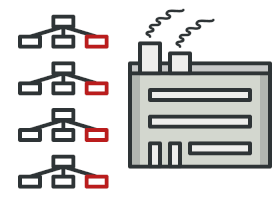
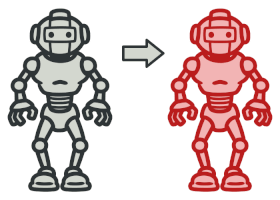
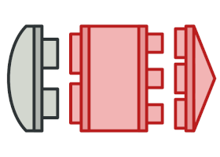
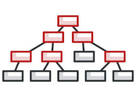
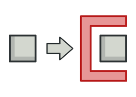
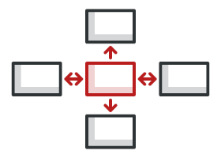
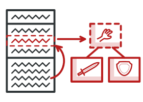
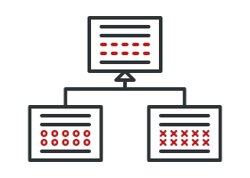

<div align="center">

# 🧩 Design Patterns — The Deep-Dive Notes

**All 22 Refactoring.Guru patterns, plus the 23rd GoF pattern (Interpreter), taught technical-first then in plain English, with code in C#, TypeScript, C++ and Java.**

[Start here](00-start-here/README.md) · [Creational](#-creational-patterns--how-objects-get-made) · [Structural](#-structural-patterns--how-objects-fit-together) · [Behavioral](#-behavioral-patterns--how-objects-talk) · [Which pattern do I need?](#-which-pattern-do-i-need) · [Extras](#-extras)

</div>

---

## 📖 What this is

A complete, self-contained study guide to software design patterns, written for engineers who work in **C# / .NET**, **JavaScript / TypeScript**, **SQL** and **RabbitMQ**, and who want to understand the patterns well enough to *use* them, not just recognise them.

Every pattern gets its own long-form file (≈1,600–3,200 lines each) that walks from theory → diagrams → official code → hand-built examples → real production usage → when **not** to use it. All diagrams are stored in this repo, so everything renders right here on GitHub.

> 💡 **New here?** Read [What is a design pattern?](00-start-here/01-what-is-a-pattern.md) first, then follow the [suggested study order](#-suggested-study-order) below.

---

## 🧭 How every pattern file is structured

Each file follows the same 7-part layout, so once you've read one you know where everything is in the others.

| Part | What's inside |
|---|---|
| **PART 1 — The pattern** | Intent · Problem · Solution · Real-world analogy · Structure (class diagram, participants and roles, who-calls-whom) · Pseudocode · Applicability · Step-by-step implementation · Pros and cons · Relations with other patterns. Every section has a 🗣️ **plain-English** restatement right after the technical version. |
| **PART 2 — Official code** | The complete Refactoring.Guru examples in **C#**, **TypeScript**, **C++** and **Java**, with complexity/popularity ratings and how to identify the pattern in code. |
| **PART 3 — Learn it by building it** | Original examples in all four languages, starting from "❌ before" code and refactoring step by step. Includes C++ ownership/lifetime gotchas and the JDK API you've already used without knowing it. |
| **PART 4 — Using it in your codebase** | Concrete applications for a **C# backend**, **TypeScript / Node**, **SQL / data access** and **RabbitMQ / messaging**, plus a refactor you could try this week. |
| **PART 5 — Anti-patterns** | When **not** to use it, specific smells of misuse, and a one-question over-engineering test. |
| **PART 6 — Famous real-world uses** | Where the pattern lives in .NET, the JDK, the C++ ecosystem and JS/TS frameworks. |
| **PART 7 — Extras** | Mnemonic · interview Q&A · self-test · further reading · what to read next. |

---

## 🏗️ Creational patterns — how objects get made

*These patterns give you flexible ways to create objects, so your code isn't welded to concrete classes.*

| | Pattern | In one line |
|:---:|---|---|
|  | **[Factory Method](01-creational/01-factory-method.md)** | Let subclasses decide which concrete class to create, behind an overridable `create()` method. |
|  | **[Abstract Factory](01-creational/02-abstract-factory.md)** | Create whole *families* of related objects that are guaranteed to match each other. |
|  | **[Builder](01-creational/03-builder.md)** | Build a complex object step by step instead of through a monstrous constructor. |
|  | **[Prototype](01-creational/04-prototype.md)** | Make new objects by cloning an existing, configured one. |
|  | **[Singleton](01-creational/05-singleton.md)** | Guarantee one instance with a global access point, and learn why your DI container usually does it better. |

## 🧱 Structural patterns — how objects fit together

*These patterns assemble objects and classes into larger structures while keeping them flexible.*

| | Pattern | In one line |
|:---:|---|---|
|  | **[Adapter](02-structural/01-adapter.md)** | Wrap an incompatible interface so it fits the one your code expects. |
|  | **[Bridge](02-structural/02-bridge.md)** | Split two independent axes of variation so 3 × 4 subclasses become 3 + 4 classes. |
|  | **[Composite](02-structural/03-composite.md)** | Treat trees of objects and single objects through one interface. |
|  | **[Decorator](02-structural/04-decorator.md)** | Add behaviour (caching, retry, logging) by wrapping, not by editing or subclassing. |
|  | **[Facade](02-structural/05-facade.md)** | One simple front door to a complicated subsystem. |
|  | **[Flyweight](02-structural/06-flyweight.md)** | Share common immutable state to fit millions of objects in memory. |
|  | **[Proxy](02-structural/07-proxy.md)** | A stand-in that controls access: lazy loading, caching, auth, remote calls. |

## 🔀 Behavioral patterns — how objects talk

*These patterns are about algorithms and how responsibilities are divided between objects.*

| | Pattern | In one line |
|:---:|---|---|
|  | **[Chain of Responsibility](03-behavioral/01-chain-of-responsibility.md)** | Pass a request along a chain of handlers until one deals with it (think middleware). |
|  | **[Command](03-behavioral/02-command.md)** | Turn a request into an object you can queue, log, retry or undo. |
|  | **[Iterator](03-behavioral/03-iterator.md)** | Walk a collection without exposing how it's stored. |
|  | **[Mediator](03-behavioral/04-mediator.md)** | Components talk through one hub instead of to each other. |
|  | **[Memento](03-behavioral/05-memento.md)** | Snapshot and restore state without breaking encapsulation (undo). |
|  | **[Observer](03-behavioral/06-observer.md)** | Publish once, notify every subscriber (C# `event`, `EventEmitter`, RabbitMQ fanout). |
|  | **[State](03-behavioral/07-state.md)** | An object changes behaviour when its internal state changes, without a giant `switch`. |
|  | **[Strategy](03-behavioral/08-strategy.md)** | Swap interchangeable algorithms behind one interface. |
|  | **[Template Method](03-behavioral/09-template-method.md)** | The base class fixes the algorithm's skeleton; subclasses fill in the steps. |
|  | **[Visitor](03-behavioral/10-visitor.md)** | Add new operations to an object structure without changing its classes. |

> **Where's the 23rd?** The original *Gang of Four* book has 23 patterns. Refactoring.Guru covers 22; **Interpreter** is covered here as a [bonus chapter](04-extras/05-interpreter-bonus.md), with a full rule-engine example in TypeScript and C#.

---

## 🎯 Suggested study order

Not alphabetical. This order follows how soon a C# / TypeScript backend engineer will actually use each pattern, and how much each one unlocks the next.

| # | Pattern | Why it's here |
|---|---|---|
| 1 | [Strategy](03-behavioral/08-strategy.md) | "Pass an interface instead of writing an `if`" — makes the other behavioral patterns obvious. |
| 2 | [Factory Method](01-creational/01-factory-method.md) | Once you swap behaviour you need to *choose* which implementation to build; it's the spine of every DI container. |
| 3 | [Observer](03-behavioral/06-observer.md) | You already use it: C# `event`, Node `EventEmitter`, RxJS, RabbitMQ exchanges. |
| 4 | [Adapter](02-structural/01-adapter.md) | The pattern you write most often without naming it — wrapping SDKs and legacy APIs. |
| 5 | [Decorator](02-structural/04-decorator.md) | Caching, retry, logging, metrics. Middleware is decorators in a trench coat. |
| 6 | [Singleton](01-creational/05-singleton.md) | Learn it early so you learn why you almost never hand-write it. |
| 7 | [Builder](01-creational/03-builder.md) | The cure for 11-parameter constructors; how every fluent API is shaped. |
| 8 | [Command](03-behavioral/02-command.md) | "Do the thing" as an object — exactly what a queue message is. |
| 9 | [Template Method](03-behavioral/09-template-method.md) | Strategy's inheritance-flavoured cousin; base classes for jobs and importers. |
| 10 | [Facade](02-structural/05-facade.md) | Stops a messy subsystem leaking into forty call sites. |
| 11 | [State](03-behavioral/07-state.md) | Listings, orders and leads have lifecycles — stop modelling them with `switch`. |
| 12 | [Proxy](02-structural/07-proxy.md) | Lazy loading, access control, generated API clients. |
| 13 | [Composite](02-structural/03-composite.md) | Categories inside categories, filter groups inside filter groups. |
| 14 | [Iterator](03-behavioral/03-iterator.md) | `IEnumerable`, `yield return`, generators — learn to implement, not just consume. |
| 15 | [Chain of Responsibility](03-behavioral/01-chain-of-responsibility.md) | Validation, request and approval pipelines. |
| 16 | [Mediator](03-behavioral/04-mediator.md) | Untangles components that all talk to each other; MediatR made it standard in .NET. |
| 17 | [Abstract Factory](01-creational/02-abstract-factory.md) | Factory Method's big sibling, for matched families. |
| 18 | [Bridge](02-structural/02-bridge.md) | For when two independent axes are about to cause a class explosion. |
| 19 | [Memento](03-behavioral/05-memento.md) | Undo, snapshots, "restore the draft". |
| 20 | [Flyweight](02-structural/06-flyweight.md) | Pure memory optimisation — apply rarely, and with a profiler open. |
| 21 | [Prototype](01-creational/04-prototype.md) | Cloning; matters most in C++ and deep-copy-heavy code. |
| 22 | [Visitor](03-behavioral/10-visitor.md) | The hardest to love, but the right answer for parsers, linters and AST walkers. |

**Only have time for five?** Strategy, Factory Method, Observer, Adapter, Decorator. The [start-here guide](00-start-here/README.md#-if-you-only-learn-five-learn-these) has a mini-lesson on each.

---

## 🔎 Which pattern do I need?

Find your complaint on the left.

| My complaint | Probably want |
|---|---|
| "My constructor has 11 parameters and half are optional." | [Builder](01-creational/03-builder.md) |
| "A `switch` on a string picks which calculation to run, and it keeps growing." | [Strategy](03-behavioral/08-strategy.md) |
| "A `switch` on a *status column* is repeated in every method." | [State](03-behavioral/07-state.md) |
| "Every new payment provider means editing five `if` blocks to build the right client." | [Factory Method](01-creational/01-factory-method.md) |
| "We need a *matched set* of objects (same region / tenant / theme) and they keep getting mixed up." | [Abstract Factory](01-creational/02-abstract-factory.md) |
| "This third-party SDK has a horrible interface and it's imported in 30 files." | [Adapter](02-structural/01-adapter.md) |
| "I want logging, retries, caching and metrics around a service that's already 400 lines." | [Decorator](02-structural/04-decorator.md) |
| "Calling this subsystem takes six steps in the right order and everyone gets it wrong." | [Facade](02-structural/05-facade.md) |
| "Twelve components need to know when a listing is published." | [Observer](03-behavioral/06-observer.md) |
| "Every component talks to every other component." | [Mediator](03-behavioral/04-mediator.md) |
| "The user wants an undo button." | [Memento](03-behavioral/05-memento.md) |
| "I need to queue this operation, retry it, and log exactly what was requested." | [Command](03-behavioral/02-command.md) |
| "Validation is one giant method and I can't reorder or skip a rule." | [Chain of Responsibility](03-behavioral/01-chain-of-responsibility.md) |
| "Three importers are 90% identical and the 90% keeps drifting apart." | [Template Method](03-behavioral/09-template-method.md) |
| "Loading this entity always drags in a 4 MB blob we rarely read." | [Proxy](02-structural/07-proxy.md) |
| "Categories contain categories, and my code is full of `if (isLeaf)`." | [Composite](02-structural/03-composite.md) |
| "I want to loop over this without loading the whole result set into memory." | [Iterator](03-behavioral/03-iterator.md) |
| "We hold two million tiny objects and keep hitting memory limits." | [Flyweight](02-structural/06-flyweight.md) |
| "Building this object is expensive but I need many near-identical copies." | [Prototype](01-creational/04-prototype.md) |
| "Config must be loaded exactly once for the whole process." | [Singleton](01-creational/05-singleton.md) |
| "Every new report over our object tree means editing every node class." | [Visitor](03-behavioral/10-visitor.md) |
| "3 renderers × 4 device types — I'm about to write 12 subclasses." | [Bridge](02-structural/02-bridge.md) |
| "I need to evaluate user-written filters like `price < 5L AND fuel = diesel`." | [Interpreter](04-extras/05-interpreter-bonus.md) |

If two rows fit, read **PART 5** of both files. The "when not to use it" section usually settles it.

---

## 📚 Extras

| File | What it covers |
|---|---|
| [What is a design pattern?](00-start-here/01-what-is-a-pattern.md) | Patterns vs algorithms, history (Alexander → Gang of Four), the three categories, levels of abstraction. |
| [Criticism and cautions](00-start-here/02-criticism-and-cautions.md) | When patterns go wrong, which modern C#/TS language features replace them, and how to push back on over-engineering. |
| [SOLID and principles](04-extras/01-solid-and-principles.md) | All five SOLID principles with bad → good code in C# and TS, plus composition over inheritance, DRY/KISS/YAGNI, and which patterns embody which principle. |
| [Pattern relationships map](04-extras/02-pattern-relationships-map.md) | Every "often confused with" pair (Strategy vs State, Adapter vs Decorator vs Proxy…) and patterns that commonly appear together. |
| [Your-stack playbook](04-extras/03-your-stack-playbook.md) | Patterns organised by technology: what .NET, Node, SQL and RabbitMQ already give you, a 30/60/90-day learning plan, and a code-review checklist. |
| [Interview cheatsheet](04-extras/04-interview-cheatsheet.md) | One-page summary of all 22 patterns, classic comparison questions, a "name that pattern" quiz, and flashcards. |
| [Interpreter (bonus)](04-extras/05-interpreter-bonus.md) | The 23rd GoF pattern, with a complete rule-engine example in TypeScript and C#. |

---

## 🗂️ Repository layout

```
design-patterns/
├── README.md                  ← you are here
├── 00-start-here/             ← full index, theory, criticism
├── 01-creational/             ← 5 patterns
├── 02-structural/             ← 7 patterns
├── 03-behavioral/             ← 10 patterns
├── 04-extras/                 ← SOLID, relationships, stack playbook, cheatsheet, Interpreter
└── assets/                    ← every diagram, stored locally
```

---

## 🙏 Credits

**Part 1 and Part 2 of every pattern file** — the explanations, diagrams, illustrations, pseudocode and official code examples — come from **[Refactoring.Guru](https://refactoring.guru/design-patterns/catalog)** by Alexander Shvets. It's an excellent free resource; if this guide helps you, consider [supporting them](https://refactoring.guru/design-patterns/book).

Parts 3–7, the plain-English explanations, and all extras chapters were written for this guide.
